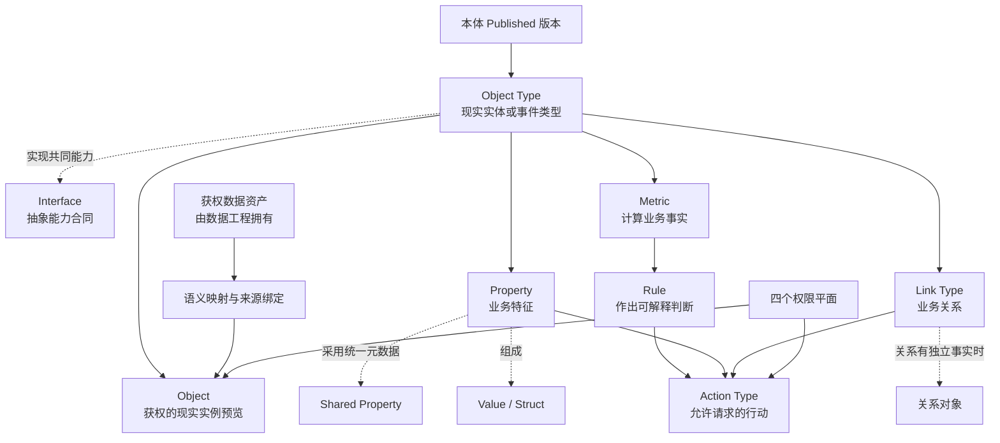
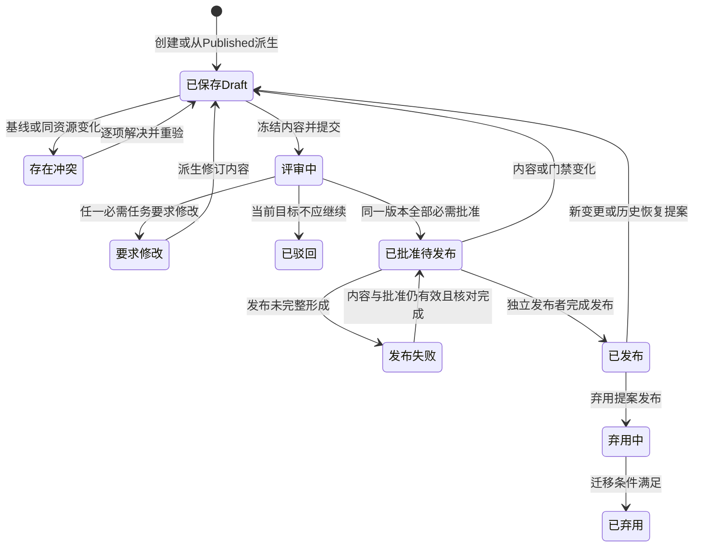
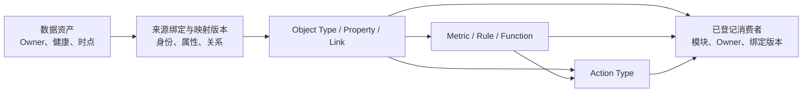
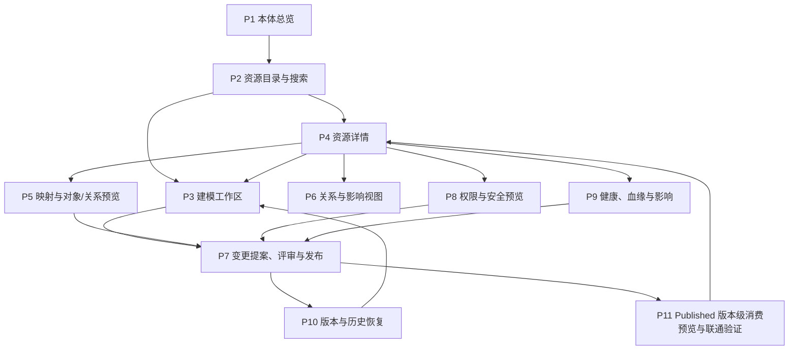

# 新项目功能设计：阶段 1 本体管理

> 版本：v0.1（报告语义证据与 Published 消费合同增量修订稿）  
> 文档状态：本轮报告语义证据合同已增量修订并完成独立 Critic 复核，待用户评审；正式评审仍受数据工程合同、ON-X-006 和 Q013 等未决项约束  
> 当前范围：只详细设计“本体管理”；数据工程、智能问数、决策中心、Agent 应用和报告中心只定义资源交换、依赖和禁止越界  
> 数据工程依赖基线：《新项目功能设计-阶段2数据工程-v0.1.md》，文件标示版本 v0.1（本轮修订稿），本体窗口末次读取日期 2026-08-10；该文档尚未获得总控登记或用户正式评审结论  
> 一期目标：单一演示账号最终贯通“数据资产可用—融资建模—映射—问数—规则—行动提醒—人工确认—负责人待办”；本轮只把本体侧可独立确认的功能和当前推荐依赖设计完整  
> Palantir 官方资料检索日期：2026-08-09  
> 交付性质：功能设计，不是技术方案、实施计划或能力已上线证明

## 0. 阅读约定与结论摘要

### 0.1 事实、设计、阶段与示意标签

本文严格区分以下十一类内容。一个小节开头标注后，未另行标注的段落和表格均继承该标签；同一表格混合多类内容时，逐行标注。

| 标签 | 含义 | 使用限制 |
|---|---|---|
| `[Palantir官方事实]` | 2026-08-09 检索到的 Palantir 官方英文文档所明确陈述的行为或原则 | 只证明公开文档中的事实，不代表本项目兼容、等价或已经具备 |
| `[Palantir课程附件事实]` | 用户提供的两份 Palantir Learn 课程材料中可直接核对的课程流程、概念说明和界面截图 | 只作为实践参考；不等同于官方最新产品承诺，也不要求本项目照抄 |
| `[原项目事实]` | 原项目最终追溯、最终裁决或可核验产物中明确记录的事实 | 只能作为经验、候选或反例，不能因“已经做过”而继承 |
| `[本项目设计]` | 针对本项目目标独立作出的功能决定 | 是本次待评审方案，不是已实现事实 |
| `[一期最小实现]` | 为完整功能雏形和系统演示必须建设的能力 | 对一期范围、页面、状态、流程和验收具有最高解释权 |
| `[一期演示假设]` | 为在一期内走通全流程而采用的简化前提 | 默认采用；不代表生产治理目标，也不得推导出多角色能力 |
| `[后期建设]` | 一期闭环稳定后再建设的生产级增强能力 | 保留为目标蓝图，不得作为一期发布或演示门禁 |
| `[待确认]` | 证据不足或需业务授权方选择的事项 | 未确认前采用文中明确写出的临时基线，不得静默补齐 |
| `[待数据工程确认][ON-DE-nnn]` | 依赖数据资产、字段、粒度、版本、数据截至时间、质量、刷新、消费就绪或失败回退的并行设计假设 | 不是用户裁决或正式合同；只可按编号引用推荐方案，待数据工程确认后逐项对账收敛 |
| `[跨模块待定][ON-X-nnn]` | 非数据工程的资源 Owner、跨模块消费或场景资料仍未裁决 | 不得替相邻模块作内部决定；按编号记录建议 Owner、目标合同和影响 |
| `[示意]` | 用于解释规则的虚构例子 | 不代表真实行业、真实数据、真实组织或真实能力 |

**阶段解释规则：** 第 0.2、1.4、2.1、4.2、10.0、14.0、15、16.0、18 和 21 章中的阶段矩阵，对全文具有优先解释权。后文出现“必须”“阻断”“评审”“权限”“恢复”等表述时，若阶段矩阵标为 `[后期建设]`，该表述只约束后期目标态，不构成一期门禁。后续模块开始设计时沿用同一组阶段标签和解释规则，但本文不提前展开其内部设计。

### 0.2 一页结论

`[本项目设计]`

**一句话定位：** 本体管理把数据资产组织为面向真实业务实体、属性、关系、指标与行动的共享业务定义；一期先让一个账号把核心链路完整走通，后期再补齐生产级治理、安全和协作。

| 阶段 | 首要目标 | 核心能力 | 暂不作为门禁 |
|---|---|---|---|
| `[一期最小实现]` | 形成可演示的完整功能雏形；当前先让 S001 使用一个账号贯通本体构建和跨模块验证，S002—S004 待业务资料补齐后仍须在一期最终验收前完成 | 本体目录；融资主体、融资明细、融资机构、融资负责人四类 Object Type 及三条 Link；稳定身份、可读标题和最小业务术语；选择“融资标准化数据资产”版本包及不同粒度成员，完成映射与对象/关系预览；按 `[跨模块待定][ON-X-001]` 推荐方案配置七个融资 Metric、三条 Rule 与“发起融资优化建议”Action Type；统一发布前校验；P4 五页签资源级消费预览；一键发布；P11 四消费视角的 Published 版本级预览与真实联通验证；按 `[待数据工程确认][ON-DE-006]` 与 `[已裁决][D034]` 显示双版本消费证据；为报告伴读与数据核验保留可由稳定标识和精确 Published 版本重新定位的只读语义证据；智能问数和决策中心完成 S001 闭环 | 登录认证、多账号、角色切换、权限策略、职责分离、审批治理、多来源裁决、完整健康血缘、事故隔离、通用历史比较与恢复、弃用迁移工作流、复杂 Function、复杂规则编排、开放语义标准专家工具和直接修改融资事实的 Action；不得虚构 S002—S004 的对象、指标、规则或数据 |
| `[后期建设]` | 从演示雏形演进为可多人协作、可审计、可安全运营的企业级本体治理能力 | 七类职责、四权限平面、Draft/提案/批准/发布、专业评审、健康血缘、影响分析、消费者治理、历史恢复、弃用迁移、Shared Property、Interface、关系对象、复杂 Metric/Rule/Function/Action | 不反向扩大一期范围；按真实业务域和监管要求分批纳入 |

一期遵循六条原则：

1. **单账号到底。** `[一期演示假设]` 预置一个演示账号，默认拥有全部一期操作能力；流程中不出现登录、切换角色、申请权限、邀请评审或代入身份。
2. **先通再强。** 先打通“数据工程提供可选择的数据资产—创建融资本体—映射数据—预览对象和关系—发布—刷新并形成可消费结果—智能问数—规则命中—行动提醒—人工确认—负责人待办”；数据资产与刷新环节按 ON-DE 待定，高级治理不能阻断一期演示。
3. **业务语义优先。** 即使是演示，也不按表机械建模；Object Type、Property 和 Link 必须有业务名称、定义和用途。
4. **最小但真实。** 演示者必须在数据工程中实际上传工作簿并形成数据资产版本；预览、映射校验、发布、语义刷新和下游读取必须产生真实可判断结果，不能用预置成功记录、静态页面或禁用按钮替代。
5. **状态简化但诚实。** 语义定义保留“编辑中、可预览、已发布、发布失败”及表单错误；P4/P11 另外诚实显示候选、等待绑定、消费就绪、验证失败、陈旧和依赖待定，且三条状态轴不得合并。未实现的治理状态不伪装存在。
6. **后期蓝图不丢失。** 完整权限、安全、评审、健康、恢复和审计继续在本文中定义，但全部明确属于后期建设。

### 0.3 成功结果与失败判据

`[本项目设计]`

| 一期可观察的成功结果 | 失败判据 |
|---|---|
| `[待数据工程确认][ON-DE-001][ON-DE-004][ON-DE-005]` 同一账号在数据工程中上传《融资一览表_一期演示数据.xlsx》后，本体管理能选择一个带成员清单、字段/粒度、数据截至时间、质量摘要和版本证据的数据资产版本 | 依赖后台预置资产、上传只保存文件而不形成资产，或本体把质量失败/未发布候选当作可绑定资产；数据工程合同未确认前不将此项记为已具备 |
| 同一账号能创建融资主体、融资明细、融资机构、融资负责人四类 Object Type、必要 Property 和三条 Link，并在关系图中看见正确连接 | 必须换账号、换角色或等待审批才能继续，或只把融资明细表机械建成一个对象 |
| 每个 Object Type 有业务名称、定义、稳定身份、可读标题和单一数据来源，Property 不按源字段全量照搬 | 只能依靠表名、字段名或口头解释模型 |
| 映射工作台能显示对象与关系预览，并明确指出身份缺失/重复、必填字段缺失、映射不完整和关系端点不匹配 | 静态样例冒充真实映射结果，或错误存在仍显示可发布 |
| 统一发布前校验能从一张结果中定位 Object Type、身份、Property 映射、Link 端点、Metric 合同、Rule 合同和 Action Type 合同问题，并提供代表性失败对象与修正入口 | 只校验字段是否填写，或身份缺失、关系不匹配、Metric 无范围/时间/零分母处理、Rule 无阈值/样例、Action Type 无确认要求仍可发布 |
| “融资主体”P4 能用五个页签集中回答定义、身份、属性与关系、业务逻辑与行动、数据与映射及向下游提供什么；P11 能按智能问数、决策中心、Agent 应用、报告中心切换 Published 版本级消费视角 | 配置散落且无法回答资源全貌；P4/P11 把 ON-DE/ON-X 未决项显示为已就绪；消费预览会真正创建提醒或待办；或四个视角复制相邻模块内部页面 |
| 同一账号能保存并一键发布，失败时旧 Published 结果保持可识别，修正后可重试 | 发布按钮无真实结果，或失败后无法判断当前正式版本 |
| `[待数据工程确认][ON-DE-006][ON-DE-007]` `[跨模块待定][ON-X-001]` `[已裁决][D034]` 智能问数能读取同一精确 Published 语义版本和本体管理提交的权威数据绑定，分别解释三家不同单位命中的 R01/R02/R03，按 Rule 证据指出前三家优先协商银行及关联借据，并能回答任意所选 2 家或 3 家单位的组合余额加权融资成本 | 读取正在更新、质量失败或尚未完成本体刷新的版本；只能查源字段；三条 Rule 共用一家单位；把单位成本简单平均；由 Agent 临时猜测协商银行；或回答无法指出所选单位、数据截至时间、数据资产版本和本体版本 |
| `[跨模块待定][ON-X-001]` `[已裁决][D036][D038]` 三家单位分别提交引用已发布 Action Type 的标准 Action Request 后，在决策中心出现三条含优先协商银行与关联借据的待确认提醒；同一演示账号确认后按各自“融资主体—负责人”关系形成三条待办 | 跨单位合并提醒、丢失银行归因证据、Action 直接修改融资事实、绕过标准 Action Request 或无需人工确认，或任一待办找不到对应负责人 |
| `[跨模块待定][ON-X-006]` `[待数据工程确认][ON-DE-011]` 报告生成证据包可按报告稳定锚点、语义资源稳定标识和报告生成时的精确 Published 版本重新定位 Object Type、对象实例或对象集合、Property、Link、Metric、Rule 及必要 Action Type 定义；旧正式报告在资源升级、弃用或替代后仍引用原定义 | 只保存显示名称或“当前版本”；用当前定义替换历史定义；历史数据不可访问时改用当前/上一可信数据冒充重放；或报告中心、Agent 应用创建、修改、重算、重新解释语义资源 |
| 未建设的权限、审批、健康、恢复等能力被明确标为后期，不出现半成品入口 | 页面出现角色切换、审批等不可用入口，给演示者造成流程中断 |

## 1. 产品定位、资源所有权与范围边界

### 1.1 为什么需要本体管理

`[Palantir官方事实]` [Ontology overview](https://www.palantir.com/docs/foundry/ontology/overview) 将 Ontology 描述为数字资产之上的组织“操作层”，同时包含 object、property、link 等语义元素和 action、function、dynamic security 等行动元素；[Ontology design: Best practices](https://www.palantir.com/docs/foundry/ontology/ontology-best-practices) 要求“model reality, not systems”，即按现实业务而不是源系统结构建模。

`[本项目设计]` 本项目借鉴“现实业务 + 受控行动”的原则，但不复制 Palantir 的品牌、页面、专有产品组合或实现方式。本体管理不是数据目录、字段字典、只读关系图，也不是下游应用的替代物。它解决四个平台级业务问题：

- 同一现实概念在不同来源和消费情境中是否仍指向同一件事；
- 决策使用的属性、关系、口径、规则和时间是否可解释；
- 人或 Agent 可以执行什么业务行动，为什么此刻可执行或被阻断；
- 定义发生变化时，谁审查、影响谁、何时生效、如何恢复并留下什么证据。

### 1.2 本模块拥有、引用与明确不拥有的资源

`[本项目设计]`

| 资源边界 | 资源或责任 | 本体管理承担的功能责任 | 明确不承担 |
|---|---|---|---|
| 拥有 | 本体、业务域说明及 Published 版本 | 统一目录、稳定身份、版本状态、Owner、可发现性、变更与历史 | 不拥有业务部门本身，也不替代治理授权 |
| 拥有 | Object Type、Property、Shared Property、Value/Struct、Link Type、关系对象、Interface | 定义业务含义、约束、关系、复用、弃用和兼容影响 | 不把源表、字段或接口响应原样复制为业务模型 |
| `[跨模块待定][ON-X-001]` 推荐由本体管理拥有 | Metric、Rule 的业务合同 | 按 Q013 推荐方案统一口径、适用范围、时间、输入输出、依赖、权限和版本 | Q013 未裁决前不得把本体管理写成既定唯一 Owner；不在消费模块复制公式或阈值 |
| `[跨模块待定][ON-X-001]` 推荐由本体管理拥有 | Action Type 的业务合同 | 按 Q013 推荐方案定义业务意图、参数、前置条件、校验、确认、效果、权限、失败、纠正和审计 | Q013 未裁决前不得把本体管理写成既定唯一 Owner；不设计 Agent 应用，也不允许 Function 绕开 Action 改变业务状态 |
| `[后期建设]` 本体目标资源 | Function 的业务合同 | 定义复用逻辑的输入、输出、依赖、权限和失败边界；只读逻辑不得绕过 Action | 一期不建设；不在本文决定运行环境或相邻模块内部实现 |
| 拥有 | 语义映射、来源绑定与对象/关系预览合同 | 选择获权数据资产，定义身份、字段到属性、关系端点及多来源裁决，验证预览 | 不采集、清洗、加工、调度、回放或修复上游数据 |
| `[已裁决][D034]` 拥有 | 权威消费绑定 | 唯一持有并原子提交 `(精确 Published 语义版本, 可消费数据版本)` 组合，记录上一可信组合、数据截至时间和切换证据 | 数据工程只请求刷新，智能问数、决策中心、Agent 应用和报告中心只读；任何模块均不得另存冲突指针 |
| 拥有 | 变更提案、评审结论、Published 版本、弃用与恢复提案 | 隔离修改、差异比较、门禁、逐项评审、发布、历史和恢复证据 | 不直接改写已发布版本，不把恢复伪装成无审查回滚 |
| 共同治理、由本模块呈现 | 资源策略、对象范围、属性可见性、执行资格 | 让四个权限平面可配置、可解释、可预览、可审查 | 不因能编辑定义而自动授予数据或执行权限 |
| `[待数据工程确认][ON-DE-001][ON-DE-004][ON-DE-005][ON-DE-006]` 引用 | 数据资产、成员/字段/粒度、质量摘要、数据截至时间、刷新请求与结果 | 展示数据工程提供的引用和状态，并据此形成映射校验、候选刷新与问题移交；确切字段和状态枚举待对账 | 不拥有数据质量检查的生产、数据资产版本或上游恢复 |
| 引用 | 下游消费者、绑定版本、消费验证结果 | 展示谁依赖哪个版本、验证结论和变更影响 | 不设计其他模块内部页面、流程或结果表现 |
| 仅验证，不作为主数据维护入口 | Object 实例 | 按身份、标题、属性、关系、权限和时点提供代表性预览 | 不在本体管理中提供任意实例编辑或业务操作工作台 |

### 1.3 能力地图

`[本项目设计]`

`[后期建设]` 这是一条目标态业务闭环，不是固定的线性向导。用户可以从现有资源、数据资产或变更问题进入，但提交评审前必须补齐所有门禁信息。一期按第 1.4 节最小演示闭环执行。

### 1.4 一期最小演示闭环

`[一期最小实现]` 一期只证明核心业务链路已经联通，不以生产治理完备为完成条件。

一期本体管理已确认拥有 Object Type、Property、Link Type、来源绑定、映射、Published 语义版本和权威消费绑定。`[跨模块待定][ON-X-001]` Metric、Rule、Action Type 暂按“由本体管理维护并随语义版本发布”的推荐方案继续设计，Q013 未裁决前不形成正式 Owner 结论。`[待数据工程确认][ON-DE-001][ON-DE-006]` 本体只选择数据工程发布的数据资产并读取刷新结果，不拥有上传、处理、质量、资产版本或自动同步；`[已裁决][D034]` 候选通过必要门禁后，由本体管理唯一原子提交权威消费绑定，其他模块只读。智能问数 Agent 配置归属已由 D022 确认；`[已裁决][D036][D038]` Action Request、提醒、人工确认和待办运行记录由决策中心拥有，Rule、智能问数、Agent 应用和报告中心均只能通过引用已发布 Action Type 的标准 Action Request 发起。本体管理不承担问答表现、提醒页面或待办流程。

链路中的三类业务逻辑不得混同：Metric 计算业务事实，Rule 引用 Metric 或对象事实作出可解释判断，Action Type 只定义命中后允许请求的行动。Rule 命中只形成行动候选，不得自动创建提醒或待办；真实运行必须依次形成 Action 请求、决策提醒、人工确认和负责人待办。公式、阈值、机构归因与银行排序只维护一份权威定义，不复制到智能问数系统提示词或 Skill。

`[后期建设]` 第 1.2—1.3 节中与多来源、复杂逻辑、权限、提案、历史、恢复、处置和消费者迁移相关的责任，是目标态能力蓝图。

### 1.5 一期演示业务场景：集团融资成本与债务结构优化

`[一期最小实现]` `[一期演示假设]` 一期固定使用用户指定的《融资一览表脱敏版.xlsx》生成并已交付的《融资一览表_一期演示数据.xlsx》。`[附件核验事实]` 当前工作簿包含 5,218 条融资明细、574 个演示单位、24 家演示金融机构和 574 条单位—负责人映射；三家 Rule 演示主体、2 家/3 家组合成本和机构归因样例均可定位。金额和名称仅用于系统演示，不能用于真实融资判断。

`[待数据工程确认][ON-DE-001][ON-DE-002][ON-DE-004][ON-DE-005]` 一期演示仍须证明该工作簿由演示者实际上传并形成可选择的数据资产版本；本体只能消费资产版本提供的成员清单、稳定身份字段、粒度、数据截至时间和质量摘要。当前工作簿事实不能代替上传、标准化、质量或资产发布合同已经确认，也不能作为本体直接读取工作簿的依据。

`[待数据工程确认][ON-DE-001][ON-DE-007]` 一期推荐把这些输入组织为一个逻辑“融资标准化数据资产”版本包，而不是一张万能表或四个 Object Type 各自绑定独立版本：融资明细成员支持融资明细及主体—明细关系，单位—负责人成员支持融资主体、融资负责人及主体—负责人关系，金融机构参考成员支持融资机构及明细—机构关系。三个成员共享同一数据截至时间、同一轮质量与发布证据、一次候选刷新和一套失败回退；成员、字段、粒度、稳定身份和刷新合同仍由 ON-DE 对账，不由本体窗口裁决。后期若来源系统、Owner 或更新周期确实不同，可拆分资产来源而保持 Object Type 稳定，仅调整来源映射。

`[已生效裁决 D007]` 产业板块只做标签标准化，不合并融资主体、不修改演示单位名称、不改变贷款归属和统计粒度。当前工作簿已保存标准化后的 10 个有效展示值；以下六组只说明旧标签到标准标签的业务含义，不表示本体管理负责清洗或重写源数据：

| 原演示值 | 一期展示值 |
|---|---|
| 产业金融-司库、产业金融-资本控股 | 产业金融 |
| 非动力核技术 | 核技术 |
| 核服集团 | 产业服务 |
| 科技型环保 | 环保产业 |
| 能源国际 | 境外新能源 |
| 新能源控股 | 境内新能源 |

当前 10 个有效展示值为：产业金融、核技术、产业服务、环保产业、境外新能源、境内新能源，以及保持原值的核能、核燃料、集团及直管公司、数字化。`[待数据工程确认][ON-DE-003]` 当前推荐由数据工程在资产发布前保证这 10 个值及旧标签无残留，本体将“所属板块”映射为融资主体 Property 并校验可解释性；最终由数据工程确认值域、异常表现和是否允许新增值。本体不得借板块映射合并任何融资主体。

#### A. 一期业务对象与关系

| 资源 | 为什么是业务对象 | 当前数据资产成员假设 | 稳定身份与标题 | 一期必要 Property 与边界 |
|---|---|---|---|---|
| 融资主体 | 独立承担融资余额、成本、结构判断和优化行动的现实主体 | `[待数据工程确认][ON-DE-001][ON-DE-002]` 以“单位—负责人”成员作为主体实例主要来源；“融资明细”成员只通过稳定单位编码引用主体并支持主体—明细关系，不另造主体；一主体不能因板块标签相同而合并 | 单位编码；标题为演示单位名称 | 所属板块；当前 D007 只改变标签，不改变身份或统计粒度 |
| 融资明细 | 一笔具有借据身份、余额、成本、期限和机构归属的融资事实 | `[待数据工程确认][ON-DE-001][ON-DE-002]` “融资明细”成员，一行一笔借据 | 唯一借据编号；标题为借据编号 | 境内外、提款/到期日、币种、汇率、原币余额、人民币余额、当前利率、利率形式、融资类型、期限种类、担保方式；工作簿其余字段不因存在就自动成为 Property |
| 融资机构 | 可被多笔融资共同引用、可汇总问题余额并作为协商对象的现实机构 | `[待数据工程确认][ON-DE-001][ON-DE-002]` “金融机构参考”成员；当前工作簿只有机构名称和类别，数据工程草案假设输出稳定机构编码 | 显式稳定机构编码；标题为明确标注“演示”的机构名称 | 机构类别；不得以机构名称本身代替长期身份，机构关系缺失时不得生成协商排名 |
| 融资负责人 | 可承接多个主体优化待办的业务责任实体，不等同于登录账号、角色或权限主体 | `[待数据工程确认][ON-DE-001][ON-DE-002]` “单位—负责人”成员，一行一个主体—负责人关系 | 演示负责人标识；标题为演示负责人名称 | 一期不增加身份认证或组织权限属性；只向 Action 请求提供负责人关系证据 |

数据资产成员、工作表和 Object Type 不一一对应：数据工程草案中的三个成员可以支持四类 Object Type 和三条 Link；`Sheet1` 与“场景问数样例”只作人工核验参考，不得绑定为对象来源。当前工作簿的 35 个融资明细字段也不要求全部成为 Property。

| Link Type | 正向业务名称 | 反向业务名称 | 一期基数与校验 |
|---|---|---|---|
| 主体—融资明细 | 主体拥有融资 | 融资属于主体 | 一个主体可有多条融资；每条融资必须且只能属于一个主体 |
| 融资明细—融资机构 | 融资由机构提供 | 机构提供融资 | 一个机构可提供多条融资；每条融资必须对应一个且仅一个机构，机构缺失时不得形成协商建议 |
| 主体—融资负责人 | 主体由负责人承接优化待办 | 负责人承接主体优化待办 | 一个负责人可承接多个主体；一期每个主体必须对应一个负责人 |

`[待数据工程确认][ON-DE-002]` 三条 Link 的端点必须使用资产版本中的稳定编码匹配：主体—融资明细使用单位编码，融资明细—融资机构使用显式机构编码，主体—融资负责人使用单位编码与负责人标识。工作簿当前融资明细未直接包含单位编码或机构编码，因此不得把按名称临时关联写成已确认合同；数据工程确认后再锁定字段、覆盖率和不匹配恢复方式。

#### B. 一期融资指标包

`[跨模块待定][ON-X-001]` 以下按 Q013 推荐方案把 Metric 作为本体可发布语义资源继续设计；Owner 未裁决不影响核对口径和页面交互，但会阻断正式跨模块合同定版。指标能力只建设一次，以下七个实例共同验证融资成本和债务结构，不代表七套独立功能。所有比率在分母为零时显示“无法计算”，不得按 0% 处理。

| Metric | 一期口径 | 输出与解释 |
|---|---|---|
| 融资余额 | `Σ折合人民币余额` | 人民币元；用于规模和全部比率分母 |
| 余额加权平均融资成本 | `Σ(折合人民币余额 × 当前利率) ÷ Σ折合人民币余额` | 百分比；一期明确不用各借据利率的简单算术平均 |
| 浮动利率余额占比 | `浮动利率融资人民币余额 ÷ 融资余额` | 百分比；解释利率重定价敏感度 |
| 短期债务余额占比 | `期限种类为“短期”的人民币余额 ÷ 融资余额` | 百分比；一期沿用源字段分类，后期再建设剩余期限分桶 |
| 外币融资余额占比 | `币种非人民币的人民币余额 ÷ 融资余额` | 百分比；仅展示汇率风险暴露，不在一期单独触发 Action |
| 高成本融资余额占比 | `当前利率高于演示样本 90 分位阈值的人民币余额 ÷ 融资余额` | 百分比；本演示阈值为 2.75%，随规则版本留痕 |
| 信用融资余额占比 | `担保方式明确为“信用”的人民币余额 ÷ 融资余额` | 百分比；缺失担保方式不得自动解释为信用 |

指标默认支持三种对象范围：集团全部融资主体、单一融资主体、用户明确选择的融资主体集合。选择 2 家或 3 家单位时，先按主体身份去重，再取得这些主体的融资明细并集，按 `Σ(所选明细折合人民币余额 × 当前利率) ÷ Σ所选明细折合人民币余额` 计算组合成本；不得对各单位已经算出的成本做简单平均。回答必须列出所选单位、合计余额、数据时点、口径和精确本体版本；单位不存在、重复或组合余额为零时分别解释，不得静默忽略、重复计权或回答为 0%。

集团结果用于组合基准和总览，显式选择的 2—3 家单位用于比较分析，Action 仍只对单一融资主体发起，不创建“组合单位”对象。演示数据的集团融资余额约 2.16 万亿元，余额加权融资成本约 2.37%，浮动利率余额占比约 95.15%；这些结果只用于核对演示链路，不成为规则阈值。

Rule 命中后使用同一融资明细集合生成机构归因证据，不新增一套 Agent 逻辑：R01 的高成本余额占比支路命中时按高成本融资余额归集；R02 按浮动利率融资余额归集；R03 按短期债务余额归集。分别按融资机构求和，计算该机构问题余额占单位全部问题余额的比例，按贡献降序、机构稳定身份升序打破并列，取前三家作为优先协商银行。回答同时显示机构问题余额、贡献占比、问题融资加权成本、涉及借据数和可下钻借据；问题余额为零或机构关系缺失时不返回空洞排名，而是说明无法归因。若 R01 仅由“单位成本高于集团基准”支路命中，即高成本余额占比未超过 20%，无论是否存在少量高成本借据，推荐一律按各机构正向增量利息成本 `Σ余额 × max(当前利率 - 集团基准 - 0.25 个百分点, 0)` 排序；两条 R01 支路同时命中时只使用高成本融资余额算法。当前演示同时命中两条支路，因此不进入增量成本分支；是否将该分支作为正式基线见总控 Q004，Agent 不得临时发明替代口径。

#### C. 一期 Rule 与 Action 闭环

`[跨模块待定][ON-X-001]` R01—R03 与 Action Type 暂按“本体管理维护定义”的推荐方案设计，Q013 仍待裁决；`[已裁决][D036][D038]` 标准 Action Request 及其后的提醒、人工确认和待办运行过程由决策中心拥有。Q001、Q002、Q004 仍是业务口径待裁决项，当前数值和 R01 排序分支均为推荐演示基线，不得写成生产规则已定版。

| 资源 | 一期最小合同 | 命中或执行结果 |
|---|---|---|
| R01 融资成本偏高 | 单位加权融资成本高于集团组合基准 0.25 个百分点，或单位高成本融资余额占比大于 20% | 形成融资成本优化候选，列出指标值、阈值、高成本融资贡献前三家银行和候选借据 |
| R02 浮动利率暴露 | 单位浮动利率余额占比大于 80% | 形成利率结构优化候选，按浮动利率余额贡献列出前三家银行和候选借据 |
| R03 短期债务集中 | 单位短期债务余额占比大于 30% | 形成期限结构优化候选，按短期债务余额贡献列出前三家银行和候选借据 |
| Action Type“发起融资优化建议” | 目标为融资主体；携带命中 Rule、指标快照、数据截至时间、优先协商银行、候选融资明细、建议方向和精确本体版本 | 在决策中心创建一条“待确认”提醒；不修改融资主体或融资明细事实 |
| 人工确认后的业务结果 | 同一演示账号确认或拒绝；确认时按“主体—负责人”关系取唯一负责人 | 确认后形成一条负责人待办；拒绝、缺负责人或创建失败均保留原因并允许修正后重试 |

一期固定使用三家不同单位分别验证一条 Rule，且三家在当前演示数据下均只命中其主规则：

| 主规则 | 演示单位与负责人 | 关键指标 | 选择理由 |
|---|---|---|---|
| R01 融资成本偏高 | 演示单位553；融资负责人001 | 75 条融资、余额约 393.13 亿元、加权成本约 2.881%、高成本余额占比约 77.337% | 成本和高成本占比越过 R01 阈值，浮动利率及短债占比均为 0%，仅命中 R01 |
| R02 浮动利率暴露 | 演示单位465；融资负责人009 | 176 条融资、余额 770.00 亿元、加权成本约 2.197%、浮动利率余额占比 100% | 成本及短债未越线，仅命中 R02 |
| R03 短期债务集中 | 演示单位561；融资负责人009 | 50 条融资、余额约 20.02 亿元、加权成本约 2.228%、短期债务余额占比约 93.545% | 成本及浮动利率未越线，仅命中 R03 |

当前固定演示数据的优先协商银行如下；排名和数值必须由已发布 Rule 证据重新计算，不得写入 Agent 提示词：

| 主规则与单位 | 第一优先 | 第二优先 | 第三优先 | 排序依据 |
|---|---|---|---|---|
| R01；演示单位553 | 演示欧陆银行；高成本融资约 99.59 亿元，占问题余额 32.754% | 演示寰宇银行；约 65.49 亿元，占 21.541% | 演示海联银行；约 58.48 亿元，占 19.233% | 高成本融资余额贡献 |
| R02；演示单位465 | 演示融通银行；浮动利率融资约 249.08 亿元，占问题余额 32.348% | 演示启明银行；约 237.76 亿元，占 30.878% | 演示嘉禾银行；约 221.53 亿元，占 28.770% | 浮动利率融资余额贡献 |
| R03；演示单位561 | 演示同州银行；短期债务约 5.05 亿元，占问题余额 26.955% | 演示星河银行；约 4.60 亿元，占 24.583% | 演示恒信银行；约 3.66 亿元，占 19.558% | 短期债务余额贡献 |

同一融资主体在同一数据截至时间、同一 Published 本体版本命中多条 Rule 时，合并为一条提醒并保留全部触发原因；不同融资主体始终分别创建提醒和待办，即使负责人相同也不得跨单位合并。同一键已有待确认或处理中记录时不得重复创建。Action 是否成功以决策中心返回提醒标识为准，待办是否成功以负责人、待办标识和状态回传为准，智能问数回答中的文字不能代替运行证据。

#### D. Metric、Rule、Action 与数据链路的最佳维护位置

`[跨模块待定][ON-X-001]` 下表“维护位置”是 Q013 的推荐方案，不是已确认唯一 Owner；若总控裁决不同，应通过 CR 调整页面入口和发布合同，不复制业务定义。

| 资源或配置 | 推荐维护位置与一期入口 | 一期规则 | 禁止做法 |
|---|---|---|---|
| Object Type、Property、Link、主体—负责人关系 | `本体管理 > 融资优化本体 > 资源目录`；从资源详情进入建模或映射 | 随 Published 语义版本一起发布；结构和来源绑定变更形成新版本 | 把对象关系复制到数据管道、提示词或决策页面中维护 |
| Metric | `本体管理 > 融资优化本体 > 业务逻辑与行动 > Metric`；也可从目标 Object Type 详情创建 | 维护业务问题、对象范围、分子/分母、筛选、时间、单位、数据依赖、预览和版本；第 1.5 节七个指标均是独立可发现资源 | 在 Python 模块、智能问数提示词或报表中另存同名公式 |
| Rule | `本体管理 > 融资优化本体 > 业务逻辑与行动 > Rule`；从同一 Draft 可一并发布或已 Published 的 Metric 选择依赖 | 维护条件、阈值、命中解释、机构归因与排序、有效期和测试样例；R01/R02/R03 与 Metric 同一语义版本发布 | 让 Agent 临时判断阈值，或在决策中心重新写一套规则 |
| Action Type | `本体管理 > 融资优化本体 > 业务逻辑与行动 > Action Type`；从目标 Object Type 或 Rule 详情创建 | 维护目标、输入、前置条件、确认要求、输出业务合同和去重键；一期效果仅为请求创建待确认提醒 | 在数据工程运行 Action，或把提醒、待办运行状态写回 Action 定义 |
| `[待数据工程确认][ON-DE-001][ON-DE-005][ON-DE-007]` 原始文件、Python 处理、数据质量、资产版本、自动同步 | 数据工程；具体页面只作为当前草案说明，不写入本体页面合同 | 数据工程提供可选择资产版本及质量/时点/版本证据；哪些状态可请求刷新待对账 | 在本体管理或智能问数内临时清洗、补数、随机化或改写源数据 |
| `[待数据工程确认][ON-DE-010]` `[已裁决][D026][D031][D034]` 智能问数 Agent 的系统提示词、问数 Skill、精确本体版本绑定、数据跟随策略、资源白名单和测试问题 | 按 D022 由智能问数维护，具体页面留待该模块设计 | 固定精确 Published 语义版本并跟随最新兼容且通过门禁的可消费数据；候选失败继续上一可信版本并警告；本体管理唯一提交权威绑定；请求 Action 时携带语义版本、数据资产版本和指标快照 | 在提示词或 Skill 中维护公式、阈值、负责人关系、银行排序或 Action 效果，或由智能问数维护冲突绑定 |
| `[已裁决][D036][D038]` Action Request、待确认提醒、人工确认/拒绝、负责人待办、运行状态与失败原因 | 由决策中心拥有；具体页面留待该模块设计 | 四类获准来源均提交引用已发布 Action Type 的标准 Action Request；确认后创建待办并回传请求/提醒/待办标识和状态 | 在本体管理维护运行状态，或未经人工确认直接推送任务 |

P3“业务逻辑与行动”工作区采用统一资源列表和三种编辑模式，而不是建立三个彼此孤立的子系统。Metric 编辑器先定义可复用度量；Rule 编辑器只能引用当前 Draft 中可一并发布或已 Published 的 Metric；Action Type 编辑器只能引用目标 Object Type、Rule 证据及允许输出。资源详情必须反向显示“被哪些 Rule、Action 和智能问数绑定使用”，使修改者在保存前看见影响。

智能问数侧三类配置不得混用：系统提示词只规定 Agent 的任务边界、回答证据和禁止行为；问数 Skill 规定如何发现已发布对象、调用 Metric/Rule 以及如何请求获准 Action；本体绑定明确精确 Published 语义版本、数据跟随策略和资源白名单。融资公式、阈值、负责人关系和 Action 效果均不属于前两者。

一期按 `[跨模块待定][ON-X-001]` 推荐方案采用以下最小维护流程：在本体管理修改 Metric/Rule/机构归因/Action Type → 用 R01/R02/R03 三家应命中单位、至少一家不应命中单位、一组优先协商银行问数及一组 2—3 家组合问数预览 → 发布新精确语义版本 → `[已裁决][D034]` 由本体管理在候选通过全部必要门禁后原子提交权威绑定，并在智能问数运行固定测试问题 → `[已裁决][D036][D038]` 重新提交三条标准 Action Request 并验证提醒与负责人待办闭环 → 将验证结果回传本体版本。任一步失败都保留上一可信绑定和失败证据，不能通过改提示词临时“修好”回答。

#### E. 从数据上传到智能问数的双版本合同

`[待数据工程确认][ON-DE-005][ON-DE-006][ON-DE-007]` “最新数据”不等于最后到达的文件。当前推荐为：候选数据资产通过数据工程发布与质量门、完成既有映射兼容检查、对象/关系刷新及按 ON-X-001 推荐方案执行的 Metric/Rule 评估后，才进入候选消费验证。确切状态、请求/结果字段和失败回退须待数据工程确认；确认前本文不得把“资产已发布、刷新成功、消费就绪”混为同一事实。

语义版本和数据版本必须分别显示：前者决定 Object、Property、Link 以及按 ON-X-001 推荐归属的 Metric、Rule、Action Type 定义，后者决定回答使用的事实快照。智能问数回答、Action 请求、决策提醒和待办证据都必须同时携带本体版本、数据资产版本和数据截至时间。更新数据不要求重新发布相同语义定义；改变字段语义、指标公式、规则阈值或 Action 合同才要求发布新的语义版本。

`[待数据工程确认][ON-DE-008]` 为降低问数等待，推荐在候选消费验证前准备集团和单一融资主体的常用 Metric、R01/R02/R03 命中结果及银行归因，并使任意 2—3 家组合成本可由已验证的余额与利息成本基础量汇总。这里只规定“消费就绪时应可快速读取”的功能结果，不决定预计算、存储或缓存实现。智能问数不直接读取工作簿，也不把 5,218 条明细塞入系统提示词；下钻借据时只读取当前获准双版本中的必要对象和关系。

智能问数和决策中心的具体配置页面、内部流程及角色设计留待各自模块文档；本文只记录 D022、D010 已确认的方向、ON-X 待定 Owner 和本体侧验收证据。

#### F. 推荐演示脚本与样例

以下数值来自当前固定随机种子的演示工作簿，只作为本轮演示基线；更换数据后必须由 Metric 重新计算，不能把样例答案写入智能问数提示词。

| 演示步骤 | 推荐操作或问题 | 预期业务证据 |
|---|---|---|
| 1. 取得候选数据资产 | `[待数据工程确认][ON-DE-001][ON-DE-004][ON-DE-005][ON-DE-009]` 在数据工程按其最终合同上传《融资一览表_一期演示数据.xlsx》，再从本体管理打开候选资产 | 本体实际读取包含 5,218 条明细的候选版本、成员、来源、数据截至时间和质量摘要；不把数据工程内部过程写成本体步骤 |
| 2. 发布融资本体 | `[跨模块待定][ON-X-001]` 选择候选资产，完成四类 Object Type、三条 Link、七个 Metric、三条 Rule 和一个 Action Type 的映射与候选发布 | 获得一个精确 Published 语义版本；`[待数据工程确认][ON-DE-006]` 刷新结果与语义发布状态分别显示；`[已裁决][D034]` 只有本体管理原子提交权威绑定后才显示“消费就绪” |
| 3. 验证集团口径 | 在智能问数询问“集团融资余额、余额加权平均融资成本和债务结构如何？” | 回答约 2.16 万亿元、2.37%、浮动利率占比 95.15%、短期债务占比 0.91%，并显示口径、数据时点、资产版本和本体版本 |
| 4. 分别验证三条 Rule | 依次询问单位553为何成本偏高、单位465有何利率结构风险、单位561有何期限结构风险 | 三家分别且仅命中 R01、R02、R03；回答显示关键指标、阈值、数据时点和双版本 |
| 5. 验证协商对象 | 依次询问“三个问题单位分别应优先找哪些银行协商，为什么？” | 智能问数按已发布 Rule 证据返回每个单位前三家银行、问题余额、贡献占比、问题融资加权成本、涉及借据数和关联借据；结果与上表一致 |
| 6. 验证组合问数 | 询问三家综合平均成本，再任选其中两家询问综合平均成本 | 智能问数按融资明细余额加权，并列出所选单位及合计余额；不采用单位成本简单平均 |
| 7. 验证数据更新 | `[待数据工程确认][ON-DE-006][ON-DE-007][ON-DE-009][ON-DE-010]` 按数据工程最终合同提供同结构候选版本，观察刷新与失败表现 | `[已裁决][D026][D031][D034]` 候选处理期间不混读；全部门禁通过后由本体管理原子提交绑定；失败时继续上一可信版本并显示陈旧或失败警告；回答显示实际使用的数据截至时间 |
| 8. 分别发起建议 | 对三家单位分别请求“发起融资优化建议” | 决策中心新增三条待确认提醒；每条包含对应主体、Rule 原因、指标快照、优先协商银行、候选借据、数据时点、资产版本和本体版本 |
| 9. 人工确认 | 同一演示账号分别确认三条提醒 | 形成三条单位级待办：单位553分配给融资负责人001，单位465与561分别分配给融资负责人009；同一融资负责人名下仍保留两条独立待办 |

组合问数的固定核对结果如下；数值只用于当前固定随机种子的演示数据，不写入提示词：

| 问数范围 | 合计融资余额 | 余额加权融资成本 | 单位成本简单平均 | 验收重点 |
|---|---:|---:|---:|---|
| 单位553 + 单位465 + 单位561 | 1,183.15 亿元 | 2.425% | 2.435% | 回答三家清单；按明细余额加权 |
| 单位553 + 单位465 | 1,163.13 亿元 | 2.428% | 2.539% | 第三家为空时只计算前两家 |
| 单位553 + 单位561 | 413.15 亿元 | 2.849% | 2.555% | 结果高于简单平均，证明不能平均单位成本 |
| 单位465 + 单位561 | 790.02 亿元 | 2.197% | 2.212% | 主体去重后计算，不重复计权 |

#### G. S001—S004 一期场景边界与可扩展性

`[已生效裁决 D020、D023、D024]` S001 集团融资成本与债务结构优化、S002 预算管理、S003 债务风险监测、S004 财务公司贷款贷前调查均属于一期最终必做场景；当前只有 S001 具备足以设计对象、属性、关系、Metric、Rule 和 Action Type 的业务与数据资料。

`[跨模块待定][ON-X-005]` 本轮只验证本体结构不会把 S001 写死为唯一业务域，不为 S002—S004虚构任何语义资源：

| 场景 | 本轮本体设计深度 | 可扩展性检查 | 明确禁止 |
|---|---|---|---|
| S001 集团融资成本与债务结构优化 | 完整设计四类 Object Type、三条 Link、推荐 Metric/Rule/Action Type、映射、页面、旅程和验收 | 当前主要演示和智能问数验证场景 | 不把演示样例答案写死为平台通用能力 |
| S002 预算管理 | 只保留按场景编号发现未来 Published 语义资源的能力 | 目录、建模、映射、发布和消费验证可在不修改 S001 定义的前提下新增资源 | 不创建预算对象、指标、规则、数据或完成状态 |
| S003 债务风险监测 | 同上 | 可与 S001 复用经业务证明的资源，也可创建独立资源；复用须经过语义判断 | 不把 R01—R03 冒充债务风险模型 |
| S004 财务公司贷款贷前调查 | 同上；D022 已确认 Agent 应用拥有报告/洞察 Agent，报告中心拥有报告定义与产物 | 本体未来只提供获准 Published 对象、Metric、Rule 结果和 Action Type | 不虚构贷前调查对象、报告字段、数据、规则或 Agent 配置 |

场景清单由 D023 确认的平台公共层维护，本体只登记语义资源被哪些场景引用，不复制场景清单或相邻模块资源。缺少 S002—S004 资料时，页面应显示“语义资源尚未定义/等待业务资料”，而不是空指标、模拟数据或静态成功结果。

## 2. 用户、职责与职责分离

### 2.1 一期演示操作者

`[一期演示假设]` 一期只有一个“演示操作者”视角。该账号默认拥有本体目录、建模、映射、预览、关系图、保存、发布和联通验证所需的全部一期能力；同一次演示中不切换身份，也不模拟业务负责人、建模者、数据负责人、评审者或发布者。

| 一期操作者要完成的任务 | 可见动作 | 一期留痕 | 明确不出现 |
|---|---|---|---|
| 建立业务模型 | 新建/编辑/删除未发布的 Object Type、Property、Link Type；维护业务名称和定义 | 最后保存时间、操作者、变更摘要 | 角色分配、职责签署、申请编辑权 |
| 绑定和校验数据 | 选择数据工程中由本人上传并发布的资产版本、映射身份/标题/属性/关系、查看校验与预览 | 来源引用、资产版本、数据截至时间、映射结果、校验结果 | 数据接入、加工、调度、数据审批 |
| 补齐融资语义到行动闭环 | 配置融资指标包、三条 Rule 和“发起融资优化建议”Action Type | 指标/规则版本、阈值、Action 配置摘要 | 复杂 Function、权限策略、审批和纠正治理 |
| 发布并验证 | 保存并发布；在智能问数完成问答和 Action 请求；在决策中心确认并形成负责人待办 | 本体版本、数据时点、问数结果、提醒和待办标识 | 提交评审、批准、发布者切换、角色切换 |

### 2.2 后期角色—任务—证据矩阵

`[本项目设计]` `[后期建设]`

| 角色 | 核心任务 | 主要可见信息与动作 | 必须留下的证据 | 关键限制 |
|---|---|---|---|---|
| 业务领域负责人 | 确认模型忠实表达现实业务与决策任务 | 业务定义、术语、示例/反例、关系语义、时间有效性、消费场景；签署语义结论 | 业务问题、模型范围、语义评审结论 | 不能以“字段已经存在”替代业务定义；不能单独批准自己提交的提案 |
| 本体建模者 | 创建或修改 Draft，完成模型、映射、逻辑和 Action 合同 | 目录、建模工作区、映射、差异、校验、提案；提交评审与响应评论 | 变更理由、候选比较、校验结果、评论处理记录 | 不能直接改 Published；原则上不得批准本人提案或自行发布 |
| 数据负责人 | 证明数据资产适合语义用途并处理上游问题 | 来源说明、字段含义、刷新/有效时点、健康、身份覆盖、异常与移交 | 数据适用性结论、异常处置状态、来源 Owner | 不决定业务语义；在本模块内不进行采集、加工或调度 |
| 治理/安全负责人 | 审查命名、Owner、敏感性、行列范围和权限扩大 | 治理清单、四平面权限、身份预览、安全路径和影响 | 安全评审、例外理由、有效期、复核人 | 不能用安全审批替代业务或数据正确性审批 |
| 评审者 | 对同一提案版本逐项批准、驳回或要求修改 | 差异、评论、预览状态、健康、血缘、消费者影响、必需签署 | 每个评审任务的结论、理由、时间与版本 | 内容变化后旧结论失效；不能批准自己提交的内容 |
| 发布者 | 最终核对门禁并使 Approved 版本正式可用 | 发布清单、批准完整性、阻断项、版本说明、消费验证要求 | 发布决定、发布时间、正式版本、验证责任人 | 不能修改提案内容，不能覆盖缺失审批或未知影响 |
| 普通消费者 | 查找并理解已发布定义，验证实际可用性并反馈问题 | 只读目录、资源详情、版本、健康提示、来源与反馈入口 | 消费验证结果或问题报告 | 只能看到获权定义和数据；不能看到被权限隐藏的资源存在性细节 |

### 2.3 后期最低职责分离基线

`[本项目设计]` `[后期建设]`

1. **提交者与最终批准者分离。** 本体建模者可以请求评审，但不能批准自己的提案。
2. **批准与发布分离。** 发布者只核对已经形成的结论，不得兼任该提案唯一评审者；发布动作不能修改内容。
3. **多类风险分别签署。** 语义变化由业务评审者判断；数据绑定变化由数据负责人判断；敏感属性、对象范围或关系可达性变化由治理/安全负责人判断。一个人的多重组织身份不能消除应有的不同评审任务。
4. **恢复仍遵守分离。** 发现问题的人可发起恢复提案，但不能直接把旧定义设为当前版本；恢复内容走与同等风险变更相同的评审和发布门。
5. **紧急情况不删除证据。** 若组织批准紧急发布，必须显示例外授权人、业务原因、到期复核时间和未完成事项；紧急权限不能成为常规捷径。

以上是后期生产治理基线，不适用于一期。后期启动多账号和审批治理建设时，再结合真实组织确认“三权分立”或低风险变更中的职责合并规则。

## 3. 从业务任务到本体的建模方法

### 3.1 建模入口：决策、行动与工作流

`[Palantir官方事实]` [Ontology design: Best practices](https://www.palantir.com/docs/foundry/ontology/ontology-best-practices) 要求从领域现实出发，避免 System Silos；[Ontology design: Anti-patterns](https://www.palantir.com/docs/foundry/ontology/ontology-anti-patterns) 列举 System Silos、God Object、Kitchen Sink、Action Sprawl、Time Machine、Misnomer 等反模式。

`[本项目设计]` 创建业务模型时，用户先说明业务概念和用途，而不是直接按表生成。任务卡按阶段回答：

| 业务问题 | 必填内容 | 评审判断 |
|---|---|---|
| 谁要做决定或行动 | 目标角色、责任范围、受影响角色 | 是否有真实负责人，而非泛称“用户” |
| 决定或行动是什么 | 可观察的业务结果、触发时机、失败后果 | 是否值得形成共享语义或受控 Action |
| 现实中涉及什么 | 实体、事件、关系、状态与业务时间 | 是否脱离源系统名称仍能成立 |
| 需要什么事实 | 每个事实的业务价值、来源、时点和敏感性 | 无消费价值的字段不得默认纳入 |
| 如何识别同一对象 | 稳定身份规则、合并/拆分边界、冲突 Owner | 更换来源后身份是否仍可解释 |
| 谁会消费 | 至少一个具体工作情境及版本依赖方式 | 是否可以执行发布后验证 |

`[一期最小实现]` 一期仅将“现实中涉及什么、需要什么事实、如何识别同一对象、谁会消费”作为建模输入；目标角色、责任划分、敏感性、冲突 Owner 和正式签署不作为发布门禁。页面用简洁业务名称、定义、用途、正例/反例、身份和标题完成表达。

`[后期建设]` 上表全部字段、责任人和评审判断在多人治理阶段启用，并成为相应风险变更的门禁。

### 3.2 八步业务优先流程

`[本项目设计]`

`[一期最小实现]` 一期按“定义融资优化问题 → 搜索是否已有 → 创建四类 Object Type/Property 和三条 Link → 配置身份和标题 → 绑定单一来源并预览 → 配置融资 Metric/Rule/Action → 保存并发布 → 智能问数与待办闭环验证”执行。以下八步是后期完整流程；一期已经补齐当前融资场景必需的逻辑与行动，但不要求补齐权限、多人评审和生产治理。

`[后期建设]`

1. **定义目标。** 记录业务决策、行动、参与角色、预期结果及风险。
2. **圈定现实边界。** 识别实体、事件、关系和时间；列出明确不在本次模型中的邻近概念。
3. **建立候选与反例。** 为每个候选写出定义、正例、反例、独立身份和生命周期；无法区分正反例的候选不能进入数据映射。
4. **搜索现有权威定义。** 按业务术语、同义词、负责人、来源和关系搜索，选择复用、扩展、替代或新建；必须记录为何不是重复定义。
5. **选择最小语义构件。** 在 Property、Shared Property、Value/Struct、Link、关系对象、Interface、Object Type 中选择满足业务问题的最小构件，不为“高级”而抽象。
6. **定义身份、标题和时间。** 先确定稳定身份、可读标题、Owner、状态、业务有效时间和来源责任，再选择数据资产。
7. **绑定和预览数据。** 完成字段映射、多来源裁决、对象和关系预览、质量与权限检查；预览必须能解释缺失、冲突和部分可用。
8. **补齐逻辑、行动与治理。** 说明指标、规则、Function、Action、权限、健康门、消费者和变更影响，形成可评审提案。

### 3.3 Object Type 候选的准入与拒绝测试

`[本项目设计]`

候选至少满足以下四项：它是可由业务人员命名的现实实体或事件；有独立且稳定的识别方式；有业务生命周期或可观察发生时点；至少被一个决策、关系、规则或 Action 使用。若只满足“数据里有一张表”，不构成准入理由。

| 候选内容 | 默认判断 | 原因与替代方向 |
|---|---|---|
| 源表、文件页签、接口响应 | 拒绝作为 Object Type | 它们是数据组织方式；先寻找其表达的现实实体或事件 |
| 部门自己的“客户副本” | 拒绝重复创建 | 搜索权威“客户”定义，通过来源、权限或扩展表达差异 |
| 仪表板卡片、筛选结果、临时查询结果 | 拒绝 | 它们是消费视图或对象集合，不是独立现实对象 |
| “万能业务对象”且大量属性只对少数场景有效 | 拒绝 | 拆回聚焦对象类型、关系对象或有证据的接口组合 |
| 角色页面、流程步骤、按钮 | 拒绝 | 它们是交互或工作流表达；识别背后的角色、任务、事件或 Action |
| 有日期、状态、责任角色和自身生命周期的关系 | 不使用简单 Link | 建模为关系对象，使关系事实可被识别、追溯和治理 |
| 仅有值、单位、来源、置信度而无独立身份的语义组合 | 不升级为 Object Type | 评估 Struct；若后来具有独立生命周期再重新判断 |

`[示意]` “供应商”可以是 Object Type；“供应商主数据表”不是。“供应商向工厂供货”若只有连接意义可为 Link；若具有合同号、有效期、等级和审批状态，则应候选为“供货关系”对象。示意只用于说明选择规则。

### 3.4 重复、万能对象与时间副本的治理门

`[本项目设计]`

- 新建前同时按名称、同义词、描述、Owner、身份规则、来源和相邻关系查重；命中相似项时必须选择“复用、扩展、替代或确认不同”，并写出理由。
- 属性数量不是唯一判断。若对象跨越多个不共享生命周期的业务主题、大量属性对多数实例无意义，或 Owner 无法唯一确定，则触发“万能对象”阻断。
- 不为每个部门复制一份同类 Object Type。差异若只是属性可见性、来源或展示，分别用权限、来源绑定或消费配置处理。
- 不通过复制对象类型表达历史版本。业务历史应由有效时间、事件或有自身语义的状态变化表达；模型历史由版本生命周期表达。
- 抽象不得先于真实复用。Shared Property 或 Interface 必须有当前可验证的多处使用价值，不能以“未来可能复用”作为唯一理由。

## 4. 核心语义资源与功能合同

### 4.1 资源关系图

`[本项目设计]`

虚线表示“在满足条件时选择”，不是默认继承或自动传播。Action Type 到 Action 请求、决策提醒、人工确认和负责人待办属于运行链路，不在本图中伪装成定义资源；Rule 命中不会自动创建待办。

### 4.2 语义资源总表

`[本项目设计]` 资源按阶段纳入，不以是否出现在目标态资源关系图中判断一期范围。一期只吸收开放语义标准中有助于业务理解的基础模型思想：业务实体/事件类型对应 Object Type，业务事实对应 Property，现实关系对应 Link Type，关系起点/终点和一对一/一对多对应基础端点与基数，业务名称/定义/说明/同义词对应注释性信息。普通用户界面不出现 Class、Datatype Property、Object Property、domain/range、cardinality 等专家术语，也不建设推理或文件格式能力。

| 资源或能力 | 一期最小实现 | 后期建设 |
|---|---|---|
| 本体、Object Type、Property | 创建、编辑、删除未发布资源；本体名称、定义和适用场景；Object Type/Property 业务定义；稳定身份；可读标题；列表和详情 | 共享复用、弃用、迁移、复杂兼容性和治理元数据 |
| Link Type | 两端类型、正反向业务名称、方向、基础基数、映射和关系预览 | 关系对象、关系属性与生命周期、复杂权限影响 |
| Object | 只做数据映射后的代表性只读预览 | 更完整的数据范围、身份权限投影与运行健康 |
| Metric | 建设一个通用指标配置能力，并配置第 1.5 节七个融资 Metric；显示名称、目标 Object Type、业务事实、口径、范围、单位、时间、零分母处理和真实数据预览 | 复杂时间窗口、派生依赖、权限、跨域复用和完整版本治理 |
| Rule | 建设最小条件判断能力，并配置融资成本偏高、浮动利率暴露、短期债务集中三条 Rule；显示依赖、条件、阈值、命中解释、测试样例和版本；命中只形成行动候选 | 规则组合、优先级、例外、模拟、权限和复杂编排 |
| Action Type | 配置“发起融资优化建议”的目标、输入、前置、确认要求、期望结果和失败表现；允许获准下游发起 Action 请求，但定义本身不保存请求、提醒、确认或待办，不修改融资事实 | 通用执行资格、权限、影响预演、部分成功、撤回/纠正和完整审计 |
| Shared Property、Value/Struct、Interface、关系对象、Function | 不建设；页面不出现不可用入口 | 有真实复用或复杂业务证据后建设 |
| 来源绑定和映射 | `[待数据工程确认][ON-DE-001][ON-DE-007]` 四类 Object Type 共同引用一个“融资标准化数据资产”版本包中的不同粒度成员；完成身份/标题/Property、关系端点映射；显示候选/获准资产版本、数据截至时间、质量和刷新摘要 | 多来源裁决、来源切换、复杂扇出和完整字段级、多项目、多消费者追溯 |
| 最小术语 | 为智能问数维护首选业务名称、同义词、缩写、不推荐表达及原因；随 Published 语义版本发布，P4/P11 只读展示 | 多语言、术语审批、跨域概念合并和完整术语治理 |
| 统一发布前校验 | 用一套业务可读结果校验 Object Type、身份、Property 映射、Link、Metric、Rule、Action Type，显示通过/警告/失败、数量、代表性失败对象和修正入口 | 可扩展规则库、跨项目策略治理和复杂例外审批 |
| 最小证据链 | 只读追溯“数据资产版本 → 资产成员 → 映射 → Object/Property/Link → Metric → Rule → Action Type → 下游消费者”；每个可发布资源具有稳定资源标识并归属于精确 Published 版本；报告证据包可从稳定锚点反查原语义定义 | 完整字段级、多项目、多消费者影响分析和自动处置 |
| 生命周期 | 编辑中、可预览、已发布、发布失败；当前 Published 版本号和最近发布时间；所有被正式报告引用的 Published 语义版本及其中定义只读保留并可按“稳定资源标识 + 精确 Published 版本”重新定位 | Draft/提案/批准/发布、通用历史比较与恢复、弃用和迁移工作流 |
| 权限和治理 | 不建设；演示账号默认全能力 | 身份认证、角色权限、职责分离、专业审批和四权限平面 |

`[后期建设]` 下方资源总表定义目标态业务含义与完整治理合同；其中未列入一期的字段和规则不作为一期验收门槛。

`[Palantir官方事实]` [Object types overview](https://www.palantir.com/docs/foundry/object-link-types/object-types-overview) 区分 Object Type、Object 与 Object Set；[Properties overview](https://www.palantir.com/docs/foundry/object-link-types/properties-overview) 将 Property 定义为实体或事件特征的结构定义；[Link types overview](https://www.palantir.com/docs/foundry/object-link-types/link-types-overview) 要求 Link 表达两个对象类型之间的现实关系；[Interfaces overview](https://www.palantir.com/docs/foundry/interfaces/interface-overview) 将 Interface 描述为不可直接实例化的共同形状和能力，并明确部分消费者存在支持限制；[Create a shared property](https://www.palantir.com/docs/foundry/object-link-types/create-shared-property) 表明 Shared Property 复用名称、描述、基础类型、格式和可见性等元数据。

`[本项目设计]`

| 资源 | 对业务用户的含义 | 创建或修改时必须回答 | 适用条件 | 反例或禁止用法 |
|---|---|---|---|---|
| 本体 | 一个明确业务范围内共享、可发布的现实定义集合 | 业务边界、Owner、术语范围、消费者、当前 Published 版本 | 需要共同语义和变更治理的业务域 | 按系统、部门或项目文件夹随意切分 |
| Object Type | 一类可识别的现实实体或事件 | 定义、正反例、身份、标题、状态、时间、Owner、来源、关系、消费者 | 有独立身份及业务生命周期/发生时点 | 表、接口响应、页面、临时结果、部门副本 |
| Object | 某一现实实体或事件的获权实例 | 属于哪个类型、稳定身份、当前标题、有效时点、来源、可见属性 | 用于映射和消费验证 | 在本体管理中任意手工编辑业务实例 |
| Property | 对对象有业务或治理价值的特征 | 含义、值约束、可空原因、单位/格式、时点、来源、敏感性、是否派生 | 至少支持理解、筛选、关系、规则、指标或 Action 之一 | 把所有源字段一比一搬入；把身份和标题混为一谈 |
| Shared Property | 多个对象类型采用同一业务定义和展示约定的属性元数据 | 统一定义、Owner、采用范围、差异是否允许、变更影响 | 至少两个当前类型确有同义属性，且统一会降低歧义 | 以为它会共享数据、对象或权限；只因名称相同就合并 |
| Value | 一个无独立身份、但需统一解释的业务值定义 | 含义、允许范围、单位/格式、未知与不适用如何表达、Owner | 受控编码值、等级、数量、金额等需跨资源一致理解 | 把具有独立生命周期的实体压成一个值；用空值混淆未知与不适用 |
| Struct | 总是作为整体理解的一组相关值 | 组合语义、组成项、整体可空性、来源/置信度/有效时间 | 组合本身无独立身份，但拆开会丢失语义 | 为减少页面字段而随意打包；把关系实体隐藏在结构中 |
| Link Type | 两类对象之间可双向表述的现实关系 | 两侧业务名称、方向、基数、有效时间、来源、端点缺失处理 | 关系本身无需独立身份、属性或状态流转 | 只因存在外键或可 Join 就建 Link；用“关联”作模糊名称 |
| 关系对象 | 具有自身事实、身份或生命周期的关系 | 参与方、关系身份、角色、起止时间、状态、属性、Owner | 关系含合同号、角色、日期、状态、审批等独立事实 | 把简单无属性连接过度对象化；又同时保留重复 Link 造成双重权威 |
| Interface | 多个对象类型可共同实现、供真实消费者复用的能力合同 | 共同属性/能力、采用者、映射义务、兼容消费者、Owner、演进规则 | 至少两个不同类型和一个明确消费者需要面向共同能力工作 | 为单个类型创建；深层扩展；假设所有消费者自动支持 |
| Metric | 在明确对象范围、口径和时间上得到的业务度量 | 名称、业务问题、分子/分母或聚合、范围、筛选、时间、单位、版本、Owner | 结果取决于对象集合、时间窗口或聚合口径 | 把单对象原始事实包装成指标；省略“截至何时”和范围 |
| Rule | 对事实作出可解释判断或约束的业务规则 | 输入、条件、结论、优先级、例外、有效期、Owner、失败表现 | 资格、合规、完整性或 Action 前置判断 | 隐藏在页面按钮中；没有解释原因的黑箱“通过/失败” |
| Function | 可复用、可版本化的业务逻辑合同 | 业务用途、输入、输出、适用对象、时点、依赖、权限、失败、Owner | 需跨多个消费情境复用同一逻辑 | 用来绕过 Action 改变状态；把一次性复杂分析都塞入本体 |
| Action Type | 人或受授权 Agent 可发起的一项受控业务变化 | 意图、目标、参数、前置、校验、确认、效果、副作用、权限、失败、纠正、审计 | 需要业务判断、授权和可追溯状态变化 | 按单字段创建“设置/更新属性”；无确认、无权限或无纠正路径 |

### 4.3 所有可发布资源的共同业务元数据

`[本项目设计]` `[后期建设]` 本节是目标态共同元数据合同。一期执行第 4.2 节阶段矩阵中明确列出的业务名称、定义、身份、标题、单一来源、映射和版本字段，以及第 1.5 节 Metric、Rule、Action 的最小合同；为支持 `[跨模块待定][ON-X-006]` 报告证据追溯，一期另要求每个可发布资源具有不随改名、升级、弃用或替代而复用给其他资源的稳定资源标识，并可由该标识与精确 Published 版本共同重新定位当时定义。其余共同治理元数据不作为一期门禁。

除 Object 实例预览外，每个可发布定义至少包含：

- 稳定资源身份、中文业务名称、必要英文别名、清晰描述、正例与反例；
- 所属业务域、业务 Owner、维护责任人、数据 Owner（若绑定数据）、治理责任人（若敏感）；
- 状态、首次生效时间、当前版本、替代/弃用关系、变更兼容性结论；
- 业务术语与同义词、来源和依赖、已知消费者、敏感性与适用权限；
- 质量/健康摘要、最近验证时点、未解决问题、消费验证状态；
- 创建、修改、评审、批准、发布、弃用和恢复的可追溯记录。

发布门会检查这些信息，不把“文档以后补”作为默认通过理由。对不适用项，用户必须选择“不适用”并说明，而不能留空混同未知。

## 5. 身份、名称、时间与来源

`[一期最小实现]` 一期只要求资源业务名称和定义、对象稳定身份、可读标题、必要 Property、单一来源引用及数据截至时间。Owner、敏感性、事实级多来源追溯、责任移交和发布签署属于 `[后期建设]`；它们在下文仍作为目标态规则保留，但不阻断一期发布。

### 5.1 稳定身份与人类可读标题

`[本项目设计]`

| 概念 | 目标 | 必须满足 | 失败状态与恢复 |
|---|---|---|---|
| 稳定身份 | 长期判断两个记录是否代表同一现实对象 | 非空、在目标范围内唯一、规则可解释、来源变化时可保持或有明确迁移；复合身份需逐项说明 | 缺失、重复、漂移、冲突均阻断可消费预览和发布；由建模者与数据负责人修正规则或上游数据后重验 |
| 可读标题 | 让业务用户无需理解编码即可识别对象 | 来源明确、允许受控变化、同名时提供必要区分、缺失时有诚实的降级标签 | 缺失不伪造名称；预览显示“标题缺失”及身份的受限表示，达到业务门槛前阻断发布 |
| 资源稳定身份 | 让定义在改名、迁移和版本变化后仍可追溯 | 不以显示名称作为唯一身份；替代或拆分时保留关联 | 冲突时停止保存并要求选择沿用、替代或新建，不能自动覆盖 |

不得使用当前行号、可随业务修改的名称或未经证明稳定的来源主键作为默认业务身份。可以组合多个事实构成身份，但必须解释缺失、冲突、合并和拆分的处理。

### 5.2 名称、描述、术语和 Owner

`[本项目设计]`

- 名称使用业务人员日常可理解的单数概念，不含来源系统前缀、表名缩写或“数据”“信息”“对象”等无区分度后缀。
- 描述采用“是什么、何时算作、何时不算、用于什么决定”的结构；仅重复名称视为未完成。
- 同义词帮助搜索，但只能指向一个当前权威定义；同名异义项必须显示业务域和区分说明。
- Owner 对含义、生效和弃用负责；维护者可以编辑但不能替代 Owner 作业务授权。
- Owner 缺失、已离岗或责任域不匹配时，资源可继续只读发现，但新提案与发布被阻断，直至完成责任移交。

### 5.3 状态与业务时间

`[本项目设计]`

每个对象类型和关系需判断三类时间是否适用：事件发生时间、现实有效区间、数据所代表的“截至时间”。模型版本的发布时间与这些业务时间分开显示。用户在预览和消费验证中必须能回答“这是何时发生/有效的事实、数据截至何时、定义使用哪个版本”。

不得通过复制“客户_2025”“客户_2026”等 Object Type 表达时间；若对象随时间变化，使用业务有效时间、事件或有业务价值的状态变更表达。

### 5.4 来源和事实级追溯

`[本项目设计]`

- Object Type 可以绑定多个数据资产，但每个身份、Property 和 Link 必须能追溯到具体来源与裁决规则。
- “权威来源”按具体事实和适用时间声明，不把某个系统笼统设为所有属性的永久权威。
- 来源切换必须比较身份连续性、值差异、关系覆盖、权限和下游消费者影响；不能只证明字段名称相同。
- 多来源冲突不能隐式采用“最后出现的值”。设计者必须选择优先级、按条件裁决、保留并列事实、或阻断等待人工决定，并说明适用时间。
- 预览中每个示例对象可展开查看来源、数据时点、映射版本和冲突说明；无权查看来源值时只显示获权的状态摘要，不泄露内容。
- 正式报告中的段落、表格单元格或数值若引用语义资源，必须通过报告中心拥有的稳定锚点和证据包，指向本体侧稳定资源标识、精确 Published 版本、对象实例身份或对象集合范围；报告正文、显示名称和表格坐标均不得充当唯一语义身份。

## 6. 关系、复用与抽象的选择规则

`[一期最小实现]` 一期只建设普通 Property 和简单 Link Type。Link 必须有两端 Object Type、正反向业务名称、方向、基础基数、端点映射和关系预览。Shared Property、Value/Struct、Interface、关系对象及其复用治理统一归入 `[后期建设]`，一期页面不显示相应创建入口。

### 6.1 选择决策表

`[Palantir官方事实]` [Ontology design: Structural guidance](https://www.palantir.com/docs/foundry/ontology/ontology-structural-guidance) 建议一个事实只表达一次；关系具有日期、角色、状态等元数据时使用 object-backed link；Interface 应用于复用和扩展，同时安全需结合领域语义与行列范围判断。该页面也提示派生值和 Interface 存在适用性与消费者限制。

`[本项目设计]`

| 业务现象 | 首选构件 | 必须验证 | 不应选择的情况 | 对用户的价值 |
|---|---|---|---|---|
| 只描述单个对象的一个事实 | Property | 含义、来源、时点、可空性、敏感性 | 事实有独立身份或连接另一个对象 | 直接理解和筛选对象 |
| 多个类型确有同义、同约束的属性 | Shared Property | 共同定义、采用者、Owner、差异处理 | 只是同名；值来源或权限想被“自动共享” | 统一术语和展示，减少定义漂移 |
| 无身份但需统一范围/格式的值 | Value | 允许值、单位、未知/不适用 | 具有独立生命周期 | 统一解释和校验 |
| 多个值必须整体理解 | Struct | 组合语义、整体来源/置信度/时间 | 组合具有自身身份或关系 | 防止拆散后失去上下文 |
| 两个对象之间的简单现实联系 | Link Type | 双向名称、基数、有效时间、来源 | 关系有属性、状态、角色或独立审计 | 可沿业务关系双向理解和导航 |
| 关系具有合同号、角色、日期、状态等事实 | 关系对象 | 身份、参与方、生命周期、Owner | 只是无属性的连接 | 对关系本身查询、治理和行动 |
| 多类对象供同一真实工作流按共同能力处理 | Interface | 至少两个采用者、一个消费者、义务映射、兼容矩阵 | 单一类型、只共享一个属性、深层继承 | 消费者面向稳定能力而非大量具体类型 |
| 独立可识别且有生命周期的实体/事件 | Object Type | 身份、正反例、Owner、关系、消费任务 | 为了容纳字段或复制部门视图 | 形成权威业务概念 |

### 6.2 Link 的完整合同

`[本项目设计]`

每个 Link Type 必须包含：两端 Object Type；从 A 到 B 和从 B 到 A 的业务短语；每端基数及“未知/尚未建立”是否允许；现实有效时间；来源与刷新时点；端点找不到时的状态；是否可能重复；权限是否因这条新路径扩大；至少一个真实导航、规则、指标或 Action 用途。

“关联”“相关”“属于”等无法区分业务含义的词不能直接发布。相同两类对象之间可以有多种关系，但每种都必须回答不同业务问题。

### 6.3 Shared Property 与 Interface 不传播的内容

`[本项目设计]`

- Shared Property 只复用经过批准的业务元数据；不会合并实例值、来源、行范围、属性可见性或执行权限。
- Interface 只定义采用者承诺的共同形状与能力；不会创造 Object、不会自动映射数据、不会让全部消费情境兼容，也不会自动授予 Action。
- 采用 Shared Property 或 Interface 后，每个 Object Type 仍须明确来源、权限、Owner 和消费者验证状态。
- Interface 的详情显示“完全可用、受限可用、未验证、不支持”的消费者兼容矩阵；未知不得显示为可用。
- Interface 扩展深度默认限制为一层。确需继续扩展时，必须证明直接组合无法表达真实业务复用，并单独评审对消费者的理解与迁移影响。

## 7. 数据来源、语义映射与预览边界

`[一期最小实现]` `[待数据工程确认][ON-DE-001][ON-DE-005][ON-DE-007]` 一期每个 Object Type 只选择一个数据工程候选资产成员作为实例主要来源，Link 可引用同一逻辑“融资标准化数据资产”版本包内的另一成员提供端点事实；三个成员共同支持四类对象和三条 Link，但成员与 Object Type 不一一对应。正式字段、粒度、质量状态、全量更新和版本可用条件待数据工程确认。本体管理完成身份、标题、Property 和 Link 端点映射，提供对象/关系预览，映射类检查汇入统一发布前校验。多来源合并与裁决、复杂扇出治理、来源切换影响和完整消费者影响均为 `[后期建设]`。

### 7.1 模块边界

`[Palantir官方事实]` [Direct datasources](https://www.palantir.com/docs/foundry/object-indexing/direct-datasources) 当前明确标为 `[Beta]`，并展示数据、结构和最新编辑活性、拒绝写入及回放影响；这些是 Palantir 特定产品事实，不能作为本项目必须复制的成熟能力。

`[Palantir课程附件事实]` 两份课程材料共同展示了“先摄取文件并形成数据集—在管道中清洗/合并—显式设置输出并运行—选择输出数据集创建 Object Type—等待对象索引完成—再从消费端使用”的顺序；课程也强调稳定主键必须可重复生成，数据列与业务 Property 并非必然一一对应，数据血缘用于看见原始数据集、加工结果与 Object Type 的连接。本项目只吸收这一完整性原则，不复制其产品页面、无代码算子或存储实现。

`[本项目设计]` 本体管理只从数据资产目录中选择和引用已发布版本，定义其如何表达对象与关系，并消费上游提供的字段、粒度、质量、数据截至时间和版本状态。`[待数据工程确认][ON-DE-001][ON-DE-004][ON-DE-005]` 这些输入的确切合同以数据工程确认结果为准。数据接入、Python 加工、调度、运行历史和上游修复始终由数据工程拥有；本模块提供上下文完整的“查看数据资产/移交问题”入口，但不嵌入对方内部操作。

### 7.2 映射工作台的任务顺序

`[本项目设计]`

| 步骤 | 用户要完成的判断 | 必须显示的业务信息 | 阻断或降级条件 | 恢复责任 |
|---|---|---|---|---|
| `[待数据工程确认][ON-DE-001][ON-DE-004][ON-DE-005]` 选择来源 | 哪个数据资产版本及成员能支持已定义的业务概念 | 逻辑资产、版本包成员、来源类型、业务说明、数据截至时间、版本、质量摘要、使用限制 | 未发布、关键合同缺失、质量失败或版本状态未知 | 数据工程完成发布/修复；建模者可选择另一已发布版本 |
| `[待数据工程确认][ON-DE-001]` 确认粒度 | 一条成员记录代表一个对象、事件还是关系事实 | 成员级业务粒度、字段/类型、候选身份、行数、关系说明 | 粒度与对象定义不一致或未提供 | 返回业务模型或移交数据工程补齐资产合同 |
| `[待数据工程确认][ON-DE-002]` 映射身份 | 如何稳定识别同一现实对象并连接关系端点 | 显式身份字段、覆盖、唯一性、冲突；当前推荐为单位编码、借据编号、机构编码、负责人标识 | 缺失、重复、漂移、用显示名称代替稳定身份 | 修正映射或由数据工程提供稳定字段后重验 |
| 映射标题和属性 | 哪些字段支持已批准的业务事实 | Property 含义、字段含义、值分布摘要、单位、可空、时点、敏感性 | 语义不符、单位冲突、无业务价值、异常空值 | 修改映射、Property 定义或上游资产 |
| 裁决多来源 | 同一事实冲突时采用何种可解释规则 | 各来源适用范围、权威事实、时间、冲突样例 | 隐式覆盖、循环优先级、未归属冲突 | 明确裁决；无法决定则保持阻断 |
| 建立关系 | 如何找到两端对象并验证基数 | 两端身份、匹配率、未匹配、重复、方向、时间 | 端点大量缺失、基数违背、关系重复 | 修正身份/关系定义或移交数据问题 |
| `[待数据工程确认][ON-DE-004][ON-DE-005]` 预览对象和关系 | 业务人员能否认出并正确解释结果 | 代表性实例、身份/标题、来源、数据截至时间、资产版本、本体草稿/Published 版本、质量摘要和关系 | 无数据、部分数据、时点缺失、质量失败、版本状态未知 | 显示具体恢复入口，不以合成样例冒充；上游问题移交数据工程 |
| 判断影响 | 新绑定或修改会影响哪些资源和消费者 | 上下游、版本、变更类型、Owner、健康与权限变化 | 影响未知、关键消费者无法评估 | 补齐血缘/消费者确认后再提交 |

### 7.3 多来源与扇出治理

`[本项目设计]`

1. 每个来源先声明粒度和适用区间，再参与合并；粒度不一致时不得直接拼接。
2. 同一属性只能有一条在给定条件和时点下可解释的裁决路径。并列来源若都要保留，必须让业务含义可区分。
3. 不允许用“取唯一值”掩盖多对多连接造成的重复对象或指标放大。对象数、身份唯一性、关系数和未匹配端点在变更前后并列显示。
4. 来源优先级变化属于语义变更，需展示受影响 Property、Object、Metric、Rule、Action 和消费者，不作为无影响的配置修改。
5. 来源短暂失败不自动改用未批准来源；可用降级路径必须事先写入合同并经过评审。

### 7.4 预览的诚实状态

`[本项目设计]`

| 状态 | 用户看到什么 | 可以做什么 | 不能做什么 | 恢复路径 |
|---|---|---|---|---|
| 未配置 | 缺少的身份、标题、属性或关系映射清单 | 继续配置、请求数据协作 | 提交受影响资源评审 | 补齐必填映射 |
| 计算中 | 当前检查项、开始时间、可离开后返回提示 | 查看已完成部分、保存 Draft | 把旧预览当成当前结果 | 等待或在超时后重试并保留 Draft |
| 完整可用 | 代表性对象、关系、来源、时点、权限和检查摘要 | 发起业务确认、继续评审 | 不得据少量预览宣称全量无异常 | 结合完整检查和消费验证 |
| 部分可用 | 缺失范围、原因、受影响对象/属性、Owner | 查看可用部分、移交问题、记录例外 | 隐藏缺失或直接视为完整可用 | 修复上游或明确不纳入范围后重验 |
| 健康警告 | 警告维度、最近正常时点、影响与责任人 | 继续编辑；符合例外规则时送审 | 无理由忽略警告 | 修复或申请有期限例外 |
| 失败/空视图 | 根因类别、最后成功状态、受影响资源 | 查看历史、移交问题、更换已批准来源 | 发布依赖该来源的资源 | 上游恢复后重新预览 |
| 身份/映射冲突 | 冲突数量、代表性样例、各候选规则 | 逐类裁决、修改规则、请求数据修复 | 自动选择最后值或掩盖冲突 | 冲突归零或通过明确、获批的排除规则 |
| 无权限 | 可说明的权限类型和申请责任人；不泄露受限值 | 申请权限、邀请具权评审者 | 预览或推断被隐藏内容 | 获权后重验；不能以截图代替 |
| 来源已变更 | 旧/新来源结构和含义差异、身份及消费者影响 | 更新映射、接受或驳回变更 | 沿用过期预览发布 | 重新校验、评审和消费验证 |

### 7.5 最新可信数据与消费就绪门

`[待数据工程确认][ON-DE-006][ON-DE-007]` `[已裁决][D026][D031][D034]` 本节规定用户必须看见的候选、刷新结果和版本一致性。流程为：选择候选数据资产版本 → 校验既有映射兼容 → 形成候选对象与关系 → 按 `[跨模块待定][ON-X-001]` 推荐方案评估融资 Metric/Rule/机构归因 → 完成固定样例 → 智能问数验证同一候选双版本 → 由本体管理原子提交权威绑定。数据工程负责的请求/结果字段和状态仍待 `[待数据工程确认][ON-DE-006]` 对账；这不重新打开 D034 的绑定 Owner 和唯一提交权。

| 本体侧状态 | 当前草案假设 | 用户可见结果 | 失败与恢复 | 状态权威性 |
|---|---|---|---|---|
| 等待候选刷新 | 已有 Published 语义版本和一个数据工程提供的候选资产版本 | 候选资产、数据截至时间、质量摘要、上一可信组合 | 关键证据缺失则不开始；移交数据工程或选择另一版本 | `[待数据工程确认][ON-DE-001][ON-DE-004][ON-DE-005]` |
| 刷新请求已发出/处理中 | 数据工程草案提供请求标识与结果状态 | 请求事实与处理结果分开显示；不提前写“消费就绪” | 查询原请求或按返回提示重试，避免重复请求 | `[待数据工程确认][ON-DE-006]` |
| 候选语义验证 | 对象、关系及 `[跨模块待定][ON-X-001]` 推荐资源均使用同一候选数据版本 | 对象/关系数量、固定样例、三家 Rule、银行归因、2 家/3 家组合结果和候选双版本 | 任一项失败都不进入绑定切换；修复映射、语义或候选资产后重验 | 本体侧功能设计可确认，输入仍受已登记 ON-DE 约束 |
| 等待权威绑定 | 智能问数已返回同一候选双版本的验证结果 | 候选组合、上一可信组合、验证证据和待提交状态 | 版本不一致、超时或结果未知均保持上一可信组合 | `[已裁决][D034]` 仅本体管理可执行原子提交；其他模块只读 |
| 消费就绪 | 本体管理提交的权威绑定明确指向候选组合 | P4/P11 及下游均显示同一语义版本、数据版本、数据截至时间和切换时间 | 保留上一可信组合与本次证据；不得混读 | `[已裁决][D034]` 以唯一 T019 结果为准 |
| 刷新失败/不兼容/结果未知 | 候选未通过任一必要门或外部结果不明确 | 失败步骤、影响、候选版本、上一可信组合和陈旧提示 | 不切换；先核对原请求，再修复或重试；禁止自动按同名字段重映射 | `[待数据工程确认][ON-DE-006][ON-DE-007]` |

`[已裁决][D026][D031][D034]` 同一个 Published 语义版本固定不变，并跟随最新兼容且通过全部门禁的可消费数据版本；候选失败时继续上一可信组合并显示警告；本体管理唯一原子提交 T019。P5、P11、智能问数回答和 Action Request 都必须显示语义版本、数据资产版本和数据截至时间，不能把“定义最新”和“事实最新”混为一个“最新版”。请求/结果字段、兼容性证据和状态映射仍按 ON-DE 对账，不能因策略已裁决就推定数据工程功能已评审通过。

## 8. Property、派生值、Metric、Rule 与 Function 的边界

`[一期最小实现]` `[跨模块待定][ON-X-001]` 一期按 Q013 推荐方案提供一个通用 Metric 配置能力、第 1.5 节融资指标包和最小 Rule 条件判断能力。Metric 至少显示名称、目标 Object Type、范围、业务口径、输出单位、数据时点和预览结果；Rule 至少显示依赖指标、条件、阈值、命中原因和版本。Owner 若被总控裁决给其他模块，本文应通过 CR 调整维护入口和发布合同，但不得复制两套口径。派生 Property、复杂时间窗口、Function、依赖图、权限、例外与失败治理属于 `[后期建设]`。

### 8.1 选择规则

`[Palantir官方事实]` [Functions overview](https://www.palantir.com/docs/foundry/functions/overview) 说明 Function 可读取属性、遍历关系并返回对象集合、变量或聚合，也可能修改 Ontology；这是 Palantir 的产品能力范围。

`[本项目设计]` 本项目采用更严格的功能边界：Function 不得直接改变业务状态；任何状态变化都必须通过具有独立权限、确认、失败和审计合同的 Action Type。这样可避免逻辑复用成为绕过治理的后门。

| 需要表达的内容 | 选择 | 业务判断 | 必填合同 |
|---|---|---|---|
| 来源直接给出的单对象事实 | Property | 值对该对象在某时点成立 | 含义、来源、时点、单位、空值、权限 |
| 可由已知事实透明得到的单对象值 | 派生 Property | 用户把它视为对象特征，且推导可解释 | 表达式的业务说明、依赖、时点、空值/失败、Owner、版本 |
| 对对象集合或时间窗口的度量 | Metric | 结果依赖范围、聚合或窗口 | 业务问题、口径、范围、筛选、时间、单位、Owner、版本、权限 |
| 资格、约束或判断 | Rule | 输出是可解释结论，而非新事实 | 条件、结论、优先级、例外、有效期、失败原因、Owner |
| 跨消费情境复用的逻辑 | Function | 有明确输入输出，且不改变业务状态 | 用途、输入、输出、对象范围、时间、依赖、权限、失败、版本 |
| 经授权改变对象、属性或关系 | Action Type | 需要意图、确认和审计 | 见第 9 章完整 Action 合同 |

复杂探索、一次性分析、模型训练或报告编排不因为能引用对象就自动成为 Function；本阶段只在跨模块边界表中说明引用合同，不设计其内部过程。

### 8.2 Metric、Rule 与 Function 的可理解性门

`[本项目设计]`

`[跨模块待定][ON-X-001]` 当前推荐维护入口为 `本体管理 > 当前本体 > 业务逻辑与行动`。左侧按 Metric、Rule、Action Type 筛选，中央显示资源和依赖，右侧编辑当前合同；从 Object Type、Metric 或 Rule 详情进入时沿用同一编辑器并带入上下文。Q013 未裁决前该入口是本体草案方案，不是平台既定 Owner 证明。

- Metric 必须能用一句业务语言回答“对哪些对象、在哪段时间、按什么规则、得到什么单位的数”；“总数”“得分”“风险值”等缺少范围和时点的名称不能发布。
- 同一 Metric 可接收单一对象、全部对象或显式对象集合。对象集合必须按稳定身份去重后取得事实并集，再按 Metric 原始分子/分母重新聚合；不得先算每个对象结果再做无权重平均，也不得为一次 2—3 家比较新建“组合对象”或复制 Metric。
- 比率必须明确分子、分母、排除项和分母为零的表现；累计值必须明确起点、截至时间和迟到数据的业务处理。
- 派生 Property、Metric、Rule 和 Function 都显示依赖图、当前 Published 版本和上游健康；依赖变更时重新判断兼容性。
- Function 输出必须标明是单值、值集合、对象、对象集合还是判断结果，并给出空结果、部分结果和失败的不同含义。
- 无权读取某个依赖时，用户不能通过 Metric 或 Function 间接推断该值；权限预览需覆盖结果是否被隐藏、降级或禁止执行。
- 关键口径应提供至少一个业务负责人能人工判断的正例和反例；示例只证明理解，不代替真实数据验证。
- 一期 Rule 必须引用已发布 Metric，记录评估对象、指标值、阈值、数据截至时间和 Published 本体版本；同一逻辑不得在提示词或消费模块另存一份。
- 阈值变化属于 Rule 合同变化：形成新 Published 版本并重新执行智能问数与 Action 闭环验证，不能原地改数后继续沿用旧验证结果。
- 数据资产仅更新事实值且映射兼容时，不生成新的 Metric/Rule 定义版本；刷新后重新计算并留下新的数据资产版本、计算时点和固定样例结果。公式、范围、阈值、归因或排序变化才属于语义合同变更。

## 9. Action Type：受控业务变化合同

`[一期最小实现]` `[跨模块待定][ON-X-001]` `[已裁决][D036][D038]` 一期按 Q013 推荐方案配置一个“发起融资优化建议”Action Type：它以融资主体为目标，接收命中 Rule、指标快照、数据时点、按 Rule 证据计算的优先协商银行、候选融资明细、建议方向和精确本体版本；获准来源只能提交引用该已发布 Action Type 的标准 Action Request，由决策中心形成待确认提醒，并由同一演示账号人工确认后按“融资主体—融资负责人”关系形成待办。Action 不修改融资主体或融资明细事实，银行排名只是协商建议证据。Q013 仍决定 Action Type 定义 Owner；Action Request、提醒、确认、待办和决策运行摘要的 Owner 已由 D036—D040 确认为决策中心。

### 9.1 设计原则

`[Palantir官方事实]` [Action types overview](https://www.palantir.com/docs/foundry/action-types/overview) 将 Action 描述为可同时改变对象、属性和关系的一次事务，并以业务目标、标准化参数、规则和执行授权组织，而不是按单字段更新组织。

`[本项目设计]` 本项目把 Action Type 视为“可被人或受授权 Agent 发起的业务变化合同”。它只定义本体侧可理解、可授权和可审查的行为，不展开 Agent 应用或任何执行实现。

### 9.2 完整 Action 合同

`[本项目设计]`

| 合同部分 | 必须说明 | 用户可见行为 | 缺失时结果 |
|---|---|---|---|
| 业务意图 | 为什么执行、成功后现实中发生什么 | 名称采用业务动词和对象，如“批准订单”，不使用“更新字段” | 阻断提交评审 |
| 目标与范围 | 适用 Object Type、对象集合边界、关系端点 | 发起前显示将影响的对象和范围 | 范围未知则不可执行或发布 |
| 参数 | 业务名称、含义、允许值、默认值、是否必填、敏感性 | 按业务含义输入；默认值来源可解释 | 参数含义或校验不完整则阻断 |
| 前置条件 | 对象状态、关系、时间、健康和必要事实 | 不满足时显示具体原因与恢复责任 | 不能只禁用按钮而不解释 |
| 校验与规则 | 硬性阻断、可解释警告、例外授权 | 提交前展示逐条结果 | 阻断规则失败不得绕过；警告需留理由 |
| 权限 | 发现、查看目标、执行、必要审批、受影响资源权限 | 同时显示“为何可执行/不可执行” | 执行权不能从定义编辑权推导 |
| 影响预览与确认 | 将改变的对象、属性、关系、敏感副作用 | 用户确认的是业务影响，不是模糊提示 | 影响未知或无权查看必要影响时不可确认 |
| 人工判断 | 哪些情境必须由指定角色复核 | 显示待谁判断、超时或驳回后的状态 | 不得让 Agent 自动替代强制人审 |
| 结果 | 成功、部分成功是否允许、产生何种业务状态 | 完成后展示结果、版本、时点和后续责任 | 未定义部分成功时必须整体视为失败 |
| 重复发起 | 相同意图再次提交如何识别和提示 | 显示已有进行中/已完成记录，要求确认差异 | 不得静默产生重复业务变化 |
| 失败 | 可预见失败类别、是否产生任何变化、谁恢复 | 展示失败点、已发生影响和可重试条件 | 结果未知时冻结重试并转人工核对 |
| 纠正/撤回 | 哪些结果可撤回、何时只能用纠正 Action、需要何种审批 | 从原记录发起关联的纠正流程 | 不把删除审计记录当作撤回 |
| 审计 | 发起者（人或 Agent）、代表谁、输入、规则、确认、审批、结果、时间、版本 | 从 Action 和受影响对象均可追溯 | 审计缺失则不可正式执行 |

### 9.3 Action、Agent 与自动处理的边界

`[本项目设计]`

- 一期智能问数 Agent 只能请求其配置中明确允许、且来自所绑定精确 Published 语义版本的 Action Type；请求必须携带获准数据版本、数据截至时间和指标快照。请求 Action 不等于人工确认，Agent 不得直接创建负责人待办。Action Type 定义 Owner 受 ON-X-001 约束；`[已裁决][D036][D038]` 标准 Action Request 及后续运行记录由决策中心拥有。
- 后期人和 Agent 只能发现并请求自己同时具备“Action 执行权”和必要对象/属性权限的 Published Action Type；Agent 身份不得继承其配置者的个人权限。
- 同一个 Action 无论从何种消费情境发起，都使用同一业务校验、权限、确认和审计合同；消费方可以选择展示方式，不能改变门禁。
- 纯粹、无业务判断且由数据工程负责的自动数据变化，不因需要自动化就创建 Action Type。
- Action 不按单字段无限扩张。若多个动作只是修改不同属性，应回到业务意图合并；若一次动作包含无关业务结果，应拆分并定义顺序和失败边界。
- 撤回不等于抹去事实。能真正逆转时使用获批的反向 Action；不能逆转时使用纠正 Action，并保留原结果、原因和关联记录。

## 10. 协作、生命周期、评审发布与恢复

### 10.0 一期简化生命周期

`[一期演示假设]` 一期为单账号串行操作，不处理多人并发、角色交接和职责分离。

| 一期状态 | 进入条件 | 主动作 | 失败与恢复 | 最小留痕 |
|---|---|---|---|---|
| 编辑中 | 新建或修改任一未发布资源 | 保存、继续配置、删除未发布资源 | 保存失败时保留输入并重试 | 最近保存时间、操作者、变更摘要 |
| 可预览 | 必填业务字段、身份、标题、术语、映射及 Metric/Rule/Action Type 合同达到统一发布前校验 | 查看对象/关系/Metric 预览和候选语义消费包；发布 | 校验失败时回到对应定义、逻辑或映射项 | 分组校验结果、代表性失败对象、预览时间 |
| 已发布 | 同一账号点击“发布”且发布成功 | 查看精确版本、生成四视角消费预览、发起获准下游联通验证、从当前版本继续编辑；报告证据可按稳定资源标识和该精确版本只读重新定位定义 | 新修改再次经过统一发布前校验后形成下一 Published 版本；不做通用历史比较或恢复 | 版本号、发布时间、发布操作者、被正式报告引用的资源与版本 |
| 发布失败 | 发布过程未形成可用结果 | 修正问题后重试 | 页面明确当前 Published 版本是否仍存在；失败版本不可被下游读取 | 失败原因、失败时间、最终重试结果 |

一期主流程是“保存 → 统一发布前校验与预览 → 发布 → Published 版本级消费预览/联通验证”，没有“提交评审、批准、独立发布者、驳回、批准失效、恢复提案和弃用迁移”。为支持一期报告伴读与数据核验，所有被正式报告引用的 Published 定义只读保留并可被精确引用；这不是 P10 式完整历史浏览、版本比较、恢复或弃用治理。

语义资源生命周期与数据消费就绪必须分成两条状态轴。`[待数据工程确认][ON-DE-006][ON-DE-007]` 一期按下表设计数据侧状态；`[已裁决][D034]` 本体管理是权威绑定的唯一 Owner 和原子提交方，但数据工程请求/结果字段、兼容性证据和状态映射在数据工程合同确认前仍只能用于原型与对账，不能写成已实现平台能力。

| 数据消费状态 | 用户看见 | 可做 | 不可做 | 恢复 |
|---|---|---|---|---|
| 未选择数据资产 | 尚无资产版本、成员或数据截至时间 | 打开数据资产目录选择候选 | 运行真实对象/关系预览或声明消费就绪 | 选择满足 `[待数据工程确认][ON-DE-001][ON-DE-004][ON-DE-005]` 的版本 |
| 候选待刷新 | 候选资产、质量摘要、数据截至时间、上一可信组合 | 发起或等待刷新；继续查看上一可信证据 | 把候选作为当前问数数据 | 按 `[待数据工程确认][ON-DE-006]` 取得结果 |
| 刷新中 | 请求标识、候选双版本、进度和已完成步骤 | 查看进度、离开后返回 | 混用候选对象和上一版 Metric/Rule，或把请求已发出写成可预览 | 取得可检查的候选对象/关系或失败结果 |
| 可预览 / 候选验证中 | 候选对象/关系、同一数据版本的 Metric/Rule 候选结果、尚未完成的固定样例或消费验证 | 在 P4/P5 检查代表性对象与关系，在 P11 完成固定样例和智能问数候选验证 | 把“对象可预览”写成“智能问数可正式消费” | 验证通过后进入等待权威绑定；失败则修复并重验 |
| 等待权威绑定 | 候选验证结果、上一可信组合、待提交原因 | 由本体管理执行原子绑定动作 | 其他任一模块维护冲突“当前版” | 绑定成功或保持上一可信组合 |
| 消费就绪 | 精确语义版本、数据版本、数据截至时间、切换时间 | 发起 S001 问数与 Action 验证 | 省略双版本或把后续候选当当前数据 | 新候选按同一流程处理 |
| 刷新失败/不兼容/未知 | 失败步骤、候选版本、上一可信组合和陈旧提示 | 查看原因、移交问题、查询原请求、重试 | 直接切换、盲目重复请求或把失败候选发布为当前 | `[已裁决][D031][D034]` 不切换失败候选，继续上一可信组合并警告；修复资产/映射/语义后重验 |

`[后期建设]` 第 10.1—10.7 节定义多人生产治理目标态，整体不属于一期范围。

### 10.1 官方标杆与本项目分层

`[Palantir官方事实]`

- [Review ontology proposals](https://www.palantir.com/docs/foundry/ontologies/review-ontology-proposals) 描述隔离提案、预览就绪状态、逐资源评审任务、评论、变更记录以及批准/驳回。
- [Save changes to the Ontology](https://www.palantir.com/docs/foundry/ontology-manager/save-changes) 描述未保存修改、错误与警告、并发更新、冲突解决、放弃更改和破坏性变更确认；其“保存后生效”是 Palantir 的产品行为。
- [Review and restore changes](https://www.palantir.com/docs/foundry/ontology-manager/restore-changes) 说明从历史恢复 Object Type 时，恢复先进入当前工作状态，仍需再次保存；页面没有证明整张 Ontology 可原子恢复。

`[本项目设计]` 本项目不复制分支或版本控制界面，也不采用“保存即正式生效”。用户必须能区分三层状态：**工作状态**回答“编辑是否已保存、有无冲突”；**提案状态**回答“是否正在评审、结论是否完整”；**正式资源状态**回答“下游可以使用什么”。健康、权限、预览和影响是门禁标记，不冒充生命周期状态。

### 10.2 三层状态合同

`[本项目设计]`

#### A. 工作状态

| 状态 | 进入条件 | 允许动作 | 禁止动作 | 退出与恢复 | 审计证据 |
|---|---|---|---|---|---|
| 无修改 | 当前工作内容与基线一致 | 浏览、开始编辑、从历史发起恢复 | 无变更时提交评审 | 首次修改进入“有未保存修改” | 基线 Published 版本 |
| 有未保存修改 | 用户改变一个或多个资源但尚未保存 Draft | 查看差异、逐项放弃、保存 Draft | 提交评审、关闭时静默丢弃 | 保存成功；或确认放弃并记录范围 | 修改者、开始时间、资源清单 |
| 已保存 Draft | 修改已形成隔离、可继续的工作版本 | 编辑、预览、校验、邀请协作者、提交评审、关闭 Draft | 被下游正式消费、直接覆盖 Published | 提交形成固定提案版本；或关闭 Draft | Draft 身份、基线、作者、保存时间、说明 |
| 存在冲突 | 基线在编辑期间变化，或协作者修改同一资源 | 比较本人、最新基线和冲突项，逐项选择并重验 | 后写覆盖、沿用旧预览提交 | 冲突全部明确解决并保存新 Draft | 冲突资源、三方差异、解决者与选择理由 |
| 已放弃 | 用户明确放弃全部或部分未发布更改 | 查看放弃记录；从仍有效基线重新开始 | 恢复为已批准状态、影响 Published | 新建 Draft | 放弃者、范围、原因、时间 |

#### B. 变更提案状态

| 状态 | 进入条件 | 谁可操作 | 允许动作 | 禁止动作 | 退出条件与证据 |
|---|---|---|---|---|---|
| 准备中 | Draft 已保存但门禁未齐或尚未提交 | 建模者、受邀协作者 | 补齐说明、校验、预览、分配拟议评审任务 | 评审批准、发布 | 门禁满足后提交；记录提交前检查 |
| 评审中 | 提交时冻结一个明确内容版本 | 指定评审者、建模者（仅回应） | 逐资源评论、批准、要求修改、驳回；查看同一版本预览 | 建模者直接改内容；提交者批准自己提案 | 全部必需任务批准进入“已批准”；任何修改请求进入“要求修改” |
| 要求修改 | 至少一项评审要求修改 | 建模者、协作者 | 从被评审版本派生修订 Draft，回应评论并重新提交 | 沿用旧批准、隐藏未解决评论 | 新内容版本重新进入评审；保留旧结论及回应链 |
| 已驳回 | 提案不应按当前目标继续 | 评审者记录理由；建模者只读查看 | 关闭，或基于新业务理由另建 Draft | 修改后复用原批准或原提案身份 | 驳回理由、资源级结论、时间 |
| 已批准待发布 | 同一内容版本的全部必需任务均批准，且无阻断 | 独立发布者 | 核对发布清单、发布、退回（须说明） | 改内容、自行补签评审、忽略过期结论 | 发布成功进入“已发布”；内容或门禁变化则批准失效 |
| 发布失败 | 正式版本未产生或未完整产生 | 发布者、提案参与者 | 查看失败范围、确认原 Published 仍有效、在内容不变时重试或退回 Draft | 把失败版本标为 Published、局部生效后隐瞒 | 重试成功；或退回并重新评审；记录失败与核对结论 |
| 已发布 | 新 Published 版本已完整形成 | 全体获权用户只读；发布者记录说明 | 查看版本、启动消费验证、从此版本派生新 Draft | 原地修改、删除审计 | Published 版本、发布者、时间、所有批准与验证责任 |
| 已关闭 | 提案被放弃、被替代或完成后归档 | 获权用户只读 | 查看历史与关联提案 | 重新开启并沿用旧批准 | 关闭原因、替代提案或 Published 版本 |

#### C. 正式资源状态

| 状态 | 用户含义 | 新消费者 | 既有消费者 | 允许变化 |
|---|---|---|---|---|
| 已发布 | 当前存在可正式使用的精确版本 | 可在获权且验证通过后绑定该版本 | 继续使用自己绑定的版本，不静默迁移 | 只能从该版本派生 Draft |
| 弃用中 | 仍可追溯，但已有替代项或停止使用计划 | 默认不可新绑定；例外需治理批准 | 显示替代项、截止时间和迁移状态 | 更新弃用计划；通过新提案修正定义 |
| 已弃用 | 不再作为新工作的有效定义 | 不可新绑定 | 仅按批准的留存/迁移期只读使用 | 不可删除历史；必要时从历史派生新提案 |

资源可能同时是“已发布 + 健康失败”或“弃用中 + 部分可用”。界面必须分别展示正式状态和运行可信度，不用单个颜色覆盖两者。

### 10.3 状态流转

`[本项目设计]`

### 10.4 变更风险与必需评审

`[本项目设计]`

| 变更类型 | 默认风险 | 必需检查 | 必需任务/签署 | 通过条件 |
|---|---|---|---|---|
| 描述、正反例、同义词修正且不改变含义 | 低 | 重复定义、消费者可理解性 | 业务评审；仍不得自审自发 | 证明含义、身份、来源、权限和消费者行为均未变 |
| 名称或术语变化 | 中 | 搜索、歧义、外部引用、替代名称 | 业务评审；有消费者时需确认可发现性 | 稳定身份不变，旧名称作为受控同义词或有迁移说明 |
| 新增可空 Property 或新 Object Type | 中 | 业务价值、重复、映射、权限、健康、消费者范围 | 业务评审；绑定数据时数据签署；敏感时安全签署 | 不破坏既有含义，预览与权限结果明确 |
| 身份、标题规则、来源或多来源优先级变化 | 高 | 身份连续性、对象合并/拆分、数据差异、血缘、消费者 | 业务 + 数据评审；受影响消费者确认；必要时安全评审 | 影响不为未知，迁移与恢复路径明确 |
| 删除 Property/Link、改变值含义/单位/基数、拆分/合并类型 | 高/破坏性 | 全部消费者、规则、Metric、Function、Action、历史解释 | 业务 + 各资源 Owner + 受影响消费者；发布者独立核对 | 无未处理消费者，或存在经批准的迁移窗口和替代项 |
| 新增/放宽对象或属性策略、新增可达敏感对象的 Link | 高/敏感 | 四平面前后对比、代表身份预览、间接推断路径 | 治理/安全评审独立于作者；业务 Owner 知情 | 扩大范围明确且获授权；未知或盲区均阻断 |
| Metric、Rule 或 Function 口径/依赖变化 | 中至高 | 结果差异、时间、权限、健康、间接披露、消费者 | 业务评审；敏感时安全评审；关键口径需消费者确认 | 正反例和差异可解释，失败/空结果定义完整 |
| Action 参数、前置、效果、权限、纠正变化 | 高/敏感 | 业务影响、执行资格、确认、副作用、失败和审计 | 业务 + 安全评审；影响数据来源时数据签署 | 无绕过路径，纠正合同与消费验证完整 |
| 弃用或恢复 | 高 | 替代/当前差异、消费者、权限、健康、预览 | 与被改变内容同等风险的评审；独立发布 | 不直接覆盖历史，来源版本和迁移/恢复证据完整 |

风险等级是任务分配的最低基线。任何“影响未知”自动按高风险阻断，不能因变更文字少而降级。

### 10.5 提案评审与发布清单

`[本项目设计]`

提交评审时，系统把以下内容固定到同一个提案内容版本：变更理由与范围、逐资源前后差异、业务任务卡、映射与预览、健康摘要、四平面权限对比、血缘和消费者影响、风险分类、拟议评审任务、未解决警告和例外。

评审过程遵循：

1. 每个受影响资源形成可定位任务；评审者可批准、要求修改或驳回，并必须对非批准结论写理由。
2. 业务、数据、安全和消费者任务分别记录，不能由一个“全部通过”按钮掩盖不同责任。
3. 评论必须有“未处理、已回应、已解决、接受风险”状态；“接受风险”需有权者、适用范围和到期时间。
4. 任一实质内容、映射、权限或依赖变化产生新内容版本；受影响批准立即失效，未受影响结论是否沿用也要由规则明确显示。
5. 发布者看到的是只读清单：同一版本、全部必需批准、预览就绪、无阻断、例外未过期、破坏性消费者已处理。发布者不能在此修改内容。
6. 发布成功后生成新的 Published 版本并保留旧版本；下游按精确版本绑定，不自动切换。新版本必须指定消费验证责任人与期限。

### 10.6 保存、并发、发布失败与恢复

`[本项目设计]`

| 失败情境 | 用户看到什么 | 系统保持什么不变 | 恢复动作 | 必留证据 |
|---|---|---|---|---|
| 保存 Draft 失败 | 失败原因类别、受影响资源、可重试条件 | 用户尚未放弃的输入与原 Published | 更正阻断或重试；离开前明确告知未保存范围 | 失败时间、资源、重试结果 |
| 并发冲突 | 最新基线、本人变化、他人变化及冲突字段/关系 | Published 和双方原 Draft | 逐资源选择、合并或拆分提案，重新校验与预览 | 每项解决者、理由、新内容版本 |
| 评审要求修改 | 原评论、失败门和失效批准 | 被评审版本只读可追溯 | 派生修订 Draft，逐条回应后重提 | 评论处理链、重提差异 |
| 发布失败 | 哪一步未完成、是否可能产生外部影响、核对责任人 | 原 Published 继续作为唯一正式版本 | 先确认没有“半发布”正式版本；内容不变且批准仍有效时重试，否则退回 Draft | 失败、核对、重试或退回结论 |
| Published 后发现定义错误 | 问题等级、受影响资源/消费者、当前健康和责任人 | 问题版本及审计不被删除 | 标记已知问题；必要时暂停受影响 Action 的可执行资格；创建纠正或恢复 Draft | 发现者、时点、影响、临时措施、关联提案 |
| 历史版本本身无权查看 | 只显示允许披露的“发生过变更”摘要 | 受限差异继续隐藏 | 邀请具权评审者或申请权限 | 权限判断和参与者，不泄露受限内容 |

#### 恢复合同

恢复按“选择目标历史资源/版本 → 与当前 Published 比较 → 生成恢复 Draft → 重做映射/预览、权限、健康和消费者影响 → 按当前风险评审 → 发布为一个新版本”进行。恢复提案明确显示“恢复自哪个版本、撤销了哪些后续变化、哪些新依赖无法随之恢复”。

定义恢复不会修复上游数据，也不会证明全部依赖可原子回到过去。若历史来源已不可用、权限规则已变化或消费者已迁移，恢复可以被判定为不可行，转为创建纠正 Draft。当前 Published 在新版本发布成功前保持不变。

### 10.7 审计时间线

`[本项目设计]`

每个 Draft、提案、资源和 Published 版本均能沿时间线追溯：发起者与代表身份、基线版本、变更理由、逐资源差异、风险分类、校验与预览版本、健康/权限/影响结论、评论和处理、每个评审任务、例外、批准失效、发布者与时间、消费验证、弃用和恢复来源。无权查看具体内容时，时间线只显示获准披露的事件摘要。

## 11. 权限与安全

`[一期最小实现]` 一期不建设身份认证、多账号、角色、资源权限、对象/行权限、属性/列权限、Action/Function 执行权限或“以某身份查看”。演示账号默认拥有全部一期操作能力；页面不显示角色切换、申请权限和策略配置入口。

`[后期建设]` 第 11.1—11.5 节完整保留为生产级安全蓝图。正式接入真实敏感数据或开放多用户前，必须另行评审并纳入建设，不能把一期默认全能力账号直接沿用为生产权限方案。

### 11.1 四个不可合并的权限平面

`[Palantir官方事实]` [Ontology permissions](https://www.palantir.com/docs/foundry/object-permissioning/ontology-permissions) 明确区分资源定义权限与对象数据访问；编辑 Link 或 Action 还依赖其关联资源权限。[Object and property security policies](https://www.palantir.com/docs/foundry/object-permissioning/object-security-policies) 区分对象/行与属性/列策略，并支持以具体用户和假设对象测试未保存策略，同时列出派生属性等测试盲区。

`[本项目设计]`

| 权限平面 | 回答的问题 | 典型能力 | 明确不自动授予 | 被拒绝时的诚实表现 |
|---|---|---|---|---|
| 资源管理 | 谁可发现、查看、创建、编辑、评审、管理或发布定义 | 目录发现、资源详情、Draft、提案、策略管理、发布 | Object 数据、受限 Property 值、Action/Function 执行 | 不可发现的资源不泄露存在；可发现不可查看时只显示获准元数据和申请责任人 |
| 对象/行可见 | 某身份能看到哪些 Object 实例 | 对象和关系预览、对象集合范围 | 被隐藏对象的存在、数量或属性；定义编辑权 | 结果显示“范围受权限限制”，不提供可反推隐藏对象的计数差 |
| 属性/列可见 | 对已可见对象能看到哪些 Property | 属性值、派生值、Metric/Function 输入与结果 | 其他 Property、可反推受限值的派生结果；行可见权 | 明确显示“受权限遮蔽”，不与业务空值混为一谈 |
| Action/Function 执行 | 谁可发现、请求、批准、纠正或运行某项逻辑/行动 | Function 调用、Action 发起、确认、审批和纠正 | 目标 Object/Property/Link 访问权；Action 定义编辑权 | 显示不可执行原因、缺失资格和责任人；不只禁用入口 |

四平面分别产生“允许、拒绝、条件允许、未知”结论。最终可见/可执行结果取四平面的交集，但页面保留每个平面的原因，不能只显示一个笼统“无权限”。

### 11.2 资源操作与角色基线

`[本项目设计]`

| 操作 | 业务领域负责人 | 本体建模者 | 数据负责人 | 治理/安全负责人 | 评审者 | 发布者 | 普通消费者 |
|---|---|---|---|---|---|---|---|
| 发现获权 Published 定义 | 是 | 是 | 是 | 是 | 是 | 是 | 是 |
| 创建/编辑 Draft | 按授权 | 是 | 仅协作数据部分 | 仅协作策略部分 | 否，除非退出本提案评审身份 | 否，除非退出本提案发布身份 | 否 |
| 查看对象/属性预览 | 仍受行列权限 | 仍受行列权限 | 仍受行列权限 | 仍受行列权限 | 仍受行列权限 | 仍受行列权限 | 仍受行列权限 |
| 提交提案 | 按授权 | 是 | 否 | 否 | 否 | 否 | 否 |
| 作出必需评审结论 | 仅业务任务 | 否（本人提案） | 仅数据任务 | 仅安全任务 | 按任务授权 | 否（当前提案） | 仅消费确认任务 |
| 发布 Approved 版本 | 否 | 否 | 否 | 否 | 默认否 | 是 | 否 |
| 执行 Function/Action | 仅按独立执行资格 | 仅按独立执行资格 | 仅按独立执行资格 | 仅按独立执行资格 | 仅按独立执行资格 | 仅按独立执行资格 | 仅按独立执行资格 |

角色只是常见任务集合，不覆盖四平面判断。同一人切换任务身份时，系统必须显示本次操作所采用的身份与冲突限制。

### 11.3 “以某身份查看”预览合同

`[本项目设计]`

治理/安全负责人可在有授权的范围内选择一个代表性身份或访问模式，并比较当前 Published 与 Draft 的结果。预览至少覆盖：

1. 资源能否在目录中发现、能看到哪些定义元数据；
2. 哪些代表性 Object 完全隐藏，哪些可见；
3. 可见 Object 中哪些 Property 可读、被遮蔽或是真实空值；
4. Link 是否可遍历，新增路径是否使敏感对象或属性可被间接发现；
5. Metric、Rule、Function 的输入或结果是否可能推断受限事实；
6. Action 是否可发现、可发起、需谁批准，以及每个不可执行原因；
7. 当前无法测试的组合、派生或消费者是否明确标为“未知/未验证”。

预览不得要求获得被模拟者的登录凭据，也不提升操作者自己的常规访问权。预览行为本身留审计，但审计只保存策略版本、测试身份范围和结果摘要，不保存操作者无权查看的受限值。

| 预览结果 | 含义 | 对提案的影响 |
|---|---|---|
| 与 Published 相同且符合预期 | 此测试身份未发生权限变化 | 作为一项证据，不代表未测试身份自动通过 |
| 按授权收窄 | 可见范围减少且业务 Owner 已理解影响 | 检查消费者与 Action 是否仍能完成任务 |
| 按授权扩大 | 范围扩大、路径和授权依据明确 | 必须由独立安全评审者批准 |
| 非预期扩大或间接推断 | 新关系、派生或逻辑暴露额外信息 | 硬阻断，修正策略/模型后重验 |
| 未知/存在盲区 | 当前证据无法判断实际结果 | 敏感变更硬阻断，不以人工勾选绕过 |

### 11.4 新路径和依赖权限预检

`[本项目设计]`

以下变化必须触发权限影响任务：新增或改变 Link；采用 Interface；把 Property 改为 Shared Property；新增派生 Property、Metric、Rule 或 Function；Action 新增目标、参数或副作用；对象范围或属性策略放宽；来源含新增敏感事实。

检查必须回答“谁因哪条新路径多看见/少看见什么、是否能经聚合或派生推断、是否获得新的执行能力”。Shared Property、Interface 和 Link 均不传播数据权限；Action/Function 的执行许可也不替代对所有输入和影响资源的权限。使用否定条件或复杂例外时，必须同时用应允许和应拒绝的代表身份验证，防止范围意外扩大。

### 11.5 权限异常与恢复

`[本项目设计]`

- **定义可见、数据不可见：** 用户仍可理解获准的资源说明，但对象预览显示权限边界；不能用“无数据”冒充。
- **部分属性被遮蔽：** 受限属性使用明确遮蔽状态，真实空值仍显示为空值原因；Metric/Function 若会泄露则同时隐藏或禁止执行。
- **评审者缺少必要数据权：** 可评审不敏感差异，但对应数据/安全任务保持未完成，邀请具权评审者；截图和口头确认不能替代。
- **权限在评审后变化：** 相关批准失效，重新运行身份预览和消费者影响后再批准。
- **紧急例外：** 记录授权人、范围、理由、补偿措施、到期时间和复核任务；到期未处理时阻断新的相关发布。

## 12. 数据健康、血缘与影响分析

`[一期最小实现]` `[待数据工程确认][ON-DE-001][ON-DE-004][ON-DE-005][ON-DE-006]` 一期读取数据工程候选资产的成员、字段/粒度、质量摘要、数据截至时间和刷新结果，并执行身份非空且唯一、必填映射完整、类型基本匹配、Link 端点可匹配等本体侧校验。缺少关键上游证据或本体硬校验失败时，禁止把候选标为可预览/可消费；是否阻断语义定义发布要区分“定义本身错误”和“当前数据候选不可用”，避免把数据问题伪装成语义生命周期状态。

`[后期建设]` 完整健康维度、血缘传播、消费者影响、例外、Published 事故警示/受限/隔离、多人签署与恢复验证属于第 12.1—12.7 节目标态，不在一期页面提供半成品入口。

### 12.1 官方事实边界

`[Palantir官方事实]` [Data Lineage](https://www.palantir.com/docs/foundry/data-lineage/overview) 主要描述数据集级上下游、过期状态、结构、最近构建和共享快照。[Data Health](https://www.palantir.com/docs/foundry/data-health/overview/) 原入口已迁移到 [Health checks](https://www.palantir.com/docs/foundry/health-checks/overview)，当前官方内容覆盖数据集等数据资源的状态、时间、大小、内容和结构检查、通知与历史。以上页面并未证明 Palantir 对全部 Ontology 资源和消费应用提供同等完整的原生血缘与健康。

`[本项目设计]` 本项目将数据资产级证据投影到来源绑定、映射、Object/Link、逻辑、Action 和已登记消费者，是本项目为完成治理闭环作出的设计推导，不写成 Palantir 事实。

### 12.2 健康维度、状态和 Owner

`[本项目设计]`

| 层级/维度 | 需要回答 | 状态来源与责任 | 典型异常 | 本体管理的责任 |
|---|---|---|---|---|
| 数据资产可用性与时点 | 来源是否可访问，数据截至何时，是否符合约定新鲜度 | 数据负责人拥有检查和上游恢复 | 中断、陈旧、未知、仅部分分区可用 | 引用状态，展示语义影响并移交，不操作上游 |
| 来源结构与含义 | 映射所需字段是否仍存在且含义未变 | 数据负责人说明；建模者确认语义 | 字段缺失、类型/单位/粒度变化 | 标记受影响映射并阻断过期预览 |
| 身份完整性 | 稳定身份是否非空、唯一、连续 | 建模者与数据负责人共同负责 | 缺失、重复、合并/拆分异常 | 硬阻断对象可消费和相关关系发布 |
| Property 映射 | 覆盖、空值、范围、单位和时点是否符合业务合同 | Property Owner + 数据负责人 | 空值激增、范围异常、来源冲突 | 显示影响对象范围和口径 |
| Link 完整性 | 端点匹配、基数、重复与有效时间是否正确 | Link Owner + 两端 Owner + 数据负责人 | 悬空端点、基数违背、关系爆增 | 阻断相关导航、规则、Action 发布 |
| Metric/Rule/Function | 依赖是否健康、结果是否仍可解释 | 资源 Owner | 依赖失败、口径输入部分缺失、结果未知 | 传播状态并显示失败/降级合同 |
| Action 可执行健康 | 前置事实、目标范围和必要依赖是否可信 | Action Owner | 必要数据陈旧、影响未知、纠正路径不可用 | 暂停该 Action 的正式可执行资格并解释原因 |
| 消费验证 | 已发布资源在目标情境是否可发现和正确使用 | 版本 Owner + 指定消费者 | 版本不兼容、权限结果不符、关系不可用 | 汇总证据并发起纠正，不设计消费方内部功能 |

| 统一健康状态 | 定义 | 页面表现 | 默认治理效果 |
|---|---|---|---|
| 正常 | 所有适用的必需检查在有效时点内通过 | 显示检查范围、最后验证时间和 Owner | 可进入下一门，但不替代业务/安全评审 |
| 警告 | 非关键偏差或趋势异常，核心结果仍可解释 | 说明影响、建议动作和是否需例外 | 可编辑和送审；发布需有权者接受且设复核期 |
| 失败 | 一项关键检查明确不满足 | 显示根因路径、影响和恢复责任 | 相关预览、批准或发布硬阻断；已发布 Action 可被暂停资格 |
| 未知 | 缺少当前证据，无法判断 | 不显示为正常；列出缺失检查或无权信息 | 关键依赖按阻断处理，不能以“尚未发现问题”通过 |
| 陈旧 | 最近证据超出业务允许的新鲜度 | 显示最后正常时点和超期时长 | 是否阻断取决于该资源的时效合同；必须明确，不能默认放行 |
| 部分可用 | 只有明确子范围可用，其余缺失或失败 | 列出可用/不可用范围、比例、Owner | 只有预先定义允许部分消费且获批时可降级；否则阻断 |
| 恢复验证中 | 根因声称已修复，但对象、关系、权限或消费者尚未重验 | 显示待完成验证清单 | 不自动清除原阻断；全部必需重验后再转正常/警告 |

### 12.3 健康对各阶段的门禁

`[本项目设计]`

| 阶段 | 正常 | 警告 | 失败 | 未知 | 陈旧 | 部分可用/恢复验证中 |
|---|---|---|---|---|---|---|
| Draft 编辑 | 正常编辑 | 可编辑并处理警告 | 可编辑定义并查看根因 | 可编辑但需补证据 | 可编辑并确认时效要求 | 可编辑，明确范围与待验项 |
| 对象/关系预览 | 显示当前结果 | 带警告和影响 | 不展示为完整；可看最后成功摘要 | 显示无法验证 | 标注数据截至时间 | 严格区分可用与缺失范围 |
| 提交评审 | 可提交 | 附例外请求或恢复任务 | 身份、关键来源、关系完整性等失败阻断 | 关键依赖未知阻断 | 超过合同阈值阻断 | 未定义降级边界或未完成重验则阻断 |
| 评审批准 | 仍需业务/安全结论 | 评审者明确接受范围、期限和补偿措施 | 相关任务不可批准 | 不可批准 | 按业务时效合同判断 | 只可批准被明确限定且验证过的范围 |
| 发布 | 门禁满足可发布 | 仅有效例外且不破坏核心消费时可发布 | 不发布受影响资源 | 不发布 | 必需来源陈旧则不发布 | 核心范围不完整或仍验证中不发布 |
| Published 消费 | 显示最后验证时点 | 显示降级和责任人 | 保留版本与历史；受影响 Action 停止资格，消费者看到风险 | 显示可信度未知并触发处置 | 显示数据截至时间和风险 | 显示明确范围，禁止宣称全量可用 |

健康不是简单取“最差颜色”。每条依赖先标明对当前资源是必需还是可选，再传播具体原因；总览必须允许展开到失败路径，不能用总体“警告”掩盖一个关键身份失败。

### 12.4 血缘与影响视图合同

`[本项目设计]`

该视图同时提供图和可筛选列表。每个节点显示业务名称、类型、Owner、状态、当前/拟议版本、有效时点和健康；每条边说明“提供数据、映射到、依赖、改变、消费”中的哪一种关系。无权节点只显示允许披露的摘要，且不能通过邻接数量推断敏感资源。

用户可以从任一资源向上定位根因，向下查看受影响定义、Action 和消费者；可以按影响类型、Owner、健康和待确认筛选；可以把当前影响快照附到提案，但提案发布前须检查快照是否仍为当前证据。

### 12.5 影响结论

`[本项目设计]`

| 影响结论 | 含义 | 可否发布 | 必需后续 |
|---|---|---|---|
| 兼容 | 既有消费者的业务含义、权限和必要结果不变 | 满足其他门禁后可发布 | 发布后完成抽样消费验证 |
| 有条件兼容 | 仅特定范围、版本或时间内兼容 | 条件被明确绑定并获相关 Owner 确认后可发布 | 跟踪条件、到期时间和消费者迁移 |
| 破坏性 | 既有身份、含义、范围、参数、结果或可见性会改变 | 不得无迁移直接发布 | 替代资源、消费者确认、迁移窗口、恢复方案 |
| 未知 | 血缘缺失、无权判断、预览失败或消费者未登记 | 不可发布 | 补齐 Owner、依赖、权限或验证证据 |

以下变化至少重新计算影响：稳定身份；标题规则；来源或优先级；Property 含义、单位或敏感性；Link 方向/基数；Interface 义务；Metric/Rule/Function 依赖；Action 参数、效果或权限；弃用和恢复。

### 12.6 异常恢复与例外

`[本项目设计]`

上游标记“已恢复”后，本模块不自动清除阻断。必须重新完成受影响的身份唯一性、对象/关系预览、四平面安全预览、逻辑结果检查和指定消费者验证，并记录最后异常、恢复责任人、恢复时间、重验范围和结论。

警告例外只对明确资源、范围和时间有效，包含业务理由、批准者、补偿措施、到期日和复核任务；例外不把健康状态改写为“正常”。失败、未知影响、身份冲突、非预期权限扩大和必要纠正路径缺失不得通过例外放行。

### 12.7 Published 事故期间的消费处置合同

`[本项目设计]` 健康提示本身不能控制错误事实继续被使用。Published 定义和历史仍不可改写，但每个精确版本可以附加独立的**消费处置状态**：

- **消费警示：** 结果仍在已批准用途内可用，但必须显示异常、数据时点、影响范围和复核期限。
- **受限消费：** 仅允许预先定义且经授权的对象范围、时间范围或只读用途；结果必须标为不完整/陈旧，不得被当作全量结论。
- **消费隔离：** 不允许新查询、Function/Action 执行或新消费者绑定；只保留获权定义、历史、最后验证结果和事故证据供调查。

这些是运行可信度处置，不是新的资源生命周期；它们不会把问题版本改成 Draft、已弃用或已删除。

消费处置只有一个问责 Owner：**Published 版本 Owner**。其他角色按下表完成独立动作，不能因为多人参与而出现“大家都负责、无人负责”。

| 动作 | 唯一执行责任 | 不能替代的责任 |
|---|---|---|
| 报告异常 | 任一获权用户均可报告 | 报告者不因此获得处置启用或解除权 |
| 建立处置记录、圈定影响、维护消费者清单和催办 | Published 版本 Owner | 不得自行签署数据根因、安全结论或发布核对 |
| 发起警示/限制/隔离请求 | Published 版本 Owner | 紧急失败关闭可先请求隔离，但仍须独立启用 |
| 签署根因与允许范围 | 数据问题由数据负责人；权限问题由治理/安全负责人；业务可用范围由业务 Owner；具体资源含义由资源 Owner | 任一签署都不能单独启用或解除处置 |
| 启用、调整或解除处置 | 独立发布者 | 不能修改 Published 内容，不能代签缺失结论 |
| 接收通知并确认本消费是否停止/限用 | 每个登记消费者 Owner | 无响应不视为接受；受限范围未确认时该消费者按隔离 |

| Published 资源与健康情境 | 既有消费 | 新绑定 | 查询、结果或执行 | 默认处置与授权 | 通知和确认 |
|---|---|---|---|---|---|
| Object Type / Property 出现关键来源失败、身份失败或健康未知 | 不得继续把当前对象/属性作为权威事实；可查看获权定义、最后验证时点和按政策保留的历史结果 | 阻断 | 当前对象查询隔离；历史结果明确标记“非当前”，禁止作为新决策输入；身份失败时关联结果一并隔离 | Published 版本 Owner 发起；数据负责人确认根因；发布者启用隔离；涉及敏感性时安全负责人共同确认 | 通知全部已登记消费者，说明版本、范围、开始时间、最后可信时点和允许动作；无需用户确认即可先隔离 |
| Object Type / Property 陈旧 | 业务时效合同仍满足时“消费警示”；超出合同即隔离 | 有警示时也默认阻断新绑定，除非绑定用途的时效门明确通过 | 允许的结果必须显示“截至时间”和超期风险；时效关键 Metric/Rule/Action 不得使用 | Published 版本 Owner 对处置负责；资源 Owner 与数据负责人依据已发布时效合同签署；发布者启用 | 既有消费者须收到时点变化；继续使用降级结果需各消费者 Owner 在期限内确认用途 |
| Object Type / Property 部分可用 | 仅在事先定义的子范围内受限消费；其余范围隔离 | 阻断，直至目标绑定范围被明确评审 | 查询强制限定获批范围；结果显示已覆盖/缺失范围，禁止全量汇总和无范围结论 | Published 版本 Owner 发起；业务 Owner 与数据负责人签署范围；发布者启用；无预定义降级合同则隔离 | 每个既有消费者确认其任务是否落在获批范围；未确认者按隔离 |
| Link / 关系对象端点、基数或身份失败/未知 | 相关关系导航、依赖规则和跨对象结果隔离；两端独立对象可按各自健康继续 | 阻断所有依赖该关系的新绑定 | 不返回可能错误的关系集合或关系计数；沿该路径的 Metric/Function/Action 同步隔离 | Published 版本 Owner 发起；Link 与双方 Object Owner、数据负责人签署；发布者启用；涉及可达性扩大时安全负责人确认 | 通知所有直接及传递依赖消费者，列出受影响路径；不得只通知 Link Owner |
| Link / 关系对象陈旧或部分可用 | 只有业务时间合同允许且范围明确时受限消费，否则隔离 | 阻断 | 结果显示关系有效时点、可用范围和缺失端点；禁止将部分关系解释为“不存在关系” | Published 版本 Owner 对处置负责；双方 Object Owner 与 Link Owner 签署限制；发布者启用并确认期限 | 消费者明确确认“缺失不等于不存在”；到期未重验自动转隔离 |
| Metric / Rule / Function 任一关键依赖失败或未知 | 已生成结果标记“当前不可验证”，不能复用为新决定；新的求值/调用隔离 | 阻断 | 不产生看似成功的新结果；页面保留口径、失败依赖、最后验证结果与时点 | Published 版本 Owner 发起；逻辑资源及相关依赖 Owner 提供证据；发布者启用；可能间接泄露时安全负责人确认 | 通知直接消费者及将其作为输入的下游资源 Owner；说明结果不可继续传播 |
| Metric / Rule / Function 依赖陈旧或部分可用 | 只有其 Published 合同明确允许该时效/子范围时受限消费 | 阻断，除非新绑定本身经同等风险评审 | 新结果必须带对象范围、时间、缺失比例和“不得外推”说明；合同未定义降级则隔离 | Published 版本 Owner 对处置负责；逻辑资源 Owner、业务 Owner 与数据负责人签署；发布者启用 | 继续使用者逐项确认用途和期限；确认不把健康改为正常 |
| Action 的必要事实、目标范围、权限影响或纠正路径失败/未知 | Action 定义和历史可读，但发现入口显示“暂不可执行”；进行中且结果未知的请求冻结后续重试并转人工核对 | 阻断 | 新执行和重复发起隔离；不得通过 Function 或其他入口绕过；已知已发生结果按原审计进入纠正流程 | Published 版本 Owner 发起；Action Owner、安全负责人和业务 Owner 分别签署；发布者启用隔离 | 通知有执行依赖的全部消费者，并说明已完成/进行中/未知请求的不同处理责任 |
| Action 依赖陈旧或部分可用 | 只有 Action Published 前置条件明确允许该时效/范围时，才可受限执行；否则隔离 | 阻断 | 确认页必须显示陈旧时点/限定范围；不允许批量或超范围执行；纠正能力不可用时一律隔离 | Published 版本 Owner 对处置负责；Action Owner 与业务 Owner 签署，敏感 Action 加安全签署；发布者启用 | 每次受限执行者单独确认影响；消费者 Owner 确认期限和退出条件 |

事故处置流程：

1. **发现与初步隔离。** 任一获权用户可报告问题；Published 版本 Owner 建立唯一处置记录并标注版本、范围和严重度。身份、非预期权限扩大、关键关系错误或 Action 结果未知时，按预先批准的失败关闭原则先请求隔离，再完成调查。
2. **授权。** Published 版本 Owner 不能单独启用或解除处置。数据问题由数据负责人签署根因，权限问题由治理/安全负责人签署，业务可用范围由业务 Owner 签署，发布者核对完整性并启用、调整或解除处置。具体岗位映射受 Q2 约束，但不得自报自解。
3. **消费者通知。** P9/P11 向每个登记消费者 Owner 显示精确版本、受影响资源/范围、健康状态、开始时间、最后可信时点、当前允许/禁止动作、责任人和预计复核点。Owner 缺失或无法确认受限消费范围时，该消费者默认隔离。
4. **既有结果治理。** 不删除历史结果；把受影响结果标记为“当前不可验证、陈旧或仅限某范围”，禁止继续作为新 Metric、Rule、Function、Action 或正式业务结论的输入。安全问题不展示任何可导致再次泄露的历史值。
5. **解除条件。** 上游或定义问题修复后先进入“恢复验证中”。必须完成第 12.6 节规定的身份、对象/关系、四平面权限、相关 Metric/Rule/Function、Action 前置/纠正检查；若定义有变更，先按第 10 章发布新版本；再由至少一个指定真实消费者完成第 16.6 节验证。必需签署、消费者验证和问题关联全部完成后，发布者才能解除警示/限制/隔离。
6. **审计。** 保存发现者、版本、根因、状态变化、授权人、影响范围、消费者通知/确认、临时措施、受限使用、全部重验、解除者和解除时间。解除不会删除事故或旧版本证据。

## 13. 治理规则如何进入实际工作

`[一期最小实现]` 一期治理只落为基础表单和映射校验：业务名称/定义必填、同一本体内资源身份唯一、Object Type 至少有身份与标题、Property 映射完整、Link 两端存在且端点可匹配。Owner、敏感性、专业评审、职责签署、消费者迁移、弃用和正式审计为 `[后期建设]`。

`[后期建设]` 第 13.1—13.4 节定义完整治理工作方式。

### 13.1 治理检查矩阵

`[本项目设计]`

| 规则 | 首次检查时点 | 违反时用户看到 | 恢复动作 | 责任人 | 证据 |
|---|---|---|---|---|---|
| 业务命名和描述 | 创建候选、提交评审、改名时 | 模糊名称、系统词、同名异义、描述无正反例 | 修改名称/描述，关联术语与同义词 | 业务 Owner、建模者 | 术语关联和评审结论 |
| 稳定身份与可读标题分离 | 映射身份、来源变化、发布前 | 缺失、重复、漂移、标题空缺 | 修正身份/标题规则并重验连续性 | 建模者 + 数据负责人 | 身份检查与前后差异 |
| Owner 和责任移交 | 创建、Owner 变化、提交/弃用时 | 无 Owner、责任人失效或冲突 | 指定新 Owner 并由其接受责任 | 业务域负责人 | 接受时间和责任范围 |
| 新建查重 | 候选创建、提交评审 | 相似定义、部门副本、来源副本 | 复用、扩展、替代或写明不同并获评审 | 建模者 + 业务评审者 | 候选比较和选择理由 |
| 反万能对象与时间副本 | 添加大量异质属性/关系、评审时 | 生命周期/Owner 混杂、稀疏属性、年份副本 | 拆分聚焦类型、关系对象或业务时间表达 | 业务 Owner | 拆分决定与消费者影响 |
| 必填业务元数据 | 保存 Draft、提交、发布 | 缺少含义、来源、时点、敏感性、消费者等具体项 | 补齐或明确“不适用”及理由 | 对应资源 Owner | 完整性清单 |
| Shared Property/Interface 复用证据 | 创建或新增采用者时 | 仅同名、单一采用者、兼容未知 | 回退为普通 Property/直接类型，或补齐真实采用和消费者 | 抽象 Owner | 采用者、义务、兼容矩阵 |
| 映射和多来源裁决 | 映射、来源变化、发布前 | 隐式覆盖、粒度不符、扇出、冲突 | 明确裁决或移交上游，重做对象/关系预览 | 建模者 + 数据负责人 | 映射差异、冲突归零/获批排除 |
| 四平面权限 | 新资源、新路径、策略或 Action 变化 | 非预期扩大、间接推断、未知盲区 | 修改模型/策略，完成正反身份预览 | 治理/安全负责人 | 前后权限结果摘要 |
| 兼容性和消费者 | 提交、批准、发布、弃用/恢复 | 影响未知、消费者无 Owner、破坏性无迁移 | 补齐血缘、确认或迁移，必要时拆分提案 | 资源 Owner + 消费者 Owner | 影响结论和确认 |
| 文档化与评论闭环 | 评审和发布前 | 未处理评论、接受风险无期限 | 回应、解决或形成获批例外 | 提交者 + 评审者 | 评论状态与例外 |
| 弃用治理 | 标记弃用、迁移期结束 | 无替代项/理由/截止、仍有活跃消费者 | 指定替代、通知并跟踪迁移；无法迁移则重新评审期限 | 资源 Owner + 发布者 | 弃用计划和消费者状态 |

### 13.2 六类评审任务

`[本项目设计]`

提案按风险生成六类任务，而不是一个总审批：

1. **语义任务：** 现实定义、正反例、身份、标题、关系、时间与重复性。
2. **数据任务：** 来源适用性、粒度、映射、多来源裁决、预览和健康。
3. **权限任务：** 四平面结果、敏感路径、代表身份与未知盲区。
4. **逻辑/Action 任务：** 口径、输入输出、执行资格、确认、失败、纠正和审计。
5. **健康与影响任务：** 根因、传播、兼容性、例外、恢复与下游范围。
6. **消费者任务：** 目标工作是否仍可完成、绑定版本、迁移和发布后验证责任。

没有变化的任务可显示“不适用及原因”，但不能消失。任何人不能用一个汇总结论替代自己无权作出的专业签署。

### 13.3 弃用而非删除

`[本项目设计]`

已发布资源不得直接删除。发起弃用时必须说明原因、替代资源、最后允许新绑定的时间、既有消费者清单、迁移责任人、目标完成时间和历史解释。进入“弃用中”后默认禁止新消费者绑定；既有消费者按获批期限迁移。只有活跃消费者已迁移或形成明确例外，才可进入“已弃用”。已弃用资源及其历史、来源、评审和审计仍按权限只读可追溯。

### 13.4 发布版本与消费者绑定原则

`[本项目设计]` 每次本体发布产生一个不可原地修改的精确**语义版本**。消费者登记自己使用的语义版本；新的语义版本不会静默替换旧版本，必须显式改绑并重新验证。`[已裁决][D026][D031][D034]` 本体管理唯一拥有并原子提交权威消费绑定；固定精确 Published 语义版本跟随最新兼容且通过门禁的可消费数据版本，候选失败不切换并继续上一可信组合。`[待数据工程确认][ON-DE-006][ON-DE-007][ON-DE-010]` 仍需对账刷新请求/结果、兼容性证据和状态映射。语义版本、数据版本和数据截至时间必须进入消费证据，不能用一个模糊“最新版”替代。

### 13.5 报告语义证据引用、自动核验与历史追溯合同

`[本项目设计]` `[一期最小实现]` `[跨模块待定][ON-X-006]` 对报告中心 `RC-X-010` 的结论为：**修改后确认**。其“以报告生成证据包为事实根、默认使用生成时固定证据、与当前数据比较时并列而不替换”的方向可直接复用；必须补入 Link、Object Type 与对象实例/对象集合的区分、全部语义资源的稳定标识、精确历史版本解析、权威 Published 语义事实、责任位置以及与报告中心既有四态核验的边界。该合同只定义本体提供和接受引用的语义证据，不设计报告页面、Agent 提示词或数据工程内部实现。

| 现有合同 | 本轮处理 | 复用或扩充结论 |
|---|---|---|
| 精确 Published 语义版本不可原地修改，新版本不静默替换旧版本 | 直接复用 | 作为报告生成时定义的唯一版本根，不使用“最新版” |
| 资源稳定身份、Object Type 系统标识与对象实例稳定身份分离 | 扩充后复用 | 稳定身份扩展到 Property、Link、Metric、Rule 和必要 Action Type；Object 另带实例身份或集合范围 |
| P11 语义消费包和最小证据链 | 扩充后复用 | 增加报告稳定锚点/证据包入口、历史 Published 解析与权威语义事实，并只读回显报告中心拥有的四态核验结果；不新增平行配置中心 |
| `[已裁决][D034]` 权威消费绑定由本体管理唯一原子提交，消费者只读 | 直接复用 | 报告生成时采用的双版本作为历史证据记录；报告中心和 Agent 不切换 T019 |
| `[已裁决][D021][D022]` Metric/Rule 不由 LLM 临时生成，报告/洞察 Agent 配置与运行归 Agent 应用 | 直接复用 | Agent 只能依据获准证据解释，不重算、不改写、不形成第二套词义 |
| 已发布资源不得直接删除、旧定义只读可追溯的目标态原则 | 调整为一期窄实现 | 仅保留正式报告引用所需的历史 Published 定义定位；完整弃用、迁移、比较和恢复治理仍后置 |

#### A. 报告可引用的最小语义证据

| 证据层 | 一期必须稳定引用或披露 | 解释边界 |
|---|---|---|
| 报告位置 | 报告编号、报告内容版本、锚点类型（段落、表格单元格、数值或 Rule 结论）、稳定锚点标识、证据包编号与版本、场景编号 | 由报告中心拥有并传入；正文片段、PDF 页码或临时行列坐标不能作为唯一锚点 |
| Published 语义身份 | 本体稳定标识、精确 Published 语义版本、报告生成时采用时间 | 不能只写“当前版”“最新版”或显示名称；同一报告证据包不得跨版本拼接 |
| Object Type 与 Object | Object Type 稳定资源标识、业务名称和定义；对象实例使用该类型规定的稳定身份，集合结果使用可复述的对象范围和筛选条件 | Object Type 系统标识不等于单位编码等实例身份；只有集合范围时不得虚构单一实例 |
| Property | 稳定资源标识、业务名称、定义、单位/格式、所属 Object Type、空值解释、精确 Published 版本 | 来源字段可作为追溯证据，但不能代替 Property 标识和业务定义 |
| Link | Link Type 稳定资源标识、双向业务名称、起点/终点 Object Type、方向、基数、端点实例身份或对象集合范围、适用有效时间 | 简单 Link 的一条关系事实用“Link Type 标识 + 两端实例身份 + 适用时间”定位；不得只以连接字段或关系名称定位 |
| Metric | 稳定资源标识、业务可读名称、定义、单位、适用 Object Type、对象/筛选范围、时间口径与有效期、精确 Published 版本；报告证据包另携带报告引用的结果值及其对象范围、时点和数据版本 | 本体只返回 Published 定义，不返回或比对报告内容；公式只来自 Published 定义，报告中心和 Agent 应用不得复制、改写或另算同名口径 |
| Rule | 稳定资源标识、业务可读名称、定义、适用 Object Type、对象/筛选范围、条件与阈值及其单位、有效期、精确 Published 版本；报告证据包另携带生成时固定的 Rule 结论、原因和评估时点 | 本体只返回 Published Rule 定义，不重评或比对报告结论；确定性核验由报告中心基于已绑定定义和固定结论完成，LLM 不重新判断阈值或生成新结论 |
| Action Type（报告含行动入口或行动证据时） | 稳定资源标识、业务名称、目标 Object Type、适用前置、确认要求、有效期和精确 Published 版本 | `[跨模块待定][ON-X-001]` Owner 仍待 Q013；`[已裁决][D037][D038]` 报告中心只能引用已发布 Action Type 并提交标准 Action Request，报告助手本身不得发起或执行 |
| 数据可信度 | `[待数据工程确认][ON-DE-011]` 报告生成时的数据资产版本、数据截至时间、质量/新鲜度/消费就绪证据、历史可访问和可复现状态、最近核验时间 | 这些事实由数据工程提供；本体和报告中心不得补造。生成时采用的绑定是历史证据，不等于当前 T019 |

每个可发布资源的稳定标识在改名、升级和状态变化后保持不变；业务上被替代的新资源使用新的稳定标识，并从旧资源增加“替代资源、替代理由、生效时间”关联。精确 Published 版本固定当时定义；因此稳定标识与精确 Published 版本必须成对使用，任何一项缺失都不能声称已定位原定义。

一期 S001 的三类简单 Link 不另造关系实例编号；只有“Link Type 稳定标识 + 两端对象实例身份 + 适用时间”能够唯一定位时才可作为报告关系证据。若同一组合出现多条无法区分的关系事实，本体侧返回“证据无法定位—关系事实不唯一”并修正建模或数据，不得由报告中心或 Agent 临时生成标识；报告中心是否形成“无法核验”由其四态合同决定。后期具有自身属性或生命周期的关系按关系对象使用独立实例身份。

#### B. 语义证据解析、只读消费与报告核验状态边界

报告中心执行自动核验时，必须先按报告生成时的精确 Published 语义版本请求本体重新定位原定义，再由报告中心把报告锚点绑定的名称、单位、对象/筛选范围、结果值或 Rule 结论与固定证据比较。本体不读取报告正文、不执行内容比对。不得用当前 Published 定义替换历史定义；“与当前版本/当前数据比较”只能作为显式发起的并列上下文，原报告、原证据包和原结论保持不变。

报告中心和 Agent 应用只能读取、引用或不改变含义地忠实转述 Object Type、Property、Link、Metric、Rule 和 Action Type 的 Published 定义；不得创建、修改、废弃、替代、改绑、重算、重新解释或重新定义这些资源，不得把释义写回本体，也不得从正文反推公式、阈值、对象范围或关系。Agent 的自然语言说明必须携带所引用的稳定资源标识和精确 Published 版本；无法取得证据时只能说明限制。

段落、表格单元格、数值或 Rule 结论均通过稳定锚点关联证据包，而不直接复制一套语义定义。一个锚点需要多项证据时，每项分别保留“资源类型 + 稳定资源标识 + 报告生成时精确 Published 版本 + 对象实例/集合范围 + 引用值或结论及其单位/时点”；不得把多项证据压成一个不可拆解的文本引用。

本体管理不拥有报告自动核验规则、内容比对或最终状态。报告中心当前设计已经定义“通过、警告、失败、无法核验”四态并把判定结果归报告中心；本体在 `[跨模块待定][ON-X-006]` 中推荐接受该边界，但在总控收敛前不把它冒充已裁决合同。本体只提供历史 Published 解析、权威语义事实和责任位置，不另建核验状态。本体侧最小输出如下：

| 本体侧输出 | 业务可读取值 | 含义与可读原因 | 下一责任位置 |
|---|---|---|---|
| 历史语义解析 | 证据已定位 / 证据无法定位 | 是否能按“稳定资源标识 + 报告生成时精确 Published 版本”取得原定义；无法定位时说明缺标识、历史语义不可访问、权限受限或版本引用冲突 | 稳定标识、Published 版本及定义问题归本体管理；报告锚点/证据包缺失归报告中心 |
| 权威 Published 语义事实 | 资源类型、稳定资源标识、精确 Published 版本、业务名称、定义、单位、适用对象、对象/筛选范围、时间口径/有效期、Rule 条件/阈值、生命周期与替代关系 | 作为报告中心确定性比对的只读权威侧；本体不接收“报告当前内容”作为自己的比较对象，也不返回预期/实际差异结论 | 定义内容问题归对应语义资源 Owner；Metric/Rule/Action Type 最终 Owner 仍受 ON-X-001 约束 |
| 数据可复现状态引用 | 数据工程返回的状态 / 未取得数据工程状态 | `[待数据工程确认][ON-DE-011]` 只读传递历史数据可访问、可复现、质量和时效事实，不由本体推断 | 数据工程 |

本体输出与报告中心四态的关系按 ON-X-006 推荐沿用报告中心当前合同；下表只说明输入关系，不替报告中心作最终判定：

| 本体与证据包提供的输入 | 报告中心既有四态中的对应处理 | 所有权边界 |
|---|---|---|
| 本体已定位并返回原 Published 事实；报告中心比对后确认内容和其他必需证据均满足 | 可形成“通过” | “通过”由报告中心确定；本体不能据资源可定位宣称报告通过 |
| 本体返回的稳定标识与原定义可定位；报告中心判定仅存在获准别名展示差异、历史资源已弃用/已替代提示等非阻断事实 | 可按报告定义形成“警告” | 是否属于获准警告及是否需要处理，由报告中心的报告定义决定 |
| 本体返回原 Published 权威事实；报告中心比对后确认名称/稳定身份、单位、范围、有效期、结果值、Rule 结论或版本存在硬冲突 | 形成“失败” | 报告中心拥有内容比对、失败结果和发布门；本体不生成差异结论或阻断报告发布 |
| 本体证据无法定位，或数据工程历史状态、权限、质量、版本关系使报告中心无法取得足够证据 | 形成“无法核验” | 报告中心决定必需项是否阻断；本体不得把当前或上一可信组合补作历史证据 |

| 问题发生位置 | 责任位置 | 本体侧要求 |
|---|---|---|
| 稳定资源标识、Published 版本、语义定义、替代/弃用关联无法定位或互相冲突 | 本体管理；Metric/Rule/Action Type 最终 Owner 仍受 ON-X-001 约束 | 恢复原版本只读可定位性或纠正资源引用；不修改旧报告，不切换当前 T019 |
| 数据版本、数据截至时间、质量、新鲜度、历史可访问或可复现状态异常 | 数据工程，见 ON-DE-011 | 本体只显示数据工程返回的状态和原因，不重造数据或重算业务事实 |
| 报告内容版本、稳定锚点、证据包或内容—证据绑定缺失/错误 | 报告中心 | 返回明确缺口；本体不创建报告锚点或修订报告正文 |
| Agent 未按原定义解释、遗漏引用或越权重算 | Agent 应用 | 本体提供原资源只读证据；不设计 Agent 配置、提示词或运行恢复 |
| Owner 或跨模块合同冲突 | 平台总控 | 形成 CR，不由本体窗口代裁决 |

#### C. 旧正式报告、资源升级与失败恢复

一期为报告追溯只增加一条窄合同：被正式报告引用的 Published 语义版本及其中资源定义必须只读保留并可按精确引用重新定位。资源升级、改名、弃用或被替代不会改写旧版本；旧报告始终解释为生成时定义，替代关系只作为当前提示。该能力不等于建设通用历史目录、版本比较、恢复、弃用审批或消费者迁移工作流。

失败恢复遵循以下顺序：

1. 原语义版本可访问、历史数据可复现时，按原双版本和固定证据重新核验；该历史组合只用于只读核验，不成为当前 T019。
2. 原语义版本可访问、历史数据不可访问或不可复现时，本体仍返回“证据已定位”和原 Published 语义事实，但不对数值或 Rule 结论作比对；报告中心因缺少足够历史数据按其既有四态合同处理为“无法核验”。报告固定证据包只是当时结论记录，不能冒充重新计算成功。
3. 原语义版本不可访问时，本体返回“证据无法定位—历史语义不可访问”，由本体管理恢复只读定位能力后重验；报告中心按其既有四态合同处理为“无法核验”，禁止静默跳到替代资源或当前 Published 版本。
4. 无权读取历史语义定义时，本体只返回“证据无法定位—权限受限”和获准处理路径；若仅历史数据证据无权，本体仍可返回获准的语义事实并只读转交数据工程“无权限”状态。两种情形均不泄露被拒绝证据，报告中心是否阻断由其四态与报告定义决定。
5. 当前候选失败时继续服务的“上一可信组合”只解决当前连续服务，不能替代任一旧报告生成时的数据版本；显式当前比较也必须与历史证据并列。

## 14. 搜索、导航与页面/工作区合同

### 14.0 页面阶段矩阵

| 页面 | 一期最小实现 | 后期建设增强 |
|---|---|---|
| P1 本体总览 | 当前本体、资源数量、当前 Published 版本、最近发布时间、进入目录/创建本体 | Owner、待办、健康、权限、风险和治理工作队列 |
| P2 资源目录与搜索 | 按业务名称、定义、资源类型和发布状态搜索/筛选 | Owner、敏感性、健康、消费者、待评审等高级筛选 |
| P3 建模工作区 | 编辑 Object Type、Property、Link 和最小业务术语；`[跨模块待定][ON-X-001]` 按推荐方案在“业务逻辑与行动”区域维护融资 Metric/Rule/Action Type；保存；依赖与统一发布前校验错误定位 | 候选治理、逐项差异、协作、提案门禁和冲突处理 |
| P4 资源详情 / Object Type 统一详情 | 所有资源有类型化详情模板；Object Type 使用“概览、属性与关系、业务逻辑与行动、数据与映射、下游消费预览”五页签统一页。集中解释定义、两类身份、稳定资源标识、来源、依赖、最小术语、最小证据链与三条状态轴；深度编辑跳转 P3/P5，Published 版本级预览和联通验证跳转 P11 | 对象可见性、受限视图、完整健康/血缘、消费者治理、工作流元数据、通用历史比较和弃用治理 |
| P5 映射与预览 | `[待数据工程确认][ON-DE-001][ON-DE-002][ON-DE-004][ON-DE-005][ON-DE-006]` 从数据资产目录选择已发布版本包及成员；显示来源类型、字段/粒度、资产版本、数据截至时间、质量摘要；完成身份/标题/属性/关系映射、对象和关系预览、映射类校验并读取刷新结果；结果汇入统一发布前校验 | 多来源裁决、代表身份、完整健康、影响和复杂恢复 |
| P6 关系视图 | Object Type 与 Link 的只读关系图，可点回详情 | 完整影响图、权限/健康叠加、关系对象和高级编辑 |
| P7 发布 | 简化为同一账号的统一发布前校验摘要、代表性失败对象/修正入口与“发布”动作；无评审任务 | 完整提案、评论、专业评审、批准和独立发布 |
| P8 权限与安全预览 | 不建设 | 四权限平面、代表身份和安全影响 |
| P9 健康、血缘与影响 | 不建设独立页面 | 完整血缘、影响和事故消费处置 |
| P10 版本与历史恢复 | 不建设通用入口；P1/P4 显示当前版本号和最近发布时间，报告证据引用的精确历史 Published 定义通过 P11 只读上下文重新定位 | 版本比较、历史目录、恢复、弃用和迁移 |
| P11 Published 版本级消费预览与联通验证 | `[待数据工程确认][ON-DE-006][ON-DE-007][ON-DE-011]` `[跨模块待定][ON-X-001][ON-X-004][ON-X-005][ON-X-006]` `[已裁决][D034][D036][D038]` 以“语义消费包”分别显示 Published 语义版本、候选/获准数据版本、数据截至时间、获准资源、业务解释、依赖和消费状态；可按智能问数、决策中心、Agent 应用、报告中心切换只读视角，并可根据报告证据引用重新定位生成时的精确 Published 资源。智能问数和决策中心另执行 S001 真实联通验证；S002—S004 资料缺失的影响按 ON-X-005 显示；所有待定和阻断可追溯 | 消费者 Owner、版本迁移、处置、通用历史管理和完整验证证据 |

`[一期最小实现]` 一期主导航只包含总览、目录、建模、详情、映射预览和关系图；P7 由发布抽屉或简页承载，P11 由版本详情中的“消费预览与联通验证”区域承载。P8—P10 不出现入口。

`[后期建设]` 第 14.1—14.4 节的完整信息架构和逐页合同是目标态；一期实现以上表为准。

### 14.0.1 P4 Object Type 统一详情页

`[Palantir课程附件事实]` 《Palantir_Creating_Your_First_Ontology_Course_Notes.docx》的 Figure 14.2 在同一 Object Type Overview 中展示名称、Status、Visibility、API name、ID/RID、Properties、Action types 和对象表预览；Figure 14.4—14.5 显示对象数据仍在 indexing 以及完成后才可被应用消费。课程另以 Object Explorer 展示对象属性与 Links，并从 Object Type 上下文创建 Action。该证据支持“以对象类型为理解中心”，但没有证明应把 Link、Action 运行记录、数据管道和权限策略全部塞进同一个编辑表单。

`[本项目设计]` **值得借鉴。** P4 从普通说明页升级为 Object Type 的统一解释与诊断入口，回答“它是什么、如何识别、从哪里来、有哪些事实和关系、支持哪些判断与行动、当前能否被消费”。P4 不复制 P3/P5/P11 的编辑或运行功能：它汇总同一份资源与状态，并把用户带到带上下文的专业工作区；返回时恢复原对象和页签。

#### A. 页面常驻摘要与三条状态轴

Object Type 标题区在五个页签间保持可见，至少显示业务名称、Object Type 系统标识、当前精确 Published 语义版本及三个彼此独立的状态：

| 状态轴 | 一期状态 | 解释规则 |
|---|---|---|
| 语义定义状态 | 编辑中、可预览、已发布、发布失败 | 只回答定义是否保存/发布；不得用它表示数据已经刷新或问数已经验证 |
| `[待数据工程确认][ON-DE-006][ON-DE-007]` 数据消费状态 | 未选择资产、待刷新、刷新中、可预览、等待权威绑定、消费就绪、刷新失败/不兼容/未知 | “可预览”只表示候选对象和关系可检查；“消费就绪”必须有权威绑定结果，具体状态合同仍待数据工程确认 |
| 消费验证状态 | 未验证、验证中、通过、失败、受数据状态影响无法判定 | 只回答指定消费者是否完成真实联通验证；不得把“已发布”自动写成“验证通过”。权威绑定 Owner 已由 D034 确认，不决定验证结论 |

一期不把三条轴合并成一个模糊“正常/异常”状态。任一外部状态未知时显示对应 ON-DE/ON-X 编号、最后已知时间和允许的下一步，不自动补成成功。

#### B. 五个页签合同

| 页签 | 一期必须回答的问题 | 一期最小内容 | 主动作与边界 |
|---|---|---|---|
| 1. 概览 | 这个 Object Type 是什么，如何识别，当前使用什么定义和数据 | 业务名称/定义；Object Type 稳定资源标识；身份 Property 与标题 Property；当前 Published 语义版本；首选业务名称、同义词、缩写、不推荐表达及原因；主要来源资产；`[待数据工程确认][ON-DE-004][ON-DE-005]` 获准数据版本、数据截至时间和质量摘要；三条状态轴 | “编辑定义/术语”进入 P3；“查看来源”进入第 4 页签。单账号一期不显示可见性策略配置或受限视图伪入口 |
| 2. 属性与关系 | 这个对象有哪些有业务意义的事实，与谁有什么现实关系，当前数据能否支持 | Property 的业务名称/定义、数据类型、单位、可空、来源字段、示例值、缺失/异常及逻辑反向依赖；入向/出向 Link 的双向名称、两端、方向、基数、端点字段、匹配/未匹配数量；代表性对象与关系预览；可打开另一端详情 | “编辑定义”进入 P3，“修正映射”进入 P5，“查看关系图”进入 P6。不得退化为字段字典，也不得把关系缺失解释为业务上不存在 |
| 3. 业务逻辑与行动 | 能计算什么、会判断什么、可以请求什么行动 | `[跨模块待定][ON-X-001]` 依赖/适用于该对象的 Metric、Rule、Action Type，显示稳定资源标识、业务名称、依赖类型、适用对象/范围、单位/有效期、精确语义版本、状态和反向引用；S001 融资主体显示七个融资 Metric、R01—R03 和“发起融资优化建议” | 只显示定义与引用关系；按 Q013 最终裁决进入维护入口。不得存储 Agent 提示词，不得把 Rule 命中直接显示成提醒或待办，也不得展示运行记录 |
| 4. 数据与映射 | 这些对象事实来自哪个资产包和成员，如何映射，刷新结果如何 | `[待数据工程确认][ON-DE-001][ON-DE-002][ON-DE-004][ON-DE-005][ON-DE-006][ON-DE-007][ON-DE-009]` “融资标准化数据资产”候选/获准版本、具体成员、成员粒度、身份/标题/Property 映射、Link 端点映射、数据截至时间、质量摘要、对象/关系数量、身份与端点异常和最近刷新结果 | “编辑映射/运行预览”进入 P5；“打开数据资产”移交数据工程。P4 不上传、清洗、加工、调度、保存快照或修复数据 |
| 5. 下游消费预览 | 这个 Object Type 向哪些模块提供什么，当前为何可用或被阻断 | 智能问数、决策中心、Agent 应用、报告中心四行资源级视角；每行显示可见 Property、Link、Metric、Rule、Action Type 的稳定资源标识和精确 Published 版本，以及获准数据版本、数据截至时间、最近验证摘要、最小证据链及 ON-DE/ON-X 阻断原因；报告中心行另显示该资源能否被报告证据按历史版本重新定位 | “查看完整语义消费包”进入 P11，再从 P11 打开获准消费入口；P4/P11 预览均只读，不真正创建提醒、待办或验证任务。`[跨模块待定][ON-X-005]` S002—S004 资料未提供时显示“待资料/未配置”，不得用空白资源冒充可消费 |

#### C. 两类身份与 API 名称取舍

| 概念 | 一期处理 | 禁止混淆 |
|---|---|---|
| Object Type 系统标识 | 系统生成、只读、可复制，用于在目录、版本和依赖中稳定定位“融资主体”这一资源类型 | 不是单位编码，不因标题或 Published 版本变化而改变；不对外承诺 API 合同 |
| 对象实例稳定身份 | 由身份 Property 定义；S001 融资主体使用单位编码，融资明细使用借据编号，融资机构使用机构编码，融资负责人使用负责人标识 | 不使用单位名称、机构名称等标题代替；不得随机生成 |
| API 名称 | 一期不建设、不展示为业务功能；若系统内部已有技术名称，也只折叠为“系统标识”而非用户配置项 | 不由本体功能设计派生接口、请求字段或外部调用承诺 |

#### D. S001“融资主体”一期示例

| 页签 | 页面示例 |
|---|---|
| 概览 | 业务名称“融资主体”；身份“单位编码”；标题“单位名称”；Published 语义版本 V1；首选名称与问数同义词；数据版本/数据截至时间继续按 ON-DE 显示待定或真实值 |
| 属性与关系 | 单位名称、产业板块等获准 Property；“拥有融资明细”“对应融资负责人”，并可沿融资明细打开融资机构；显示来源、端点、基数、异常和代表性预览 |
| 业务逻辑与行动 | 七个融资 Metric、R01/R02/R03、“发起融资优化建议”Action Type；只显示定义、依赖、版本与状态 |
| 数据与映射 | “融资标准化数据资产”版本包、三个成员及粒度、单位编码/单位名称映射、主体—明细及主体—负责人端点映射、质量与刷新结果 |
| 下游消费预览 | 智能问数视角可见融资主体、属性、关系、七个 Metric、R01—R03 和 Action Type；决策中心只见 Action 请求所需语义与证据；Agent 应用和报告中心按当前资料显示获准资源或待资料，不复制运行页面 |

#### E. 失败、空状态与后期边界

- 新建 Object Type 尚无 Property、Link、逻辑或来源时，各页签分别显示可行动空态，不用虚假样例填满页面。
- Property、Link 或逻辑资源读取失败只影响对应页签；概览仍可用并显示失败页签和重试入口。
- 数据刷新失败时，概览和第 4/5 页签显示同一候选、上一可信组合和失败原因；不得把 Object Type 语义状态改写为“未发布”。
- 智能问数尚未验证时明确显示“未验证”，不能由 Object 预览成功推断问数已联通。
- `[后期建设]` 对象可见性、受限视图、四权限平面、完整索引/健康细节、消费者 Owner、审批与工作流元数据进入后期；一期不展示不可操作的开关或角色选择器。

### 14.0.2 P11 Published 版本级消费预览与联通验证

`[本项目设计]` P4 与 P11 构成两级只读消费解释：P4 回答“单个 Object Type 向下游提供什么”，P11 回答“这一精确 Published 本体版本向某个消费模块提供什么”。P11 不成为第二个配置中心，不允许修改提示词、Skill、报告、提醒或待办，也不因能预览就声称真实消费已经通过。

#### A. 语义消费包

| 分组 | 一期最小内容 | 解释边界 |
|---|---|---|
| 消费身份 | 消费模块、S001 场景、精确 Published 语义版本；`[已裁决][D034]` 本体管理提交的获准数据版本；`[待数据工程确认][ON-DE-004]` 数据截至时间 | 不使用“最新版”；显示唯一权威绑定，不允许消费者另存或提交冲突指针 |
| 获准资源 | Object Type、Property、Link、`[跨模块待定][ON-X-001]` Metric、Rule、Action Type 的资源类型、稳定资源标识和精确 Published 版本 | 只列本视角获准读取的资源，不自动扩大相邻模块能力 |
| 业务解释 | 首选业务名称、定义、单位、空值解释、适用 Object Type、对象/筛选范围、时间口径与有效期、同义词、缩写、不推荐表达及原因 | 术语随 Published 版本发布；提示词、Skill 和报告不维护另一套公式、阈值或词表 |
| 依赖关系 | 资产版本/成员 → 映射 → Object/Property/Link → Metric → Rule → Action Type → 当前消费模块 | 一期是单链、版本明确、可跳转的证据；完整字段级、多项目、多消费者影响分析后置 |
| 消费状态 | 候选预览、等待绑定、可联通验证、消费就绪、失败、陈旧、依赖待定；上一可信组合和 ON-DE/ON-X 原因 | 预览、绑定和真实验证分开；不能以“已发布”或“刷新成功”替代“消费就绪” |
| 报告证据引用 | `[跨模块待定][ON-X-006]` 报告编号/内容版本、稳定锚点和证据包引用；报告生成时的稳定资源标识与精确 Published 版本；`[待数据工程确认][ON-DE-011]` 历史数据可访问/可复现状态 | 只读重新定位原定义；不修改报告或本体，不把历史引用切换为当前 T019 |

#### B. 四个消费模块视角

| 视角 | 一期显示什么 | 一期真实验证 | 禁止越界 |
|---|---|---|---|
| 智能问数 | S001 四类 Object Type、三条 Link、获准 Property、七个融资 Metric、R01—R03、Action Type、最小术语和证据链 | 运行固定问题：集团/单一主体/任意 2—3 家成本、三家 Rule、前三家银行及 Action 请求可发现性；记录双版本、数据时点和结论 | 不在 P11 配置 Agent 系统提示词、Skill 或另存公式、阈值、银行排序 |
| 决策中心 | 融资主体身份、负责人关系、命中 Rule/指标快照、银行归因、Action Type 目标/输入/确认要求及双版本证据 | 预览本身不创建运行记录；从获准消费入口发起标准 Action Request 后，只回收请求、提醒、确认、待办标识和状态用于联通验收 | 不在 P11 设计提醒/确认/待办页面，不把 Action Type 当运行记录；`[已裁决][D036][D038]` 运行记录归决策中心 |
| Agent 应用 | 当前或报告生成时精确 Published 版本可提供的获准 Object/Property/Link/Metric/Rule/Action Type；S002—S004 缺资料时显示“待资料/未配置” | 一期验证消费包及报告语义证据上下文可被只读识别；不虚构报告/洞察 Agent 的业务结果 | 不配置 Agent、提示词、Skill、工具或运行流程；不得创建、修改、重算或重新定义语义资源 |
| 报告中心 | `[已裁决][D035][D037][D038]` 当前 Published 版本允许引用的对象、Metric、Rule 结果和已发布 Action Type；`[跨模块待定][ON-X-006]` 报告生成证据可按稳定锚点、稳定资源标识和精确历史 Published 版本回查 Object/Property/Link/Metric/Rule 定义；显示 ON-X-004、ON-X-005 和 ON-DE-011 | 不生成报告；只验证当前消费包结构，以及给定报告证据引用能返回本体侧“证据已定位/无法定位”、权威 Published 语义事实和责任位置，并可只读回显报告中心拥有的“通过、警告、失败、无法核验”结果；真实报告场景仍由报告中心自身验收 | 不设计仪表盘/报告页面，不复制指标和规则口径，不在 P11 比对报告内容或重新判定报告四态，不改写旧报告或历史定义；Q019 未裁决时不确认业务取数路径，Q018 仅剩导航入口且不阻断该只读合同 |

#### C. 预览与真实联通的分界

- “生成/刷新消费预览”只重新读取当前定义、获准绑定和状态，不创建 Action 请求、决策提醒或负责人待办。
- 智能问数和决策中心的 S001 真实联通从各自获准消费入口发生；P11 只读展示进入所需的双版本上下文、固定验收问题/步骤和目标入口，并汇总下游回传的验证证据，不在 P11 创建验证任务、指定验证人/期限、填写结论或规定对方内部页面。
- 任一已登记 ON-DE 或 ON-X 事项影响当前视角时，P11 显示其稳定编号、当前假设、阻断范围、上一可信组合和下一责任方。未关闭项可生成候选预览，但不得标为正式消费就绪；依赖明细仍以第 25、26 章逐项登记为准。
- 单一资源、一个消费视角或一次验证失败不清空整个消费包；失败区域保留最后成功证据和重试/移交入口。
- 从报告证据引用进入 P11 时，P11 固定在报告生成时的精确 Published 版本并显示“历史证据只读”；若资源已升级、弃用或替代，只并列显示当前状态和替代关系，不跳转替换原定义。缺少稳定标识或精确版本时本体按第 13.5 节返回“证据无法定位”；对象范围、报告绑定或历史数据状态缺失分别显示报告中心/数据工程责任位置。P11 只读回显报告中心是否判为“无法核验”。

### 14.1 信息架构：目录是主入口，图是辅助视图

`[本项目设计]`

所有页面保留“本体 → 业务域 → 资源/提案 → 当前版本”的上下文。用户从筛选结果、关系节点或影响清单进入详情后，返回时恢复原查询、筛选、排序和视图位置；不强迫从首页重走。

### 14.2 搜索与发现合同

`[本项目设计]`

用户可搜索本体、Object Type、Property、Shared Property、Value/Struct、Link Type、关系对象、Interface、Metric、Rule、Function、Action Type、Owner 和业务术语。搜索同时支持：

- 业务名称、稳定资源身份、同义词、描述中的业务词；
- 资源类型、业务域、Owner、正式状态、Draft/提案状态、健康、敏感性、来源和已知消费者筛选；
- 只看“我负责、待我评审、受我资源影响、即将弃用、健康异常、缺 Owner”的工作队列；
- 从一个 Property、Link 或 Action 反向找到采用它的 Object Type、依赖它的逻辑和消费者；
- 将列表、关系图和影响视图切换为同一结果集合，而不是三套彼此不一致的搜索。

每个结果显示业务名称、资源类型、简短定义、业务域、Owner、正式状态、版本、健康摘要和最近变更。Draft 只对有权协作者可见，并明确标记基线；Published 与 Draft 不混成同名的一条结果。用户无权发现的资源不出现在结果、数量或筛选项中；可发现但无权读详情时只显示获准的元数据和申请责任人。

无结果必须区分“当前本体为空”“筛选后无匹配”“输入可能是同义词但未登记”“权限限制可能缩小当前可见范围”。页面提供清除筛选、查看术语或申请访问的合适路径，但不泄露隐藏资源是否存在。

### 14.3 页面/工作区清单

`[本项目设计]`

| 编号与页面 | 主要服务角色 | 进入路径 | 必须显示的信息 | 主动作 | 次动作与返回上下文 | 关键状态与恢复 |
|---|---|---|---|---|---|---|
| P1 本体总览 | 全部获权用户；领域负责人、发布者优先 | 模块入口、业务域入口 | 定位、当前 Published 版本、Owner、资源统计、待办、健康/权限/消费验证风险、最近发布 | 进入资源目录；有权者创建 Draft | 进入待评审、异常、弃用或历史；返回平台时保留业务域 | 首次为空时引导从业务任务卡开始；无权时不显示受限统计；总体健康可展开根因 |
| P2 资源目录与搜索 | 消费者、建模者、Owner、评审者 | 总览、全局搜索、任一资源引用 | 结果列表/同一结果图、筛选、定义、Owner、状态、版本、健康、来源/消费者摘要 | 打开资源详情 | 比较资源、保存当前筛选、创建候选；返回恢复查询 | 空本体、无结果、权限过滤、加载失败、Draft/Published 同名均按第 15 章处理 |
| P3 建模工作区 | 建模者、业务领域负责人、协作者 | 创建 Draft、资源详情“修改”、要求修改、历史恢复 | 业务任务卡、候选/反例、资源结构和最小业务术语；`[跨模块待定][ON-X-001]` 推荐入口中的 Metric/Rule/Action Type 列表、依赖和编辑器；共同元数据、逐项差异、未保存修改、统一发布前校验清单 | 一期保存并校验；后期保存 Draft/提交评审 | 打开 Published 基线和依赖；返回保留当前资源 | Q013 未裁决时显示“推荐归属待定”，不影响 Object/Property/Link/术语编辑，也不生成第二套口径 |
| P4 资源详情 / Object Type 统一详情 | 一期演示操作者；后期全部获权角色 | 目录、搜索、关系图、影响/提案；从 P3/P5/P11 返回 | 类型化资源详情；Object Type 使用第 14.0.1 节五页签和常驻三状态轴，集中显示业务定义、两类身份、最小术语、Property/Link、逻辑/Action 引用、来源映射、Published 语义版本、候选/获准数据状态、资源级下游消费预览和最小证据链 | “编辑定义”进入 P3；“编辑映射/运行预览”进入 P5；“查看完整消费包”进入 P11，均携带当前 Object Type 上下文；真实验证须再打开获准消费入口 | 打开另一端对象、P6 关系图或数据资产；返回恢复原对象、页签、滚动位置和筛选 | 页签独立加载/失败；外部状态未知显示 ON-DE/ON-X；数据刷新失败不伪装成语义未发布；无来源/无关系/未配置消费者分别显示，不用静态成功样例 |
| P5 映射与对象/关系预览 | 一期演示操作者；后期相关建模/数据/业务角色 | 建模工作区、资源详情来源区 | `[待数据工程确认][ON-DE-001][ON-DE-002][ON-DE-003][ON-DE-004][ON-DE-005][ON-DE-006]` 资产版本及成员、字段/粒度、数据截至时间、质量摘要、稳定身份字段；身份/标题/属性/关系映射、本体侧检查、代表性对象/关系预览、刷新请求/结果摘要 | 保存映射并运行当前预览 | 打开数据资产详情或移交数据问题；返回原资源 | 上游合同缺失、无数据、计算中、映射冲突、质量失败、刷新失败分别显示；不能在本页采集、清洗、发布或修复数据 |
| P6 关系与影响视图 | 业务负责人、建模者、评审者、治理人员 | 目录图视图、资源详情、提案影响 | 当前选择的业务关系、双向名称、基数、关系对象、上下游依赖、Owner、权限/健康状态 | 打开节点详情或限定影响范围 | 切换为同一结果列表、展开/收起、附影响快照；返回原资源 | 图为空不代表无资源；未知边、无权节点和加载失败均有列表替代，不成为唯一入口 |
| P7 变更提案、评审与发布 | 提交者、各类评审者、发布者 | 建模工作区提交、待办、提案链接 | 固定内容版本、变更理由、逐资源差异、预览、风险、权限、健康、影响、任务、评论、批准、例外、发布清单 | 角色相关：提交/评审结论/发布 | 要求修改、退回、关闭、查看历史；返回 Draft 或来源资源并保留任务 | 预览处理中、阻断、批准失效、冲突、无权差异、发布失败均按第 10 章恢复 |
| P8 权限与安全预览 | 治理/安全负责人、建模者、评审者 | 资源详情、建模工作区、提案安全任务 | 四平面策略、依赖权限、代表身份、Published/Draft 对比、已知盲区、扩大/收窄范围 | 运行“以某身份查看”并记录安全结论 | 切换身份、打开敏感路径、邀请具权评审者；返回原提案任务 | 未知/盲区或非预期扩大硬阻断；遮蔽与真实空值分开；无权不泄露值 |
| P9 健康、血缘与影响 | 数据负责人、Published 版本 Owner、各资源 Owner、评审者、发布者 | 总览异常、资源详情、提案门禁、消费事故 | 来源→映射→资源→逻辑/Action→消费者，健康、消费警示/受限/隔离、唯一处置 Owner、根因、允许/禁止行为、签署、通知/确认和解除清单 | 版本 Owner 圈定影响并发起处置；发布者按签署启用/调整/解除 | 数据/安全/业务/资源 Owner 签署，移交问题、通知消费者、启动重验；返回资源/提案上下文 | 失败、未知、陈旧、部分可用、恢复验证中及三种消费处置分别显示；未确认消费者按隔离，不能只暂停 Action |
| P10 版本与历史恢复 | Owner、建模者、评审者、发布者 | 资源详情历史、Published 版本、已知问题 | 版本时间线、作者、差异、批准、健康/权限证据、消费者、弃用/恢复链 | 比较版本；从历史创建恢复 Draft | 打开关联提案/Published；返回当前资源 | 无权历史隐藏细节；历史来源不可用时说明恢复不可行；不提供直接覆盖当前版 |
| P11 Published 版本级消费预览与联通验证 | 一期演示操作者；后期 Published 版本 Owner、指定消费者和发布者 | 发布成功、P4 下游消费预览；报告证据引用的精确历史 Published 上下文 | 第 14.0.2 节语义消费包；精确语义版本；`[待数据工程确认][ON-DE-004][ON-DE-006][ON-DE-007][ON-DE-011]` 候选/获准资产、刷新请求/结果、数据截至时间、上一可信组合和历史可访问/可复现状态；`[跨模块待定][ON-X-001][ON-X-004][ON-X-005][ON-X-006]` 资源 Owner、报告取数/证据引用和缺资料场景；`[已裁决][D034][D036][D038]` 权威绑定与 Action 运行 Owner | 按智能问数、决策中心、Agent 应用、报告中心切换只读视角；查看固定验收上下文；按报告稳定锚点重新定位原语义证据；对 S001 只提供“打开获准智能问数/决策消费入口”，并只读汇总回传证据 | 打开数据资产、目标资源和获准消费情境；返回恢复消费视角与版本。P11 不创建验证任务、不指定验证人/期限、不填写下游结果，不修改报告、本体或 Agent 配置 | 任一外部状态未确认时显示待定编号和阻断原因；不得把候选预览写成消费就绪、把“请求已发出”写成刷新成功，或把预览文字当提醒/待办运行证据；历史证据缺失时不得改用当前版本 |

### 14.4 页面主次动作和上下文规则

`[本项目设计]`

- 同一页面在一个时刻只有一个与当前角色和状态相符的主动作；例如 Draft 是“保存/提交评审”，评审者是“作出任务结论”，发布者是“发布”，Published 是“开始消费验证/创建变更”。
- 不具资格的动作保留可解释入口时，应说明缺失权限、门禁或责任人；不能用无说明的禁用状态冒充功能。
- 破坏性操作先展示具体影响、替代项和恢复方式，再要求确认；确认文字不得只写“是否继续”。
- 离开有未保存修改的工作区时，明确选择保存 Draft、放弃或留在页面；浏览器或会话中断后再次进入，显示最后成功保存点和未保存内容是否可恢复，不能假装已经保存。
- 从评论、健康异常或影响节点进入资源后，“返回”回到原任务和滚动位置；跨页面的资源、提案、版本与代表身份上下文持续可见。

## 15. 全局页面状态与交互表现

`[本项目设计]` `[一期最小实现]` 一期所有已建设页面至少覆盖：加载中、首次为空、筛选无结果、未配置、无数据、读取失败、保存失败、编辑中、可预览、发布失败和已发布。由于一期没有权限、评审和事故治理，不展示“无权限、评审中、要求修改、已驳回、已批准待发布、消费警示、受限消费、消费隔离、恢复验证中、弃用中/已弃用”等状态。

P4/P11 在上述页面状态之外，使用下列一期消费状态；它们只描述双版本和目标消费者的就绪程度，不改变语义定义的“编辑中/已发布”状态：

| 一期消费状态 | 用户看见什么 | 可以做什么 | 不能做什么 | 恢复或下一步 |
|---|---|---|---|---|
| 候选预览 | 当前候选语义/数据组合、数据截至时间、质量摘要、尚未通过的门禁 | 查看资源、术语、依赖和代表性结果 | 宣称正式消费者已绑定或已验证 | 修正定义/映射或等待候选刷新结果 |
| 等待绑定 | Published 语义版本、候选数据版本、刷新结果及 `[已裁决][D034]` 唯一提交责任 | 生成只读语义消费包、查看上一可信组合；由本体管理执行原子提交 | 由数据工程或任一消费者提交冲突绑定，或提前显示消费就绪 | 本体管理核对候选门禁后提交；不满足时保持上一可信组合 |
| 可联通验证 | 已有获准双版本，但目标消费者尚未完成固定步骤 | 进入获准消费入口运行验证 | 把可验证写成验证通过 | 完成并回收真实验证证据 |
| 消费就绪 | 指定消费者、精确双版本、数据截至时间、固定步骤全部通过 | 按获准范围消费；查看证据链 | 推导其他消费者也已就绪，或静默换版 | 新版本、数据变更或合同变化后重验 |
| 失败 | 失败的消费者、步骤、版本、原因和最后成功证据 | 重试、返回 P3/P5 修正或移交相邻模块 | 清空失败证据、用静态回答改写为成功 | 修复后在同一候选或新版本重验 |
| 陈旧 | `[已裁决][D026][D031]` 当前继续服务的上一可信组合、数据截至时间、超期和 ON-DE-010 对账状态 | 带明确提示查看上一可信结果 | 隐藏时点或把上一可信组合称为最新 | 候选恢复并完成刷新、绑定与验证 |
| 依赖待定 | ON-DE/ON-X 编号、当前推荐方案、受影响视角和阻断原因 | 查看候选预览和现有证据 | 将推荐方案冒充已确认合同或正式就绪 | 由对应 Owner/总控关闭依赖后收敛并重验 |

`[后期建设]` 下表是目标态页面状态合同。阶段矩阵未纳入一期的状态，不得用禁用按钮或静态标签冒充一期能力。

下表是所有页面的最低状态合同。各页面可增加业务特定信息，但不得改变这些状态的含义。

| 状态 | 用户看见什么 | 可以做什么 | 不能做什么 | 恢复路径 | 留痕要求 |
|---|---|---|---|---|---|
| 加载中 | 正在加载的具体对象及保留的页面框架 | 取消当前导航或等待 | 把旧数据误认为当前结果；因内容到达导致关键动作跳位 | 成功后原位显示；超时转“读取失败” | 无业务状态变化，不生成虚假审计 |
| 首次为空 | 当前本体/业务域尚无资源、创建所需角色和业务任务入口 | 有权者创建业务任务卡；其他人联系 Owner | 把示例数据显示为真实资源 | 完成首个获评审的 Draft；或选择已有业务域 | 记录实际创建，不记录浏览 |
| 筛选无结果 | 当前查询、筛选和可见范围；清除条件入口 | 修改关键词、同义词或筛选 | 暗示隐藏资源存在；自动创建同名资源 | 清除筛选、查术语、按流程申请访问 | 无需审计；创建候选时保留查重证据 |
| 未配置 | 缺少的身份、标题、来源、映射、Owner 或权限项 | 补齐、标记不适用并说明 | 提交受影响资源或以默认值掩盖 | 完成清单并重新校验 | 记录补齐人与理由 |
| 无数据 | 无数据与无权限的区别、最后成功时点、来源 Owner | 查看定义/历史、移交数据问题 | 展示合成样例为当前数据；宣称完整预览 | 上游恢复后重验或换用获批来源 | 关联问题与重验结论 |
| 无权限 | 被拒绝的是资源、行、列还是执行；可披露的申请责任人 | 申请权限、邀请具权参与者、返回 | 推断隐藏内容；用他人截图替代 | 获权后按同一版本重新操作 | 权限决定与参与者；不记录受限值 |
| 读取失败 | 失败范围、当前是否显示先前内容、重试条件 | 重试、返回、查看不受影响区域 | 把不完整信息用于批准或发布 | 恢复读取后确认内容版本未变 | 影响评审/发布时记录失败与恢复 |
| 保存失败 | 未保存范围、最后成功保存点、原因类别 | 保留输入后重试、逐项导向修正 | 离开时声称已保存 | 成功保存或明确放弃 | 失败、重试/放弃及资源范围 |
| 冲突 | 基线/本人/他人差异和冲突资源 | 逐项采用、合并、拆分提案 | 后写覆盖、沿用旧预览/批准 | 解决后重新校验、预览与受影响评审 | 每项选择和理由 |
| 健康失败 | 根因、传播路径、Owner、最后正常时点 | 查看历史、移交、修正定义或等待上游恢复 | 把完整状态显示为正常；发布受影响资源 | 修复后进入“恢复验证中”并重验 | 异常、处置和恢复证据 |
| 消费警示 | 精确 Published 语义版本、当前/上一可信数据版本、异常、最后可信时点、适用用途、Published 版本 Owner、复核期限及消费者确认 | 既有消费者在已发布时效/用途合同内继续，并让结果持续带警示；相关 Owner 签署/确认 | 隐藏警示、把结果当无条件正常、新绑定未经同等风险确认 | 修复后进入恢复验证；或超出合同/期限时升级为受限或隔离 | 发起、签署、启用、通知/确认、每次调整和到期处置 |
| 受限消费 | 精确版本、获批对象/时间/只读范围、缺失范围、禁止用途、唯一处置 Owner和到期时间 | 只在获批范围查询/使用；消费者 Owner 明确确认；发布者可收窄范围 | 新绑定、全量汇总、范围外查询、未获准的 Function/Action 或把缺失解释为不存在 | 修复并完成全部重验与真实消费验证后申请解除；到期或未确认转隔离 | 范围、签署、启用者、消费者确认、受限使用和解除证据 |
| 消费隔离 | 精确版本、隔离原因/范围、最后可信时点、Published 版本 Owner、签署/启用者、消费者确认状态和解除清单 | 查看获权定义、历史和事故证据；版本 Owner 催办；责任人修复和重验 | 当前 Object/Property 查询、Link/关系结果、Metric/Rule/Function 新求值、Action 新执行、重复发起和任何新绑定 | 完成根因签署、身份/关系/四平面/逻辑/Action 重验、必要新版本发布及真实消费验证后，由独立发布者解除 | 发现、影响、全部阻断、通知/确认、修复、重验、消费验证、解除者与时间 |
| 恢复验证中 | 原问题与临时限制、声称已修复的范围，以及尚待完成的身份、对象/关系、四平面权限、逻辑/Action 和消费者验证清单 | 由清单责任人逐项重验、补充证据、继续维持或收窄临时限制 | 因根因“已修复”就自动转正常、解除 Action/消费限制或清除原问题 | 全部必需重验与签署完成后转为正常/警告；任一失败则回到对应问题并创建纠正 Draft | 原问题、修复主张、每项验证人/版本/时点/结果、限制解除人 |
| 部分可用 | 可用/不可用范围、比例、原因和时点 | 在预先获批范围内预览或消费 | 把部分结果标成全量；省略缺失范围 | 修复或形成有期限降级例外 | 例外、范围和消费者确认 |
| 陈旧 | 数据截至时间、超期时长和业务时效要求 | 查看历史；时效合同允许时带警告继续 | 隐藏时点；对时效关键任务放行 | 刷新并重验，或获批有期限例外 | 时效判断与例外 |
| 只读 | 当前为何只读：Published、评审冻结、无编辑权或历史版本 | 查看、比较、从允许版本派生 Draft | 原地修改 | 创建/打开 Draft 或申请编辑权 | 新 Draft 记录来源版本 |
| Draft | 基线、作者、未保存/已保存、门禁和差异 | 编辑、保存、预览、提交 | 正式消费、直接发布 | 门禁齐全后提交；冲突时先解决 | Draft 时间线 |
| 评审中 | 固定内容版本、任务、评论、预览/健康/影响 | 评审者结论；提交者回应 | 修改内容、沿用内容变化前批准 | 要求修改后派生修订 Draft | 每项结论与内容版本 |
| 要求修改 | 被冻结的原内容版本、逐资源修改要求、未解决评论及因此失效的批准 | 提交者回应，并从该版本派生修订 Draft；评审者查看回应链 | 直接改写被评审版本、隐藏评论或把旧批准带到新内容版本 | 完成修订后重新校验、预览并以新内容版本提交；受影响任务重新评审 | 修改要求、提出者、理由、回应、修订差异和重提版本 |
| 已驳回 | 驳回的业务理由、资源级结论、原目标与内容版本 | 只读查看、关闭提案；若业务目标实质变化，可另建 Draft | 在原提案上改字后恢复评审、复用原批准或把驳回显示成“待修改” | 有新的业务理由时以新 Draft 和新提案重新开始；原驳回永久可追溯 | 驳回者、理由、范围、时间及后续新提案关联 |
| 已批准待发布 | 同一内容版本的全部批准、发布清单、证据有效期、职责分离和待验证消费者 | 独立发布者发布，或说明理由退回相应任务 | 修改内容、代签缺失任务、忽略过期证据/例外或由提交者自审自发 | 发布成功进入已发布；内容、门禁或证据变化则明确使相关批准失效并回到 Draft/评审 | 内容版本、批准集合、清单核对、发布者或退回理由 |
| 发布阻断 | 每个阻断项、受影响资源、规则依据、Owner、证据时点，以及哪些批准因此不可继续使用 | 打开 P3/P5/P8/P9 修正或移交；发布者只可退回，具权者可处理有期限且允许例外的警告 | 点击发布、用总批准覆盖阻断、隐藏未知影响或把阻断降成无责任人的提示 | 阻断逐项清零后按同一内容版本重核；修正造成内容/证据变化时重新评审 | 阻断产生/解除时间、责任人、修正证据、失效与重获批准 |
| 发布失败 | 失败范围、是否产生正式版本的核对结果、原 Published 仍有效的明确提示和可重试条件 | 发布者核对一致性；内容与批准未变且仍有效时重试，否则退回 Draft | 将失败版本标为 Published、让部分消费者绑定它或隐瞒可能的半发布 | 证明没有不完整正式版本后重试；若内容、门禁或批准变化则重新评审 | 失败点、核对人、正式版本结论、重试/退回及最终结果 |
| 已发布 | 精确版本、发布时间、Owner、健康、消费者和验证状态 | 只读使用、验证、创建变更/弃用提案 | 原地编辑或删除 | 新 Draft；问题时纠正/恢复 | 发布和验证证据 |
| 消费验证未完成/验证中 | 精确 Published 语义版本、可消费数据版本、指定消费者与期限、目标情境、健康/权限前提、尚未完成的验证步骤 | 指定消费者以真实身份执行并逐项记录；Owner 催办或补充获准证据 | 把“已发布”写成“闭环已成功”、用静态原型/合成结果代替，或静默切换语义版本/读取非可消费数据 | 全部步骤通过后标记验证通过；发现问题或健康不足时转入对应失败状态 | 验证者、真实角色、情境、语义/数据版本、数据时点、逐步结果与完成时间 |
| 消费验证失败/受健康影响无法判定 | 失败或无法判定的具体步骤、版本、代表身份、健康/权限状态、业务后果和问题 Owner | 记录问题，关联 P3 纠正 Draft 或 P9 上游问题；必要时限制相关消费或 Action | 把无法判定记为通过、原地修改 Published、绕过权限/健康后补写成功 | 定义问题发布纠正版后重验；数据/健康恢复后在同一精确版本重验；通过前保留风险标记 | 失败证据、归属判断、临时措施、关联问题/Draft、重验人与结论 |
| 弃用中/已弃用 | 原因、替代项、截止、消费者迁移、历史 | 迁移、查看历史、在获批情况下继续只读 | 新绑定；删除历史 | 完成迁移，或经评审调整计划/重建定义 | 通知、迁移、例外和最终结论 |

提案状态、正式资源状态、运行健康、消费处置与消费验证是五条并行状态轴，页面必须同时显示适用组合，例如“已发布 + 健康失败 + 消费隔离 + 消费验证失败”；不得用“已发布”覆盖运行风险，不得用消费警示代替健康根因，也不得因消费验证失败把一个确已形成的 Published 版本伪装成未发布。

颜色只能辅助，所有阻断、警告和状态必须同时有文字、符号或可读标签。状态更新不能移动用户正在阅读的资源或使主动作突然换位而无说明。

## 16. 六条关键端到端用户旅程

### 16.0 旅程阶段覆盖

`[一期最小实现]` 一期由同一演示账号完成，以下简化路径对一期具有权威性；第 16.1—16.6 节的多角色、评审、权限、健康和恢复细节均为 `[后期建设]`。

| 目标文件要求的旅程 | 一期简化路径 | 后期建设 |
|---|---|---|
| 旅程一：从业务概念到模型 | 定义业务概念与适用场景 → 查重 → 创建 Object Type/Property/Link → 配置身份、标题和最小术语 → 保存 → 在 P4 五页签核对概览、属性与关系 | 补齐业务 Owner、候选治理、专业评审和提案证据 |
| 旅程二：从数据资产到可消费对象 | `[待数据工程确认][ON-DE-001][ON-DE-002][ON-DE-003][ON-DE-004][ON-DE-005][ON-DE-006][ON-DE-007]` 从 P4“数据与映射”进入 P5 → 选择“融资标准化数据资产”候选版本包及成员 → 映射身份/标题/属性/关系 → 运行统一发布前校验 → 对象/关系预览 → 返回 P4 核对五页签摘要 → 发布语义版本 → 请求刷新并读取结果 → `[已裁决][D034]` 本体管理原子提交/读取权威绑定 | 多来源、权限、完整健康、影响和多人发布治理 |
| 旅程三：修改已发布本体 | 从当前 Published 版本继续编辑 → 校验预览 → 发布下一版本；页面只保留当前版本号与最近发布时间 | 隔离 Draft、差异、兼容性、消费者迁移和历史恢复 |
| 旅程四：评审—批准—发布 | 一期不做评审和批准；同一账号查看校验摘要后直接发布 | 完整逐项评审、职责分离、批准失效和独立发布 |
| 旅程五：发现问题—定位影响—恢复 | 不纳入一期；发布失败只需明确当前可用 Published 版本并支持重试 | 完整事故处置、影响定位、隔离、纠正和历史恢复 |
| 旅程六：下游消费验证 | 从 P4“下游消费预览”进入 P11 → 按智能问数、决策中心、Agent 应用、报告中心切换 Published 版本级语义消费包 → 对未就绪视角核对 ON-DE/ON-X 阻断 → `[跨模块待定][ON-X-001]` `[已裁决][D034][D036][D038]` 从获准智能问数入口执行 S001 问答并提交标准 Action Request，在决策中心完成人工确认和负责人待办；`[跨模块待定][ON-X-006]` 用一份报告证据引用验证生成时 Published 定义可重新定位并返回权威语义事实，P11 只读回显报告中心四态结果；P4/P11 不用预览创建运行记录 | 真实身份、权限、健康、消费者 Owner、迁移和完整行动执行治理 |

一期演示从旅程一开始，到旅程六回传负责人待办结果结束；全过程不得要求登录、切换角色、申请权限、提交审批或等待他人操作。人工确认由同一演示账号完成，不等同于多角色审批。

#### 16.0.1 S001 一期单账号旅程合同

| 旅程 | 前置 | 正常结果 | 失败与恢复 | 必留证据 |
|---|---|---|---|---|
| 业务概念到模型 | S001 业务问题和四类对象范围明确 | 创建四类 Object Type、必要 Property、三条 Link，并配置首选名称、同义词、缩写、不推荐表达及原因；P4 五页签可解释模型；D007 仅作为主体板块 Property 标签，不合并主体 | 名称/身份/关系/最小术语不完整时停在编辑中；P4 对应页签显示缺口，返回 P3 修正后重验 | 业务定义、Object Type 系统标识、身份/标题、最小术语、对象/关系清单、P4 摘要和保存结果 |
| 数据资产到可预览对象 | `[待数据工程确认][ON-DE-001][ON-DE-002][ON-DE-004][ON-DE-005]` “融资标准化数据资产”候选版本包具有成员、字段/粒度、稳定身份、时点和质量证据 | 从 P4 进入 P5 完成身份、标题、Property、Link 映射，预览 574 主体、5,218 借据、24 机构、24 负责人中的代表性结果；返回 P4 后“属性与关系”“数据与映射”使用同一版本摘要 | 上游证据缺失移交数据工程；映射冲突在本体修正；P4/P5 摘要不一致时不发布；不得直接读工作簿绕过资产 | 候选资产版本、成员、字段、数据截至时间、本体侧校验/预览及 P4/P5 一致性 |
| 修改已发布语义 | 已有精确 Published 语义版本 | 从当前版本继续编辑，校验后发布下一语义版本；旧版本仍可识别 | 发布失败明确旧 Published 是否仍有效，修正后重试 | 新旧版本、差异、发布结果 |
| 一期发布 | 同一账号完成统一发布前校验 | Object Type/身份/Property 映射/Link/Metric/Rule/Action Type 的通过、警告、失败、代表性失败对象和修正入口集中可见；失败清零后无评审/角色切换，一键发布精确语义版本 | 任一阻断未清零均不能发布；警告需有一期允许继续的明确解释；失败保留原因和输入 | 统一校验结果、修正前后证据、语义版本、发布时间 |
| 候选刷新与版本一致性 | `[待数据工程确认][ON-DE-006][ON-DE-007]` 有刷新请求/结果合同；`[已裁决][D034]` 本体管理拥有权威绑定 | 候选对象、关系、Metric/Rule 结果和智能问数验证使用同一数据版本，本体管理原子提交成功后才显示消费就绪 | 请求、刷新、验证或绑定任一失败均不混版；`[已裁决][D031]` 保留上一可信组合并警告 | 请求/结果、候选双版本、固定样例、绑定前后摘要 |
| 智能问数到行动及报告证据核验 | `[跨模块待定][ON-X-001][ON-X-006]` 推荐资源归属和报告语义证据合同可用；`[已裁决][D034][D036][D038]` 绑定与 Action 运行边界有效；从融资主体 P4“下游消费预览”进入 P11 | P11 四视角均显示同一语义消费包或诚实待定；智能问数视角完成三家分别命中 R01/R02/R03、2 家/3 家余额加权和贷款到银行定位；从获准入口对三个单位分别提交标准 Action Request，形成提醒、确认和待办；报告中心视角用报告生成时的稳定资源标识和精确 Published 版本重新定位 Object/Property/Link/Metric/Rule，本体返回解析状态、权威 Published 语义事实和责任位置，P11 只读回显报告中心四态结果；P4/P11 不复制运行记录 | 口径或关系错误从 P4/P11 证据链定位到 P3/P5；报告历史语义不可定位时，本体返回“证据无法定位”，历史数据状态不足时本体只读转交 ON-DE-011 状态，报告中心按其合同显示“无法核验”；不得使用当前定义或上一可信数据替代；运行失败由相邻模块按其合同恢复；预览不得创建提醒或待办 | 四视角预览、问答双版本、最小证据链、三家 Rule/银行归因、组合问数、三个 Action Request 和三条运行结果、报告稳定锚点/证据包引用、历史语义解析/权威事实及报告中心四态结果引用 |

### 16.1 旅程一：从业务概念到可评审模型

`[本项目设计]`

**目标：** 不以源表为起点，把一个真实决策或行动需求转成评审者可判断的语义 Draft。  
**参与角色：** 业务领域负责人（语义 Owner）、本体建模者（主操作者）、潜在数据负责人、治理/安全负责人、评审者。  
**前置条件：** 已有一个明确业务问题、目标角色和期望结果；建模者有相应业务域的 Draft 权；尚不要求数据资产已经准备完毕。  
**主要页面：** P1 → P2 → P3 → P4/P6 → P7。

正常路径：

1. 业务负责人和建模者在 P3 填写业务任务卡：谁在何时做何决策/行动、现实中涉及什么、成功与失败如何判断。
2. 在 P2 以业务术语、同义词、Owner、身份规则和邻近关系搜索权威定义；记录复用、扩展、替代或新建的选择理由。
3. 为候选实体/事件写定义、正例、反例、身份和生命周期；用第 3.3 节拒绝测试排除表、页签、页面、临时结果和部门副本。
4. 选择最小语义构件，定义 Property、双向 Link 或关系对象；只有真实复用成立时才使用 Shared Property 或 Interface。
5. 定义稳定身份、可读标题、Owner、业务时间、来源需求和敏感性；此时才形成数据需求，不直接复制字段。
6. 说明必要 Metric、Rule、Function 和 Action 的业务边界；Action 补齐权限、确认、失败、纠正和审计合同。
7. P6 展示资源之间的关系和潜在影响；P3 运行命名、重复、万能对象、必填元数据和权限路径检查。
8. 建模者保存 Draft；门禁齐全后在 P7 固定内容版本、分派必要评审任务并提交。

| 分支/失败 | 用户后果 | 恢复 |
|---|---|---|
| 用户先选择一张表并要求“一键建对象” | 容易把系统结构当现实模型 | P3 阻止直接提交，要求先完成业务任务卡；字段仅作为后续 Property 证据 |
| 搜到相似 Object Type | 可能形成两份权威定义 | 并列比较身份、范围、Owner 和消费者，选择复用/扩展/替代或经业务评审确认不同 |
| 候选无稳定身份或独立生命周期 | 无法长期识别或不应成为 Object Type | 降级为 Property/Value/Struct，或补齐真实身份与生命周期证据 |
| 业务负责人之间定义有争议 | 评审者无法判断单一含义 | 保存 Draft 与争议点，不提交；由领域负责人决定边界或拆分概念后继续 |
| Owner、敏感性或消费者全未知 | 发布后无人负责或无法验证 | 允许保存探索性 Draft，但提交被阻断，补齐责任人与消费情境 |
| 提交者缺少相关资源权 | 无法形成完整差异或依赖 | 邀请具权协作者或申请权限；不复制受限定义到新资源绕过权限 |

**结果与证据：** 一个不可被正式消费、但评审信息完整的提案版本；包含业务任务卡、候选比较、构件选择理由、身份/标题/时间、资源合同、检查结果、差异、任务和提交者。评审者可仅凭这些内容说明为什么模型表达现实，而非源系统。

### 16.2 旅程二：从数据资产到可消费对象

`[本项目设计]`

**目标：** 把数据工程拥有的获权数据资产绑定到已经定义的业务概念，形成身份稳定、权限正确、健康可解释且能被真实消费验证的 Object。  
**参与角色：** 本体建模者、数据负责人、业务领域负责人、治理/安全负责人、评审者、发布者、指定消费者。  
**前置条件：** Object Type 候选及业务定义已经存在；至少一个数据资产有 Owner、业务说明、粒度、时点和健康状态；参与者各自有必要权限。  
**主要页面：** P4 → P5 → P8/P9 → P7 → P11。

正常路径：

1. 建模者从 P4 进入 P5，只选择有权且业务说明完整的数据资产；确认一条记录代表对象、事件还是关系事实。
2. 与数据负责人先映射稳定身份，再映射标题；查看缺失、重复、跨来源连续性和同名区分。
3. 逐个 Property 比较业务含义、单位、可空原因、时点和敏感性后映射；无业务价值的源字段保持未纳入。
4. 多来源先声明各自粒度、权威事实和适用时间，再定义显式裁决；展示冲突而非最后值覆盖。
5. Link 映射同时验证两端身份、双向语义、匹配率、基数、重复和有效时间；有独立关系事实时改为关系对象。
6. 业务负责人查看代表性对象/关系预览，核对是否认得出对象、标题是否可读、事实和时间是否正确；预览明确数据截至时间。
7. P8 以代表身份比较 Draft/Published 的行列可见、关系遍历和 Action/Function 资格；P9 检查健康、上游根因和下游影响。
8. 提案按语义、数据、安全、健康影响任务评审；全部门禁通过后独立发布者发布精确版本。
9. 指定消费者通过 P11 进入一个真实获权消费情境完成发现、理解、关系和必要 Action 验证，并记录通过或问题。

| 分支/失败 | 用户看到 | 恢复 |
|---|---|---|
| 数据资产无权或说明不足 | 区分无权、Owner 缺失和粒度未知 | 申请权限或由数据负责人补齐；不能下载复制后另建未治理来源 |
| 身份缺失、重复或来源切换后漂移 | 冲突数量、对象合并/拆分样例和影响 | 修正身份或上游数据后重验；冲突未解决时发布硬阻断 |
| 标题为空或不可读 | “标题缺失”而非伪造名称 | 改标题映射或业务规则；达到业务认可门槛后继续 |
| 多来源值冲突或连接扇出 | 每个冲突来源、粒度、对象数/关系数前后差异 | 定义可解释裁决、拆分来源适用区间或修复数据；不能用去重掩盖 |
| 来源健康失败/陈旧/部分可用 | 根因、范围、最后正常时点和责任人 | 移交数据问题；修复后重新预览；只有获批降级范围可继续 |
| 权限预览出现非预期扩大 | 新路径、受影响身份和可推断信息 | 调整模型/策略后重验，独立安全评审；未知保持阻断 |
| 发布后消费验证失败 | 精确版本、失败步骤、健康/权限和问题 Owner | 保留 Published 历史但标记已知问题，创建纠正 Draft；不静默改定义 |

**结果与证据：** Published 版本、身份与映射检查、多来源裁决、对象/关系预览、业务确认、四平面权限结果、健康/影响、全部批准、发布记录和消费验证。缺少消费验证时版本显示“已发布、未完成验证”，不能称为闭环成功。

### 16.3 旅程三：修改已发布本体

`[本项目设计]`

**目标：** 在不改写当前正式版本、不静默破坏消费者的前提下修改一个已发布资源。  
**参与角色：** 资源 Owner、本体建模者、数据/安全负责人（按风险）、受影响消费者、评审者、发布者。  
**前置条件：** 选择明确 Published 基线；变更理由、问题或新业务目标已记录；Owner 有效。  
**主要页面：** P4/P10 → P3/P5/P8/P9 → P7 → P11。

正常路径：

1. 从 P4 或 P10 选择精确 Published 语义版本，点击“从当前版本创建变更”，生成隔离 Draft；当前可消费数据版本仅作为验证基线，不随 Draft 复制为新事实。
2. 记录变更目标和明确不变范围；P3 持续显示基线与逐资源差异。
3. 按第 10.4 节分类风险。身份、来源优先级、单位、Link 基数、权限、Action 和删除默认进入高风险检查。
4. 在 P9 向上确认来源和健康，向下确认逻辑、Action、消费者和绑定版本；影响为未知时先补血缘。
5. 按变化重做 P5 数据预览、P8 权限预览和消费者兼容判断；破坏性变更提供替代项、迁移窗口和恢复路径。
6. 编辑期间若基线或同一资源被他人修改，进入冲突状态；逐项比较本人、最新基线和他人变化，解决后重新校验。
7. 固定新内容版本提交 P7；相关专业任务批准后由独立发布者发布，旧 Published 保持可追溯。
8. 新版本不替换既有消费者绑定；P11 跟踪目标消费者的验证和迁移。

| 分支/失败 | 恢复 |
|---|---|
| 仅改显示名称但可能影响搜索 | 保持稳定身份，登记旧名称为同义词，验证可发现性；不能自动按低风险通过 |
| 删除的 Property 仍有消费者 | 阻断发布；提供替代、消费者确认和迁移窗口，或撤销删除 |
| 内容修改发生在部分批准后 | 生成新内容版本，相关批准自动失效并重新评审 |
| 影响页面无权读取某个消费者 | 邀请具权 Owner 或补充授权；影响仍未知时不可发布 |
| 建模者放弃修改 | 只关闭/放弃 Draft，Published 不变；保留放弃范围和原因 |
| 发布失败 | 确认旧 Published 仍是唯一正式版；内容/批准未变才可重试，否则退回 Draft |

**结果与证据：** 新旧版本并存且差异、兼容性、冲突处理、批准、消费者迁移和验证可追溯；任何消费者切换都能说明是谁、何时、从哪个版本切到哪个版本。

### 16.4 旅程四：评审—批准—发布

`[本项目设计]`

**目标：** 让不同责任人对同一内容版本作出可解释结论，并由独立发布者只发布满足门禁的版本。  
**参与角色：** 提交者、业务评审者、数据评审者、治理/安全评审者、消费者代表、发布者。  
**前置条件：** Draft 已保存，无未解决冲突；业务任务、差异、预览、健康、权限和影响证据达到提交要求。  
**主要页面：** P7，按任务进入 P4/P5/P8/P9，发布后进入 P11。

正常路径：

1. 提交者在 P7 核对提案内容版本、范围、风险和任务；系统冻结评审内容。
2. 每个评审者只对自己有权且有职责的任务查看差异、证据和评论，逐资源批准、要求修改或驳回。
3. 提交者可回应评论，但不能在“评审中”直接改内容；需要修改时派生修订 Draft。
4. P7 展示预览是否就绪、健康是否有效、权限盲区、影响结论和例外到期；阻断项不能被批量批准覆盖。
5. 所有必需任务对同一内容版本批准后，状态进入“已批准待发布”。
6. 发布者核对只读发布清单、职责分离和版本一致性；不能修改内容或代签缺失任务。
7. 发布成功生成精确 Published 语义版本、版本说明和“待验证”状态；旧语义版本及其消费绑定不变。P11 只读显示固定验证要求和获准入口，不自动创建任务。

| 分支/失败 | 对用户的影响 | 恢复 |
|---|---|---|
| 评审者要求修改 | 当前批准链不再完整 | 保存评论；派生修订 Draft；改后重新校验并重提 |
| 提交者尝试批准本人提案 | 违反职责分离 | 阻止结论，邀请另一名获授权评审者 |
| 数据正常但权限影响未知 | 不能把数据健康等同安全通过 | 安全任务保持阻断，补代表身份和间接路径验证 |
| 预览证据在评审中变陈旧 | 结论可能基于旧状态 | 标记批准待复核；更新证据，受影响评审者重新确认 |
| 发布者发现例外过期或消费者未处理 | 发布清单不完整 | 退回相应任务，不现场修改或越权签署 |
| 发布过程中失败 | 可能担忧半发布 | 明确旧 Published 继续有效；完成一致性核对后按第 10.6 节重试或退回 |

**结果与证据：** 内容版本、每项差异、评论、任务结论、批准失效/重获、例外、发布者、发布时间和消费验证责任均在一条时间线上；任何人可回答“谁基于什么证据批准了哪一版”。

### 16.5 旅程五：发现问题—定位影响—恢复

`[本项目设计]`

**目标：** 发布后发现定义、映射、权限或健康问题时，先控制风险和识别影响，再以新提案纠正或恢复，不篡改历史。  
**参与角色：** 问题报告者、资源 Owner、本体建模者、数据负责人、治理/安全负责人、受影响消费者、评审者、发布者。  
**前置条件：** 问题关联到一个精确 Published 语义版本、一个可消费数据版本和可描述的业务后果。  
**主要页面：** P11/P4 → P9/P8 → P10 → P3/P7 → P11。

正常路径：

1. 报告者从 P11 或 P4 记录问题：版本、对象/关系/Action、数据时点、代表身份、预期与实际、业务严重度。
2. Owner 在 P9 沿来源→映射→语义资源→逻辑/Action→消费者定位根因，区分定义错误、数据异常、权限错误和消费误用；未知不草率归因。
3. Published 版本 Owner 在 P9 建立唯一处置记录，依据第 12.7 节圈定 Object/Property 查询、Link/关系依赖、Metric/Rule/Function、Action 和新绑定的影响，发起消费警示、受限或隔离请求。
4. 数据、业务、资源和治理/安全负责人按问题分别签署；独立发布者启用处置。隔离时不仅暂停 Action，还阻断当前对象/关系查询、逻辑新求值和所有新绑定；历史与获权定义保留调查使用。
5. P9/P11 将精确版本、范围、最后可信时点和允许/禁止行为送达每个登记消费者 Owner；每个 Owner 明确确认停止、限用或不受影响。未确认者默认隔离。
6. Published 版本 Owner 比较“纠正当前定义”和“从历史恢复”的差异、当前权限/来源、消费者迁移与风险，选择较能恢复正确业务含义的方案。
7. 若恢复，从 P10 选择目标历史资源/版本，生成恢复 Draft；页面明确哪些后续变化会被撤销、哪些当前依赖无法恢复。
8. 对纠正/恢复 Draft 重做当前数据、身份、关系、权限、健康和消费者预览；按当前风险完成评审和发布。若仅是上游恢复，定义版本不变，但同样进入恢复验证中。
9. 按第 12.7 节完成 Object/Link、Metric/Rule/Function、Action 和四平面重验；至少一个指定真实消费者在 P11 完成第 16.6 节验证，其他受影响消费者 Owner 完成确认。
10. 必需签署和验证齐全后，独立发布者解除处置；消费者再显式恢复查询/执行或切换版本，问题记录保留完整隔离与解除证据。

| 分支/失败 | 恢复 |
|---|---|
| 根因是上游数据而非定义 | 本体不假装修复数据；移交数据负责人，保留健康失败/降级，恢复后完成重验 |
| 历史来源已不可用或权限已变化 | 标记“历史定义不可直接恢复”，创建面向当前条件的纠正 Draft |
| 恢复旧 Object Type 会破坏当前 Action/消费者 | 拆分恢复范围或先提供替代迁移；影响未处理不得发布 |
| 报告者无权查看敏感差异 | 只记录可披露现象，邀请具权调查者；不要求泄露值 |
| 恢复提案发布失败 | 当前问题版本仍是正式历史且带风险标记；核对后重试或改用纠正提案 |
| 消费者验证仍失败 | 不关闭问题；把失败证据附到新纠正 Draft，必要时继续暂停受影响 Action |
| 只暂停 Action，但 Object/Link 查询、Function 或新绑定仍继续 | 处置视为失败；升级为消费隔离，核对所有依赖路径并重新通知消费者 |
| 某消费者 Owner 未确认或无法联系 | 该消费者保持隔离，不能因其他消费者通过就整体解除 |
| 修复完成但消费处置未传播或无法证明生效 | 保持隔离；补齐 P9/P11 状态、下游确认和审计后再开始解除评审 |

**结果与证据：** 原问题版本、唯一 Published 版本 Owner、警示/受限/隔离的发起—签署—启用—通知/确认—解除、被阻断的查询/关系/逻辑/Action/新绑定、根因与影响、方案比较、恢复/纠正、重新评审、重验和真实消费验证全部相连。恢复不会抹掉导致问题的版本或审计。

### 16.6 旅程六：下游消费验证

`[Palantir官方事实]` [Object Explorer](https://www.palantir.com/docs/foundry/object-explorer/overview) 描述业务用户可按关键词或属性查找对象、查看单对象/对象集合、沿可用能力操作；这是 Palantir 产品中的消费方式示例。

`[本项目设计]` 本项目不在本体管理中复制任何下游页面。消费验证是本体版本的出厂验收合同：业务用户在一个真实、获权的目标情境中执行，下游回传版本依赖和验证证据；P11 只读展示验收上下文、目标入口和回传结果，不创建或编排验证任务。

**目标：** 证明一个 Published 版本不是“定义已保存”，而是业务用户在实际权限和数据状态下可发现、理解、导航和受控行动。  
**参与角色：** Published 版本 Owner、指定普通消费者、目标消费资源 Owner、治理/安全负责人（敏感情境）、本体建模者。  
**前置条件：** 精确 Published 语义版本和一个与其兼容的可消费数据版本存在；目标情境已登记 Owner、绑定语义版本和数据跟随策略；消费者使用自己的真实获权身份；验证数据不使用合成结果冒充。  
**主要页面：** P11 只读查看消费包、固定验收上下文和回传结果，并打开获准下游入口；失败时回到 P4/P5/P8/P9/P3。

正常路径：

1. 用户先在 P11 选择智能问数、决策中心、Agent 应用或报告中心视角，核对语义消费包中的消费身份、获准资源、业务解释、依赖、状态及 ON-DE/ON-X 阻断；该步骤只读，不创建运行记录或验证任务。
2. 对具备真实消费条件的视角，P11 只读显示由已发布合同和验收设计确定的目标情境、精确语义版本、可消费数据版本、数据截至时间、固定问题/步骤和获准入口；未具备条件的视角保持“待资料/未配置/依赖待定”。
3. 消费者从 P11 打开获准目标情境，在下游入口完成实际操作，并确认页面/结果能分别显示所用本体版本、数据资产版本、数据截至时间和健康摘要；本体管理不规定对方内部布局。
4. 用首选业务名称、同义词或缩写找到目标 Object Type 和代表性 Object；确认不推荐表达得到解释、标题可读、身份不会被误当显示名。
5. 检查必要 Property 的含义、单位、时点和空值/遮蔽状态；验证自己不应看到的对象或属性确实不可发现/被明确遮蔽。
6. 沿至少一条关键 Link 导航并确认方向、基数和关系对象事实符合业务；无权路径不泄露端点。
7. 若该场景依赖 Metric、Rule 或 Function，确认范围、口径、时点、版本和失败/空结果可解释。
8. 若该场景依赖 Action，确认可发现性、执行资格、前置、影响预览、确认和不可执行原因；消费预览本身不得触发 Action，只有验收范围明确授权的获准入口才能创建真实请求。
9. 若目标为报告伴读与数据核验，报告中心只提供报告内容版本、稳定锚点和证据包引用；P11 按第 13.5 节重新定位报告生成时的 Object/Property/Link/Metric/Rule 及精确 Published 版本，返回语义证据、解析状态和责任位置，不读取或修改报告正文，不执行报告核验流程。
10. 下游入口按跨模块合同回传“通过、失败、受健康影响无法判定”；报告场景另由本体返回历史语义解析与权威 Published 事实，并由报告中心完成内容比对、按其既有合同回传“通过、警告、失败、无法核验”四态及必要证据。P11 只读汇总，不执行比对、不生成或改判报告状态。问题处理从对应 Owner 的既有入口发起，不在 P11 新建任务工作流。

| 失败 | 归属判断 | 恢复 |
|---|---|---|
| 找不到资源或标题不可理解 | 术语/标题/发现合同问题，或权限/版本不匹配 | 核对精确绑定与身份；需改定义则创建 Draft |
| 显示了不应可见的对象/属性 | 安全问题 | 立即标记高风险，安全影响分析，必要时暂停相关消费/Action，修正后重验 |
| 正确数据被显示为空 | 区分真实空值、属性遮蔽、映射失败和陈旧数据 | 沿 P8/P9 定位，不用填充假值掩盖 |
| Link 范围错误或重复 | 身份、基数、映射扇出或关系语义问题 | 回 P5 修正并形成新提案；旧版本保持可追溯 |
| Interface 在目标情境未验证或受限 | 兼容矩阵问题 | 标记“未支持/受限”，改用具体类型或补齐正式验证；不宣称全兼容 |
| Action 不可执行 | 可能是正确权限阻断，也可能是合同/健康错误 | 用户看到逐项原因；按责任修改授权、健康或 Action Draft，不能绕过 |
| 健康为陈旧/部分可用 | 无法证明完整业务结果 | 记录“受健康影响无法判定”，修复或按获批范围重验，不记为通过 |
| 下游绑定了错误语义版本，或读取了非当前可消费数据版本 | 版本合同问题 | 由消费者 Owner 显式改绑语义版本；数据版本按消费就绪门修复和切换；两者均重新验证 |
| 报告锚点只含名称、缺稳定资源标识或缺精确 Published 版本 | 报告内容—证据绑定问题 | 返回“无法核验—证据缺失/版本引用冲突”，由报告中心修正证据绑定；本体不按名称猜测 |
| 原 Published 定义或历史数据不可访问 | 分别属于本体历史定位或数据历史可访问/可复现问题 | 保留旧报告和固定证据；语义不可访问时本体按 ON-X-006 返回“证据无法定位”，数据不可访问时本体仍返回获准语义事实并只读转交 ON-DE-011 历史状态，报告中心依其四态合同判定“无法核验”；恢复原证据后重验，不使用当前版本替代 |

**结果与证据：** 精确版本、验证者真实角色、目标情境、数据时点、资源发现、对象/属性/关系、权限、逻辑/Action、健康和最终结论。失败结果必须关联 Owner、恢复路径和后续 Draft；“已发布但未验证”与“验证通过”在 P1/P4/P11 分开显示。

## 17. 与其余五个模块的功能边界

`[本项目设计]` 本节只定义本体管理与相邻模块交换什么资源、引用什么状态以及禁止做什么。数据工程当前草案只是 2026-08-10 末次读取的并行依赖基线；本节不复述或批准相邻模块的页面、流程和内部功能。

| 模块 | 一期最小交换 | 后期扩展 | 禁止越界 | 当前待定 |
|---|---|---|---|---|
| 数据工程 | 数据工程提供数据资产目录、候选数据资产版本及其成员、字段/类型/粒度、来源、数据截至时间、质量与刷新结果；`[待数据工程确认][ON-DE-011]` 另提供报告历史数据的可访问/可复现状态；本体管理只选择资产、维护语义映射、发布语义版本、消费刷新结果并按 D034 提交权威绑定 | 企业数据中台、SAP、司库等异构来源进入同一资产目录；本体侧只看到获准来源引用和影响，不进入采集加工过程 | 本体管理不采集、清洗、加工、调度、回放、保存原始快照或修复数据；数据工程不定义 Object、Property、Link 或业务逻辑资源，不提交 T019 | `[待数据工程确认][ON-DE-001]`—`[ON-DE-011]` 的交换细节；权威绑定 Owner 已由 `[已裁决][D034]` 确认，不再待定 |
| 智能问数 | 按 D022 维护问数 Agent 的系统提示词、Skill、本体绑定、资源白名单和测试问题；只读消费精确 Published 本体及权威数据绑定，优先承担 S001 问数与 Action Request 联通验证 | 在其自身设计中增强问答、澄清、权限、健康提示和版本迁移 | 不得在提示词或 Skill 中复制 Metric 公式、Rule 阈值、银行排序或 Action 效果；不得提交冲突绑定；本体管理不设计问答页面和 Agent 内部流程 | Metric/Rule/Action Type 归属见 `[跨模块待定][ON-X-001]`；绑定提交权已由 `[已裁决][D034]` 确认归本体管理 |
| 决策中心 | `[已裁决][D036][D038]` 拥有标准 Action Request、提醒、人工确认/拒绝、负责人待办及运行状态，并让本体侧联通验证只读获取必要标识、状态、主体、负责人和双版本证据 | 在其自身设计中增强决策情境、处置、催办和完整运行审计 | 不得重新定义 Metric、Rule、Action Type；本体管理不设计提醒、确认或待办页面和运行流程 | Action Type 定义 Owner 仍见 `[跨模块待定][ON-X-001]`；C011—C013/C019 运行 Owner 不再待定 |
| Agent 应用 | 按 D022 拥有报告/洞察 Agent 的定义、提示词、Skill、工具白名单和运行记录；本体只提供获准 Published 语义资源及 `[跨模块待定][ON-X-006]` 报告证据只读上下文。S004 一期最终必做，但当前无资料，不在本文虚构 Agent 输入和报告逻辑 | 在其自身设计中处理报告/洞察 Agent 的权限、运行失败、纠正和审计 | 本体管理不设计 Agent、提示词、Skill、工具、编排或运行页面；Agent 不创建、修改、重算、重新解释或重新定义本体资源，不用当前定义替代报告历史定义 | S002—S004 资料见 `[跨模块待定][ON-X-005]`；报告证据上下文读取与结果引用见 `[跨模块待定][ON-X-006]` |
| 报告中心 | `[已裁决][D022][D035]` 拥有报告定义、草稿复核、正式报告产物和通用仪表盘；按 `[跨模块待定][ON-X-004]` 的 Q019 推荐路径只读引用 Published 对象、Metric、Rule 结果；按 `[跨模块待定][ON-X-006]` 以报告稳定锚点和证据包引用生成时语义证据；`[已裁决][D037][D038]` 行动入口只提交标准 Action Request。S002、S003 驾驶舱和 S004 报告一期最终必做，但当前不在本文展开 | 在其自身设计中处理仪表盘、报告制作、发布、订阅、阅读、健康提示和版本迁移 | 本体管理不设计仪表盘、报告页面或核验流程；报告中心不得创建、修改或重新解释语义资源，不得另存同名公式/阈值，不得维护决策运行状态或用当前版改写旧报告证据 | Q018 只剩独立一级入口；Q019 取数路径见 `[跨模块待定][ON-X-004]`；报告证据引用见 `[跨模块待定][ON-X-006]`；场景资料见 `[跨模块待定][ON-X-005]` |

## 18. 一期最小实现、后期建设、明确不做、假设与待确认

### 18.1 一期必须形成的演示闭环

`[一期最小实现]` 平台一期最终范围包含 S001—S004；本轮只有 S001 具备完整业务与数据资料，因此下表是 **S001 本体管理当前最小实现**，不是平台一期全部完成清单。S002—S004 只验证本体结构可扩展和导航可识别，待用户补充资料后仍须在一期最终验收前分别完成设计、建设和验收，见 `[跨模块待定][ON-X-005]`。

| 场景 | 本轮本体设计深度 | 一期最终要求 | 本轮禁止 |
|---|---|---|---|
| S001 集团融资成本与债务结构优化 | 已具备四类对象、三条关系、指标、三条 Rule、Action Type、三家单位和机构归因的完整功能设计 | 按本章与 M00—M13 完成单账号真实联通及报告语义证据核验支持 | 不把 ON-DE、ON-X 待定合同写成已确认 |
| S002 预算管理 | 仅验证目录、对象/属性/关系、Metric/Rule/Action Type 和 Published 版本等通用结构可以承载新场景 | 用户补充资料后完成独立语义资源和场景验收 | 不虚构对象、指标、规则、数据或页面结果 |
| S003 债务风险监测 | 同 S002 | 用户补充资料后完成独立语义资源和场景验收 | 不把 S001 的债务结构规则直接冒充 S003 设计 |
| S004 财务公司贷款贷前调查 | 仅验证 Published 语义资源可按 D022 被报告/洞察 Agent 与报告中心引用 | 用户补充调查范围、报告要求和数据后完成独立语义资源与场景验收 | 不虚构调查对象、指标、规则、Agent 输入或报告结构 |

| 一期能力 | 最低完成定义 |
|---|---|
| 单账号操作 | 一个预置演示账号从模块入口走到联通验证完成，不登录、不切换角色、不申请权限、不等待审批 |
| 本体总览与目录 | 创建/打开融资演示本体，维护本体名称、定义和适用场景；浏览、搜索和筛选 Object Type、Property、Link；`[跨模块待定][ON-X-001]` 按 Q013 推荐方案同时发现 Metric、Rule、Action Type；显示当前 Published 版本 |
| 核心业务建模 | 创建融资主体、融资明细、融资机构、融资负责人四类 Object Type 及三条 Link；维护业务名称、定义、身份、标题、关系方向、起点/终点和基础基数。只借鉴开放语义基础模型思想，界面使用业务语言，不暴露专家术语或复杂公理 |
| 最小业务术语 | 为 S001 可被智能问数发现的核心资源配置首选业务名称、同义词、缩写、不推荐表达和不推荐原因；随 Published 语义版本发布。示例：“余额加权平均融资成本”可登记“综合融资成本、平均融资利率”为同义词，“平均利率”为不推荐表达，原因是可能误解为借据利率简单平均 |
| Object Type 统一详情 | P4 为四类 Object Type 提供第 14.0.1 节五页签和语义/数据/验证三状态轴；从一个对象类型理解属性与关系、逻辑、Action Type、来源映射、最小术语、最小证据链和资源级下游消费预览，并带上下文跳转 P3/P5/P6/P11；不复制编辑或运行记录 |
| 单一资产包多成员映射 | `[待数据工程确认][ON-DE-001][ON-DE-002][ON-DE-004][ON-DE-005][ON-DE-007][ON-DE-009]` 从数据资产目录选择演示者上传并发布的“融资标准化数据资产”候选版本包，显示融资明细、单位—负责人、金融机构参考三个成员的字段/粒度、数据截至时间和质量状态；完成四类对象的身份、标题、Property、三条 Link 端点和单位—负责人映射；不要求资产成员与 Object Type 一一对应，不创建万能表，不承担数据加工 |
| 统一发布前校验与预览 | 借鉴约束形状的统一校验思想但不暴露 SHACL 文件或语法：Object Type 必须有名称、定义、身份、标题；身份非空、唯一、稳定；Property 来源字段与类型兼容；Link 两端存在且端点可匹配；Metric 有对象范围、口径、单位、时间和零分母处理；Rule 有依赖、条件、阈值、解释和测试样例；Action Type 有目标、输入、前置、确认、结果和失败表现。结果统一显示通过/警告/失败、数量、代表性失败对象、修正入口和修正后重验，并展示真实对象与关系预览 |
| 关系图 | 用只读图展示 Object Type 和 Link，可从节点返回资源详情；图为空/失败时目录仍可用 |
| 融资指标包 | `[跨模块待定][ON-X-001]` 按 Q013 推荐方案使用一个通用 Metric 配置能力维护并预览第 1.5 节七个融资指标；支持集团、单一单位和显式选择的 2—3 家单位集合，范围、单位、时点、分子/分母、主体去重和零分母表现明确 |
| 最小 Rule | `[跨模块待定][ON-X-001]` 按 Q013 推荐方案配置融资成本偏高、浮动利率暴露、短期债务集中三条 Rule；每次命中显示指标值、阈值、原因、优先协商银行、关联借据、数据时点和本体版本。Rule 命中只形成行动候选，不自动创建提醒或待办 |
| 最小 Action Type | `[跨模块待定][ON-X-001]` 按推荐方案配置“发起融资优化建议”的定义；`[已裁决][D036][D038]` 只有从获准消费入口提交引用已发布 Action Type 的标准 Action Request，才由决策中心创建含银行归因证据的待确认提醒，人工确认后按主体—负责人关系形成待办。Action Type 不保存请求、提醒、确认或待办，不修改融资事实；仅定义 Owner 仍受 Q013 约束 |
| 两级下游消费预览 | P4 资源级预览回答“单个 Object Type 向下游提供什么”；P11 Published 版本级预览按智能问数、决策中心、Agent 应用、报告中心切换，按消费身份、获准资源、业务解释、依赖、消费状态组织语义消费包，并可按报告证据引用只读重新定位生成时精确 Published 定义。所有预览只读，不创建运行记录；S002—S004 资料缺失时诚实显示待资料 |
| 最小证据链 | 以版本明确、可跳转的单链追溯“数据资产版本 → 数据资产成员 → 映射 → Object/Property/Link → Metric → Rule → Action Type → 下游消费者”；可从报告稳定锚点和证据包反查稳定资源标识、对象实例/集合范围及精确 Published 版本，回答问数或报告结果来自什么数据和本体、逻辑依赖什么、Action Type 使用什么证据；完整字段级、多项目、多消费者影响分析后置 |
| 报告语义证据与自动核验支持 | `[跨模块待定][ON-X-006]` 按第 13.5 节向报告中心和 Agent 应用提供只读语义证据：Object Type/Object、Property、Link、Metric、Rule 及必要 Action Type 的稳定标识、业务定义和报告生成时精确 Published 版本；返回“证据已定位/无法定位”、权威 Published 语义事实及责任位置，供报告中心执行内容比对并形成“通过、警告、失败、无法核验”四态；本体和 P11 不比较报告内容。资源升级/弃用/替代不改写旧报告引用；`[待数据工程确认][ON-DE-011]` 历史数据可访问/可复现状态不足时诚实降级 |
| 保存与发布 | 同一账号保存、查看校验摘要并一键发布；显示精确版本、发布时间；发布失败可定位并重试 |
| 双版本消费合同 | `[待数据工程确认][ON-DE-004][ON-DE-005][ON-DE-006][ON-DE-010]` `[已裁决][D026][D034]` 智能问数读取固定精确 Published 语义版本和本体管理提交的权威数据版本；回答显示语义版本、数据资产版本和数据截至时间；语义改绑必须显式发生并重跑固定测试问题；数据工程和消费者只读绑定 |
| 数据更新与失败回退 | `[待数据工程确认][ON-DE-006][ON-DE-007][ON-DE-008][ON-DE-010]` 候选资产变化后取得对象/关系刷新和 Metric/Rule 候选结果；`[已裁决][D031][D034]` 全部门禁通过后由本体管理原子切换，失败时继续上一可信版本并警告；请求/结果细节仍待数据工程确认 |
| 跨模块行动验证 | `[跨模块待定][ON-X-001]` `[已裁决][D034][D036][D038]` 智能问数读取同一精确 Published 语义版本和权威数据版本，验证三家单位分别命中 R01/R02/R03、各自前三家优先协商银行及任意 2—3 家单位组合成本；分别为三个单位提交标准 Action Request，并验证三条提醒、人工确认和单位级待办回传结果 |
| 诚实页面状态 | 已建设页面覆盖加载、空、无结果、未配置、无数据、读取/保存/发布失败、编辑中、可预览和已发布；P4/P11 另显示候选预览、等待绑定、可联通验证、消费就绪、失败、陈旧和依赖待定；ON-DE/ON-X 未关闭时不冒充正式就绪，未建设能力不显示伪入口 |

### 18.2 后期建设能力

`[后期建设]` 以下能力具有生产价值，但不参与一期完成判定。进入建设前再按真实业务域、数据敏感性和组织责任确定批次。

| 能力组 | 后期建设内容 | 纳入触发条件 |
|---|---|---|
| 身份与权限 | 身份认证、多账号、角色、资源管理权、对象/行权、属性/列权、Action/Function 执行权、代表身份预览 | 开放多用户或接入真实敏感数据前 |
| 协作与治理 | 七类职责、职责分离、隔离 Draft、提案、专业评审、批准、独立发布、评论和并发冲突 | 多人共同维护或正式生产发布前 |
| 高级语义资源 | Shared Property、Value/Struct、Interface、关系对象、派生 Property、Function | 出现真实复用、关系事实或复杂逻辑需求后 |
| 高级数据映射 | 多来源裁决、来源切换、扇出治理、事实级追溯和映射影响 | 同一业务事实必须跨来源合并时 |
| 完整 Metric/Rule/Action | 复杂时间窗口、依赖、规则组合/例外、权限、影响预演、部分成功、撤回/纠正和完整审计 | 从演示闭环进入生产判断或业务执行前 |
| 健康、血缘与事故 | 多维健康、来源到消费者血缘、影响分析、警示/受限/隔离、恢复验证 | 接入持续刷新数据或正式消费者后 |
| 版本与生命周期治理 | 多消费者登记及 Owner、兼容更新策略、批量迁移、通用历史目录与比较、弃用/替代流程和恢复提案；不包含一期精确版本绑定及报告所需的窄范围历史 Published 定义只读保留 | 已有多个正式版本或多个稳定消费者后 |
| 规模化效率 | 批量操作、自动推荐、跨域治理、高级图编辑和迁移编排 | 单资源闭环稳定且效率成为可量化瓶颈后 |

### 18.3 一期明确不做

`[一期最小实现]`

- 不做登录、身份认证、多账号、角色切换、权限策略、“以某身份查看”和职责分离。
- 不做提交评审、审批、驳回、独立发布者、评论任务和紧急发布治理。
- 不做通用历史目录、版本比较、恢复、弃用/替代流程和消费者迁移；但被正式报告引用的 Published 定义按第 13.5 节只读保留并可精确重新定位。
- 不做 Shared Property、Value/Struct、Interface、关系对象、Function、多来源裁决、复杂 Rule 编排和复杂 Action 治理。
- 不做健康血缘独立页面、影响分析、事故警示/受限/隔离和多人解除签署。
- 不做通用 OWL 公理编辑器、深层类继承、等价类/互斥类/复杂自动推理、RDF 三元组编辑、SPARQL 查询编辑器、任意 OWL/RDF 导入，以及 OWL、RDF、JSON-LD 导入导出。
- 不做 API 名称和 API 合同管理；Object Type 系统标识只用于资源稳定定位，不对外承诺调用合同。
- 不做多语言完整术语治理、WebProtégé 式多人评论/审批/版本治理、外部知识图谱连接或推理结果直接触发 Action。
- OWL 式结构思想不替代 Metric，统一发布前校验不替代业务 Rule，SPARQL 不替代智能问数，Object Property 不替代 Action Type，任何语义标准也不替代数据版本、数据截至时间、人工确认和负责人待办。
- 本体管理不做数据采集、清洗、加工、调度、回放、资产注册和上游数据修复；这些一期最小能力由配套数据工程模块承担。
- 不做智能问数、决策中心、Agent 应用或报告中心的内部页面与流程；只完成必要资源交换和联通验证。
- 不提供 Object 实例编辑器；实例只用于映射后的只读预览。
- 不用静态原型、禁用按钮或合成成功记录冒充映射、发布和跨模块联通已经成立。
- 不写代码、接口、数据库、技术架构、技术栈、部署或实施任务；本文只规定用户可见功能结果。

### 18.4 一期演示假设

`[一期演示假设]`

| 假设 | 一期推荐基线 | 假设不成立时的影响 |
|---|---|---|
| 有一个预置演示账号 | 默认拥有全部一期操作能力且无需再次认证 | 若必须接入真实账号体系，身份认证会提前进入一期并显著扩大范围 |
| `[待数据工程确认][ON-DE-001][ON-DE-002][ON-DE-003][ON-DE-004][ON-DE-005]` 数据工程能提供可选择的融资候选资产 | 当前草案假设同一账号上传融资演示工作簿，经标准化和质量检查形成不可变资产版本，提供四类对象所需成员和三条可映射关系；在对账关闭前只是依赖假设 | 若只能预置数据、缺稳定编码或不能形成资产版本，用户要求的“上传—本体—问数”链路无法验收 |
| 当前先设计一个资料完整场景 | 固定先完成 S001；S002—S004 已由 D024 纳入一期最终必做，但等待用户补充资料 | 若在资料缺失时强行设计，会制造虚假的对象、口径、规则和验收 |
| 智能问数与决策中心提供最小消费能力 | 前者能读取精确版本、解释 Metric/Rule 并请求 Action；后者能返回提醒和待办结果 | 任一消费方缺失都只能完成部分链路，不能宣称“决策—行动”已联通 |
| 一期不使用生产敏感数据 | 使用获准的演示或脱敏数据，不需要行列权限 | 若必须使用生产敏感数据，权限与审计必须提前评审建设 |

### 18.5 推荐方案与请用户确认

`[待确认]` 本节只引用平台总控中的真实未决问题，不再使用本体文档内部 Q1—Q10。Q001—Q004 不阻断当前结构设计，但分别阻断 Rule、待办或扩展口径定版；Q013 阻断 Metric/Rule/Action Type Owner 定版；Q018 只剩独立一级“仪表盘”入口，Q019 仍阻断报告中心业务取数路径。Q005、Q014、Q016 已分别由 D026、D034、D036—D040 解决，不再请示或作为恢复评审前提。RC-X-010 按 ON-X-006“修改后确认”，需总控将其收敛为正式跨模块合同。

| 总控编号 | 事项 | 本体侧推荐方案 | 需裁决及影响 |
|---|---|---|---|
| Q001 | 融资成本和债务结构 Rule 阈值 | 单位成本高于集团余额加权基准 0.25 个百分点，或高成本余额占比大于 20%；浮动利率占比大于 80%；短期债务占比大于 30% | 请用户裁决；不阻断结构评审，阻断三条 Rule 业务口径定版 |
| Q002 | 一期“短期债务”口径 | 一期直接使用源字段“期限种类=短期”；后期按剩余期限分桶 | 请用户裁决；阻断 R03 正式口径定版 |
| Q003 | 优化待办默认期限 | 人工确认后 5 个工作日到期，确认时可修改 | 请用户裁决；阻断待办合同定版，不由本体设计决策中心内部行为 |
| Q004 | R01 仅由单位平均成本支路命中时的银行排序 | 按正向增量利息成本降序取前三；两支同时命中时只按高成本余额贡献排序 | 请用户裁决；当前三家演示不受影响，阻断扩展数据口径 |
| Q013 | Metric、Rule、Action Type 的 Owner 和维护位置 | 推荐统一由本体管理维护业务合同并随 Published 语义版本发布，消费模块只引用 | 请用户裁决；见 `[跨模块待定][ON-X-001]`，阻断 P3/P4、M09/M10 和 C005/C006 定版 |
| Q018 | 是否设置平台独立一级“仪表盘”入口 | 仪表盘 Owner 已由 D035 确认归报告中心；推荐平台导航提供独立一级消费入口，不新增第七业务模块 | 请用户只裁决导航位置；不影响报告中心 Owner、Published 只读消费或 Action Request 边界 |
| Q019 | 报告中心业务数据消费路径 | 推荐业务对象、Metric 和 Rule 结果经 Published 本体及权威绑定消费，数据工程只直供数据截至时间、质量和刷新摘要 | 请用户裁决；见 `[跨模块待定][ON-X-004]`，阻断报告取数合同定版，但不阻断第 13.5 节历史语义只读引用 |
| RC-X-010 / ON-X-006 | 报告证据追溯上下文 | 修改后确认：补齐稳定资源标识、Object 实例/集合、Link、精确历史 Published 解析、权威语义事实、责任位置和旧版本失败恢复；报告中心独占内容比对及“通过、警告、失败、无法核验”四态 | 建议总控接受 CR-ON-005；报告中心、Agent 应用和数据工程分别对账四态、只读解释与历史可复现边界 |

## 19. Palantir 公开实践对照与本地化取舍

`[Palantir官方事实]` 下表“官方事实”均来自 2026-08-09 可访问的 Palantir 官方英文文档；`[本项目设计]` “本项目决定”和“验收落点”是本项目独立推导。对照只用于质量标杆，不表示兼容或等价。

`[一期最小实现]` Palantir 对照用于校验业务建模方向和长期产品质量，不等于一期功能清单。一期只吸收“按现实建模、身份与标题分离、关系具有业务含义、发布结果可被消费”等必要原则；权限、提案评审、健康血缘、历史恢复及完整 Action 治理按 `[后期建设]` 分批落地。

| 公开实践 | Palantir 官方事实（2026-08-09） | 本项目决定 | 不照抄边界 | 验收落点 |
|---|---|---|---|---|
| Ontology 定位 | [Ontology overview](https://www.palantir.com/docs/foundry/ontology/overview) 将其描述为数字资产上的操作层，包含语义和行动元素 | 本体管理同时治理语义、逻辑、Action、安全、版本和消费验证 | 不使用“数字孪生”等品牌承诺，不复制其应用组合 | A01、A12—A14、A29 |
| 按现实建模 | [Best practices](https://www.palantir.com/docs/foundry/ontology/ontology-best-practices) 要求 model reality, not systems | 业务任务卡和候选拒绝测试先于数据选择 | 不把官方原则变成无例外教条；仍由业务证据判断 | A01、A02、A03 |
| 结构与反模式 | [Structural guidance](https://www.palantir.com/docs/foundry/ontology/ontology-structural-guidance) 强调事实一次表达、关系对象、聚焦 Interface 和语义安全；[Anti-patterns](https://www.palantir.com/docs/foundry/ontology/ontology-anti-patterns) 列出系统孤岛、万能对象、Action 膨胀等 | 形成 Property/Struct/Link/关系对象/Interface 决策表和阻断检查 | 不复制其专有数据转换、安全或自动化机制 | A03、A05—A07、A14 |
| Object 与 Property | [Object types](https://www.palantir.com/docs/foundry/object-link-types/object-types-overview) 区分类型、实例和集合；[Properties](https://www.palantir.com/docs/foundry/object-link-types/properties-overview) 定义对象特征并讨论身份/标题适用性 | 区分类型和实例预览；稳定身份、可读标题、来源、时点和权限分别校验 | 不把官方的数据集/行类比当成按表建模许可，不复制类型限制 | A02、A04、A09 |
| Link | [Link types](https://www.palantir.com/docs/foundry/object-link-types/link-types-overview) 要求现实关系、双向命名并允许多种关系 | 每条 Link 定义双向名称、基数、时间、来源；有独立事实时升为关系对象 | 不继承其跨 Ontology 限制或接口命名 | A05、A11 |
| Shared Property 与 Interface | [Create a shared property](https://www.palantir.com/docs/foundry/object-link-types/create-shared-property) 复用属性元数据；[Interfaces](https://www.palantir.com/docs/foundry/interfaces/interface-overview) 定义不可实例化的共同能力，并列出消费者支持限制 | 共享属性不传播数据/权限；Interface 需多采用者、真实消费者和兼容矩阵 | 不为对标强制抽象，不承诺所有下游兼容，不采用深继承 | A06、A07 |
| Function 与 Action | [Functions](https://www.palantir.com/docs/foundry/functions/overview) 支持复杂逻辑且在其产品中可能修改 Ontology；[Action types](https://www.palantir.com/docs/foundry/action-types/overview) 以业务目标组织受控变化 | Function 在本项目不直接改业务状态；所有变化走具备权限、确认、失败、纠正和审计的 Action | 不复制代码语言、运行环境、通知或写回机制 | A12—A16 |
| 权限与安全 | [Ontology permissions](https://www.palantir.com/docs/foundry/object-permissioning/ontology-permissions) 区分定义与对象数据权；[Object security policies](https://www.palantir.com/docs/foundry/object-permissioning/object-security-policies) 区分行列策略并支持身份测试、提示盲区 | 四平面权限、Published/Draft 身份预览、间接推断检查和未知阻断 | 不复制项目角色、策略语言或组织模型；遮蔽状态不用真实空值冒充 | A15、A22—A24 |
| 提案评审 | [Review ontology proposals](https://www.palantir.com/docs/foundry/ontologies/review-ontology-proposals) 支持隔离提案、预览状态、逐资源任务/评论/批准 | 固定内容版本、六类评审任务、自审禁止、批准失效和独立发布 | 不复制 Git 式分支界面；三权分立是本项目决定，不声称官方强制 | A17、A19、A20 |
| 保存与冲突 | [Save changes](https://www.palantir.com/docs/foundry/ontology-manager/save-changes) 区分未保存修改、错误/警告、并发冲突、放弃和破坏性影响 | 保存 Draft 与正式发布分离；冲突按本人/基线/他人逐项解决并重验 | 不采用“保存即生效”，不复制技术错误名称 | A17、A18、A24 |
| 历史恢复 | [Review and restore changes](https://www.palantir.com/docs/foundry/ontology-manager/restore-changes) 表明单资源恢复先进入工作状态且需再次保存 | 恢复生成新 Draft，按当前权限/健康/消费者重新评审并发布 | 不宣称整张本体、全部依赖或数据可原子回滚 | A26 |
| Direct datasource | [Direct datasources](https://www.palantir.com/docs/foundry/object-indexing/direct-datasources) 当前明确为 `[Beta]`，并描述活性、拒绝写入和回放影响 | 本体只消费数据资产状态、呈现语义影响和恢复责任 | 不把 Beta 能力列为本项目必备，不把数据写入/回放纳入本模块 | A08、A21、A30 |
| 血缘和健康 | [Data Lineage](https://www.palantir.com/docs/foundry/data-lineage/overview) 主要提供数据集上下游与过期状态；原 [Data Health](https://www.palantir.com/docs/foundry/data-health/overview/) 已迁移到 [Health checks](https://www.palantir.com/docs/foundry/health-checks/overview)，主要覆盖数据资源检查与历史 | 将来源→映射→本体资源→逻辑/Action→消费者作为本项目影响合同，健康参与预览/评审/发布/消费 | 不把本体级完整血缘说成 Palantir 已证明的原生事实，不在本体中生产上游检查 | A21、A26、A29、A30 |
| 消费发现 | [Object Explorer](https://www.palantir.com/docs/foundry/object-explorer/overview) 支持业务用户搜索、过滤、查看对象和使用兼容能力 | Published 后由真实消费者验证发现、标题、属性、关系、权限和 Action | 不复制 Object Explorer、导出、图表或批量操作页面，不展开其他模块 | A25、A29 |

### 19.1 Object Type 对象页专项验证与取舍

`[Palantir课程附件事实]` Figure 14.2、14.4、14.5 与课程正文共同证明：Palantir 将 Object Type 的概要元数据、Properties、Action types、数据源/索引状态和对象预览放在同一资源上下文；单个对象视图再提供属性、Links 和 Actions。截图中的 API name、ID/RID、Visibility 是 Palantir 产品字段，不等同于本项目必须照搬的业务功能。

`[本项目设计]` 结论为“**借鉴对象类型统一入口，拆分定义、数据和运行责任**”：

| Palantir 内容 | 是否借鉴 | 本项目一期处理 | 后期处理或禁止照搬 |
|---|---|---|---|
| 对象可见性 | 后期借鉴 | 单账号不配置角色、行列可见性或受限视图，也不显示不可操作开关 | 多账号和真实敏感数据进入后建设四权限平面与受限视图 |
| Indexing / 索引状态 | 借鉴业务含义 | 本地化为三状态轴中的数据消费状态：待刷新、刷新中、可预览、等待权威绑定、消费就绪、刷新失败等；受 ON-DE 约束 | 不暴露专有索引管道或把刷新成功等同消费就绪 |
| Properties | 直接借鉴 | P4“属性与关系”显示业务定义、类型、单位、可空、来源、示例、异常及逻辑反向依赖 | 不退化为字段字典；复杂权限与治理后置 |
| Links | 直接借鉴 | P4“属性与关系”集中显示两端、方向、基数、端点字段、匹配结果和代表性关系，并导航另一端/P6 | 不把 Link 编辑和端点修复复制进详情页 |
| Actions | 有边界地借鉴 | P4 只显示适用于 Object Type 的 Action Type 定义、版本和状态 | 提醒、人工确认、待办等运行过程不进入 P4；运行 Owner 已由 D036—D040 确认归决策中心，Action Type 定义 Owner 仍受 Q013 约束 |
| API name | 一期不借鉴 | 不作为业务功能或配置项；只显示 Object Type 系统标识 | 将来如有集成需求，另行设计并评审，不从截图推导 API 合同 |
| ID / Object ID | 借鉴并拆成两类 | 区分 Object Type 系统标识与对象实例稳定身份 Property/值 | 不用类型标识代替单位编码，也不用名称或随机值作实例身份 |
| 受限视图 | 后期借鉴 | 一期不建设 | 真实权限和敏感数据进入后评审 |
| 工作流元数据 | 部分借鉴 | P4 显示关联 Metric、Rule、Action Type、消费方及最近验证摘要 | 审批、任务编排和运行记录仍由对应模块与后期治理承担 |

## 20. 原项目内容取舍

`[原项目事实]` 原项目最终追溯明确将仓库内确定性功能和二三期整体验收标为 `PARTIAL`，生产启用为 `NO-GO`；静态原型、合成数据和禁用展示不能证明生产能力。下表来源均指向原项目材料，取舍不是对旧实现成本的判断。

`[本项目设计]` “取舍”列只使用目标允许的五个值。

| 取舍 | 原项目内容与具体来源 | 原内容的用户价值 | 取舍理由 | 对当前设计的影响 |
|---|---|---|---|---|
| 吸收 | 稳定身份与业务显示名分离；最终追溯 §6.1.3 C/D（第 315—326 行） | 改名或换来源时仍可追溯同一对象，同时保持可读 | 价值来自长期语义稳定，不是因为旧实现存在 | 第 5 章将身份、标题及失败状态设为独立发布门 |
| 暂缓 | Draft—评审—批准—发布—历史；最终追溯 §6.1.3 A/E/F、§8.1 | 防止直接覆盖正式定义，保留责任链 | 价值成立但不是一期演示联通的前提；一期采用单账号一键发布，后期再建设三层治理状态 | 第 10.0 节定义一期简化发布；第 10.1—10.7 节保留后期蓝图 |
| 吸收 | 下游显式绑定精确 Published 版本；最终追溯 §6.1.5、§7.1、§11.1 | 避免新定义静默改变既有消费结果 | 保留精确语义版本绑定，并按本轮数据持续更新目标改造为“语义显式改绑、数据只跟随最新兼容可消费版本” | 第 7.5、13.4、16.3、16.6、17 章采用双版本基线 |
| 吸收 | 诚实成熟度：`PARTIAL`、`NO-GO`、合成/原型不等于生产；最终追溯 §0.3、§2.4、§10、§11 | 防止用页面或样例制造错误信心 | 是新项目“状态诚实”的必要治理原则 | 第 0、7、12、15、21 章区分设计、预览、部分可用和验证证据 |
| 改造 | 原映射与物化工作台；最终追溯 §6.1.2—§6.1.3 D | 让数据资产转成可理解对象 | 保留语义映射价值，但移除“物化即成功”和本体拥有上游处理的暗示 | 第 7 章按身份、粒度、多来源、关系、预览和数据工程移交重构 |
| 暂缓 | 原角色、评审和“角色与历史”；最终追溯 §3、§6.1.2、§6.1.3 G | 让不同人员完成编辑、批准和治理 | 一期明确单账号且不做认证权限；目标态仍需四权限平面和职责分离 | 第 2.1、10.0、11 章区分一期演示账号与后期角色权限 |
| 改造 | 原 Metric、Function、Action 和 Policy 建模；最终追溯 §6.1.3 C | 让本体不仅可读，还可支撑判断与行动 | 旧材料仅列资源名不足以证明合同闭环 | 第 8、9 章按口径、权限、确认、失败、纠正和审计重设准入 |
| 改造 | 原检查器单一“数据健康”区域；最终追溯 §6.1.4 | 集中发现新鲜度、解析和可用性问题 | 保留单一事实源，扩展为贯穿预览、评审、发布和消费的影响门 | 第 12 章建立状态、传播、Owner、例外和恢复重验 |
| 改造 | Ontology Studio 画布/工作台；最终追溯 §1、§6.1，`docs/Ontology Studio画布节点、继承与详情功能设计.md` | 直观看见对象与关系 | 图适合理解结构，不适合作为搜索、状态和治理的唯一入口 | P2 目录优先，P6 图与同一列表互换，编辑回 P3 |
| 改造 | 登记数据源、创建数据集、一次性文件夹快照；最终追溯第 275、285、934、1140 行，ADR-045 历史 | 快速获得建模样本 | 数据资产注册、采集和回放不属于本体管理；旧的本地/合成验证也不是生产事实 | 第 1.2、7.1、17 章只允许引用数据工程资产并移交问题 |
| 改造 | Object 实例精确检索和对象探索；最终追溯 §6.1.3 G、§6.2 | 验证真实对象可被发现和理解 | 日常实例探索不应成为本体管理第二套消费产品，但发布验证需要实例证据 | 本模块仅保留 P5 预览和 P11 消费验证合同 |
| 拒绝 | SuperSonic 作为主线/候选/应急入口；最终追溯 §12.2 第 1267 行、ADR-047/ADR-061 | 历史上试图提供语义查询入口 | 已被最终材料明确退役，且不属于本体管理目标 | 文档不包含该能力或回归入口 |
| 拒绝 | 独立 Question Template；最终追溯 §6.4.3、第 1268 行、ADR-050/ADR-061 | 复用推荐问题 | 已明确退役，且属于其他模块消费设计 | 不创建资源、页面或生命周期 |
| 拒绝 | Saved BI Lens；最终追溯第 1269 行、ADR-061 | 保存分析视角 | 已明确退役，且与本体管理无资源所有权关系 | 不进入目录、资源模型或跨模块合同 |
| 拒绝 | 独立 Documents Builder/一级域和独立“开发与版本”页面；启动总方案第 37、84 行，最终追溯第 1270 行 | 集中处理文档或开发资源 | 已被最终裁决移除，且会制造与本体无关的导航/所有权 | 一期页面和后期 P1—P11 均只服务本体闭环 |
| 拒绝 | 按岗位生成不同主导航；最终追溯 §3 第 160 行、第 1273 行 | 让角色快速到达常用任务 | 已被否决；会产生多套产品真值和跨角色交接断裂 | 第 14 章采用同一 IA，由权限投影资源和动作 |
| 拒绝 | Agent、Skill、Branch、Parallel、FanOut 可直接运行及通用多 Agent；最终追溯 §6.7.2、§6.7.5、第 1271 行 | 表达更复杂自动协作 | 原项目明确禁止正式运行；也超出本体管理边界 | 仅定义 Action/Function 业务合同，不设计 Agent 执行 |
| 拒绝 | 静态原型、合成演示、禁用按钮证明能力形成；最终追溯 §0.3、第 1279 行、§11 | 便于早期结构评审 | 不能证明真实映射、发布或跨模块读取已经联通 | 第 21.1 节一期验收必须执行真实功能并留下结果 |
| 暂缓 | 批量角色同步、批量迁移和模糊检索增强；最终追溯 §6.1.3 G、§10 | 大规模治理和发现效率 | 不影响一期单账号、单资源闭环 | 第 18.2 章后置规模化能力；一期保留基础搜索 |
| 待确认 | 真实角色拓扑和生产前提；`docs/00-ontology2.0-新项目启动总方案-v1.0-2026-08-08.md`，最终追溯 §2.4、§10 | 让后期设计落到真实岗位与责任人 | 一期业务域已确定为融资优化；真实岗位和生产治理留到后期评审 | 第 18.4—18.5 章只请求确认一期业务口径，生产责任后期再评审 |

## 21. 业务可执行验收场景

### 21.1 一期演示验收场景

`[本项目设计]` `[一期最小实现]` M00—M13 是 **S001 当前验收链**，由同一个演示账号连续执行，不等同于平台 S001—S004 一期最终验收全部完成。M00 只验证本体收到的数据工程输入，不规定数据工程内部页面或处理步骤；其余映射、预览、发布、刷新和下游读取必须由真实功能产生。静态页面、禁用按钮、后台预置资产或预先写死的成功结果不能代替。ON-DE 或 ON-X 未关闭时，可以验收“页面是否诚实显示待定、阻断及恢复责任”，但依赖该合同的刷新、Owner 或真实运行结果不得记为通过；D034、D036—D040 已确认的 Owner 不再作为待定。ON-X-004、ON-X-005 在 M12 中只决定报告/Agent 视角应显示的待定状态，不阻断 S001 智能问数—决策中心闭环本身；M13 单独验证报告语义证据合同。

| 编号 | 前置与操作 | 可直接判断的通过结果 | 失败与恢复 | 必留证据 |
|---|---|---|---|---|
| M00 数据工程输入就绪 | `[待数据工程确认][ON-DE-001][ON-DE-003][ON-DE-004][ON-DE-005][ON-DE-007][ON-DE-009]` 在数据工程按其最终合同上传《融资一览表_一期演示数据.xlsx》并形成候选资产后，从本体管理打开该资产 | 本体能读取一个逻辑“融资标准化数据资产”候选版本包，包含融资明细、单位—负责人、金融机构参考三个不同粒度成员及 5,218 条融资明细；显示来源类型、数据截至时间、质量和版本证据；本行不判断数据工程内部如何完成 | 任一必要证据缺失或资产不允许选择时，本体保持“不可选择/待数据处理”并提供问题移交入口，不自行补值或修复；不得用万能表或四个独立版本拼成成功 | 本体实际读到的资产包引用、成员清单与粒度、数据截至时间、质量摘要和版本标识 |
| M01 单账号进入 | 使用预置演示账号进入本体管理并开始完整流程 | 全程无需再次登录、切换角色、申请权限或等待审批；所有一期入口可用 | 任一步要求换身份即失败，回到一期账号和范围设计修正 | 演示账号标识、起止步骤记录 |
| M02 创建本体与目录 | 新建/打开一个演示本体，填写名称、定义和适用场景后进入资源目录 | 总览显示本体定义、S001 适用场景、资源统计和当前 Published 版本状态；目录为空时可直接开始创建 | 加载失败可重试；名称/定义/场景缺失定位到具体项；空态不展示虚假样例 | 本体名称、定义、适用场景、空态/目录结果 |
| M03 构建核心模型与术语 | 创建融资主体、融资明细、融资机构、融资负责人四类 Object Type、必要 Property 和三条 Link Type；为核心资源配置首选名称、同义词、缩写、不推荐表达及原因，再分别打开 P4 | 名称、定义、身份、标题、关系方向和基础基数完整；P4“概览/属性与关系”与目录、第 1.5 节模型一致，并为每类 Object Type 显示不同系统标识；“余额加权平均融资成本”的同义词和“平均利率”不推荐原因可见 | 必填缺失、资源身份重复或最小术语缺失时明确定位并阻止发布；P4 对应页签显示缺口并可返回 P3 | 四类资源清单、业务定义、Object Type 系统标识、三条关系两端、最小术语和 P4 摘要 |
| M04 两类身份与标题 | `[待数据工程确认][ON-DE-002]` 在 P4 核对 Object Type 系统标识；将单位编码、借据编号、机构编码和负责人标识映射为实例身份，将可读名称映射为标题 | 类型系统标识与实例身份 Property 清楚分开；四类实例身份的非空、唯一、稳定性与标题可读性分别展示；标题不承担身份职责；页面不把 API 名称作为一期配置 | 身份字段未提供、缺失或重复时显示数量和样例；映射问题返回 P5，源身份问题移交数据工程；不得用系统标识代替实例身份 | 四类 Object Type 系统标识、实例身份字段引用、身份校验和标题预览 |
| M05 单一资产包多成员映射 | `[待数据工程确认][ON-DE-001][ON-DE-002][ON-DE-004][ON-DE-005][ON-DE-007][ON-DE-009]` 从 P4“数据与映射”进入 P5，为四类 Object Type 选择 M00 同一候选资产包中的适当成员并映射身份、标题和 Property | P5 显示真实/规划来源区别、资产包版本、三个成员、各自字段/粒度、数据截至时间、质量和映射覆盖；返回 P4 后“数据与映射”显示同一摘要且无采集、加工或调度入口 | 资产不可选、质量阻断、身份字段缺失、成员粒度不符或映射不完整时阻止进入可预览；P4/P5 摘要不一致时不得发布；分别移交数据工程或在 P5 修正 | 来源、资产包版本、成员、字段/粒度、数据截至时间、字段映射、校验摘要及 P4/P5 一致性 |
| M06 统一发布前校验 | 依次制造一次融资主体身份缺失、一次 Link 端点不匹配和一次 Metric 合同缺少时间/零分母处理，再运行统一校验；另检查 Rule 与 Action Type 必填合同 | 同一结果按 Object Type、身份、Property、Link、Metric、Rule、Action Type 分组显示通过/警告/失败、数量、代表性失败对象和修正入口；三类错误均能定位，修正后重验通过 | 任一失败未解决时不可发布；警告没有允许继续的明确解释时仍阻断；返回 P3/P5 对应上下文修正，不用业务 Rule 代替结构校验 | 三类故障的前后结果、分组摘要、代表性失败对象、修正入口和重验时间 |
| M07 对象与关系预览 | `[待数据工程确认][ON-DE-001][ON-DE-002][ON-DE-003][ON-DE-004]` 在 P5 运行代表性对象/关系预览后返回 P4“属性与关系”“数据与映射” | P4 显示同一代表性对象与关系、对象数量、身份缺失/重复和未匹配端点；对象标题可读，D007 十个产业板块目标值可核对且未合并主体，Property 与来源可解释，Link 方向和范围正确 | 无数据、读取失败、旧标签残留、异常值和校验失败分别显示；局部失败不清空整个 P4；可重试且不以静态样例替代 | P4/P5 预览一致性、预览时间、板块值、代表性对象/关系、数据截至时间 |
| M08 Object Type 统一详情与关系图一致 | `[待数据工程确认][ON-DE-006][ON-DE-007]` `[已裁决][D034]` 从目录打开“融资主体”P4，依次检查五页签；从“属性与关系”打开 P6 和另一端“融资明细”详情，再返回 | 五页签均能回答第 14.0.1 节问题；目录、P4、P6 中名称、稳定资源标识、版本、状态和关系一致；P4 可预览“融资主体向智能问数/报告中心提供什么”；跳转 P3/P5/P11 后返回恢复原对象、页签和上下文；未确认外部状态显示待定编号 | 任一页签为空/失败有独立说明和恢复；关系图失败时仍可用 P4“属性与关系”；禁止用一个“正常”覆盖语义、数据和验证三状态 | 五页签结果、三状态轴、资源级消费预览、跨页跳转/返回、同一资源的目录/P4/P6 一致性 |
| M09 融资指标包 | `[跨模块待定][ON-X-001]` 按 Q013 推荐维护位置配置并预览七个融资 Metric；在融资主体 P4“业务逻辑与行动”核对依赖，再选择三家和任意两家计算组合成本并按机构预览问题余额贡献 | P4 只显示 Metric 定义、引用关系、版本和状态；集团、单一单位和对象集合的口径可解释；三家及三种两家组合与第 1.5 节一致；机构归因可下钻到借据；Q013 未裁决前不确认 Owner | 配置或 P4 反向依赖缺失时定位到口径/来源；重复计权、简单平均或机构关系缺失时失败；不得在 P4 复制第二份公式 | P4 逻辑页签、Metric 合同候选、对象集合、组合结果、机构贡献和人工抽查 |
| M10 Rule 与 Action Type | `[跨模块待定][ON-X-001]` 按 Q013 推荐维护位置配置三条 Rule、机构归因和“发起融资优化建议”Action Type，在融资主体 P4“业务逻辑与行动”核对；先以单位553真实预览 R01、融资成本、前三家银行和 Action Type，再以单位465、561检查 R02、R03 | P4 显示 R01—R03 与 Action Type 定义、引用、版本和状态，不显示提醒/确认/待办运行记录；三家分别且仅命中主 Rule，各自前三家银行与第 1.5 节一致；Rule 命中只形成行动候选；阈值和排名不在 Agent 提示词 | 串命中、排名不可追溯、P4 引用缺失、缺阈值/负责人关系/Action Type 合同时不可进入发布候选；不得在 P4 修补运行结果或由预览创建待办 | P4 逻辑页签、单位553完整预览、三家 Rule/银行归因、阈值、反例、Action Type 合同和负责人映射 |
| M11 发布、刷新与失败恢复 | 发布本体语义版本；`[待数据工程确认][ON-DE-006][ON-DE-007][ON-DE-008][ON-DE-010]` 取得候选刷新、逻辑结果和固定样例验证；`[已裁决][D034]` 由本体管理处理候选权威绑定，并检查 P4 三状态轴和 P11 消费状态 | 语义、数据消费和消费验证状态分别显示且与 P5/P11 一致；候选预览、等待绑定、可联通验证、消费就绪、失败、陈旧和依赖待定含义正确；候选失败不冒充消费就绪；获准组合不混用版本；P4/P11 显示数据截至时间、刷新结果和上一可信组合；只有本体管理可原子提交 T019 | 失败语义版本不得标为 Published；刷新/验证失败只更新对应状态轴；`[已裁决][D031]` 候选失败继续上一可信组合并警告；数据工程和消费者不得切换 | P4 三状态轴、P11 消费状态、精确语义版本、候选/获准数据版本、数据截至时间、刷新请求/结果、失败前后证据和重试结果 |
| M12 四视角消费预览到负责人待办 | `[跨模块待定][ON-X-001][ON-X-004][ON-X-005]` `[已裁决][D034][D036][D038]` 从融资主体 P4“下游消费预览”进入 P11，依次切换智能问数、决策中心、Agent 应用、报告中心；在获准智能问数入口分别询问单位553、465、561的风险原因和优先协商银行，再询问三家和任意两家组合成本；对三家分别提交标准 Action Request，并由同一账号逐条确认 | 四视角均显示消费身份、获准资源、业务解释、依赖、状态、语义版本、数据版本和数据截至时间；Agent/报告资料不足、场景资料未提供或 Q019 未定时显示 ON-X 阻断而非就绪；智能问数三家分别解释 R01/R02/R03并返回银行和借据证据，组合按余额加权；三份 Action Request、三条提醒和三条待办逐项一致且不因负责人相同而合并；P4/P11 只回显验证证据，不复制运行记录 | 影响当前视角的 ON-DE/ON-X 未关闭时，候选预览可读但不得标为正式消费就绪；问数失败时沿最小证据链从 P4/P11 定位机构关系、范围或口径并返回 P3/P5；双版本不一致冻结确认；缺负责人先修正关系；消费预览不得创建提醒或待办 | 四视角语义消费包、ON-DE/ON-X 阻断、权威绑定、最小证据链、三家银行归因、两家/三家组合问答、三个 Action Request、三条提醒/确认、负责人、三条待办及双版本一致性 |
| M13 报告语义证据追溯与自动核验支持 | `[跨模块待定][ON-X-001][ON-X-006]` `[待数据工程确认][ON-DE-011]` 以单位553的融资成本、R01、主体—明细及明细—机构关系构造带报告内容版本、稳定锚点和证据包引用的生成时证据；分别构造完全一致、同一稳定标识下的获准别名/弃用提示、单位或范围或 Rule 结论硬冲突、缺稳定标识/历史数据不可复现四类情形 | 对前三类可定位引用，本体均只返回“证据已定位”、当时的 Object Type 与实例/集合、Property/Link/Metric/Rule 稳定标识、精确 Published 版本、业务名称/定义/单位/范围/有效期和责任位置，不读取报告内容或给出差异结论；第四类返回“证据无法定位”或只读转交 ON-DE-011 历史状态。报告中心独立比对后按其既有规则分别形成“通过、警告、失败、无法核验”，P11 只读回显结果引用。升级、弃用或替代后仍定位原定义 | 不得用资源名称猜测、用当前 Published 或上一可信数据替代历史引用、让本体/P11/Agent 比对报告内容、重算或重新解释 Metric/Rule、由本体/P11生成报告四态、修改旧报告/本体或创建 Action；语义定位问题归本体，数据可复现问题归数据工程，锚点/证据包、内容比对及四态结果归报告中心，解释问题归 Agent 应用，修复后重验 | 报告编号/内容版本/锚点类型与稳定锚点标识、证据包编号/版本、场景、全部稳定资源标识、对象实例/集合和 Link 端点、精确 Published 版本、权威定义/单位/范围/有效期、证据包固定结果/结论及数据版本/截至时间、本体解析结果、报告中心四态结果引用、核验时间/责任位置、升级前后原定义定位证据 |

### 21.2 后期完整形态验收场景

`[后期建设]` A01—A30 用于权限、多人治理、健康血缘、历史恢复和完整 Action 等能力进入相应建设批次后的验收，不是一期完成条件。

| 编号 | 主责角色与前置 | 执行业务操作 | 可直接判断的通过结果 | 失败与恢复要求 | 必留验收证据 |
|---|---|---|---|---|---|
| A01 业务目标先于数据 | 业务领域负责人、建模者；已有真实决策/行动，尚未选择数据 | 填写任务卡并识别实体、事件、关系、事实和消费者 | 候选定义脱离任何系统名仍成立，且每项能说明支持何种判断/行动 | 缺目标、Owner 或消费者时只可保存 Draft，补齐前不能提交 | 任务卡、正反例、候选选择与提交门结果 |
| A02 拒绝按表建模 | 建模者；给出一张含大量字段的数据表 `[示意]` | 尝试直接把表建为 Object Type、字段全建为 Property | 流程明确拒绝或阻断，并引导先找现实实体/事件和有价值事实 | 完成业务定义、身份、生命周期和字段价值筛选后重新建模 | 被拒绝原因、最终纳入/排除字段理由 |
| A03 权威定义查重 | 建模者、业务 Owner；目录已有相似资源 | 创建同义候选 | 系统并列展示名称、身份、范围、Owner、来源和消费者，要求选择复用/扩展/替代/不同 | 不作选择或理由不足则不能提交；业务评审确认后继续 | 相似项、选择、理由和评审结论 |
| A04 身份与标题分离 | 建模者、数据负责人；来源含稳定编码和可变名称 `[示意]` | 映射身份与标题，并修改标题来源 | 标题可变化但对象身份连续；标题缺失和身份缺失显示为不同问题 | 身份重复/漂移硬阻断；修正规则后重验；不以标题代身份 | 唯一性/连续性结果、标题预览、差异 |
| A05 Link 与关系对象选择 | 业务 Owner、建模者；同一参与方关系有/无状态与日期样例 | 分别判断应使用 Link 还是关系对象 | 简单连接有双向名称/基数；有合同号、角色、日期、状态者成为关系对象 | 选择与规则不符时评审阻断，调整构件并重做影响 | 选择表、两端语义、关系事实与评审 |
| A06 Shared Property 不传播数据/权限 | 建模者、安全负责人；两个类型确有同义属性 | 建立 Shared Property 并让两个类型采用 | 统一元数据可复用，但每个类型仍分别声明来源、值和权限 | 若用户试图合并值或继承权限，明确阻止；改回独立属性或补齐采用合同 | 共同定义、采用者、各自来源/权限结果 |
| A07 Interface 有真实复用和兼容边界 | 业务 Owner、消费者代表；至少两类对象共享一项能力 | 创建 Interface 并登记目标消费情境 | 显示采用义务和“完全/受限/未验证/不支持”矩阵，不能直接实例化 | 只有一个类型、无消费者或深层扩展时阻断；回到具体类型 | 采用者、消费者、兼容结论、限制 |
| A08 数据资产边界 | 建模者、数据负责人；数据工程提供获权资产 | 在 P5 选择来源并发现上游需加工 | 本体管理只展示粒度、Owner、健康和映射，不出现采集/加工/调度操作 | 生成含语义上下文的问题移交；上游恢复后回 P5 重验 | 资产引用、问题移交、恢复与重验 |
| A09 身份异常阻断 | 建模者、数据负责人；预览含缺失/重复身份 `[示意]` | 运行对象预览并尝试提交 | 显示数量、代表性冲突和影响；相关资源不可提交/发布 | 修正数据或身份规则，冲突归零或经明确排除规则获批后重验 | 前后身份检查、排除理由、签署 |
| A10 多来源不得最后值覆盖 | 业务 Owner、数据负责人；两个来源对同一事实冲突 | 配置多来源映射 | 必须声明适用范围、时间和裁决；对象预览可追溯每个来源 | 未声明裁决、粒度不符或出现扇出时阻断；拆分范围/修复后重验 | 裁决规则、冲突样例、对象数/关系数前后差异 |
| A11 关系映射完整性 | 建模者、业务 Owner；来源可连接两端对象 | 映射 Link 并预览 | 双向名称、方向、基数、端点匹配、重复和有效时间均可检查 | 悬空端点或基数失败显示根因；修正身份/关系或移交数据后重验 | 端点、基数、重复和业务确认 |
| A12 逻辑构件边界 | 业务 Owner、建模者；准备单对象事实、集合度量、资格判断和复用逻辑样例 | 在 Property、派生 Property、Metric、Rule、Function 中选择 | 每项能说明对象范围、时点、输入输出、依赖、权限与失败，且选择理由符合第 8 章 | 复杂一次性分析或无范围“得分”不能发布；缩小合同或留给消费模块 | 选择理由、口径、正反例、依赖 |
| A13 Function 不绕过 Action | 建模者、安全评审者；Function 候选会改变对象状态 | 尝试发布该 Function | 系统要求把状态变化改为 Action，并补齐独立执行权、确认和审计 | 保持只读 Function 或创建合规 Action 后重新评审 | 原候选、边界结论、新 Action 合同 |
| A14 Action 完整合同 | Action Owner、普通消费者、安全负责人；有一项真实业务变化 | 定义并以有权身份预演 Action | 可见业务意图、目标、参数、前置、规则、权限、影响、确认、结果、失败、纠正和审计 | 任一关键项或影响未知即不可发布/执行；补齐后重验 | Action 合同、正反条件、身份预览、评审 |
| A15 人与 Agent 同一执行边界 | Action Owner、安全负责人；人和 Agent 均可能请求同一 Action | 分别用两类身份检查发现和资格 | 两者使用同一 Published 合同；Agent 不继承配置者个人权；每项拒绝原因可解释 | 任何旁路或权限继承即阻断，修正身份/合同 | 两类身份结果、授权依据、审计主体 |
| A16 Action 失败与纠正 | Action Owner、消费者；构造可预见失败和不可逆结果 `[示意]` | 检查失败、重复发起、撤回/纠正路径 | 失败说明是否产生变化；未知结果冻结重试；纠正记录关联原行动且不删审计 | 缺纠正 Owner、审批或结果定义时 Action 不可正式使用 | 原行动、失败点、纠正/反向 Action 和结果 |
| A17 Draft 不影响 Published | 建模者、消费者；已有 Published 版本 | 创建 Draft 并修改名称/关系，消费者继续使用 | 消费者仍看到自己绑定的 Published；Draft 只对协作者可见并显示基线 | 放弃 Draft 后 Published 不变；保存失败显示未保存范围 | 两版本对比、消费者绑定、放弃/保存记录 |
| A18 并发冲突可解释 | 两名建模者；从同一基线修改同一资源 | 先后保存不同变化 | 后一方看到基线/本人/他人差异，不能最后写入覆盖；提交冻结 | 逐项解决、拆分或合并后重新校验/预览 | 冲突项、解决者、理由、新内容版本 |
| A19 职责分离与逐项评审 | 提交者、业务/数据/安全评审者、发布者 | 提交者尝试自批；不同评审者处理各自任务 | 自批被阻止；六类任务分别结论；发布者只能核对不能改内容 | 邀请有权独立人员；缺任一必需任务则不进入可发布 | 内容版本、任务、角色、结论、阻断 |
| A20 批准只属于同一内容版本 | 评审者、建模者；部分任务已批准 | 修改映射、权限或 Action 合同 | 形成新内容版本，相关批准失效并显示原因 | 对新证据重新评审；不能手工沿用失效批准 | 变化、批准失效和重获时间线 |
| A21 健康门禁与 Published 事故处置 | Published 版本 Owner、数据/业务/安全/资源 Owner、发布者和至少一个消费者 Owner；一个已登记消费者使用某精确 Published 语义版本和可消费数据版本 | 触发关键健康失败；版本 Owner 发起隔离，相关角色签署、发布者启用；实查 Object/Property 查询、Link 依赖、Metric/Rule/Function、Action 和新绑定均被隔离；消费者 Owner 确认；修复后完成第 12.6—12.7 节全部重验和一次第 16.6 节真实消费验证，再由发布者解除 | P9/P11 和目标消费均显示同一语义版本、数据版本及隔离范围；上述五类消费无旁路；未确认消费者保持隔离；解除后只有获准双版本组合恢复，警示/受限情形同样遵守范围和时点 | 任一状态未传播、仍可查询/执行/新绑、签署或确认缺失即不得解除；回到隔离，补齐根因、路径、通知、重验和消费验证 | 唯一处置 Owner、发起/签署/启用、各类阻断实证、通知/确认、修复、重验、真实验证和解除完整时间线 |
| A22 四权限平面独立 | 安全负责人、消费者；同一用户有定义权但无数据/执行权 | 查看资源、Object、敏感 Property、Function/Action | 定义可见不授予数据；行隐藏不泄露数量；列遮蔽不同于空值；执行显示独立理由 | 补相应权限后逐平面重验，不用管理员总角色绕过 | 四平面前后结果和授权依据 |
| A23 新路径权限扩大检查 | 安全负责人；Draft 新增 Link、派生 Metric 或 Action | 用应允许/应拒绝代表身份比较 Published 与 Draft | 非预期扩大、间接推断或未知盲区硬阻断；获批扩大说明依据 | 调整模型/策略并重验；安全作者不得成为唯一批准者 | 测试身份范围、路径、前后摘要和安全签署 |
| A24 页面异常与返回上下文 | 任一目标角色；准备空、无结果、无权、读取/保存失败、只读等状态 | 从目录筛选进入详情再返回，并触发一种异常 | 状态有文字、允许/禁止和恢复；返回恢复查询/位置；主动作不无说明跳变 | 按第 15 章清筛选、重试、申请权或回 Draft；无敏感泄露 | 页面状态截图/记录、恢复动作与上下文 |
| A25 目录为主、图为辅 | 普通消费者、建模者；资源较多且有关系 | 分别从搜索列表和关系图找到同一资源 | 两种视图结果、状态、版本一致；图失败/为空仍可用目录和详情完成任务 | 切回列表、调整搜索；不能要求用户必须在画布发现资源 | 同一筛选结果、入口和返回路径 |
| A26 历史恢复是新变更 | Owner、建模者、评审者、发布者；已发布错误版本和一个历史候选 | 从 P10 发起恢复 | 显示当前/目标差异和不可恢复依赖，生成新 Draft，重做权限/健康/影响并评审 | 历史来源不可用时阻止直接恢复，改建纠正 Draft；发布失败旧版仍正式 | 来源版本、恢复 Draft、全部重验、新 Published |
| A27 弃用不删除历史 | Owner、消费者、发布者；资源有活跃消费者 | 发起弃用并尝试直接删除/立即结束 | 必须有原因、替代、截止、迁移 Owner；禁止新绑定，历史只读保留 | 消费者未迁移则保持弃用中或获批延期，不能删除 | 弃用提案、通知、迁移和例外 |
| A28 精确版本不静默升级 | 消费者 Owner、版本 Owner；发布兼容/破坏性新版本 | 查看既有消费者并发起升级建议 | 既有绑定不变；每次切换由消费者确认并重新验证 | 绑定错误时显式改回/改到正确版本；记录两端版本 | 绑定清单、确认人、迁移和验证 |
| A29 真实下游消费验证 | 指定普通消费者；Published 版本、真实身份和获权试点数据就绪 | 执行第 16.6 节发现、标题、属性、关系、权限及必要逻辑/Action 检查 | 结论明确为通过、失败或受健康影响无法判定，并显示精确版本/时点 | 失败关联 Owner 和纠正 Draft；部分/陈旧不记为通过；禁止用合成结果代替 | 验证人、情境、版本、时点、步骤结果和问题 |
| A30 跨模块不越界 | 本体 Owner 与五个相邻模块 Owner；使用第 17 章表 | 逐行核对一个资源交换和一个失败情境 | 每项资源唯一 Owner、方向和禁止动作清楚；本体页面没有对方内部功能 | 所有权不清时标为待决并阻断相关发布，不通过扩写对方模块解决 | 五行边界签署、依赖登记和问题移交 |

### 21.3 分阶段验收结论规则

`[本项目设计]`

- M00—M13 全部通过只表示 **S001 当前演示闭环及报告语义证据支持**通过，不表示 S002—S004 或平台一期最终范围完成；S002—S004 按 D024 在资料补齐后另行形成各自验收链。
- M00、M04—M08、M11 和 M13 中依赖 ON-DE 的实际数据结果在对应合同未关闭时只能试跑，不得记为正式通过；待定/阻断状态的正确展示可单独验收。M08—M13 中 Q013 未裁决时只能验证 Metric/Rule/Action Type 推荐 Owner；D034、D036—D040 已确认的权威绑定和运行 Owner 可按合同验收。M12 的报告中心与 Agent 应用只读视角可在 ON-X-004、ON-X-005 未关闭时以“正确显示待定”通过页面验收；M13 在 ON-X-006、ON-DE-011 未关闭时只能验证证据结构、状态和诚实阻断，不能记为历史数据已长期可复现。
- Q001—Q004 采用推荐方案可继续结构设计，但受影响业务合同仍标记待裁决；D026、D031、D034 已固定数据跟随、失败继续服务和绑定 Owner，ON-DE-010 只阻断请求/结果字段与状态映射定版，不重新打开这些政策裁决。用户作出不同裁决后只重验明确受影响场景。
- A01—A30 不参与一期结论；相应后期能力进入建设批次时，再选取相关场景验收，不要求一次性全部建设。
- 每次 S001 验收记录所用本体版本、数据资产版本、数据截至时间、演示账号、页面状态和跨模块读取结果；其中任一发生实质变化，受影响场景需重验。
- 同一缺陷若影响多场景，以一个根因问题关联全部场景，不通过复制关闭记录制造完成数量。

## 22. 目标文件十八项要求追溯矩阵

### 22.1 一期与后期覆盖说明

`[本项目设计]` 目标文件要求完整回答十八类问题，但“回答目标态”不等于“一期全部建设”。下表的一期验收落点当前只对 S001 有完整设计；S002—S004 受 D024 约束，等待资料后另行补齐，不得由本矩阵推断为已经覆盖。

| 编号 | 目标要求 | 一期最小实现及验收 | 后期建设承接 |
|---|---|---|---|
| 1 | 产品定位与边界 | 第 0—1、13.5、17—18 章；M02、M12、M13 | 完整资源所有权、治理边界 |
| 2 | 用户与职责 | 第 2.1 节单一演示账号；M01 | 第 2.2—2.3 节七类职责和职责分离 |
| 3 | 从业务到本体 | 一期六步流程；M03 | 完整任务卡、候选治理和专业评审 |
| 4 | 核心语义资产 | S001 四类融资 Object Type、Property、三条 Link；Metric/Rule/Action Type 见 `[跨模块待定][ON-X-001]`；M03、M09、M10 | Shared Property、Interface、关系对象、Function；S002—S004 真实语义资源待资料 |
| 5 | 身份与可理解性 | 身份、标题、业务名称/定义、首选名称/同义词/缩写/不推荐表达；M03、M04、M07 | Owner、业务时间、多来源事实追溯和完整术语治理 |
| 6 | 关系与抽象 | 简单 Link；M03、M06、M08 | 关系对象、共享抽象和兼容治理 |
| 7 | 数据来源与映射 | `[待数据工程确认][ON-DE-001]`—`[ON-DE-011]` S001 单一逻辑资产包、多粒度成员、版本/时点、基础映射、刷新、预览和报告历史数据可访问/可复现状态；M00、M05—M07、M11、M13 | 多来源、扇出、完整健康和影响 |
| 8 | 逻辑、指标与派生值 | `[跨模块待定][ON-X-001]` S001 融资指标包和三条最小 Rule；M09、M10 | 派生值、复杂 Metric/Rule、Function |
| 9 | 受控动作 | `[跨模块待定][ON-X-001]` Action Type 定义；`[已裁决][D036][D038]` 标准 Action Request 经人工确认后形成负责人待办且不改融资事实；M10、M12 | 通用权限、影响预演、部分成功、撤回/纠正和完整审计 |
| 10 | 协作与生命周期 | 编辑中—可预览—已发布—发布失败；报告引用的 Published 定义只读保留并精确定位；M11、M13 | 提案、评审、批准、通用历史目录/比较、弃用治理和恢复 |
| 11 | 权限与安全 | 明确不建设；M01 验证不切换身份 | 第 11 章四权限平面和代表身份预览 |
| 12 | 健康、血缘与影响 | 来源可用性、最小证据链、报告证据追溯和统一发布前校验；M05—M07、M12、M13 | 第 12 章完整健康、字段级血缘与事故处置 |
| 13 | 搜索、导航和理解 | 总览、目录、P4 Object Type 五页签统一详情、关系图及上下文跳转；M02、M08 | 高级筛选、治理队列和影响导航 |
| 14 | 页面与交互合同 | 第 14.0—14.0.2、15 章 P4/P11 两级消费预览、历史语义只读上下文和 S001 一期状态；M00—M13 | P8—P10 及 P7/P11 完整治理形态；S002—S004 待资料 |
| 15 | 六条关键旅程 | 第 16.0 节 S001 简化旅程；旅程五明确后置 | 第 16.1—16.6 节完整多角色旅程；S002—S004 待资料 |
| 16 | 治理规则 | Object/身份/Property/Link/Metric/Rule/Action Type 统一发布前校验；M03—M06、M09、M10 | Owner、评审、弃用、消费者和审计治理 |
| 17 | 跨模块合同 | 第 13.5、17、24—27 章；待定 ON-X-001/004/005/006，已收敛 ON-X-002/003；M12、M13 | 权限、处置、迁移和运行证据回传 |
| 18 | 范围和未决问题 | 第 18、24—29 章；M00—M13 仅代表 S001；总控 Q001—Q004、Q013、Q018 导航子问题、Q019 保持真实状态，Q005/Q014/Q016 按 D 裁决收敛 | 按触发条件分批纳入后期能力；S002—S004 仍属一期最终范围 |

### 22.2 后期完整设计追溯

`[本项目设计]` `[后期建设]` 下表证明目标态设计仍完整覆盖目标文件要求；A01—A30 只在相应后期能力建设时启用。

| 编号 | 目标要求 | 主要正文定位 | 业务验证 | 当前覆盖状态 |
|---|---|---|---|---|
| 1 | 产品定位与边界 | 第 0—1、17、18 章 | A01、A08、A30 | 已覆盖；真实试点域在进入后期生产治理前确认 |
| 2 | 用户与职责 | 第 2、10.4—10.5、11.2 章 | A19、A22 | 已覆盖；真实岗位在启动多账号治理前确认 |
| 3 | 从业务到本体 | 第 3、16.1 章 | A01—A03 | 已覆盖 |
| 4 | 核心语义资产 | 第 4 章 | A04—A07、A12 | S001 结构已覆盖；ON-X-001 未关闭，S002—S004 未形成真实资源 |
| 5 | 身份与可理解性 | 第 5、7.2—7.4 章 | A04、A09、A29 | 已覆盖 |
| 6 | 关系与抽象 | 第 6 章 | A05—A07、A11 | 已覆盖 |
| 7 | 数据来源与映射 | 第 7、12、13.5、16.2、17、24—25 章 | A08—A11、A21 | 目标态已设计；`[待数据工程确认][ON-DE-001]`—`[ON-DE-011]` 未关闭，不作为已确认合同 |
| 8 | 逻辑、指标与派生值边界 | 第 8、26 章 | A12、A13 | 目标态已设计；Owner 受 ON-X-001 约束 |
| 9 | 受控动作 | 第 9、11、16.6、26 章 | A14—A16、A29 | 目标态已设计；Action Type 定义受 ON-X-001 约束，运行记录 Owner 已由 D036—D040 确认 |
| 10 | 协作与生命周期 | 第 10、13.3—13.4 章 | A17—A20、A26—A28 | 已覆盖 |
| 11 | 权限与安全 | 第 11 章 | A15、A19、A22、A23 | 已覆盖；监管约束在接入真实敏感数据前确认 |
| 12 | 数据健康、血缘与影响 | 第 12、16.5、24—25 章 | A21、A23、A26、A29 | 目标态已设计；一期刷新、质量、失败回退仍受 ON-DE 约束 |
| 13 | 搜索、导航和理解 | 第 14.0.1—14.2 章 | A24、A25、A29 | 已覆盖；一期 P4 为对象类型理解中心，目录和关系图仍是独立入口 |
| 14 | 页面与交互合同 | 第 14.0.1、14.3—14.4、15 章 | A17、A21、A24—A26 | 已覆盖；P4 不复制 P3/P5/P11 的编辑或运行职责 |
| 15 | 至少六条关键旅程 | 第 16.1—16.6 章 | A01—A30 按旅程映射 | 已覆盖，含失败与恢复 |
| 16 | 治理规则 | 第 3.4、10、13 章 | A03、A06、A17—A21、A27 | 已覆盖 |
| 17 | 跨模块合同 | 第 13.5、17、24—27 章 | A08、A15、A28—A30 | 边界已列；待定 `[跨模块待定][ON-X-001][ON-X-004][ON-X-005][ON-X-006]` 与 `[待数据工程确认][ON-DE-001]`—`[ON-DE-011]` 保持待定；ON-X-002/003 已按总控收敛 |
| 18 | 范围和未决问题 | 第 18、24—29 章 | A30；总控问题与依赖对账 | 已列全；未关闭项目不写成已确认，正式评审恢复条件见第 29 章 |

## 23. 参考资料与证据范围

### 23.1 Palantir 官方英文资料

`[Palantir官方事实]` 以下页面均在 2026-08-09 核对。除 Data Health 实质迁移外，其余指定入口仅规范化尾部斜杠或保持当前正文路径。引用只支持相邻设计决策，不证明本项目已经实现或与 Palantir 等价。

1. [Ontology overview](https://www.palantir.com/docs/foundry/ontology/overview)
2. [Ontology design: Best practices](https://www.palantir.com/docs/foundry/ontology/ontology-best-practices)
3. [Ontology design: Structural guidance](https://www.palantir.com/docs/foundry/ontology/ontology-structural-guidance)
4. [Ontology design: Anti-patterns](https://www.palantir.com/docs/foundry/ontology/ontology-anti-patterns)
5. [Object types overview](https://www.palantir.com/docs/foundry/object-link-types/object-types-overview)
6. [Properties overview](https://www.palantir.com/docs/foundry/object-link-types/properties-overview)
7. [Link types overview](https://www.palantir.com/docs/foundry/object-link-types/link-types-overview)
8. [Interfaces overview](https://www.palantir.com/docs/foundry/interfaces/interface-overview)
9. [Create a shared property](https://www.palantir.com/docs/foundry/object-link-types/create-shared-property)
10. [Action types overview](https://www.palantir.com/docs/foundry/action-types/overview)
11. [Functions overview](https://www.palantir.com/docs/foundry/functions/overview)
12. [Ontology permissions](https://www.palantir.com/docs/foundry/object-permissioning/ontology-permissions)
13. [Object and property security policies](https://www.palantir.com/docs/foundry/object-permissioning/object-security-policies)
14. [Review ontology proposals](https://www.palantir.com/docs/foundry/ontologies/review-ontology-proposals)
15. [Save changes to the Ontology](https://www.palantir.com/docs/foundry/ontology-manager/save-changes)
16. [Review and restore changes](https://www.palantir.com/docs/foundry/ontology-manager/restore-changes)
17. [Direct datasources（当前标注 Beta）](https://www.palantir.com/docs/foundry/object-indexing/direct-datasources)
18. [Data Lineage](https://www.palantir.com/docs/foundry/data-lineage/overview)
19. 原入口 [Data Health](https://www.palantir.com/docs/foundry/data-health/overview/) 已迁移到 [Health checks](https://www.palantir.com/docs/foundry/health-checks/overview)
20. [Object Explorer](https://www.palantir.com/docs/foundry/object-explorer/overview)

### 23.2 用户提供的 Palantir 课程附件

`[Palantir课程附件事实]` 以下两份材料在 2026-08-09 完整提取正文与表格，并渲染核对了数据管道、数据血缘、Object Type 映射和 Action 相关页面。它们用于验证真实操作顺序和界面信息，不替代第 23.1 节当日官方资料。

- `/Users/domi/Public/Vibecoding/ontology2.0/palantir系统资料/Palantir_Speedrun_E2E_Workflow_Course_Content.docx`：课程使用手工上传文件形成结构化数据集，在 Pipeline Builder 中清洗、连接、合并，显式设置数据集输出并运行后，才选择该输出创建 Object Type；课程随后配置并在应用中执行 Action。本项目吸收“上传—处理—发布资产—本体—消费”的可见闭环，但一期用 Python 模块替代无代码清洗、连接和 Union 算子。
- `/Users/domi/Public/Vibecoding/ontology2.0/palantir系统资料/Palantir_Creating_Your_First_Ontology_Course_Notes.docx`：课程展示从 Object Explorer 进入 Data Lineage，沿原始数据集、加工结果到 Object Type 查看状态和加工逻辑；还说明主键需稳定可重复、列与 Property 不必一一对应、对象刷新成功后才可被消费，以及 Action 的提交条件、规则和执行验证。Figure 14.2 的 Object Type Overview 同页呈现 Status、Visibility、API name、ID/RID、Properties、Action types 和对象表预览，Figure 14.4—14.5 呈现 indexing 进度。本项目据此建设 P4 Object Type 统一解释与诊断入口、双版本和消费就绪门，但不照抄其 API、权限、专有索引或存储概念。

### 23.3 本项目当前权威与并行依赖资料

`[本项目设计]` 以下资料按权威层级使用，不能互相替代：

- `/Users/domi/Public/Vibecoding/ontology3.0/deliverables/新项目功能设计-平台总控台账-v0.1.md`：本体窗口于 2026-08-10 复核；总控 D001—D041 是已生效裁决，尤其 D026—D034 已确认数据跟随、失败保护、历史保留和权威绑定，D035—D041 已确认报告中心、决策中心与 Action Request 边界；Q、草案合同和推荐方案仍保持其登记状态。
- `/Users/domi/Public/Vibecoding/ontology3.0/deliverables/新项目功能设计-阶段1本体管理-v0.1.md`：本体管理唯一主文档；本轮只在此文件收敛设计。
- `/Users/domi/Public/Vibecoding/ontology3.0/deliverables/新项目功能设计-阶段2数据工程-v0.1.md`：文件标示 v0.1（本轮修订稿），本体窗口于 2026-08-10 只读复核；模块功能设计尚未获得用户正式评审结论。其对 D026—D034 的落实不得被降回待裁决，但资产成员、字段/粒度、刷新结果、历史可访问/可复现等交换细节仍须通过 ON-DE 对账后才能成为本体正式合同。
- `/Users/domi/Public/Vibecoding/ontology3.0/deliverables/新项目功能设计-阶段6报告中心-v0.1.md`：本体窗口于 2026-08-10 只读评审其 RC-X-010 和 CR-RC-010；只把报告稳定锚点、生成证据包、只读上下文和默认固定快照作为跨模块候选输入，不把报告中心内部页面、自动核验流程或该模块自述的“待定/已确认”状态写成本体裁决。
- `/Users/domi/Public/Vibecoding/ontology3.0/outputs/019fe24f-db30-7da0-9401-1a959656dd7e/融资一览表_一期演示数据.xlsx`：S001 演示证据。已核验 5,218 条融资明细、574 个融资主体、24 家融资机构和 574 条单位负责人映射；工作簿不含权威数据截至时间，明细表不含单位编码和机构编码，因此不能反向证明 ON-DE-002、ON-DE-004 已满足。

### 23.4 原项目与仓库资料

`[原项目事实]` 资料只用于候选、经验、反例和边界证据；若早期材料与最终裁决冲突，以最终追溯和最终裁决为准。

- `ontology2.0-原项目最终功能设计与原型追溯-v1.0-2026-08-08.md`：成熟度、最终范围、模块归属、历史裁决和来源索引。
- `docs/00-ontology2.0-新项目启动总方案-v1.0-2026-08-08.md`：不恢复退役能力、新项目边界和生产前提提示。
- `design/mockups/versions/ontology-studio-v8.23-2026-08-07.html` 与 `design/mockups/versions/ontology-studio-phase2-phase3-v2.9-2026-08-07.html`：仅用于核对历史交互和过时内容，不作为能力已形成证据。
- `design/mockups/versions/versions.json`：历史原型版本关系，不作为新项目信息架构依据。
- `docs/Palantir-Ontology实践调研与启示.md`、`docs/Palantir-Ontology公开证据与项目决策-v1.0-2026-08-03.md`：公开实践的仓库内补充，不能覆盖当日官方英文资料。
- `docs/Ontology Studio画布节点、继承与详情功能设计.md`、`docs/语义建模规范.md`：用于提取关系、身份、命名和建模经验，不继承旧页面结构。
- `docs/建模操作手册.md`：文件已标注 `SUPERSEDED`，仅保留业务优先、身份、映射和反模式教训，不作为现行操作规范。
- `docs/对标评估-Foundry2022演示手册.md`、`docs/对标评估-本体智能研究报告.md` 及 `palantir系统资料`：作为公开材料的辅助理解，不能替代 Palantir 当日官方事实。

---

`[本项目设计]` 本文保持以“本体管理”为详细设计主体；相邻五个模块只保留跨模块合同，不在本轮展开。总控问题沿用 Q001 等正式编号；数据工程并行依赖沿用 ON-DE；其他跨模块待定沿用 ON-X。任何待定项都不因文档起草、事实核对或独立 Critic 结论而自动成为用户裁决。

## 24. 数据工程依赖对账表

`[本项目设计]` 本表是正式提交本体评审前的并行依赖检查。读取基线为《新项目功能设计-阶段2数据工程-v0.1.md》文件标示 v0.1（本轮修订稿），本轮末次只读复核日期为 2026-08-10。平台总控已用 D026—D034 确认 Q005—Q012、Q014 的政策和 Owner；本表不得把这些裁决降回待定。数据工程模块尚未正式评审通过，因此“未关闭”只表示本体仍缺少可签署的成员、字段、状态或历史访问等交换合同，不表示相应 D 裁决无效，也不证明功能已经实现。

| 依赖编号 | 数据工程当前草案内容 | 本体需要的最小合同 | 当前差异或风险 | 对账状态 |
|---|---|---|---|---|
| `[待数据工程确认][ON-DE-001]` | 假设融资数据资产版本包含标准化明细、单位负责人映射、资产摘要等成员 | 资产版本身份、三个成员清单、每个成员字段/类型/粒度、成员之间的连接关系及可选择状态 | 工作簿工作表、数据资产成员和四类 Object Type 不是一一对应；当前合同细度不足 | 未关闭 |
| `[待数据工程确认][ON-DE-002]` | 假设标准化输出提供稳定单位、借据、机构和负责人标识 | 四类 Object Type 的身份字段及三条 Link 的端点字段，均须非空、唯一或满足端点匹配、可重复 | 原始明细无单位编码、机构编码；单位编码只在负责人映射表；不得用名称代替身份 | 未关闭 |
| `[待数据工程确认][ON-DE-003]` | 假设已执行 D007 产业板块标签标准化 | 十个目标值、旧标签残留检查、空值/异常值表现及不改变主体与粒度的证据 | 当前工作簿已有十个目标值，但不能证明持续更新后仍满足 | 未关闭 |
| `[待数据工程确认][ON-DE-004]` | 假设数据资产提供数据截至时间 | 权威数据截至时间的来源、缺失状态、展示含义及随版本变化规则 | 工作簿本身没有权威数据截至时间，本体不能自行填写 | 未关闭 |
| `[待数据工程确认][ON-DE-005]` | 假设资产状态和质量摘要可用于选择门禁 | 本体可读取的质量结论、阻断原因、资产状态，以及哪些状态允许选择和刷新 | 草案状态尚未成为总控合同；本体不能把“已到达”解释为“可消费” | 未关闭 |
| `[待数据工程确认][ON-DE-006]` | 假设数据资产发布后可发起或触发本体刷新并返回结果 | 刷新请求、候选双版本、进行状态、成功/失败结果、失败原因、重试与重复请求表现 | 触发方、状态边界和结果证据尚未对账；不得写成本体已能切换绑定 | 未关闭 |
| `[待数据工程确认][ON-DE-007]` | `[已裁决][D029][D031][D033]` 每个输入文件形成独立全量、不可变数据资产版本；一期全部演示历史保留，候选失败不污染上一可信版本 | 本体可读取的精确版本身份、不可变证据、上一可信引用及候选失败边界 | 政策已裁决，但数据工程模块尚未正式评审通过；本体不决定存储实现，也不能只凭“保留”推断报告历史可复现 | 未关闭交换合同 |
| `[待数据工程确认][ON-DE-008]` | `[已裁决][D032]` 以 5,218 条演示数据执行两段刷新和问数时效目标；草案提供对象/关系、Metric/Rule 结果 | 消费就绪所需结果清单、实际完成时间、是否超出目标、超时状态和低延迟问数可用证据 | 性能目标已裁决，但结果清单、计时证据和功能完成情况仍未对账，不能写成已验收 | 未关闭交换合同 |
| `[待数据工程确认][ON-DE-009]` | `[已裁决][D027][D028]` 一期真实支持手工上传和平台可访问固定共享文件夹，企业数据中台、SAP、司库仅为无操作入口的规划来源 | 本体资产选择页读取统一来源摘要，并严格区分真实已形成版本与规划卡片 | 来源范围已裁决，但不得用来源下拉项或样例卡片冒充真实版本已产生，仍需对账本体可读取的来源摘要 | 未关闭交换合同 |
| `[待数据工程确认][ON-DE-010]` | `[已裁决][D026][D031][D034]` 固定语义版本、跟随最新兼容可消费数据；候选失败继续上一可信版本；本体管理唯一原子提交 T019 | 候选/获准/上一可信组合、兼容与门禁证据、陈旧提示、恢复后重验及原子提交结果的业务状态映射 | 政策和 Owner 已裁决；尚缺可签署的请求/结果字段和状态对应，三方仍不得维护冲突“当前版” | 未关闭交换合同 |
| `[待数据工程确认][ON-DE-011]` | `[已裁决][D033]` 一期保留全部演示快照、运行、质量、刷新和已发布数据版本；报告中心 RC-DE-011/RC-X-010 进一步请求历史可访问和可复现状态 | 对旧正式报告引用的精确数据版本、数据截至时间、生成时质量/消费就绪证据，返回“在线可访问、归档可恢复、不可访问、无权限、证据不完整”及可复现结论、原因和最近核验时间 | D033 只保证一期演示历史保留且无删除入口，不等于企业长期保留或任意历史版本可重放；上一可信当前服务组合也不能替代报告原版本 | 未关闭；新增对账 |

**对账结论：** ON-DE-001—011 的交换细节均未关闭。D026—D034 已确认的全量版本、失败保护、历史保留、时效目标、来源范围和权威绑定 Owner 不再待裁决；但当前仍不能把候选资产、刷新成功、历史可复现或功能已上线写成已评审通过。报告历史数据不可访问时必须保留旧报告并返回“无法核验”，不能改用当前或上一可信组合。

## 25. ON-DE 待定事项

`[本项目设计]` 每项均记录当前草案假设、推荐方案、受影响功能及确认后的收敛动作。收敛是更新本体文档中的引用和验收，不是由本体窗口修改数据工程文档。

| 编号 | 当前草案假设 | 本体侧推荐方案 | 受影响页面 / 旅程 / 验收 | 数据工程确认后如何收敛 |
|---|---|---|---|---|
| `[待数据工程确认][ON-DE-001]` | 一个逻辑“融资标准化数据资产”版本包可提供融资明细、单位—负责人、金融机构参考三类成员，支持四类业务对象和三条 Link | 用“资产版本包—成员—对象/关系映射”三层表达；每个成员显式给出字段、类型、粒度和成员关系，不按工作表机械建模，也不要求成员与 Object Type 一一对应 | P4、P5、P11；旅程二；M00、M05、M07 | 用最终资产名、成员名、粒度和关系替换假设；重验四类对象映射和代表性预览；关闭编号或提交 CR |
| `[待数据工程确认][ON-DE-002]` | 标准化输出会补齐单位编码、机构编码，并保留借据编号和负责人标识 | 四类对象均使用稳定编码；三条 Link 通过稳定端点连接；名称只作标题 | P5、P6、P11；旅程二、三、四、六；M04、M06、M07、M09、M10、M12、M13 | 对照最终字段逐项固定身份和端点映射；运行非空、唯一、匹配检查；不兼容则提交 CR |
| `[待数据工程确认][ON-DE-003]` | D007 映射后只出现十个目标产业板块值 | 资产摘要给出目标值、旧值残留和异常值计数；本体只选择映射结果并验证不合并主体 | P4、P5；旅程二、三；M00、M07、M09、M10 | 记录最终值域与异常状态；更新预览和验收样例；发现合并主体或粒度变化立即提交 CR |
| `[待数据工程确认][ON-DE-004]` | 每个资产版本都有权威数据截至时间 | 数据截至时间是数据工程提供的版本证据；缺失时显示“未提供”并阻断需要时效结论的候选消费或历史核验 | P4、P5、P11；旅程二、六；M00、M05、M07、M09—M13 | 固定字段含义、缺失状态和展示位置；重验问数、Action 与报告证据；关闭或提交 CR |
| `[待数据工程确认][ON-DE-005]` | 质量摘要和资产状态足以决定本体是否可选择 | 只允许数据工程明确标记为可供本体选择的候选版本进入映射；质量失败原因只读展示并移交 | P4、P5、P11；旅程二；M00、M05、M11 | 将最终状态和选择门禁写入 P5/M00/M05；删除临时状态词；对失败样例重验 |
| `[待数据工程确认][ON-DE-006]` | 本体发布或新资产到达可形成刷新请求，并返回可识别结果 | 候选刷新与权威绑定分开；本体展示请求、候选双版本、进度、结果、原因和可重试性；`[已裁决][D034]` 请求或刷新成功均不等于本体管理已原子提交 T019 | P4、P5、P11；旅程二、六；M11、M12 | 用最终请求/结果状态更新第 7.5、10.0、14、15、21 章；保持 D034 Owner，不恢复 ON-X-002 待定 |
| `[待数据工程确认][ON-DE-007]` | 每次数据更新生成完整不可变版本，候选失败不改写上一可信版本 | 本体只引用版本和上一可信证据，不保存原始快照；候选对象、关系和逻辑结果不得与上一版混合 | P11；旅程二、六；M11、M12 | 固定版本语义、失败边界和历史引用；重验一次候选失败与一次成功；不决定平台存储内部实现 |
| `[待数据工程确认][ON-DE-008]` | 刷新结果覆盖对象、关系、Metric/Rule 和固定样例，并执行 D032 时效目标 | 功能完整性优先于性能；所有必需结果完成后才可进入“等待权威绑定”，超时显示进行中或失败原因，并显示实际用时与是否超出 D032 | P11；旅程二、六；M11、M12 | 以最终结果清单和计时证据更新状态；增加对应验收证据并重验，不改变 D032 目标 |
| `[待数据工程确认][ON-DE-009]` | `[已裁决][D027][D028]` 一期真实支持手工上传和平台固定共享文件夹，企业数据中台、SAP、司库等为规划来源 | P5 只把真实产生候选资产的两类来源标为可选择；规划来源只显示为未接入且无操作入口 | P5；旅程二；M00、M05 | 按最终来源摘要字段更新标签、空态和验收；新增来源以后只消费统一资产合同，不扩写连接器内部功能 |
| `[待数据工程确认][ON-DE-010]` | `[已裁决][D026][D031][D034]` 固定语义版本，跟随兼容可消费数据；失败继续上一可信版本；本体管理唯一提交绑定 | 本体显示候选、获准和上一可信组合及清晰状态；只有必要门禁通过后才原子提交，失败候选不切换 | P4、P11；旅程二、六；M11、M12 | 用最终状态和证据字段收敛页面/验收；不得变更 D026/D031/D034，差异提交 CR |
| `[待数据工程确认][ON-DE-011]` | D033 保留一期全部演示历史；报告中心 RC-DE-011/RC-X-010 请求旧报告历史数据可访问/可复现状态 | 对报告引用的精确数据版本和生成时可信度返回在线可访问、归档可恢复、不可访问、无权限或证据不完整，以及是否可复现、原因和最近核验时间；归档恢复只形成只读历史上下文，不切换 T019 | P4、P11；旅程六；M13；第 13.5、17、21 章 | 数据工程确认后固定状态含义、适用范围和失败表现；重验可复现与不可复现各一例；若只支持一期演示历史，明确限制并提交 CR，不冒充企业长期保留 |

## 26. ON-X 跨模块待定事项

| 编号 | 当前状态 | 推荐方案 | 建议 Owner | 目标合同 / 问题 | 影响 |
|---|---|---|---|---|---|
| `[跨模块待定][ON-X-001]` | 总控 Q013 待用户裁决 | Metric、Rule、Action Type 的业务合同统一在本体管理维护并随 Published 语义版本发布，消费模块只引用 | 总控裁决；落位建议本体管理 | Q013；C005、C006；T014—T016 | P3/P4/P11、S001 指标/规则/行动配置、M09/M10/M12/M13；未裁决前不得称本体是既定 Owner |
| `[已收敛][ON-X-002][D034]` | Q014 已解决 | 本体管理唯一拥有并原子提交权威消费绑定；数据工程只请求刷新，其他消费者只读 | 本体管理 | C008；T018、T019 | 保留编号作为历史对账；P4/P11、M11/M12 均按 D034 执行，不再显示“Owner 待定” |
| `[已收敛][ON-X-003][D036][D038]` | Q016 已解决 | Action Request、提醒、人工确认、负责人待办和决策运行摘要由决策中心拥有；所有来源通过标准 Action Request，Action Type 定义仍受 ON-X-001 | 决策中心 | C011—C013、C019；T022—T025 | 保留编号作为历史对账；S001 不同主体即使负责人相同也不得合并，P11 只读回显 |
| `[跨模块待定][ON-X-004]` | `[已裁决][D035]` 仪表盘 Owner 已归报告中心；Q018 只剩独立一级入口；Q019 业务数据消费路径仍待裁决 | 业务对象、Metric、Rule 结果经 Published 本体及权威绑定消费，数据工程只直供质量、新鲜度和刷新摘要；导航位置不改变 Owner | Q018 导航由总控/用户裁决；Q019 合同由总控协调资源 Owner | Q018、Q019；C015—C020 | P11 报告中心视角、第 17 章及未来 S002—S004；不得把 Q019 候选路径写成已确认，也不得重新打开仪表盘 Owner |
| `[跨模块待定][ON-X-005]` | D024 已确认 S002—S004 一期最终必做，但业务资料未提供 | 保留场景入口与通用语义资源扩展能力；由各场景业务 Owner 提供资料后分别设计，不复用 S001 口径冒充 | 平台总控协调；各场景业务 Owner 提供并确认资料 | D020、D024；C021 及后续场景合同 | 一期最终范围、目录状态、P11 Agent/报告视角、后续对象/Metric/Rule/Action；当前只可标记“待资料”，不可填充结果 |
| `[跨模块待定][ON-X-006]` | 报告中心 RC-X-010/CR-RC-010 提议以报告生成证据包为事实根；稳定锚点、报告证据包、内容比对和“通过、警告、失败、无法核验”四态结果归报告中心，本体历史语义证据、Agent 只读解释及数据可复现边界尚未形成正式总控合同 | 按第 13.5 节“修改后确认”：稳定锚点 → 证据包 → 稳定语义资源标识 + 报告生成时精确 Published 版本；补齐 Object 实例/集合、Link、Metric/Rule 可读定义、本体历史解析/权威语义事实、责任位置和旧版本失败恢复；本体不接收报告正文、不比对报告内容，报告中心与 Agent 应用只读语义资源 | 建议平台总控登记目标合同；本体管理提供历史语义定位和权威事实，报告中心拥有锚点/证据包、内容比对及四态结果，Agent 应用拥有解释运行，数据工程见 ON-DE-011 | RC-X-010；C004—C008、C014、C015、C022、C023；CR-RC-010 | 第 13.5、14.0.2、16.6、17、18、21 章及 M13；未收敛前不得称报告历史证据长期可复现、让本体/P11执行内容比对或让当前版本替代原版 |

## 27. 拟提交总控的 CR 建议

`[本项目设计]` 以下只是由本体窗口提出的变更建议，不自动修改总控台账，也不代表已接受。

| 建议编号 | 目标 | 建议内容 | 原因与影响 | 当前状态 |
|---|---|---|---|---|
| CR-ON-001 | 接受并细化数据工程 `CR-DE-001`；目标 C003 | 把数据资产版本合同扩充为成员清单、每成员字段/类型/粒度、稳定身份字段和成员关系，明确三个成员支持四类对象且不一一对应 | 关闭 ON-DE-001、ON-DE-002 的前提，避免本体按工作表建模或用名称连接 | 待总控处理 |
| CR-ON-002 | 接受并约束数据工程 `CR-DE-002`；目标刷新请求/结果合同 | 增加候选刷新请求与结果、失败原因、重试和上一可信证据；明确“刷新成功”仍须由本体管理按 D034 原子提交 T019，数据工程不得提交绑定 | 关闭 ON-DE-006、ON-DE-007、ON-DE-008 的前提，避免“刷新成功”等同“已切换” | 待总控处理；不得重开 D034 |
| CR-ON-003 | 原目标 Q013、Q014、Q016 及 C005—C013 | D034、D036—D040 已解决 Q014/Q016，相关术语、提供方、Owner、消费者和禁止动作按裁决同步；仅保留 Q013 的 Metric/Rule/Action Type 定义 Owner 待裁决 | 防止旧模块草案继续把绑定和 Action 运行 Owner 写成待定，同时不提前裁决 Q013 | 部分已收敛；仅 Q013 待总控/用户处理 |
| CR-ON-004 | 原目标 Q018、Q019 及 C015—C020 | D035 已确认仪表盘 Owner 归报告中心；建议只裁决 Q018 独立一级入口和 Q019 业务取数路径，并同步 C017 可信度摘要边界 | 保证后续场景不复制 Metric/Rule 或决策运行状态，也不重新打开仪表盘 Owner | 部分已收敛；Q018 导航、Q019 取数待处理 |
| CR-ON-005 | 接受并修改报告中心 `CR-RC-010`；目标 RC-X-010、C004—C008、C014、C015、C022、C023 | 建立“报告内容版本/稳定锚点/证据包 → 稳定语义资源标识 + 报告生成时精确 Published 版本”的只读合同；补齐 Object Type 与实例/集合、Property、Link、Metric、Rule 及必要 Action Type，统一可读定义、本体历史解析/权威 Published 事实、责任位置、资源升级/弃用/替代后的原版本追溯；明确报告中心拥有内容比对及“通过、警告、失败、无法核验”四态，本体/P11 不读取报告正文或生成差异结论，报告中心和 Agent 应用不得创建、修改、重算、重新解释或重新定义语义资源 | 关闭 ON-X-006 的核心前提，防止用名称或当前版本解释旧报告，避免本体越权核验报告内容，并使 RC-X-010 能被业务验收 | 待总控处理 |
| CR-ON-006 | 目标 ON-DE-011、C003、C017、C022；衔接报告中心 RC-DE-011/RC-DE-012 | 增加旧正式报告引用的数据版本、数据截至时间、生成时质量/消费就绪证据，以及在线可访问、归档可恢复、不可访问、无权限、证据不完整和可复现结论；明确历史恢复只形成只读核验上下文，不切换当前 T019 | D033 只保证一期演示历史保留，不足以承诺企业长期可复现；避免当前或上一可信组合冒充报告原版本 | 待总控处理；不决定数据存储或归档实现 |

## 28. 数据工程确认后必须复核的章节清单

| 复核位置 | 必须核对的内容 | 触发的 ON-DE | 不一致时处理 |
|---|---|---|---|
| 第 0—1 章 | 一期结论、成功判据、资源所有权和最小闭环中的资产、刷新、绑定与报告历史证据措辞 | `[待数据工程确认][ON-DE-001][ON-DE-004][ON-DE-005][ON-DE-006][ON-DE-007][ON-DE-008][ON-DE-009][ON-DE-010][ON-DE-011]` | 保留待定并提交 CR，不把新草案覆盖成事实；不改写 D034 |
| 第 4—7 章 | 四类对象、属性筛选、三条 Link、成员/字段/粒度、稳定身份、D007 值域、映射和刷新 | `[待数据工程确认][ON-DE-001][ON-DE-002][ON-DE-003][ON-DE-004][ON-DE-005][ON-DE-006][ON-DE-007]` | 更新映射证据并重做对象/关系预览 |
| 第 8—10 章 | Metric/Rule 输入、候选计算、数据消费状态、失败回退及 D034 原子绑定边界 | `[待数据工程确认][ON-DE-004][ON-DE-005][ON-DE-006][ON-DE-007][ON-DE-008][ON-DE-010]` | 同步 `[跨模块待定][ON-X-001]` 与 `[已收敛][ON-X-002]`；不得重新打开绑定 Owner |
| 第 13—16 章 | 版本绑定原则、报告历史语义证据、P4/P5/P11 字段、异常状态、旅程二和旅程六 | `[待数据工程确认][ON-DE-001]`—`[ON-DE-011]` | 更新页面和旅程合同，保留相邻模块内部边界；重验历史可复现与无法核验 |
| 第 17—18 章 | 数据工程交换、来源类型、报告历史证据、一期假设、S001 最小实现与 S002—S004 占位 | `[待数据工程确认][ON-DE-001]`—`[ON-DE-011]` | 只调整交换合同；不得扩写数据工程或其他模块内部功能 |
| 第 21—22 章 | M00、M04—M08、M11—M13 及追溯状态 | `[待数据工程确认][ON-DE-001]`—`[ON-DE-011]` | 重验受影响场景；未关闭项不得记为正式通过 |
| 第 23—29 章 | 资料版本、对账结论、ON-DE 状态、CR 和恢复评审条件 | `[待数据工程确认][ON-DE-001]`—`[ON-DE-011]` | 逐项记录关闭证据或新增 CR；不得删除历史差异 |

## 29. 交付前核对记录与正式评审恢复条件

### 29.1 交付前事实核对记录

`[本项目设计]` 本节只记录已核对的位置和仍待外部确认的事项，不由文档起草者给出“通过/不通过”评分，也不代替独立 Critic 或用户评审。

| 核对事项 | 当前文档证据 | 仍待外部判断 |
|---|---|---|
| 编辑范围 | 本轮只修改本体管理唯一主文档；第 17 章和第 13.5 节只规定跨模块交换、只读边界、责任和失败状态，没有展开报告页面、Agent 提示词或数据工程实现 | 用户确认增量边界是否符合当前评审目标 |
| 独立复核 | 两个独立 Critic 在修订后直接读取本体主文档、报告中心 RC-X-010/四态合同及总控状态，最终均返回 `PASS`；该结果只说明未再发现本轮最大实质合同缺口 | 不替代用户评审、总控裁决或数据工程合同确认 |
| 总控裁决同步 | D026/D031/D034 已用于数据跟随、失败保护和权威绑定；D035—D041 已用于仪表盘 Owner、标准 Action Request、决策运行摘要与模块边界；ON-X-002/003 保留编号并标为已收敛 | Q013、Q019及 Q018 导航子问题仍按总控状态处理 |
| 报告语义证据 | 第 13.5 节区分 Object Type/实例/集合，补入 Property、Link、Metric、Rule、必要 Action Type 的稳定标识和精确 Published 版本；定义本体历史解析/权威 Published 事实、责任位置、旧版本追溯和失败恢复，并把内容比对与四态留给报告中心 | ON-X-006、CR-ON-005 需总控及 Agent 应用/报告中心 Owner 收敛 |
| 数据历史依赖 | ON-DE-011 区分一期演示历史保留与企业长期可访问/可复现；明确当前或上一可信组合不能替代报告原版本 | 数据工程确认历史状态、适用范围与证据；CR-ON-006 待总控处理 |
| 一期与后期 | 一期只增加报告所需的窄范围 Published 定义只读保留，不建设通用历史目录、比较、恢复、弃用治理、权限或多角色流程 | 用户确认该最小范围是否满足一期演示 |
| 旅程与验收 | 旅程六加入报告生成时语义证据重新定位；M13 验证本体只返回历史解析/权威事实，并由报告中心覆盖通过、警告、失败、无法核验以及升级/替代和历史不可复现 | 未关闭 ON-DE/ON-X 只能验收结构和诚实阻断，不能据此宣称跨模块联通已完成 |
| S001 一致性 | 四类对象、三条关系、三家不同单位对应三条 Rule、任意两家/三家组合成本、贷款到金融机构归因和 D007 粒度约束未改变 | Q001—Q004、Q013 仍按总控待用户裁决 |

### 29.2 是否具备恢复正式评审

**当前结论：尚不具备恢复正式评审的条件。** 这是基于下列未关闭外部依赖的状态判断，不是对本轮设计质量的自评分，也不等于用户评审结论。

恢复正式评审至少需要：

1. 数据工程形成可供本体引用的稳定交换合同版本，并逐项对账 `[待数据工程确认][ON-DE-001]`—`[ON-DE-011]`；每项有关闭证据或获总控接受的 CR，不能只写“沿用草案”。D026—D034 已裁决政策不得在对账中重新打开。
2. 用户裁决 Q013，总控据此固定 C005/C006、T014—T016 及 P3/P4/P11、M09/M10/M12/M13 中 Metric、Rule、Action Type 的定义 Owner。Q014、Q016 已解决，不再作为恢复条件。
3. ON-X-006/CR-ON-005 由总控接受、调整或拒绝；若报告伴读与数据核验助手仍属一期，则必须同时明确报告中心稳定锚点/证据包、本体历史语义定位和 Agent 应用只读解释的跨模块合同。
4. ON-DE-011/CR-ON-006 明确一期演示历史与企业长期历史的可访问、可复现和不可核验边界；若长期能力后置，正式评审材料必须保留该限制，不得承诺旧报告长期重放。
5. CR-ON-001—CR-ON-006 由总控明确接受、驳回、部分收敛或转化，且任何新合同差异通过 CR 留痕，不静默改写本体前序假设。
6. 复核第 28 章全部位置，确认同一资产版本、字段/粒度、数据截至时间、质量、刷新、消费状态和报告历史证据在页面、旅程与验收中没有矛盾。

Q001—Q004 可作为恢复评审后的明确裁决议题；Q018 仅保留导航子问题，Q019 可保持为报告取数边界议题；ON-X-005 不阻断 S001 本体评审，但 S002—S004 不得被计入已完成范围。满足以上条件后，文档状态才可从“并行依赖修订稿”改为“正式评审稿”，仍需等待用户评审结论。
