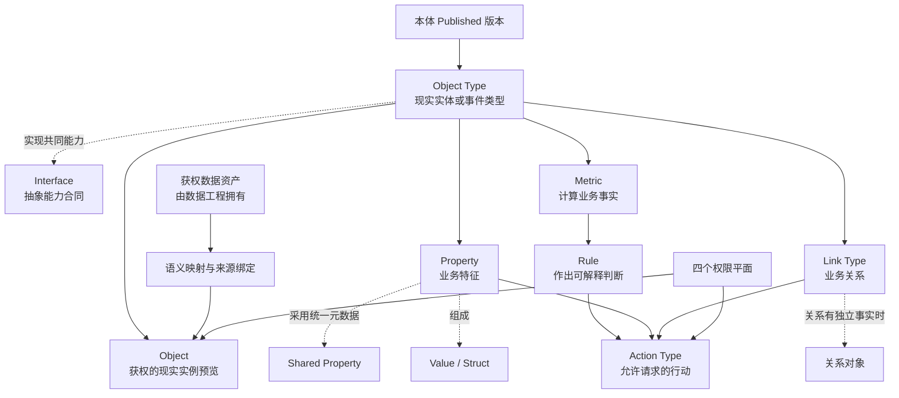
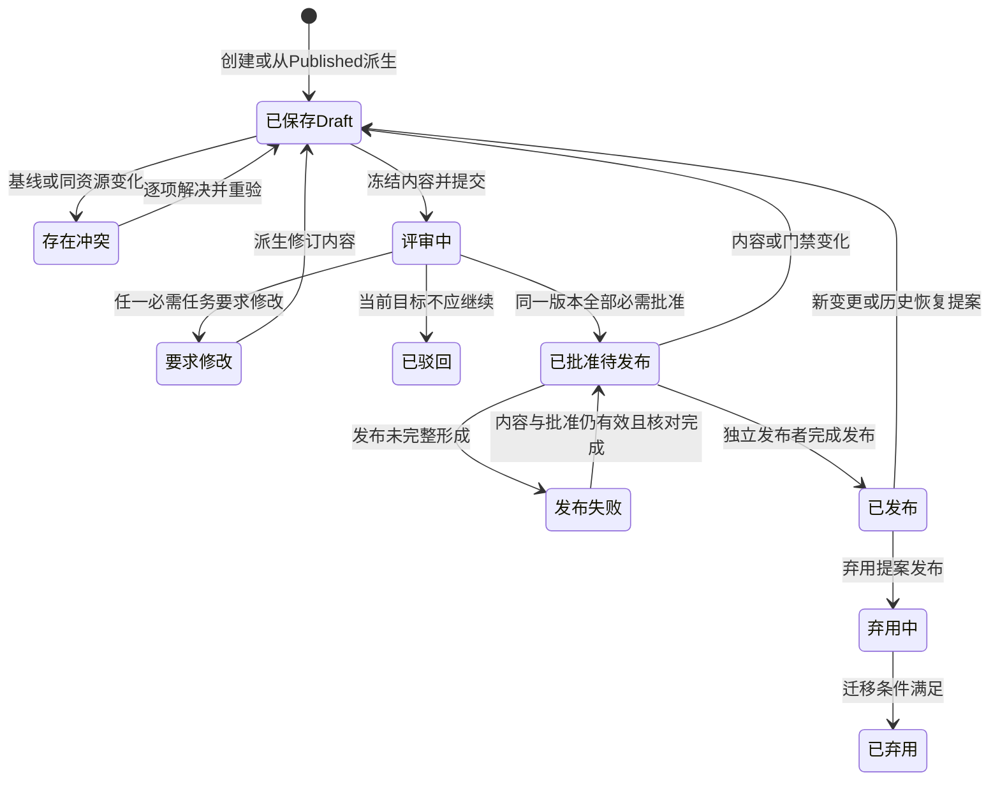
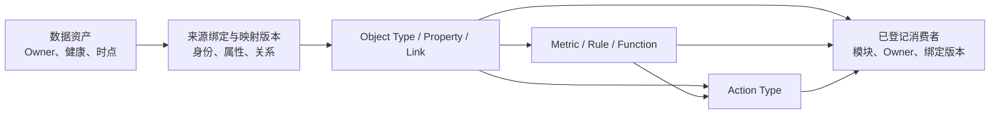
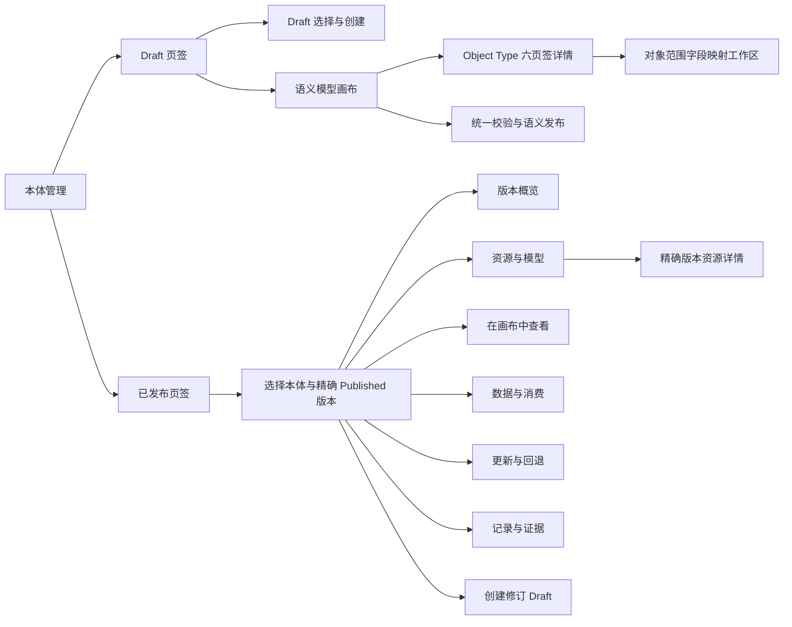

# 新项目功能设计：阶段 1 本体管理

> 版本：v0.1（M01 正式设计评审与页面合同收敛稿）
> 文档状态：M01“本体管理”正式设计评审已恢复，当前处于评审中；尚未获得用户“本体管理通过”的明确结论。已按总控 D042—D067、CR011/017/020—CR031 及相关 C 合同清理已关闭待定；CR030/C033 场景运行上下文、CR031/C003 精确资产交付回执及 C008 单一权威投影合同已经生效，但 IT-CON-003、IT-RUN-003、IT-RUN-005 及既有 IT-RUN-001 的真实交换仍未关闭，功能设计与实施验收证据继续分层管理
> 当前范围：只详细设计“本体管理”；数据工程、智能问数、决策中心、Agent 应用和报告中心只定义资源交换、依赖和禁止越界
> 数据工程依赖基线：《新项目功能设计-阶段2数据工程-v0.1.md》，文件标示版本 v0.1（本轮修订稿），本体窗口末次读取日期 2026-08-13；该文档尚未获得用户正式评审结论，其候选页面与内部自检不构成本体合同。该文档已将原 CR-DE-007/008 分别同步为 D066/CR026、D067/CR027 已生效；本体继续以总控裁决和已确认跨模块合同为准，真实复用运行与联调证据仍留实施验收
> 一期目标：单一演示账号最终贯通“数据资产可用—融资建模—映射—问数—规则—行动提醒—人工确认—负责人待办”；本轮只把本体侧可独立确认的功能和当前推荐依赖设计完整
> Palantir 官方资料检索日期：2026-08-09
> 交付性质：功能设计，不是技术方案、实施计划或能力已上线证明

## 0. 阅读约定与结论摘要

### 0.1 事实、设计、阶段与示意标签

本文严格区分以下十二类内容。一个小节开头标注后，未另行标注的段落和表格均继承该标签；同一表格混合多类内容时，逐行标注。

| 标签 | 含义 | 使用限制 |
|---|---|---|
| `[Palantir官方事实]` | 2026-08-09 检索到的 Palantir 官方英文文档所明确陈述的行为或原则 | 只证明公开文档中的事实，不代表本项目兼容、等价或已经具备 |
| `[Palantir课程附件事实]` | 用户提供的两份 Palantir Learn 课程材料中可直接核对的课程流程、概念说明和界面截图 | 只作为实践参考；不等同于官方最新产品承诺，也不要求本项目照抄 |
| `[原项目事实]` | 原项目最终追溯、最终裁决或可核验产物中明确记录的事实 | 只能作为经验、候选或反例，不能因“已经做过”而继承 |
| `[本项目设计]` | 针对本项目目标独立作出的功能决定 | 是本次待评审方案，不是已实现事实 |
| `[一期最小实现]` | 为完整功能雏形和系统演示必须建设的能力 | 对一期范围、页面、状态、流程和验收具有最高解释权 |
| `[一期演示假设]` | 为在一期内走通全流程而采用的简化前提 | 默认采用；不代表生产治理目标，也不得推导出多角色能力 |
| `[后期建设]` | 一期闭环稳定后再建设的生产级增强能力 | 保留为目标蓝图，不得作为一期发布或演示门禁 |
| `[待确认]` | 证据不足或需业务授权方选择的事项 | 未确认前采用文中明确写出的临时基线，不得静默补齐 |
| `[已生效总控裁决]` | 用户明确确认且已由平台总控以 D 编号登记的设计边界 | 只用于保留确认来源；以总控当前 D001—D067、C 合同及 CR 处置为准，不把模块草案或内部检查升级为裁决 |
| `[ON-DE设计已对齐][实施待验][ON-DE-nnn]` | 已按总控和当前数据工程基线对齐的数据依赖合同，仍需用真实资源与运行证明 | 不重新打开已生效 Owner、结构、状态或失败边界；只把真实成员/证据标识、运行实例、时效、性能和跨模块联调留到实施验收，发现差异时提交 CR |
| `[跨模块待定][ON-X-nnn]` | 非数据工程的资源 Owner、跨模块消费或场景资料仍未裁决 | 不得替相邻模块作内部决定；按编号记录建议 Owner、目标合同和影响 |
| `[示意]` | 用于解释规则的虚构例子 | 不代表真实行业、真实数据、真实组织或真实能力 |

**阶段解释规则：** 第 0.2、1.4、2.1、4.2、10.0、14.0、15、16.0、18 和 21 章中的阶段矩阵，对全文具有优先解释权。后文出现“必须”“阻断”“评审”“权限”“恢复”等表述时，若阶段矩阵标为 `[后期建设]`，该表述只约束后期目标态，不构成一期门禁。后续模块开始设计时沿用同一组阶段标签和解释规则，但本文不提前展开其内部设计。

### 0.1.1 已生效总控合同同步记录（截至 2026-08-14）

`[已生效总控裁决]` 总控当前页首、模块状态、术语、合同、裁决和 CR 处置已更新至 D067。本窗口只写回本体管理主文档，不修改平台总控台账、数据工程或其他模块文档。

| 关联事项 | 已确认方案 | 本文处理 | 仍待外部收敛 |
|---|---|---|---|
| Q013 / ON-X-001 | Metric、Rule、Action Type 的业务定义、依赖、版本和发布归本体管理；计算/评估结果及 Action 运行记录归相应消费或运行模块 | `[已收敛][ON-X-001][D054]`；C005/C006、T014—T016 已确认；本体建模、Draft Object Type 详情、精确 Published 资源详情及“数据与消费”按该 Owner 定版 | 不重新讨论 Owner；运行事实仍归各运行模块 |
| Q018 | 平台提供独立一级“仪表盘”消费入口，报告中心继续拥有定义、版本和管理入口，不新增第七模块 | `[已裁决][D055]`；本体仅在精确 Published 版本“数据与消费”中显示报告中心消费视角，不拥有平台导航或仪表盘 | 不改变本体资源 Owner、T019 或报告中心内部设计 |
| Q019 / ON-X-004 | 报告中心的业务对象、Metric、Rule 结果经 Published 本体及 T019 权威绑定消费；数据工程只直供 C017 的版本绑定摘要、当前状态摘要与五维数据状态，不直供业务明细或供报告中心重算 Metric/Rule | `[已收敛][ON-X-004][D055][D056]`；C016/C017 和总控消费路径已确认 | 不重新打开取数路径；数据状态、权限、语义兼容和报告四态继续分 Owner |
| RC-X-010 / ON-X-006 / CR-ON-005 | 本体提供历史 Published 定位和权威语义事实；报告中心拥有稳定锚点、证据包、内容比对与四态；Agent 应用只读忠实解释 | `[已收敛][ON-X-006][D043][D047][D048]`；CR-ON-005 已由平台 CR014 修改后合并接受 | 无待登记 Owner；ON-DE-011 仍约束数据侧历史状态 |
| Q025 / CR-ON-006 / ON-DE-011 | 一期保存版本与证据、显示五维状态并允许“未执行/依赖不足”；真实数据侧重放不设统一硬门，仅在 S004 后续资料明确要求时条件纳入 | CR-ON-006 已由平台 CR015 修改后合并接受；`[已裁决][D044][D050][D057]`，C017 已同步 | ON-DE-011 设计合同已对齐；真实摘要、状态样例和条件触发的重放属于实施验收 |
| QA-X-001 / CR-ON-008 | C004/C007 提供稳定资源标识、资源类型、精确 Published 版本、发布状态、有效时间、业务可读说明、允许发现的 Link 范围和受控证据入口；C009 的兼容/需迁移/需重验状态归智能问数，本体只读 | `[已收敛][D063][CR023]`；CR-ON-008 已修改后接受，不再作为待提交建议 | 完整治理、自动迁移和通用发现中心不进入一期；真实发现包与联调属于实施验收 |
| QA-X-006 / CR-ON-009 / ON-X-007 | 候选固定题验证 Run 与证据归智能问数；固定候选双版本、题集、逐题状态、整体结论、运行时间和重试关系；本体独立执行门禁并唯一提交 T019 | `[已收敛][ON-X-007][D064][CR024]`；CR-ON-009 已合并接受，C008 已更新 | 单题成功、超时、未知、失败或混版均不切换；真实题集、运行和混版样例属于实施验收 |
| 已采用版本事后硬质量失败 | 数据工程仅经 C017 发布失败事实、范围、时间、原因和建议；消费者阻断基于失败版本的新正式输出；本体在演示账号确认后原子回退到仍兼容的上一可信组合，无可回退组合时保持不可消费 | `[已裁决][D065][CR025]`；C008/C017 及消费者合同已同步 | 数据工程不得切换 T019；历史证据不得改写；真实阻断与回退运行属于实施验收 |
| 数据资产复用与本体只读来源链 | 获准复用的已发布 T007 可作为其他 T003 输入；复用配置、跟随解析、运行锁定和循环检查归数据工程；本体只读最终候选 T007 的精确版本、成员范围和完整来源链 | `[已裁决][D066][CR026]`；C003 已同步 | 资产复用不得绕过 C028/C029、T018、T019；真实复用链和负向样例属于实施验收 |
| 数据源与场景范围 | 场景不再是 T001 必填身份、唯一性依据或目录归属；本体范围由获准数据资产、本体映射和 T034/C021 场景清单共同确定 | `[已裁决][D067][CR027]`；C001 已同步 | 不从 T001 当前或历史场景字段推断本体范围；历史字段只兼容保留 |
| 本体刷新目标绑定发现 | 本体管理拥有版本化 T054“本体刷新目标绑定”，通过 C032 向数据工程提供只读发现包络；数据工程只可发现、选择，并在提交 C028 前重新读取仍为“可用”的精确绑定 | `[已生效][CR028]`；C032 是 S001 C028 正向联调的前置合同，不混入数据工程拥有的 C028，也不改变 C008/T019 Owner | 合同冲突已关闭；IT-RUN-001 的真实正向交换与负向拒绝/恢复证据尚未形成，不得写成已联调或已消费就绪 |
| 场景运行上下文与定向重置 | 平台公共层提供 T055/C033；`scenarioId`、`scenarioVersion`、不可变 `scenarioRunId`、`formedAt`（形成时间）和 `status`（状态）原样贯穿 Draft、Published、T054/C032、C028/C029、T018、T019/C008、请求、回执、深链和本模块运行证据 | `[已生效][CR030]`；本体只拥有自身业务记录和当前工作投影，不复制场景定义；缺失、未知、错配或轮次冲突一律拒绝，不从 T001 场景字段或页面默认值补齐 | 定向重置必须形成新 `scenarioRunId`，只重建当前场景工作投影；历史记录、证据、其他场景和已发布不可变资源不得删除或覆盖。旧无场景记录迁移与多场景负向证据仍待联调 |
| 精确资产版本交付与接收回执 | M02 以稳定交付标识发送精确 T007/T008、S001 四成员三关系、质量、来源和完整 C033；M01 以同一交付标识和精确 T007 返回接收/拒绝、接收时间、原因、目标 Draft 修订版本及旧新替代关系 | `[已生效][CR031]`；接收回执是 C003 的组成部分，不等于 C028/C029、T018 或 T019；未取得合法交付时不得以内置旧资产、名称匹配、默认值或成功导航生成完整 Draft | IT-CON-003 仍为 P0；须用真实或可验证的同标识正向、重复、错配和缺失交付关闭 |
| C008 单一权威只读投影 | M01 是 C008/T019 唯一生产者；向 M03、M06 及其他获准消费者提供同一稳定投影身份和版本、形成时间、读取状态、完整 C033、精确双版本、数据截至时间、切换时间、上一可信组合及空/失败原因 | C008 现有产品合同已经足够，不新增产品 CR；原型联调可约定同一交换入口，但具体本地存储键不进入产品功能合同。无 T019 也必须形成明确 `empty` 包络，消费者不得猜测或使用静态兜底 | IT-RUN-003、IT-RUN-005 仍为 P0；需覆盖旧状态源、双源、损坏、不兼容、空、成功和失败读取 |

为证明 D042—D067 和指定 CR 已逐项扫描，而不是只核对直接修改项，以下记录其对本体主文档的处理结论。标为“无本体内部功能增量”表示继续遵守跨模块只读或禁止越界合同，不代表该裁决未生效，也不把相邻模块功能复制进本文。

| 对照范围 | 对本体管理的结论 | 本文处理 |
|---|---|---|
| D042 | 报告助手界面/确定性核验归报告中心，Agent 配置与运行归 Agent 应用 | 无本体内部功能增量；本体只提供获准语义资源和历史解析，不拥有助手运行或四态 |
| D043—D045、D047—D050 | 报告历史语义证据、五维数据状态、当前比较、LLM 忠实解释、助手禁区、四成员刷新、生产保留分别按单一 Owner 生效 | 已在第 0.1.1、0.3、12.7、13.5、17、21、24—29 章吸收；D045 的当前比较只读引用 T019/语义兼容，本体不创建比较记录；D046 另列 |
| D046 | HTML/PDF 同源正式报告产物及版本规则归报告中心/Agent 应用 | 无本体内部功能增量；本体只维持证据引用的稳定语义身份和精确 Published 版本，不设计报告格式或发布流程 |
| D051—D053 | S003 当前只做数据工程兼容性验证；特定 T007 永久不可消费，输入时点/单位和受控处理均不形成当前本体资源 | 已在第 1.6、17、18、21、26、29 章吸收；D052 只约束数据输入事实，不据此虚构 S003 Object、Metric、Rule 或 Action Type |
| D054—D057 | 语义定义 Owner、仪表盘入口、报告业务事实消费路径、真实重放一期门已收敛 | 已在第 0.1.1、1、8—9、13—18、21、24—29 章吸收；不重新提出 Q013、Q018、Q019、Q025 |
| D058、D059、D060、D061 | S004 报告格式、决策—报告回链、Agent 结果三状态轴、固定问数视图均由相邻模块拥有 | 无本体内部功能增量；Draft“下游消费”和 Published“数据与消费”只读展示获准语义资源和外部状态引用，不拥有报告产物、运行回链、Agent 状态或固定视图 |
| D062—D065 | 报告生成/核验运行分离、Published 发现元数据、候选固定题验证、采用后硬质量失败处置均生效 | D062 的本体影响仅为 C022/C026 稳定语义证据；D063—D065 已在第 0.1.1、10、12.7、13.5—13.6、14—17、21、24—29 章吸收 |
| D066—D067 | 资产复用链和数据源去场景身份合同直接影响本体输入、来源追溯和范围判断 | 已形成 ON-DE-013、Object Type“数据与映射”、Published“数据与消费/记录与证据”、旅程、验收及第 24.1 节逐项对账；不接管数据工程配置，不从 T001 推断范围 |
| CR011、CR017、CR020 | 分别对应决策—报告稳定回链、Agent/报告状态轴、固定问数视图 | 已由 D059—D061 接受；无本体内部功能增量，不在本体管理两个页签复制运行或展示配置 |
| CR021—CR022 | 分别对应报告证据槽位/独立核验 Run，以及问数上下文与受限数据可信度投影 | CR021 的本体侧只提供稳定 Published 语义证据；CR022 的本体侧继续执行 C004/C007/C008 及证据定位边界，不新增资源类型 |
| CR023—CR025 | 分别对应 Published 最小发现元数据、候选固定题验证证据、采用后硬质量失败 | 已由 D063—D065 接受并写入功能、状态、旅程、验收和失败恢复；CR-ON-008/009 不再待提交 |
| CR026—CR027 | 分别对应已发布 T007 复用和 C001 移除场景必填身份 | 已由 D066—D067 接受并写入 ON-DE-013；真实复用、循环拒绝和范围不漂移证据留实施验收 |
| CR028 | 新建本体管理拥有的 T054/C032，作为 C028 前置只读发现合同 | 已在第 1、7、10、13—18、21、24—29 章及 ON-DE-014 吸收；导航不携带成功状态，数据工程返回或提交前必须重读 | IT-RUN-001 保持未关闭；至少形成一次 S001 可用 T054 正向提交，以及尚未建立、未发布、覆盖不足、未知等负向证据后，才能由总控判断是否关闭 |
| CR030 | 新建 T055/C033，并补强 C003、C008、C028、C029 等场景身份传播与定向重置合同 | 已在第 1、7、10、13—18、21、24—29 章吸收；场景上下文只作公共关联身份，不替代本体、Draft、版本、请求或运行自身稳定身份 | 旧状态迁移、缺失/未知/错配拒绝、定向重置和多场景隔离证据待形成；不得以整体清空模块状态代替定向重置 |
| CR031 | 直接补强 C003 精确资产交付与同标识接收回执，不新建平行资产合同 | 已在第 7、14、16、17、21、24—29 章吸收；未取得合法交付只显示等待/拒绝，不以旧内置资产生成完整 S001 Draft | IT-CON-003 保持未关闭；`FIN-ASSET-20251231-v01` 与旧绑定错配须通过真实交付/回执和 Draft 修订替代证据关闭 |

总控已同步 D054—D067 及 CR023—CR031。本文据此按已确认的 C003—C008、C017、C022、C023、C026、C028、C029、C032、C033 收敛本体边界；与本模块无关的相邻模块内部功能仍不由本体窗口推定。合同生效不等于已形成真实交付、可用绑定、权威组合或跨模块交换。

### 0.1.2 本轮智能问数消费合同增量摘要（2026-08-11）

`[本项目设计]` 本轮只补强本体管理向智能问数提供的 Published 只读消费合同，不修改总控、数据工程或智能问数文档。智能问数主文档是当前对账输入而非更高权威；其中仍把 Q013 写成待定的内容已被总控 D054 覆盖。

| 对账项 | 本体侧本轮结论 | 当前权威或待定边界 |
|---|---|---|
| QA-X-001 / C004、C007、C009 | 在第 13.6 节补齐稳定语义身份、类型化可发现元数据、精确 Published 版本、语义资源状态和只读证据定位；智能问数消费者兼容/需迁移/需重验状态由 C009 拥有，Draft“下游消费”和 Published“数据与消费”只读引用 | `[已收敛][D063][CR023]`；本体侧功能合同带入本轮正式评审，真实发现包与跨模块联调仍待实施验收，不把 Agent 配置状态转给本体管理 |
| QA-X-002 / Q013 | Metric、Rule、Action Type 的定义、依赖、版本和 Published 生命周期归本体管理；智能问数只读引用 | `[已裁决][D054]`，不再列为待定，不新增 Owner CR |
| QA-X-006 / C008 | 智能问数只对“精确 Published 语义版本＋候选数据版本”提供隔离的固定问题验证证据，Draft 不得进入；智能问数无 T019 确认、提交或切换权，单题成功不等于候选整体可消费 | `[已收敛][ON-X-007][D064][CR024]`；T019 Owner 仍由 `[已裁决][D034]` 固定，真实题集、运行、超时/未知/混版与重试证据后置实施验收 |
| QA-DE-005 | 一次正式问数锁定同一 T019 双版本快照；处理中切换不得拼接结果 | 政策已由 D026、D031、D034、D064/C008 固定；实际一致性证明见 `[ON-DE设计已对齐][实施待验][ON-DE-010]` |
| QA-DE-008 | 本体提供从语义结果到数据资产版本、成员、映射及质量/来源证据的只读定位，不暴露源字段或内部处理 | 语义与数据侧安全定位合同已按 C003/C017、CR022/CR023 对齐；真实证据编号和跳转见 `[ON-DE设计已对齐][实施待验][ON-DE-012]` |

### 0.2 一页结论

`[本项目设计]`

**一句话定位：** 本体管理把数据资产组织为面向真实业务实体、属性、关系、指标与行动的共享业务定义；一期先让一个账号把核心链路完整走通，后期再补齐生产级治理、安全和协作。

| 阶段 | 首要目标 | 核心能力 | 暂不作为门禁 |
|---|---|---|---|
| `[一期最小实现]` | 形成可演示的完整功能雏形；当前先让 S001 使用一个账号贯通本体构建和跨模块验证，S002—S004 待业务资料补齐后仍须在一期最终验收前完成 | 一级导航仅“本体管理”，页内以“Draft/已发布”两页签承载生命周期；融资主体、融资明细、融资机构、融资负责人四类 Object Type 及三条 Link；稳定身份、可读标题和最小业务术语；对象内选择 D049 已固定“四成员＋三关系”的“融资标准化数据资产”成员并显式创建 Property、完成字段映射和实例预览；按 `[已收敛][ON-X-001][D054]` 配置七个融资 Metric、三条 Rule 与“发起融资优化建议”Action Type；语义画布、只读数据沿袭、统一发布前校验与精确 Published 版本；Draft Object Type 六页签；Published 版本六页签及六类资源统一详情；建立版本化刷新目标绑定并通过 C032 向数据工程只读发现，支持深链处理、returnTo 返回及提交前重读；严格区分目标可选、待更新数据、匹配检查、消费验证条件、业务消费验证和人工切换；支持上一可信数据回退及版本内证据；为四类下游提供只读语义消费包和历史定位；智能问数和决策中心完成 S001 闭环 | 登录认证、多账号、角色切换、权限策略、职责分离、审批治理、多来源裁决、完整健康血缘、事故隔离、通用版本差异与迁移编排、真实历史数据侧重放、大规模恢复、弃用迁移工作流、复杂 Function、复杂规则编排、开放语义标准专家工具和直接修改融资事实的 Action；不得虚构 S002—S004 的对象、指标、规则或数据 |
| `[后期建设]` | 从演示雏形演进为可多人协作、可审计、可安全运营的企业级本体治理能力 | 七类职责、四权限平面、Draft/提案/批准/发布、专业评审、健康血缘、影响分析、消费者治理、历史恢复、弃用迁移、Shared Property、Interface、关系对象、复杂 Metric/Rule/Function/Action | 不反向扩大一期范围；按真实业务域和监管要求分批纳入 |

一期遵循六条原则：

1. **单账号到底。** `[一期演示假设]` 预置一个演示账号，默认拥有全部一期操作能力；流程中不出现登录、切换角色、申请权限、邀请评审或代入身份。
2. **先通再强。** 先打通“数据工程提供可选择的数据资产—创建融资本体—映射数据—预览对象和关系—发布—建立并核验刷新目标绑定—数据工程只读发现并在提交前重读—接收 C028—返回 C029—明确 T018 资格—验证候选—提交 T019—智能问数—规则命中—行动提醒—人工确认—负责人待办”；T054/C032、C028/C029/T018/T019 的 Owner 与边界已固定，实际交换与证据仍按 ON-DE 实施验收，高级治理不能阻断一期演示。
3. **业务语义优先。** 即使是演示，也不按表机械建模；Object Type、Property 和 Link 必须有业务名称、定义和用途。
4. **最小但真实。** 演示者必须在数据工程中实际上传工作簿并形成数据资产版本；预览、映射校验、发布、语义刷新和下游读取必须产生真实可判断结果，不能用预置成功记录、静态页面或禁用按钮替代。
5. **状态简化但诚实。** Draft 明确显示未校验、校验中、存在阻断、校验通过和发布失败；Published 侧分开显示“语义已发布”“刷新目标尚未建立/不可用/可用”“待更新数据”“匹配检查”“业务消费验证”“等待人工切换”“当前正式使用”“质量阻断”和“上一可信数据”。刷新目标、刷新运行、数据采用和指定消费者验证是不同状态轴；语义发布、C032 可用、匹配检查成功或具备验证条件均不得冒充正式数据已经切换。
6. **后期蓝图不丢失。** 完整权限、安全、评审、健康、恢复和审计继续在本文中定义，但全部明确属于后期建设。

### 0.3 成功结果与失败判据

`[本项目设计]`

| 一期可观察的成功结果 | 失败判据 |
|---|---|
| `[已裁决][D049]` `[ON-DE设计已对齐][实施待验][ON-DE-001][ON-DE-004][ON-DE-005]` 同一账号在数据工程中上传《融资一览表_一期演示数据.xlsx》后，本体管理能选择一个包含融资主体参考、融资明细、金融机构参考、融资负责人参考四成员及三关系，并带字段/粒度、数据截至时间、质量摘要和版本证据的数据资产版本 | 依赖后台预置资产、上传只保存文件而不形成资产、缺少任一固定成员/关系，或本体把质量失败/未发布候选当作可绑定资产；真实资源与交换证据通过实施验收前不将实际能力记为已具备 |
| 同一账号能创建融资主体、融资明细、融资机构、融资负责人四类 Object Type、必要 Property 和三条 Link，并在关系图中看见正确连接 | 必须换账号、换角色或等待审批才能继续，或只把融资明细表机械建成一个对象 |
| 每个 Object Type 有业务名称、定义、稳定身份、可读标题和单一数据来源，Property 不按源字段全量照搬 | 只能依靠表名、字段名或口头解释模型 |
| 映射工作台能显示对象与关系预览，并明确指出身份缺失/重复、必填字段缺失、映射不完整和关系端点不匹配 | 静态样例冒充真实映射结果，或错误存在仍显示可发布 |
| 统一发布前校验能从一张结果中定位 Object Type、身份、Property 映射、Link 端点、Metric 合同、Rule 合同和 Action Type 合同问题，并提供代表性失败对象与修正入口 | 只校验字段是否填写，或身份缺失、关系不匹配、Metric 无范围/时间/零分母处理、Rule 无阈值/样例、Action Type 无确认要求仍可发布 |
| “融资主体”Draft 详情能用六个页签集中回答定义、身份、属性、关系、数据与映射、业务逻辑与行动及向下游拟提供什么；精确 Published 版本能按六个页签查看版本、资源、只读模型/沿袭、正式数据、四类消费、更新回退和证据 | 配置散落且无法回答资源全貌；属性与关系仍混成字段字典；ON-DE 实施证据缺口或 ON-X 待定项被显示为已就绪；消费预览真正创建提醒或待办；或四个视角复制相邻模块内部页面 |
| 精确 Published 版本“数据与消费”能只凭稳定资源标识、精确 Published 版本和当前正式使用版本发现并绑定获准 Object/Property/Link/Metric/Rule/Action Type，分别显示本体语义资源状态、只读引用智能问数/C009 的兼容/需迁移/需重验状态，以及类型化元数据、Published Link、上下文完整性和只读证据定位；正式消费与候选业务验证隔离 | 按显示名称、Prompt 副本或源字段猜测资源；Draft/候选进入正式清单，或 Draft 进入候选业务验证；Link 方向/端点错误仍放行；证据缺失仍显示完整；一个候选问题成功即切换正式数据；或问数中途混合两个版本 |
| 同一账号能保存并一键发布，失败时旧 Published 结果保持可识别，修正后可重试 | 发布按钮无真实结果，或失败后无法判断当前正式版本 |
| `[已生效][CR028]` 在实际发布精确 T017 后，同一账号能为稳定 T006“融资标准化数据资产”建立并核验覆盖四成员三关系的 T054；C032 返回完整最小字段。数据工程深链进入处理、按 `returnTo` 返回并重新读取，提交 C028 前再次读取仍为可用 | 初始预置 T054/成功结果；Draft、未发布、停用、不匹配、覆盖不足、T017/映射不可定位或未知仍可选择；返回 URL/本地状态宣称成功；或 C032 可用直接显示 T018/T019/消费就绪。IT-RUN-001 未形成真实交换证据前不得记为联调通过 |
| `[ON-DE设计已对齐][实施待验][ON-DE-006][ON-DE-007]` `[已收敛][ON-X-001][D054]` `[已裁决][D034]` 智能问数能读取同一精确 Published 语义版本和本体管理提交的权威数据绑定，分别解释三家不同单位命中的 R01/R02/R03，按 Rule 证据指出前三家优先协商银行及关联借据，并能回答任意所选 2 家或 3 家单位的组合余额加权融资成本 | 读取正在更新、质量失败或尚未完成本体刷新的版本；只能查源字段；三条 Rule 共用一家单位；把单位成本简单平均；由 Agent 临时猜测协商银行；或回答无法指出所选单位、数据截至时间、数据资产版本和本体版本 |
| `[已收敛][ON-X-001][D054]` `[已裁决][D036][D038]` 三家单位分别提交引用已发布 Action Type 的标准 Action Request 后，在决策中心出现三条含优先协商银行与关联借据的待确认提醒；同一演示账号确认后按各自“融资主体—负责人”关系形成三条待办 | 跨单位合并提醒、丢失银行归因证据、Action 直接修改融资事实、绕过标准 Action Request 或无需人工确认，或任一待办找不到对应负责人 |
| `[已收敛][ON-X-006][D043][D047][D048]` `[ON-DE设计已对齐][实施待验][ON-DE-011]` 报告生成证据包可按报告稳定锚点、语义资源稳定标识和报告生成时的精确 Published 版本重新定位 Object Type、对象实例或对象集合、Property、Link、Metric、Rule 及必要 Action Type 定义；旧正式报告在资源升级、弃用或替代后仍引用原定义；一期同时显示版本定位、内容访问、证据完整、重放能力、重放核验五维状态和“未执行/依赖不足” | 只保存显示名称或“当前版本”；用当前定义替换历史定义；把权限失败混成数据不可访问；把“具备重放条件”写成“已重放一致”；历史数据不可访问时改用当前/上一可信数据冒充重放；或报告中心、Agent 应用创建、修改、重算、重新解释语义资源 |
| 未建设的权限、审批、健康、恢复等能力被明确标为后期，不出现半成品入口 | 页面出现角色切换、审批等不可用入口，给演示者造成流程中断 |

## 1. 产品定位、资源所有权与范围边界

### 1.1 为什么需要本体管理

`[Palantir官方事实]` [Ontology overview](https://www.palantir.com/docs/foundry/ontology/overview) 将 Ontology 描述为数字资产之上的组织“操作层”，同时包含 object、property、link 等语义元素和 action、function、dynamic security 等行动元素；[Ontology design: Best practices](https://www.palantir.com/docs/foundry/ontology/ontology-best-practices) 要求“model reality, not systems”，即按现实业务而不是源系统结构建模。

`[本项目设计]` 本项目借鉴“现实业务 + 受控行动”的原则，但不复制 Palantir 的品牌、页面、专有产品组合或实现方式。本体管理不是数据目录、字段字典、只读关系图，也不是下游应用的替代物。它解决四个平台级业务问题：

- 同一现实概念在不同来源和消费情境中是否仍指向同一件事；
- 决策使用的属性、关系、口径、规则和时间是否可解释；
- 人或 Agent 可以执行什么业务行动，为什么此刻可执行或被阻断；
- 定义发生变化时，谁审查、影响谁、何时生效、如何恢复并留下什么证据。

### 1.2 本模块拥有、引用与明确不拥有的资源

`[本项目设计]`

| 资源边界 | 资源或责任 | 本体管理承担的功能责任 | 明确不承担 |
|---|---|---|---|
| 拥有 | 本体、业务域说明及 Published 版本 | 统一目录、稳定身份、版本状态、Owner、可发现性、变更与历史 | 不拥有业务部门本身，也不替代治理授权 |
| 拥有 | Object Type、Property、Shared Property、Value/Struct、Link Type、关系对象、Interface | 定义业务含义、约束、关系、复用、弃用和兼容影响 | 不把源表、字段或接口响应原样复制为业务模型 |
| `[已收敛][ON-X-001][D054]` 本体管理拥有 | Metric、Rule 的业务合同 | 统一口径、适用范围、时间、输入输出、依赖、权限和版本，并随 Published 语义版本发布 | C005 已确认；不在消费模块复制公式或阈值，不拥有消费模块的计算/评估运行记录 |
| `[已收敛][ON-X-001][D054]` 本体管理拥有 | Action Type 的业务合同 | 定义业务意图、参数、前置条件、校验、确认、效果、权限、失败、纠正和审计，并随 Published 语义版本发布 | C006 已确认；不设计 Agent 应用，不拥有 Action Request/提醒/待办运行记录，也不允许 Function 绕开 Action 改变业务状态 |
| `[后期建设]` 本体目标资源 | Function 的业务合同 | 定义复用逻辑的输入、输出、依赖、权限和失败边界；只读逻辑不得绕过 Action | 一期不建设；不在本文决定运行环境或相邻模块内部实现 |
| 拥有 | 语义映射、来源绑定与对象/关系预览合同 | 选择获权数据资产，定义身份、字段到属性、关系端点及多来源裁决，验证预览 | 不采集、清洗、加工、调度、回放或修复上游数据 |
| `[已裁决][D034][D065]` 拥有 | 权威消费绑定 | 唯一持有并原子提交 `(精确 Published 语义版本, 可消费数据版本)` 组合，记录上一可信组合、数据截至时间、切换证据，以及已采用版本事后硬质量失败时经一期账号确认的受控回退 | 数据工程只请求刷新并通过 C017 发布质量事实，智能问数、决策中心、Agent 应用和报告中心只读；任何模块均不得另存冲突指针或自行回退 |
| `[已生效][CR028]` 拥有 | T054 本体刷新目标绑定及 C032 只读发现包络 | 基于精确 Published 语义版本和发布时来源映射合同，维护稳定绑定标识、绑定版本、适用 T006、四成员三关系覆盖、状态、是否允许刷新、Owner、核验时间与受控证据入口；向数据工程返回可选择或业务可读的不可用原因 | T054/C032 不是 C008/T019，不表示候选 T007 已刷新、具备 T018 资格或已采用；数据工程不得创建、修改、拼装绑定或用导航参数声明可用 |
| 只读消费视图，不新增资源 | 智能问数语义消费清单 | 将当前精确 Published 资源、T019、Published Link 白名单、语义资源状态、上下文完整性和证据定位按第 13.6 节投影，并只读引用 C009 拥有的消费者兼容/迁移状态 | 不拥有或改判 Agent 配置状态和问答结果，不复制语义定义，不形成独立版本/生命周期，不授予候选验证器 T019 切换权 |
| 拥有 | 变更提案、评审结论、Published 版本、弃用与恢复提案 | 隔离修改、差异比较、门禁、逐项评审、发布、历史和恢复证据 | 不直接改写已发布版本，不把恢复伪装成无审查回滚 |
| 共同治理、由本模块呈现 | 资源策略、对象范围、属性可见性、执行资格 | 让四个权限平面可配置、可解释、可预览、可审查 | 不因能编辑定义而自动授予数据或执行权限 |
| `[已裁决][D049][D066][D067]` 只读输入；字段细节见 ON-DE | 最终候选数据资产、精确 T007、数据工程已锁定的成员范围、成员稳定标识、完整来源链、字段/粒度、质量、T008、C028 | 展示数据工程提供的精确引用和状态，据此形成映射校验、受理候选刷新与问题移交；若最终 T007 来自复用管道，来源链只读追溯全部上游 T007/T002/T001，不改变本体选择的最终候选范围 | 不拥有 T001/T003/T006 复用配置、版本跟随解析、运行时锁定或循环检查；不从 T001 当前/历史场景字段推断本体范围；不拥有数据质量、资产版本或上游恢复 |
| `[已生效][CR031]` 接收并回执 | C003 精确数据资产交付 | 只接收带稳定交付标识、精确 T007/T008、S001 四成员三关系、质量、来源和完整 C033 的合法交付；以同一交付标识和精确 T007 返回接收/拒绝、时间、原因、目标 Draft 修订版本及旧新替代关系 | 不以内置旧资产、显示名称、页面默认值或成功导航代替交付；接收不等于 C028/C029、T018 或 T019，不修改数据工程资产事实 |
| `[已生效][CR030]` 原样引用 | T055/C033 场景运行上下文 | 让 `scenarioId/scenarioVersion/scenarioRunId` 原样贯穿本模块当前工作投影、Draft/Published 关联、T054/C032、C028/C029、T018、T019/C008、深链和证据；按场景与轮次读取、拒绝错配并支持定向重置 | 不拥有场景定义，不从 T001 推断场景，不用场景身份替代业务资源身份；定向重置不得删除历史证据、已发布不可变版本或其他场景状态 |
| `[已裁决][D049]` 本体管理拥有 | C029 刷新结果与 T018 候选资格判定 | 针对原 C028 形成对象/关系校验、处理状态、原因、恢复建议、证据、T018 资格及结果形成时 T019 只读快照 | 不把 C029 成功或 T018 具备资格写成 T019 已采用；不替数据工程改写候选 T007、质量事实或来源链 |
| 引用 | 下游消费者、绑定版本、消费验证结果 | 展示谁依赖哪个版本、验证结论和变更影响 | 不设计其他模块内部页面、流程或结果表现 |
| 仅验证，不作为主数据维护入口 | Object 实例 | 按身份、标题、属性、关系、权限和时点提供代表性预览 | 不在本体管理中提供任意实例编辑或业务操作工作台 |

### 1.3 能力地图

`[本项目设计]`

`[后期建设]` 这是一条目标态业务闭环，不是固定的线性向导。用户可以从现有资源、数据资产或变更问题进入，但提交评审前必须补齐所有门禁信息。一期按第 1.4 节最小演示闭环执行。

### 1.4 一期最小演示闭环

`[一期最小实现]` 一期只证明核心业务链路已经联通，不以生产治理完备为完成条件。

一期本体管理拥有 Object Type、Property、Link Type、来源绑定、映射、Published 语义版本、T054 刷新目标绑定和权威消费绑定。`[已收敛][ON-X-001][D054]` Metric、Rule、Action Type 的定义合同也由本体管理维护并随 Published 语义版本发布，C005/C006 已确认该 Owner。`[已生效][CR028]` 本体管理在精确 Published 版本和发布时来源映射合同下建立、版本化并核验 T054，通过 C032 向数据工程只读提供发现结果；数据工程只可发现、选择并在 C028 提交前重新读取。`[已裁决][D049][D066]` 数据工程拥有并提交 C028 刷新请求，本体管理拥有 C029 刷新结果；本体受理时只读确认最终候选 T007 的精确版本、锁定成员范围、成员稳定标识和完整来源链，不配置复用、版本跟随、运行锁定或循环检查。`[已裁决][D067]` 本体范围由获准数据资产、当前本体映射和 T034/C021 场景清单共同确定，绝不从 T001 当前或历史场景字段推断。字段级身份与端点语义仍按 ON-DE-002 等设计依赖对账，真实标识与运行实例属于实施验收。本体不拥有上传、处理、质量、资产版本或自动同步；`[已裁决][D034][D049][D064]` C032 可用、C028 已受理、C029“成功”、T018 具备资格和候选固定题整体通过仍不等于候选已被 T019 采用，只有本体管理在自身门禁通过后才能原子提交权威消费绑定。`[已裁决][D065]` 当前已采用数据版本事后发生硬质量失败时，数据工程仍无切换权：消费者先阻断新正式输出，本体只在一期账号确认且存在仍兼容的上一可信组合时原子回退，否则保持不可消费。智能问数 Agent 配置归属已由 D022 确认；`[已裁决][D036][D038]` Action Request、提醒、人工确认和待办运行记录由决策中心拥有，Rule、智能问数、Agent 应用和报告中心均只能通过引用已发布 Action Type 的标准 Action Request 发起。本体管理不承担问答表现、提醒页面或待办流程。

链路中的三类业务逻辑不得混同：Metric 计算业务事实，Rule 引用 Metric 或对象事实作出可解释判断，Action Type 只定义命中后允许请求的行动。Rule 命中只形成行动候选，不得自动创建提醒或待办；真实运行必须依次形成 Action 请求、决策提醒、人工确认和负责人待办。公式、阈值、机构归因与银行排序只维护一份权威定义，不复制到智能问数系统提示词或 Skill。

`[后期建设]` 第 1.2—1.3 节中与多来源、复杂逻辑、权限、提案、历史、恢复、处置和消费者迁移相关的责任，是目标态能力蓝图。

### 1.5 一期演示业务场景：集团融资成本与债务结构优化

`[一期最小实现]` `[一期演示假设]` 一期固定使用用户指定的《融资一览表脱敏版.xlsx》生成并已交付的《融资一览表_一期演示数据.xlsx》。`[附件核验事实]` 当前工作簿包含 5,218 条融资明细、574 个演示单位、24 家演示金融机构和 574 条单位—负责人映射；三家 Rule 演示主体、2 家/3 家组合成本和机构归因样例均可定位。金额和名称仅用于系统演示，不能用于真实融资判断。

`[ON-DE设计已对齐][实施待验][ON-DE-001][ON-DE-002][ON-DE-004][ON-DE-005]` 一期演示仍须证明该工作簿由演示者实际上传并形成可选择的数据资产版本；本体只能消费资产版本提供的成员清单、稳定身份字段、粒度、数据截至时间和质量摘要。当前工作簿事实不能代替上传、标准化、质量或资产发布合同已经确认，也不能作为本体直接读取工作簿的依据。

`[已裁决][D049][D066][D067]` `[ON-DE设计已对齐][实施待验][ON-DE-002][ON-DE-004][ON-DE-005][ON-DE-013]` 一期把这些输入组织为一个逻辑“融资标准化数据资产”版本包，而不是一张万能表或四个 Object Type 各自绑定独立版本。版本包固定包含融资主体参考、融资明细、金融机构参考、融资负责人参考四成员，以及融资明细→融资主体、融资明细→融资机构、融资主体→融资负责人三关系；四成员共享同一数据截至时间、同一轮质量与发布证据、一次候选刷新和一套失败回退。本体选择并保存数据工程已经解析、锁定的最终候选精确 T007 与获准成员范围；若该 T007 由复用管道形成，只读展示完整来源链，但不接管上游资产复用许可、跟随解析、运行锁定或循环检查。成员稳定标识的真实取值、字段、类型、粒度、主外键、映射和实际刷新实例仍由 ON-DE 实施验收，不由本体窗口补定。本体范围由该获准版本包、当前映射和 T034/C021 场景清单决定，不使用 T001 当前或历史场景字段。后期若来源系统、Owner 或更新周期确实不同，可拆分资产来源而保持 Object Type 稳定，仅调整来源映射。

`[已生效裁决 D007]` 产业板块只做标签标准化，不合并融资主体、不修改演示单位名称、不改变贷款归属和统计粒度。当前工作簿已保存标准化后的 10 个有效展示值；以下六组只说明旧标签到标准标签的业务含义，不表示本体管理负责清洗或重写源数据：

| 原演示值 | 一期展示值 |
|---|---|
| 产业金融-司库、产业金融-资本控股 | 产业金融 |
| 非动力核技术 | 核技术 |
| 核服集团 | 产业服务 |
| 科技型环保 | 环保产业 |
| 能源国际 | 境外新能源 |
| 新能源控股 | 境内新能源 |

当前 10 个有效展示值为：产业金融、核技术、产业服务、环保产业、境外新能源、境内新能源，以及保持原值的核能、核燃料、集团及直管公司、数字化。`[ON-DE设计已对齐][实施待验][ON-DE-003]` 数据工程在资产发布前报告这 10 个目标值、旧标签残留和新增异常值；本体将“所属板块”映射为融资主体 Property 并校验可解释性。值域已按 D007 固定，数据工程不得自动接受新增值；新增业务值须由业务 Owner 提出并经本体变更评审，发现旧值、未知值、主体合并或粒度变化时阻断受影响消费。本体不得借板块映射合并任何融资主体。

#### A. 一期业务对象与关系

| 资源 | 为什么是业务对象 | 当前数据资产成员假设 | 稳定身份与标题 | 一期必要 Property 与边界 |
|---|---|---|---|---|
| 融资主体 | 独立承担融资余额、成本、结构判断和优化行动的现实主体 | `[ON-DE设计已对齐][实施待验][ON-DE-001][ON-DE-002]` 以“融资主体参考”成员作为主体实例主要来源；“融资明细”成员只通过稳定单位编码引用主体并支持主体—明细关系，不另造主体；一主体不能因板块标签相同而合并 | 单位编码；标题为演示单位名称 | 所属板块；当前 D007 只改变标签，不改变身份或统计粒度 |
| 融资明细 | 一笔具有借据身份、余额、成本、期限和机构归属的融资事实 | `[ON-DE设计已对齐][实施待验][ON-DE-001][ON-DE-002]` “融资明细”成员，一行一笔借据 | 唯一借据编号；标题为借据编号 | 境内外、提款/到期日、币种、汇率、原币余额、人民币余额、当前利率、利率形式、融资类型、期限种类、担保方式；工作簿其余字段不因存在就自动成为 Property |
| 融资机构 | 可被多笔融资共同引用、可汇总问题余额并作为协商对象的现实机构 | `[ON-DE设计已对齐][实施待验][ON-DE-001][ON-DE-002]` “金融机构参考”成员；当前工作簿只有机构名称和类别，已对齐资产合同要求输出稳定机构编码，真实字段引用待实施验收 | 显式稳定机构编码；标题为明确标注“演示”的机构名称 | 机构类别；不得以机构名称本身代替长期身份，机构关系缺失时不得生成协商排名 |
| 融资负责人 | 可承接多个主体优化待办的业务责任实体，不等同于登录账号、角色或权限主体 | `[ON-DE设计已对齐][实施待验][ON-DE-001][ON-DE-002]` 以“融资负责人参考”成员作为负责人实例主要来源；“融资主体参考”通过负责人标识提供主体—负责人端点事实 | 演示负责人标识；标题为演示负责人名称 | 一期不增加身份认证或组织权限属性；只向 Action 请求提供负责人关系证据 |

数据资产成员、工作表和 Object Type 不一一对应：D049 固定的四成员与三关系共同支持四类 Object Type 和三条 Link；`Sheet1` 与“场景问数样例”只作人工核验参考，不得绑定为对象来源。当前工作簿的 35 个融资明细字段也不要求全部成为 Property。

| Link Type | 正向业务名称 | 反向业务名称 | 一期基数与校验 |
|---|---|---|---|
| 主体—融资明细 | 主体拥有融资 | 融资属于主体 | 一个主体可有多条融资；每条融资必须且只能属于一个主体 |
| 融资明细—融资机构 | 融资由机构提供 | 机构提供融资 | 一个机构可提供多条融资；每条融资必须对应一个且仅一个机构，机构缺失时不得形成协商建议 |
| 主体—融资负责人 | 主体由负责人承接优化待办 | 负责人承接主体优化待办 | 一个负责人可承接多个主体；一期每个主体必须对应一个负责人 |

`[ON-DE设计已对齐][实施待验][ON-DE-002]` 三条 Link 的端点必须使用资产版本中的稳定编码匹配：主体—融资明细使用单位编码，融资明细—融资机构使用显式机构编码，主体—融资负责人使用单位编码与负责人标识。工作簿当前融资明细未直接包含单位编码或机构编码，因此不得按名称临时关联；真实字段引用、覆盖率和不匹配样例在实施验收时锁定并验证。

#### B. 一期融资指标包

`[已收敛][ON-X-001][D054]` Metric 是由本体管理拥有并随 Published 语义版本发布的资源，C005 已确认该 Owner。指标能力只建设一次，以下七个实例共同验证融资成本和债务结构，不代表七套独立功能。所有比率在分母为零时显示“无法计算”，不得按 0% 处理。

| Metric | 一期口径 | 输出与解释 |
|---|---|---|
| 融资余额 | `Σ折合人民币余额` | 人民币元；用于规模和全部比率分母 |
| 余额加权平均融资成本 | `Σ(折合人民币余额 × 当前利率) ÷ Σ折合人民币余额` | 百分比；一期明确不用各借据利率的简单算术平均 |
| 浮动利率余额占比 | `浮动利率融资人民币余额 ÷ 融资余额` | 百分比；解释利率重定价敏感度 |
| 短期债务余额占比 | `期限种类为“短期”的人民币余额 ÷ 融资余额` | 百分比；一期沿用源字段分类，后期再建设剩余期限分桶 |
| 外币融资余额占比 | `币种非人民币的人民币余额 ÷ 融资余额` | 百分比；仅展示汇率风险暴露，不在一期单独触发 Action |
| 高成本融资余额占比 | `当前利率高于当前 Published 规则版本参数“高成本融资阈值”的人民币余额 ÷ 融资余额` | 百分比；Q001 推荐一期参数固定为 2.75%，随规则版本留痕，不随每次数据刷新自动按样本分位数重算 |
| 信用融资余额占比 | `担保方式明确为“信用”的人民币余额 ÷ 融资余额` | 百分比；缺失担保方式不得自动解释为信用 |

指标默认支持三种对象范围：集团全部融资主体、单一融资主体、用户明确选择的融资主体集合。选择 2 家或 3 家单位时，先按主体身份去重，再取得这些主体的融资明细并集，按 `Σ(所选明细折合人民币余额 × 当前利率) ÷ Σ所选明细折合人民币余额` 计算组合成本；不得对各单位已经算出的成本做简单平均。回答必须列出所选单位、合计余额、数据时点、口径和精确本体版本；单位不存在、重复或组合余额为零时分别解释，不得静默忽略、重复计权或回答为 0%。

集团结果用于组合基准和总览，显式选择的 2—3 家单位用于比较分析，Action 仍只对单一融资主体发起，不创建“组合单位”对象。演示数据的集团融资余额约 2.16 万亿元，余额加权融资成本约 2.37%，浮动利率余额占比约 95.15%；这些结果只用于核对演示链路，不成为规则阈值。

Rule 命中后使用同一融资明细集合生成机构归因证据，不新增一套 Agent 逻辑：R01 的高成本余额占比支路命中时按高成本融资余额归集；R02 按浮动利率融资余额归集；R03 按短期债务余额归集。分别按融资机构求和，计算该机构问题余额占单位全部问题余额的比例，按贡献降序、机构稳定身份升序打破并列，取前三家作为优先协商银行。回答同时显示机构问题余额、贡献占比、问题融资加权成本、涉及借据数和可下钻借据；问题余额为零或机构关系缺失时不返回空洞排名，而是说明无法归因。若 R01 仅由“单位成本高于集团基准”支路命中，即高成本余额占比未超过 20%，无论是否存在少量高成本借据，推荐一律按各机构正向增量利息成本 `Σ余额 × max(当前利率 - 集团基准 - 0.25 个百分点, 0)` 排序；两条 R01 支路同时命中时只使用高成本融资余额算法。当前演示同时命中两条支路，因此不进入增量成本分支；是否将该分支作为正式基线见总控 Q004，Agent 不得临时发明替代口径。

#### C. 一期 Rule 与 Action 闭环

`[已收敛][ON-X-001][D054]` R01—R03 与 Action Type 的定义由本体管理维护并随 Published 语义版本发布；`[已裁决][D036][D038]` 标准 Action Request 及其后的提醒、人工确认和待办运行过程由决策中心拥有。Q001、Q002、Q004 仍是业务口径待裁决项，当前数值和 R01 排序分支均为推荐演示基线，不得写成生产规则已定版。

| 资源 | 一期最小合同 | 命中或执行结果 |
|---|---|---|
| R01 融资成本偏高 | 单位加权融资成本高于集团组合基准 0.25 个百分点，或单位高成本融资余额占比大于 20% | 形成融资成本优化候选，列出指标值、阈值、高成本融资贡献前三家银行和候选借据 |
| R02 浮动利率暴露 | 单位浮动利率余额占比大于 80% | 形成利率结构优化候选，按浮动利率余额贡献列出前三家银行和候选借据 |
| R03 短期债务集中 | 单位短期债务余额占比大于 30% | 形成期限结构优化候选，按短期债务余额贡献列出前三家银行和候选借据 |
| Action Type“发起融资优化建议” | 目标为融资主体；携带命中 Rule、指标快照、数据截至时间、优先协商银行、候选融资明细、建议方向和精确本体版本 | 在决策中心创建一条“待确认”提醒；不修改融资主体或融资明细事实 |
| 人工确认后的业务结果 | 同一演示账号确认或拒绝；确认时按“主体—负责人”关系取唯一负责人 | 确认后形成一条负责人待办；拒绝、缺负责人或创建失败均保留原因并允许修正后重试 |

按 Q001/Q002/Q004 当前推荐基线，一期固定使用三家不同单位分别验证一条 Rule，且三家在当前演示数据下均只命中其主规则。用户裁决改变阈值、短债口径或 R01 排序后，必须形成新的 Published 语义版本，并重验受影响单位、银行归因、固定题和 Action 证据，不得沿用下表旧结论：

| 主规则 | 演示单位与负责人 | 关键指标 | 选择理由 |
|---|---|---|---|
| R01 融资成本偏高 | 演示单位553；融资负责人001 | 75 条融资、余额约 393.13 亿元、加权成本约 2.881%、高成本余额占比约 77.337% | 成本和高成本占比越过 R01 阈值，浮动利率及短债占比均为 0%，仅命中 R01 |
| R02 浮动利率暴露 | 演示单位465；融资负责人009 | 176 条融资、余额 770.00 亿元、加权成本约 2.197%、浮动利率余额占比 100% | 成本及短债未越线，仅命中 R02 |
| R03 短期债务集中 | 演示单位561；融资负责人009 | 50 条融资、余额约 20.02 亿元、加权成本约 2.228%、短期债务余额占比约 93.545% | 成本及浮动利率未越线，仅命中 R03 |

当前固定演示数据的优先协商银行如下；排名和数值必须由已发布 Rule 证据重新计算，不得写入 Agent 提示词：

| 主规则与单位 | 第一优先 | 第二优先 | 第三优先 | 排序依据 |
|---|---|---|---|---|
| R01；演示单位553 | 演示欧陆银行；高成本融资约 99.59 亿元，占问题余额 32.754% | 演示寰宇银行；约 65.49 亿元，占 21.541% | 演示海联银行；约 58.48 亿元，占 19.233% | 高成本融资余额贡献 |
| R02；演示单位465 | 演示融通银行；浮动利率融资约 249.08 亿元，占问题余额 32.348% | 演示启明银行；约 237.76 亿元，占 30.878% | 演示嘉禾银行；约 221.53 亿元，占 28.770% | 浮动利率融资余额贡献 |
| R03；演示单位561 | 演示同州银行；短期债务约 5.05 亿元，占问题余额 26.955% | 演示星河银行；约 4.60 亿元，占 24.583% | 演示恒信银行；约 3.66 亿元，占 19.558% | 短期债务余额贡献 |

本体只保证每个 Action Request 引用精确 Action Type、单一融资主体和完整 Rule/证据集合，不决定运行期提醒如何关联、聚合、去重、撤回或纠正；这些仍按总控 CR008—CR010 由决策中心及各来源模块收敛。已确认的硬边界是：不同融资主体始终分别创建请求、提醒和待办，即使负责人相同也不得跨单位合并。Action 是否成功以决策中心返回的运行证据为准，智能问数回答中的文字不能代替请求、提醒或待办事实。

#### D. Metric、Rule、Action 与数据链路的最佳维护位置

`[已收敛][ON-X-001][D054]` 下表按 C005/C006 已确认合同定版：Metric、Rule、Action Type 的定义唯一维护在本体管理并随 Published 语义版本发布；计算/评估结果和 Action 运行记录仍归各自消费或运行模块。

| 资源或配置 | 推荐维护位置与一期入口 | 一期规则 | 禁止做法 |
|---|---|---|---|
| Object Type、Property、Link、主体—负责人关系 | `本体管理 > 本体建模 > 当前 Draft`；从语义模型画布进入 Object Type 六页签或对象范围字段映射工作区 | 随 Published 语义版本一起发布；结构和来源绑定变更形成新版本 | 把对象关系复制到数据管道、提示词或决策页面中维护 |
| Metric | `本体管理 > 本体建模 > 当前 Draft > 业务逻辑与行动`；也可从画布“添加语义资源”或目标 Object Type 创建 | 维护业务问题、对象范围、分子/分母、筛选、时间、单位、数据依赖、预览和版本；第 1.5 节七个指标均是独立可发现资源 | 在数据处理过程、智能问数提示词或报表中另存同名公式 |
| Rule | `本体管理 > 本体建模 > 当前 Draft > 业务逻辑与行动`；从同一 Draft 可一并发布或已 Published 的 Metric 选择依赖 | 维护条件、阈值、命中解释、机构归因与排序、有效期和测试样例；R01/R02/R03 与 Metric 同一语义版本发布 | 让 Agent 临时判断阈值，或在决策中心重新写一套规则 |
| Action Type | `本体管理 > 本体建模 > 当前 Draft > 业务逻辑与行动`；从画布、目标 Object Type 或 Rule 创建 | 维护目标、输入、前置条件、确认要求、输出业务合同和去重键；一期效果仅为请求创建待确认提醒 | 在数据工程运行 Action，或把提醒、待办运行状态写回 Action 定义 |
| `[ON-DE设计已对齐][实施待验][ON-DE-001][ON-DE-005][ON-DE-007]` 原始文件、数据处理、数据质量、资产版本、自动同步 | 数据工程；具体页面不写入本体页面合同 | 数据工程提供可供本体选择的资产版本及质量、时点、版本和阻断证据；只有满足已对齐选择门的候选才可进入 C028 | 在本体管理或智能问数内临时清洗、补数、随机化或改写源数据 |
| `[ON-DE设计已对齐][实施待验][ON-DE-010]` `[已裁决][D026][D031][D034]` 智能问数 Agent 的系统提示词、问数 Skill、精确本体版本绑定、数据跟随策略、资源白名单和测试问题 | 按 D022 由智能问数维护，具体页面留待该模块设计 | 固定精确 Published 语义版本并跟随最新兼容且通过门禁的可消费数据；候选失败继续上一可信版本并警告；本体管理唯一提交权威绑定；请求 Action 时携带语义版本、数据资产版本和指标快照 | 在提示词或 Skill 中维护公式、阈值、负责人关系、银行排序或 Action 效果，或由智能问数维护冲突绑定 |
| `[已裁决][D036][D038]` Action Request、待确认提醒、人工确认/拒绝、负责人待办、运行状态与失败原因 | 由决策中心拥有；具体页面留待该模块设计 | 四类获准来源均提交引用已发布 Action Type 的标准 Action Request；确认后创建待办并回传请求/提醒/待办标识和状态 | 在本体管理维护运行状态，或未经人工确认直接推送任务 |

“本体管理 > Draft”的 Object Type“业务逻辑与行动”页签采用统一资源列表和三种配置模式，而不是建立三个彼此孤立的子系统。Metric 先定义可复用度量；Rule 只能引用当前 Draft 中可一并发布或已 Published 的 Metric；Action Type 只能引用目标 Object Type、Rule 证据及允许输出。右侧检查器和资源详情必须反向显示“被哪些 Rule、Action 和消费方绑定使用”，使修改者在保存前看见影响。

智能问数侧三类配置不得混用：系统提示词只规定 Agent 的任务边界、回答证据和禁止行为；问数 Skill 规定如何按稳定资源标识发现已发布对象、调用 Metric/Rule 以及如何请求获准 Action；本体绑定明确精确 Published 语义版本、数据跟随策略和资源白名单。融资公式、阈值、负责人关系和 Action 效果均不属于前两者。Prompt、Skill 和白名单只能保存“稳定资源标识 + 预期资源类型 + 获准场景/范围 + 精确 Published 版本或权威绑定引用”，不得复制定义正文，也不得因显示名称相同自动迁移到另一资源。

Metric/Rule 的正式结果必须以所锁定 Published 资源作为唯一求值合同；查询、计算和评估的运行事实仍按 D054 归相应运行模块，智能问数不得在提示词中自行重算或补写口径，只读取结果、单位、对象范围、状态和证据。Action Request 必须引用本次问数同一 T019 快照内的 Action Type 稳定标识和精确 Published 版本；找不到该精确资源、类型不符或已要求迁移时不得按同名 Action Type 代替。

一期按 `[已收敛][ON-X-001][D054]` 采用以下最小维护流程：在本体管理修改 Metric/Rule/机构归因/Action Type → 用 R01/R02/R03 三家应命中单位、至少一家不应命中单位、一组优先协商银行问数及一组 2—3 家组合问数预览 → 发布新精确语义版本 → `[已裁决][D034]` 由本体管理在候选通过全部必要门禁后原子提交权威绑定，并在智能问数运行固定测试问题 → `[已裁决][D036][D038]` 重新提交三条标准 Action Request 并验证提醒与负责人待办闭环 → 将验证结果回传本体版本。任一步失败都保留上一可信绑定和失败证据，不能通过改提示词临时“修好”回答。

#### E. 从数据上传到智能问数的双版本合同

`[已裁决][D049][D054][D064][D066]` `[ON-DE设计已对齐][实施待验][ON-DE-002][ON-DE-004][ON-DE-005][ON-DE-013]` “最新数据”不等于最后到达的文件。候选数据资产通过数据工程发布与质量门后，由数据工程提交 C028；本体先确认最终候选 T007 的精确版本、获准成员范围、成员稳定标识和完整来源链，再完成既有映射兼容、对象/关系刷新并返回 C029，随后读取相应运行模块按同一 Published 定义形成的候选 Metric/Rule 与机构归因证据，执行本体独立门禁，并读取智能问数拥有的候选固定题整体验证证据。本体拥有逻辑定义和发布，不拥有消费或运行模块的计算/评估结果。资产来自复用管道时，本体只读来源链和数据工程给出的锁定/循环检查结果，不配置或重算这些规则。本文不得把“资产已发布”“C028 已受理”“C029 刷新成功”“T018 具备资格”“候选固定题整体通过”“T019 已采用（数据消费就绪）”和“指定消费者验证通过/可正式消费”混为同一事实。

| 事实层 | 唯一 Owner 与含义 | 本体侧可见动作 | 绝不等同于 |
|---|---|---|---|
| C028 本体刷新请求 | 数据工程拥有；请求目标 Published 语义版本对一个精确候选 T007 发起刷新 | 本体受理或不受理并保留回执；不完整的精确版本、成员范围、T008、质量或来源链不得进入处理 | 刷新已成功、T018 已成立或 T019 已切换 |
| C029 本体刷新结果 | 本体管理拥有；针对原 C028 返回处理中、成功、失败、不兼容或未知，以及对象/关系校验、原因与恢复建议 | 结果必须回指原请求和候选双版本；重试形成关联新记录，不覆盖原结果 | 即使“成功”，也不等于候选数据已成为当前权威消费版本 |
| T018 可消费数据版本资格 | 由 C029 明确候选 T007 是否完成必要校验与语义刷新、具备进入权威绑定评审的资格 | 只作为 T019 采用门之一；仍需固定题整体通过和本体自身门禁 | 不等于已经被任何消费者正式读取，也不赋予数据工程切换权 |
| T019 权威消费绑定 | 本体管理唯一拥有并原子提交精确 `(Published 语义版本, T018 数据版本)` | 提交前显示候选与上一可信组合；提交后记录采用/切换时间和证据 | 不自动等于指定消费者验证通过或上下文完整 |

`[已裁决][D067]` 上述链路中的场景范围只以获准 T007/T006 语义、当前本体映射及 T034/C021 场景清单为依据。C028 或来源链中即使保留 T001 的历史场景字段，本体也不得据此扩大、缩小或推断当前本体范围。

语义版本和数据版本必须分别显示：前者决定 Object、Property、Link 以及 `[已收敛][ON-X-001][D054]` 归本体管理的 Metric、Rule、Action Type 定义，后者决定回答使用的事实快照。智能问数回答、Action 请求、决策提醒和待办证据都必须同时携带本体版本、数据资产版本和数据截至时间。更新数据不要求重新发布相同语义定义；改变字段语义、指标公式、规则阈值或 Action 合同才要求发布新的语义版本。

`[ON-DE设计已对齐][实施待验][ON-DE-008]` 为降低问数等待，推荐在候选消费验证前准备集团和单一融资主体的常用 Metric、R01/R02/R03 命中结果及银行归因，并使任意 2—3 家组合成本可由已验证的余额与利息成本基础量汇总。这里只规定“消费就绪时应可快速读取”的功能结果，不规定结果如何形成或保存。智能问数不直接读取工作簿，也不把 5,218 条明细写入系统提示词；下钻借据时只读取当前获准双版本中的必要对象和关系。

智能问数和决策中心的具体配置页面、内部流程及角色设计留待各自模块文档；本文只记录 D022、D010 已确认的方向、ON-X 待定 Owner 和本体侧验收证据。

#### F. 推荐演示脚本与样例

以下数值来自当前固定随机种子的演示工作簿，只作为本轮演示基线；更换数据后必须由 Metric 重新计算，不能把样例答案写入智能问数提示词。

| 演示步骤 | 推荐操作或问题 | 预期业务证据 |
|---|---|---|
| 1. 取得候选数据资产 | `[已裁决][D049][D066][D067]` `[ON-DE设计已对齐][实施待验][ON-DE-002][ON-DE-004][ON-DE-005][ON-DE-013]` 在数据工程按其最终合同上传《融资一览表_一期演示数据.xlsx》，再从本体管理打开最终候选资产 | 本体实际读取包含 5,218 条明细的精确候选 T007、四成员三关系、锁定成员范围、完整来源链、数据截至时间和质量摘要；若有上游资产复用只读显示链路，不出现复用配置入口，也不从数据源场景字段推断范围 |
| 2. 发布融资本体 | `[已收敛][ON-X-001][D054]` 选择候选资产，完成四类 Object Type、三条 Link、七个 Metric、三条 Rule 和一个 Action Type 的映射与候选发布 | 获得一个精确 Published 语义版本；`[ON-DE设计已对齐][实施待验][ON-DE-006]` 刷新结果与语义发布状态分别显示；`[已裁决][D034]` 只有本体管理原子提交权威绑定后才显示“消费就绪” |
| 3. 验证集团口径 | 在智能问数询问“集团融资余额、余额加权平均融资成本和债务结构如何？” | 回答约 2.16 万亿元、2.37%、浮动利率占比 95.15%、短期债务占比 0.91%，并显示口径、数据时点、资产版本和本体版本 |
| 4. 分别验证三条 Rule | 依次询问单位553为何成本偏高、单位465有何利率结构风险、单位561有何期限结构风险 | 三家分别且仅命中 R01、R02、R03；回答显示关键指标、阈值、数据时点和双版本 |
| 5. 验证协商对象 | 依次询问“三个问题单位分别应优先找哪些银行协商，为什么？” | 智能问数按已发布 Rule 证据返回每个单位前三家银行、问题余额、贡献占比、问题融资加权成本、涉及借据数和关联借据；结果与上表一致 |
| 6. 验证组合问数 | 询问三家综合平均成本，再任选其中两家询问综合平均成本 | 智能问数按融资明细余额加权，并列出所选单位及合计余额；不采用单位成本简单平均 |
| 7. 验证数据更新与回退 | 按数据工程最终合同提供同结构候选版本，先验证候选刷新失败，再对一个已采用数据版本登记 C017 事后硬质量失败 | `[已裁决][D026][D031][D034][D064][D065]` 候选处理期间不混读；全部门禁通过后由本体管理原子提交绑定；候选失败继续当前可信组合。已采用版本硬失败时新正式输出先阻断：存在仍兼容的上一可信组合则由同一演示账号确认后原子回退，不存在则保持不可消费并说明原因；历史结果不改写 |
| 8. 分别发起建议 | 对三家单位分别请求“发起融资优化建议” | 决策中心新增三条待确认提醒；每条包含对应主体、Rule 原因、指标快照、优先协商银行、候选借据、数据时点、资产版本和本体版本 |
| 9. 人工确认 | 同一演示账号分别确认三条提醒 | 形成三条单位级待办：单位553分配给融资负责人001，单位465与561分别分配给融资负责人009；同一融资负责人名下仍保留两条独立待办 |

组合问数的固定核对结果如下；数值只用于当前固定随机种子的演示数据，不写入提示词：

| 问数范围 | 合计融资余额 | 余额加权融资成本 | 单位成本简单平均 | 验收重点 |
|---|---:|---:|---:|---|
| 单位553 + 单位465 + 单位561 | 1,183.15 亿元 | 2.425% | 2.435% | 回答三家清单；按明细余额加权 |
| 单位553 + 单位465 | 1,163.13 亿元 | 2.428% | 2.539% | 第三家为空时只计算前两家 |
| 单位553 + 单位561 | 413.15 亿元 | 2.849% | 2.555% | 结果高于简单平均，证明不能平均单位成本 |
| 单位465 + 单位561 | 790.02 亿元 | 2.197% | 2.212% | 主体去重后计算，不重复计权 |

#### G. S001—S004 一期场景边界与可扩展性

`[已生效裁决 D020、D023、D024]` S001 集团融资成本与债务结构优化、S002 预算管理、S003 债务风险监测、S004 财务公司贷款贷前调查均属于一期最终必做场景；当前只有 S001 具备足以设计对象、属性、关系、Metric、Rule 和 Action Type 的业务与数据资料。

`[跨模块待定][ON-X-005]` 本轮只验证本体结构不会把 S001 写死为唯一业务域，不为 S002—S004虚构任何语义资源：

| 场景 | 本轮本体设计深度 | 可扩展性检查 | 明确禁止 |
|---|---|---|---|
| S001 集团融资成本与债务结构优化 | 完整设计四类 Object Type、三条 Link、推荐 Metric/Rule/Action Type、映射、页面、旅程和验收 | 当前主要演示和智能问数验证场景 | 不把演示样例答案写死为平台通用能力 |
| S002 预算管理 | 只保留按场景编号发现未来 Published 语义资源的能力 | “本体管理”的 Draft/已发布页签及其映射、发布和消费验证机制可在不修改 S001 定义的前提下新增资源 | 不创建预算对象、指标、规则、数据或完成状态 |
| S003 债务风险监测 | `[已裁决][D051][D053]` 当前只承接“不可消费”的数据工程兼容性边界，不创建本体资源；S001 通过后再按完整业务资料另行设计 | Draft/已发布页签和对象映射机制未来可接收新的正式候选数据版本，但不得原地启用当前兼容性版本 | 当前兼容性 T007 永久不得进入本体资产选择、T054/C032 正向候选、C028/C029、T018 或 T019；不把 R01—R03 冒充债务风险模型，不虚构对象、Metric、Rule 或 Action Type |
| S004 财务公司贷款贷前调查 | 同上；D022 已确认 Agent 应用拥有报告/洞察 Agent，报告中心拥有报告定义与产物 | 本体未来只提供获准 Published 对象、Metric、Rule 结果和 Action Type | 不虚构贷前调查对象、报告字段、数据、规则或 Agent 配置 |

场景清单由 D023 确认的平台公共层维护，本体只登记语义资源被哪些场景引用，不复制场景清单或相邻模块资源。`[已裁决][D067]` 场景归属和本体范围只由 T034/C021 场景清单、获准 T006/T007 的业务语义及本体映射表达；T001 不再具有场景必填身份、唯一性或目录归属作用，历史场景字段仅作来源追溯兼容，不能成为本体选择、映射或发布范围的依据。缺少 S002—S004 资料时，页面应显示“语义资源尚未定义/等待业务资料”，而不是空指标、模拟数据或静态成功结果。S003 可额外只读显示“数据工程兼容性验证阶段/不可消费”，但不得把兼容性合同获准或未来真实兼容运行结果解释为本体就绪；完整建设时必须使用新的正式候选数据版本重新进入 C028、C029、T018 和 T019 链路。

## 2. 用户、职责与职责分离

### 2.1 一期演示操作者

`[一期演示假设]` 一期只有一个“演示操作者”视角。该账号默认拥有“本体管理”的 Draft/已发布页签、语义画布、对象配置、映射、预览、保存、发布、刷新目标绑定、数据切换和联通验证所需的全部一期能力；同一次演示中不切换身份，也不模拟业务负责人、建模者、数据负责人、评审者或发布者。

| 一期操作者要完成的任务 | 可见动作 | 一期留痕 | 明确不出现 |
|---|---|---|---|
| 建立业务模型 | 新建/编辑/删除未发布的 Object Type、Property、Link Type；维护业务名称和定义 | 最后保存时间、操作者、变更摘要 | 角色分配、职责签署、申请编辑权 |
| 绑定和校验数据 | 选择数据工程中由本人上传并发布的资产版本、映射身份/标题/属性/关系、查看校验与预览 | 来源引用、资产版本、数据截至时间、映射结果、校验结果 | 数据接入、加工、调度、数据审批 |
| 补齐融资语义到行动闭环 | 配置融资指标包、三条 Rule 和“发起融资优化建议”Action Type | 指标/规则版本、阈值、Action 配置摘要 | 复杂 Function、权限策略、审批和纠正治理 |
| 发布并验证 | 保存并发布；在智能问数完成问答和 Action 请求；在决策中心确认并形成负责人待办 | 本体版本、数据时点、问数结果、提醒和待办标识 | 提交评审、批准、发布者切换、角色切换 |

### 2.2 后期角色—任务—证据矩阵

`[本项目设计]` `[后期建设]`

| 角色 | 核心任务 | 主要可见信息与动作 | 必须留下的证据 | 关键限制 |
|---|---|---|---|---|
| 业务领域负责人 | 确认模型忠实表达现实业务与决策任务 | 业务定义、术语、示例/反例、关系语义、时间有效性、消费场景；签署语义结论 | 业务问题、模型范围、语义评审结论 | 不能以“字段已经存在”替代业务定义；不能单独批准自己提交的提案 |
| 本体建模者 | 创建或修改 Draft，完成模型、映射、逻辑和 Action 合同 | 本体建模、Object Type 六页签、对象范围映射、差异、校验、提案；提交评审与响应评论 | 变更理由、候选比较、校验结果、评论处理记录 | 不能直接改 Published；原则上不得批准本人提案或自行发布 |
| 数据负责人 | 证明数据资产适合语义用途并处理上游问题 | 来源说明、字段含义、刷新/有效时点、健康、身份覆盖、异常与移交 | 数据适用性结论、异常处置状态、来源 Owner | 不决定业务语义；在本模块内不进行采集、加工或调度 |
| 治理/安全负责人 | 审查命名、Owner、敏感性、行列范围和权限扩大 | 治理清单、四平面权限、身份预览、安全路径和影响 | 安全评审、例外理由、有效期、复核人 | 不能用安全审批替代业务或数据正确性审批 |
| 评审者 | 对同一提案版本逐项批准、驳回或要求修改 | 差异、评论、预览状态、健康、血缘、消费者影响、必需签署 | 每个评审任务的结论、理由、时间与版本 | 内容变化后旧结论失效；不能批准自己提交的内容 |
| 发布者 | 最终核对门禁并使 Approved 版本正式可用 | 发布清单、批准完整性、阻断项、版本说明、消费验证要求 | 发布决定、发布时间、正式版本、验证责任人 | 不能修改提案内容，不能覆盖缺失审批或未知影响 |
| 普通消费者 | 查找并理解已发布定义，验证实际可用性并反馈问题 | “本体管理 > 已发布”中的精确版本、资源详情、健康提示、来源与反馈入口 | 消费验证结果或问题报告 | 只能看到获权定义和数据；不能看到被权限隐藏的资源存在性细节 |

### 2.3 后期最低职责分离基线

`[本项目设计]` `[后期建设]`

1. **提交者与最终批准者分离。** 本体建模者可以请求评审，但不能批准自己的提案。
2. **批准与发布分离。** 发布者只核对已经形成的结论，不得兼任该提案唯一评审者；发布动作不能修改内容。
3. **多类风险分别签署。** 语义变化由业务评审者判断；数据绑定变化由数据负责人判断；敏感属性、对象范围或关系可达性变化由治理/安全负责人判断。一个人的多重组织身份不能消除应有的不同评审任务。
4. **恢复仍遵守分离。** 发现问题的人可发起恢复提案，但不能直接把旧定义设为当前版本；恢复内容走与同等风险变更相同的评审和发布门。
5. **紧急情况不删除证据。** 若组织批准紧急发布，必须显示例外授权人、业务原因、到期复核时间和未完成事项；紧急权限不能成为常规捷径。

以上是后期生产治理基线，不适用于一期。后期启动多账号和审批治理建设时，再结合真实组织确认“三权分立”或低风险变更中的职责合并规则。

## 3. 从业务任务到本体的建模方法

### 3.1 建模入口：决策、行动与工作流

`[Palantir官方事实]` [Ontology design: Best practices](https://www.palantir.com/docs/foundry/ontology/ontology-best-practices) 要求从领域现实出发，避免 System Silos；[Ontology design: Anti-patterns](https://www.palantir.com/docs/foundry/ontology/ontology-anti-patterns) 列举 System Silos、God Object、Kitchen Sink、Action Sprawl、Time Machine、Misnomer 等反模式。

`[本项目设计]` 创建业务模型时，用户先说明业务概念和用途，而不是直接按表生成。任务卡按阶段回答：

| 业务问题 | 必填内容 | 评审判断 |
|---|---|---|
| 谁要做决定或行动 | 目标角色、责任范围、受影响角色 | 是否有真实负责人，而非泛称“用户” |
| 决定或行动是什么 | 可观察的业务结果、触发时机、失败后果 | 是否值得形成共享语义或受控 Action |
| 现实中涉及什么 | 实体、事件、关系、状态与业务时间 | 是否脱离源系统名称仍能成立 |
| 需要什么事实 | 每个事实的业务价值、来源、时点和敏感性 | 无消费价值的字段不得默认纳入 |
| 如何识别同一对象 | 稳定身份规则、合并/拆分边界、冲突 Owner | 更换来源后身份是否仍可解释 |
| 谁会消费 | 至少一个具体工作情境及版本依赖方式 | 是否可以执行发布后验证 |

`[一期最小实现]` 一期仅将“现实中涉及什么、需要什么事实、如何识别同一对象、谁会消费”作为建模输入；目标角色、责任划分、敏感性、冲突 Owner 和正式签署不作为发布门禁。页面用简洁业务名称、定义、用途、正例/反例、身份和标题完成表达。

`[后期建设]` 上表全部字段、责任人和评审判断在多人治理阶段启用，并成为相应风险变更的门禁。

### 3.2 八步业务优先流程

`[本项目设计]`

`[一期最小实现]` 一期按“定义融资优化问题 → 搜索是否已有 → 创建四类 Object Type/Property 和三条 Link → 配置身份和标题 → 绑定单一来源并预览 → 配置融资 Metric/Rule/Action → 保存并发布 → 智能问数与待办闭环验证”执行。以下八步是后期完整流程；一期已经补齐当前融资场景必需的逻辑与行动，但不要求补齐权限、多人评审和生产治理。

`[后期建设]`

1. **定义目标。** 记录业务决策、行动、参与角色、预期结果及风险。
2. **圈定现实边界。** 识别实体、事件、关系和时间；列出明确不在本次模型中的邻近概念。
3. **建立候选与反例。** 为每个候选写出定义、正例、反例、独立身份和生命周期；无法区分正反例的候选不能进入数据映射。
4. **搜索现有权威定义。** 按业务术语、同义词、负责人、来源和关系搜索，选择复用、扩展、替代或新建；必须记录为何不是重复定义。
5. **选择最小语义构件。** 在 Property、Shared Property、Value/Struct、Link、关系对象、Interface、Object Type 中选择满足业务问题的最小构件，不为“高级”而抽象。
6. **定义身份、标题和时间。** 先确定稳定身份、可读标题、Owner、状态、业务有效时间和来源责任，再选择数据资产。
7. **绑定和预览数据。** 完成字段映射、多来源裁决、对象和关系预览、质量与权限检查；预览必须能解释缺失、冲突和部分可用。
8. **补齐逻辑、行动与治理。** 说明指标、规则、Function、Action、权限、健康门、消费者和变更影响，形成可评审提案。

### 3.3 Object Type 候选的准入与拒绝测试

`[本项目设计]`

候选至少满足以下四项：它是可由业务人员命名的现实实体或事件；有独立且稳定的识别方式；有业务生命周期或可观察发生时点；至少被一个决策、关系、规则或 Action 使用。若只满足“数据里有一张表”，不构成准入理由。

| 候选内容 | 默认判断 | 原因与替代方向 |
|---|---|---|
| 源表、文件页签、接口响应 | 拒绝作为 Object Type | 它们是数据组织方式；先寻找其表达的现实实体或事件 |
| 部门自己的“客户副本” | 拒绝重复创建 | 搜索权威“客户”定义，通过来源、权限或扩展表达差异 |
| 仪表板卡片、筛选结果、临时查询结果 | 拒绝 | 它们是消费视图或对象集合，不是独立现实对象 |
| “万能业务对象”且大量属性只对少数场景有效 | 拒绝 | 拆回聚焦对象类型、关系对象或有证据的接口组合 |
| 角色页面、流程步骤、按钮 | 拒绝 | 它们是交互或工作流表达；识别背后的角色、任务、事件或 Action |
| 有日期、状态、责任角色和自身生命周期的关系 | 不使用简单 Link | 建模为关系对象，使关系事实可被识别、追溯和治理 |
| 仅有值、单位、来源、置信度而无独立身份的语义组合 | 不升级为 Object Type | 评估 Struct；若后来具有独立生命周期再重新判断 |

`[示意]` “供应商”可以是 Object Type；“供应商主数据表”不是。“供应商向工厂供货”若只有连接意义可为 Link；若具有合同号、有效期、等级和审批状态，则应候选为“供货关系”对象。示意只用于说明选择规则。

### 3.4 重复、万能对象与时间副本的治理门

`[本项目设计]`

- 新建前同时按名称、同义词、描述、Owner、身份规则、来源和相邻关系查重；命中相似项时必须选择“复用、扩展、替代或确认不同”，并写出理由。
- 属性数量不是唯一判断。若对象跨越多个不共享生命周期的业务主题、大量属性对多数实例无意义，或 Owner 无法唯一确定，则触发“万能对象”阻断。
- 不为每个部门复制一份同类 Object Type。差异若只是属性可见性、来源或展示，分别用权限、来源绑定或消费配置处理。
- 不通过复制对象类型表达历史版本。业务历史应由有效时间、事件或有自身语义的状态变化表达；模型历史由版本生命周期表达。
- 抽象不得先于真实复用。Shared Property 或 Interface 必须有当前可验证的多处使用价值，不能以“未来可能复用”作为唯一理由。

## 4. 核心语义资源与功能合同

### 4.1 资源关系图

`[本项目设计]`

虚线表示“在满足条件时选择”，不是默认继承或自动传播。Action Type 到 Action 请求、决策提醒、人工确认和负责人待办属于运行链路，不在本图中伪装成定义资源；Rule 命中不会自动创建待办。

### 4.2 语义资源总表

`[本项目设计]` 资源按阶段纳入，不以是否出现在目标态资源关系图中判断一期范围。一期只吸收开放语义标准中有助于业务理解的基础模型思想：业务实体/事件类型对应 Object Type，业务事实对应 Property，现实关系对应 Link Type，关系起点/终点和一对一/一对多对应基础端点与基数，业务名称/定义/说明/同义词对应注释性信息。普通用户界面不出现 Class、Datatype Property、Object Property、domain/range、cardinality 等专家术语，也不建设推理或文件格式能力。

| 资源或能力 | 一期最小实现 | 后期建设 |
|---|---|---|
| 本体、Object Type、Property | 创建、编辑、删除未发布资源；本体名称、定义和适用场景；Object Type/Property 业务定义；稳定身份；可读标题；列表和详情 | 共享复用、弃用、迁移、复杂兼容性和治理元数据 |
| Link Type | 两端类型、正反向业务名称、方向、基础基数、映射和关系预览 | 关系对象、关系属性与生命周期、复杂权限影响 |
| Object | 只做数据映射后的代表性只读预览 | 更完整的数据范围、身份权限投影与运行健康 |
| Metric | 建设一个通用指标配置能力，并配置第 1.5 节七个融资 Metric；显示名称、目标 Object Type、业务事实、口径、范围、单位、时间、零分母处理和真实数据预览 | 复杂时间窗口、派生依赖、权限、跨域复用和完整版本治理 |
| Rule | 建设最小条件判断能力，并配置融资成本偏高、浮动利率暴露、短期债务集中三条 Rule；显示依赖、条件、阈值、命中解释、测试样例和版本；命中只形成行动候选 | 规则组合、优先级、例外、模拟、权限和复杂编排 |
| Action Type | 配置“发起融资优化建议”的目标、输入、前置、确认要求、期望结果和失败表现；允许获准下游发起 Action 请求，但定义本身不保存请求、提醒、确认或待办，不修改融资事实 | 通用执行资格、权限、影响预演、部分成功、撤回/纠正和完整审计 |
| Shared Property、Value/Struct、Interface、关系对象、Function | 不建设；页面不出现不可用入口 | 有真实复用或复杂业务证据后建设 |
| 来源绑定和映射 | `[ON-DE设计已对齐][实施待验][ON-DE-001][ON-DE-007]` 四类 Object Type 共同引用一个“融资标准化数据资产”版本包中的不同粒度成员；完成身份/标题/Property、关系端点映射；显示候选/获准资产版本、数据截至时间、质量和刷新摘要 | 多来源裁决、来源切换、复杂扇出和完整字段级、多项目、多消费者追溯 |
| 最小术语 | 为智能问数维护首选业务名称、同义词、缩写、不推荐表达及原因；随 Published 语义版本发布，Draft“下游消费”和 Published“数据与消费”只读展示 | 多语言、术语审批、跨域概念合并和完整术语治理 |
| 统一发布前校验 | 用一套业务可读结果校验 Object Type、身份、Property 映射、Link、Metric、Rule、Action Type，显示通过/警告/失败、数量、代表性失败对象和修正入口 | 可扩展规则库、跨项目策略治理和复杂例外审批 |
| 最小证据链 | 只读追溯“数据资产版本 → 资产成员 → 映射 → Object/Property/Link → Metric → Rule → Action Type → 下游消费者”；每个可发布资源具有稳定资源标识并归属于精确 Published 版本；智能问数可按第 13.6 节从结果定位所用语义定义及数据证据，报告证据包可从稳定锚点反查原语义定义 | 完整字段级、多项目、多消费者影响分析和自动处置 |
| 生命周期 | 编辑中、可预览、已发布、发布失败；当前 Published 版本号和最近发布时间；所有被正式报告引用的 Published 语义版本及其中定义只读保留并可按“稳定资源标识 + 精确 Published 版本”重新定位 | Draft/提案/批准/发布、通用历史比较与恢复、弃用和迁移工作流 |
| 权限和治理 | 不建设；演示账号默认全能力 | 身份认证、角色权限、职责分离、专业审批和四权限平面 |

`[后期建设]` 下方资源总表定义目标态业务含义与完整治理合同；其中未列入一期的字段和规则不作为一期验收门槛。

`[Palantir官方事实]` [Object types overview](https://www.palantir.com/docs/foundry/object-link-types/object-types-overview) 区分 Object Type、Object 与 Object Set；[Properties overview](https://www.palantir.com/docs/foundry/object-link-types/properties-overview) 将 Property 定义为实体或事件特征的结构定义；[Link types overview](https://www.palantir.com/docs/foundry/object-link-types/link-types-overview) 要求 Link 表达两个对象类型之间的现实关系；[Interfaces overview](https://www.palantir.com/docs/foundry/interfaces/interface-overview) 将 Interface 描述为不可直接实例化的共同形状和能力，并明确部分消费者存在支持限制；[Create a shared property](https://www.palantir.com/docs/foundry/object-link-types/create-shared-property) 表明 Shared Property 复用名称、描述、基础类型、格式和可见性等元数据。

`[本项目设计]`

| 资源 | 对业务用户的含义 | 创建或修改时必须回答 | 适用条件 | 反例或禁止用法 |
|---|---|---|---|---|
| 本体 | 一个明确业务范围内共享、可发布的现实定义集合 | 业务边界、Owner、术语范围、消费者、当前 Published 版本 | 需要共同语义和变更治理的业务域 | 按系统、部门或项目文件夹随意切分 |
| Object Type | 一类可识别的现实实体或事件 | 定义、正反例、身份、标题、状态、时间、Owner、来源、关系、消费者 | 有独立身份及业务生命周期/发生时点 | 表、接口响应、页面、临时结果、部门副本 |
| Object | 某一现实实体或事件的获权实例 | 属于哪个类型、稳定身份、当前标题、有效时点、来源、可见属性 | 用于映射和消费验证 | 在本体管理中任意手工编辑业务实例 |
| Property | 对对象有业务或治理价值的特征 | 含义、值约束、可空原因、单位/格式、时点、来源、敏感性、是否派生 | 至少支持理解、筛选、关系、规则、指标或 Action 之一 | 把所有源字段一比一搬入；把身份和标题混为一谈 |
| Shared Property | 多个对象类型采用同一业务定义和展示约定的属性元数据 | 统一定义、Owner、采用范围、差异是否允许、变更影响 | 至少两个当前类型确有同义属性，且统一会降低歧义 | 以为它会共享数据、对象或权限；只因名称相同就合并 |
| Value | 一个无独立身份、但需统一解释的业务值定义 | 含义、允许范围、单位/格式、未知与不适用如何表达、Owner | 受控编码值、等级、数量、金额等需跨资源一致理解 | 把具有独立生命周期的实体压成一个值；用空值混淆未知与不适用 |
| Struct | 总是作为整体理解的一组相关值 | 组合语义、组成项、整体可空性、来源/置信度/有效时间 | 组合本身无独立身份，但拆开会丢失语义 | 为减少页面字段而随意打包；把关系实体隐藏在结构中 |
| Link Type | 两类对象之间可双向表述的现实关系 | 两侧业务名称、方向、基数、有效时间、来源、端点缺失处理 | 关系本身无需独立身份、属性或状态流转 | 只因存在外键或可 Join 就建 Link；用“关联”作模糊名称 |
| 关系对象 | 具有自身事实、身份或生命周期的关系 | 参与方、关系身份、角色、起止时间、状态、属性、Owner | 关系含合同号、角色、日期、状态、审批等独立事实 | 把简单无属性连接过度对象化；又同时保留重复 Link 造成双重权威 |
| Interface | 多个对象类型可共同实现、供真实消费者复用的能力合同 | 共同属性/能力、采用者、映射义务、兼容消费者、Owner、演进规则 | 至少两个不同类型和一个明确消费者需要面向共同能力工作 | 为单个类型创建；深层扩展；假设所有消费者自动支持 |
| Metric | 在明确对象范围、口径和时间上得到的业务度量 | 名称、业务问题、分子/分母或聚合、范围、筛选、时间、单位、版本、Owner | 结果取决于对象集合、时间窗口或聚合口径 | 把单对象原始事实包装成指标；省略“截至何时”和范围 |
| Rule | 对事实作出可解释判断或约束的业务规则 | 输入、条件、结论、优先级、例外、有效期、Owner、失败表现 | 资格、合规、完整性或 Action 前置判断 | 隐藏在页面按钮中；没有解释原因的黑箱“通过/失败” |
| Function | 可复用、可版本化的业务逻辑合同 | 业务用途、输入、输出、适用对象、时点、依赖、权限、失败、Owner | 需跨多个消费情境复用同一逻辑 | 用来绕过 Action 改变状态；把一次性复杂分析都塞入本体 |
| Action Type | 人或受授权 Agent 可发起的一项受控业务变化 | 意图、目标、参数、前置、校验、确认、效果、副作用、权限、失败、纠正、审计 | 需要业务判断、授权和可追溯状态变化 | 按单字段创建“设置/更新属性”；无确认、无权限或无纠正路径 |

### 4.3 所有可发布资源的共同业务元数据

`[本项目设计]` `[后期建设]` 本节是目标态共同元数据合同。一期执行第 4.2 节阶段矩阵中明确列出的业务名称、定义、身份、标题、单一来源、映射和版本字段，以及第 1.5 节 Metric、Rule、Action 的最小合同；为支持第 13.6 节智能问数精确发现及 `[已收敛][ON-X-006][D043][D047][D048]` 报告证据追溯，一期另要求每个可发布资源具有不随改名、升级、弃用或替代而复用给其他资源的稳定资源标识，并可由该标识与精确 Published 版本共同重新定位当时定义。面向智能问数的一期资源还必须提供类型化可发现元数据、语义资源生命周期/变更事实和只读证据定位；消费者兼容、需重验、需迁移及不兼容状态归智能问数 C009，Draft“下游消费”和 Published“数据与消费”只读引用。具体最小项与阻断规则以第 13.6 节为准。其余共同治理元数据不作为一期门禁。

除 Object 实例预览外，每个可发布定义至少包含：

- 稳定资源身份、中文业务名称、必要英文别名、清晰描述、正例与反例；
- 所属业务域、业务 Owner、维护责任人、数据 Owner（若绑定数据）、治理责任人（若敏感）；
- 语义生命周期状态、首次生效时间、当前版本、替代/弃用关系，以及类型/单位/适用对象等变更事实；不把某个消费者配置是否兼容写成本体资源状态；
- 业务术语与同义词、来源和依赖、已知消费者、敏感性与适用权限；
- 质量/健康摘要、未解决问题；最近验证时点和消费验证状态只读引用其拥有者，不由本体资源定义生成或改判；
- 创建、修改、评审、批准、发布、弃用和恢复的可追溯记录。

发布门会检查这些信息，不把“文档以后补”作为默认通过理由。对不适用项，用户必须选择“不适用”并说明，而不能留空混同未知。

## 5. 身份、名称、时间与来源

`[一期最小实现]` 一期要求资源业务名称和定义、对象稳定身份、可读标题、必要 Property、单一来源引用及数据截至时间。为满足第 13.6 节智能问数消费定位，每个可供消费的 Published 资源还必须显示当前定义责任位置：Metric/Rule/Action Type 按 D054 显示本体管理，其他资源显示其已有资源 Owner 或至少可处理问题的本体责任位置；一期不建设 Owner 配置、移交或角色治理。敏感性、事实级多来源追溯、完整 Owner 治理、责任移交和发布签署属于 `[后期建设]`；它们在下文仍作为目标态规则保留，但不阻断一期发布。

### 5.1 稳定身份与人类可读标题

`[本项目设计]`

| 概念 | 目标 | 必须满足 | 失败状态与恢复 |
|---|---|---|---|
| 稳定身份 | 长期判断两个记录是否代表同一现实对象 | 非空、在目标范围内唯一、规则可解释、来源变化时可保持或有明确迁移；复合身份需逐项说明 | 缺失、重复、漂移、冲突均阻断可消费预览和发布；由建模者与数据负责人修正规则或上游数据后重验 |
| 可读标题 | 让业务用户无需理解编码即可识别对象 | 来源明确、允许受控变化、同名时提供必要区分、缺失时有诚实的降级标签 | 缺失不伪造名称；预览显示“标题缺失”及身份的受限表示，达到业务门槛前阻断发布 |
| 资源稳定身份 | 让定义在改名、迁移和版本变化后仍可追溯 | 不以显示名称作为唯一身份；替代或拆分时保留关联 | 冲突时停止保存并要求选择沿用、替代或新建，不能自动覆盖 |

不得使用当前行号、可随业务修改的名称或未经证明稳定的来源主键作为默认业务身份。可以组合多个事实构成身份，但必须解释缺失、冲突、合并和拆分的处理。

### 5.2 名称、描述、术语和 Owner

`[本项目设计]`

- 名称使用业务人员日常可理解的单数概念，不含来源系统前缀、表名缩写或“数据”“信息”“对象”等无区分度后缀。
- 描述采用“是什么、何时算作、何时不算、用于什么决定”的结构；仅重复名称视为未完成。
- 同义词帮助搜索，但只能指向一个当前权威定义；同名异义项必须显示业务域和区分说明。
- Owner 对含义、生效和弃用负责；维护者可以编辑但不能替代 Owner 作业务授权。
- Owner 缺失、已离岗或责任域不匹配时，资源可继续只读发现，但新提案与发布被阻断，直至完成责任移交。

### 5.3 状态与业务时间

`[本项目设计]`

每个对象类型和关系需判断三类时间是否适用：事件发生时间、现实有效区间、数据所代表的“截至时间”。模型版本的发布时间与这些业务时间分开显示。用户在预览和消费验证中必须能回答“这是何时发生/有效的事实、数据截至何时、定义使用哪个版本”。

不得通过复制“客户_2025”“客户_2026”等 Object Type 表达时间；若对象随时间变化，使用业务有效时间、事件或有业务价值的状态变更表达。

### 5.4 来源和事实级追溯

`[本项目设计]`

- Object Type 可以绑定多个数据资产，但每个身份、Property 和 Link 必须能追溯到具体来源与裁决规则。
- “权威来源”按具体事实和适用时间声明，不把某个系统笼统设为所有属性的永久权威。
- 来源切换必须比较身份连续性、值差异、关系覆盖、权限和下游消费者影响；不能只证明字段名称相同。
- 多来源冲突不能隐式采用“最后出现的值”。设计者必须选择优先级、按条件裁决、保留并列事实、或阻断等待人工决定，并说明适用时间。
- 预览中每个示例对象可展开查看来源、数据时点、映射版本和冲突说明；无权查看来源值时只显示获权的状态摘要，不泄露内容。
- 正式报告中的段落、表格单元格或数值若引用语义资源，必须通过报告中心拥有的稳定锚点和证据包，指向本体侧稳定资源标识、精确 Published 版本、对象实例身份或对象集合范围；报告正文、显示名称和表格坐标均不得充当唯一语义身份。

## 6. 关系、复用与抽象的选择规则

`[一期最小实现]` 一期只建设普通 Property 和简单 Link Type。Link 必须有两端 Object Type、正反向业务名称、方向、基础基数、端点映射和关系预览。Shared Property、Value/Struct、Interface、关系对象及其复用治理统一归入 `[后期建设]`，一期页面不显示相应创建入口。

### 6.1 选择决策表

`[Palantir官方事实]` [Ontology design: Structural guidance](https://www.palantir.com/docs/foundry/ontology/ontology-structural-guidance) 建议一个事实只表达一次；关系具有日期、角色、状态等元数据时使用 object-backed link；Interface 应用于复用和扩展，同时安全需结合领域语义与行列范围判断。该页面也提示派生值和 Interface 存在适用性与消费者限制。

`[本项目设计]`

| 业务现象 | 首选构件 | 必须验证 | 不应选择的情况 | 对用户的价值 |
|---|---|---|---|---|
| 只描述单个对象的一个事实 | Property | 含义、来源、时点、可空性、敏感性 | 事实有独立身份或连接另一个对象 | 直接理解和筛选对象 |
| 多个类型确有同义、同约束的属性 | Shared Property | 共同定义、采用者、Owner、差异处理 | 只是同名；值来源或权限想被“自动共享” | 统一术语和展示，减少定义漂移 |
| 无身份但需统一范围/格式的值 | Value | 允许值、单位、未知/不适用 | 具有独立生命周期 | 统一解释和校验 |
| 多个值必须整体理解 | Struct | 组合语义、整体来源/置信度/时间 | 组合具有自身身份或关系 | 防止拆散后失去上下文 |
| 两个对象之间的简单现实联系 | Link Type | 双向名称、基数、有效时间、来源 | 关系有属性、状态、角色或独立审计 | 可沿业务关系双向理解和导航 |
| 关系具有合同号、角色、日期、状态等事实 | 关系对象 | 身份、参与方、生命周期、Owner | 只是无属性的连接 | 对关系本身查询、治理和行动 |
| 多类对象供同一真实工作流按共同能力处理 | Interface | 至少两个采用者、一个消费者、义务映射、兼容矩阵 | 单一类型、只共享一个属性、深层继承 | 消费者面向稳定能力而非大量具体类型 |
| 独立可识别且有生命周期的实体/事件 | Object Type | 身份、正反例、Owner、关系、消费任务 | 为了容纳字段或复制部门视图 | 形成权威业务概念 |

### 6.2 Link 的完整合同

`[本项目设计]`

每个 Link Type 必须包含：两端 Object Type；从 A 到 B 和从 B 到 A 的业务短语；每端基数及“未知/尚未建立”是否允许；现实有效时间；来源与刷新时点；端点找不到时的状态；是否可能重复；权限是否因这条新路径扩大；至少一个真实导航、规则、指标或 Action 用途。

“关联”“相关”“属于”等无法区分业务含义的词不能直接发布。相同两类对象之间可以有多种关系，但每种都必须回答不同业务问题。

面向下游消费时，Link 合同还必须明确“是否 Published、允许的导航方向、端点类型与身份语义、适用场景/范围、覆盖与未匹配摘要、只读关系证据定位”。智能问数只能沿获准 Published Link 导航；Draft/可预览 Link 仅可进入建模预览，不得进入候选固定题验证。候选固定题验证也只能使用精确 Published 语义版本中的 Link 与候选数据版本，禁止用来源字段临时 Join、按标题连接或因反向名称看似合理就自动翻转。S001 的三条路径及缺失/部分覆盖处理见第 13.6B 节。

### 6.3 Shared Property 与 Interface 不传播的内容

`[本项目设计]`

- Shared Property 只复用经过批准的业务元数据；不会合并实例值、来源、行范围、属性可见性或执行权限。
- Interface 只定义采用者承诺的共同形状与能力；不会创造 Object、不会自动映射数据、不会让全部消费情境兼容，也不会自动授予 Action。
- 采用 Shared Property 或 Interface 后，每个 Object Type 仍须明确来源、权限、Owner 和消费者验证状态。
- Interface 详情只读汇总各消费模块在自身合同下形成的“完全可用、受限可用、未验证、不支持”兼容状态；本体管理只拥有 Interface 定义，不生成或改判消费者兼容结论，未知不得显示为可用。
- Interface 扩展深度默认限制为一层。确需继续扩展时，必须证明直接组合无法表达真实业务复用，并单独评审对消费者的理解与迁移影响。

## 7. 数据来源、语义映射与预览边界

`[一期最小实现]` `[已裁决][D049][D066][D067]` 一期每个 Object Type 只选择最终候选 T007 获准成员范围中的一个成员作为实例主要来源，Link 可引用同一逻辑“融资标准化数据资产”版本包内的成员和已声明关系提供端点事实；融资主体参考、融资明细、金融机构参考、融资负责人参考四成员及三关系共同支持四类对象和三条 Link，但成员与 Object Type 不一一对应。本体保存精确 T007、所选成员稳定标识及映射，不保存“受控跟随”规则；若候选由复用管道形成，只读完整来源链，不接管数据工程的复用许可、解析锁定或循环检查。真实稳定标识、字段、粒度和质量交换见 ON-DE-002—005。本体管理完成身份、标题、Property 和 Link 端点映射，提供对象/关系预览，映射类检查汇入统一发布前校验。本体范围由获准数据资产、当前映射和 T034/C021 场景清单决定，不从 T001 场景字段推导。多来源合并与裁决、复杂扇出治理、来源切换影响和完整消费者影响均为 `[后期建设]`。

### 7.1 模块边界

`[Palantir官方事实]` [Direct datasources](https://www.palantir.com/docs/foundry/object-indexing/direct-datasources) 当前明确标为 `[Beta]`，并展示数据、结构和最新编辑活性、拒绝写入及回放影响；这些是 Palantir 特定产品事实，不能作为本项目必须复制的成熟能力。

`[Palantir课程附件事实]` 两份课程材料共同展示了“先摄取文件并形成数据集—在管道中清洗/合并—显式设置输出并运行—选择输出数据集创建 Object Type—等待对象索引完成—再从消费端使用”的顺序；课程也强调稳定主键必须可重复生成，数据列与业务 Property 并非必然一一对应，数据血缘用于看见原始数据集、加工结果与 Object Type 的连接。本项目只吸收这一完整性原则，不复制其产品页面、无代码算子或存储实现。

`[本项目设计]` 本体管理只从数据资产目录中选择最终候选的已发布精确 T007 及其获准成员范围，定义其如何表达对象与关系，并消费上游提供的成员稳定标识、字段、粒度、质量、数据截至时间、版本状态和完整来源链。`[已裁决][D066]` 来源链可以包含作为管道输入的上游 T007，但本体只读最终锁定结果和来源证据，不配置复用许可、版本跟随、运行锁定或循环检查，也不把上游 T007 当作可直接语义消费的数据。`[已裁决][D067]` T001 场景字段无论当前还是历史值均不能决定本体范围。字段级身份、端点与异常责任仍见 ON-DE-002—005。数据接入、加工、调度、运行历史和上游修复始终由数据工程拥有；本模块提供上下文完整的“查看数据资产/移交问题”入口，但不嵌入对方内部操作。

#### 7.1.1 本体接收的数据资产版本信息

本体接收的是数据工程已经解析并锁定、通过 C003 **显式交付**的最终候选精确 T007，不是管道草稿、未解析的“最新版本”、版本跟随配置或本体页面内置样例。最小只读信息如下：

| 信息组 | 本体必须接收并显示 | 本体边界与阻断 |
|---|---|---|
| 交付身份与场景 | 稳定交付标识、发送时间/状态；完整 C033：`scenarioId`、`scenarioVersion`、不可变 `scenarioRunId`、形成时间和状态 | 稳定交付标识用于请求—回执一一对应，C033 用于场景/轮次隔离；任一缺失、未知、错配或与目标 Draft 场景不一致时拒绝，不从页面或 T001 补齐 |
| 版本身份 | 稳定 T006、精确且不可变的 T007、版本用途/消费限制、发布时间、版本说明 | 只保存精确引用；不得自行解析固定版本/受控跟随规则，不得按名称或时间猜“最新” |
| 成员与关系范围 | 本次锁定的成员范围；成员与三条数据关系的稳定标识；字段、类型、业务粒度、主键/外键、成员级质量与关系端点摘要 | 映射只能使用锁定范围；成员越界、稳定身份缺失、范围与 T007 清单冲突时阻断 |
| 时间与质量 | T008 及来源说明；正式 T005 摘要、已确认发布后质量发现、数据侧消费资格和恢复建议 | 上传/发现/发布时间不得替代 T008；质量失败或无法判断不能被本体改判为可用 |
| 来源与复用 | 从最终 T007 沿其正式 T005、精确 T003/T004 回溯每个直接输入；输入为上游 T007 时递归展开其精确版本与锁定成员范围，直至 T002/T001，形成逐跳连续来源链；复用许可、保留/访问条件和循环检查结果只读摘要 | 来源链缺失、身份冲突、循环异常或无法证明最终锁定版本时阻断候选，不进入 C028、T018 或 T019；本体不得编辑复用配置 |
| 场景范围 | T003 管道用途、T006 资产语义、T034/C021 场景清单引用，以及本体内已保存的对象/属性/关系映射 | 本体范围只由这些获准引用共同确定；禁止从 T001 当前或历史场景字段推导范围、目录归属、唯一性或消费资格 |
| 证据与状态 | 稳定证据定位、可定位/缺失/不存在/访问受限/未知状态、责任位置和恢复入口 | 只读引用，不暴露原始工作簿、源字段值或数据工程处理细节；未知不得按完整处理 |

M01 对每次交付必须形成一条不可混淆的接收回执：原样返回稳定交付标识、精确 T007 和完整 C033，并记录“接收/拒绝”、回执时间、原因、目标 Draft 修订版本，以及被替代旧数据资产引用与新引用的明确关系。合法重复交付返回同一业务接收结论或关联既有回执，不重复生成 Draft；同一交付标识但 T007、T008、场景轮次或内容摘要不同属于冲突并拒绝，不覆盖原回执。接收后如已有绑定旧 T007 的 S001 Draft，必须显式形成新的 Draft 修订版本并保留旧新替代证据；不得原地静默改绑。

未取得合法交付时，S001 工作区只能显示“等待数据资产交付”及需要数据工程补齐的字段和返回入口；不得用 `FIN-ASSET-20251130-v01`、任何内置版本或名称相似资产生成具有完整四成员三关系、映射或校验成功状态的 Draft。交付场景错配、缺少成员/关系、质量或来源不可定位时同样保持阻断；修正后须以合法新交付或受控关联重试重新接收。

这份信息同时服务 Draft Object Type“数据与映射”、对象范围字段映射工作区、Published“数据与消费/更新与回退/记录与证据”和历史证据定位。若一个 T007 来自复用管道，本体仍只绑定最终 T007 及其锁定成员范围，完整来源链用于追溯，不把任一上游 T007 直接加入当前语义消费组合。

#### 7.1.2 本体刷新目标绑定与 C032 只读发现合同

`[一期最小实现]` `[已生效][CR028]` T054 是本体管理在精确 Published 语义版本下维护的版本化刷新目标配置，用于回答“稳定 T006 可以向哪个已发布本体及哪一版来源映射提交刷新”。只有语义版本已 Published、发布时映射合同可定位、适用 T006 明确、S001 四成员三关系覆盖完整且本体 Owner 完成核验时，目标绑定才可进入“可用”。发布语义版本本身不自动创建可用绑定；Draft、未发布资源或页面预置状态均不得进入 C032 正向候选。

本体管理向数据工程提供的 C032 最小只读发现信息如下：

| 信息组 | 必须提供 | 使用边界 |
|---|---|---|
| 发现响应 | 稳定发现响应标识和版本、查询的稳定 T006、响应形成时间、实际读取时间 | 每次返回代表该读取时点的状态；导航缓存、旧截图或先前响应不得替代提交前重读 |
| 目标身份 | 稳定 T054、绑定版本、业务名称、当前状态、是否允许提交刷新 | 显示名称不作为绑定身份；版本变化必须显式选择，不按同名绑定自动迁移 |
| 语义与映射 | 精确 T017、来源映射版本、适用 T006 | T017 或映射不可定位时不可用；不得用“最近版本”或 URL 参数补齐 |
| 范围覆盖 | S001 四个成员及三条成员关系的逐项覆盖状态 | 任一必需成员或关系缺失、超出适用范围或无法证明时不可用 |
| 治理与证据 | Owner、最近核验时间、不允许原因、恢复建议、只读证据入口 | 未获权字段只披露允许的状态与责任位置；不能因证据不可读而乐观放行 |

S001 必须能通过实际发布和建立目标操作形成一条适用于稳定 T006“融资标准化数据资产”的真实 T054。该绑定必须逐项覆盖“融资主体参考、融资明细、金融机构参考、融资负责人参考”四成员，以及“融资明细→融资主体、融资明细→金融机构、融资主体→融资负责人”三关系，并指向本次实际形成的精确 T017 与发布时来源映射版本。稳定绑定标识、绑定版本、核验时间和证据定位只能由实际操作产生，不在设计或初始页面中编造；未实际形成前，C032 必须返回“尚未建立”或对应不可用状态。

T054 只能逐字保存并返回本次 C003 交付中的稳定 T006、成员和成员关系标识，不得在本体管理内另造别名、按显示名称换算或维护第二套标识映射。当前原型对账时只读采用数据工程唯一原型所使用的 S001 稳定身份；这些原型标识仍须由一次真实 C003 交换和精确 T007 发布证明，若权威交付与当前样例不同则阻断建立或选择 T054，并由数据工程更正交付或提交跨模块 CR，不由本体静默迁移。

C032 必须诚实区分以下互斥结果：

| 发现结果 | 业务含义 | 数据工程可做 | 本体侧恢复方式 |
|---|---|---|---|
| 可用 | 精确 Published、映射、T006、成员/关系覆盖和证据均满足，且允许提交刷新 | 选择该绑定；提交 C028 前按当前 T006 再次读取并固定响应与绑定版本 | 后续内容或状态变化时重新核验并产生新绑定版本，不改写历史 |
| 尚未建立 | 当前查询没有任何 T054；这是空结果，不虚构绑定身份 | 打开本体管理处理入口，不能提交 C028 | 先发布合格语义版本并显式建立、核验目标绑定 |
| 草稿或未发布 | 目标依赖 Draft、未发布资源或未冻结映射 | 不可选择 | 完成统一校验和语义发布，再基于精确 T017 建立绑定 |
| 已停用 | 已存在的绑定明确停止接收新刷新 | 不可选择；可查看原因 | 本体 Owner 核验范围、映射和影响后重新启用，或选择另一可用绑定；不得原地抹去停用历史 |
| 与当前 T006 不匹配 | 绑定适用资产不是本次查询的稳定 T006 | 不可选择 | 选择正确 T006，或基于正确 T006 建立新绑定版本；不修改旧绑定身份 |
| 成员或关系覆盖不足 | 四成员或三关系有缺失、不兼容或范围不明 | 不可选择 | 返回 Draft 映射位置修正，发布新 T017，并形成或核验新的绑定版本 |
| T017 不可定位 | Published 语义版本引用失效、缺失或无权证明 | 不可选择 | 恢复权威版本证据或发布新版本；禁止按名称猜测 |
| 映射版本不可定位 | 发布时来源映射合同无法精确取得 | 不可选择 | 恢复映射证据，或从精确 Published 创建修订 Draft、重验并发布 |
| 状态未知 | 当前无法证明绑定是否满足任一关键条件 | 保守阻断并允许重试 | 由本体 Owner 核验、恢复读取或证据后重新发现；未知不得降级为警告放行 |

数据工程从本体发现结果进入本模块时，只允许传递查询 T006、目标上下文、调用方和受控 `returnTo`；不得在链接中携带“可用、成功、已修复或已采用”等权威结论。本体处理完成后按原 `returnTo` 返回，返回动作只恢复数据工程页面上下文；数据工程必须重新读取 C032，并以新响应判断能否选择或提交 C028。返回 URL、本体本地状态或处理提示均不能替代这次重读。

T054/C032 与后续状态严格分层：C032“可用”只证明 C028 目标可选；C028 已提交或已受理只证明请求状态；C029 成功只证明本次刷新处理成功；T018 只表示候选具备进入消费验证门的资格；只有本体管理在全部已确认门禁通过后原子提交 C008/T019，才形成当前正式使用组合。

#### 7.1.3 C033 场景上下文贯穿与错配处理

`[一期最小实现]` `[已生效][CR030]` 本模块不维护场景定义副本，只在自身业务记录和读写边界原样引用平台公共场景上下文。Draft、Published 版本、T054/C032、C003 接收回执、C028/C029、T018 资格、T019/C008、深链和本模块运行/证据记录均必须携带同一完整 C033；显示名称仅用于理解，不是场景绑定身份。

| 情形 | 本体处理 | 恢复方式 |
|---|---|---|
| C033 完整且与当前工作投影一致 | 在该 `scenarioRunId` 下处理并保留精确业务资源身份 | 正常继续；跨模块返回或提交前仍重读权威状态 |
| 缺失、未知场景或版本不支持 | 拒绝接收、刷新、采用或深链写操作；记录失败原因，不生成业务成功记录 | 回到平台场景入口取得合法 C033 后重新发起 |
| `scenarioId/scenarioVersion` 错配 | 阻断，不把一个场景资产、Draft、绑定或请求迁入另一场景 | 选择正确场景，或由资源 Owner 按正式合同重新交付/建立 |
| 同一场景但 `scenarioRunId` 不同 | 历史轮次只读保留；不得写入当前工作投影或用旧轮次授权当前操作 | 在当前轮次重新读取、重新提交；需要查看历史时进入原轮次证据 |
| 候选、请求、验证或采用链中途轮次变化 | 当前操作失败且不改变现有 T019；不拼接两轮证据 | 使用新轮次从相应合法入口整体重跑 |

深链可携带完整 C033、目标稳定身份、调用方和 `returnTo` 作为导航上下文，但不得携带“已接收、可刷新、匹配成功、具备资格、验证通过、已采用”等状态真值。返回后调用方必须按相同 C033 重新读取拥有者的真实状态。

### 7.2 映射工作台的任务顺序

`[本项目设计]`

| 步骤 | 用户要完成的判断 | 必须显示的业务信息 | 阻断或降级条件 | 恢复责任 |
|---|---|---|---|---|
| `[已裁决][D049][D066][D067]` 选择来源 | 哪个最终候选 T007 及获准成员能支持已定义的业务概念 | 稳定 T006、精确 T007、锁定成员范围、成员稳定标识、版本用途/消费限制、业务说明、T008、质量摘要、完整来源链；本体映射与 T034/C021 场景范围 | 未发布、关键合同缺失、质量失败、来源链不完整、版本状态未知，或试图用 T001 场景字段决定范围 | 数据工程完成发布/修复；建模者可选择另一候选版本；本体不修改复用配置 |
| `[已裁决][D049][D066]` 确认粒度 | 一条成员记录代表一个对象、事件还是关系事实 | 精确 T007 下成员级业务粒度、稳定标识、字段/类型、候选身份、行数、关系说明 | 粒度与对象定义不一致、成员超出获准范围或未提供 | 返回业务模型或移交数据工程补齐资产合同；不扩大成员范围 |
| `[ON-DE设计已对齐][实施待验][ON-DE-002]` 映射身份 | 如何稳定识别同一现实对象并连接关系端点 | 显式身份字段、覆盖、唯一性、冲突；当前推荐为单位编码、借据编号、机构编码、负责人标识 | 缺失、重复、漂移、用显示名称代替稳定身份 | 修正映射或由数据工程提供稳定字段后重验 |
| 映射标题和属性 | 哪些字段支持已批准的业务事实 | Property 含义、字段含义、值分布摘要、单位、可空、时点、敏感性 | 语义不符、单位冲突、无业务价值、异常空值 | 修改映射、Property 定义或上游资产 |
| 裁决多来源 | 同一事实冲突时采用何种可解释规则 | 各来源适用范围、权威事实、时间、冲突样例 | 隐式覆盖、循环优先级、未归属冲突 | 明确裁决；无法决定则保持阻断 |
| 建立关系 | 如何找到两端对象并验证基数 | 两端身份、匹配率、未匹配、重复、方向、时间 | 端点大量缺失、基数违背、关系重复 | 修正身份/关系定义或移交数据问题 |
| `[ON-DE设计已对齐][实施待验][ON-DE-004][ON-DE-005]` 预览对象和关系 | 业务人员能否认出并正确解释结果 | 代表性实例、身份/标题、来源、数据截至时间、资产版本、本体草稿/Published 版本、质量摘要和关系 | 无数据、部分数据、时点缺失、质量失败、版本状态未知 | 显示具体恢复入口，不以合成样例冒充；上游问题移交数据工程 |
| 判断影响 | 新绑定或修改会影响哪些资源和消费者 | 上下游、版本、变更类型、Owner、健康与权限变化 | 影响未知、关键消费者无法评估 | 补齐血缘/消费者确认后再提交 |

### 7.3 多来源与扇出治理

`[本项目设计]`

1. 每个来源先声明粒度和适用区间，再参与合并；粒度不一致时不得直接拼接。
2. 同一属性只能有一条在给定条件和时点下可解释的裁决路径。并列来源若都要保留，必须让业务含义可区分。
3. 不允许用“取唯一值”掩盖多对多连接造成的重复对象或指标放大。对象数、身份唯一性、关系数和未匹配端点在变更前后并列显示。
4. 来源优先级变化属于语义变更，需展示受影响 Property、Object、Metric、Rule、Action 和消费者，不作为无影响的配置修改。
5. 来源短暂失败不自动改用未批准来源；可用降级路径必须事先写入合同并经过评审。

### 7.4 预览的诚实状态

`[本项目设计]`

| 状态 | 用户看到什么 | 可以做什么 | 不能做什么 | 恢复路径 |
|---|---|---|---|---|
| 未配置 | 缺少的身份、标题、属性或关系映射清单 | 继续配置、请求数据协作 | 提交受影响资源评审 | 补齐必填映射 |
| 计算中 | 当前检查项、开始时间、可离开后返回提示 | 查看已完成部分、保存 Draft | 把旧预览当成当前结果 | 等待或在超时后重试并保留 Draft |
| 完整可用 | 代表性对象、关系、来源、时点、权限和检查摘要 | 发起业务确认、继续评审 | 不得据少量预览宣称全量无异常 | 结合完整检查和消费验证 |
| 部分可用 | 缺失范围、原因、受影响对象/属性、Owner | 查看可用部分、移交问题、记录例外 | 隐藏缺失或直接视为完整可用 | 修复上游或明确不纳入范围后重验 |
| 健康警告 | 警告维度、最近正常时点、影响与责任人 | 继续编辑；符合例外规则时送审 | 无理由忽略警告 | 修复或申请有期限例外 |
| 失败/空视图 | 根因类别、最后成功状态、受影响资源 | 查看历史、移交问题、更换已批准来源 | 发布依赖该来源的资源 | 上游恢复后重新预览 |
| 身份/映射冲突 | 冲突数量、代表性样例、各候选规则 | 逐类裁决、修改规则、请求数据修复 | 自动选择最后值或掩盖冲突 | 冲突归零或通过明确、获批的排除规则 |
| 无权限 | 可说明的权限类型和申请责任人；不泄露受限值 | 申请权限、邀请具权评审者 | 预览或推断被隐藏内容 | 获权后重验；不能以截图代替 |
| 来源已变更 | 旧/新来源结构和含义差异、身份及消费者影响 | 更新映射、接受或驳回变更 | 沿用过期预览发布 | 重新校验、评审和消费验证 |

### 7.5 最新可信数据与消费就绪门

`[已裁决][D026][D031][D034][D049][D054][D064][D065][D066]` `[已生效][CR028]` 本节规定用户必须看见的目标绑定、只读发现、候选、刷新请求、刷新结果、T018 资格、T019 采用及采用后硬质量失败。流程为：精确 T017 冻结发布时来源映射 → 本体建立并核验 T054 → 数据工程按稳定 T006 读取 C032、选择可用绑定并在提交前重读 → 数据工程提交 C028 → 本体只读确认完整来源链并校验既有映射兼容 → 形成候选对象与关系 → 本体返回 C029 及 T018 判定 → 读取相应运行模块按同一 Published 定义形成的融资 Metric/Rule/机构归因候选证据 → 完成本体门禁 → 读取智能问数对同一候选双版本形成的固定题整体验证证据 → 由本体管理原子提交 T019。本体拥有 Metric/Rule 定义和 Published 生命周期，不拥有消费/运行模块的计算或评估结果。Draft/可预览语义资源不进入 C032 正向候选或固定题验证。T054/C032、C028/C029/T018/T019 的 Owner 和最小状态已固定；字段级身份、端点和真实运行证据仍按 ON-DE 分层验收。C032 可用、C028 已受理、C029 成功、T018 具备资格或候选固定题整体通过均不等于 T019 已采用。

| 本体侧状态 | 进入条件 | 用户可见结果 | 失败与恢复 | 状态权威性 |
|---|---|---|---|---|
| 刷新目标绑定尚未建立/不可用 | 已有或正在形成精确 Published 语义版本，但尚无对当前 T006 可用的 T054 | C032 查询 T006、读取时间、空结果或具体不可用状态、不允许原因、Owner、恢复建议和证据入口；草稿/未发布、停用、不匹配、覆盖不足、T017/映射不可定位、未知分别显示 | 只阻断 C028 与自动刷新；按第 7.1.2 节进入精确位置修正、发布或核验后返回，数据工程重新读取；不阻断数据工程形成 T007 | `[已生效][CR028]`；尚未建立是空结果，不虚构 T054，未知失败关闭 |
| 刷新目标绑定可用 | T054 已指向精确 T017 和来源映射版本，适用 T006 明确，四成员三关系覆盖完整，状态可用且证据可定位 | 稳定 T054、绑定版本、名称、精确 T017、映射版本、适用 T006、覆盖、Owner、核验时间及只读证据；只显示“允许提交刷新” | 导航或返回不固化该结论；数据工程提交 C028 前必须重新读取，状态变化则阻断并按新结果恢复 | `[已生效][CR028]`；只证明目标可选，不是 T018 或 T019 |
| 等待候选刷新 | 已有 Published 语义版本和数据工程提供的精确候选 T007 | 精确 T007、锁定四成员三关系范围、T008、质量、完整来源链、上一可信组合 | 任一关键证据缺失则不开始；移交数据工程或选择另一版本 | `[已裁决][D049][D066]`；真实标识与字段证据后置实施验收 |
| C028 已创建/已受理/未受理 | 数据工程拥有并提交请求，本体只读接收提交时重读的 C032 响应、稳定 T054/绑定版本/读取时间、目标 T017/来源映射版本、精确候选 T007/T008、四成员三关系、来源链引用、触发和重试证据 | 请求标识、所引目标绑定、回执和原请求分开显示；不提前写“刷新成功”或“消费就绪” | 未受理按原因修正后创建关联重试；目标不再可用时回到 C032 发现/修复；不得覆盖原请求；本体不修改数据工程复用配置 | `[已裁决][D049][D066]` `[已生效][CR028]`；实际记录后置实施验收 |
| C029 处理中/成功/失败/不兼容/未知 | 本体管理拥有结果，回指原 C028 及其 T054/绑定版本、目标 T017/来源映射版本、候选 T007、对象/关系校验、T018 判定及结果形成时 T019 快照 | 结果与请求回执分开；“成功”只表示本次刷新处理成功；T018 资格另列 | 失败或未知不切换 T019；先核对原请求及目标绑定，再修复映射、语义或候选资产并创建关联重试 | `[已裁决][D049]` `[已生效][CR028]`；实际记录后置实施验收 |
| T018 候选资格 | C029 已对精确候选 T007 完成必要对象、关系、映射与语义兼容校验，并明确给出“具备资格/不具备资格/无法判断” | 只说明该 T007 有无资格进入后续绑定门；显示资格依据、范围、阻断项和证据 | 不具备或无法判断时保持当前 T019；修复后以新的 C028/C029 证据重验 | `[已裁决][D034][D049]`；T018 不是当前权威指针，也不自动供任何消费者采用 |
| 候选数据消费验证 | 对象、关系及 `[已收敛][ON-X-001][D054]` 资源来自一个精确 Published 语义版本并使用同一候选数据版本；智能问数只在与正式问数隔离的固定题验证情境中读取，Draft/可预览语义资源不得进入 | 对象/关系数量、题集版本、逐题状态、整体结论、三家 Rule、银行归因、2 家/3 家组合结果、Action Type 可发现性、运行时间和重试关系；明确标记“候选、未被 T019 采用” | 任一硬项失败、超时、未知或版本不一致都不进入绑定切换；单题成功不得代替整体通过；候选验证不得创建 Action Request | `[已收敛][ON-X-007][D064][CR024]`；真实题集和运行证据后置实施验收 |
| 等待权威绑定 | 智能问数已返回同一“精确 Published 语义版本＋候选数据版本”的完整固定题验证证据，且本体侧全部必要门禁通过 | 候选组合、题集版本、整体结论、上一可信组合、验证证据引用和待提交状态 | 版本不一致、超时、失败或结果未知均保持上一可信组合；验证器不能确认、提交或切换 T019 | `[已收敛][ON-X-007][D064][CR024]`；仅本体管理可执行原子提交，真实运行证据后置实施验收 |
| 消费就绪 | 本体管理提交的权威绑定明确指向已验证的“精确 Published 语义版本＋候选数据版本”组合 | Published“数据与消费/更新与回退”及下游均显示同一语义版本、数据版本、数据截至时间和切换时间；消费者验证状态仍独立显示 | 保留上一可信组合与本次证据；不得混读，也不得把 T019 已采用自动写成消费者验证通过 | `[已裁决][D034]` 以唯一 T019 结果为准 |
| 刷新失败/不兼容/结果未知 | 候选未通过任一必要门或外部结果不明确 | 失败步骤、影响、候选版本、上一可信组合和陈旧提示 | 不切换；先核对原请求，再修复或重试；禁止自动按同名字段重映射 | `[ON-DE设计已对齐][实施待验][ON-DE-006][ON-DE-007]` |
| 当前权威数据事后硬质量失败 | T019 已采用的精确 T007 后续出现 C017 已确认硬失败；这不是“新候选刷新失败” | 当前 T019 指向事实、失败版本、影响数据范围/字段类别、可否可靠映射到语义范围、消费者阻断状态和可选上一可信组合 | 先阻断受影响的新正式输出；有仍兼容且证据完整的上一可信组合时，由演示账号确认后本体原子回退；无安全组合或影响无法可靠界定时保持不可消费，不乐观缩小范围 | `[已裁决][D065][CR025]`；数据工程只报事实且不得切换 T019，真实阻断/回退后置实施验收 |

`[已裁决][D026][D031][D034]` 同一个 Published 语义版本固定不变，并跟随最新兼容且通过全部门禁的可消费数据版本；候选失败时不改变当前 T019 并显示警告；本体管理唯一原子提交 T019。对象范围映射工作区、Published“数据与消费/更新与回退”、智能问数回答和 Action Request 都必须显示语义版本、数据资产版本和数据截至时间，不能把“定义最新”和“事实最新”混为一个“最新版”。ON-DE 设计语义和状态已对齐，真实请求/结果、切换、回退与性能仍待实施验收；这不推定数据工程模块已评审通过。

正式智能问数在每次问题开始时读取并锁定一个 T019 快照，快照至少可辨识精确 Published 语义版本、精确可消费数据版本、数据截至时间、T019 采用时间和本次读取时间。同一问题中的 Object、Property、Link、Metric、Rule、证据和 Action Type 都必须来自该快照。执行期间 T019 变化时，只允许在原快照仍可完整读取的情况下完成并明确标注原快照，或整体终止后用新快照重跑；不得把切换前后的对象、关系、计算或证据拼接为一个结果。候选验证使用独立候选上下文，不是 T019 快照，不能进入正式回答、导出或 Action Request。

## 8. Property、派生值、Metric、Rule 与 Function 的边界

`[一期最小实现]` `[已收敛][ON-X-001][D054]` 一期由本体管理提供一个通用 Metric 配置能力、第 1.5 节融资指标包和最小 Rule 条件判断能力。Metric 至少显示名称、目标 Object Type、范围、业务口径、输出单位、数据时点和预览结果；Rule 至少显示依赖指标、条件、阈值、命中原因和版本。消费者只能引用定义并拥有各自运行结果，不得复制两套口径。派生 Property、复杂时间窗口、Function、依赖图、权限、例外与失败治理属于 `[后期建设]`。

### 8.1 选择规则

`[Palantir官方事实]` [Functions overview](https://www.palantir.com/docs/foundry/functions/overview) 说明 Function 可读取属性、遍历关系并返回对象集合、变量或聚合，也可能修改 Ontology；这是 Palantir 的产品能力范围。

`[本项目设计]` 本项目采用更严格的功能边界：Function 不得直接改变业务状态；任何状态变化都必须通过具有独立权限、确认、失败和审计合同的 Action Type。这样可避免逻辑复用成为绕过治理的后门。

| 需要表达的内容 | 选择 | 业务判断 | 必填合同 |
|---|---|---|---|
| 来源直接给出的单对象事实 | Property | 值对该对象在某时点成立 | 含义、来源、时点、单位、空值、权限 |
| 可由已知事实透明得到的单对象值 | 派生 Property | 用户把它视为对象特征，且推导可解释 | 表达式的业务说明、依赖、时点、空值/失败、Owner、版本 |
| 对对象集合或时间窗口的度量 | Metric | 结果依赖范围、聚合或窗口 | 业务问题、口径、范围、筛选、时间、单位、Owner、版本、权限 |
| 资格、约束或判断 | Rule | 输出是可解释结论，而非新事实 | 条件、结论、优先级、例外、有效期、失败原因、Owner |
| 跨消费情境复用的逻辑 | Function | 有明确输入输出，且不改变业务状态 | 用途、输入、输出、对象范围、时间、依赖、权限、失败、版本 |
| 经授权改变对象、属性或关系 | Action Type | 需要意图、确认和审计 | 见第 9 章完整 Action 合同 |

复杂探索、一次性分析、模型训练或报告编排不因为能引用对象就自动成为 Function；本阶段只在跨模块边界表中说明引用合同，不设计其内部过程。

### 8.2 Metric、Rule 与 Function 的可理解性门

`[本项目设计]`

`[已收敛][ON-X-001][D054]` 一期维护入口定为 `本体管理 > 当前本体 > 业务逻辑与行动`。左侧按 Metric、Rule、Action Type 筛选，中央显示资源和依赖，右侧编辑当前合同；从 Object Type、Metric 或 Rule 详情进入时沿用同一编辑器并带入上下文。C005/C006 已确认本体 Owner，该入口不再作为待选方案。

- Metric 必须能用一句业务语言回答“对哪些对象、在哪段时间、按什么规则、得到什么单位的数”；“总数”“得分”“风险值”等缺少范围和时点的名称不能发布。
- 同一 Metric 可接收单一对象、全部对象或显式对象集合。对象集合必须按稳定身份去重后取得事实并集，再按 Metric 原始分子/分母重新聚合；不得先算每个对象结果再做无权重平均，也不得为一次 2—3 家比较新建“组合对象”或复制 Metric。
- 比率必须明确分子、分母、排除项和分母为零的表现；累计值必须明确起点、截至时间和迟到数据的业务处理。
- 派生 Property、Metric、Rule 和 Function 都显示依赖图、当前 Published 版本和上游健康；依赖变更时重新判断兼容性。
- Function 输出必须标明是单值、值集合、对象、对象集合还是判断结果，并给出空结果、部分结果和失败的不同含义。
- 无权读取某个依赖时，用户不能通过 Metric 或 Function 间接推断该值；权限预览需覆盖结果是否被隐藏、降级或禁止执行。
- 关键口径应提供至少一个业务负责人能人工判断的正例和反例；示例只证明理解，不代替真实数据验证。
- 一期 Rule 必须引用已发布 Metric，记录评估对象、指标值、阈值、数据截至时间和 Published 本体版本；同一逻辑不得在提示词或消费模块另存一份。
- 阈值变化属于 Rule 合同变化：形成新 Published 版本并重新执行智能问数与 Action 闭环验证，不能原地改数后继续沿用旧验证结果。
- 数据资产仅更新事实值且映射兼容时，不生成新的 Metric/Rule 定义版本；刷新后重新计算并留下新的数据资产版本、计算时点和固定样例结果。公式、范围、阈值、归因或排序变化才属于语义合同变更。

## 9. Action Type：受控业务变化合同

`[一期最小实现]` `[已收敛][ON-X-001][D054]` `[已裁决][D036][D038]` 一期由本体管理配置一个“发起融资优化建议”Action Type：它以融资主体为目标，接收命中 Rule、指标快照、数据时点、按 Rule 证据计算的优先协商银行、候选融资明细、建议方向和精确本体版本；获准来源只能提交引用该已发布 Action Type 的标准 Action Request，由决策中心形成待确认提醒，并由同一演示账号人工确认后按“融资主体—融资负责人”关系形成待办。Action 不修改融资主体或融资明细事实，银行排名只是协商建议证据。C006 已确认 Action Type 定义 Owner；Action Request、提醒、确认、待办和决策运行摘要的 Owner 已由 D036—D040 确认为决策中心。

### 9.1 设计原则

`[Palantir官方事实]` [Action types overview](https://www.palantir.com/docs/foundry/action-types/overview) 将 Action 描述为可同时改变对象、属性和关系的一次事务，并以业务目标、标准化参数、规则和执行授权组织，而不是按单字段更新组织。

`[本项目设计]` 本项目把 Action Type 视为“可被人或受授权 Agent 发起的业务变化合同”。它只定义本体侧可理解、可授权和可审查的行为，不展开 Agent 应用或任何执行实现。

### 9.2 完整 Action 合同

`[本项目设计]`

| 合同部分 | 必须说明 | 用户可见行为 | 缺失时结果 |
|---|---|---|---|
| 业务意图 | 为什么执行、成功后现实中发生什么 | 名称采用业务动词和对象，如“批准订单”，不使用“更新字段” | 阻断提交评审 |
| 目标与范围 | 适用 Object Type、对象集合边界、关系端点 | 发起前显示将影响的对象和范围 | 范围未知则不可执行或发布 |
| 参数 | 业务名称、含义、允许值、默认值、是否必填、敏感性 | 按业务含义输入；默认值来源可解释 | 参数含义或校验不完整则阻断 |
| 前置条件 | 对象状态、关系、时间、健康和必要事实 | 不满足时显示具体原因与恢复责任 | 不能只禁用按钮而不解释 |
| 校验与规则 | 硬性阻断、可解释警告、例外授权 | 提交前展示逐条结果 | 阻断规则失败不得绕过；警告需留理由 |
| 权限 | 发现、查看目标、执行、必要审批、受影响资源权限 | 同时显示“为何可执行/不可执行” | 执行权不能从定义编辑权推导 |
| 影响预览与确认 | 将改变的对象、属性、关系、敏感副作用 | 用户确认的是业务影响，不是模糊提示 | 影响未知或无权查看必要影响时不可确认 |
| 人工判断 | 哪些情境必须由指定角色复核 | 显示待谁判断、超时或驳回后的状态 | 不得让 Agent 自动替代强制人审 |
| 结果 | 成功、部分成功是否允许、产生何种业务状态 | 完成后展示结果、版本、时点和后续责任 | 未定义部分成功时必须整体视为失败 |
| 重复发起 | 相同意图再次提交如何识别和提示 | 显示已有进行中/已完成记录，要求确认差异 | 不得静默产生重复业务变化 |
| 失败 | 可预见失败类别、是否产生任何变化、谁恢复 | 展示失败点、已发生影响和可重试条件 | 结果未知时冻结重试并转人工核对 |
| 纠正/撤回 | 哪些结果可撤回、何时只能用纠正 Action、需要何种审批 | 从原记录发起关联的纠正流程 | 不把删除审计记录当作撤回 |
| 审计 | 发起者（人或 Agent）、代表谁、输入、规则、确认、审批、结果、时间、版本 | 从 Action 和受影响对象均可追溯 | 审计缺失则不可正式执行 |

### 9.3 Action、Agent 与自动处理的边界

`[本项目设计]`

- 一期智能问数 Agent 只能请求其配置中明确允许、且来自本次问题同一 T019 快照的 Action Type；请求必须携带 Action Type 稳定资源标识与精确 Published 版本、目标对象稳定身份、获准数据版本、数据截至时间和指标/Rule 证据快照。不得按同名 Action Type 自动迁移；候选验证上下文不得创建请求。请求 Action 不等于人工确认，Agent 不得直接创建负责人待办。`[已收敛][ON-X-001][D054]` Action Type 定义 Owner 为本体管理；`[已裁决][D036][D038]` 标准 Action Request 及后续运行记录由决策中心拥有。
- 后期人和 Agent 只能发现并请求自己同时具备“Action 执行权”和必要对象/属性权限的 Published Action Type；Agent 身份不得继承其配置者的个人权限。
- 同一个 Action 无论从何种消费情境发起，都使用同一业务校验、权限、确认和审计合同；消费方可以选择展示方式，不能改变门禁。
- 纯粹、无业务判断且由数据工程负责的自动数据变化，不因需要自动化就创建 Action Type。
- Action 不按单字段无限扩张。若多个动作只是修改不同属性，应回到业务意图合并；若一次动作包含无关业务结果，应拆分并定义顺序和失败边界。
- 撤回不等于抹去事实。能真正逆转时使用获批的反向 Action；不能逆转时使用纠正 Action，并保留原结果、原因和关联记录。

## 10. 协作、生命周期、评审发布与恢复

### 10.0 一期简化生命周期

`[一期演示假设]` 一期为单账号串行操作，不处理多人并发、角色交接和职责分离。

| 一期状态 | 进入条件 | 主动作 | 失败与恢复 | 最小留痕 |
|---|---|---|---|---|
| Draft·未校验 | 创建空白 Draft，或任一语义资源/映射在上次校验后发生变化 | 保存；按阶段继续建立 Object、Property、Link、Metric、Rule、Action Type 和映射；运行校验 | 保存失败时保留输入并重试；不得使用已失效的旧校验结论 | Draft 标识、来源 Published 版本、最近保存时间、操作者和变更摘要 |
| Draft·校验中 | 用户实际发起统一校验 | 查看已完成分组、离开后返回 | 不能发布；超时或读取失败时保留已完成结果并允许关联重试 | 校验开始/结束时间、所校验 Draft 内容版本、分组进度 |
| Draft·存在阻断 | 任一对象、属性、关系、映射或逻辑合同校验失败 | “返回修正”定位原位置；修正后重验 | 失败未关闭时不能发布；警告只有具备一期允许继续的业务说明才可放行 | 失败资源、代表性问题、责任位置、修正前后证据 |
| Draft·校验通过 | 同一 Draft 内容版本全部硬项通过 | 查看语义/对象/关系/消费预览；发布语义版本 | 任一后续修改使结论失效并返回“未校验”；Draft 不进入候选业务验证或正式目录 | 校验结论、内容版本、通过时间和警告说明 |
| 已发布 | 同一账号实际执行发布且成功形成精确 Published 语义版本 | 在“本体管理 > 已发布”查看六页签和六类资源详情；建立或核验目标绑定；创建修订 Draft；处理该版本的数据与消费 | 原版本只读；新修改必须从精确版本创建修订 Draft并重新校验、发布；发布新语义版本不自动形成可用目标或切换正式数据 | 精确版本、来源 Draft/基线、发布时间、发布操作者、冻结资源与映射合同 |
| 发布失败 | 发布过程未形成完整可用版本 | 返回 Draft 修正或在内容和校验未变化时重试 | 明确最后成功 Published 版本继续有效；失败版本不进入正式目录且不可被下游读取 | 失败原因、失败时间、正式版本核对结论和最终重试结果 |

一期主流程是“创建/切换 Draft → 建模与映射 → 统一校验 → 发布精确语义版本 → 在精确 Published 版本内处理数据和消费”。一期不做提交评审、批准、独立发布者、驳回、批准失效和弃用迁移，但建设窄范围的版本链：Published 版本只读、从精确版本创建修订 Draft、旧版本独立追溯、版本内记录与证据，以及上一可信数据回退。通用版本差异分析、多人恢复评审和迁移编排继续后置。

语义资源生命周期、刷新目标绑定、刷新运行与数据消费就绪必须分成独立状态轴。`[ON-DE设计已对齐][实施待验][ON-DE-006][ON-DE-007][ON-DE-014]` 一期按下表设计数据侧状态；`[已生效][CR028]` 本体管理拥有 T054/C032，数据工程只读发现并拥有 C028；`[已裁决][D034][D049]` 本体管理拥有 C029、T018 判定和权威绑定。目标可选、请求/结果、兼容证据、状态映射及失败恢复的功能合同已经对齐；真实记录与联调结果在实施验收前不能写成已实现平台能力。

| 数据消费状态 | 用户看见 | 可做 | 不可做 | 恢复 |
|---|---|---|---|---|
| 未选择数据资产 | 尚无资产版本、成员或数据截至时间 | 在 Object Type“数据与映射”选择已发布资产成员 | 运行真实对象/关系预览或声明可正式使用 | 选择满足 `[ON-DE设计已对齐][实施待验][ON-DE-001][ON-DE-004][ON-DE-005]` 的版本 |
| 刷新目标未建立/不可用 | 当前 T006 的 C032 空结果，或 T054 为草稿/未发布、停用、不匹配、覆盖不足、T017/映射不可定位、未知 | 查看原因和证据；从受控入口进入本体相应位置处理；按 `returnTo` 返回 | 创建 C028、用导航参数或本地状态把目标写成可用 | 完成发布、映射修正、核验或重新启用；返回后由数据工程重新读取 C032 |
| 刷新目标可用 | 精确 T054/绑定版本、T017、来源映射、适用 T006、四成员三关系覆盖、核验时间和证据 | 数据工程只读选择；提交 C028 前再次读取 | 直接写入 T019，或把一次发现长期缓存为提交授权 | 若重读变化则按最新状态阻断并回本体恢复；可用只证明目标可选 |
| 收到待更新数据 | 待更新资产、质量摘要、数据截至时间、当前正式版本和上一可信数据 | 查看来源与范围；开始数据与本体匹配检查 | 把待更新数据作为当前问数数据 | 进入匹配检查；内部请求证据在记录详情查看 |
| 数据与本体匹配检查中 | 待更新双版本、进度和已完成步骤 | 查看进度、离开后返回 | 混用待更新对象和当前正式 Metric/Rule，或把已收到数据写成可预览 | 形成可检查的候选对象/关系或失败结果 |
| 具备消费验证条件 / 业务消费验证中 | 精确 Published 语义版本下的候选对象/关系、同一候选数据版本的 Metric/Rule 结果、固定问题进度 | 在 Published“更新与回退”检查代表性对象与关系并完成业务消费验证 | 把“具备条件”写成“智能问数可正式消费”，或让 Draft 进入候选验证 | 全部验证通过后进入等待用户确认；失败则修复并重验 |
| 等待用户确认 | 完整候选验证结果、当前正式版本、上一可信数据和待切换原因 | 由本体管理确认“切换为正式数据” | 其他任一模块维护冲突“当前版” | 切换成功或继续当前正式版本 |
| 当前正式使用 | 精确语义版本、数据版本、数据截至时间、切换时间和上一可信数据 | 发起 S001 问数与 Action 验证 | 省略双版本或把后续待更新数据当当前数据 | 新数据按同一流程处理 |
| 更新失败/不兼容/未知 | 失败步骤、待更新版本、当前正式版本和陈旧提示 | 查看原因、移交问题、查询原记录、创建关联重试 | 直接切换、盲目重复或把失败候选当正式数据 | `[已裁决][D031][D034]` 不切换失败候选，继续当前正式版本并警告；修复资产/映射/语义后重验 |

`[后期建设]` 第 10.1—10.7 节定义多人生产治理目标态，整体不属于一期范围。

### 10.1 官方标杆与本项目分层

`[Palantir官方事实]`

- [Review ontology proposals](https://www.palantir.com/docs/foundry/ontologies/review-ontology-proposals) 描述隔离提案、预览就绪状态、逐资源评审任务、评论、变更记录以及批准/驳回。
- [Save changes to the Ontology](https://www.palantir.com/docs/foundry/ontology-manager/save-changes) 描述未保存修改、错误与警告、并发更新、冲突解决、放弃更改和破坏性变更确认；其“保存后生效”是 Palantir 的产品行为。
- [Review and restore changes](https://www.palantir.com/docs/foundry/ontology-manager/restore-changes) 说明从历史恢复 Object Type 时，恢复先进入当前工作状态，仍需再次保存；页面没有证明整张 Ontology 可原子恢复。

`[本项目设计]` 本项目不复制分支或版本控制界面，也不采用“保存即正式生效”。用户必须能区分三层状态：**工作状态**回答“编辑是否已保存、有无冲突”；**提案状态**回答“是否正在评审、结论是否完整”；**正式资源状态**回答“下游可以使用什么”。健康、权限、预览和影响是门禁标记，不冒充生命周期状态。

### 10.2 三层状态合同

`[本项目设计]`

#### A. 工作状态

| 状态 | 进入条件 | 允许动作 | 禁止动作 | 退出与恢复 | 审计证据 |
|---|---|---|---|---|---|
| 无修改 | 当前工作内容与基线一致 | 浏览、开始编辑、从历史发起恢复 | 无变更时提交评审 | 首次修改进入“有未保存修改” | 基线 Published 版本 |
| 有未保存修改 | 用户改变一个或多个资源但尚未保存 Draft | 查看差异、逐项放弃、保存 Draft | 提交评审、关闭时静默丢弃 | 保存成功；或确认放弃并记录范围 | 修改者、开始时间、资源清单 |
| 已保存 Draft | 修改已形成隔离、可继续的工作版本 | 编辑、预览、校验、邀请协作者、提交评审、关闭 Draft | 被下游正式消费、直接覆盖 Published | 提交形成固定提案版本；或关闭 Draft | Draft 身份、基线、作者、保存时间、说明 |
| 存在冲突 | 基线在编辑期间变化，或协作者修改同一资源 | 比较本人、最新基线和冲突项，逐项选择并重验 | 后写覆盖、沿用旧预览提交 | 冲突全部明确解决并保存新 Draft | 冲突资源、三方差异、解决者与选择理由 |
| 已放弃 | 用户明确放弃全部或部分未发布更改 | 查看放弃记录；从仍有效基线重新开始 | 恢复为已批准状态、影响 Published | 新建 Draft | 放弃者、范围、原因、时间 |

#### B. 变更提案状态

| 状态 | 进入条件 | 谁可操作 | 允许动作 | 禁止动作 | 退出条件与证据 |
|---|---|---|---|---|---|
| 准备中 | Draft 已保存但门禁未齐或尚未提交 | 建模者、受邀协作者 | 补齐说明、校验、预览、分配拟议评审任务 | 评审批准、发布 | 门禁满足后提交；记录提交前检查 |
| 评审中 | 提交时冻结一个明确内容版本 | 指定评审者、建模者（仅回应） | 逐资源评论、批准、要求修改、驳回；查看同一版本预览 | 建模者直接改内容；提交者批准自己提案 | 全部必需任务批准进入“已批准”；任何修改请求进入“要求修改” |
| 要求修改 | 至少一项评审要求修改 | 建模者、协作者 | 从被评审版本派生修订 Draft，回应评论并重新提交 | 沿用旧批准、隐藏未解决评论 | 新内容版本重新进入评审；保留旧结论及回应链 |
| 已驳回 | 提案不应按当前目标继续 | 评审者记录理由；建模者只读查看 | 关闭，或基于新业务理由另建 Draft | 修改后复用原批准或原提案身份 | 驳回理由、资源级结论、时间 |
| 已批准待发布 | 同一内容版本的全部必需任务均批准，且无阻断 | 独立发布者 | 核对发布清单、发布、退回（须说明） | 改内容、自行补签评审、忽略过期结论 | 发布成功进入“已发布”；内容或门禁变化则批准失效 |
| 发布失败 | 正式版本未产生或未完整产生 | 发布者、提案参与者 | 查看失败范围、确认原 Published 仍有效、在内容不变时重试或退回 Draft | 把失败版本标为 Published、局部生效后隐瞒 | 重试成功；或退回并重新评审；记录失败与核对结论 |
| 已发布 | 新 Published 版本已完整形成 | 全体获权用户只读；发布者记录说明 | 查看版本、启动消费验证、从此版本派生新 Draft | 原地修改、删除审计 | Published 版本、发布者、时间、所有批准与验证责任 |
| 已关闭 | 提案被放弃、被替代或完成后归档 | 获权用户只读 | 查看历史与关联提案 | 重新开启并沿用旧批准 | 关闭原因、替代提案或 Published 版本 |

#### C. 正式资源状态

| 状态 | 用户含义 | 新消费者 | 既有消费者 | 允许变化 |
|---|---|---|---|---|
| 已发布 | 当前存在可正式使用的精确版本 | 可在获权且验证通过后绑定该版本 | 继续使用自己绑定的版本，不静默迁移 | 只能从该版本派生 Draft |
| 弃用中 | 仍可追溯，但已有替代项或停止使用计划 | 默认不可新绑定；例外需治理批准 | 显示替代项、截止时间和迁移状态 | 更新弃用计划；通过新提案修正定义 |
| 已弃用 | 不再作为新工作的有效定义 | 不可新绑定 | 仅按批准的留存/迁移期只读使用 | 不可删除历史；必要时从历史派生新提案 |

资源可能同时是“已发布 + 健康失败”或“弃用中 + 部分可用”。界面必须分别展示正式状态和运行可信度，不用单个颜色覆盖两者。

### 10.3 状态流转

`[本项目设计]`

### 10.4 变更风险与必需评审

`[本项目设计]`

| 变更类型 | 默认风险 | 必需检查 | 必需任务/签署 | 通过条件 |
|---|---|---|---|---|
| 描述、正反例、同义词修正且不改变含义 | 低 | 重复定义、消费者可理解性 | 业务评审；仍不得自审自发 | 证明含义、身份、来源、权限和消费者行为均未变 |
| 名称或术语变化 | 中 | 搜索、歧义、外部引用、替代名称 | 业务评审；有消费者时需确认可发现性 | 稳定身份不变，旧名称作为受控同义词或有迁移说明 |
| 新增可空 Property 或新 Object Type | 中 | 业务价值、重复、映射、权限、健康、消费者范围 | 业务评审；绑定数据时数据签署；敏感时安全签署 | 不破坏既有含义，预览与权限结果明确 |
| 身份、标题规则、来源或多来源优先级变化 | 高 | 身份连续性、对象合并/拆分、数据差异、血缘、消费者 | 业务 + 数据评审；受影响消费者确认；必要时安全评审 | 影响不为未知，迁移与恢复路径明确 |
| 删除 Property/Link、改变值含义/单位/基数、拆分/合并类型 | 高/破坏性 | 全部消费者、规则、Metric、Function、Action、历史解释 | 业务 + 各资源 Owner + 受影响消费者；发布者独立核对 | 无未处理消费者，或存在经批准的迁移窗口和替代项 |
| 新增/放宽对象或属性策略、新增可达敏感对象的 Link | 高/敏感 | 四平面前后对比、代表身份预览、间接推断路径 | 治理/安全评审独立于作者；业务 Owner 知情 | 扩大范围明确且获授权；未知或盲区均阻断 |
| Metric、Rule 或 Function 口径/依赖变化 | 中至高 | 结果差异、时间、权限、健康、间接披露、消费者 | 业务评审；敏感时安全评审；关键口径需消费者确认 | 正反例和差异可解释，失败/空结果定义完整 |
| Action 参数、前置、效果、权限、纠正变化 | 高/敏感 | 业务影响、执行资格、确认、副作用、失败和审计 | 业务 + 安全评审；影响数据来源时数据签署 | 无绕过路径，纠正合同与消费验证完整 |
| 弃用或恢复 | 高 | 替代/当前差异、消费者、权限、健康、预览 | 与被改变内容同等风险的评审；独立发布 | 不直接覆盖历史，来源版本和迁移/恢复证据完整 |

风险等级是任务分配的最低基线。任何“影响未知”自动按高风险阻断，不能因变更文字少而降级。

### 10.5 提案评审与发布清单

`[本项目设计]`

提交评审时，系统把以下内容固定到同一个提案内容版本：变更理由与范围、逐资源前后差异、业务任务卡、映射与预览、健康摘要、四平面权限对比、血缘和消费者影响、风险分类、拟议评审任务、未解决警告和例外。

评审过程遵循：

1. 每个受影响资源形成可定位任务；评审者可批准、要求修改或驳回，并必须对非批准结论写理由。
2. 业务、数据、安全和消费者任务分别记录，不能由一个“全部通过”按钮掩盖不同责任。
3. 评论必须有“未处理、已回应、已解决、接受风险”状态；“接受风险”需有权者、适用范围和到期时间。
4. 任一实质内容、映射、权限或依赖变化产生新内容版本；受影响批准立即失效，未受影响结论是否沿用也要由规则明确显示。
5. 发布者看到的是只读清单：同一版本、全部必需批准、预览就绪、无阻断、例外未过期、破坏性消费者已处理。发布者不能在此修改内容。
6. 发布成功后生成新的 Published 版本并保留旧版本；下游按精确版本绑定，不自动切换。新版本必须指定消费验证责任人与期限。

### 10.6 保存、并发、发布失败与恢复

`[本项目设计]`

| 失败情境 | 用户看到什么 | 系统保持什么不变 | 恢复动作 | 必留证据 |
|---|---|---|---|---|
| 保存 Draft 失败 | 失败原因类别、受影响资源、可重试条件 | 用户尚未放弃的输入与原 Published | 更正阻断或重试；离开前明确告知未保存范围 | 失败时间、资源、重试结果 |
| 并发冲突 | 最新基线、本人变化、他人变化及冲突字段/关系 | Published 和双方原 Draft | 逐资源选择、合并或拆分提案，重新校验与预览 | 每项解决者、理由、新内容版本 |
| 评审要求修改 | 原评论、失败门和失效批准 | 被评审版本只读可追溯 | 派生修订 Draft，逐条回应后重提 | 评论处理链、重提差异 |
| 发布失败 | 哪一步未完成、是否可能产生外部影响、核对责任人 | 原 Published 继续作为唯一正式版本 | 先确认没有“半发布”正式版本；内容不变且批准仍有效时重试，否则退回 Draft | 失败、核对、重试或退回结论 |
| Published 后发现定义错误 | 问题等级、受影响资源/消费者、当前健康和责任人 | 问题版本及审计不被删除 | 标记已知问题；必要时暂停受影响 Action 的可执行资格；创建纠正或恢复 Draft | 发现者、时点、影响、临时措施、关联提案 |
| 历史版本本身无权查看 | 只显示允许披露的“发生过变更”摘要 | 受限差异继续隐藏 | 邀请具权评审者或申请权限 | 权限判断和参与者，不泄露受限内容 |

#### 场景定向重置与旧记录迁移

`[一期最小实现]` `[已生效][CR030]` “重置当前场景”不是清空整个本体管理，也不是恢复预置成功夹具。用户确认后，平台公共层为同一 `scenarioId/scenarioVersion` 形成新的不可变 `scenarioRunId`；本体管理只重建该新轮次的当前工作投影，包括未完成交付接收、当前 Draft 工作状态、C032 读取上下文、候选刷新/验证/采用工作状态和页面选择。以下内容必须保留：旧轮次交付与回执、Draft/Published 历史、T054/C032、C028/C029、T018/T019、失败/重试/回退证据、已发布不可变资源，以及其他场景的全部状态。

定向重置采用两段式状态转换。第一段由本体管理提交重置请求并封存当前轮次工作投影；在平台公共层尚未返回新 C033 期间，C008 必须对旧轮次返回 `failed`，明确说明“正在等待新场景轮次”，旧 C003、刷新请求和候选验证均拒绝进入当前工作投影。第二段只有在收到并接受同一 `scenarioId/scenarioVersion`、新 `scenarioRunId` 的完整 C033 后才完成：本体管理必须立即形成并对所有获准消费者提供与新 C033 完全一致的 C008 `empty` 包络，不得继续暴露旧轮次包络或等待消费者自行触发重写。

新轮次没有合法 C003 交付时显示等待交付，没有 T019 时持续返回明确空状态；不得自动恢复旧资产、完整 Draft、Published 版本、候选验证成功或权威组合。跨模块调用方返回后只可按新 C033 重新读取，不得沿用旧轮次缓存。

旧记录迁移遵循保守原则：能由受控历史证据唯一证明 `scenarioId/scenarioVersion/scenarioRunId` 和业务资源版本的记录，可形成带迁移时间、依据和原记录引用的新兼容投影，原记录保持不变；无法唯一证明、结构损坏、版本不兼容、同时存在冲突状态源或只有显示名称的记录必须隔离为“无法迁移/待处理”，不得补默认场景、默认轮次或静态权威组合。迁移失败不删除旧证据，也不授权当前场景操作。

#### 恢复合同

恢复按“选择目标历史资源/版本 → 与当前 Published 比较 → 生成恢复 Draft → 重做映射/预览、权限、健康和消费者影响 → 按当前风险评审 → 发布为一个新版本”进行。恢复提案明确显示“恢复自哪个版本、撤销了哪些后续变化、哪些新依赖无法随之恢复”。

定义恢复不会修复上游数据，也不会证明全部依赖可原子回到过去。若历史来源已不可用、权限规则已变化或消费者已迁移，恢复可以被判定为不可行，转为创建纠正 Draft。当前 Published 在新版本发布成功前保持不变。

### 10.7 审计时间线

`[本项目设计]`

每个 Draft、提案、资源和 Published 版本均能沿时间线追溯：发起者与代表身份、基线版本、变更理由、逐资源差异、风险分类、校验与预览版本、健康/权限/影响结论、评论和处理、每个评审任务、例外、批准失效、发布者与时间、消费验证、弃用和恢复来源。无权查看具体内容时，时间线只显示获准披露的事件摘要。

## 11. 权限与安全

`[一期最小实现]` 一期不建设身份认证、多账号、角色、资源权限、对象/行权限、属性/列权限、Action/Function 执行权限或“以某身份查看”。演示账号默认拥有全部一期操作能力；页面不显示角色切换、申请权限和策略配置入口。

`[后期建设]` 第 11.1—11.5 节完整保留为生产级安全蓝图。正式接入真实敏感数据或开放多用户前，必须另行评审并纳入建设，不能把一期默认全能力账号直接沿用为生产权限方案。

### 11.1 四个不可合并的权限平面

`[Palantir官方事实]` [Ontology permissions](https://www.palantir.com/docs/foundry/object-permissioning/ontology-permissions) 明确区分资源定义权限与对象数据访问；编辑 Link 或 Action 还依赖其关联资源权限。[Object and property security policies](https://www.palantir.com/docs/foundry/object-permissioning/object-security-policies) 区分对象/行与属性/列策略，并支持以具体用户和假设对象测试未保存策略，同时列出派生属性等测试盲区。

`[本项目设计]`

| 权限平面 | 回答的问题 | 典型能力 | 明确不自动授予 | 被拒绝时的诚实表现 |
|---|---|---|---|---|
| 资源管理 | 谁可发现、查看、创建、编辑、评审、管理或发布定义 | 目录发现、资源详情、Draft、提案、策略管理、发布 | Object 数据、受限 Property 值、Action/Function 执行 | 不可发现的资源不泄露存在；可发现不可查看时只显示获准元数据和申请责任人 |
| 对象/行可见 | 某身份能看到哪些 Object 实例 | 对象和关系预览、对象集合范围 | 被隐藏对象的存在、数量或属性；定义编辑权 | 结果显示“范围受权限限制”，不提供可反推隐藏对象的计数差 |
| 属性/列可见 | 对已可见对象能看到哪些 Property | 属性值、派生值、Metric/Function 输入与结果 | 其他 Property、可反推受限值的派生结果；行可见权 | 明确显示“受权限遮蔽”，不与业务空值混为一谈 |
| Action/Function 执行 | 谁可发现、请求、批准、纠正或运行某项逻辑/行动 | Function 调用、Action 发起、确认、审批和纠正 | 目标 Object/Property/Link 访问权；Action 定义编辑权 | 显示不可执行原因、缺失资格和责任人；不只禁用入口 |

四平面分别产生“允许、拒绝、条件允许、未知”结论。最终可见/可执行结果取四平面的交集，但页面保留每个平面的原因，不能只显示一个笼统“无权限”。

### 11.2 资源操作与角色基线

`[本项目设计]`

| 操作 | 业务领域负责人 | 本体建模者 | 数据负责人 | 治理/安全负责人 | 评审者 | 发布者 | 普通消费者 |
|---|---|---|---|---|---|---|---|
| 发现获权 Published 定义 | 是 | 是 | 是 | 是 | 是 | 是 | 是 |
| 创建/编辑 Draft | 按授权 | 是 | 仅协作数据部分 | 仅协作策略部分 | 否，除非退出本提案评审身份 | 否，除非退出本提案发布身份 | 否 |
| 查看对象/属性预览 | 仍受行列权限 | 仍受行列权限 | 仍受行列权限 | 仍受行列权限 | 仍受行列权限 | 仍受行列权限 | 仍受行列权限 |
| 提交提案 | 按授权 | 是 | 否 | 否 | 否 | 否 | 否 |
| 作出必需评审结论 | 仅业务任务 | 否（本人提案） | 仅数据任务 | 仅安全任务 | 按任务授权 | 否（当前提案） | 仅消费确认任务 |
| 发布 Approved 版本 | 否 | 否 | 否 | 否 | 默认否 | 是 | 否 |
| 执行 Function/Action | 仅按独立执行资格 | 仅按独立执行资格 | 仅按独立执行资格 | 仅按独立执行资格 | 仅按独立执行资格 | 仅按独立执行资格 | 仅按独立执行资格 |

角色只是常见任务集合，不覆盖四平面判断。同一人切换任务身份时，系统必须显示本次操作所采用的身份与冲突限制。

### 11.3 “以某身份查看”预览合同

`[本项目设计]`

治理/安全负责人可在有授权的范围内选择一个代表性身份或访问模式，并比较当前 Published 与 Draft 的结果。预览至少覆盖：

1. 资源能否在目录中发现、能看到哪些定义元数据；
2. 哪些代表性 Object 完全隐藏，哪些可见；
3. 可见 Object 中哪些 Property 可读、被遮蔽或是真实空值；
4. Link 是否可遍历，新增路径是否使敏感对象或属性可被间接发现；
5. Metric、Rule、Function 的输入或结果是否可能推断受限事实；
6. Action 是否可发现、可发起、需谁批准，以及每个不可执行原因；
7. 当前无法测试的组合、派生或消费者是否明确标为“未知/未验证”。

预览不得要求获得被模拟者的登录凭据，也不提升操作者自己的常规访问权。预览行为本身留审计，但审计只保存策略版本、测试身份范围和结果摘要，不保存操作者无权查看的受限值。

| 预览结果 | 含义 | 对提案的影响 |
|---|---|---|
| 与 Published 相同且符合预期 | 此测试身份未发生权限变化 | 作为一项证据，不代表未测试身份自动通过 |
| 按授权收窄 | 可见范围减少且业务 Owner 已理解影响 | 检查消费者与 Action 是否仍能完成任务 |
| 按授权扩大 | 范围扩大、路径和授权依据明确 | 必须由独立安全评审者批准 |
| 非预期扩大或间接推断 | 新关系、派生或逻辑暴露额外信息 | 硬阻断，修正策略/模型后重验 |
| 未知/存在盲区 | 当前证据无法判断实际结果 | 敏感变更硬阻断，不以人工勾选绕过 |

### 11.4 新路径和依赖权限预检

`[本项目设计]`

以下变化必须触发权限影响任务：新增或改变 Link；采用 Interface；把 Property 改为 Shared Property；新增派生 Property、Metric、Rule 或 Function；Action 新增目标、参数或副作用；对象范围或属性策略放宽；来源含新增敏感事实。

检查必须回答“谁因哪条新路径多看见/少看见什么、是否能经聚合或派生推断、是否获得新的执行能力”。Shared Property、Interface 和 Link 均不传播数据权限；Action/Function 的执行许可也不替代对所有输入和影响资源的权限。使用否定条件或复杂例外时，必须同时用应允许和应拒绝的代表身份验证，防止范围意外扩大。

### 11.5 权限异常与恢复

`[本项目设计]`

- **定义可见、数据不可见：** 用户仍可理解获准的资源说明，但对象预览显示权限边界；不能用“无数据”冒充。
- **部分属性被遮蔽：** 受限属性使用明确遮蔽状态，真实空值仍显示为空值原因；Metric/Function 若会泄露则同时隐藏或禁止执行。
- **评审者缺少必要数据权：** 可评审不敏感差异，但对应数据/安全任务保持未完成，邀请具权评审者；截图和口头确认不能替代。
- **权限在评审后变化：** 相关批准失效，重新运行身份预览和消费者影响后再批准。
- **紧急例外：** 记录授权人、范围、理由、补偿措施、到期时间和复核任务；到期未处理时阻断新的相关发布。

## 12. 数据健康、血缘与影响分析

`[一期最小实现]` `[ON-DE设计已对齐][实施待验][ON-DE-001][ON-DE-004][ON-DE-005][ON-DE-006]` 一期读取数据工程候选资产的成员、字段/粒度、质量摘要、数据截至时间和刷新结果，并执行身份非空且唯一、必填映射完整、类型基本匹配、Link 端点可匹配等本体侧校验。缺少关键上游证据或本体硬校验失败时，禁止把候选标为可预览/可消费；是否阻断语义定义发布要区分“定义本身错误”和“当前数据候选不可用”，避免把数据问题伪装成语义生命周期状态。

`[后期建设]` 完整健康维度、血缘传播、消费者影响、例外、Published 事故警示/受限/隔离、多人签署与恢复验证属于第 12.1—12.7 节目标态，不在一期页面提供半成品入口。

### 12.1 官方事实边界

`[Palantir官方事实]` [Data Lineage](https://www.palantir.com/docs/foundry/data-lineage/overview) 主要描述数据集级上下游、过期状态、结构、最近构建和共享快照。[Data Health](https://www.palantir.com/docs/foundry/data-health/overview/) 原入口已迁移到 [Health checks](https://www.palantir.com/docs/foundry/health-checks/overview)，当前官方内容覆盖数据集等数据资源的状态、时间、大小、内容和结构检查、通知与历史。以上页面并未证明 Palantir 对全部 Ontology 资源和消费应用提供同等完整的原生血缘与健康。

`[本项目设计]` 本项目将数据资产级证据投影到来源绑定、映射、Object/Link、逻辑、Action 和已登记消费者，是本项目为完成治理闭环作出的设计推导，不写成 Palantir 事实。

### 12.2 健康维度、状态和 Owner

`[本项目设计]`

| 层级/维度 | 需要回答 | 状态来源与责任 | 典型异常 | 本体管理的责任 |
|---|---|---|---|---|
| 数据资产可用性与时点 | 来源是否可访问，数据截至何时，是否符合约定新鲜度 | 数据负责人拥有检查和上游恢复 | 中断、陈旧、未知、仅部分分区可用 | 引用状态，展示语义影响并移交，不操作上游 |
| 来源结构与含义 | 映射所需字段是否仍存在且含义未变 | 数据负责人说明；建模者确认语义 | 字段缺失、类型/单位/粒度变化 | 标记受影响映射并阻断过期预览 |
| 身份完整性 | 稳定身份是否非空、唯一、连续 | 建模者与数据负责人共同负责 | 缺失、重复、合并/拆分异常 | 硬阻断对象可消费和相关关系发布 |
| Property 映射 | 覆盖、空值、范围、单位和时点是否符合业务合同 | Property Owner + 数据负责人 | 空值激增、范围异常、来源冲突 | 显示影响对象范围和口径 |
| Link 完整性 | 端点匹配、基数、重复与有效时间是否正确 | Link Owner + 两端 Owner + 数据负责人 | 悬空端点、基数违背、关系爆增 | 阻断相关导航、规则、Action 发布 |
| Metric/Rule/Function | 依赖是否健康、结果是否仍可解释 | 资源 Owner | 依赖失败、口径输入部分缺失、结果未知 | 传播状态并显示失败/降级合同 |
| Action 可执行健康 | 前置事实、目标范围和必要依赖是否可信 | Action Owner | 必要数据陈旧、影响未知、纠正路径不可用 | 暂停该 Action 的正式可执行资格并解释原因 |
| 消费验证 | 已发布资源在目标情境是否可发现和正确使用 | 版本 Owner + 指定消费者 | 版本不兼容、权限结果不符、关系不可用 | 汇总证据并发起纠正，不设计消费方内部功能 |

| 统一健康状态 | 定义 | 页面表现 | 默认治理效果 |
|---|---|---|---|
| 正常 | 所有适用的必需检查在有效时点内通过 | 显示检查范围、最后验证时间和 Owner | 可进入下一门，但不替代业务/安全评审 |
| 警告 | 非关键偏差或趋势异常，核心结果仍可解释 | 说明影响、建议动作和是否需例外 | 可编辑和送审；发布需有权者接受且设复核期 |
| 失败 | 一项关键检查明确不满足 | 显示根因路径、影响和恢复责任 | 相关预览、批准或发布硬阻断；已发布 Action 可被暂停资格 |
| 未知 | 缺少当前证据，无法判断 | 不显示为正常；列出缺失检查或无权信息 | 关键依赖按阻断处理，不能以“尚未发现问题”通过 |
| 陈旧 | 最近证据超出业务允许的新鲜度 | 显示最后正常时点和超期时长 | 是否阻断取决于该资源的时效合同；必须明确，不能默认放行 |
| 部分可用 | 只有明确子范围可用，其余缺失或失败 | 列出可用/不可用范围、比例、Owner | 只有预先定义允许部分消费且获批时可降级；否则阻断 |
| 恢复验证中 | 根因声称已修复，但对象、关系、权限或消费者尚未重验 | 显示待完成验证清单 | 不自动清除原阻断；全部必需重验后再转正常/警告 |

### 12.3 健康对各阶段的门禁

`[本项目设计]`

| 阶段 | 正常 | 警告 | 失败 | 未知 | 陈旧 | 部分可用/恢复验证中 |
|---|---|---|---|---|---|---|
| Draft 编辑 | 正常编辑 | 可编辑并处理警告 | 可编辑定义并查看根因 | 可编辑但需补证据 | 可编辑并确认时效要求 | 可编辑，明确范围与待验项 |
| 对象/关系预览 | 显示当前结果 | 带警告和影响 | 不展示为完整；可看最后成功摘要 | 显示无法验证 | 标注数据截至时间 | 严格区分可用与缺失范围 |
| 提交评审 | 可提交 | 附例外请求或恢复任务 | 身份、关键来源、关系完整性等失败阻断 | 关键依赖未知阻断 | 超过合同阈值阻断 | 未定义降级边界或未完成重验则阻断 |
| 评审批准 | 仍需业务/安全结论 | 评审者明确接受范围、期限和补偿措施 | 相关任务不可批准 | 不可批准 | 按业务时效合同判断 | 只可批准被明确限定且验证过的范围 |
| 发布 | 门禁满足可发布 | 仅有效例外且不破坏核心消费时可发布 | 不发布受影响资源 | 不发布 | 必需来源陈旧则不发布 | 核心范围不完整或仍验证中不发布 |
| Published 消费 | 显示最后验证时点 | 显示降级和责任人 | 保留版本与历史；受影响 Action 停止资格，消费者看到风险 | 显示可信度未知并触发处置 | 显示数据截至时间和风险 | 显示明确范围，禁止宣称全量可用 |

健康不是简单取“最差颜色”。每条依赖先标明对当前资源是必需还是可选，再传播具体原因；总览必须允许展开到失败路径，不能用总体“警告”掩盖一个关键身份失败。

### 12.4 血缘与影响视图合同

`[本项目设计]`

该视图同时提供图和可筛选列表。每个节点显示业务名称、类型、Owner、状态、当前/拟议版本、有效时点和健康；每条边说明“提供数据、映射到、依赖、改变、消费”中的哪一种关系。无权节点只显示允许披露的摘要，且不能通过邻接数量推断敏感资源。

用户可以从任一资源向上定位根因，向下查看受影响定义、Action 和消费者；可以按影响类型、Owner、健康和待确认筛选；可以把当前影响快照附到提案，但提案发布前须检查快照是否仍为当前证据。

### 12.5 影响结论

`[本项目设计]`

| 影响结论 | 含义 | 可否发布 | 必需后续 |
|---|---|---|---|
| 兼容 | 既有消费者的业务含义、权限和必要结果不变 | 满足其他门禁后可发布 | 发布后完成抽样消费验证 |
| 有条件兼容 | 仅特定范围、版本或时间内兼容 | 条件被明确绑定并获相关 Owner 确认后可发布 | 跟踪条件、到期时间和消费者迁移 |
| 破坏性 | 既有身份、含义、范围、参数、结果或可见性会改变 | 不得无迁移直接发布 | 替代资源、消费者确认、迁移窗口、恢复方案 |
| 未知 | 血缘缺失、无权判断、预览失败或消费者未登记 | 不可发布 | 补齐 Owner、依赖、权限或验证证据 |

以下变化至少重新计算影响：稳定身份；标题规则；来源或优先级；Property 含义、单位或敏感性；Link 方向/基数；Interface 义务；Metric/Rule/Function 依赖；Action 参数、效果或权限；弃用和恢复。

### 12.6 异常恢复与例外

`[本项目设计]`

上游标记“已恢复”后，本模块不自动清除阻断。必须重新完成受影响的身份唯一性、对象/关系预览、四平面安全预览、逻辑结果检查和指定消费者验证，并记录最后异常、恢复责任人、恢复时间、重验范围和结论。

警告例外只对明确资源、范围和时间有效，包含业务理由、批准者、补偿措施、到期日和复核任务；例外不把健康状态改写为“正常”。失败、未知影响、身份冲突、非预期权限扩大和必要纠正路径缺失不得通过例外放行。

### 12.7 Published 事故期间的消费处置合同

`[本项目设计]` 健康提示本身不能控制错误事实继续被使用。Published 定义和历史仍不可改写，但每个精确版本可以附加独立的**消费处置状态**：

- **消费警示：** 结果仍在已批准用途内可用，但必须显示异常、数据时点、影响范围和复核期限。
- **受限消费：** 仅允许预先定义且经授权的对象范围、时间范围或只读用途；结果必须标为不完整/陈旧，不得被当作全量结论。
- **消费隔离：** 不允许新查询、Function/Action 执行或新消费者绑定；只保留获权定义、历史、最后验证结果和事故证据供调查。

这些是运行可信度处置，不是新的资源生命周期；它们不会把问题版本改成 Draft、已弃用或已删除。

消费处置只有一个问责 Owner：**Published 版本 Owner**。其他角色按下表完成独立动作，不能因为多人参与而出现“大家都负责、无人负责”。

| 动作 | 唯一执行责任 | 不能替代的责任 |
|---|---|---|
| 报告异常 | 任一获权用户均可报告 | 报告者不因此获得处置启用或解除权 |
| 建立处置记录、圈定影响、维护消费者清单和催办 | Published 版本 Owner | 不得自行签署数据根因、安全结论或发布核对 |
| 发起警示/限制/隔离请求 | Published 版本 Owner | 紧急失败关闭可先请求隔离，但仍须独立启用 |
| 签署根因与允许范围 | 数据问题由数据负责人；权限问题由治理/安全负责人；业务可用范围由业务 Owner；具体资源含义由资源 Owner | 任一签署都不能单独启用或解除处置 |
| 启用、调整或解除处置 | 独立发布者 | 不能修改 Published 内容，不能代签缺失结论 |
| 接收通知并确认本消费是否停止/限用 | 每个登记消费者 Owner | 无响应不视为接受；受限范围未确认时该消费者按隔离 |

| Published 资源与健康情境 | 既有消费 | 新绑定 | 查询、结果或执行 | 默认处置与授权 | 通知和确认 |
|---|---|---|---|---|---|
| Object Type / Property 出现关键来源失败、身份失败或健康未知 | 不得继续把当前对象/属性作为权威事实；可查看获权定义、最后验证时点和按政策保留的历史结果 | 阻断 | 当前对象查询隔离；历史结果明确标记“非当前”，禁止作为新决策输入；身份失败时关联结果一并隔离 | Published 版本 Owner 发起；数据负责人确认根因；发布者启用隔离；涉及敏感性时安全负责人共同确认 | 通知全部已登记消费者，说明版本、范围、开始时间、最后可信时点和允许动作；无需用户确认即可先隔离 |
| Object Type / Property 陈旧 | 业务时效合同仍满足时“消费警示”；超出合同即隔离 | 有警示时也默认阻断新绑定，除非绑定用途的时效门明确通过 | 允许的结果必须显示“截至时间”和超期风险；时效关键 Metric/Rule/Action 不得使用 | Published 版本 Owner 对处置负责；资源 Owner 与数据负责人依据已发布时效合同签署；发布者启用 | 既有消费者须收到时点变化；继续使用降级结果需各消费者 Owner 在期限内确认用途 |
| Object Type / Property 部分可用 | 仅在事先定义的子范围内受限消费；其余范围隔离 | 阻断，直至目标绑定范围被明确评审 | 查询强制限定获批范围；结果显示已覆盖/缺失范围，禁止全量汇总和无范围结论 | Published 版本 Owner 发起；业务 Owner 与数据负责人签署范围；发布者启用；无预定义降级合同则隔离 | 每个既有消费者确认其任务是否落在获批范围；未确认者按隔离 |
| Link / 关系对象端点、基数或身份失败/未知 | 相关关系导航、依赖规则和跨对象结果隔离；两端独立对象可按各自健康继续 | 阻断所有依赖该关系的新绑定 | 不返回可能错误的关系集合或关系计数；沿该路径的 Metric/Function/Action 同步隔离 | Published 版本 Owner 发起；Link 与双方 Object Owner、数据负责人签署；发布者启用；涉及可达性扩大时安全负责人确认 | 通知所有直接及传递依赖消费者，列出受影响路径；不得只通知 Link Owner |
| Link / 关系对象陈旧或部分可用 | 只有业务时间合同允许且范围明确时受限消费，否则隔离 | 阻断 | 结果显示关系有效时点、可用范围和缺失端点；禁止将部分关系解释为“不存在关系” | Published 版本 Owner 对处置负责；双方 Object Owner 与 Link Owner 签署限制；发布者启用并确认期限 | 消费者明确确认“缺失不等于不存在”；到期未重验自动转隔离 |
| Metric / Rule / Function 任一关键依赖失败或未知 | 已生成结果标记“当前不可验证”，不能复用为新决定；新的求值/调用隔离 | 阻断 | 不产生看似成功的新结果；页面保留口径、失败依赖、最后验证结果与时点 | Published 版本 Owner 发起；逻辑资源及相关依赖 Owner 提供证据；发布者启用；可能间接泄露时安全负责人确认 | 通知直接消费者及将其作为输入的下游资源 Owner；说明结果不可继续传播 |
| Metric / Rule / Function 依赖陈旧或部分可用 | 只有其 Published 合同明确允许该时效/子范围时受限消费 | 阻断，除非新绑定本身经同等风险评审 | 新结果必须带对象范围、时间、缺失比例和“不得外推”说明；合同未定义降级则隔离 | Published 版本 Owner 对处置负责；逻辑资源 Owner、业务 Owner 与数据负责人签署；发布者启用 | 继续使用者逐项确认用途和期限；确认不把健康改为正常 |
| Action 的必要事实、目标范围、权限影响或纠正路径失败/未知 | Action 定义和历史可读，但发现入口显示“暂不可执行”；进行中且结果未知的请求冻结后续重试并转人工核对 | 阻断 | 新执行和重复发起隔离；不得通过 Function 或其他入口绕过；已知已发生结果按原审计进入纠正流程 | Published 版本 Owner 发起；Action Owner、安全负责人和业务 Owner 分别签署；发布者启用隔离 | 通知有执行依赖的全部消费者，并说明已完成/进行中/未知请求的不同处理责任 |
| Action 依赖陈旧或部分可用 | 只有 Action Published 前置条件明确允许该时效/范围时，才可受限执行；否则隔离 | 阻断 | 确认页必须显示陈旧时点/限定范围；不允许批量或超范围执行；纠正能力不可用时一律隔离 | Published 版本 Owner 对处置负责；Action Owner 与业务 Owner 签署，敏感 Action 加安全签署；发布者启用 | 每次受限执行者单独确认影响；消费者 Owner 确认期限和退出条件 |

事故处置流程：

1. **发现与初步隔离。** 任一获权用户可报告问题；Published 版本 Owner 建立唯一处置记录并标注版本、范围和严重度。身份、非预期权限扩大、关键关系错误或 Action 结果未知时，按预先批准的失败关闭原则先请求隔离，再完成调查。
2. **授权。** Published 版本 Owner 不能单独启用或解除处置。数据问题由数据负责人签署根因，权限问题由治理/安全负责人签署，业务可用范围由业务 Owner 签署，发布者核对完整性并启用、调整或解除处置。具体岗位映射受 Q2 约束，但不得自报自解。
3. **消费者通知。** 精确 Published 版本“数据与消费/记录与证据”向每个登记消费者 Owner 显示精确版本、受影响资源/范围、健康状态、开始时间、最后可信时点、当前允许/禁止动作、责任人和预计复核点。Owner 缺失或无法确认受限消费范围时，该消费者默认隔离。
4. **既有结果治理。** 不删除历史结果；把受影响结果标记为“当前不可验证、陈旧或仅限某范围”，禁止继续作为新 Metric、Rule、Function、Action 或正式业务结论的输入。安全问题不展示任何可导致再次泄露的历史值。
5. **解除条件。** 上游或定义问题修复后先进入“恢复验证中”。必须完成第 12.6 节规定的身份、对象/关系、四平面权限、相关 Metric/Rule/Function、Action 前置/纠正检查；若定义有变更，先按第 10 章发布新版本；再由至少一个指定真实消费者完成第 16.6 节验证。必需签署、消费者验证和问题关联全部完成后，发布者才能解除警示/限制/隔离。
6. **审计。** 保存发现者、版本、根因、状态变化、授权人、影响范围、消费者通知/确认、临时措施、受限使用、全部重验、解除者和解除时间。解除不会删除事故或旧版本证据。

## 13. 治理规则如何进入实际工作

`[一期最小实现]` 一期治理只落为基础表单和映射校验：业务名称/定义必填、同一本体内资源身份唯一、Object Type 至少有身份与标题、Property 映射完整、Link 两端存在且端点可匹配。Owner、敏感性、专业评审、职责签署、消费者迁移、弃用和正式审计为 `[后期建设]`。

`[后期建设]` 第 13.1—13.4 节定义完整治理工作方式。

### 13.1 治理检查矩阵

`[本项目设计]`

| 规则 | 首次检查时点 | 违反时用户看到 | 恢复动作 | 责任人 | 证据 |
|---|---|---|---|---|---|
| 业务命名和描述 | 创建候选、提交评审、改名时 | 模糊名称、系统词、同名异义、描述无正反例 | 修改名称/描述，关联术语与同义词 | 业务 Owner、建模者 | 术语关联和评审结论 |
| 稳定身份与可读标题分离 | 映射身份、来源变化、发布前 | 缺失、重复、漂移、标题空缺 | 修正身份/标题规则并重验连续性 | 建模者 + 数据负责人 | 身份检查与前后差异 |
| Owner 和责任移交 | 创建、Owner 变化、提交/弃用时 | 无 Owner、责任人失效或冲突 | 指定新 Owner 并由其接受责任 | 业务域负责人 | 接受时间和责任范围 |
| 新建查重 | 候选创建、提交评审 | 相似定义、部门副本、来源副本 | 复用、扩展、替代或写明不同并获评审 | 建模者 + 业务评审者 | 候选比较和选择理由 |
| 反万能对象与时间副本 | 添加大量异质属性/关系、评审时 | 生命周期/Owner 混杂、稀疏属性、年份副本 | 拆分聚焦类型、关系对象或业务时间表达 | 业务 Owner | 拆分决定与消费者影响 |
| 必填业务元数据 | 保存 Draft、提交、发布 | 缺少含义、来源、时点、敏感性、消费者等具体项 | 补齐或明确“不适用”及理由 | 对应资源 Owner | 完整性清单 |
| Shared Property/Interface 复用证据 | 创建或新增采用者时 | 仅同名、单一采用者、兼容未知 | 回退为普通 Property/直接类型，或补齐真实采用和消费者 | 抽象 Owner | 采用者、义务、兼容矩阵 |
| 映射和多来源裁决 | 映射、来源变化、发布前 | 隐式覆盖、粒度不符、扇出、冲突 | 明确裁决或移交上游，重做对象/关系预览 | 建模者 + 数据负责人 | 映射差异、冲突归零/获批排除 |
| 四平面权限 | 新资源、新路径、策略或 Action 变化 | 非预期扩大、间接推断、未知盲区 | 修改模型/策略，完成正反身份预览 | 治理/安全负责人 | 前后权限结果摘要 |
| 兼容性和消费者 | 提交、批准、发布、弃用/恢复 | 影响未知、消费者无 Owner、破坏性无迁移 | 补齐血缘、确认或迁移，必要时拆分提案 | 资源 Owner + 消费者 Owner | 影响结论和确认 |
| 文档化与评论闭环 | 评审和发布前 | 未处理评论、接受风险无期限 | 回应、解决或形成获批例外 | 提交者 + 评审者 | 评论状态与例外 |
| 弃用治理 | 标记弃用、迁移期结束 | 无替代项/理由/截止、仍有活跃消费者 | 指定替代、通知并跟踪迁移；无法迁移则重新评审期限 | 资源 Owner + 发布者 | 弃用计划和消费者状态 |

### 13.2 六类评审任务

`[本项目设计]`

提案按风险生成六类任务，而不是一个总审批：

1. **语义任务：** 现实定义、正反例、身份、标题、关系、时间与重复性。
2. **数据任务：** 来源适用性、粒度、映射、多来源裁决、预览和健康。
3. **权限任务：** 四平面结果、敏感路径、代表身份与未知盲区。
4. **逻辑/Action 任务：** 口径、输入输出、执行资格、确认、失败、纠正和审计。
5. **健康与影响任务：** 根因、传播、兼容性、例外、恢复与下游范围。
6. **消费者任务：** 目标工作是否仍可完成、绑定版本、迁移和发布后验证责任。

没有变化的任务可显示“不适用及原因”，但不能消失。任何人不能用一个汇总结论替代自己无权作出的专业签署。

### 13.3 弃用而非删除

`[本项目设计]`

已发布资源不得直接删除。发起弃用时必须说明原因、替代资源、最后允许新绑定的时间、既有消费者清单、迁移责任人、目标完成时间和历史解释。进入“弃用中”后默认禁止新消费者绑定；既有消费者按获批期限迁移。只有活跃消费者已迁移或形成明确例外，才可进入“已弃用”。已弃用资源及其历史、来源、评审和审计仍按权限只读可追溯。

### 13.4 发布版本与消费者绑定原则

`[本项目设计]` 每次本体发布产生一个不可原地修改的精确**语义版本**。消费者登记自己使用的语义版本；新的语义版本不会静默替换旧版本，必须显式改绑并重新验证。`[已生效][CR028]` 本体管理可以在精确 Published 版本下建立版本化 T054，并经 C032 向数据工程说明“哪个目标允许接收刷新”；该发现合同只决定 C028 目标可选，不是消费者绑定。`[已裁决][D026][D031][D034]` 本体管理唯一拥有并原子提交权威消费绑定；固定精确 Published 语义版本跟随最新兼容且通过门禁的可消费数据版本，候选失败不切换并继续上一可信组合。`[已生效][CR030]` Draft、Published、T054/C032、C028/C029、T018 和 T019/C008 还必须贯穿同一完整 C033；同一业务链任何一项缺失或错配均阻断，不得跨场景或跨轮次拼装。`[ON-DE设计已对齐][实施待验][ON-DE-006][ON-DE-007][ON-DE-010][ON-DE-014]` 仍需对账发现/重读、刷新请求/结果、兼容性证据和状态映射。语义版本、目标绑定版本、数据版本、数据截至时间和 C033 必须进入适用证据，不能用一个模糊“最新版”替代。

#### C008 单一权威投影包络

`[一期最小实现]` M01 是 C008/T019 的唯一生产者，M03、M06 及其他获准消费者只读同一权威投影，不得分别读取旧状态源、保留静态默认组合或建立私有适配真值。产品功能合同固定以下最小包络，不规定具体存储或交换实现，也不把原型联调共享键升级为产品要求：

| 信息组 | 最小字段与状态 | 规则 |
|---|---|---|
| 投影身份 | `projectionId`（稳定投影标识）、`projectionVersion`（投影版本）、`formedAt`（形成时间）、`readStatus`（读取状态） | 同一形成时点向各消费者返回同一投影；显示名称、页面版本或缓存键不是权威身份 |
| 场景上下文 | 完整 C033：`scenarioId`、`scenarioVersion`、`scenarioRunId`、`formedAt`、`status` | 缺失、未知、错配或读取到旧轮次时返回失败/不可用，不跨轮次猜测 |
| 当前权威组合 | 精确 Published 语义版本、精确可消费数据版本、数据截至时间、切换时间 | 仅在 T019 已原子形成时提供；不得从 C029、T018 或验证通过推导 |
| 上一可信组合 | 精确双版本、原切换时间、当前可否回退、限制与证据 | 无上一可信组合时明确为空；不得编造默认回退目标 |
| 候选验证引用 | 来源模块、候选双版本、题集版本、整体/逐题状态、完成时间、证据定位与重试关系 | 只读智能问数证据；不复制题目运行结果，不由本体补算或改写 |
| 空/失败语义 | `available`、`empty`、`unavailable`、`failed` 等可区分读取状态，以及原因、受影响范围、恢复建议 | 无 T019 仍返回完整 `empty` 包络；损坏、不兼容、无法定位或读失败必须诚实返回，不能不写或让消费者猜测 |

投影形成和读取必须分开：M01 在 T019 新建、切换、回退、失效、定向重置或读取状态变化后形成新投影版本；消费者每次正式操作前读取并锁定一个精确投影快照。旧投影可作历史证据，但不得授权当前轮次。读取失败、结构不兼容、双源冲突、内容损坏或无法证明同一 C033 时，消费者阻断正式输出；M01 保留当前真实 T019 不变并提供恢复责任位置。

### 13.5 报告语义证据引用、自动核验与历史追溯合同

`[本项目设计]` `[一期最小实现]` `[已收敛][ON-X-006][D043][D047][D048]` 总控已对报告中心 `RC-X-010` **修改后确认**，并以 C022、C024、C026 固定跨模块合同。其事实根为报告/草稿精确版本绑定的证据包：默认使用生成时固定证据，与当前版本或当前数据比较时只建立并列上下文，不替换旧报告。合同覆盖 Link、Object Type 与对象实例/对象集合的区分、全部语义资源稳定标识、精确历史版本解析、权威 Published 语义事实、责任位置以及报告中心四态核验边界。本文只定义本体提供和接受引用的语义证据，不设计报告页面、Agent 提示词或数据工程内部实现。

当前总控 C022、C023、T044、T049 还明确了证据形成顺序：报告生成请求先固定可用证据目录和全部语义资源引用，Agent 草稿只返回结构化源内容项及包内证据引用，报告中心接收后才形成稳定报告锚点、内容项—证据绑定和确定性核验结果。因此，本体 C026 只解析报告中心传入的正式稳定锚点及语义引用；不得要求 C022 阶段提前存在最终段落/单元格锚点，不得接收 Agent 临时锚点、HTML 位置或 PDF 页码冒充稳定身份。

| 现有合同 | 本轮处理 | 复用或扩充结论 |
|---|---|---|
| 精确 Published 语义版本不可原地修改，新版本不静默替换旧版本 | 直接复用 | 作为报告生成时定义的唯一版本根，不使用“最新版” |
| 资源稳定身份、Object Type 系统标识与对象实例稳定身份分离 | 扩充后复用 | 稳定身份扩展到 Property、Link、Metric、Rule 和必要 Action Type；Object 另带实例身份或集合范围 |
| Published“数据与消费/记录与证据”的语义消费包和最小证据链 | 扩充后复用 | 增加报告稳定锚点/证据包入口、历史 Published 解析与权威语义事实，并只读回显报告中心拥有的四态核验结果；不新增平行配置中心 |
| `[已裁决][D034]` 权威消费绑定由本体管理唯一原子提交，消费者只读 | 直接复用 | 报告生成时采用的双版本作为历史证据记录；报告中心和 Agent 不切换 T019 |
| `[已裁决][D021][D022]` Metric/Rule 不由 LLM 临时生成，报告/洞察 Agent 配置与运行归 Agent 应用 | 直接复用 | Agent 只能依据获准证据解释，不重算、不改写、不形成第二套词义 |
| 已发布资源不得直接删除、旧定义只读可追溯的目标态原则 | 调整为一期窄实现 | 仅保留正式报告引用所需的历史 Published 定义定位；完整弃用、迁移、比较和恢复治理仍后置 |

#### A. 报告可引用的最小语义证据

| 证据层 | 一期必须稳定引用或披露 | 解释边界 |
|---|---|---|
| 报告位置 | 报告编号、报告内容版本、锚点类型（段落、表格单元格、数值或 Rule 结论）、稳定锚点标识、证据包编号与版本、场景编号 | 由报告中心拥有并传入；正文片段、PDF 页码或临时行列坐标不能作为唯一锚点 |
| Published 语义身份 | 本体稳定标识、精确 Published 语义版本、报告生成时采用时间 | 不能只写“当前版”“最新版”或显示名称；同一报告证据包不得跨版本拼接 |
| Object Type 与 Object | Object Type 稳定资源标识、业务名称和定义；对象实例使用该类型规定的稳定身份，集合结果使用可复述的对象范围和筛选条件 | Object Type 系统标识不等于单位编码等实例身份；只有集合范围时不得虚构单一实例 |
| Property | 稳定资源标识、业务名称、定义、单位/格式、所属 Object Type、空值解释、精确 Published 版本 | 来源字段可作为追溯证据，但不能代替 Property 标识和业务定义 |
| Link | Link Type 稳定资源标识、双向业务名称、起点/终点 Object Type、方向、基数、端点实例身份或对象集合范围、适用有效时间 | 简单 Link 的一条关系事实用“Link Type 标识 + 两端实例身份 + 适用时间”定位；不得只以连接字段或关系名称定位 |
| Metric | 稳定资源标识、业务可读名称、定义、单位、适用 Object Type、对象/筛选范围、时间口径与有效期、精确 Published 版本；报告证据包另携带报告引用的结果值及其对象范围、时点和数据版本 | 本体只返回 Published 定义，不返回或比对报告内容；公式只来自 Published 定义，报告中心和 Agent 应用不得复制、改写或另算同名口径 |
| Rule | 稳定资源标识、业务可读名称、定义、适用 Object Type、对象/筛选范围、条件与阈值及其单位、有效期、精确 Published 版本；报告证据包另携带生成时固定的 Rule 结论、原因和评估时点 | 本体只返回 Published Rule 定义，不重评或比对报告结论；确定性核验由报告中心基于已绑定定义和固定结论完成，LLM 不重新判断阈值或生成新结论 |
| Action Type（报告含行动入口或行动证据时） | 稳定资源标识、业务名称、目标 Object Type、适用前置、确认要求、有效期和精确 Published 版本 | `[已收敛][ON-X-001][D054]` 定义 Owner 为本体管理；`[已裁决][D037][D038][D048]` 报告中心只能引用已发布 Action Type 并通过既有受控入口提交标准 Action Request，报告助手本身不得发起或执行 |
| 数据可信度 | `[已裁决][D044][D050][D057]` `[ON-DE设计已对齐][实施待验][ON-DE-011]` 报告生成时的数据资产版本、数据截至时间、发布时质量及后续发现、C028/C029/T018/T019 只读证据、C030 保留状态，以及版本定位、内容访问、证据完整、重放能力、重放核验五维状态、原因和最近核验时间 | C017 事实由数据工程提供，本体和报告中心不得补造；权限结果与五维状态正交。生成时采用的绑定是历史证据，不等于当前 T019；“具备重放能力”不等于“重放已核验一致” |

每个可发布资源的稳定标识在改名、升级和状态变化后保持不变；业务上被替代的新资源使用新的稳定标识，并从旧资源增加“替代资源、替代理由、生效时间”关联。精确 Published 版本固定当时定义；因此稳定标识与精确 Published 版本必须成对使用，任何一项缺失都不能声称已定位原定义。

一期 S001 的三类简单 Link 不另造关系实例编号；只有“Link Type 稳定标识 + 两端对象实例身份 + 适用时间”能够唯一定位时才可作为报告关系证据。若同一组合出现多条无法区分的关系事实，本体侧返回“证据无法定位—关系事实不唯一”并修正建模或数据，不得由报告中心或 Agent 临时生成标识；报告中心是否形成“无法核验”由其四态合同决定。后期具有自身属性或生命周期的关系按关系对象使用独立实例身份。

#### B. 语义证据解析、只读消费与报告核验状态边界

报告中心执行自动核验时，必须先按报告生成时的精确 Published 语义版本请求本体重新定位原定义，再由报告中心把报告锚点绑定的名称、单位、对象/筛选范围、结果值或 Rule 结论与固定证据比较。本体不读取报告正文、不执行内容比对。不得用当前 Published 定义替换历史定义；“与当前版本/当前数据比较”只能作为显式发起的并列上下文，原报告、原证据包和原结论保持不变。

报告中心和 Agent 应用只能读取、引用或不改变含义地忠实转述 Object Type、Property、Link、Metric、Rule 和 Action Type 的 Published 定义；不得创建、修改、废弃、替代、改绑、重算、重新解释或重新定义这些资源，不得把释义写回本体，也不得从正文反推公式、阈值、对象范围或关系。Agent 的自然语言说明必须携带所引用的稳定资源标识和精确 Published 版本；无法取得证据时只能说明限制。

段落、表格单元格、数值或 Rule 结论均通过稳定锚点关联证据包，而不直接复制一套语义定义。一个锚点需要多项证据时，每项分别保留“资源类型 + 稳定资源标识 + 报告生成时精确 Published 版本 + 对象实例/集合范围 + 引用值或结论及其单位/时点”；不得把多项证据压成一个不可拆解的文本引用。

本体管理不拥有报告自动核验规则、内容比对或最终状态。`[已裁决][D042][D043][D047][D048]` 报告中心拥有“通过、警告、失败、无法核验”四态及确定性判定，本体只提供 C026 历史 Published 解析、权威语义事实、语义兼容和责任位置，不另建核验状态。本体侧最小输出如下：

| 本体侧输出 | 业务可读取值 | 含义与可读原因 | 下一责任位置 |
|---|---|---|---|
| 历史语义解析 | 证据已定位 / 证据无法定位 | 是否能按“稳定资源标识 + 报告生成时精确 Published 版本”取得原定义；无法定位时说明缺标识、历史语义不可访问、权限受限或版本引用冲突 | 稳定标识、Published 版本及定义问题归本体管理；报告锚点/证据包缺失归报告中心 |
| 权威 Published 语义事实 | 资源类型、稳定资源标识、精确 Published 版本、业务名称、定义、单位、适用对象、对象/筛选范围、时间口径/有效期、Rule 条件/阈值、生命周期与替代关系 | 作为报告中心确定性比对的只读权威侧；本体不接收“报告当前内容”作为自己的比较对象，也不返回预期/实际差异结论 | 定义内容问题归本体内对应语义资源 Owner；Metric/Rule/Action Type 见 `[已收敛][ON-X-001][D054]` |
| 数据可信度状态引用 | C017 版本绑定摘要或当前状态摘要 / 未取得摘要 | `[已裁决][D044][D050][D057]` `[ON-DE设计已对齐][实施待验][ON-DE-011]` 只读传递精确数据版本、T008、质量/刷新/保留证据和五维状态，不由本体合并成单一“可复现”结论；权限结果另列 | 数据工程提供事实；平台授权提供权限结果；报告中心决定四态 |

本体输出与报告中心四态的关系按 D042—D048、C022/C024/C026 执行；下表只说明输入关系，不替报告中心作最终判定：

| 本体与证据包提供的输入 | 报告中心既有四态中的对应处理 | 所有权边界 |
|---|---|---|
| 本体已定位并返回原 Published 事实；报告中心比对后确认内容和其他必需证据均满足 | 可形成“通过” | “通过”由报告中心确定；本体不能据资源可定位宣称报告通过 |
| 本体返回的稳定标识与原定义可定位；报告中心判定仅存在获准别名展示差异、历史资源已弃用/已替代提示等非阻断事实 | 可按报告定义形成“警告” | 是否属于获准警告及是否需要处理，由报告中心的报告定义决定 |
| 本体返回原 Published 权威事实；报告中心比对后确认名称/稳定身份、单位、范围、有效期、结果值、Rule 结论或版本存在硬冲突 | 形成“失败” | 报告中心拥有内容比对、失败结果和发布门；本体不生成差异结论或阻断报告发布 |
| 本体证据无法定位，或权限、质量、版本关系、C017 五维状态使某项必需证据不足 | 由报告中心按必需项和报告定义形成“警告”或“无法核验” | 数据侧不能重放不自动使整份报告无法核验；固定证据足够的项目仍可核验。本体不得把当前或上一可信组合补作历史证据 |

| 问题发生位置 | 责任位置 | 本体侧要求 |
|---|---|---|
| 稳定资源标识、Published 版本、语义定义、替代/弃用关联无法定位或互相冲突 | 本体管理；Metric/Rule/Action Type 见 `[已收敛][ON-X-001][D054]` | 恢复原版本只读可定位性或纠正资源引用；不修改旧报告，不切换当前 T019 |
| 数据版本、数据截至时间、质量、新鲜度、C030 保留或五维数据状态异常 | 数据工程，见 ON-DE-011；保留策略归平台数据治理责任方 | 本体只显示权威返回的状态和原因，不重造数据、不重算业务事实、不把权限失败混入数据状态 |
| 报告内容版本、稳定锚点、证据包或内容—证据绑定缺失/错误 | 报告中心 | 返回明确缺口；本体不创建报告锚点或修订报告正文 |
| Agent 未按原定义解释、遗漏引用或越权重算 | Agent 应用 | 本体提供原资源只读证据；不设计 Agent 配置、提示词或运行恢复 |
| Owner 或跨模块合同冲突 | 平台总控 | 形成 CR，不由本体窗口代裁决 |

#### C. 旧正式报告、资源升级与失败恢复

一期为报告追溯只增加一条窄合同：被一期演示正式报告引用的 Published 语义版本及其中资源定义必须只读保留并可按精确引用重新定位。资源升级、改名、弃用或被替代不会改写旧版本；旧报告始终解释为生成时定义，替代关系只作为当前提示。该能力不等于建设通用历史目录、版本比较、恢复、弃用审批、消费者迁移、真实数据侧重放或大规模历史恢复。生产长期保留按 D050/C030 的版本化治理策略执行，不默认永久在线或永久可重放。

失败恢复遵循以下顺序：

1. 原语义版本可访问且报告固定证据完整时，先按原 Published 定义核对固定证据；只有 C017“重放核验”明确为已执行且结果可用时，才可声称完成数据侧重放核验。历史组合始终只用于只读核验，不成为当前 T019。
2. 原语义版本可访问，但内容访问、证据完整、重放能力或重放核验任一不足时，本体仍返回“证据已定位”和原 Published 语义事实。报告中心继续核验固定证据足够支撑的项目，并对受影响项目按其报告定义形成“警告”或“无法核验”；不得把“未执行/依赖不足”冒充重放一致，也不得因不能重放自动判整份报告无法核验。
3. 原语义版本不可访问时，本体返回“证据无法定位—历史语义不可访问”，由本体管理恢复只读定位能力后重验；报告中心按其既有四态合同处理为“无法核验”，禁止静默跳到替代资源或当前 Published 版本。
4. 无权读取历史语义定义时，本体只返回“证据无法定位—权限受限”和获准处理路径；若仅历史数据证据无权，本体仍可返回获准的语义事实，并把平台授权结果与 C017 五维数据状态分开显示。两种情形均不泄露被拒绝证据，报告中心是否阻断由其四态与报告定义决定。
5. 当前候选失败时继续服务的“上一可信组合”只解决当前连续服务，不能替代任一旧报告生成时的数据版本；显式当前比较也必须与历史证据并列。
6. `[已裁决][D057]` 一期必须真实保存版本与证据，并展示五维状态及“未执行/依赖不足”；不统一要求实际执行历史数据侧重放或证明大规模恢复一致。只有 S004 后续资料明确要求时，才在其场景设计中增量形成真实重放条件验收合同，不得用静态状态补做证据。

### 13.6 面向智能问数的 Published 语义消费上下文合同

`[本项目设计]` `[一期最小实现]` 本节把 C004—C008、C009 只读提供的消费者状态投影、Published“数据与消费”的语义消费包和 T019 组合为智能问数可只读发现、精确绑定和引用的统一上下文。页面可称其为“**智能问数语义消费清单**”，但它只是现有 Published 资源、权威绑定与既有消费者状态的消费视图/合同：**不新增平台资源类型、不形成独立发布生命周期、不成为新模块或数据资产，也不允许智能问数保存可修改的本体副本。**

同一份合同服务两种严格隔离的用途：

- **正式消费上下文：** 只读本体管理已原子提交的当前精确 T019，允许正式回答、导出和在满足既有合同后提交 Action Request。
- **候选验证上下文：** 只读“精确 Published 语义版本 + 候选数据版本”，明确标记“未被 T019 采用”，只允许运行固定问题并产生验证证据；不得服务普通用户、导出正式结果或创建 Action Request。

用于定位一次上下文的最小组合为“消费方、场景、用途、目标本体稳定标识、精确 Published 语义版本、精确数据版本”；正式消费另必须固定 T019 引用和读取时间，候选验证另必须固定题集版本。该组合只是读取上下文，不是新的资源标识。

#### A. Published 可发现元数据包络

每项获准资源先提供共同信息，再提供类型专属信息。稳定语义身份不随改名改变，也不得因显示名称相同而被另一个资源复用；业务上新建或替代的资源必须使用新的稳定身份并显式关联替代关系。

| 资源范围 | 智能问数可发现的最小信息 | 绑定与解释规则 |
|---|---|---|
| 上下文共同信息 | 消费方“智能问数”、S001、正式消费/候选验证用途、本体稳定标识、精确 Published 语义版本、形成/读取时间；精确数据版本、数据截至时间；正式消费的 T019 引用、采用/切换时间和上一可信组合引用；候选验证的题集版本及“未采用”标记 | 缺精确版本或无法证明同一双版本时整份上下文不可消费；不得以“当前”“最新”或显示名称补齐 |
| 所有语义资源共同信息（本体拥有） | 稳定资源标识、资源类型、业务名称、定义摘要、所属本体/业务域、适用场景、精确 Published 版本、业务有效期、语义资源 Owner、资源生命周期状态、替代/变更事实和只读证据定位 | 本体管理只提供 Published、已弃用、不可新绑定、替代关系及类型/单位/适用对象等变更事实；不判定某个 Agent 配置是否兼容或已经迁移 |
| 智能问数消费者兼容投影（只读引用 C009） | 消费者“智能问数”、Agent 配置/白名单的稳定引用与版本、所绑定资源、兼容、需重验、需迁移、不兼容或未知状态、最近验证证据引用及智能问数责任位置 | 状态和迁移动作由智能问数/C009 拥有；Draft“下游消费”和 Published“数据与消费”只能只读展示，不生成、不改判，也不把它写回 Published 资源状态 |
| Object Type | 稳定资源标识、业务名称/定义、稳定身份 Property、标题 Property、对象范围、允许的 Property/Link、精确 Published 版本 | Object Type 系统标识与单位编码等对象实例身份分开；智能问数按稳定身份选择对象，不按标题猜测 |
| Property | 稳定资源标识、所属 Object Type、业务名称/定义、业务类型、单位/格式、空值解释、时间语义、适用范围、精确 Published 版本 | 类型、单位、所属对象或时间语义变化时，由智能问数/C009 对受影响配置执行兼容重验；来源字段只作证据，不能充当 Property 身份 |
| Link Type | 稳定资源标识、正反向业务名称、起点/终点 Object Type、权威方向、基础基数、适用范围/有效时间、允许遍历方向、端点身份语义、覆盖/未匹配摘要、关系证据定位、精确 Published 版本 | 只能沿该 Published Link 导航；不得按源字段临时 Join、按名称连接、自动反转未声明方向或遍历未获准路径 |
| Metric | 稳定资源标识、业务名称/定义、适用 Object Type 或对象集合、适用粒度、对象/筛选范围、时间语义、聚合口径摘要、单位、零分母表现、依赖资源、结果状态形态、精确 Published 版本 | 公式以 Published Metric 为唯一权威，不复制进 Prompt/Skill；智能问数只按资源身份请求并读取结果、范围、单位、状态和证据 |
| Rule | 稳定资源标识、业务名称/定义、适用对象、依赖 Metric/Property/Link、结论/结果状态、命中原因结构、证据要求、有效期、精确 Published 版本 | 条件与阈值以 Published Rule 为唯一权威，不复制进 Prompt/Skill；命中是判断结果和行动候选，不等于提醒或待办 |
| Action Type | 稳定资源标识、业务名称、目标 Object Type、必要参数及其业务含义、前置证据、确认要求、允许的请求入口、有效期、精确 Published 版本 | 只能引用同一问数快照中的 Published Action Type；上下文不包含 Action Request、提醒、确认、待办或运行状态 |
| 证据与责任 | “语义资源 → 精确 Published 版本 → 映射 → 数据资产版本/成员 → 质量与来源证据”的只读定位、当前阻断编号、问题类型和下一责任位置 | 不向智能问数暴露原始工作簿、源字段值或数据工程内部处理；语义侧定位由本体管理负责，数据侧稳定定位和真实跳转受 `[ON-DE设计已对齐][实施待验][ON-DE-012]` 约束 |

资源显示名称、同义词和不推荐表达只用于理解、检索和澄清，不参与唯一绑定。同名不同稳定资源标识必须并列显示所属本体、资源类型和适用范围，由既有配置或用户上下文选择；系统不得自动合并、猜测或把一个资源的配置迁移到另一个资源。语义资源状态和智能问数消费者兼容状态必须并列显示 Owner，不能合成一个“可用”标签：前者由本体管理提供事实，后者由 C009 根据其配置和验证证据形成。

#### B. S001 Published Link 与业务范围合同

S001 一期不为演示便利新增“集团”“产业板块”对象或任意层级关系。集团、板块、单位、机构和借据按下表表达：

| 业务概念 | 一期语义表达 | 智能问数允许的范围或导航 | 禁止推导 |
|---|---|---|---|
| 集团 | 当前 S001 获准范围内全部融资主体构成的对象集合 | 以 Published 融资主体稳定身份集合计算集团指标 | 不创建“集团汇总行”对象，不把单位指标简单平均 |
| 产业板块 | 融资主体的获准 Property | 按 Published Property 值筛选融资主体集合，再按 Metric 口径聚合 | 不把板块名称当对象身份，不按文本临时关联单位 |
| 单位 | “融资主体”Object Type 的对象实例 | 按单位编码定位单一主体；任意两家/三家是显式稳定身份集合 | 不按单位名称绑定或把选中集合保存成新 Object Type |
| 机构 | “融资机构”Object Type 的对象实例 | 经“融资主体 ← 融资明细 → 融资机构”Published 路径归因银行 | 不按贷款表中的机构名称临时 Join |
| 借据/贷款 | “融资明细”Object Type 的对象实例 | 以借据编号去重，是融资余额、利息成本和机构归因的事实粒度 | 不把同一借据因多路径重复计权 |
| 负责人 | “融资负责人”Object Type 的对象实例 | 经“融资主体 → 融资负责人”取得 Action 后续责任证据 | 不参与融资金额聚合，也不因负责人相同合并不同主体的请求 |

S001 可供正式问数使用的 Link 仅为 D049 已固定的三条；下表同时区分权威方向与获准业务导航：

| Published Link | 权威方向 | 获准业务导航 | 一期用途 |
|---|---|---|---|
| 融资明细—融资主体 | 融资明细 → 融资主体 | 允许反向从融资主体取得其融资明细 | 单位/集团/板块范围下的借据集合与成本聚合 |
| 融资明细—融资机构 | 融资明细 → 融资机构 | 允许从融资明细取得融资机构；与上一条组合形成“主体 ← 明细 → 机构” | 问题余额、优先协商银行及关联借据归因 |
| 融资主体—融资负责人 | 融资主体 → 融资负责人 | 只按该方向取得负责人 | Action 请求的责任证据，不用于 Metric 聚合 |

| 关系异常 | 对当前问题的处理 | 用户可见状态与恢复 |
|---|---|---|
| 必需 Link 缺失、未 Published 或不在白名单 | 硬阻断依赖该路径的问题、Rule 解释和 Action Request | 显示“资源缺失”或“不在白名单适用范围”，定位本体资源/配置 Owner；不得改用源字段 Join |
| 请求方向未在 Published Link 中获准 | 硬阻断 | 显示请求方向、权威方向和允许方向；由本体定义 Owner 修正或改写问题范围，不自动反转 |
| 起点/终点 Object Type 或端点身份不兼容 | 硬阻断 | 显示“Link 端点不兼容”及受影响路径；返回本体建模的关系页签或对象范围映射工作区修正后发布/重验 |
| 必需路径仅部分覆盖 | 不得给出全量结论；问题允许限定范围时可返回明确标注覆盖范围的部分结果，否则阻断 | 显示覆盖/缺失范围、未匹配数量、数据截至时间和责任位置；不得把未连接解释为业务上不存在 |
| 非当前问题必需的关系不完整 | 当前问题可带警告继续，但相应下钻或 Action 被禁用 | 例如成本问数可在负责人 Link 缺失时回答成本，但 Action Request 必须阻断并说明先修复负责人关系 |

#### C. T019 双版本快照与禁止混版

`[已裁决][D026][D031][D034]` 正式智能问数只读本体管理唯一提交的精确 T019。`[已生效][CR030]` 每次问题开始时形成不可在本轮内静默变化的消费快照，至少披露：C008 投影身份/版本/形成时间/读取状态、完整 C033、精确 Published 语义版本、精确可消费数据版本、数据截至时间、T019 采用/切换时间、本轮读取时间，以及上一可信组合引用。C028 已受理、C029 成功或候选固定题通过都不自动等于 T019 已采用。无 T019 时本体仍提供包含完整 C033、投影身份/版本、形成时间、`empty` 读取状态、原因和恢复建议的包络，不让智能问数猜测默认组合。

同一问题内的对象解析、Link 导航、Metric 结果、Rule 结论、证据定位、导出和 Action Type 引用必须来自同一快照。执行中 T019 变化时：

1. 原快照仍可完整读取，则本轮可按原快照完成，并明确显示原版本与读取时间；
2. 原快照无法完整读取，则整轮停止，提示“权威版本已变化，结果未形成”，由用户以新快照整体重跑；
3. 禁止让前半段对象/关系使用旧组合、后半段 Metric/Rule/证据或 Action Type 使用新组合；任何无法证明同一双版本的结果都不得回答、导出或请求 Action。

候选验证上下文与正式 T019 快照物理含义上隔离。Draft/可预览语义资源仅可进入建模预览，不得进入候选固定题验证；候选固定题验证只能锁定“精确 Published 语义版本＋候选数据版本”，尚未通过的映射或未采用数据版本只在该隔离上下文中受检，不得进入正式问数资源清单。候选失败、超时、未知或版本不一致时不切换 T019，上一可信组合按 D031 继续服务并显示陈旧或候选失败提示；若当前权威组合自身发生硬缺陷，则按既有事故处置合同限制，不以“上一可信”字样掩盖风险。

#### D. Metric、Rule、Action 与 Prompt/Skill 消费边界

- Prompt、Skill、本体绑定和资源白名单由智能问数按 D022/C009 拥有；它们只能引用稳定资源标识、预期类型、获准场景/范围和精确 Published 版本或 T019，不得保存 Metric 公式、Rule 条件/阈值、机构排序、负责人关系、Action 效果或语义定义副本。
- Metric/Rule 的正式求值以锁定快照中的 Published 资源为唯一合同。查询、计算、评估与命中运行事实仍按 D054 归相应运行模块；智能问数只读取结果、单位、对象范围、状态和证据，不得通过 Prompt 自行重算、补阈值或修正结果。
- Rule 命中只说明某对象在该双版本下符合已发布判断并给出证据，不自动创建 Action Request、提醒或待办。
- Action Request 必须引用本次问题同一 T019 快照中的 Action Type 稳定标识、精确 Published 版本、目标对象稳定身份、数据版本、数据截至时间和前置证据；候选验证上下文不得提交请求。
- 显示名称相同不构成迁移依据。本体管理提供资源类型、Property/Metric 单位、适用 Object Type、Link 端点/方向、Rule 依赖或 Action Type 参数等变更事实；智能问数/C009 据此把受影响的旧 Agent 配置标为“需迁移/需重验”，并拥有显式选择新稳定资源标识或新 Published 版本及重跑固定测试的状态。本体的 Draft“下游消费”和 Published“数据与消费”只读引用该结论，不能自动改绑或代替智能问数判定兼容。

#### E. 上下文完整性结论与问题状态

上下文完整性是 Draft“下游消费”和 Published“数据与消费”的独立检查结果，不替代语义定义、数据消费和消费验证三条状态轴。每个问题状态都要显示受影响资源、精确版本、是否阻断、责任位置和恢复动作；关键项缺失时不得返回“可消费”或“上下文完整”。

| 完整性结果或问题状态 | 判定条件 | 正式问数、导出与 Action 边界 | 责任与恢复 |
|---|---|---|---|
| 可用 | 所需资源均按稳定身份和精确 Published 版本定位，范围/类型/单位/Link/证据完整，且可证明同一当前 T019 双版本 | 可在白名单范围内回答；Action 仍需满足其独立前置和人工确认 | 保留本轮快照与证据；新版本或配置变化后重验 |
| 资源缺失 | 必需 Object/Property/Link/Metric/Rule/Action Type 无法按稳定身份和精确版本定位 | 阻断受影响问题；不得按名称或“最新版”猜测 | 本体资源/发布问题归本体管理；配置引用缺失归智能问数 |
| 不在白名单适用范围 | 资源存在，但当前场景、对象范围或用途未获准 | 阻断该资源及依赖问题；允许用户收窄到获准范围 | 资源白名单归智能问数，语义适用范围归本体管理；不得临时扩大 |
| 类型或单位已变化 | 本体提供的当前 Published 变更事实与 C009 配置预期类型、单位、适用对象或输出形态不一致 | C009 标记“需迁移/需重验”并阻断旧配置；本体只读显示该结论，不得换算或按同名迁移后继续 | 本体负责语义变更事实；智能问数/C009 负责兼容判定、显式迁移配置并重跑固定问题 |
| Link 不完整 | 必需 Link 缺失、方向不符、端点不兼容或覆盖不足 | 按第 13.6B 节硬阻断或仅在明确限定范围时返回警告性部分结果；Action 依赖路径不完整时阻断 | 定义归本体管理，端点/覆盖事实按对象范围映射工作区和 ON-DE 移交；修复后重新发布/刷新/验证 |
| 已弃用或需迁移 | 本体资源已弃用/不可新绑定，或 C009 根据替代/变更事实将当前 Agent 配置判为需迁移 | 不自动切到替代资源；既有精确版本只有在本体仍允许消费且 C009 判定兼容时可带状态继续，否则阻断 | 本体提供生命周期、替代资源和有效期；智能问数/C009 拥有需迁移状态、显式迁移和重验 |
| 数据版本不兼容 | 数据版本未通过语义兼容门、不是当前 T019，或候选被误用于正式消费 | 阻断回答、导出和 Action；候选只能回隔离验证 | 本体保留当前 T019，按 C028/C029 和 ON-DE-006/010 修复 |
| 证据定位缺失 | 结果可见但无法从语义资源定位到必要的 Published 定义或数据资产/质量/来源证据 | 不得声称上下文完整；依赖该证据的正式结果被阻断，不以解释文字替代 | 语义定位归本体；数据证据定位见 `[ON-DE设计已对齐][实施待验][ON-DE-012]`；补齐后用同一双版本重验 |
| 无法证明同一双版本 | 任一资源、结果、证据或 Action Type 无法证明属于本轮同一 T019 快照 | 整轮阻断，不得返回部分拼接结果、导出或 Action Request | 核对 T019 和一致性证据；原快照不可完整读取时以新快照整体重跑 |

#### F. 候选固定问题验证证据与切换边界

智能问数在候选阶段只提供固定问题的消费验证证据，不拥有 T019 切换权。一次候选验证至少保留下列业务信息：候选精确双版本、数据截至时间、题集标识/版本、每道题标识、输入对象稳定身份或集合范围、期望验证点、开始/结束时间、逐题“通过/失败/超时/未知/版本不一致”状态、证据定位、问题责任位置和整体结论。本体管理只读引用验证证据并作自身门禁判断，不复制问答正文。

S001 候选固定题至少覆盖：四类 Object Type 与三条 Link 的稳定定位；七个 Metric 的单位/范围/时间/依赖；集团、单一单位、任意两家和三家组合的余额加权融资成本；三家不同单位分别命中 R01/R02/R03；从主体经融资明细定位前三家优先协商银行及关联借据；Action Type 的同版可发现性。候选情境只验证 Action Type 及前置证据可发现，不提交真实 Action Request。

只有上下文完整性全部关键项满足、全部必需固定题通过且证据属于同一候选双版本，才可进入“等待权威绑定”。任一单题成功、一次自然语言回答看似正确、C028 已受理或 C029 成功都不能代表候选整体可消费。失败、超时、未知或版本不一致时保持当前可信组合，记录失败项和关联重试；`[已裁决][D034]` 只有本体管理在全部自身门禁满足后才能原子提交 T019。最小交换和责任边界已由 `[已收敛][ON-X-007][D064][CR024]` 确认；真实题集、运行、重试和混版负向证据仍待实施验收，不得以合同生效冒充联调完成。

#### G. QA-X / QA-DE 对账结论

| 对账编号 | 本体侧结论 | 当前状态与收敛路径 |
|---|---|---|
| QA-X-001 | C004/C007 的智能问数可发现元数据已按本节补齐：稳定身份、定义、单位/时间、适用范围、类型化依赖、语义生命周期/变更事实和证据定位；消费者兼容/迁移状态只读引用 C009 | `[已收敛][D063][CR023]`；合同已登记，不创建新资源类型；真实发现与迁移联调待实施验收 |
| QA-X-002 / Q013 | Metric、Rule、Action Type 定义、依赖、版本及 Published 生命周期归本体管理；智能问数只读 | `[已收敛][D054]`；智能问数草案中的旧“待定”不回写本文，不新增 CR |
| QA-X-006 | 候选验证只产生固定题证据，智能问数无 T019 确认/提交/切换权；单题成功不等于候选整体通过 | `[已收敛][ON-X-007][D064][CR024]`；Owner 仍按 D034，不再提出 CR-ON-009；真实运行证据后置实施验收 |
| QA-DE-005 | 每次正式问数固定同一 T019 双版本快照，处理中切换不混版；候选与正式消费隔离 | 策略已由 D026/D031/D034/C008 固定；字段与真实一致性证据按 `[ON-DE设计已对齐][实施待验][ON-DE-006][ON-DE-010]` 对账 |
| QA-DE-008 | 语义结果以稳定资源标识和精确 Published 版本定位本体证据，并只读指向对应数据资产版本、成员、映射及质量/来源证据 | 合同已按 C003/C017、D063/CR023 对齐；数据侧稳定编号、权限安全跳转和真实证据见 `[ON-DE设计已对齐][实施待验][ON-DE-012]` |

## 14. 搜索、导航与页面/工作区合同

### 14.0 一期信息架构收敛结论

`[本项目设计]` `[一期最小实现]` 平台一级导航只保留一个“本体管理”入口；进入后以“Draft / 已发布”两个页签按语义生命周期归位，不再把本体建模、已发布本体、总览、资源目录、模型全景、映射、版本、沿袭或运行记录拆成并列一级入口。

| 页内页签 | 一期职责 | 不属于该页签的事项 | 后期增强 |
|---|---|---|---|
| **Draft** | 创建或切换 Draft；建立 Object Type 业务骨架；在对象内显式创建 Property、配置 Link；选择已发布数据资产成员并完成字段映射；配置 Metric、Rule、Action Type；查看语义画布和只读数据沿袭；统一校验并发布语义版本 | 不展示正式资源目录，不处理正式数据切换，不编辑数据工程管道，不把 Draft 提供给 C032 正向发现或下游正式消费 | 多人协作、提案评审、职责分离、冲突处理和复杂治理 |
| **已发布** | 先选择本体和精确 Published 语义版本，再查看版本、资源、模型、T054 刷新目标绑定、正式数据绑定、待更新数据、消费状态、回退和版本内证据；从精确 Published 版本创建修订 Draft | 不原地修改 Published 资源，不把 T054 可用或语义发布自动写成正式数据已切换，不在本模块编辑智能问数、决策、Agent 或报告内部配置 | 通用版本比较、迁移编排、弃用治理和大规模恢复 |

一期内部页面层级如下：

本图只表达页面层级，不新增平台资源。旧页面编号和分散入口自本轮起退出一期产品信息架构；其能力按上图归入“本体管理”内两个页签。功能合同、跨模块 Owner 和 T/C 编号不因页面归并而改变。

### 14.1 “Draft”页签：本体建模工作区合同

#### 14.1.1 Draft 入口、创建与版本上下文

进入“本体管理 > Draft”后先看到当前 Draft 上下文，而不是直接假定用户一定要编辑某个融资模型。首次为空时提供明确的“创建本体”入口；已有 Draft 时可选择继续当前 Draft、切换其他未发布 Draft或查看来源 Published 版本。

创建本体至少填写：

| 信息 | 一期规则 | 失败表现 |
|---|---|---|
| 本体业务名称 | 使用业务可理解名称，不以数据表名或系统名代替 | 缺失时定位到该项，不生成 Draft |
| 稳定语义身份 | 在本体生命周期内稳定；显示名称变化不改变身份 | 重复或格式不合规时说明冲突对象并阻断创建 |
| 业务定义 | 说明本体服务的业务范围和决策用途 | 定义为空或仅重复名称时提示补充 |
| 适用场景 | 可从已有场景清单选择，也可手工输入新场景；S001 只是当前资料完整的默认建议，不强制选择 | 手工输入未登记场景时只保存“等待平台激活”的场景意图，不生成 Draft；平台公共层返回并被本体接收完整 C033 后，用户才能在该场景轮次创建 Draft。不得从 T001 数据源场景字段推导数据或本体范围 |

创建成功后形成**空白 Draft**，先建立 Object Type 业务骨架，不自动导入资产字段，不自动批量生成 Property。Draft 顶部持续显示：

- 本体名称；
- 当前状态“Draft”；
- Draft 名称或稳定标识；
- 来源 Published 版本；全新本体显示“全新 Draft”；
- 最近一次成功保存时间；
- 校验状态：未校验、校验中、存在阻断、校验通过或校验结果已失效；
- 当前建模阶段、已完成事项、阻断项和推荐下一步。

Draft 选择器必须区分“当前编辑 Draft”“其他未发布 Draft”“已发布语义版本”。用户从“本体管理 > 已发布”的精确版本点击“创建修订 Draft”时，复制该版本的完整语义资源和发布时映射合同，保留来源版本引用，并直接进入新 Draft；原版本继续只读。若同一来源版本已有未发布 Draft，先让用户选择“继续现有 Draft”或“另建修订 Draft”，不得静默覆盖。

进入 Draft 工作区时必须先锁定完整 C033。未登记场景只有场景激活意图，不属于可编辑 Draft；完整 C033 被接收后才允许创建该轮次的空白 Draft。由合法 C003 交付创建或修订的 Draft 同时显示稳定交付标识、精确 T007/T008、接收回执和旧新替代关系；没有合法 C003 交付时显示“等待数据资产交付”，只能维护不含资产映射事实的空白业务骨架，不得自动形成 S001 四成员三关系、完整 Property 或校验通过状态。场景错配、交付冲突、成员/关系不足和证据未知均显示原因、责任模块、重试或返回入口。

#### 14.1.2 语义模型画布

语义模型画布是建模主工作面，列表和检查器用于精确查找与编辑；画布不是数据工程管道画布。

| 画布要素 | 一期展示与交互 | 禁止混淆 |
|---|---|---|
| Object Type | 独立语义卡片，显示业务名称、稳定语义身份、身份/标题配置摘要、属性数量和映射状态 | 不等同于数据表或数据资产成员 |
| Link Type | 以有方向的语义连接和可选关系卡片表达，显示双向名称、两端与映射状态 | 不用源字段 Join 线替代业务关系 |
| Metric | 独立逻辑卡片，显示适用对象、单位、时间语义和依赖摘要 | 不在画布复制运行结果 |
| Rule | 独立判断卡片，显示适用对象、依赖 Metric 和当前合同完整性 | 不等同于数据质量检查 |
| Action Type | 独立行动卡片，显示目标对象、必要输入和确认要求 | 不展示 Action 请求、提醒、确认或待办运行记录 |
| Property | 在所属 Object Type 内配置，并可在检查器和资源列表中定位 | 不作为一级画布独立节点，避免字段级连线淹没业务结构 |

画布支持节点自由拖动、连接线实时跟随、画布平移、缩放、适配视图和恢复默认布局；节点位置在当前浏览器状态中保留。选择节点、关系或逻辑资源时，当前要素及其直接上游和下游保持突出，其他要素降低视觉权重；右侧检查器只显示当前选择的定义、状态、依赖、问题和可执行动作。

画布提供“语义模型 / 数据沿袭”图层切换。“数据沿袭”只读展开当前 Draft 已绑定的数据资产、成员、字段及数据工程提供的完整上游创建链路，使用与语义节点明显不同的样式；可跳转查看数据资产详情，但不得编辑数据工程管道。一级语义模型图层不展示字段级映射连线；字段映射必须进入对象范围的独立映射工作区。

#### 14.1.3 Object Type 六页签集中配置

Object Type 是 Draft 中理解和配置业务对象的集中入口，使用六个页签：

| 页签 | 一期必须显示与支持 | 主动作与边界 |
|---|---|---|
| **概览** | 业务名称、定义、稳定语义身份、身份 Property、标题 Property、适用场景、来源 Published 版本、Draft 状态、术语和问题摘要 | 编辑对象基本定义；不得以显示名称作为绑定身份 |
| **属性** | 每个 Property 的业务名称、定义、数据类型、单位、空值含义、示例、来源字段、身份/标题标记以及 Metric/Rule 反向依赖 | 新建 Property；从已发布资产字段创建 Property；把字段映射到已有 Property；设置身份或标题；进入当前 Property 的映射工作区 |
| **关系** | 入向/出向 Link 的业务名称、方向、两端、基数、端点 Property、匹配摘要和代表性关系 | 新建或编辑 Link；设置端点；端点不兼容时进入映射工作区修正 |
| **数据与映射** | 已选精确 T007、获准成员范围、成员粒度、字段清单、身份/标题/Property/Link 端点映射、数据截至时间、质量摘要、完整来源链及预览状态 | 选择或更换已发布资产成员；进入对象范围字段映射；只读打开数据资产。不得上传、加工、发布或修复数据 |
| **业务逻辑与行动** | 依赖或适用于该对象的 Metric、Rule、Action Type，显示稳定身份、版本、依赖、状态和反向引用 | 新建和配置三类资源；只维护定义，不保存运行结果或 Prompt/Skill 副本 |
| **下游消费** | Draft 发布前预览：拟向智能问数、决策中心、Agent 应用和报告中心提供的 Object、Property、Link、Metric、Rule、Action Type 及阻断原因 | 只读检查，不创建验证任务、提醒或待办；Draft 不得进入正式消费目录 |

属性不得凭空批量生成，也不得自动照搬全部源字段。数据资产字段只有在用户明确执行“创建 Property”“映射到已有 Property”“设置为身份”“设置为标题”或“设置为 Link 端点”后，才进入语义合同。

#### 14.1.4 对象范围字段映射工作区

字段映射工作区始终带入一个 Object Type，不能脱离对象上下文成为平台级万能映射页。页面分工为：

- 已发布数据资产字段：显示精确资产版本、成员、字段业务说明、类型、示例、空值/异常和质量状态；
- 本体属性：显示当前 Object Type 的身份、标题和 Property，以及可作为 Link 端点的稳定 Property；
- 映射关系：只展示当前对象范围内的字段—Property 连线；点击“配置映射”进入时自动聚焦该 Property；
- 真实实例预览：使用当前精确候选版本显示代表性对象和关系、身份缺失/重复、类型变化、空值和端点未匹配；
- 问题与恢复：字段缺失、类型变化、身份不稳定或 Link 端点不兼容时，定位到具体字段、Property 或 Link，提供“重新映射”“返回对象定义”“查看数据资产问题”与重验入口。

系统不得按同名字段自动迁移。更换成员或资产版本后，只有稳定字段身份、类型、粒度和业务含义均与已发布映射合同兼容时，才可保留映射；否则进入明确的“需要重新映射”状态。

#### 14.1.5 语义资源配置与统一校验

画布上的“添加 Object”和“添加语义资源”均用于创建新资源，也可复用当前本体内明确选择的已有资源，不得只提供已有资源选择器。

| 资源类型 | 一期最小配置 | 校验失败定位 |
|---|---|---|
| Object Type | 名称、定义、稳定身份、身份 Property、标题 Property、适用场景 | 对象概览或属性页签 |
| Property | 名称、定义、类型、单位、空值含义、来源映射、是否身份/标题 | 属性页签或映射工作区 |
| Link Type | 双向名称、方向、起点/终点、基数、端点 Property、范围 | 关系页签或映射工作区 |
| Metric | 业务名称、适用对象与范围、口径、单位、时间语义、零分母处理、依赖 | 业务逻辑与行动页签的 Metric 配置 |
| Rule | 名称、适用对象、依赖 Metric、条件/阈值、结果解释、证据要求和测试样例 | 业务逻辑与行动页签的 Rule 配置 |
| Action Type | 名称、目标对象、必要参数、前置证据、确认要求、预期结果和失败表现 | 业务逻辑与行动页签的 Action Type 配置 |

统一校验从“本体管理 > Draft”的建模工作区发起，覆盖全部 Draft 资源及其映射，结果按对象、属性、关系、映射、Metric、Rule、Action Type 分组，显示通过、警告、失败、代表性问题、责任位置和“返回修正”。修正后只能由再次执行校验产生新结论；任何资源或映射变化都会使相关旧校验结果失效。

只有校验通过且没有未关闭硬阻断的 Draft 才能执行“发布语义版本”。发布成功后形成不可原地修改的精确 Published 语义版本，并冻结本次语义资源和发布时数据映射合同；Draft 资源此时才进入“本体管理 > 已发布”的正式目录。发布失败保留 Draft、错误和最后成功 Published 版本，不产生半发布目录项。语义发布不自动形成可用 T054，也不切换正式数据。

### 14.2 “已发布”页签合同

#### 14.2.1 精确版本入口与六个页签

进入“本体管理 > 已发布”后，必须先选择本体和精确 Published 语义版本。默认可以指向最近查看版本，但不得把“最近查看”解释为“当前正式使用”。每个版本保持只读，并以六个页签组织：

| 页签 | 一期内容 | 主动作与边界 |
|---|---|---|
| **版本概览** | 版本业务定义、状态、发布时间、发布说明、来源 Draft/基线、资源构成和变更摘要 | “创建修订 Draft”；旧版本不可原地修改 |
| **资源与模型** | 该版本冻结的 Object、Property、Link、Metric、Rule、Action Type；支持列表、卡片和模型全景 | 打开精确版本资源详情；Property 可独立搜索和查看，但模型全景按所属 Object 展示，不生成一级 Property 节点 |
| **在画布中查看** | 以当前精确 Published 版本的不可变快照展示只读语义结构，并可切换“数据沿袭视图”，沿发布时合同展开数据来源、登记、处理、发布资产、成员/字段、本体对象和语义关系 | 点击语义节点进入同版本资源详情；数据侧节点及完整上游链只读，不编辑数据工程状态，不把可视连线当作新增发布资源 |
| **数据与消费** | 当前精确 Published 版本下的 T054 刷新目标绑定、当前正式使用的语义/数据版本、数据截至时间、获准消费范围；智能问数、决策中心、Agent 应用和报告中心的语义资源状态、消费者兼容状态、证据定位和阻断 | 建立、核验、停用或重新启用本体拥有的目标绑定；查看资源级/版本级语义消费包和获准下游入口；只读引用下游运行结论。T054 可用不等于当前正式使用 |
| **更新与回退** | C032 发现摘要、待更新数据、数据与本体匹配检查、消费验证条件、业务消费验证、人工切换、当前正式数据和上一可信数据 | 查看目标发现/重读证据，执行本体拥有的检查、确认切换或回退；不编辑数据工程刷新配置或替数据工程提交 C028 |
| **记录与证据** | 只展示该精确 Published 版本相关的 T054 建立/核验/停用、C032 读取、更新、检查、验证、切换、失败、重试、回退、数据沿袭和消费证据 | 查看详情与责任位置；不建立脱离版本上下文的全局运行历史 |

六个页签都必须显示精确 Published 版本及完整 C033。切换到历史 `scenarioRunId` 时全部内容只读，且不能用历史轮次发起新刷新、验证、采用或回退；用户需返回当前轮次重新读取后操作。版本详情中的 C003 交付、映射、T054/C032、C028/C029、T018、T019/C008 必须能证明属于同一场景与轮次，不能用导航参数补齐。

Draft 不得出现在“本体管理 > 已发布”的正式资源目录、模型全景、C032 正向候选或正式消费清单中。发布新语义版本后，旧版本及其冻结资源、映射合同和证据继续可查；新版本不会自动替换当前正式使用的语义/数据组合。

目标绑定只有在用户实际执行“建立刷新目标”或从既有绑定创建新绑定版本，并完成当前 Published、来源映射、适用 T006、四成员三关系覆盖和证据核验后才产生。初始无 Published 时显示“尚无可建立目标的已发布本体”；有 Published 但无绑定时显示“尚未建立刷新目标”；不得预置 T054、发现响应或可用结果。绑定状态变化不得改写 Published 语义版本，也不得自动产生待更新数据、C029、T018 或 T019。

#### 14.2.2 Published 资源统一详情

Object、Property、Link、Metric、Rule、Action Type 在精确 Published 版本下使用同一详情骨架：

| 页签 | 共性内容 | 类型专属内容示例 |
|---|---|---|
| **概览** | 业务名称、资源类型、稳定语义身份、精确 Published 版本、正式状态、适用场景和 Owner | Object 的身份/标题；Metric 的单位；Action Type 的目标对象 |
| **定义与结构** | 业务定义、术语、范围、有效时间和结构摘要 | Property 类型/空值；Link 方向/端点/基数；Rule 条件和结果状态 |
| **映射与依赖** | 发布时映射合同、直接输入和被依赖关系 | Object/Property 的资产成员与字段；Metric 依赖；Rule 依赖 Metric；Action Type 依赖对象、Rule 和证据 |
| **沿袭与消费** | 完整上游来源链、下游消费者、获准资源范围、当前消费状态和只读证据定位 | Link 覆盖；Metric/Rule 证据；Action Type 可请求范围 |
| **版本记录** | 本资源在当前精确版本中的形成、变更、替代/弃用事实及可追溯的历史版本引用 | 只读比较必要摘要；不允许用当前定义替换历史报告引用 |

显示名称从不作为唯一绑定身份。资源已升级、废弃或被替代后，旧正式报告和历史消费记录仍按“稳定语义身份＋精确 Published 版本”定位原定义；无法定位时返回业务可读状态和责任位置，不按同名资源猜测。

#### 14.2.3 待更新数据、正式切换与回退

主界面使用业务语言表达数据更新：

| 用户术语 | 对应合同含义 | 页面使用规则 |
|---|---|---|
| 当前正式使用版本 | 当前权威的精确语义版本与数据版本组合 | 始终显示数据截至时间、切换时间和上一可信数据；内部编号只在证据详情出现 |
| 待更新数据 | 数据工程提交的精确候选数据资产版本 | 不等于已可消费，不覆盖当前正式数据 |
| 数据与本体匹配检查 | 本体针对待更新数据形成的对象、关系、映射和兼容性检查 | 检查成功也不等于已切换 |
| 具备消费验证条件 | 待更新数据已完成必要本体检查，可进入隔离的业务验证 | 不等于消费者验证通过 |
| 业务消费验证 | 智能问数等消费者在固定候选双版本下返回的只读验证证据 | 单题成功、超时、未知、失败或混版均不放行 |
| 切换为正式数据 | 本体管理在全部门禁通过后原子确认正式使用组合 | 只有用户实际确认并提交成功后更新当前正式使用版本 |
| 上一可信数据 | 当前精确语义版本或仍兼容语义版本下可安全回退的上一正式组合 | 不等于数据工程“上一合格版本”；必须有完整兼容与采用证据 |

一期正常路径为：

匹配检查、业务消费验证或切换任一步失败，当前正式版本继续服务并显示失败原因、影响、责任位置、修正入口和关联重试。当前正式数据事后发生硬质量失败时，先阻断受影响的新正式输出；有仍兼容且证据完整的上一可信数据时，经当前演示账号明确确认后回退，无安全组合时保持不可消费。刷新请求、匹配结果、资格、正式采用等内部 T/C 编号仅在“查看证据”或记录详情中显示，不作为一级标题、主按钮或主要状态。

所有更新、验证、切换、失败、重试和回退记录都归属于精确 Published 语义版本。查看旧绑定、失败或回退时，用户先进入对应版本，再从“更新与回退”或“记录与证据”查看；不得建立无版本上下文的全局记录页面。

正式采用操作前必须重新读取当前 C033、C029/T018、本体门禁、智能问数候选验证引用及当前 C008 投影，并确认候选语义版本、候选数据版本和 `scenarioRunId` 完全一致。确认后状态依次为“等待确认—处理中—成功/失败”；成功后才形成新的 T019 和 C008 投影。任何门禁缺失、证据过期、候选变化、场景/轮次错配、读取损坏或版本不兼容均阻断；失败时当前正式组合保持不变，无原正式组合则继续返回 C008 `empty`。

#### 14.2.4 刷新目标绑定、跨模块深链与返回

精确 Published 版本的“数据与消费”提供 T054 列表和详情。每个绑定必须显示稳定绑定标识/版本、状态、是否允许刷新、精确 T017、来源映射版本、适用 T006、四成员三关系覆盖、Owner、最近核验时间和证据入口；不可用时同时显示原因、责任位置和可执行恢复动作。绑定只归属于该精确 Published 版本，不能脱离版本上下文形成全局目标目录。

数据工程按稳定 T006 读取 C032 后，可通过受控深链进入以下本体位置：

- “尚未建立”进入所选精确 Published 版本的目标绑定空状态；
- “草稿或未发布”进入相关 Draft 的统一校验/发布位置；
- “已停用”进入精确 T054 详情及重新启用核验；
- “覆盖不足、T006 不匹配、T017 或映射不可定位”进入相应 Published 版本、来源映射证据或修订 Draft 入口；
- “状态未知”进入绑定核验与读取重试位置。

深链只传递调用方、查询 T006、可选目标上下文和受控 `returnTo`。本体页面不得读取或展示 URL 中的“成功、可用、已修复、消费就绪”作为权威状态；处理结果必须来自本模块实际操作和当前状态。用户完成必要处理后可选择“返回数据工程”，系统按 `returnTo` 恢复原页面和查询上下文，不在返回参数中携带成功真值。返回数据工程后必须重新读取 C032；只有新响应仍明确“可用”，数据工程才可继续选择，并在提交 C028 前再次重读。

### 14.3 搜索、视图与返回上下文

`[本项目设计]` 搜索和浏览不再作为独立一级入口，而是嵌入“本体管理”的两个页签：

- “Draft”只搜索当前本体的 Draft、Draft 内语义资源和问题；搜索结果持续显示 Draft 身份和来源 Published 版本。
- “已发布”只在用户选定的精确 Published 版本内搜索正式资源、T054 和证据；切换版本后重新建立结果范围，不把同名跨版本资源合并。
- Published 资源支持业务名称、稳定语义身份、同义词、定义和资源类型搜索；Draft 与 Published 永不混成一条结果。
- 列表、卡片和模型视图展示一致的业务名称、资源类型、稳定身份、精确版本、状态、适用场景和 Owner。任一视图筛选后，其他视图使用同一结果集合。
- 从画布节点、统一校验问题、映射连线、消费阻断或证据记录打开详情后，“返回”恢复原 Draft/Published 版本、视图、筛选、画布位置、页签和滚动位置；浏览器前进/后退同样保留精确版本上下文。
- 从数据工程深链进入时，返回上下文还须保留调用方、查询 T006 和原页面位置；`returnTo` 只用于导航，返回后由调用方重新读取 C032，不把本体本地状态或 URL 当成发现结果。
- 无搜索结果区分“当前 Draft/版本为空”“筛选后无匹配”“资源仅存在于其他版本”和“读取失败”，分别提供创建、清除筛选、切换版本或重试；不得泄露无权资源。

### 14.4 页面主次动作、弹层与空状态规则

`[本项目设计]`

- 本体管理沿用平台与数据工程已确认的应用壳层：左侧导航的位置、宽度、层级、折叠方式、当前项反馈和模块标题保持一致；壳层只显示一个“本体管理”一级入口，模块页内使用“Draft/已发布”页签，不复制数据工程菜单。
- 工作区顶栏、Draft/Published 上下文栏和画布工具栏使用同一内容边界与对齐网格。常用桌面分辨率下，标题、版本上下文、状态和主动作不得互相覆盖；页面不得依赖整页横向滚动，画布的空间移动由画布平移承担。
- 正文、表格、卡片和按钮使用可读字号与稳定行高；按钮文字不得截断、溢出或跨出边界。空间不足时优先调整布局或使用明确的更多操作，不以缩小到难以阅读的字号解决。
- 同一页面在一个时刻只有一个与当前状态相符的主动作：空白 Draft 为“添加 Object”，未校验 Draft 为“运行校验”，校验通过 Draft 为“发布语义版本”，待更新数据通过全部门禁后为“切换为正式数据”，精确 Published 版本为“创建修订 Draft”。
- “添加 Object”和“添加语义资源”打开可完成创建的配置界面；“查看详情”统一用于只读深入查看。名称调整后必须同步页面、弹层、空状态和提示。
- 创建、配置、校验、发布、切换和回退的结果只能在用户实际执行后产生；处理中、成功、失败、重试和恢复按真实顺序变化。发布或切换前不得预置成功记录、版本编号或证据编号。
- 离开有未保存修改的 Draft 时，明确选择保存、放弃或留在页面；浏览器或会话中断后再次进入，显示最后成功保存点。
- 校验问题的“返回修正”必须定位到具体 Object、Property、Link、映射、Metric、Rule 或 Action Type，并自动聚焦对应页签或字段；修正后提供重验。
- 所有弹层均可由明确的关闭、取消或键盘关闭方式退出，取消不改变业务状态；破坏性动作先显示目标版本、影响、继续服务的当前版本和恢复方式。
- 首次进入无本体时显示“创建本体”；空白 Draft 显示“添加 Object”；Object 无属性、关系或映射时分别给出可执行下一步，不用说明卡或未来功能假入口填充。
- 数据工程、智能问数、决策中心、Agent 应用和报告中心的权威结果在本体页面只读引用；需要处理时打开获准入口，不在本模块复制编辑能力。跨模块返回参数只恢复导航上下文，权威状态必须由资源 Owner 重新读取。

## 15. 全局页面状态与交互表现

`[本项目设计]` `[一期最小实现]` “本体管理”及其 Draft/已发布页签至少覆盖：加载中、首次为空、筛选无结果、未配置、无数据、读取失败、保存失败、Draft 未校验、校验中、校验阻断、校验通过、发布中、发布失败、语义已发布、刷新目标尚未建立、刷新目标可用、刷新目标不可用、待更新数据、匹配检查中、业务消费验证中、等待人工切换、当前正式使用、更新失败、质量阻断和上一可信数据。刷新目标不可用须细分草稿/未发布、停用、不匹配、覆盖不足、T017/映射不可定位和状态未知。由于一期没有权限、多人评审和完整事故治理，不建设“无权限、评审中、要求修改、已驳回、已批准待发布、消费警示、受限消费、消费隔离、恢复验证中、弃用中/已弃用”等完整工作流或处置入口；但 Published“数据与消费”必须显示本体资源的“已弃用、不可新绑定”事实，并只读显示智能问数/C009 对 Agent 配置形成的“需迁移、需重验”状态及阻断原因。本体管理不生成或改判后者。

跨页面的场景状态遵守同一显示合同：当前场景和轮次可在页面上下文区查看；历史轮次标为只读；缺失、未知、错配、迁移失败分别显示明确状态和恢复入口。Draft、Published、交付回执、目标绑定、刷新、验证、采用和证据页面不得各自保存另一份场景真值。历史 Published 的数据映射按发布时冻结的 C003 交付、接收回执与指纹核验，不依赖当前轮次是否仍有可接收交付；历史轮次的 Published、T054/C032 和运行证据只读，不得新建、启用或停用刷新目标。定向重置必须先有已接收的完整 C033；请求提交后，当前轮次进入“等待新场景轮次”，C008 对外显示 `failed` 且不再服务旧权威组合；平台公共层返回新的完整 C033 后，本体立即对外形成同一新轮次的 `empty` 包络，并保留“查看上一轮次证据”入口。不得通过整库清空、替换本体模块全部状态、依赖消费者再次写入或恢复预置成功数据模拟重置。

Draft“下游消费”只提供发布前预览；正式数据状态、消费者验证状态和上下文完整性只在精确 Published 版本上下文中成立。它们不改变语义定义的 Draft/Published 状态，也不互相替代。

Published“数据与消费”的智能问数视角必须逐项显示第 13.6E 节上下文完整性结果。例如页面可以同时显示“语义已发布 + 当前正式使用 + 消费者未验证 + 证据定位缺失”。“当前正式使用”只证明本体管理已完成权威采用；关键证据不完整时仍不得标记“可正式消费”或“上下文完整”。

| 一期消费状态 | 用户看见什么 | 可以做什么 | 不能做什么 | 恢复或下一步 |
|---|---|---|---|---|
| Draft 发布前预览（非消费状态） | 未发布定义、校验结果、代表性对象/关系与逻辑预览 | 在本体建模的具体资源或映射位置检查、修正、重验并发布 | 进入业务消费验证、正式清单、导出或 Action | 清零发布阻断并形成精确 Published 语义版本 |
| 刷新目标尚未建立/不可用（非消费状态） | 查询 T006、发现读取时间、空结果或精确 T054 的不可用状态、原因、Owner、证据和恢复入口 | 在精确 Published/映射/Draft 上完成本体拥有的必要处理，并按 `returnTo` 返回 | 提交 C028、把返回导航或本地状态当作 C032 可用、声明 T018/T019 | 返回后由数据工程重新读取 C032；状态仍不可用则继续阻断并按原因恢复 |
| 刷新目标可用（非消费状态） | 稳定 T054/绑定版本、精确 T017、来源映射、适用 T006、四成员三关系覆盖和最近核验 | 供数据工程只读发现/选择；提交 C028 前重读 | 推导候选已刷新、已具备资格、已采用或消费就绪 | 继续 C028；若重读发生变化则回到不可用状态并恢复 |
| 待更新数据 / 业务消费验证中 | 精确 Published 语义版本、待更新数据版本、数据截至时间、质量摘要、匹配检查和固定问题进度 | 查看候选对象/关系/逻辑结果，在隔离上下文运行业务消费验证 | 把待更新数据作为当前正式版本，或混入 Draft/非 Published 资源 | 修正映射/数据问题并在同一候选双版本下重验 |
| 等待人工切换 | Published 语义版本、待更新数据版本、匹配检查/业务消费验证结果和唯一确认责任 | 生成只读语义消费包、查看当前正式版本与上一可信数据；由本体管理执行“切换为正式数据” | 由数据工程或任一消费者提交冲突绑定，或提前显示当前正式使用 | 本体管理核对门禁后提交；不满足时继续当前正式版本 |
| 当前正式使用 | 已采用的精确双版本、数据截至时间、切换时间和上一可信数据引用 | 进入获准消费入口；继续分别判断消费者验证与上下文完整性 | 把正式采用自动写成消费者验证通过或上下文完整 | 新的待更新数据按匹配检查、业务验证和人工切换流程处理；当前组合缺陷按既有处置合同限制 |
| 未验证/验证中（消费者验证状态） | 指定消费者、当前正式使用版本、待执行或进行中的固定步骤 | 进入获准消费入口运行验证并回收真实证据 | 把“可验证”写成“验证通过” | 完成全部必需步骤，或形成失败/无法判定结论 |
| 消费者验证通过 | 指定消费者、精确双版本、数据截至时间、全部必需步骤及证据 | 在上下文完整性为“可用”且其余前置满足时按获准范围正式消费 | 推导其他消费者也已通过，或静默换版 | 新版本、配置、数据或合同变化后由该消费者重验 |
| 消费者验证失败/无法判定 | 失败或无法判定的消费者、步骤、版本、原因和最后成功证据 | 重试、返回本体建模相应资源/映射位置修正或移交相邻模块 | 改写当前正式使用版本、清空失败证据或用静态回答冒充成功 | 修复后在同一正式组合或新候选上按相应流程重验 |
| 陈旧（数据消费状态） | `[已裁决][D026][D031]` 当前继续服务的正式版本、数据截至时间、超期和 ON-DE-010 对账状态 | 带明确提示查看当前正式结果和上一可信数据 | 隐藏时点或把陈旧版本称为最新数据 | 新的待更新数据完成匹配、验证和人工切换；受影响消费者另行重验 |
| 依赖待定（诊断标记） | ON-DE/ON-X 编号、当前推荐方案、受影响状态轴/视角和阻断原因 | 查看获准范围内的预览和现有证据 | 将推荐方案冒充已确认合同，或跨越受影响状态轴宣称就绪/通过 | 由对应 Owner/总控关闭依赖后收敛并重验 |

`[后期建设]` 下表是目标态页面状态合同。阶段矩阵未纳入一期的状态，不得用禁用按钮或静态标签冒充一期能力。

下表是所有页面的最低状态合同。各页面可增加业务特定信息，但不得改变这些状态的含义。

| 状态 | 用户看见什么 | 可以做什么 | 不能做什么 | 恢复路径 | 留痕要求 |
|---|---|---|---|---|---|
| 加载中 | 正在加载的具体对象及保留的页面框架 | 取消当前导航或等待 | 把旧数据误认为当前结果；因内容到达导致关键动作跳位 | 成功后原位显示；超时转“读取失败” | 无业务状态变化，不生成虚假审计 |
| 首次为空 | 当前本体/业务域尚无资源、创建所需角色和业务任务入口 | 有权者创建业务任务卡；其他人联系 Owner | 把示例数据显示为真实资源 | 完成首个获评审的 Draft；或选择已有业务域 | 记录实际创建，不记录浏览 |
| 筛选无结果 | 当前查询、筛选和可见范围；清除条件入口 | 修改关键词、同义词或筛选 | 暗示隐藏资源存在；自动创建同名资源 | 清除筛选、查术语、按流程申请访问 | 无需审计；创建候选时保留查重证据 |
| 未配置 | 缺少的身份、标题、来源、映射、Owner 或权限项 | 补齐、标记不适用并说明 | 提交受影响资源或以默认值掩盖 | 完成清单并重新校验 | 记录补齐人与理由 |
| 无数据 | 无数据与无权限的区别、最后成功时点、来源 Owner | 查看定义/历史、移交数据问题 | 展示合成样例为当前数据；宣称完整预览 | 上游恢复后重验或换用获批来源 | 关联问题与重验结论 |
| 无权限 | 被拒绝的是资源、行、列还是执行；可披露的申请责任人 | 申请权限、邀请具权参与者、返回 | 推断隐藏内容；用他人截图替代 | 获权后按同一版本重新操作 | 权限决定与参与者；不记录受限值 |
| 读取失败 | 失败范围、当前是否显示先前内容、重试条件 | 重试、返回、查看不受影响区域 | 把不完整信息用于批准或发布 | 恢复读取后确认内容版本未变 | 影响评审/发布时记录失败与恢复 |
| 保存失败 | 未保存范围、最后成功保存点、原因类别 | 保留输入后重试、逐项导向修正 | 离开时声称已保存 | 成功保存或明确放弃 | 失败、重试/放弃及资源范围 |
| 冲突 | 基线/本人/他人差异和冲突资源 | 逐项采用、合并、拆分提案 | 后写覆盖、沿用旧预览/批准 | 解决后重新校验、预览与受影响评审 | 每项选择和理由 |
| 健康失败 | 根因、传播路径、Owner、最后正常时点 | 查看历史、移交、修正定义或等待上游恢复 | 把完整状态显示为正常；发布受影响资源 | 修复后进入“恢复验证中”并重验 | 异常、处置和恢复证据 |
| 消费警示 | 精确 Published 语义版本、当前/上一可信数据版本、异常、最后可信时点、适用用途、Published 版本 Owner、复核期限及消费者确认 | 既有消费者在已发布时效/用途合同内继续，并让结果持续带警示；相关 Owner 签署/确认 | 隐藏警示、把结果当无条件正常、新绑定未经同等风险确认 | 修复后进入恢复验证；或超出合同/期限时升级为受限或隔离 | 发起、签署、启用、通知/确认、每次调整和到期处置 |
| 受限消费 | 精确版本、获批对象/时间/只读范围、缺失范围、禁止用途、唯一处置 Owner和到期时间 | 只在获批范围查询/使用；消费者 Owner 明确确认；发布者可收窄范围 | 新绑定、全量汇总、范围外查询、未获准的 Function/Action 或把缺失解释为不存在 | 修复并完成全部重验与真实消费验证后申请解除；到期或未确认转隔离 | 范围、签署、启用者、消费者确认、受限使用和解除证据 |
| 消费隔离 | 精确版本、隔离原因/范围、最后可信时点、Published 版本 Owner、签署/启用者、消费者确认状态和解除清单 | 查看获权定义、历史和事故证据；版本 Owner 催办；责任人修复和重验 | 当前 Object/Property 查询、Link/关系结果、Metric/Rule/Function 新求值、Action 新执行、重复发起和任何新绑定 | 完成根因签署、身份/关系/四平面/逻辑/Action 重验、必要新版本发布及真实消费验证后，由独立发布者解除 | 发现、影响、全部阻断、通知/确认、修复、重验、消费验证、解除者与时间 |
| 恢复验证中 | 原问题与临时限制、声称已修复的范围，以及尚待完成的身份、对象/关系、四平面权限、逻辑/Action 和消费者验证清单 | 由清单责任人逐项重验、补充证据、继续维持或收窄临时限制 | 因根因“已修复”就自动转正常、解除 Action/消费限制或清除原问题 | 全部必需重验与签署完成后转为正常/警告；任一失败则回到对应问题并创建纠正 Draft | 原问题、修复主张、每项验证人/版本/时点/结果、限制解除人 |
| 部分可用 | 可用/不可用范围、比例、原因和时点 | 在预先获批范围内预览或消费 | 把部分结果标成全量；省略缺失范围 | 修复或形成有期限降级例外 | 例外、范围和消费者确认 |
| 陈旧 | 数据截至时间、超期时长和业务时效要求 | 查看历史；时效合同允许时带警告继续 | 隐藏时点；对时效关键任务放行 | 刷新并重验，或获批有期限例外 | 时效判断与例外 |
| 只读 | 当前为何只读：Published、评审冻结、无编辑权或历史版本 | 查看、比较、从允许版本派生 Draft | 原地修改 | 创建/打开 Draft 或申请编辑权 | 新 Draft 记录来源版本 |
| Draft | 基线、作者、未保存/已保存、门禁和差异 | 编辑、保存、预览、提交 | 正式消费、直接发布 | 门禁齐全后提交；冲突时先解决 | Draft 时间线 |
| 评审中 | 固定内容版本、任务、评论、预览/健康/影响 | 评审者结论；提交者回应 | 修改内容、沿用内容变化前批准 | 要求修改后派生修订 Draft | 每项结论与内容版本 |
| 要求修改 | 被冻结的原内容版本、逐资源修改要求、未解决评论及因此失效的批准 | 提交者回应，并从该版本派生修订 Draft；评审者查看回应链 | 直接改写被评审版本、隐藏评论或把旧批准带到新内容版本 | 完成修订后重新校验、预览并以新内容版本提交；受影响任务重新评审 | 修改要求、提出者、理由、回应、修订差异和重提版本 |
| 已驳回 | 驳回的业务理由、资源级结论、原目标与内容版本 | 只读查看、关闭提案；若业务目标实质变化，可另建 Draft | 在原提案上改字后恢复评审、复用原批准或把驳回显示成“待修改” | 有新的业务理由时以新 Draft 和新提案重新开始；原驳回永久可追溯 | 驳回者、理由、范围、时间及后续新提案关联 |
| 已批准待发布 | 同一内容版本的全部批准、发布清单、证据有效期、职责分离和待验证消费者 | 独立发布者发布，或说明理由退回相应任务 | 修改内容、代签缺失任务、忽略过期证据/例外或由提交者自审自发 | 发布成功进入已发布；内容、门禁或证据变化则明确使相关批准失效并回到 Draft/评审 | 内容版本、批准集合、清单核对、发布者或退回理由 |
| 发布阻断 | 每个阻断项、受影响资源、规则依据、Owner、证据时点，以及哪些批准因此不可继续使用 | 打开本体建模的具体资源、对象范围映射、权限或健康影响位置修正/移交；发布者只可退回，具权者可处理有期限且允许例外的警告 | 点击发布、用总批准覆盖阻断、隐藏未知影响或把阻断降成无责任人的提示 | 阻断逐项清零后按同一内容版本重核；修正造成内容/证据变化时重新评审 | 阻断产生/解除时间、责任人、修正证据、失效与重获批准 |
| 发布失败 | 失败范围、是否产生正式版本的核对结果、原 Published 仍有效的明确提示和可重试条件 | 发布者核对一致性；内容与批准未变且仍有效时重试，否则退回 Draft | 将失败版本标为 Published、让部分消费者绑定它或隐瞒可能的半发布 | 证明没有不完整正式版本后重试；若内容、门禁或批准变化则重新评审 | 失败点、核对人、正式版本结论、重试/退回及最终结果 |
| 已发布 | 精确版本、发布时间、Owner、健康、消费者和验证状态 | 只读使用、验证、创建变更/弃用提案 | 原地编辑或删除 | 新 Draft；问题时纠正/恢复 | 发布和验证证据 |
| 消费验证未完成/验证中 | 精确 Published 语义版本、可消费数据版本、指定消费者与期限、目标情境、健康/权限前提、尚未完成的验证步骤 | 指定消费者以真实身份执行并逐项记录；Owner 催办或补充获准证据 | 把“已发布”写成“闭环已成功”、用静态原型/合成结果代替，或静默切换语义版本/读取非可消费数据 | 全部步骤通过后标记验证通过；发现问题或健康不足时转入对应失败状态 | 验证者、真实角色、情境、语义/数据版本、数据时点、逐步结果与完成时间 |
| 消费验证失败/受健康影响无法判定 | 失败或无法判定的具体步骤、版本、代表身份、健康/权限状态、业务后果和问题 Owner | 记录问题，关联修订 Draft 或精确 Published 版本“记录与证据”中的上游问题；必要时限制相关消费或 Action | 把无法判定记为通过、原地修改 Published、绕过权限/健康后补写成功 | 定义问题发布纠正版后重验；数据/健康恢复后在同一精确版本重验；通过前保留风险标记 | 失败证据、归属判断、临时措施、关联问题/Draft、重验人与结论 |
| 弃用中/已弃用 | 原因、替代项、截止、消费者迁移、历史 | 迁移、查看历史、在获批情况下继续只读 | 新绑定；删除历史 | 完成迁移，或经评审调整计划/重建定义 | 通知、迁移、例外和最终结论 |

提案状态、正式资源状态、运行健康、消费处置与消费验证是五条并行状态轴，页面必须同时显示适用组合，例如“已发布 + 健康失败 + 消费隔离 + 消费验证失败”；不得用“已发布”覆盖运行风险，不得用消费警示代替健康根因，也不得因消费验证失败把一个确已形成的 Published 版本伪装成未发布。

颜色只能辅助，所有阻断、警告和状态必须同时有文字、符号或可读标签。状态更新不能移动用户正在阅读的资源或使主动作突然换位而无说明。

## 16. 六条关键端到端用户旅程

### 16.0 旅程阶段覆盖

`[一期最小实现]` 一期由同一演示账号完成，以下简化路径对一期具有权威性；第 16.1—16.6 节的多角色、评审、权限、健康和恢复细节均为 `[后期建设]`。

| 目标文件要求的旅程 | 一期简化路径 | 后期建设 |
|---|---|---|
| 旅程一：从业务概念到模型 | 进入“本体管理 > Draft” → 创建空白 Draft → 建立 Object Type 骨架 → 显式创建 Property/Link 并配置身份、标题和术语 → 在 Object Type 六页签核对 → 保存并校验 | 补齐业务 Owner、候选治理、专业评审和提案证据 |
| 旅程二：从数据资产到可消费对象 | `[已裁决][D049][D066][D067]` `[已生效][CR028]` `[ON-DE设计已对齐][实施待验][ON-DE-001][ON-DE-002][ON-DE-003][ON-DE-004][ON-DE-005][ON-DE-006][ON-DE-007][ON-DE-013][ON-DE-014]` 在 Object Type“数据与映射”选择最终候选精确 T007 的获准成员 → 进入对象范围映射工作区 → 显式创建/映射 Property 及身份、标题、Link 端点 → 真实对象/关系预览 → 统一校验 → 发布语义版本 → 在精确 Published 版本建立并核验 T054 → 数据工程读取 C032、必要时深链处理并按 returnTo 返回、提交前重读 → 提交 C028 → 接收待更新数据 → 匹配检查 → 具备消费验证条件 → 业务消费验证 → `[已裁决][D034]` 用户确认切换为正式数据 | 多来源、权限、完整健康、影响和多人发布治理；不接管数据工程复用配置，不从 T001 场景字段推断范围 |
| 旅程三：修改已发布本体 | 进入“本体管理 > 已发布”并选择精确 Published 版本 → 创建修订 Draft → 保留来源版本 → 修改、校验并发布下一版本；旧版本始终只读且独立可追溯，新版本不自动切换正式数据或继承旧目标绑定的“可用”结论 | 通用差异分析、消费者迁移和多人恢复评审 |
| 旅程四：评审—批准—发布 | 一期不做评审和批准；同一账号查看校验摘要后直接发布 | 完整逐项评审、职责分离、批准失效和独立发布 |
| 旅程五：发现问题—定位影响—恢复 | 在精确 Published 版本“更新与回退/记录与证据”定位匹配、验证、切换或质量问题 → 继续当前正式版本 → 修正并关联重试；当前正式数据硬失败时确认回退上一可信数据，无安全组合时保持不可消费 | 完整事故处置、跨消费者影响定位、隔离、纠正和多人解除 |
| 旅程六：下游消费验证 | 从精确 Published 版本“数据与消费”按智能问数、决策中心、Agent 应用、报告中心切换语义消费包 → 对未就绪视角核对 ON-DE/ON-X 阻断 → `[已收敛][ON-X-001][D054]` `[已裁决][D034][D036][D038]` 从获准智能问数入口执行 S001 问答并提交标准 Action Request，在决策中心完成人工确认和负责人待办；`[已收敛][ON-X-006][D043][D047][D048]` 用报告证据引用验证生成时 Published 定义可重新定位并返回权威语义事实，当前版本页只读回显报告中心四态结果；消费预览不创建运行记录 | 真实身份、权限、健康、消费者 Owner、迁移和完整行动执行治理 |

一期演示从旅程一开始，到旅程六回传负责人待办结果结束；全过程不得要求登录、切换角色、申请权限、提交审批或等待他人操作。人工确认由同一演示账号完成，不等同于多角色审批。

#### 16.0.1 S001 一期单账号旅程合同

| 旅程 | 前置 | 正常结果 | 失败与恢复 | 必留证据 |
|---|---|---|---|---|
| 业务概念到模型 | S001 业务问题和四类对象范围明确 | 创建空白 Draft，建立四类 Object Type、必要 Property、三条 Link，并配置首选名称、同义词、缩写、不推荐表达及原因；Object Type 六页签可解释模型；D007 仅作为主体板块 Property 标签，不合并主体 | 名称/身份/关系/最小术语不完整时保持“未校验/存在阻断”；对应页签显示缺口并返回原位置修正后重验 | 本体/Draft 身份、来源版本、业务定义、Object Type 系统标识、身份/标题、最小术语、对象/关系清单、六页签摘要和保存结果 |
| 数据资产到可预览对象 | `[已裁决][D049][D066][D067]` `[ON-DE设计已对齐][实施待验][ON-DE-001][ON-DE-002][ON-DE-004][ON-DE-005][ON-DE-013]` “融资标准化数据资产”最终候选精确 T007 具有锁定四成员三关系范围、完整来源链、字段/粒度、稳定身份、时点、质量和 T003/T006/T034 场景范围证据 | 在各 Object Type“数据与映射”选择成员，进入对象范围工作区显式创建/映射身份、标题、Property 和 Link 端点，预览 574 主体、5,218 借据、24 机构、24 负责人中的代表性结果；返回六页签时使用同一版本摘要 | 上游证据或来源链缺失移交数据工程；任一固定成员/关系缺失、锁定范围冲突或映射冲突时在责任位置修正；对象详情与映射摘要不一致时不发布；不得直接读工作簿、配置复用或使用 T001 场景字段绕过获准资产范围 | 最终候选精确 T007、锁定四成员三关系、完整来源链、字段、数据截至时间、本体侧校验/预览及跨页面一致性 |
| 修改已发布语义 | 已有精确 Published 语义版本 | 从“本体管理 > 已发布”选择该版本并创建修订 Draft；复制完整语义资源和发布时映射合同，校验后发布下一版本；旧版本保持只读 | 同源已有 Draft 时明确继续或另建；发布失败明确旧 Published 仍有效，修正后重试；新版本不自动继承目标可用状态或切换正式数据 | 来源 Published 版本、新 Draft、修改摘要、新旧资源/映射合同、发布结果和正式数据未自动切换证据 |
| 一期发布 | 同一账号完成统一发布前校验 | Object Type/身份/Property 映射/Link/Metric/Rule/Action Type 的通过、警告、失败、代表性失败对象和修正入口集中可见；失败清零后无评审/角色切换，一键发布精确语义版本 | 任一阻断未清零均不能发布；警告需有一期允许继续的明确解释；失败保留原因和输入 | 统一校验结果、修正前后证据、语义版本、发布时间 |
| 刷新目标发现、待更新数据与版本一致性 | `[已生效][CR028]` `[已裁决][D049]` `[ON-DE设计已对齐][实施待验][ON-DE-006][ON-DE-007][ON-DE-014]` T054/C032、C028/C029 Owner 已固定；`[已裁决][D034]` 本体管理拥有权威绑定 | 在精确 Published 版本建立并核验 T054；数据工程按 T006 只读发现，深链处理后按 `returnTo` 返回并重新读取，提交前再次重读；C028 引用该响应和绑定版本。在“更新与回退”中依次显示待更新数据、匹配检查、消费验证条件、业务消费验证和人工切换；用户确认切换成功后才显示当前正式使用 | 目标缺失/未发布/停用/不匹配/覆盖不足/不可定位/未知、请求未受理、匹配失败/未知、业务验证或正式切换任一失败均不混版，继续当前正式版本或无 T019；采用后硬质量失败按 D065 回退上一可信数据或保持不可消费 | C032 响应、T054/绑定版本、查询 T006、形成/读取/提交前重读时间、深链与返回上下文、内部 C028/C029/T018/T019 证据、候选双版本、固定样例、切换前后摘要及失败/回退记录 |
| 智能问数到行动及报告证据核验 | `[已收敛][ON-X-001][D054]` `[已收敛][ON-X-006][D043][D047][D048]` 资源归属和报告语义证据合同可用；`[已裁决][D034][D036][D038]` 绑定与 Action 运行边界有效；进入精确 Published 版本“数据与消费” | 四视角均显示同一语义消费包或诚实待定；智能问数视角完成三家分别命中 R01/R02/R03、2 家/3 家余额加权和贷款到银行定位；从获准入口对三个单位分别提交标准 Action Request，形成提醒、确认和待办；报告中心视角用报告生成时的稳定资源标识和精确 Published 版本重新定位 Object/Property/Link/Metric/Rule，本体返回解析状态、权威 Published 语义事实和责任位置，并只读回显报告中心四态和 C017 五维状态引用；本体不复制运行记录 | 口径或关系错误从精确版本证据链定位到本体建模的资源或映射位置；报告历史语义不可定位时返回“证据无法定位”；C017 任一维度不足时仅影响需要该证据的核验项；不得使用当前定义或上一可信数据替代；运行失败由相邻模块恢复；预览不得创建提醒或待办 | 四视角预览、问答双版本、最小证据链、三家 Rule/银行归因、组合问数、三个 Action Request 和三条运行结果、报告稳定锚点/证据包引用、历史语义解析/权威事实、C017 五维状态及报告中心四态结果引用 |

### 16.1 旅程一：从业务概念到可评审模型

`[本项目设计]`

**目标：** 不以源表为起点，把一个真实决策或行动需求转成评审者可判断的语义 Draft。  
**参与角色：** 业务领域负责人（语义 Owner）、本体建模者（主操作者）、潜在数据负责人、治理/安全负责人、评审者。  
**前置条件：** 已有一个明确业务问题、目标角色和期望结果；建模者有相应业务域的 Draft 权；尚不要求数据资产已经准备完毕。  
**主要页面：** “本体管理 > Draft”的 Draft 选择/创建、语义模型画布、Object Type 六页签、统一校验与发布。

正常路径：

1. 业务负责人和建模者在“本体管理 > Draft”的建模工作区填写业务任务卡：谁在何时做何决策/行动、现实中涉及什么、成功与失败如何判断。
2. 在当前工作区以业务术语、同义词、Owner、身份规则和邻近关系搜索权威定义；记录复用、扩展、替代或新建的选择理由。
3. 为候选实体/事件写定义、正例、反例、身份和生命周期；用第 3.3 节拒绝测试排除表、页签、页面、临时结果和部门副本。
4. 选择最小语义构件，定义 Property、双向 Link 或关系对象；只有真实复用成立时才使用 Shared Property 或 Interface。
5. 定义稳定身份、可读标题、Owner、业务时间、来源需求和敏感性；此时才形成数据需求，不直接复制字段。
6. 说明必要 Metric、Rule、Function 和 Action 的业务边界；Action 补齐权限、确认、失败、纠正和审计合同。
7. 语义模型画布展示资源之间的关系和潜在影响；统一校验检查命名、重复、万能对象、必填元数据和权限路径。
8. 建模者保存 Draft；一期校验通过后发布，后期治理启用时再在同一工作区固定内容版本、分派必要评审任务并提交。

| 分支/失败 | 用户后果 | 恢复 |
|---|---|---|
| 用户先选择一张表并要求“一键建对象” | 容易把系统结构当现实模型 | Draft 建模工作区要求先创建 Object Type 业务骨架；字段仅作为后续显式创建/映射 Property 的证据 |
| 搜到相似 Object Type | 可能形成两份权威定义 | 并列比较身份、范围、Owner 和消费者，选择复用/扩展/替代或经业务评审确认不同 |
| 候选无稳定身份或独立生命周期 | 无法长期识别或不应成为 Object Type | 降级为 Property/Value/Struct，或补齐真实身份与生命周期证据 |
| 业务负责人之间定义有争议 | 评审者无法判断单一含义 | 保存 Draft 与争议点，不提交；由领域负责人决定边界或拆分概念后继续 |
| Owner、敏感性或消费者全未知 | 发布后无人负责或无法验证 | 允许保存探索性 Draft，但提交被阻断，补齐责任人与消费情境 |
| 提交者缺少相关资源权 | 无法形成完整差异或依赖 | 邀请具权协作者或申请权限；不复制受限定义到新资源绕过权限 |

**结果与证据：** 一个不可被正式消费、但评审信息完整的提案版本；包含业务任务卡、候选比较、构件选择理由、身份/标题/时间、资源合同、检查结果、差异、任务和提交者。评审者可仅凭这些内容说明为什么模型表达现实，而非源系统。

### 16.2 旅程二：从数据资产到可消费对象

`[本项目设计]`

**目标：** 把数据工程拥有的获权数据资产绑定到已经定义的业务概念，形成身份稳定、权限正确、健康可解释且能被真实消费验证的 Object。  
**参与角色：** 本体建模者、数据负责人、业务领域负责人、治理/安全负责人、评审者、发布者、指定消费者。  
**前置条件：** Object Type 候选及业务定义已经存在；至少一个数据资产有 Owner、业务说明、粒度、时点和健康状态；参与者各自有必要权限。  
**主要页面：** “本体管理 > Draft”的 Object Type“数据与映射”、对象范围映射工作区、统一校验与发布；“本体管理 > 已发布”的精确版本“数据与消费/更新与回退/记录与证据”。

正常路径：

1. Object Type 业务骨架存在后，建模者从其“数据与映射”选择已发布资产成员并进入对象范围映射工作区，确认一条记录代表对象、事件还是关系事实。
2. 与数据负责人先映射稳定身份，再映射标题；查看缺失、重复、跨来源连续性和同名区分。
3. 逐个 Property 比较业务含义、单位、可空原因、时点和敏感性后映射；无业务价值的源字段保持未纳入。
4. 多来源先声明各自粒度、权威事实和适用时间，再定义显式裁决；展示冲突而非最后值覆盖。
5. Link 映射同时验证两端身份、双向语义、匹配率、基数、重复和有效时间；有独立关系事实时改为关系对象。
6. 业务负责人查看代表性对象/关系预览，核对是否认得出对象、标题是否可读、事实和时间是否正确；预览明确数据截至时间。
7. 权限与安全预览 以代表身份比较 Draft/Published 的行列可见、关系遍历和 Action/Function 资格；健康、沿袭与影响视图 检查健康、上游根因和下游影响。
8. 提案按语义、数据、安全、健康影响任务评审；全部门禁通过后独立发布者发布精确版本。
9. 发布后，用户在精确版本“数据与消费”建立并核验 T054；数据工程按稳定 T006 读取 C032。不可用时可深链进入本体相应位置处理，按 `returnTo` 返回后由数据工程重新读取；提交 C028 前再次重读并固定发现响应、T054/绑定版本、T017 和来源映射版本。
10. 本体接收 C028 后在精确版本“更新与回退”完成匹配检查并返回回指原请求及 T054 的 C029，单列 T018 资格；候选业务消费验证通过后，用户确认切换，指定消费者再从“数据与消费”进入真实获权情境完成发现、理解、关系和必要 Action 验证。

| 分支/失败 | 用户看到 | 恢复 |
|---|---|---|
| 数据资产无权或说明不足 | 区分无权、Owner 缺失和粒度未知 | 申请权限或由数据负责人补齐；不能下载复制后另建未治理来源 |
| 身份缺失、重复或来源切换后漂移 | 冲突数量、对象合并/拆分样例和影响 | 修正身份或上游数据后重验；冲突未解决时发布硬阻断 |
| 标题为空或不可读 | “标题缺失”而非伪造名称 | 改标题映射或业务规则；达到业务认可门槛后继续 |
| 多来源值冲突或连接扇出 | 每个冲突来源、粒度、对象数/关系数前后差异 | 定义可解释裁决、拆分来源适用区间或修复数据；不能用去重掩盖 |
| 来源健康失败/陈旧/部分可用 | 根因、范围、最后正常时点和责任人 | 移交数据问题；修复后重新预览；只有获批降级范围可继续 |
| 权限预览出现非预期扩大 | 新路径、受影响身份和可推断信息 | 调整模型/策略后重验，独立安全评审；未知保持阻断 |
| 发布后消费验证失败 | 精确版本、失败步骤、健康/权限和问题 Owner | 保留 Published 历史但标记已知问题，创建纠正 Draft；不静默改定义 |
| C032 无可用目标、返回后状态仍未知或提交前重读变化 | 当前 T006、发现时间、具体状态、责任位置和恢复建议 | 保守阻断 C028；回本体完成发布、映射、绑定核验或恢复读取，返回后重新发现；不得用 URL 或旧响应放行 |

**结果与证据：** Published 版本、身份与映射检查、多来源裁决、对象/关系预览、业务确认、四平面权限结果、健康/影响、全部批准、发布记录、T054/C032 发现与提交前重读、C028/C029/T018、消费验证和 T019。缺少可用目标或消费验证时版本只能显示对应阻断，不能称为闭环成功。

### 16.3 旅程三：修改已发布本体

`[本项目设计]`

**目标：** 在不改写当前正式版本、不静默破坏消费者的前提下修改一个已发布资源。  
**参与角色：** 资源 Owner、本体建模者、数据/安全负责人（按风险）、受影响消费者、评审者、发布者。  
**前置条件：** 选择明确 Published 基线；变更理由、问题或新业务目标已记录；Owner 有效。  
**主要页面：** “本体管理 > 已发布”的精确版本“版本概览/资源与模型” → “创建修订 Draft” → “本体管理 > Draft” → 新精确 Published 版本。

正常路径：

1. 在“本体管理 > 已发布”选择精确 Published 语义版本，点击“创建修订 Draft”；复制该版本冻结的语义资源和发布时映射合同，当前正式数据仅作为验证基线，不复制为新事实，原 T054 的可用结论也不自动继承。
2. 若同一来源版本已有未发布 Draft，用户明确选择继续或另建；新 Draft 顶部持续显示来源 Published 版本、保存和校验状态。
3. 按第 10.4 节分类风险。身份、来源优先级、单位、Link 基数、权限、Action 和删除默认进入高风险检查。
4. 在 健康、沿袭与影响视图 向上确认来源和健康，向下确认逻辑、Action、消费者和绑定版本；影响为未知时先补血缘。
5. 按变化重做 对象范围映射工作区 数据预览、权限与安全预览 权限预览；各消费模块在自身合同下重做消费者兼容判断，本体管理只提供变更事实、影响范围和只读汇总。破坏性变更提供替代项、迁移窗口和恢复路径。
6. 编辑期间若基线或同一资源被他人修改，进入冲突状态；逐项比较本人、最新基线和他人变化，解决后重新校验。
7. 固定新内容版本并统一校验；一期由同一账号发布，后期由相关专业任务批准后独立发布，旧 Published 保持只读可追溯。
8. 新版本不替换当前正式使用组合；精确版本“数据与消费/更新与回退”分别跟踪数据绑定和消费者验证。

| 分支/失败 | 恢复 |
|---|---|
| 仅改显示名称但可能影响搜索 | 保持稳定身份，登记旧名称为同义词，验证可发现性；不能自动按低风险通过 |
| 删除的 Property 仍有消费者 | 阻断发布；提供替代、消费者确认和迁移窗口，或撤销删除 |
| 内容修改发生在部分批准后 | 生成新内容版本，相关批准自动失效并重新评审 |
| 影响页面无权读取某个消费者 | 邀请具权 Owner 或补充授权；影响仍未知时不可发布 |
| 建模者放弃修改 | 只关闭/放弃 Draft，Published 不变；保留放弃范围和原因 |
| 发布失败 | 确认旧 Published 仍是唯一正式版；内容/批准未变才可重试，否则退回 Draft |

**结果与证据：** 新旧版本并存，来源 Draft、冻结资源/映射、差异、兼容性和验证可追溯；语义发布与正式数据切换分开，任何切换都能说明是谁、何时、从哪个精确组合切到哪个组合。

### 16.4 旅程四：评审—批准—发布

`[本项目设计]`

**目标：** 让不同责任人对同一内容版本作出可解释结论，并由独立发布者只发布满足门禁的版本。  
**参与角色：** 提交者、业务评审者、数据评审者、治理/安全评审者、消费者代表、发布者。  
**前置条件：** Draft 已保存，无未解决冲突；业务任务、差异、预览、健康、权限和影响证据达到提交要求。  
**主要页面：** “本体管理 > Draft”中的统一校验与发布；按任务进入 Draft Object Type 六页签、对象范围映射工作区及后期权限/健康检查；发布后进入“本体管理 > 已发布”精确版本的“版本概览”或“数据与消费”。

正常路径：

1. 提交者在 统一校验与发布 核对提案内容版本、范围、风险和任务；系统冻结评审内容。
2. 每个评审者只对自己有权且有职责的任务查看差异、证据和评论，逐资源批准、要求修改或驳回。
3. 提交者可回应评论，但不能在“评审中”直接改内容；需要修改时派生修订 Draft。
4. 统一校验与发布 展示预览是否就绪、健康是否有效、权限盲区、影响结论和例外到期；阻断项不能被批量批准覆盖。
5. 所有必需任务对同一内容版本批准后，状态进入“已批准待发布”。
6. 发布者核对只读发布清单、职责分离和版本一致性；不能修改内容或代签缺失任务。
7. 发布成功生成精确 Published 语义版本、版本说明和“待验证”状态；旧语义版本及其消费绑定不变。Published“数据与消费” 只读显示固定验证要求和获准入口，不自动创建任务。

| 分支/失败 | 对用户的影响 | 恢复 |
|---|---|---|
| 评审者要求修改 | 当前批准链不再完整 | 保存评论；派生修订 Draft；改后重新校验并重提 |
| 提交者尝试批准本人提案 | 违反职责分离 | 阻止结论，邀请另一名获授权评审者 |
| 数据正常但权限影响未知 | 不能把数据健康等同安全通过 | 安全任务保持阻断，补代表身份和间接路径验证 |
| 预览证据在评审中变陈旧 | 结论可能基于旧状态 | 标记批准待复核；更新证据，受影响评审者重新确认 |
| 发布者发现例外过期或消费者未处理 | 发布清单不完整 | 退回相应任务，不现场修改或越权签署 |
| 发布过程中失败 | 可能担忧半发布 | 明确旧 Published 继续有效；完成一致性核对后按第 10.6 节重试或退回 |

**结果与证据：** 内容版本、每项差异、评论、任务结论、批准失效/重获、例外、发布者、发布时间和消费验证责任均在一条时间线上；任何人可回答“谁基于什么证据批准了哪一版”。

### 16.5 旅程五：发现问题—定位影响—恢复

`[本项目设计]`

**目标：** 发布后发现定义、映射、权限或健康问题时，先控制风险和识别影响，再以新提案纠正或恢复，不篡改历史。  
**参与角色：** 问题报告者、资源 Owner、本体建模者、数据负责人、治理/安全负责人、受影响消费者、评审者、发布者。  
**前置条件：** 问题关联到一个精确 Published 语义版本、一个可消费数据版本和可描述的业务后果。  
**主要页面：** 精确 Published 版本“数据与消费/记录与证据”及资源详情 → 版本内健康、沿袭、影响或后期权限检查 → “创建修订 Draft” → 本体建模/统一校验与发布 → 新精确 Published 版本。

正常路径：

1. 报告者从精确 Published 版本“数据与消费”或资源详情记录问题：版本、对象/关系/Action、数据时点、代表身份、预期与实际、业务严重度。
2. Owner 在 健康、沿袭与影响视图 沿来源→映射→语义资源→逻辑/Action→消费者定位根因，区分定义错误、数据异常、权限错误和消费误用；未知不草率归因。
3. Published 版本 Owner 在 健康、沿袭与影响视图 建立唯一处置记录，依据第 12.7 节圈定 Object/Property 查询、Link/关系依赖、Metric/Rule/Function、Action 和新绑定的影响，发起消费警示、受限或隔离请求。
4. 数据、业务、资源和治理/安全负责人按问题分别签署；独立发布者启用处置。隔离时不仅暂停 Action，还阻断当前对象/关系查询、逻辑新求值和所有新绑定；历史与获权定义保留调查使用。
5. 健康、沿袭与影响视图/Published“数据与消费” 将精确版本、范围、最后可信时点和允许/禁止行为送达每个登记消费者 Owner；每个 Owner 明确确认停止、限用或不受影响。未确认者默认隔离。
6. Published 版本 Owner 比较“纠正当前定义”和“从历史恢复”的差异、当前权限/来源、消费者迁移与风险，选择较能恢复正确业务含义的方案。
7. 若恢复，从 精确 Published 版本 选择目标历史资源/版本，生成恢复 Draft；页面明确哪些后续变化会被撤销、哪些当前依赖无法恢复。
8. 对纠正/恢复 Draft 重做当前数据、身份、关系、权限、健康和消费者预览；按当前风险完成评审和发布。若仅是上游恢复，定义版本不变，但同样进入恢复验证中。
9. 按第 12.7 节完成 Object/Link、Metric/Rule/Function、Action 和四平面重验；至少一个指定真实消费者在 Published“数据与消费” 完成第 16.6 节验证，其他受影响消费者 Owner 完成确认。
10. 必需签署和验证齐全后，独立发布者解除处置；消费者再显式恢复查询/执行或切换版本，问题记录保留完整隔离与解除证据。

| 分支/失败 | 恢复 |
|---|---|
| 根因是上游数据而非定义 | 本体不假装修复数据；移交数据负责人，保留健康失败/降级，恢复后完成重验 |
| 历史来源已不可用或权限已变化 | 标记“历史定义不可直接恢复”，创建面向当前条件的纠正 Draft |
| 恢复旧 Object Type 会破坏当前 Action/消费者 | 拆分恢复范围或先提供替代迁移；影响未处理不得发布 |
| 报告者无权查看敏感差异 | 只记录可披露现象，邀请具权调查者；不要求泄露值 |
| 恢复提案发布失败 | 当前问题版本仍是正式历史且带风险标记；核对后重试或改用纠正提案 |
| 消费者验证仍失败 | 不关闭问题；把失败证据附到新纠正 Draft，必要时继续暂停受影响 Action |
| 只暂停 Action，但 Object/Link 查询、Function 或新绑定仍继续 | 处置视为失败；升级为消费隔离，核对所有依赖路径并重新通知消费者 |
| 某消费者 Owner 未确认或无法联系 | 该消费者保持隔离，不能因其他消费者通过就整体解除 |
| 修复完成但消费处置未传播或无法证明生效 | 保持隔离；补齐 健康、沿袭与影响视图/Published“数据与消费” 状态、下游确认和审计后再开始解除评审 |

**结果与证据：** 原问题版本、唯一 Published 版本 Owner、警示/受限/隔离的发起—签署—启用—通知/确认—解除、被阻断的查询/关系/逻辑/Action/新绑定、根因与影响、方案比较、恢复/纠正、重新评审、重验和真实消费验证全部相连。恢复不会抹掉导致问题的版本或审计。

### 16.6 旅程六：下游消费验证

`[Palantir官方事实]` [Object Explorer](https://www.palantir.com/docs/foundry/object-explorer/overview) 描述业务用户可按关键词或属性查找对象、查看单对象/对象集合、沿可用能力操作；这是 Palantir 产品中的消费方式示例。

`[本项目设计]` 本项目不在本体管理中复制任何下游页面。消费验证是本体版本的出厂验收合同：业务用户在一个真实、获权的目标情境中执行，下游回传版本依赖和验证证据；精确 Published 版本“数据与消费”只读展示验收上下文、目标入口和回传结果，“更新与回退”承载候选业务验证及正式切换，不创建或编排下游任务。

**目标：** 证明一个 Published 版本不是“定义已保存”，而是业务用户在实际权限和数据状态下可发现、理解、导航和受控行动。  
**参与角色：** Published 版本 Owner、指定普通消费者、目标消费资源 Owner、治理/安全负责人（敏感情境）、本体建模者。  
**前置条件：** 精确 Published 语义版本和一个与其兼容的可消费数据版本存在；目标情境已登记 Owner、绑定语义版本和数据跟随策略；消费者使用自己的真实获权身份；验证数据不使用合成结果冒充。  
**主要页面：** “本体管理 > 已发布”的精确 Published 版本“数据与消费/更新与回退/记录与证据”，以及“本体管理 > Draft”的具体资源或对象范围映射修正位置。

正常路径：

1. 用户先在“数据与消费”选择智能问数、决策中心、Agent 应用或报告中心视角，核对语义消费包中的消费身份、获准资源、业务解释、依赖、状态及 ON-DE/ON-X 阻断；该步骤只读，不创建运行记录或验证任务。
2. 智能问数视角区分“当前正式使用”和“业务消费验证”：前者锁定当前权威双版本，后者锁定明确标记未切换的“精确 Published 语义版本＋待更新数据版本”与固定题集；Draft 不进入后者，两种用途的资源和证据不混用。T019 等内部编号只在证据详情出现。
3. 在智能问数语义消费清单中按稳定资源标识和精确 Published 版本发现 Object/Property/Link/Metric/Rule/Action Type；构造两个显示同名但稳定标识不同的资源，确认系统不自动合并、猜测或迁移。
4. 核对第 13.6E 节上下文完整性：关键资源、白名单、类型/单位、Published Link、本体资源状态、C009 消费者兼容状态、数据兼容、证据定位和双版本证明任一关键项缺失时，正式入口保持阻断并分别显示责任位置；“数据与消费”不生成或改判 C009 结论。
5. 对具备真实消费条件的视角，Published“数据与消费” 只读显示由已发布合同和验收设计确定的目标情境、精确语义版本、可消费数据版本、数据截至时间、固定问题/步骤和获准入口；未具备条件的视角保持“待资料/未配置/依赖待定”。
6. 消费者从 Published“数据与消费” 打开获准目标情境，在下游入口完成实际操作，并确认页面/结果能分别显示所用本体版本、数据资产版本、数据截至时间和健康摘要；本体管理不规定对方内部布局。
7. 用首选业务名称、同义词或缩写找到目标 Object Type 和代表性 Object；确认不推荐表达得到解释、标题可读、身份不会被误当显示名。
8. 检查必要 Property 的含义、单位、时点和空值/遮蔽状态；验证自己不应看到的对象或属性确实不可发现/被明确遮蔽。
9. 按第 13.6B 节验证三条 S001 Published Link：主体反向取得明细、明细取得机构、主体取得负责人；集团作为主体集合、板块作为 Property 筛选。Draft/非 Published Link 只可建模预览，禁止进入固定题或正式导航；同时禁止源字段临时 Join 和名称连接。
10. 若该场景依赖 Metric、Rule 或 Function，确认范围、口径、时点、版本和失败/空结果可解释；Prompt/Skill 只含稳定引用而没有公式、阈值、机构排序或定义副本。
11. 若该场景依赖 Action，确认 Action Type 与本轮 T019 快照同版，且可发现性、执行资格、前置、影响预览、确认和不可执行原因明确；候选验证和消费预览均不得触发 Action，只有验收范围明确授权的正式入口才能创建真实请求。
12. 业务消费验证逐题回传双版本、题集版本、输入范围、状态、时点和证据；本体只在全部必需题与完整性门通过后显示“等待用户确认”，单题成功、超时、未知或版本不一致均不放行。只有本体管理可执行“切换为正式数据”。
13. 若目标为报告伴读与数据核验，报告中心只提供报告内容版本、稳定锚点和证据包引用；Published“数据与消费” 按第 13.5 节重新定位报告生成时的 Object/Property/Link/Metric/Rule 及精确 Published 版本，返回语义证据、解析状态和责任位置，不读取或修改报告正文，不执行报告核验流程。
14. 下游入口按跨模块合同回传“通过、失败、受健康影响无法判定”；报告场景另由本体返回历史语义解析与权威 Published 事实，并由报告中心完成内容比对、按其既有合同回传“通过、警告、失败、无法核验”四态及必要证据。Published“数据与消费” 只读汇总，不执行比对、不生成或改判报告状态。问题处理从对应 Owner 的既有入口发起，不在 Published“数据与消费” 新建任务工作流。

| 失败 | 归属判断 | 恢复 |
|---|---|---|
| 找不到资源或标题不可理解 | 术语/标题/发现合同问题，或权限/版本不匹配 | 核对精确绑定与身份；需改定义则创建 Draft |
| 同名资源绑定到错误稳定身份 | 资源发现或配置迁移问题 | 停止回答；按稳定标识、资源类型、所属本体和范围显式选择，重跑固定问题；不得按名称自动迁移 |
| Draft 进入固定题，或 Draft/候选内容进入正式清单 | 建模预览、候选验证与正式消费隔离失败 | 立即阻断受污染验证或正式问数、导出和 Action；恢复“Published＋候选数据”验证上下文或当前 T019 清单，核对污染范围后重验 |
| 显示了不应可见的对象/属性 | 安全问题 | 立即标记高风险，安全影响分析，必要时暂停相关消费/Action，修正后重验 |
| 正确数据被显示为空 | 区分真实空值、属性遮蔽、映射失败和陈旧数据 | 沿 权限与安全预览/健康、沿袭与影响视图 定位，不用填充假值掩盖 |
| Link 缺失、方向/端点错误、范围不完整或重复 | 身份、基数、映射扇出或关系语义问题 | 必需路径硬阻断；仅非必需或明确限定范围时带覆盖警告继续。回 本体建模/对象范围映射工作区 修正并形成新版本；不得临时 Join |
| Interface 在目标情境未验证或受限 | 兼容矩阵问题 | 标记“未支持/受限”，改用具体类型或补齐正式验证；不宣称全兼容 |
| Action 不可执行 | 可能是正确权限阻断，也可能是合同/健康错误 | 用户看到逐项原因；按责任修改授权、健康或 Action Draft，不能绕过 |
| 健康为陈旧/部分可用 | 无法证明完整业务结果 | 记录“受健康影响无法判定”，修复或按获批范围重验，不记为通过 |
| 下游绑定了错误语义版本，或读取了非当前可消费数据版本 | 版本合同问题 | 由消费者 Owner 显式改绑语义版本；数据版本按消费就绪门修复和切换；两者均重新验证 |
| T019 在问题执行中变化或一致性无法证明 | 双版本快照问题 | 原快照仍完整则按原快照完成并标注；否则整轮终止后用新快照重跑，禁止拼接或提交 Action |
| 证据定位缺失 | 本体语义定位或数据侧证据定位问题 | 不得声明上下文完整；按本体责任或 ON-DE-012 补齐，在同一双版本下重验，不用解释文字代替证据 |
| 报告锚点只含名称、缺稳定资源标识或缺精确 Published 版本 | 报告内容—证据绑定问题 | 返回“无法核验—证据缺失/版本引用冲突”，由报告中心修正证据绑定；本体不按名称猜测 |
| 原 Published 定义或数据侧历史证据不足 | 分别属于本体 C026 历史定位或数据 C017 五维状态问题 | 保留旧报告和固定证据；语义不可访问时本体按 D043/C026 返回“证据无法定位”；数据侧不足时本体仍返回获准语义事实并只读引用 ON-DE-011 的五维状态，报告中心对固定证据仍足够的项目继续核验，只对受影响项目形成警告或无法核验；恢复原证据后重验，不使用当前版本替代，不把“未执行”冒充一致 |

**结果与证据：** 精确版本、验证者真实角色、目标情境、数据时点、资源发现、对象/属性/关系、权限、逻辑/Action、健康和最终结论。失败结果必须关联 Owner、恢复路径和后续 Draft；Draft 发布前预览、语义已发布、当前正式使用和消费者验证通过分别显示。

## 17. 与其余五个模块的功能边界

`[本项目设计]` 本节只定义本体管理与相邻模块交换什么资源、引用什么状态以及禁止做什么。数据工程当前草案只是 2026-08-14 末次读取的并行依赖基线；总控 CR028—CR031 及 C003/C008/C032/C033 已于 2026-08-14 读取并作为更高权威同步。本节不复述或批准相邻模块的页面、流程和内部功能。

| 模块 | 一期最小交换 | 后期扩展 | 禁止越界 | 当前待定 |
|---|---|---|---|---|
| 数据工程 | `[已裁决][D049][D066][D067]` 数据工程提供最终候选精确 T007、锁定成员范围和完整来源链。`[已生效][CR031]` 数据工程以稳定交付标识和完整 C033 交付精确 T007/T008、四成员三关系、质量与来源，本体以同一标识返回接收/拒绝、原因、Draft 修订和替代关系。`[已生效][CR028]` 本体管理拥有 T054/C032；数据工程按稳定 T006 只读发现、选择，在深链处理返回后和提交 C028 前重新读取，并在 C028 固定发现响应、T054/绑定版本、T017 与来源映射版本。数据工程拥有/提交 C028；本体管理拥有/返回回指目标绑定的 C029、判定 T018 并按 D034 提交 T019。`[已生效][CR030]` 全链原样携带 C033。`[已裁决][D044][D050][D057][D065]` `[ON-DE设计已对齐][实施待验][ON-DE-011]` 数据工程另提供 C017 双摘要、五维状态、事后硬质量失败事实和 C030 保留状态；`[ON-DE设计已对齐][实施待验][ON-DE-012][ON-DE-013][ON-DE-014]` 支持本体只读定位到精确版本、成员及完整来源链 | 企业数据中台、SAP、司库等异构来源进入同一资产目录；获准复用 T007 的解析、锁定与循环检查仍归数据工程。本体侧只看到最终锁定引用和影响，不进入采集加工过程。真实重放默认后置，仅在 S004 资料明确要求时条件纳入；大规模历史恢复后置 | 本体不采集、清洗、加工、调度、数据侧重放、保存原始快照、维护复用许可/跟随规则/循环检查或修复数据；未取得合法 C003 交付不得以内置旧资产生成完整 Draft；数据工程不得创建、修改或拼装 T054，不定义 Object、Property、Link、Metric、Rule、Action Type，不拥有 C029/T018，不提交 T019；导航/本地状态不得声明 C032 可用；本体不得从 T001 场景字段推导范围；S003 当前特定兼容性 T007 永久不可进入本体选择、T054/C032 正向候选、复用或 C028/C029/T018/T019 | ON-DE-001—014 设计合同已按总控与当前基线对齐；IT-CON-003、IT-RUN-001 仍未关闭，不代表数据工程或本体评审通过 |
| 智能问数 | 按 D022 维护问数 Agent 的系统提示词、Skill、本体绑定、资源白名单和测试问题；按第 13.6 节只读消费稳定资源身份、精确 Published 版本、Published Link、T019 快照、上下文完整性和证据定位；正式问数与隔离的候选固定题验证分开，优先承担 S001 问数与 Action Request 联通验证 | 在其自身设计中增强问答、澄清、权限、健康提示和显式版本迁移 | 不得在提示词或 Skill 中复制 Metric 公式、Rule 阈值、银行排序、负责人关系或 Action 效果；不得按名称自动迁移、用源字段临时 Join、混用双版本、让候选服务正式问数，或提交冲突绑定；本体管理不设计问答页面和 Agent 内部流程 | Metric/Rule/Action Type 归属见 `[已收敛][ON-X-001][D054]`；T019 提交权见 D034；候选验证合同见 `[已收敛][ON-X-007][D064][CR024]`，真实运行联调待实施验收 |
| 决策中心 | `[已裁决][D036][D038]` 拥有标准 Action Request、提醒、人工确认/拒绝、负责人待办及运行状态，并让本体侧联通验证只读获取必要标识、状态、主体、负责人和双版本证据 | 在其自身设计中增强决策情境、处置、催办和完整运行审计 | 不得重新定义 Metric、Rule、Action Type；本体管理不设计提醒、确认或待办页面和运行流程 | Action Type 定义 Owner 仍见 `[已收敛][ON-X-001][D054]`；C011—C013/C019 运行 Owner 不再待定 |
| Agent 应用 | 按 D022 拥有报告/洞察 Agent 的定义、提示词、Skill、工具白名单和运行记录；本体只提供获准 Published 语义资源及 `[已收敛][ON-X-006][D043][D047][D048]` 报告证据只读上下文。S004 一期最终必做，但当前无资料，不在本文虚构 Agent 输入和报告逻辑 | 在其自身设计中处理报告/洞察 Agent 的权限、运行失败、纠正和审计 | 本体管理不设计 Agent、提示词、Skill、工具、编排或运行页面；Agent 不创建、修改、重算、重新解释或重新定义本体资源，不用当前定义替代报告历史定义 | S002—S004 资料见 `[跨模块待定][ON-X-005]`；报告证据上下文读取与结果引用见 `[已收敛][ON-X-006][D043][D047][D048]` |
| 报告中心 | `[已裁决][D022][D035][D055]` 拥有报告定义、草稿复核、正式报告产物和通用仪表盘；独立一级入口只负责消费导航。`[已裁决][D056]` 只读消费 Published 对象、Metric、Rule 结果及 T019，数据工程只直供 C017 可信度元数据；按 `[已收敛][ON-X-006][D043][D047][D048]` 以报告稳定锚点和证据包引用生成时语义证据；`[已裁决][D037][D038]` 行动入口只提交标准 Action Request。S002、S003 驾驶舱和 S004 报告一期最终必做，但当前不在本文展开 | 在其自身设计中处理仪表盘、报告制作、发布、订阅、阅读、健康提示和版本迁移 | 本体管理不设计仪表盘、报告页面或核验流程；报告中心不得创建、修改或重新解释语义资源，不得另存同名公式/阈值，不得维护决策运行状态或用当前版改写旧报告证据；数据工程不得直供业务明细供其绕过本体重算 | Q018/Q019 已收敛；报告证据引用见 `[已收敛][ON-X-006][D043][D047][D048]`；场景资料见 `[跨模块待定][ON-X-005]` |

## 18. 一期最小实现、后期建设、明确不做、假设与待确认

### 18.1 一期必须形成的演示闭环

`[一期最小实现]` 平台一期最终范围包含 S001—S004；本轮只有 S001 具备完整业务与数据资料，因此下表是 **S001 本体管理当前最小实现**，不是平台一期全部完成清单。S002—S004 只验证本体结构可扩展和导航可识别，待用户补充资料后仍须在一期最终验收前分别完成设计、建设和验收，见 `[跨模块待定][ON-X-005]`。

| 场景 | 本轮本体设计深度 | 一期最终要求 | 本轮禁止 |
|---|---|---|---|
| S001 集团融资成本与债务结构优化 | 已具备四类对象、三条关系、指标、三条 Rule、Action Type、三家单位和机构归因的完整功能设计 | 按本章与 M00—M13 完成单账号真实联通及报告语义证据核验支持 | 不把 ON-DE 实施待验证据或 ON-X 待定事项写成已实现、已联通或已验收 |
| S002 预算管理 | 仅验证目录、对象/属性/关系、Metric/Rule/Action Type 和 Published 版本等通用结构可以承载新场景 | 用户补充资料后完成独立语义资源和场景验收 | 不虚构对象、指标、规则、数据或页面结果 |
| S003 债务风险监测 | `[已裁决][D051][D053]` 当前不建设本体，只登记数据工程兼容性验证阶段和永久不可消费边界 | S001 通过且用户补充资料后，使用新的正式候选数据版本完成独立语义资源和场景验收 | 不把 S001 的债务结构规则冒充 S003 设计；不让当前兼容性版本进入本体选择、C028/C029、T018 或 T019 |
| S004 财务公司贷款贷前调查 | 仅验证 Published 语义资源可按 D022 被报告/洞察 Agent 与报告中心引用 | 用户补充调查范围、报告要求和数据后完成独立语义资源与场景验收 | 不虚构调查对象、指标、规则、Agent 输入或报告结构 |

| 一期能力 | 最低完成定义 |
|---|---|
| 单账号操作 | 一个预置演示账号从模块入口走到联通验证完成，不登录、不切换角色、不申请权限、不等待审批 |
| 单入口、双页签与创建入口 | 一级导航仅“本体管理”，页内为“Draft/已发布”。创建本体时维护业务名称、稳定语义身份、定义和适用场景；场景可选择或手工输入。创建后形成空白 Draft，不自动复制字段；已发布页签必须先选择精确 Published 版本 |
| 核心业务建模 | 在语义画布创建融资主体、融资明细、融资机构、融资负责人四类 Object Type 及三条 Link，并配置七个 Metric、三条 Rule 和一个 Action Type；支持节点拖动、连线跟随、平移缩放、适配/默认布局、选择关联高亮和只读数据沿袭图层。一级画布不展示 Property 或字段级映射线 |
| 最小业务术语 | 为 S001 可被智能问数发现的核心资源配置首选业务名称、同义词、缩写、不推荐表达和不推荐原因；随 Published 语义版本发布。示例：“余额加权平均融资成本”可登记“综合融资成本、平均融资利率”为同义词，“平均利率”为不推荐表达，原因是可能误解为借据利率简单平均 |
| Draft Object Type 集中配置 | 四类 Object Type 均提供“概览、属性、关系、数据与映射、业务逻辑与行动、下游消费”六页签；支持新建 Property/Link/Metric/Rule/Action Type、选择资产成员、进入对象范围映射、返回统一校验问题原位置。属性与关系分开，Draft“下游消费”仅为发布前预览 |
| 单一资产包多成员映射 | `[已裁决][D049][D066][D067]` `[ON-DE设计已对齐][实施待验][ON-DE-001][ON-DE-002][ON-DE-004][ON-DE-005][ON-DE-007][ON-DE-009][ON-DE-013]` 先创建本体 Draft 和 Object Type 骨架，再在对象“数据与映射”选择最终候选精确 T007 的获准成员；对象范围映射工作区显示稳定成员标识、字段/粒度、T008、质量、用途限制和完整来源链，并由用户显式创建/映射身份、标题、Property 和 Link 端点。范围由 T003/T006/T034 与本体映射确定，不从 T001 场景字段推导；不要求成员与 Object Type 一一对应，不创建万能表，也不接管资产复用和数据加工 |
| 统一发布前校验与预览 | 借鉴约束形状的统一校验思想但不暴露 SHACL 文件或语法：Object Type 必须有名称、定义、身份、标题；身份非空、唯一、稳定；Property 来源字段与类型兼容；Link 两端存在且端点可匹配；Metric 有对象范围、口径、单位、时间和零分母处理；Rule 有依赖、条件、阈值、解释和测试样例；Action Type 有目标、输入、前置、确认、结果和失败表现。结果统一显示通过/警告/失败、数量、代表性失败对象、修正入口和修正后重验，并展示真实对象与关系预览 |
| 语义画布与数据沿袭 | 本体建模画布展示 Object、Link、Metric、Rule、Action Type 的语义结构；Published“在画布中查看”展示精确版本的只读模型全景，并切换发布时数据沿袭。数据沿袭作为画布只读图层展开来源、登记、处理、发布资产、成员、字段和本体对象，不编辑数据工程管道或状态；画布失败时资源列表和详情仍可用 |
| 融资指标包 | `[已收敛][ON-X-001][D054]` 使用本体管理的通用 Metric 配置能力维护并预览第 1.5 节七个融资指标；支持集团、单一单位和显式选择的 2—3 家单位集合，范围、单位、时点、分子/分母、主体去重和零分母表现明确 |
| 最小 Rule | `[已收敛][ON-X-001][D054]` 在本体管理配置融资成本偏高、浮动利率暴露、短期债务集中三条 Rule；每次命中显示指标值、阈值、原因、优先协商银行、关联借据、数据时点和本体版本。Rule 命中只形成行动候选，不自动创建提醒或待办 |
| 最小 Action Type | `[已收敛][ON-X-001][D054]` 在本体管理配置“发起融资优化建议”的定义；`[已裁决][D036][D038]` 只有从获准消费入口提交引用已发布 Action Type 的标准 Action Request，才由决策中心创建含银行归因证据的待确认提醒，人工确认后按主体—负责人关系形成待办。Action Type 不保存请求、提醒、确认或待办，不修改融资事实 |
| 两级下游消费预览 | Draft Object Type“下游消费”回答“这个对象发布后拟向下游提供什么”；精确 Published 版本“数据与消费”按智能问数、决策中心、Agent 应用、报告中心切换正式语义消费包，并可按报告证据引用只读重新定位生成时定义。两级预览均不创建运行记录；Draft 不进入正式目录，S002—S004 资料缺失时显示待资料 |
| 智能问数 Published 语义消费上下文 | 不新增资源类型；Published“数据与消费” 将现有 Published 资源和 T019 只读投影为“智能问数语义消费清单”。按稳定资源标识而非名称提供 Object/Property/Link/Metric/Rule/Action Type 的类型化元数据、Published Link 白名单、本体资源 Owner/状态和只读证据定位，并只读引用 C009 的消费者配置兼容/需迁移/需重验状态，形成九类上下文完整性判断；正式 T019 快照与“精确 Published 语义版本＋候选数据版本”的固定题验证隔离，关键项缺失不得显示可正式消费 |
| 最小证据链 | 以版本明确、可跳转的单链追溯“数据资产版本 → 数据资产成员 → 映射 → Object/Property/Link → Metric → Rule → Action Type → 下游消费者”；可从报告稳定锚点和证据包反查稳定资源标识、对象实例/集合范围及精确 Published 版本，回答问数或报告结果来自什么数据和本体、逻辑依赖什么、Action Type 使用什么证据；完整字段级、多项目、多消费者影响分析后置 |
| 报告语义证据与自动核验支持 | `[已收敛][ON-X-006][D043][D047][D048]` 按第 13.5 节向报告中心和 Agent 应用提供只读语义证据：Object Type/Object、Property、Link、Metric、Rule 及必要 Action Type 的稳定标识、业务定义和报告生成时精确 Published 版本；返回“证据已定位/无法定位”、权威 Published 语义事实及责任位置，供报告中心执行内容比对并形成“通过、警告、失败、无法核验”四态；本体和 Published“数据与消费” 不比较报告内容。资源升级/弃用/替代不改写旧报告引用；`[已裁决][D044][D050][D057]` `[ON-DE设计已对齐][实施待验][ON-DE-011]` 同时只读显示 C017 五维状态、C030 保留状态及原因，数据侧不足只影响依赖该证据的核验项 |
| 保存、校验与发布 | 同一账号保存 Draft，实际运行统一校验，失败返回具体对象/属性/关系/映射/逻辑修正并重验；校验通过后发布精确语义版本。发布结果按处理中、成功、失败真实产生，失败可定位并重试，语义发布不自动切换正式数据 |
| Published 版本与资源详情 | 精确 Published 版本提供“版本概览、资源与模型、数据与消费、更新与回退、记录与证据”；六类资源统一使用“概览、定义与结构、映射与依赖、沿袭与消费、版本记录”。Draft 不入正式目录；Property 可独立发现但在模型全景中归属 Object |
| 修订 Draft 与窄范围历史追溯 | 可从精确 Published 版本创建修订 Draft，复制冻结语义和发布时映射合同，原版本只读；同源已有 Draft 时明确继续或另建。发布 V2 后 V1/V2 独立可查，新版本不自动成为当前正式使用版本 |
| 刷新目标绑定与只读发现 | `[已生效][CR028]` 本体管理在精确 Published 版本下实际建立、版本化并核验 T054，固定稳定绑定标识/版本、T017、来源映射版本、适用 T006、四成员三关系覆盖、状态、是否允许刷新、Owner、核验时间和证据入口；通过 C032 向数据工程返回可用或九类诚实负向结果。支持受控深链、`returnTo` 返回及返回后/提交前重读；不预置绑定、成功或可用状态，不把 T054/C032 当成 T019 |
| 双版本消费合同 | `[ON-DE设计已对齐][实施待验][ON-DE-004][ON-DE-005][ON-DE-006][ON-DE-010]` `[已裁决][D026][D034]` 智能问数每次问题锁定本体管理提交的精确 T019 快照，显示语义版本、数据资产版本、数据截至时间、采用/切换时间和读取时间；处理中切换只能完成原快照或整体重跑，禁止混版；语义改绑必须显式发生并重跑固定测试问题；数据工程和消费者只读绑定 |
| 数据更新与失败回退 | `[已生效][CR028]` `[已裁决][D049][D064][D065][D066]` `[ON-DE设计已对齐][实施待验][ON-DE-006][ON-DE-007][ON-DE-008][ON-DE-010][ON-DE-013][ON-DE-014]` 候选资产变化后，数据工程只能选择 C032 当前返回且提交前重读仍可用的 T054，再提交 C028；本体管理形成回指该目标的 C029并单列 T018 资格，再读取候选固定题整体验证；`[已裁决][D031][D034]` 全部门禁通过后由本体原子提交 T019，候选失败不改变当前组合。若当前已采用数据版本事后硬质量失败，则阻断受影响的新正式输出，经演示账号确认后原子回退到仍兼容组合；无安全组合时保持不可消费。C032 可用、C029 成功和 T018 具备资格都不等于已采用；真实交换、阻断和回退待实施验收 |
| 跨模块行动验证 | `[已收敛][ON-X-001][D054]` `[已裁决][D034][D036][D038]` 智能问数读取同一精确 Published 语义版本和权威数据版本，验证三家单位分别命中 R01/R02/R03、各自前三家优先协商银行及任意 2—3 家单位组合成本；分别为三个单位提交标准 Action Request，并验证三条提醒、人工确认和单位级待办回传结果 |
| 诚实页面状态 | Draft 覆盖未校验、校验中、阻断、通过、发布中/失败；Published 覆盖语义已发布、等待数据绑定、待更新数据、匹配检查、具备验证条件、业务验证、等待人工切换、当前正式使用、更新失败、质量阻断、上一可信数据及消费者验证状态。T/C 编号只在证据详情显示；未形成证据或 ON-X-005 影响当前范围时不得冒充就绪、通过或可正式消费 |

### 18.2 后期建设能力

`[后期建设]` 以下能力具有生产价值，但不参与一期完成判定。进入建设前再按真实业务域、数据敏感性和组织责任确定批次。

| 能力组 | 后期建设内容 | 纳入触发条件 |
|---|---|---|
| 身份与权限 | 身份认证、多账号、角色、资源管理权、对象/行权、属性/列权、Action/Function 执行权、代表身份预览 | 开放多用户或接入真实敏感数据前 |
| 协作与治理 | 七类职责、职责分离、隔离 Draft、提案、专业评审、批准、独立发布、评论和并发冲突 | 多人共同维护或正式生产发布前 |
| 高级语义资源 | Shared Property、Value/Struct、Interface、关系对象、派生 Property、Function | 出现真实复用、关系事实或复杂逻辑需求后 |
| 高级数据映射 | 多来源裁决、来源切换、扇出治理、事实级追溯和映射影响 | 同一业务事实必须跨来源合并时 |
| 完整 Metric/Rule/Action | 复杂时间窗口、依赖、规则组合/例外、权限、影响预演、部分成功、撤回/纠正和完整审计 | 从演示闭环进入生产判断或业务执行前 |
| 健康、血缘与事故 | 多维健康、来源到消费者血缘、影响分析、警示/受限/隔离、恢复验证 | 接入持续刷新数据或正式消费者后 |
| 版本与生命周期治理 | 多消费者登记及 Owner、兼容更新策略、批量迁移、通用历史目录与比较、弃用/替代流程和恢复提案；真实历史数据侧重放与大规模恢复；不包含一期精确版本绑定、五维状态展示及报告所需的窄范围历史 Published 定义只读保留 | 已有多个正式版本/稳定消费者，或法规、审计、S004 等场景明确要求真实重放后 |
| 规模化效率 | 批量操作、自动推荐、跨域治理、高级图编辑和迁移编排 | 单资源闭环稳定且效率成为可量化瓶颈后 |

### 18.3 一期明确不做

`[一期最小实现]`

- 不做登录、身份认证、多账号、角色切换、权限策略、“以某身份查看”和职责分离。
- 不做提交评审、审批、驳回、独立发布者、评论任务和紧急发布治理。
- 不做通用跨版本差异分析、多人恢复评审、弃用/替代流程和消费者迁移；这不排除一期“本体管理 > 已发布”中的精确版本列表、只读版本/资源追溯、从精确版本创建修订 Draft、版本内目标绑定/记录/证据及上一可信数据回退。不把真实历史数据侧重放或大规模恢复作为统一一期门，S004 后续资料明确要求真实重放时按 D057 条件纳入。
- 不做 Shared Property、Value/Struct、Interface、关系对象、Function、多来源裁决、复杂 Rule 编排和复杂 Action 治理。
- 不做健康血缘独立页面、影响分析、事故警示/受限/隔离和多人解除签署。
- 不做通用 OWL 公理编辑器、深层类继承、等价类/互斥类/复杂自动推理、RDF 三元组编辑、SPARQL 查询编辑器、任意 OWL/RDF 导入，以及 OWL、RDF、JSON-LD 导入导出。
- 不做 API 名称和 API 合同管理；Object Type 系统标识只用于资源稳定定位，不对外承诺调用合同。
- 不做多语言完整术语治理、WebProtégé 式多人评论/审批/版本治理、外部知识图谱连接或推理结果直接触发 Action。
- OWL 式结构思想不替代 Metric，统一发布前校验不替代业务 Rule，SPARQL 不替代智能问数，Object Property 不替代 Action Type，任何语义标准也不替代数据版本、数据截至时间、人工确认和负责人待办。
- 本体管理不做数据采集、清洗、加工、调度、回放、资产注册和上游数据修复；这些一期最小能力由配套数据工程模块承担。
- 不做智能问数、决策中心、Agent 应用或报告中心的内部页面与流程；只完成必要资源交换和联通验证。
- 不把“智能问数语义消费清单”建设为独立资源、模块、数据资产、Agent 配置副本或第二套发布生命周期；它只读投影现有 Published 资源和 T019。
- 不提供 Object 实例编辑器；实例只用于映射后的只读预览。
- 不用静态原型、禁用按钮或合成成功记录冒充映射、发布和跨模块联通已经成立。
- 不写代码、接口、数据库、技术架构、技术栈、部署或实施任务；本文只规定用户可见功能结果。

### 18.4 一期演示假设

`[一期演示假设]`

| 假设 | 一期推荐基线 | 假设不成立时的影响 |
|---|---|---|
| 有一个预置演示账号 | 默认拥有全部一期操作能力且无需再次认证 | 若必须接入真实账号体系，身份认证会提前进入一期并显著扩大范围 |
| `[已裁决][D049]` `[ON-DE设计已对齐][实施待验][ON-DE-001][ON-DE-002][ON-DE-003][ON-DE-004][ON-DE-005]` 数据工程能提供可选择的融资候选资产 | 同一账号上传融资工作簿，经标准化和质量检查形成不可变资产版本；S001 固定四成员三关系，真实稳定标识、字段/粒度和质量交换留到实施验收 | 若只能预置数据、缺任一固定成员/关系、缺稳定编码或不能形成资产版本，用户要求的“上传—本体—问数”链路无法验收 |
| 当前先设计一个资料完整场景 | 固定先完成 S001；S002—S004 已由 D024 纳入一期最终必做，但等待用户补充资料 | 若在资料缺失时强行设计，会制造虚假的对象、口径、规则和验收 |
| 智能问数与决策中心提供最小消费能力 | 前者能读取精确版本、解释 Metric/Rule 并请求 Action；后者能返回提醒和待办结果 | 任一消费方缺失都只能完成部分链路，不能宣称“决策—行动”已联通 |
| 一期不使用生产敏感数据 | 使用获准的演示或脱敏数据，不需要行列权限 | 若必须使用生产敏感数据，权限与审计必须提前评审建设 |

### 18.5 已确认方案与仍需裁决事项

`[本项目设计]` 本节只引用平台总控中的真实状态，不再使用本体文档内部 Q1—Q10。Q013、Q018、Q019、Q025 及 QA-X-001/006 已分别按 D054—D057、D063—D064 和相关 C/CR 收敛；ON-X-006/RC-X-010 已由 D043、D047、D048 和平台 CR014 收敛，D065—D067 直接执行。仍需用户裁决的是 Q001—Q004，分别影响 Rule、行动输入或待办口径，但按总控不阻断进入设计评审。Q005、Q014、Q016 已分别由 D026、D034、D036—D040 解决，不再请示。

| 总控编号 | 事项 | 推荐或已确认方案 | 当前状态及影响 |
|---|---|---|---|
| Q001 | 融资成本和债务结构 Rule 阈值 | R01：单位成本高于集团余额加权基准 0.25 个百分点，或高成本余额占比大于 20%；“高成本融资”判定阈值固定为 2.75%，随 Published 规则版本留痕且不随数据刷新自动重算；R02：浮动利率余额占比大于 80%；R03：短期债务余额占比大于 30% | 请用户裁决；不阻断结构评审，阻断三条 Rule 正式版本、智能问数解释、Action 触发证据和验收预期定版。若任一阈值变化，须重验单位553/465/561是否仍分别且仅命中 R01/R02/R03、R01 两支命中状态、各自前三家银行、候选固定题和 Action 证据 |
| Q002 | 一期“短期债务”口径 | 一期直接使用 `期限种类=短期`；后期数据具备到期日与评估时点后再按剩余期限分桶 | 请用户裁决；阻断 R03 的分子范围、命中解释、银行归因和样例定版。若裁决变化，重验单位561是否仍仅命中 R03、前三家银行和候选固定题 |
| Q003 | 优化待办默认期限 | 人工确认后默认 5 个工作日到期，确认时允许修改；本体只在 Action Type 中声明该业务参数和确认要求，实际到期时间与待办运行事实归决策中心 | 请用户裁决；阻断 Action Type 参数/确认合同和 M12 待办期限验收定版，不赋予本体维护待办运行状态的权力 |
| Q004 | R01 仅由单位成本支路命中时的银行排序 | 仅单位成本支路命中时，按各机构正向增量利息成本 `Σ余额 × max(当前利率 - 集团基准 - 0.25 个百分点, 0)` 降序取前三；R01 两支同时命中时只按高成本融资余额贡献排序 | 请用户裁决；当前单位553两支同时命中，现有三单位样例不受影响，但阻断未来仅命中单位成本支路时的 Rule 证据、银行归因、候选固定题和 Action 输入定版 |
| Q013 | Metric、Rule、Action Type 的 Owner 和维护位置 | 统一由本体管理维护业务合同并随 Published 语义版本发布，消费模块只引用定义并拥有各自运行结果 | `[已收敛][ON-X-001][D054]`；C005/C006、T014—T016 已确认 |
| Q018 | 是否设置平台独立一级“仪表盘”入口 | 平台提供独立一级消费入口，报告中心拥有定义、版本和管理入口，不新增第七业务模块 | `[已裁决][D055]`；不改变本体 Owner、Published 消费或 Action Request 边界 |
| Q019 | 报告中心业务数据消费路径 | 业务对象、Metric 和 Rule 结果经 Published 本体及 T019 消费；数据工程只直供 C017 数据可信度元数据 | `[已裁决][D056]`；C017 与总控消费路径已确认 |
| Q025 | 一期真实历史数据侧重放深度 | 一期保存精确版本与证据，展示五维状态及“未执行/依赖不足”；真实重放不设统一硬门，仅在 S004 资料明确要求时条件纳入 | `[已裁决][D057]`；不降低一期固定证据与诚实状态要求 |
| RC-X-010 / ON-X-006 | 报告证据追溯上下文 | 稳定锚点与证据包绑定生成时精确 Published 资源；本体返回 C026 历史解析与权威事实，报告中心拥有内容比对和四态，Agent 只读忠实解释 | `[已收敛][ON-X-006][D043][D047][D048]`；CR-ON-005 已由平台 CR014 修改后合并接受，不再请示 |
| QA-X-001 | 智能问数可发现的 Published 语义元数据 | 按第 13.6A 节提供稳定身份、类型化业务定义、适用范围/时间/单位/依赖、本体语义资源状态及只读证据定位；智能问数消费者兼容/迁移状态由 C009 拥有并只读回传 | `[已收敛][D063][CR023]`；合同已登记，真实发现与迁移联调待实施验收 |
| QA-X-006 / ON-X-007 | 候选固定题验证证据与 T019 边界 | 智能问数只提供逐题/整体证据，无确认、提交或切换权；失败、超时、未知或版本不一致保持当前可信组合 | `[已收敛][D064][CR024]`；T019 Owner 仍按 D034，真实运行联调待实施验收 |
| D065 / CR025 | 当前权威数据事后硬质量失败 | 消费者阻断新正式输出；有兼容上一可信组合时由演示账号确认后本体原子回退，无安全组合时保持不可消费 | 已生效；不与 D031 候选失败继续当前组合混同，真实阻断和回退待实施验收 |
| D066 / CR026 | 已发布资产复用与本体来源追溯 | 本体只读最终候选精确 T007、锁定成员范围和完整来源链；复用配置、解析、锁版、循环检查归数据工程 | 已生效；不得绕过 C028/C029、T018/T019，真实复用与循环负向待实施验收 |
| D067 / CR027 | 数据源与场景范围 | 本体范围由 T003 用途、T006 语义、T034/C021 场景清单与本体映射确定，不从 T001 当前或历史场景字段推导 | 已生效；历史字段仅兼容保留，不重新打开 C001 |
| QA-DE-005 / QA-DE-008 | 单次问数双版本一致性与证据定位 | 正式问数锁定一个 T019 快照；语义结果只读定位到 Published 定义及数据资产/质量/来源证据 | 策略已裁决；实际一致性证明见 ON-DE-006/010，数据侧稳定证据定位见 ON-DE-012 |

## 19. Palantir 公开实践对照与本地化取舍

`[Palantir官方事实]` 下表“官方事实”均来自 2026-08-09 可访问的 Palantir 官方英文文档；`[本项目设计]` “本项目决定”和“验收落点”是本项目独立推导。对照只用于质量标杆，不表示兼容或等价。

`[一期最小实现]` Palantir 对照用于校验业务建模方向和长期产品质量，不等于一期功能清单。一期只吸收“按现实建模、身份与标题分离、关系具有业务含义、发布结果可被消费”等必要原则；权限、提案评审、健康血缘、历史恢复及完整 Action 治理按 `[后期建设]` 分批落地。

| 公开实践 | Palantir 官方事实（2026-08-09） | 本项目决定 | 不照抄边界 | 验收落点 |
|---|---|---|---|---|
| Ontology 定位 | [Ontology overview](https://www.palantir.com/docs/foundry/ontology/overview) 将其描述为数字资产上的操作层，包含语义和行动元素 | 本体管理同时治理语义、逻辑、Action、安全、版本和消费验证 | 不使用“数字孪生”等品牌承诺，不复制其应用组合 | A01、A12—A14、A29 |
| 按现实建模 | [Best practices](https://www.palantir.com/docs/foundry/ontology/ontology-best-practices) 要求 model reality, not systems | 业务任务卡和候选拒绝测试先于数据选择 | 不把官方原则变成无例外教条；仍由业务证据判断 | A01、A02、A03 |
| 结构与反模式 | [Structural guidance](https://www.palantir.com/docs/foundry/ontology/ontology-structural-guidance) 强调事实一次表达、关系对象、聚焦 Interface 和语义安全；[Anti-patterns](https://www.palantir.com/docs/foundry/ontology/ontology-anti-patterns) 列出系统孤岛、万能对象、Action 膨胀等 | 形成 Property/Struct/Link/关系对象/Interface 决策表和阻断检查 | 不复制其专有数据转换、安全或自动化机制 | A03、A05—A07、A14 |
| Object 与 Property | [Object types](https://www.palantir.com/docs/foundry/object-link-types/object-types-overview) 区分类型、实例和集合；[Properties](https://www.palantir.com/docs/foundry/object-link-types/properties-overview) 定义对象特征并讨论身份/标题适用性 | 区分类型和实例预览；稳定身份、可读标题、来源、时点和权限分别校验 | 不把官方的数据集/行类比当成按表建模许可，不复制类型限制 | A02、A04、A09 |
| Link | [Link types](https://www.palantir.com/docs/foundry/object-link-types/link-types-overview) 要求现实关系、双向命名并允许多种关系 | 每条 Link 定义双向名称、基数、时间、来源；有独立事实时升为关系对象 | 不继承其跨 Ontology 限制或接口命名 | A05、A11 |
| Shared Property 与 Interface | [Create a shared property](https://www.palantir.com/docs/foundry/object-link-types/create-shared-property) 复用属性元数据；[Interfaces](https://www.palantir.com/docs/foundry/interfaces/interface-overview) 定义不可实例化的共同能力，并列出消费者支持限制 | 共享属性不传播数据/权限；Interface 需多采用者、真实消费者和兼容矩阵 | 不为对标强制抽象，不承诺所有下游兼容，不采用深继承 | A06、A07 |
| Function 与 Action | [Functions](https://www.palantir.com/docs/foundry/functions/overview) 支持复杂逻辑且在其产品中可能修改 Ontology；[Action types](https://www.palantir.com/docs/foundry/action-types/overview) 以业务目标组织受控变化 | Function 在本项目不直接改业务状态；所有变化走具备权限、确认、失败、纠正和审计的 Action | 不复制代码语言、运行环境、通知或写回机制 | A12—A16 |
| 权限与安全 | [Ontology permissions](https://www.palantir.com/docs/foundry/object-permissioning/ontology-permissions) 区分定义与对象数据权；[Object security policies](https://www.palantir.com/docs/foundry/object-permissioning/object-security-policies) 区分行列策略并支持身份测试、提示盲区 | 四平面权限、Published/Draft 身份预览、间接推断检查和未知阻断 | 不复制项目角色、策略语言或组织模型；遮蔽状态不用真实空值冒充 | A15、A22—A24 |
| 提案评审 | [Review ontology proposals](https://www.palantir.com/docs/foundry/ontologies/review-ontology-proposals) 支持隔离提案、预览状态、逐资源任务/评论/批准 | 固定内容版本、六类评审任务、自审禁止、批准失效和独立发布 | 不复制 Git 式分支界面；三权分立是本项目决定，不声称官方强制 | A17、A19、A20 |
| 保存与冲突 | [Save changes](https://www.palantir.com/docs/foundry/ontology-manager/save-changes) 区分未保存修改、错误/警告、并发冲突、放弃和破坏性影响 | 保存 Draft 与正式发布分离；冲突按本人/基线/他人逐项解决并重验 | 不采用“保存即生效”，不复制技术错误名称 | A17、A18、A24 |
| 历史恢复 | [Review and restore changes](https://www.palantir.com/docs/foundry/ontology-manager/restore-changes) 表明单资源恢复先进入工作状态且需再次保存 | 恢复生成新 Draft，按当前权限/健康/消费者重新评审并发布 | 不宣称整张本体、全部依赖或数据可原子回滚 | A26 |
| Direct datasource | [Direct datasources](https://www.palantir.com/docs/foundry/object-indexing/direct-datasources) 当前明确为 `[Beta]`，并描述活性、拒绝写入和回放影响 | 本体只消费数据资产状态、呈现语义影响和恢复责任 | 不把 Beta 能力列为本项目必备，不把数据写入/回放纳入本模块 | A08、A21、A30 |
| 血缘和健康 | [Data Lineage](https://www.palantir.com/docs/foundry/data-lineage/overview) 主要提供数据集上下游与过期状态；原 [Data Health](https://www.palantir.com/docs/foundry/data-health/overview/) 已迁移到 [Health checks](https://www.palantir.com/docs/foundry/health-checks/overview)，主要覆盖数据资源检查与历史 | 将来源→映射→本体资源→逻辑/Action→消费者作为本项目影响合同，健康参与预览/评审/发布/消费 | 不把本体级完整血缘说成 Palantir 已证明的原生事实，不在本体中生产上游检查 | A21、A26、A29、A30 |
| 消费发现 | [Object Explorer](https://www.palantir.com/docs/foundry/object-explorer/overview) 支持业务用户搜索、过滤、查看对象和使用兼容能力 | Published 后由真实消费者验证发现、标题、属性、关系、权限和 Action | 不复制 Object Explorer、导出、图表或批量操作页面，不展开其他模块 | A25、A29 |

### 19.1 Object Type 对象页专项验证与取舍

`[Palantir课程附件事实]` Figure 14.2、14.4、14.5 与课程正文共同证明：Palantir 将 Object Type 的概要元数据、Properties、Action types、数据源/索引状态和对象预览放在同一资源上下文；单个对象视图再提供属性、Links 和 Actions。截图中的 API name、ID/RID、Visibility 是 Palantir 产品字段，不等同于本项目必须照搬的业务功能。

`[本项目设计]` 结论为“**借鉴对象类型统一入口，拆分定义、数据和运行责任**”：

| Palantir 内容 | 是否借鉴 | 本项目一期处理 | 后期处理或禁止照搬 |
|---|---|---|---|
| 对象可见性 | 后期借鉴 | 单账号不配置角色、行列可见性或受限视图，也不显示不可操作开关 | 多账号和真实敏感数据进入后建设四权限平面与受限视图 |
| Indexing / 索引状态 | 借鉴业务含义 | 本地化为“等待数据绑定、待更新数据、匹配检查中、具备消费验证条件、业务验证中、等待人工切换、当前正式使用、更新失败”等用户状态；受 ON-DE 约束 | 不暴露专有索引管道或把刷新成功等同正式切换 |
| Properties | 直接借鉴 | Draft Object Type 独立“属性”页签显示业务定义、类型、单位、空值、来源、示例、异常及逻辑反向依赖；Published 资源有精确版本详情 | 不退化为字段字典，不自动照搬源字段；复杂权限与治理后置 |
| Links | 直接借鉴 | Draft Object Type 独立“关系”页签显示两端、方向、基数、端点 Property、匹配结果和代表性关系，并导航另一端或语义画布 | Link 编辑和端点修正在本体建模/对象范围映射工作区完成；Published 详情只读 |
| Actions | 有边界地借鉴 | Draft Object Type“业务逻辑与行动”配置适用的 Action Type；Published 精确版本详情只读显示定义、版本、状态和依赖 | 提醒、人工确认、待办等运行过程不进入资源详情；运行 Owner 已由 D036—D040 确认归决策中心，Action Type 定义 Owner 已由 D054/C006 确认归本体管理 |
| API name | 一期不借鉴 | 不作为业务功能或配置项；只显示 Object Type 系统标识 | 将来如有集成需求，另行设计并评审，不从截图推导 API 合同 |
| ID / Object ID | 借鉴并拆成两类 | 区分 Object Type 系统标识与对象实例稳定身份 Property/值 | 不用类型标识代替单位编码，也不用名称或随机值作实例身份 |
| 受限视图 | 后期借鉴 | 一期不建设 | 真实权限和敏感数据进入后评审 |
| 工作流元数据 | 部分借鉴 | Draft“业务逻辑与行动/下游消费”及 Published“沿袭与消费”显示关联 Metric、Rule、Action Type、消费方及最近验证摘要 | 审批、任务编排和运行记录仍由对应模块与后期治理承担 |

## 20. 原项目内容取舍

`[原项目事实]` 原项目最终追溯明确将仓库内确定性功能和二三期整体验收标为 `PARTIAL`，生产启用为 `NO-GO`；静态原型、合成数据和禁用展示不能证明生产能力。下表来源均指向原项目材料，取舍不是对旧实现成本的判断。

`[本项目设计]` “取舍”列只使用目标允许的五个值。

| 取舍 | 原项目内容与具体来源 | 原内容的用户价值 | 取舍理由 | 对当前设计的影响 |
|---|---|---|---|---|
| 吸收 | 稳定身份与业务显示名分离；最终追溯 §6.1.3 C/D（第 315—326 行） | 改名或换来源时仍可追溯同一对象，同时保持可读 | 价值来自长期语义稳定，不是因为旧实现存在 | 第 5 章将身份、标题及失败状态设为独立发布门 |
| 暂缓 | Draft—评审—批准—发布—历史；最终追溯 §6.1.3 A/E/F、§8.1 | 防止直接覆盖正式定义，保留责任链 | 价值成立但不是一期演示联通的前提；一期采用单账号一键发布，后期再建设三层治理状态 | 第 10.0 节定义一期简化发布；第 10.1—10.7 节保留后期蓝图 |
| 吸收 | 下游显式绑定精确 Published 版本；最终追溯 §6.1.5、§7.1、§11.1 | 避免新定义静默改变既有消费结果 | 保留精确语义版本绑定，并按本轮数据持续更新目标改造为“语义显式改绑、数据只跟随最新兼容可消费版本” | 第 7.5、13.4、16.3、16.6、17 章采用双版本基线 |
| 吸收 | 诚实成熟度：`PARTIAL`、`NO-GO`、合成/原型不等于生产；最终追溯 §0.3、§2.4、§10、§11 | 防止用页面或样例制造错误信心 | 是新项目“状态诚实”的必要治理原则 | 第 0、7、12、15、21 章区分设计、预览、部分可用和验证证据 |
| 改造 | 原映射与物化工作台；最终追溯 §6.1.2—§6.1.3 D | 让数据资产转成可理解对象 | 保留语义映射价值，但移除“物化即成功”和本体拥有上游处理的暗示 | 第 7 章按身份、粒度、多来源、关系、预览和数据工程移交重构 |
| 暂缓 | 原角色、评审和“角色与历史”；最终追溯 §3、§6.1.2、§6.1.3 G | 让不同人员完成编辑、批准和治理 | 一期明确单账号且不做认证权限；目标态仍需四权限平面和职责分离 | 第 2.1、10.0、11 章区分一期演示账号与后期角色权限 |
| 改造 | 原 Metric、Function、Action 和 Policy 建模；最终追溯 §6.1.3 C | 让本体不仅可读，还可支撑判断与行动 | 旧材料仅列资源名不足以证明合同闭环 | 第 8、9 章按口径、权限、确认、失败、纠正和审计重设准入 |
| 改造 | 原检查器单一“数据健康”区域；最终追溯 §6.1.4 | 集中发现新鲜度、解析和可用性问题 | 保留单一事实源，扩展为贯穿预览、评审、发布和消费的影响门 | 第 12 章建立状态、传播、Owner、例外和恢复重验 |
| 改造 | Ontology Studio 画布/工作台；最终追溯 §1、§6.1，`docs/Ontology Studio画布节点、继承与详情功能设计.md` | 直观看见对象与关系 | 画布适合维护和理解结构，但不能独自承担精确查找、状态和治理证据 | “本体管理 > Draft”以大画布和右侧检查器为主；“已发布”页签内资源列表、卡片和模型全景互补，均保持精确版本上下文 |
| 改造 | 登记数据源、创建数据集、一次性文件夹快照；最终追溯第 275、285、934、1140 行，ADR-045 历史 | 快速获得建模样本 | 数据资产注册、采集和回放不属于本体管理；旧的本地/合成验证也不是生产事实 | 第 1.2、7.1、17 章只允许引用数据工程资产并移交问题 |
| 改造 | Object 实例精确检索和对象探索；最终追溯 §6.1.3 G、§6.2 | 验证真实对象可被发现和理解 | 日常实例探索不应成为本体管理第二套消费产品，但发布验证需要实例证据 | 本模块仅保留 对象范围映射工作区 预览和 Published“数据与消费” 消费验证合同 |
| 拒绝 | SuperSonic 作为主线/候选/应急入口；最终追溯 §12.2 第 1267 行、ADR-047/ADR-061 | 历史上试图提供语义查询入口 | 已被最终材料明确退役，且不属于本体管理目标 | 文档不包含该能力或回归入口 |
| 拒绝 | 独立 Question Template；最终追溯 §6.4.3、第 1268 行、ADR-050/ADR-061 | 复用推荐问题 | 已明确退役，且属于其他模块消费设计 | 不创建资源、页面或生命周期 |
| 拒绝 | Saved BI Lens；最终追溯第 1269 行、ADR-061 | 保存分析视角 | 已明确退役，且与本体管理无资源所有权关系 | 不进入目录、资源模型或跨模块合同 |
| 拒绝 | 独立 Documents Builder/一级域和独立“开发与版本”页面；启动总方案第 37、84 行，最终追溯第 1270 行 | 集中处理文档或开发资源 | 已被最终裁决移除，且会制造与本体无关的导航/所有权 | 一期“本体管理”单入口及其 Draft/已发布页签只服务本体闭环 |
| 拒绝 | 按岗位生成不同主导航；最终追溯 §3 第 160 行、第 1273 行 | 让角色快速到达常用任务 | 已被否决；会产生多套产品真值和跨角色交接断裂 | 第 14 章采用同一 IA，由权限投影资源和动作 |
| 拒绝 | Agent、Skill、Branch、Parallel、FanOut 可直接运行及通用多 Agent；最终追溯 §6.7.2、§6.7.5、第 1271 行 | 表达更复杂自动协作 | 原项目明确禁止正式运行；也超出本体管理边界 | 仅定义 Action/Function 业务合同，不设计 Agent 执行 |
| 拒绝 | 静态原型、合成演示、禁用按钮证明能力形成；最终追溯 §0.3、第 1279 行、§11 | 便于早期结构评审 | 不能证明真实映射、发布或跨模块读取已经联通 | 第 21.1 节一期验收必须执行真实功能并留下结果 |
| 暂缓 | 批量角色同步、批量迁移和模糊检索增强；最终追溯 §6.1.3 G、§10 | 大规模治理和发现效率 | 不影响一期单账号、单资源闭环 | 第 18.2 章后置规模化能力；一期保留基础搜索 |
| 待确认 | 真实角色拓扑和生产前提；`docs/00-ontology2.0-新项目启动总方案-v1.0-2026-08-08.md`，最终追溯 §2.4、§10 | 让后期设计落到真实岗位与责任人 | 一期业务域已确定为融资优化；真实岗位和生产治理留到后期评审 | 第 18.4—18.5 章只请求确认一期业务口径，生产责任后期再评审 |

## 21. 业务可执行验收场景

### 21.1 一期演示验收场景

`[本项目设计]` `[一期最小实现]` M00—M13 是 **S001 当前实施验收链**，由同一个演示账号连续执行；M-QA-01—08 是其中 M03/M04、M08—M12 必须执行的智能问数 Published 语义消费上下文负向子用例。它们不等同于平台 S001—S004 一期最终验收全部完成，也不作为功能设计进入评审的前置实现门。M00 只验证本体收到的数据工程输入，不规定数据工程内部页面或处理步骤；其余映射、预览、发布、T054/C032 发现与重读、刷新和下游读取必须由真实功能产生。静态页面、禁用按钮、后台预置资产或预先写死的成功结果不能代替。ON-DE 设计合同已对齐；其真实标识、运行、性能或联调证据尚未形成时，可以验收页面是否诚实显示证据缺口、阻断及恢复责任，但不得把相应运行结果记为通过。CR028—CR031 已生效只关闭相应合同定义缺口；IT-CON-003、IT-RUN-001、IT-RUN-003、IT-RUN-005 仍须真实交付、发现/重读、统一投影及正负证据，不得由原型或内部检查关闭。Q013、Q018、Q019、Q025、QA-X-001/006 及 ON-X-006/007 已由 D054—D064 收敛，不再作为待选合同。ON-X-005 只表示场景资料缺失，不阻断 S001 智能问数—决策中心闭环；M13 单独验证报告语义证据合同和五维状态展示。

| 编号 | 前置与操作 | 可直接判断的通过结果 | 失败与恢复 | 必留证据 |
|---|---|---|---|---|
| M00 数据工程输入就绪与精确接收 | `[已裁决][D049][D066][D067]` `[已生效][CR030][CR031]` `[ON-DE设计已对齐][实施待验][ON-DE-001][ON-DE-003][ON-DE-004][ON-DE-005][ON-DE-007][ON-DE-009][ON-DE-013]` 数据工程形成最终候选精确 T007 后，以稳定交付标识发送精确 T007/T008、四成员三关系、质量、来源及完整 C033 | 本体按同一交付标识和精确 T007 返回接收回执，记录时间、目标 Draft 修订版本和旧新替代关系；读取一个逻辑“融资标准化数据资产”的锁定四成员三关系范围及 5,218 条融资明细，显示成员稳定标识、T008、质量、用途限制和完整来源链；合法重复交付不重复生成 Draft | 缺合法交付、同标识内容冲突、C033 缺失/错配、任一固定成员/关系或来源链缺失时返回明确拒绝并保持等待；不得用万能表、四个独立版本、T001 场景字段、内置 `FIN-ASSET-20251130-v01` 或页面默认值拼成成功 | 稳定交付标识、发送/接收时间、完整 C033、接收/拒绝、原因、T006/T007/T008、四成员三关系、质量/来源、目标 Draft 修订、旧新替代和重复/冲突回执 |
| M01 单账号进入 | 使用预置演示账号进入本体管理并开始完整流程 | 全程无需再次登录、切换角色、申请权限或等待审批；所有一期入口可用 | 任一步要求换身份即失败，回到一期账号和范围设计修正 | 演示账号标识、起止步骤记录 |
| M02 创建本体与空白 Draft | 进入“本体管理 > Draft”，创建本体并填写业务名称、稳定语义身份、定义；适用场景分别验证从清单选择和手工输入新场景 | 已接收完整 C033 的场景创建成功后形成空白 Draft，顶部显示本体、Draft、来源版本、最近保存和“未校验”；未自动复制任何资产字段或 Property；手工输入未登记场景只形成等待平台激活的意图，不生成 Draft；一级导航只有“本体管理”，页内有“Draft/已发布” | 加载失败可重试；名称/身份/定义问题定位到具体项；新场景未登记时显示等待平台激活、所需 C033 和返回入口，不从 T001 推导范围；平台返回并接收完整 C033 后由用户重新创建；空白 Draft 只提供“添加 Object” | 创建输入、场景激活意图或完整 C033、Draft 身份、空态、来源版本和初始校验状态 |
| M03 构建核心模型与术语 | 在画布使用“添加 Object/添加语义资源”新建四类 Object Type、三条 Link、七个 Metric、三条 Rule 和一个 Action Type；为核心资源配置最小术语 | 五类语义卡片样式可区分；Property 不作为一级节点；画布节点可拖动、连线实时跟随，支持平移缩放、适配/默认布局和选择关联高亮；刷新/切换后布局保持；右侧检查器可完成各类资源最小配置 | 资源必填、稳定身份或依赖不完整时保持 Draft 并定位配置；画布失败时资源列表仍可编辑；不得只允许选择已有资源 | 完整资源清单、稳定身份、关系两端、术语、画布位置/高亮和配置结果 |
| M04 Object Type 六页签与两类身份 | `[ON-DE设计已对齐][实施待验][ON-DE-002]` 依次打开四类 Object Type 的“概览、属性、关系、数据与映射、业务逻辑与行动、下游消费”；配置类型系统标识、实例身份和标题 | 六页签内容分工符合第 14.1.3 节；类型系统标识与实例身份 Property 分开；单位编码、借据编号、机构编码、负责人标识的非空/唯一/稳定性与标题可读性分别展示；下游消费只标“发布前预览” | 身份字段未提供、缺失或重复时显示数量和样例；属性、关系或映射问题可返回原页签/映射工作区；不得用标题、API 名称或类型标识代替实例身份 | 六页签、四类系统标识、实例身份字段引用、身份校验、标题和发布前消费预览 |
| M05 单一资产包多成员显式映射 | `[已裁决][D049][D066][D067]` `[ON-DE设计已对齐][实施待验][ON-DE-001][ON-DE-002][ON-DE-004][ON-DE-005][ON-DE-007][ON-DE-009][ON-DE-013]` 在已建立 Object 骨架后，从各对象“数据与映射”选择 M00 同一精确 T007 的适当成员；从一个字段创建 Property、将另一个字段映射到已有 Property，并设置身份、标题和 Link 端点 | 独立映射工作区按当前 Object 显示资产字段、本体属性、连线和真实实例预览；从“配置映射”进入自动聚焦当前 Property；返回六页签使用同一 T007/成员/映射摘要；没有一键照搬全字段、同名自动迁移、采集、加工、复用配置或调度入口 | 字段缺失、类型变化、端点不兼容、资产不可选、任一固定成员/关系或来源链缺失时阻断并提供重新映射/移交；跨页面摘要不一致时不得发布 | T006/T007、锁定范围、四成员三关系、完整来源链、字段/粒度、T008、显式 Property/身份/标题/端点映射、连线与实例预览 |
| M06 统一发布前校验 | 依次制造一次融资主体身份缺失、一次 Link 端点不匹配和一次 Metric 合同缺少时间/零分母处理，再运行统一校验；另检查 Rule 与 Action Type 必填合同 | 同一结果按 Object Type、身份、Property、Link、Metric、Rule、Action Type 分组显示通过/警告/失败、数量、代表性失败对象和修正入口；三类错误均能定位，修正后重验通过 | 任一失败未解决时不可发布；警告没有允许继续的明确解释时仍阻断；返回 本体建模/对象范围映射工作区 对应上下文修正，不用业务 Rule 代替结构校验 | 三类故障的前后结果、分组摘要、代表性失败对象、修正入口和重验时间 |
| M07 对象、关系与沿袭预览 | `[ON-DE设计已对齐][实施待验][ON-DE-001][ON-DE-002][ON-DE-003][ON-DE-004]` 在对象范围映射工作区运行代表性预览，再分别返回“属性”“关系”“数据与映射”，并在画布切换“数据沿袭” | 三页签显示同一对象/关系、数量、身份异常和未匹配端点；D007 十个板块值可核对且未合并主体；沿袭图层只读展开资产、成员、字段和完整上游链，数据节点与语义节点样式不同 | 无数据、读取失败、旧标签、异常值和局部校验失败分别显示；沿袭失败不影响语义模型和列表；不得在沿袭图层编辑数据管道 | 跨页预览一致性、预览时间、板块值、代表性对象/关系、数据截至时间、完整来源链 |
| M08 Draft/Published 目录与版本上下文 | 校验并发布精确 V1，进入“本体管理 > 已发布”；从 V1 创建修订 Draft，修改后校验并发布 V2；分别打开六类资源详情并测试返回/前进后退 | Draft 在发布前不进入正式目录；V1/V2 均有六个版本页签并独立只读；六类资源采用统一五页签且始终显示稳定身份和精确版本；从 V1 创建的 Draft 顶部显示来源，修改不影响 V1；发布 V2 不自动切换正式数据，也不自动继承 V1 绑定的可用结论；Property 可独立查找但模型全景归属 Object | 同源已有 Draft 时明确继续或另建；无效版本/资源不静默回落；发布失败不产生正式目录项；返回时保留版本、页签、筛选和画布位置 | V1/V2、来源 Draft、冻结资源/映射、六类详情、正式目录、版本未自动切换、浏览器上下文 |
| M09 融资指标包 | `[已收敛][ON-X-001][D054]` 在 Draft“业务逻辑与行动”配置七个 Metric；发布后从精确版本资源详情核对依赖，再选择三家和任意两家计算组合成本并按机构预览问题余额贡献 | Draft 可编辑、Published 只读且使用同一稳定身份/定义；集团、单一单位和对象集合口径可解释；三家及三种两家组合与第 1.5 节一致；机构归因可下钻到借据；Owner 明确为本体管理 | 配置或反向依赖缺失时定位到口径/来源；重复计权、简单平均或机构关系缺失时失败；不得在消费预览复制第二份公式 | Draft 配置、Published Metric 详情、对象集合、组合结果、机构贡献和人工抽查 |
| M10 Rule 与 Action Type | `[已收敛][ON-X-001][D054]` 按 Q001/Q002/Q004 当前推荐基线，在 Draft 配置三条 Rule、机构归因和“发起融资优化建议”Action Type；发布后以单位553预览 R01、成本、前三家银行和 Action Type，再检查单位465、561 | Published 详情显示 R01—R03 与 Action Type 定义、引用、版本和状态，不显示提醒/确认/待办运行记录；三家分别且仅命中主 Rule并返回相应银行；Rule 命中只形成行动候选；阈值和排名不在 Agent Prompt/Skill | 串命中、排名不可追溯、引用/阈值/负责人关系/Action 合同缺失时不可发布；不得由预览创建待办。用户裁决改变基线时重验，不沿用旧结论 | Draft 配置、Published Rule/Action 详情、单位553及三家预览、银行归因、阈值、反例和负责人映射 |
| M11 刷新目标发现、待更新数据、正式切换与失败恢复 | 发布精确语义版本后，实际建立并核验适用于 S001“融资标准化数据资产”的 T054；数据工程按稳定 T006 读取 C032，分别验证可用、尚未建立、草稿/未发布、停用、不匹配、四成员/三关系覆盖不足、T017/映射不可定位和未知；从数据工程深链进入处理并按 `returnTo` 返回，返回后及提交 C028 前重新读取。C028 形成后，在该版本“更新与回退”依次实际执行匹配检查、业务消费验证和“切换为正式数据”；另制造一次候选失败、一次同语义版本数据更新成功，以及一次当前正式数据事后硬质量失败 | C032 返回稳定响应身份/版本、查询 T006、形成/读取时间和精确 T054 候选字段；只有重读仍可用的绑定可被 C028 引用。主界面只使用业务术语，T054/C032/C028/C029/T018/T019 在“记录与证据”详情追溯；C029 回指原请求及目标绑定；目标可用、匹配成功或具备验证条件均不冒充正式切换；失败继续当前正式版本，原本无 T019 时继续无正式组合；成功切换后相关页签一致更新 | Draft/未发布/停用/不匹配/覆盖不足/不可定位/未知均阻断 C028；导航和返回不携带成功真值；发布失败资源不得进入正式目录；请求/匹配/业务验证/消费者验证失败只更新对应状态；数据工程和消费者不得切换正式版本；重试关联原记录但不覆盖 | T054/绑定版本、C032 响应、查询 T006、形成/读取/提交前重读时间、四成员三关系覆盖、Owner/核验/证据、深链与 returnTo、精确语义版本、待更新/正式/上一可信数据、T008、C028/C029/T018/T019、匹配与题集、切换/回退、失败前后和关联重试 |
| M12 四视角消费预览到负责人待办 | `[已收敛][ON-X-001][D054]` `[已收敛][ON-X-004][D055][D056]` `[跨模块待定][ON-X-005]` `[已裁决][D034][D036][D038]` 在精确 Published 版本“数据与消费”切换智能问数、决策中心、Agent 应用、报告中心；按推荐基线询问单位553、465、561及三家/任意两家组合成本，并对三家分别提交标准 Action Request、逐条确认 | 四视角显示同一消费身份、获准资源、业务解释、依赖、精确双版本和数据截至时间；资料缺失显示 ON-X-005；三家分别解释 R01/R02/R03并返回银行/借据，组合按余额加权；三份请求、提醒、待办不因负责人相同而合并；本体只读回显，不复制运行记录 | ON-DE 证据未形成或 ON-X-005 未关闭时不得冒充正式可用；问数失败沿版本证据链定位到 Draft 资源或对象范围映射；双版本不一致冻结确认；缺负责人先修正关系；消费预览不得创建提醒或待办 | 四视角语义消费包、权威绑定、最小证据链、三家银行归因、组合问答、三个请求、三条提醒/确认、负责人、三条待办及版本一致性 |
| M13 报告语义证据追溯与自动核验支持 | `[已收敛][ON-X-001][D054]` `[已收敛][ON-X-006][D043][D047][D048]` `[已裁决][D044][D050][D057]` `[ON-DE设计已对齐][实施待验][ON-DE-011]` 以单位553的融资成本、R01、主体—明细及明细—机构关系构造带报告内容版本、稳定锚点和证据包引用的生成时证据；分别构造一致、获准别名/弃用提示、单位/范围/Rule 硬冲突、缺稳定标识及 C017“未执行/依赖不足” | 对可定位引用，本体从精确 Published 版本“记录与证据”返回当时资源稳定身份、定义、单位、范围、有效期和责任位置，不读取报告内容或给出差异结论；缺稳定标识返回“证据无法定位”；C017 五维状态逐维显示。报告中心独立形成四态；升级、弃用或替代后仍定位原定义 | 不得用名称猜测、用当前版本或上一可信数据替代历史引用、把权限失败混入五维状态、让本体/Agent 比对报告内容、重算/改义 Metric/Rule、由本体生成报告四态、修改旧报告或创建 Action | 报告内容版本/锚点/证据包、稳定资源标识、对象/关系范围、精确 Published 版本、权威定义、数据版本/T008、五维状态、权限、本体解析、报告四态引用和升级前后原定义 |

#### 场景、交付、权威投影与重置专项联调验收

| 子用例 | 操作 | 通过结果 | 阻断与恢复 | 对应联调项 |
|---|---|---|---|---|
| M-IT-01 C003 正向与重复交付 | 同一 C033 下发送完整合法交付，再以同一交付标识原样重发 | 首次形成接收回执和目标 Draft 修订；重复返回既有业务结论，不新增 Draft、不改变 T019 | 同标识内容变化时拒绝并保留原回执；由 M02 使用合法新交付标识或纠正后关联重试 | IT-CON-003 |
| M-IT-02 C003 错配与缺失 | 分别缺 T008、成员、关系、来源或 C033，以及使用错误场景/轮次 | 每次均返回同一交付标识的明确拒绝、时间、原因和恢复责任；无完整 Draft、Published、T054 或消费成功状态 | 补齐后重新交付；不得用内置旧资产或默认场景补齐 | IT-CON-003 |
| M-IT-03 C008 空与成功投影 | 新轮次无 T019 时读取，再完成全部门禁并实际采用后读取 | 两次均返回同一产品投影合同；前者为完整 `empty` 包络，后者为 `available` 且精确双版本/C033/时点一致；M03/M06 可识别同一投影身份和版本 | 无 T019 不返回静态组合；采用失败保持 `empty` 或原可用投影 | IT-RUN-003、IT-RUN-005 |
| M-IT-04 C008 损坏、双源与不兼容 | 构造旧状态源、双源冲突、结构损坏、投影版本不兼容和 C033 错配 | M01 不把这些输入变成新权威真值；消费者获得明确 `failed/unavailable`、原因和恢复建议，正式输出阻断 | 隔离旧/损坏记录，恢复唯一当前投影后重读；不能静默选任一来源 | IT-RUN-003、IT-RUN-005 |
| M-IT-05 定向重置 | 在已有交付、Draft、Published、刷新和 T019 历史后重置当前 S001；分别在等待新 C033 和接受新 C033 后读取 C008 | 等待期间旧轮次读取为 `failed` 并拒绝旧轮次交付；接受新 C033 后立即形成同一新 `scenarioRunId`、`schemaVersion=1` 的完整 `empty` 包络；旧轮次全部证据、Published 历史和其他场景不变 | 若整体状态被删除、旧轮次被改写、继续输出旧包络、等待消费者触发重写或成功夹具重现则失败；恢复保留历史的备份并重新执行两段式定向重置 | IT-CON-004、IT-RUN-005 |
| M-IT-06 C032 返回与提交前重读 | 发现 T054，深链进入本体处理，按 `returnTo` 返回，随后提交 C028 前再次读取 | 三次读取均带相同当前 C033；只有最后一次仍为可用才允许 C028 固定该响应和绑定版本 | URL、本地提示、旧轮次或过期响应均不能授权；重新处理并重读 | IT-RUN-001 |

#### 智能问数 Published 语义消费上下文专项负向验收

下列 M-QA 子用例分别归入 M03/M04、M08—M12，不新增模块或主旅程；M00—M13 只有同时通过适用的 M-QA 子用例，才可记为 S001 演示闭环通过。ON-DE 功能设计合同已对齐，但真实交换证据尚未形成；ON-X-005 仍待场景资料。相应证据缺失时只能验收阻断状态和责任显示，不能把真实联通记为通过。

| 子用例 | 前置与操作 | 可直接判断的通过结果 | 失败与恢复 | 必留证据 |
|---|---|---|---|---|
| M-QA-01 同名不同身份不得误绑定（归 M03/M04） | 在同一可见范围准备两个显示名称相同、稳定资源标识不同的 Published 候选资源，并让配置只引用其中一个 | 精确 Published 资源详情和“数据与消费”并列显示稳定标识、资源类型、所属本体和适用范围；正式清单只绑定被明确引用者，不合并、不猜测、不按名称迁移 | 若误绑定则停止正式问数，修正稳定引用并重跑全部受影响固定题 | 两个资源的稳定标识、配置引用、发现结果和重验结果 |
| M-QA-02 Draft/候选不得进入正式问数（归 M08/M11） | 为一个正式资源创建 Draft，并为精确 Published 语义版本准备候选数据版本，再分别打开建模预览、正式消费与候选验证视角 | 正式清单只含当前 T019 的 Published 资源；Draft 仅出现在建模预览，不得出现在固定题题集、逐题证据或整体结论；候选验证只含“精确 Published 语义版本＋候选数据版本”并显示“未采用”，不能导出正式结果或请求 Action | Draft 污染固定题或任何候选内容污染正式清单时立即阻断，恢复正确视图、核对受影响回答/导出/请求并重验 | Draft 预览、正式/候选两份清单、题集与逐题证据、T019、污染检测和恢复记录 |
| M-QA-03 Link 方向或端点错误必须阻断（归 M08/M12） | 分别制造方向未获准、起止 Object Type 不兼容、端点部分未匹配三种情形，并询问单位银行归因或负责人 | 方向/端点错误硬阻断且不临时 Join；部分覆盖时只能在明确限定范围下警告性回答，需全量结论或 Action 时阻断；三条正确 Published Link 可完成规定路径 | 返回 Draft“关系”或对象范围映射工作区修正并发布、更新、重验；不得按名称或源字段连接 | Link 稳定标识、方向、端点、覆盖摘要、阻断/警告及修复前后结果 |
| M-QA-04 Metric 单位或适用对象变化需重验（归 M09） | 发布一个改变 Metric 单位或适用 Object Type 的新语义版本，旧 Agent 配置仍指向旧预期 | 本体显示单位/适用对象变更事实；智能问数/C009 将旧配置标为“需迁移/需重验”，Published“数据与消费”只读显示。旧配置不自动改绑；迁移并完成固定题前不得标记兼容或可正式消费 | 回本体确认变更和替代关系，智能问数显式选择新版本/资源并重验；旧历史引用保持不变 | 新旧稳定标识/版本、单位/对象差异、本体变更事实、C009 兼容状态、迁移和重验结果 |
| M-QA-05 T019 中途变化不得产生混合结果（归 M11/M12） | 问数开始后让 T019 切换到另一获准组合，分别验证原快照仍可读和不可完整读取两种情形 | 前者整轮只用原快照并标注原版本；后者整轮终止后用新快照重跑；任何对象、Link、Metric、Rule、证据、导出和 Action Type 均无跨版拼接 | 发现混版立即废弃本轮结果和 Action 资格，核对 T019 后整体重跑 | 问题开始/结束快照、切换时间、逐资源版本证明、终止或重跑记录 |
| M-QA-06 Prompt/Skill 不得有定义副本（归 M10/M12） | 检查系统提示词、Skill、本体绑定和白名单，并修改一次 Metric 公式、Rule 阈值、银行排序或 Action 效果 | Prompt/Skill 只保留稳定身份、预期类型、场景/范围和版本/绑定引用；定义变化只来自新 Published 资源并触发重验，不存在需人工同步的副本 | 发现副本则阻断配置生效，删除副本、恢复稳定引用并重新发布/重验；不得用改 Prompt 修复业务口径 | 配置引用清单、无副本检查、变更前后 Published 版本与固定题结果 |
| M-QA-07 证据定位缺失不得声明完整（归 M11/M12） | 移除一个 Metric 或 Link 所需的语义证据定位，再构造一次数据资产/成员/质量来源定位不可用 | Published“数据与消费/记录与证据”显示“证据定位缺失”、受影响资源和本体/数据责任位置；正式结果不得标记上下文完整或可消费 | 语义问题由本体恢复；数据问题按 ON-DE-012 恢复；在同一双版本下重新验证 | 缺失前后定位、阻断范围、责任位置和恢复后证据 |
| M-QA-08 单题成功不代表候选整体通过（归 M11） | 让候选题集中一题成功、另一题失败/超时/未知，再尝试切换为正式数据 | “更新与回退”分别显示逐题和整体结论；整体保持未通过，当前正式版本继续服务；智能问数无确认或切换动作 | 修复后用同一候选或新候选重跑完整题集；只有全部硬项通过且本体门禁满足，才由本体管理切换 | 候选双版本、题集版本、逐题状态/时点/证据、整体结论、正式版本前后及重试关联 |

### 21.2 后期完整形态验收场景

`[后期建设]` A01—A30 用于权限、多人治理、健康血缘、历史恢复和完整 Action 等能力进入相应建设批次后的验收，不是一期完成条件。

| 编号 | 主责角色与前置 | 执行业务操作 | 可直接判断的通过结果 | 失败与恢复要求 | 必留验收证据 |
|---|---|---|---|---|---|
| A01 业务目标先于数据 | 业务领域负责人、建模者；已有真实决策/行动，尚未选择数据 | 填写任务卡并识别实体、事件、关系、事实和消费者 | 候选定义脱离任何系统名仍成立，且每项能说明支持何种判断/行动 | 缺目标、Owner 或消费者时只可保存 Draft，补齐前不能提交 | 任务卡、正反例、候选选择与提交门结果 |
| A02 拒绝按表建模 | 建模者；给出一张含大量字段的数据表 `[示意]` | 尝试直接把表建为 Object Type、字段全建为 Property | 流程明确拒绝或阻断，并引导先找现实实体/事件和有价值事实 | 完成业务定义、身份、生命周期和字段价值筛选后重新建模 | 被拒绝原因、最终纳入/排除字段理由 |
| A03 权威定义查重 | 建模者、业务 Owner；当前 Draft 或已发布本体存在相似资源 | 创建同义候选 | 系统并列展示名称、身份、范围、Owner、来源和消费者，要求选择复用/扩展/替代/不同 | 不作选择或理由不足则不能提交；业务评审确认后继续 | 相似项、选择、理由和评审结论 |
| A04 身份与标题分离 | 建模者、数据负责人；来源含稳定编码和可变名称 `[示意]` | 映射身份与标题，并修改标题来源 | 标题可变化但对象身份连续；标题缺失和身份缺失显示为不同问题 | 身份重复/漂移硬阻断；修正规则后重验；不以标题代身份 | 唯一性/连续性结果、标题预览、差异 |
| A05 Link 与关系对象选择 | 业务 Owner、建模者；同一参与方关系有/无状态与日期样例 | 分别判断应使用 Link 还是关系对象 | 简单连接有双向名称/基数；有合同号、角色、日期、状态者成为关系对象 | 选择与规则不符时评审阻断，调整构件并重做影响 | 选择表、两端语义、关系事实与评审 |
| A06 Shared Property 不传播数据/权限 | 建模者、安全负责人；两个类型确有同义属性 | 建立 Shared Property 并让两个类型采用 | 统一元数据可复用，但每个类型仍分别声明来源、值和权限 | 若用户试图合并值或继承权限，明确阻止；改回独立属性或补齐采用合同 | 共同定义、采用者、各自来源/权限结果 |
| A07 Interface 有真实复用和兼容边界 | 业务 Owner、消费者代表；至少两类对象共享一项能力 | 创建 Interface 并登记目标消费情境 | 显示采用义务和“完全/受限/未验证/不支持”矩阵，不能直接实例化 | 只有一个类型、无消费者或深层扩展时阻断；回到具体类型 | 采用者、消费者、兼容结论、限制 |
| A08 数据资产边界 | 建模者、数据负责人；数据工程提供获权资产 | 在 对象范围映射工作区 选择来源并发现上游需加工 | 本体管理只展示粒度、Owner、健康和映射，不出现采集/加工/调度操作 | 生成含语义上下文的问题移交；上游恢复后回 对象范围映射工作区 重验 | 资产引用、问题移交、恢复与重验 |
| A09 身份异常阻断 | 建模者、数据负责人；预览含缺失/重复身份 `[示意]` | 运行对象预览并尝试提交 | 显示数量、代表性冲突和影响；相关资源不可提交/发布 | 修正数据或身份规则，冲突归零或经明确排除规则获批后重验 | 前后身份检查、排除理由、签署 |
| A10 多来源不得最后值覆盖 | 业务 Owner、数据负责人；两个来源对同一事实冲突 | 配置多来源映射 | 必须声明适用范围、时间和裁决；对象预览可追溯每个来源 | 未声明裁决、粒度不符或出现扇出时阻断；拆分范围/修复后重验 | 裁决规则、冲突样例、对象数/关系数前后差异 |
| A11 关系映射完整性 | 建模者、业务 Owner；来源可连接两端对象 | 映射 Link 并预览 | 双向名称、方向、基数、端点匹配、重复和有效时间均可检查 | 悬空端点或基数失败显示根因；修正身份/关系或移交数据后重验 | 端点、基数、重复和业务确认 |
| A12 逻辑构件边界 | 业务 Owner、建模者；准备单对象事实、集合度量、资格判断和复用逻辑样例 | 在 Property、派生 Property、Metric、Rule、Function 中选择 | 每项能说明对象范围、时点、输入输出、依赖、权限与失败，且选择理由符合第 8 章 | 复杂一次性分析或无范围“得分”不能发布；缩小合同或留给消费模块 | 选择理由、口径、正反例、依赖 |
| A13 Function 不绕过 Action | 建模者、安全评审者；Function 候选会改变对象状态 | 尝试发布该 Function | 系统要求把状态变化改为 Action，并补齐独立执行权、确认和审计 | 保持只读 Function 或创建合规 Action 后重新评审 | 原候选、边界结论、新 Action 合同 |
| A14 Action 完整合同 | Action Owner、普通消费者、安全负责人；有一项真实业务变化 | 定义并以有权身份预演 Action | 可见业务意图、目标、参数、前置、规则、权限、影响、确认、结果、失败、纠正和审计 | 任一关键项或影响未知即不可发布/执行；补齐后重验 | Action 合同、正反条件、身份预览、评审 |
| A15 人与 Agent 同一执行边界 | Action Owner、安全负责人；人和 Agent 均可能请求同一 Action | 分别用两类身份检查发现和资格 | 两者使用同一 Published 合同；Agent 不继承配置者个人权；每项拒绝原因可解释 | 任何旁路或权限继承即阻断，修正身份/合同 | 两类身份结果、授权依据、审计主体 |
| A16 Action 失败与纠正 | Action Owner、消费者；构造可预见失败和不可逆结果 `[示意]` | 检查失败、重复发起、撤回/纠正路径 | 失败说明是否产生变化；未知结果冻结重试；纠正记录关联原行动且不删审计 | 缺纠正 Owner、审批或结果定义时 Action 不可正式使用 | 原行动、失败点、纠正/反向 Action 和结果 |
| A17 Draft 不影响 Published | 建模者、消费者；已有 Published 版本 | 创建 Draft 并修改名称/关系，消费者继续使用 | 消费者仍看到自己绑定的 Published；Draft 只对协作者可见并显示基线 | 放弃 Draft 后 Published 不变；保存失败显示未保存范围 | 两版本对比、消费者绑定、放弃/保存记录 |
| A18 并发冲突可解释 | 两名建模者；从同一基线修改同一资源 | 先后保存不同变化 | 后一方看到基线/本人/他人差异，不能最后写入覆盖；提交冻结 | 逐项解决、拆分或合并后重新校验/预览 | 冲突项、解决者、理由、新内容版本 |
| A19 职责分离与逐项评审 | 提交者、业务/数据/安全评审者、发布者 | 提交者尝试自批；不同评审者处理各自任务 | 自批被阻止；六类任务分别结论；发布者只能核对不能改内容 | 邀请有权独立人员；缺任一必需任务则不进入可发布 | 内容版本、任务、角色、结论、阻断 |
| A20 批准只属于同一内容版本 | 评审者、建模者；部分任务已批准 | 修改映射、权限或 Action 合同 | 形成新内容版本，相关批准失效并显示原因 | 对新证据重新评审；不能手工沿用失效批准 | 变化、批准失效和重获时间线 |
| A21 健康门禁与 Published 事故处置 | Published 版本 Owner、数据/业务/安全/资源 Owner、发布者和至少一个消费者 Owner；一个已登记消费者使用某精确 Published 语义版本和可消费数据版本 | 触发关键健康失败；版本 Owner 发起隔离，相关角色签署、发布者启用；实查 Object/Property 查询、Link 依赖、Metric/Rule/Function、Action 和新绑定均被隔离；消费者 Owner 确认；修复后完成第 12.6—12.7 节全部重验和一次第 16.6 节真实消费验证，再由发布者解除 | 健康、沿袭与影响视图/Published“数据与消费” 和目标消费均显示同一语义版本、数据版本及隔离范围；上述五类消费无旁路；未确认消费者保持隔离；解除后只有获准双版本组合恢复，警示/受限情形同样遵守范围和时点 | 任一状态未传播、仍可查询/执行/新绑、签署或确认缺失即不得解除；回到隔离，补齐根因、路径、通知、重验和消费验证 | 唯一处置 Owner、发起/签署/启用、各类阻断实证、通知/确认、修复、重验、真实验证和解除完整时间线 |
| A22 四权限平面独立 | 安全负责人、消费者；同一用户有定义权但无数据/执行权 | 查看资源、Object、敏感 Property、Function/Action | 定义可见不授予数据；行隐藏不泄露数量；列遮蔽不同于空值；执行显示独立理由 | 补相应权限后逐平面重验，不用管理员总角色绕过 | 四平面前后结果和授权依据 |
| A23 新路径权限扩大检查 | 安全负责人；Draft 新增 Link、派生 Metric 或 Action | 用应允许/应拒绝代表身份比较 Published 与 Draft | 非预期扩大、间接推断或未知盲区硬阻断；获批扩大说明依据 | 调整模型/策略并重验；安全作者不得成为唯一批准者 | 测试身份范围、路径、前后摘要和安全签署 |
| A24 页面异常与返回上下文 | 任一目标角色；准备空、无结果、无权、读取/保存失败、只读等状态 | 从当前 Draft 或精确 Published 版本筛选进入详情再返回，并触发一种异常 | 状态有文字、允许/禁止和恢复；返回恢复查询/位置；主动作不无说明跳变 | 按第 15 章清筛选、重试、申请权或回 Draft；无敏感泄露 | 页面状态截图/记录、恢复动作与上下文 |
| A25 列表、卡片与画布视图一致 | 普通消费者、建模者；资源较多且有关系 | 在同一 Draft 或精确 Published 版本中分别从资源列表、卡片和模型画布找到同一资源 | 各视图结果、状态、稳定身份和版本一致；画布失败/为空时仍可用列表和详情完成任务 | 切回列表、调整搜索或适配画布；不能要求用户必须依赖单一视图发现资源 | 同一版本、筛选结果、入口和返回路径 |
| A26 历史恢复是新变更 | Owner、建模者、评审者、发布者；已发布错误版本和一个历史候选 | 从 精确 Published 版本 发起恢复 | 显示当前/目标差异和不可恢复依赖，生成新 Draft，重做权限/健康/影响并评审 | 历史来源不可用时阻止直接恢复，改建纠正 Draft；发布失败旧版仍正式 | 来源版本、恢复 Draft、全部重验、新 Published |
| A27 弃用不删除历史 | Owner、消费者、发布者；资源有活跃消费者 | 发起弃用并尝试直接删除/立即结束 | 必须有原因、替代、截止、迁移 Owner；禁止新绑定，历史只读保留 | 消费者未迁移则保持弃用中或获批延期，不能删除 | 弃用提案、通知、迁移和例外 |
| A28 精确版本不静默升级 | 消费者 Owner、版本 Owner；发布兼容/破坏性新版本 | 查看既有消费者并发起升级建议 | 既有绑定不变；每次切换由消费者确认并重新验证 | 绑定错误时显式改回/改到正确版本；记录两端版本 | 绑定清单、确认人、迁移和验证 |
| A29 真实下游消费验证 | 指定普通消费者；Published 版本、真实身份和获权试点数据就绪 | 执行第 16.6 节发现、标题、属性、关系、权限及必要逻辑/Action 检查 | 结论明确为通过、失败或受健康影响无法判定，并显示精确版本/时点 | 失败关联 Owner 和纠正 Draft；部分/陈旧不记为通过；禁止用合成结果代替 | 验证人、情境、版本、时点、步骤结果和问题 |
| A30 跨模块不越界 | 本体 Owner 与五个相邻模块 Owner；使用第 17 章表 | 逐行核对一个资源交换和一个失败情境 | 每项资源唯一 Owner、方向和禁止动作清楚；本体页面没有对方内部功能 | 所有权不清时标为待决并阻断相关发布，不通过扩写对方模块解决 | 五行边界签署、依赖登记和问题移交 |

### 21.3 分阶段验收结论规则

`[本项目设计]`

- M00—M13 及其 M-QA-01—08 专项子用例全部通过，只表示 **S001 当前演示闭环、智能问数 Published 语义消费上下文及报告语义证据支持**通过，不表示 S002—S004 或平台一期最终范围完成；S002—S004 按 D024 在资料补齐后另行形成各自验收链。
- M00、M04—M08、M11 和 M13 的 ON-DE 功能设计合同已经对齐；真实数据、运行、性能或联调证据未形成时只能试跑，不得记为实施验收通过，阻断状态和责任显示可单独验收。D054 已确认定义 Owner 为本体管理；D034、D036—D040 已确认权威绑定和运行 Owner；D055/D056 已关闭 ON-X-004。ON-X-005 只表示缺场景资料。M13 的 C026/ON-X-006 语义合同可按 D043/D047/D048 验收；ON-DE-011 的实际 C017 交换未形成时，必须显示五维状态和“未执行/依赖不足”，不能记为已完成真实重放或企业长期可复现。
- Q001—Q004 采用推荐方案可继续结构设计，但受影响业务合同仍标记待裁决；D026、D031、D034 已固定数据跟随、失败继续服务和绑定 Owner，ON-DE-010 的功能设计合同已经对齐，实际请求、结果、切换和失败样例留到实施验收，不重新打开这些政策裁决。用户作出不同裁决后只重验明确受影响场景。
- A01—A30 不参与一期结论；相应后期能力进入建设批次时，再选取相关场景验收，不要求一次性全部建设。
- 每次 S001 验收记录所用本体版本、数据资产版本、数据截至时间、T019 快照/读取时间、演示账号、页面状态和跨模块读取结果；稳定资源引用、类型/单位/适用对象、Published Link、Prompt/Skill 引用或证据定位任一发生实质变化，受影响 M-QA 子用例需重验。
- 同一缺陷若影响多场景，以一个根因问题关联全部场景，不通过复制关闭记录制造完成数量。

## 22. 目标文件十八项要求追溯矩阵

### 22.1 一期与后期覆盖说明

`[本项目设计]` 目标文件要求完整回答十八类问题，但“回答目标态”不等于“一期全部建设”。下表的一期验收落点当前只对 S001 有完整设计；S002—S004 受 D024 约束，等待资料后另行补齐，不得由本矩阵推断为已经覆盖。

| 编号 | 目标要求 | 一期最小实现及验收 | 后期建设承接 |
|---|---|---|---|
| 1 | 产品定位与边界 | 第 0—1、13.5—13.6、17—18 章；M02、M12、M13、M-QA-02 | 完整资源所有权、治理边界 |
| 2 | 用户与职责 | 第 2.1 节单一演示账号；M01 | 第 2.2—2.3 节七类职责和职责分离 |
| 3 | 从业务到本体 | 一期六步流程；M03 | 完整任务卡、候选治理和专业评审 |
| 4 | 核心语义资产 | S001 四类融资 Object Type、Property、三条 Link；Metric/Rule/Action Type 见 `[已收敛][ON-X-001][D054]`；智能问数按稳定身份/精确 Published 版本发现，见第 13.6A 节；M03、M09、M10、M-QA-01 | Shared Property、Interface、关系对象、Function；S002—S004 真实语义资源待资料 |
| 5 | 身份与可理解性 | 身份、标题、业务名称/定义、首选名称/同义词/缩写/不推荐表达；同名不同身份不误绑定；M03、M04、M07、M-QA-01 | Owner、业务时间、多来源事实追溯和完整术语治理 |
| 6 | 关系与抽象 | 三条 S001 Published Link 及方向/端点/覆盖合同；M03、M06、M08、M-QA-03 | 关系对象、共享抽象和兼容治理 |
| 7 | 数据来源与映射 | `[已裁决][D049][D066][D067]` `[已生效][CR028]` S001 四成员三关系、T054/C032 与 C028/C029/T018/T019 分界、最终候选精确 T007 与完整来源链；`[ON-DE设计已对齐][实施待验][ON-DE-001]`—`[ON-DE-014]` 版本/时点、字段粒度、基础映射、预览、目标发现/重读、实际刷新交换、C017 五维状态、智能问数证据定位及禁止从 T001 场景字段推导范围；M00、M05—M07、M11、M13、M-QA-07 | 多来源、扇出、完整健康、真实历史重放和大规模恢复 |
| 8 | 逻辑、指标与派生值 | `[已收敛][ON-X-001][D054]` S001 融资指标包和三条最小 Rule；Prompt/Skill 不复制定义；M09、M10、M-QA-04/M-QA-06 | 派生值、复杂 Metric/Rule、Function |
| 9 | 受控动作 | `[已收敛][ON-X-001][D054]` Action Type 定义；`[已裁决][D036][D038]` 只可从同一 T019 快照引用并经标准 Action Request、人工确认形成待办；M10、M12、M-QA-05/M-QA-06 | 通用权限、影响预演、部分成功、撤回/纠正和完整审计 |
| 10 | 协作与生命周期 | 编辑中—可预览—已发布—发布失败；正式智能问数排除 Draft/候选，识别本体资源的已弃用/不可新绑定状态，并只读显示 C009 的消费者配置需迁移/需重验状态；报告引用的 Published 定义只读保留；M11、M13、M-QA-02/M-QA-04 | 提案、评审、批准、通用历史目录/比较、弃用治理和恢复 |
| 11 | 权限与安全 | 明确不建设；M01 验证不切换身份 | 第 11 章四权限平面和代表身份预览 |
| 12 | 健康、血缘与影响 | 来源可用性、最小证据链、智能问数只读证据定位、报告证据追溯和统一发布前校验；M05—M07、M12、M13、M-QA-07 | 第 12 章完整健康、字段级血缘与事故处置 |
| 13 | 搜索、导航和理解 | 第 14 章“本体管理”单入口及 Draft/已发布双页签；本体建模大画布、Draft Object Type 六页签、对象范围映射、精确 Published 版本内资源列表/卡片/模型全景、六类资源统一详情、T054 详情、受控深链及 `returnTo` 返回；M02、M08、M11 | 高级筛选、治理队列和影响导航 |
| 14 | 页面与交互合同 | 第 13.6、14—15 章 Draft“下游消费”与 Published“数据与消费”两级预览、C032 发现/重读、智能问数上下文、历史语义只读上下文、更新回退及 S001 一期状态；M00—M13 及 M-QA-01—08 | 在同一模块页内扩充权限、安全、评审、健康和恢复治理；S002—S004 待资料 |
| 15 | 六条关键旅程 | 第 16.0 节 S001 简化旅程；旅程六加入稳定发现、Published Link、T019 快照、候选隔离和完整性检查；旅程五明确后置 | 第 16.1—16.6 节完整多角色旅程；S002—S004 待资料 |
| 16 | 治理规则 | Object/身份/Property/Link/Metric/Rule/Action Type 统一发布前校验；M03—M06、M09、M10 | Owner、评审、弃用、消费者和审计治理 |
| 17 | 跨模块合同 | 第 7.1.2、13.5—13.6、17、24—27 章；T054/C032/CR028 已生效，ON-X-001/002/003/004/006/007 均已收敛，ON-X-005 仅待场景资料；M11—M13、M-QA-08 | 权限、处置、迁移和运行证据回传 |
| 18 | 范围和未决问题 | 第 18、24—29 章；M00—M13 及 M-QA 仅代表 S001；Q001—Q004 待裁决，Q005/Q013/Q014/Q016/Q018/Q019/Q025 按 D 裁决收敛；CR-ON-008/009 已由平台 CR023/CR024 收敛 | 按触发条件分批纳入后期能力；S002—S004 仍属一期最终范围，S003 当前特定兼容性版本永久不可消费，但场景不永久禁用 |

### 22.2 后期完整设计追溯

`[本项目设计]` `[后期建设]` 下表证明目标态设计仍完整覆盖目标文件要求；A01—A30 只在相应后期能力建设时启用。

| 编号 | 目标要求 | 主要正文定位 | 业务验证 | 当前覆盖状态 |
|---|---|---|---|---|
| 1 | 产品定位与边界 | 第 0—1、17、18 章 | A01、A08、A30 | 已覆盖；真实试点域在进入后期生产治理前确认 |
| 2 | 用户与职责 | 第 2、10.4—10.5、11.2 章 | A19、A22 | 已覆盖；真实岗位在启动多账号治理前确认 |
| 3 | 从业务到本体 | 第 3、16.1 章 | A01—A03 | 已覆盖 |
| 4 | 核心语义资产 | 第 4 章 | A04—A07、A12 | S001 结构已覆盖；Metric/Rule/Action Type Owner 已由 D054/C005/C006 确认；S002—S004 未形成真实资源 |
| 5 | 身份与可理解性 | 第 5、7.2—7.4 章 | A04、A09、A29 | 已覆盖 |
| 6 | 关系与抽象 | 第 6 章 | A05—A07、A11 | 已覆盖 |
| 7 | 数据来源与映射 | 第 7、12、13.4—13.6、16.2、17、24—25 章 | A08—A11、A21 | 目标态已设计；`[ON-DE设计已对齐][实施待验][ON-DE-001]`—`[ON-DE-014]` 的功能合同已对齐，真实资源、目标发现/重读、运行、性能和联调证据待实施验收 |
| 8 | 逻辑、指标与派生值边界 | 第 8、26 章 | A12、A13 | 目标态已设计；Metric/Rule 定义 Owner 为本体管理，D054/C005 已确认 |
| 9 | 受控动作 | 第 9、11、16.6、26 章 | A14—A16、A29 | 目标态已设计；Action Type 定义 Owner 为本体管理，运行记录 Owner 已由 D036—D040 确认 |
| 10 | 协作与生命周期 | 第 10、13.3—13.4 章 | A17—A20、A26—A28 | 已覆盖 |
| 11 | 权限与安全 | 第 11 章 | A15、A19、A22、A23 | 已覆盖；监管约束在接入真实敏感数据前确认 |
| 12 | 数据健康、血缘与影响 | 第 12、16.5、24—25 章 | A21、A23、A26、A29 | 目标态已设计；一期刷新、质量、失败回退仍受 ON-DE 约束 |
| 13 | 搜索、导航和理解 | 第 14.0—14.3 章 | A24、A25、A29 | 已覆盖；“本体管理”单入口内 Draft/已发布页签的画布、列表、卡片、Object Type 六页签、精确版本资源详情和目标绑定保持同一资源身份与版本上下文，不设置独立目录或关系图一级入口 |
| 14 | 页面与交互合同 | 第 14.0—14.4、15 章 | A17、A21、A24—A26 | 已覆盖；Draft 配置、对象范围映射、Published 查看、更新回退和版本内证据各归其生命周期位置，不复制编辑或运行职责 |
| 15 | 至少六条关键旅程 | 第 16.1—16.6 章 | A01—A30 按旅程映射 | 已覆盖，含失败与恢复 |
| 16 | 治理规则 | 第 3.4、10、13 章 | A03、A06、A17—A21、A27 | 已覆盖 |
| 17 | 跨模块合同 | 第 7.1.2、13.4—13.6、17、24—27 章 | A08、A15、A28—A30 | T054/C032/CR028 及其他边界已列；ON-X-001/002/003/004/006/007 均已按生效裁决收敛；`[跨模块待定][ON-X-005]` 仅待场景资料；`[ON-DE设计已对齐][实施待验][ON-DE-001]`—`[ON-DE-014]` 只保留实施证据待形成 |
| 18 | 范围和未决问题 | 第 18、24—29 章 | A30；总控问题与依赖对账 | 已列全；Q001—Q004 仍待用户裁决，ON-X-005 仍待场景资料；正式评审状态见第 29 章 |

## 23. 参考资料与证据范围

### 23.1 Palantir 官方英文资料

`[Palantir官方事实]` 以下页面均在 2026-08-09 核对。除 Data Health 实质迁移外，其余指定入口仅规范化尾部斜杠或保持当前正文路径。引用只支持相邻设计决策，不证明本项目已经实现或与 Palantir 等价。

1. [Ontology overview](https://www.palantir.com/docs/foundry/ontology/overview)
2. [Ontology design: Best practices](https://www.palantir.com/docs/foundry/ontology/ontology-best-practices)
3. [Ontology design: Structural guidance](https://www.palantir.com/docs/foundry/ontology/ontology-structural-guidance)
4. [Ontology design: Anti-patterns](https://www.palantir.com/docs/foundry/ontology/ontology-anti-patterns)
5. [Object types overview](https://www.palantir.com/docs/foundry/object-link-types/object-types-overview)
6. [Properties overview](https://www.palantir.com/docs/foundry/object-link-types/properties-overview)
7. [Link types overview](https://www.palantir.com/docs/foundry/object-link-types/link-types-overview)
8. [Interfaces overview](https://www.palantir.com/docs/foundry/interfaces/interface-overview)
9. [Create a shared property](https://www.palantir.com/docs/foundry/object-link-types/create-shared-property)
10. [Action types overview](https://www.palantir.com/docs/foundry/action-types/overview)
11. [Functions overview](https://www.palantir.com/docs/foundry/functions/overview)
12. [Ontology permissions](https://www.palantir.com/docs/foundry/object-permissioning/ontology-permissions)
13. [Object and property security policies](https://www.palantir.com/docs/foundry/object-permissioning/object-security-policies)
14. [Review ontology proposals](https://www.palantir.com/docs/foundry/ontologies/review-ontology-proposals)
15. [Save changes to the Ontology](https://www.palantir.com/docs/foundry/ontology-manager/save-changes)
16. [Review and restore changes](https://www.palantir.com/docs/foundry/ontology-manager/restore-changes)
17. [Direct datasources（当前标注 Beta）](https://www.palantir.com/docs/foundry/object-indexing/direct-datasources)
18. [Data Lineage](https://www.palantir.com/docs/foundry/data-lineage/overview)
19. 原入口 [Data Health](https://www.palantir.com/docs/foundry/data-health/overview/) 已迁移到 [Health checks](https://www.palantir.com/docs/foundry/health-checks/overview)
20. [Object Explorer](https://www.palantir.com/docs/foundry/object-explorer/overview)

### 23.2 用户提供的 Palantir 课程附件

`[Palantir课程附件事实]` 以下两份材料在 2026-08-09 完整提取正文与表格，并渲染核对了数据管道、数据血缘、Object Type 映射和 Action 相关页面。它们用于验证真实操作顺序和界面信息，不替代第 23.1 节当日官方资料。

- `/Users/domi/Public/Vibecoding/ontology2.0/palantir系统资料/Palantir_Speedrun_E2E_Workflow_Course_Content.docx`：课程使用手工上传文件形成结构化数据集，在 Pipeline Builder 中清洗、连接、合并，显式设置数据集输出并运行后，才选择该输出创建 Object Type；课程随后配置并在应用中执行 Action。本项目吸收“上传—处理—发布资产—本体—消费”的可见闭环，但一期只要求受控数据处理形成可选择资产，不建设通用零代码加工能力。
- `/Users/domi/Public/Vibecoding/ontology2.0/palantir系统资料/Palantir_Creating_Your_First_Ontology_Course_Notes.docx`：课程展示从 Object Explorer 进入 Data Lineage，沿原始数据集、加工结果到 Object Type 查看状态和加工逻辑；还说明主键需稳定可重复、列与 Property 不必一一对应、对象刷新成功后才可被消费，以及 Action 的提交条件、规则和执行验证。Figure 14.2 的 Object Type Overview 同页呈现 Status、Visibility、API name、ID/RID、Properties、Action types 和对象表预览，Figure 14.4—14.5 呈现 indexing 进度。本项目据此把 Draft Object Type 六页签和精确 Published 资源详情建设为统一解释与诊断入口，并设置语义版本、数据版本和消费门禁，但不照抄其 API、权限、专有索引或存储概念。

### 23.3 本项目当前权威与并行依赖资料

`[本项目设计]` 以下资料按权威层级使用，不能互相替代：

- `/Users/domi/Public/Vibecoding/ontology3.0/deliverables/新项目功能设计-平台总控台账-v0.1.md`：本体窗口于 2026-08-14 复核；D001—D067、CR011/017/020—CR031，以及 C001、C003—C008、C017、C026、C028、C029、C032、C033 等相关合同状态已经同步。CR030/C033、CR031/C003 与 C008 统一投影合同均已生效，但 IT-CON-003、IT-RUN-001、IT-RUN-003、IT-RUN-005 尚未关闭。本文据此收敛本体边界；不由本体窗口修改总控，也不推定相邻模块内部功能。
- `/Users/domi/Public/Vibecoding/ontology3.0/deliverables/新项目功能设计-阶段1本体管理-v0.1.md`：本体管理唯一主文档；本轮只在此文件收敛设计。
- `/Users/domi/Public/Vibecoding/ontology3.0/deliverables/新项目功能设计-阶段2数据工程-v0.1.md`：文件标示 v0.1（本轮修订稿），本体窗口于 2026-08-14 只读复核；模块功能设计尚未获得用户正式评审结论。本文依总控 D049—D053、D066、D067 及已确认 C 合同使用其当前依赖基线；数据工程主文档已将 CR-DE-007/008 分别同步为 D066/CR026、D067/CR027 已生效，并明确向本体提供最终候选精确 T007、锁定成员范围、完整来源链以及 T001 场景字段不决定本体范围。总控 T054/C032/CR028 及其后续 CR030/C033、CR031/C003 由本文直接按 2026-08-14 最新总控同步，不据此推定数据工程内部实现。真实成员标识、复用运行、C032 发现/重读、C028/C029 实例和 C017 摘要仍属于实施验收证据。
- `/Users/domi/Public/Vibecoding/ontology3.0/deliverables/新项目功能设计-阶段3智能问数-v0.1.md`：本体窗口于 2026-08-11 只读复核 QA-X-001、QA-X-002、QA-X-006、QA-DE-005、QA-DE-008 及 C004—C009 对账内容；其 Q013/QA-X-002 旧待定状态已被总控 D054 覆盖，其余内容只作为发现元数据、候选验证和数据证据定位的需求输入，不由本文批准智能问数内部功能。
- `/Users/domi/Public/Vibecoding/ontology3.0/deliverables/新项目功能设计-阶段6报告中心-v0.1.md`：本体窗口于 2026-08-11 只读评审其 RC-X-010、CR-RC-010 及最新确认记录；报告稳定锚点、生成证据包、历史语义解析和四态的跨模块边界以总控 C022—C026 及相关生效裁决为准，不以报告中心文档的内部页面或自述状态作为本体裁决。
- `/Users/domi/Public/Vibecoding/ontology3.0/outputs/019fe24f-db30-7da0-9401-1a959656dd7e/融资一览表_一期演示数据.xlsx`：S001 演示证据。已核验 5,218 条融资明细、574 个融资主体、24 家融资机构和 574 条单位负责人映射；工作簿不含权威数据截至时间，明细表不含单位编码和机构编码，因此不能反向证明 ON-DE-002、ON-DE-004 已满足。

### 23.4 原项目与仓库资料

`[原项目事实]` 资料只用于候选、经验、反例和边界证据；若早期材料与最终裁决冲突，以最终追溯和最终裁决为准。

- `ontology2.0-原项目最终功能设计与原型追溯-v1.0-2026-08-08.md`：成熟度、最终范围、模块归属、历史裁决和来源索引。
- `docs/00-ontology2.0-新项目启动总方案-v1.0-2026-08-08.md`：不恢复退役能力、新项目边界和生产前提提示。
- `design/mockups/versions/ontology-studio-v8.23-2026-08-07.html` 与 `design/mockups/versions/ontology-studio-phase2-phase3-v2.9-2026-08-07.html`：仅用于核对历史交互和过时内容，不作为能力已形成证据。
- `design/mockups/versions/versions.json`：历史原型版本关系，不作为新项目信息架构依据。
- `docs/Palantir-Ontology实践调研与启示.md`、`docs/Palantir-Ontology公开证据与项目决策-v1.0-2026-08-03.md`：公开实践的仓库内补充，不能覆盖当日官方英文资料。
- `docs/Ontology Studio画布节点、继承与详情功能设计.md`、`docs/语义建模规范.md`：用于提取关系、身份、命名和建模经验，不继承旧页面结构。
- `docs/建模操作手册.md`：文件已标注 `SUPERSEDED`，仅保留业务优先、身份、映射和反模式教训，不作为现行操作规范。
- `docs/对标评估-Foundry2022演示手册.md`、`docs/对标评估-本体智能研究报告.md` 及 `palantir系统资料`：作为公开材料的辅助理解，不能替代 Palantir 当日官方事实。

---

`[本项目设计]` 本文保持以“本体管理”为详细设计主体；相邻五个模块只保留跨模块合同，不在本轮展开。总控问题沿用 Q001 等正式编号；数据工程并行依赖沿用 ON-DE；其他跨模块待定沿用 ON-X。任何待定项都不因文档起草、事实核对或独立 Critic 结论而自动成为用户裁决。

## 24. 数据工程依赖对账表

`[本项目设计]` 本表是 M01 正式设计评审中的数据工程依赖对账。读取基线为《新项目功能设计-阶段2数据工程-v0.1.md》文件标示 v0.1（本轮修订稿），本轮末次只读复核日期为 2026-08-14；总控 T054/C032/CR028、CR030/C033、CR031/C003 的末次读取日期为 2026-08-14。已生效的政策、资源结构、Owner、状态和失败边界不得因数据工程模块尚未正式评审通过而降回待定；ON-DE 编号继续保留，仅用于追踪真实资源、运行、性能和联调证据。

本表严格分开两层结论：**功能设计合同已对齐**表示资源 Owner、业务含义、必需信息、状态、失败恢复和禁止越界已由生效总控及当前模块合同确定；**实施验收待验证**才要求真实版本标识、运行记录、对象数量、失败样例、计时或重放结果。实施证据未形成不阻止 M01 功能设计评审，但任何页面、联通或性能结果都不得因此记为已实现或验收通过。

| 依赖编号 | 当前设计基线 | 已对齐功能合同 | 实施验收另需证据 | 当前状态 |
|---|---|---|---|---|
| `[ON-DE设计已对齐][实施待验][ON-DE-001]` | `[已裁决][D049]` S001 固定四成员及三关系，成员与 Object Type 不要求一一对应 | 每个成员/关系须具有稳定标识语义、字段范围、类型、粒度、业务键、关系端点和本体可选择状态 | 一次真实发布的版本标识、成员行数、质量摘要、三关系清单及本体实际读取结果 | 设计已对齐；实施待验 |
| `[ON-DE设计已对齐][实施待验][ON-DE-002]` | 四类 Object Type 使用稳定单位、借据、机构和负责人标识，名称只作标题 | 身份与三条 Link 端点须以稳定标识连接，并明确非空、唯一、匹配规则及失败责任 | 实际字段引用、缺失/重复/未匹配数量和代表性失败对象 | 设计已对齐；实施待验 |
| `[ON-DE设计已对齐][实施待验][ON-DE-003]` | D007 后只允许十个目标产业板块值，且不合并主体、不改变粒度 | 固定目标值域；旧值或新增异常值须显示并阻断受影响消费，不得合并融资主体或改变统计粒度 | 候选版本中的目标值、旧标签残留、异常计数和主体数量前后核对 | 设计已对齐；实施待验 |
| `[ON-DE设计已对齐][实施待验][ON-DE-004]` | 每个数据资产版本提供权威数据截至时间 | 明确截至时间的业务含义、来源、缺失状态和版本变化；缺失时阻断依赖时效的结论 | 实际候选版本的数据截至时间及缺失样例 | 设计已对齐；实施待验 |
| `[ON-DE设计已对齐][实施待验][ON-DE-005]` | 只有满足数据工程选择门的候选资产可进入本体映射 | 只读资产状态、质量结论和阻断原因；仅“可供本体选择”的候选可映射，失败由数据工程恢复 | 一次通过与一次失败的真实质量摘要、选择结果和恢复记录 | 设计已对齐；实施待验 |
| `[ON-DE设计已对齐][实施待验][ON-DE-006]` | `[已裁决][D049]` 数据工程拥有 C028，本体管理拥有 C029；C029 成功不等于 T019 已采用 | C028、C029、T018 资格和 T019 采用分别保留稳定身份、状态、原因、重试关系和只读前后证据，不合并为“刷新成功” | 实际 C028/C029 标识、请求/结果关联、成功/失败样例、T018 资格和 T019 前后快照 | 设计已对齐；实施待验 |
| `[ON-DE设计已对齐][实施待验][ON-DE-007]` | `[已裁决][D029][D031][D033]` 全量不可变版本、候选失败不污染上一可信版本、一期历史保留 | 精确版本、上一可信引用和禁止混版边界固定；候选失败不覆盖正式组合 | 一次成功候选、一次失败候选及上一可信组合继续服务的证据 | 设计已对齐；实施待验 |
| `[ON-DE设计已对齐][实施待验][ON-DE-008]` | `[已裁决][D032]` 使用 5,218 条数据执行两段刷新与问数时效目标 | 固定消费就绪结果清单、计时起止、处理中/超时/失败状态；功能完整性优先 | 对象/关系/Metric/Rule/固定题完成清单、实际用时和是否超出 D032 | 设计已对齐；性能待验 |
| `[ON-DE设计已对齐][实施待验][ON-DE-009]` | `[已裁决][D027][D028]` 手工上传与平台固定共享文件夹是真实来源，企业数据中台、SAP、司库是规划来源 | 本体只选择真实形成候选 T007 的资产；规划来源只读显示“未接入”，不提供虚假操作入口 | 两类真实来源各自产生候选资产的记录，以及规划来源无真实版本/无操作入口的核对 | 设计已对齐；实施待验 |
| `[ON-DE设计已对齐][实施待验][ON-DE-010]` | `[已裁决][D026][D031][D034]` 固定语义版本、跟随兼容可消费数据，失败继续上一可信组合，本体唯一提交 T019 | 候选、T018 资格、获准和上一可信组合分态显示；只有本体门禁通过后才原子提交，失败候选不切换 | 一次成功切换、一次失败不切换及各消费者读取同一 T019 的联通证据 | 设计已对齐；实施待验 |
| `[ON-DE设计已对齐][实施待验][ON-DE-011]` | `[已裁决][D044][D050][D057]` C017 提供版本绑定摘要、当前状态摘要、C030 保留状态、五维数据状态；权限结果正交；真实重放不设统一一期硬门 | 固定摘要身份/版本/形成时间、T008、质量/刷新/T018/T019/C030 引用，以及五维状态、原因、最近核验时间和缺失表现 | 实际生成时/核验时摘要、“未执行/依赖不足/引用无效”等样例；仅在 S004 资料触发时追加真实重放运行证据 | 设计已对齐；实施按范围待验 |
| `[ON-DE设计已对齐][实施待验][ON-DE-012]` | QA-DE-008 要求智能问数可从语义结果只读定位到对应数据资产版本、成员、映射及必要质量/来源证据；本体不暴露源字段或内部处理 | 固定证据身份语义、精确数据版本/T008、成员与来源/质量证据关系、不可访问/不存在/权限受限状态、披露边界和责任回传 | 以单位553一个 Metric、主体—明细—机构路径和一条借据完成真实只读跳转；验证证据存在、定位缺失和权限受限 | 设计已对齐；实施待验 |
| `[ON-DE设计已对齐][实施待验][ON-DE-013]` | `[已裁决][D066][D067][CR026][CR027]` 获准复用的已发布 T007 可作为其他管道输入；本体只读最终候选资产，且场景不是 T001 身份或范围依据 | 本体接收最终候选精确 T007、运行时锁定的成员范围和从候选到全部上游 T007/T001 的完整来源链；本体范围由获准 T007、本体映射及 T003/T006/T034（C021）场景清单共同确定，不接管复用许可、版本跟随解析、运行锁版或循环检查，不读取 T001 场景字段推断范围，且不因复用跳过 C028/C029、T018、T019 | 一次直接来源候选、一次合法复用候选、一次循环/不可复用版本被拒绝的来源链与成员锁定证据，以及一次 T001 当前/历史场景字段变化但本体范围不漂移的证据 | 设计已对齐；实施待验 |
| `[ON-DE设计已对齐][实施待验][ON-DE-014]` | `[已生效][CR028]` 本体管理拥有 T054/C032；数据工程只读发现、选择，在返回和提交 C028 前重读，不得创建、修改、拼装目标绑定或用导航携带成功状态 | C032 固定响应身份/版本、查询 T006、形成/读取时间及候选 T054 全部最小字段；区分可用、尚未建立、草稿/未发布、停用、不匹配、覆盖不足、T017/映射不可定位和未知。深链只传导航上下文，`returnTo` 返回后由数据工程重新读取；C032 可用不等于 C029/T018/T019 | 至少一次 S001 可用 T054 正向发现—选择—返回后/提交前重读—C028 引用；以及尚未建立、未发布、覆盖不足、未知等拒绝与恢复证据 | 设计已对齐；IT-RUN-001 实施待验且未关闭 |

### 24.1 关键裁决与合同逐项收敛

| 对账项 | 本体侧收敛结论 | 设计结论 | 实施验收另需证明 |
|---|---|---|---|
| D066 | 获准复用的已发布 T007 可以进入其他数据管道；数据工程拥有复用许可、受控跟随解析、运行开始锁定和循环检查。本体只读最终候选的精确 T007、锁定成员范围、复用条件结论和完整来源链 | 一致；不接管数据工程配置，不因复用缩短 C028/C029、T018、T019 链路 | 合法复用、无许可、越成员、版本漂移、直接/间接循环及 S003 当前版本禁入样例 |
| D067 | 场景不是 T001 的必填身份、唯一性依据或目录归属；本体范围只由获准数据资产、本体映射和 T003/T006/T034（C021）场景清单确定 | 一致；禁止从 T001 当前或历史场景字段推断本体范围 | 同一 T001 跨管道/资产/场景复用，以及历史场景字段变化但本体范围不漂移的样例 |
| C001 | 本体若沿来源链查看 T001，只读稳定来源标识/版本、来源分类、读取方式、登记状态、时点及适用 T008/快照摘要；历史场景字段仅是兼容事实 | 一致；C001 不直接授权本体范围，也不是本体采集配置入口 | 直接来源与复用来源中的 T001 只读定位、字段缺失/无权访问状态 |
| C003 | 本体接收稳定 T006、精确不可变 T007、T008、用途/消费状态、S001 四成员三关系的稳定标识、字段/类型/粒度/行数/主外键/质量、正式质量摘要、来源快照、发布时间/说明；复用资产再带运行锁定范围、许可/条件结论、完整来源追溯和循环检查结果 | 一致；数据资产不承载 Object、Metric、Rule、Action Type 定义，名称或不完整成员清单不能替代稳定标识 | 一份真实 S001 C003 包络、成员与关系引用、质量/来源证据及直接/复用两类来源链 |
| CR031 / C003 精确交付回执 | M02 交付增加稳定交付标识、发送状态/时间和完整 C033；M01 原样返回同一交付标识、精确 T007、接收/拒绝、时间、原因、目标 Draft 修订及旧新替代关系 | 一致；无合法交付保持等待，接收回执不等于 C028/C029、T018/T019；禁止内置旧资产、名称匹配、默认值或成功导航补齐 | 正向、合法重复、同标识冲突、缺成员/关系、C033 错配及旧新 Draft 替代证据；IT-CON-003 仍未关闭 |
| CR030 / C033 | 完整 `scenarioId/scenarioVersion/scenarioRunId/formedAt/status` 原样贯穿 Draft、Published、C003 回执、T054/C032、C028/C029、T018、T019/C008、深链和证据 | 一致；场景上下文不替代业务资源身份，不来自 T001；缺失/未知/错配拒绝，历史轮次只读 | 正常、跨场景、跨轮次、旧无场景记录迁移/隔离和定向重置保留历史证据 |
| T054 / C032 | 本体管理拥有版本化刷新目标绑定及只读发现；固定稳定绑定身份/版本、精确 T017、来源映射版本、适用 T006、四成员三关系覆盖、状态/是否允许刷新、Owner、核验时间和证据；数据工程返回或提交前重读 | 一致；C032 可用只表示 C028 目标可选，导航参数或本地状态不能授权提交，不产生 C029、T018 或 T019 | 可用目标正向发现/重读，以及九类结果的拒绝、深链、`returnTo` 返回和恢复后重读证据；IT-RUN-001 仍未关闭 |
| C028 | 数据工程拥有请求；本体只读稳定请求标识、提交时重读的 C032 响应、所选 T054/绑定版本/读取时间、精确 T017/来源映射、候选 T007/T008、四成员三关系摘要、质量、既有 T019、触发/重试和受理回执 | 一致；“请求已发出/已受理”只表示刷新请求状态，不表示 C029 成功、T018 具备资格或 T019 已采用 | 一次受理、一次拒绝、一次关联重试的真实请求与回执，并证明提交前目标仍可用 |
| C029 | 本体管理拥有结果；返回原 C028 及其 T054/绑定版本、目标 T017/来源映射、候选数据版本、处理中/成功/失败/不兼容/未知、对象/关系校验、原因、恢复建议、证据、T018 判定及结果形成时 T019 只读快照 | 一致；“刷新成功”只表示本体刷新结果成功，不能被数据工程改写，也不能解释为 T019 已采用 | 成功、失败、不兼容、未知及恢复重试的真实结果，并与原请求、目标绑定、T018、T019 前后快照对应 |
| T018 | 表示候选数据版本已完成必要校验和语义刷新、具备进入权威采用门的资格；资格判定随 C029 明确记录 | 一致；T018 不是最后到达数据、不是请求回执、不是当前权威数据，也不自动触发 T019 | 一个具备资格和一个不具备资格的候选，以及其校验、刷新和阻断证据 |
| T019 / C008 | 本体管理唯一拥有并原子提交 `(精确 Published 语义版本, 可消费数据版本)`，同时记录数据截至时间、切换时间和上一可信组合；候选固定题整体通过与本体独立门禁均满足后才可采用 | 一致；C032 可用、C028 已受理、C029 成功、T018 具备资格或单题成功均不等于已采用。采用后硬质量失败按 D065 阻断新正式输出并经确认回退，不能由数据工程或消费者切换 | 一次成功采用、一次候选失败保持上一可信组合、一次采用后硬失败回退或无安全组合不可消费，以及消费者同一快照读取证据 |
| C008 统一权威投影 | M01 向所有获准消费者提供同一稳定投影标识/版本、形成时间、读取状态、完整 C033、精确双版本、数据截至/切换时间、上一可信组合、候选验证引用及空/失败原因 | 一致；无 T019 仍输出完整 `empty` 包络；消费者不得使用旧状态源、静态兜底或私有适配真值。原型共享交换键只属联调约定，不写入产品实现合同，也不新增 CR | 空、可用、回退、不可消费、读取失败、损坏、双源、结构不兼容和 C033 错配的三方同投影读取证据；IT-RUN-003/005 仍未关闭 |

**对账结论：** ON-DE-001—014 的 Owner、业务含义、必需信息、状态、失败恢复和禁止越界已经按总控 D042—D067、CR028—CR031、已确认 C 合同及当前数据工程基线对齐，当前没有新的产品合同冲突。CR030/C033、CR031/C003 和 C008 统一投影合同已写入本体侧，但 IT-CON-003、IT-RUN-003、IT-RUN-005 以及既有 IT-RUN-001 的真实交换尚未形成或未由总控关闭。不能把候选资产、交付接收、目标可用、C029 成功、T018 资格、T019 采用、场景重置、复用来源链、时效、证据定位或跨模块联通写成已实现或已通过。历史证据不足时必须保留旧报告，报告中心只对受影响核验项形成警告或无法核验，不得改用当前或上一可信组合，也不得自动判整份报告无法核验。

### 24.2 S001 P0 联调项对账

| 联调项 | 本体侧功能设计结论 | 关闭所需最小证据 | 当前结论 |
|---|---|---|---|
| IT-CON-003 | 已按 CR031/C003 固定稳定交付标识、精确 T007/T008、四成员三关系、质量/来源/C033 和同标识接收/拒绝回执；无合法交付不生成完整 Draft | M02 发布版本的一次正向接收、一次合法重复、一次同标识冲突或缺失拒绝；均含时间、原因、目标 Draft 修订及旧新替代关系 | **设计已对齐，实施不可关闭。** 仍需 M01/M02 真实交换证明旧资产错配已消除 |
| IT-RUN-003 | 已按 C008 固定 M01 唯一生产、M03 只读同一权威投影；旧状态源、双源、损坏、结构不兼容和 C033 错配均不得静默迁移为权威 | M01 投影形成后，M03 对空、成功、旧源、双源、损坏、不兼容和定向重置逐次重读；投影身份/版本/形成时间、C033 和双版本一致 | **设计已对齐，实施不可关闭。** M03 是否已移除旧状态源依赖只能由跨模块回归证明 |
| IT-RUN-005 | 已按 C008 固定 M01 向 M03/M06 提供同一包络；无 T019 返回 `empty`，读取失败/不可消费返回原因，不提供静态默认组合 | 同一场景轮次下三方对空、可用、回退、不可消费/失败读取的投影一致；M06 无 T019 或 C008 失败时不生成新正式报告事实 | **设计已对齐，实施不可关闭。** 原型共享交换入口只进入联调证据，不成为产品合同或新 CR |

上述三项均不能由本体主文档自检关闭；M01 内部验证最多证明输出符合合同，跨模块消费者是否读取同一投影和是否移除静态兜底仍由总控联调证据判断。

## 25. ON-DE 设计已对齐与实施待验事项

`[本项目设计]` 每项均记录已对齐基线、本体侧功能边界、受影响功能和实施验证方式。ON-DE-001—014 已不再是功能设计待裁决项；最后一列只安排真实数据、运行、性能和联调验证。发现实施事实与已对齐合同不一致时登记新的 CR 建议，不由本体窗口静默修改平台合同或数据工程文档。

| 编号 | 已对齐设计基线 | 本体侧功能边界 | 受影响页面 / 旅程 / 验收 | 实施验证与差异处理 |
|---|---|---|---|---|
| `[ON-DE设计已对齐][实施待验][ON-DE-001]` | `[已裁决][D049]` 一个逻辑“融资标准化数据资产”版本包固定提供融资主体参考、融资明细、金融机构参考、融资负责人参考四成员及三关系 | 保持“资产版本包—成员—对象/关系映射”三层表达；对账每个成员/关系的稳定标识、字段、类型、粒度、主外键和可选择状态，不按工作表机械建模，也不要求成员与 Object Type 一一对应 | Draft Object Type“数据与映射”、对象范围映射工作区、Published“数据与消费”；旅程二；M00、M05、M07 | 设计：固定成员/关系标识语义、字段/粒度和端点合同；实施：带入实际版本引用并重验四类对象映射和代表性预览；不得重开 D049 |
| `[ON-DE设计已对齐][实施待验][ON-DE-002]` | 标准化输出会补齐单位编码、机构编码，并保留借据编号和负责人标识 | 四类对象均使用稳定编码；三条 Link 通过稳定端点连接；名称只作标题 | 对象范围映射工作区、语义模型画布、Published“资源与模型/数据与消费”；旅程二、三、四、六；M04、M06、M07、M09、M10、M12、M13 | 设计：固定身份/端点字段语义和校验规则；实施：运行非空、唯一、匹配检查；不兼容则提交 CR |
| `[ON-DE设计已对齐][实施待验][ON-DE-003]` | D007 映射后只出现十个目标产业板块值 | 资产摘要给出目标值、旧值残留和异常值计数；本体只选择映射结果并验证不合并主体 | Draft Object Type“数据与映射”、对象范围映射工作区；旅程二、三；M00、M07、M09、M10 | 设计：固定值域、异常状态及不改变粒度边界；实施：更新预览和验收样例；发现合并主体或粒度变化立即提交 CR |
| `[ON-DE设计已对齐][实施待验][ON-DE-004]` | 每个资产版本都有权威数据截至时间 | 数据截至时间是数据工程提供的版本证据；缺失时显示“未提供”并阻断需要时效结论的候选消费或历史核验 | Draft Object Type“数据与映射”、对象范围映射工作区、Published“数据与消费/记录与证据”；旅程二、六；M00、M05、M07、M09—M13 | 设计：固定字段含义、缺失状态和展示位置；实施：用实际时点重验问数、Action 与报告证据；不一致则提交 CR |
| `[ON-DE设计已对齐][实施待验][ON-DE-005]` | 质量摘要和资产状态足以决定本体是否可选择 | 只允许数据工程明确标记为可供本体选择的候选版本进入映射；质量失败原因只读展示并移交 | Draft Object Type“数据与映射”、对象范围映射工作区、Published“数据与消费/更新与回退”；旅程二；M00、M05、M11 | 设计：固定状态、选择门禁和移交责任；实施：对通过/失败样例重验，不以样例替代合同 |
| `[ON-DE设计已对齐][实施待验][ON-DE-006]` | `[已裁决][D049]` 数据工程拥有/提交 C028，本体管理拥有/返回 C029；当前草案分开请求回执、结果和 T019 摘要 | 本体展示原 C028、关联重试、候选双版本、C029 进度/结果/原因/恢复证据；`[已裁决][D034][D049]` C028 已受理或 C029 成功均不等于本体管理已原子提交 T019 | Published“更新与回退/记录与证据”；旅程二、六；M11、M12 | 设计：固定 C028/C029 信息、状态、关联和失败恢复；实施：代入实际请求/结果及 T019 前后证据重验；保持 D034/D049 Owner |
| `[ON-DE设计已对齐][实施待验][ON-DE-007]` | 每次数据更新生成完整不可变版本，候选失败不改写上一可信版本 | 本体只引用版本和上一可信证据，不保存原始快照；候选对象、关系和逻辑结果不得与上一版混合 | Published“数据与消费/更新与回退/记录与证据”；旅程二、六；M11、M12 | 设计：固定版本语义、失败边界和历史引用；实施：重验一次候选失败与一次成功；不决定平台存储内部实现 |
| `[ON-DE设计已对齐][实施待验][ON-DE-008]` | 刷新结果覆盖对象、关系、Metric/Rule 和固定样例，并执行 D032 时效目标 | 功能完整性优先于性能；所有必需结果完成后才可进入“等待权威绑定”，超时显示进行中或失败原因，并显示实际用时与是否超出 D032 | Published“更新与回退/记录与证据”；旅程二、六；M11、M12 | 设计：固定结果清单、计时口径和超时状态；实施：记录实际用时及是否超出 D032 并重验 |
| `[ON-DE设计已对齐][实施待验][ON-DE-009]` | `[已裁决][D027][D028]` 一期真实支持手工上传和平台固定共享文件夹，企业数据中台、SAP、司库等为规划来源 | 对象范围映射工作区只把真实产生候选资产的两类来源标为可选择；规划来源只显示为未接入且无操作入口 | 对象范围映射工作区；旅程二；M00、M05 | 设计：固定来源摘要、标签、空态和选择边界；实施：验证真实来源形成版本、规划来源无操作入口 |
| `[ON-DE设计已对齐][实施待验][ON-DE-010]` | `[已裁决][D026][D031][D034]` 固定语义版本，跟随兼容可消费数据；失败继续上一可信版本；本体管理唯一提交绑定 | 本体显示候选、获准和上一可信组合及清晰状态；只有必要门禁通过后才原子提交，失败候选不切换 | Published“数据与消费/更新与回退/记录与证据”；旅程二、六；M11、M12 | 设计：固定状态、门禁和失败恢复；实施：重验成功切换和失败不切换；不得变更 D026/D031/D034 |
| `[ON-DE设计已对齐][实施待验][ON-DE-011]` | `[已裁决][D044][D050][D057]` C017 提供双摘要、C030 保留状态和版本定位/内容访问/证据完整/重放能力/重放核验五维状态；真实重放不设统一一期硬门 | 对报告引用的精确数据版本只读展示摘要标识/版本、T008、质量/刷新/T018/T019 证据、C030 状态、五维状态/原因/最近核验时间及独立权限结果；不得合成单一“可复现”布尔值，历史上下文不切换 T019 | Published“数据与消费/记录与证据”及精确版本资源详情；旅程六；M13；第 13.5、17、21 章 | 设计：固定信息、状态、原因和失败表现；实施：重验“可定位但未执行”“依赖不足”“引用无效”，仅在 S004 资料触发时追加真实重放证据 |
| `[ON-DE设计已对齐][实施待验][ON-DE-012]` | 智能问数消费上下文从稳定语义资源与精确 Published 版本只读定位到对应数据资产版本、成员、映射及必要质量/来源证据 | 数据侧提供稳定、版本明确且按权限披露的证据定位和“可定位/缺失/不存在/权限受限”状态；本体只组合引用和责任位置，不暴露源字段值、原始工作簿内容或内部处理步骤 | Published“数据与消费/记录与证据”及资源详情“沿袭与消费”；旅程六；M-QA-07；第 13.6、17、21 章 | 实施：以单位553 Metric、Link 路径和借据完成存在/缺失/权限受限三组真实跳转；不一致时登记新的 CR 建议，不复活已由 D063/CR023 收敛的 CR-ON-008 |
| `[ON-DE设计已对齐][实施待验][ON-DE-013]` | `[已裁决][D066][D067]` 本体只读数据工程已解析、锁定的最终候选精确 T007、成员范围和完整来源链；场景范围不来自 T001 字段 | Draft Object Type“数据与映射”、对象范围映射工作区和只读数据沿袭图层显示最终候选、锁定成员、逐跳来源链和循环检查结论；Published“数据与消费/记录与证据”保留发布时合同与精确证据。本体范围由获准数据资产、映射及 T003/T006/T034(C021) 确定。本体不维护复用许可、跟随解析、运行锁定或循环检查，也不跳过 C028/C029、T018、T019 | Draft Object Type“数据与映射”、对象范围映射工作区、只读数据沿袭图层、Published“数据与消费/记录与证据”；旅程二、六；M00、M05、M11、M12；第 7、13、17、21 章 | 实施：验证直接来源、合法复用、循环拒绝、不可复用版本拒绝及 T001 历史场景字段不影响范围；真实身份、链路、运行和联调不一致时登记新的 CR 建议 |
| `[ON-DE设计已对齐][实施待验][ON-DE-014]` | `[已生效][CR028]` T054/C032 是 C028 前置只读发现合同；本体管理唯一维护，数据工程只读发现、选择，并在返回和提交前重读 | 精确 Published“数据与消费”建立/核验/停用目标绑定，“更新与回退/记录与证据”显示发现、重读和 C028/C029 追溯；C032 固定响应身份/版本、查询 T006、形成/读取时间和目标字段，诚实区分可用与九类结果。受控深链仅携带导航上下文，`returnTo` 返回后由数据工程重新读取；C032 可用不改变 T019 | “本体管理 > 已发布”的“数据与消费/更新与回退/记录与证据”；第 7.1.2、10、13.4、14—18、21 章；旅程二；M11 | 实施：至少形成一次 S001 可用 T054 的发现—选择—返回后/提交前重读—C028 引用，以及尚未建立、未发布、覆盖不足、未知等拒绝/恢复证据；IT-RUN-001 由总控跟踪，本模块不得自行关闭 |

## 26. ON-X 跨模块待定事项

| 编号 | 当前状态 | 推荐方案 | 建议 Owner | 目标合同 / 问题 | 影响 |
|---|---|---|---|---|---|
| `[已收敛][ON-X-001][D054]` | Q013 已解决；C005/C006、T014—T016 已确认 | Metric、Rule、Action Type 的业务合同统一在本体管理维护并随 Published 语义版本发布；消费模块只引用定义并拥有各自计算/评估或 Action 运行记录 | 本体管理 | Q013；C005、C006；T014—T016 | 保留编号作为历史对账；本体建模、Draft Object Type“业务逻辑与行动”、精确 Published 资源详情及“数据与消费”、M09/M10/M12/M13 按该 Owner 定版，不显示“Owner 待选” |
| `[已收敛][ON-X-002][D034]` | Q014 已解决 | 本体管理唯一拥有并原子提交权威消费绑定；数据工程只请求刷新，其他消费者只读 | 本体管理 | C008；T018、T019 | 保留编号作为历史对账；Published“数据与消费/更新与回退/记录与证据”、M11/M12 均按 D034 执行，不再显示“Owner 待定” |
| `[已收敛][ON-X-003][D036][D038]` | Q016 已解决 | Action Request、提醒、人工确认、负责人待办和决策运行摘要由决策中心拥有；所有来源通过标准 Action Request，Action Type 定义由本体管理拥有 | 决策中心 | C011—C013、C019；T022—T025 | 保留编号作为历史对账；S001 不同主体即使负责人相同也不得合并，Published“数据与消费” 只读回显 |
| `[已收敛][ON-X-004][D055][D056]` | Q018/Q019 已解决；C016/C017 与总控消费路径已确认 | 独立一级入口只负责消费导航；业务对象、Metric、Rule 结果经 Published 本体及 T019 消费，数据工程只直供 C017 可信度元数据 | 报告中心只读消费；数据工程提供 C017；平台入口不拥有业务资源 | Q018、Q019；C016、C017 | 保留编号作为历史对账；Published“数据与消费” 和第 17 章按已确认合同定版，不重新打开导航 Owner 或业务取数路径 |
| `[跨模块待定][ON-X-005]` | D024 已确认 S002—S004 一期最终必做，但业务资料未提供；D051/D053 已把 S003 当前阶段限定为数据工程兼容性验证且不可消费 | 保留场景入口与通用语义资源扩展能力；由各场景业务 Owner 提供资料后分别设计。S003 必须使用新的正式候选数据版本重新进入本体链路 | 平台总控协调；各场景业务 Owner 提供并确认资料 | D020、D024、D051、D053；C021 及后续场景合同 | 一期最终范围、目录状态、Published“数据与消费” Agent/报告视角、后续对象/Metric/Rule/Action；当前只可标记“待资料/不可消费”，不可填充结果或选用兼容性版本 |
| `[已收敛][ON-X-006][D043][D047][D048]` | 总控已修改后确认 RC-X-010；平台 CR014 已合并 CR-ON-005，C022/C024/C026 已同步 | 稳定锚点 → 证据包 → 稳定语义资源标识 + 报告生成时精确 Published 版本；本体提供 C026 历史解析/权威事实/责任位置，报告中心拥有内容比对及四态，Agent 应用只读忠实解释 | 本体管理、报告中心、Agent 应用按各自唯一 Owner；数据可信度见 C017/ON-DE-011 | RC-X-010；C022、C024、C026；CR014 | 保留编号作为已收敛历史；不得让本体的 Published“数据与消费”或资源详情执行报告内容比对，不得让当前版本替代原版或宣称长期数据重放已具备 |
| `[已收敛][ON-X-007][D064][CR024]` | C008 已补齐候选固定题验证的精确双版本、题集、逐题/整体状态、超时/未知、版本不一致、运行时间、关联重试和责任回传；T019 Owner 仍按 D034 | 智能问数只拥有隔离的固定题验证运行证据；单题成功不放行，失败/超时/未知/版本不一致保持上一可信组合；本体管理只读证据、独立核对自身门禁并唯一提交 T019 | 智能问数拥有验证运行证据；本体管理拥有本体门禁结论和 T019 | QA-X-006；C008；D064；CR024 | 保留编号作为历史对账；Published“数据与消费”、旅程六、M11/M-QA-08 按已确认合同定版，真实题集、运行和混版负向证据待实施验收 |

## 27. 本体模块 CR 建议与处置记录

`[本项目设计]` 本表保留本体窗口已提出 CR 的历史及最新处置；“已接受”只依据总控 CR/D 裁决和已确认合同，不由本文自行宣布。CR-ON-001—009 均已收敛或关闭，其中 CR-ON-008/009 分别由平台 CR023/D063、CR024/D064 修改后接受。CR-ON-010 曾用于提示数据工程文档同步 D066/D067，现已核对关闭，无需提交总控。平台 CR028—CR031 已生效，本轮直接同步 C003/C008/C033 等既有合同；不为原型共享交换键新增产品 CR，也不把联调键写成产品实现要求。IT-CON-003、IT-RUN-001、IT-RUN-003、IT-RUN-005 继续由总控跟踪。

| 建议编号 | 目标 | 建议内容 | 原因与影响 | 当前状态 |
|---|---|---|---|---|
| CR-ON-001 | 接受并细化数据工程 `CR-DE-001`；目标 C003 | 数据资产版本合同采用通用包络；S001 固定四成员三关系，并保留成员级稳定标识、字段/类型/粒度、主外键、质量和成员关系 | 关闭 ON-DE-001/002 的结构歧义，避免按工作表建模或用名称连接 | 已由 D049、平台 CR006 修改后接受；实际交换仍按 ON-DE-001/002 对账 |
| CR-ON-002 | 接受并约束数据工程 `CR-DE-002`；目标 C028/C029 | 数据工程拥有 C028，本体管理拥有 C029；补齐状态、原因、关联重试、T018/T019 证据，且 C029 成功不等于 T019 已采用 | 避免请求回执、刷新结果和权威切换混同 | 已由 D049、平台 CR007 修改后接受；实际交换仍按 ON-DE-006—008 对账 |
| CR-ON-003 | 原目标 Q013、Q014、Q016 及 C005—C013 | D034、D036—D040 已解决 Q014/Q016；D054/C005/C006 已确认 Metric、Rule、Action Type 定义 Owner 为本体管理，运行结果仍归消费/运行模块 | 防止旧草案继续把三类 Owner 写成待选或复制定义 | 已收敛；ON-X-001/002/003 保留历史编号 |
| CR-ON-004 | 原目标 Q018、Q019 及 C015—C020 | D035/D055 已确认仪表盘 Owner 与独立一级消费入口；D056/C017 已确认业务事实经 Published 本体/T019，数据工程只直供可信度元数据 | 保证后续场景不复制 Metric/Rule 或绕过本体读取业务明细 | 已收敛；ON-X-004 保留历史编号 |
| CR-ON-005 | 接受并修改报告中心 `CR-RC-010`；目标 RC-X-010、C022/C024/C026 | 建立“报告精确版本/稳定锚点/证据包 → 稳定语义资源标识 + 生成时精确 Published 版本”的只读合同；本体返回历史解析/权威事实/责任位置，报告中心拥有内容比对和四态，Agent 只读忠实解释 | 防止用名称或当前版本解释旧报告，避免本体越权核验报告内容 | 已由 D043/D047/D048、平台 CR014 修改后合并接受；ON-X-006 已关闭 |
| CR-ON-006 | 目标 ON-DE-011、C017、C022/C024/C026/C030 | 采用版本绑定摘要/当前状态摘要和五维数据状态，权限正交；本体只读引用，报告中心按必需证据决定四态；生产保留由 C030 治理 | 避免单一“可复现”布尔值、当前版本替代历史版本，以及不能重放就整份报告无法核验 | 已由 D044/D050、平台 CR015 修改后合并接受；D057 已确定真实重放不设统一一期硬门；实际交换仍见 ON-DE-011 |
| CR-ON-007 | 总控 D054—D062、Q013/Q018/Q019/Q025 与 G006/G007/G014/G016/G017 索引一致性 | 历史建议：使裁决明细、已解决 Q、评审检查行与页首、术语和已确认 C 合同保持一致 | 该建议用于避免同一台账状态分歧导致模块重复请示；最新总控已完成所列同步 | 已关闭，无需提交；保留为历史记录，不重新打开任何已确认合同 |
| CR-ON-008 | 目标 C004、C007、C009；承接 QA-X-001、QA-DE-008 | 将第 13.6 节登记为智能问数对现有资源的消费视图：C004/C007 提供 Published 可发现元数据包络、稳定身份/精确版本、本体语义资源状态与变更事实、Published Link 白名单、上下文完整性和只读证据定位；C009 唯一拥有消费者兼容/需迁移/需重验状态，并向 Draft Object Type“下游消费”、Published“数据与消费”和精确版本资源详情只读提供。本体管理不得生成或改判 C009 状态，不新增资源类型；数据侧定位继续按 ON-DE-012 对账 | 仅靠名称或 Prompt 副本会误绑定；缺证据定位时无法证明回答所用语义和事实。本 CR 只扩充消费合同，不把智能问数加入 C017 业务明细消费，也不暴露源字段 | 已由平台 CR023、D063 修改后接受；C004/C007/C009 已同步，真实发现与证据跳转待实施验收 |
| CR-ON-009 | 目标 C008；承接 QA-X-006、QA-DE-005 | 在不改变 D034 Owner 的前提下，补充隔离候选验证证据：候选双版本、题集/逐题状态、整体结论、超时/未知/版本不一致、关联重试和责任回传；明确单题成功不等于候选可消费，验证器无 T019 切换权 | 防止候选问数污染正式上下文、一个问题成功即切换、或执行中混版；使失败继续上一可信组合可被验证 | 已由平台 CR024、D064 修改后接受；C008 已同步，真实题集与混版负向证据待实施验收 |
| CR-ON-010 | 数据工程唯一主文档状态同步；承接 D066/D067、CR026/CR027 | 历史建议是将 CR-DE-007/008 分别同步为 D066/CR026、D067/CR027 已生效，并明确向本体输出最终候选精确 T007、锁定成员范围、完整来源链及 T001 场景字段不决定资产或本体范围 | 数据工程主文档现已完成上述同步；真实复用运行和联调证据仍按 ON-DE-013 进入实施验收，不因此重开 C001/C003 或变更 Owner | 已关闭，无需提交总控；保留历史记录，不新增替代 CR |
| C008 原型交换键建议（非产品 CR） | 总控已明确 C008 现有 Owner、字段、空/失败语义足够 | 原型联调三方使用同一可识别交换入口只是实现约定；功能设计只固定稳定投影身份/版本、形成时间、读取状态、完整 C033 和权威双版本等产品包络 | 撤销新增产品 CR 的必要性；具体共享键仅进入原型联调记录/交接证据，不进入本功能合同 |

## 28. 实施证据形成后必须复核的章节清单

| 复核位置 | 必须核对的内容 | 触发的 ON-DE | 不一致时处理 |
|---|---|---|---|
| 第 0—1 章 | 一期结论、成功判据、资源所有权和最小闭环中的资产、刷新目标、绑定、智能问数证据定位与报告历史证据措辞 | `[ON-DE设计已对齐][实施待验][ON-DE-001]`—`[ON-DE-014]` | 保持已对齐功能合同；代入真实运行证据并核对表述，差异登记新 CR，不改写 D034/CR028 |
| 第 4—7 章 | 四类对象、三条 Link、S001 四成员三关系、成员字段/粒度、稳定身份、D007 值域、映射、完整来源链、T054/C032、C028/C029、T018 和 T019 分界 | `[ON-DE设计已对齐][实施待验][ON-DE-001]`—`[ON-DE-014]` | 代入真实标识、字段、来源链、目标发现和运行引用并重做预览；不得重开 D049、D066、D067 或 CR028 |
| 第 8—10 章 | Metric/Rule 输入与候选证据、目标可选/刷新/数据消费状态、失败回退及 D034 原子绑定边界 | `[ON-DE设计已对齐][实施待验][ON-DE-004]`—`[ON-DE-010]`、`[ON-DE-013]`—`[ON-DE-014]` | 保持 `[已收敛][ON-X-001][D054]`、`[已收敛][ON-X-002][D034]` 和 CR028；验证运行证据，不重新打开定义或绑定 Owner |
| 第 13—16 章 | 版本绑定原则、T054/C032、报告历史语义证据、智能问数 Published 上下文、单入口双页签、Draft Object Type 六页签、对象范围映射、Published 六页签、精确资源详情、深链/returnTo、异常状态、旅程二和旅程六 | `[ON-DE设计已对齐][实施待验][ON-DE-001]`—`[ON-DE-014]` | 重验目标发现/重读、双版本一致性、证据定位、完整来源链、五维状态、页面上下文及受影响核验项，不扩写相邻模块内部功能 |
| 第 17—18 章 | 数据工程交换、来源类型、T054/C032、智能问数证据定位、报告历史证据、一期假设、S001 最小实现与 S002—S004 占位 | `[ON-DE设计已对齐][实施待验][ON-DE-001]`—`[ON-DE-014]` | 只验证交换合同与禁止越界；不得扩写数据工程或其他模块内部功能 |
| 第 21—22 章 | M00、M04—M08、M11—M13、M-QA-01—08 及追溯状态 | `[ON-DE设计已对齐][实施待验][ON-DE-001]`—`[ON-DE-014]` | M00—M13 及 M-QA 只作实施验收；IT-RUN-001 未关闭前不得记 C032/C028 正向链通过，但不把实施证据前置为功能设计合同裁决 |
| 第 7、10、13—18、21 章 | C003 精确交付/回执、C033 贯穿、C008 统一投影、定向重置和旧记录迁移 | `[已生效][CR030][CR031]`；C003、C008、C033 | 代入真实同标识交付、空/成功/损坏投影、跨场景负例和定向重置证据；不得用内置旧资产、静态组合或默认场景补齐 |
| 第 23—29 章 | 资料版本、对账结论、ON-DE/ON-X 状态、CR 和正式评审状态 | `[ON-DE设计已对齐][实施待验][ON-DE-001]`—`[ON-DE-014]` | 记录实施证据和新差异；不删除历史，不由本模块关闭 IT-CON-003、IT-RUN-001/003/005，不把内部检查升级为用户评审结论 |

## 29. 交付前核对记录与正式评审状态

### 29.1 交付前事实核对记录

`[本项目设计]` 本节只记录已核对的位置和仍待外部确认的事项，不由文档起草者给出“通过/不通过”评分，也不代替独立 Critic 或用户评审。

| 核对事项 | 当前文档证据 | 仍待外部判断 |
|---|---|---|
| 编辑范围 | 本轮只修改本体管理唯一主文档；第 13.6、17、24—27 章只规定本体对外提供的只读上下文、资源交换、责任和失败状态，没有展开智能问数页面、Prompt/Skill 内容、数据工程实现或新增资源类型 | 用户确认增量边界是否符合当前评审目标 |
| 原型—设计合同同步 | 第 14—16、18、21—22 章已经统一为“本体管理”单一一级入口及“Draft/已发布”双页签；Draft 大画布、Object Type 六页签、对象范围映射、统一校验、Published 六页签（含精确版本只读画布与数据沿袭视图）、六类资源统一详情、T054/C032 发现、受控深链/returnTo、版本内更新回退与证据均有唯一生命周期位置；导航壳层、顶栏对齐、可读字号和常用分辨率下无整页横向滚动已写入页面合同 | 本轮同步不把原型交互结果写成实施验收通过，也不自动改变 M01 评审状态 |
| 独立复核 | 本轮三项聚焦审计分别核对业务待裁决项、总控 Owner/状态和 ON-DE 依赖，发现项均已回写；最终表格列数、代码围栏配对、ON-DE/ON-X/CR 编号范围、旧状态扫描和范围化 `git diff --check` 均通过 | 这些结果只证明主文档内部一致、可供评审，不替代用户“本体管理通过”、相邻模块正式通过或真实联通验收 |
| 总控裁决同步 | D042—D067、CR011/017/020—CR031，以及 C001、C003—C008、C017、C026、C028、C029、C032、C033 已同步；本文按 CR030 固定场景上下文/定向重置，按 CR031 固定精确交付回执，按 C008 固定单一权威投影且不写技术共享键，按 CR028 固定 T054/C032 Owner，按 D054 固定语义定义 Owner，按 D034 保持 T019 唯一 Owner | Q001—Q004 仍待用户裁决；IT-CON-003、IT-RUN-001、IT-RUN-003、IT-RUN-005 均未关闭，不能用本体内部检查替代 |
| 智能问数 Published 上下文 | 第 13.6 节定义非新资源的只读消费清单，覆盖稳定身份/精确版本、类型化元数据、三条 Published Link、T019 快照、Prompt/Skill 边界、九类完整性问题、C004/C007 与 C009 状态 Owner 分界，以及“Published 语义版本＋候选数据版本”的固定题验证隔离；Draft“下游消费”、Published“数据与消费”、精确版本资源详情、旅程六和 M-QA-01—08 已同步 | QA-X-001 已按 D063/CR023 收敛，QA-X-006 已按 D064/CR024 收敛；真实发现、候选运行与数据证据跳转见 ON-DE-010/012，均属实施验收 |
| 报告语义证据 | 第 13.5 节区分 Object Type/实例/集合，补入 Property、Link、Metric、Rule、必要 Action Type 的稳定标识和精确 Published 版本；按 C026 返回历史解析/权威事实/责任位置，把内容比对与四态留给报告中心 | ON-X-006 与 CR-ON-005 已按 D043/D047/D048、平台 CR014 收敛；实际数据摘要仍见 ON-DE-011 |
| 数据依赖 | ON-DE-001—014 的功能设计合同已对齐；ON-DE-011 约束报告 C017 五维状态，ON-DE-012 约束智能问数证据定位，ON-DE-013 承接最终候选精确 T007、锁定成员和完整来源链，ON-DE-014 承接 T054/C032 发现、重读和 IT-RUN-001 | 真实成员标识、复用运行、证据定位、权限、性能、C032 正负发现/重读和 C028 正向交换属于实施验收；不得据设计对齐宣称已经跑通 |
| 一期与后期 | 一期增加面向 S001 的 T054/C032 只读发现、智能问数消费上下文、隔离候选验证证据、D066 来源追溯和报告所需窄范围历史 Published 定位；不扩写数据工程内部刷新配置、完整迁移治理或智能问数内部页面。真实重放仅在 S004 资料明确要求时条件纳入 | `[已裁决][D057]` `[已生效][CR028]`；生产长期保留按 C030，实际数据能力见 ON-DE-011—014 |
| 旅程与验收 | M00 补精确交付/同标识回执；旅程二和 M11 保留 T054/C032 发现、深链/returnTo、返回后及提交前重读；C033 贯穿 Draft/Published/刷新/采用；新增 C008 空/成功/损坏、交付错配和定向重置专项联调验收；M-QA-01—08 保留智能问数负向边界 | ON-X-005 只待 S002—S004 场景资料；IT-CON-003、IT-RUN-001/003/005 及其他真实运行属于实施验收，未形成前不得记为通过 |
| S001 一致性 | 四类对象、三条关系、四个数据成员、三家不同单位对应三条 Rule、任意两家/三家组合成本、贷款到金融机构归因和 D007 粒度约束未改变 | Q001—Q004 仍待用户裁决；D054 已确认本体拥有 Metric/Rule/Action Type 定义 |

### 29.2 正式设计评审状态与通过条件

**当前结论：M01 正式设计评审已经恢复，当前处于评审中，尚未通过；材料已达到可提交用户正式评审结论的状态。** 本轮内部检查只证明主文档可供评审，不等于用户已作出“本体管理通过”结论，也不等于数据工程或 S001 运行已经实现。

设计评审、设计通过和实施验收使用不同门槛：

1. **功能设计已具备提交用户评审结论的文档条件：** 四成员三关系、D066/D067、CR030/C033 场景上下文与定向重置、CR031/C003 精确交付回执、C008 单一权威投影、T054/C032 与 C028/C029/T018/T019 分层状态、D054 定义 Owner、D063/D064 智能问数上下文、D065 事后硬质量失败和 C017 五维状态已经写入页面、旅程、状态、验收和跨模块合同。ON-DE-001—014 的功能设计合同已经对齐；未新增 C008 技术交换键产品 CR。
2. **本轮仍需用户裁决：** Q001—Q004 分别决定 Rule 阈值及 2.75% 高成本定义、一期短期债务口径、人工确认后的默认待办期限、R01 仅成本支路命中时的银行排序。它们不阻断评审材料提交，但在受影响 Rule、Action Type 和验收预期定版前必须由用户明确裁决。
3. **设计正式通过：** 用户完成 Q001—Q004 裁决并明确回复“本体管理通过”或同等无歧义指令后，M01 才能标记为通过。内部审计、相邻模块检查或数据工程实现证据均不能替代该结论。
4. **实施验收：** 真实同标识 C003 交付/回执、C033 正负传播、定向重置、旧记录迁移/隔离、C008 空/可用/失败同投影、真实资产与成员标识、来源链、字段引用、对象/关系数量、T054/C032 正负发现、深链返回、返回后/提交前重读、C028/C029/T018/T019 实例、单次问数一致性、候选固定题、数据证据定位、失败回退、性能、C017 摘要和条件触发的重放证据按第 21、24、25、28 章另行验证。IT-CON-003、IT-RUN-001、IT-RUN-003、IT-RUN-005 在总控确认关闭前继续阻断相应联调结论；这些证据不前置于功能设计合同评审，也不得因设计或原型内部检查通过而自动记为真实联调通过。

CR-ON-001—010 已按当前总控和相邻主文档状态收敛或关闭；平台 CR028—CR031 已同步，本轮不新增产品 CR 建议，尤其不把 C008 原型共享交换键写入产品合同。ON-X-005 不阻断 S001 本体评审，但 S002—S004 不得计入已完成范围。S003 当前特定兼容性 T007 永久不得被本体选择、进入 T054/C032 可用候选、C028/C029/T018/T019 或作为其他管道输入；S003 场景本身不永久禁用，后续只有新的正式 T007 才可重新进入正式本体链路。M01 仍未获得用户“本体管理通过”的明确结论。
