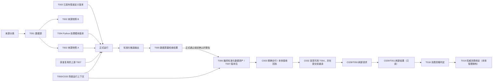
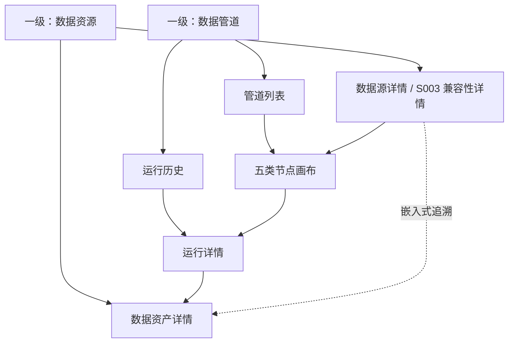

# 新项目功能设计：阶段 2 数据工程

> 版本：v0.1（本轮修订稿）  
> 文档状态：已完成数据工程内部自检，待用户评审；本文的“通过”仅表示设计合同内部对账通过，不等于原型行为已验证、真实运行验收完成或用户评审通过。依据 D102/I041，已补入 v1.1.0 实施对账；原型层 P0/P1 与真实来源、运行、跨模块和生产实施 P0/P1 分开记录，未将原型回归或本文自检写成模块评审通过
> 权威依据：平台总控台账中已生效的 D001—D067、术语 T001—T055、合同 C001—C033；Q025 已由 D057 解决，Q026 仍待后续 S003 完整设计裁决
> 已生效裁决：Q005—Q012、Q014 已由总控 D026—D034 解决；本文直接执行，不再重复请示  
> 当前建设顺序：S001 仍是首个完整闭环；S003 当前只做 D051—D053 规定的数据工程兼容性验证，不开展完整场景建设。S003 场景不是永久禁用：待全部模块原型完成后返回开展完整建设，并通过新的正式管道、正式 T007、C028/C029 和 T019 进入消费链；当前“仅兼容性验证、不可消费”的特定 T007 不得原地改成正式消费版本
> S003 本轮数据确认：业务评估时点为 `2025-12-31`；财务金额币种为 CNY（人民币）、金额单位为元；`财务数据!I1` 为本年字段，`AA1` 为上一年字段，修订版已将 AA1 唯一化为 `利润总额_本年累计数(上年)`  
> 当前唯一评审原型：用户已选定方案 B2（高信息密度作业台）；B1/B3 只作历史评审证据，不再作为待选方案，不新建 B4、“最终版”或平行主原型
> 当前信息架构：一级工作区只保留“数据资源、数据管道”；来源分类、T001 数据源、T002 来源快照、T003 管道定义版本、正式运行、T006/T007 数据资产及版本和本体刷新严格分开；运行历史只保留正式运行，追溯嵌入对应详情
> 当前画布：S001 使用“数据源、Python 处理、数据检查、发布数据资产、提交本体刷新请求”五类节点；数据源节点允许 `1..n` 个并分别绑定 T004 声明的命名输入槽，汇入唯一 Python 节点，Python 之后仍是数据检查→发布数据资产→提交本体刷新请求的无分支主链；右栏负责当前节点配置或只读属性，底栏按节点动态展示大宽度数据、代码、运行结果与证据；S003 受 D051—D053 限制，不配置或执行刷新节点
> CR 状态：CR030 已新建 T055/C033“场景运行上下文与定向重置合同”，CR031 已补强 C003“数据资产版本及精确交付回执”，均已由总控修改后接受；CR028/T054/C032 的刷新目标发现合同亦已生效。本文直接执行这些合同以及 D066/CR026、D067/CR027、CR022、CR025，不新建平行合同；合同生效不等于 M02 已完成真实交换或联调
> 当前联调停止线：历史最近一次实际业务证据为 M02 已上传、运行并发布 `FIN-ASSET-20251231-v01`，M01 仍引用 `FIN-ASSET-20251130-v01`；当前本地重置后的平台工作投影为 `0/15`。两者是不同场景运行轮次下的不同事实，不得相互覆盖。IT-CON-003、IT-MOD-006、IT-RUN-001 尚未关闭，当前不得宣告 S001 跨模块联调通过
> 已登记合同边界：数据工程按 D044/D056/D057/C017 提供精确数据版本、T008、质量、刷新、消费证据、上一可信、保留和数据侧可复现事实；不设计报告解释、Agent 运行或业务数值计算。一期不把“真实执行历史数据侧重放并证明一致”设为通用硬门，固定证据、双摘要、五维状态和诚实降级仍为一期必做
> 智能问数对账边界：D026/D031/D034/D064/D065、C003/C008/C017 的版本、候选验证、回退和事后硬质量失败策略已经生效；CR022 已允许智能问数受限只读取得 C017 可信度元数据。本文形成数据侧输入字段、证据安全投影和验收合同，但字段交换、稳定证据编号、权限负向样例和 DE22—DE25 真实联调完成前不得称为已可用
> 当前模块：仅数据工程；不详细设计本体管理、智能问数、决策中心、Agent 应用或报告中心  
> 交付性质：功能设计；不包含代码、接口、数据库表、微服务、技术栈、部署拓扑或实施任务  
> 当前首个完整闭环目标（S001）：用一个演示账号真实走通“来源进入—原始快照—Python 处理—质量门—不可变数据资产版本—请求已绑定本体刷新—收到消费就绪结果”，使后续智能问数能够使用最新可信数据；S003 当前只做兼容性验证

## 0. 评审结论

### 0.1 一期闭环

`[一期最小实现]` 数据工程一期不是完整数据中台，而是一条真实、可重复、可失败、可恢复、可追溯的融资数据链路：

```text
手工上传融资工作簿 / 指定共享文件夹发现新文件
→ 登记 T002 原始快照与 T008 数据截至时间
→ 运行预置且版本化的 T004 Python 处理模块
→ 执行 T005 数据质量检查
→ 发布逻辑 T006“融资标准化数据资产”的不可变 T007 版本包
→ 按 C003 向本体管理精确交付该 T007 并取得同一交付标识的接收/拒绝回执
→ 按 C032 读取并选择本体管理已建立的可用刷新目标绑定，提交前重新读取
→ 按 C028 提交本体刷新请求
→ 接收并只读展示刷新结果与消费就绪证据
→ 后续智能问数按权威合同使用最新可信数据
```

其中，“T007 资产已发布”“C003 已交付且被本体管理接收”“C028 请求及受理回执”“C029 刷新结果及其 T018 资格判定”“C008/T019 已采用”是五个不同事实。数据工程拥有第一项、C003 交付记录和 C028，只读展示本体管理返回的 C003 回执、C029/T018 以及后续独立形成的 C008/T019 采用证据；任何前置事实都不得被解释为 T019 已采用。T007 发布后即使 C003 交付失败仍保持已发布且不可改写，但该版本不得继续提交 C028；本体管理接收 C003 也不等于已受理刷新。D034 已确认由本体管理唯一拥有并原子提交 T019，数据工程只读。

### 0.2 十项功能结论

1. 数据工程拥有 T001—T008 相关资源及 T053 的版本证据，不拥有或编辑 Object Type、Property、Link Type、Metric、Rule、Action Type。
2. 一期真实支持工作簿手工上传和指定共享文件夹自动读取；SAP、司库、企业数据中台只作为明确标注“未接入”的规划资产演示，不冒充真实资产。
3. S001 画布有“数据源、Python 处理、数据检查、发布数据资产、提交本体刷新请求”五类节点；数据源可有 `1..n` 个，每个节点只绑定一个 T004 命名输入槽，全部汇入唯一 Python 节点，Python 之后仍是无分支单链。画布可拖拉拽、连线、配置、保存草稿、校验、运行调试、发布管道定义、正式运行、定位失败和重试。质量是 Python 后的唯一检查节点；刷新节点只按当前稳定 T006 动态读取 C032，选择其中可用的精确 T054，并在提交前重读；不得把本地夹具、管道定义或导航参数中的 T054、T017、来源映射版本当作权威真值。
4. 一期按全量快照更新；正式运行必须锁定已发布的 T003、精确 T004，以及每个输入槽实际解析出的 T002 或获准上游 T007 与成员范围，形成正式 T005。复用 T007 还须锁定发布时许可、字段/粒度/稳定键、质量、保留、访问条件和防循环结论，并保留完整追溯。正式运行、T007、C003 交付/回执、C017 摘要、C028/C029 均须原样携带同一 C033 场景运行上下文。发布管道定义、正式运行、发布 T007、交付 C003、提交 C028 是不同动作；候选失败时 T019 不切换，全部正式历史保留且不提供删除入口。
5. 数据工程不得把工作簿直接交给智能问数，也不得自行维护一份与 T019 冲突的“最新版本”指针；低延迟边界是提供最新可信资产、明确数据截至时间和刷新证据。
6. 数据工程不保留独立一级“数据沿袭”页面；来源、输入版本、运行节点、资产版本、刷新请求、刷新结果和消费证据作为嵌入式只读追溯链，分别从来源、运行和资产详情进入。画布内完整端到端沿袭只归“提交本体刷新请求”节点，发布节点只展示发布前来源追溯摘要；Object、Property、Link 等语义沿袭仍归本体管理。
7. 数据工程按 D044/D056/D057/C017 可向报告中心提供不含业务明细、绑定精确 T007 的“数据可信度与可复现摘要”；业务对象、Metric、Rule 仍经 Published 本体和 T019 权威路径消费，LLM 不得读取工作簿、T002、T007 成员或质量失败样例。一期必做五维状态和“未执行/依赖不足”诚实降级，但不把真实历史重放设为通用硬门。
8. S003 真实工作簿须同时出现在“数据资源”的来源卡和“数据管道”的第二条管道卡中。来源卡只显示数据源自身事实；“数据内容已确认·待受控发布验证 / 不可消费”放在兼容性详情和管道卡。D053 已接受 CR018，I023 已重定向；但当前仍无真实 T001、T002、T053、T003、受控运行、T005、成员稳定标识或 T007，故不得显示运行成功、发布成功、兼容性验证通过、刷新或 T018/T019。本轮不评分，也不建设 S003 本体、Agent、报告、驾驶舱或决策流程。该限制只约束当前兼容性验证阶段及其特定不可消费版本，不取消 S003；全部模块原型完成后返回 S003 完整建设时，必须另建正式管道并形成新的正式候选 T007。
9. 面向智能问数，数据工程只从绑定精确 T007 的同一 C017 摘要形成受限安全投影：T008、质量/新鲜度、候选与数据侧上一合格版本、刷新和稳定证据编号；不新建平行可信度资源，也不另维护质量或刷新状态。当前/上一权威组合、Published 语义版本和 T019 只作本体侧只读引用。该投影不暴露工作簿、物理源字段、整表、Python 细节或失败业务样例，不负责选择 Published 资源、解释 Metric/Rule、生成回答、导出 CSV 或发起 Action；完整双版本一致性证明仍由 C008/T019 Owner 与消费运行共同形成。
10. 数据工程不创建 T055，只从平台公共场景目录取得并原样传播稳定 `scenarioId`、`scenarioVersion`、不可变 `scenarioRunId`、上下文形成时间和状态。缺失、未知、停用或错配时不得进入当前场景投影或发起跨模块写入。定向重置只重建指定场景的新轮次工作投影，不删除、覆盖或改写历史 T002、T003、正式运行、T005、T007、C003、C017、C028/C029 及归档证据；`scenarioId` 不得成为 T001 身份或唯一键。

### 0.3 一期成功判据

| 成功结果 | 不得记为通过的情形 |
|---|---|
| 同一演示账号在当前场景轮次实际上传指定融资工作簿，或由已配置共享文件夹发现新文件，形成文件指纹、读取时间和真实 T002 | 后台预置夹具、历史快照、静态页面或写死运行结果被算作本轮上传 |
| 原文件被登记为 T002；T008 由用户明确确认并记录确认人、确认时间和依据，内容重复、来源和读取结果均可见 | 只保存文件名；用上传时间、文件修改时间、页面默认值或工作簿生成日期静默代替 T008 |
| 五类节点画布能从空白草稿搭建：`1..n` 个数据源按命名输入槽汇入唯一 Python，之后连接数据检查、发布数据资产和提交本体刷新请求；可保存、校验、运行调试、发布只读管道定义并发起正式运行，同一画布按节点动态展示配置、数据、代码、运行与证据 | 把草稿保存、发布管道定义、正式运行、发布数据资产或本体采用混成一个“发布”；画布只是静态图片；用多个输入节点暗中增加 Join、Union、分支或第二个 Python |
| 预置融资 Python 模块的说明、版本、参数、输入、输出、结果可核对 | 隐藏脚本版本；允许任意脚本绕过模块登记和质量门 |
| 质量门真实检查 5,218 条明细，失败会阻断发布 | 只抽样、失败仍发布、把未知值静默改成 0 或肯定类别 |
| 发布形成 T006“融资标准化数据资产”的新 T007 版本包，四个具名成员、三条成员关系及版本清单可核对，并可反查来源快照、管道、模块和质量证据 | 发布工作簿或脚本冒充资产；覆盖旧版本；发布后无法证明成员、关系、来源和处理过程 |
| T007 发布后以稳定交付标识向本体管理发送精确 T007/T008、四成员三关系、质量、来源和 C033 上下文；本体管理以同一交付标识和精确 T007 返回接收或拒绝、时间、原因、目标 Draft 修订及旧新替代关系 | 用内置旧资产、名称匹配、页面默认值、成功跳转或不同交付标识代替精确交付/回执；把“已接收”写成刷新或采用成功 |
| S001 刷新节点按当前 T006 真实读取 C032，区分可用、尚未建立、未发布、停用、覆盖不足和未知；提交前重读且只有精确 T054/绑定版本/T017/映射未漂移时才按 C028 提交 | 从本地夹具、管道定义或导航参数读绑定；无可用绑定反向阻断 T003/T007；绑定漂移后仍提交 |
| C028 只有本体管理明确返回接受才显示“已受理”；拒绝显示“未受理”，超时或通信不确定显示“结果未知”；只读展示 C029/T018，再单列 C008/T019 采用证据 | 用定时器、页面跳转或静态状态产生成功；混淆 C003 接收、C028 受理、C029 成功、T018 资格和 T019 采用 |
| 新候选失败时不污染当前可信消费组合；恢复方式和上一可信证据可见 | 一次失败导致问数无数据，或静默读取候选半成品 |
| 从来源、运行或资产详情可进入嵌入式追溯；画布内从刷新节点展开端到端沿袭，核对所有上游 T002/T007、锁定成员、管道、质量、资产、C028、C029/T018 与独立 C008/T019 证据 | 删除独立沿袭页时一并删除追溯证据，把完整沿袭放在发布节点，或请求已发出就显示刷新成功/消费就绪 |
| `[已登记 D057]` 给定一个精确历史 T007，可返回版本绑定的可信度、保留和数据侧五维状态；未执行真实重放时明确写“未执行/依赖不足”，且摘要不含业务行、业务值或失败样例 | 把“最近摘要”回填到旧报告、把不可定位记成质量失败、向 LLM 暴露工作簿/T002/T007 成员，或把真实重放误设为所有场景的一期硬门 |
| `[已登记 CR022/CR024/CR025；待字段样例与真实联调]` 一次智能问数运行锁定同一 C017 安全投影中的一个精确 T007/T008/质量摘要/证据集合；候选不进入正式回答，T019 切换前后运行不混版，证据编号可定位但 Prompt 不取得源内容 | 新建第二套可信度资源或把几个来自不同版本的显示字段拼成“可信上下文”；将最新文件、候选 T007、C029 成功或数据侧合格状态冒充 T019 已采用；用静态字段宣称联调已通过 |
| S003 来源卡只展示来源事实，兼容性详情和管道卡如实展示双成员结构与“待受控发布验证”；只有真实取得 T001/T002/T053/T003、受控运行、T005、双成员稳定标识和 T007 后，才可标记“兼容性验证通过（仅兼容、不可消费）” | 用已接受合同或静态夹具冒充真实运行；编造任何资源标识、发布、刷新或消费结果 |
| 从本轮真实上传到 C003、C032、C028/C029 的运行记录、回执和深链均回显同一 C033 场景/版本/轮次；定向重置后形成新轮次，历史事实仍可定位 | 场景身份缺失或错配仍提交；把场景写入 T001 身份；整体清空或轮换本地状态模拟隔离；用当前 `0/15` 覆盖历史 `3/15` |

## 1. 定位与边界

### 1.1 数据工程解决的用户问题

数据工程把持续变化的来源数据转化为本体可稳定引用的 T006 数据资产，并让演示者回答以下问题：

- 数据从哪里来，何时发现，反映的业务事实截至何时；
- 本次实际读取了什么，是否与历史内容重复；
- 哪个 T003 数据管道版本和 T004 Python 处理模块版本处理了它；
- T005 检查了什么，失败多少条，为什么失败，如何恢复；
- 哪个 T007 已经发布，包含哪些成员，各成员的字段、业务粒度和行数是什么；
- 向哪个已绑定本体发起了刷新请求，返回了什么状态和证据；
- 新数据失败时为什么 T019 未切换，当前仍服务哪一权威组合，以及数据侧上一已通过版本和上一权威历史组合分别是什么；
- 某次智能问数运行的数据版本、T008、质量摘要和证据是否来自同一个可证明的数据上下文；对象不存在、无匹配、真实零、零分母、覆盖不足和质量/映射异常是否被诚实区分；
- 给定旧报告引用的精确 T007，今天是否仍可定位、访问、核对证据或完成数据侧重放，不能时具体原因是什么。

### 1.2 拥有、引用与禁止越界

| 边界 | 资源/责任 | 数据工程功能合同 | 明确不承担 |
|---|---|---|---|
| 拥有 | T001 数据源 | 登记稳定来源身份、分类、读取方式、状态、最近发现/成功、适用 T008、快照摘要和自动读取配置 | 场景不是 T001 的身份、唯一键、目录归属或筛选条件；不把 `scenarioId`/`scenarioRunId` 写回来源，不定义业务对象和指标口径 |
| 拥有 | T002 原始快照 | 保留实际读取内容与来源证据，登记 T008、重复/冲突/失败状态 | 不直接供本体或智能问数消费 |
| 拥有 | T003 数据管道 | 管理编辑草稿与已发布只读定义版本；保存 S001 五类节点、`1..n` 数据源到 T004 命名输入槽的连线、输入版本规则、参数、受控脚本版本、管道运行计划和失败恢复 | 不承载 Metric、Rule、Action Type；不把多个数据源节点扩成 Join/Union/分支；不把调试作为长期运行历史 |
| 拥有 | T004 Python 处理模块的登记结果与运行配置 | 选择已预置模块版本，展示说明、参数、输入输出和运行结果 | 一期不在线编辑代码、不上传任意脚本 |
| 拥有 | T005 数据质量检查 | 判断候选输出是否满足发布和刷新最低要求 | 不判断融资风险阈值，不代替 T015 Rule |
| 拥有 | T006/T007 数据资产及版本 | 逻辑资产、成员清单、成员级粒度/字段/行数、T008、正式质量、来源、版本、发布证据及版本化复用许可；作为其他管道输入时提供许可、质量/保留/访问条件、锁定成员和完整来源链 | 不把数据成员等同于 Object Type；不允许复用绕过质量、循环检查、C028/C029、T018 或 T019 |
| 拥有 | T053 人工业务输入快照 | 对 S003 企业因子值的一次正式人工提交保留来源、主体、T008、前序快照和版本证据，并映射到 T007“调节因子”成员 | 不把因子定义、分档、系数、行业适用规则、权重、公式或阈值变成管道配置；单次假设模拟不形成 T053 |
| 拥有 C003 交付记录；引用接收回执 | 精确数据资产交付 | T007 发布后形成稳定交付标识，发送精确 T006/T007/T008、成员/关系、质量、来源和 C033；展示本体管理按同一交付标识返回的接收/拒绝/未知、原因、目标 Draft 修订及旧新替代关系 | 不用名称匹配、内置旧版本、默认值或成功导航代替交付与回执；接收不等于 C028/C029、T018 或 T019 |
| 引用 | T055/C033 场景运行上下文 | 从平台公共场景目录取得并在根投影、运行、发布、跨模块请求、回执和深链中原样传播；缺失、未知、停用或错配时拒绝进入当前投影或业务写入 | 不创建、改写或复制场景定义；不把场景写成 T001 身份；不通过整体替换本地状态模拟隔离 |
| 产生；仅 S001 当前完整闭环 | 本体刷新请求 | 按当前 T006 读取 C032，仅选择可用的精确 T054；提交前重读并固定发现响应、T054/绑定版本、T017/映射版本、候选 T007/T008、质量、C033、重试关系和请求时间 | S003 当前不得发起刷新；不创建/编辑 T054、T017、本体映射或 T019；不把拒绝/超时写成受理，不让旧版本重试请求降级 |
| 只读引用 | T054/C032 刷新目标绑定及发现包络 | 展示本体管理返回的候选、覆盖、Owner、证据、不可用原因与恢复建议；返回节点或提交前重新读取 | 不在本地维护绑定真值，不从管道定义、URL 或静态夹具拼装目标；可用不等于刷新或采用成功 |
| 引用 | 本体刷新结果 | 只读展示处理中、成功、失败、不兼容、未知、原因、恢复提示和证据 | 不展示或控制本体内部实现步骤；“已受理/未受理”属于刷新请求回执 |
| 引用；D034 已确认 Owner | T018/T019 | 显示本体管理返回的消费就绪与权威绑定摘要；数据工程只读 | 不提交冲突指针，不自行决定智能问数读哪一版 |
| 提供 C017 受限投影 | 获准消费者的数据可信上下文输入 | 通用摘要绑定精确 T006/T007/T008、质量与后续发现、刷新/采用只读证据、候选/上一版本和五维状态；智能问数取得第 10.7 节安全投影，决策中心只取得 C011 三道安全门最小投影；读取与响应回显 C033 | 不含业务明细、源字段、工作簿、失败样例、Metric 公式或 Rule 阈值；不新建平行可信度资源，不选择 Published/T019，不生成 C011 或维护消费者状态 |
| 只作边界引用 | T014—T016、T020—T025 | 在证据中引用精确版本或资源标识 | 不设计其页面、旅程、状态机、公式、阈值或回答逻辑 |

### 1.3 相邻模块边界

- 本体管理：按 C003 接收数据工程以稳定交付标识发送的精确 T007、T008、四成员三关系、正式质量、来源和 C033，并以同一交付标识返回接收/拒绝回执；按 C032 唯一提供 T054、精确 T017 和来源映射版本的只读发现包；按 C029/C008 返回刷新与采用证据。其内部如何形成 Draft、映射 Object Type、Property、Link Type、Metric、Rule、Action Type 不在本文设计。
- 智能问数：业务事实只能经 Published 本体和 C008/T019 权威消费路径取得。CR022 已将智能问数列为 C017 的受限只读消费者，数据工程可按第 10.7 节从同一 C017 摘要提供不含业务明细的安全投影；字段交换和真实联调未完成前不得宣称路径已可用。数据工程不新建平行可信度资源，不向其提供工作簿、T002 内容或 T007 成员，不配置 Agent 系统提示词/Skill，不定义回答、CSV 或 Action 逻辑。
- 决策中心：只可按 C017 读取 C011 接收、正向人工确认提交和负责人待办形成三道安全门所需的最小质量投影；每道门重新读取并携带 C033。数据工程不创建 Action Request、提醒、确认或待办，不提供业务明细或失败样例，也不决定门禁后的业务动作。
- Agent 应用、报告中心：业务对象、Metric、Rule 和报告数值仍通过 T019 指向的 Published 语义资源消费，不直接读取工作簿、T002 或 T007 成员。报告中心可按已确认的 C017 读取不含业务明细的可信度元数据；Agent 只能经报告中心固定的 C022/T037 证据包获得获准上下文，不能把该摘要扩展成原始数据入口。本文不设计报告页面、解释逻辑或 Agent 运行。

因此，T007 是可被本体稳定引用、并已按 D066/CR026 在显式获准时作为其他管道输入的发布物，但不等于已经面向业务消费者开放的通用查询接口。复用必须在正式运行开始时解析并锁定精确 T007 与成员范围，核对许可、字段/粒度/稳定键、质量、保留、访问和防循环条件，并保留完整上游来源链。S001 当前闭环必须先获得本体刷新与 T019 权威绑定证据，数据工程不得用“资产已发布”替代“消费者可用”；S003 当前兼容性版本被 D051 明确禁止进入刷新和消费，但 S003 场景后续完整建设形成的新正式 T007 可按届时合同进入刷新与消费链。

## 2. 用户、任务与能力地图

### 2.1 一期用户

`[已生效裁决 D003]` 一期只有一个演示账号，完成来源登记、上传、画布配置、运行、发布、刷新请求和失败重试，无需登录演示、角色切换、权限申请或治理审批。

| 用户任务 | 用户动作 | 可观察结果 |
|---|---|---|
| 登记来源 | 创建手工上传或共享文件夹来源 | 一条可搜索、可查看状态的 T001 |
| 形成快照 | 上传工作簿或等待文件夹发现文件，提供 T008 | 一条 T002，显示来源、内容重复判断和处理状态 |
| 配置管道 | 新建草稿，拖入 `1..n` 个数据源及其余四类唯一节点，把各来源绑定到 T004 命名输入槽 | 可保存、可校验、可运行调试的无分支草稿；发布后形成可用于正式运行的只读 T003 定义版本 |
| 检查处理 | 选择预置融资模块，查看输入输出与差异 | 稳定、可重复的标准化候选输出 |
| 判断质量 | 查看逐项检查、失败数量、样例和影响 | 通过、有警告或失败的明确结论 |
| 发布资产 | 确认 T006、四个成员、三条成员关系、T008、正式质量和版本说明 | 不可原地修改的 T007 版本包 |
| 提交本体刷新请求 | 在 S001 画布的刷新节点只读选择本体管理已建立的目标绑定，提交本次 T007 并发起 C028 | 请求标识及已受理/未受理回执，以及本体管理返回的只读 C029、T018、T019 状态或失败恢复提示 |
| 证明就绪 | 查看外部返回的消费就绪证据 | 候选 T007、目标语义版本、结果时间和证据可追溯 |
| 证明历史可信度 | 按精确 T007 查看版本绑定/当前状态摘要 | T008、质量/刷新、保留、定位和数据侧可复现状态明确，摘要不含业务明细 |
| 验证 S003 来源兼容性 | 读取真实工作簿，识别双成员并执行结构、键、类型、枚举、T008 和跨成员匹配检查 | 给出“合同兼容/不兼容”、逐项质量证据和阻断原因；不运行评分或进入消费链 |
| 恢复失败 | 打开失败节点，修正输入或配置后重试 | 旧证据不被覆盖；新运行与原失败关联 |

### 2.2 功能能力地图

| 能力域 | 一期最小能力 | 后期扩展位置 |
|---|---|---|
| 来源管理 | T001 目录；手工上传；指定共享文件夹 | 企业数据中台、SAP、司库、数据库等真实连接器 |
| 摄取与快照 | T002 登记、内容去重、T008、全量快照、冲突/失败处理 | 增量批次、CDC、实时流、跨文件编排 |
| 管道编排 | S001 五类节点画布；`1..n` 个数据源分别绑定 T004 命名输入槽并汇入唯一 Python，Python 后保持单链；新建草稿、配置、保存、校验、运行调试、发布管道定义、只读查看、正式运行、发布资产和重试 | Join、Union、分支、条件、并行、通用加工算子、多人变更评审 |
| Python 处理 | 画布脚本组件选择预置融资标准化模块，按其命名输入槽接收一个或多个已锁定的 T002/T007 输入，支持参数配置、限定样例调试和完整输入试运行 | 受控模块登记、评审和多模块复用 |
| 数据质量 | 通用规则类型、作用字段、条件、严重级别、阻断/警告、失败数量、证据样例和恢复建议；S001/S003 只是已配置实例 | 趋势、专职 Owner、治理豁免和跨项目告警 |
| S001 资产与版本 | T006 目录、含四个具名成员、三条成员关系和版本清单的不可变 T007 版本包、三层数据管理、内嵌运行历史；按 D066/CR026，获准 T007 可在许可、结构、质量、保留、访问和防循环门禁通过后作为其他管道输入 | 生产归档、受控删除和跨项目完整影响分析；真实复用与循环负向联调仍待验收 |
| 刷新协同 | 发起请求，展示外部结果与恢复方式 | 多本体依赖和批量刷新协同 |
| 消费证据 | 按 D034 只读展示本体管理返回的 T018/T019 证据 | 多消费者订阅与服务级别 |
| 可信度与可复现摘要 | `[已生效 D044/D057/C017]` 按精确 T007 形成版本绑定摘要，说明 T008、质量范围、刷新、只读消费证据、保留、五维状态及“未执行/依赖不足”，不含业务明细 | 通用真实历史重放、大规模恢复、法律保留操作和跨场景可信度服务 |
| 智能问数数据可信上下文 | `[已登记 CR022；待字段样例与真实联调]` 从绑定单一精确 T007 的 C017 摘要提供安全投影、证据编号和空/零/失败分责状态；不复制 C017 状态，完整上下文引用 C008/T019，不自建权威指针 | 问题理解、Published 资源选择、Metric/Rule 运行、回答/CSV/Action 决策和语义证据拼装 |
| 嵌入式追溯 | 在数据源、输入版本、正式运行和资产详情中展开只读追溯；画布内端到端链从刷新节点查看，覆盖全部上游 T007/T002/T001、运行、质量、资产、C028、C029/T018 和独立 C008/T019 证据，不设独立一级页 | 跨项目搜索、字段级语义沿袭和完整影响分析 |
| S003 兼容性验证 | 数据资源来源卡展示工作簿来源事实；兼容性详情与第二条管道卡展示双 Sheet、共同 T008 和已核验质量事实；专用四步预期结构不含刷新，无真实 T003/运行/T005/T007 时不显示结果 | S001 闭环通过后按 D024/D051 启动 S003 完整业务设计 |

后期能力只能作为说明文字出现，不得成为一期页面中的按钮、禁用入口或一期验收门禁。

## 3. 演示工作簿核验事实与数据准备边界

### 3.1 已核验工作簿

`[附件核验事实]` 《融资一览表_一期演示数据.xlsx》包含四张工作表：

当前核验文件大小为 `807264` 字节，SHA-256 为 `83232e2dda913e63d2faa1e45aab824270f4ab5bcb96849a44ab8a03f93db12d`。本节结构、数量和样例事实只适用于实际读取后命中该完整指纹的文件；命中时可以引用这份已核验结构档案，但仍须形成本轮真实 T002 并独立确认 T008。实际上传/发现的其他指纹不得套用本节 5,218 行等固定事实，必须重新识别并在完成结构验证前阻断正式运行。

| 工作表 | 核验结果 | 数据工程用途 |
|---|---|---|
| `2-融资一览表明细` | 5,218 条融资明细、35 个字段 | Python 模块的融资明细业务输入 |
| `单位负责人映射` | 574 家单位、574 个单位编码、24 个负责人标识 | 标准化主体—负责人数据输入 |
| `Sheet1` | 工作簿说明、完整性校验及 Metric/Rule 演示样例 | 仅作人工验收参照；不作为数据工程权威业务口径 |
| `场景问数样例` | 三家演示主体、组合问数和机构归因样例 | 仅作跨模块验收参照；不写入 Python 逻辑或问数答案 |

当前固定演示工作簿还具备以下可核对事实：

- 5,218 个借据编号均非空且唯一；
- 574 家脱敏融资主体；
- 24 家脱敏金融机构，每条融资均有机构字段；其中银行 5,169 条、非银 49 条；
- 24 个不同融资负责人标识；574 家主体一期均恰有一个负责人标识，多家主体可以对应同一负责人；
- 集团人民币余额合计为 2,161,338,700,000 元；
- 三家演示主体存在并可稳定定位：演示单位553 / `UNIT-553` / 融资负责人001，演示单位465 / `UNIT-465` / 融资负责人009，演示单位561 / `UNIT-561` / 融资负责人009；
- 利率形式缺失 212 条、期限种类缺失 212 条、担保方式缺失 1,868 条；这些缺失必须诚实保留并在质量摘要中说明，不得静默改成 0、否或其他肯定类别。

上述数量只作为当前固定演示文件的验收基线，不是未来融资资产的永久业务规则。

### 3.2 T008 数据截至时间缺口

工作簿没有可作为权威 T008 的明确字段。文件生成日期 `2026-08-09` 只说明演示文件生成时间，不能静默当作业务数据截至时间。

一期功能规则：

- 手工上传时必须由演示者显式填写 T008；未填则快照进入“等待数据截至时间”。此时可使用明确标记为“草稿待确认”的临时时点参数执行限定样例、无副作用的 Python 单节点或截至数据检查前的结构调试，但不得发布管道定义、启动正式运行、形成正式 T005/T007 或创建 C028。
- 共享文件夹来源必须配置经业务确认的 T008 获取方式，例如约定文件名日期或伴随的批次说明；无法取得时同样等待补充。
- T008 确认必须记录确认人、确认时间和依据；读取时间、文件修改时间、发现时间和 T008 分开显示。上传时间、文件修改时间、页面默认值和工作簿生成日期均不得替代 T008。
- 修改 T008 不能原地改写已发布 T007；如果已发布版本时点错误，必须形成带纠正说明的新运行和新版本。

### 3.3 D007 产业板块名称澄清

`[已生效裁决 D007；用户本窗口再次明确]` D007 的业务意图不是把全部产业板块强制归并为六类，而是直接把演示数据中用户指定的来源名称替换成对应展示名称；“核能、核燃料、集团及直管公司、数字化”保持原值，不参与归并。

| 需要替换的原名称 | 演示数据展示名称 |
|---|---|
| 产业金融-司库、产业金融-资本控股 | 产业金融 |
| 非动力核技术 | 核技术 |
| 核服集团 | 产业服务 |
| 科技型环保 | 环保产业 |
| 能源国际 | 境外新能源 |
| 新能源控股 | 境内新能源 |

`[附件核验事实]` 当前演示工作簿已经完成上述名称替换，融资明细实际保留 10 个有效展示值：产业服务 10 条、产业金融 128 条、核技术 297 条、核能 1,123 条、核燃料 51 条、环保产业 72 条、集团及直管公司 99 条、境内新能源 3,258 条、境外新能源 175 条、数字化 5 条，合计 5,218 条。四个保留值不再视为未映射，也不触发质量失败。

一期功能规则：

1. Python 脚本组件不再配置产业板块映射表，也不对四个保留值进行自动归类；
2. 数据质量只核对演示工作簿已经使用上述 10 个有效展示值，并检查旧名称没有残留；
3. 若后续文件重新出现旧名称或未知名称，质量门阻断发布并要求先修正演示源数据，不由数据工程猜测归类；
4. 总控已依据 CR-DE-003 把 D007 澄清为六组标签替换；本文只落实该已生效裁决，不再要求把四个保留值映射到六类。

### 3.4 S003 债务风险监测数据兼容性验证（D051）

#### 3.4.1 阶段结论与验证对象

`[已生效裁决 D051]` S003 当前只验证数据工程能否真实接入、校验、版本化并追溯债务风险输入；S001 仍是首个完整闭环。本节不构成 S003 页面、本体、评分模型、Agent、驾驶舱、报告或决策流程设计。

本轮核验两个用户指定附件。经用户明确授权，只修订演示工作簿 `财务数据!AA1` 的表头，未改任何业务数据；修改前后均核验了 Sheet、范围、样式和数据校验配置。未执行 Skill 中的评分、服务、预警、审批或待办逻辑：

| 附件 | 核验身份 | 本轮用途 |
|---|---|---|
| `企业债务风险评估模版.xlsx`（用户指定 WeChat 路径） | 修订前 SHA-256 `dd917b497f43ebf5c72607b49d70ae049969a32505311fb6bf9aa7a85d36a498`；修订后 SHA-256 `dbdab9c870d7f2e456c3a9e0f91b340b372da6d40eb241551e0ee8848cac42a0`；唯一单元格值变化为 `财务数据!AA1` | 当前校正演示夹具；用于 S003 真实数据源兼容性输入 |
| `wind-debt-risk-skill.zip` | SHA-256 `731722434a309e4b76c4b83b6de82a2e590c50a524c611ccf5721c7516e2441b` | 候选业务逻辑和历史原型的静态参考，不是可整体接入的数据工程模块 |

总控已按 D052/D053 将 I023 重定向到当前校正兼容夹具，并保留修订前副本、旧/新哈希和 `财务数据!AA1` 唯一变化证据。I023 重定向只是权威制品索引更新，不等于已经登记 T001/T002。若修订前文件尚未形成 T002，当前夹具可作为首次真实来源；若已形成 T002，当前夹具必须形成新的 T002 并引用前序快照，任何情况下都不得覆盖历史快照。

当前结论分成三个维度，禁止用一个“通过”混淆：

| 结论层 | 当前结果 | 含义 |
|---|---|---|
| 合同结构兼容性 | 兼容 | C003/CR019 已能表达一个不可变 T007 共同包含“财务数据、调节因子”两个稳定逻辑成员，带共同 T008、成员画像、质量、来源和追溯，并标记“仅兼容性验证、不可消费”；无需再次修改 C003 |
| 当前文件内容准备 | 通过 | 重复表头已修正，`T008=2025-12-31`、币种 CNY（人民币）和金额单位元已确认；业务 Owner 已确认环保企业不涉及且不适用“电价波动率”，`调节因子!G18:G21` 保持为空并按条件不适用通过 |
| 受控发布治理准备 | 合同已具备、尚未实跑 | D053 已接受 CR018，I023 已重定向；但合同生效与制品就位均不等于已登记、已运行或已发布 |

当前仍无真实 T001/T002/T053/T003、受控运行、正式 T005、双成员稳定标识和兼容性 T007。只有按 D053 取得这些真实证据后，本阶段允许的最高状态才是 **“数据工程兼容性验证通过（仅兼容、不可消费）”**。该状态不等于 S003 场景就绪、本体就绪、可消费、已评分或已完成；不得发起 C028/C029，不形成 T018/T019，不向其他模块提供正式业务消费。

#### 3.4.2 双成员、业务粒度、键和共同发布

工作簿识别结果如下。“财务数据”“调节因子”是展示名；每个成员在首个 T007 形成时还必须获得系统生成、跨后续版本稳定的成员标识，页面和证据不得只靠展示名关联。

| 稳定逻辑成员 | 来源范围 | 当前数据量 | 业务粒度 | 当前兼容验证主键 | 最小字段 |
|---|---|---:|---|---|---|
| 财务数据 | `财务数据!A1:AA22` | 21 条数据、27 个物理列 | 一行一个企业在一个评估时点的财务输入 | `单位名称规范值 + T008` | 单位名称、共同 `T008=2025-12-31`、B—AA 全部 26 个具有唯一字段身份的财务输入物理列；金额字段元数据为币种 CNY（人民币）、金额单位元 |
| 调节因子 | `调节因子!A1:I22` | 21 条数据、9 个物理列 | 一行一个企业在一个评估时点的正式因子输入 | `单位名称规范值 + T008` | 单位名称、共同 T008、产业板块、公司类别、融资能力（已用授信余额/授信总额）、担保情况、总部支持程度、电价波动率、是否存在重大诉讼、资金余缺预警 |

“财务数据”B—AA 的 26 个财务输入物理列必须完整保留，范围包括流动负债、营业收入/利润/净利润、交易性金融资产、利润总额、存货、实收资本、应收账款、所有者权益、流动资产、经营现金流、营业成本、负债、财务费用、货币资金、资产总计及历史比较输入。这里的“完整保留”是数据接入合同，不授权数据工程计算 15 项指标或解释财务业务口径。

财务成员按来源顺序的最小物理字段为：A `单位名称`；B `流动负债合计_年初余额`；C `流动负债合计_期末余额`；D `营业总收入_本年累计数`；E `营业利润_本年累计数`；F `净利润_本年累计数`；G `交易性金融资产_期末余额`；H `利润总额_上年同期累计数`；I `利润总额_本年累计数`；J `存货_期末余额`；K `存货_年初余额`；L `实收资本（股本）_期末余额`；M `应收账款_期末余额`；N `应收账款_年初余额`；O `所有者权益（或股东权益）合计_期末余额`；P `所有者权益（或股东权益）合计_年初余额`；Q `流动资产合计_期末余额`；R `经营活动产生的现金流量净额_本年累计数`；S `经营活动现金流入小计_本年累计数`；T `营业成本_本年累计数`；U `负债合计_期末余额`；V `财务费用_本年累计数`；W `货币资金_期末余额`；X `资产总计_期末余额`；Y `资产总计_年初余额(上年)`；Z `利润总额_上年同期累计数(上年)`；AA `利润总额_本年累计数(上年)`。

用户已确认 I 列表示本年、AA 列表示上一年；在共同业务评估时点 `2025-12-31` 下，分别登记为 2025 本年累计和 2024 上年本年累计。共同 T008 是版本级业务日期，不伪造成源文件已有物理列，但必须进入两个成员的逻辑键、T053 生效时点和版本证据。币种与单位拆分登记为 `currency=CNY（人民币）`、`amount_unit=元`，只约束财务金额字段，不套用于调节因子枚举。

关联和发布规则：

1. 当前两表各有 21 个单位，单位名称均非空、唯一，原值集合和顺序完全一致；可建立同一 T008 下的严格一对一发布校验：`财务数据.(单位名称规范值, T008) = 调节因子.(单位名称规范值, T008)`。
2. 上述等式是**数据层跨成员完整性约束**，用于证明两个成员的企业集合一致；它不是 C003 中需要声明的业务成员关系，更不是本体 Link。S003 当前画像不虚构成员关系。
3. “单位名称”当前只能作为来源自然键。未来进入正式本体消费前，应由业务合同提供稳定单位编码和别名/歧义处理；本阶段不在数据工程内设计 S003 Object 或 Link。
4. 两个成员必须使用同一 T008、同一 T007 版本身份和同一版本用途，原子化共同发布。任一成员出现硬失败时，两者均不得形成 T007；不得部分发布、跨版本拼装或分别宣称通过。
5. 一个已正式提交的因子工作簿版本形成新的 T002，并为因子输入形成新的 T053；若质量通过并获准形成兼容性资产，则两个完整成员共同形成一个新 T007。T053 映射到“调节因子”成员，不是第三个资产成员；旧 T002、T053、T007 均不覆盖。
6. 单次假设模拟参数不形成正式 T053，不进入 T007，也不得自动触发评分、刷新、Action Request 或待办。

#### 3.4.3 质量核验结果与硬阻断

| 检查项 | 当前事实 | 质量结论与恢复方式 |
|---|---|---|
| 工作表与重复表头行 | 两个目标工作表均存在，数据区中没有再次出现整行表头 | 通过；仍须与“重复字段名”分开判断 |
| 单位名称和跨成员匹配 | 两表各 21 个单位，非空、唯一，集合与顺序一致 | 当前通过；正式质量门仍须检查规范化后重复、缺失、仅一侧存在及歧义，并要求双方键集合完全相等 |
| 财务必填与类型 | B—AA 共 546 个数据单元均为数值，无空值或文本混入 | 当前通过；允许合法负数，不以通用“必须非负”规则阻断利润、现金流或财务费用 |
| 因子必填与枚举 | 除 `调节因子!G18:G21` 外均非空；全部非空值均在工作簿下拉枚举内。业务 Owner 已确认环保企业的债务风险监测规则不涉及且不适用电价波动率，所以无需填写 | 通过；平台质量门执行条件规则：`公司类别=环保` 时该字段必须为空并显示“业务不适用”，其他类别按当前必填和枚举合同校验。源文件 `G2:G1000` 未声明允许空值是模板校验配置待优化项，不再作为数据内容阻断 |
| 数据截至时间 | 源内没有时点列；用户已确认本次共同评估时点为 2025 年底 | 通过；精确登记 `T008=2025-12-31` 并绑定两个成员及 T053。上传、发现、文件创建或修改时间仍不得替代 |
| 金额单位与币种 | 用户已确认财务金额为人民币元 | 通过；版本和财务字段合同分别登记币种 CNY（人民币）、金额单位元，不从数值量级猜测，不影响因子枚举 |
| 字段唯一性与期间 | 修订前 I1/AA1 同名且 21 行数值逐行不同；用户确认 I 为本年、AA 为上一年，当前校正夹具已将 AA1 改为 `利润总额_本年累计数(上年)` | 通过；27 个表头现均唯一，I/AA 原始数值未改变；保留修订前后指纹和唯一单元格变化证据 |

“利润总额”字段修订与后续解析的强制处理规则：

- 修订前文件必须按 I、AA 两个物理列保留原值和旧哈希，不得覆盖、丢弃、自动合并或只保留第一次出现；当前校正夹具只改 AA1，所有业务数据、两张表的范围和数据校验配置均保持不变；
- 经用户确认，I1 保持 `利润总额_本年累计数`，AA1 使用 `利润总额_本年累计数(上年)`；在 `T008=2025-12-31` 下分别表示 2025 本年累计和 2024 上年本年累计，不再使用无业务含义的机械 `_2` 后缀；
- 若旧文件已登记为 T002，当前校正夹具必须形成新 T002 并引用旧快照；若尚未登记，则以校正夹具作为首次 T002，同时在来源修订证据中保留旧哈希、旧表头和修改理由；
- Skill 的预期列清单仍重复声明 `利润总额_本年累计数`，其读取逻辑只保留第一次出现的同名列，实际会静默忽略 AA 列；D053/CR018 已生效的“债务风险输入标准化”受控能力不得复用该解析实现，必须按物理列位置与唯一字段合同同时保留 I、AA。

一期平台质量门必须独立校验枚举，不能把 Excel 下拉提示当成已通过。当前来源中的候选枚举集合如下，定义、分档依据、调整系数和行业适用范围仍由 S003 业务 Owner 决定：

| 因子字段 | 当前来源允许值 |
|---|---|
| 产业板块 | 核电、新能源、其他 |
| 公司类别 | 新能源产业-风电、核电、环保、在建企业 |
| 融资能力 | 良好、一般、较差 |
| 担保情况 | 未涉及担保、仅提供担保、仅获得担保 |
| 总部支持程度 | 高、较高、中、较低、低 |
| 电价波动率 | 电价变化率小于等于-15%、电价变化率小于等于0且大于-15%、电价变化率大于0 |
| 是否存在重大诉讼 | 无重大诉讼、一般性诉讼、重大诉讼 |
| 资金余缺预警 | 当月资金余缺预警、未来第一个月资金余缺预警、未来第二个月资金余缺预警、未来第三个月资金余缺预警 |

空值、非法枚举或新增枚举不得被静默采用默认档、相近值或零调整。业务 Owner 已确认 `调节因子!G18:G21` 四行均为环保企业，其债务风险监测规则不涉及且不适用“电价波动率”，所以无需填写。本轮按以下最小输入合同执行：

- `公司类别=环保` 时，电价波动率必须为空；质量结果显示“业务不适用”，不显示“数据缺失”，不填零、不补默认档，也不推导调整系数；
- 其他公司类别仍按当前来源的必填和枚举合同校验；本轮不进一步定义其行业适用范围、系数或评分逻辑；
- 当前 Excel 模板 `G2:G1000` 的下拉配置尚未表达上述条件规则。推荐在下次来源模板修订时改为与平台合同一致的条件校验，但不改变当前四个空值，也不阻断本轮数据内容兼容；
- 本次用户确认作为来源规则证据随 T002/T053 保存。未来若业务规则改变，必须形成新的规则证据和新 T002/T053，不回写本次输入。

#### 3.4.4 因子边界和 Skill 静态审计

企业在某个评估时点的**因子取值**属于业务输入数据，数据工程可以接入、校验和版本化。以下内容不属于 T003/T004/T005 配置：因子定义、分档、调整系数、行业适用范围、15 项指标权重、评分公式和风险等级阈值。数据工程不得维护风险评分、Metric、Rule、Action、预警或待办。

`wind-debt-risk-skill` 静态审计结果：

| Skill 内职责 | 识别结果 | 本轮处理 |
|---|---|---|
| 双 Sheet 读取、列名归一、单位名称关联和数值转换 | 可作为未来输入标准化范围参考，但当前实现会静默丢失第二个重名列、容忍缺字段/非数值、覆盖重复单位且缺少 T008 | 不直接复用；仅提取质量风险和候选范围 |
| 15 项指标、行业权重、评分公式、因子模型、系数和风险等级 | 候选业务逻辑，不是数据工程质量或管道参数 | 不接入、不执行、不登记为 T004/T005 |
| HTML 仪表盘和报告 | 历史呈现原型 | 不作为报告中心正式产物或 S003 页面设计 |
| 自动预警、审批、权限、本地 JSON 待办 | 决策/治理/应用职责，且分析入口会触发写入 | 不执行，不写 `todo_store`、上传目录或审计日志 |
| 浏览器 `localStorage` 与本地 HTTP 服务 | 本地原型运行机制 | 不启动、不读写 `localStorage`、不纳入平台功能合同 |

因此，整个 Skill 不能接入数据工程，也不能用它的运行结果证明兼容性。ZIP 中的配置和既有待办只作历史参考，不是权威业务合同或正式数据源。

#### 3.4.5 合同对账与 CR018 已生效最小受控处理合同

| 合同 | S003 对账结论 |
|---|---|
| C001 数据源登记 | 可表达该真实工作簿来源；登记仅表示来源存在，不表示 S003 功能已建设 |
| C002 原始快照 | 可表达原文件、内容指纹、读取时间、`T008=2025-12-31`、前序快照和不可覆盖证据；修订前后文件若都已进入平台，必须分别登记并保留前序引用，不得覆盖 |
| C003 数据资产版本 | CR019 已把合同修订为“通用不可变版本包络＋场景成员画像”；能够表达 S003 双成员共同发布、成员级字段/类型/粒度/质量、来源和“仅兼容性验证、不可消费”，无需新增 C003 CR |
| C021 场景清单 | 已登记权威阶段“S003 数据工程兼容性验证”和细化状态“数据内容已确认·待受控发布验证”；不能登记场景就绪、已评分、可消费或已完成 |
| C031 S003 人工业务输入快照 | 可表达企业因子取值及其来源、主体、时点、前序版本和后续 T007；T053 进入“调节因子”成员，不形成第三成员 |

`CR018` 已由 D053 接受并关闭，以下内容是已生效的最小受控处理合同，不再处于待裁决状态，也不修改 D030 对 S001 的约束：

1. D030“预置融资工作簿标准化 v1”继续完整约束 S001；S003 在同一“已登记、版本化、按场景白名单选择”的 T004 机制下使用“债务风险输入标准化”受控能力。
2. 该能力只负责识别两个 Sheet、按唯一字段合同完整保留 I/AA 两列、执行单位规范/重复键/跨成员匹配、必填/数值/条件枚举/T008/单位币种检查，并输出双成员候选和质量证据；不得复用会因重名而忽略 AA 列的 Skill 解析实现。
3. 明确排除指标计算、评分、权重、因子定义/分档/系数、行业适用规则、风险等级、HTML、报告、预警、审批、权限、Action 和待办；仍不开放在线代码编辑、任意脚本上传或任意依赖。
4. 正式因子调整通过重新上传真实工作簿或指定共享文件夹发现形成新 T002 和新 T053；质量通过且获准发布时，形成包含两个完整成员的新 T007，并引用前序 T002/T053/T007。不得覆盖旧版本、只发布“调节因子”或自动刷新本体。
5. 表头、T008、金额单位/币种和环保企业电价波动率条件不适用四项数据问题已解决，I023 也已重定向；下一步不是继续裁决合同，而是按 D053 真实执行“新工作簿→T002→同次关联 T053→受控处理→T005→双成员 T007”并保留证据。

合同虽然已经接受，但在真实受控运行前仍只能证明 C003 在文字上容纳双成员，不能声称已形成可追溯、不可变且不可消费的兼容性 T007。不得整体接入 Skill，以免把业务评分、待办写入和静默数据修正错误地带入数据工程。

#### 3.4.6 相邻模块准确边界与阶段验收

下列文本作为后续模块对账边界，不授权本窗口修改其文档或设计其内部能力：

| 模块 | 准确边界文本 |
|---|---|
| 本体管理 | S003 场景不是永久禁用；但当前兼容性验证形成的特定 T007 永久保持“不可消费”，不得进入本体资产选择器，也不得创建当前阶段的 S003 本体/Published 语义版本、Object、Property、Link、Metric、Rule、Action Type 或 T017 来源映射。全部模块原型完成并返回 S003 完整建设、满足届时正式输入门后，必须通过新的正式管道形成新的正式候选 T007（具备提交本体刷新的资格），再经 C028/C029 形成 T018，并由本体管理提交 T019 后才可消费；不得原地解除旧兼容性 T007 的限制。字段到属性、单位到对象及关系如何映射由本体管理另行设计。 |
| 智能问数 | 总控 C021 当前权威阶段为“S003 数据工程兼容性验证”，细化状态已登记“数据内容已确认·待受控发布验证”；未来只有真实证据齐备并由平台公共层更新后，才可显示“兼容性验证通过（仅兼容、不可消费）”。在没有 Published S003 语义和 T019 前，不创建问数配置、不运行测试问题、不回答 S003 业务问题；不得把兼容性通过解释成数据就绪。 |
| Agent 应用 | 只读显示 C021 阶段状态，不创建 S003 Agent Definition、Skill、Tool Allowlist、Ontology/Scenario Binding 或正式运行。不得读取原始工作簿/T002/T053/当前兼容 T007、整体登记或运行 `wind-debt-risk-skill`，也不得执行其评分、HTTP、HTML、预警审批、`todo_store` 或 `localStorage` 逻辑。后续只能经 Published 本体、T019 权威路径和获准业务计算能力取得对象、Metric、Rule 或风险结果。 |
| 报告中心 | 按已登记 C021 同时显示“数据工程兼容性验证：数据内容已确认·待受控发布验证”和“完整场景未建设”，不得从当前兼容版本或原始工作簿取业务值，不生成 S003 驾驶舱、报告、可信度业务卡、Report Copilot 上下文或“与当前数据比较”，当前也不提供比较入口、不形成 C027。若收到非法跨模块比较请求，按 C021 阶段拒绝并说明“当前阶段未形成权威消费绑定”，不得写成“数据陈旧”。Skill HTML 不得被导入、iframe、包装或发布为正式受控 HTML。 |
| 决策中心 | 只读显示 C021 阶段状态且不提供操作入口。当前不得创建 S003 风险 Metric/Rule、预警、Action Request、提醒、审批或待办；Skill 中的自动预警、审批、权限和本地待办只作历史原型参考；评分模型和风险阈值 Owner 留待 Q026/S003 完整设计。 |

只读全面对账还发现以下相邻文档同步债务；这些问题不授权本窗口修改相邻文档，也不产生新的数据工程合同 CR：

| 相邻模块 | 对账瑕疵 | 收敛方式 |
|---|---|---|
| 本体管理 | S001 仍有“三成员”残留，且尚未明确 S003 兼容版本不可选 | 按已生效 D049/C003 清除为“四成员＋三关系”，按 D051 增加 S003 禁入边界；这是既有 G016 回写，不新建 CR |
| 智能问数 | 已引用 D051，但尚未把“兼容性通过不等于数据就绪”落实为明确拒绝 | 按 C021、D051 同步状态与拒绝文案，无 Published 语义/T019 时不配置、不运行、不回答 |
| Agent 应用 | S003 仍偏向“资料待补/保留绑定入口”，且部分 D042—D050 标签过期 | 改为只读阶段卡，删除可绑定歧义并同步已生效合同；不是新 CR |
| 报告中心 | S003 仍偏向“资料待补”，RC-DE-008 未拆开当前兼容结论与未来正式刷新/消费 | 同时展示兼容验证状态与完整场景未建设；未来刷新/消费继续待完整设计，不生成当前业务内容 |
| 决策中心 | S003 状态、S001 三成员假设和 DC-DE 待确认标签均滞后 | 同步 D044、D049—D051、C003/C021；数据工程只负责 T007/T008 等数据事实，不承担 Metric/Rule 快照口径 |

阶段验收结论：

- **已完成**：真实来源可读；双成员可识别；粒度、当前自然键、跨成员匹配、字段范围和质量问题已形成证据；C003 结构兼容；Skill 职责边界已识别且未执行危险逻辑。
- **已解除的数据问题**：I/AA 期间与唯一表头、共同 `T008=2025-12-31`、币种 CNY（人民币）、金额单位元和环保企业电价波动率条件不适用规则均已确认并形成证据；当前没有数据内容硬阻断。
- **未完成**：尚未真实登记 S003 T001/T002/T053、创建 T003、执行受控处理、形成正式 T005、生成双成员稳定标识和兼容性 T007。
- **当前已登记细化状态**：平台公共层已在 C021 登记 `数据内容已确认·待受控发布验证`；数据工程只忠实展示，不自行改写阶段枚举或提前升级状态。
- **当前禁止标记**：`数据接入准备完成`、`S003 场景就绪`、`本体就绪`、`可消费`、`已评分`、`已完成`。
- **真实证据齐备后允许标记**：`数据工程兼容性验证通过（仅兼容、不可消费）`；仍须等待 S001 闭环通过和后续 S003 完整设计，不能继续建设或消费。

## 4. 资源关系、三层数据管理与生命周期

第 4—14 章除明确标注的 S003 兼容性条目外，其余可执行页面、画布、发布、刷新、消费和验收闭环均以 S001 为对象；其中“四成员＋三关系”是 S001 场景画像，不是所有 T007 的通用结构。C003 的通用版本包络及 S003 双成员画像以第 3.4、4.3、13.3、14.1 和 15 章为准。

### 4.1 资源关系

页面和旅程统一使用以下语义，不得互相借名：

| 概念 | 功能定义 | 不等于 |
|---|---|---|
| 来源分类 | 数据获得渠道，如手工工作簿、共享文件夹、SAP、司库、数据中台 | T001，也不是业务场景 |
| T001 数据源 | 一个稳定登记、可持续接收后续快照的来源实体 | 某一份工作簿、某个 Sheet 或 T006 |
| T002 来源快照 | 某次实际取得的文件或来源批次证据 | T001，也不是运行结果 |
| 工作簿/Sheet/字段/样例行 | 所选 T002 的原始物理内容 | 加工后的资产成员 |
| T003 管道定义版本 | 节点、连线、参数和受控 T004 版本的可复现配置 | 一次运行或 T007 |
| 正式运行 | 一个已发布 T003 对各命名输入槽解析并锁定的精确 T002 或获准 T007 的一次完整执行 | 调试、预览、管道定义或资产版本 |
| T006 数据资产 | 经处理、质量门和正式发布的稳定逻辑数据产品 | T001、T003 或 Object Type |
| T007 数据资产版本 | 某次正式运行在门禁允许后发布的不可变结果 | 时间最新候选或已被 T019 采用 |
| C003 精确交付/接收回执 | 数据工程把一个已发布精确 T007 交付给本体管理，并取得同一交付标识的接收、拒绝或未知回执 | T007 发布、C028 受理、C029 成功或 T019 采用 |
| T055/C033 场景运行上下文 | 平台提供、各模块原样传播的场景/版本/不可变轮次身份包 | T001 来源身份、任一业务资源 ID 或成功状态 |
| T054/C032 刷新目标发现 | 本体管理按稳定 T006 返回的版本化目标绑定及只读发现响应 | 数据工程配置、C028 请求、C008/T019 权威消费绑定 |
| 本体刷新 | 本体管理对候选 T007 进行兼容性、刷新和采用的独立过程 | 管道处理或资产发布 |



一个 T001 可持续产生多个 T002，也可由不同场景的 T003/T006 引用；场景不是 T001 的身份或目录归属。一个获准 T007 也可按 D066/CR026 作为另一 T006 的管道输入。一次正式运行必须按 T004 命名输入槽锁定它实际消费的全部 T002/T007、T007 成员范围以及许可、质量、保留、访问和防循环结论，并原样携带一个有效 C033；一次成功发布至多产生一个新 T007；同一 T006 可累积多个不可变 T007。多份输入是否共同形成一个 T007 取决于已发布 T003 和预置 T004 的输入槽合同，不得从目录页默认推断，也不得借多数据源节点扩展 Join、Union、分支或多文件复杂编排。D029 仍约束一期每个原始输入文件按一份完整全量 T002 处理。

### 4.2 三层数据管理

数据工程内部采用三层，不把原始文件、处理中间结果和正式资产混成一个资源：

| 层级 | 内容 | 可编辑性 | 可被后续本体选择 | 主要证据 |
|---|---|---|---|---|
| 原始层 | T002 原文件或来源批次证据 | 不改写原内容；可补充未发布快照的 T008 和处理说明 | 否 | 来源、文件名、内容指纹、发现/读取时间、T008 |
| 标准化层 | Python 输出和质量检查使用的候选数据 | 只能通过新试运行/新正式运行重建 | 否 | 模块版本、参数、输入输出摘要、质量结果 |
| 资产层 | 已发布的 T007 全量数据快照 | 不可原地修改 | 仅版本用途/消费状态允许时可选；S003 当前兼容性版本为否 | 版本、字段与粒度、T008、质量、来源与运行追溯 |

消费就绪不是数据工程的第四存储层，而是跨模块返回的状态和证据。即使刷新失败，已发布 T007 仍然存在；它只是没有获得本次消费就绪结果。

### 4.3 核心资源合同

| 资源 | 一期必须展示 | 生命周期 |
|---|---|---|
| 来源分类 | 分类名、已登记 T001 数量、可用状态摘要、展开/收起 | 只是目录组织，不产生版本和场景身份 |
| T001 数据源 | 名称、说明、来源分类、接入方式、登记状态、最新快照取得时间、最新 T008、快照数、来源同步计划摘要和最近同步结果 | 登记中、可用、暂停、登记/读取异常；按 D067/CR027，场景不是必填身份、唯一性依据、目录归属或筛选条件，历史场景字段只兼容保留；同一 T001 可被不同场景引用 |
| T002 来源快照 | 本轮真实上传/发现事件、文件名、字节数、实际读取时间、完整 SHA-256 与显示摘要、T008 及本轮确认证据（确认值、确认人、确认时间、依据和完整 C033）、工作簿/Sheet 数、总条目数、各 Sheet 条目数、字段数、登记结果、失败原因或重复指向、前序快照和关联正式运行 | 读取中、等待确认 T008、登记完成、登记失败、内容重复·复用已有快照；文件指纹来自实际读取的文件内容，不能由文件名、时间或随机值拼接；同内容可指向已有 T002，但新 `scenarioRunId` 仍必须形成本轮 T008 确认证据；“当前最新/较早快照”只是时间位置标签，不是状态；历史目录事实与本轮场景输入资格分开展示 |
| T003 管道定义版本 | 明确的“管道定义版本”、节点、连线、T004 命名输入槽、固定版本或受控跟随规则、参数、T004 版本、校验结果、发布说明、创建/发布时间、是否被管道运行计划引用 | 编辑草稿、校验失败、可发布、已发布只读、已被更新定义取代；固定版本显式改绑、成员范围变化或跟随规则本身变化才形成新 T003；同一受控跟随规则在各次运行解析为不同精确 T007 时只形成新运行锁定证据，不改写 T003 或历史运行 |
| T004 Python 处理模块版本 | 说明、版本、适用输入、输出字段组、公开参数、限制、最近运行结果 | 可选、已选、输入不兼容、运行失败、已停用；一期不做审批状态 |
| T005 结果 | 检查项、范围、状态、失败数量、样例、硬阻断/警告、影响和恢复建议 | 未运行、运行中、通过、有警告、失败、无法判断 |
| T006 数据资产 | 逻辑资产标识、场景、说明、用途/消费状态、T026 Owner、场景成员画像、最新数据侧发布版本和来源；S001 固定为“融资标准化数据资产”及四成员三关系，S003 当前只登记双成员兼容画像 | 无版本、已有发布版本；T006 本身不是一次运行产物。“最新发布”不是“当前 T019 权威”；S001 可汇总刷新/消费状态，S003 当前固定“仅兼容性验证、不可消费”且不出现刷新状态 |
| T007 数据资产版本 | 通用字段为版本、场景语义、完整 C033、用途/消费状态、T008、稳定成员清单、成员级字段/类型/粒度/行数/主外键/质量、成员关系、全部输入 T002/T007、T007 锁定成员范围、处理模块版本、正式 T005、发布时间、版本说明、复用许可和从最终版本到全部上游 T007/T002/T001 的完整来源链；S001 为四成员三关系，S003 为“财务数据、调节因子”双成员且不声明本体关系 | 一经发布即不可变；可被后续版本替代但不被覆盖。发布时缺少有效 C033 或与正式运行轮次错配即拒绝形成 T007，不能事后补写；获准复用须满足许可、字段/粒度/稳定键、质量、保留、访问和防循环门禁；S001 外部消费状态只读追加；S003 当前兼容性版本不得复用、刷新或进入 T018/T019 |
| T053 人工业务输入快照 | 快照标识/版本、S003 场景、业务主体、来源工作簿/T002、企业因子取值、提交/生效时点、共同 T008、前序快照和后续 T007 引用 | 一次正式提交形成新快照，不覆盖旧值；映射到“调节因子”成员而不是第三成员；单次模拟参数不进入 |
| 调试结果 | 当前草稿/节点、限定样例、草稿时点参数及“待确认”标记、耗时、输入输出差异、预览刷新时间、日志和错误 | 只在画布底部即时展示，新调试成功后同时刷新输入/输出预览并覆盖上次即时结果；不进入长期历史、不可发布/消费、不是正式审计证据；临时时点不得冒充 T008 |
| 正式运行 | 运行编号、C033 场景运行上下文、管道名称、已发布 T003、精确开始/结束时间和耗时、触发方式、操作者/计划、各命名输入槽锁定的 T002/T007 与成员范围、T007 复用门禁结论、T008 值及本轮确认证据引用、节点时间线、运行/质量/数据变化/资产候选/发布/交付/刷新/消费就绪状态、失败和重试关系 | 排队、运行中、等待确认、已结束、失败；只有手工正式、定时正式、正式失败重试和手工同步触发的正式运行进入历史；运行及关联重试开始前必须重新核对 T008 确认证据的 C033 与当前轮次一致，不得沿用旧 `scenarioRunId` 的确认；受控跟随在运行开始时解析后不得漂移；场景上下文缺失或错配时不得进入当前投影 |
| C003 精确交付与回执 | 稳定交付标识、`sourceModule=数据工程`、`contractCode=C003`、精确 T006/T007/T008、版本用途/消费状态、四成员三关系稳定身份及成员字段/类型/粒度/行数/主外键/质量、正式 T005、来源 T002、精确 T003/T004、发布时间/版本说明、完整 C033、发送时间/状态；回执回显同一交付标识/T007、接收/拒绝/未知、接收时间、拒绝原因、目标 Draft 修订版本和旧新替代关系 | 待交付、发送中、等待回执、已接收、已拒绝、结果未知；交付失败不撤销 T007，但阻断该版本 C028；同一交付标识只能幂等查询原回执，不得把原拒绝覆盖为接收；拒绝后再受理的新尝试身份与关联字段见第 15.2 节待收敛项；接收不等于刷新或采用 |
| C032/T054 发现（引用） | 发现请求和响应原样回显完整 C033；发现响应标识/版本、查询 T006、形成/读取时间；候选 T054、绑定版本/名称/状态、是否允许提交、精确 T017、来源映射版本、适用 T006、四成员/三关系覆盖、Owner、最近核验、不允许原因、恢复建议和证据 | 未读取、读取中、可用、尚未建立空结果、草稿/未发布、停用、T006 不匹配、覆盖不足、T017/映射不可定位、场景上下文不完整或错配、未知/读取失败；只读，不缓存为管道定义真值。响应 C033 与当前轮次、C003 或待提交 C028 不一致时拒绝选择，不能按名称补齐 |
| 刷新请求（S001） | 稳定请求标识、完整 C033、请求时间/状态、提交前 C032 响应与读取时间、所选 T054/绑定版本、精确 T017/来源映射版本只读引用、候选 C003/T007/T008、四成员三关系、字段/主外键/正式质量、既有 T019 只读快照、触发方式、重试来源和受理回执 | 待发起、排队、已发出、已受理、未受理、结果未知、未发出·已成为历史版本；只有本体管理明确接受才显示已受理；场景错配、C003 未接收、C032 不可用或提交前漂移均阻断；S003 当前不适用 |
| 刷新结果（引用） | 稳定 C029 结果标识、原 C028、与原请求完全一致的 C033、T054/绑定版本、T017/映射版本、候选 T007、处理中/成功/失败/不兼容/未知、对象/关系校验、原因、恢复建议、证据、T018 判定和结果形成时 T019 快照 | 只读追加，不改写历史结果；场景/轮次错配结果拒绝进入当前投影；C029 成功或 T018 具备资格不等于 T019 已采用，后续采用/切换必须另读 C008/T019 证据 |
| 数据可信度与可复现摘要 `[已登记 C017/CR022/CR025/CR029][真实读取与交换待验证]` | 摘要标识/版本/类型/形成时间、完整 C033、精确 T006/T007/T008、发布时质量与后续发现、事后硬质量失败、刷新、T018/T019 只读证据、候选/上一版本、新鲜度事实、C030 保留状态和五维数据侧可复现状态、原因与恢复；每次受限读取还须记录消费用途、请求方、完整 C033、所查精确 T007、读取时间、响应摘要身份/版本及读取状态；智能问数和决策中心只选择各自获准字段 | 版本绑定摘要形成后不可改写；读取按场景/轮次和精确 T007 筛选并回显，正常、不可定位、硬质量失败、依赖不足、场景错配和读取失败必须分开；不得以页面已显示摘要文字代替真实读取记录；不新建资源、不另维护状态，不得携带业务明细、失败样例或复制 T019 |
| T055/C033 场景运行上下文（引用） | 稳定 `scenarioId`、`scenarioVersion`、不可变 `scenarioRunId`、上下文形成时间和状态；平台根上下文来源及当前轮次定位 | 平台公共层拥有定义；数据工程原样传播。缺失、未知、停用或错配时拒绝当前投影/写入；定向重置形成新轮次，历史证据保留；旧无场景记录仅显式迁移、隔离只读或拒绝 |
| 数据侧重放核验 `[D057：非通用一期硬门]` | 未执行时展示五维状态及“未执行/依赖不足”；若后续受触发真实执行，再记录目标 T007、全部锁定输入 T002/T007 与成员范围、T003/T004/参数/检查集、复用门禁和完整来源链、时间、结论和证据 | 一期默认不建真实重放执行入口；S004 后续资料明确要求时才作为该场景条件验收；始终不形成正式 T005/T007，不发布/刷新、不影响 T019 |
| 发布后质量发现 `[已登记 C017]` | 发现标识、来源证据、目标 T007、异常检查项身份、严重级别、标准原因、影响成员/字段、发现/确认时间、说明和修正版引用 | 待确认、已确认、已排除、已由新版修正；追加记录，不改写原 T005/T007，不自行切换 T019 |

### 4.4 运行与节点状态

管道运行必须分开表达“执行过程是否结束”和“端到端闭环到了哪里”，不得用一个绿色“成功”覆盖质量、发布和刷新事实：

| 维度 | 一期状态 | 判断边界 |
|---|---|---|
| 执行状态 | 排队、运行中、等待确认、已结束、失败 | 描述本次实际执行节点；“已结束”不自动等于消费就绪 |
| 闭环结果 | 未发布、发布结果未知、已发布·待交付、已发布·等待接收回执、已发布·交付被拒绝、已发布·交付结果未知、已发布·尚无可用刷新目标、已发布·历史版本未请求刷新、已发布·等待刷新、刷新中、消费就绪、已发布·刷新失败、已发布·刷新结果未知 | 描述 T007、C003、C032、C028/C029 和权威消费证据；只在获得权威证据后显示消费就绪；交付或刷新失败不撤销 T007，发布结果未知则尚未确认 T007 是否形成 |

调试不进入正式运行生命周期，不产生正式 T005/T007/C028，也不进入运行历史。正式运行只能选择已发布 T003；草稿中的“运行调试”仅校验当前节点或截至数据检查的无副作用链路，新结果可覆盖底部面板上次即时结果。T008 尚未确认时，只能用明确标记“草稿待确认”的临时时点参数进行限定样例结构调试；不得发布管道定义或启动正式运行，输入/输出预览也不得把该参数显示为权威 T008。

节点级固定规则：

- 正式运行中未到达的下游节点显示“等待上游”，不显示“成功”；调试未涉及的节点显示“本次调试未执行”。
- 正在执行显示开始时间和已用时；不能仅靠动画表达。
- 节点执行成功必须绑定本次输入和输出摘要，不能复用旧运行的绿色状态。
- 数据检查程序可以“执行成功”同时 T005“质量失败”；前者表示检查跑完，后者表示数据未过门禁。
- 发布数据资产节点成功只表示 T007 已形成；C003 交付记录与本体接收回执单列。只有 C003 已被接收且 C032 当前返回可用目标后，刷新节点才允许提交；该节点可以同时显示“刷新请求已受理”和“本体处理失败”，五类事实必须分开。
- 任何运行、交付、刷新请求或回执的 C033 缺失、未知、停用或与当前场景/轮次错配时，显示“场景上下文不可证明”并拒绝进入当前投影；不得自动补为 S001。
- 节点失败显示责任位置、业务可读原因、受影响记录数和恢复动作。
- 发布节点成功而刷新失败时，闭环结果显示“已发布·刷新失败”，并明确该 T007 尚不可消费；恢复时用同一 T007 创建带新标识的重试请求并引用原请求，或按返回建议处理，不得原地改写请求证据，也不得伪造成整条链路成功。
- 发布动作返回不确定且尚未核实是否形成 T007 时显示“发布结果未知”；只有核实 T007 已存在、但刷新尚无确定结果时才显示“已发布·刷新结果未知”。两者不得合并为含义不清的“结果未知”。
- 用户明确把较早 T008 作为历史版本发布且不请求刷新时，显示“已发布·历史版本未请求刷新”，不能显示成稍后会自动继续的“等待刷新”。

### 4.5 C033 场景运行上下文与定向重置

平台公共场景目录拥有并提供 T055；数据工程不创建或修改场景定义，只在本模块根状态、业务记录和跨模块交换中原样传播。最小上下文字段固定为：

| 字段 | 数据工程使用方式 | 失败处理 |
|---|---|---|
| `scenarioId` | 稳定场景身份；当前为 S001 时只表示本次记录属于 S001 | 缺失、未知、停用或与页面场景不一致时拒绝进入当前投影或提交 |
| `scenarioVersion` | 证明运行时使用的场景清单版本 | 不兼容或不可定位时显示原因，禁止按名称猜测 |
| `scenarioRunId` | 一次场景工作轮次的不可变身份，贯穿正式运行、T007、C003、C017、C028/C029 | 缺失或错配时拒绝业务写入；不允许自动归入当前轮次 |
| 上下文形成时间/状态 | 证明平台何时形成该上下文及是否仍可使用 | 状态未知或读取失败时保守阻断并提供重读入口 |

定向重置必须固定目标 `scenarioId` 和旧 `scenarioRunId`，由平台公共层形成新的 `scenarioRunId`。数据工程在新轮次中清空上传待办、草稿运行态、未提交请求和当前工作投影，但保留且不改写历史 T002、T003、正式运行、T005、不可变 T007、C003 交付/回执、C017 摘要、C028/C029、T018/T019 只读证据和归档记录。历史最近一次实际证据和当前轮次投影分别展示，禁止把当前 `0/15` 写成历史失败或把历史 `3/15` 恢复成当前成功。

禁止通过复制、清空、轮换或整体替换模块本地状态模拟场景隔离。旧记录没有 C033 时，只能执行显式迁移、隔离只读或拒绝；不得自动补成当前 S001。跨模块导航只携带稳定定位上下文，不携带“已接收、可用、刷新成功、已采用”等状态；返回后必须重新读取相应 Owner 的权威状态。

## 5. 数据资源、原始快照与自动同步

### 5.1 数据资源目录

一期只有两类可操作 T001：

1. 工作簿手工上传；
2. 平台可持续访问的指定共享文件夹。本机演示使用项目目录下的固定文件夹；平台进程停止期间不扫描，恢复后补扫。

一级“数据资源”在同一工作区内区分“数据源”和“已发布数据资产”，但不合并资源语义：前者回答“数据从哪里来”，后者回答“正式发布了什么”。两个目录均支持卡片式与列表式视图，切换后保持相同搜索、筛选、排序和当前选择；列表一个条目一行，字段较多时仅列表区域横向滚动，不带动整页。卡片主体、列表行和统一“查看详情”操作均进入同一详情页。

来源分类必须作为卡片外部的可折叠分组标题，不把类别名做成每张卡的大标题。一期目录至少包含“手工工作簿、共享文件夹、SAP、司库、数据中台”五组；每组显示已登记 T001 数量、可用状态摘要及展开/收起。搜索和来源分类/登记状态筛选作用于卡片目录，不提供“场景”筛选。

数据源卡片或列表只显示来源自身能稳定提供的信息：名称、来源分类、接入方式、登记状态、最新快照取得时间、最新 T008、快照总数、来源同步计划摘要和最近同步结果。不显示“场景/S001/S003”、“四类业务内容”、加工后资产成员数或含义不清的“配置完整度”。按已生效 D067/CR027，场景归属只由后续 T003、T006 或 T034 引用表达，历史场景字段和值仅兼容保留，不作为来源身份、筛选或编辑字段。

目录必须把“历史已登记来源/快照”和“当前 C033 场景轮次已选输入”分开展示。历史目录中存在融资工作簿、文件名或快照记录，只证明过去曾取得或登记；定向重置后的当前轮次不得因此自动显示“本轮已上传”或允许正式运行。当前轮次只有发生真实上传或共享文件夹发现事件，形成新读取记录、内容指纹和真实 T002，且 T008 已由用户明确确认后，才具备推进资格。内置融资夹具、预置快照和页面默认 `2025-12-31` 只可作为历史或受控演示输入线索，不得作为本轮正式证据。

`[已生效裁决 D027]` 真实手工工作簿组至少包含“融资明细一览表”和“企业债务风险评估模版”。S003 目录卡只显示数据源事实；其权威阶段“数据工程兼容性验证”、内部结果“数据内容已确认·待受控发布验证”和“不可消费”放在兼容性详情和对应管道卡，不反向定义 T001。后期来源组展示：

| 规划来源 | 可演示说明的未来内容 | 强制状态 |
|---|---|---|
| SAP | 会计凭证行项目、会计科目主数据 | 后期规划来源·尚未真实接入 |
| 司库 | 银行账户流水、融资明细 | 后期规划来源·尚未真实接入 |
| 数据中台 | FIS 业务流程表单 | 后期规划来源·尚未真实接入 |

后期规划卡只能打开说明，不得显示虚假的 T007、T008、质量通过、连接成功、同步成功、快照、运行成功或消费就绪，不得提供连接、同步、运行或查看业务明细入口，也不计入一期真实来源和验收结果。

已登记的手工上传或指定共享文件夹 T001/T002，以及满足复用条件的已发布 T007，均可作为数据源节点输入。D066/CR026 已使该复用合同生效；合同生效不等于真实复用、循环拒绝和跨场景来源联调已经通过，原型或静态状态不得冒充运行证据。任何情况下均不得允许同一 T006 的输出直接或间接回读自身形成循环。S003 场景不是永久禁用，但当前“仅兼容性验证、不可消费”的特定 T007 永久不得进入选择器；后续 S003 完整建设形成的新正式 T007 可按相同复用门进入。

#### 5.1.1 数据源详情五页签

页头只保留数据源名称/说明、来源分类/接入方式、登记状态、最新快照取得时间、最新 T008、快照总数、来源同步计划/下次同步和适用的“上传新快照、立即同步、编辑设置”。不显示场景、“包含四类业务内容”、加工后资产成员或与页签重复的来源身份卡。

五页签是已经形成稳定 T001/T002、可持续接收后续快照的数据源详情合同。S003 当前仍处于 D051 兼容性验证、尚无真实 T001/T002 的只读例外：只展示“概览、内容与字段、快照历史、引用关系”四页签以及“查看修订证据、查看来源内容核验证据”，不展示“设置”、上传、同步、运行、发布或刷新入口；待后续受控登记形成真实 T001/T002 后，再按普通数据源恢复五页签。该例外不能扩展为另一套数据源详情产品结构。

| 页签 | 回答的问题 | 一期必须展示 | 不展示 |
|---|---|---|---|
| 概览 | 这是什么来源，现在是否正常 | 页头摘要、最新快照摘要、同步计划、最近同步结果、异常和下一步；手工来源显示“按需上传新快照”，共享文件夹显示实际计划/上次/下次/最近同步结果 | 加工成员和消费结论 |
| 内容与字段 | 所选来源快照里实际有什么 | 顶部先选 T002；工作簿/文件数、Sheet 列表、每 Sheet 行列数、表头/识别范围、字段名/推断类型/空值概况和 3—5 行真实脱敏样例 | “四个资产成员”、固定整个数据源的单一数量；常驻标注“样例预览，不代表完整数据或质量通过” |
| 快照历史 | 这个 T001 先后取得了哪些实例 | 取得时间、T008、文件名、哈希摘要、工作簿/Sheet 数、总条目、各 Sheet 条目、字段数、登记结果、失败原因/重复指向、查看内容/证据 | 把“历史”作状态；只能用“当前最新/较早快照”作时间位置标签 |
| 引用关系 | 哪些管道定义在用它，哪些资产版本源于它 | 分开的“当前管道引用”和“下游已发布资产”两区，见下文 | 模糊的单列“被引用情况” |
| 设置 | 这个稳定来源如何持续接收快照 | 名称/说明、接入设置、T008 识别、内容去重、共享文件夹匹配/子目录和来源同步计划 | “最近使用”、独立“技术证据”页签；哈希和识别范围进对应快照证据 |

引用关系页的“当前管道引用”每条显示管道名称、T003 定义版本、草稿/已发布状态、引用节点、最近正式运行并精确跳转该版本；“下游已发布资产”每条显示 T006、资产包/成员、T007、发布时间、T008、当前可信/历史版本位置、对应正式运行并精确跳转资产版本。

### 5.2 新建数据源与后续快照

数据源目录主按钮统一为“新建数据源”，不使用“手工上传文件”作页面级资源概念。点击后先选来源类型：一期可选“手工工作簿”和“指定共享文件夹”；SAP、司库和数据中台只可显示后期说明，不提供伪连接向导。

手工工作簿使用通用流程，不默认进入“融资一览明细表”或任何场景专用表单：

1. 填写数据源名称和说明。
2. 选择或拖入初始 `.xlsx` 工作簿；平台实际读取文件内容并记录读取开始/完成时间，读取失败不得形成 T002。
3. 展示文件名、字节数、修改时间、实际读取时间和由文件内容计算的完整 SHA-256/摘要；按真实指纹去重。不得以文件名、当前时间、随机值或它们的拼接冒充内容哈希。
4. 读取完成后独立选择 T008 获取方式，展示候选值、来源说明和依据；用户必须再次明确确认，系统记录确认值、确认人、确认时间、依据和当前完整 C033。未确认时状态为“等待确认数据截至时间”，旧 `scenarioRunId` 下的确认也不能充当新轮次确认；不得以上传时间、读取时间、文件修改时间、页面默认值或工作簿生成日期替代。
5. 识别工作簿、Sheet、表头行和数据范围，允许用户在登记前纠正识别结果。
6. 展示字段名、推断类型、空值概况和 3—5 行真实脱敏样例，明确“样例预览，不代表完整数据”。
7. 确认内容去重、T008、全量快照声明和登记规则。
8. 确认后一次完成 T001 和首个 T002 登记；登记成功不表示管道运行、T007 发布或消费就绪。已经读取但尚未确认 T008 的事件保留读取证据和失败恢复，不得伪装成登记完成。

若 T001 已存在，当前场景轮次只执行“上传新快照”，不得为同一来源重复创建 T001。事件记录同时显示“来源历史位置”和“本轮输入状态”：前者不带场景身份，后者引用当前 C033 并说明本轮是否已选择该精确 T002。`scenarioId`、`scenarioRunId` 只属于运行与交换上下文，不写入 T001 的身份或唯一键。

数据源建立后，后续文件统一从该 T001 详情的“上传新快照”进入，不每上传一份文件就新建数据源。新快照重复执行哈希、T008、Sheet/字段识别和登记确认；文件损坏、加密、Sheet 缺失、表头无法识别、T008 缺失和内容重复分别显示原因与恢复入口。快照登记后可跳转引用它的管道，但不在上传页重复设正式运行入口。

### 5.3 指定共享文件夹自动读取

`[已生效裁决 D028]` 当前本机演示推荐预设目录为：`/Users/domi/Public/Vibecoding/ontology3.0/demo_shared/融资数据待处理/`。页面显示绝对路径，并提供“在访达中打开”。该目录是平台明确配置且可持续访问的演示输入边界，不等同于任意监听桌面、下载或用户私人目录；一期不承诺电脑或平台进程停止后仍持续扫描，恢复后必须补扫并去重。

#### 5.3.1 共享文件夹登记与来源同步计划

| 配置项 | 一期合同 |
|---|---|
| 文件夹路径 | 一个平台可访问的固定目录；保存前必须测试访问 |
| 文件匹配 | 文件名或扩展名规则；页面给出命中/不命中样例 |
| 子目录 | 明确是否扫描子目录；默认不扫描 |
| 重复内容 | 按内容哈希复用已有 T002，不因改名重复登记 |
| T008 提取规则 | 从约定文件名日期或经确认的批次说明取得；配置时用样例文件校验提取结果，不得回退到发现时间 |
| 来源同步计划 | 默认“仅手工同步”；可改为简洁定时计划，如每日指定时间；显示时区、频率/时间、上次同步、下次同步、最近同步结果、启停和“立即同步”，不写死每 5 分钟 |
| 更新声明 | 每个命中文件均为独立完整全量快照，不追加、不合并 |

来源同步区只提供“测试访问、保存、启用/停用、立即同步”；“在访达中打开”是定位目录的导航。“立即同步”只执行“查找新文件→去重→登记 T002”，不因该按钮本身启动管道、发布资产或提交本体刷新请求。暂停的定时计划允许手工立即同步，操作后仍保持暂停。

#### 5.3.2 三类自动化边界

| 配置 | Owner/位置 | 触发和结果 | 明确不表示 |
|---|---|---|---|
| 来源同步计划 | T001 共享文件夹设置 | 按计划查找新文件，去重并登记 T002 | 管道成功、T007 已发布或消费就绪 |
| 管道运行计划 | T003 管道设置 | 可手工、发现新 T002 后触发，或按简洁定时计划运行；必须锁定已发布 T003、输入选择和操作/计划身份 | 快照登记就必然运行，或新草稿静默接管计划 |
| 本体刷新策略 | S001 “提交本体刷新请求”节点 | 新 T007 成功发布且存在可用目标绑定后，由手工或按已确认策略自动创建 C028；只读等待 C029/T018/T019 | 本体已采用、可消费或数据工程可写 T019 |

启用“新快照自动正式运行”前，必须明确已发布 T003、输入选择、T004、T006 与发布条件。启用“发布后自动请求刷新”还必须已有可用本体绑定和刷新策略。任一缺口都逐项说明，不启用必然失败的自动闭环。三类配置分开启停、分开显示上次/下次/最近结果，不用一个“自动同步”开关覆盖全部。

#### 5.3.3 自动发现、防重复与 T006 串行

- 同一来源串行登记文件；一次发现多个新文件时按 T008 由早到晚形成各自 T002。只有对应管道运行计划已启用时，才分别创建正式运行；一期不合并文件。
- 手工上传、文件夹自动触发、正式运行重试和已发布 T007 的刷新重试都指向同一个 T006，因此一期使用一条 T006 发布—刷新队列：同一时刻只有一个队列项进入有外部副作用的发布/刷新阶段，已开始者不被抢占；其余按 T008 从早到晚、相同 T008 按队列项创建时间排队，不因手工触发或重试而插队。
- 用户可从资产详情进入产生该 T007 的精确管道/刷新节点发起刷新重试；刷新节点先创建带新标识且状态为“排队”的请求，引用原请求和同一 T007，不立即发送。轮到该项时重新比较候选精确 T007/T008、当前可信 T007/T008 及同一时点的版本替代关系；若候选 T008 更早，或 T008 相同但候选已被后续更正 T007 替代，状态改为“未发出·已成为历史版本”，不产生刷新结果并释放下一项；否则才发出新请求。该规则同时防止跨时点降级和同时点旧内容回切。
- 当前队列项在以下任一情形后释放下一项：正式运行在发布前以失败结束；质量警告候选被人工明确结束且不发布；用户确认的较早 T008 作为历史 T007 发布且不请求刷新；重试请求因已成为历史版本而未发出；刷新请求明确未受理；刷新得到成功/失败/不兼容的确定结果；“发布/刷新结果未知”完成核对。等待质量警告确认、刷新处理中或未知结果尚未核对时不释放。这样避免多个候选竞争同一权威消费绑定。
- 已得到确定失败或不兼容 C029 的已发布候选，除保留“用同一 T007 创建新 C028 重试”外，还必须提供“结束当前失败候选并保留历史”。该动作只把当前队列项标记为已结束并释放下一次正式运行；失败 T007、原 C028、C029/T018、失败原因、恢复建议和运行关联继续只读可定位，不得删除、改写或解释为消费就绪，也不得切换、回退或自行修改 T019。
- 只登记已完整就绪且符合规则的文件；仍在写入的文件保留一条“等待文件就绪”记录，下一次检查继续核对，不重复生成 T002 或运行。
- 以内容指纹判断重复；文件改名但内容相同只处理一次，不产生新运行或新 T007。
- 每个文件视为完整全量快照；无法取得 T008 时停在“等待数据截至时间”，不自动用发现时间补齐。
- 相同 T008、不同内容标记“更正冲突”；同一演示账号填写更正说明后才可正式运行。
- 早于当前可信版本 T008 的文件可以形成历史 T002，用户明确继续并通过门禁后也可形成历史 T007，但不得自动覆盖较新可信消费时点或请求切换。
- 写入中、坏文件、T008 缺失、质量警告待确认或单次运行失败不阻断后续文件发现；每个问题文件只保留一条可更新状态，避免每次检查制造重复失败。
- 管道计划触发的正式运行遇到质量警告时进入“等待确认”，不得自动填写理由或继续发布；其他文件仍可被发现并登记，后续正式运行按上述 T006 队列等待，不把等待确认偷当通过。
- 平台进程恢复后补扫目录，并依靠内容指纹和已有处理记录防止重复执行。
- 发布结果未知时先核对原正式运行是否已经形成 T007，确认未发布后才允许重试；刷新结果未知时先查询原请求，不能直接重复发起并把新请求视为成功。

### 5.4 内容去重和时点顺序

| 情形 | 一期处理 | 是否产生新 T007 |
|---|---|---|
| 内容指纹与历史完全相同 | 标记重复并链接到原 T002；默认不触发新运行。若用户显式发起复核性正式运行，只能结束为“成功·无数据变化” | 否 |
| 文件名相同、内容不同、T008 更新 | 作为新全量快照运行 | 质量与发布通过后产生 |
| 文件名不同、内容相同 | 仍按内容重复处理 | 否 |
| T008 早于当前可信版本 | 登记历史快照；默认不刷新当前消费 | 仅在用户明确作为历史更正继续且通过时可产生，但不自动切换 |
| T008 相同、内容不同 | 标记更正冲突，要求说明 | 确认更正且通过后产生新版本 |
| 无 T008 | 等待补充 | 否 |

## 6. 五类节点管道画布功能合同

### 6.1 画布范围

`[已生效裁决 D012]` 一期必须可拖拉拽配置，但不建设 Palantir 式通用零代码加工。

画布由左侧节点库、顶部工具栏、中央画布、右侧节点配置栏和底部节点详情与证据面板组成。左栏用于选择和拖入节点，中央用于编排，右栏回答“当前节点准备如何配置”，底栏回答“当前节点实际有什么数据、代码、运行结果和证据”。

左栏、右栏和底栏边界均支持拖动调整、折叠和“恢复默认布局”。默认左栏能完整显示节点名称/说明，右栏能完整显示字段标签/输入控件，底栏能显示字段表和 3—5 行样例并支持最大化；调整后中央仍保留可编排空间。1440×900、1366×768 和 1280×800 下核心页面不出现整体横向滚动。

中央画布采用有效无边界工作区：用户向任意方向平移或拖动节点时，不出现可见硬墙、左侧碰壁或因当前视口尺寸限制节点位置；视口按内容持续扩展，节点坐标、缩放和视口位置随草稿保存。适应窗口只把现有节点纳入可见区，不改变坐标或自动重排；导航栏、右栏和底栏不随画布平移。

`[已生效 D066/CR026]` “数据源”节点支持手工上传或指定共享文件夹形成的 T001/T002，也支持选择获准复用的已发布 T007。来源与资产虽同处“数据资源”，仍必须显示不同类型、版本和可用条件；规划连接器与 S003 当前兼容性 T007 不可选，后续 S003 新正式 T007 不受当前阶段禁入限制。

节点库只保留统一“数据源”节点，不单列“已发布数据资产”节点。用户把数据源节点拖入画布后，在右栏选择器中按“原始数据源 / 已发布数据资产”分组；多成员 T007 以一张资产包卡片选择，不拆成多张成员卡。已发布资产选择器必须显示复用许可、精确版本或受控跟随规则、可选成员范围、质量/保留/访问条件和不可选原因，不把“数据侧最新合格”写成“当前权威”。

节点库按“数据接入、处理、质量、发布”分组；“发布”组只包含“发布数据资产”和“提交本体刷新请求”。五类节点卡保持同一尺寸和对齐基线，不以加长卡片区分正式闭环步骤；发布组节点使用克制的顶部色带、较强轮廓和“发布”类型标识与普通执行节点区分。节点卡和节点库中不显示“正式步骤·不参与试运行”这类内部实现文案；是否可试运行由顶部常驻按钮的启用状态及业务原因说明表达。连线锚点仅在编辑态悬停节点或正在连线时出现，不常驻显示装饰性圆点。

S001 的 Python、数据检查、发布数据资产和提交本体刷新请求各只有一个；数据源节点允许 `1..n` 个。每个数据源节点必须绑定唯一 T004 已声明的命名输入槽，多个来源只能汇入同一个 Python 节点；Python 之后仍为数据检查→发布数据资产→提交本体刷新请求的无分支、无循环主链。一个槽位不得同时绑定多个节点，未声明或重复槽位被拒绝；T004 没有声明多输入时不得增加第二个来源。节点库不出现 Join、Union、聚合、表达式、模型训练、实时流、外部写回或自定义代码节点，多来源也不得暗中形成这些能力。S003 兼容性管道不配置“提交本体刷新请求”，仍严格禁止 C028/C029/T018/T019。

### 6.2 五类节点与右侧配置栏

| 节点 | 必要输入 | 可配置内容 | 输出/预览 | 硬阻断 |
|---|---|---|---|---|
| 数据源 | 已登记 T001/T002 或按 D066 获准复用的已发布 T007 | 选择 T004 命名输入槽；选择原始来源或已发布资产；T002 使用快照策略、确定快照与 T008；T007 使用固定精确版本或受控跟随所选 T006 的最新数据侧合格版本，并选择成员范围、核对许可/结构/质量/保留/访问和防循环结果 | 底栏按槽位展示快照或资产成员内容、字段、样例、登记/版本及来源证据 | 槽位未声明/重复、输入未登记、正式上下文 T008 缺失、版本/成员不可用、无复用许可、质量/保留/访问条件不满足或直接/间接循环；右栏不显示无关加工成员或模糊“配置完整度” |
| Python 处理（脚本组件） | T004 声明的全部必需命名输入槽均由 `1..n` 个数据源节点满足 | 预置受控脚本名称/版本/自身功能说明、用户填写的本节点用途、公开参数和各上游节点到命名槽的绑定结果；不允许用户自行增加输入槽或手工定义任意 Join/Union | 底栏展示脚本说明与四步业务可读逻辑、只读代码、按槽位分组的输入预览、输出预览、调试结果和日志 | 必需槽缺失/重复、版本不兼容、运行失败、输出为空或输入结构不符 |
| 数据检查 | 一个 Python 输出 | 通用检查规则、范围、严重级别、阈值、失败处理和是否阻断发布 | 底栏展示检查结果、失败记录、证据样例和日志 | 任一硬阻断失败或无法判断 |
| 发布数据资产 | 一个可发布候选输出 | 目标 T006、资产包/成员结构、字段/粒度、版本说明、发布条件、候选状态和版本化复用许可 | 底栏展示候选成员、字段/粒度、版本差异、发布结果和发布前来源追溯摘要；不展示端到端沿袭 | 正式运行未完成、正式 T005 未允许、成员/关系不完整、发布配置缺失或复用许可条件不完整 |
| 提交本体刷新请求 | 已成功发布且允许刷新的完整 T007，以及本体管理已建立并发布、当前状态可用的目标绑定 | 先按 C003 精确交付并核对同标识回执，再只读发现 C032；仅可从本体管理返回的已有目标绑定中选择一项，提交前重读后提交本次精确 T007。绑定内的目标本体、Published 语义版本、映射覆盖、映射版本、Owner 和当前权威组合均只读。数据工程不得新建、修改、复制或另行拼装绑定内部配置 | 右栏说明本次“交付什么、向哪里提交”和提交策略；底栏以业务中文展示“发布→交付→提交→处理/兼容→正式采用→消费就绪”六阶段、交付/请求回执、本体处理结果、正式采用、消费就绪、失败恢复和端到端沿袭；技术合同编号进入折叠证据 | 无 T007、C003 未取得同标识接收回执、无可用目标绑定、C033 缺失/错配、历史时点或 S003 兼容性版本时，只阻断本次刷新请求提交和“发布后自动请求刷新”策略；不得因此阻断保存/发布 T003、正式运行或发布 T007。不可新建或修改 Object、Property、Link、字段映射、Metric、Rule、Action Type 或权威消费版本，不得提交或切换 T019 |

按 D066/CR026，发布动作可写入版本化复用许可，其他管道按许可选择；正式运行开始时必须把固定版本或受控跟随规则解析为精确 T007 并锁定成员范围，同时记录许可、字段/粒度/稳定键、质量、保留、访问和防循环结论。真实复用与负向联调未完成前仍不得把静态选择器或原型状态冒充运行通过。

刷新节点是数据工程的“请求、结果、采用证据与端到端沿袭查看”边界，不把本体内部处理画成数据工程子节点。这里的“目标绑定”是本体管理已经创建并发布、用于确定刷新目标及既有来源映射的只读配置；它不是 C008/T019“权威消费绑定”，也不表示候选数据版本已经被正式采用。资产详情可作为同一证据的只读导航入口，但不另建第二个状态 Owner；发布节点只保留发布前来源摘要，不复制刷新节点的完整沿袭。

### 6.3 画布交互

| 操作 | 正常反馈 | 失败与恢复 |
|---|---|---|
| 拖入节点 | 节点显示类型、名称、配置完整度；数据源节点可重复添加，其他四类节点保持唯一 | 未声明额外输入槽时新增数据源，或重复添加 Python/检查/发布/刷新节点时拒绝并说明原因 |
| 连线 | 可连接端口高亮；每个数据源连接到唯一 Python 的一个命名输入槽，Python 后保持单链，上下游和槽位名立即可见 | 槽位重复/缺失、Python 后分支、循环、逆序、重复连线、类型不符或企图绕过唯一 Python 时拒绝 |
| 配置 | 右侧节点配置栏只显示节点名称、类型、当前状态、输入输出摘要、3—6 项关键字段、配置完整度、校验摘要和未保存状态；刷新节点只配置只读目标绑定选择、本次资产版本和手工/自动请求策略 | 宽表、只读代码、长日志、失败样例、完整质量结果、发布预览、刷新时间线和完整沿袭不得塞入右栏；切换节点或离开前提示保存/放弃 |
| 保存草稿 | 保存当前节点、连线、参数和位置，显示未保存/保存中/已保存/失败 | 可保留不完整草稿；不发布 T003、不执行数据 |
| 校验管道 | 检查必需节点、命名输入槽完整且唯一、连线顺序、节点配置、输入兼容性、T007 复用许可/质量/保留/访问条件和无循环 | 问题按节点与槽位分组，可聚焦修正；校验通过也不等于已发布定义 |
| 预览 | 在当前节点对应的动态页签选择“生成/刷新预览”；数据源使用“快照内容/样例数据”，Python 使用“输入预览/输出预览”，发布节点使用“候选成员/字段与粒度”，底部显示有限样例、行列数和对应输入版本 | 无数据、读取中、失败、旧预览分别显示，不混用；不占顶部工具栏，不新增一套通用“数据预览”页签 |
| 运行调试 | 在草稿中选择单节点或截至数据检查的链路，使用限定样例或明确选择的输入校验配置；T008 未确认时必须显示“草稿时点参数·待确认” | 不执行发布资产/刷新节点，不产生正式 T005/T007/C028；临时时点不写回快照；结果只在底栏即时保留 |
| 调试脚本组件 | 在 Python 右栏选择脚本、版本和公开参数并发起限定样例调试；成功后同时刷新按槽位分组的输入预览和输出预览，并展示实际参数、样例范围、刷新时间、结构变化、耗时、日志摘要和错误位置 | 只形成可被下一次调试覆盖的临时结果；允许调整公开参数后重试，不在线修改脚本源代码，不运行完整输入；T008 未确认时保留“草稿待确认”，不得冒充正式时点 |
| 发布管道定义 | 草稿校验通过、所有正式输入所需 T008 已确认后展示定义差异和发布说明，确认后形成已发布只读 T003 | 不读取数据、不产生 T005/T007/C028；必须与“发布数据资产”使用完整不同的按钮名和确认文案 |
| 编辑已发布定义 | 点击“编辑”后以所选已发布 T003 为基线新建草稿 | 历史已发布版本继续只读，现有计划不静默切换 |
| 正式运行 | 选择已发布 T003，在开始时把各命名输入槽解析并锁定为精确 T002/T007、T007 成员范围、T004 和全部复用门禁结论，同时锁定 T008 值及其完整本轮确认证据后完整执行并形成正式 T005 | 草稿、T008 未确认或确认证据 C033 与当前轮次不一致、输入规则无法解析、许可/质量/保留/访问不满足或存在循环时不得正式运行；执行失败不跳过质量门，T005 允许后才可发布 T007 |
| 打开精确生产画布 | 从已发布资产版本详情进入生成该版本的精确 T003 与正式运行上下文；画布位置、节点状态及证据只读回显，并提供返回原资产版本入口 | 必须同时核对管道定义、正式运行和资产版本引用；任一证据不一致或历史定义不可定位时禁止回退到“最新定义”，显示具体缺口和恢复建议 |
| 定位失败 | 点击红色节点后，右栏显示失败摘要和配置恢复入口，底部按节点类型打开最相关页签：Python 为“调试结果/日志”，数据检查为“检查结果/失败记录”，发布为“发布结果”，刷新为“失败原因”；展示完整原因、有限样例、影响、责任位置和恢复建议 | 画布不可用时数据管道内运行详情的线性节点列表仍可操作 |
| 重试 | 只在同一有效 C033 中复用同一组已锁定 T002/T007、T007 成员范围和未变化的成功上游证据；重试发起前重新核对当前 C033 与 T008 确认证据 | 新场景轮次、T008 未在本轮确认，或输入、成员范围、复用门禁、T008/其依据、管道配置已改变时不得关联重试；应先完成本轮 T008 明确确认，再创建新运行并关联原失败运行 |

### 6.4 管道定义版本生命周期与执行边界

| 动作 | 处理范围与产物 | 质量、发布和刷新边界 |
|---|---|---|
| 保存草稿 | 保存当前编辑状态，允许不完整 | 不执行数据，不产生已发布 T003/T005/T007/C028 |
| 预览 | 读取当前节点的有限样例，保留输入版本和生成时间 | 预览正常不代表全量质量通过；不形成正式证据 |
| 脚本调试 | Python 节点使用系统限定样例验证命名输入槽、参数、输入输出和错误；T008 未确认时使用“草稿待确认”参数 | 成功后刷新输入/输出预览；只形成临时调试结果，不形成正式 T005/T007，不请求刷新 |
| 管道/节点调试 | 在草稿中对选定范围验证数据流转、参数、临时检查和日志 | 不执行发布/刷新，不进入正式运行历史，新调试可覆盖上次即时结果；临时时点无副作用 |
| 发布管道定义 | 校验并冻结节点、命名输入槽、连线、固定版本/受控跟随规则、参数和 T004 版本，形成只读 T003 | 正式所需 T008 未确认时阻断；不发布数据资产，不创建正式运行 |
| 正式运行 | 锁定已发布 T003、各槽精确 T002/T007 与成员范围、T004、复用门禁，以及 T008 值和当前 C033 下的明确确认证据，对完整输入执行并形成逐节点证据和正式 T005 | 草稿不可正式运行；T008 确认证据缺失或属于其他 `scenarioRunId` 时必须在运行前阻断，不能留到 C003 交付阶段才发现；受控跟随只在运行开始解析一次且运行中不得漂移；正式运行不自动等于 T007 已发布 |
| 发布数据资产 | 基于本次已锁定正式运行、T005 和发布配置展示最终预览，用户确认后形成不可变 T007 | 不能绕过正式运行或质量门；T007 成功后才允许第五个刷新节点创建 C028 |
| 提交本体刷新请求 | 在 S001 刷新节点中按手工或已确认策略，基于已存在 T007 和本体管理已建立并发布的可用目标绑定创建 C028 | 缺少目标绑定不影响 T003/T007 形成，只阻断本次 C028 和发布后自动刷新；请求/回执、处理结果/T018 判定和后续 C008/T019 采用证据分开；S003 不执行 |

手工触发正式运行前必须明确提示：“本次正式运行将锁定已发布管道定义、各命名输入槽的精确快照或资产版本与成员范围、脚本版本和复用门禁结论，并形成正式质量结果；它不等于发布数据资产，也不等于本体已采用。”管道运行计划和本体刷新策略各自按第 5.3.2 节独立确认，不由一个“自动同步”开关合并。

- 正式 T005“通过”：发布数据资产节点进入“可发布”，按已确认的手工/自动发布策略创建 T007；随后刷新节点按独立策略决定是否创建 C028。
- 正式 T005“有警告”：运行停在“等待确认”；同一演示账号查看警告后只能二选一。填写继续理由可执行发布；选择“本次不继续发布”并填写结束原因，则运行变为“已结束”、闭环结果为“未发布”，保留 T005 和原因，不产生 T007/刷新请求并释放 T006 队列。自动同步不得替用户选择任一动作。
- 正式 T005“失败”或“无法判断”：不启用发布，不创建刷新请求。
- 经用户明确作为历史版本继续的较早 T008 可以发布 T007，但刷新节点显示“历史版本·不允许请求刷新”，不得自动请求切换较新的可信消费时点。
- 发布结果未知时先核对是否已经形成 T007；刷新结果未知时查询原请求，避免重复产物或重复请求。
- 只有收到 C029 成功结果才可展示“刷新成功”；只有另行收到 C008/T019 已采用的权威证据才可展示“消费就绪”。C029 形成时的 T019 快照不是采用结果；本体管理提交 T019、数据工程只读，直接执行 D034。

### 6.5 一期画布工具栏

顶部左侧固定显示管道名称、保存状态和明确标注的“管道定义版本”选择器。选择器将“编辑草稿”与“已发布定义 vN”分组；草稿可编辑，已发布版本只读。切换版本前若草稿未保存，必须要求用户保存、放弃或取消切换，不得静默丢失修改。

顶部动作按版本状态动态出现，不把无关操作堆在同一行。“管道校验”不再作为顶部独立按钮：用户在未选择节点时进入底栏“管道校验”页签，在看见校验范围、逐项规则和上次结果后再执行“校验当前草稿/重新校验”，避免顶部点击后只出现瞬时提示而不知道检查了什么。顶部可以只读显示“尚未校验/校验通过/有 N 项问题/配置变化后待重新校验”摘要，不在此重复提供校验入口。

| 上下文 | 顶部动作 | 可用条件与反馈 | 功能边界 |
|---|---|---|---|
| 编辑草稿 | 撤销 | 存在可撤销的草稿编辑时可用 | 只撤销尚未固化的节点、连线、位置和配置修改；不能撤销调试结果、正式运行、T007 或 C028 |
| 编辑草稿 | 保存草稿 | 显示“未保存/保存中/已保存/保存失败” | 只保存草稿，不形成已发布 T003，不执行数据 |
| 编辑草稿 | 试运行到所选节点 | 按钮永久保留；选择数据源、Python 或数据检查节点且输入可用时启用，选择发布数据资产或提交本体刷新请求时灰显并说明原因 | 只对限定样例或明确范围执行；试运行最远只到数据检查，发布数据资产和提交本体刷新请求不执行，也不形成正式 T005/T007/C028 |
| 编辑草稿 | 发布管道定义 | 底栏最近一次管道校验通过、校验所对应的草稿配置未变化且发布说明已填写时启用；确认后形成新的只读 T003 | 只冻结定义，不发布数据资产；按钮和确认文案不得简称为“发布” |
| 已发布定义 | 编辑 | 基于当前已发布 T003 创建新草稿并进入编辑态 | 不直接修改历史版本，不自动切换管道运行计划引用的版本 |
| 已发布定义 | 正式运行 | 已选择确定输入、五类节点配置完整、T004 全部必需命名输入槽均有且仅有一个数据源节点绑定且无并发冲突时启用 | 绑定当前已发布 T003，形成正式运行及 T005；到达发布节点后仍受发布门禁和确认策略约束，到达刷新节点时只创建 C028 |

“发布数据资产”不是与“发布管道定义”并列的常驻顶部按钮。正式运行到达发布节点且 T005 允许时，画布自动聚焦该节点，并在底栏“发布与结果”中显示不可变版本预览和“确认发布数据资产”；确认后才形成 T007。若采用已确认的自动发布策略，底栏必须显示命中的策略和实际 T007，不得预先显示成功。发布成功后，刷新节点再按独立策略等待确认或创建 C028。这样用户能够清楚区分定义发布、正式运行、数据资产发布和本体刷新请求四个事实。

管道校验页签按“检查项、检查内容、当前结果、发现的问题、修复入口”列表展示，覆盖节点完整性、主链与连线、命名输入槽、输入准备状态、Python 配置、检查集配置、发布目标与刷新绑定八组。结果具有“尚未校验、校验中、通过、未通过、配置或输入变化后已过期”状态；精确快照或上游资产版本、数据截至时间、输入门禁以及任一影响校验范围的草稿修改都会使旧结果失效，用户必须重新校验，不能继续沿用绿色结论。发布 T003 时须把用于放行的校验时间、配置指纹和逐项结论一并固化；进入已发布只读定义后回显这份发布前校验证据，不提供重新校验动作。校验只检查管道定义和输入门禁，不读取全量候选，也不等于数据质量通过、正式运行成功或资产已经发布。

缩小、适应窗口、放大放在画布左下角的小型视口控件；滚轮或触控板缩放，拖动空白区域平移。顶部保留“快捷键帮助”入口，帮助弹层列明：

| 快捷键 | 行为 | 约束 |
|---|---|---|
| `Ctrl/Cmd + Z` | 撤销最近一次草稿编辑 | 仅编辑草稿有效 |
| `Ctrl/Cmd + S` | 保存草稿 | 不执行校验、调试或正式运行 |
| `F` | 适应窗口 | 保持当前选中节点和面板上下文 |
| `+` / `-` | 放大 / 缩小 | 不触发数据重新读取 |
| `Esc` | 关闭最上层弹层、抽屉或菜单 | 不退出页面、不关闭右栏/底栏、不丢弃草稿、不改变运行上下文 |

右栏和底栏使用各自的显式收起按钮；“恢复默认布局”恢复三处分栏尺寸和画布视口，但不改变节点、配置、版本或选中上下文。快捷键不会撤销已运行、已发布或跨模块事实。

一期顶部不提供重做、框选、多选、对齐、等距分布、方向切换、路径高亮、节点搜索、自定义着色、“一键清理”、权限视图或大型画布缩略导航；当前“`1..n` 数据源汇入唯一 Python，之后保持检查→发布→刷新单链”的受限结构没有相应业务价值。

### 6.6 底部上下文面板

画布底部提供可收起、可调高度、可最大化的“当前节点详情与证据面板”。它是节点查看的主区域：展示需要宽度的数据表、代码、运行结果和证据；右栏只负责当前节点的可编辑配置或已发布版本的只读属性。底栏不复制右栏表单，右栏也不塞入宽表、长日志或完整证据。

底栏不使用一套固定通用页签，也不显示灰色禁用页签。选择不同节点时，只出现该节点有价值的页签：

| 当前选择 | 底栏页签 | 各页签必须回答 |
|---|---|---|
| 未选择节点 | 管道校验；执行日志 | 管道校验以列表说明校验什么、逐项结果和修复入口；执行日志按当前精确上下文汇总最近一次脚本调试、试运行或正式运行的真实事件。未发生时分别写“尚未校验”“尚无执行日志”，不保留一个无法与操作对应的管道级“当前调试结果”页签 |
| 数据源 | 快照内容；字段结构；样例数据；登记信息 | 实际锁定哪个 T001/T002/T008；包含哪些文件、工作簿和 Sheet；字段类型与空值；3—5 行有限样例；登记、去重和读取证据 |
| Python 处理 | 脚本说明；代码查看；输入预览；输出预览；调试结果；执行日志 | 受控脚本做什么；精确 T004；实际输入输出结构；本次参数、耗时和结构变化；失败位置与恢复建议 |
| 数据检查 | 检查规则；检查结果；失败记录；证据样例；执行日志 | 当前定义实际锁定哪些规则、范围、条件、严重级别和失败处理；本次对应规则分别通过、警告、硬阻断或无法判断；失败总量与有限样例；是否允许发布；如何修复 |
| 发布数据资产 | 发布与结果；成员与关系；字段与粒度；版本差异 | 首个页签集中回答“当前是否满足发布条件、是否需要确认、是否已经形成不可变资产版本”；其余页签解释实际输出结构和相对当前可信版本的变化。目标 T006、成员/字段/粒度/关系、T008、来源 T002/T007、T003/T004/T005 和复用许可按业务位置归位，不以技术编号作为主标题 |
| 提交本体刷新请求 | 从发布到消费；本体处理结果；失败与恢复；刷新记录；沿袭证据 | “从发布到消费”用六阶段解释“发布数据资产→交付数据资产→提交刷新请求→本体处理与兼容性校验→本体侧正式采用→消费就绪”，每阶段显示负责模块、当前状态、开始/完成时间、业务结论和最多一个主动作；其余页签分别回答处理结果、失败恢复、历次交付/请求和端到端追溯。C003、C032、C028、C029/T018、C008/T019 仅在折叠证据详情中辅助显示，不作为需要用户理解的主标题或操作名称 |

附件中 Preview、History、Code、Build timeline、Data health 的价值由上述动态页签吸收：完整历史进入“数据管道—运行历史”；代码只对 Python 节点出现；执行时间线进入当前执行日志和运行详情；运行耗时与 T005 质量保持分开，不建设独立“运行健康卡”或综合健康分数。

面板顶部固定显示与当前选择相符的最小上下文：`当前节点｜草稿或管道定义版本｜当前预览/调试/正式运行｜确定输入版本｜T008`。刷新节点另显示 `T007｜C028`；没有精确输入、运行或请求时分别写“未选择输入版本”“尚未运行”“尚未发起刷新”，不得沿用上一个节点的数据。运行类型（调试/正式运行）与触发方式（手工/计划/重试）分列；计划触发不是第三种运行类型。

交互合同：

- 单击节点即同步刷新右栏并打开或恢复该节点的底栏页签。首次选择时，数据源默认“快照内容”、Python 默认“脚本说明”、数据检查默认“检查规则”、发布节点默认“发布与结果”、刷新节点默认“从发布到消费”；点击节点状态徽标则直达最相关的结果页签。切换节点时右栏和底栏先清空旧上下文，再显示新节点加载或空状态，不得残留上一节点的配置、执行日志、T005、T007 或 C028。
- 面板只加载当前活动页签；切换节点时先清空旧上下文，再显示加载状态，不得闪现上一个节点的数据。
- 移动节点、平移、缩放、开合面板不重新读取预览，也不改变画布视口；页签仅在首次打开、精确版本变化或用户刷新时更新。
- 预览和失败样例均为有限展示，必须同时显示全量总数与本次样例数。
- 从数据管道“运行历史”带入历史运行时显式标记“正在查看历史运行，证据只读”，提供“返回当前定义”入口；历史上下文中编辑、撤销、保存、调试、正式运行和发布均不可用并显示原因。“查看全部运行”切换到同一一级工作区的“运行历史”页签。

#### 6.6.1 数据、代码与发布预览

目标是按节点回答“实际收到什么、产出什么，以及依据哪个版本”。

| 信息组 | 必须展示 |
|---|---|
| 预览范围 | 当前节点、输入或输出、T002/T007 输入版本、T003/T004、T008、生成时间；旧结果标记“已过期” |
| 数据摘要 | 全量行数、字段数、本次样例数；Python 节点显示处理前后行列数和字段增减 |
| 数据内容 | 有限样例、字段名、类型、业务说明、字段搜索；默认 50 行，最多 200 行 |

只有完整试运行、正式运行或已发布版本才能把输出行数标为“全量”；草稿预览和样例调试只能显示已知输入总量与本次样例量，无法推断的输出总量必须写“无法判断”，不得用样例数冒充全量。

Python“代码查看”必须显示行号、Python 语法高亮、搜索、脚本版本和明显的“只读”状态；不提供编辑、保存代码、任意脚本上传或在线执行任意代码。脚本说明、输入、输出、调试结果和执行日志分属独立页签，不用一个超长页面混排。

发布节点以“发布与结果”为首个页签，在同一上下文中按未运行、待确认发布、已发布三态展示；成员关系、字段粒度和版本差异进入其余三个页签。待确认发布时集中核对目标 T006、T008、来源 T002/T007、T003/T004、正式 T005、兼容性与复用许可并承载唯一确认动作；发布结果只在真实形成 T007 后显示。刷新节点不重复资产宽表，只引用精确 T007，并在“从发布到消费”中按“发布数据资产→交付数据资产→提交刷新请求→本体处理与兼容性校验→本体侧正式采用→消费就绪”六阶段展示；阶段一只读核对已发布资产，阶段二由数据工程发出 C003 并等待本体管理同标识回执，阶段三由数据工程发现/重读目标并提交请求，后三阶段只读本体管理返回的处理、采用和就绪证据。合同代码放在折叠证据详情中，不替代业务名称。所有数据页签常驻提示：“预览仅为有限样例，不代表全量质量通过。”

空状态使用易懂语言：请选择节点、配置尚未完成、尚无预览、预览已过期或预览失败；失败信息统一说明“发生了什么—造成什么影响—建议怎么做”。

#### 6.6.2 调试、正式运行与执行日志

目标是回答“本次运行做到哪里、耗时多久、为什么失败、下一步怎么恢复”。

| 信息组 | 必须展示 |
|---|---|
| 运行摘要 | 执行状态；正式运行的闭环结果，或试运行的“闭环不适用”及截至节点结果；运行类型、触发方式、开始/结束时间、总耗时、运行标识、原运行/重试关系 |
| 锁定证据 | 本次精确 T002、T003、T004、T008；后续配置变化不得改写历史证据 |
| 节点进度 | 按真实依赖顺序展示 `1..n` 个数据源节点及其命名输入槽，再展示唯一 Python→检查→发布→刷新主链；状态为未执行、等待上游、排队中、运行中、成功、失败或等待确认；调试范围外显示“未执行·不在本次调试范围”；展示开始时间、耗时、重试次数、输入/输出规模；点击步骤聚焦精确节点 |
| 失败与产物 | 失败原因、影响、恢复建议、执行日志摘要；发布步骤区分未执行、待确认、发布中、成功、失败、结果未知；刷新步骤另分“刷新请求”与“刷新处理结果”，合同编号作为证据辅助显示 |

只有正式运行（手工或计划触发）显示 Q011 数据侧时效 `T002 登记→T007 发布`；刷新节点另显示 `T007 发布→获得 C029 结果`，只使用“按目标完成、超出目标、进行中、无法判断”。调试显示“不适用·调试不发布”。超时属于运行时效，不得改写 T005 质量结论。

执行日志以事件列表展示“时间、执行类型、节点、状态、说明、耗时”。脚本调试、试运行和正式运行各自绑定一个精确执行上下文：未选择节点时展示该上下文的整条事件链，Python 与数据检查节点只筛选本节点事件；不得把不同执行、不同定义版本或不同输入的日志混合。试运行至少记录锁定输入、来源读取、Python 处理、逐规则临时检查和结束事件；未到达的节点写“未执行”，不能让页签保持空白。正式运行日志随运行证据长期定位，即时调试日志允许被下一次即时执行覆盖。

发布数据资产和提交本体刷新请求是正式闭环的第四、第五步，不属于脚本调试或试运行执行计划。试运行最多执行至数据检查并在日志中明确“发布与刷新未执行”；不得把两个节点显示为试运行通过，也不得形成发布版本、刷新请求、处理结果或采用状态。

刷新节点必须以业务语言分别显示“刷新请求：待发起/排队/已发出/已受理/未受理/未发出·已成为历史版本”和“刷新处理结果：处理中/成功/失败/不兼容/未知”，同时另列“权威采用状态：尚未采用/核对中/已采用/无法确认”；C028、C029/T018、C008/T019 只在相应证据字段中标注。请求排队或已发出绝不能显示为刷新成功，刷新处理成功也不等于权威版本已采用。

主要操作为：试运行到所选节点、从允许位置重试、打开失败节点配置、打开当前管道运行详情、查看全部运行。对历史运行发起重试必须创建新的关联运行并引用原运行，不修改历史运行及其证据。运行中只显示已完成与当前步骤，不给出缺乏依据的预计完成时间。

#### 6.6.3 质量结果

目标是回答“当前定义配置了什么检查；完整候选经过检查后发现了什么；若为正式运行，是否允许发布以及如何修复”。“检查规则”与“检查结果”必须来自同一份已保存检查集，并由稳定 `ruleId` 一一对应：规则配置至少保存规则名称/类型、成员与字段范围、判断条件、严重级别、是否阻断、失败处理、恢复建议、启用状态和规则版本；每次试运行或正式运行锁定规则快照及指纹，逐项结果保存相同 `ruleId`、规则指纹、状态、检查数量、问题数量、影响范围、证据定位、原因和恢复建议。缺少对应结果时只显示“未执行”或“结果不可定位”，不得按总质量状态或规则名称猜测为通过。

检查结果只在选中数据检查节点时引用当前精确执行形成的事实：试运行到达该节点后展示临时逐规则结果，正式运行展示唯一正式 T005，不生成与当前运行冲突的第二套质量状态。试运行终点未到数据检查时显示“未执行·试运行终点未到数据检查”；样例调试不执行质量门，显示“样例调试不生成质量结果”。

| 信息组 | 必须展示 |
|---|---|
| 检查上下文 | 结果类型与标识（未执行、试运行临时检查结果或正式 T005）、检查集及版本、运行类型/标识、T002、T008、完成时间 |
| 总体结论 | 试运行未到数据检查时显示“未执行”；到达后显示“临时检查未发现问题/发现问题/无法判断”和“不可用于发布”；正式 T005 显示未运行、运行中、通过、有警告、失败或无法判断，以及是否允许发布 |
| 数量摘要 | 检查总数、硬门通过数、硬门失败数、警告数、无法判断数 |
| 检查规则 | 稳定 `ruleId`、规则名称与类型、成员/字段范围、判断条件、严重级别、是否阻断、失败处理、恢复建议、启用状态和规则版本；草稿可进入规则配置，已发布定义只读 |
| 检查明细 | 与规则相同的稳定 `ruleId` 和规则指纹、状态、问题数量/检查总量、影响成员/字段类别、是否阻断、证据定位、简明原因和恢复建议 |

默认把硬门失败、无法判断和警告排在前面。展开检查项显示真实失败总量、有限样例、稳定标识、对发布/刷新/上一可信版本的影响、建议打开的数据源或 Python 节点及允许的重试动作。完整试运行到达数据检查时使用完整 T002 和相同检查集，只能写“临时检查未发现问题/发现问题/无法判断”，常驻标记“没有正式 T005，不能作为发布依据”；只有正式运行形成的 T005 才可显示“质量通过”并允许发布。硬阻断失败不提供“忽略”；正式 T005 有警告且硬门全部通过时，提供“填写理由并继续发布”和“本次不继续发布”两个互斥动作，后一动作必须填写结束原因并保留证据。

### 6.7 统一画布状态、运行动效与流畅性合同

一期取消结构、运行、质量三种画布视图切换。用户始终查看同一张五类节点画布及其真实依赖：`1..n` 个数据源节点按命名输入槽汇入唯一 Python，之后保持检查→发布→刷新主链；系统按上下文自动叠加必要信息：

- 未选择运行时显示节点类型、配置完整度和未保存状态。
- 开始运行或选择历史运行后，在相同节点位置叠加等待、排队、运行中、等待确认、成功、失败及耗时；切换上下文不改变位置、连线、缩放或当前选择。
- 数据检查节点额外显示当前精确上下文的质量徽标：只有试运行终点到达数据检查时才使用“临时检查未发现问题/发现问题/无法判断”；终点更早时显示“未执行”且不产生质量结论；正式运行使用 T005“通过/有警告/失败/无法判断”。其他节点不伪造逐节点质量结论。
- 发布节点只表达发布配置和 T007 事实；刷新节点分开表达 C028、C029、T018 和只读 T019，不把请求、结果和采用合并为一个“刷新成功”。
- 节点边框和执行图标只表达执行状态；数据检查节点的独立质量徽标表达质量；不得用一个节点填充色或“综合健康色”合并执行、质量、发布和外部消费事实。
- 一个节点可同时表达“检查执行成功 + 质量失败”；刷新节点可同时表达“请求已受理 + 刷新失败”。颜色只作辅助，状态必须有图标和文字。
- 数据侧追溯是详情内嵌的只读证据，不是画布第四种视图。权限传播、分支和变更评审视图均为后期能力，一期不放模拟或禁用入口。

画布交互规则：单击节点选择并同步刷新右侧配置栏与底部详情面板；拖动节点改变位置；拖动空白区平移；滚轮/触控板缩放。拖入或连线时先显示合法落点，不符合五类节点、唯一节点、固定单链顺序或无循环约束时，在落下前阻止并用中文说明。正式运行执行期间锁定新增、删除、移动、改线及影响本次运行的配置，仍允许选择节点、查看证据、缩放和平移。发布成功后可基于当前已发布定义创建新草稿，但本次锁定 T002/T003/T004、T005、T007、C028/C029 及只读 T019 证据永不改写；新的正式运行仍受 T006 串行队列约束。执行失败或进入等待确认后也可创建新草稿，任何修改都形成新 T003/新运行，不能改变原运行。

连接线和节点动效遵循以下规则：空闲时连接线完全静态；调试或正式运行时，仅当前执行链路显示克制的流向脉冲，节点依次进入等待、运行中和结果态；成功只作一次短暂反馈后恢复静态；失败时脉冲停止在失败节点，失败连线和节点保持可读高亮，后续节点显示未执行；选中节点时突出直接上下游，其余关系弱化。系统启用减少动态效果时取消位移、脉冲和装饰性过渡，只保留即时状态文字、图标和颜色变化。拖动、缩放或打开底栏时不播放关系动效，不触发全画布重排。

一期体验验收：

- 在一期指定演示机器和浏览器上重复三轮：已保存的 S001 五类节点画布（含 `1..n` 个数据源节点）从进入页面起 1.5 秒内达到可选择、拖动和缩放状态；该时点不等待数据预览、日志或质量样例加载。每轮连续执行 30 次单击、开始拖动和缩放操作，至少 95% 在 100 毫秒内出现视觉反馈。
- 每轮连续 60 秒拖动、平移和缩放时，平均帧率不低于 55 帧/秒，且不得连续 1 秒低于 45 帧/秒；“适应窗口”在 300 毫秒内完成并保持当前选中节点。
- 运行状态更新只能更新状态、耗时和证据，不得重排画布、重置视口、关闭面板、抢焦点或使画布整体白屏。
- 连续一分钟反复拖动、缩放、开合面板和切换节点，不得出现节点漂移、连线错位、误触发运行或状态丢失。
- 平移/缩放不得重新读取预览；折叠面板不预加载长日志、数据表或大量失败样例；切换节点不得短暂显示旧节点内容。
- 不使用持续流动连线、重阴影、大面积渐变或多节点闪烁；只有当前运行链路可使用克制的短时动态提示。
- 一期按“`1..n` 数据源汇入唯一 Python，之后无分支单链”的受限结构验收，不把大型 DAG 容量作为隐含要求；后期出现通用分支、复杂多输入或大量节点时重新制定容量指标。

## 7. 预置融资 Python 处理模块

### 7.1 一期定位

`[已生效裁决 D030]` 一期通过画布中的“Python 处理（脚本组件）”选择预置脚本。只提供“融资工作簿标准化 v1”，不提供在线代码编辑、任意脚本上传或通用零代码加工算子。

模块业务说明：把固定格式融资工作簿转为字段稳定、粒度明确、身份可重复、缺失值诚实、可接受质量检查的标准化候选数据。它不定义 Metric 公式、Rule 阈值、金融机构协商排序或问数答案。

### 7.2 输入、参数与输出合同

| 项目 | 一期功能合同 |
|---|---|
| 输入角色 | 融资明细工作表、单位负责人映射工作表、外部显式提供的 T008 |
| 公开参数 | 表头位置、工作表角色选择、缺失值展示标签；默认值可见且可恢复 |
| 固定约束 | 全量快照；借据编号作为稳定明细主键；单位编码、机构编码、负责人标识必须按受控且可重复的规则补齐或沿用，不得随机重建。原始融资明细缺少单位编码和机构编码时，必须由本次脚本显式生成并在运行摘要中说明 |
| 融资主体参考输出 | 一条记录代表一家融资主体；固定演示基线 574 行；以单位编码为主键，包含脱敏单位名称、统一产业板块和负责人标识外键 |
| 融资明细输出 | 一条记录代表一笔借据；固定演示基线 5,218 行；以借据编号为主键，包含单位编码、机构编码两个外键，以及余额、利率和必要分类事实 |
| 金融机构参考输出 | 一条记录代表一家脱敏金融机构；固定演示基线 24 行；以机构编码为主键，包含脱敏名称和机构类别 |
| 融资负责人参考输出 | 一条记录代表一位融资负责人；固定演示基线 24 行；以负责人标识为主键并保留可展示名称/标识 |
| 成员关系输出 | 明细.单位编码→主体.单位编码；明细.机构编码→机构.机构编码；主体.负责人标识→负责人.负责人标识。三条关系必须随候选输出一起接受端点检查 |
| 运行摘要 | 四成员输入/输出行列数、主体数、机构数、负责人数、主键重复/缺失、外键未匹配、字段缺失、产业板块分布、处理前后样例差异、开始/结束时间 |

脚本组件的“运行调试”是数据和参数层面的样例调试：只用系统限定样例校验输入、查看输入输出差异、日志摘要、错误位置和耗时。需要使用完整 T002 执行到该组件时，必须选择“试运行到此节点”，两者证据清楚区分；都不包含源代码编辑、断点调试、依赖安装或未知脚本执行。

`单位负责人映射`工作表是来源证据，不直接作为发布成员。Python 从同一来源同时形成一行一主体的“融资主体参考”和一行一负责人的“融资负责人参考”；一期用主体成员中的负责人标识建立一对多主体到负责人的可追溯关系。未来若出现多负责人、角色、比例、有效期或关系状态，再增加独立关系成员，不在一期用空结构预留。

字段清单和类型是 T007 合同的一部分，但数据工程不把四个输出粒度命名为 Object Type，也不决定哪些列成为 Property。

### 7.3 稳定性和诚实处理

- 相同 T002、相同 T003/T004 版本和相同参数重复运行，应得到相同标准化业务事实和稳定身份。
- 不得再次随机化金额、单位、借据、金融机构或负责人；脱敏值已固化在工作簿中。
- 原始空值保持为明确的“缺失/未知”状态，不能静默转为 0、否、固定期限或固定担保方式。
- 无法转换的值进入质量失败样例；不能因预览看似正常而跳过全量检查。
- 工作簿中的 Metric/Rule/问数样例不作为处理逻辑来源，避免数据工程复制相邻模块业务口径。

## 8. 数据质量门

### 8.1 检查集

一期数据检查节点提供通用规则类型，业务用户为具体管道选择字段、条件、阈值、严重级别和失败处理。每条规则统一展示“规则类型、作用范围、判断条件、严重级别、阻断或警告、检查总量、失败数量、有限证据样例、恢复建议”；不把某个融资字段或债务风险因子包装成平台通用能力。

| 通用规则类型 | 最小配置 | 典型结果 | 一期边界 |
|---|---|---|---|
| 文件与结构可读 | 文件/Sheet、表头行、识别范围、预期结构 | 缺 Sheet、表头不可识别、范围为空 | 可设硬阻断 |
| 必填与空值率 | 字段、允许空值条件、最大空值数量或比例 | 缺失数量、比例和有限样例 | 支持条件可空；不得把空值自动转 0 或默认档 |
| 字段类型 | 字段、期望类型、允许转换 | 文本混入数值、无法转换数量 | 可设硬阻断 |
| 唯一性 | 单字段或组合键 | 重复键组、受影响行数 | 可设硬阻断 |
| 重复行 | 比较字段范围、是否忽略空白/格式差异 | 完全或条件重复行数量 | 与 T002 内容去重分开 |
| 数值范围 | 字段、上下界、开闭区间 | 越界数量和最小/最大异常值 | 不承载 Metric、评分公式或 Rule 阈值 |
| 枚举值 | 字段、允许值集合、条件适用范围 | 未知值、废弃值和条件不适用 | 枚举来源必须可追溯 |
| 日期与格式 | 字段、日期/编码/文本格式、时区 | 非法格式、无法解析数量 | T008 仍须与取得时间/处理时间分开 |
| 数据量异常 | 行数、主体数或聚合规模相对基线的阈值 | 新增、减少、异常波动 | 默认警告；阈值须显式配置 |
| 数据新鲜度 | T008、允许滞后和比较时点 | 按时、陈旧、无法判断 | 没有业务阈值时只显示 T008，不擅自判陈旧 |
| 字段/结构漂移 | 当前字段集合/类型与已发布定义或上一可信版本比较 | 新增、删除、改名、类型变化 | 兼容性结论与普通内容质量分列 |
| 跨成员主键集合一致性 | 两个或多个成员、键字段、包含/相等条件 | 缺失端、额外端和差集样例 | 只判断数据完整性，不建立本体 Link |
| 引用完整性 | 来源成员、目标成员、关联键 | 未匹配端点数量和样例 | 只验证数据关系，不拥有语义关系 |

S001 对上述通用能力的已配置检查实例包括：借据编号必填且唯一；四成员稳定键非空唯一；人民币余额、利率等字段类型可用；D007 的 10 个有效板块枚举中不残留旧名称；明细→主体、明细→机构、主体→负责人三组引用端点完整；四成员粒度保持；与上一可信版本比较行数、主体数、机构数和人民币余额规模；固定演示的三家主体、两家/三家组合所需事实存在。固定基线 5,218 条明细、574 个主体、24 家机构和 24 个负责人只属于 S001 演示验收实例，不成为其他管道默认规则。

S003 的财务数据/调节因子单位集合一致、字段类型、枚举和“环保企业电价波动率条件可空”等检查也只是相同通用规则的场景配置实例；本节不定义因子分档、调整系数、评分公式或风险等级阈值。

### 8.2 质量状态

下表专指正式运行形成的 T005。完整试运行到达数据检查时，临时检查结果沿用同一检查集，但只按第 6.6.3 节显示“临时检查未发现问题/发现问题/无法判断”，不进入下表的“通过/有警告”发布状态；终点更早时质量检查未执行。

| 状态 | 含义 | 可进行动作 |
|---|---|---|
| 未运行 | 尚无本次全量结果 | 试运行或正式运行；不可发布 |
| 运行中 | 正在执行本次检查 | 查看已完成项；不可发布 |
| 通过 | 所有硬门通过且无警告 | 发布 T007 |
| 有警告 | 硬门通过，存在诚实披露的完整性或规模警告 | 同一演示账号填写理由后发布 |
| 失败 | 至少一个硬门失败 | 修复来源或参数后创建新运行/重试 |
| 无法判断 | 检查依赖缺失或检查过程本身失败 | 重试；不得按通过处理 |

### 8.3 失败样例与恢复

画布数据检查节点的“检查结果/失败记录”和数据管道内对应失败详情必须显示检查名称、输入版本、失败总数、有限样例、对发布的影响、责任位置和建议动作。用户可以打开数据源、Python 节点或检查配置，使用同一 T002 重试，或上传修正后的新 T002；一期不另建与 T005 冲突的“数据质量页面”。

一期不自动改原始数据、不自动降低硬门，也不通过勾选“忽略”跳过硬阻断。D007 保留的四个板块是合法值，不再作为失败项。

### 8.4 质量与运行证据归位

一期不设置“运行健康卡”，避免把内容质量、执行是否成功、时效目标和来源状态压成一个含义模糊的“健康”结果。参考附件中值得借鉴的是质量与运行证据留在同一链路上下文，而不是复制其健康检查分类和阈值市场。

| 信息 | 唯一展示位置 | 规则 |
|---|---|---|
| 节点耗时、失败、重试、Q011 两段时效 | Python“调试结果/日志”、检查节点“检查结果/失败记录”、发布“发布结果”、刷新“刷新结果/失败原因”，以及管道运行详情 | 超时不改写 T005，也不单独阻断已经通过的内容质量门 |
| 输入/输出行列数 | 数据源“快照内容/样例数据”、Python“输入预览/输出预览”和管道运行详情 | 必须绑定精确节点与版本 |
| 与上一版本的规模变化 | 数据检查节点“检查结果”中的正式 T005 | 只有配置的规模检查才产生警告，不凭页面观察生成第二结论 |
| T008 及来源 | 面板固定上下文、数据源“登记信息/快照内容”、发布“来源摘要”、刷新“端到端沿袭”、来源/资产详情 | 没有业务阈值时不擅自判断“过期” |
| 最近同步/发现/读取、启停和错误 | 数据资源目录/来源详情 | 不复制进每个管道节点 |

固定语言边界：“执行成功”不等于“质量通过”，“质量通过”不等于“消费就绪”，“预览正常”不等于“检查通过”，“请求已发出”不等于“刷新成功”，“超出时效目标”不等于“数据质量失败”。

## 9. 数据资产、版本、最新可信与失败回退

### 9.1 发布规则

本节是 S001 发布规则。一期 S001 发布的不是工作簿、脚本、管道、本体对象或消费绑定，而是一个逻辑 T006“融资标准化数据资产”的一个不可变 T007 版本包。

S003 当前仅按第 3.4 节验证 C003 双成员原子发布包络；即使解除数据质量阻断形成兼容性 T007，也必须标记“仅兼容性验证、不可消费”，不得沿用本节后续的刷新和消费动作。

来源快照、正式运行和资产版本不是一一对应关系：

1. 来源同步发现文件后先登记或复用 T002，并完成内容去重；发现新文件名不等于发现新内容。
2. 内容重复时复用已有 T002，不产生重复资产版本。若因手工核验仍发起正式运行，运行可结束为“成功·无数据变化”，保留锁定输入和检查证据，但发布节点必须显示“不发布相同内容”，不得再形成等价 T007。
3. 只有存在新内容、已发布 T003 对确定输入正式运行成功、正式 T005 允许且发布条件满足时，才可能形成新的不可变 T007；新 T002 不必然产生 T007。
4. T007 发布成功后才允许刷新节点按独立策略创建 C028；C029 成功后仍由本体管理按 T019 合同决定是否采用。

本体绑定稳定 T006 及其成员身份、字段和粒度合同，不绑定数据工程管道，也不永久写死某个 T007。管道是 T006 的生产者；每个 T007 是不可变候选。数据工程可以提供“最新数据侧合格 T007”，但最终“当前权威消费组合”仍须由本体兼容性验证和 T019 采用证据确认。

T007 不是“一张万能宽表”，也不是四个彼此无关的数据资产。它是一个业务时点一致、版本一致、质量结论一致的发布包，包含四个表格形态的数据成员和三条稳定成员关系：

| 稳定成员标识/名称 | 一期业务粒度与基线 | 主键 | 引用与用途边界 |
|---|---|---|---|
| 融资主体参考 | 一行一家融资主体；574 行 | 单位编码 | 含脱敏名称、统一产业板块和负责人标识；被融资明细引用 |
| 融资明细 | 一行一笔借据；5,218 行 | 借据编号 | 通过单位编码引用主体，通过机构编码引用机构；提供余额、利率及必要分类事实 |
| 金融机构参考 | 一行一家机构；24 行 | 机构编码 | 含脱敏名称和机构类别；被融资明细引用 |
| 融资负责人参考 | 一行一位负责人；24 行 | 负责人标识 | 被融资主体参考引用；一期不承载多负责人关系属性 |

三条成员关系固定为：`融资明细.单位编码 → 融资主体参考.单位编码`、`融资明细.机构编码 → 金融机构参考.机构编码`、`融资主体参考.负责人标识 → 融资负责人参考.负责人标识`。这样可以区分“哪个单位对应哪个负责人”：单位行保存负责人标识外键，负责人行以同一标识作为主键；多家单位可以引用同一负责人，但一期每家单位只能引用一位负责人。

版本包还必须带一个版本清单：T006/T007、T008 值及正式运行所锁定的本轮 T008 确认证据引用；每个成员的稳定成员标识、字段、类型、业务粒度、行数、主键和成员级质量；三条成员关系及外键端点检查；来源 T002；精确 T003/T004；本次正式 T005；发布时间和版本说明。确认证据的 `scenarioRunId` 必须与正式运行及 T007 完全一致，否则拒绝发布。四个成员只能作为同一 T007 一起发布、追溯和判断兼容性，不允许从不同 T007 拼出一个候选包。

“表格形态”只定义用户可理解的数据粒度、字段和关系合同，不规定底层数据库或物理存储技术。数据工程不把四个成员直接命名为 Object Type；本体管理依据既有来源映射决定如何形成对象、属性和关系。

发布规则：

- 每个 T007 都是完整全量快照，不与上一版追加合并；直接执行 D029。
- 发布前展示 T006、四成员、三条成员关系及版本清单、质量门、与上一发布版本的规模差异和版本说明。
- 若本次正式运行的内容身份、成员清单、T008 和业务内容均与已有 T007 等价，发布节点返回“无数据变化·复用现有版本”，不得仅因运行时间不同制造新版本。
- 只有正式全量运行的 T005 允许发布；“通过”启用人工发布确认，“有警告”经填写理由后启用，硬失败/无法判断不发布。自动同步仅在启用时已确认精确自动执行版本和发布配置的前提下，才可按同一门禁自动发布，并保留等价发布证据。
- 发布成功后生成不可原地修改的 T007；任何数据、T008、字段、成员结构或说明的实质纠正都通过新版本完成。
- 旧 T007 保留，可查看但不会被新版本覆盖。
- 资产发布后仍可能“历史版本未请求刷新”“等待刷新”“刷新中”“刷新失败”或“刷新结果未知”；只有获得权威成功证据后，该版本才可进入 T018/T019 指向的消费组合。“发布结果未知”尚不能作为一个已确认的资产版本状态。

### 9.2 “最新”的六种不同含义

| 名称 | 定义 | 一期显示规则 |
|---|---|---|
| 最新发现文件 | 最近被来源发现的文件 | 只反映到达顺序，不能用于消费判断 |
| 最新 T002 | 最近登记的非重复原始快照 | 可能等待 T008、失败或是历史数据 |
| 最新发布 T007 | 最近形成的不可变资产版本 | 说明发布事实；可能尚未请求刷新、刷新失败或结果未知 |
| 最新数据侧合格 T007 | 在目标 T006 下，正式运行成功、T005 允许、成员/字段/粒度和发布合同完整的最近版本 | 不是时间戳最大的运行候选或失败版本；数据工程可确定，但不能据此宣称本体已采用 |
| 最新经 C029 判定具备 T018 资格的 T007 | 本体已对精确候选 T007 完成必要校验和语义刷新，并在 C029 中给出 T018 资格判定 | 只读 C029 的 T018 资格判定；具备资格不等于已被 T019 正式采用 |
| 当前权威消费组合 T019 | 本体管理已正式采用、供后续语义消费的组合 | 数据工程只读展示；只有该证据可称当前权威/消费就绪 |

页面禁止只写“最新版本”而不说明是哪一种。

### 9.3 失败时继续服务与回退

`[已生效裁决 D031]` 新候选在读取、处理、质量、发布、刷新请求、刷新结果或采用任一步失败时，不改变当前 T019。数据工程同时展示失败/处理中候选、当前权威服务组合和数据侧上一合格 T007；后续消费者是否显示陈旧警告仍取决于适用的新鲜度阈值，不能只因出现新候选就自动判陈旧。

本节沿用 D031 的“上一可信”裁决用语；在用户界面和报告核验合同中必须按第 10.5.3 节精确表达：若 T019 从未切换，原组合仍是“当前权威服务组合”，不能因为出现失败候选就把它误标成只供历史查看的“上一版本”。

一期“失败回退”不是删除失败证据，也不是让数据工程强行修改 T019，而是：

1. 在新候选被正式采用前不切换当前权威组合；若 T019 从未切换，原组合仍标为“当前权威”，不是“上一版本”；
2. T007 已发布但刷新失败时，保留该版本；确认允许重试后，用同一 T007 创建带新标识的排队请求并引用原请求，出队时重新核对当前可信 T007/T008 及同一时点替代关系，禁止跨时点降级或同时点旧内容回切；
3. 对已得到确定失败或不兼容结果、本次不再重试的候选，用户可执行“结束当前失败候选并保留历史”，释放 T006 队列并允许下一次正式运行；该动作不删除或改写失败 T007/C028/C029/T018，不切换 T019，不把候选改成可消费；
4. 输入或处理规则修正时形成新运行和新 T007；
5. 所有重试保留原失败运行和父子关系；
6. 若用户发现已经消费就绪的版本存在业务错误，数据工程可重新发布更正全量版本并发起刷新；权威绑定如何恢复由本体管理处理，不在本文擅自设计。

### 9.4 保留规则

`[已生效裁决 D033、D050/C030]` 一期保留全部演示 T002、运行、质量结果、刷新请求/结果和已发布 T007，不提供删除入口。生产环境由平台数据治理责任方发布版本化策略，业务 Owner 审定期限和例外，报告中心提供正式报告引用/解除事实，数据工程执行并披露在线、归档、可恢复和到期状态；不默认永久在线或永久可重放。历史保留不代表全部版本同时可消费，只有 T019 指向的组合是当前权威消费组合。

### 9.5 历史版本定位与数据侧可复现

`[本轮数据工程评审结论]` “旧报告仍可阅读”“报告冻结证据仍可核对”“历史数据版本仍可访问”“能按原输入和处理版本重放”是四个不同事实。数据工程只确认后两项的数据侧状态以及前两项所需的数据证据引用，不对报告正文、HTML/PDF 冻结或 Metric/Rule 重算负责。

一期按 D033 保留全部演示证据，因此被一期正式报告引用的有效 T007，验收目标是保持可定位、内容可访问、证据完整；是否能按相同 Published 语义版本和业务口径端到端重算，还必须由本体管理和报告中心分别证明，数据工程不能单方宣称“报告已完全复现”。生产环境按 D050/C030 的适用策略披露状态，不把归档、到期或恢复能力误写成永久在线。

数据工程对一个精确 T007 分五个维度返回事实，特别把“具备重放条件”和“已经执行重放且结果一致”拆开，不能用一个含义模糊的“可复现/不可复现”覆盖全部情况：

| 维度 | 状态 | 数据工程核对内容 | 不得混入 |
|---|---|---|---|
| 版本定位 | 可定位、版本不存在/引用无效、身份冲突、未知 | T006、精确 T007、成员清单、T008、发布时间和版本说明能否唯一定位 | 当前 T019 是否仍采用该版本 |
| 内容访问 | 可访问、不可访问、未知 | 该 T007 四成员及版本清单是否仍在获准的数据工程边界内可访问 | 报告/Agent 是否有业务明细权限 |
| 证据完整 | 完整、不完整、未知 | 来源 T002、精确 T003/T004 与参数、正式 T005、发布、刷新请求/结果证据是否齐全 | 报告证据包是否完整、HTML/PDF 是否一致 |
| 重放能力 | 具备重放条件、依赖不足、未知 | 原 T002、精确 T003/T004、参数和所需检查集是否仍可用于重放 | 是否已经实际执行过本次重放 |
| 重放核验 | 未执行、运行中、一致、不一致、执行失败、未知 | 是否实际形成重放候选，并与原 T007 的成员、关系、内容身份和质量结果完成核对 | 使用旧 Published 语义版本重算 Object、Metric、Rule 或报告数值 |

综合状态及报告核验可使用的结论：

| 综合状态 | 判定 | 报告核验可使用的结论 |
|---|---|---|
| 可定位；重放已验证一致 | 精确版本、内容和数据工程证据可用，重放能力为“具备”，重放核验为“一致” | 可证明数据侧重放一致；端到端同口径复现仍待 Published 语义与报告证据确认 |
| 可定位；具备重放条件但未验证 | 重放依赖完整，但重放核验为“未执行”或“运行中” | 只能说明可以发起或正在重放，不能写成“已重放通过” |
| 可定位；数据侧不可重放 | T007 内容/证据可定位，但重放能力为“依赖不足” | 可核对已发布快照及现存证据，不能宣称源版本已重放；返回缺失依赖 |
| 可定位；重放不一致或执行失败 | 已执行重放，但结果不一致或执行失败 | 停止自动通过，返回对照范围、原因和证据；不得用原 T007 或重放候选互相覆盖 |
| 仅元数据可定位 | 稳定版本身份、T008、质量/刷新摘要和保留记录仍在，但内容已不可访问 | 只能证明曾存在及当时状态；报告中心可继续核对自身冻结证据，但源版本重放不可核验 |
| 版本不存在/引用无效 | 没有匹配的 T006/T007，或引用格式/成员组合从未成立 | 返回“无法定位精确数据版本”，不得回退到名称相似版本或当前版本 |
| 身份冲突 | 同一引用解析出互相冲突的版本、内容指纹或成员清单 | 返回“版本身份冲突”，停止自动核验并要求人工复核证据 |
| 状态未知 | 任一关键维度没有得到确定结果 | 返回“暂无法确认”，不得按可复现或不可复现猜测 |

重放核验必须生成稳定核验标识，并保留核验时间、所用 T002/T003/T004/参数/检查集、目标原 T007、执行状态、对照范围、对照结论和证据定位；报告安全摘要只传这些身份、范围和状态，不传重放业务行或差异值。每个非成功状态还必须给出失败阶段、标准原因类别、业务可读说明、影响的成员/证据范围、首次发生和最近确认时间、是否可恢复及恢复建议。报告或 Agent 无权限属于消费侧授权状态，不得伪装成“版本不存在”；一期不建设权限角色，后期接入权限合同后应与上述数据状态并列展示。

`[已生效裁决 D050/C030]` 正式报告关联的数据证据按适用的生产保留与恢复策略管理。策略必须结合报告引用/解除事实、业务例外和特殊冻结，披露在线、归档、可恢复或到期状态；若适用策略允许内容到期，仍按合同保留可用的稳定身份、T008、当时质量/刷新结论、处置原因和不可复现状态。数据工程不自行制定期限或批准删除，也不虚假承诺所有底层内容永久在线或永久可重放。

### 9.6 数据侧重放核验与发布后质量发现

`[已生效 D044、D057/C017]` 一期必须真实提供五维状态、两类可信度摘要、追加式质量发现和“未执行/依赖不足”等诚实降级，不得靠预置状态或静态夹具冒充。D057 已解决 Q025：真实执行历史数据侧重放不设为全平台一期统一硬门；只有 S004 后续资料明确要求展示真实重放时，才作为该场景的条件验收。未触发时不在一期页面放置可点击但不可用的重放假入口，实际重放和大规模历史恢复列入后期。

#### 9.6.1 条件触发的数据侧重放核验操作

仅当 S004 资料触发 D057 条件且目标 T007 可定位、重放能力不是“依赖不足”时，资产详情“来源与追溯”才提供“发起数据侧重放核验”。未触发时只展示五维事实和“未执行/依赖不足”，不显示禁用入口。触发后的操作合同：

1. 发起前展示并锁定目标原 T007、来源 T002、精确 T003/T004、参数和检查集；任一身份未知或冲突时不允许发起，并逐项说明缺口。
2. 发起后形成独立核验标识和隔离的重放候选，状态依次为排队、运行中以及一致、不一致或执行失败。用户可离开资产详情，返回后继续查看同一记录。
3. 重放候选只用于与原 T007 的成员、关系、内容身份和质量结果核对；不形成正式 T005 或 T007，不进入发布队列，不请求本体刷新，不改变 T018/T019，也不向报告/Agent 提供业务明细。
4. “一致”只证明本次数据侧重放与原 T007 对照一致；不证明旧 Published Metric/Rule 或报告端到端重算一致。
5. “不一致”自动形成一条来源为“重放核验”的待确认发布后质量发现；“执行失败”只记录核验失败和恢复建议，不自动判原 T007 质量失败。
6. 需要重新核验时创建新核验标识，引用原记录并重新锁定全部输入；历史核验只读，不原地重跑或改写结果。若确认需要纠正数据，必须另建正式管道运行，经过正式 T005、发布新 T007 和刷新闭环。

#### 9.6.2 发布后质量发现操作

发布后质量发现可以来自数据侧重放不一致、对已发布版本的后续检查，或用户在资产详情基于可定位证据登记的问题。一期单账号不引入审批角色，但登记和确认仍是两个显式动作，不能因同一账号而自动确认。

| 状态 | 进入条件 | 对可信度与比较的影响 | 允许动作 |
|---|---|---|---|
| 待确认 | 已登记稳定发现标识、来源证据、目标 T007、异常检查项、严重级别和影响范围 | 在当前摘要显示“存在待确认发现”，但不改写原 T005，也不自动形成硬失败结论 | 查看证据；确认；排除 |
| 已确认 | 用户核对证据后确认问题成立，记录确认时间和说明 | 追加当前可信度异常；仅从此时起按严重级别和影响范围警告或阻断核验/比较；若目标仍被 T019 指向，也不得把“仍在服务”解释为质量可信 | 查看影响；发起正式纠正运行；向本体 Owner 提供只读证据 |
| 已排除 | 用户确认不是数据质量问题并填写理由 | 不影响可信度和比较；保留曾发现及排除证据 | 查看历史；基于新证据重新登记新发现，不复活旧记录 |
| 已由新版修正 | 新的正式 T007 完成质量、发布并关联该发现；是否被 T019 采用另看本体证据 | 原 T007 的已确认缺陷历史不被抹除；新 T007 按自身 T005、刷新和 T019 重新判断 | 打开新版本和完整纠正链路 |

资产详情对选中 T007 提供“登记质量发现”；待确认记录提供“确认”“排除”；已确认记录可在新的正式 T007 形成后执行“关联修正版”。所有动作保留发现标识、来源证据、异常检查项稳定标识/版本、严重级别、标准原因类别、影响成员/字段、发现/确认时间和说明。它们不改写原 T005/T007、不直接切换 T019；DE21 必须通过真实登记—确认—修正链路验收，不能写死“事后缺陷”状态。

## 10. 本体刷新、消费就绪与低延迟边界

### 10.1 精确交付、目标发现与刷新请求合同

S001 五类节点画布的“提交本体刷新请求”节点承接 T007 发布后的三项顺序动作：先按 C003 精确交付已发布 T007 并取得本体管理回执，再按 C032 动态发现当前可用 T054，最后在提交前重新读取并按 C028 发出请求。三项动作、身份和状态必须分开；该节点不承载本体内部处理。

**第一步：C003 精确交付与接收回执。** T007 发布后，数据工程形成稳定交付标识，发送精确 T006/T007/T008、用途/消费状态、四成员三关系的稳定身份与成员级字段/类型/粒度/行数/主外键/质量、正式 T005、来源 T002、精确 T003/T004、发布时间、版本说明、发送时间/状态和完整 C033。本体管理必须以同一交付标识和精确 T007 返回接收、拒绝或未知、接收时间、拒绝原因、目标 Draft 修订版本及旧版到新版的替代关系。页面状态固定为“待交付、发送中、等待回执、已接收、已拒绝、结果未知”。

- T007 发布不因交付拒绝、超时或结果未知而撤销，仍可在资产目录中查看；但该版本不得进入 C028。
- 同一交付标识的再次读取只能幂等返回原回执，不得把已拒绝结果改写为接收。拒绝原因解决后如何为同一 T007 形成可重新受理的新交付尝试，当前 C003 尚未明确新尝试标识、原尝试关联和回执版本语义；在第 15.2 节待总控/M01 收敛前，页面只能“查询原回执”或显示“待重新受理合同确认”，不得本地伪造新接收回执。
- 未取得同一交付标识和精确 T007 的回执时保持等待；不得回退本体管理内置旧资产、按名称匹配或依靠成功导航。
- “已接收”仅表示本体管理取得了精确数据资产版本，不等于 C028 已受理、C029 成功、T018 具备资格或 T019 已采用。

**第二步：C032 只读发现 T054。** 只有 C003 已接收后，节点才按当前稳定 T006 和同一完整 C033 请求本体管理返回发现包；数据工程不得读取本地预置目标，也不得把管道定义保存的目标标识、T017 或来源映射版本视为权威真值。一次发现至少展示发现请求/响应所回显的 C033、发现响应标识/版本、查询 T006、形成时间和读取时间；每个候选展示稳定 T054、绑定版本/名称、当前状态、是否允许提交刷新、精确 T017、来源映射版本、适用 T006、四成员覆盖、三关系覆盖、Owner、最近核验时间、不允许原因、恢复建议和只读证据入口。

发现状态必须诚实区分：未读取、读取中、可用、尚未建立（空结果）、草稿或未发布、已停用、与当前 T006 不匹配、成员或关系覆盖不足、T017 不可定位、映射版本不可定位、场景上下文不完整或错配、状态未知和读取失败。只有响应回显的 `scenarioId/scenarioVersion/scenarioRunId` 与当前轮次、精确 C003 交付完全一致，且当前 C032 响应中“允许提交刷新”的精确 T054 才可供选择；缺字段、名称相同但身份不同或轮次错配均拒绝，不能由数据工程补齐。没有可用目标只阻断 C028 与发布后自动刷新，不阻断 T003 定义发布、正式运行、T005 或 T007。用户从本体管理返回后必须重新读取，不得相信导航参数携带的“可用、成功、已采用”等状态。

**第三步：C028 提交前重读与请求。** 用户提交时再次读取 C032，比较完整 C033、发现响应、所选 T054、绑定版本、目标身份、T017、来源映射版本和四成员三关系覆盖。任一项发生变化即停止提交，清除旧选择并要求用户基于新响应重新核对。只有当前根上下文、正式运行、T007、C003 交付/回执和本次 C032 重读的 `scenarioId/scenarioVersion/scenarioRunId` 全部精确一致，C003 已接收且所选目标仍可用时，才形成 C028。用户可见：

- 稳定请求标识、完整 C033、创建/发起时间、触发方式、重试来源、T006 队列状态和位置；
- 提交前 C032 响应、读取时间、所选 T054/绑定版本、目标本体摘要、精确 T017、来源映射版本、覆盖和 Owner，全部只读；
- 候选 C003/T007/T008、四成员字段/粒度/主外键、三条关系、正式质量摘要，以及请求形成时既有 T019 的只读快照；首次尚无正式组合时明确显示“当前尚无权威消费组合”，不得补造版本；
- 请求是否被本体管理明确接受。只有明确接受才显示“已受理”；明确拒绝显示“未受理”及原因；超时、通信不确定或回执不可定位显示“结果未知”，不得按成功处理；
- 尚未发出的重试是否因 T008 已落后，或同一时点已被更正 T007 替代而结束。

场景身份缺失、未知、停用或与当前轮次错配，C003 未接收，C032 不可用，或提交前绑定发生漂移，均阻断 C028 并显示责任方、原因、恢复建议和证据入口。不得用计时器、页面跳转、URL 参数或静态状态生成“已受理”。重试创建新的请求标识并引用原请求，不覆盖原请求及回执。

来源映射按稳定的`T006 + 成员标识 + 字段合同`绑定并冻结在精确 T017 中。下表只规定数据工程必须提供和核对的输入兼容性，不是本体编辑器的页面设计：

| T007 成员 | 已有本体绑定需要能够识别的粒度 | 关系端点证据 |
|---|---|---|
| 融资主体参考 | 一行一主体，单位编码稳定且唯一 | 被明细的单位编码引用，并以负责人标识引用负责人 |
| 融资明细 | 一行一借据，借据编号稳定且唯一 | 单位编码、机构编码均能匹配对应参考成员 |
| 金融机构参考 | 一行一机构，机构编码稳定且唯一 | 被明细的机构编码引用 |
| 融资负责人参考 | 一行一负责人，负责人标识稳定且唯一 | 被主体的负责人标识引用 |

跨模块预期是四类对象来源和三条关系来源：主体、明细、机构、负责人，以及明细→主体、明细→机构、主体→负责人。本表不授权数据工程创建 Object Type、Property 或 Link Type；它只让用户在请求前确认当前 T007 与既有 T017 来源映射是否仍兼容。

首次准备与后续自动刷新必须分开：

1. 首次准备：数据工程可以先保存/发布 T003、正式运行并发布一个可核对的 T007，再按 C003 交付。本体管理接收后在其边界内形成或修订 Draft、建立并发布 T017 和 T054，通过 C032 返回目标状态；随后数据工程才能选择可用目标并提交。若尚无目标，节点显示“尚未建立目标绑定”，提供“前往本体管理处理”的只读导航，不允许临时创建或猜测映射；该缺口只阻断 C028 和发布后自动请求刷新，不反向阻断已满足自身门禁的 T003/T007。
2. 后续更新：新 T007 仍先完成 C003 精确交付及回执，再按 C032 读取目标；提交前重读并固定精确 T054、绑定版本、T017 和来源映射版本。本体侧进行成员、字段、主键、关系端点兼容检查并返回结果；兼容失败时不切换 T019，上一可信组合继续服务。
3. 管道运行计划可以在没有目标绑定时独立配置和运行；但“发布后自动请求刷新”策略启用前必须有成功 C003 回执和可用 C032 目标。自动触发到达提交时仍须重读；缺少接收回执或可用目标时页面明确提示“资产已发布，但不会提交本体刷新请求”。

刷新重试遵循第 5.3.2 节的 T006 串行规则：排队时已有新请求标识但尚未发送，轮到时重新核对当前可信 T007/T008 和同一时点替代关系；更早时点或已被同时点更正版替代的候选只保留“未发出”证据，不产生刷新结果。

节点不提供 Object Type、Property、Link Type、Metric、Rule、Action Type 的新建、修改、映射或阈值配置，也不提供 T019 的创建、选择、切换或回退。

节点右栏与底栏固定分工：右栏只回答“交付哪个精确数据资产版本、当前从本体管理发现了哪些目标、本次提交到哪个可用目标、使用手工还是已确认的自动策略”，并只读显示 C003 回执、C032 响应、目标本体、Published 语义版本、映射覆盖/版本和 Owner；底栏以业务中文回答“现在走到哪一步、为何没有就绪、如何恢复、证据在哪里”，按以下六阶段逐一展示：

1. **发布数据资产**：只读核对所选资产版本、数据截至时间和质量状态；没有 T007 时不能进入提交。
2. **交付数据资产**：显示 C003 待交付、发送中、等待回执、已接收、已拒绝或结果未知；同一交付标识和精确 T007 可核对。
3. **提交刷新请求**：先显示 C032 发现/选择/提交前重读，再显示 C028 待提交、排队、已发出、已受理、未受理或结果未知及回执。
4. **本体处理与兼容性校验**：只读展示本体管理返回的处理中、成功、失败、不兼容或未知、原因和恢复建议。
5. **本体侧正式采用**：只读核对 C008/T019 是否已采用；C003 已接收、C032 可用、C028 已受理、刷新处理成功或具备 T018 资格均不能自动点亮本阶段。
6. **消费就绪**：只有阶段五存在权威采用证据且其余适用门禁满足时显示就绪；否则明确停留阶段、责任方和下一步。

### 10.2 刷新结果合同

数据工程只读接收以下用户可见结果。C029 必须回显与原 C028 完全一致的 C033、请求标识、所引 T054/绑定版本、T017/来源映射版本和候选 T007；任一场景或轮次错配的结果均拒绝进入当前投影。“已受理/未受理/结果未知”只显示在第 10.1 节的请求回执中，不作为刷新结果重复返回：

| 返回状态 | 数据工程展示 | 用户恢复动作 |
|---|---|---|
| 处理中 | 最近更新时间、当前状态说明 | 继续等待；不得显示消费就绪 |
| 成功 | 结果时间、候选 T007、精确 T017、四类对象数、三条关系数、主键/端点校验、索引状态和 C029 对该候选的 T018 资格判定；结果形成时的 T019 快照只作对照，不写成采用结果 | 查看资产；另行等待或核对 C008/T019 权威采用证据后再判断消费就绪 |
| 失败 | 业务可读原因、失败证据、是否可重试、建议责任位置 | 可重试时用同一 T007 创建新请求标识并进入 T006 队列、引用原请求；或修正后形成新版本 |
| 不兼容 | 不兼容摘要、受影响字段/粒度、目标语义版本 | 返回数据工程修正资产，或由本体管理处理语义；本文不设计其内部动作 |
| 结果超时/未知 | 最后已知状态、等待时长、原请求和查询证据 | 先查询原请求；只有确认可重试后才创建新请求标识、引用原请求并进入 T006 队列，上一可信组合不变 |

数据工程不把“请求已发出”当作“成功”，不解析本体内部步骤来冒充自身功能。重复请求不得作为默认恢复方式，必须先核对原请求状态；确认可重试后，每次重试创建新的请求标识，引用原请求和同一 T007，以“排队”进入 T006 串行规则，轮到后才核对 T008 并决定是否发送。原请求及结果只读保留，避免互相冲突的结果证据。资产详情可以只读导航到同一 C028/C029 证据，但不得成为第二套请求或状态 Owner。

### 10.3 T018/T019 边界

`[已生效裁决 D034]` 本体管理唯一拥有并原子提交 T019，数据工程只交付资产和请求刷新，智能问数等消费者只读。数据工程必须把五类事实分开展示：T007 发布、C003 精确交付及接收回执、C028 请求及受理回执、C029 刷新结果及 T018 资格判定、C008/T019 权威采用证据；前四类成功都不能替代第五类：

- 数据工程资产页显示 C029 返回的候选 `(精确 Published 语义版本, T018)` 与 T008；仅当另行取得 C008/T019 权威证据时，才显示是否采用、生效时间、当前权威组合和上一权威组合；
- 数据工程不提供“设为智能问数当前版本”的按钮；
- 未收到相应证据时，资产页按真实阶段写“已发布·待交付”“已发布·等待接收回执”“已发布·交付被拒绝/结果未知”“已发布·尚无可用刷新目标”“已发布·历史版本未请求刷新”“已发布·等待刷新”“刷新中”“已发布·刷新失败”或“已发布·刷新结果未知”；尚未核实 T007 是否形成的“发布结果未知”留在运行详情中，不冒充资产版本；
- 不同模块若显示不一致，以 T019 Owner 返回的证据为准并登记异常，不各自修正指针。

该边界已由 D034 生效并同步 C008，本文不得重新打开 Q014。

### 10.4 低延迟边界

数据工程为低延迟承担的功能责任：

1. 提供已经标准化并通过质量门的完整 T007，而不是让智能问数临时读取工作簿；
2. 提供稳定单位、借据、机构、负责人身份以及组合问数所需的余额、利率和分类事实；
3. 提供明确 T008、字段、粒度、版本和追溯证据，使下游不必猜测数据来源；
4. 新数据成功后及时发起已绑定刷新请求并保留结果。

数据工程不预计算或维护 T014 Metric、T015 Rule、机构协商排序，也不控制 LLM 答案缓存。常用问数和组合问数的检索目标属于 Q011 的跨模块验收边界，不在本文设计智能问数内部实现。

### 10.5 面向报告核验的数据可信度与可复现合同

`[已由 D044/D045/D050/D057、C017/C027/C030 收敛]` 本节保留数据工程已确认的实现边界。数据工程拥有 T007/T008、发布时质量/后续发现、刷新引用、保留状态和五维数据侧可复现事实；本体管理拥有 T019 和语义兼容；报告中心拥有冻结证据核对、确定性四态和比较记录；生产保留策略归平台治理。Q025 已由 D057 解决：一期必做两类摘要、五维状态和诚实降级，真实历史重放只在 S004 资料明确要求时条件纳入。

#### 10.5.1 输出形式与硬边界

D044/C017 已确认形成两种只读、可引用但用途不同的可信度摘要：

| 摘要 | 固定方式 | 用途 | 禁止用法 |
|---|---|---|---|
| 版本绑定摘要 | 绑定 T006、精确 T007、摘要版本和摘要形成时间；其中版本、T008、发布时质量及历史证据引用不随“当前”变化 | 报告生成时由 C022/T037 固定引用；旧报告核验时还原“当时引用了什么” | 生成后改指最新 T007、最新 T019 或覆盖原摘要 |
| 当前状态摘要 | 在明确核验时点重新核对指定历史 T007 的版本定位、内容访问、证据完整、重放能力和重放核验状态，并读取当前候选事实及 C008/T019 只读证据；带摘要形成时间 | 旧报告复核、显式“与当前数据比较”、展示较新候选和恢复状态 | 写回旧报告、冒充报告生成时快照、由数据工程提交或修正 T019 |

两类摘要都只提供数据可信度元数据。业务对象、Metric、Rule、同口径结果和正式数值继续从 Published 本体及权威语义消费路径取得；报告中心或 Agent 不得凭摘要读取工作簿、T002、T007 成员，不得让 LLM 从质量失败样例、业务行或原始文件重算数值。数据工程也不承担报告解释、核验结论四态、Agent 会话/运行、报告发布或重生成决策。

版本绑定摘要中的所有状态都是“摘要形成时”的冻结事实；之后发生新的刷新、T019 采用、保留或重放状态变化时形成新的当前状态摘要，不回写旧摘要。自动核验应同时核对“报告生成时版本绑定摘要”和“核验时当前状态摘要”，从而既能还原当时事实，也能说明历史版本今天是否仍可定位或重放。

每次显式“与当前数据比较”还必须固定本次当前状态摘要的精确标识/版本、形成时间和 C008/T019 证据引用；后续再次查询形成新的摘要和新的比较证据，不覆盖既有比较记录。

#### 10.5.2 已确认最小字段

C017 形成稳定、版本绑定的“数据可信度与可复现摘要”，而不是仅返回含义不清的“最近刷新时间”。已确认最小信息如下：

| 信息组 | 必须提供 | 权威边界 |
|---|---|---|
| 摘要身份 | 摘要标识/版本、摘要类型、形成时间、事实最后确认时间 | 报告固定精确摘要引用，不能只保存“获取最新摘要” |
| 资产与范围 | T006、精确 T007、稳定成员标识清单、字段合同/业务粒度版本、适用成员或字段范围 | 只给结构和范围元数据，不给业务行、名称、余额、利率等值 |
| 数据时点 | T008 及来源说明、发布时间；读取/生成/发现时间分栏 | 上传、生成或摘要形成时间不得替代 T008 |
| 质量 | 发布时正式 T005、检查集版本、检查时间和总体状态；异常检查项稳定标识/版本、严重级别、标准原因类别、适用成员/字段范围、通过/警告/失败项数量和受影响记录数量；核验时后续质量发现的标识、发现/确认时间、状态与影响范围 | 不向报告 LLM 提供失败业务样例；后续发现不改写原 T005；数据质量不定义 T015 Rule |
| 刷新 | 目标 T017、刷新请求/结果标识、请求/结果状态和各自时间、不兼容/失败/未知原因、是否可重试和恢复提示 | “已受理”不等于刷新成功；刷新成功不等于 T019 已采用 |
| 消费证据 | C029 对候选 T007 的 T018 资格判定；T019 证据引用、采用/未采用状态和生效时间；当前与上一权威组合只读引用 | T019 Owner 仍是本体管理；C017 不复制或维护权威指针 |
| 候选与上一版本 | 候选所处阶段、失败阶段/原因；数据侧上一已通过或已发布 T007；C008 返回的上一权威服务组合引用 | “上一已通过数据版本”不得冒充“上一权威服务组合” |
| 新鲜度事实 | T008、判断时点、事实年龄、是否存在更新候选及候选状态；可选携带外部阈值标识/版本和按该阈值得出的新鲜/陈旧/未知 | 新鲜度阈值、陈旧是否阻断或触发重生成由报告定义或业务 Owner 决定 |
| 保留与复现 | 版本定位、内容访问、证据完整、重放能力、重放核验五维状态；保留截止/报告关联保留标识、原因和最近核对时间；重放核验标识/时间、所用 T002/T003/T004/参数/检查集、目标 T007、对照范围/结论和证据定位 | 不把“具备重放条件”写成“已重放一致”，也不把数据侧结果写成 Published Metric/Rule 或报告端到端可复现 |
| 失败与恢复 | 失败阶段、标准原因类别、业务可读说明、影响范围、发生/最近确认时间、可重试性、恢复建议、证据定位 | 不用自由文本“失败”覆盖质量、发布、刷新、保留等不同责任位置 |

报告安全投影不得包含业务明细、业务值、单位/机构/负责人名单、原始文件内容、质量失败样例、Metric 公式、Rule 阈值或可绕过本体的下载入口。它可以提供聚合检查数量、成员/字段标识、状态、原因和资产详情/嵌入式追溯证据定位；跳转后的访问仍受数据工程边界约束，不能把明细注入 LLM 上下文。

质量摘要必须保留两个时点：原 T007 发布时的正式 T005 是不可变发布证据；发布后发现的新质量缺陷是追加的“核验时后续发现”，不能回写为原发布门当时已经失败。当前状态摘要同时展示两者，报告中心再按后续发现的影响范围定位受影响锚点。

#### 10.5.3 四类版本身份

新数据到达后必须并列区分以下身份，禁止全部显示成“最新”：

| 身份 | 精确定义与 Owner | 允许用途 | 不得发生 |
|---|---|---|---|
| 报告生成时固定快照 | 报告中心拥有的 C015/C022 固定证据，引用当时精确 Published 语义版本、T007、T008 和版本绑定摘要 | 阅读旧报告、核对当时证据；永不随当前状态改变 | 用当前摘要覆盖、静默改绑或把后来数据写回原报告 |
| 当前兼容且消费就绪数据 | 本体管理当前 T019 原子绑定的 `(精确 T017, T018)`；数据工程只提供该 T007 的事实并引用采用证据 | 当前业务查询、符合条件的当前比较和新报告证据准备 | 仅凭“质量通过”“已发布”或“刷新成功”由数据工程自行认定当前 |
| 处理中或失败候选 | 新 T002/运行/T007 及其质量、发布、刷新状态；可能尚未发布或尚未被 T019 采用 | 展示到达、失败、恢复和潜在更新事实 | 作为当前业务值、替换报告快照、参与正式数值比较或触发 LLM 重算 |
| 上一可信证据 | 数据工程可给“上一已通过/发布 T007”；本体 C008 给“上一权威服务组合”。候选失败且 T019 未切换时，旧组合其实仍是“当前权威服务组合” | 证明失败未停服、解释为什么仍使用较早 T008 | 把从未被 T019 采用的已发布版本称为“上一服务版本”，或由数据工程选择回退指针 |

因此，报告助手需要显示“候选失败，当前权威仍为版本 X”，而不是同时把 X 模糊称为“当前”和“上一”。只有 C008 历史证据才能证明某组合曾经服务；C003/C017 的数据版本历史不能代替权威绑定历史。

#### 10.5.4 “与当前数据比较”数据条件

数据工程只能给出“数据条件满足/带警告/不满足/未知”，不能单方批准最终比较。完整比较必须同时满足：

1. 报告固定快照的精确 T007、T008 和版本绑定摘要身份完整，未出现版本不存在或身份冲突；
2. 当前侧来自本体管理已正式采用且仍生效的 T019，而不是处理中、失败、仅发布或仅刷新成功的候选；
3. 两侧数据质量对本次比较范围没有硬失败或无法判断；有警告时必须有明确受影响范围，并由报告定义/业务 Owner 决定是否允许带警告比较；
4. 本体管理能证明两侧 Published 语义版本、Object/Metric/Rule、单位、对象范围和口径相同或兼容；数据工程的字段合同兼容不能代替语义可比性；
5. 报告固定结构化证据仍可访问，消费模块具备所需权限；权限不足与数据版本不存在必须分开显示。

| 比较结论 | 触发条件 | 展示要求 |
|---|---|---|
| 可以比较 | 五项条件全部满足；当前与报告可为同一或不同 T007 | 并列显示两侧精确双版本、T008、质量、摘要形成/比较时间；结果不写回原报告 |
| 可以比较但有警告 | 数据与语义仍可比，但任一侧存在已获准的质量警告，或按场景阈值判断为数据陈旧 | 明示警告、影响范围、阈值版本和判断时点；不得把警告隐去后记为无条件通过 |
| 仅可做固定结果比较 | 历史 T007 不能数据侧重放，但报告冻结结构化结果与证据包完整，当前侧满足其余条件 | 只能把报告中已冻结的受控结果与当前 Published 结果并列；明确“历史源版本未重放”，不得宣称完成全链路复算 |
| 无法比较 | 版本不存在/身份冲突、当前无 T019 或未就绪、质量硬失败/未知影响本范围、语义不兼容或兼容未知、范围/单位无法对齐、证据不完整或权限不足 | 显示具体原因和可执行恢复方式；可以展示版本与状态差异，但不计算业务数值差异 |

“数据陈旧”不等于“无法比较”。数据工程提供 T008、判断时点、事实年龄、当前 T019 和较新候选状态；报告定义或业务 Owner 提供阈值及软/硬处理。当前权威组合超过软阈值时可带警告比较；超过硬阈值时由报告合同阻断。较新候选处理中或失败只表示“存在尚未采用的更新”，不会把当前 T019 自动变成候选，也不会自动令旧报告无法阅读。

#### 10.5.5 异常时允许与禁止

| 情形 | 仍允许 | 必须禁止 |
|---|---|---|
| 质量警告且范围明确 | 阅读固定报告；查看可信度摘要和证据；按报告合同比较不受影响范围或带警告比较；提出复核/重新生成请求 | 隐去警告、把受影响范围记为无条件通过、让 LLM 猜测缺失值 |
| 新候选质量硬失败或无法判断 | 阅读既有固定报告；当前 T019 自身可信度未受损时继续使用未切换的当前权威组合；查看候选失败和恢复证据 | 用失败候选生成新正式报告、比较候选受影响业务值、把候选标为核验通过 |
| 已采用或报告绑定 T007 事后确认质量缺陷 | 固定报告仍可阅读；展示后续发现、影响成员/字段及证据；报告中心据此定位受影响锚点并进入人工复核/纠正，T019 是否切换仍由本体管理决定 | 将受影响锚点核验通过、用于当前比较或生成新正式报告；把“仍被 T019 指向”解释为质量仍可信；由数据工程自行切换绑定 |
| 版本不兼容或兼容未知 | 并列展示版本、T008、结构差异和不兼容原因；等待修正 | 计算数值差异、把数据工程字段兼容冒充本体语义兼容 |
| 候选未消费就绪 | 阅读报告并使用当前 T019；查看候选进度/失败；等待或恢复 | 把候选当当前版本、绕过 T019、静默切换数据源 |
| 历史版本仅元数据可定位或不可重放 | 查看稳定身份、当时 T008/质量/刷新摘要；若报告冻结证据完整，可做明确受限的快照核对 | 宣称源版本已重放、从相似/当前版本补造历史证据、把无法核验记为通过 |
| 任一证据缺失、冲突或状态未知 | 阅读不受影响的固定内容；展示原因；进入人工复核 | LLM 直接读取未绑定原始数据、重算 Metric/Rule、修改旧报告、提交 T019 或自动判定通过 |

### 10.6 嵌入式数据追溯

数据工程不再设置独立一级“数据沿袭”页面，也不把追溯做成第二张可编辑画布。来源详情、管道运行详情和资产详情各自提供“查看追溯”区块，按当前资源自动展开真实的只读证据链：

```text
T001 数据源 → T002 原始快照 → T003/T004 锁定版本
→ 五类节点正式运行（`1..n` 数据源按命名槽汇入唯一 Python→检查→发布资产→提交本体刷新请求）
→ 正式 T005 → T007 数据资产版本 → C003 交付/接收回执
→ C032 发现/提交前重读 → C028 请求 → C029 结果 → T018/T019 只读证据
```

#### 10.6.1 进入位置与信息层级

- 来源详情默认向下显示“哪些快照被哪些管道使用、形成哪些资产”；运行详情同时显示全部命名输入槽、`1..n` 个上游数据源节点与后续主链产物/请求；资产详情默认向上显示来源、快照或复用资产、管道、脚本和质量，并提供进入对应刷新节点的 C028/C029/T018/T019 只读证据链接。
- 每个资源显示精确身份、版本、T008、状态和形成时间；不存在真实资源或关系时显示“尚未产生”，不得生成伪节点、伪连线或用展示名代替稳定标识。
- 默认只显示当前直接上下游，用户可逐层展开、收起、聚焦、打开证据详情；技术编号、完整哈希与内部合同引用进入“技术证据”折叠区。
- 候选、当前权威服务和上一权威历史必须分栏或分组，不合并成含义不清的“最新”。

#### 10.6.2 质量、发布和刷新证据

| 证据 | 摘要 | 详情与边界 |
|---|---|---|
| 数据质量 | 未运行、运行中、通过、有警告、失败或无法判断 | 检查集版本、逐项状态、有限失败样例、影响和恢复建议；跳到同一管道运行的检查节点 |
| 数据资产发布 | 未执行、待确认、发布中、成功、失败或结果未知 | 成员/关系、T008、正式 T005、版本说明和来源；发布成功才生成 T007 |
| C003 精确交付/接收回执 | 待交付、发送中、等待回执、已接收、已拒绝或结果未知 | 同一交付标识、精确 T007 和 C033 可核对；交付失败不撤销 T007，但阻断 C028；接收不等于刷新或采用 |
| C032/T054 目标发现 | 未读取、读取中、可用、尚未建立、不可用或未知 | 本体管理拥有；显示发现响应、绑定版本、T017/映射、覆盖、Owner、原因和恢复；返回或提交前重读，不把导航状态当真值 |
| C028 本体刷新请求 | 待发起、排队、已发出、已受理、未受理、结果未知或未发出·已成为历史版本 | 只在 S001“提交本体刷新请求”节点创建；显示提交前重读、目标绑定和映射的只读引用、C033、重试来源和回执；无目标只阻断本次提交和自动刷新，不阻断 T003/T007 |
| C029 本体刷新结果 | 处理中、成功、失败、不兼容或未知 | 本体管理拥有；必须回显原 C028 的 C033、T054/绑定版本、T017/映射和 T007；错配拒绝进入当前投影；刷新成功不等于 T019 已采用 |

嵌入式追溯不得编辑真实依赖、数据、质量、T007、C029 或 T019，不展开本体内部的 Object Type、Property、Link Type、Metric、Rule、Action Type，也不得提供绕过质量门、直接发布、切换权威绑定或跨模块业务操作。语义沿袭和字段到本体资源的映射查看属于本体管理。

### 10.7 面向智能问数的数据可信度与证据上下文输入合同

`[已登记 CR022/CR024/CR025；待字段样例及真实验证]` D026、D031、D034、D064、D065 已经确认智能问数固定精确 Published 语义版本、候选失败不污染当前服务组合、候选固定题整体验证、事后硬质量失败阻断以及 T019 由本体管理唯一原子提交；这些策略不在本节重开。CR022 已把智能问数加入 C017 的受限只读消费者，因此本节定义同一 C017 摘要面向智能问数的**受限安全投影**，不是新的资源、摘要或状态 Owner。字段交换、稳定编号、权限负向样例和 DE22—DE25 联调完成前，不得写成已经可用或已由智能问数真实读取。

C017 智能问数安全投影的目标是让一次正式问数能够证明“所用数据是哪一个不可变版本、截至何时、质量如何、刷新处于什么状态、证据在哪里”，而不是把最新文件、候选半成品、原始工作簿或由 LLM 解释的源数据交给智能问数。投影只选择同一 C017 版本绑定摘要和当前状态摘要中的获准事实，不复制或另算质量、新鲜度、刷新与回退状态。业务对象、Property、Link、Metric、Rule 及其运行结果仍经 Published 本体和 C008/T019 权威路径取得。

#### 10.7.1 Owner 与判断边界

| 边界 | 数据工程可提供或判断 | 明确不得越界 |
|---|---|---|
| 数据工程拥有 | 精确 T006/T007、场景、版本静态用途/限制、不可变性、T008 及来源、发布时间、正式运行/发布事实、T005 与发布后质量发现、数据侧新鲜度事实、C028、候选阶段、数据侧上一合格版本、数据侧证据定位 | 不把“最新数据侧合格 T007”命名为当前权威版本；不把静态用途/限制写成 T018/T019 结论 |
| 数据工程数据侧资格 | 对精确 T007 给出“允许、带警告允许、禁止、无法判断”及具体原因、影响范围和恢复建议 | 不把数据侧允许消费等同于 T019 已采用；不决定最终是否回答、部分回答、展示、导出 CSV 或发起 Action |
| 数据工程只读引用 | 精确 T017、C029/T018、C008/T019 当前及上一权威组合、采用/切换时间、观察时间和语义兼容结果 | 不生成、修改或复制 T019，不把 C029 成功解释为已采用，不改判本体刷新结果或语义兼容 |
| 本体管理/消费运行拥有 | Published 语义资源选择、语义映射、完整双版本上下文证明、Object/Link 存在性、Metric/Rule 定义与运行、T019 原子绑定 | 数据工程不以成员、字段、质量规则或 Python 逻辑替代上述语义能力 |
| 智能问数拥有 | 是否回答、如何展示警告、CSV/Action 资格、问题范围以及“零、无匹配、无法判断”的最终用户表达 | 数据工程不设计其 Prompt、查询计划、回答、导出或 Action 状态机 |

以下四个事实必须同时保留且分别显示：① T007 的静态用途/限制；② 当前数据侧消费资格；③ C029 对候选 T007 的 T018 资格判定；④ T019 是否已经采用。第二项只回答精确 T007 在数据质量、覆盖和适用新鲜度规则上是否具备进入语义消费的资格；第三项是本体刷新结果；第四项才回答该版本是否处于当前权威消费组合。任一字段不得推导、覆盖或代替另一字段。

质量相关状态也不另起一套事实：

| 状态层 | 形成依据与用途 | 不可覆盖的边界 |
|---|---|---|
| T005 质量状态 | 正式运行发布时的通过、有警告、失败或无法判断，是不可变发布证据 | 发布后发现和后续用途判断不得回写原 T005/T007 |
| C017 当前状态摘要 | 在精确 T007 的原 T005 基础上追加已确认发布后质量发现、覆盖状态和适用外部新鲜度事实 | 是问数安全投影与报告核验共同读取的同一权威数据事实，不因消费者不同复制一份状态 |
| 问数数据侧消费资格 | 从同一 C017 当前状态摘要按本次问数用途和数据范围投影为允许、带警告允许、禁止或无法判断 | 只用于问数输入门，不改写 T005/C017/T007/T019，也不决定最终回答、CSV 或 Action |
| 报告比较数据条件 | 第 10.5 节按报告固定快照和比较范围形成满足、带警告、不满足或未知 | 只用于报告比较，不与问数资格互相覆盖或推导 |

#### 10.7.2 最小数据可信上下文字段

以下是本轮形成的数据工程功能字段设计，不是接口或数据库设计，仍待用户评审。字段必须从同一组精确 C017 摘要引用形成一个锁定的安全投影返回，不能让消费方分别查询“最新质量”“最新截至时间”和“最新证据”后自行拼接，也不能为投影另设独立资源标识或状态存储。

| 信息组 | 最小字段 | 规则与说明 |
|---|---|---|
| 上下文身份 | 完整 C033（`scenarioId`、`scenarioVersion`、`scenarioRunId`、形成时间/状态）、C017 版本绑定摘要标识/版本/形成时间、C017 当前状态摘要标识/版本/形成或观察时间、事实最后确认时间、问数用途、适用范围；本次受限读取的请求方、读取时间和响应状态 | 不产生独立“问数可信度片段”标识；读取请求与响应必须按场景/轮次和精确 T007 筛选并回显，并区分正常、摘要不可定位、当前硬质量失败、依赖不足、场景错配和读取失败；任何摘要引用或 T007 变化都形成新的运行输入快照，不回写原 C017 摘要，也不得用页面显示字段代替读取证据 |
| 资产版本 | 稳定 T006、精确不可变 T007、版本静态用途/限制、不可变声明、资产发布时间、版本说明 | 静态用途/限制例如“正式消费候选、历史复核、永久不可消费”，不表示 C029 已判定 T018 资格或 T019 已采用；不允许只返回资产名称或“最新版本”；T007 的数据、T008、成员、关系、质量或说明发生实质纠正时形成新版本 |
| 数据时点 | T008 值、来源说明、时间精度、必要时区或“不适用”说明 | 日期型截至日可明确“时区不适用”；时间戳型必须带时区。上传、发现、读取、生成、发布、刷新、回答、摘要或投影形成时间均不得替代 T008 |
| 事件时间 | 形成该精确 T007 的正式运行标识/成功时间、该 T007 发布事件/发布时间；针对该 T007 的最近一次成功 C029 结果标识、结果时间、T018 资格判定及当时 T019 快照只读引用；该 T007 被当前 T019 采用时的切换时间只读引用 | 每个事件必须携带目标 T007 和事件身份；禁止用一个含义不清的“最近成功时间”混合表示，也不得把属于其他候选 T007 的最近事件放入当前锁定投影 |
| 数据侧消费资格 | 允许、带警告允许、禁止或无法判断；原因类别、业务可读原因、影响成员/范围/业务字段类别、开始/最近确认时间、恢复建议 | 只判断数据侧；无证据时返回“无法判断”，不得按允许处理。最终回答、CSV 和 Action 仍由智能问数按自身合同决定 |
| 版本关系 | 当前 T019 所指精确数据版本只读引用及观察时间；候选 T007 与所处阶段；数据侧上一合格 T007；C008 上一权威组合只读引用；替代/前序关系 | 一次正式问数只能有一个当前主数据版本；候选和两类上一版本只提供状态/证据元数据，不提供本次业务值。四种身份不得混称，也不得把从未被 T019 采用的版本称为“上一服务版本” |
| 质量摘要 | 正式 T005 标识/检查集版本/检查时间/总体状态；警告、失败、无法判断项；严重级别；受影响成员、范围和业务字段类别；检查/失败数量；发布后质量发现及其确认状态 | 可给聚合数量和稳定检查项身份，不给失败业务样例、业务值或名单；发布后发现追加记录，不改写原 T005/T007 |
| 新鲜度摘要 | 新鲜、陈旧、未知；T008、判断时点、事实年龄、阈值来源/标识/版本/Owner、适用范围、业务可读判定原因、软警告/硬阻断结果、较新候选状态 | 数据工程不自创业务阈值；没有适用阈值、Owner、判断时点或范围时返回“未知”。陈旧但外部规则允许时必须同时返回完整警告和依据 |
| 交付、刷新与回退 | C003 交付标识/状态和本体接收回执；C032 发现响应与所选 T054/绑定版本；C028 请求标识/状态/时间；C029 结果标识、处理中/成功/失败/不兼容/未知、结果时间、失败阶段/原因、恢复建议及对候选 T007 的 T018 资格判定；候选刷新状态；当前服务与上一可信只读证据 | “C003 已接收”“C032 可用”“C028 已受理”“C029 刷新成功”“具备 T018 资格”“T019 已采用”均是不同事实；候选未被 T019 采用时不进入正式问数 |
| 证据定位 | T007、T008、T005、T002 来源快照、必要成员、数据成员关系完整性、当前结果记录或记录集合的数据侧来源定位等稳定证据编号；各证据的类型、绑定版本、范围摘要、定位状态、责任位置和恢复建议 | 只提供安全只读编号和摘要；当前结果的记录/集合定位须由本体/问数先提供同一上下文中的受控身份与范围，数据工程不自行把业务对象或聚合结果映射到源记录 |
| 一致性分量 | 安全投影内 T007/T008/T005/成员/关系/来源证据的一致性状态；C017 版本绑定摘要标识/版本/形成时间；本次运行开始时采用的 C017 当前状态摘要标识/版本/形成或观察时间；C008/T019 只读证据引用及观察时间 | 两类摘要须分别固定并绑定同一精确 T007，不能把冻结版本事实与另一时点“最新质量”拼接；只能称“数据侧一致性分量”，完整 `(精确 Published 语义版本, 精确可消费数据版本)` 证明由 C008/T019 Owner 与问数运行形成 |

数据源或 T006 资产级的“最近读取/最近运行/最近发布/最近刷新”可以作为旁路状态单独展示，但不属于某个精确 T007 的锁定问数投影，除非事件明确绑定该 T007。形成该 T007 的运行、该 T007 的发布、针对该 T007 的 C029 结果及其 T019 采用时间必须逐项命名和定位，不得合并成一个“最近成功”或混入其他候选版本。

#### 10.7.3 当前、候选、上一可信与失败回退

| 数据身份/情形 | 数据侧输入结果 | 正式问数边界 |
|---|---|---|
| 当前 T019 组合中的精确 T007，质量允许且未超过硬新鲜度门 | 返回“数据侧允许”或“带警告允许”，并携带 T019 只读引用、T008、质量/新鲜度和证据 | 智能问数仍须验证同一 Published/T019 上下文后自行决定回答；数据工程不单独宣布可回答 |
| 当前 T019 组合陈旧，但适用阈值版本明确允许软警告消费 | 返回“带警告允许”、事实年龄、阈值版本、判断时点、影响范围、较新候选状态和恢复建议 | 不得隐藏警告；是否回答、展示、导出或发起 Action 由智能问数合同决定 |
| 新候选读取/处理/质量/发布/刷新中 | 返回候选身份、阶段和最近状态；数据侧正式消费资格为“禁止” | 候选不得混入当前回答；当前 T019 自身仍可信时继续服务 |
| 新候选失败、不兼容或结果未知 | 返回失败阶段、原因、影响、恢复和数据侧上一合格版本；另行只读返回未切换的当前 T019 | 不把失败候选称为当前；不因失败自动把当前组合改名为上一版本；不由数据工程执行回切 |
| 当前 T019 所指 T007 事后确认硬质量失败 | 对受影响 T007、成员、数据范围和业务字段类别返回“禁止”，附发现标识、确认时间、范围可靠性和纠正建议；若是版本级硬失败则整个版本禁止 | 即使 T019 暂仍指向该版本，也不得把“仍被指向”解释为数据可信。本体/消费者负责映射到 Property/Metric/Rule/查询范围；无法映射时不得乐观缩小。按 D065/CR025 阻断可能受影响的新正式输出；T019 的回退或切换仍由本体管理原子处理 |
| 数据侧上一合格 T007 | 只说明该版本曾通过数据侧门禁及其证据，不声明曾被采用 | 只有 C008/T019 证明其仍是当前或已被重新原子采用时才可进入正式问数；不得由数据工程自行选作回退 |
| 上一权威组合 | 仅按 C008 只读返回精确 Published/T007/T008 和历史切换证据 | 用于解释历史与回退，不得与当前组合或数据侧上一合格版本混称 |

保持 D031：候选失败时，未切换的原 T019 组合继续服务并显示失败/陈旧警告；候选绝不与原组合拼接。保持 D034：刷新成功不等于 T019 已采用，数据工程只提交 C028、只读 C029/C008/T019，不维护另一份权威消费指针。

#### 10.7.4 证据安全投影与定位状态

智能问数和 LLM 只取得“证据目录”，不取得数据工程内部追溯内容本身。每条证据目录项至少包含稳定证据编号、证据类型、绑定的精确 T007、适用成员/关系/范围摘要、证据版本、最后确认时间、定位状态、责任位置和恢复建议。

| 证据类型 | 可向智能问数只读提供 | 不得进入 Prompt 或问数直读范围 |
|---|---|---|
| 数据资产版本证据 | T006/T007、用途/状态、不可变声明、发布时间、成员/关系数量摘要 | T007 成员业务行、整表下载或未治理明细 |
| 数据截至时间证据 | T008、来源说明、精度、必要时区、绑定的 T007 | 原工作簿单元格地址、物理源字段名或把上传时间当来源 |
| 质量摘要证据 | T005/检查集身份、状态、数量、影响成员/业务字段类别和恢复建议 | 失败业务样例、单位/机构/负责人名单、余额/利率等值 |
| 来源快照证据 | T002 证据编号、内容身份摘要、读取结果和与 T007 的追溯关系 | 原始工作簿、文件路径、Sheet 内容、整表或下载入口 |
| 成员与数据关系证据 | 稳定成员/关系证据编号、粒度/键/端点完整性状态和影响范围 | 把数据成员直接称为 Object/Link，或暴露物理列和处理实现 |
| 当前结果记录/集合来源定位 | 由同一 T019 上下文中的受控记录或集合身份定位到 T007 成员及来源证据的只读编号和范围摘要 | 当前结果范围之外的数据、相邻记录、未经语义治理的明细，或由数据工程解释记录/集合的业务语义 |

定位状态至少区分“可定位、证据缺失、版本/证据不存在、当前访问受限、未知”。“当前访问受限”只回传既有授权结果，不由数据工程制定权限；它不得伪装成“版本不存在”。跳转到数据工程详情仍是面向获准用户的只读证据查看，不表示这些内容可以注入 Prompt、CSV 或回答。证据定位不完整、冲突或未知时，数据侧一致性返回“无法判断”，不得换用名称相似、时间较新或当前版本补造证据。

#### 10.7.5 空、零、覆盖、映射和质量失败的分责状态

下表定义一次问数结果要诚实区分的状态及数据工程能够提供的证明分量。对象存在性、查询匹配和 Metric 求值不是数据工程质量检查；数据工程不得因为工作表里有一行或一个零值就独立宣布完整业务结论。

| 必须区分的状态 | 完整判定所需事实与 Owner | 数据工程提供的分量 | 不得误写 |
|---|---|---|---|
| 对象不存在 | Published 本体在锁定 T019 上下文中的对象身份解析与存在性结果 | 对精确 T007 的成员覆盖、键质量和定位状态；不裁决对象存在性 | 无匹配记录、数据覆盖不足或名称匹配失败 |
| 对象存在但无匹配记录 | 对象存在证据＋同一上下文中的查询范围/条件＋零条匹配结果＋数据覆盖充分 | 查询所需成员/关系覆盖状态、质量状态和证据编号 | 对象不存在、真实余额为零或覆盖不足 |
| 真实余额为零 | 同一上下文中存在合法记录、受治理数值字段确为 0、覆盖充分且质量允许 | 保真保留数值 0、空值不转 0，并提供记录/范围的数据侧证据定位 | 无匹配、缺失、未知或“没有债务”语义解释 |
| 比率零分母 | Published Metric 的精确定义与运行事实证明分母为 0 | 通过权威语义路径提供分母所依赖数据的版本、覆盖和质量；不直接计算/解释 Metric | `0%`、无匹配或数据质量失败；正式结果应为“无法计算”而不是零 |
| 数据覆盖不足 | 预期成员/时间/对象范围与实际覆盖的差异，或覆盖证据未知；数据工程 Owner | 覆盖状态、缺失范围、受影响成员/业务字段类别、质量状态和恢复建议 | 无匹配或真实零 |
| 成员或数据关系完整性失败 | 数据成员键、外键/关系端点或成员集合检查失败；数据工程 Owner。语义映射/Link 失败仍归本体管理 | 失败的成员/数据关系、范围、数量、严重级别和证据 | 对象不存在；也不得把本体 Link 失败归成管道关系失败 |
| 质量检查无法判断 | 检查未完成、证据不足、规则适用性未收敛或检查结果冲突；数据工程 Owner | “无法判断”、原因、范围、最近确认时间和恢复建议 | 质量通过、有警告允许或失败已确认 |
| 当前权威版本质量失败 | 精确 T019 所指 T007 存在发布后已确认硬质量发现；数据工程确认受影响 T007/成员/数据范围/业务字段类别，本体与消费运行判断其对当前问题范围的语义影响 | 返回“数据侧禁止”、发现证据、数据范围可靠性和纠正建议，并只读保留 T019 当前指向事实 | 因仍被 T019 指向而宣称可信；由数据工程决定 Property/Metric/Rule/查询影响，或自行切换到候选/历史版本 |

若同一上下文无法证明上述状态中的唯一一种，统一返回“无法判断”，不得由下游选择最乐观解释。智能问数如何把组合事实表达为“0、无匹配、无法计算、无法判断”由其自身合同负责；数据工程只保证数据侧状态可区别、零值不被空值替代，并明确责任位置。

#### 10.7.6 同一消费上下文的一致性证明

每次智能问数取用时，必须从同一 C017 版本绑定摘要和本次运行开始时的当前状态摘要锁定以下不可拆分的数据侧一致性分量：精确 T006/T007、T008、正式 T005 与发布后质量发现、成员/数据关系/来源证据集合、两类摘要标识/版本/形成时间，以及当时观察到的 C008/T019 只读证据引用和观察时间。若质量、证据状态或 T019 随后变化，C017 按既有合同形成新的当前状态摘要，下一次运行锁定新的输入；不得回写原摘要，也不得另建一套问数可信度状态。

数据侧一致性状态只有“数据侧一致、数据侧不一致、无法判断”三类：

1. `数据侧一致`：T008、质量摘要、成员/关系和证据均明确绑定同一精确 T007，且不存在身份冲突；
2. `数据侧不一致`：任一项明确属于另一 T007、成员清单冲突或证据引用冲突；数据侧消费资格必须为“禁止”；
3. `无法判断`：关键标识、定位或观察证据缺失/未知；不得当作一致或允许消费。

完整回答上下文还必须由 C008/T019 Owner 证明同一个 T019 快照内的精确 Published 语义版本与精确可消费数据版本，并由智能问数在一次运行开始时锁定该快照。运行中 T019 即使发生切换，本次运行仍使用开始时快照；下一次运行使用新快照，两个运行不得拼接 Object、Property、Link、Metric、Rule、T007、T008、质量或证据。数据工程只提供上述数据侧一致性分量和只读 T019 观察证据，不生成完整证明标识；该跨模块证明继续按 CR-QA-002 由 C008 Owner 收敛。

若完整证明缺失、版本不一致或安全投影引用的摘要/证据已无法定位，数据工程返回“数据侧无法证明/禁止或无法判断”；智能问数不得仅凭几个显示字段继续正式回答、导出 CSV 或发起 Action。

#### 10.7.7 已确认设计与待验证事实

| 层次 | 当前结论 | 收敛方式 |
|---|---|---|
| 已生效策略 | D026/D031/D034、C003/C008 已确认精确双版本方向、不可变 T007、T008、候选失败继续当前可信组合和 T019 唯一 Owner | 直接执行，不重新裁决 |
| 数据工程字段设计 | 本节已形成 T007/T008、数据侧资格、质量/新鲜度、刷新/回退、证据安全投影、空/零/失败分责和数据侧一致性字段设计 | 作为当前功能合同；不得写成已经实现或已联通 |
| 已登记跨模块合同 | CR022 已将智能问数加入 C017 受限消费者；D065/CR025 已登记当前权威 T007 事后硬质量失败时的消费者阻断与本体受控回退 | 直接执行合同边界；真实交换和联调未完成前不宣称能力已可用 |
| 已登记候选验证合同 | D064/CR024 已规定候选固定题验证证据、整体通过门和失败不切换 | 数据工程只提供候选数据版本及一致性事实，不拥有验证 Run 或 T019 切换权 |
| 待真实原型/运行验证 | S001 的真实 T008 值/来源/精度/时区、稳定证据编号与跳转、字段交换样例、候选四态、陈旧软警告、当前权威硬失败、T019 切换、零/无匹配/零分母/覆盖/映射异常样例 | 按 DE22—DE25 用真实 T007/C008/T019 运行；静态页面、写死字段或后台预置结果不得记为通过 |

## 11. 页面与工作区功能合同

### 11.1 B2 唯一当前评审页面矩阵

一级工作区只有“数据资源、数据管道”。用户已选定 B2 高信息密度作业台作为唯一当前评审原型；B1/B3 仅为历史评审证据，不再作为待选方案。下列页面、状态和操作共同构成当前一期设计，不另建平行原型口径：

| 页面/状态 | 用户目标 | 一期主操作 | 必须保留的证据 | 不出现的入口 |
|---|---|---|---|---|
| 数据资源—数据源目录 | 按来源分类找到稳定 T001，并区分历史目录与本轮输入 | 搜索、来源分类/登记状态筛选、卡片/列表切换、展开/收起分组、查看详情、新建数据源 | 外部分组、卡片与一行一条目的列表、最新快照取得时间、T008、快照数、来源同步计划和最近同步结果；本轮是否已有真实上传/发现与精确 T002 单列 | 场景筛选、把场景写进 T001 身份、把历史/预置夹具标为本轮已上传、规划连接器运行入口 |
| 新建数据源 | 通用登记手工工作簿或共享文件夹，不被具体场景绑架 | 选择来源类型、配置、识别内容、确认 T008/去重、登记 T001 与首个 T002 | 文件/路径、Sheet/字段/样例、T008 值及确认人/时间/依据、内容哈希去重和登记结果 | 默认进入融资表单、默认 T008、后期连接器伪向导、把登记写成运行/发布成功 |
| 数据源详情 | 持续上传或发现快照，并核对内容、历史和引用 | 普通已登记来源为概览、内容与字段、快照历史、引用关系、设置五页签；上传新快照、立即同步、编辑设置。S003 当前兼容态为只读四页签例外 | 先选 T002 再看文件/Sheet/字段/样例；快照状态；当前管道引用与下游资产分区；S003 明示尚无 T002 | 场景、加工后四成员、最近使用、独立技术证据空页签、本体 Object/Metric/Rule；S003 兼容态不出现设置/变更/运行入口 |
| S003 兼容性详情 | 理解当前数据、双成员、已解决问题、缺失证据和下一步 | 切换成员、查看质量/修订证据、展开技术证据 | I023 文件事实、双成员画像、D052 质量事实、尚无 T001/T002/T053/T003/T005/T007 的诚实状态 | 运行、发布、刷新、评分、消费入口 |
| 数据资源—已发布资产目录 | 找到逻辑 T006 及当前可信/历史 T007 | 搜索、状态筛选、打开资产；获准后查看可复用条件 | T006、精确版本、T008、正式质量、成员数、来源、刷新和消费状态 | 把资产版本、本体采用和消费就绪合成一个“成功” |
| 数据资产详情 | 核对版本、成员、关系、质量、来源、交付、刷新与消费事实 | 切换版本/成员、展开追溯；打开生成该版本的精确生产画布；进入对应刷新节点 | C033、T007、正式 T005、来源链、精确 T003/正式运行/资产版本三者一致，C003、C032、C028/C029、T018/T019 分离、上一可信 | 证据不一致时回退最新定义、用内置旧资产补齐、直接创建第二套请求、修改历史、本体建模、提交 T019、向 LLM 导出明细 |
| 数据管道列表 | 找到定义、输入、用途、节点、输出和最近正式状态 | 新建/打开管道、搜索、筛选、切换运行历史 | 草稿/已发布定义版本、五类节点及实际节点总数、命名输入槽、输入、输出、最近正式运行/修改 | 把共享文件夹来源同步计划做成管道核心卡片；用调试记录冒充运行历史 |
| 新建管道流程 | 从名称和用途开始建立首个可发布定义 | 创建草稿，按 T004 添加 `1..n` 个数据源并各绑一个命名输入槽，连接到唯一 Python，再连接检查→发布→刷新，逐项配置、保存、校验、调试、发布管道定义、选择已发布定义正式运行、配置运行计划 | 每一步状态、槽位完整性、问题定位、版本差异、定义发布确认和运行门禁 | 自动生成融资节点、增加未声明输入槽或 Join/Union/分支、把保存草稿/发布定义/发布资产合成一个动作 |
| 五类节点画布—编辑草稿 | 配置 `1..n` 数据源→唯一 Python→检查→发布资产→提交本体刷新请求 | 撤销、保存草稿、常驻“试运行到所选节点”、发布管道定义、缩放/适应；管道校验在底栏执行，右栏配置，底栏动态查看 | 管道定义版本、保存状态、节点/槽位配置、输入版本、动态页签、无副作用调试结果；发布/刷新节点选中时试运行按钮灰显并解释 | 草稿正式运行、顶部重复校验入口、固定三页签、三视图、运行健康卡、通用算子、权限视图 |
| 五类节点画布—已发布定义 | 只读核对确定版本并发起正式运行 | 切换已发布版本、基于版本新建草稿、正式运行、查看计划 | T003、全部输入槽锁定结果、节点只读属性、五类节点类型化结果 | 直接修改/删除节点或连线、历史版本被新草稿覆盖 |
| 数据源节点配置 | 先放空节点，再选择真实来源或获准复用的已发布资产 | 右栏在 T001/T002 与已发布 T007 间选择；底栏切换快照/成员内容、字段、样例和登记/版本信息 | 来源或资产类型、快照/版本策略、锁定 T002 或 T007、成员范围、字段/样例、规模/粒度、T008、复用许可和防循环结果 | 规划连接器可运行、数据源条目显示无关加工成员、未获准或形成循环的 T007 可选 |
| Python 节点配置与代码 | 核对已登记脚本并调试 | 在右栏选择脚本、版本和参数并发起限定样例调试；在底栏核对只读代码、输入输出、结果和日志 | 说明、版本、草稿参数/锁定参数、输入输出、只读代码、日志、调试/正式结果 | 在线编辑、任意上传、任意依赖 |
| 数据检查结果 | 判断是否允许发布及如何恢复 | 右栏查看检查集和门禁摘要；底栏展开质量结论、定位失败、确认警告或结束本次发布 | 通过/警告/硬阻断、影响数量、有限样例、结论与恢复 | 其他节点复制完整质量页 |
| 发布配置与发布前确认 | 看清最终会发布什么并作不可变确认 | 右栏编辑关键发布字段；底栏核对完整发布预览；满足门禁后确认发布；配置是否允许被其他管道复用 | 名称、用途、T008、成员/粒度/键/字段/关系、来源摘要、质量、兼容和 D066/CR026 版本化复用许可 | 把保存/运行当发布、绕过质量；把合同已生效冒充真实复用联调完成 |
| 提交本体刷新请求节点 | 先交付精确资产并取得接收回执，再动态发现目标、提交前重读和提交请求，查看六阶段进度 | 查看/重试 C003 交付、重新读取目标、选择可用目标、手工提交或查看自动策略、查询原请求、符合规则时重试；无目标时前往本体管理处理 | 发布资产→交付数据资产→提交刷新请求→本体处理与兼容性校验→本体侧正式采用→消费就绪；C033、交付/回执、发现响应/T054、T007/T017、C028/C029、T018/T019、失败和沿袭证据 | 编辑 Object/Property/Link/字段映射/T054、把本地目标当权威、把 C003 接收/C032 可用/C028 受理/C029 成功当 T019 已采用 |
| 正式运行历史与详情 | 定位正式运行、质量、产物、交付、刷新、失败和恢复 | 按 C033 场景/轮次筛选、打开详情、返回精确画布版本、从允许位置创建关联重试 | C033、锁定全部输入 T002/T007 与成员范围、T003/T004、各实际节点状态、T005、T007、C003、C032、C028/C029、失败阶段/原因/恢复、重试关系 | 调试历史、独立一级运行历史、跨场景混入、原地改写证据 |
| 运行中/质量失败 | 看清当前步骤或自动定位失败 | 查看类型化进度、打开失败配置、重试 | 等待/运行/成功/警告/失败/未执行及原因/影响/恢复；失败后动效停止 | 后续节点假成功、持续高频动画 |

一期 Python 模块不设一级目录页面；脚本节点负责选择与调试，运行/资产详情负责显示所用精确版本。后期出现多个维护团队和模块后，再评估独立目录。

### 11.1.1 共同按钮与信息结构规范

页面只保留能推进当前任务或打开证据的操作。导航链接不伪装成主按钮，同一业务动作只保留一个权威入口：

| 位置 | 主操作 | 次操作/只读导航 | 信息结构与约束 |
|---|---|---|---|
| 数据源目录 | 新建数据源 | 搜索、筛选、卡片/列表切换、折叠来源分组、查看详情 | 卡片和列表信息字段一致；列表一行一个来源，列表区域内横向滚动；无场景筛选 |
| 新建手工来源 | 选择工作簿；确认 T008、识别范围与全量声明；登记 | 查看哈希去重、字段和样例 | “登记成功”不能写成“处理成功”或“发布成功” |
| 数据源详情 | 上传新快照；立即同步；编辑设置 | 普通已登记来源切换五页签、打开精确管道/资产引用；S003 当前兼容态只读切换四页签并打开修订/来源内容核验证据 | 手工来源与共享文件夹显示各自适用操作；不设最近使用/独立技术证据；S003 尚无 T001/T002 时不显示设置或变更操作 |
| 共享文件夹设置 | 测试访问；保存；启用/暂停；立即同步 | 在访达中打开、查看同步记录 | 只配置来源同步计划；管道运行计划在管道设置中另配 |
| 数据管道列表 | 新建/打开管道 | 搜索、筛选、切换运行历史 | 目录不直接发布；S003 卡片不显示运行按钮，状态为待受控发布验证 |
| 编辑草稿画布 | 保存草稿；试运行到所选节点；发布管道定义 | 撤销、快捷键帮助、缩放/适应、动态底栏；管道校验进入底栏“管道校验”页签 | 试运行按钮常驻；选中发布数据资产或提交本体刷新请求时灰显并解释“该步骤只在正式运行中执行”。发布定义只冻结 T003；调试不发布资产/刷新 |
| 已发布定义画布 | 正式运行；编辑为新草稿 | 切换版本、查看运行计划、缩放/适应、动态底栏 | 已发布定义只读；正式运行到达发布/刷新节点时分别执行自身门禁 |
| 运行历史/详情 | 从允许的失败位置重试 | 返回当前管道、打开 T002/T007、展开追溯 | 历史事实只读；重试生成新运行或新请求并引用原记录 |
| 数据资产详情 | 登记/确认/排除质量发现 | 切换版本、查看成员/来源/追溯/可信度、进入对应刷新节点；按获准许可作为其他管道输入 | 不能编辑旧版本或 T019；刷新重试由对应节点执行；复用须锁定版本/成员并防循环；摘要不得导出业务明细给 LLM |

### 11.1.2 数据管道内运行详情三个页签

运行详情是“数据管道→运行历史”中的某次完整、只读证据，不复制画布编辑能力。页头固定显示运行标识、运行类型、触发方式、执行状态、闭环结果、T008、开始/结束时间和总耗时。

| 页签 | 回答的问题 | 必须展示 | 有价值的操作 |
|---|---|---|---|
| 运行摘要 | 这次用什么版本、整体到了哪里、是否超时 | T002/T003/T004 锁定版本；手工/自动/重试来源；执行状态与闭环结果；Q011 两段实际用时；原运行/重试关系；T006 队列位置 | 返回管道；打开原始快照；打开关联运行 |
| 节点与质量 | 哪个节点成功或失败，数据为什么没过门 | 按真实依赖显示 `1..n` 数据源及其命名输入槽、后续单链进度、每节点开始/结束/耗时/输入输出规模；业务可读失败原因和日志摘要；正式 T005 总结、检查明细、失败总量与有限样例 | 聚焦画布对应节点；从允许位置创建关联重试 |
| 发布与刷新 | 最终发布了什么，刷新和消费是否成功 | 四成员及三关系发布摘要、T007/T008；发布状态；刷新节点的 C028 请求回执与 C029 结果分栏；精确 T017；T018/T019 摘要；上一可信组合和恢复建议 | 打开资产详情/嵌入式追溯/刷新节点；符合规则时对同一 T007 创建刷新重试 |

没有产生 T007 时，“发布与刷新”仍保留但显示阻断位置及“未发布”，不显示空白表格；调试上下文不进入正式运行详情。这样三个页签覆盖完整正式证据，不再额外增加“健康”“调试记录”或重复时间线页签。

### 11.1.3 数据资产详情四个视图

数据资产详情页头固定显示资产名称、当前选中的版本、数据截至时间、版本状态、正式质量、数据侧可复现状态和消费状态；T006/T007/T008 等技术身份进入对应折叠证据。页面使用“版本信息、数据结构、生产与质量证据、刷新与消费进度”四个业务页签，技术术语和合同代码只进入证据详情，不作页面主标题。可信度与可复现证据归入后两个页签，不为报告助手增加无价值的第五个页签：

| 视图 | 必须展示 | 操作边界 |
|---|---|---|
| 版本信息 | 业务版本号、数据截至时间、版本说明、发布时间、Owner、四成员行数、三条关系、正式质量、后续质量发现、与上一版本差异；技术身份在折叠证据中 | 切换历史版本；登记/确认/排除发现或关联修正版遵循第 9.6 节；不能修改已发布版本或原 T005 |
| 数据结构 | 四成员切换；每个成员的粒度、主键、字段名/类型/业务说明、外键、有限数据预览；三条关系的来源字段、目标成员/字段和端点检查 | 搜索字段、切换成员；不能改字段或关系 |
| 生产与质量证据 | 用只读生产链图展示“来源快照/上游资产→管道定义与 Python→正式运行与质量→当前资产版本”；同时展示内容指纹、数据截至时间来源、版本定位、内容访问、证据完整、重放能力、重放核验五维状态及原因 | “查看生产画布”必须打开生成当前版本的精确 T003＋正式运行＋资产版本上下文并保持返回位置；打开来源/运行详情、查看版本绑定摘要；符合第 9.6 节时发起隔离重放核验。证据不一致或历史定义不可定位时禁止回退最新定义并说明原因 |
| 刷新与消费进度 | 用只读六阶段进度图展示“发布数据资产→交付数据资产→提交刷新请求→本体处理与兼容性校验→本体侧正式采用→消费就绪”；每阶段显示状态、时间、责任模块、失败原因、恢复方式和证据入口，技术合同编号折叠展示 | 进入对应精确刷新节点，并仅在那里按规则交付或创建刷新重试；目标绑定/映射只读；不能编辑本体、提交 T019 或用当前摘要覆盖历史摘要 |

两张图都只是已形成事实的可视化导航，不是第二张可编辑画布：不存在真实证据时显示“尚未产生”，不补造节点或连线；打开图中节点进入精确证据详情，返回时保持当前资产版本和展开位置。

### 11.1.4 嵌入式追溯连续详情

来源、运行或资产详情中点击追溯节点后使用一张连续详情面板，不再设置“概览/字段/质量/安全”等页签。信息顺序固定为：业务结论与状态、精确资源/版本、T008 与时间、输入输出或成员摘要、版本定位/内容访问/证据完整/重放能力/重放核验状态、失败原因与影响、恢复建议、证据定位、可用导航。仅当前证据节点有相应内容时才显示区块；例如 T002 不显示刷新区块，C029 不重复显示数据预览。

### 11.2 页面导航与上下文



从失败运行进入来源/画布修正后返回，应回到原运行和原失败节点；从资产详情打开外部本体只读资源后返回，仍保持原 T007 上下文；从任一嵌入式追溯跳转后返回，恢复原中心资源和展开层级。所有页面区分加载中、为空、无结果、未配置、运行中、成功、警告、失败、暂停、只读和读取失败。

## 12. 关键旅程

### 12.1 手工上传成功旅程

前置说明：平台先提供有效 C033。T054 可以在运行前由本体管理准备，也可以在首次 T007 发布并完成 C003 交付后建立。没有目标绑定不阻断数据工程形成 T003、正式运行和发布 T007；它只会让刷新节点停在“尚未建立目标绑定”，并禁止启用发布后自动刷新。本体管理返回或用户从其页面返回后，数据工程必须重新读取 C032。

1. 创建手工上传 T001。
2. 在当前 C033 轮次实际上传融资工作簿，填写 T008，并记录确认人、确认时间和依据，确认全量快照；历史目录或预置夹具不算本轮上传。
3. 登记非重复 T002；从引用关系进入融资管道的编辑草稿或已发布定义，不把快照登记写成管道运行。
4. 如尚无已发布 T003，用户按 T004 声明拖入 `1..n` 个数据源节点并分别绑定命名输入槽，汇入唯一 Python，再连接并配置检查→发布→刷新主链；保存、校验、调试后发布管道定义，调试不发布资产或请求刷新。
5. 用户启动正式运行，系统锁定 C033、T002/T003/T004；Python 输出稳定粒度和身份，正式质量门全量检查。
6. 正式 T005 通过后运行到达发布节点；有警告时停在等待确认，硬失败时后续节点未执行。用户在底栏核对发布预览并确认后才形成 T007。
7. T007 版本包可核对 C033、四成员、三条成员关系及版本清单；页面显示“已发布·待交付”，不提前显示刷新或消费就绪。
8. 刷新节点按 C003 发送精确版本并等待本体管理以同一交付标识回执。拒绝或结果未知时 T007 仍保留，但停止在交付阶段；本体管理明确接收后才读取 C032。
9. 用户从当前 C032 响应选择可用 T054；若无目标，页面提示前往本体管理处理，不提供创建映射或本体资源入口。返回后重新读取；提交时再次重读，只有 T054/绑定版本/T017/来源映射/覆盖未漂移才创建 C028。
10. 底栏按“发布数据资产→交付数据资产→提交刷新请求→本体处理与兼容性校验→本体侧正式采用→消费就绪”六阶段推进。只有本体管理明确接受 C028 才显示已受理；拒绝或超时分别显示未受理或结果未知。C029 成功或 T018 具备资格仍停在采用前，只有另行取得 C008/T019 已采用证据后才显示消费就绪。

### 12.2 文件夹自动更新旅程

1. 创建共享文件夹 T001，配置路径、文件名规则、T008 提取、全量声明和“来源同步计划”；默认保持“仅手工同步”，验证后可单独改为定时同步。
2. 在数据管道设置中另行选择已发布 T003、输入策略和“管道运行计划”；刷新节点只保存“发布后是否尝试自动交付/刷新”的策略，不保存 T054、T017 或来源映射真值。三类计划分开保存、启停和展示上次/下次结果。
3. “立即同步”或定时来源同步只发现文件、去重并登记 T002；重复内容只留一条复用记录，写入中文件不反复生成失败，也不因同步成功显示管道成功。
4. 只有管道运行计划启用且存在非重复新 T002 时才创建正式运行；手工、计划和重试按 T006/T008 串行。发布配置和质量门满足后才能形成 T007，质量警告等待人工确认，硬失败不发布。
5. 形成新 T007 后先执行 C003 交付；只有取得接收回执、刷新策略启用或用户确认、C032 返回可用 T054 且提交前重读未漂移时才创建 C028；C029/T019 明确前显示候选与当前权威服务组合，继续服务当前 T019。
6. 成功后显示新的 T008、T007 和外部返回的消费证据；新管道草稿只有发布为新 T003 并显式切换管道运行计划后才影响后续文件。

### 12.3 失败与恢复旅程

| 失败位置 | 页面表现 | 恢复方式 | 对上一可信版本的影响 |
|---|---|---|---|
| 文件不可读/工作表缺失 | T002 读取失败，显示原因 | 修复文件并重新上传/放置 | 无影响 |
| T008 缺失 | 等待数据截至时间 | 补充经业务确认的 T008 | 无影响 |
| 内容重复 | 标记重复并链接原证据 | 无需重跑 | 无影响 |
| 同 T008 内容冲突 | 标记更正冲突 | 填写说明后继续新运行 | 未成功前无影响 |
| Python 失败 | 定位模块节点和输入摘要 | 同一输入重试；配置改变则新运行 | 无影响 |
| 调试临时检查发现问题 | 显示临时检查、数量和样例；发布和刷新节点均为“未执行·不在本次调试范围” | 修正参数后重新调试，或修正来源后选择新 T002 | 无影响 |
| 正式 T005 失败/无法判断 | 展示检查、数量和样例；发布节点保持“等待上游”且无继续发布操作 | 修正来源或参数后创建新正式运行，或按允许位置重试 | 无影响 |
| 正式 T005 有警告 | 显示警告、影响和“等待确认”；自动触发运行不得自动选择 | 同一演示账号填写理由后继续发布，或填写结束原因并选择“本次不继续发布”；后一动作以“已结束·未发布”保留证据并释放 T006 队列 | 无影响 |
| 发布失败 | 不产生 T007 | 从原正式运行的发布节点按允许位置重试，或创建新正式运行 | 无影响 |
| C003 交付被拒绝 | T007 保留，显示同一交付标识、精确 T007、原因和目标 Draft 状态；不出现 C028 | 根据原因修正后形成新 T007，或在不改变资产时创建关联交付尝试；不得回退内置旧版本 | T019 不切换，原当前权威组合继续服务 |
| C003 交付结果未知 | T007 保留，显示最后发送时间和“等待/查询回执”；不出现 C028 | 查询同一交付；确认未接收后才创建关联重送，旧记录保留 | T019 不切换，原当前权威组合继续服务 |
| C032 无可用目标/读取未知 | T007 和已接收交付保留；显示空结果或明确不可用原因 | 前往本体管理处理后返回并真实重读；不得从 URL 或本地状态恢复“可用” | 只阻断 C028/自动刷新，不影响 T003/T007 或当前 T019 |
| C032 提交前漂移 | 清除旧选择，C028 不产生，展示变更字段和新发现响应 | 用户基于新响应重新核对与选择；若不再可用则转本体管理 | T019 不切换，原当前权威组合继续服务 |
| 刷新请求未受理 | T007 保留；请求回执显示“未受理”，刷新结果未产生 | 核对原因后，用同一 T007 创建带新标识的排队请求并引用原请求；出队时重核精确 T007/T008 及同时点替代关系 | T019 不切换，原当前权威组合继续服务；数据侧上一合格/上一权威历史另列 |
| 刷新结果不兼容/失败 | 展示外部原因和恢复提示 | 修正资产形成新版本，或转交本体管理；允许原版本重试时创建带新标识的排队请求 | T019 不切换，原当前权威组合继续服务；数据侧上一合格/上一权威历史另列 |
| 发布结果未知 | 闭环结果显示“发布结果未知”，不再次盲目发布 | 先核对原运行是否已有 T007；确认没有后从允许位置重试 | T019 不切换，原当前权威组合继续服务；数据侧上一合格/上一权威历史另列 |
| 刷新结果超时/未知 | 已确认 T007 时显示“已发布·刷新结果未知”，不假装成功 | 查询原请求；确认可重试后创建带新标识的排队请求并引用原请求；出队时重核精确 T007/T008 及同时点替代关系 | T019 不切换，原当前权威组合继续服务并提示刷新状态未知；数据侧上一合格/上一权威历史另列 |
| C033 缺失/错配/停用 | 当前记录不进入本轮投影，交付或刷新按钮阻断；历史证据不删除 | 返回平台重读有效上下文；旧无场景记录仅显式迁移、隔离只读或拒绝 | 不改变任何历史 T007/T019，不自动归入 S001 |

### 12.4 嵌入式追溯核查旅程

1. 用户从某一 T007 资产详情展开“来源与追溯”，当前精确资产版本作为中心上下文。
2. 向上游展开到管道运行、全部命名输入槽及其 T002/T001 或复用 T007，再核对各实际节点、T004 版本和数据质量结果；发布节点的 T007 与刷新节点的 C028/C029/T018、独立 C008/T019 采用证据分开核对。
3. 在刷新节点向下游查看请求与结果；只有结果成功且权威证据存在时，继续连向 Published 语义版本和 T018/T019 摘要。
4. 若候选质量或刷新失败，切换“当前权威服务链路”，确认失败候选仍保留证据、T019 未切换且原组合仍继续服务；只有核查更早历史时才打开“上一权威历史链路”。
5. 需要恢复时从失败证据跳转运行或资产详情；完成重试后返回原追溯上下文查看新运行或新请求关系，旧失败链路不被覆盖。

## 13. 业务可执行验收场景

### 13.1 验收数据准备

- 使用同一演示账号；不切换角色。
- 由演示者实际选择 `/Users/domi/Public/Vibecoding/ontology3.0/outputs/019fe24f-db30-7da0-9401-1a959656dd7e/融资一览表_一期演示数据.xlsx`。
- 从平台公共场景目录取得有效 S001 C033；所有本轮运行和交换使用同一 `scenarioRunId`。
- 上传时显式给出一项经业务确认的 T008，并记录确认人、确认时间和依据；不得使用文件生成日、上传时间、文件修改时间或页面默认值冒充。
- 演示工作簿应保持 D007 澄清后的 10 个有效展示值；核能、核燃料、集团及直管公司、数字化不做归并。
- 准备一个同内容改名文件、一个缺少必需字段的坏文件和一个同结构新全量文件，用于去重、失败和更新验收。

### 13.2 验收场景

| 编号 | 前置与操作 | 通过结果 | 必留证据 |
|---|---|---|---|
| DE01 数据源目录与规划来源 | 打开数据源目录，搜索、筛选并展开/收起五个来源分类；在卡片与列表间切换；检查手工工作簿、共享文件夹及 SAP/司库/数据中台规划条目 | 来源分类在条目外；卡片与列表字段、状态和“查看详情”语义一致，列表一行一条且仅列表区域可横向滚动；切换保持搜索、筛选、排序、展开状态和当前上下文；无场景筛选；真实来源可下钻；规划来源统一写“后期规划来源·尚未真实接入”，无虚假快照、连接、同步或运行入口 | 分组数量/状态、两种视图字段对照、切换前后上下文、真实/规划来源边界和操作记录 |
| DE02 新建数据源、真实来源与 T008 | 在定向重置后的新场景轮次打开目录，先核对历史融资文件/预置夹具不算本轮输入；点击“新建数据源”或已有 T001 的“上传新快照”，实际选择工作簿，识别 Sheet/字段/样例，先不确认 T008 再补充并确认；定向重置后再上传同内容文件，检查旧 T008 确认不能跨轮复用；另上传一个非核验指纹文件 | 通用向导不默认融资场景；真实上传形成事件、字节数、实际内容 SHA-256、读取时间和 T002；命中核验指纹才引用固定结构档案，其他指纹重新识别并在结构验证前阻断；未确认 T008 不允许正式运行；补充后记录确认值、确认人、确认时间、依据和当前 C033；同内容可指向原 T002，但新 `scenarioRunId` 仍须重新确认 T008；上传/文件修改/默认时间不替代 T008；登记成功不显示运行、发布或消费成功 | C033、本轮上传/发现事件、文件字节数/完整指纹/读取时间、T002、结构档案命中或重新识别结果、T008 值/确认人/确认时间/依据/C033、跨轮旧确认被拒绝证据、历史目录与本轮输入分区 |
| DE03 数据源五页签、快照和去重 | 进入来源详情，逐个打开概览、内容与字段、快照历史、引用关系、设置；上传同内容改名文件 | 先选 T002 才显示内容；快照记录工作簿/Sheet/条目/字段数和登记状态；“当前最新”仅为时间标签；重复内容复用原 T002，不产生新运行/T007；管道引用与下游资产分区且精确跳转 | 五页签状态、快照证据、重复指向、两类引用及返回上下文 |
| DE04 新建管道、定义版本与五类节点画布 | 从“新建管道”填写名称/用途，创建草稿；按 T004 声明拖入 `1..n` 个数据源节点，各自绑定唯一命名输入槽并汇入唯一 Python，再连接数据检查→发布数据资产→提交本体刷新请求；保存，在底栏查看并执行管道校验，试运行、发布管道定义，再切换已发布定义并正式运行；另尝试缺失/重复/未声明槽位、增加第二个 Python 和形成循环 | 只能形成合法的“`1..n` 数据源→唯一 Python→检查→发布→刷新”受限结构；缺失/重复/未声明槽位、多 Python、分支和循环被拒绝并定位；保存不执行；试运行按钮始终可见，选中发布/刷新节点时灰显并解释；调试不产生正式 T005/T007/C028；发布管道定义只形成只读 T003；已发布定义不可拖动、改参、删节点或改线；“编辑”创建新草稿；正式运行只允许选择确定的已发布 T003 | 草稿/已发布版本、命名输入槽与实际节点、连线/防循环、底栏校验规则/结果、试运行、定义差异/发布确认和正式运行全部输入锁定证据 |
| DE05 脚本组件稳定性 | 点击 Python 处理脚本组件，选择预置脚本；先限定样例调试，再用同一完整输入、版本和参数试运行两次 | 调试只处理限定样例；完整试运行可查看输入输出、日志摘要、错误位置和耗时；5,218 条事实及稳定身份一致，不重新随机化 | T004 版本、参数、调试与两次试运行摘要 |
| DE06 工作簿事实 | 查看处理摘要 | 5,218 个唯一借据、574 个单位、24 家机构、24 个负责人；银行 5,169 条、非银 49 条；余额总计 2,161,338,700,000 元 | 四成员全量统计和样例 |
| DE07 通用质量规则与缺失值诚实性 | 在数据检查节点分别配置必填/空值率、类型、唯一性、重复行、范围、枚举、日期、数据量、新鲜度、结构漂移、跨成员一致性和引用完整性；查看三类缺失摘要 | 每条规则都显示范围、条件、级别、检查/失败数量、有限样例和恢复；业务检查仅作为配置实例；利率形式 212、期限种类 212、担保方式 1,868 保持未知且以警告披露，不自动补默认值 | 检查集版本、规则配置、逐项结果、缺失数量/样例和确认说明 |
| DE08 板块名称 | 检查当前演示文件，再制造一个含旧名称的测试文件 | 当前文件通过并保留 10 个有效展示值；核能、核燃料、集团及直管公司、数字化不失败；旧名称文件被阻断 | 10 类分布、旧名称失败样例和质量结果 |
| DE09 资产发布、不可变、无变化与复用门禁 | 正式质量通过后在发布节点核对预览并确认；再以相同内容正式运行、尝试修改已发布版本和作为新管道输入 | 首次形成逻辑 T006 的新 T007；四成员、主键、三关系和版本清单可核对；相同内容运行结束为“成功·无数据变化”且不重复发布；旧版本不可修改；按 D066/CR026，只有显式允许复用且条件满足的版本才能被其他管道以固定精确版本或受控跟随方式引用，不得同 T006 直接或间接自循环 | T007、内容身份、无变化运行、成员/关系、T008、T002/T003/T004/T005、版本说明、复用许可、解析锁定与防循环结果 |
| DE10 精确交付、目标发现与刷新请求 | 发布 T007 后先发送 C003 并取得同一交付标识回执；再依次制造 C032 尚未建立、可用和提交前绑定漂移，返回节点及提交前均重新读取；仅在精确 T054/绑定版本/T017/映射/覆盖未变化时提交 C028；再分别返回受理、拒绝和超时，最后核对 C029/T018 与 C008/T019 | 交付拒绝/未知不撤销 T007 但阻断 C028；无目标不阻断 T003/T007；漂移清除旧选择；只有本体明确接受才显示已受理，拒绝/超时分别为未受理/结果未知；底栏六阶段分开；C029 成功但无独立 T019 时不显示消费就绪；数据工程无本体/映射/T054/采用入口 | C033、交付标识与精确 T007、接收/拒绝回执、C032 响应/读取时间、T054/绑定版本/T017/映射/覆盖、漂移证据、C028 受理/拒绝/未知、C029/T018、采用前后 T019 |
| DE11 刷新失败保护 | 制造请求未受理、刷新失败/不兼容或结果超时；对一个已得到确定失败的候选执行“结束当前失败候选并保留历史”后发起下一次正式运行；再分别让一个较旧时点失败 T007 之后出现较新可信 T007，以及让同 T008 的旧失败 T007 被更正 T007 替代，再对两个旧版本发起刷新重试 | 不显示消费就绪；未受理只形成请求回执，不伪造刷新结果；结束失败候选后 T006 队列已释放且新正式运行可创建，原失败 T007/C028/C029/T018 仍可定位、T019 未切换；可重试时形成新请求标识并引用原请求和同一 T007；两个旧版本重试项出队时均显示“未发出·已成为历史版本”，不请求跨时点降级或同时点旧内容回切 | 未受理回执或刷新失败/未知结果、候选结束记录、原失败证据可定位结果、新正式运行标识、原/新请求重试关系、出队精确 T007/T008/替代关系核对、绑定前后摘要 |
| DE12 三类自动化与串行 | 分别配置来源同步计划、管道运行计划和刷新策略；刷新策略不保存 T054/T017/映射真值；默认保持来源“仅手工同步”，再逐项启用并放入新文件、重复文件、写入中文件、坏文件、缺 T008 文件和质量警告文件；制造刷新处理中、手工运行和刷新重试并发请求 | 三类配置分区、分开启停；立即同步只登记 T002；只有管道计划启用才创建正式运行；只有 T007 已发布、C003 已接收、C032 可用且提交前重读通过才创建 C028；问题文件不重复造证据；T006 队列按 T008 串行，失败/未知先核对原动作 | C033、三套配置/时区/计划身份、同步/运行/交付/刷新记录、C032 重读、队列顺序、去重/失败/恢复和当前权威不切换证据 |
| DE13 三家主体可消费准备 | 检查 `UNIT-553`、`UNIT-465`、`UNIT-561` 及负责人 | 三家主体和对应负责人均稳定存在；主体成员通过负责人标识可验证 553→负责人001、465/561→负责人009，所有借据和机构外键端点可匹配 | 单位、负责人、三条成员关系、借据、机构、余额/利率事实 |
| DE14 两家/三家组合准备 | 任选上述两家及三家检查输入集合 | 每个集合能按单位编码稳定取得完整借据、余额、利率和版本证据 | 选择单位、记录数、T007、T008；不要求数据工程回答问数 |
| DE15 最新可信证据 | 在刷新前、失败后、成功后查看同一资产 | 三个时点状态不混淆；成功后才显示本体管理返回的消费就绪证据 | T007、Published 语义版本、结果时间、T019 摘要 |
| DE16 嵌入式追溯与精确生产画布 | 从 T007 资产详情的“生产与质量证据”图打开生成该版本的精确生产画布，核对 T003、正式运行、T007 三者一致；再进入刷新节点查看 C028/C029/T018 及独立 C008/T019 采用证据；分别制造证据不一致、历史定义不可定位、质量失败和刷新失败 | 精确回溯时画布版本、运行、T008 和资产版本一致并可返回原页；证据不一致或历史定义不可定位时禁止打开最新定义冒充历史；请求、结果、候选和采用分开；端到端沿袭归刷新节点，发布节点只显示发布前来源摘要；证据可打开但不可编辑真实关系 | 全部上游 T001/T002/T007、T003/T004/T005、产出 T007、定义/运行/资产一致性校验、禁止错误回退结果、请求/结果标识、Published 语义版本、T018/T019 摘要和跳转返回记录 |
| DE17 画布操作、分栏、快捷键与动态底栏 | 逐个选择五类节点；拖动/折叠/恢复左栏、右栏和底栏；使用撤销、保存、常驻试运行按钮、适应窗口、缩放、Esc 和快捷键帮助；逐项打开当前节点实际出现的底栏页签，再切换节点/版本和历史运行 | 右栏只配置、底栏只展示宽幅数据/代码/结果/证据；发布/刷新节点视觉分组显著但与普通节点同尺寸对齐，连接锚点仅编辑悬停/连线时出现；选中不支持试运行的发布/刷新节点时按钮灰显并解释；无关页签不出现；Python 代码有行号/高亮/搜索/版本/只读；Esc 只关最上层浮层；已发布/历史上下文只读；切换时无旧上下文残留 | 分栏尺寸、节点对齐与类型标识、锚点显隐、试运行启停原因、快捷键反馈、动态页签矩阵、只读代码、版本上下文、T002/T003/T004/T005/T007/C028/C029 和跳转记录 |
| DE18 运行—质量—刷新双维状态 | 分别制造 Python 失败、检查程序成功但硬门失败、发布结果未知、发布后刷新失败和刷新结果未知 | 执行状态与闭环结果分开；质量失败不显示执行失败；“发布结果未知”与“已发布·刷新结果未知”明确区分；已发布刷新失败不显示消费就绪；两类未知均先核对原动作再重试 | 逐节点状态、正式 T005、T007 核对证据、原刷新请求和恢复记录 |
| DE19 画布流畅性与运行动效 | 在记录机型、浏览器和版本后重复三轮打开含多个数据源节点的五类节点画布；每轮执行 30 次直接操作并连续 60 秒拖动、缩放、开合面板、切换节点和观察运行；再启用减少动态效果 | 1.5 秒内可交互；至少 95% 直接操作在 100 毫秒内反馈；平均不低于 55 帧/秒且不连续 1 秒低于 45 帧/秒；适应窗口 300 毫秒内完成；空闲静态、运行链路轻量脉冲、失败停在节点；减少动态时无位移动画；无漂移、错线、白屏、视口重置或旧面板闪现 | 演示环境、三轮计时、帧率、动效/降级状态和连续交互记录 |
| DE20 历史可信度与可复现摘要 `[D057 已定版]` | 选择当前和历史两个有效 T007，分别形成版本绑定摘要和当前状态摘要；核对五维状态、“具备重放条件但未执行/依赖不足”；输入一个从未存在的版本引用 | 有效版本按 D033 可定位并返回 T008、发布时质量/后续发现、刷新、保留和五维状态；未执行不得显示已重放通过；无效引用返回“版本不存在/引用无效”且不回退当前；一期不显示未触发的重放假入口；只有 S004 资料明确要求时才追加真实重放条件验收 | 两份摘要标识/版本、T007/T008/T005、五维状态与原因、无效引用结果、报告安全字段清单；条件触发时另留重放标识/输入/时间/结论 |
| DE21 固定快照—当前—候选—上一可信 `[已登记 D045/C027]` | 固定一个历史版本绑定摘要；分别制造当前 T019 已采用、较新候选处理中、候选质量失败、刷新不兼容、当前质量警告、已采用 T007 事后发现硬缺陷和历史版本不可重放条件 | 四类身份始终分栏；候选不冒充当前；数据工程只返回数据条件满足/带警告/不满足/未知及原因；候选失败时未切换的当前组合可继续服务，前提是其自身可信度未受损；已采用版本事后硬缺陷单独显示并阻断受影响范围，不因 T019 仍指向就宣称可信；每次比较固定当前摘要；T019 采用和语义兼容结论来自本体证据 | 固定/当前摘要及比较引用、C008/T019 只读证据、候选与上一版本、发布时 T005/后续质量发现、质量范围、比较条件、原因和恢复提示 |
| DE22 单一问数消费上下文与 T019 运行中切换 `[合同已登记；待用户评审与真实联调]` | 用真实 S001 T007/C008/T019 启动运行 A；确认 A 已锁定完整上下文且仍在运行时触发 T019 原子切换，再启动运行 B；同时保留一个处理中或失败候选，分别锁定两组 C017 智能问数安全投影 | A 只能继续使用开始时快照完成，或在无法维持原快照时受控终止，不得拼入切换后的任何语义/数据/质量/证据；B 只用新快照；候选不进入任一正式上下文；完整证明缺失时不得形成正式问数结果；数据工程只提供数据侧一致性分量 | A 锁定/运行/结束时间，切换发生时间，B 开始时间；两组 C017 版本绑定/当前状态摘要的精确引用、两个 T019 快照及观察时间、精确 T007/T008/T005/证据目录、候选状态和版本不混用或受控终止记录；不存在独立问数可信度资源 |
| DE23 T008、质量/新鲜度、刷新四态、回退与当前硬失败 `[合同已登记；待用户评审与真实联调]` | 分别制造缺 T008、上传时间晚于业务截至时间、非阻断质量警告、按已登记软阈值陈旧但允许；再制造 C029 处理中、失败、不兼容、结果未知、成功且判定候选 T007 具备 T018 资格但 T019 尚未采用，以及后续 T019 原子采用；最后对当前 T019 所指 T007 分别确认范围级与版本级硬质量失败 | 缺 T008 不允许消费，上传时间不替代 T008；质量警告与陈旧软警告分别返回原因、范围、阈值/规则版本和“带警告允许”；C029 成功或具备 T018 资格但 T019 未采用时仍不得进入正式问数；候选失败/不兼容/未知时未切换的当前组合继续服务；当前硬失败形成新的 C017 当前状态摘要并返回数据侧“禁止”，按 D065/CR025 智能问数不形成受影响正式回答，图表/CSV/Action 按各自合同禁用，且数据工程不修改或回切 T019 | T008 来源/精度/时区、同一精确 T007 的具名事件时间、C017 质量/新鲜度安全投影、C028/C029 的全部状态与 T018 资格判定、采用前后 T019 只读证据、失败原因/恢复、发布后质量发现、新 C017 当前状态摘要、智能问数阻断结果和“数据工程未改 T019”记录 |
| DE24 空、零、覆盖、映射与无法判断 `[跨模块样例待验证]` | 在同一锁定上下文中准备对象不存在、对象存在但无匹配、真实余额为零、比率零分母、覆盖不足、成员/数据关系失败、语义映射失败、质量无法判断和当前权威质量失败样例 | 各状态按第 10.7.5 节由正确 Owner 提供证明；零值保持 0，零分母为“无法计算”，覆盖/成员关系/质量异常有明确范围；语义映射失败不归数据工程；无法唯一证明时统一“无法判断”，不选择乐观结果 | Published/T019 只读上下文、数据侧覆盖/键/关系/T005 证据、Metric 运行证据只读引用、每类状态与责任位置、无法判断原因和恢复建议 |
| DE25 问数证据定位与负向暴露检查 `[合同已登记；待真实联调]` | 从单位 553 的一个 Metric 和一条借据，由本体/问数提供受控结果身份，取得数据侧证据目录并逐级验证 T007、T008、T005、T002、成员/关系和记录来源定位；检查传给 Prompt/CSV 的投影 | 每项可用稳定编号定位到同一 T007 的只读证据并返回定位状态；Prompt/CSV 只有获准编号和摘要，不含工作簿、文件路径、Sheet/物理字段、Python 细节、整表、失败样例或当前结果之外数据；访问受限与证据不存在分开 | 证据目录、跳转记录、定位状态/责任位置、Prompt/CSV 安全字段清单、禁止字段扫描和浏览器/运行错误记录 |
| DE26 C033 场景传播、错配拒绝与定向重置 `[IT-CON-004 数据工程分量]` | 用有效 S001 上下文完成上传、T008 明确确认、正式运行、T007、C003、C017、C028；分别制造缺失、未知、停用、错配和旧无场景记录；对当前轮次执行定向重置，在新轮次尝试用旧 T008 确认发起正式运行和关联重试 | 所有正向记录回显同一场景/版本/轮次；负向记录不进入当前投影或跨模块写入；旧 T008 确认在新 `scenarioRunId` 下失效，必须先重新明确确认，不得先产生新 T007 再在 C003 阶段才拒绝；重置形成新轮次并清空新轮工作投影，历史正式记录与证据保留；T001 身份不含场景 | 平台上下文、T008 确认证据的 C033、各资源 C033、跨轮正式运行/关联重试拒绝原因、旧记录迁移/隔离结论、新旧轮次、重置前后工作投影及历史证据定位 |
| DE27 精确资产交付与回执 `[IT-CON-003]` | 以本轮精确 `FIN-ASSET-20251231-v01`（或真实运行形成的后继版本）发送 C003；分别使用可接收和应拒绝的完整交付尝试验证 M01 回执；对已拒绝标识重复查询，确认不改写原回执；检查旧 `FIN-ASSET-20251130-v01` 不被静默补入 | 精确 T007/T008、四成员三关系、质量、来源和 C033 一致；每个交付回执回显同一交付标识和精确 T007，含时间、原因、目标 Draft 修订及旧新替代关系；同标识重读幂等返回原回执；未回执时保持等待，禁止回退内置旧版本。“拒绝后修复条件并重新受理”须等第 15.2 节候选 CR 收敛后再验收 | 交付标识、发送包摘要、接收/拒绝/未知回执、同标识幂等重读证据、Draft 修订、旧新替代关系、无名称/默认值兜底证据、重新受理合同待确认状态 |
| DE28 C032→C028 正负联调 `[IT-RUN-001]` | 至少一次读取 S001 可用 T054、选择并提交前重读后发出 C028；另制造尚未建立、草稿/未发布、停用、T006 不匹配、覆盖不足、T017/映射不可定位、未知/读取失败和提交前漂移 | 正向只有精确身份未漂移且 C003 已接收时提交；负向均诚实阻断 C028/自动刷新并提供恢复，不阻断 T003/正式运行/T005/T007；接受、拒绝、超时不混称 | C032 响应/版本/时间、候选状态、T054/绑定/T017/映射/覆盖、提交前对比、C028 请求与回执、恢复入口和控制台/运行错误记录 |
| DE29 C017 决策中心最小安全投影 `[CR029 真实交换待验证]` | 先对可定位且质量正常的精确 T007 执行一次受限读取；再对同一 C011 在接收、正向人工确认、负责人待办三道门按 C033 分别读取 C017；制造硬失败、摘要不可定位、状态未知、读取失败和场景错配，修复后再次重读 | 每次受限读取均形成请求方/用途、精确 T007、完整 C033、读取时间、摘要身份/版本和响应状态证据；正常、不可定位、硬质量失败、状态未知、读取失败和场景错配分开；只返回精确 T007、当前摘要身份/版本/形成时间、质量状态、范围级或版本级硬失败、发现时间、影响范围/业务字段类别、原因、恢复和证据；每道门重读，负向保守阻断，恢复后新读取不改写旧阻断证据；不含业务明细、失败样例或质量写入口 | 正常读取及三道门的请求/响应 C033、精确 T007、读取时间、摘要版本与时间、响应状态、门禁结论、负向原因、恢复后新读取关系、无明细/无本地质量副本检查 |

DE01—DE19 必须由实际操作和运行证据完成。DE20—DE21 的合同边界已由 D044/D045/D050/D057、C017/C027/C030 收敛。DE22—DE25 是智能问数数据侧输入合同验收。DE26—DE29 分别承接 C033、IT-CON-003、IT-RUN-001 和 C017 决策中心最小投影的真实交换证据；其中 DE02 同时是 IT-MOD-006 的关闭门。当前合同设计已形成，但不得因文档或原型存在就记为通过；必须使用真实 T002/T007/T005/C003/C032/C028/C029/C017 和 C008/T019 Owner 回执执行，不能用静态摘要、写死状态、内置夹具、localStorage 快照或后台预置结果代替。

### 13.3 S003 数据兼容性条件验收（非完整场景验收）

| 编号 | 前置与操作 | 当前/目标结果 | 必留证据 |
|---|---|---|---|
| DE-S003-01 双成员识别 | 读取用户指定真实工作簿，不运行评分 | 识别“财务数据”“调节因子”两个逻辑成员，分别为 21 条数据×27 列、21 条数据×9 列，物理范围为 `财务数据!A1:AA22`、`调节因子!A1:I22`；生成两个跨版本稳定的成员标识，不创建第三成员 | 修订前/后文件指纹、Sheet/范围、成员稳定标识与展示名、行列数 |
| DE-S003-02 粒度、键和关联约束 | 对两表执行单位名称完整、重复、规范化和集合匹配，并使用共同 `T008=2025-12-31` | 两成员均为“企业×评估时点”；每侧键唯一且集合完全相等；匹配只是发布质量约束，不登记本体 Link | 两侧主键结果、未匹配/歧义数量、T008、确认来源及绑定范围 |
| DE-S003-03 字段与类型 | 检查全部财务物理列、必填和数值类型 | 546 个财务值保持原值和数值类型；合法负数不失败；币种 CNY（人民币）、金额单位元分别登记 | 字段清单、类型/空值、币种/金额单位证据 |
| DE-S003-04 表头修订与期间 | 对比修订前后文件并复核 I1、AA1 | 仅 AA1 从重复名称改为 `利润总额_本年累计数(上年)`；27 个表头唯一，I/AA 业务值不变，分别绑定 2025/2024 期间；Skill 的重复列解析不得复用 | 修订前/后哈希、唯一单元格变化、I/AA 原值指纹、用户确认、T002 前序关系 |
| DE-S003-05 因子质量与 T053 | 检查必填、枚举、源文件数据校验配置、4 个电价波动率空值和一次正式因子调整 | 非空值均为受控枚举；环保企业四个空值按已确认业务合同显示“业务不适用”并通过，其他类别仍按必填/枚举校验；Excel 模板规则差异单列为非阻断优化项；正式调整形成新 T002/T053，不覆盖旧快照；模拟参数不发布 | 用户确认、枚举版本、Excel 校验规则差异、空值范围、适用规则引用、前序/新快照关系 |
| DE-S003-06 原子版本包络 | 按已生效 D053，以 I023 校正夹具真实登记并执行兼容发布验证 | 一个新 T007 同时包含两个完整成员、共同 `T008=2025-12-31` 和成员级质量，标记“仅兼容性验证、不可消费”；不发起刷新、不形成 T018/T019 | T001/T002/T053/T003、受控运行、T005、成员稳定标识、T007 版本清单及无刷新/消费证据 |
| DE-S003-07 Skill 越界保护 | 静态查看 Skill 职责并观察运行入口保持不可用 | 不执行评分、HTML、预警、审批、权限、服务、`todo_store` 或 `localStorage` 写入；整个 Skill 不进入受控模块清单 | 静态审计清单、未执行说明、CR018 范围 |

当前只完成 DE-S003-01—05 所需的工作簿事实与用户口径确认，以及 DE-S003-07 的静态边界核对；D053/CR018 与 I023 治理前提已经收敛，但尚未真实生成成员稳定标识、登记 T001/T002/T053/T003、执行受控处理、形成 T005 或 T007，因此不得宣称 DE-S003-01—06 已通过。下一步须真实运行并补齐平台证据；无论结果如何，本节都不能作为 S003 完整场景验收。

## 14. 一期、后期与明确不做

### 14.1 一期最小实现与当前阶段范围

下表除最后一行外均为 S001 首个完整闭环；S003 只增加数据兼容性验证，不改变 S001 验收优先级，也不复用 S001 四成员三关系画像。

| 能力 | 完成定义 |
|---|---|
| 单账号闭环 | 从来源进入到刷新结果全程真实可操作，无角色切换 |
| 两类来源 | 手工工作簿、指定共享文件夹 |
| 原始快照 | 来源证据、内容去重、T008、全量时点和失败状态 |
| 五类节点画布 | 数据源、Python、数据检查、发布数据资产、提交本体刷新请求五类节点；支持按 T004 添加 `1..n` 个数据源并绑定命名输入槽、汇入唯一 Python、后续无分支主链，以及拖拽、连线、右栏配置、动态底栏、草稿保存/底栏校验/试运行、发布管道定义、已发布只读、正式运行、发布前确认、刷新请求、失败定位和重试；发布/刷新节点同尺寸对齐、分组强化，试运行按钮常驻且对不支持节点灰显 |
| 预置 Python | 说明、版本、参数、输入输出、稳定身份和运行摘要 |
| 通用质量门与融资实例 | 必填/空值率、类型、唯一性、重复行、范围、枚举、日期、规模、新鲜度、结构漂移、跨成员一致性和引用完整性；融资身份、板块和四成员关系只作已配置实例 |
| 三层数据管理 | 原始层、标准化层、资产层边界清晰 |
| 数据资产版本 | T006“融资标准化数据资产”、四个具名成员、三条成员关系、版本清单、T008、正式质量、来源、不可变 T007 和历史 |
| 三类自动化 | 来源同步计划、管道运行计划、本体刷新策略分开配置、启停和展示结果；来源默认仅手工同步；新文件去重、逐文件全量运行、恢复补扫和失败防重复 |
| 刷新节点协同 | T007 发布后在第五个“提交本体刷新请求”节点先按 C003 精确交付并核对同标识回执，再只读发现/选择本体管理已建立并发布的目标绑定，提交前重读后按 C028 提交本次资产版本；底栏以六阶段展示交付、处理、正式采用、消费就绪、失败和恢复证据。目标绑定不等于 C008/T019 权威消费绑定；缺少目标绑定不阻断 T003/T007，只阻断 C028 和自动刷新；不展开或编辑本体内部能力 |
| 失败保护 | 候选失败不切换 T019，未切换的原当前权威组合继续服务；数据侧上一合格版本和上一权威历史另列；本体管理持有 T019，数据工程只读 |
| 报告可信度支撑 | `[已生效 D044/D057/C017]` 为精确 T007 提供不含业务明细的版本绑定/当前状态摘要、C030 保留状态和五维状态；一期必做“未执行/依赖不足”等诚实降级，真实历史重放仅在 S004 资料明确要求时条件纳入；不承担报告解释、Agent 运行或业务口径计算 |
| 智能问数可信上下文支撑 | `[已登记 CR022/CR024/CR025；待真实联调]` 按第 10.7 节从同一 C017 摘要提供绑定单一精确 T007 的安全投影、质量/新鲜度、刷新/回退和证据编号；不新建可信度资源。完整证明经 C008/T019，数据工程不负责 Published 资源选择、Metric/Rule 或回答/CSV/Action。以 DE22—DE25 真实联调，不以原型冒充完成 |
| 嵌入式追溯 | 从来源、正式运行和资产详情展开只读证据链，对照全部命名输入槽与上游来源、各实际节点、质量、版本、刷新、候选、当前权威和上一权威历史；端到端沿袭在刷新节点，发布节点只显示发布前来源摘要；无独立一级沿袭页 |
| 已发布资产复用 | D066/CR026 已允许其他 T006 的 T003 选择显式获准复用的 T007/成员，支持固定精确版本或受控跟随；运行开始时解析并锁定精确版本，禁止同 T006 直接或间接自循环。S003 当前兼容性 T007 禁入，但后续完整建设形成的新正式 T007 可按相同门禁复用；真实联调待验 |
| S003 数据兼容性验证 | 数据资源来源卡只展示工作簿来源事实；兼容性详情和第二条管道卡展示双成员、共同 T008、已确认质量事实及“待受控发布验证/不可消费”；无真实资源和运行证据时不提供执行、发布、刷新或消费入口 |

### 14.2 后期建设及触发条件

| 能力 | 触发条件 | 扩展位置 |
|---|---|---|
| 企业数据中台、SAP、司库等真实连接器 | 明确首个系统、授权和业务数据合同 | T001 来源类型 |
| 增量、CDC、实时流 | 全量快照不能满足规模或更新频率 | T002 批次语义和 T003 节点类型 |
| 多文件复杂编排 | 出现必须合并的多文件业务批次 | 管道依赖和快照批次 |
| 通用零代码加工 | 多业务团队需要自主清洗且预置模块成为瓶颈 | 画布节点库 |
| 自定义 Python 治理 | 允许多个团队提交处理逻辑 | T004 登记、版本和受控发布 |
| 多角色权限和审批 | 进入多人生产 | T026 Owner、发布和治理流程 |
| 权限与安全传播视图 | 存在真实身份、角色、字段/资产权限及跨模块传播合同 | 在管道与资产详情增加“以指定用户查看”和权限传播视图；不得基于模拟权限上线 |
| 数据质量平台 | 有持续生产数据及明确质量责任人 | T005 规则复用、趋势和告警 |
| 跨项目完整沿袭与影响分析 | 多来源、多资产、多本体和多消费者出现 | 从一期嵌入式追溯扩展跨项目、字段级、多资产、多本体、个人视图保存和完整影响分析 |
| 存储保留与受控删除 | 接入真实企业数据前 | 三层数据管理 |
| 通用历史数据侧重放与大规模恢复 | S004 以外场景出现明确审计/复算要求，或 S004 资料按 D057 条件触发 | 资产“来源与追溯”的隔离核验能力；未触发时一期不放假入口 |

### 14.3 一期明确不做

- 不做身份认证、权限角色、治理审批。
- 不做模拟的权限与安全画布视图、“以某用户查看”或权限传播结果；不以禁用入口暗示一期已经具备权限治理。
- 不做实时流、CDC、增量追加、迟到数据合并或多文件复杂编排。
- 不做通用零代码清洗、Join、Union、表达式、聚合或算子市场。
- 不做在线 Python 编辑、任意脚本上传、任意依赖安装或代码评审页面。
- 不做长期调试历史；调试结果只在当前画布底栏即时保留，正式运行历史不混入调试记录。
- 不做 SAP、司库、企业数据中台真实连接器。
- D066/CR026 已允许获准已发布 T007 被其他管道复用；合同已生效仍不等于真实复用联调完成，禁止用静态结果代替运行证据。始终禁止同一 T006 直接或间接自循环，并禁止 S003 当前兼容性 T007 进入；该禁入不延伸到 S003 后续完整建设形成的新正式 T007。
- 不做凭据、网络、部署、容量和基础设施管理页面。
- 不做 Object Type、Property、Link Type、Metric、Rule、Action Type 的拥有或编辑。
- 不做 Agent 系统提示词、Skill、本体绑定和资源白名单配置。
- 不做智能问数问题解析、答案生成、银行排序或问数页面。
- CR022 已允许 C017 的第 10.7 节安全投影直供智能问数，但只传同一 C017 的获准可信度元数据和证据编号，不另建状态，不传工作簿、T002 内容、T007 业务明细、源字段或处理实现。D065/CR025 已规定当前权威版本事后硬失败时数据工程形成 C017 失败事实、当前状态摘要和数据侧禁止，消费者阻断新正式输出，本体管理受控回退；真实联调未完成前不得宣称能力已可用，数据工程始终不得切换 T019。
- 不做 Action 请求、决策提醒、人工确认和负责人待办的运行设计；仅按 C017 向决策中心提供 C011 三道安全门最小只读投影，且不含业务明细或失败样例。
- 不做 Agent 应用和报告中心的页面或内部流程。
- 不做 S003 本体模型、Object/Property/Link、风险 Metric/Rule、因子调整页面、评分模型、Skill/Agent 正式运行、驾驶舱、报告、Action Request、预警、审批或待办。
- 不把 `wind-debt-risk-skill` 整体接入数据工程，不执行其评分、服务或任何写入 `todo_store`、`localStorage`、上传目录和本地审计记录的逻辑。
- 不为 S003 当前兼容性版本发起 C028/C029，不形成 T018/T019，不向本体管理、智能问数、Agent、报告中心或决策中心提供正式消费。
- 不在嵌入式追溯中编辑数据、依赖连线、本体内部资源或权威消费绑定；不把一期局部证据链冒充跨项目完整影响分析。
- 不以假入口、静态画布、预置数据或写死结果替代真实闭环；不以本地夹具、localStorage 快照、URL 成功参数、名称匹配或计时器代替 C003/C032/C028/C029 Owner 回执。

## 15. 跨模块合同结论与 CR 变更建议

### 15.1 对 C001—C033 相关合同的数据工程结论

| 合同 | 数据工程评审结论 |
|---|---|
| C001 数据源登记 | D067/CR027 已把“场景”从 T001 必填身份移除；同一稳定 T001 可被多条 T003、多个 T006 和不同场景引用，关系由管道用途、资产语义和 T034 表达。历史场景值仅兼容保留，不展示、筛选或编辑，也不定义来源身份；C033 只进入运行/交换上下文，不写回 T001 |
| C002 原始快照 | 可执行；本轮必须有真实上传/发现事件、文件指纹、读取时间和真实 T002。T008 必须记录用户确认人、确认时间和依据，上传/生成/修改/默认时间不得替代。历史快照不自动取得本轮输入资格；S003 每次正式输入或修订形成新 T002 并引用前序快照 |
| C003 数据资产版本及精确交付回执 | 通用不可变版本包络、S001 四成员三关系、S003 双成员画像及跨管道复用合同保持不变。按 CR031，M02→M01 还必须形成稳定交付标识、精确 T006/T007/T008、质量、来源、C033、发送时间/状态，并取得同一交付标识和精确 T007 的接收/拒绝/未知、时间、原因、目标 Draft 修订和旧新替代关系；真实交换待验证，禁止回退内置旧版本 |
| C004—C007 | 数据工程只向本体提供输入或引用 Published 语义版本；不拥有、不复制语义定义 |
| C008 权威消费绑定 | D034 已确认本体管理唯一拥有并原子提交，数据工程只读；合同状态已确认，不得重新打开 Q014。一次问数所需的完整双版本上下文证明仍由 C008/T019 Owner 提供，数据工程只交付精确 T007/T008/质量/证据的数据侧一致性分量并支持 CR-QA-002，不另建证明或指针 |
| C009—C010 | 数据工程不拥有 Agent 配置或智能问数结果。CR022 已登记问数上下文最小合同；数据工程只经同一 C017 安全投影提供版本、T008、质量/新鲜度、刷新/回退和证据编号，不提供业务值或回答逻辑。D065/CR025 的硬质量失败阻断由消费者按自身合同执行 |
| C011—C013 | 仅作 Q016 相邻边界引用；数据工程不设计 Action 运行记录、提醒、确认和待办。决策中心为 C017 受限只读消费者，三道 C011 安全门的业务推进仍归决策中心 |
| C014 | 数据工程不拥有 Agent 配置、Skill、会话或运行；Agent 不得直接读取 T002/T007 或质量失败样例 |
| C015 报告定义与产物 | 报告中心负责正式产物和 HTML/PDF 冻结；数据工程只保证所引用精确 T007/T008、质量和追溯证据的状态，不承担报告不可变性 |
| C016、C018—C020 | 仅作相邻消费合同引用；业务数据、问数、决策和 Agent 分析均不得绕过 Published 本体或复制数据工程口径 |
| C017 数据可信度与可复现摘要 | 数据工程提供双摘要、五维状态、C003/C032/C028/C029/T018/T019 只读证据、C030 和事后硬失败事实，并回显 C033。智能问数按第 10.7 节取得安全投影；决策中心只取得精确 T007、当前摘要身份/版本/时间、质量、范围级或版本级硬失败、发现时间、影响范围/字段类别、原因、恢复和证据。两者均不含业务明细或失败样例；真实交换待验证 |
| C021 场景清单 | 平台权威阶段为“S003 数据工程兼容性验证”，细化状态已登记“数据内容已确认·待受控发布验证”。D053/CR018 和 I023 已收敛，但只有真实取得 T001/T002/T053/T003、受控运行、T005、成员稳定标识及双成员 T007 后，平台才可更新为“兼容性验证通过（仅兼容、不可消费）”。数据工程不得自行扩展 C021，也不得建议业务就绪、可消费、已评分或已完成 |
| C022 报告生成请求与证据包 | Owner 和“精确双版本、T008、禁止未治理原始数据”边界正确；报告中心应固定数据工程版本绑定摘要或稳定证据引用，而非动态“最新 C017”；数据工程不提供业务明细或重算 Metric/Rule |
| C023 Agent 报告草稿 | 数据工程只允许其通过 C022 引用精确可信度证据，不向 Agent 直供原始/资产成员；草稿和正式报告的冻结、差异与复核由相邻模块拥有 |
| C024—C027 报告助手与比较 | 只作已确认的跨模块边界引用；数据工程按 C017 提供数据条件，报告中心拥有比较记录和确定性结果，Agent 只读解释 |
| C028/C029 本体刷新请求/结果 | C028 必须含完整 C033、提交前 C032 响应/读取时间、精确 T054/绑定版本/T017/映射、候选 C003/T007/T008、四成员三关系、质量、T019 只读快照和回执；场景错配、C003 未接收、目标不可用或漂移时阻断。C029 回显完全一致的 C033 和目标身份，错配拒绝进入当前投影。缺少目标只阻断 C028/自动刷新，不阻断 T003/T007；S003 当前禁止使用 |
| C030 生产数据证据保留与恢复策略 | 已由 D050 确认；平台治理发布策略，业务 Owner 审定期限/例外，报告中心提供引用与解除事实，数据工程执行并披露在线/归档/可恢复/到期状态；不默认永久在线或永久可重放 |
| C031 S003 人工业务输入快照 | 可执行；数据工程保存企业因子取值及 `2025-12-31` 生效时点的版本证据，T053 映射到“调节因子”成员而非第三成员；业务含义、适用规则和调整责任不归数据工程；未来评分复现所需模型精确版本绑定待 Q026 收敛后再评估，不在本轮提前改合同 |
| C032 本体刷新目标绑定发现包络 | 本体管理唯一维护 T054、T017 和来源映射；数据工程按当前稳定 T006 和完整 C033 只读发现、选择，并在返回节点和提交前重读。发现响应必须回显同一场景/版本/轮次；缺失、错配或与 C003/T007 不一致时拒绝。必须区分可用、空结果、未发布、停用、不匹配、覆盖不足、不可定位、场景错配和未知；缺少可用目标只阻断 C028/自动刷新，不代表 T019 |
| C033 场景运行上下文与定向重置 | 平台公共层拥有 T055；数据工程在根投影、正式运行、T007、C003、C017、C028/C029 和深链中原样传播场景/版本/不可变轮次。缺失、未知、停用或错配时拒绝；重置形成新轮次并保留全部历史业务记录和证据，不以整体 localStorage 替换模拟隔离，也不把场景写成 T001 身份 |

### 15.2 CR-DE-001 / CR006 / CR031：C003 数据资产版本及精确交付回执已接受

> 状态：基础包络已由 D049、D051/CR019 收敛；CR031 已由总控修改后接受并补强精确交付/回执。本窗口直接执行，不修改总控台账；当前 IT-CON-003 仍待真实交换关闭。

- 已接受内容：C003 除资产版本、T008、质量、来源和处理模块版本外，还包含 T006 逻辑资产标识；T007 稳定成员标识和版本清单；每成员字段/类型/业务粒度/行数/主键/外键/成员级质量；成员关系与引用目标；字段合同兼容性；正式 T005 摘要；来源 T002、精确 T003/T004；发布时间和版本说明。
- S001 成员画像：融资主体参考（一行一主体）、融资明细（一行一借据）、金融机构参考（一行一机构）、融资负责人参考（一行一负责人），以及明细→主体、明细→机构、主体→负责人三条关系。这是一个 T007 版本包的四个数据成员，不是四个由数据工程拥有的 Object Type。
- S003 当前画像：财务数据、调节因子两个成员共同形成一个 T007，不声明本体关系，并标记“仅兼容性验证、不可消费”。
- 理由：跨模块稳定来源映射、字段兼容检查和历史复现都必须引用实际成员稳定身份及完整版本包络；现行 C003 已覆盖成员身份、字段、粒度、主外键、关系端点、兼容性和完整追溯。
- 边界不变：T007 仍由数据工程拥有，不承载 Object Type、Metric、Rule、Action Type 定义。
- 精确交付：T007 发布后形成稳定交付标识，携带精确 T006/T007/T008、成员/关系、质量、来源、C033 和发送事实；本体管理按同一交付标识及精确 T007 回传接收/拒绝、时间、原因、目标 Draft 修订及旧新替代关系。未收到时保持等待，不得以内置 `FIN-ASSET-20251130-v01`、名称匹配、默认值或成功导航补齐。
- 执行要求：页面和证据不得把 S001 四成员写成所有 T007 的固定结构，也不得把 S003 双成员拆成两个独立资产；接收回执不得写成刷新、T018 或 T019 成功。

`[待总控/M01 确认][C003 拒绝后重新受理身份]` CR031 已规定“稳定交付标识＋同标识回执”，但未明确一个已被拒绝的精确 T007 在 M01 修复目标 Draft 或接收条件后，应如何不改写原回执地重新受理。本文先执行不可逆底线：同一交付标识只能幂等返回原回执；未取得新的 Owner 回执前保持“已拒绝/结果未知”并阻断 C028。不由数据工程单方选定下列跨模块语义：

1. **推荐方案**：每次重新受理创建新的稳定交付尝试标识，携带原尝试引用、不变的精确 T007/C033 和新发送时间；M01 针对新标识返回完整回执，原拒绝记录保留。这一方案幂等边界清晰，也能证明“哪次条件变化后被接收”。
2. **备选方案**：M01 为同一交付标识提供受控的重新受理版本和回执版本，必须保留所有旧回执并明确当前有效版本；若不增加这一版本语义，不可采用。

该问题不撤销已发布 T007，但会阻断“拒绝原因已修复后重新交付”的正向闭环和 `IT-CON-003` 关闭。建议总控在 C003 中补充其中一种语义；未登记前保留本标签，不把原型重送或本地状态改写作为合同结论。

### 15.3 CR-DE-002 / CR007 / CR028 / CR030：刷新发现、请求与结果合同已接受

> 状态：D049 已登记 T050/T051、C028/C029；CR028 已新建 T054/C032，CR030 已为 C028/C029 补充 C033，均已生效。S003 当前明确禁止使用；IT-RUN-001 仍待真实正负交换关闭。

- C032 已确认最小信息：发现请求/响应完整 C033、发现响应标识/版本、查询 T006、形成/读取时间；每个候选含 T054、绑定版本/名称/状态、是否允许提交、精确 T017、来源映射版本、适用 T006、四成员/三关系覆盖、Owner、最近核验、不允许原因、恢复和证据。返回节点及提交前必须重读；C033 缺失、错配或响应漂移时拒绝选择/提交。
- 刷新请求已确认最小信息：稳定请求标识、完整 C033、提交前 C032 响应、所选 T054/绑定版本、精确 T017/映射只读引用、候选 C003/T007/T008、成员关系与质量、当时 T019 只读快照、触发、重试和受理回执。只有明确接受才为已受理；拒绝和超时分别为未受理和结果未知。
- 刷新结果已确认最小信息：原请求及完全一致的 C033、T054/绑定版本、T017/映射和候选 T007，处理中/成功/失败/不兼容/未知、校验、原因、恢复、证据、T018 判定及当时 T019 快照；错配结果不得进入当前投影。
- 理由：C028/C029 已独立覆盖“数据工程请求刷新—本体返回结果”的完整闭环，是 S001 唯一目标的必需证据。
- 边界不变：请求不赋予数据工程编辑本体或提交 T019 的权力；结果不要求数据工程设计本体内部步骤。
- 执行要求：刷新成功不得写成 T019 已采用；S003 兼容性 T007 不出现刷新按钮、请求或结果。

### 15.3.1 CR030 / C033：场景上下文与定向重置已接受

- 平台公共层拥有并提供 T055；数据工程不创建或维护场景目录，只原样传播 `scenarioId`、`scenarioVersion`、不可变 `scenarioRunId`、上下文形成时间和状态。
- 上下文贯穿模块根投影、正式运行、T007、C003、C017、C028/C029 和稳定深链；缺失、未知、停用或错配时拒绝进入当前投影或业务写入，不按名称或页面默认值推断。
- 定向重置形成新 `scenarioRunId`，清空当前轮次工作投影并保留历史业务记录、不可变版本、请求、回执和归档；旧无场景记录只允许显式迁移、隔离只读或拒绝。
- 禁止把 `scenarioId` 写成 T001 身份，禁止复制场景定义，禁止整体替换或轮换 localStorage 模拟隔离，禁止用当前 `0/15` 覆盖历史 `3/15`。

### 15.4 CR-DE-003：D007 澄清已接受

> 状态：平台总控已接受并把 D007 更新为生效裁决；本文未在本窗口修改总控台账。

- 已接受内容：对六组用户指定来源名称执行展示标签替换；核能、核燃料、集团及直管公司、数字化保持原值，不合并融资主体、不修改脱敏单位名称，也不改变贷款归属和统计粒度。
- 当前演示工作簿已经符合该裁决，不需要再次修改数据；质量门核对 10 个有效展示值及旧名称无残留。
- 后续动作：不再把 CR-DE-003 列为待提交项；跨模块应直接引用已生效 D007。

### 15.5 报告中心 RC-DE 逐项对账

下表同步最新总控状态。RC-DE-001/002/003/006/009/011/012 的数据工程合同部分已经由 D044/D045/D049/D050/D057、C017/C027—C030 和 CR015/016 收敛，不再保留“待数据工程确认”标签；Q025 已由 D057 解决。本窗口不修改报告中心文档。

| 编号与状态 | 核对事实 | 已确认方案 | 用户影响 | 生效合同 | 落地方式 |
|---|---|---|---|---|---|
| `[已收敛][RC-DE-001]` 数据可信度摘要 | T007/T008、正式 T005、刷新和保留事实已具备稳定身份 | 按 C017 形成版本绑定摘要和当前状态摘要，只含版本、时点、质量范围、刷新、T019 只读证据、保留/复现及原因 | 用户能看懂“哪版、截至何时、为何可信”，且报告/LLM 不能绕过本体 | C003、C017、C030 | D044/D049/D050、CR015 已收敛；按合同实现和跨模块回归 |
| `[已收敛][RC-DE-002]` 当前权威、兼容与消费证据 | 数据工程不能单方确认权威采用或语义兼容 | 数据工程给 T007/T008/T005、C028/C029 和候选状态；本体给 T019、Published 版本、兼容及当前/上一组合 | 不会把质量通过、发布或刷新成功误写成“当前权威” | C008、C017、C028、C029 | D049 已收敛；Owner 分工不再作为数据工程待确认项 |
| `[已收敛][RC-DE-003]` T008、新鲜度与陈旧 | 数据工程提供事实时间，业务陈旧阈值不归数据工程 | C017 提供 T008、判断时点、事实年龄和候选状态；报告定义/业务 Owner 提供阈值与软硬门 | 不用上传时间冒充业务时点；无阈值时返回未知 | C017、C022、C027 | D044/D045 已收敛；阈值仍按外部 Owner 版本化 |
| `[已收敛][RC-DE-006]` 报告证据和正式产物绑定 | T007 不可变；生产保留不等于永久在线，HTML/PDF 冻结不归数据工程 | C022 固定精确 T007/T008/C017；C030 管理在线、归档、可恢复和到期状态 | 旧报告不随新数据变化，并诚实显示底层证据状态 | C003、C015、C017、C022、C030 | D044/D050、CR015 已收敛；正式产物冻结由报告中心承担 |
| `[已收敛][RC-DE-009]` 候选失败、上一可信与恢复 | 候选失败不切换 T019；数据侧上一版本与上一权威组合必须分开 | C017/C028/C029 返回失败阶段、原因、范围、恢复和数据侧上一版本；C008 返回权威组合 | 候选失败不白屏，也不误称从未采用版本为上一服务版 | C008、C017、C028、C029 | D049 已收敛；按 Owner 证据展示 |
| `[已收敛][RC-DE-011]` 自动核验与历史可复现 | “冻结快照可核验、具备重放条件、重放已一致”是不同事实 | C017 固定五维状态；报告冻结证据、本体历史语义和端到端结论各归其 Owner | 历史源不可重放不自动使完整冻结证据无法核对；未执行不冒充一致 | C017、C022、C026、C030 | D044/CR015 与 D057 已收敛；真实重放非统一一期硬门，仅 S004 资料明确要求时条件纳入 |
| `[已收敛][RC-DE-012]` 报告快照与当前数据比较 | 固定快照默认不变，当前比较必须显式发起 | C027 汇集数据条件、T019/语义兼容、授权和阈值，形成四类比较结果；候选不参与正式数值比较 | 用户可区分报告当时、当前、候选和上一可信 | C017、C027 | D045/CR016 已收敛；报告中心拥有最终比较记录 |

### 15.6 CR-DE-004 / CR015 / CR029：C017 数据可信度与可复现摘要已接受

> 状态：已由 D044/CR015 修改后接受并同步 C017；生产保留治理由 D050/C030 补齐，真实重放一期边界由 D057 定版。本窗口只执行，不修改总控。

- 已接受内容：C017 保持数据工程 Owner，消费者包括本体管理、智能问数、决策中心受限用途、Agent 应用和报告中心，并保持“不得借此读取业务明细”的边界。通用摘要覆盖完整 C033、两种摘要、精确 T006/T007/T008、发布时正式 T005 与后续发现、C003/C032/C028/C029/T018/T019 只读证据、候选/上一版本、新鲜度、C030 和五维状态。
- 决策中心最小投影：只含精确 T007、当前状态摘要标识/版本/形成时间、当前质量状态、版本级或范围级硬质量失败、发现时间、影响范围与业务字段类别、原因、恢复建议和稳定证据定位；仅用于 C011 接收、正向人工确认提交、负责人待办形成三道安全门，每道门按 C033 重新读取。摘要不可定位、状态未知、读取失败或场景错配时保守阻断。
- 稳定性规则：正式报告必须固定“版本绑定摘要”的精确标识/版本和形成时间；“当前状态摘要”只能用于显式核验或比较。每次比较固定本次当前状态摘要和 C008/T019 证据引用，后续查询形成新摘要，不得在后台更新旧报告或既有比较证据。
- 已满足依赖：CR006/CR007 已由 D049 接受，C003/C028/C029 已提供完整版本、成员、刷新状态、原因和证据身份。
- 一期操作边界：资产详情必须真实支持追加式发布后质量发现和五维状态；未执行时显示“未执行/依赖不足”，不得用静态状态冒充一致。真实重放不设为统一一期硬门，只有 S004 资料明确要求时条件开放；任何重放均不形成正式 T005/T007、不发布/刷新。
- 跨模块用语：报告/本体侧必须把“冻结证据包内部一致性可核对”和“历史源数据/Published 口径可重放”分成两个结果。历史 T007 不可重放时不得宣称全链路复算成功，但也不能因此把仍完整的冻结证据包一概判为完全无法核对；该差异应随 CR-RC-011/ON-X-006 一并收敛，不在数据工程单方代改。
- 边界不变：不含业务行、业务值、名单、失败样例、Metric 公式或 Rule 阈值；决策中心不得维护质量副本、本地真值或写回状态，也不得据页面缓存推进 C011；T019 仍由本体管理拥有，报告核验四态仍由报告中心拥有。
- 收敛结论：Q025 已关闭，不重新打开 C017 字段和 Owner；S004 是否触发真实重放只按后续资料事实判断，不作为数据工程通用待裁决项。

### 15.7 CR-DE-005 / CR015 / D050：正式报告关联版本保留已收敛

> 状态：生产治理已由 D050/C030 确认；D033 继续约束一期演示。本窗口只执行，不修改总控。

- 已接受内容：精确 T007、正式 T005、刷新请求/结果和数据侧重放依赖按 C030 适用策略进入在线、归档、可恢复或到期状态；报告引用与解除事实、业务例外和特殊冻结参与治理判断。数据工程执行和披露状态，不自行制定期限或批准删除。
- 生效合同：C030 已明确平台治理发布策略、业务 Owner 审定期限和例外、报告中心提供引用/解除事实、数据工程执行保留状态；不改变各资源 Owner。
- 一期影响：D033 下正常演示版本应为可定位、内容可访问、证据完整；DE20 用无效引用而非删除真实版本来验收不可定位状态。
- 诚实边界：不承诺永久在线或永久可重放；到期后按策略返回明确状态和原因，不用当前版本补造历史证据。

### 15.8 CR-DE-006 / CR016：报告固定快照—当前权威组合比较已接受

> 状态：已由 D045/CR016 修改后接受并同步 C027；不重新打开 D034/C008 Owner。本窗口只执行，不修改总控。

- 已接受内容：合同显式并列“报告生成时固定快照、当前 T019、处理中/失败候选、上一已通过数据版本/上一权威服务组合”，并固定第 10.5.4 节比较条件和“可以比较、带警告、仅固定结果比较、无法比较”四类输出。
- Owner：数据工程确认 T007/T008、发布时/核验时质量范围、刷新、保留和数据侧可复现；本体管理确认当前/上一 T019、Published 语义版本和兼容；报告中心固定原报告并展示比较；报告定义或业务 Owner 决定允许比较范围、新鲜度阈值、警告是否阻断和重生成门；既有平台授权边界返回允许/拒绝，一期不在数据工程内新增权限 Owner。
- 不变性：当前比较结果必须固定本次当前状态摘要和 C008/T019 证据，只能形成新的比较证据或触发重新生成；不得修改原 C015/C022、稳定锚点、版本绑定摘要或既有比较记录。
- 执行要求：数据工程只返回数据条件和证据，不生成业务数值差异、不决定重新生成门；RC-DE-012 在总控合同层已关闭。

### 15.9 CR018：S003 最小受控兼容处理形态已接受

> 状态：已由 D053 接受，“方案待定”已关闭，I023 也已重定向。合同生效不代表已经真实运行、形成质量结果或发布兼容性 T007。

- 已接受方案：沿用“已登记、版本化、按场景白名单选择”的 T004 受控机制，增加 S003“债务风险输入标准化”能力；范围和排除项见第 3.4.5 节。
- 最小输入输出：输入真实 T002 及其 T053 因子证据；输出“财务数据、调节因子”两个完整候选成员、共同 `T008=2025-12-31`、唯一成员/字段身份、币种 CNY（人民币）、金额单位元、成员级质量和追溯证据；不得输出评分或风险等级。
- 版本关系：一次正式因子提交或来源修订先形成新 T002，再从同次提交关联 T053；真实受控处理和 T005 通过后方可形成包含两个成员的新 T007，并引用前序版本。不得覆盖、部分发布或进入 C028/C029、T018/T019。
- 与 D030 的关系：D030 的 S001“融资工作簿标准化 v1”不变；D053/CR018 已生效的 S003 受控能力不能借机开放代码编辑、任意脚本上传或业务评分。
- 与 C003 的关系：CR019 已解决双成员包络，无需再改 C003；CR018 只收敛受控处理形态和 `T002/T053 → 新 T007` 的形成条件。
- 当前缺口：尚无真实 T001/T002/T053/T003、受控运行、正式 T005、成员稳定标识或双成员 T007。下一步只补这些真实证据；在此之前不得标记“兼容性验证通过”“数据接入准备完成”或任何消费状态。

### 15.10 D066/CR026：已发布数据资产作为其他管道输入（已生效）

> 状态：平台总控已接受并登记原 CR-DE-007。下述公共合同直接生效；真实复用、循环拒绝和跨场景来源联调仍须以运行证据验收，不能用静态页面代替。

- T003/C003 执行合同：数据源节点支持“固定精确 T007”和“允许跟随所选 T006 的最新数据侧合格版本”两种模式。后一模式必须记录稳定 T006、成员范围、字段/粒度合同、质量条件和解析策略；每次正式运行开始时解析成精确 T007 并锁定，历史运行绝不随新版本漂移。禁止使用含义不明的“最新版本”。
- 只有发布时显式声明“允许作为其他管道输入”、当前仍满足用途/保留/访问条件的 T007 才能选择；用户须看到成员、粒度、稳定键、字段和来源追溯后确认。
- 目标管道必须是不同 T006 的有意义派生产物；禁止同一 T006 直接或间接回读自身，保存前进行循环检查。
- S003 当前标记“仅兼容性验证、不可消费”的特定 T007 永久禁止作为管道输入；不得通过资产复用绕过 D051—D053 的当前阶段边界。该限制不等于永久禁用 S003 场景：全部模块原型完成并返回 S003 完整建设后，必须由新正式管道形成新正式 T007；新版本满足复用许可、用途、质量、保留和访问门后，可与其他正式资产按相同合同复用。
- 新运行须锁定输入 T007 与成员范围；上游发布新版本不得静默替换历史或正在运行的输入。固定版本改绑或跟随规则变化必须形成新 T003；同一跟随规则在每次正式运行开始时解析并锁定精确 T007，只形成新的运行证据，不因解析结果变化改写 T003。
- 验证缺口：合同已生效，但真实联调仍须使用获准 T007 验证精确锁定、许可/保留/访问校验、不可用原因、直接与间接循环拒绝及完整上游追溯。

### 15.11 D067/CR027：C001 数据源身份移除“场景”必填（已生效）

> 状态：平台总控已接受并登记原 CR-DE-008。数据源目录、登记和交换直接按下述合同执行；历史场景值仅作兼容保留，不再作为 T001 身份。

- 原问题：C001 曾将“场景”列为数据源登记的必填交换信息，但一个稳定 T001 可能被多条 T003、多个 T006 或不同场景复用。若由数据源自身决定场景，会在来源目录制造冲突归属，也会迫使同一物理来源重复登记。
- 生效合同：C001 的必填身份收敛为稳定来源标识/版本、来源分类、接入/读取方式、登记状态、最近同步/发现/成功时间和适用的 T008/快照摘要；“场景”不再是数据源必填身份，改由 T003 管道用途、T006 数据资产语义或 T034 场景登记表达引用关系。
- 兼容处理：已有 C001 场景历史值可只读保留，但数据源目录和卡片不展示、筛选或编辑场景；必要时只在引用关系中说明“由管道/资产归属场景”。
- 用户影响：同一来源只登记一次，目录更容易理解；用户在管道和资产处判断“用于哪个场景”，不会把上传工作簿误解成某个业务场景已经建设完成。
- 验证缺口：目录、登记交换和跨场景复用仍须用真实 T001/T003/T006 样例验证；不得因合同已生效就把未联调字段写成已实现事实。

### 15.12 智能问数 QA-DE 逐项对账

本表区分平台已生效策略、数据工程已形成的字段设计与仍待形成的运行证据，不修改智能问数文档。CR-DE-009/CR-QA-005 已合并登记为平台 CR022，CR-QA-002 已登记为平台 CR024，CR-DE-010 已登记为平台 CR025；这些合同收敛均不等于字段已经实现、样例已经交换或真实运行已经通过。

| 编号与本轮状态 | 当前假设 | 数据工程推荐方案与目标合同 | 用户影响 | 最终收敛方式 |
|---|---|---|---|---|
| `[字段设计已形成][待用户评审/样例/运行证据][QA-DE-001]` 精确版本、当前/候选/上一可信 | D026/D031/D034 和 C008 已确认精确双版本、候选失败不切换及 T019 Owner；数据工程可以确认数据侧版本关系，但不能宣布 T019 当前 | 按第 10.7.2—10.7.3 节从同一 C017 摘要安全投影 T006/T007、场景、用途、不可变声明、发布时间、数据侧资格/原因、候选、数据侧上一合格版本，以及 C008 当前/上一组合与切换时间只读引用 | 不会把最新文件、最新发布、数据侧合格、C029 的 T018 资格判定和 T019 当前混成“最新版本” | 字段源为 C003/C008，候选交付路径为 C017 安全投影；用户评审后交换样例，并以真实候选处理中/失败和 T019 切换执行 DE22—DE23 |
| `[策略确认][实际值与运行证据待验证][QA-DE-002]` 权威 T008 | C003/T008 已确认每个可消费版本必须有权威截至时间且上传时间不可替代；S001 原工作簿本身没有可直接采用的权威 T008 | 提供 T008 值、来源说明、精度、必要时区或不适用说明，并将上传/发现/读取/生成/发布/回答时间分栏；缺失时数据侧禁止消费 | 用户能准确理解“数据反映到哪一天”，不会把上传日期当业务时点 | 字段源为 C002/C003/C008，候选交付路径为 C017 安全投影；由业务确认 S001 真实值后，以缺失、日期型、带时区时间戳和上传时间冲突样例执行 DE23 |
| `[平台合同已收敛][字段样例/联调待验证][QA-DE-003]` 质量与新鲜度摘要 | T005/C017 已有质量、新鲜度和后续发现基础；CR022 已将智能问数登记为 C017 受限只读消费者，D065/CR025 已补齐事后硬质量失败事实 | 提供质量状态、警告/失败/无法判断、受影响成员/范围/业务字段类别、数据侧资格、新鲜/陈旧/未知及阈值来源/版本/Owner、形成该精确 T007 的正式运行成功时间、针对该 T007 的最近成功 C029 标识/时间/T019 快照、候选状态、上一可信和恢复建议；不传失败样例或业务值 | 智能问数可在不读取原始数据的前提下展示完整警告并执行自身回答/CSV/Action 门禁 | 目标 C017 已由 CR022/CR025 收敛；继续交换真实字段样例并执行 DE23/DE25，不以合同登记冒充联调完成 |
| `[策略确认][状态字段设计已形成][待用户评审/真实四态证据][QA-DE-004]` 刷新与失败回退 | D031 已确认候选失败继续未切换的当前可信组合；C028/C029/T018/T019 各自 Owner 已定 | 分开返回候选 T007、C028 请求、C029 处理中/成功/失败/不兼容/未知及其 T018 资格判定与结果形成时 T019 快照；另以 C008/T019 权威证据返回是否采用、失败阶段/原因/恢复、数据侧上一合格版本和上一权威组合 | 刷新中或失败不会白屏，也不会把候选半成品混入回答；用户能看到为什么仍使用较早 T008 | 目标 C008/C017/C028/C029；用户评审后用质量失败、刷新失败、不兼容和结果未知真实运行执行 DE22—DE23 |
| `[平台合同已收敛][完整证明运行待验证][QA-DE-005]` 双版本一致性 | 数据工程能证明 T007/T008/质量/证据同版，但不能单独证明 Published 语义与 T007 的原子绑定 | 每次运行锁定同一 C017 安全投影的数据侧一致性分量和 C008/T019 只读引用；不新建独立可信度资源。D064/CR024 已规定候选固定题验证证据及 T019 原子采用边界 | 一次回答不会拼接不同版本的对象、Metric、Rule、数据和证据；证明缺失时诚实阻断/无法判断 | 不新增数据工程权威指针；由三模块用 T019 切换前后两个真实运行执行 DE22，形成完整证明样例 |
| `[平台路径已收敛][标识/跳转真实验证待完成][QA-DE-008]` 稳定证据定位 | C003/C017 能追到资产、质量、来源和成员，但现有内部追溯不能原样注入 LLM；CR022 已确认受限元数据路径 | 按第 10.7.4 节只传稳定证据编号、类型、绑定版本、范围摘要、定位状态、责任位置和恢复；记录/集合定位须由本体/问数提供受控结果身份与范围；禁止工作簿、源字段、Python、整表和失败样例 | 用户可以核验证据，LLM 和 CSV 又不能绕过本体读取源数据 | 目标 C003/C017 及本体侧语义定位已明确；以单位 553 的 Metric/借据执行 DE25，完成证据跳转和源字段负向验收 |
| `[责任矩阵已形成][待用户评审/组合样例跨模块验证][QA-DE-009]` 空、零与失败 | 数据工程拥有覆盖、成员/数据关系和质量状态；对象存在、查询无匹配、零分母和语义映射不由数据工程单独裁决 | 按第 10.7.5 节分别提供覆盖、零值保真、成员/关系完整性、质量无法判断和当前版本硬失败；对象/查询/Metric/语义映射由正确 Owner 提供。无法组合证明时统一“无法判断” | 避免把无数据说成零、把零分母说成 0%、把覆盖/映射/质量问题说成对象不存在 | 目标 C003/C004/C005/C007/C008/C017；用户评审后准备九类跨模块夹具并执行 DE24，字段样例和运行证据通过后再关闭待确认标签 |

### 15.13 CR-DE-009 / CR-QA-005：已合并登记为平台 CR022

> 状态：合同方向已收敛，C017 已把智能问数列为受限只读消费者；本窗口按已生效合同执行，不修改智能问数文档。真实字段交换、权限负向样例及 DE22—DE25 联调仍未完成。

- 已接受内容：智能问数只允许读取第 10.7 节规定的同一 C017 安全投影，包括精确 T006/T007/T008、质量/新鲜度、数据侧消费资格、C028/C029/T018/T019 只读证据、候选/上一版本、证据编号、原因和恢复建议；不新建第二份可信度资源。
- 禁止：不得借 C017 读取 T002 内容、T007 成员业务行、工作簿、物理字段、整表、失败样例、Python 细节、Metric 公式或 Rule 阈值；不得据此绕过 Published 本体/C008 取得业务值，也不得复制或提交 T019。
- 用户影响：智能问数可解释“哪版、截至何时、质量如何、为何仍用上一可信”，同时不会把 LLM 变成源数据解释器。
- 未完成项：交换真实字段样例和权限负向样例，再以 DE22—DE25 真实联调验证可用性；任何静态页面或字段清单都不能代替联调证据。

### 15.14 CR-DE-010：已由 D065 / 平台 CR025 修改后接受

> 状态：合同已经生效；不改变 D031 的候选失败回退，也不赋予数据工程 T019 修改权。消费者阻断、本体受控回退和无安全组合时不可用的真实联调仍未完成。

- 已接受分工：数据工程对已确认硬缺陷登记稳定发布后质量发现，形成新的 C017 当前状态摘要，并对受影响的精确 T007、成员、数据范围和业务字段类别给出“数据侧禁止”及“范围能否可靠界定”；不得改写原 T005/T007。智能问数、视图刷新、Agent 新正式洞察、新报告生成和 Action Request 按各自合同阻断基于失败版本的新正式输出并显示原因；既有冻结报告和历史产物仍可阅读，不隐藏、不改写，只追加硬质量发现警告。本体管理在一期演示账号确认后负责原子回退或切换 T019。
- 范围规则：数据工程不直接决定受影响的 Property、Metric、Rule 或查询范围。本体管理与相应消费者把数据工程给出的 T007/成员/数据范围/业务字段类别映射到语义资源和消费范围；无法可靠映射时返回“无法判断”，不得由任一模块乐观缩小影响。若数据工程确认缺陷影响整个 T007，则数据侧资格对整个版本为“禁止”。
- 纠正坏版本：必须通过新正式运行、新 T007、C028/C029 及 T019 原子采用形成纠正版；任何数据或证据都不得原地修改旧 T005/T007。
- 回退既有组合：若存在仍兼容且证据完整、可安全采用的上一可信组合，只能由本体管理按 C008 在一期演示账号确认后原子重新采用并保留回退证据；数据工程只提供事实和恢复建议，不选择或切换。若无安全组合，保持不可用并返回明确的权威阻断状态，不自动选候选、数据侧上一版本或名称相似版本。
- 用户影响：不会出现“页面仍显示当前权威，所以系统继续用已知坏数据回答”的矛盾；同时数据工程仍不能私自回切权威绑定。
- 收敛：C017 承载硬失败发现、影响数据范围与数据侧禁止状态，C008/T019 承载保持、受控原子回退/切换及无安全组合时的权威阻断状态，各消费者只执行自身回答/比较/生成门。继续以 DE23 的范围级/版本级真实故障执行回归，不以合同生效冒充阻断或回退已实现。

## 16. 裁决状态与相邻边界

### 16.1 已生效的数据工程裁决

Q005—Q012、Q014、Q025 已由总控 D026—D034、D057 解决。D044/D045/D050/D056/D057 已确认数据可信度摘要、报告当前比较、业务消费路径、生产证据保留和真实重放边界；D049 已确认 S001 四成员三关系及 C028/C029；D051—D053 已确认 S003 当前阶段、数据口径和最小受控处理，CR018 已接受、I023 已重定向；CR022 已确认智能问数受限只读消费 C017，D064/CR024 已确认候选固定题验证证据，D065/CR025 已确认当前权威版本事后硬质量失败的消费者阻断和本体受控回退；D066/CR026 已确认获准 T007 的跨管道复用，D067/CR027 已确认场景不再是 T001 必填身份。本文直接执行，不能把已生效事项重新列为待裁决。

### 16.2 本窗口新增范围确认

| 确认项 | 一期结论 | 当前状态 |
|---|---|---|
| 两个一级工作区与 B2 | 只保留“数据资源、数据管道”；运行历史内嵌管道，数据追溯内嵌来源/运行/资产详情 | 用户已选 B2 为唯一当前评审原型；B1/B3 转为历史证据，不再待选；不改资源 Owner 或总控合同 |
| 五类节点与刷新边界 | S001 画布包含五类节点：`1..n` 数据源汇入唯一 Python，之后检查→发布资产→提交本体刷新请求；节点先完成 C003 精确交付/同标识回执，再只读选择本体管理已发布的目标绑定并创建 C028，按六阶段分开 C003、C032、C028、C029/T018 与后续 C008/T019 采用证据；目标绑定不同于权威消费绑定 | 已纳入当前设计；C003 未接收或无目标绑定只阻断 C028/自动刷新，不撤销 T007；界面位置不删除 D049/C028/C029，也不赋予数据工程本体/映射编辑或 T019 提交权 |
| 已发布资产作为管道输入 | 按固定精确 T007 或受控跟随、显式复用许可、成员范围和防自循环收敛；S003 当前兼容性 T007 永久禁入，后续新正式 T007 可按同一门禁复用 | D066/CR026 已生效；真实复用、循环拒绝和跨场景来源联调待验，不得冒充已完成 |
| T007 内部结构 | C003 是通用不可变版本包络；S001 为四成员三关系，S003 当前为双成员且无本体关系 | D049/D051、CR006/CR019 已确认；本文已同步，不再把四成员冒充通用结构 |
| 报告核验数据可信度评审 | 数据工程只提供不含业务明细的可信度与数据侧可复现摘要，并按 Owner 拆分固定快照、当前 T019、候选和上一可信 | D044/D045/D050/D056/D057、C017/C027/C030 已确认；真实重放非统一一期硬门 |
| 智能问数数据可信上下文 | 数据工程从同一 C017 摘要提供绑定单一精确 T007 的安全投影、证据编号、数据侧资格和空/零/失败分责；不新建可信度资源。完整双版本证明归 C008/T019 Owner，回答/CSV/Action 归智能问数 | CR022/CR024/CR025 已收敛合同方向；真实字段样例、权限负向样例和 DE22—DE25 联调仍待形成，不再列政策待裁决 |
| 数据源不决定场景 | 数据源目录/卡片不以场景作为身份；场景由 T003/T006/T034 引用表达 | D067/CR027 已生效；C001 的历史场景值仅兼容保留，不作为来源身份、筛选或编辑字段；真实交换样例待验 |
| S003 已确认数据口径 | `T008=2025-12-31`；财务币种 CNY（人民币）、金额单位元；I 为 2025 本年累计、AA 为 2024 上年本年累计，AA1 已唯一化 | 用户已确认；修订前/后指纹和唯一单元格变化已核验，不再列为待裁决 |
| S003 数据兼容性验证 | 当前只验证真实来源、T002/T053、双成员、共同 T008、质量和不可消费版本包络；不建设完整场景 | D051—D053/CR018/CR019 已确认边界；治理前提已收敛，尚缺真实受控运行证据，见第 16.4 节 |

### 16.3 仅引用的相邻模块边界

| 编号 | 本文引用方式 | 本文不设计内容 |
|---|---|---|
| Q013（已由 D054 解决） | Metric、Rule、Action Type 的定义、依赖、版本和 Published 生命周期归本体管理；数据工程只读引用必要身份 | 本体管理页面和相邻运行模块的查询、评估、命中、请求或待办流程 |
| Q015（已由 D022、CR022 解决） | 数据工程拥有 T007/T008/C017，并按第 10.7 节从同一 C017 向智能问数提供受限只读安全投影。数据工程不新建平行可信度资源，也不拥有 Agent 系统提示词、Skill、本体绑定和资源白名单 | 智能问数配置页面、Agent 行为、回答/CSV/Action 逻辑和完整双版本证明 |
| Q016（已由 D036—D040 解决） | 数据工程只在追溯中提供数据版本证据 | Action 请求、提醒、人工确认、负责人待办的内部流程和状态机 |
| Q019（已由 D056 解决） | 数据工程只经 C017 直供可信度元数据；业务对象、Metric、Rule 和正式业务事实必须经 Published 本体/C008 | 报告中心内部取数页面不在数据工程内设计；不得直供 T002/T007 业务明细 |
| Q025（已由 D057 解决） | 两类摘要、五维状态和“未执行/依赖不足”一期必做；真实历史重放仅在 S004 资料明确要求时条件纳入 | 不影响 S003 兼容性验证，也不授权重放产生正式版本、刷新或 T019 |
| Q026（待后续 S003 完整设计） | 企业因子取值可版本化；因子定义/分档/行业适用范围/调整系数、评分模型参数、权重、公式和风险阈值不得归数据工程 | 其资源类型、Owner、T053 与模型精确版本绑定、页面、发布和运行不在当前 S003 兼容验证中设计；不阻断本轮结构验证 |

### 16.4 S003 当前证据缺口与收敛方式

| 项目 | 当前事实 | 推荐方案与理由 | 用户/阶段影响 | 最终收敛方式 |
|---|---|---|---|---|
| `[已确认；不再阻断]` 环保企业电价波动率 | `调节因子!G18:G21` 四家环保企业为空；用户已确认环保企业债务风险监测规则不涉及且不适用该因子，所以无需填写 | 保持四个源值为空；平台按“环保时业务不适用”通过，不填零、不补默认档。模板下拉的条件表达留作非阻断优化 | 当前数据内容阻断已解除，不定义系数或评分，也不扩大到其他行业适用规则 | 本次用户确认随 T002/T053 留证；完整行业适用模型仍留 Q026 |
| `[已收敛；不是阻断]` CR018 / I023 | D053 已接受受控处理，I023 已重定向到校正夹具并保留新旧证据 | 直接按已生效合同执行，不重复请示、不覆盖任何历史 T002 | 解决了“能否运行”的治理前提，但不产生运行或发布事实 | 保持已接受/已重定向状态；后续只补真实证据 |
| `[当前硬缺口]` 真实来源与快照 | 尚无 S003 真实 T001/T002/T053 标识及前序关系 | 登记 I023 为真实来源和不可变原始快照；从同次提交关联 T053 | 未完成前不能启动受控处理或声称数据接入完成 | 形成可审计标识、哈希、T008、前序关系 |
| `[当前硬缺口]` 管道、运行、质量与版本 | 尚无 S003 T003、受控运行、正式 T005、成员稳定标识和双成员 T007 | 按 D053 执行不含刷新节点的专用四步兼容性路径；任一成员硬失败则整体不发布 | 未完成前状态保持“数据内容已确认·待受控发布验证 / 不可消费” | 真实形成全部证据后，才提交 C021 更新为“兼容性验证通过（仅兼容、不可消费）”；全部模块原型完成后返回 S003 完整建设时，另建新正式管道和新正式 T007，不原地改变该兼容版本用途 |

CR018 与 I023 已不再是阻断；当前阻断是尚未产生真实平台资源和运行证据。环保企业规则已确认。稳定单位编码与别名/歧义规则是未来完整 S003 设计时建议由业务/本体合同确认的候选门，不阻断本轮“单位名称规范值＋T008”的双成员一致性验证，数据工程不得预先替本体对象身份定版；H/Z 等历史字段的更细业务字典也应在未来本体映射前补齐，不阻断当前物理字段兼容。S003 场景不是永久禁用，当前停止线只约束这次兼容性验证及其特定不可消费 T007；后续完整建设必须形成新的正式资源链。

本轮没有重新打开 Q005—Q012、Q014、Q025。CR030/C033、CR031/C003、CR028/C032 和 CR029/C017 均已由总控收敛，本文直接执行，不建立平行合同；原 CR-DE-007—010 亦按既有总控结论引用。但真实回执审计发现一项尚未被 C003 明确的跨模块语义：拒绝原因修复后如何为同一 T007 形成不覆盖原回执的新受理尝试，已在第 15.2 节作为待总控/M01 确认的 CR 建议保留。Q026 留待 S003 后续完整设计。IT-CON-003、IT-MOD-006、IT-RUN-001 仍须真实交换与运行证据，不能因文档修订而关闭；其中 IT-CON-003 还受上述重新受理语义影响。

## 17. B2 唯一当前评审原型合同

> 用户已选定 B2“高信息密度作业台”。当前只维护这一套页面、状态和交互口径；其他候选仅作历史评审证据，不再形成待选项，也不新建 B4、“最终版”或平行主原型。原型选择不改变总控 C/T Owner 或已生效合同。

本章的对账状态统一分为三类：

| 状态 | 含义 | 不得解释为 |
|---|---|---|
| 设计合同已定义 | 本文已明确页面、字段、状态、动作、Owner 和验收边界，内部自检只核对这些条款是否自洽 | 原型已按合同实现、真实运行已通过或跨模块联调已完成 |
| 原型行为已验证 | 已在当前 B2 原型逐项执行对应操作，并保留可定位的交互结果、失败分支或浏览器核对记录 | 编码已完成、真实数据/接口已联调，或 DE 验收用例已全部通过 |
| 待修正 | 文档与当前原型存在尚未收敛的行为差异，或必须补齐后才能完成原型验证 | 新增 CR、重开已生效裁决，或在修正前把该项写为“通过” |

这三类状态均不等于真实运行验收。只有按第 13 章 DE 用例使用真实输入、权威返回和可定位证据执行完成的项，才能另行标记为“运行验收完成”。

### 17.1 当前权威、产品合同与候选合同分层

| 层级 | 内容 | 执行方式 |
|---|---|---|
| 已生效权威 | D026、D031、D034、D049—D067，T055/C033，C001—C003、C008、C017、C028—C033；CR018、CR022、CR024—CR031 已登记；I023 已重定向；S003 尚无真实 T001/T002/T053/T003/运行/T005/T007 | 直接执行，不重开裁决或伪造事实；合同生效不等于字段交换或运行联调已完成 |
| B2 当前产品合同 | 两个一级工作区；真实来源与本轮输入分区；S001 五类节点；定义草稿/已发布只读；动态底栏；正式运行历史；嵌入式追溯；C003 精确交付/回执；C032 发现/提交前重读；C028/C029；C033 传播与定向重置；获准 T007 复用 | 作为唯一当前评审范围，与第 5—13 章一致；IT-CON-003、IT-MOD-006、IT-RUN-001 真实证据仍待形成 |
| 待提交总控的候选 CR | C003 拒绝后重新受理身份 | 建议采用“新交付尝试标识＋原尝试引用＋同一精确 T007/C033＋新完整回执”，见第 15.2 节；总控未登记前不得以原型行为代替。其余 CR030/C033、CR031/C003、CR028/C032、CR029/C017 已生效，桥或原型丢失场景上下文、使用内置旧版本或本地绑定属于实现缺陷，不另建平行 CR |
| 后续场景边界 | Q026 的 S003 模型资源/Owner；S003 在全部模块原型完成后返回完整建设；D057 条件触发的 S004 真实重放 | 不阻断 S001 或 S003 当前兼容验证；后续 S003 使用新正式管道和新正式 T007，不原地改义当前兼容版本 |

### 17.2 固定信息架构与页面范围

1. **数据资源**：内部严格区分“数据源”和“已发布数据资产”。数据源以“手工工作簿、共享文件夹、SAP、司库、数据中台”外部分组呈现，并支持卡片/列表切换；资产以 T006/T007 目录和详情呈现，也支持卡片/列表切换。二者可通过引用关系跳转，并可在统一数据源节点选择器中分组引用，但不合并身份和状态。
2. **数据管道**：内部为“管道列表、运行历史”。管道列表提供“新建管道”；画布通过“管道定义版本”选择器区分编辑草稿和已发布只读定义；运行历史只记录正式运行。
3. **节点工作台**：S001 固定为五类节点和受限结构：按 T004 可有 `1..n` 个数据源节点并分别绑定命名输入槽，汇入唯一 Python，之后保持数据检查→发布数据资产→提交本体刷新请求的无分支主链。右栏只做配置/只读属性，底栏按节点动态显示数据、代码、结果和证据；刷新节点以“发布→交付→提交→处理/兼容→正式采用→消费就绪”六阶段解释跨模块过程，不把它们画成数据工程可编辑子节点。

S003 在当前两个一级工作区中的诚实展示固定如下：

| 位置 | 必须显示 | 不得显示 |
|---|---|---|
| 数据源目录卡 | 名称“企业债务风险评估模版”、手工工作簿、登记/取得事实和适用 T008；场景/阶段不作为数据源卡片身份 | 编造 T001/T002/T053、资产成员、运行、发布、刷新或消费状态 |
| 数据源兼容性详情 | 权威阶段“数据工程兼容性验证”、内部状态“数据内容已确认·待受控发布验证”、财务数据/调节因子双成员、`2025-12-31`、不可消费和真实工作簿证据 | 编造稳定成员标识、T003/T005/T007、成功/失败运行或操作按钮 |
| 管道列表卡 | 场景 S003、用途“验证双成员受控接入与不可消费版本包络”、输入工作簿、专用四步预期结构（不含刷新）、输出尚未形成、最近运行尚未运行、待受控发布验证 | 编造 T003 版本、运行标识、T005/T007、打开运行或刷新入口 |

S003 专用四步预期结构仅表示 D053 允许的未来受控验证路径（数据源→债务风险输入标准化→数据检查→发布兼容性数据资产），不是已保存 T003 或已执行运行。待真实登记 T001/T002/T053 后才可展示真实定义；待受控运行后才可展示真实质量和产物。

### 17.3 B2 视觉、密度与交互约束

- 保持高信息密度，但页面标题、正文、辅助文字和按钮不得低于既定可读字号；每张卡片首屏只保留 3—5 个决策字段，技术编号和完整哈希进入对应证据折叠区。
- 左侧节点库、右侧配置栏和底部详情面板均可拖动调整、折叠和恢复默认。中央画布始终保留最小可编排空间；常用桌面分辨率无整体横向滚动。
- 右栏回答“准备如何配置”，底栏回答“实际有什么数据、代码、结果和证据”。底栏页签按节点动态出现，无关页签不显示为灰色禁用；切换节点/版本先清空旧上下文。
- 顶部按草稿/已发布版本动态显示必要操作；定义发布、正式运行、数据资产发布和 C028 请求使用不同文案与确认，不用一个“发布/同步”覆盖。
- 空闲连接线静态；运行时仅当前链路轻量脉冲，成功短暂反馈，失败停止并定位；系统减少动态效果时取消位移。所有按下/选中反馈在 100 毫秒内开始，不以高密度牺牲操作反馈。
- S001 必须使用真实输入和运行证据；S003 所有未产生位置统一写“尚未产生/待真实运行生成”，不得把工作簿核验或合同兼容冒充发布、刷新或消费成功。
- “重置状态”必须按 C033 解释为对当前场景的定向重置：固定目标场景和旧轮次，由平台形成新 `scenarioRunId`，只清空新轮次工作投影。它不得恢复预置上传成功、预置快照或默认 T008，不得删除、回滚或改写 T002、T003、正式运行、T005、不可变 T007、C003、C017、C028/C029/T018 或 C008/T019 证据。正式失败恢复仍使用结束候选、关联重试、查询原请求或形成新版本；禁止整体清空/轮换 localStorage 模拟隔离。

### 17.4 当前评审停止线

B2 是唯一当前评审原型，但尚未因此自动获得用户“数据工程模块通过”的结论。历史实际业务证据为 `3/15`，当前重置后工作投影为 `0/15`，必须按不同 `scenarioRunId` 分开；当前 IT-CON-003、IT-MOD-006、IT-RUN-001 未关闭，明确结论为“存在联调阻断”。本轮只同步唯一主文档；不修改平台总控、其他模块文档或另建平行原型。CR030/C033、CR031/C003、CR028/C032、CR029/C017 已生效；另有第 15.2 节“C003 拒绝后重新受理身份”候选 CR 待总控/M01 确认，本文不将其写成已生效。Q026 留待 S003 后续完整设计。内部自检通过不等于原型实现、联调通过或用户评审通过。

本轮原型对账与文档自检应分开记录：第 18.1 节的“通过”只表示设计合同已定义且内部自洽；原型只有经实际交互核对的行为才标记“原型行为已验证”，尚不符合本文的交互标记“待修正”。两者都不得替代第 13 章的真实运行验收。

### 17.5 M02 联调问题关闭门

下表只定义 M02 应提交给总控的最小证据和判定门，不在本文中自行关闭问题。原型页面、静态字段、写死状态或文档自检均不能充当关闭证据；实际回归后只能逐项报告“可关闭”或“不可关闭及阻断原因”，由总控登记。

| 问题 | 当前基线 | 可关闭的最小正向证据 | 必须同时具备的负向/保留证据 | M02 判定边界 |
|---|---|---|---|---|
| `IT-MOD-006` 初始夹具与默认时点冒充本轮事实 | 证据形成前保持未关闭；对应 DE02 | 定向重置后的新轮次初始为无本轮 T002、无已确认 T008；用户实际选择文件或共享文件夹实际发现后，记录文件名、字节数、真实内容 SHA-256、读取时间和新 T002；只有命中已核验融资指纹才引用固定结构档案；用户另行确认 T008，并记录确认值、操作者、确认时间和依据 | 同内容再次上传只指向既有内容证据且不伪造新内容；T008 未确认、上传时间/读取时间/修改时间与业务时点冲突、非核验指纹或结构未验证文件分别阻断正式运行；历史目录和旧夹具仍可只读定位但不进入新轮次 | 只有上述实际事件和界面/运行证据齐备才可建议关闭；删除默认文案或清空本地状态本身不可关闭 |
| `IT-CON-003` M02→M01 精确资产交付与接收回执 | 证据形成前保持未关闭；对应 DE27 | 以同一有效 C033 运行发布精确 T007；C003 使用稳定交付标识发送精确 T006/T007/T008、S001 四成员三关系、质量、来源和发送时间；M01 返回同一交付标识和精确 T007 的接收或拒绝、时间、原因、目标 Draft 修订及旧新替代关系 | 无回执/超时保持等待或结果未知；不同交付标识、旧 `FIN-ASSET-20251130-v01`、C033 缺失/错配、成员关系不完整均拒绝，不按名称、默认值或成功导航补齐；接收状态不点亮 C028/C029/T018/T019 | 只要 M01 未返回完整同标识回执，M02 就报告不可关闭；M02 发出请求或显示“已发送”不能单方关闭 |
| `IT-RUN-001` C032→C028 真实交换 | 证据形成前保持未关闭；对应 DE28 | 在 C003 已接收后，以同一 C033 读取至少一个对当前 T006 可用的 T054；保存 C032 响应身份/版本/读取时间，选择精确 T054/绑定版本/T017/映射版本，提交前再次读取且无漂移，再形成带稳定标识和同一 C033 的 C028，并取得明确受理或拒绝回执 | 尚未建立空结果、草稿/未发布、停用、T006 不匹配、覆盖不足、T017/映射不可定位、读取失败、场景缺失/错配和提交前漂移均只阻断 C028/自动刷新并给出恢复，不撤销 T007；超时为结果未知；C029/T018 与 T019 分开 | 缺少一次正向可用目标和完整提交前重读证据即不可关闭；只有负向诚实阻断可以验证边界，但不能单独关闭正向运行项 |

三个问题关闭后也只表示相应 M02/跨模块联调门有了足够证据，不表示数据工程模块评审通过、S001 六模块全链路通过或用户验收完成。CR030/C033、CR031/C003、CR028/C032 和 CR029/C017 已生效；若联调需要展示“C003 已拒绝，M01 修复后对同一 T007 重新受理”，还必须先收敛第 15.2 节候选 CR，不得靠改写原回执完成。

## 18. 自检与参考

### 18.1 内部自检

> 本表的“通过”仅表示设计合同已定义且文档内部对账无冲突；不表示原型行为已验证、实现已完成、真实数据/接口已联调，也不表示第 13 章 DE 用例已通过。原型对账项须另行标记“原型行为已验证/待修正”并保留核对证据。

| 检查项 | 结果 |
|---|---|
| 本文只修订数据工程唯一主文档；未修改总控、工作簿或其他模块文档 | 通过 |
| 已按最新 D001—D067、T001—T055、C001—C033 对账；CR030/C033、CR031/C003、CR028/C032、CR029/C017 已同步，仅 Q026 留待 S003 后续完整设计 | 通过 |
| 一级工作区只保留数据资源/数据管道；数据源、快照、管道定义、正式运行、资产、刷新语义未混用 | 通过 |
| 数据源目录按外部来源分类，支持卡片/列表切换；两种视图使用同一字段、筛选和操作合同，卡片不以场景、加工成员或配置完整度定义来源身份 | 通过 |
| 同一 T001 可被不同场景引用；C033 不写入 T001 身份。历史目录/预置夹具与本轮真实输入已分区，正式推进要求真实上传/发现事件、指纹、读取时间、T002 及 T008 确认人/时间/依据 | 通过 |
| 新建数据源为通用手工工作簿/共享文件夹流程；后续文件进入同一 T001 的“上传新快照” | 通过 |
| 普通已登记数据源详情固定为概览、内容与字段、快照历史、引用关系、设置五页签；S003 当前兼容态按只读四页签例外且无设置/变更/运行入口；管道引用与下游资产分区 | 通过 |
| 快照状态为登记中/完成/失败/内容重复复用；当前最新/较早只作时间标签 | 通过 |
| 来源同步计划、管道运行计划和本体刷新策略分开，默认不写死每 5 分钟 | 通过 |
| S001 画布为五类节点受限结构：`1..n` 数据源按命名输入槽汇入唯一 Python，之后保持检查→发布→刷新无分支主链；S003 专用兼容路径不含刷新且没有伪造 T003/运行/T005/T007 | 通过 |
| 草稿保存、校验、调试、发布管道定义、正式运行、发布数据资产和 C028 请求均为不同动作 | 通过 |
| 管道定义版本选择器区分编辑草稿和已发布只读；编辑历史版本会新建草稿 | 通过 |
| 右栏只放配置/只读属性；底栏按未选节点和五类节点动态出现有价值页签，无灰色禁用页签 | 通过 |
| 第五节点统一命名为“提交本体刷新请求”；C003 交付、C032 发现、C028 请求与 C008/T019 分开；无接收回执/目标只阻断 C028/自动刷新，不阻断 T003/T007 | 通过 |
| 刷新底栏按发布资产、交付资产、提交请求、本体处理与兼容校验、本体侧正式采用、消费就绪六阶段展示；映射和 Owner 只读，业务文案优先 | 通过 |
| 试运行按钮常驻，发布/刷新节点选中时灰显并解释；发布组节点同尺寸对齐且以类型标识区分，连接锚点不常驻 | 通过 |
| 已发布资产可回溯生成该版本的精确 T003 和正式运行画布；证据不一致或历史定义不可定位时不回退最新定义 | 通过 |
| Python 代码查看具备行号、语法高亮、搜索、脚本版本和只读状态；未扩大在线编辑或任意上传 | 通过 |
| 撤销、保存、适应窗口、缩放、Esc 及快捷键帮助合同明确；Esc 不丢草稿 | 通过 |
| 左栏、右栏和底栏可拖动、折叠、最大化/恢复默认；常用桌面分辨率不出现整体横向滚动 | 通过 |
| 空闲连线静态，运行链路轻量脉冲，失败停止；减少动态效果时取消位移；流畅性阈值可验收 | 通过 |
| 通用质量规则覆盖必填/空值、类型、唯一、重复、范围、枚举、日期、规模、新鲜度、漂移、跨成员一致性和引用完整性 | 通过 |
| 融资、D007 和 S003 条件可空规则只作通用质量的场景配置实例，不冒充平台基础能力 | 通过 |
| 新 T002 不必然产生 T007；重复内容可形成“成功·无数据变化”运行但不得重复发布 | 通过 |
| 本体绑定稳定 T006/成员合同，不绑定管道或永久写死 T007；最新数据侧合格、C029 的 T018 资格判定和 T019 权威采用分开 | 通过 |
| 候选失败不切换当前 T019；当前权威、数据侧上一合格版本和上一权威历史未混称 | 通过 |
| 运行历史只包含正式运行；调试结果即时展示、可覆盖、不作长期审计证据 | 通过 |
| T007 发布、C003 交付/接收、C032 可用、C028 受理、C029 结果、T018 资格、T019 采用各项事实分开 | 通过 |
| C003 使用稳定交付标识和精确 T007；拒绝/未知不撤销 T007 但阻断 C028，禁止内置旧版本、名称匹配、默认值或成功导航兜底 | 通过 |
| 正式运行、T007、C003、C017、C032、C028/C029 均传播同一完整 C033；缺失、未知、停用或错配时拒绝进入当前投影或跨模块写入 | 通过 |
| C032 由本体管理只读提供并回显完整 C033；返回节点和提交前重读，场景错配或目标漂移会阻断；URL、本地夹具和管道定义不维护绑定真值 | 通过 |
| C028 只有 Owner 明确接受才为已受理，拒绝与超时分别为未受理/结果未知；C029 场景或目标身份错配拒绝进入当前投影 | 通过 |
| 定向重置必须由平台形成新 `scenarioRunId`，只重建当前工作投影并保留历史 T002/T003/正式运行/T005/T007/C003/C017/C028/C029；不得恢复预置成功或轮换/清空 localStorage 模拟隔离 | 通过 |
| IT-MOD-006、IT-CON-003、IT-RUN-001 的最小关闭证据和负向样例已定义，但本文未把任何一项写成已关闭 | 通过 |
| C033 已贯穿根投影、正式运行、T007、C003、C017、C028/C029 和深链；缺失/未知/停用/错配拒绝；定向重置形成新轮次并保留历史 | 通过 |
| 嵌入式追溯只读展示全部命名输入槽、上游来源、各实际节点及版本关系；端到端沿袭归刷新节点，发布节点只保留来源摘要；不编辑数据依赖或本体内部资源 | 通过 |
| 5,218 条、574 家单位、24 家机构、24 个负责人、三家主体和两家/三家组合输入进入验收 | 通过 |
| D007 保留 10 个有效展示值；核能、核燃料、集团及直管公司、数字化不再误判 | 通过 |
| C017 两类摘要和五维状态已按 D056/D057 更新；智能问数安全投影和决策中心三道门最小投影边界明确，均不得读取 T002/T007 业务明细或失败样例 | 通过 |
| QA-DE-001/002/003/004/005/008/009 已逐项对账；已生效策略、数据工程字段设计、待交换样例和待运行证据分层，未把合同登记或设计确认写成已实现 | 通过 |
| T007 静态用途/限制、数据侧资格、C029 的 T018 资格判定和 T019 已采用严格分开；刷新成功与权威采用未混称 | 通过 |
| 同一 C017 智能问数安全投影固定一个精确 T007/T008/T005/证据集合，不新建平行可信度资源；完整 Published＋数据双版本证明仍归 C008/T019 Owner，数据工程不自建指针 | 通过 |
| 智能问数证据投影只含稳定编号、范围摘要和定位状态；工作簿、物理字段、Python、整表、失败样例和当前结果外数据均被禁止进入 Prompt/CSV | 通过 |
| 对象不存在、无匹配、真实零、零分母、覆盖不足、成员/数据关系失败、语义映射失败、质量无法判断和当前权威质量失败九类状态已按 Owner 分责；无法区分时返回“无法判断” | 通过 |
| 智能问数受限消费 C017 已改引平台 CR022；候选固定题验证已改引 D064/CR024；当前权威事后硬质量失败协同已改引 D065/CR025；均未冒充真实联调完成 | 通过 |
| DE22—DE29 均标注合同已登记但仍待样例/真实联调；DE02、DE27、DE28 分别承接 IT-MOD-006、IT-CON-003、IT-RUN-001，未用文档、静态原型或写死状态冒充关闭 | 通过 |
| Q025 不再列为待裁决；真实重放非全平台一期硬门，仅 S004 资料明确要求时条件纳入 | 通过 |
| S003 双成员、T008、I/AA 表头、CNY/元、环保条件不适用和当前兼容版本不可消费边界保持真实；后续完整场景通过新管道和新正式 T007 建设 | 通过 |
| CR018/I023 已收敛但不冒充真实 T001/T002/T053/T003/T005/T007 或兼容性通过 | 通过 |
| CR030/C033、CR031/C003、CR028/C032、CR029/C017 及原 CR-DE-007—010 均改引总控已生效合同；本轮只在本文保留“C003 拒绝后重新受理身份”候选 CR，未自行登记或修改总控/其他模块 | 通过 |
| B2 已写成唯一当前评审原型合同，其他候选只作历史证据，不再保留待选问题 | 通过 |
| 未把权限安全视图、通用零代码、在线代码、长期调试历史或大型沿袭越界纳入一期 | 通过 |
| 一期与后期分开，后期没有假入口 | 通过 |
| 未写代码、接口、表结构、技术栈、部署或实施任务 | 通过 |

### 18.2 参考资料

- 平台总控台账：`/Users/domi/Public/Vibecoding/ontology3.0/deliverables/新项目功能设计-平台总控台账-v0.1.md`
- 数据工程主文档：`/Users/domi/Public/Vibecoding/ontology3.0/deliverables/新项目功能设计-阶段2数据工程-v0.1.md`
- 本体管理草案（只用于核对输入输出边界）：`/Users/domi/Public/Vibecoding/ontology3.0/deliverables/新项目功能设计-阶段1本体管理-v0.1.md`
- 智能问数草案（只用于 QA-DE-001/002/003/004/005/008/009、C008/C017 和 D051/C021 边界对账，不在本窗口修改）：`/Users/domi/Public/Vibecoding/ontology3.0/deliverables/新项目功能设计-阶段3智能问数-v0.1.md`
- 决策中心草案（只用于 D051/C021 和 S001 成员画像对账）：`/Users/domi/Public/Vibecoding/ontology3.0/deliverables/新项目功能设计-阶段4决策中心-v0.1.md`
- Agent 应用草案（只用于 D051/C014/C021 禁入边界对账）：`/Users/domi/Public/Vibecoding/ontology3.0/deliverables/新项目功能设计-阶段5Agent应用-v0.1.md`
- 报告中心草案（只用于 RC-DE/C017/C022 对账，不在本窗口修改）：`/Users/domi/Public/Vibecoding/ontology3.0/deliverables/新项目功能设计-阶段6报告中心-v0.1.md`
- 融资演示工作簿：`/Users/domi/Public/Vibecoding/ontology3.0/outputs/019fe24f-db30-7da0-9401-1a959656dd7e/融资一览表_一期演示数据.xlsx`
- S003 债务风险评估工作簿：`/Users/domi/Library/Containers/com.tencent.xinWeChat/Data/Documents/xwechat_files/xzff594f_2f43/msg/file/2026-08/企业债务风险评估模版.xlsx`
- S003 校正兼容夹具：`/Users/domi/Public/Vibecoding/ontology3.0/outputs/019fe492-60b5-70e3-a8d2-f5f1844b27da/企业债务风险评估模版_S003兼容版.xlsx`
- I023 修订前来源副本（只作新旧证据，总控已重定向）：`/Users/domi/Public/Vibecoding/ontology2.0/业务数据资料/债务风险监测/企业债务风险评估模版.xlsx`
- S003 候选历史 Skill（仅静态参考）：`/Users/domi/Library/Containers/com.tencent.xinWeChat/Data/Documents/xwechat_files/xzff594f_2f43/msg/file/2026-08/wind-debt-risk-skill.zip`
- Palantir 课程参考：`/Users/domi/Public/Vibecoding/ontology2.0/palantir系统资料/Palantir_Speedrun_E2E_Workflow_Course_Content.docx`
- Palantir 本体课程参考：`/Users/domi/Public/Vibecoding/ontology2.0/palantir系统资料/Palantir_Creating_Your_First_Ontology_Course_Notes.docx`
- Palantir 2022 演示指南参考：`/Users/domi/Public/Vibecoding/ontology2.0/palantir系统资料/Palantir_Foundry_2022_System_Demo_Guide_CN.docx`
- 用户提供的 Palantir 画布截图：`/var/folders/64/j8g5rs451cz6_0p3554tl8380000gn/T/codex-clipboard-8e81fb3d-bd9d-4f57-a665-d2013112b6e9.png`
- React Flow Controls：`https://reactflow.dev/api-reference/components/controls`
- React Flow Performance：`https://reactflow.dev/learn/advanced-use/performance`
- Node-RED Workspace / Arrange：`https://nodered.org/docs/user-guide/editor/workspace/`、`https://nodered.org/docs/user-guide/editor/workspace/arrange`
- Apache Airflow Graph View：`https://airflow.apache.org/docs/apache-airflow/stable/ui.html#graph-view`
- Kestra Flow / Execution Topology：`https://kestra.io/docs/ui/flows#topology-view`、`https://kestra.io/docs/ui/executions#topology`

Palantir 附件只用于借鉴上传、批处理管道、显式输出、血缘、稳定主键、画布内质量上下文、构建记录和刷新后才可消费等高质量实践；本文没有照抄其品牌、页面、专有能力或零代码产品范围。附件中较重的工具栏、五个底部标签、独立 Data Health 分类、权限传播、在线代码、分支评审和大型全局血缘均按本期价值收敛或排除。开源项目参考只用于校准视口控件、同图叠加运行状态和交互流畅性合同，不指定一期技术栈。

---

本文在用户评审前保持“待评审”状态。S001 仍是首个完整闭环；S003 的数据口径、CR018 受控处理合同和 I023 制品索引均已收敛，但尚无真实 T001/T002/T053/T003、受控运行、T005、成员稳定标识或 T007，因此当前状态保持“数据内容已确认·待受控发布验证 / 不可消费”。该当前停止线不永久禁用 S003；全部模块原型完成后返回完整建设时，使用新正式管道、新正式 T007、C028/C029 和 T019 进入消费链，不原地改义当前兼容版本。B2 已成为唯一当前评审原型合同，不再保留页面方案待选项；原 CR-DE-007/008 已分别由 D066/CR026、D067/CR027 接受并生效，真实复用、循环拒绝、场景字段交换和跨场景来源联调仍待验证；CR-DE-009/CR-QA-005、CR-QA-002、CR-DE-010 已分别由 CR022、CR024、CR025 收敛。本轮新识别的“C003 拒绝后重新受理身份”只是待总控/M01 确认的候选 CR，尚未登记。QA-DE-001/002/003/004/005/008/009 的数据工程字段设计已形成并完成内部自检，交换样例、证据标识和 DE22—DE25 真实联调尚未验证。Q025 已由 D057 关闭，Q026 留待 S003 后续完整设计。不得自动修改总控台账、其他模块文档或在当前阶段继续建设 S003 完整功能。内部自检通过不等于用户或平台总控评审通过。

### 19.3 v1.1.0 实施对账（D102/I041）

`[实施对账]` 本节依据 `v1.1.0` 冻结基线 `prototype-v1.1.0-frozen`、`baselineSnapshotId=BSL-OFW-V110-94ABD0E991B7`、D100—D102、I039—I041 及 `COMPOSITE-REGRESSION-MATRIX.json` 回写。它只记录 M02 的实施准备事实，不改变 C/T Owner，不代表数据工程模块评审或生产验收通过。

#### 19.3.1 能力一致性

| 能力 | v1.1.0 对账结果 | Owner 边界 |
|---|---|---|
| 来源与快照 | 冻结矩阵确认 15 个来源、快照下载和真实来源/历史状态的统一展示；T001/T002/T008 语义与第 4.3—4.5、11 章一致 | M02 拥有来源、快照和 T008 事实；场景不是 T001 身份，真实读取不可由默认夹具替代 |
| 管道与资产 | 冻结矩阵确认 5 条成功管道、5 个精确资产画布和质量投影；T003/T004/T005/T006/T007 生命周期与第 4、6、9 章一致 | M02 拥有管道运行、质量和 T007；调试/正式运行/发布/交付分轴 |
| 跨模块交换 | C003 精确交付、C017 双摘要、C032/T054 发现、C028/C029/T018 与 C008/T019 边界已在第 10、15—17 章定义 | M02 只读消费 M01 C032；不编造 T054/T017/C029/T018/T019，不向消费者直供业务明细 |
| 场景与恢复 | C033 贯穿运行、T007、交付、可信度和刷新请求；S003 兼容版本永久不可消费；C034 导出/校验/恢复边界已定义 | 平台公共层编排场景；M02 提供自身状态/证据，恢复不得覆盖历史或自动发布 |

冻结回归矩阵的 M02 测试为 `verify-static and verify-portfolio passed`，资源结果为“15 completed sources with downloads, 5 successful pipelines, 5 exact production canvases and 5 consumable assets”。这些只关闭原型页面/交互层 P0/P1，不等于真实 T001/T002/T003/T005/T007、C003 或 C017 已完成。

#### 19.3.2 主文档回写范围与字段

本节对第 4.3—4.5、9、10.1—10.7、15—17、19 章的实施字段作统一索引，后续证据应回填到相应章节，不另建第二套合同：

1. **第 4.3—4.5 章**：为 T001/T002/T003/T004/T005/T006/T007、C003 和 C033 补稳定标识、版本、T008、成员范围、质量/来源、锁定输入、运行状态、回执和场景轮次字段；明确场景不进入 T001 身份。
2. **第 9 章**：补发布资格、不可变 T007、最新可信/上一可信、失败候选不切换、质量后发现、保留和回退证据；S003 兼容 T007 维持“仅兼容、不可消费”，不得原地解禁。
3. **第 10.1—10.7 章**：补 C003 精确交付、C017 双摘要/五维状态、C032/T054 发现与提交前重读、C028/C029/T018 分轴、受限消费者字段和禁止业务明细直供；C032 可用不等于 T019 已采用。
4. **第 15—17 章**：为 CR031/C003、CR029/C017、CR028/C032、CR030/C033、IT-CON-003、IT-RUN-001、IT-MOD-006 和 DE22—DE25 增加主 Owner、协同 Owner、证据位置、形成时间、负向/未知和回退字段；保留 S003 专用四步兼容路径和不可消费状态。
5. **第 19 章**：在 B2 唯一评审原型合同后补 v1.1.0 对账、原型 P0/P1 与真实实施 P0/P1 分层、唯一入口和停止线；不把静态夹具或历史 3/15 结果改写为新轮次真实证据。

#### 19.3.3 P0/P1 分层、Owner 与关闭条件

| 层级 | 事项 | 主 Owner | 协同 Owner | 关闭条件与证据 | 状态 |
|---|---|---|---|---|---|
| 原型 P0 | 来源/快照、管道、资产、质量、画布和入口 | M02 | 平台集成 | 冻结矩阵 M02 通过、B2 静态/组合回归记录 | 已关闭（原型层） |
| 原型 P1 | 快照下载、5 条管道/资产画布、状态和失败表达 | M02 | 平台质量 | `verify-static`、`verify-portfolio` 和三档视口/控制台回归 | 已关闭（原型层） |
| 实施 P0 | 真实 T001/T002、T008、T003/T005/T007 | M02 | 业务确认人、平台联调 | 新轮次真实来源读取、文件 SHA-256、T008 值/人/时间/依据、运行/质量/成员稳定标识和不可变 T007 | 未关闭 |
| 实施 P0 | `IT-CON-003` / CR031 精确交付与 M01 回执 | M02 | M01、平台联调 | 同一 C033/交付标识；精确 T007/T008、四成员三关系、质量/来源；M01 接收/拒绝/未知、原因、Draft 修订、幂等/错配负向 | 未关闭 |
| 实施 P0 | C017 可信度摘要与受限消费 | M02 | M01、M03、M04、M06 | 双摘要、五维状态、硬质量失败、C030 保留状态、精确 T007/T008/C033 和消费者最小字段；无业务明细越权 | 未关闭 |
| 实施 P0 | `IT-RUN-001` C032→C028 | M02 | M01 | C003 接收后真实 T054/C032 可用发现、选择、提交前重读、C028/C029 受理/拒绝/未知及九类负向 | 未关闭 |
| 实施 P1 | `IT-MOD-006` 默认夹具与时点隔离 | M02 | 平台联调、业务确认人 | 初始新轮次无预置 T002/T008；真实上传/发现、指纹、读取时间、T002 和 T008 确认证据；历史目录只读 | 未关闭 |
| 实施 P1 | C034 导出/校验/克隆恢复、C033 隔离 | M02 | 平台公共层、M01 | T001/T002/T006/T007/T008/T053、T003/T004/T005、来源/质量/人工输入完整导出；校验/克隆新轮次，历史不变 | 未关闭 |
| 实施 P1 | 复用/循环、性能、DE22—DE25、失败回退 | M02 | 平台质量/发布、M01 | 合法复用、成员/版本锁定、防自回读、循环拒绝；真实时延/并发、重试幂等、失败/未知和上一可信服务证据 | 未关闭 |

#### 19.3.4 用户裁决与 CR 判断

- 本轮没有新增用户裁决。D049、D056、D057、D065—D067、CR018、CR022、CR024—CR031 已按总控状态执行；Q026 继续留待 S003 完整设计，不能由兼容性验证关闭。
- `CR031/C003`、`CR028/C032`、`CR029/C017`、`CR030/C033` 已承接本轮实现门；本轮不新增平行 CR、不修改 Owner、字段或消费权限。
- “C003 拒绝后重新受理身份”仍是候选 CR，未经总控裁决不得由 M02 以新字段或新状态静默实现。
- S003 当前双成员兼容 T007 永久不可消费；正式 S003 以后必须新建正式管道和新 T007，不能改变本版本用途。

**M02 回执状态：** 原型层 P0/P1 已收敛；设计回写已完成本节登记；真实来源、运行、跨模块交换、实施 P0/P1、模块评审和用户验收仍未完成。`acceptanceReady=false` 保持不变。
