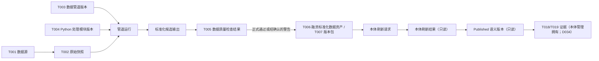
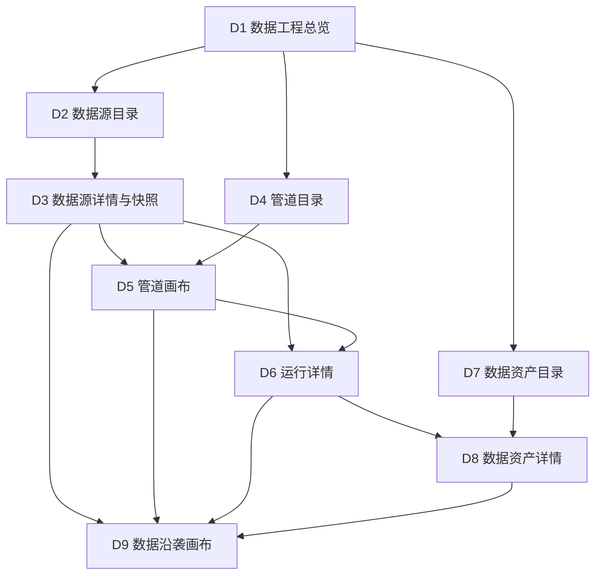

# 新项目功能设计：阶段 2 数据工程

> 版本：v0.1（本轮修订稿）  
> 文档状态：已完成数据工程内部自检，待用户评审；内部自检不等于用户评审通过  
> 权威依据：平台总控台账中已生效的 D001—D051、术语 T001—T053、合同 C001—C031；Q025、Q026 仍待后续裁决  
> 已生效裁决：Q005—Q012、Q014 已由总控 D026—D034 解决；本文直接执行，不再重复请示  
> 当前建设顺序：S001 仍是首个完整闭环；S003 当前只做 D051 规定的数据工程兼容性验证，不开展完整场景建设  
> S003 本轮数据确认：业务评估时点为 `2025-12-31`；财务金额币种为 CNY（人民币）、金额单位为元；`财务数据!I1` 为本年字段，`AA1` 为上一年字段，修订版已将 AA1 唯一化为 `利润总额_本年累计数(上年)`  
> 本窗口新增确认：一期纳入 D9 最小数据沿袭画布；管道画布可执行，沿袭画布只读展示证据  
> 本轮范围确认：一期不把已发布 T006/T007 作为可拖入的管道数据源；待出现第二个真实派生资产、兼容预置脚本和新目标 T006 后再建设复用能力  
> 本轮设计增补：参考附件的一体化链路上下文，一期 D5 收敛为五项顶部动作、三个底部证据页签和一张自动叠加运行/质量状态的统一画布；取消三种视图切换和独立运行健康卡，并补齐调试、试运行、正式运行、发布及自动同步边界；不增加权限治理或在线代码编辑  
> 已登记合同边界：数据工程按 D044/C017 提供精确数据版本、T008、质量、刷新、消费证据、上一可信、保留和数据侧可复现事实；不设计报告解释、Agent 运行或业务数值计算；一期是否真实执行历史重放仍见 Q025  
> 当前模块：仅数据工程；不详细设计本体管理、智能问数、决策中心、Agent 应用或报告中心  
> 交付性质：功能设计；不包含代码、接口、数据库表、微服务、技术栈、部署拓扑或实施任务  
> 当前首个完整闭环目标（S001）：用一个演示账号真实走通“来源进入—原始快照—Python 处理—质量门—不可变数据资产版本—请求已绑定本体刷新—收到消费就绪结果”，使后续智能问数能够使用最新可信数据；S003 当前只做兼容性验证

## 0. 评审结论

### 0.1 一期闭环

`[一期最小实现]` 数据工程一期不是完整数据中台，而是一条真实、可重复、可失败、可恢复、可追溯的融资数据链路：

```text
手工上传融资工作簿 / 指定共享文件夹发现新文件
→ 登记 T002 原始快照与 T008 数据截至时间
→ 运行预置且版本化的 T004 Python 处理模块
→ 执行 T005 数据质量检查
→ 发布逻辑 T006“融资标准化数据资产”的不可变 T007 版本包
→ 请求已绑定本体刷新
→ 接收并只读展示刷新结果与消费就绪证据
→ 后续智能问数按权威合同使用最新可信数据
```

其中，“资产已发布”“刷新已成功”“已成为 T018 可消费数据版本”是三个不同事实。数据工程只对前两个事实中自身产生或收到的证据负责。D034 已确认由本体管理唯一拥有并原子提交 T019，数据工程只读。

### 0.2 八项功能结论

1. 数据工程拥有 T001—T008 相关资源及 T053 的版本证据，不拥有或编辑 Object Type、Property、Link Type、Metric、Rule、Action Type。
2. 一期真实支持工作簿手工上传和指定共享文件夹自动读取；SAP、司库、企业数据中台只作为明确标注“未接入”的规划资产演示，不冒充真实资产。
3. 一期画布只有“数据源、Python 处理（脚本组件）、数据检查、发布数据资产、请求本体刷新”五类节点；可拖拉拽、配置、保存、预览、样例调试、试运行、正式运行、定位失败和重试。质量是第三个可执行节点，不另建质量画布。
4. 一期按全量快照更新；正式运行锁定 T002/T003/T004，形成正式 T005，门禁允许时自动发布逻辑 T006“融资标准化数据资产”的不可变 T007 版本包并请求刷新。只允许选择预置脚本；刷新失败继续服务上一可信版本；全部演示历史保留且不提供删除入口。以上直接执行 D029—D033。
5. 数据工程不得把工作簿直接交给智能问数，也不得自行维护一份与 T019 冲突的“最新版本”指针；低延迟边界是提供最新可信资产、明确数据截至时间和刷新证据。
6. 一期增加 D9 最小数据沿袭画布：自动生成、只读展示“来源—快照—运行节点—资产版本—刷新请求—刷新结果—消费证据”，与可编辑、可运行的 D5 管道画布严格分开。
7. 数据工程按 D044/C017 可向报告中心提供不含业务明细、绑定精确 T007 的“数据可信度与可复现摘要”；D050/C030 已明确生产保留治理，D045/C027 已明确报告快照—当前比较拆责。业务对象、Metric、Rule 仍经 Published 本体和 T019 权威路径消费，LLM 不得读取工作簿、T002、T007 成员或质量失败样例；一期是否必须真实重放仍待 Q025。
8. S003 当前只验证真实工作簿能否登记为 T002/T053，并以“财务数据、调节因子”两个逻辑成员共同形成标记“仅兼容性验证、不可消费”的不可变 T007。当前修订文件已解决重复表头、T008、金额单位/币种和环保企业电价波动率条件不适用四项数据问题；只剩 CR018 受控处理形态和总控 I023 制品索引同步两个治理阻断。本轮不评分、不刷新本体、不形成 T018/T019，也不建设 S003 页面、模型、Agent、报告、驾驶舱或决策流程。

### 0.3 一期成功判据

| 成功结果 | 不得记为通过的情形 |
|---|---|
| 同一演示账号实际上传指定融资工作簿，或由已配置共享文件夹发现新文件 | 后台预置数据、静态页面、写死运行结果 |
| 原文件被登记为 T002，内容重复、T008、来源和读取结果均可见 | 只保存文件名；用上传时间或工作簿生成日期静默代替 T008 |
| 五节点画布能从空白状态搭建、保存、试运行和正式运行；同一画布自动叠加执行、质量和刷新状态，底部三个页签能核对预览、运行和质量证据 | 画布只是流程图片；要求切换多套视图才能发现失败；底部卡片使用静态信息；未来节点以禁用入口冒充能力 |
| 预置融资 Python 模块的说明、版本、参数、输入、输出、结果可核对 | 隐藏脚本版本；允许任意脚本绕过模块登记和质量门 |
| 质量门真实检查 5,218 条明细，失败会阻断发布 | 只抽样、失败仍发布、把未知值静默改成 0 或肯定类别 |
| 发布形成 T006“融资标准化数据资产”的新 T007 版本包，四个具名成员、三条成员关系及版本清单可核对，并可反查来源快照、管道、模块和质量证据 | 发布工作簿或脚本冒充资产；覆盖旧版本；发布后无法证明成员、关系、来源和处理过程 |
| “请求本体刷新”返回受理、处理中、成功、失败或不兼容等真实结果 | 数据工程伪造本体成功，或详细设计/执行本体内部能力 |
| 新候选失败时不污染当前可信消费组合；恢复方式和上一可信证据可见 | 一次失败导致问数无数据，或静默读取候选半成品 |
| 从任一关键资源打开 D9，能沿图追到来源、版本、质量和刷新证据 | 只有静态流程图、节点无法打开详情，或请求已发出就显示刷新成功 |
| `[已登记合同；实际重放深度待 Q025]` 给定一个精确历史 T007，可返回版本绑定的可信度、保留和数据侧可复现状态；给定无效版本可返回明确原因，且摘要不含业务行、业务值或失败样例 | 把“最近摘要”回填到旧报告、把不可定位记成质量失败、向 LLM 暴露工作簿/T002/T007 成员或要求数据工程重算 Metric/Rule |
| S003 真实来源被识别为两个具有稳定成员身份的逻辑成员；可验证粒度、键、共同 `T008=2025-12-31`、成员级质量和原子发布合同；只有 CR018、I023 制品身份均收敛并真实运行后，才可标记“数据工程兼容性验证通过（仅兼容性验证、不可消费）” | 把当前文件标为“数据接入准备完成”、只发布其中一个成员、仅用展示名代替成员稳定标识、静默丢弃重名列或填补因子、执行评分或进入本体刷新/正式消费 |

## 1. 定位与边界

### 1.1 数据工程解决的用户问题

数据工程把持续变化的来源数据转化为本体可稳定引用的 T006 数据资产，并让演示者回答以下问题：

- 数据从哪里来，何时发现，反映的业务事实截至何时；
- 本次实际读取了什么，是否与历史内容重复；
- 哪个 T003 数据管道版本和 T004 Python 处理模块版本处理了它；
- T005 检查了什么，失败多少条，为什么失败，如何恢复；
- 哪个 T007 已经发布，包含哪些成员，各成员的字段、业务粒度和行数是什么；
- 向哪个已绑定本体发起了刷新请求，返回了什么状态和证据；
- 新数据失败时为什么 T019 未切换，当前仍服务哪一权威组合，以及数据侧上一已通过版本和上一权威历史组合分别是什么；
- 给定旧报告引用的精确 T007，今天是否仍可定位、访问、核对证据或完成数据侧重放，不能时具体原因是什么。

### 1.2 拥有、引用与禁止越界

| 边界 | 资源/责任 | 数据工程功能合同 | 明确不承担 |
|---|---|---|---|
| 拥有 | T001 数据源 | 登记来源、读取方式、状态、最近发现/成功、自动读取配置 | 不定义业务对象和指标口径 |
| 拥有 | T002 原始快照 | 保留实际读取内容与来源证据，登记 T008、重复/冲突/失败状态 | 不直接供本体或智能问数消费 |
| 拥有 | T003 数据管道 | 保存五节点依赖、配置版本、运行方式、运行历史、失败定位和重试 | 不承载 Metric、Rule、Action Type |
| 拥有 | T004 Python 处理模块的登记结果与运行配置 | 选择已预置模块版本，展示说明、参数、输入输出和运行结果 | 一期不在线编辑代码、不上传任意脚本 |
| 拥有 | T005 数据质量检查 | 判断候选输出是否满足发布和刷新最低要求 | 不判断融资风险阈值，不代替 T015 Rule |
| 拥有 | T006/T007 数据资产及版本 | 逻辑资产、成员清单、成员级粒度/字段/行数、T008、正式质量、来源、版本和发布证据 | 不把数据成员等同于 Object Type |
| 拥有 | T053 人工业务输入快照 | 对 S003 企业因子值的一次正式人工提交保留来源、主体、T008、前序快照和版本证据，并映射到 T007“调节因子”成员 | 不把因子定义、分档、系数、行业适用规则、权重、公式或阈值变成管道配置；单次假设模拟不形成 T053 |
| 产生；仅 S001 当前完整闭环 | 本体刷新请求 | 向已存在的绑定发起请求并保留请求标识、候选 T007/T008、四成员及三条成员关系摘要、T006 队列、重试关系和创建/发起时间 | S003 当前不得发起刷新；任何场景均不新建/编辑本体映射、不改变 Published 语义版本、不让旧版本重试请求降级 |
| 引用 | 本体刷新结果 | 只读展示处理中、成功、失败、不兼容、未知、原因、恢复提示和证据 | 不展示或控制本体内部实现步骤；“已受理/未受理”属于刷新请求回执 |
| 引用；D034 已确认 Owner | T018/T019 | 显示本体管理返回的消费就绪与权威绑定摘要；数据工程只读 | 不提交冲突指针，不自行决定智能问数读哪一版 |
| 只作边界引用 | T014—T016、T020—T025 | 在证据中引用精确版本或资源标识 | 不设计其页面、旅程、状态机、公式、阈值或回答逻辑 |

### 1.3 相邻模块边界

- 本体管理：接收已发布 T007 及字段、粒度、T008、质量和追溯证据；其内部如何映射 Object Type、Property、Link Type、Metric、Rule、Action Type 不在本文设计。
- 智能问数：只能经已裁决的权威消费合同读取可信版本；数据工程不向其直接提供工作簿、不配置 Agent 系统提示词或 Skill、不定义回答逻辑。
- 决策中心：数据工程不创建 Action 请求、决策提醒、人工确认或待办任务。
- Agent 应用、报告中心：业务对象、Metric、Rule 和报告数值仍通过 T019 指向的 Published 语义资源消费，不直接读取工作簿、T002 或 T007 成员。报告中心可按已确认的 C017 读取不含业务明细的可信度元数据；Agent 只能经报告中心固定的 C022/T037 证据包获得获准上下文，不能把该摘要扩展成原始数据入口。本文不设计报告页面、解释逻辑或 Agent 运行。

因此，T007 是可被本体稳定引用的发布物，不等于已经面向所有下游开放的通用查询接口。S001 当前闭环必须先获得本体刷新与 T019 权威绑定证据，数据工程不得用“资产已发布”替代“消费者可用”；S003 当前兼容版本则被 D051 明确禁止进入刷新和消费。

## 2. 用户、任务与能力地图

### 2.1 一期用户

`[已生效裁决 D003]` 一期只有一个演示账号，完成来源登记、上传、画布配置、运行、发布、刷新请求和失败重试，无需登录演示、角色切换、权限申请或治理审批。

| 用户任务 | 用户动作 | 可观察结果 |
|---|---|---|
| 登记来源 | 创建手工上传或共享文件夹来源 | 一条可搜索、可查看状态的 T001 |
| 形成快照 | 上传工作簿或等待文件夹发现文件，提供 T008 | 一条 T002，显示来源、内容重复判断和处理状态 |
| 配置管道 | 拖入五类节点并逐项配置 | 可保存、可校验、可试运行的 T003 版本 |
| 检查处理 | 选择预置融资模块，查看输入输出与差异 | 稳定、可重复的标准化候选输出 |
| 判断质量 | 查看逐项检查、失败数量、样例和影响 | 通过、有警告或失败的明确结论 |
| 发布资产 | 确认 T006、四个成员、三条成员关系、T008、正式质量和版本说明 | 不可原地修改的 T007 版本包 |
| 请求刷新 | 在第五节点发起对已绑定本体的刷新请求 | 请求标识、状态、结果或失败恢复提示 |
| 证明就绪 | 查看外部返回的消费就绪证据 | 候选 T007、目标语义版本、结果时间和证据可追溯 |
| 证明历史可信度 | 按精确 T007 查看版本绑定/当前状态摘要 | T008、质量/刷新、保留、定位和数据侧可复现状态明确，摘要不含业务明细 |
| 验证 S003 来源兼容性 | 读取真实工作簿，识别双成员并执行结构、键、类型、枚举、T008 和跨成员匹配检查 | 给出“合同兼容/不兼容”、逐项质量证据和阻断原因；不运行评分或进入消费链 |
| 恢复失败 | 打开失败节点，修正输入或配置后重试 | 旧证据不被覆盖；新运行与原失败关联 |

### 2.2 功能能力地图

| 能力域 | 一期最小能力 | 后期扩展位置 |
|---|---|---|
| 来源管理 | T001 目录；手工上传；指定共享文件夹 | 企业数据中台、SAP、司库、数据库等真实连接器 |
| 摄取与快照 | T002 登记、内容去重、T008、全量快照、冲突/失败处理 | 增量批次、CDC、实时流、跨文件编排 |
| 管道编排 | 五节点单链画布、配置、保存、预览、样例调试、试运行、正式运行、重试；五项顶部动作、三个底部证据页签及统一状态画布 | 多输入、分支、条件、并行、通用算子、多人变更评审 |
| Python 处理 | 画布脚本组件选择预置融资标准化模块，支持参数配置、限定样例调试和完整 T002 试运行 | 受控模块登记、评审和多模块复用 |
| 数据质量 | 融资演示最低门禁、失败样例、警告确认 | 可复用规则库、趋势、Owner、豁免和告警 |
| S001 资产与版本 | T006 目录、含四个具名成员、三条成员关系和版本清单的不可变 T007 版本包、三层数据管理、运行历史 | 已发布资产复用、保留期限、归档、受控删除、影响分析 |
| 刷新协同 | 发起请求，展示外部结果与恢复方式 | 多本体依赖和批量刷新协同 |
| 消费证据 | 按 D034 只读展示本体管理返回的 T018/T019 证据 | 多消费者订阅与服务级别 |
| 可信度与可复现摘要 | `[已登记 D044/C017；实际重放深度待 Q025]` 按精确 T007 形成版本绑定摘要，说明 T008、质量范围、刷新、只读消费证据、保留、定位和数据侧重放状态，不含业务明细 | 大规模历史恢复、法律保留操作和跨场景可信度服务 |
| 数据沿袭 | D9 单链只读画布、上下游展开、节点详情、候选/当前权威服务/上一权威历史路径对照 | 跨项目搜索、字段级沿袭和完整影响分析 |
| S003 兼容性验证 | 真实工作簿双 Sheet 识别、T002/T053 证据、两个成员画像、共同 T008、质量检查和不可消费 T007 合同验证；当前不新增 S003 页面入口 | S001 闭环通过后按 D024/D051 启动 S003 完整管道、语义、评分与消费设计 |

后期能力只能作为说明文字出现，不得成为一期页面中的按钮、禁用入口或一期验收门禁。

## 3. 演示工作簿核验事实与数据准备边界

### 3.1 已核验工作簿

`[附件核验事实]` 《融资一览表_一期演示数据.xlsx》包含四张工作表：

| 工作表 | 核验结果 | 数据工程用途 |
|---|---|---|
| `2-融资一览表明细` | 5,218 条融资明细、35 个字段 | Python 模块的融资明细业务输入 |
| `单位负责人映射` | 574 家单位、574 个单位编码、24 个负责人标识 | 标准化主体—负责人数据输入 |
| `Sheet1` | 工作簿说明、完整性校验及 Metric/Rule 演示样例 | 仅作人工验收参照；不作为数据工程权威业务口径 |
| `场景问数样例` | 三家演示主体、组合问数和机构归因样例 | 仅作跨模块验收参照；不写入 Python 逻辑或问数答案 |

当前固定演示工作簿还具备以下可核对事实：

- 5,218 个借据编号均非空且唯一；
- 574 家脱敏融资主体；
- 24 家脱敏金融机构，每条融资均有机构字段；其中银行 5,169 条、非银 49 条；
- 24 个不同融资负责人标识；574 家主体一期均恰有一个负责人标识，多家主体可以对应同一负责人；
- 集团人民币余额合计为 2,161,338,700,000 元；
- 三家演示主体存在并可稳定定位：演示单位553 / `UNIT-553` / 融资负责人001，演示单位465 / `UNIT-465` / 融资负责人009，演示单位561 / `UNIT-561` / 融资负责人009；
- 利率形式缺失 212 条、期限种类缺失 212 条、担保方式缺失 1,868 条；这些缺失必须诚实保留并在质量摘要中说明，不得静默改成 0、否或其他肯定类别。

上述数量只作为当前固定演示文件的验收基线，不是未来融资资产的永久业务规则。

### 3.2 T008 数据截至时间缺口

工作簿没有可作为权威 T008 的明确字段。文件生成日期 `2026-08-09` 只说明演示文件生成时间，不能静默当作业务数据截至时间。

一期功能规则：

- 手工上传时必须由演示者显式填写 T008；未填则快照进入“等待数据截至时间”，不得启动正式运行。
- 共享文件夹来源必须配置经业务确认的 T008 获取方式，例如约定文件名日期或伴随的批次说明；无法取得时同样等待补充。
- 读取时间、文件修改时间、发现时间和 T008 分开显示。
- 修改 T008 不能原地改写已发布 T007；如果已发布版本时点错误，必须形成带纠正说明的新运行和新版本。

### 3.3 D007 产业板块名称澄清

`[已生效裁决 D007；用户本窗口再次明确]` D007 的业务意图不是把全部产业板块强制归并为六类，而是直接把演示数据中用户指定的来源名称替换成对应展示名称；“核能、核燃料、集团及直管公司、数字化”保持原值，不参与归并。

| 需要替换的原名称 | 演示数据展示名称 |
|---|---|
| 产业金融-司库、产业金融-资本控股 | 产业金融 |
| 非动力核技术 | 核技术 |
| 核服集团 | 产业服务 |
| 科技型环保 | 环保产业 |
| 能源国际 | 境外新能源 |
| 新能源控股 | 境内新能源 |

`[附件核验事实]` 当前演示工作簿已经完成上述名称替换，融资明细实际保留 10 个有效展示值：产业服务 10 条、产业金融 128 条、核技术 297 条、核能 1,123 条、核燃料 51 条、环保产业 72 条、集团及直管公司 99 条、境内新能源 3,258 条、境外新能源 175 条、数字化 5 条，合计 5,218 条。四个保留值不再视为未映射，也不触发质量失败。

一期功能规则：

1. Python 脚本组件不再配置产业板块映射表，也不对四个保留值进行自动归类；
2. 数据质量只核对演示工作簿已经使用上述 10 个有效展示值，并检查旧名称没有残留；
3. 若后续文件重新出现旧名称或未知名称，质量门阻断发布并要求先修正演示源数据，不由数据工程猜测归类；
4. 总控已依据 CR-DE-003 把 D007 澄清为六组标签替换；本文只落实该已生效裁决，不再要求把四个保留值映射到六类。

### 3.4 S003 债务风险监测数据兼容性验证（D051）

#### 3.4.1 阶段结论与验证对象

`[已生效裁决 D051]` S003 当前只验证数据工程能否真实接入、校验、版本化并追溯债务风险输入；S001 仍是首个完整闭环。本节不构成 S003 页面、本体、评分模型、Agent、驾驶舱、报告或决策流程设计。

本轮核验两个用户指定附件。经用户明确授权，只修订演示工作簿 `财务数据!AA1` 的表头，未改任何业务数据；修改前后均核验了 Sheet、范围、样式和数据校验配置。未执行 Skill 中的评分、服务、预警、审批或待办逻辑：

| 附件 | 核验身份 | 本轮用途 |
|---|---|---|
| `企业债务风险评估模版.xlsx`（用户指定 WeChat 路径） | 修订前 SHA-256 `dd917b497f43ebf5c72607b49d70ae049969a32505311fb6bf9aa7a85d36a498`；修订后 SHA-256 `dbdab9c870d7f2e456c3a9e0f91b340b372da6d40eb241551e0ee8848cac42a0`；唯一单元格值变化为 `财务数据!AA1` | 当前校正演示夹具；用于 S003 真实数据源兼容性输入 |
| `wind-debt-risk-skill.zip` | SHA-256 `731722434a309e4b76c4b83b6de82a2e590c50a524c611ccf5721c7516e2441b` | 候选业务逻辑和历史原型的静态参考，不是可整体接入的数据工程模块 |

总控 I023 当前仍指向 ontology2.0 下的修订前副本和旧哈希。该副本与当前校正夹具已经分叉，因此不能再声称两者内容一致。恢复方式是由平台总控登记“同步 I023 副本”或“将 I023 重定向到当前校正夹具”之一；不得覆盖任何已经登记的 T002。若平台尚未真实登记 S003 T002，则校正夹具可作为首次真实来源；若已登记旧文件，则校正夹具必须形成新的 T002 并引用前序快照。

当前结论分成三个维度，禁止用一个“通过”混淆：

| 结论层 | 当前结果 | 含义 |
|---|---|---|
| 合同结构兼容性 | 兼容 | C003/CR019 已能表达一个不可变 T007 共同包含“财务数据、调节因子”两个稳定逻辑成员，带共同 T008、成员画像、质量、来源和追溯，并标记“仅兼容性验证、不可消费”；无需再次修改 C003 |
| 当前文件内容准备 | 通过 | 重复表头已修正，`T008=2025-12-31`、币种 CNY（人民币）和金额单位元已确认；业务 Owner 已确认环保企业不涉及且不适用“电价波动率”，`调节因子!G18:G21` 保持为空并按条件不适用通过 |
| 受控发布治理准备 | 未通过 | CR018 最小受控处理形态尚待总控接受，I023 仍指向修订前副本；两项收敛前不得真实形成兼容性 T007，也不得标记“数据接入准备完成” |

CR018 和 I023 制品身份两项均收敛并真实运行后，本阶段允许的最高状态是 **“数据工程兼容性验证通过（仅兼容性验证、不可消费）”**。该状态不等于 S003 场景就绪、本体就绪、可消费、已评分或已完成；不得发起 C028/C029，不形成 T018/T019，不向其他模块提供正式业务消费。

#### 3.4.2 双成员、业务粒度、键和共同发布

工作簿识别结果如下。“财务数据”“调节因子”是展示名；每个成员在首个 T007 形成时还必须获得系统生成、跨后续版本稳定的成员标识，页面和证据不得只靠展示名关联。

| 稳定逻辑成员 | 来源范围 | 当前数据量 | 业务粒度 | 当前兼容验证主键 | 最小字段 |
|---|---|---:|---|---|---|
| 财务数据 | `财务数据!A1:AA22` | 21 条数据、27 个物理列 | 一行一个企业在一个评估时点的财务输入 | `单位名称规范值 + T008` | 单位名称、共同 `T008=2025-12-31`、B—AA 全部 26 个具有唯一字段身份的财务输入物理列；金额字段元数据为币种 CNY（人民币）、金额单位元 |
| 调节因子 | `调节因子!A1:I22` | 21 条数据、9 个物理列 | 一行一个企业在一个评估时点的正式因子输入 | `单位名称规范值 + T008` | 单位名称、共同 T008、产业板块、公司类别、融资能力（已用授信余额/授信总额）、担保情况、总部支持程度、电价波动率、是否存在重大诉讼、资金余缺预警 |

“财务数据”B—AA 的 26 个财务输入物理列必须完整保留，范围包括流动负债、营业收入/利润/净利润、交易性金融资产、利润总额、存货、实收资本、应收账款、所有者权益、流动资产、经营现金流、营业成本、负债、财务费用、货币资金、资产总计及历史比较输入。这里的“完整保留”是数据接入合同，不授权数据工程计算 15 项指标或解释财务业务口径。

财务成员按来源顺序的最小物理字段为：A `单位名称`；B `流动负债合计_年初余额`；C `流动负债合计_期末余额`；D `营业总收入_本年累计数`；E `营业利润_本年累计数`；F `净利润_本年累计数`；G `交易性金融资产_期末余额`；H `利润总额_上年同期累计数`；I `利润总额_本年累计数`；J `存货_期末余额`；K `存货_年初余额`；L `实收资本（股本）_期末余额`；M `应收账款_期末余额`；N `应收账款_年初余额`；O `所有者权益（或股东权益）合计_期末余额`；P `所有者权益（或股东权益）合计_年初余额`；Q `流动资产合计_期末余额`；R `经营活动产生的现金流量净额_本年累计数`；S `经营活动现金流入小计_本年累计数`；T `营业成本_本年累计数`；U `负债合计_期末余额`；V `财务费用_本年累计数`；W `货币资金_期末余额`；X `资产总计_期末余额`；Y `资产总计_年初余额(上年)`；Z `利润总额_上年同期累计数(上年)`；AA `利润总额_本年累计数(上年)`。

用户已确认 I 列表示本年、AA 列表示上一年；在共同业务评估时点 `2025-12-31` 下，分别登记为 2025 本年累计和 2024 上年本年累计。共同 T008 是版本级业务日期，不伪造成源文件已有物理列，但必须进入两个成员的逻辑键、T053 生效时点和版本证据。币种与单位拆分登记为 `currency=CNY（人民币）`、`amount_unit=元`，只约束财务金额字段，不套用于调节因子枚举。

关联和发布规则：

1. 当前两表各有 21 个单位，单位名称均非空、唯一，原值集合和顺序完全一致；可建立同一 T008 下的严格一对一发布校验：`财务数据.(单位名称规范值, T008) = 调节因子.(单位名称规范值, T008)`。
2. 上述等式是**数据层跨成员完整性约束**，用于证明两个成员的企业集合一致；它不是 C003 中需要声明的业务成员关系，更不是本体 Link。S003 当前画像不虚构成员关系。
3. “单位名称”当前只能作为来源自然键。未来进入正式本体消费前，应由业务合同提供稳定单位编码和别名/歧义处理；本阶段不在数据工程内设计 S003 Object 或 Link。
4. 两个成员必须使用同一 T008、同一 T007 版本身份和同一版本用途，原子化共同发布。任一成员出现硬失败时，两者均不得形成 T007；不得部分发布、跨版本拼装或分别宣称通过。
5. 一个已正式提交的因子工作簿版本形成新的 T002，并为因子输入形成新的 T053；若质量通过并获准形成兼容性资产，则两个完整成员共同形成一个新 T007。T053 映射到“调节因子”成员，不是第三个资产成员；旧 T002、T053、T007 均不覆盖。
6. 单次假设模拟参数不形成正式 T053，不进入 T007，也不得自动触发评分、刷新、Action Request 或待办。

#### 3.4.3 质量核验结果与硬阻断

| 检查项 | 当前事实 | 质量结论与恢复方式 |
|---|---|---|
| 工作表与重复表头行 | 两个目标工作表均存在，数据区中没有再次出现整行表头 | 通过；仍须与“重复字段名”分开判断 |
| 单位名称和跨成员匹配 | 两表各 21 个单位，非空、唯一，集合与顺序一致 | 当前通过；正式质量门仍须检查规范化后重复、缺失、仅一侧存在及歧义，并要求双方键集合完全相等 |
| 财务必填与类型 | B—AA 共 546 个数据单元均为数值，无空值或文本混入 | 当前通过；允许合法负数，不以通用“必须非负”规则阻断利润、现金流或财务费用 |
| 因子必填与枚举 | 除 `调节因子!G18:G21` 外均非空；全部非空值均在工作簿下拉枚举内。业务 Owner 已确认环保企业的债务风险监测规则不涉及且不适用电价波动率，所以无需填写 | 通过；平台质量门执行条件规则：`公司类别=环保` 时该字段必须为空并显示“业务不适用”，其他类别按当前必填和枚举合同校验。源文件 `G2:G1000` 未声明允许空值是模板校验配置待优化项，不再作为数据内容阻断 |
| 数据截至时间 | 源内没有时点列；用户已确认本次共同评估时点为 2025 年底 | 通过；精确登记 `T008=2025-12-31` 并绑定两个成员及 T053。上传、发现、文件创建或修改时间仍不得替代 |
| 金额单位与币种 | 用户已确认财务金额为人民币元 | 通过；版本和财务字段合同分别登记币种 CNY（人民币）、金额单位元，不从数值量级猜测，不影响因子枚举 |
| 字段唯一性与期间 | 修订前 I1/AA1 同名且 21 行数值逐行不同；用户确认 I 为本年、AA 为上一年，当前校正夹具已将 AA1 改为 `利润总额_本年累计数(上年)` | 通过；27 个表头现均唯一，I/AA 原始数值未改变；保留修订前后指纹和唯一单元格变化证据 |

“利润总额”字段修订与后续解析的强制处理规则：

- 修订前文件必须按 I、AA 两个物理列保留原值和旧哈希，不得覆盖、丢弃、自动合并或只保留第一次出现；当前校正夹具只改 AA1，所有业务数据、两张表的范围和数据校验配置均保持不变；
- 经用户确认，I1 保持 `利润总额_本年累计数`，AA1 使用 `利润总额_本年累计数(上年)`；在 `T008=2025-12-31` 下分别表示 2025 本年累计和 2024 上年本年累计，不再使用无业务含义的机械 `_2` 后缀；
- 若旧文件已登记为 T002，当前校正夹具必须形成新 T002 并引用旧快照；若尚未登记，则以校正夹具作为首次 T002，同时在来源修订证据中保留旧哈希、旧表头和修改理由；
- Skill 的预期列清单仍重复声明 `利润总额_本年累计数`，其读取逻辑只保留第一次出现的同名列，实际会静默忽略 AA 列；未来 CR018 候选标准化能力不得复用该解析实现，必须按物理列位置与唯一字段合同同时保留 I、AA。

一期平台质量门必须独立校验枚举，不能把 Excel 下拉提示当成已通过。当前来源中的候选枚举集合如下，定义、分档依据、调整系数和行业适用范围仍由 S003 业务 Owner 决定：

| 因子字段 | 当前来源允许值 |
|---|---|
| 产业板块 | 核电、新能源、其他 |
| 公司类别 | 新能源产业-风电、核电、环保、在建企业 |
| 融资能力 | 良好、一般、较差 |
| 担保情况 | 未涉及担保、仅提供担保、仅获得担保 |
| 总部支持程度 | 高、较高、中、较低、低 |
| 电价波动率 | 电价变化率小于等于-15%、电价变化率小于等于0且大于-15%、电价变化率大于0 |
| 是否存在重大诉讼 | 无重大诉讼、一般性诉讼、重大诉讼 |
| 资金余缺预警 | 当月资金余缺预警、未来第一个月资金余缺预警、未来第二个月资金余缺预警、未来第三个月资金余缺预警 |

空值、非法枚举或新增枚举不得被静默采用默认档、相近值或零调整。业务 Owner 已确认 `调节因子!G18:G21` 四行均为环保企业，其债务风险监测规则不涉及且不适用“电价波动率”，所以无需填写。本轮按以下最小输入合同执行：

- `公司类别=环保` 时，电价波动率必须为空；质量结果显示“业务不适用”，不显示“数据缺失”，不填零、不补默认档，也不推导调整系数；
- 其他公司类别仍按当前来源的必填和枚举合同校验；本轮不进一步定义其行业适用范围、系数或评分逻辑；
- 当前 Excel 模板 `G2:G1000` 的下拉配置尚未表达上述条件规则。推荐在下次来源模板修订时改为与平台合同一致的条件校验，但不改变当前四个空值，也不阻断本轮数据内容兼容；
- 本次用户确认作为来源规则证据随 T002/T053 保存。未来若业务规则改变，必须形成新的规则证据和新 T002/T053，不回写本次输入。

#### 3.4.4 因子边界和 Skill 静态审计

企业在某个评估时点的**因子取值**属于业务输入数据，数据工程可以接入、校验和版本化。以下内容不属于 T003/T004/T005 配置：因子定义、分档、调整系数、行业适用范围、15 项指标权重、评分公式和风险等级阈值。数据工程不得维护风险评分、Metric、Rule、Action、预警或待办。

`wind-debt-risk-skill` 静态审计结果：

| Skill 内职责 | 识别结果 | 本轮处理 |
|---|---|---|
| 双 Sheet 读取、列名归一、单位名称关联和数值转换 | 可作为未来输入标准化范围参考，但当前实现会静默丢失第二个重名列、容忍缺字段/非数值、覆盖重复单位且缺少 T008 | 不直接复用；仅提取质量风险和候选范围 |
| 15 项指标、行业权重、评分公式、因子模型、系数和风险等级 | 候选业务逻辑，不是数据工程质量或管道参数 | 不接入、不执行、不登记为 T004/T005 |
| HTML 仪表盘和报告 | 历史呈现原型 | 不作为报告中心正式产物或 S003 页面设计 |
| 自动预警、审批、权限、本地 JSON 待办 | 决策/治理/应用职责，且分析入口会触发写入 | 不执行，不写 `todo_store`、上传目录或审计日志 |
| 浏览器 `localStorage` 与本地 HTTP 服务 | 本地原型运行机制 | 不启动、不读写 `localStorage`、不纳入平台功能合同 |

因此，整个 Skill 不能接入数据工程，也不能用它的运行结果证明兼容性。ZIP 中的配置和既有待办只作历史参考，不是权威业务合同或正式数据源。

#### 3.4.5 合同对账与 CR018 最小受控处理建议

| 合同 | S003 对账结论 |
|---|---|
| C001 数据源登记 | 可表达该真实工作簿来源；登记仅表示来源存在，不表示 S003 功能已建设 |
| C002 原始快照 | 可表达原文件、内容指纹、读取时间、`T008=2025-12-31`、前序快照和不可覆盖证据；修订前后文件若都已进入平台，必须分别登记并保留前序引用，不得覆盖 |
| C003 数据资产版本 | CR019 已把合同修订为“通用不可变版本包络＋场景成员画像”；能够表达 S003 双成员共同发布、成员级字段/类型/粒度/质量、来源和“仅兼容性验证、不可消费”，无需新增 C003 CR |
| C021 场景清单 | 当前只能登记“S003 数据工程兼容性验证”，不能登记场景就绪、已评分、可消费或已完成 |
| C031 S003 人工业务输入快照 | 可表达企业因子取值及其来源、主体、时点、前序版本和后续 T007；T053 进入“调节因子”成员，不形成第三成员 |

`CR018` 已由总控登记，本节建议按以下最小方案收敛，不新增重复 CR，也不静默修改 D030：

1. D030“预置融资工作簿标准化 v1”继续完整约束 S001。若总控批准真实生成 S003 兼容性 T007，则在同一受控模块登记机制下，按场景白名单增加一个版本化的 S003 输入标准化能力；候选名称可为“债务风险输入标准化”，名称和建设仍待总控批准，不视为本窗口已裁决。
2. 该能力只负责识别两个 Sheet、按唯一字段合同完整保留 I/AA 两列、执行单位规范/重复键/跨成员匹配、必填/数值/条件枚举/T008/单位币种检查，并输出双成员候选和质量证据；不得复用会因重名而忽略 AA 列的 Skill 解析实现。
3. 明确排除指标计算、评分、权重、因子定义/分档/系数、行业适用规则、风险等级、HTML、报告、预警、审批、权限、Action 和待办；仍不开放在线代码编辑、任意脚本上传或任意依赖。
4. 正式因子调整通过重新上传真实工作簿或指定共享文件夹发现形成新 T002 和新 T053；质量通过且获准发布时，形成包含两个完整成员的新 T007，并引用前序 T002/T053/T007。不得覆盖旧版本、只发布“调节因子”或自动刷新本体。
5. 表头、T008、金额单位/币种和环保企业电价波动率条件不适用四项数据问题已解决；I023 制品身份未同步、CR018 处理形态未获总控接受前，本方案只登记范围和验收条件，不实际形成 T007。总控接受 CR018 具体处理形态后，才可把该候选能力加入受控模块清单。

不采纳 CR018 最小方案的后果是：只能证明 C003 在文字上容纳双成员，不能真实证明工作簿经受控处理后形成可追溯、不可变且不可消费的兼容性 T007；反之若整体接入 Skill，则会把业务评分、待办写入和静默数据修正错误地带入数据工程。

#### 3.4.6 相邻模块准确边界与阶段验收

下列文本作为后续模块对账边界，不授权本窗口修改其文档或设计其内部能力：

| 模块 | 准确边界文本 |
|---|---|
| 本体管理 | S003 当前兼容性 T007 永久保持“不可消费”，不得进入本体资产选择器，不创建 S003 本体/Published 语义版本、Object、Property、Link、Metric、Rule、Action Type 或 T017 来源映射，也不继承 Skill 内置模型。S003 完整设计获准并满足届时正式输入门后，必须形成新的正式候选 T007（具备提交本体刷新的资格），再经 C028/C029 形成 T018，并由本体管理提交 T019 后才可消费；不得原地解除旧 T007 的限制。字段到属性、单位到对象及关系如何映射由本体管理另行设计。 |
| 智能问数 | 总控 C021 当前权威阶段仍为“S003 数据工程兼容性验证”；“数据内容已确认·待受控发布验证”和未来“兼容性验证通过（仅兼容、不可消费）”是数据工程内部评审结果及拟提交的细化文案，只有平台公共层登记后才可作为 C021 展示。在没有 Published S003 语义和 T019 前，不创建问数配置、不运行测试问题、不回答 S003 业务问题；不得把兼容性通过解释成数据就绪。 |
| Agent 应用 | 只读显示 C021 阶段状态，不创建 S003 Agent Definition、Skill、Tool Allowlist、Ontology/Scenario Binding 或正式运行。不得读取原始工作簿/T002/T053/当前兼容 T007、整体登记或运行 `wind-debt-risk-skill`，也不得执行其评分、HTTP、HTML、预警审批、`todo_store` 或 `localStorage` 逻辑。后续只能经 Published 本体、T019 权威路径和获准业务计算能力取得对象、Metric、Rule 或风险结果。 |
| 报告中心 | 在平台登记后同时显示“数据工程兼容性验证状态”和“完整场景未建设”，不得从当前兼容版本或原始工作簿取业务值，不生成 S003 驾驶舱、报告、可信度业务卡、Report Copilot 上下文或“与当前数据比较”，当前也不提供比较入口、不形成 C027。若收到非法跨模块比较请求，按 C021 阶段拒绝并说明“当前阶段未形成权威消费绑定”，不得写成“数据陈旧”。Skill HTML 不得被导入、iframe、包装或发布为正式受控 HTML。 |
| 决策中心 | 只读显示 C021 阶段状态且不提供操作入口。当前不得创建 S003 风险 Metric/Rule、预警、Action Request、提醒、审批或待办；Skill 中的自动预警、审批、权限和本地待办只作历史原型参考；评分模型和风险阈值 Owner 留待 Q026/S003 完整设计。 |

只读全面对账还发现以下相邻文档同步债务；这些问题不授权本窗口修改相邻文档，也不产生新的数据工程合同 CR：

| 相邻模块 | 对账瑕疵 | 收敛方式 |
|---|---|---|
| 本体管理 | S001 仍有“三成员”残留，且尚未明确 S003 兼容版本不可选 | 按已生效 D049/C003 清除为“四成员＋三关系”，按 D051 增加 S003 禁入边界；这是既有 G016 回写，不新建 CR |
| 智能问数 | 已引用 D051，但尚未把“兼容性通过不等于数据就绪”落实为明确拒绝 | 按 C021、D051 同步状态与拒绝文案，无 Published 语义/T019 时不配置、不运行、不回答 |
| Agent 应用 | S003 仍偏向“资料待补/保留绑定入口”，且部分 D042—D050 标签过期 | 改为只读阶段卡，删除可绑定歧义并同步已生效合同；不是新 CR |
| 报告中心 | S003 仍偏向“资料待补”，RC-DE-008 未拆开当前兼容结论与未来正式刷新/消费 | 同时展示兼容验证状态与完整场景未建设；未来刷新/消费继续待完整设计，不生成当前业务内容 |
| 决策中心 | S003 状态、S001 三成员假设和 DC-DE 待确认标签均滞后 | 同步 D044、D049—D051、C003/C021；数据工程只负责 T007/T008 等数据事实，不承担 Metric/Rule 快照口径 |

阶段验收结论：

- **已完成**：真实来源可读；双成员可识别；粒度、当前自然键、跨成员匹配、字段范围和质量问题已形成证据；C003 结构兼容；Skill 职责边界已识别且未执行危险逻辑。
- **已解除的数据问题**：I/AA 期间与唯一表头、共同 `T008=2025-12-31`、币种 CNY（人民币）、金额单位元和环保企业电价波动率条件不适用规则均已确认并形成证据；当前没有数据内容硬阻断。
- **未完成**：CR018 具体处理形态尚待总控对账；当前校正夹具与总控 I023 的旧副本仍需同步或重定向。
- **数据工程内部评审结果**：`数据内容已确认·待受控发布验证`；这是拟提交平台公共层登记的细化文案，不是数据工程自行改写 C021。
- **当前禁止标记**：`数据接入准备完成`、`S003 场景就绪`、`本体就绪`、`可消费`、`已评分`、`已完成`。
- **解除阻断后允许标记**：`数据工程兼容性验证通过（仅兼容性验证、不可消费）`；仍须等待 S001 闭环通过和后续 S003 完整设计，不能继续建设或消费。

## 4. 资源关系、三层数据管理与生命周期

第 4—14 章除明确标注的 S003 兼容性条目外，其余可执行页面、画布、发布、刷新、消费和验收闭环均以 S001 为对象；其中“四成员＋三关系”是 S001 场景画像，不是所有 T007 的通用结构。C003 的通用版本包络及 S003 双成员画像以第 3.4、4.3、13.3、14.1 和 15 章为准。

### 4.1 资源关系



### 4.2 三层数据管理

数据工程内部采用三层，不把原始文件、处理中间结果和正式资产混成一个资源：

| 层级 | 内容 | 可编辑性 | 可被后续本体选择 | 主要证据 |
|---|---|---|---|---|
| 原始层 | T002 原文件或来源批次证据 | 不改写原内容；可补充未发布快照的 T008 和处理说明 | 否 | 来源、文件名、内容指纹、发现/读取时间、T008 |
| 标准化层 | Python 输出和质量检查使用的候选数据 | 只能通过新试运行/新正式运行重建 | 否 | 模块版本、参数、输入输出摘要、质量结果 |
| 资产层 | 已发布的 T007 全量数据快照 | 不可原地修改 | 仅版本用途/消费状态允许时可选；S003 当前兼容性版本为否 | 版本、字段与粒度、T008、质量、来源与运行追溯 |

消费就绪不是数据工程的第四存储层，而是跨模块返回的状态和证据。即使刷新失败，已发布 T007 仍然存在；它只是没有获得本次消费就绪结果。

### 4.3 核心资源合同

| 资源 | 一期必须展示 | 生命周期 |
|---|---|---|
| T001 数据源 | 名称、类型、说明、读取方式、位置、文件规则、T008 获取方式、检查间隔/时区、精确自动执行 T003/T004、状态、最近/下次检查及最近发现/读取/发布/消费就绪/错误 | 未配置、可用、暂停、读取失败 |
| T002 原始快照 | 快照标识、源文件名、内容指纹、文件/发现/读取时间、T008、触发方式、重复/冲突判断、关联运行 | 等待文件就绪、等待 T008、已登记、重复、历史、冲突、处理中、处理成功、处理失败 |
| T003 数据管道版本 | 名称、五节点结构、每节点配置状态、输入输出、保存版本、最近运行、是否被某来源设为精确自动执行版本 | 编辑中、校验失败、可运行、已被新配置版本替代；新版本不得静默接管定时任务 |
| T004 Python 处理模块版本 | 说明、版本、适用输入、输出字段组、公开参数、限制、最近运行结果 | 可选、已选、输入不兼容、运行失败、已停用；一期不做审批状态 |
| T005 结果 | 检查项、范围、状态、失败数量、样例、硬阻断/警告、影响和恢复建议 | 未运行、运行中、通过、有警告、失败、无法判断 |
| T006 数据资产 | 逻辑资产标识、场景、说明、用途/消费状态、T026 Owner、场景成员画像、当前发布版本和来源；S001 固定为“融资标准化数据资产”及四成员三关系，S003 当前只登记双成员兼容画像 | 无版本、已有发布版本；T006 本身不是一次运行产物。S001 可汇总刷新/消费状态；S003 当前固定“仅兼容性验证、不可消费”，不出现刷新状态 |
| T007 数据资产版本 | 通用字段为版本、场景、用途/消费状态、T008、稳定成员清单、成员级字段/类型/粒度/行数/主外键/质量、成员关系、来源 T002、处理模块版本、正式 T005、发布时间和版本说明；S001 为四成员三关系，S003 为“财务数据、调节因子”双成员且不声明本体关系 | 一经发布即不可变；可被后续版本替代但不被覆盖。S001 外部消费状态只读追加；S003 兼容性版本不得进入刷新、T018 或 T019 |
| T053 人工业务输入快照 | 快照标识/版本、S003 场景、业务主体、来源工作簿/T002、企业因子取值、提交/生效时点、共同 T008、前序快照和后续 T007 引用 | 一次正式提交形成新快照，不覆盖旧值；映射到“调节因子”成员而不是第三成员；单次模拟参数不进入 |
| 管道运行 | 运行标识、运行类型、触发方式、输入快照、固定 T003/T004、逐节点状态、输出版本、开始/结束时间、失败原因、重试关系 | 执行状态与闭环结果分开表达，见第 4.4 节 |
| 刷新请求（S001） | 请求标识、候选 T007、T008、四成员清单、成员级字段/粒度/主外键/质量及三条关系摘要、精确 T017 来源映射版本、正式 T005 状态/摘要、已绑定目标摘要、目标 Published 语义版本、T006 队列状态/位置、创建/发起时间、触发方式、重试来源 | 待发起、排队、已发出、已受理、未受理、未发出·已成为历史版本；不得用结果状态改写请求事实；S003 当前不适用 |
| 刷新结果（引用） | 请求标识、返回状态、结果时间、失败原因、恢复提示、证据、外部返回的绑定摘要 | 处理中、成功、失败、不兼容、结果超时/未知；只读追加，不改写历史结果 |
| 数据可信度与可复现摘要 `[已登记 C017]` | 摘要标识/版本/类型/形成时间、精确 T006/T007/T008、发布时质量与后续发现、刷新、T018/T019 只读证据、候选/上一版本、新鲜度事实、C030 保留状态和五维数据侧可复现状态、原因与恢复 | 版本绑定摘要形成后不可改写；核验时状态变化形成新的当前状态摘要，旧摘要继续可定位；不得携带业务明细或复制 T019 |
| 数据侧重放核验 `[合同已登记；一期实际执行深度待 Q025]` | 核验标识、目标 T007、锁定 T002/T003/T004/参数/检查集、开始/结束时间、执行状态、对照范围/结论、证据、重试来源 | 排队、运行中、一致、不一致、执行失败；隔离运行，不形成正式 T005/T007，不发布、不刷新、不影响 T019；重试新建记录并引用原记录 |
| 发布后质量发现 `[已登记 C017]` | 发现标识、来源证据、目标 T007、异常检查项身份、严重级别、标准原因、影响成员/字段、发现/确认时间、说明和修正版引用 | 待确认、已确认、已排除、已由新版修正；追加记录，不改写原 T005/T007，不自行切换 T019 |

### 4.4 运行与节点状态

管道运行必须分开表达“执行过程是否结束”和“端到端闭环到了哪里”，不得用一个绿色“成功”覆盖质量、发布和刷新事实：

| 维度 | 一期状态 | 判断边界 |
|---|---|---|
| 执行状态 | 排队、运行中、等待确认、已结束、失败 | 描述本次实际执行节点；“已结束”不自动等于消费就绪 |
| 闭环结果 | 未发布、发布结果未知、已发布·历史版本未请求刷新、已发布·等待刷新、刷新中、消费就绪、已发布·刷新失败、已发布·刷新结果未知 | 描述 T007、刷新结果和权威消费证据；只在获得权威证据后显示消费就绪；前一种未知尚未确认 T007 是否形成，后一种已确认 T007 但尚无确定刷新结果 |

完整试运行只使用执行状态，不进入发布—刷新闭环；闭环结果位置固定显示“不适用·试运行不发布”，并另示“截至数据源/Python 处理/数据检查节点成功或失败”。这不是闭环结果的新枚举值。

节点级固定规则：

- 正式运行中未到达的下游节点显示“等待上游”，不显示“成功”；完整试运行终点后的节点例外，固定显示“未执行·超过试运行终点”。
- 正在执行显示开始时间和已用时；不能仅靠动画表达。
- 节点执行成功必须绑定本次输入和输出摘要，不能复用旧运行的绿色状态。
- 数据检查程序可以“执行成功”同时 T005“质量失败”；前者表示检查跑完，后者表示数据未过门禁。
- 第五节点可以“请求已受理”同时“刷新失败”；请求事实与结果事实必须分开。
- 节点失败显示责任位置、业务可读原因、受影响记录数和恢复动作。
- 发布节点成功而刷新失败时，闭环结果显示“已发布·刷新失败”，并明确该 T007 尚不可消费；恢复时用同一 T007 创建带新标识的重试请求并引用原请求，或按返回建议处理，不得原地改写请求证据，也不得伪造成整条链路成功。
- 发布动作返回不确定且尚未核实是否形成 T007 时显示“发布结果未知”；只有核实 T007 已存在、但刷新尚无确定结果时才显示“已发布·刷新结果未知”。两者不得合并为含义不清的“结果未知”。
- 用户明确把较早 T008 作为历史版本发布且不请求刷新时，显示“已发布·历史版本未请求刷新”，不能显示成稍后会自动继续的“等待刷新”。

## 5. 数据源目录、原始快照与自动同步

### 5.1 数据源目录

一期只有两类可操作 T001：

1. 工作簿手工上传；
2. 平台可持续访问的指定共享文件夹。本机演示使用项目目录下的固定文件夹；平台进程停止期间不扫描，恢复后补扫。

目录显示名称、类型、说明、状态、读取方式、最近检查、下次检查、最近发现、最近成功读取、最近成功发布、最近消费就绪、最近错误、最新快照、绑定管道和刷新结果摘要。支持按名称/说明搜索，按来源类型和状态筛选；不使用含义不明确的“最近成功”。

`[已生效裁决 D027]` 数据资产目录增加“规划资产”演示区，与“已接入数据资产”分开。规划区展示 SAP、司库和企业数据中台三张说明卡：

| 规划来源 | 可演示说明的未来内容 | 强制状态 |
|---|---|---|
| SAP | 单位主数据、融资费用记账、会计凭证等 | 规划中·未接入 |
| 司库系统 | 融资合同、提款、还本付息、金融机构账户等 | 规划中·未接入 |
| 企业数据中台 | 组织机构、产业板块、统一编码、历史整合数据等 | 规划中·未接入 |

规划卡片只能打开说明，不得显示虚假的 T007、T008、质量通过、运行成功或消费就绪，不得提供连接、同步、查看明细、发布或绑定本体按钮，也不计入一期真实资产数量和验收结果。

一期的数据源节点只接受已登记的手工上传或指定共享文件夹 T001/T002。D7 中真实的 T006/T007 用于查看、追溯和刷新恢复，不出现在 D2 数据源目录、D5 节点库或“选择数据源”列表中，也不显示禁用的“作为管道输入”按钮。已发布资产复用是后期企业级目标，不以一期同一资产回读自身形成没有业务产出的循环。

### 5.2 手工上传旅程

1. 用户在来源详情选择“上传新快照”，选择 `.xlsx` 文件。
2. 页面展示文件名、大小、文件修改时间和历史重复判断；用户显式填写 T008，并确认该文件是完整全量快照。
3. 文件可读后登记 T002。上传成功只表示原始快照已登记，不表示 T007 已发布或消费已就绪。
4. 登记成功后页面只提供“打开管道并处理”，携带本次 T002 进入 D5；若管道未配置，先完成五节点配置。正式运行统一由 D5 发起，不在上传页重复设置第二个运行入口，也不后台偷偷处理。
5. 正式运行后进入 D6 运行详情；用户可离开并从来源、运行或资产再次打开同一证据。

文件损坏、加密、工作表缺失、表头不符合要求、T008 缺失、内容重复分别显示不同原因和恢复入口。

### 5.3 指定共享文件夹自动读取

`[已生效裁决 D028]` 当前本机演示推荐预设目录为：`/Users/domi/Public/Vibecoding/ontology3.0/demo_shared/融资数据待处理/`。页面显示绝对路径，并提供“在访达中打开”。该目录是平台明确配置且可持续访问的演示输入边界，不等同于任意监听桌面、下载或用户私人目录；一期不承诺电脑或平台进程停止后仍持续扫描，恢复后必须补扫并去重。

#### 5.3.1 自动同步配置与操作

| 配置项 | 一期合同 |
|---|---|
| 文件夹路径 | 一个平台可访问的固定目录；保存前必须测试访问 |
| 文件名规则 | 只发现符合约定名称和 `.xlsx` 类型的文件；页面给出命中/不命中样例 |
| T008 提取规则 | 从约定文件名日期或经确认的批次说明取得；配置时用样例文件校验提取结果，不得回退到发现时间 |
| 检查间隔与时区 | 固定档位 1、5、15、30、60 分钟；本机演示默认 5 分钟；显示所用时区，不提供自由 Cron 表达式 |
| 启用/暂停 | 启用后按间隔发现；暂停只停止定时发现，不删除证据 |
| 自动执行版本 | 精确锁定一个已校验可运行的 T003 和其 T004；保存新草稿不得静默替换 |
| 更新声明 | 每个命中文件均为独立完整全量快照，不追加、不合并 |
| 自动执行范围 | 只读说明“登记快照→正式运行→质量门→发布→请求刷新”，不能在此页改节点顺序或绕过门禁 |

自动同步配置区只提供“测试访问、保存、启用/暂停、立即检查”四项业务操作；“在访达中打开”只是定位目录的导航动作。启用前必须满足：目录可访问、文件名规则有效、T008 样例提取成功、全量声明已确认、精确 T003/T004 已设为自动执行版本、T006 逻辑资产与发布节点的四成员、三条成员关系及版本说明等必填信息完整，并已选择一个可用的既有本体绑定；否则逐项说明缺口，不能启用一个必然停在发布或刷新节点的定时闭环。首次启用或切换自动执行版本时，集中展示并确认一次“新文件会按锁定版本自动正式运行，质量允许时创建不可变 T007 并请求已绑定本体刷新”的影响说明；此后每次自动触发不等待逐次人工确认。

“立即检查”代表执行一次完整的自动同步检查周期，而不只是列出文件：即使来源暂停，也会发现文件，并按相同规则登记非重复 T002、创建自动触发的正式运行、通过质量门后发布并请求刷新；操作前明确说明这一影响。完成本次周期后来源仍保持暂停，不恢复后续定时检查。若遇质量警告，本次运行停在等待确认；D3 同时显示待处理数量、下一项 T008、等待确认项和阻断原因，其他文件仍可被发现并进入队列。

页面必须分别显示最近检查、下次检查、最近发现、最近成功读取、最近成功发布、最近消费就绪和最近错误。保存或试运行新 T003 草稿不影响自动同步；必须显式选择“设为自动执行版本”，只影响此后发现的新文件，已排队或运行中的任务继续使用其已锁定版本。

#### 5.3.2 自动发现、防重复与 T006 串行

- 同一来源串行处理文件；一次发现多个新文件时按 T008 由早到晚形成各自 T002 和独立运行，一期不合并文件。
- 手工上传、文件夹自动触发、正式运行重试和已发布 T007 的刷新重试都指向同一个 T006，因此一期使用一条 T006 发布—刷新队列：同一时刻只有一个队列项进入有外部副作用的发布/刷新阶段，已开始者不被抢占；其余按 T008 从早到晚、相同 T008 按队列项创建时间排队，不因手工触发或重试而插队。
- 用户对已发布 T007 发起刷新重试时，先创建带新标识且状态为“排队”的请求，引用原请求和同一 T007，不立即发送。轮到该项时重新比较候选精确 T007/T008、当前可信 T007/T008 及同一时点的版本替代关系；若候选 T008 更早，或 T008 相同但候选已被后续更正 T007 替代，状态改为“未发出·已成为历史版本”，不产生刷新结果并释放下一项；否则才发出新请求。该规则同时防止跨时点降级和同时点旧内容回切。
- 当前队列项在以下任一情形后释放下一项：正式运行在发布前以失败结束；质量警告候选被人工明确结束且不发布；用户确认的较早 T008 作为历史 T007 发布且不请求刷新；重试请求因已成为历史版本而未发出；刷新请求明确未受理；刷新得到成功/失败/不兼容的确定结果；“发布/刷新结果未知”完成核对。等待质量警告确认、刷新处理中或未知结果尚未核对时不释放。这样避免多个候选竞争同一权威消费绑定。
- 只登记已完整就绪且符合规则的文件；仍在写入的文件保留一条“等待文件就绪”记录，下一次检查继续核对，不重复生成 T002 或运行。
- 以内容指纹判断重复；文件改名但内容相同只处理一次，不产生新运行或新 T007。
- 每个文件视为完整全量快照；无法取得 T008 时停在“等待数据截至时间”，不自动用发现时间补齐。
- 相同 T008、不同内容标记“更正冲突”；同一演示账号填写更正说明后才可正式运行。
- 早于当前可信版本 T008 的文件可以形成历史 T002，用户明确继续并通过门禁后也可形成历史 T007，但不得自动覆盖较新可信消费时点或请求切换。
- 写入中、坏文件、T008 缺失、质量警告待确认或单次运行失败不阻断后续文件发现；每个问题文件只保留一条可更新状态，避免每次检查制造重复失败。
- 自动同步触发的正式运行遇到质量警告时进入“等待确认”，不得自动填写理由或继续发布；其他文件仍可被发现并登记，后续正式运行按上述 T006 队列等待，不把等待确认偷当通过。
- 平台进程恢复后补扫目录，并依靠内容指纹和已有处理记录防止重复执行。
- 发布结果未知时先核对原正式运行是否已经形成 T007，确认未发布后才允许重试；刷新结果未知时先查询原请求，不能直接重复发起并把新请求视为成功。

### 5.4 内容去重和时点顺序

| 情形 | 一期处理 | 是否产生新 T007 |
|---|---|---|
| 内容指纹与历史完全相同 | 标记重复并链接到原 T002/运行 | 否 |
| 文件名相同、内容不同、T008 更新 | 作为新全量快照运行 | 质量与发布通过后产生 |
| 文件名不同、内容相同 | 仍按内容重复处理 | 否 |
| T008 早于当前可信版本 | 登记历史快照；默认不刷新当前消费 | 仅在用户明确作为历史更正继续且通过时可产生，但不自动切换 |
| T008 相同、内容不同 | 标记更正冲突，要求说明 | 确认更正且通过后产生新版本 |
| 无 T008 | 等待补充 | 否 |

## 6. 五节点管道画布功能合同

### 6.1 画布范围

`[已生效裁决 D012]` 一期必须可拖拉拽配置，但不建设 Palantir 式通用零代码加工。

画布由节点库、顶部工具栏、中间画布、右侧配置抽屉和底部上下文面板组成。用户可以拖入、移动、连线、删除未运行节点、缩放、保存、预览、样例调试、试运行和正式运行。

`[本轮用户确认]` 一期节点库中的“数据源”只列出手工上传或指定共享文件夹形成的 T001/T002，不列出已发布 T006/T007。资产目录与数据源目录保持分工：前者证明发布物和消费状态，后者提供真实输入。节点库不显示“数据资产源”占位卡或禁用入口。

一期每类节点各一个，只允许形成无分支、无循环的单一主链。节点库不出现 Join、Union、聚合、表达式、模型训练、实时流、外部写回或自定义代码节点。

### 6.2 五类节点

| 节点 | 必要输入 | 可配置内容 | 输出/预览 | 硬阻断 |
|---|---|---|---|---|
| 数据源 | 已登记 T001 或本次 T002 | 来源、工作表角色、表头位置、全量声明、T008 | 原始字段、有限样例、行列数、文件与 T008 证据 | 文件不可读、目标表缺失、T008 缺失 |
| Python 处理（脚本组件） | 一个数据源输出 | 从预置列表选择“融资工作簿标准化”脚本版本、输入角色和公开参数 | 标准化字段、各输出粒度、前后行数、样例差异、缺失和板块分布摘要 | 版本不兼容、运行失败、输出为空、输入结构不符 |
| 数据检查 | 一个 Python 输出 | 一期融资检查集；警告确认说明 | 逐项状态、失败数量、样例、影响、修复建议 | 任一硬阻断失败或无法判断 |
| 发布数据资产 | 一个可发布候选四成员输出 | 固定选择 T006“融资标准化数据资产”；核对四成员、主外键/三条成员关系、T026 Owner、字段/粒度说明和版本说明 | 候选四成员摘要、T008、正式 T005、来源与追溯；成功后产生 T007 版本包 | 上游未通过、关系端点不完整、必要说明缺失、发布冲突未处理 |
| 请求本体刷新 | 一个已发布 T007 | 选择已有绑定；确认候选版本、四成员、三条关系及精确 T017 来源映射版本。目标本体和 Published 语义版本只读 | 请求标识、受理/处理/结果、原因、恢复提示、证据 | 无已有绑定、请求信息不完整、成员/字段不兼容或外部返回失败 |

第五节点名称固定为“请求本体刷新”，不能写成“构建对象”“计算 Metric/Rule”或“触发智能问数”。数据工程只提出请求并展示返回结果。

### 6.3 画布交互

| 操作 | 正常反馈 | 失败与恢复 |
|---|---|---|
| 拖入节点 | 节点显示类型、名称、配置完整度 | 重复节点或不允许的类型被拒绝并说明原因 |
| 连线 | 可连接端口高亮，连接后上下游立即可见 | 分支、循环、逆序、重复连线或类型不符时拒绝 |
| 配置 | 右侧抽屉只显示本节点最小字段，未保存状态可见 | 切换节点或离开前提示保存/放弃 |
| 保存 | 形成新的 T003 配置版本，不执行数据 | 校验问题逐项列出；保存草稿可保留不完整配置 |
| 预览 | 在“数据预览”页签选择“生成/刷新预览”，底部显示当前节点有限样例、行列数和对应输入版本 | 无数据、读取中、失败、旧预览分别显示，不混用；不占顶部工具栏 |
| 试运行到此节点 | 当前选中的数据源、Python 处理或数据检查节点就是终点；按钮和确认信息显示节点名，运行该节点所需上游 | 发布和刷新节点不可作为试运行终点并说明“试运行不产生外部副作用”；只生成临时候选或临时检查结果，不产生正式 T005/T007 或刷新请求 |
| 调试脚本组件 | 在 Python 节点配置抽屉选择“运行调试”，用系统限定样例校验输入、参数和输出，查看前后差异、耗时、日志摘要和错误位置 | 只形成临时调试结果；允许调整公开参数后重试，不在线修改脚本源代码，不运行完整输入；不占顶部工具栏 |
| 正式运行 | 校验后锁定本次 T002、T003 和 T004，按完整五节点闭环顺序执行 | 执行失败不跳过质量门；质量门允许时才发布并请求刷新；下游标为等待上游 |
| 定位失败 | 点击红色节点打开原因、失败样例、输入和建议 | 画布不可用时 D6 线性节点列表仍可操作 |
| 重试 | 默认复用同一 T002 和未变化的成功上游证据 | 输入或配置已改变时创建新运行，并关联原失败运行 |

### 6.4 保存、预览、调试、试运行与正式运行

| 动作 | 处理范围与产物 | 质量、发布和刷新边界 |
|---|---|---|
| 保存 | 校验并形成新的 T003 配置版本；不读取或执行数据 | 不产生 T005、T007 或刷新请求 |
| 预览 | 读取当前节点的有限样例，保留输入版本和生成时间 | 预览正常不代表全量质量通过；不形成正式证据 |
| 脚本调试 | Python 节点使用系统限定样例验证参数、输入输出和错误 | 只形成临时调试结果；不形成正式 T005/T007，不请求刷新 |
| 试运行到此节点 | 用所选完整 T002 执行到前三个节点之一；到数据检查节点时形成临时检查结果，到更早节点时质量检查未执行 | 永不执行发布或刷新节点，不产生正式 T005/T007 或刷新请求；即使临时检查未发现问题，也不能作为发布依据 |
| 正式运行 | 锁定 T002/T003/T004，对完整输入执行五节点闭环，形成逐节点证据和正式 T005 | 门禁允许时才执行发布节点和刷新节点；可能形成不可变 T007 并发起刷新 |

手工触发正式运行前必须明确提示：“本次运行将锁定当前原始快照、管道和脚本版本；质量门允许时会创建不可变数据资产版本，并在发布成功后请求本体刷新。”自动同步触发不逐次弹出提示，其影响已在启用或切换自动执行版本时一次确认。

- 正式 T005“通过”：发布节点自动创建 T007，成功后自动进入“请求本体刷新”。
- 正式 T005“有警告”：运行停在“等待确认”；同一演示账号查看警告后只能二选一。填写继续理由可执行发布；选择“本次不继续发布”并填写结束原因，则运行变为“已结束”、闭环结果为“未发布”，保留 T005 和原因，不产生 T007/刷新请求并释放 T006 队列。自动同步不得替用户选择任一动作。
- 正式 T005“失败”或“无法判断”：不发布、不请求刷新。
- 经用户明确作为历史版本继续的较早 T008 可以发布 T007，但闭环结果显示“已发布·历史版本未请求刷新”，第五节点显示“未请求·历史版本”，不得自动请求切换较新的可信消费时点。
- 发布结果未知时先核对是否已经形成 T007；刷新结果未知时查询原请求，避免重复产物或重复请求。
- 只有收到跨模块成功结果和权威证据才可展示“刷新成功/消费就绪”；本体管理提交 T019、数据工程只读，直接执行 D034。

### 6.5 一期画布工具栏

`[一期设计增补—待用户评审]` 五节点单链只保留直接支持编辑与执行的顶部动作，减少图标学习和误操作：

| 顶部动作 | 可用条件与反馈 | 功能边界 |
|---|---|---|
| 撤销 | 存在未保存编辑时可用 | 仅撤销未保存的结构、位置和配置；不能撤销运行、T007 或刷新请求 |
| 重做 | 存在可重做编辑时可用 | 与撤销边界相同 |
| 保存 | 显示“未保存/保存中/已保存/保存失败”和 T003 版本 | 只保存配置，不执行数据；保存新草稿不改变自动执行版本 |
| 试运行 | 选择 T002 且当前选中前三个节点之一时可用；按钮显示“试运行至：节点名” | 用完整输入执行至当前节点；选择发布/刷新节点时禁用并说明原因，不产生正式 T005/T007 或刷新请求 |
| 正式运行全流程 | 五节点配置完整且选择可用 T002 后可用 | 按第 6.4 节执行完整闭环；启动前二次说明不可变发布影响 |

缩小、适应窗口、放大移至画布左下角的小型视口控件；滚轮或触控板缩放，拖动空白区域平移。画布空白区域菜单只保留“恢复默认横向布局”和“查看快捷键”。D6 运行详情和 D9 数据沿袭由节点详情或底部面板中的文字链接进入，不占顶部工具栏。

顶部不另设“发布”按钮：发布是正式运行中第四节点的受门禁动作，质量通过后自动发生；有警告时，“质量结果”页签提供填写理由并继续发布的上下文操作。这样不会出现“运行完成但忘记发布”或绕过质量节点单独发布。

一期顶部不提供框选、多选、对齐、等距分布、方向切换、路径高亮、节点搜索、自定义着色、“一键清理”、权限视图或大型画布缩略导航；五节点单链没有相应业务价值。删除尚未运行的节点放在节点菜单或键盘 Delete，并沿用合法单链校验。

### 6.6 底部上下文面板

D5 底部提供可收起、可调高度的“当前节点证据查看器”，不是第二个运行中心。面板只保留“数据预览、运行结果、质量结果”三个页签；原“本次运行”和“运行时间线”合并为“运行结果”，完整历史统一进入 D6，不再保留“最近历史”页签，也不再建设独立运行健康卡。

附件五个参考页签的取舍如下，避免把成熟平台的代码和治理范围误搬到一期：

| 附件参考页签 | 一期处理 | 理由 |
|---|---|---|
| Preview | 保留为“数据预览” | 直接支持核对节点输入、输出和版本 |
| History | 不在底部保留；进入 D6 运行历史 | 完整历史需要筛选、重试关系和只读证据，塞在底部会重复 |
| Code | 不保留 | 一期只选择预置脚本，不在线编辑或查看源代码 |
| Build timeline | 合并为“运行结果”的五节点进度 | 与本次运行、耗时和失败恢复属于同一阅读任务 |
| Data health | 拆回“质量结果”和“运行结果” | 内容质量属于 T005；作业耗时/时效属于运行，两者不能压成一个健康结论 |

面板顶部固定显示：`当前节点｜当前上下文｜原始快照 T002｜数据截至时间 T008｜运行标识`。当前上下文只能是“草稿预览、样例调试、完整试运行、正式运行·手工触发、正式运行·自动触发、历史运行（只读）”；没有精确输入或运行时写“未选择输入版本”或“尚无运行”，不得沿用上一个节点的数据。运行摘要仍将“运行类型（试运行/正式运行）”与“触发方式（手工/自动同步/重试）”分列；自动同步不是第三种运行类型。

交互合同：

- 点击节点主体打开上次使用的适用页签，首次默认“数据预览”；点击执行状态直达“运行结果”，点击数据检查节点的质量徽标直达“质量结果”，点击发布/刷新徽标直达“运行结果”对应步骤。“质量结果”只在数据检查节点可选；切换到其他节点时回到“数据预览”，该页签显示禁用原因“只有数据检查节点生成质量结果”，不得残留上一节点的 T005。
- 面板只加载当前活动页签；切换节点时先清空旧上下文，再显示加载状态，不得闪现上一个节点的数据。
- 移动节点、平移、缩放、开合面板不重新读取预览，也不改变画布视口；页签仅在首次打开、精确版本变化或用户刷新时更新。
- 预览和失败样例均为有限展示，必须同时显示全量总数与本次样例数。
- 从 D6 带入历史运行时显式标记“正在查看历史运行，证据只读”，提供“返回当前配置”文字入口；历史上下文中撤销、重做、保存、试运行和正式运行全部禁用并显示原因。“查看全部运行”进入 D6。

#### 6.6.1 数据预览

目标是回答“这个节点实际收到什么、产出什么，以及依据哪个版本”。

| 信息组 | 必须展示 |
|---|---|
| 预览范围 | 当前节点、输入/输出切换、T002、T003/T004、T008、生成时间；旧结果标记“已过期” |
| 数据摘要 | 全量行数、字段数、本次样例数；Python 节点显示处理前后行列数和字段增减 |
| 数据内容 | 有限样例、字段名、类型、业务说明、字段搜索；默认 50 行，最多 200 行 |

只有完整试运行、正式运行或已发布版本才能把输出行数标为“全量”；草稿预览和样例调试只能显示已知输入总量与本次样例量，无法推断的输出总量必须写“无法判断”，不得用样例数冒充全量。

节点差异：数据源突出文件、工作表、表头和原始字段；Python 突出处理前后差异；数据检查展示被检查候选，失败样例留在质量结果；发布节点展示待发布候选或已发布 T007 的只读成员；刷新节点只展示其引用的精确 T007，不展开本体对象数据。常驻提示：“预览仅为有限样例，不代表全量质量通过。”

空状态使用易懂语言：请选择节点、配置尚未完成、尚无预览、预览已过期或预览失败；失败信息统一说明“发生了什么—造成什么影响—建议怎么做”。

#### 6.6.2 运行结果

目标是回答“本次运行做到哪里、耗时多久、为什么失败、下一步怎么恢复”。

| 信息组 | 必须展示 |
|---|---|
| 运行摘要 | 执行状态；正式运行的闭环结果，或试运行的“闭环不适用”及截至节点结果；运行类型、触发方式、开始/结束时间、总耗时、运行标识、原运行/重试关系 |
| 锁定证据 | 本次精确 T002、T003、T004、T008；后续配置变化不得改写历史证据 |
| 五节点进度 | 固定线性列表中的未执行、等待上游、排队中、运行中、成功、失败；试运行终点后的节点固定显示“未执行·超过试运行终点”；开始时间、耗时、重试次数、输入/输出规模；点击步骤聚焦节点 |
| 失败与产物 | 失败原因、影响、恢复建议、日志摘要；发布步骤显示 T007；第五节点分开显示请求标识/状态和刷新结果 |

只有正式运行（手工或自动同步触发）显示两段 Q011 时效对照：`T002 登记→T007 发布`、`T007 发布→获得刷新结果`，只使用“按目标完成、超出目标、进行中、无法判断”。试运行两段均显示“不适用·试运行不发布”，不能写成“无法判断”。超时属于运行时效，不得改写 T005 质量结论。第五节点必须分别显示“刷新请求：待发起/排队/已发出/已受理/未受理/未发出·已成为历史版本”和“刷新结果：处理中/成功/失败/不兼容/未知”；请求排队或已发出绝不能显示为刷新成功。

主要操作为：试运行到所选节点、从允许位置重试、打开失败节点配置、打开 D6 完整运行详情、查看全部运行。对历史运行发起重试必须创建新的关联运行并引用原运行，不修改历史运行及其证据。运行中只显示已完成与当前步骤，不给出缺乏依据的预计完成时间。

#### 6.6.3 质量结果

目标是回答“完整候选经过检查后发现了什么；若为正式运行，是否允许发布以及如何修复”。该页签只在选中数据检查节点时引用当前精确运行形成的结果：试运行到达该节点后展示临时检查结果，正式运行展示唯一正式 T005，不生成与当前运行冲突的第二套质量状态。试运行终点未到数据检查时显示“未执行·试运行终点未到数据检查”；样例调试不执行质量门，显示“样例调试不生成质量结果”。

| 信息组 | 必须展示 |
|---|---|
| 检查上下文 | 结果类型与标识（未执行、试运行临时检查结果或正式 T005）、检查集及版本、运行类型/标识、T002、T008、完成时间 |
| 总体结论 | 试运行未到数据检查时显示“未执行”；到达后显示“临时检查未发现问题/发现问题/无法判断”和“不可用于发布”；正式 T005 显示未运行、运行中、通过、有警告、失败或无法判断，以及是否允许发布 |
| 数量摘要 | 检查总数、硬门通过数、硬门失败数、警告数、无法判断数 |
| 检查明细 | 检查名称、状态、失败数量/检查总量、影响字段或主体、是否阻断、简明原因和恢复建议 |

默认把硬门失败、无法判断和警告排在前面。展开检查项显示真实失败总量、有限样例、稳定标识、对发布/刷新/上一可信版本的影响、建议打开的数据源或 Python 节点及允许的重试动作。完整试运行到达数据检查时使用完整 T002 和相同检查集，只能写“临时检查未发现问题/发现问题/无法判断”，常驻标记“没有正式 T005，不能作为发布依据”；只有正式运行形成的 T005 才可显示“质量通过”并允许发布。硬阻断失败不提供“忽略”；正式 T005 有警告且硬门全部通过时，提供“填写理由并继续发布”和“本次不继续发布”两个互斥动作，后一动作必须填写结束原因并保留证据。

### 6.7 统一画布状态与流畅性合同

原拟三种视图分别想回答：“结构视图”看节点类型、配置和依赖；“运行视图”看某次执行到哪里；“质量视图”看 T005 是否允许发布。但一期只有一条五节点单链，质量结论又只真正属于“数据检查”节点；要求用户手工切换会隐藏信息并造成“执行成功是否等于质量通过”的误解。

因此一期取消三种画布视图切换。用户始终查看同一条五节点依赖链，系统按上下文自动叠加必要信息：

- 未选择运行时显示节点类型、配置完整度和未保存状态。
- 开始运行或选择历史运行后，在相同节点位置叠加等待、排队、运行中、等待确认、成功、失败及耗时；切换上下文不改变位置、连线、缩放或当前选择。
- 数据检查节点额外显示当前精确上下文的质量徽标：只有试运行终点到达数据检查时才使用“临时检查未发现问题/发现问题/无法判断”；终点更早时显示“未执行”且不产生质量结论；正式运行使用 T005“通过/有警告/失败/无法判断”。其他节点不伪造逐节点质量结论。
- 第五节点同时保留“请求状态”和“刷新结果”两个文字徽标。
- 节点边框和执行图标只表达执行状态；数据检查节点的独立质量徽标表达质量，第五节点的两个独立徽标分别表达请求和刷新结果。不得用一个节点填充色或“综合健康色”合并三类状态。
- 一个节点可同时表达“执行成功 + 质量失败”，第五节点可同时表达“请求已受理 + 刷新失败”；此时成功边框不得覆盖红色质量/刷新徽标。颜色只作辅助，状态必须有图标和文字。
- D9 仍是独立只读沿袭画布，不是 D5 的第四种视图。权限传播、代码、分支和变更评审视图均为后期能力，一期不放模拟或禁用入口。

画布交互规则：单击节点选择并打开抽屉；拖动节点改变位置；拖动空白区平移；滚轮/触控板缩放。拖入或连线时先显示合法落点，不符合五类节点、唯一节点、固定单链顺序或无循环约束时，在落下前阻止并用中文说明。正式运行执行期间锁定新增、删除、移动、改线及影响本次运行的配置，仍允许选择节点、查看证据、缩放和平移。请求成功发出后，本地执行可显示“已结束”，闭环结果继续显示“刷新中”；此时可返回当前配置编辑新草稿，但本次锁定 T002/T003/T004 及运行证据永不改写，新的正式运行仍受 T006 串行队列约束。执行失败或进入等待确认后也可返回当前配置，任何修改都形成新 T003/新运行，不能改变原运行。

一期体验验收：

- 在一期指定演示机器和浏览器上重复三轮：已保存的五节点画布从进入页面起 1.5 秒内达到可选择、拖动和缩放状态；该时点不等待数据预览、日志或质量样例加载。每轮连续执行 30 次单击、开始拖动和缩放操作，至少 95% 在 100 毫秒内出现视觉反馈。
- 每轮连续 60 秒拖动、平移和缩放时，平均帧率不低于 55 帧/秒，且不得连续 1 秒低于 45 帧/秒；“适应窗口”在 300 毫秒内完成并保持当前选中节点。
- 运行状态更新只能更新状态、耗时和证据，不得重排画布、重置视口、关闭面板、抢焦点或使画布整体白屏。
- 连续一分钟反复拖动、缩放、开合面板和切换节点，不得出现节点漂移、连线错位、误触发运行或状态丢失。
- 平移/缩放不得重新读取预览；折叠面板不预加载长日志、数据表或大量失败样例；切换节点不得短暂显示旧节点内容。
- 不使用持续流动连线、重阴影、大面积渐变或多节点闪烁；只有当前运行节点可使用克制的短时动态提示。
- 一期按五节点单链验收，不把大型 DAG 容量作为隐含要求；后期出现分支、多输入和大量节点时重新制定容量指标。

## 7. 预置融资 Python 处理模块

### 7.1 一期定位

`[已生效裁决 D030]` 一期通过画布中的“Python 处理（脚本组件）”选择预置脚本。只提供“融资工作簿标准化 v1”，不提供在线代码编辑、任意脚本上传或通用零代码加工算子。

模块业务说明：把固定格式融资工作簿转为字段稳定、粒度明确、身份可重复、缺失值诚实、可接受质量检查的标准化候选数据。它不定义 Metric 公式、Rule 阈值、金融机构协商排序或问数答案。

### 7.2 输入、参数与输出合同

| 项目 | 一期功能合同 |
|---|---|
| 输入角色 | 融资明细工作表、单位负责人映射工作表、外部显式提供的 T008 |
| 公开参数 | 表头位置、工作表角色选择、缺失值展示标签；默认值可见且可恢复 |
| 固定约束 | 全量快照；借据编号作为稳定明细主键；单位编码、机构编码、负责人标识必须按受控且可重复的规则补齐或沿用，不得随机重建。原始融资明细缺少单位编码和机构编码时，必须由本次脚本显式生成并在运行摘要中说明 |
| 融资主体参考输出 | 一条记录代表一家融资主体；固定演示基线 574 行；以单位编码为主键，包含脱敏单位名称、统一产业板块和负责人标识外键 |
| 融资明细输出 | 一条记录代表一笔借据；固定演示基线 5,218 行；以借据编号为主键，包含单位编码、机构编码两个外键，以及余额、利率和必要分类事实 |
| 金融机构参考输出 | 一条记录代表一家脱敏金融机构；固定演示基线 24 行；以机构编码为主键，包含脱敏名称和机构类别 |
| 融资负责人参考输出 | 一条记录代表一位融资负责人；固定演示基线 24 行；以负责人标识为主键并保留可展示名称/标识 |
| 成员关系输出 | 明细.单位编码→主体.单位编码；明细.机构编码→机构.机构编码；主体.负责人标识→负责人.负责人标识。三条关系必须随候选输出一起接受端点检查 |
| 运行摘要 | 四成员输入/输出行列数、主体数、机构数、负责人数、主键重复/缺失、外键未匹配、字段缺失、产业板块分布、处理前后样例差异、开始/结束时间 |

脚本组件的“运行调试”是数据和参数层面的样例调试：只用系统限定样例校验输入、查看输入输出差异、日志摘要、错误位置和耗时。需要使用完整 T002 执行到该组件时，必须选择“试运行到此节点”，两者证据清楚区分；都不包含源代码编辑、断点调试、依赖安装或未知脚本执行。

`单位负责人映射`工作表是来源证据，不直接作为发布成员。Python 从同一来源同时形成一行一主体的“融资主体参考”和一行一负责人的“融资负责人参考”；一期用主体成员中的负责人标识建立一对多主体到负责人的可追溯关系。未来若出现多负责人、角色、比例、有效期或关系状态，再增加独立关系成员，不在一期用空结构预留。

字段清单和类型是 T007 合同的一部分，但数据工程不把四个输出粒度命名为 Object Type，也不决定哪些列成为 Property。

### 7.3 稳定性和诚实处理

- 相同 T002、相同 T003/T004 版本和相同参数重复运行，应得到相同标准化业务事实和稳定身份。
- 不得再次随机化金额、单位、借据、金融机构或负责人；脱敏值已固化在工作簿中。
- 原始空值保持为明确的“缺失/未知”状态，不能静默转为 0、否、固定期限或固定担保方式。
- 无法转换的值进入质量失败样例；不能因预览看似正常而跳过全量检查。
- 工作簿中的 Metric/Rule/问数样例不作为处理逻辑来源，避免数据工程复制相邻模块业务口径。

## 8. 数据质量门

### 8.1 检查集

| 检查组 | 一期检查 | 结果表达 | 发布门禁 |
|---|---|---|---|
| 文件可读 | 目标工作表存在、表头可识别、融资明细非空 | 文件/工作表原因 | 硬阻断 |
| 结构完整 | 模块必需字段存在且可转换 | 缺失/不可转换字段和样例 | 硬阻断 |
| T008 | 明确提供且与读取/生成时间区分 | 值、来源、时区/日期说明 | 硬阻断 |
| 借据身份 | 借据编号非空、唯一、可重复 | 缺失数、重复组和样例 | 硬阻断 |
| 主体身份 | 融资主体参考单位编码非空且唯一；同一编码不对应多个脱敏名称；固定演示基线 574 行 | 缺失、重复、冲突编码和样例 | 硬阻断 |
| 金融机构 | 金融机构参考机构编码非空且唯一；每条融资均有可匹配机构编码，名称和类别含义一致；固定演示基线 24 行 | 缺失、重复、冲突、未匹配端点、银行/非银数量 | 硬阻断 |
| 负责人身份与映射 | 融资负责人参考的负责人标识非空且唯一，固定演示基线 24 行；每个一期融资主体恰有一个可匹配的负责人标识 | 负责人重复、缺失、未匹配或多负责人主体 | 硬阻断 |
| 板块名称 | 使用 D007 澄清后的 10 个有效展示值；指定旧名称和未知名称无残留 | 各板块数量、旧名称/未知名称和样例 | 硬阻断；核能、核燃料、集团及直管公司、数字化属于有效值 |
| 核心数值 | 人民币余额、当前利率等后续计算必要事实可用；非法值不转 0 | 无效数量、受影响字段和样例 | 硬阻断 |
| 可选分类完整性 | 利率形式、期限种类、担保方式等缺失保持未知 | 缺失数量、占比和可能影响 | 警告；不得伪装完整 |
| 粒度与关系端点 | 四成员分别保持一行一主体、一行一借据、一行一机构、一行一负责人；明细→主体、明细→机构、主体→负责人三条外键的未匹配端点均为 0 | 各成员行数、主键结果、每条关系的未匹配数量和样例 | 硬阻断 |
| 规模变化 | 与上一发布版本比较行数、主体数、机构数、人民币余额 | 增减摘要和异常提示 | 一期警告，需填写继续理由 |
| 固定演示可用性 | 三家主体及其负责人存在；两家/三家组合所需单位、余额、利率事实存在 | 主体/字段缺失清单 | 固定演示验收硬阻断；不成为未来通用规则 |

### 8.2 质量状态

下表专指正式运行形成的 T005。完整试运行到达数据检查时，临时检查结果沿用同一检查集，但只按第 6.6.3 节显示“临时检查未发现问题/发现问题/无法判断”，不进入下表的“通过/有警告”发布状态；终点更早时质量检查未执行。

| 状态 | 含义 | 可进行动作 |
|---|---|---|
| 未运行 | 尚无本次全量结果 | 试运行或正式运行；不可发布 |
| 运行中 | 正在执行本次检查 | 查看已完成项；不可发布 |
| 通过 | 所有硬门通过且无警告 | 发布 T007 |
| 有警告 | 硬门通过，存在诚实披露的完整性或规模警告 | 同一演示账号填写理由后发布 |
| 失败 | 至少一个硬门失败 | 修复来源或参数后创建新运行/重试 |
| 无法判断 | 检查依赖缺失或检查过程本身失败 | 重试；不得按通过处理 |

### 8.3 失败样例与恢复

D5“质量结果”和 D6 对应失败详情必须显示检查名称、输入版本、失败总数、有限样例、对发布的影响、责任位置和建议动作。用户可以打开数据源、Python 节点或检查配置，使用同一 T002 重试，或上传修正后的新 T002；一期不另建与 T005 冲突的“数据质量页面”。

一期不自动改原始数据、不自动降低硬门，也不通过勾选“忽略”跳过硬阻断。D007 保留的四个板块是合法值，不再作为失败项。

### 8.4 质量与运行证据归位

一期不设置“运行健康卡”，避免把内容质量、执行是否成功、时效目标和来源状态压成一个含义模糊的“健康”结果。参考附件中值得借鉴的是质量与运行证据留在同一链路上下文，而不是复制其健康检查分类和阈值市场。

| 信息 | 唯一展示位置 | 规则 |
|---|---|---|
| 节点耗时、失败、重试、Q011 两段时效 | D5“运行结果”和 D6 | 超时不改写 T005，也不单独阻断已经通过的内容质量门 |
| 输入/输出行列数 | D5“数据预览”和“运行结果” | 必须绑定精确节点与版本 |
| 与上一版本的规模变化 | T005“质量结果” | 只有配置的规模检查才产生警告，不凭页面观察生成第二结论 |
| T008 及来源 | 面板固定上下文、数据预览、D3/D8 | 没有业务阈值时不擅自判断“过期” |
| 最近检查/发现/读取、启停和错误 | D2/D3 来源页 | 不复制进每个管道节点 |

固定语言边界：“执行成功”不等于“质量通过”，“质量通过”不等于“消费就绪”，“预览正常”不等于“检查通过”，“请求已发出”不等于“刷新成功”，“超出时效目标”不等于“数据质量失败”。

## 9. 数据资产、版本、最新可信与失败回退

### 9.1 发布规则

本节是 S001 发布规则。一期 S001 发布的不是工作簿、脚本、管道、本体对象或消费绑定，而是一个逻辑 T006“融资标准化数据资产”的一个不可变 T007 版本包。

S003 当前仅按第 3.4 节验证 C003 双成员原子发布包络；即使解除数据质量阻断形成兼容性 T007，也必须标记“仅兼容性验证、不可消费”，不得沿用本节后续的刷新和消费动作。

T007 不是“一张万能宽表”，也不是四个彼此无关的数据资产。它是一个业务时点一致、版本一致、质量结论一致的发布包，包含四个表格形态的数据成员和三条稳定成员关系：

| 稳定成员标识/名称 | 一期业务粒度与基线 | 主键 | 引用与用途边界 |
|---|---|---|---|
| 融资主体参考 | 一行一家融资主体；574 行 | 单位编码 | 含脱敏名称、统一产业板块和负责人标识；被融资明细引用 |
| 融资明细 | 一行一笔借据；5,218 行 | 借据编号 | 通过单位编码引用主体，通过机构编码引用机构；提供余额、利率及必要分类事实 |
| 金融机构参考 | 一行一家机构；24 行 | 机构编码 | 含脱敏名称和机构类别；被融资明细引用 |
| 融资负责人参考 | 一行一位负责人；24 行 | 负责人标识 | 被融资主体参考引用；一期不承载多负责人关系属性 |

三条成员关系固定为：`融资明细.单位编码 → 融资主体参考.单位编码`、`融资明细.机构编码 → 金融机构参考.机构编码`、`融资主体参考.负责人标识 → 融资负责人参考.负责人标识`。这样可以区分“哪个单位对应哪个负责人”：单位行保存负责人标识外键，负责人行以同一标识作为主键；多家单位可以引用同一负责人，但一期每家单位只能引用一位负责人。

版本包还必须带一个版本清单：T006/T007、T008；每个成员的稳定成员标识、字段、类型、业务粒度、行数、主键和成员级质量；三条成员关系及外键端点检查；来源 T002；精确 T003/T004；本次正式 T005；发布时间和版本说明。四个成员只能作为同一 T007 一起发布、追溯和判断兼容性，不允许从不同 T007 拼出一个候选包。

“表格形态”只定义用户可理解的数据粒度、字段和关系合同，不规定底层数据库或物理存储技术。数据工程不把四个成员直接命名为 Object Type；本体管理依据既有来源映射决定如何形成对象、属性和关系。

发布规则：

- 每个 T007 都是完整全量快照，不与上一版追加合并；直接执行 D029。
- 发布前展示 T006、四成员、三条成员关系及版本清单、质量门、与上一发布版本的规模差异和版本说明。
- 只有正式全量运行的 T005 允许发布；“通过”自动发布，“有警告”经填写理由后继续，硬失败/无法判断不发布。
- 发布成功后生成不可原地修改的 T007；任何数据、T008、字段、成员结构或说明的实质纠正都通过新版本完成。
- 旧 T007 保留，可查看但不会被新版本覆盖。
- 资产发布后仍可能“历史版本未请求刷新”“等待刷新”“刷新中”“刷新失败”或“刷新结果未知”；只有获得权威成功证据后，该版本才可进入 T018/T019 指向的消费组合。“发布结果未知”尚不能作为一个已确认的资产版本状态。

### 9.2 “最新”的四种不同含义

| 名称 | 定义 | 一期显示规则 |
|---|---|---|
| 最新发现文件 | 最近被来源发现的文件 | 只反映到达顺序，不能用于消费判断 |
| 最新 T002 | 最近登记的非重复原始快照 | 可能等待 T008、失败或是历史数据 |
| 最新发布 T007 | 最近质量通过并发布的不可变资产版本 | 可能是历史版本未请求刷新，或尚在等待/处理中、刷新失败、结果未知 |
| 最新可信/可消费版本 | 通过必要门禁并被权威消费合同接受的版本 | 按 D026/D034 由权威合同确认；不得由数据工程自行推断 |

页面禁止只写“最新版本”而不说明是哪一种。

### 9.3 失败时继续服务与回退

`[已生效裁决 D031]` 新候选在读取、处理、质量、发布、刷新请求或刷新结果任一步失败时，不改变上一可信 T018/T019。数据工程展示失败候选和上一可信版本摘要，并由后续消费者显示陈旧警告。

本节沿用 D031 的“上一可信”裁决用语；在用户界面和报告核验合同中必须按第 10.5.3 节精确表达：若 T019 从未切换，原组合仍是“当前权威服务组合”，不能因为出现失败候选就把它误标成只供历史查看的“上一版本”。

一期“失败回退”不是删除失败证据，也不是让数据工程强行修改 T019，而是：

1. 在新候选成功前不切换上一可信组合；
2. T007 已发布但刷新失败时，保留该版本；确认允许重试后，用同一 T007 创建带新标识的排队请求并引用原请求，出队时重新核对当前可信 T007/T008 及同一时点替代关系，禁止跨时点降级或同时点旧内容回切；
3. 输入或处理规则修正时形成新运行和新 T007；
4. 所有重试保留原失败运行和父子关系；
5. 若用户发现已经消费就绪的版本存在业务错误，数据工程可重新发布更正全量版本并发起刷新；权威绑定如何恢复由本体管理处理，不在本文擅自设计。

### 9.4 保留规则

`[已生效裁决 D033、D050/C030]` 一期保留全部演示 T002、运行、质量结果、刷新请求/结果和已发布 T007，不提供删除入口。生产环境由平台数据治理责任方发布版本化策略，业务 Owner 审定期限和例外，报告中心提供正式报告引用/解除事实，数据工程执行并披露在线、归档、可恢复和到期状态；不默认永久在线或永久可重放。历史保留不代表全部版本同时可消费，只有 T019 指向的组合是当前权威消费组合。

### 9.5 历史版本定位与数据侧可复现

`[本轮数据工程评审结论]` “旧报告仍可阅读”“报告冻结证据仍可核对”“历史数据版本仍可访问”“能按原输入和处理版本重放”是四个不同事实。数据工程只确认后两项的数据侧状态以及前两项所需的数据证据引用，不对报告正文、HTML/PDF 冻结或 Metric/Rule 重算负责。

一期按 D033 保留全部演示证据，因此被一期正式报告引用的有效 T007，验收目标是保持可定位、内容可访问、证据完整；是否能按相同 Published 语义版本和业务口径端到端重算，还必须由本体管理和报告中心分别证明，数据工程不能单方宣称“报告已完全复现”。生产环境按 D050/C030 的适用策略披露状态，不把归档、到期或恢复能力误写成永久在线。

数据工程对一个精确 T007 分五个维度返回事实，特别把“具备重放条件”和“已经执行重放且结果一致”拆开，不能用一个含义模糊的“可复现/不可复现”覆盖全部情况：

| 维度 | 状态 | 数据工程核对内容 | 不得混入 |
|---|---|---|---|
| 版本定位 | 可定位、版本不存在/引用无效、身份冲突、未知 | T006、精确 T007、成员清单、T008、发布时间和版本说明能否唯一定位 | 当前 T019 是否仍采用该版本 |
| 内容访问 | 可访问、不可访问、未知 | 该 T007 四成员及版本清单是否仍在获准的数据工程边界内可访问 | 报告/Agent 是否有业务明细权限 |
| 证据完整 | 完整、不完整、未知 | 来源 T002、精确 T003/T004 与参数、正式 T005、发布、刷新请求/结果证据是否齐全 | 报告证据包是否完整、HTML/PDF 是否一致 |
| 重放能力 | 具备重放条件、依赖不足、未知 | 原 T002、精确 T003/T004、参数和所需检查集是否仍可用于重放 | 是否已经实际执行过本次重放 |
| 重放核验 | 未执行、运行中、一致、不一致、执行失败、未知 | 是否实际形成重放候选，并与原 T007 的成员、关系、内容身份和质量结果完成核对 | 使用旧 Published 语义版本重算 Object、Metric、Rule 或报告数值 |

综合状态及报告核验可使用的结论：

| 综合状态 | 判定 | 报告核验可使用的结论 |
|---|---|---|
| 可定位；重放已验证一致 | 精确版本、内容和数据工程证据可用，重放能力为“具备”，重放核验为“一致” | 可证明数据侧重放一致；端到端同口径复现仍待 Published 语义与报告证据确认 |
| 可定位；具备重放条件但未验证 | 重放依赖完整，但重放核验为“未执行”或“运行中” | 只能说明可以发起或正在重放，不能写成“已重放通过” |
| 可定位；数据侧不可重放 | T007 内容/证据可定位，但重放能力为“依赖不足” | 可核对已发布快照及现存证据，不能宣称源版本已重放；返回缺失依赖 |
| 可定位；重放不一致或执行失败 | 已执行重放，但结果不一致或执行失败 | 停止自动通过，返回对照范围、原因和证据；不得用原 T007 或重放候选互相覆盖 |
| 仅元数据可定位 | 稳定版本身份、T008、质量/刷新摘要和保留记录仍在，但内容已不可访问 | 只能证明曾存在及当时状态；报告中心可继续核对自身冻结证据，但源版本重放不可核验 |
| 版本不存在/引用无效 | 没有匹配的 T006/T007，或引用格式/成员组合从未成立 | 返回“无法定位精确数据版本”，不得回退到名称相似版本或当前版本 |
| 身份冲突 | 同一引用解析出互相冲突的版本、内容指纹或成员清单 | 返回“版本身份冲突”，停止自动核验并要求人工复核证据 |
| 状态未知 | 任一关键维度没有得到确定结果 | 返回“暂无法确认”，不得按可复现或不可复现猜测 |

重放核验必须生成稳定核验标识，并保留核验时间、所用 T002/T003/T004/参数/检查集、目标原 T007、执行状态、对照范围、对照结论和证据定位；报告安全摘要只传这些身份、范围和状态，不传重放业务行或差异值。每个非成功状态还必须给出失败阶段、标准原因类别、业务可读说明、影响的成员/证据范围、首次发生和最近确认时间、是否可恢复及恢复建议。报告或 Agent 无权限属于消费侧授权状态，不得伪装成“版本不存在”；一期不建设权限角色，后期接入权限合同后应与上述数据状态并列展示。

`[已生效裁决 D050/C030]` 正式报告关联的数据证据按适用的生产保留与恢复策略管理。策略必须结合报告引用/解除事实、业务例外和特殊冻结，披露在线、归档、可恢复或到期状态；若适用策略允许内容到期，仍按合同保留可用的稳定身份、T008、当时质量/刷新结论、处置原因和不可复现状态。数据工程不自行制定期限或批准删除，也不虚假承诺所有底层内容永久在线或永久可重放。

### 9.6 数据侧重放核验与发布后质量发现

`[已登记 D044/C017；实际重放一期门待 Q025]` 下列能力只用于验证历史数据证据，不把数据工程扩展为报告解释或本体重算工具。五维状态、追加式质量发现和证据合同不得靠预置状态或静态夹具；是否在一期真实执行历史重放按 Q025 最终裁决，未执行时必须诚实显示“未执行/依赖不足”。

#### 9.6.1 数据侧重放核验操作

D8“来源与追溯”在目标 T007 可定位且重放能力不是“依赖不足”时提供“发起数据侧重放核验”。操作合同：

1. 发起前展示并锁定目标原 T007、来源 T002、精确 T003/T004、参数和检查集；任一身份未知或冲突时不允许发起，并逐项说明缺口。
2. 发起后形成独立核验标识和隔离的重放候选，状态依次为排队、运行中以及一致、不一致或执行失败。用户可离开 D8，返回后继续查看同一记录。
3. 重放候选只用于与原 T007 的成员、关系、内容身份和质量结果核对；不形成正式 T005 或 T007，不进入发布队列，不请求本体刷新，不改变 T018/T019，也不向报告/Agent 提供业务明细。
4. “一致”只证明本次数据侧重放与原 T007 对照一致；不证明旧 Published Metric/Rule 或报告端到端重算一致。
5. “不一致”自动形成一条来源为“重放核验”的待确认发布后质量发现；“执行失败”只记录核验失败和恢复建议，不自动判原 T007 质量失败。
6. 需要重新核验时创建新核验标识，引用原记录并重新锁定全部输入；历史核验只读，不原地重跑或改写结果。若确认需要纠正数据，必须另建正式管道运行，经过正式 T005、发布新 T007 和刷新闭环。

#### 9.6.2 发布后质量发现操作

发布后质量发现可以来自数据侧重放不一致、对已发布版本的后续检查，或用户在 D8 基于可定位证据登记的问题。一期单账号不引入审批角色，但登记和确认仍是两个显式动作，不能因同一账号而自动确认。

| 状态 | 进入条件 | 对可信度与比较的影响 | 允许动作 |
|---|---|---|---|
| 待确认 | 已登记稳定发现标识、来源证据、目标 T007、异常检查项、严重级别和影响范围 | 在当前摘要显示“存在待确认发现”，但不改写原 T005，也不自动形成硬失败结论 | 查看证据；确认；排除 |
| 已确认 | 用户核对证据后确认问题成立，记录确认时间和说明 | 追加当前可信度异常；仅从此时起按严重级别和影响范围警告或阻断核验/比较；若目标仍被 T019 指向，也不得把“仍在服务”解释为质量可信 | 查看影响；发起正式纠正运行；向本体 Owner 提供只读证据 |
| 已排除 | 用户确认不是数据质量问题并填写理由 | 不影响可信度和比较；保留曾发现及排除证据 | 查看历史；基于新证据重新登记新发现，不复活旧记录 |
| 已由新版修正 | 新的正式 T007 完成质量、发布并关联该发现；是否被 T019 采用另看本体证据 | 原 T007 的已确认缺陷历史不被抹除；新 T007 按自身 T005、刷新和 T019 重新判断 | 打开新版本和完整纠正链路 |

D8 对选中 T007 提供“登记质量发现”；待确认记录提供“确认”“排除”；已确认记录可在新的正式 T007 形成后执行“关联修正版”。所有动作保留发现标识、来源证据、异常检查项稳定标识/版本、严重级别、标准原因类别、影响成员/字段、发现/确认时间和说明。它们不改写原 T005/T007、不直接切换 T019；DE21 必须通过真实登记—确认—修正链路验收，不能写死“事后缺陷”状态。

## 10. 本体刷新、消费就绪与低延迟边界

### 10.1 刷新请求合同

“请求本体刷新”节点只允许选择已经存在的绑定。用户可见：

- 本次请求标识；
- 候选 T007、T008、四成员的字段/粒度/主外键、三条关系和正式质量摘要；
- 已绑定目标本体摘要、精确 T017 Published 语义版本和来源映射版本，只读；
- 创建/发起时间、触发方式、重试来源、T006 队列状态和位置；
- 请求是否被受理；尚未发出的重试是否因 T008 已落后，或同一时点已被更正 T007 替代而结束。

来源映射按稳定的`T006 + 成员标识 + 字段合同`绑定并冻结在精确 T017 中。下表只规定数据工程必须提供和核对的输入兼容性，不是本体编辑器的页面设计：

| T007 成员 | 已有本体绑定需要能够识别的粒度 | 关系端点证据 |
|---|---|---|
| 融资主体参考 | 一行一主体，单位编码稳定且唯一 | 被明细的单位编码引用，并以负责人标识引用负责人 |
| 融资明细 | 一行一借据，借据编号稳定且唯一 | 单位编码、机构编码均能匹配对应参考成员 |
| 金融机构参考 | 一行一机构，机构编码稳定且唯一 | 被明细的机构编码引用 |
| 融资负责人参考 | 一行一负责人，负责人标识稳定且唯一 | 被主体的负责人标识引用 |

跨模块预期是四类对象来源和三条关系来源：主体、明细、机构、负责人，以及明细→主体、明细→机构、主体→负责人。本表不授权数据工程创建 Object Type、Property 或 Link Type；它只让用户在请求前确认当前 T007 与既有 T017 来源映射是否仍兼容。

首次准备与后续自动刷新必须分开：

1. 首次准备：数据工程先发布一个可核对的 T007；本体管理在其边界内建立并发布来源映射 T017，向数据工程返回“既有绑定可用”证据；随后数据工程才能选择该绑定发起首次刷新。若尚无绑定，D5 明确停止在第五节点，不能临时创建或猜测映射。
2. 后续更新：新 T007 复用精确 T017 中的既有来源映射；本体侧先做成员、字段、主键、关系端点兼容检查，再刷新并返回结果。兼容失败时不切换 T019，上一可信组合继续服务。
3. 自动同步启用前必须已有可用绑定，因此定时运行走的是第二条路径，不会在无人操作时停下来要求新建本体映射。

刷新重试遵循第 5.3.2 节的 T006 串行规则：排队时已有新请求标识但尚未发送，轮到时重新核对当前可信 T007/T008 和同一时点替代关系；更早时点或已被同时点更正版替代的候选只保留“未发出”证据，不产生刷新结果。

节点不提供 Object Type、Property、Link Type、Metric、Rule、Action Type 的新建、修改、映射或阈值配置。

### 10.2 刷新结果合同

数据工程只读接收以下用户可见结果。“已受理/未受理”只显示在第 10.1 节的请求回执中，不作为刷新结果重复返回：

| 返回状态 | 数据工程展示 | 用户恢复动作 |
|---|---|---|
| 处理中 | 最近更新时间、当前状态说明 | 继续等待；不得显示消费就绪 |
| 成功 | 结果时间、候选 T007、精确 T017、四类对象数、三条关系数、主键/端点校验、索引状态、T018/T019 是否采用及切换时间 | 查看资产或后续消费验证 |
| 失败 | 业务可读原因、失败证据、是否可重试、建议责任位置 | 可重试时用同一 T007 创建新请求标识并进入 T006 队列、引用原请求；或修正后形成新版本 |
| 不兼容 | 不兼容摘要、受影响字段/粒度、目标语义版本 | 返回数据工程修正资产，或由本体管理处理语义；本文不设计其内部动作 |
| 结果超时/未知 | 最后已知状态、等待时长、原请求和查询证据 | 先查询原请求；只有确认可重试后才创建新请求标识、引用原请求并进入 T006 队列，上一可信组合不变 |

数据工程不把“请求已发出”当作“成功”，不解析本体内部步骤来冒充自身功能。重复请求不得作为默认恢复方式，必须先核对原请求状态；确认可重试后，每次重试创建新的请求标识，引用原请求和同一 T007，以“排队”进入 T006 串行规则，轮到后才核对 T008 并决定是否发送。原请求及结果只读保留，避免互相冲突的结果证据。

### 10.3 T018/T019 边界

`[已生效裁决 D034]` 本体管理唯一拥有并原子提交 T019，数据工程只请求刷新，智能问数等消费者只读：

- 数据工程资产页显示外部返回的 `(精确 Published 语义版本, T018)`、T008、切换时间和上一可信组合；
- 数据工程不提供“设为智能问数当前版本”的按钮；
- 未收到成功和绑定证据时，资产页只能写“已发布·历史版本未请求刷新”“已发布·等待刷新”“刷新中”“已发布·刷新失败”或“已发布·刷新结果未知”；尚未核实 T007 是否形成的“发布结果未知”留在运行详情中，不冒充资产版本；
- 不同模块若显示不一致，以 T019 Owner 返回的证据为准并登记异常，不各自修正指针。

该边界已由 D034 生效并同步 C008，本文不得重新打开 Q014。

### 10.4 低延迟边界

数据工程为低延迟承担的功能责任：

1. 提供已经标准化并通过质量门的完整 T007，而不是让智能问数临时读取工作簿；
2. 提供稳定单位、借据、机构、负责人身份以及组合问数所需的余额、利率和分类事实；
3. 提供明确 T008、字段、粒度、版本和追溯证据，使下游不必猜测数据来源；
4. 新数据成功后及时发起已绑定刷新请求并保留结果。

数据工程不预计算或维护 T014 Metric、T015 Rule、机构协商排序，也不控制 LLM 答案缓存。常用问数和组合问数的检索目标属于 Q011 的跨模块验收边界，不在本文设计智能问数内部实现。

### 10.5 面向报告核验的数据可信度与可复现合同

`[已由 D044/D045/D050、C017/C027/C030 收敛]` 本节保留数据工程已确认的实现边界。数据工程拥有 T007/T008、发布时质量/后续发现、刷新引用、保留状态和五维数据侧可复现事实；本体管理拥有 T019 和语义兼容；报告中心拥有冻结证据核对、确定性四态和比较记录；生产保留策略归平台治理。Q025 只决定一期是否必须真实执行历史数据侧重放，不改变上述 Owner。

#### 10.5.1 输出形式与硬边界

D044/C017 已确认形成两种只读、可引用但用途不同的可信度摘要：

| 摘要 | 固定方式 | 用途 | 禁止用法 |
|---|---|---|---|
| 版本绑定摘要 | 绑定 T006、精确 T007、摘要版本和摘要形成时间；其中版本、T008、发布时质量及历史证据引用不随“当前”变化 | 报告生成时由 C022/T037 固定引用；旧报告核验时还原“当时引用了什么” | 生成后改指最新 T007、最新 T019 或覆盖原摘要 |
| 当前状态摘要 | 在明确核验时点重新核对指定历史 T007 的版本定位、内容访问、证据完整、重放能力和重放核验状态，并读取当前候选事实及 C008/T019 只读证据；带摘要形成时间 | 旧报告复核、显式“与当前数据比较”、展示较新候选和恢复状态 | 写回旧报告、冒充报告生成时快照、由数据工程提交或修正 T019 |

两类摘要都只提供数据可信度元数据。业务对象、Metric、Rule、同口径结果和正式数值继续从 Published 本体及权威语义消费路径取得；报告中心或 Agent 不得凭摘要读取工作簿、T002、T007 成员，不得让 LLM 从质量失败样例、业务行或原始文件重算数值。数据工程也不承担报告解释、核验结论四态、Agent 会话/运行、报告发布或重生成决策。

版本绑定摘要中的所有状态都是“摘要形成时”的冻结事实；之后发生新的刷新、T019 采用、保留或重放状态变化时形成新的当前状态摘要，不回写旧摘要。自动核验应同时核对“报告生成时版本绑定摘要”和“核验时当前状态摘要”，从而既能还原当时事实，也能说明历史版本今天是否仍可定位或重放。

每次显式“与当前数据比较”还必须固定本次当前状态摘要的精确标识/版本、形成时间和 C008/T019 证据引用；后续再次查询形成新的摘要和新的比较证据，不覆盖既有比较记录。

#### 10.5.2 已确认最小字段

C017 形成稳定、版本绑定的“数据可信度与可复现摘要”，而不是仅返回含义不清的“最近刷新时间”。已确认最小信息如下：

| 信息组 | 必须提供 | 权威边界 |
|---|---|---|
| 摘要身份 | 摘要标识/版本、摘要类型、形成时间、事实最后确认时间 | 报告固定精确摘要引用，不能只保存“获取最新摘要” |
| 资产与范围 | T006、精确 T007、稳定成员标识清单、字段合同/业务粒度版本、适用成员或字段范围 | 只给结构和范围元数据，不给业务行、名称、余额、利率等值 |
| 数据时点 | T008 及来源说明、发布时间；读取/生成/发现时间分栏 | 上传、生成或摘要形成时间不得替代 T008 |
| 质量 | 发布时正式 T005、检查集版本、检查时间和总体状态；异常检查项稳定标识/版本、严重级别、标准原因类别、适用成员/字段范围、通过/警告/失败项数量和受影响记录数量；核验时后续质量发现的标识、发现/确认时间、状态与影响范围 | 不向报告 LLM 提供失败业务样例；后续发现不改写原 T005；数据质量不定义 T015 Rule |
| 刷新 | 目标 T017、刷新请求/结果标识、请求/结果状态和各自时间、不兼容/失败/未知原因、是否可重试和恢复提示 | “已受理”不等于刷新成功；刷新成功不等于 T019 已采用 |
| 消费证据 | T018 是否形成；T019 证据引用、采用/未采用状态和生效时间；当前与上一权威组合只读引用 | T019 Owner 仍是本体管理；C017 不复制或维护权威指针 |
| 候选与上一版本 | 候选所处阶段、失败阶段/原因；数据侧上一已通过或已发布 T007；C008 返回的上一权威服务组合引用 | “上一已通过数据版本”不得冒充“上一权威服务组合” |
| 新鲜度事实 | T008、判断时点、事实年龄、是否存在更新候选及候选状态；可选携带外部阈值标识/版本和按该阈值得出的新鲜/陈旧/未知 | 新鲜度阈值、陈旧是否阻断或触发重生成由报告定义或业务 Owner 决定 |
| 保留与复现 | 版本定位、内容访问、证据完整、重放能力、重放核验五维状态；保留截止/报告关联保留标识、原因和最近核对时间；重放核验标识/时间、所用 T002/T003/T004/参数/检查集、目标 T007、对照范围/结论和证据定位 | 不把“具备重放条件”写成“已重放一致”，也不把数据侧结果写成 Published Metric/Rule 或报告端到端可复现 |
| 失败与恢复 | 失败阶段、标准原因类别、业务可读说明、影响范围、发生/最近确认时间、可重试性、恢复建议、证据定位 | 不用自由文本“失败”覆盖质量、发布、刷新、保留等不同责任位置 |

报告安全投影不得包含业务明细、业务值、单位/机构/负责人名单、原始文件内容、质量失败样例、Metric 公式、Rule 阈值或可绕过本体的下载入口。它可以提供聚合检查数量、成员/字段标识、状态、原因和 D8/D9 证据定位；跳转后的访问仍受数据工程边界约束，不能把明细注入 LLM 上下文。

质量摘要必须保留两个时点：原 T007 发布时的正式 T005 是不可变发布证据；发布后发现的新质量缺陷是追加的“核验时后续发现”，不能回写为原发布门当时已经失败。当前状态摘要同时展示两者，报告中心再按后续发现的影响范围定位受影响锚点。

#### 10.5.3 四类版本身份

新数据到达后必须并列区分以下身份，禁止全部显示成“最新”：

| 身份 | 精确定义与 Owner | 允许用途 | 不得发生 |
|---|---|---|---|
| 报告生成时固定快照 | 报告中心拥有的 C015/C022 固定证据，引用当时精确 Published 语义版本、T007、T008 和版本绑定摘要 | 阅读旧报告、核对当时证据；永不随当前状态改变 | 用当前摘要覆盖、静默改绑或把后来数据写回原报告 |
| 当前兼容且消费就绪数据 | 本体管理当前 T019 原子绑定的 `(精确 T017, T018)`；数据工程只提供该 T007 的事实并引用采用证据 | 当前业务查询、符合条件的当前比较和新报告证据准备 | 仅凭“质量通过”“已发布”或“刷新成功”由数据工程自行认定当前 |
| 处理中或失败候选 | 新 T002/运行/T007 及其质量、发布、刷新状态；可能尚未发布或尚未被 T019 采用 | 展示到达、失败、恢复和潜在更新事实 | 作为当前业务值、替换报告快照、参与正式数值比较或触发 LLM 重算 |
| 上一可信证据 | 数据工程可给“上一已通过/发布 T007”；本体 C008 给“上一权威服务组合”。候选失败且 T019 未切换时，旧组合其实仍是“当前权威服务组合” | 证明失败未停服、解释为什么仍使用较早 T008 | 把从未被 T019 采用的已发布版本称为“上一服务版本”，或由数据工程选择回退指针 |

因此，报告助手需要显示“候选失败，当前权威仍为版本 X”，而不是同时把 X 模糊称为“当前”和“上一”。只有 C008 历史证据才能证明某组合曾经服务；C003/C017 的数据版本历史不能代替权威绑定历史。

#### 10.5.4 “与当前数据比较”数据条件

数据工程只能给出“数据条件满足/带警告/不满足/未知”，不能单方批准最终比较。完整比较必须同时满足：

1. 报告固定快照的精确 T007、T008 和版本绑定摘要身份完整，未出现版本不存在或身份冲突；
2. 当前侧来自本体管理已正式采用且仍生效的 T019，而不是处理中、失败、仅发布或仅刷新成功的候选；
3. 两侧数据质量对本次比较范围没有硬失败或无法判断；有警告时必须有明确受影响范围，并由报告定义/业务 Owner 决定是否允许带警告比较；
4. 本体管理能证明两侧 Published 语义版本、Object/Metric/Rule、单位、对象范围和口径相同或兼容；数据工程的字段合同兼容不能代替语义可比性；
5. 报告固定结构化证据仍可访问，消费模块具备所需权限；权限不足与数据版本不存在必须分开显示。

| 比较结论 | 触发条件 | 展示要求 |
|---|---|---|
| 可以比较 | 五项条件全部满足；当前与报告可为同一或不同 T007 | 并列显示两侧精确双版本、T008、质量、摘要形成/比较时间；结果不写回原报告 |
| 可以比较但有警告 | 数据与语义仍可比，但任一侧存在已获准的质量警告，或按场景阈值判断为数据陈旧 | 明示警告、影响范围、阈值版本和判断时点；不得把警告隐去后记为无条件通过 |
| 仅可做固定结果比较 | 历史 T007 不能数据侧重放，但报告冻结结构化结果与证据包完整，当前侧满足其余条件 | 只能把报告中已冻结的受控结果与当前 Published 结果并列；明确“历史源版本未重放”，不得宣称完成全链路复算 |
| 无法比较 | 版本不存在/身份冲突、当前无 T019 或未就绪、质量硬失败/未知影响本范围、语义不兼容或兼容未知、范围/单位无法对齐、证据不完整或权限不足 | 显示具体原因和可执行恢复方式；可以展示版本与状态差异，但不计算业务数值差异 |

“数据陈旧”不等于“无法比较”。数据工程提供 T008、判断时点、事实年龄、当前 T019 和较新候选状态；报告定义或业务 Owner 提供阈值及软/硬处理。当前权威组合超过软阈值时可带警告比较；超过硬阈值时由报告合同阻断。较新候选处理中或失败只表示“存在尚未采用的更新”，不会把当前 T019 自动变成候选，也不会自动令旧报告无法阅读。

#### 10.5.5 异常时允许与禁止

| 情形 | 仍允许 | 必须禁止 |
|---|---|---|
| 质量警告且范围明确 | 阅读固定报告；查看可信度摘要和证据；按报告合同比较不受影响范围或带警告比较；提出复核/重新生成请求 | 隐去警告、把受影响范围记为无条件通过、让 LLM 猜测缺失值 |
| 新候选质量硬失败或无法判断 | 阅读既有固定报告；当前 T019 自身可信度未受损时继续使用未切换的当前权威组合；查看候选失败和恢复证据 | 用失败候选生成新正式报告、比较候选受影响业务值、把候选标为核验通过 |
| 已采用或报告绑定 T007 事后确认质量缺陷 | 固定报告仍可阅读；展示后续发现、影响成员/字段及证据；报告中心据此定位受影响锚点并进入人工复核/纠正，T019 是否切换仍由本体管理决定 | 将受影响锚点核验通过、用于当前比较或生成新正式报告；把“仍被 T019 指向”解释为质量仍可信；由数据工程自行切换绑定 |
| 版本不兼容或兼容未知 | 并列展示版本、T008、结构差异和不兼容原因；等待修正 | 计算数值差异、把数据工程字段兼容冒充本体语义兼容 |
| 候选未消费就绪 | 阅读报告并使用当前 T019；查看候选进度/失败；等待或恢复 | 把候选当当前版本、绕过 T019、静默切换数据源 |
| 历史版本仅元数据可定位或不可重放 | 查看稳定身份、当时 T008/质量/刷新摘要；若报告冻结证据完整，可做明确受限的快照核对 | 宣称源版本已重放、从相似/当前版本补造历史证据、把无法核验记为通过 |
| 任一证据缺失、冲突或状态未知 | 阅读不受影响的固定内容；展示原因；进入人工复核 | LLM 直接读取未绑定原始数据、重算 Metric/Rule、修改旧报告、提交 T019 或自动判定通过 |

### 10.6 D9 一期最小数据沿袭画布

`[本窗口用户已确认；待总控统一登记]` 一期纳入 D9 数据沿袭画布，用于回答“当前版本从哪里来、经过什么处理和质量门、向哪个已绑定本体发起过什么刷新、现在由哪一可信组合服务”。D9 由真实运行和版本证据自动生成，是只读证据视图，不是第二张管道编辑画布。

#### 10.6.1 与 D5 管道画布的分工

| 画布 | 性质 | 质量如何展示 | 刷新如何展示 |
|---|---|---|---|
| D5 管道画布 | 可编辑、可配置、可执行，并在底部面板查看同一节点/版本的运行证据 | “数据检查”是五类可执行节点之一，可试运行、正式运行、定位失败和重试；底部质量页签查看未执行状态、当前完整试运行的临时检查结果或正式运行的唯一 T005 | “请求本体刷新”是第五个可执行节点；负责发出请求并接收状态，不拥有本体内部刷新逻辑 |
| D9 数据沿袭画布 | 自动生成、只读、面向追溯 | 展示一个“数据质量结果”证据节点；检查项、失败数和样例放在右侧详情抽屉，不把每条规则铺成节点 | 拆成“本体刷新请求”和“本体刷新结果”两个证据节点，明确区分请求已发出与刷新已成功 |

#### 10.6.2 资源和节点范围

D9 默认按单次运行折叠为以下主链：

```text
T001 数据源 → T002 原始快照 → 管道运行 → T007 数据资产版本
→ 本体刷新请求 → 本体刷新结果 → Published 语义版本 / T018 / T019 证据
```

- “管道运行”默认作为一个折叠节点；展开后显示本次实际执行的“数据源、Python 处理（脚本组件）、数据检查、发布数据资产”四个运行步骤及各自状态。D5 第五节点“请求本体刷新”在 D9 主链上拆为“本体刷新请求”和“本体刷新结果”两个证据节点，避免同一请求重复出现。
- T001、T002、管道运行、T004、T005、T007、刷新请求和刷新结果均显示精确资源或版本标识；节点不得只写无版本的泛化名称。
- Published 语义版本和 T018/T019 只作为折叠、只读的下游证据；D9 不展开本体内部的 Object Type、Property、Link Type、Metric、Rule、Action Type，也不显示其内部执行步骤。
- 不存在真实资源或证据时不生成伪节点；未发起刷新、刷新结果未知、无当前权威绑定和无上一权威历史证据分别以明确空状态表达。D9 若从运行入口核查尚未确认 T007 的动作，只显示“发布结果未知”，不生成伪 T007 节点。

#### 10.6.3 查看与定位交互

- 可从 D3 的 T002、D5 的当前管道、D6 的本次运行和 D8 的 T007 打开 D9；画布以发起入口对应资源为中心并高亮。
- 支持向上游/下游逐层展开、收起节点、按名称或版本搜索、自动排列、手工移动节点、缩放、平移、适应窗口和复位；手工移动只改变当前视图位置，不改变真实依赖关系。
- 支持按资源类型或状态着色并常驻图例；统一状态色为成功绿色、运行中蓝色、警告橙色、失败红色、未执行或未知灰色，同时保留文字和图标，不能只靠颜色传达状态。
- 点击节点打开右侧详情抽屉；点击连线高亮由精确版本构成的真实路径，并显示关系说明。不存在真实版本关系时不得人工补线。
- 支持切换“候选链路”“当前权威服务链路”和存在时的“上一权威历史链路”。候选失败时，失败路径保持红色证据，未切换的当前权威服务路径保持绿色并显示其 T007、T008、Published 语义版本及 T019 摘要；更早的上一权威历史路径只作历史证据。三种身份不得合并成一个“最新”状态，也不得把仍在服务的当前权威路径误标为“上一版本”。

#### 10.6.4 质量与刷新节点详情

| 证据节点 | 节点摘要 | 右侧详情与跳转 |
|---|---|---|
| 数据质量结果 | 未运行、运行中、通过、有警告、失败或无法判断；检查总数和失败数 | 检查集版本、逐项状态、有限失败样例、影响和恢复建议；可跳转 D6 对应运行节点查看并重试 |
| 本体刷新请求 | 待发起、排队、已发出、已受理、未受理或未发出·已成为历史版本；请求标识和候选 T007 | T008、质量摘要、已有绑定、目标 Published 语义版本、队列位置、创建/发起时间、重试来源及出队时精确 T007/T008/同时点替代关系核对；可跳转 D6/D8 查看请求 |
| 本体刷新结果 | 处理中、成功、失败、不兼容或未知；结果时间 | 原因、恢复提示、结果证据、当前权威服务和上一权威历史摘要；只有成功并收到权威证据后才连向 T018/T019 |

D9 不提供拖入、删除或连接业务节点，不直接修改数据、质量状态、资产版本、刷新状态或权威绑定。其“返回管道/查看运行/查看资产”只导航到有权执行相应操作的 D5、D6 或 D8，不能在沿袭画布绕过质量门、直接发布 T007 或直接提交 T019。

## 11. 页面与工作区功能合同

### 11.1 一期页面矩阵

| 页面/工作区 | 用户目标 | 一期主操作 | 必须保留的证据 | 不出现的入口 |
|---|---|---|---|---|
| D1 数据工程总览 | 看见闭环状态和待处理失败 | “上传工作簿”“继续处理待办”两个主操作 | 来源、管道、资产、执行状态与闭环结果计数 | 模糊健康总分、身份权限、企业治理、其他模块总控 |
| D2 数据源目录 | 找到和管理 T001 | 新建两类来源、搜索、筛选、启用/暂停 | 类型、状态、最近检查/发现/读取/发布/消费就绪、最近错误、绑定管道 | SAP/司库/中台连接按钮 |
| D3 数据源详情与快照 | 上传、配置自动同步、查看 T002 和待处理队列 | 上传新快照；测试/保存/启停/立即检查文件夹；补充 T008、处理冲突、打开运行 | 文件证据、指纹、时点、自动执行 T003/T004、发布/绑定门禁、最近/下次检查、待处理数量、下一项 T008、等待确认/阻断原因、重复/冲突、快照历史 | 自由 Cron、增量合并、多文件编排 |
| D4 管道目录 | 找到 T003 及最近状态 | 新建/打开融资管道、查看最近运行 | 输入、输出、保存版本、运行状态 | 复杂依赖、环境发布治理 |
| D5 管道画布 | 配置和运行五节点流程 | 拖拽、连线、配置、保存、预览、样例调试、试运行、正式运行；使用五项顶部动作和三个底部证据页签 | 节点配置版本、预览输入版本、执行状态、闭环结果、正式 T005、T007、刷新请求/结果和 Q011 时效 | 三种画布视图、运行健康卡、通用算子、自定义代码、实时流、权限安全模拟视图 |
| D6 运行详情 | 定位本次成功、失败或排队原因 | 在三个页签查看完整证据；返回管道、从允许位置创建关联重试、打开沿袭 | T002、T003/T004、T006 队列位置、逐节点状态、质量、T007、刷新请求/结果、原/新运行与请求关系 | 原地改写历史、本体内部编辑、问数配置 |
| D7 数据资产目录 | 发现真实 T006，并讲解未来扩展 | “已接入数据资产”可搜索、筛选和打开；“规划资产”只查看 SAP、司库、数据中台说明卡 | 真实资产显示粒度、T008、T007、质量和刷新；规划卡强制显示“未接入、无可消费版本” | 规划卡连接、同步、明细、发布或绑定按钮；直接供智能问数读取按钮 |
| D8 数据资产详情 | 证明版本、成员、来源、数据侧可复现和消费结果 | 查看版本历史、四成员与三条关系、版本清单、追溯、定位/内容/证据/重放能力/重放核验状态、刷新结果；登记/确认/排除质量发现、关联修正版；按规则恢复刷新；隔离重放执行入口是否一期启用见 Q025 | 不可变 T007、成员字段/粒度/行数/主外键、来源链、发布时 T005 与后续质量发现、重放核验历史、保留与数据侧可复现状态、外部结果、上一可信摘要 | 修改旧版本、本体建模、提交 T019、把重放候选发布/刷新、作为管道输入、向报告/LLM 导出业务明细 |
| D9 数据沿袭画布 | 沿真实版本链核对来源、质量、发布、刷新与消费证据 | 以上下游展开、搜索、排列、候选/当前权威服务/上一权威历史切换、打开节点详情 | 精确版本关系、T008、逐节点状态、刷新请求/结果、T018/T019 摘要 | 编辑节点或连线、绕过质量门、展开本体内部建模、提交 T019 |

一期 Python 模块不设一级目录页面；D5 负责选择，D6/D8 负责显示所用版本。后期出现多个维护团队和模块后，再评估独立目录。

### 11.1.1 页面按钮与信息结构规范

页面只保留能推进当前任务或打开证据的操作。导航链接不伪装成主按钮，同一业务动作只保留一个权威入口：

| 页面 | 主操作 | 次操作/只读导航 | 信息结构与约束 |
|---|---|---|---|
| D1 | 上传工作簿；继续处理待办 | 打开来源、管道、资产目录 | 首屏先显示失败、等待确认、刷新未知等可处理事项，再显示计数；不放“发布”“刷新”快捷按钮 |
| D2 | 新建手工上传来源；新建共享文件夹来源 | 搜索、筛选、打开来源 | 不在此页上传文件，不显示 SAP/司库/中台的可操作来源，不混入 T006/T007 |
| D3 手工上传 | 选择文件；确认 T008 与全量声明；登记 T002 | 打开管道并处理、查看快照、打开沿袭 | 三步依次完成；“登记成功”不能写成“处理成功”或“发布成功” |
| D3 共享文件夹 | 测试访问；保存；启用/暂停；立即检查 | 在访达中打开、设为自动执行版本、打开运行 | 自动执行版本必须从已保存可运行 T003/T004 中选择；D4 只查看该绑定，不在两处重复编辑 |
| D4 | 新建融资管道；打开管道 | 搜索、筛选、查看最近运行/自动执行引用 | 目录不直接运行、不发布、不切换自动执行版本 |
| D5 | 顶部五项动作和第 6.5 节视口控件 | 打开 D6、D8、D9 | 配置、调试、试运行、正式运行集中在同一工作区；无独立发布按钮 |
| D6 | 从允许的失败位置重试 | 返回当前管道、打开 T002/T007、打开沿袭 | 历史事实只读；重试生成新运行或新请求并引用原记录 |
| D7 | 搜索、筛选、打开真实资产 | 查看规划卡说明 | 真实资产区与规划区分开；没有“拖入画布”“直接供问数”“绑定本体”按钮 |
| D8 | 对允许重试的已发布版本重新请求刷新；登记/确认/排除质量发现、关联修正版；按 Q025 裁决启用或隐藏数据侧重放执行入口 | 切换版本、打开来源/运行/沿袭、查看可信度与可复现摘要、查看外部绑定摘要 | 重放和质量发现遵循第 9.6 节且不产生发布/刷新副作用；不能编辑成员、字段、旧版本或 T019；不出现“作为管道输入”；摘要不得提供业务明细导出 |
| D9 | 搜索、展开/收起、自动排列、候选/当前权威服务/上一权威历史切换 | 返回管道、查看运行、查看资产 | 只读证据画布；右侧为连续详情，不再增加重复页签 |

### 11.1.2 D6 运行详情三个页签

D6 是某次运行的完整、只读证据页，不复制 D5 的编辑能力。页头固定显示运行标识、运行类型、触发方式、执行状态、闭环结果、T008、开始/结束时间和总耗时。

| 页签 | 回答的问题 | 必须展示 | 有价值的操作 |
|---|---|---|---|
| 运行摘要 | 这次用什么版本、整体到了哪里、是否超时 | T002/T003/T004 锁定版本；手工/自动/重试来源；执行状态与闭环结果；Q011 两段实际用时；原运行/重试关系；T006 队列位置 | 返回管道；打开原始快照；打开关联运行 |
| 节点与质量 | 哪个节点成功或失败，数据为什么没过门 | 五节点线性进度、每节点开始/结束/耗时/输入输出规模；业务可读失败原因和日志摘要；正式 T005 总结、检查明细、失败总量与有限样例 | 聚焦 D5 对应节点；从允许位置创建关联重试 |
| 发布与刷新 | 最终发布了什么，刷新和消费是否成功 | 四成员及三条关系发布摘要、T007/T008；发布状态；刷新请求回执与刷新结果分栏；精确 T017；T018/T019 摘要；上一可信组合和恢复建议 | 打开 D8/D9；符合规则时对同一 T007 创建刷新重试 |

没有产生 T007 时，“发布与刷新”仍保留但显示阻断位置及“未发布”，不显示空白表格；试运行则明确显示“不适用·试运行不发布”。这样三个页签覆盖完整证据，不再额外增加“健康”“日志”“时间线”页签。

### 11.1.3 D8 数据资产详情四个视图

D8 页头固定显示 T006 名称、当前选中的精确 T007、T008、版本状态、正式质量、数据侧可复现状态和消费状态。页面继续使用四个内容视图，可信度与可复现证据归入既有“来源与追溯”“刷新与消费”，不为报告助手增加无价值的第五个页签：

| 视图 | 必须展示 | 操作边界 |
|---|---|---|
| 版本概览 | 版本说明、发布时间、T026 Owner、四成员行数、三条关系、发布时正式 T005、后续质量发现、与上一发布版本差异 | 切换历史版本；登记/确认/排除发现或关联修正版遵循第 9.6 节；不能修改版本或原 T005 |
| 成员与关系 | 四成员切换；每个成员的粒度、主键、字段名/类型/业务说明、外键、有限数据预览；三条关系的来源字段、目标成员/字段和端点检查 | 搜索字段、切换成员；不能改字段或关系 |
| 来源与追溯 | T001/T002、T003/T004 与参数、正式运行和 T005、内容指纹、T008 来源；版本定位、内容访问、证据完整、重放能力、重放核验五维状态、核验历史及原因 | 打开 D3/D6/D9；查看版本绑定摘要；符合第 9.6 节时发起隔离重放核验；不能回写历史、发布重放候选或把明细注入报告/Agent |
| 刷新与消费 | 精确 T017、请求回执、刷新结果、四类对象数/三条关系数、主键/端点校验、索引状态、T018/T019、当前/上一权威组合只读证据、当前状态摘要 | 仅在规则允许时创建刷新重试；不能编辑本体、提交 T019 或用当前摘要覆盖历史摘要 |

### 11.1.4 D9 右侧连续详情

D9 点击节点后使用一张连续详情面板，不再设置“概览/字段/质量/安全”等页签。信息顺序固定为：业务结论与状态、精确资源/版本、T008 与时间、输入输出或成员摘要、版本定位/内容访问/证据完整/重放能力/重放核验状态、失败原因与影响、恢复建议、证据定位、可用导航。仅当前证据节点有相应内容时才显示区块；例如 T002 不显示刷新区块，刷新结果不重复显示数据预览。这样可减少切换成本，也避免无内容页签。

### 11.2 页面导航与上下文



从失败运行进入 D3/D5 修正后返回，应回到原运行和原失败节点；从 D8 打开外部本体资源后返回，仍保持原 T007 上下文；从 D9 跳转 D5/D6/D8 后返回，恢复原中心资源、展开层级和候选/当前权威服务/上一权威历史选择。所有页面区分加载中、为空、无结果、未配置、运行中、成功、警告、失败、暂停、只读和读取失败。

## 12. 关键旅程

### 12.1 手工上传成功旅程

前置条件：用于完整演示闭环的精确 T017 来源映射和既有本体绑定已由本体管理准备完成并返回可用证据；若演示首次建立来源映射，则按第 10.1 节首次准备路径在发布 T007 后暂停，由相邻模块完成绑定，再回来请求首次刷新。

1. 创建手工上传 T001。
2. 上传融资工作簿，填写 T008，确认全量快照。
3. 登记非重复 T002，进入已绑定 T003。
4. 用户可先用限定样例调试 Python，或用完整 T002 试运行到某一节点；二者均不发布。
5. 用户启动正式运行，系统锁定 T002/T003/T004；Python 输出稳定粒度和身份，正式质量门全量检查。
6. 质量通过时自动发布 T007；有警告时停在等待确认并在填写理由后继续；硬失败不发布。
7. T007 版本包可核对融资主体参考、融资明细、金融机构参考、融资负责人参考四成员，三条成员关系及版本清单，页面仍显示“等待刷新”，不提前显示消费就绪。
8. 发布成功后第五节点自动请求已绑定本体刷新。
9. 展示外部返回的精确 T017、四类对象/三条关系刷新摘要及消费就绪证据；后续智能问数按 D026/D034 的权威合同验证。

### 12.2 文件夹自动更新旅程

1. 创建共享文件夹 T001，配置文件名规则、T008 提取规则、检查间隔/时区、全量声明和精确自动执行 T003/T004；补全 T006/发布节点必填信息并选择一个可用的既有本体绑定。
2. “测试访问”、样例 T008 校验及全部启用门禁通过后保存；确认自动正式运行及发布/刷新影响后启用，页面显示最近/下次检查。
3. 文件就绪后自动登记 T002；重复内容只留一条重复记录，写入中文件不反复生成失败。
4. 非重复新文件自动创建正式运行；手工、自动和重试按 T006/T008 规则串行进入闭环；质量通过自动发布，质量警告等待人工确认，硬失败不发布。
5. 形成新 T007 后自动请求刷新；刷新结果成功前显示候选与上一可信版本，并继续服务上一可信版本。
6. 成功后显示新的 T008、T007 和外部返回的消费证据；新管道草稿只有显式设为自动执行版本后才影响后续文件。

### 12.3 失败与恢复旅程

| 失败位置 | 页面表现 | 恢复方式 | 对上一可信版本的影响 |
|---|---|---|---|
| 文件不可读/工作表缺失 | T002 读取失败，显示原因 | 修复文件并重新上传/放置 | 无影响 |
| T008 缺失 | 等待数据截至时间 | 补充经业务确认的 T008 | 无影响 |
| 内容重复 | 标记重复并链接原证据 | 无需重跑 | 无影响 |
| 同 T008 内容冲突 | 标记更正冲突 | 填写说明后继续新运行 | 未成功前无影响 |
| Python 失败 | 定位模块节点和输入摘要 | 同一输入重试；配置改变则新运行 | 无影响 |
| 试运行临时检查发现问题 | 显示临时检查、数量和样例；发布/刷新节点为“未执行·试运行不发布” | 修正参数后重新试运行，或修正来源后选择新 T002 | 无影响 |
| 正式 T005 失败/无法判断 | 展示检查、数量和样例；发布节点保持“等待上游”且无继续发布操作 | 修正来源或参数后创建新正式运行，或按允许位置重试 | 无影响 |
| 正式 T005 有警告 | 显示警告、影响和“等待确认”；自动触发运行不得自动选择 | 同一演示账号填写理由后继续发布，或填写结束原因并选择“本次不继续发布”；后一动作以“已结束·未发布”保留证据并释放 T006 队列 | 无影响 |
| 发布失败 | 不产生 T007 | 从原正式运行的发布节点按允许位置重试，或创建新正式运行 | 无影响 |
| 刷新请求未受理 | T007 保留；请求回执显示“未受理”，刷新结果未产生 | 核对原因后，用同一 T007 创建带新标识的排队请求并引用原请求；出队时重核精确 T007/T008 及同时点替代关系 | 继续上一可信版本 |
| 刷新结果不兼容/失败 | 展示外部原因和恢复提示 | 修正资产形成新版本，或转交本体管理；允许原版本重试时创建带新标识的排队请求 | 继续上一可信版本 |
| 发布结果未知 | 闭环结果显示“发布结果未知”，不再次盲目发布 | 先核对原运行是否已有 T007；确认没有后从允许位置重试 | 继续上一可信版本 |
| 刷新结果超时/未知 | 已确认 T007 时显示“已发布·刷新结果未知”，不假装成功 | 查询原请求；确认可重试后创建带新标识的排队请求并引用原请求；出队时重核精确 T007/T008 及同时点替代关系 | 继续上一可信版本并提示刷新状态未知 |

### 12.4 数据沿袭核查旅程

1. 用户从 D8 某一 T007 打开 D9，画布以该精确资产版本为中心。
2. 向上游展开到管道运行和 T002/T001，再展开管道运行核对四个处理/发布步骤、T004 版本和数据质量结果；D5 第五节点对应的请求与结果在主链下游分开核对。
3. 向下游查看本体刷新请求与刷新结果；只有结果成功且权威证据存在时，继续连向 Published 语义版本和 T018/T019 摘要。
4. 若候选质量或刷新失败，切换“当前权威服务链路”，确认失败候选仍保留证据、T019 未切换且原组合仍继续服务；只有核查更早历史时才打开“上一权威历史链路”。
5. 需要恢复时从失败节点跳转 D6 或 D8；完成重试后返回 D9 查看新运行或新请求关系，旧失败链路不被覆盖。

## 13. 业务可执行验收场景

### 13.1 验收数据准备

- 使用同一演示账号；不切换角色。
- 由演示者实际选择 `/Users/domi/Public/Vibecoding/ontology3.0/outputs/019fe24f-db30-7da0-9401-1a959656dd7e/融资一览表_一期演示数据.xlsx`。
- 上传时显式给出一项经业务确认的 T008；不得使用文件生成日冒充。
- 演示工作簿应保持 D007 澄清后的 10 个有效展示值；核能、核燃料、集团及直管公司、数字化不做归并。
- 准备一个同内容改名文件、一个缺少必需字段的坏文件和一个同结构新全量文件，用于去重、失败和更新验收。

### 13.2 验收场景

| 编号 | 前置与操作 | 通过结果 | 必留证据 |
|---|---|---|---|
| DE01 来源与规划资产 | 创建手工上传和共享文件夹来源；查看资产目录规划区和 D5 数据源选择 | 两类来源真实可配置；SAP、司库、数据中台卡片标明“规划中·未接入”，无虚假版本和操作入口；D5 只出现两类真实来源，不出现 T006/T007 资产源卡片或禁用入口 | 两条 T001、真实资产区、规划卡状态和 D5 节点库/数据源选择 |
| DE02 手工上传与 T008 | 上传工作簿，先不填 T008，再补充 | 未填时不正式运行；补充后登记 T002 | 文件证据、内容指纹、读取时间、T008 来源 |
| DE03 内容去重 | 上传同内容改名文件 | 标记重复，不产生新运行和 T007 | 重复记录与原快照链接 |
| DE04 五节点画布 | 从空画布拖入并连接五节点；依次保存、在预览页签生成预览、在 Python 抽屉样例调试、选择前三个节点试运行和正式运行；再选发布/刷新节点尝试试运行 | 只能形成合法单链；数据源只可选择本次 T002 或两类真实 T001；保存不执行，预览/调试/试运行均不产生正式 T005、T007 或刷新请求；发布/刷新节点不能作为试运行终点并说明原因；正式运行才可能发布 | T003 版本、五节点配置、数据源选择、试运行终点、各动作产物和边界证据 |
| DE05 脚本组件稳定性 | 点击 Python 处理脚本组件，选择预置脚本；先限定样例调试，再用同一完整输入、版本和参数试运行两次 | 调试只处理限定样例；完整试运行可查看输入输出、日志摘要、错误位置和耗时；5,218 条事实及稳定身份一致，不重新随机化 | T004 版本、参数、调试与两次试运行摘要 |
| DE06 工作簿事实 | 查看处理摘要 | 5,218 个唯一借据、574 个单位、24 家机构、24 个负责人；银行 5,169 条、非银 49 条；余额总计 2,161,338,700,000 元 | 四成员全量统计和样例 |
| DE07 缺失值诚实性 | 查看三类缺失摘要 | 利率形式 212、期限种类 212、担保方式 1,868；输出保留未知且质量警告可见 | 缺失数量、样例和确认说明 |
| DE08 板块名称 | 检查当前演示文件，再制造一个含旧名称的测试文件 | 当前文件通过并保留 10 个有效展示值；核能、核燃料、集团及直管公司、数字化不失败；旧名称文件被阻断 | 10 类分布、旧名称失败样例和质量结果 |
| DE09 资产发布与不可变 | 正式质量通过后完成发布，再尝试修改已发布版本 | 形成逻辑 T006 的新 T007 版本包；可核对四成员、各自主键、三条成员关系和版本清单；旧版本不可修改，修正需新版本；该资产不出现在一期数据源选择中 | T007、四成员的字段/粒度/行数/主外键、关系端点、T008、T002/T003/T004/正式 T005、版本说明 |
| DE10 刷新请求 | 对已存在的本体绑定发起请求，并在发起前核对候选版本包 | 目标只读；请求携带候选 T007/T008、四成员、三条关系、成员级字段/粒度/主外键/质量摘要和精确 T017；请求回执与刷新结果分开显示；成功结果可核对四类对象、三条关系、主键/端点、索引及 T019 采用情况；数据工程无本体编辑入口 | 请求标识、候选 T007/T008、四成员与三条关系摘要、正式 T005、精确 T017、受理回执与结果记录 |
| DE11 刷新失败保护 | 制造请求未受理、刷新失败/不兼容或结果超时；分别让一个较旧时点失败 T007 之后出现较新可信 T007，以及让同 T008 的旧失败 T007 被更正 T007 替代，再对两个旧版本发起刷新重试 | 不显示消费就绪；未受理只形成请求回执，不伪造刷新结果；可重试时形成新请求标识并引用原请求和同一 T007；两个旧版本重试项出队时均显示“未发出·已成为历史版本”，不请求跨时点降级或同时点旧内容回切 | 未受理回执或刷新失败/未知结果、原/新请求重试关系、出队精确 T007/T008/替代关系核对、绑定前后摘要 |
| DE12 自动同步与串行 | 配置固定间隔/时区、T008 提取和精确 T003/T004；先缺省发布配置或本体绑定验证无法启用，再补全 T006/发布节点必填信息并选择既有绑定；依次放入新文件、重复文件、写入中文件、坏文件、缺 T008 文件和质量警告文件；暂停后对一个新文件执行“立即检查”；让首个刷新保持处理中时创建手工正式运行，并为另一已失败 T007 创建刷新重试；对等待确认的警告候选选择“本次不继续发布”并模拟进程恢复 | 启用门禁逐项说明缺口；全部满足后显示最近/下次检查；“立即检查”完成一次发现—运行闭环后来源仍暂停；首运行本地执行已结束而闭环为刷新中，后续运行/重试保持排队，刷新转终态后才按 T008 进入；新文件仅运行一次；问题文件不重复造 T002/运行且不阻断发现；质量警告不自动确认，人工结束后不产生 T007/刷新请求并启动下一项；手工/自动/重试不并发刷新；恢复补扫去重；新草稿不影响定时执行，显式切换仅影响后续文件 | 自动同步配置版本、启用确认、既有绑定、执行/闭环双状态、队列顺序、警告结束原因、发现/去重/运行/等待确认/失败历史、最近检查/发布/消费就绪/错误 |
| DE13 三家主体可消费准备 | 检查 `UNIT-553`、`UNIT-465`、`UNIT-561` 及负责人 | 三家主体和对应负责人均稳定存在；主体成员通过负责人标识可验证 553→负责人001、465/561→负责人009，所有借据和机构外键端点可匹配 | 单位、负责人、三条成员关系、借据、机构、余额/利率事实 |
| DE14 两家/三家组合准备 | 任选上述两家及三家检查输入集合 | 每个集合能按单位编码稳定取得完整借据、余额、利率和版本证据 | 选择单位、记录数、T007、T008；不要求数据工程回答问数 |
| DE15 最新可信证据 | 在刷新前、失败后、成功后查看同一资产 | 三个时点状态不混淆；成功后才显示本体管理返回的消费就绪证据 | T007、Published 语义版本、结果时间、T019 摘要 |
| DE16 数据沿袭画布 | 从一个 T007 打开 D9，向上游展开来源和四个处理/发布步骤，向下游展开 D5 第五节点对应的刷新请求/结果与消费证据；分别制造质量失败和刷新失败 | 节点版本、T008 和状态与真实运行一致；刷新请求与刷新结果分开且不重复；失败候选为红色证据，未切换的当前权威服务链路为绿色；更早上一权威只作历史；节点可打开详情但画布不可编辑 | T001/T002/T004/T005/T007、请求/结果标识、Published 语义版本、T018/T019 摘要和各身份链路截图/操作记录 |
| DE17 画布操作与上下文面板 | 在 D5 逐个选择五类节点，使用撤销/重做/保存/试运行/正式运行全流程和左下角缩放控件；打开三个底部页签；制造执行失败、质量失败、时效超出和刷新失败；从 D6 带回一条历史运行 | 顶部只有五项动作；无三视图和运行健康卡；质量页签只对数据检查节点可用；面板节点/输入/运行/T008 始终一致且不残留旧数据；执行成功可同时质量失败，请求受理可同时刷新失败；时效超出不改写质量；试运行时 Q011 显示不适用；历史上下文五项动作禁用并可返回当前配置，重试产生新关联运行；已发布/已发出动作不能撤销 | 工具操作、面板上下文、T002/T003/T004/T005、Q011 对照、历史/新运行关系、请求/结果、D6 跳转记录 |
| DE18 运行—质量—刷新双维状态 | 分别制造 Python 失败、检查程序成功但硬门失败、发布结果未知、发布后刷新失败和刷新结果未知 | 执行状态与闭环结果分开；质量失败不显示执行失败；“发布结果未知”与“已发布·刷新结果未知”明确区分；已发布刷新失败不显示消费就绪；两类未知均先核对原动作再重试 | 逐节点状态、正式 T005、T007 核对证据、原刷新请求和恢复记录 |
| DE19 画布流畅性 | 在记录机型、浏览器和版本后重复三轮打开五节点画布；每轮执行 30 次直接操作，并连续 60 秒拖动、缩放、开合面板、切换节点和观察运行状态更新 | 不等待预览/日志/质量样例即在 1.5 秒内可交互；至少 95% 直接操作在 100 毫秒内反馈；平均不低于 55 帧/秒且不连续 1 秒低于 45 帧/秒；适应窗口在 300 毫秒内完成；无漂移、错线、白屏、视口重置、旧面板闪现或预览重复读取 | 演示环境、三轮计时、帧率、状态更新和连续交互记录 |
| DE20 历史可信度与可复现摘要 `[实际重放深度待 Q025]` | 选择当前和历史两个有效 T007，分别形成版本绑定摘要；核对“具备重放条件但未执行”；若 Q025 要求一期实跑，再实际重放并核对“一致”；输入一个从未存在的版本引用；核对 D8/D9 | 有效版本按 D033 均可唯一定位并返回 T008、发布时质量/后续发现、刷新、保留和五维数据侧可复现状态；未执行不得显示已重放通过；实际重放若启用则产生稳定核验标识和证据；无效引用返回“版本不存在/引用无效”，不回退当前；安全投影不含业务行、值、名单、失败样例或明细下载 | 两份摘要标识/版本、T007/T008/T005、五维状态与原因；若实跑则保留重放核验标识/输入版本/时间/结论；无效引用结果、报告安全字段清单 |
| DE21 固定快照—当前—候选—上一可信 `[已登记 D045/C027]` | 固定一个历史版本绑定摘要；分别制造当前 T019 已采用、较新候选处理中、候选质量失败、刷新不兼容、当前质量警告、已采用 T007 事后发现硬缺陷和历史版本不可重放条件 | 四类身份始终分栏；候选不冒充当前；数据工程只返回数据条件满足/带警告/不满足/未知及原因；候选失败时未切换的当前组合可继续服务，前提是其自身可信度未受损；已采用版本事后硬缺陷单独显示并阻断受影响范围，不因 T019 仍指向就宣称可信；每次比较固定当前摘要；T019 采用和语义兼容结论来自本体证据 | 固定/当前摘要及比较引用、C008/T019 只读证据、候选与上一版本、发布时 T005/后续质量发现、质量范围、比较条件、原因和恢复提示 |

DE01—DE19 必须由实际操作和运行证据完成。DE20—DE21 的合同边界已由 D044/D045/D050、C017/C027/C030 收敛；其中 DE20 “必须实际重放一次”的一期深度仍取决于 Q025，未裁决前可验收五维状态和“未执行/依赖不足”，不得假写重放一致。其余部分仍必须使用真实 T007、T005、刷新和 C008 证据，不能用静态摘要或写死状态代替。

### 13.3 S003 数据兼容性条件验收（非完整场景验收）

| 编号 | 前置与操作 | 当前/目标结果 | 必留证据 |
|---|---|---|---|
| DE-S003-01 双成员识别 | 读取用户指定真实工作簿，不运行评分 | 识别“财务数据”“调节因子”两个逻辑成员，分别为 21 条数据×27 列、21 条数据×9 列，物理范围为 `财务数据!A1:AA22`、`调节因子!A1:I22`；生成两个跨版本稳定的成员标识，不创建第三成员 | 修订前/后文件指纹、Sheet/范围、成员稳定标识与展示名、行列数 |
| DE-S003-02 粒度、键和关联约束 | 对两表执行单位名称完整、重复、规范化和集合匹配，并使用共同 `T008=2025-12-31` | 两成员均为“企业×评估时点”；每侧键唯一且集合完全相等；匹配只是发布质量约束，不登记本体 Link | 两侧主键结果、未匹配/歧义数量、T008、确认来源及绑定范围 |
| DE-S003-03 字段与类型 | 检查全部财务物理列、必填和数值类型 | 546 个财务值保持原值和数值类型；合法负数不失败；币种 CNY（人民币）、金额单位元分别登记 | 字段清单、类型/空值、币种/金额单位证据 |
| DE-S003-04 表头修订与期间 | 对比修订前后文件并复核 I1、AA1 | 仅 AA1 从重复名称改为 `利润总额_本年累计数(上年)`；27 个表头唯一，I/AA 业务值不变，分别绑定 2025/2024 期间；Skill 的重复列解析不得复用 | 修订前/后哈希、唯一单元格变化、I/AA 原值指纹、用户确认、T002 前序关系 |
| DE-S003-05 因子质量与 T053 | 检查必填、枚举、源文件数据校验配置、4 个电价波动率空值和一次正式因子调整 | 非空值均为受控枚举；环保企业四个空值按已确认业务合同显示“业务不适用”并通过，其他类别仍按必填/枚举校验；Excel 模板规则差异单列为非阻断优化项；正式调整形成新 T002/T053，不覆盖旧快照；模拟参数不发布 | 用户确认、枚举版本、Excel 校验规则差异、空值范围、适用规则引用、前序/新快照关系 |
| DE-S003-06 原子版本包络 | 在 I023 制品身份同步且 CR018 处理形态获总控接受后执行兼容发布验证 | 一个新 T007 同时包含两个完整成员、共同 `T008=2025-12-31` 和成员级质量，标记“仅兼容性验证、不可消费”；不发起刷新、不形成 T018/T019 | T007 版本清单、用途/消费状态、T002/T053/T005 追溯、无刷新/消费证据 |
| DE-S003-07 Skill 越界保护 | 静态查看 Skill 职责并观察运行入口保持不可用 | 不执行评分、HTML、预警、审批、权限、服务、`todo_store` 或 `localStorage` 写入；整个 Skill 不进入受控模块清单 | 静态审计清单、未执行说明、CR018 范围 |

当前只完成 DE-S003-01—05 所需的工作簿事实与用户口径确认，以及 DE-S003-07 的静态边界核对；尚未真实生成成员稳定标识、登记 T002/T053 元数据、执行受控处理或形成 T007，因此不得宣称 DE-S003-01—05 场景已经验收通过。I023 制品身份和 CR018 两项收敛后，须真实运行并补齐 DE-S003-01—06 的平台证据；无论结果如何，本节都不能作为 S003 完整场景验收。

## 14. 一期、后期与明确不做

### 14.1 一期最小实现与当前阶段范围

下表除最后一行外均为 S001 首个完整闭环；S003 只增加数据兼容性验证，不改变 S001 验收优先级，也不复用 S001 四成员三关系画像。

| 能力 | 完成定义 |
|---|---|
| 单账号闭环 | 从来源进入到刷新结果全程真实可操作，无角色切换 |
| 两类来源 | 手工工作簿、指定共享文件夹 |
| 原始快照 | 来源证据、内容去重、T008、全量时点和失败状态 |
| 五节点画布 | 拖拽、连线、配置、保存、预览、样例调试、试运行、正式运行、失败定位、重试；顶部五项动作、左下角视口控件、三个底部证据页签和统一状态画布 |
| 预置 Python | 说明、版本、参数、输入输出、稳定身份和运行摘要 |
| 融资质量门 | 文件、结构、时点、身份、机构、负责人、板块、核心值、缺失和变化 |
| 三层数据管理 | 原始层、标准化层、资产层边界清晰 |
| 数据资产版本 | T006“融资标准化数据资产”、四个具名成员、三条成员关系、版本清单、T008、正式质量、来源、不可变 T007 和历史 |
| 自动同步 | 固定检查间隔/时区、T008 提取、精确自动执行版本、发布配置与既有本体绑定启用门禁、启停/立即检查、新文件去重、逐文件全量运行、恢复补扫和失败防重复 |
| 刷新协同 | 请求已绑定本体刷新，展示受理、结果、失败和恢复证据 |
| 失败保护 | 候选失败不污染上一可信组合；本体管理持有 T019，数据工程只读 |
| 报告可信度支撑 | `[已登记 D044/C017；实际重放深度待 Q025]` 为精确 T007 提供不含业务明细的版本绑定/当前状态摘要、C030 保留状态和数据侧可复现状态；D8 提供追加式发布后质量发现，隔离重放执行是否一期启用按 Q025；均不发布、不刷新、不改 T019，不承担报告解释、Agent 运行或业务口径计算 |
| 数据沿袭画布 | 从 D3/D5/D6/D8 打开单链只读画布，展开来源、运行、质量、版本、刷新与消费证据，并对照候选、当前权威服务和上一权威历史路径 |
| S003 数据兼容性验证 | 只读核验真实工作簿、T002/T053、财务数据/调节因子双成员、共同 T008、质量门、不可变且不可消费的版本包络和来源追溯；不建设完整页面或消费闭环 |

### 14.2 后期建设及触发条件

| 能力 | 触发条件 | 扩展位置 |
|---|---|---|
| 企业数据中台、SAP、司库等真实连接器 | 明确首个系统、授权和业务数据合同 | T001 来源类型 |
| 增量、CDC、实时流 | 全量快照不能满足规模或更新频率 | T002 批次语义和 T003 节点类型 |
| 多文件复杂编排 | 出现必须合并的多文件业务批次 | 管道依赖和快照批次 |
| 通用零代码加工 | 多业务团队需要自主清洗且预置模块成为瓶颈 | 画布节点库 |
| 自定义 Python 治理 | 允许多个团队提交处理逻辑 | T004 登记、版本和受控发布 |
| 已发布资产作为管道输入 | 至少出现第二个真实派生资产、兼容的预置处理模块和新的目标 T006，且已明确输入成员与版本选择合同 | D5 节点库增加一个资产卡片；拖入后选择精确来源 T007，并按成员端口提供输入；禁止同一 T006 无业务目的地回读自循环 |
| 多角色权限和审批 | 进入多人生产 | T026 Owner、发布和治理流程 |
| 权限与安全传播视图 | 存在真实身份、角色、字段/资产权限及跨模块传播合同 | 在 D5/D9 增加“以指定用户查看”和权限传播视图；不得基于模拟权限上线 |
| 数据质量平台 | 有持续生产数据及明确质量责任人 | T005 规则复用、趋势和告警 |
| 跨项目完整沿袭与影响分析 | 多来源、多资产、多本体和多消费者出现 | 在一期 D9 单链只读画布上扩展跨项目、字段级、多资产、多本体、个人视图保存和完整影响分析 |
| 存储保留与受控删除 | 接入真实企业数据前 | 三层数据管理 |

### 14.3 一期明确不做

- 不做身份认证、权限角色、治理审批。
- 不做模拟的权限与安全画布视图、“以某用户查看”或权限传播结果；不以禁用入口暗示一期已经具备权限治理。
- 不做实时流、CDC、增量追加、迟到数据合并或多文件复杂编排。
- 不做通用零代码清洗、Join、Union、表达式、聚合或算子市场。
- 不做在线 Python 编辑、任意脚本上传、任意依赖安装或代码评审页面。
- 不做 SAP、司库、企业数据中台真实连接器。
- 不把已发布 T006/T007 作为一期可拖入数据源，不显示“数据资产源”卡片、禁用按钮或同一资产回读自循环。
- 不做凭据、网络、部署、容量和基础设施管理页面。
- 不做 Object Type、Property、Link Type、Metric、Rule、Action Type 的拥有或编辑。
- 不做 Agent 系统提示词、Skill、本体绑定和资源白名单配置。
- 不做智能问数问题解析、答案生成、银行排序或问数页面。
- 不做 Action 请求、决策提醒、人工确认和负责人待办的运行设计。
- 不做 Agent 应用和报告中心的页面或内部流程。
- 不做 S003 本体模型、Object/Property/Link、风险 Metric/Rule、因子调整页面、评分模型、Skill/Agent 正式运行、驾驶舱、报告、Action Request、预警、审批或待办。
- 不把 `wind-debt-risk-skill` 整体接入数据工程，不执行其评分、服务或任何写入 `todo_store`、`localStorage`、上传目录和本地审计记录的逻辑。
- 不为 S003 当前兼容性版本发起 C028/C029，不形成 T018/T019，不向本体管理、智能问数、Agent、报告中心或决策中心提供正式消费。
- 不在 D9 数据沿袭画布编辑数据、依赖连线、本体内部资源或权威消费绑定；不把一期单链证据视图冒充跨项目完整影响分析。
- 不以假入口、静态画布、预置数据或写死结果替代真实闭环。

## 15. 跨模块合同结论与 CR 变更建议

### 15.1 对 C001—C031 相关合同的数据工程结论

| 合同 | 数据工程评审结论 |
|---|---|
| C001 数据源登记 | 可执行；T001 由数据工程拥有并供 T003 使用。S003 工作簿可登记为真实来源，但登记不表示场景已建设 |
| C002 原始快照 | 可执行；T008 不得由上传/生成时间静默替代。S003 本次使用 `T008=2025-12-31`；每次正式输入或来源修订形成新 T002 并引用前序快照，旧哈希不得覆盖 |
| C003 数据资产版本 | 已由 D049/D051、CR006/CR019 定版为通用不可变版本包络＋场景成员画像；S001 四成员三关系，S003 当前双成员、无本体关系且“仅兼容性验证、不可消费”。现有合同足够，无需新 CR |
| C004—C007 | 数据工程只向本体提供输入或引用 Published 语义版本；不拥有、不复制语义定义 |
| C008 权威消费绑定 | D034 已确认本体管理唯一拥有并原子提交，数据工程只读；合同状态已确认，不得重新打开 Q014 |
| C009—C010 | 数据工程不拥有 Agent 配置或智能问数结果；只提供可追溯 T007/T008 证据 |
| C011—C013 | 仅作 Q016 相邻边界引用；数据工程不设计 Action 运行记录、提醒、确认和待办 |
| C014 | 数据工程不拥有 Agent 配置、Skill、会话或运行；Agent 不得直接读取 T002/T007 或质量失败样例 |
| C015 报告定义与产物 | 报告中心负责正式产物和 HTML/PDF 冻结；数据工程只保证所引用精确 T007/T008、质量和追溯证据的状态，不承担报告不可变性 |
| C016、C018—C020 | 仅作相邻消费合同引用；业务数据、问数、决策和 Agent 分析均不得绕过 Published 本体或复制数据工程口径 |
| C017 数据可信度与可复现摘要 | 已由 D044/D049/D050、CR015 确认；数据工程提供双摘要、五维状态、C028/C029/T018/T019 只读证据及 C030 保留状态，不提供业务明细，不决定 T019、语义兼容或报告四态；实际重放一期门见 Q025 |
| C021 场景清单 | 平台当前权威阶段值仍为“S003 数据工程兼容性验证”。数据工程向平台建议追加内部评审结果“数据内容已确认·待受控发布验证”；CR018、I023 两项治理阻断收敛并实测后再建议更新为“兼容性验证通过（仅兼容、不可消费）”。登记权归平台公共层，数据工程不得自行扩展 C021 枚举，也不得建议业务就绪、可消费、已评分或已完成 |
| C022 报告生成请求与证据包 | Owner 和“精确双版本、T008、禁止未治理原始数据”边界正确；报告中心应固定数据工程版本绑定摘要或稳定证据引用，而非动态“最新 C017”；数据工程不提供业务明细或重算 Metric/Rule |
| C023 Agent 报告草稿 | 数据工程只允许其通过 C022 引用精确可信度证据，不向 Agent 直供原始/资产成员；草稿和正式报告的冻结、差异与复核由相邻模块拥有 |
| C024—C027 报告助手与比较 | 只作已确认的跨模块边界引用；数据工程按 C017 提供数据条件，报告中心拥有比较记录和确定性结果，Agent 只读解释 |
| C028/C029 本体刷新请求/结果 | 已由 D049/CR007 确认，当前只用于 S001 完整闭环；S003 兼容性版本禁止发起请求或形成结果 |
| C030 生产数据证据保留与恢复策略 | 已由 D050 确认；平台治理发布策略，业务 Owner 审定期限/例外，报告中心提供引用与解除事实，数据工程执行并披露在线/归档/可恢复/到期状态；不默认永久在线或永久可重放 |
| C031 S003 人工业务输入快照 | 可执行；数据工程保存企业因子取值及 `2025-12-31` 生效时点的版本证据，T053 映射到“调节因子”成员而非第三成员；业务含义、适用规则和调整责任不归数据工程；未来评分复现所需模型精确版本绑定待 Q026 收敛后再评估，不在本轮提前改合同 |

### 15.2 CR-DE-001 / CR006：C003 数据资产版本合同已接受

> 状态：已由 D049 修改后接受并同步 C003；D051/CR019 又将 C003 明确为通用包络＋场景画像。本窗口只执行，不修改总控台账。

- 已接受内容：C003 除资产版本、T008、质量、来源和处理模块版本外，还包含 T006 逻辑资产标识；T007 稳定成员标识和版本清单；每成员字段/类型/业务粒度/行数/主键/外键/成员级质量；成员关系与引用目标；字段合同兼容性；正式 T005 摘要；来源 T002、精确 T003/T004；发布时间和版本说明。
- S001 成员画像：融资主体参考（一行一主体）、融资明细（一行一借据）、金融机构参考（一行一机构）、融资负责人参考（一行一负责人），以及明细→主体、明细→机构、主体→负责人三条关系。这是一个 T007 版本包的四个数据成员，不是四个由数据工程拥有的 Object Type。
- S003 当前画像：财务数据、调节因子两个成员共同形成一个 T007，不声明本体关系，并标记“仅兼容性验证、不可消费”。
- 理由：跨模块稳定来源映射、字段兼容检查和历史复现都必须引用实际成员稳定身份及完整版本包络；现行 C003 已覆盖成员身份、字段、粒度、主外键、关系端点、兼容性和完整追溯。
- 边界不变：T007 仍由数据工程拥有，不承载 Object Type、Metric、Rule、Action Type 定义。
- 执行要求：页面和证据不得把 S001 四成员写成所有 T007 的固定结构，也不得把 S003 双成员拆成两个独立资产。

### 15.3 CR-DE-002 / CR007：本体刷新请求/结果合同已接受

> 状态：已由 D049 修改后接受并登记 T050/T051、C028/C029；S003 当前明确禁止使用。本窗口只执行，不修改总控台账。

- 刷新请求已确认最小信息：请求标识、候选 T007/T008、四成员清单、成员级字段/粒度/主外键/质量、三条成员关系、精确 T017 及其来源映射版本、正式 T005 摘要、已有绑定、请求状态、T006 队列位置、创建/发起时间、触发方式、重试来源，以及“未发出·已成为历史版本”的精确版本/时点/替代关系核对证据。
- 刷新结果已确认最小信息：原请求标识、处理中/成功/失败/不兼容/未知状态、结果时间、精确 T017、四类对象数量、三条关系数量、主键与关系端点校验、索引状态、失败原因、恢复提示、证据定位、T018 是否形成、T019 是否采用及切换时间；已受理/未受理只属于请求回执，不在结果合同重复定义。
- 理由：C028/C029 已独立覆盖“数据工程请求刷新—本体返回结果”的完整闭环，是 S001 唯一目标的必需证据。
- 边界不变：请求不赋予数据工程编辑本体或提交 T019 的权力；结果不要求数据工程设计本体内部步骤。
- 执行要求：刷新成功不得写成 T019 已采用；S003 兼容性 T007 不出现刷新按钮、请求或结果。

### 15.4 CR-DE-003：D007 澄清已接受

> 状态：平台总控已接受并把 D007 更新为生效裁决；本文未在本窗口修改总控台账。

- 已接受内容：对六组用户指定来源名称执行展示标签替换；核能、核燃料、集团及直管公司、数字化保持原值，不合并融资主体、不修改脱敏单位名称，也不改变贷款归属和统计粒度。
- 当前演示工作簿已经符合该裁决，不需要再次修改数据；质量门核对 10 个有效展示值及旧名称无残留。
- 后续动作：不再把 CR-DE-003 列为待提交项；跨模块应直接引用已生效 D007。

### 15.5 报告中心 RC-DE 逐项对账

下表同步最新总控状态。RC-DE-001/002/003/006/009/011/012 的数据工程合同部分已经由 D044/D045/D049/D050、C017/C027—C030 和 CR015/016 收敛，不再保留“待数据工程确认”标签；Q025 只保留“一期是否必须真实执行历史数据侧重放”这一实现深度问题。本窗口不修改报告中心文档。

| 编号与状态 | 核对事实 | 已确认方案 | 用户影响 | 生效合同 | 落地方式 |
|---|---|---|---|---|---|
| `[已收敛][RC-DE-001]` 数据可信度摘要 | T007/T008、正式 T005、刷新和保留事实已具备稳定身份 | 按 C017 形成版本绑定摘要和当前状态摘要，只含版本、时点、质量范围、刷新、T019 只读证据、保留/复现及原因 | 用户能看懂“哪版、截至何时、为何可信”，且报告/LLM 不能绕过本体 | C003、C017、C030 | D044/D049/D050、CR015 已收敛；按合同实现和跨模块回归 |
| `[已收敛][RC-DE-002]` 当前权威、兼容与消费证据 | 数据工程不能单方确认权威采用或语义兼容 | 数据工程给 T007/T008/T005、C028/C029 和候选状态；本体给 T019、Published 版本、兼容及当前/上一组合 | 不会把质量通过、发布或刷新成功误写成“当前权威” | C008、C017、C028、C029 | D049 已收敛；Owner 分工不再作为数据工程待确认项 |
| `[已收敛][RC-DE-003]` T008、新鲜度与陈旧 | 数据工程提供事实时间，业务陈旧阈值不归数据工程 | C017 提供 T008、判断时点、事实年龄和候选状态；报告定义/业务 Owner 提供阈值与软硬门 | 不用上传时间冒充业务时点；无阈值时返回未知 | C017、C022、C027 | D044/D045 已收敛；阈值仍按外部 Owner 版本化 |
| `[已收敛][RC-DE-006]` 报告证据和正式产物绑定 | T007 不可变；生产保留不等于永久在线，HTML/PDF 冻结不归数据工程 | C022 固定精确 T007/T008/C017；C030 管理在线、归档、可恢复和到期状态 | 旧报告不随新数据变化，并诚实显示底层证据状态 | C003、C015、C017、C022、C030 | D044/D050、CR015 已收敛；正式产物冻结由报告中心承担 |
| `[已收敛][RC-DE-009]` 候选失败、上一可信与恢复 | 候选失败不切换 T019；数据侧上一版本与上一权威组合必须分开 | C017/C028/C029 返回失败阶段、原因、范围、恢复和数据侧上一版本；C008 返回权威组合 | 候选失败不白屏，也不误称从未采用版本为上一服务版 | C008、C017、C028、C029 | D049 已收敛；按 Owner 证据展示 |
| `[已收敛；实际重放见 Q025][RC-DE-011]` 自动核验与历史可复现 | “冻结快照可核验、具备重放条件、重放已一致”是不同事实 | C017 固定五维状态；报告冻结证据、本体历史语义和端到端结论各归其 Owner | 历史源不可重放不自动使完整冻结证据无法核对；未执行不冒充一致 | C017、C022、C026、C030 | D044/CR015 已收敛合同；Q025 仅决定一期是否真实执行重放 |
| `[已收敛][RC-DE-012]` 报告快照与当前数据比较 | 固定快照默认不变，当前比较必须显式发起 | C027 汇集数据条件、T019/语义兼容、授权和阈值，形成四类比较结果；候选不参与正式数值比较 | 用户可区分报告当时、当前、候选和上一可信 | C017、C027 | D045/CR016 已收敛；报告中心拥有最终比较记录 |

### 15.6 CR-DE-004 / CR015：C017 数据可信度与可复现摘要已接受

> 状态：已由 D044/CR015 修改后接受并同步 C017；生产保留治理又由 D050/C030 补齐。Q025 只决定一期真实重放深度。本窗口只执行，不修改总控。

- 已接受内容：C017 保持数据工程 Owner、报告中心消费方和“不得借此读取业务明细”的边界；覆盖第 10.5.1—10.5.2 节两种摘要、精确 T006/T007/T008、发布时正式 T005 与核验时后续质量发现、刷新请求/结果、T018/T019 只读证据、候选/上一版本、新鲜度事实、C030 保留状态及“版本定位/内容访问/证据完整/重放能力/重放核验”五维状态、标准原因和恢复提示。
- 稳定性规则：正式报告必须固定“版本绑定摘要”的精确标识/版本和形成时间；“当前状态摘要”只能用于显式核验或比较。每次比较固定本次当前状态摘要和 C008/T019 证据引用，后续查询形成新摘要，不得在后台更新旧报告或既有比较证据。
- 已满足依赖：CR006/CR007 已由 D049 接受，C003/C028/C029 已提供完整版本、成员、刷新状态、原因和证据身份。
- 一期操作边界：D8 必须真实支持追加式发布后质量发现；隔离重放执行是否成为一期硬门见 Q025。未执行时显示“未执行/依赖不足”，不得用静态状态冒充一致；任何重放均不形成正式 T005/T007、不发布/刷新。
- 跨模块用语：报告/本体侧必须把“冻结证据包内部一致性可核对”和“历史源数据/Published 口径可重放”分成两个结果。历史 T007 不可重放时不得宣称全链路复算成功，但也不能因此把仍完整的冻结证据包一概判为完全无法核对；该差异应随 CR-RC-011/ON-X-006 一并收敛，不在数据工程单方代改。
- 边界不变：不含业务行、业务值、名单、失败样例、Metric 公式或 Rule 阈值；T019 仍由本体管理拥有，报告核验四态仍由报告中心拥有。
- 剩余事项：只剩 Q025 的一期实际重放深度；这不重新打开 C017 字段和 Owner。

### 15.7 CR-DE-005 / CR015 / D050：正式报告关联版本保留已收敛

> 状态：生产治理已由 D050/C030 确认；D033 继续约束一期演示。本窗口只执行，不修改总控。

- 已接受内容：精确 T007、正式 T005、刷新请求/结果和数据侧重放依赖按 C030 适用策略进入在线、归档、可恢复或到期状态；报告引用与解除事实、业务例外和特殊冻结参与治理判断。数据工程执行和披露状态，不自行制定期限或批准删除。
- 生效合同：C030 已明确平台治理发布策略、业务 Owner 审定期限和例外、报告中心提供引用/解除事实、数据工程执行保留状态；不改变各资源 Owner。
- 一期影响：D033 下正常演示版本应为可定位、内容可访问、证据完整；DE20 用无效引用而非删除真实版本来验收不可定位状态。
- 诚实边界：不承诺永久在线或永久可重放；到期后按策略返回明确状态和原因，不用当前版本补造历史证据。

### 15.8 CR-DE-006 / CR016：报告固定快照—当前权威组合比较已接受

> 状态：已由 D045/CR016 修改后接受并同步 C027；不重新打开 D034/C008 Owner。本窗口只执行，不修改总控。

- 已接受内容：合同显式并列“报告生成时固定快照、当前 T019、处理中/失败候选、上一已通过数据版本/上一权威服务组合”，并固定第 10.5.4 节比较条件和“可以比较、带警告、仅固定结果比较、无法比较”四类输出。
- Owner：数据工程确认 T007/T008、发布时/核验时质量范围、刷新、保留和数据侧可复现；本体管理确认当前/上一 T019、Published 语义版本和兼容；报告中心固定原报告并展示比较；报告定义或业务 Owner 决定允许比较范围、新鲜度阈值、警告是否阻断和重生成门；既有平台授权边界返回允许/拒绝，一期不在数据工程内新增权限 Owner。
- 不变性：当前比较结果必须固定本次当前状态摘要和 C008/T019 证据，只能形成新的比较证据或触发重新生成；不得修改原 C015/C022、稳定锚点、版本绑定摘要或既有比较记录。
- 执行要求：数据工程只返回数据条件和证据，不生成业务数值差异、不决定重新生成门；RC-DE-012 在总控合同层已关闭。

### 15.9 CR018：S003 最小受控兼容处理形态待总控收敛

> 状态：D051 已确认 S003 必须完成窄兼容验证，CR018 已登记 D030/T004 的场景冲突；本文已提出具体最小方案，但本窗口不得把方案冒充总控裁决或直接实施。

- 推荐方案：沿用“已登记、版本化、按场景白名单选择”的 T004 受控机制，条件新增 S003 输入标准化能力；范围和排除项见第 3.4.5 节。
- 最小输入输出：输入真实 T002 及其 T053 因子证据；输出“财务数据、调节因子”两个完整候选成员、共同 `T008=2025-12-31`、唯一成员/字段身份、币种 CNY（人民币）、金额单位元、成员级质量和追溯证据；不得输出评分或风险等级。
- 版本关系：一次正式因子提交或来源修订形成新 T002/T053；I023 制品身份和受控处理治理收敛后，方可形成包含两个成员的新 T007，并引用前序版本。不得覆盖、部分发布或进入 C028/C029、T018/T019。
- 与 D030 的关系：D030 的 S001“融资工作簿标准化 v1”不变；S003 候选能力不能借机开放代码编辑、任意脚本上传或业务评分。
- 与 C003 的关系：CR019 已解决双成员包络，无需再改 C003；CR018 只收敛受控处理形态和 `T002/T053 → 新 T007` 的形成条件。
- 总控需登记的最终结论：是否接受上述受控处理形态及候选 T004 范围；同时同步或重定向 I023 到校正夹具的新哈希。前者是 CR018 合同收敛，后者是制品索引更新，不新增重复合同 CR。两项未完成前不得形成 S003 兼容性 T007，也不得把当前文件标记为“数据接入准备完成”。

## 16. 裁决状态与相邻边界

### 16.1 已生效的数据工程裁决

Q005—Q012、Q014 已由总控 D026—D034 解决。D044/D045/D050 已确认数据可信度摘要、报告当前比较拆责和生产证据保留治理；D049 已确认 S001 四成员三关系及 C028/C029；D051 已确认 S003 当前只做数据工程兼容性验证。本文直接执行，不能把已生效事项重新列为待裁决。

### 16.2 本窗口新增范围确认

| 确认项 | 一期结论 | 当前状态 |
|---|---|---|
| D9 最小数据沿袭画布 | 纳入一期；自动生成、只读；与 D5 可执行管道画布分开 | 用户已确认；本文已落实；待总控后续统一登记，不影响本文继续评审 |
| 已发布资产作为管道输入 | 一期暂不建设，不显示可拖入卡片或禁用入口；出现第二个真实派生资产、兼容预置脚本和新目标 T006 后再启用 | 用户已确认；本文已落实；不是剩余待裁决项 |
| T007 内部结构 | C003 是通用不可变版本包络；S001 为四成员三关系，S003 当前为双成员且无本体关系 | D049/D051、CR006/CR019 已确认；本文已同步，不再把四成员冒充通用结构 |
| 报告核验数据可信度评审 | 数据工程只提供不含业务明细的可信度与数据侧可复现摘要，并按 Owner 拆分固定快照、当前 T019、候选和上一可信 | D044/D045/D050、C017/C027/C030 已确认；实际重放一期门仅见 Q025 |
| S003 已确认数据口径 | `T008=2025-12-31`；财务币种 CNY（人民币）、金额单位元；I 为 2025 本年累计、AA 为 2024 上年本年累计，AA1 已唯一化 | 用户已确认；修订前/后指纹和唯一单元格变化已核验，不再列为待裁决 |
| S003 数据兼容性验证 | 当前只验证真实来源、T002/T053、双成员、共同 T008、质量和不可消费版本包络；不建设完整场景 | D051/CR019 已确认范围；仅剩一个业务输入规则和两个治理阻断，见第 16.4 节 |

### 16.3 仅引用的相邻模块边界

| 编号 | 本文引用方式 | 本文不设计内容 |
|---|---|---|
| Q013（仍待相邻模块裁决） | 数据工程不得拥有或编辑 Metric、Rule、Action Type | 其唯一 Owner、维护页面、发布生命周期和业务口径 |
| Q015（已由 D022 解决） | 数据工程只提供 T007/T008，不拥有 Agent 系统提示词、Skill、本体绑定和资源白名单 | 智能问数配置页面、Agent 行为和回答逻辑 |
| Q016（已由 D036—D040 解决） | 数据工程只在追溯中提供数据版本证据 | Action 请求、提醒、人工确认、负责人待办的内部流程和状态机 |
| Q019（仍待相邻业务取数边界裁决） | C017 可信度元数据合同已由 D044 确认；业务对象、Metric、Rule 仍按本文边界经 Published 本体/T019 | 报告中心全部业务取数路径不在数据工程内设计；Q019 不阻断本模块提供 C017 元数据 |
| Q025（待裁决） | 五维可复现状态和“未执行/依赖不足”必须真实；是否一期必须实际执行历史重放待定 | 不影响 S003 兼容性验证，也不授权重放产生正式版本或刷新 |
| Q026（待后续 S003 完整设计） | 企业因子取值可版本化；因子定义/分档/行业适用范围/调整系数、评分模型参数、权重、公式和风险阈值不得归数据工程 | 其资源类型、Owner、T053 与模型精确版本绑定、页面、发布和运行不在当前 S003 兼容验证中设计；不阻断本轮结构验证 |

### 16.4 S003 当前阻断、推荐方案与收敛方式

| 项目 | 当前事实 | 推荐方案与理由 | 用户/阶段影响 | 最终收敛方式 |
|---|---|---|---|---|
| `[已确认；不再阻断]` 环保企业电价波动率 | `调节因子!G18:G21` 四家环保企业为空；用户已确认环保企业债务风险监测规则不涉及且不适用该因子，所以无需填写 | 保持四个源值为空；平台按“环保时业务不适用”通过，不填零、不补默认档。模板下拉的条件表达留作非阻断优化 | 当前数据内容阻断已解除，不定义系数或评分，也不扩大到其他行业适用规则 | 本次用户确认随 T002/T053 留证；完整行业适用模型仍留 Q026 |
| `[待总控收敛]` CR018 | D030 只允许融资标准化模块，D051 又要求真实形成 S003 双成员兼容版本 | 接受按场景白名单登记的“债务风险输入标准化”受控能力，只做输入解析、质量和追溯，不复用 Skill 重名列解析，不评分 | 未接受前只能证明合同包络兼容，不能形成真实兼容性 T007 | 平台总控接受第 15.9 节范围并更新受控模块清单 |
| `[待总控制品同步]` I023 身份 | 当前校正夹具为新哈希，I023 仍指向旧表头/旧哈希副本 | 同步旧副本或将 I023 重定向到校正夹具；保留修订前后哈希，禁止覆盖已登记 T002 | 未同步前，D051“使用 I023 验证”的权威输入与本轮实物分叉 | 平台总控更新制品索引；若旧文件已入平台，则校正文件形成新 T002 |
| `[同步项；不阻断兼容处理]` C021 细化状态 | 总控当前只登记“S003 数据工程兼容性验证”，尚无数据工程内部结果子状态 | 建议平台公共层登记“数据内容已确认·待受控发布验证”；CR018、I023 两项收敛并实测后再更新为“兼容性验证通过（仅兼容、不可消费）” | 不影响当前文件结构核验，但决定五个相邻模块能否使用统一、诚实的阶段文案 | 随 I023/CR018 对账一并提交平台登记；不新增合同 CR |

当前只剩 CR018、I023 两项治理阻断；环保企业规则已确认，C021 只是平台同步项。稳定单位编码与别名/歧义规则是未来完整 S003 设计时建议由业务/本体合同确认的候选门，不阻断本轮“单位名称规范值＋T008”的双成员一致性验证，数据工程不得预先替本体对象身份定版；H/Z 等历史字段的更细业务字典也应在未来本体映射前补齐，不阻断当前物理字段兼容。相邻模块的 D051 状态同步、S001“三成员”残留和过期标签是文档回写债务，不改变数据工程合同，也不新增 CR。

本轮没有重新打开 Q005—Q012、Q014、CR006、CR007、CR015、CR016 或 CR019。需提交总控的唯一 S003 合同事项是第 15.9 节既有 CR018；另提交 I023 制品索引与 C021 细化状态同步，均不作为新合同 CR。Q026 留待 S003 完整设计，Q025 与本次兼容验证无关。RC-DE-011/012 的数据工程合同标签已在总控层关闭，不再保留“待数据工程确认”。

## 17. 自检与参考

### 17.1 内部自检

| 检查项 | 结果 |
|---|---|
| 只修改数据工程唯一主文档和用户明确授权修订的 S003 演示工作簿；未修改总控或其他模块文档 | 通过 |
| D001—D051 中已登记为生效的裁决被视为权威；Q005—Q012、Q014 不再重复请示；Q025/Q026 保持待裁决且未阻断 S003 当前兼容验证 | 通过 |
| 使用当前总控 T001—T053、C001—C031；C003/C017/C027—C031 和 CR006/007/015/016/018/019 均按最新状态引用 | 通过 |
| 未扩写本体、智能问数、决策中心、Agent 应用、报告中心内部功能 | 通过 |
| 五节点名称含“请求本体刷新”，未由数据工程执行本体内部能力 | 通过 |
| T007 发布、刷新结果、T018/T019 三者分开 | 通过 |
| T008、内容去重、全量更新、失败恢复和上一可信证据已覆盖 | 通过 |
| 5,218 条、574 家单位、24 家机构、24 个负责人、三家主体、两家/三家组合输入进入验收 | 通过 |
| D007 已按用户澄清保留 10 个有效展示值，四个保留板块不再被误判 | 通过 |
| D9 已纳入一期，且与 D5 分工明确；质量是一个结果节点，刷新请求与结果是两个节点 | 通过 |
| D9 只读展示真实版本关系，不编辑连线、不展开本体内部能力、不把刷新请求冒充成功 | 通过 |
| D5 顶部已收敛为撤销、重做、保存、试运行、正式运行全流程；底部收敛为数据预览、运行结果、质量结果三个页签 | 通过 |
| 已取消结构/运行/质量三视图和独立运行健康卡；统一画布可同时表达执行、质量、请求和刷新状态 | 通过 |
| 保存、预览、样例调试、前三节点完整试运行、正式运行、自动发布和请求刷新边界已分开；试运行不产生正式 T005 或副作用 | 通过 |
| C003 通用版本包络已与场景画像分开；S001 T006/T007 四成员三关系及自动同步语义不变，S003 双成员不被错误带入刷新链 | 通过 |
| 一期不把已发布 T006/T007 作为管道输入，节点库和资产页均无假入口；后期触发条件已明确 | 通过 |
| 首次来源映射准备与后续复用 T017 刷新已分开；数据工程只核对兼容性和结果证据，不编辑本体 | 通过 |
| 手工、自动、正式运行重试和刷新重试按 T006/T008 串行；刷新重试出队重核精确版本、时点和同时点替代关系，旧版本不得降级或回切；历史运行与请求只读 | 通过 |
| 发布结果未知与已发布·刷新结果未知已分开；刷新请求回执与刷新结果未混用 | 通过 |
| RC-DE-001/002/003/006/009/011/012 已按 D044/D045/D049/D050 同步为已收敛；Q025 只保留实际重放深度，不再误挂“待数据工程确认” | 通过 |
| 报告固定快照、当前 T019、处理中/失败候选、上一已通过数据版本与上一权威服务组合已分开 | 通过 |
| 版本定位、内容访问、证据完整、重放能力、重放核验和端到端同口径复现未混成一个状态；未执行不冒充已重放一致，不可定位不回退当前版本 | 通过 |
| D8 重放核验具备锁定输入、状态、证据和无副作用合同；实际执行入口是否一期启用见 Q025，未执行不冒充一致 | 通过 |
| 发布时正式 T005 与核验时后续质量发现分开；后续发现可真实登记、确认、排除和关联修正版；候选硬失败与已采用版本事后缺陷的行为分开 | 通过 |
| 数据陈旧与无法比较已分开；阈值/重生成门归报告定义或业务 Owner，语义兼容/T019 归本体管理 | 通过 |
| C017 已确认摘要不含业务明细、业务值、失败样例、Metric 公式或 Rule 阈值；LLM 不得读取 T002/T007 成员 | 通过 |
| D033 一期演示保留与 D050/C030 生产治理分开；未承诺永久在线或永久可重放 | 通过 |
| S003 真实工作簿被识别为财务数据/调节因子双成员；粒度、当前键、共同 T008、原子发布及 T053 非第三成员规则明确 | 通过 |
| 单位集合/类型/枚举已核验；I/AA 表头与期间、T008、币种/金额单位及环保条件不适用均已确认；当前无数据内容硬阻断 | 通过 |
| 修订版只改变 AA1；27 个表头唯一，业务值、Sheet 范围和样式保持；财务 1 组十进制数值校验及因子 8 组列表下拉校验均保留；修订前后哈希已登记 | 通过 |
| I023 旧副本分叉和 CR018 分别作为制品、治理阻断；环保条件不适用已解除，没有混成 C003 缺陷 | 通过 |
| 数据工程内部评审结果只写“数据内容已确认·待受控发布验证”，明确待平台登记且未自行扩展 C021；未标记数据接入准备完成、场景就绪、可消费、已评分或已完成 | 通过 |
| `wind-debt-risk-skill` 仅静态审计；未执行评分、服务、预警、审批或 `todo_store`/`localStorage` 写入，未整体接入数据工程 | 通过 |
| C003 无需新 CR；仅提出既有 CR018 的最小受控处理形态，并保持 CR019 已接受状态 | 通过 |
| 已给本体管理、智能问数、Agent 应用、报告中心和决策中心准确边界，并记录相邻文档回写债务；未扩写其页面、模型、旅程或内部状态机 | 通过 |
| 画布流畅性已形成有确定阈值和重复次数的一期体验合同，未引入大型 DAG 隐含范围 | 通过 |
| 未把参考附件中的权限安全视图、代码编辑、分支评审或自定义着色越界纳入一期 | 通过 |
| 一期与后期分开，后期没有假入口 | 通过 |
| 未写代码、接口、表结构、技术栈、部署或实施任务 | 通过 |

### 17.2 参考资料

- 平台总控台账：`/Users/domi/Public/Vibecoding/ontology3.0/deliverables/新项目功能设计-平台总控台账-v0.1.md`
- 数据工程主文档：`/Users/domi/Public/Vibecoding/ontology3.0/deliverables/新项目功能设计-阶段2数据工程-v0.1.md`
- 本体管理草案（只用于核对输入输出边界）：`/Users/domi/Public/Vibecoding/ontology3.0/deliverables/新项目功能设计-阶段1本体管理-v0.1.md`
- 智能问数草案（只用于 D051/C021 禁入边界对账）：`/Users/domi/Public/Vibecoding/ontology3.0/deliverables/新项目功能设计-阶段3智能问数-v0.1.md`
- 决策中心草案（只用于 D051/C021 和 S001 成员画像对账）：`/Users/domi/Public/Vibecoding/ontology3.0/deliverables/新项目功能设计-阶段4决策中心-v0.1.md`
- Agent 应用草案（只用于 D051/C014/C021 禁入边界对账）：`/Users/domi/Public/Vibecoding/ontology3.0/deliverables/新项目功能设计-阶段5Agent应用-v0.1.md`
- 报告中心草案（只用于 RC-DE/C017/C022 对账，不在本窗口修改）：`/Users/domi/Public/Vibecoding/ontology3.0/deliverables/新项目功能设计-阶段6报告中心-v0.1.md`
- 融资演示工作簿：`/Users/domi/Public/Vibecoding/ontology3.0/outputs/019fe24f-db30-7da0-9401-1a959656dd7e/融资一览表_一期演示数据.xlsx`
- S003 债务风险评估工作簿：`/Users/domi/Library/Containers/com.tencent.xinWeChat/Data/Documents/xwechat_files/xzff594f_2f43/msg/file/2026-08/企业债务风险评估模版.xlsx`
- S003 校正兼容夹具：`/Users/domi/Public/Vibecoding/ontology3.0/outputs/019fe492-60b5-70e3-a8d2-f5f1844b27da/企业债务风险评估模版_S003兼容版.xlsx`
- 总控 I023 当前旧副本（待同步或重定向）：`/Users/domi/Public/Vibecoding/ontology2.0/业务数据资料/债务风险监测/企业债务风险评估模版.xlsx`
- S003 候选历史 Skill（仅静态参考）：`/Users/domi/Library/Containers/com.tencent.xinWeChat/Data/Documents/xwechat_files/xzff594f_2f43/msg/file/2026-08/wind-debt-risk-skill.zip`
- Palantir 课程参考：`/Users/domi/Public/Vibecoding/ontology2.0/palantir系统资料/Palantir_Speedrun_E2E_Workflow_Course_Content.docx`
- Palantir 本体课程参考：`/Users/domi/Public/Vibecoding/ontology2.0/palantir系统资料/Palantir_Creating_Your_First_Ontology_Course_Notes.docx`
- Palantir 2022 演示指南参考：`/Users/domi/Public/Vibecoding/ontology2.0/palantir系统资料/Palantir_Foundry_2022_System_Demo_Guide_CN.docx`
- 用户提供的 Palantir 画布截图：`/var/folders/64/j8g5rs451cz6_0p3554tl8380000gn/T/codex-clipboard-8e81fb3d-bd9d-4f57-a665-d2013112b6e9.png`
- React Flow Controls：`https://reactflow.dev/api-reference/components/controls`
- React Flow Performance：`https://reactflow.dev/learn/advanced-use/performance`
- Node-RED Workspace / Arrange：`https://nodered.org/docs/user-guide/editor/workspace/`、`https://nodered.org/docs/user-guide/editor/workspace/arrange`
- Apache Airflow Graph View：`https://airflow.apache.org/docs/apache-airflow/stable/ui.html#graph-view`
- Kestra Flow / Execution Topology：`https://kestra.io/docs/ui/flows#topology-view`、`https://kestra.io/docs/ui/executions#topology`

Palantir 附件只用于借鉴上传、批处理管道、显式输出、血缘、稳定主键、画布内质量上下文、构建记录和刷新后才可消费等高质量实践；本文没有照抄其品牌、页面、专有能力或零代码产品范围。附件中较重的工具栏、五个底部标签、独立 Data Health 分类、权限传播、在线代码、分支评审和大型全局血缘均按本期价值收敛或排除。开源项目参考只用于校准视口控件、同图叠加运行状态和交互流畅性合同，不指定一期技术栈。

---

本文在用户评审前保持“待评审”状态。S001 仍是首个完整闭环；S003 的表头、T008、币种/金额单位和环保条件不适用四项数据问题均已解决，当前只剩 CR018 和 I023 制品身份两个治理阻断。下一步只将第 15.9 节 CR018 最小受控处理形态、I023 制品同步和 C021 细化状态建议提交平台总控收敛；等待登记，不得在本窗口自动修改总控台账、其他模块文档或继续建设 S003 完整功能。内部自检通过不等于用户或平台总控评审通过。
