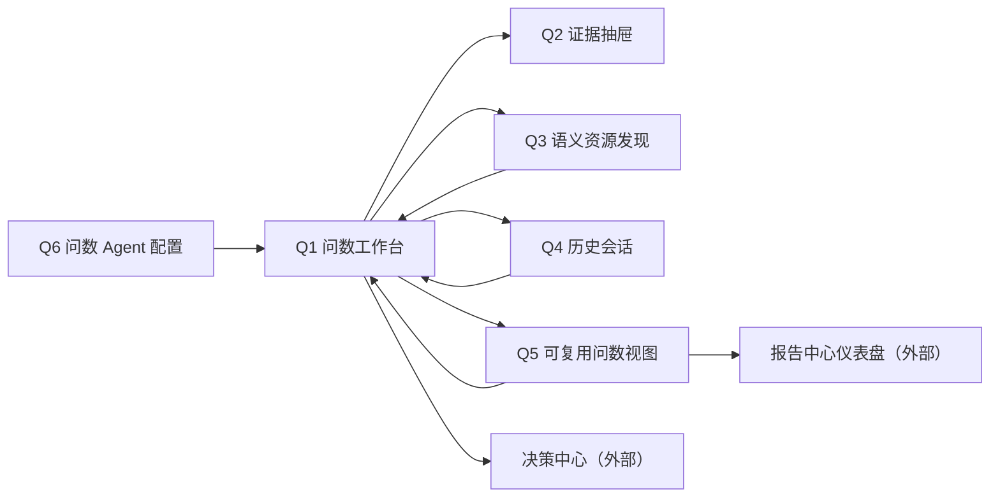

# 新项目功能设计：阶段 3 智能问数

> 版本：v0.1  
> 文档状态：智能问数模块草案已完成，待用户评审；内部自检不等于用户评审通过  
> 更新日期：2026-08-14
> 当前设计范围：M03 智能问数；当前详细场景为 S001“集团融资成本与债务结构优化”  
> 一期最终范围：S001—S004 均须完整实现；S002—S004 在用户补充业务与数据前只定义扩展机制和诚实占位，不虚构问题集、口径或回答  
> 权威依据：平台总控台账中已生效 D001—D067，以及已接受并同步目标合同的 CR028—CR031；总控 Q、推荐方案、模块草案、原型状态和待定建议均不自动构成用户裁决
> 交付性质：中文功能设计；不包含代码、API、数据库、模型部署、技术架构、HTML 原型或其他模块内部设计  

> **v1.1.0 实施对账（D102/I041）**：冻结实施参考原型为 `v1.1.0`，`sourceTag=prototype-v1.1.0-frozen`，`parentVersion=v1.1.0`，`baselineSnapshotId=BSL-OFW-V110-94ABD0E991B7`。唯一模块入口以冻结 `VERSION.json` 的 `intelligent-query-prototype/review-next/conversation-workspace/index.html` 为准。该对账只同步产品能力、合同边界和实施证据门；`acceptanceReady=false`，不表示本模块评审、生产联调或场景验收通过。

## 0. 阅读约定与评审结论

### 0.1 标签与权威性

| 标签 | 含义 | 使用规则 |
|---|---|---|
| `[已生效裁决]` | 平台总控台账中状态为“生效”的 D 裁决 | 可作为本设计的确定前提 |
| `[当前设计]` | 本文提出的智能问数功能方案 | 待用户评审，不冒充已生效裁决 |
| `[工作簿核验事实]` | 从《融资一览表_一期演示数据.xlsx》只读核验得到的字段、公式结果或样例 | 仅作当前演示验收基线，不写入 Agent 提示词，不升级为永久业务口径 |
| `[待数据工程确认][QA-DE-nnn]` | 依赖数据版本、刷新、质量、数据截至时间、消费就绪、低延迟准备或失败回退的未对账字段、可用性或运行证据 | 编号在全文复用；第 13.1 节集中对账；已生效 D 策略不重开，运行依赖确认后逐项关闭、修订或转 CR |
| `[跨模块待定][QA-X-nnn]` | 除数据工程依赖外的跨模块所有权、资源合同或流程衔接缺口 | 第 13.2 节集中对账，并在第 13.5 节形成拟提交总控的 CR 建议 |
| `[待用户裁决]` | 总控仍为 Q 状态或本文新增、会显著改变合同的选择 | 第 13.6 节给出推荐、理由、影响和不采纳后果 |

本文只读对齐本体管理当前唯一 `canvas-first` 原型。当前统一重置基线为 `0 Draft / 0 Published`；历史设计基线中的 Draft 资源只能用于说明后续待形成的业务范围，不是当前可定位资源，也不得进入正式问数、配置绑定或消费证据。Metric、Rule、Action Type 的定义 Owner 已由 D054 确认为本体管理；具体 S001 口径仍受总控 Q001、Q002、Q004 约束。智能问数不得创建、修改或在提示词、Skill 中复制这些资源定义，也不得依赖本体原型 v16/v17 根状态作为权威输入。

平台总控已通过 D026—D034、D054—D057、D061、D063—D067 正式登记数据跟随、候选失败保护、时效目标、演示历史保留、T019 Owner、语义定义 Owner、Published 最小发现包络、问数 Agent 上下文、候选固定题验证、采用后硬质量失败、仪表盘边界、可固定问数视图、数据资产复用和数据源去场景身份合同。CR022—CR027 已登记相应合同；最新 CR028 已增加 T054/C032“本体刷新目标绑定发现包络”，CR029 已扩展 C017 的决策中心受限读取与 C011 安全门，均未改变智能问数只读 C008/T019 与 C017 的边界。本文以这些 D/CR 为确定政策；QA-DE 继续用于对账字段实际可得性、样例、运行证据、质量/截至时间、消费准备和联调验收，不重新打开已经生效的策略裁决。

D063/CR023 已确认 C004/C007 的稳定身份、精确 Published 版本、发布/有效状态、业务可读说明、允许发现的 Link 范围和受控证据入口，以及 C009 兼容状态由智能问数拥有；D064/CR024 已确认候选固定题验证运行和证据归智能问数、本体管理仍唯一拥有 T019；CR022 已确认 C009/C010 问数上下文和结果最小合同、智能问数是 C017 的受限只读消费者、C021 只保存稳定引用；D065/CR025 已确认当前 T019 所指数据版本采用后发生硬质量失败时的消费者阻断和本体受控回退。上述合同生效不等于 Published 资源包、T019、C017 跨模块安全投影、Skill/Tool 加载证明、候选验证运行或跨模块联调已经形成；后续 Published 资源包形成后仍须按智能问数白名单独立核验，不因“已发布”自动获得消费资格。

为避免重复标签影响阅读，全文凡出现下列上游能力，即使表格单元格未逐词重复标签，也统一受相应 QA-DE 对账约束：可消费数据版本及切换受 `[待数据工程确认][QA-DE-001]` 约束；数据截至时间受 `[待数据工程确认][QA-DE-002]` 约束；质量与新鲜度受 `[待数据工程确认][QA-DE-003]` 约束；刷新、上一可信与失败回退受 `[待数据工程确认][QA-DE-004]` 约束；双版本一致性与兼容受 `[待数据工程确认][QA-DE-005]` 约束；低延迟准备和 D032 目标的实测证据分别受 `[待数据工程确认][QA-DE-006]`、`[待数据工程确认][QA-DE-007]` 约束；数据证据定位、空结果区分、历史证据可访问和 S002—S004 数据就绪分别受 `[待数据工程确认][QA-DE-008]`—`[待数据工程确认][QA-DE-011]` 约束。本文对这些内容规定的是智能问数应如何展示、限制和恢复；已生效 D 裁决不再待定，但上游字段和运行证据在实际对账前不视为可用。

### 0.2 一页结论

`[当前设计]` 智能问数是 Published 语义资源的受控消费与解释工作区。用户用自然语言提出业务问题，系统先明确对象范围、层级、时间和口径，再调用获准的 Object、Metric、Rule、关系与 Action Type，最后基于固定语义查询结果组织答案、证据和后续 Action 请求。LLM 只负责理解、澄清、编排和表达，不作为数据源，也不执行正式 Metric/Rule 计算。

`[当前运行资格对账事实｜2026-08-14]` 当前统一重置基线尚不具备新正式问数的正向运行条件，页面必须按实际责任阻断，不能用其他模块原型中的预置成功历史代替权威事实：

| 核对项 | 当前事实 | 对智能问数的处理 |
|---|---|---|
| Published 语义前置 | 本体管理当前唯一 `canvas-first` 原型负责形成 C004—C008；当前正式问数仍未取得可与 T019、C017 同轮次证明的精确 Published 资源包 | 提问前显示实际读取状态；不得展示虚构版本号或把 Draft、旧根状态写入正式配置快照，G1 阻断新正式问数 |
| 数据工程正向链 | 最新联调交接表明 S001 数据工程正向链当前只能诚实到达 T007 发布；M01 尚未实际提供可用 C032，M02 尚未完成 C032 发现、选择和提交前重读，因此链路阻断在 C028 提交前，尚无可核验的 C028、C029、T018 或 T019 正向链 | T007 只作为数据工程已发布资产事实，不进入正式问数；不读取 T007 成员业务明细，不从缺失的后续环节推导可消费状态；显示上游责任和恢复入口 |
| T019 正式消费组合 | 当前尚无 T019；在没有精确 Published 语义版本时也不可能形成正式双版本绑定。T007 发布、C028 已提交、C029 成功或 T018 具备资格均不能代替本体管理原子提交的 T019 | 提问前与 Published 状态分栏显示“正式消费组合尚未形成”；G1 独立阻断，不由智能问数动态创建或切换 |
| Link 白名单 | 当前为 `0 Draft / 0 Published`，没有可用于本轮白名单核对的 Link 资源。此前设计基线曾定义 `LINK-ENTITY-FINANCING` 的候选端点为融资明细→融资主体，业务正向名“融资归属主体”、反向名“主体拥有融资”，并将另两条候选关系表达为融资明细→机构、融资主体→负责人；这些只是非当前的历史设计参考，不是 Draft 现状或 Published 权威定义 | 当前显示“Link 资源尚未形成”并阻断；后续必须把“Published 权威端点/业务名称”和“问数允许遍历方向”分开显示，按精确版本重新核对方向、端点、覆盖和权限负向，不得以历史参考放行查询 |
| Published 生命周期与证据包络 | 当前尚无 Published 版本，因而没有可用于正式问数的发布/有效状态、业务生效时间、精确版本、替代关系或受控证据包络；Draft 页面中的稳定身份和候选定义不等于 Published 发现包 | 显示“尚未形成”及责任位置；待本体发布后按 C004/C007 重新取得并核验，不能由 Draft、同名资源或数据工程状态补齐 |
| D064 候选固定题 | Owner 已由 D064/CR024 确认为智能问数，本体只读验证引用。最新本体原型已收敛为“只读接收智能问数引用并独立核门”，智能问数原型也已有“提交本体管理核对”入口；但当前为 0 Draft、0 Published、无可验证候选，该入口不能形成正向运行，真实题集版本、同一 Run 的跨模块交付和证据交换尚未联调 | 保留 QA-X-006 实施验证；入口存在不等于交换完成，不显示“验证通过”，不让任何本体页面状态或单题结果代替智能问数真实验证 Run |
| 数据可信度上下文 | C017 字段设计和智能问数受限消费者合同已形成，但面向智能问数的真实安全投影、权限负向、稳定证据编号和 DE22—DE25 联调尚未完成；当前没有可与 Published、T019 共同证明的精确 T007、T008、质量/新鲜度摘要和证据定位输入 | 不展示任何预置数据版本、截至时间或可消费结论；不读取数据工程完整工作区，不从 T002/T007 业务明细、运行、成员、关系或来源快照自行拼装。只接受同一 C017 摘要面向智能问数的受限返回；硬质量失败时阻断，状态未知或无法判定时显示“无法判断”并按门禁阻断正式输出 |
| Skill 与 Tool | 配置 Owner 和功能合同已确认，当前没有真实运行环境返回的加载/可用证明 | 显示“配置已要求，实际加载状态待核验”，G0 阻断；不以配置已保存或页面已展示冒充已加载 |

当前阻断责任分层为：精确 Published 语义版本与 T019 均尚未形成，属于本体管理前置；T054/C032 尚未形成真实发现包、数据工程链阻断在 C028 提交前，是当前跨模块运行前置；当前没有 Draft Link 可供核对，历史设计基线中的候选方向不能替代 Published 权威定义或形成正式消费资格；Skill/Tool 加载证明和 D064 候选固定题真实运行归智能问数，当前仍待验证；C017 受限安全投影、权限负向与同上下文运行证据归数据工程。`T007 已发布`、`C028 已提交`、`C029 已成功/T018 具备资格`、`Published 已形成`、`T019 已采用` 和 `智能问数已取得 C017 受限投影` 必须作为独立事实展示，任一项不能推出其他项。任一项恢复都不能单独把正式问数改为可用，必须重新装配同一个可证明的消费上下文并通过 G0—G2。

`[当前原型统一起点]` 首次初始化只保留智能问数拥有的已启用配置要求；当前运行、历史会话、问数视图、固定引用和 Action 请求均为 0。后续“重置当前工作轮次”只清当前工作投影，已有历史运行、证据和请求转为只读保留，不恢复任何预置成功。配置仍显示“实际加载状态待核验”，不会预置 Published 版本、T019、数据版本、T008、质量结论、证据编号或成功结果。用户可以查看推荐问题和各项阻断详情，但在正式上下文完整前，提问只形成可追溯的阻断轮次，不形成业务答案。

`[S001 联调接收条件]` 智能问数的联调入口为 Q1“问数工作台”。只有一次只读重读同时取得并核对以下输入，才允许由阻断态进入正式问数：同一精确 Published 语义版本及获准资源包、该版本的 T019 当前权威绑定、T019 指向的单一精确 T007、同一 T007 的权威 T008、C017 质量/新鲜度与消费资格摘要、逐项稳定证据定位，以及问数 Agent 当前配置的 Skill/Tool 实际加载证明。候选 T007、C028 处理中、C029 失败/未知、T018 未形成或任何未被 T019 采用的版本全部隔离；上游硬质量失败、状态未知、证据缺失、版本不一致或中途变化均不得让 LLM“尽量回答”。

`[原型联调实现约定，不是产品功能合同]` M01、M03、M06 对 C008 使用同一共享交换入口 `ontology3-c008-authoritative-projection-v1` 和包络 `schemaVersion=1`：M01 唯一写入，M03/M06 只读；即使无 T019，M01 也返回 `readStatus=empty` 的完整包络。M03 不读取 v16/v17 根状态，不建立本地适配真值；旧键缺失、单键残留、双键、损坏或结构不兼容只形成诊断和拒绝，不迁移为正式消费事实。该键仅用于原型联调证据，不新增资源类型、产品字段、QA-X 或 CR；C004—C007 仍从 M01 同一既有交换入口按 C008 精确版本和完整 C033 读取。

`[v1.1.0 实施对账][D102/I041]` 冻结回归确认 M03 的产品能力为 55 个语义资源、1 个问数 Agent、3 个精确 C009 领域绑定、34 个推荐问题、证据映射和 CSV 门禁。该结果只关闭原型层入口、状态源和展示问题；设计 Owner 回写、真实 C008/T019、C017、问数/Rule→C011、Skill/Tool 加载、权限负向、并发/有效期及 C034 导出恢复仍是实施 P0/P1，必须有真实运行 ID、API 回执、权限和恢复证据后才能关闭。历史 S001 `v1.0.4` 的 6/6 候选验证、7 次问数和三条 Action Request 不替代 `v1.1.0` 新轮次证据。

一期 S001 必须真实完成以下闭环：

```text
输入问题
→ 自动匹配已启用且适用的问数 Agent 配置；多匹配时由用户确认，无匹配时阻断
→ 固定配置快照并核验 Skill、Tool 与平台确定性门禁的实际证明
→ 识别场景、对象、范围、层级、时间、Metric/Rule/关系意图
→ 必要时澄清并让用户确认关键范围
→ 装配配置、语义、查询、数据可信度等运行上下文并通过阶段门禁
→ 展示可理解的查询计划
→ 只读取已绑定 Published 语义资源和同一可消费数据版本
→ 返回答案、证据、版本、新鲜度/质量提示和追问
→ 在同一结构化结果上下文中切换文字解读、数据表或受控 BI 图表
→ 在数据表中一键导出本次完整结构化语义查询结果及其版本、质量和证据引用
→ 用户从单一主体答案发起受控 Action 请求
→ 决策中心承接运行记录、正式人工确认和负责人待办
```

一期不是“把工作簿交给 LLM 总结”，也不是“把整张明细表塞入上下文”。常用指标、Rule 命中和银行归因由 Published 本体资源提供；明细只在用户下钻时沿已发布关系按需读取。

### 0.3 一期成功判据与失败判据

| 成功结果 | 不得记为通过的情形 |
|---|---|
| 同一演示账号从智能问数入口完成 S001 所有问题，无需登录或切换角色 | 依赖另一个账号、权限审批或人工后台改结果 |
| 单家、任意两家和三家综合成本均由正式 Metric 对获准对象集合求值 | 让 LLM 自算、平均单位成本、读取工作簿公式或写死样例答案 |
| 集团、产业板块、单位三级范围可见且不混淆；金融机构归因可下钻到借据 | 只给结论，无对象集合、关系路径、机构贡献或明细证据 |
| 三家单位分别解释三条 Rule 的指标值、阈值、条件、命中分支和版本 | Agent 临时判断阈值，或把当前 Draft 中仍待用户裁决的阈值写进提示词并冒充已发布、已定口径 |
| 每次回答显示 Published 语义版本、可消费数据版本、数据截至时间、生成时间和证据引用 | 只显示“最新”、以工作簿生成日期代替数据截至时间、证据无法定位 |
| 数据刷新、质量、陈旧或不兼容状态被诚实呈现，并只在获准边界内回答 | 读取处理中/质量失败候选，或把上一可信结果冒充当前新数据 |
| 从答案发起 Action 请求前明确提示影响；提交后以决策中心返回结果为准 | 智能问数直接确认、创建待办、修改融资事实，或把回答文字当作 Action 成功 |
| LLM 失败后可基于同一已取得证据重新生成，不改变业务事实 | 重试时静默换版本，或在没有语义结果时补写答案 |
| 常用问题、历史会话、可复用问数视图和固定到仪表盘均保留查询定义、版本和证据 | 只保存一段不可刷新、无版本的自然语言回答 |
| 文字、表格和 BI 图表共用同一结构化语义结果、范围、双版本、时点、质量状态和证据 | 切换展示时让 LLM 重算、静默重查、换版本、改筛选或生成无证据图形 |
| 展示切换保持稳定高度且无空白帧；连续选择只收敛到最后选择，精确值、版本、警告和证据入口持续可用 | 为追求动效强行跨不同类别、单位或业务关系变形，排队播放动画，或延迟业务结果阅读 |
| 数据表可一键导出本次查询实际返回的完整结构化结果、精确值、双版本、截至时间、质量状态和证据编号 | 只导出图表 Top N/临时聚焦项、导出图表舍入值、源表字段/原始工作簿，或导出时重新查询、调用 LLM、换版本 |
| 每轮形成业务可读、不可混版的运行上下文证明；配置、Published 资源、T019、查询范围、固定结果和证据逐项可核对 | Prompt/Skill/白名单错配、同名误绑、Link 方向错误、必需上下文被静默截断，或让 LLM 对缺口“尽量回答” |

### 0.4 “问数结果 BI 展示切换与 CSV 导出”合理性结论

`[当前设计]` 两项能力均合理，应纳入智能问数一期的“回答展示、当前结果消费与可复用问数视图”，但只作用于**本次已固定的受控结构化语义结果**，不新增独立 BI 模块、导出平台，不建设完整 ChatBI、BI 编辑器或自助分析平台。

| 验证问题 | 结论 | 边界与依据 |
|---|---|---|
| 是否属于智能问数 | 属于。文字解读、数据表和 BI 图表只是同一结构化语义查询结果的三种呈现 | 不新增数据查询、Metric/Rule 求值或业务结果；展示切换不形成新回答版本 |
| CSV 是否属于智能问数 | 属于。它是数据表对当前固定结构化结果的一次性消费动作，不是第四种展示模式或数据资产发布 | 不调用 LLM、不重查、不换版本；不包含源表字段、原始工作簿或当前结果之外的数据 |
| 与可复用问数视图的关系 | 视图分别保存查询定义和展示偏好；重跑先执行原查询定义，再验证偏好是否仍适用 | 展示偏好不能改变对象、筛选、分组、排序语义、时间策略或结果值 |
| 与固定到仪表盘的关系 | 智能问数交付视图引用、查询定义、展示建议、当前结果和可信度；报告中心决定卡片、布局、编排和发布 | “固定成功”仍只表示报告中心接收，不表示仪表盘已发布 |
| Owner 是否清楚 | 智能问数拥有回答内即时切换、图表适用性判断、安全回退、视图展示偏好和当前结果 CSV；报告中心拥有正式仪表盘生命周期 | CSV 不转移数据资产所有权；不在本文设计报告中心内部 BI 编辑流程 |
| 是否与现有待定冲突 | 不产生新的边界冲突；QA-X-005/CR-QA-006 已由 D061/CR020 收敛，QA-X-009/CR-QA-003 已由平台 CR022 登记 C010 最小结果合同 | D035/D055 已确认仪表盘 Owner 与独立一级入口，D056 已确认业务事实取数边界；真实运行/联调待验不重新打开已生效裁决 |
| 一期能否最小闭环 | 能。使用 Q1/Q5 现有页面完成“真实问数 → 三态切换 → 证据定位 / 当前结果 CSV → 保存偏好 → 重跑验证 → 固定交付” | 不增加新一级页面、导出任务中心或完整图表编辑能力，也不指定图表技术实现 |

CSV 的版本、截至时间、质量状态、双版本一致性和证据定位分别复用 `[待数据工程确认][QA-DE-001]`、`[待数据工程确认][QA-DE-002]`、`[待数据工程确认][QA-DE-003]`、`[待数据工程确认][QA-DE-005]`、`[待数据工程确认][QA-DE-008]`；本文只规定这些字段如何随当前结果保留，不把上游尚未对账的数据合同写成事实。

## 1. 产品定位、用户与范围边界

### 1.1 要解决的用户问题

智能问数让财务管理者、融资管理者和演示操作者无需理解源表字段即可回答：

- 某一家、任意两家、三家、某产业板块或集团范围的融资成本和债务结构是什么；
- 一个结果使用了哪些对象、Metric、筛选、关系、时间和版本；
- 某条 Rule 为什么命中或没有命中，哪个条件和证据起决定作用；
- 异常贷款集中在哪些金融机构，哪些机构对问题余额或成本贡献最大；
- 当前结果是否足以发起受控 Action 请求，以及请求提交后去哪里继续处理；
- 数据正在刷新、质量有警告、结果陈旧或资源不兼容时，哪些内容仍可回答、哪些必须拒绝；
- 本轮到底加载了哪个问数 Agent 配置、哪些 Published 资源、哪个 T019 权威组合和哪组证据，是否在执行中发生过错配、截断或换版；
- 如何在不改变查询范围、口径、版本和证据的前提下，把同一结果切换为文字、表格或适用的 BI 图表；
- 如何从数据表导出本次查询实际返回的完整、精确且自带版本/质量/证据引用的 CSV，而不接触源表字段或重新运行问数。

### 1.2 一期用户

`[已生效裁决 D003]` 一期使用一个演示账号，不建设身份认证、角色切换或权限治理。本文仍以三类业务任务理解用户需求，但页面不要求切换角色：

| 任务视角 | 主要目标 | 一期典型动作 |
|---|---|---|
| 集团财务管理 | 了解集团、板块和单位对比，发现成本与结构问题 | 提问、调整范围、查看证据、固定视图 |
| 融资管理 | 解释 Rule、定位问题借据与金融机构、提出协商方向 | 追问、下钻、发起 Action 请求 |
| 演示与验收 | 验证真实双版本、错误状态、恢复和跨模块闭环 | 运行固定测试问题、切换场景、核对提交结果 |

后期接入真实用户时再建设权限投影、敏感范围、代表身份、共享范围和审计治理；这些不成为一期 S001 门禁。

### 1.3 本模块拥有、引用与不拥有

| 边界 | 资源或责任 | 智能问数功能责任 | 明确不承担 |
|---|---|---|---|
| 拥有 | 问数 Agent 配置 | 系统提示词、问数 Skill 要求、Tool 白名单、平台确定性能力基线、本体绑定、资源白名单、固定测试问题、配置版本和启用状态；D022/C009 | 不拥有报告/洞察 Agent 配置，不以配置文字冒充实际加载/可用证明 |
| 拥有 | 问数运行上下文装配与证明 | 为每轮固定配置、语义、查询、数据可信度、结果证据、显式会话继承和 Action 上下文，执行门禁并展示业务摘要 | 不新增平台正式资源类型；不让 Agent 应用或共用承载选择、改写或追加上下文 |
| 拥有 | 问题、语义解析和查询计划 | 识别意图、范围、层级、时间、筛选、Metric/Rule/关系/Action，必要时澄清 | 不创建或修改本体资源，不设计数据加工 |
| 拥有 | 智能问数回答 | 组织受控语义结果、版本、证据、警告、追问和不可回答说明 | 不把回答当数据源、Metric/Rule 结果或正式决策记录 |
| 拥有 | 即时结果展示与视图展示偏好 | 对同一结构化结果切换文字/表格/受控图表，判断适用性、保持上下文并安全回退 | 不重算、重查或改变口径；不拥有完整 BI 编辑器 |
| 拥有 | 当前结果 CSV 导出 | 从本次已固定结构化语义结果生成一次性 CSV，保留精确业务值、双版本、截至时间、质量状态和证据编号 | 不拥有或发布数据资产；不导出源表字段、原始工作簿、结果外明细或决策中心运行状态 |
| 拥有 | 常用问题、历史会话、可复用问数视图 | 保存问题入口、会话上下文和可重跑查询定义 | 不拥有仪表盘布局、正式报告或报告定义 |
| 拥有 | Action 请求发起体验 | 展示入口、提交前提示、发送获准请求、展示接收结果 | 不拥有提醒、正式人工确认、负责人待办及其状态机 |
| 引用 | Published Object/Property/Link/Metric/Rule/Action Type | 发现、解释和只读调用当前获准资源 | 不复制公式、阈值、归因排序、负责人关系或 Action 效果 |
| 引用 | Published 语义版本 | 显示精确版本并作为 Agent 配置绑定依据 | 不发布、修改或静默升级语义版本 |
| 引用 | 可消费数据版本、截至时间、质量和刷新摘要 | 在每次回答与错误状态中展示并据此决定回答边界 | 不读取工作簿、原始快照、候选半成品或自行提交权威指针 |
| 输出 | 可固定问数视图 | 向报告中心交付可重跑定义、当前结果摘要和证据 | 不拥有仪表盘卡片布局、发布或跨卡片编排 |

`[已收敛][QA-X-002][D054]` Metric、Rule、Action Type 的定义、依赖、版本和 Published 生命周期统一由本体管理拥有；查询/计算、Rule 评估结果和本模块形成的 Action 请求入口仍归对应运行模块。智能问数只绑定和引用稳定身份，不复制定义。

### 1.4 当前设计范围、一期最终范围与后期

| 范围层次 | 本文处理方式 | 完成定义 |
|---|---|---|
| 当前详细设计 S001 | 完整设计问题、配置、页面、状态、证据、受控展示切换、当前结果 CSV、Action 和验收 | 本文第 3—12 章可直接进入功能评审 |
| 一期最终 S002—S004 | 保留稳定场景入口、配置扩展位、资源就绪检查和诚实空态；等待用户资料 | 用户补充资料后必须逐场景补齐真实问题、语义资源、证据、回答与验收，不能用 S001 套壳 |
| 后期 | 多账号权限、跨会话共享、更多业务域、大规模资源治理、复杂分析和生产运营增强 | 不反向扩大当前 S001 评审门，不显示假入口 |

`[已收敛][QA-X-008][CR022]` C021 已确认场景清单保存问数配置、Skill、Published 本体范围、数据就绪和未就绪原因的稳定引用；S002—S004 当前仍因用户资料不足保持未就绪。本文只定义接入机制，不推测预算口径、债务风险模型或贷前调查报告问题集。

### 1.5 一期明确不做

- 不配置数据源、采集、管道、Python 处理、质量规则或数据资产发布。
- 不创建、修改或版本化 Object、Property、Link、Metric、Rule、Action Type。
- 不读取原始工作簿、原始快照或整张明细表作为 LLM 上下文。
- 不把 Agent 应用的报告/洞察/伴读 Agent 配置、工具、会话记忆或协作编排自动注入问数 Agent；未来即使共用运行承载，也只能承载智能问数已固定的配置快照和上下文，不得追加“最新版本”或包外资源。
- 不让 LLM 计算正式 Metric、判断 Rule、发明阈值或排序金融机构。
- 不设计报告/洞察 Agent、报告定义、报告模板、正式报告或 AI 洞察发布。
- 不建设完整 ChatBI、BI 编辑器、自助分析平台或 Dashboard Builder；一期除系统推荐、指标卡、横向/纵向柱状图、堆叠柱状图、环形图和安全回退数据表外，不提供折线图、散点图、地图、关系图、动态流、Bar Race、自由拖拽、自由组合字段、自定义公式、图表脚本或主题编辑器。
- 当前 S001 无可靠 Published 时间序列，不提供折线图；后续只有 Metric 明确支持时间序列后才可进入适用性评审。
- 不允许绕过 Published 本体选择源表字段；不把 D3.js、ECharts 或其他图表库写成强制实现要求。
- 不做大规模异步导出、批量历史导出、定时投递、自定义字段导出、Excel 导出或导出任务中心；不得截断结果冒充完整 CSV。
- lieflat-charts 仅作编辑感、留白、业务标签、快速判断和克制动效的视觉参考；鉴于其非商业许可，不把复制其代码、模板、素材或衍生实现写成既定方案。其他体验参考同样不构成技术选型。
- 不设计决策中心内部提醒、正式人工确认、待办状态机或负责人工作台。
- 不做身份认证、角色权限、敏感数据授权或多租户治理。
- 不用静态答案、预置成功记录、禁用按钮或 HTML 原型冒充真实问数。

## 2. 功能能力地图与工作区

### 2.1 功能能力地图

| 能力域 | 一期最小能力 | 关键输出 |
|---|---|---|
| Agent 配置与匹配 | 系统提示词、Skill 要求、Tool 白名单、平台确定性能力、本体绑定、语义资源白名单、Action 白名单、配置版本和固定测试；按场景与问题自动匹配已启用配置 | 唯一适用时固定配置快照；多适用时确认；无适用或证明不完整时阻断 |
| 运行上下文装配 | 固定配置、语义、查询、数据可信度、结果证据、显式会话继承和 Action 七组上下文；执行前后核验完整性 | 本轮上下文清单、门禁结果和业务可读摘要 |
| 问题输入 | 自然语言、对象选择、时间/范围条件、常用问题和历史追问 | 原始问题与显式约束 |
| 语义理解 | 业务意图、对象、层级、Metric、Rule、关系、Action、时间和筛选识别 | 可编辑的“问题理解”摘要 |
| 歧义澄清 | 对象重名、范围不清、时间不清、口径冲突、关系归因不明 | 最少必要的澄清问题和选项 |
| 查询计划 | 展示范围、步骤、语义资源、分组、筛选、关系路径和版本 | 用户可理解的计划，不展示技术查询语言 |
| 受控查询 | 只对获准 Published 语义资源求值，固定同一回答的证据上下文 | 结构化语义查询结果 |
| 回答与追问 | 直接结论、构成/对比、Rule 解释、机构归因、警告、证据和建议追问 | 带版本和证据的智能问数回答 |
| 结果展示 | 同一结构化结果在文字解读、数据表和少量适用 BI 图表间切换；语义身份一致时自然过渡，否则安全淡入或直接切换 | 不改变范围、口径、版本和证据且无空白帧的展示状态 |
| 当前结果导出 | 数据表一键导出本次查询实际返回的完整结构化结果、精确值和追溯字段 | 不重查、不调用 LLM、不换版本且不含源数据的 CSV |
| 证据与可信度 | 版本证明、数据时点、质量/新鲜度、资源引用、对象/借据下钻 | 证据抽屉与不可回答原因 |
| 复用 | 常用问题、历史会话、查询定义与展示偏好分离的可复用问数视图、固定到仪表盘 | 可重跑而非静态文本的消费资源 |
| 受控行动 | 单主体 Action 入口、提交前提示、提交结果和决策中心跳转 | Action 请求接收结果 |
| 恢复 | 各阶段加载/失败、同证据重生成、计划重试、版本变化提示 | 不重复业务副作用的恢复路径 |

### 2.2 页面/工作区清单

| 编号 | 页面/工作区 | 用户目标 | 一期主动作 |
|---|---|---|---|
| Q1 | 问数工作台 | 输入问题、确认理解、查看计划、切换结果展示、导出当前结果、查看答案和追问 | 提问 / 切换文字·表格·图表 / 导出 CSV / 继续追问 |
| Q2 | 证据抽屉 | 核对版本、Metric/Rule、对象范围、机构和借据证据 | 打开证据或回到回答 |
| Q3 | 语义资源发现 | 查看当前 Agent 可使用的 Object、Metric、Rule、关系和 Action Type | 引用资源发起问题 |
| Q4 | 历史会话 | 找回问题、答案、版本、错误和 Action 请求结果 | 继续会话 / 复用问题 |
| Q5 | 可复用问数视图 | 分开保存查询定义与展示偏好，参数化、重跑、导出本次结果和固定查询视图 | 运行 / 调整展示偏好 / 导出 CSV / 固定到仪表盘 |
| Q6 | 问数 Agent 配置 | 管理系统提示词、Skill、绑定、白名单、配置版本和测试 | 验证并启用配置 |

Q1 是一期默认入口，不创建营销落地页。Q2 作为抽屉从 Q1/Q4/Q5 打开；Q3/Q4/Q5/Q6 是稳定导航入口。运行上下文证明自然嵌入 Q1/Q2/Q4/Q5/Q6，不新增技术运维页。S002—S004 进入 Q1 时显示场景就绪检查，不另造虚假问数页面。

### 2.3 对话优先三栏工作区

`[当前设计]` 最终产品采用“对话优先、证据随行、分析按需展开”的单一工作区，不再把分析工作区或语义导航工作区发展为平行产品方向。打开智能问数后直接进入 Q1，不展示营销首页、方案选择页或设计说明页：

```text
平台统一壳
├─ 左侧智能问数导航
├─ 中部对话与结果工作区
└─ 右侧本轮上下文与语义证据
```

| 区域 | 一期职责 | 关键边界 |
|---|---|---|
| 左侧导航 | 问数工作台、历史会话、问数视图、语义资源、Agent 配置 | 名称、空态、按钮和弹层术语全模块一致；不加入报告、决策或数据工程管理入口 |
| 中部对话与结果 | 自然语言输入、Agent 匹配、对象澄清、显式继承/覆盖/清除、查询状态、回答、文字/表格/BI、CSV、证据入口、追问、保存视图和受控 Action | 不展示模型思维过程、内部查询语言、源字段 Join 或技术执行日志 |
| 右侧本轮上下文与语义证据 | 随本轮从“提问前 → 解析后 → 回答后”更新配置、语义、数据可信度、计划和证据摘要，并提供“查看详情” | 是只读证明区，不是语义编辑器、自由推演区或第二套配置页；不得创建或切换 T019 |

右侧按阶段显示：

| 阶段 | 必须显示 | 状态要求 |
|---|---|---|
| 提问前 | 自动匹配或当前默认的问数 Agent 配置及状态；Published 语义是否可用；T019 正式消费组合是否形成；数据截至时间；质量与新鲜度；当前能否正式问数 | 只显示权威读取结果；缺 Published、T019、T008 或可信度时明确阻断和责任位置，不以配置已启用冒充可问数 |
| 问题解析后 | 最终问题理解、确认对象稳定身份集合、层级、计划使用的 Object/Metric/Rule/Link、Link 权威方向与端点、计划门禁结果 | 未确认的候选、Draft、同名替代或错误方向不得进入“将使用”清单 |
| 回答形成后 | 本轮实际使用的稳定语义资源、精确 Published 语义版本、可消费数据版本、T008、质量/新鲜度/警告、证据数量和定位状态、“查看详情” | 只引用本轮固定快照；版本/资源/证据缺失时不得回退最新、Draft 或同名资源 |

本体资源“查看详情”只允许携带精确 Published 版本和稳定资源身份，业务路由合同为 `#published/resource?version=<exactVersionId>&id=<stableResourceId>&tab=overview`。任一参数缺失、历史版本不可定位、资源不存在或用户无权查看时入口禁用并说明原因，不尝试按显示名称或当前最新版替代。

### 2.4 页面间上下文



从资源、历史或视图返回 Q1 时，以来源轮次标识和显式继承清单装配场景、问题、对象集合与计划；原轮次上下文快照保持只读。当前展示模式、图形/表格选中项、滚动位置和证据抽屉状态单独恢复。进入报告中心或决策中心后再返回，也恢复原回答及其精确证据上下文。展示模式、展示层 Top N、隐藏图例和局部选中项只是页面状态，不得改写查询定义、业务结果、Action 目标或 CSV 导出范围。

## 3. 问数 Agent 配置设计

### 3.1 配置组成与原则

`[已生效裁决 D022]` 智能问数拥有问数 Agent 配置。一个可启用配置由以下部分组成：

| 配置部分 | 功能含义 | 不得包含 |
|---|---|---|
| 配置身份与版本 | 配置名称、稳定标识、版本、状态、Owner、说明、生效时间、变更摘要 | 数据版本伪装成配置版本 |
| 系统提示词 | 任务边界、事实来源、回答规范、证据要求、失败与禁止行为 | Metric 公式、Rule 阈值、银行排序、负责人关系、样例答案 |
| 问数 Skill 要求 | 一期仅配置“场景与资源发现”“对象解析与消歧”“受控查询规划”三项受控业务能力 | 把证据表达、Rule/机构解释、Action 编排、失败恢复、语义求值、版本门禁、BI、CSV 或结果一致性单独包装为 LLM Skill |
| Tool 白名单 | 一期允许受控语义查询、证据读取和 Action Request 提交三类工具稳定身份、版本和用途；原请求结果查询只能在 QA-X-007/CR-QA-004 收敛后条件增加 | 任意外部工具、源表查询、工作簿读取、未收敛的原请求查询或包外写操作 |
| 平台确定性能力 | Agent 匹配与快照、版本/质量/上下文门禁、固定结果和证据一致性、展示与 CSV、输出后核验 | 依赖 LLM 自觉执行，或作为可由 Agent 改写的 Prompt/Skill |
| Published 本体绑定 | 精确语义版本、场景、允许的业务域和改绑规则 | 自动跟随未评审语义版本 |
| 资源白名单 | 获准 Object、Property、Metric、Rule、Link、Action Type 及用途 | Draft、未发布资源、原始工作簿、任意外部工具 |
| 数据跟随策略 | 对已绑定语义版本选择可消费数据版本的规则 | “最新文件”“最后上传”或消费者自建指针 |
| 固定测试问题 | S001 正向、反向、歧义、错误、版本和 Action 测试 | 写死答案替代真实运行 |

一个配置版本必须把系统提示词版本、预期 Skill 标识/版本、Tool 白名单版本、资源白名单版本、平台确定性能力基线和精确本体绑定版本作为同一不可拆分配置快照。配置记录“要求什么”，每次运行还必须核验“实际加载/可用什么”；仅名称相同、版本缺失、静态配置存在或部分沿用旧快照均不得证明可正式执行。

`[已生效裁决 D026][已生效裁决 D034][待数据工程确认][QA-DE-001]` 数据跟随与 T019 只读策略已确认：每轮只使用 T019 指向的精确 Published 语义版本和与其兼容的单一可消费数据版本，智能问数不自建或切换权威指针。具体交换字段、两类“上一”引用、切换时间、状态样例、权限负向和真实运行证据仍待数据工程联调验证。

### 3.2 系统提示词功能正文

以下是一期系统提示词必须表达的完整业务约束。配置页按条目展示和版本化，而不是把规则散落在多个页面：

> 你是企业级智能问数 Agent，只回答当前场景和资源白名单内的问题。你的事实来源只能是绑定的 Published 本体资源、受控语义查询结果及其版本/质量/时点元数据。不得把工作簿、原始快照、整表、用户粘贴的数字或模型自身知识当作正式数据。  
> 先识别用户要查询的场景、对象、对象集合、层级、时间、筛选、Metric、Rule、关系或 Action Type。只有歧义会显著改变结果时才提问澄清；否则展示你的范围理解，让用户可修改。  
> 正式数值必须来自获准 Metric 或其受控查询结果；Rule 命中、阈值、条件分支和金融机构归因必须来自获准 Rule 证据。不得自行计算或改写正式口径，不得把多个单位成本做简单平均。  
> 每个回答使用一个一致的证据上下文。回答必须显示 Published 语义版本、可消费数据版本、数据截至时间、生成时间和证据引用；有陈旧、质量、刷新或兼容警告时必须先说明影响。  
> 只有本轮运行上下文清单完整、同版且通过门禁时才能执行。系统提示词、Skill、白名单、本体绑定、T019、对象范围、Metric/Rule 身份、单位、质量警告和证据不得因上下文长度被静默删除；必需项缺失时必须显示“上下文不完整，无法回答”，不得自行补全。
> 文字解读、数据表和 BI 图表必须使用同一份已固定结构化语义结果。切换展示不得让模型重新计算、不得静默重新查询或切换版本；图表只映射已有维度、度量、标签和证据，不适用或失败时回退表格并说明原因。  
> CSV 只能由本次已固定结构化语义结果生成。不得让模型组织、补算或扩充导出数据，不得因图表 Top N、隐藏图例或临时聚焦缩小结果；不得导出源表字段、原始工作簿或当前结果之外的数据。
>
> 直接回答问题，再给构成、对比或原因；只引用支持当前结论的必要证据。数值显示单位、精度、范围和无法计算原因。未知、无匹配、无权限、资源不存在和数据缺失不得相互混淆。  
> 追问只能继承上一轮明确列入继承清单的对象、层级、时间、筛选、分组和排序；不得把普通会话文字、展示 Top N、隐藏图例或图形临时选中项当作查询范围。不得静默继承已经改变含义的范围或把不同数据版本拼接为一个结论。发现版本变化时应明确提示并按原完整快照完成或整体重跑，不得混版。
> 只能请求资源白名单中的 Action Type。请求前展示目标主体、触发 Rule、指标快照、优先协商机构、候选借据、双版本、数据截至时间和警告，并说明“提交只创建 Action 请求，不等于正式人工确认或已生成待办”。  
> 不得代表用户完成决策中心的正式人工确认，不得创建负责人待办，不得修改融资事实，不得声称 Action 成功，除非已收到决策中心的明确接收结果。  
> 当证据不足、资源冲突、质量失败、本体不兼容或查询失败时，停止生成业务结论，说明缺口、影响和恢复动作。LLM 生成失败时，可以基于同一已取得证据重新组织表达，不得补造事实。

系统提示词末尾只引用配置中的 Skill、白名单和场景，不复制其明细内容；这样资源变化由绑定和白名单版本承接，而不是修改自然语言条款。

### 3.3 Skill、Tool 与平台确定性能力

三者必须在配置页、本轮摘要、固定测试和证据中分栏展示，不能用一个“实际加载能力”笼统代替：

| 能力层 | 功能定位 | 一期内容 | 运行证明与失败规则 |
|---|---|---|---|
| Skill | Agent 用于理解、发现、消歧和规划的受控业务能力 | 场景与资源发现、对象解析与消歧、受控查询规划，共 3 项 | 显示配置要求与实际加载的稳定身份/版本、来源和核验时间；缺少真实运行环境证明时显示“配置已要求，实际加载状态待核验”，G0 阻断，不显示“已加载” |
| 受控 Tool | 对正式资源执行确定性读写边界的受控入口 | 一期白名单为语义查询、证据读取、Action Request 提交，共 3 类；原请求结果查询是 QA-X-007 的条件能力 | 显示白名单身份/版本、允许用途、实际可用状态和核验时间；包外、错版、不可用或用途不符时阻断相应阶段，不允许 Agent 自行替代 |
| 平台确定性能力 | 不依赖 LLM 的固定规则和页面能力 | Agent 配置匹配与快照、上下文装配、Published/T019/质量门禁、结构化结果/证据一致性、BI/表格/CSV 映射、输出后核验、状态与恢复 | 记录规则版本/核验结果；失败时由平台阻断或安全回退，不能让 LLM“尽量执行”，也不宣称为 Skill 已加载 |

系统提示词只约束 Agent 行为，不能代替 Tool 权限或平台门禁。Metric/Rule 正式求值必须由受控语义查询 Tool 基于精确 Published 资源执行；证据由证据读取 Tool 返回稳定定位；Action 由标准提交 Tool 发起。LLM、Skill、BI 和 CSV 均不得自行计算 Metric、判断 Rule、经源字段 Join 或制造证据。

#### 3.3.1 一期 Skill 集

| Skill | 负责什么 | 输入 | 输出 | 禁止行为 |
|---|---|---|---|---|
| 场景与资源发现 | 判断 S001—S004 场景就绪，仅发现白名单内的 Published 资源 | 问题、当前场景、配置版本 | 场景、候选资源、不可用原因 | 搜索 Draft、未获准业务域或以同名资源代替稳定身份 |
| 对象解析与消歧 | 将名称、编码、别名、集团/板块/单位/机构/借据层级和筛选词解析为稳定对象集合 | 用户文本、对象目录、层级词和显式继承范围 | 候选对象、层级范围、匹配依据、去重结果和需澄清项 | 猜测重名对象、把板块标签当主体或静默忽略无匹配项 |
| 受控查询规划 | 把已确认范围和正式 Metric/Rule/Link 意图编排为受控查询计划 | 已确认范围、Published 资源元数据和允许的 Link 路径 | 业务可读计划和 Tool 调用意图 | 自行求值、构造源字段查询、反向猜测 Link 或展示内部查询语言 |

Rule/机构结果解释和证据引用是系统提示词对已固定结果的表达约束；Action 资格、提交前摘要、失败分类和恢复动作是平台确定性能力与受控 Tool 合同。它们不因页面需要展示或 LLM 需要组织文字而形成额外 Skill。

#### 3.3.2 一期 Tool 白名单与平台确定性能力

| 类型 | 一期用途 | 必须核验 | 禁止越界 |
|---|---|---|---|
| 语义查询 Tool | 对白名单内 Object/Metric/Rule/Link 及已确认范围求值，返回固定结构化结果 | Tool 稳定身份/版本、配置允许用途、精确 Published/T019 快照、对象范围和执行结果身份 | 源字段查询、工作簿读取、Draft 资源、同名替代、LLM 代算 |
| 证据读取 Tool | 按本轮证据编号读取受控语义/数据证据与定位状态 | Tool 身份/版本、证据属于本轮结果、用户获准、定位结果和责任位置 | 暴露整表、物理字段、Python 细节、结果外数据或改链最新版本 |
| Action Request Tool | 提交单一主体标准请求 | Tool 身份/版本、Action Type、证据快照、幂等摘要及提交回执 | 直接确认、创建待办、盲目重发、把接收当执行完成，或在 QA-X-007 收敛前声称可查询原请求 |
| 平台确定性门禁 | 执行 Agent 匹配、配置/语义/数据/证据完整性和输出核验 | 规则版本、输入快照、门禁结果、失败责任和核验时间 | 交给 LLM 决定是否放行 |
| 平台确定性消费 | 从同一固定结果生成表格、BI 和 CSV并保持证据 | 固定结果身份、适用性/导出资格、双版本和证据不变 | 重查、换版、调用 LLM 补数或暴露源数据 |

### 3.4 本体绑定与资源白名单

`[已收敛][QA-X-001][D063][CR023]` C004/C007 面向消费者的最小 Published 发现包络合同已经确认；M03 只接受 M01 当前唯一投影所指精确 Published 版本的同轮次 C004—C007 响应，不从任何旧根状态、Draft 或本地白名单推导正式资源。下表资源只作为未来 Published 白名单基线，Draft 中可见的稳定身份和 Link 候选方向不得进入正式配置快照。Agent 配置必须在 Published 形成后绑定精确版本与稳定资源身份，不以显示名称作为唯一引用，也不得因 Draft 目录可见而绕过 T019、白名单或运行门禁。

| 资源类型 | S001 当前白名单基线 | 允许用途 |
|---|---|---|
| Object Type | 融资主体、融资明细、融资机构、融资负责人 | 对象发现、筛选、分组和证据下钻 |
| Property | 单位编码/名称、产业板块；借据编号、境内外、日期、币种、余额、当前利率、利率形式、融资类型、期限种类、担保方式；机构编码/名称/类别；负责人标识/名称 | 回答必要构成、筛选和证据展示 |
| Link | `LINK-ENTITY-FINANCING`（权威端点融资明细→融资主体；业务正向“融资归属主体”、反向“主体拥有融资”；允许双向遍历）、融资由机构提供（融资明细→融资机构，仅正向遍历）、主体由负责人承接（融资主体→融资负责人，仅正向遍历） | 分别核对 Published 权威端点/业务名称与问数允许遍历方向，只按白名单方向和适用范围进行多层范围、机构归因、借据和 Action 证据导航；负责人关系只作为 Action 证据，待办仍归决策中心 |
| Metric | 融资余额、余额加权平均融资成本、浮动利率余额占比、短期债务余额占比、外币融资余额占比、高成本融资余额占比、信用融资余额占比 | 集团/板块/单位/显式对象集合问数 |
| Rule | R01 融资成本偏高、R02 浮动利率暴露、R03 短期债务集中 | 命中解释、问题明细和机构归因 |
| Action Type | 发起融资优化建议 | 从单一主体回答发起受控请求 |
| 元数据 | Published 语义版本、可消费数据版本、数据截至时间、生成时间、质量/新鲜度/刷新摘要、证据引用 | 每次回答的可信度证明 |

白名单采用“默认拒绝”：资源未列入、未 Published、已不兼容或超出场景时，不因名称相似自动调用。同名但稳定身份不同的资源必须视为不同资源；Link 方向或端点不符合 Published 定义时不得改用反向猜测或源字段 Join。资源发现页可以展示“存在但当前 Agent 未获准使用”的抽象状态，不能泄露未获准内容。

### 3.5 配置生命周期、版本和验证

| 状态 | 含义 | 允许动作 | 不允许动作 |
|---|---|---|---|
| 编辑中 | 配置存在未完成或未保存变化 | 编辑提示词、Skill 引用、绑定、白名单和测试 | 供正式问数使用 |
| 待验证 | 必填完整，尚未跑完固定测试 | 运行全部或单项测试、查看差异 | 启用为当前正式配置 |
| 验证失败 | 至少一项正向、反向、版本或 Action 测试失败 | 修正后生成新候选并重验 | 用人工勾选改为通过 |
| 可启用 | 同一候选版本的必需测试通过 | 查看差异、启用 | 修改内容后沿用旧验证 |
| 已启用 | 新问题默认使用的配置版本 | 只读查看、从此版本派生修改 | 原地改写配置 |
| 已停用 | 不再用于新问题，历史仍引用 | 查看历史、重新派生 | 删除历史证据 |

每个问题轮次记录其配置版本、系统提示词版本、预期与实际加载的 Skill 标识/版本、Tool 白名单及实际可用证明、平台确定性能力基线、资源白名单版本和本体绑定版本。系统提示词、Skill、Tool 白名单、资源白名单或语义绑定任一实质变化都形成新配置版本，并重跑 S001 配置固定测试；只更新可消费数据版本不生成 Agent 配置版本，但受 `[待数据工程确认][QA-DE-005]` 的一致性和兼容门控制。Skill/Tool 缺失、实际版本与配置快照不符、缺真实运行证明或配置部件不属于同一版本时，配置验证和正式运行均阻断。静态页面、配置文字或成功样例不能充当加载证明。

固定测试至少包含：单家成本与构成、三种两家组合、三家组合、集团/板块对比、三条 Rule 正向样例、至少一个不命中样例、九家机构归因、同名不同稳定身份、Skill 实际加载错版、Link 方向/端点错误、对象不存在/重复/零余额、口径冲突、质量/刷新/不兼容、上下文截断、T019 中途变化、LLM 包外数值拦截与同证据重生成、同结果三态展示及图表失败回退、展示切换不重查不换版本、连续切换与减少动画、CSV 完整范围/精确值/警告/禁用/失败恢复及无源字段、三个单位分别提交 Action 且不合并。

#### 3.5.1 配置固定测试与候选固定题验证严格分离

配置固定测试用于判断一个问数 Agent 配置候选能否进入“可启用/已启用”；D064/CR024 的候选固定题验证用于判断“精确候选 Published 语义版本 + 精确候选数据版本”能否向本体管理提供消费验证证据。两者不得共享一个“验证通过”状态或互相替代。

| 对比项 | Agent 配置固定测试 | D064 候选固定题验证 |
|---|---|---|
| 固定对象 | 配置候选版本、Prompt、Skill、Tool、白名单和本体绑定策略 | 候选 Published 语义版本、候选数据版本、题集版本和验证运行 |
| Owner | 智能问数 | 智能问数拥有验证 Run 与证据；本体管理只读并独立执行自身门禁 |
| 结果用途 | 决定配置是否可启用 | 为本体管理是否原子提交 T019 提供一项必需证据，不授予智能问数切换权 |
| 必留证据 | 配置版本、逐项测试、实际 Skill/Tool 证明、结果和时间 | 候选双版本、题集版本、逐题状态、整体结论、运行时间、关联重试、失败/超时/未知/混版原因 |
| 失败处理 | 保留当前已启用配置，修订候选后重验 | Draft 永不进入；单题成功不放行；失败、超时、未知或混版时 T019 不切换，现有权威组合保持不变 |

候选固定题整体通过仍不等于已采用或“消费就绪”。只有本体管理独立完成本体门禁后，才可按 D034/D064 原子提交 T019；智能问数只读采用结果。智能问数原型已提供提交核对入口，但当前 0 Draft、0 Published、无可验证候选，入口不可触发正向交换；真实题集、同一候选身份和同一 Run 的运行、重试、跨模块证据及混版负向证据形成前，页面不得显示候选验证已通过或联调完成。

#### 3.5.2 v1.1.0 实施对账

`[D102/I041]` 冻结原型对齐的问数配置基线为：55 个语义资源、1 个问数 Agent、3 个精确 C009 领域绑定、34 个推荐问题。上述数量只描述 v1.1.0 原型资源，不构成 Published 资源包或生产配置已加载证明。

| 对账项 | v1.1.0 实施约束 | Owner/协同 | 状态与关闭证据 |
|---|---|---|---|
| C009 配置快照 | 配置版本、Prompt 版本、Skill 版本集合、Tool 白名单、Published 本体绑定、资源白名单、场景、有效时间和启用状态必须同一快照；M05 报告/伴读 Agent 不得注入问数上下文 | M03 / Foundation、M01 | 实施 P0 开放；需运行时加载回执、错版/缺失/包外资源负向证据 |
| 旧状态键清理 | 不读取 v16/v17 或其他页面状态键作为权威；缺失、单键、双键、损坏和版本不兼容只形成诊断/阻断 | M03 / M01 | 原型 P0 已关闭；实施 P0 需同一 C008 投影空/可用更新和读取审计 |
| 固定题验证 | 配置固定测试与 D064 候选固定题验证分离；单题成功、静态“已验证”或入口存在不改变 T019 | M03 / M01 | 实施 P0 开放；需候选双版本、题集、逐题状态、整体结论、重试/未知证据 |
| C009→C010 运行 | 问数、Rule 和结果必须固定同一语义/数据上下文；不可回答原因、质量/新鲜度和证据映射完整 | M03 / M02、M01 | 实施 P0 开放；需真实 Run、结构化结果、证据和硬失败回执 |
| C034/隔离 | 导出配置、问数运行、结果、证据和 Action 引用；恢复克隆新 `scenarioRunId`，不重放 Action | M03 / Foundation | 实施 P1 开放；需导出哈希、恢复回执和副作用计数 |

### 3.6 问数 Agent 运行上下文装配与注入合同

#### 3.6.1 所有权与非资源化边界

`[已生效裁决 D022][已登记 CR022][当前设计]` 智能问数唯一拥有问数 Agent 的系统提示词、Skill、Tool 白名单、平台确定性能力基线、本体绑定、资源白名单、配置版本，以及这些内容在某一轮问数中的匹配、装配、门禁和只读证明。本文所称“问数运行上下文清单”是**某次运行固定了什么及通过了哪些检查的业务证明**，不是新增平台模块、正式资源类型、数据资产或技术架构。

Agent 应用只拥有 C014 范围内的报告/洞察/伴读 Agent，不拥有、选择或改写问数 Agent 上下文。未来若共用 Agent 运行承载，该承载只能接收智能问数已经固定的配置快照和运行上下文，不得追加 Prompt、Skill、工具、会话记忆、外部知识或所谓“最新版本”，也不得把 C014 编排状态反向写入问数上下文。承载差异不得改变本轮业务结果、证据或 Owner。

#### 3.6.2 统一问数运行上下文清单

每轮运行在查询前形成清单骨架，在结构化结果固定后补齐结果项；任一阶段都不得用显示名称替代稳定身份，不得把几组可能来自不同版本的字段拼成“一致上下文”。

| 上下文组 | 每轮必须固定并可核对的内容 | Owner / 权威来源 | 锁定时点 | 缺失或冲突处理 |
|---|---|---|---|---|
| 配置上下文 | 场景及版本；问数 Agent 配置稳定标识/版本；系统提示词版本；预期与实际加载的 Skill 标识/版本；Tool 白名单版本和实际可用证明；平台确定性能力基线；资源白名单版本；Published 本体绑定版本；配置启用状态 | 智能问数；D022/C009 | 接收本轮问题后、规划前 | 未启用、配置部件错版、Skill/Tool 无真实证明、平台门禁不完整或出现包外配置时阻断 |
| 语义上下文 | 精确 Published 语义版本；Object、Property、Link、Metric、Rule、Action Type 的稳定身份；类型化定义摘要、适用对象、单位、时间语义、依赖和资源有效状态；Link 权威方向、允许遍历方向及端点 | 本体管理提供 Published 消费元数据；定义 Owner 见 D054；智能问数只读选择 | 规划前按配置绑定锁定 | 同名不同身份不自动映射；未 Published、已失效、不适用、方向/端点错误或依赖不完整时阻断相关计划 |
| 查询上下文 | 原问题；最终问题理解；用户确认的对象稳定身份集合；层级；时间范围；筛选、分组、业务排序；Published 关系路径；澄清、去重和无匹配结果 | 智能问数；用户本轮显式输入优先 | 澄清完成、执行计划获得资格时 | 范围歧义继续澄清；用户改查询条件即废弃旧计划并形成新运行，不用展示状态补范围 |
| 数据可信度上下文 | T019 权威绑定引用；单一可消费数据版本；T008 数据截至时间及来源/必要时区；质量资格、警告/失败、受影响范围；新鲜度；候选/数据侧上一合格/C008 上一权威提示；最近成功刷新；双版本一致性证明或其分量 | T019 Owner 为本体管理；数据工程按已登记 CR022/C017 向智能问数提供受限只读数据可信度投影；智能问数完成本轮消费门判断 | 查询执行前锁定，输出前复核 | 合同已收敛，但实际字段/样例/证明受 `[待数据工程确认][QA-DE-001]`—`[待数据工程确认][QA-DE-005]` 约束；缺权威时点、禁止消费、无法证明同一消费上下文或混入候选时阻断 |
| 结果与证据上下文 | 固定结构化语义结果身份；精确值、单位、精度、业务状态；Metric/Rule 结果；对象范围；每项证据编号及映射；生成时间；不可回答/部分回答原因；是否存在确定性有限展示 | 正式 Object/Metric/Rule/Link 受控查询结果；智能问数拥有本轮结果组织，数据证据定位受 `[待数据工程确认][QA-DE-008]`、空/零/失败区分受 `[待数据工程确认][QA-DE-009]` 约束 | 查询成功后、交给回答组织前 | 无固定结果、结果身份不完整、关键结果无证据、状态被改写或存在静默截断时不得生成成功回答 |
| 会话继承上下文 | 来源轮次；明确继承项；本轮覆盖项；已清除项；来源轮次双版本；本轮新装配双版本；展示状态另存 | 智能问数会话与用户显式确认 | 多轮问题解析时 | 未列入继承清单的历史范围不进入本轮；来源双版本只作追溯，不直接拼入新结果 |
| Action 上下文 | 单一目标主体稳定身份；Action Type 稳定身份；Rule/Metric 快照；机构和借据证据；本轮双版本、T008、质量/陈旧警告；来源回答/运行身份 | 智能问数形成请求入口；Action Type 定义归本体管理，运行记录归决策中心 | 用户打开提交前提示时，从已通过回答上下文锁定 | 多主体、证据不足、Action Type 包外或关键警告不允许发起时禁用；图形临时选中、Top N 或当前表格行不得静默成为目标 |

CR022 已把智能问数登记为 C017 的受限只读消费者，数据工程最新设计也已形成上述安全投影字段；这表示合同方向和字段设计已收敛，不表示真实摘要标识/版本、T008 值、稳定证据编号、权限负向样例、四态刷新样例或完整一致性证明已经交换和联调。智能问数只接受**同一 C017 版本绑定摘要与当前状态摘要面向“智能问数”用途形成的受限返回**；该返回不得另设资源标识、状态存储或第二套可信度事实，也不得通过读取数据工程完整工作区后自行筛选、反推或拼装。因此表中数据字段仍是本模块的**输入合同与门禁要求**，不得表述为已经可用。

一次 C017 输入至少同时核对：数据工程来源与消费方；完整 C033 及其形成时间/状态；稳定 T006、精确 T007；T008 值、来源、精度、时区或“不适用”说明和 T008 证据编号；C017 版本绑定摘要与当前状态摘要各自的标识、版本、形成时间；质量状态/硬失败、质量证据、警告与影响范围；新鲜度状态、依据、证据和最近成功时间；数据侧消费资格；证据目录完整性；以及 C017 对本轮 C008/T019 的只读观察标识、观察时间、精确 Published/数据版本和同一场景轮次。任一项缺失、类型错误、身份错配、质量未知、硬质量失败或证据无法定位时，G1 返回“上下文不完整/无法判断/不可消费”并阻断，不得只比较页面上的版本名称和日期。

#### 3.6.3 三阶段注入

| 阶段 | 允许进入的上下文 | 允许完成的任务 | 明确禁止 |
|---|---|---|---|
| 规划上下文 | 强制任务边界；自动匹配后已固定的启用配置快照；实际加载 Skill 和可用 Tool 证明；平台确定性门禁；白名单；相关 Published 资源稳定身份和必要元数据；原问题、显式约束及显式继承清单；数据可信度可用性摘要 | 理解问题、发现候选资源、消歧、形成业务可读查询计划并判断能否执行 | 原始工作簿、物理源字段、Python/处理细节、整表、未经治理明细、结果外数据、包外 Prompt/Skill/Tool/记忆 |
| 查询执行 | 已通过门禁的查询上下文、精确 Published 资源、Link 路径和同一 T019 消费上下文 | 由受控语义查询对正式 Object、Metric、Rule、Link 求值，固定结构化结果和证据映射 | LLM 计算 Metric、判断 Rule、用名称猜资源、经源字段 Join、读取候选半成品或把前后 T019 结果拼接 |
| 回答上下文 | 已固定结构化结果、逐项证据、双版本、T008、质量/新鲜度状态、不可回答/部分回答原因和必要业务标签 | LLM 只组织文字解释；表格、图表、CSV 和同证据重生成从同一固定结果确定性映射 | 让 LLM补数、改单位/精度/业务状态、引入包外结论，或因切换展示、导出、重生成而重查/换版 |

三阶段的输入逐步收窄并留下同一运行身份。回答上下文不是规划上下文的“全量复制”，更不是数据明细堆叠；只保留支持本轮结论的固定结果和证据。文字、表格、图表和 CSV 对同一结果的不同映射不形成新的业务回答版本。

#### 3.6.4 上下文优先级

出现冲突时按以下优先级处理，低优先级只能收窄或表达高优先级内容，不得覆盖：

```text
强制任务边界
→ 已启用问数 Agent 配置
→ Published 语义定义
→ T019 与固定结构化结果
→ 用户本轮查询范围
→ 被明确继承的历史范围
→ 展示状态
```

用户输入或历史会话不能覆盖 Metric/Rule 定义、Published 版本、数据版本、证据或白名单。展示状态不能覆盖查询范围；若用户希望把图形聚焦项变为新筛选，必须显式确认并创建新运行。

#### 3.6.5 上下文完整性门禁

门禁按阶段执行，避免把查询后才能验证的事项错误前置：

| 门禁 | 核对项 | 通过结果 | 阻断表现与恢复 |
|---|---|---|---|
| G0 配置与匹配门 | 唯一适用配置已自动选定或用户已从多个适用配置中确认；配置已启用；Prompt、Skill、Tool 白名单、平台确定性能力、资源白名单、本体绑定同属该配置版本；Skill 实际加载和 Tool 实际可用证明正确；无包外配置 | 允许进入问题理解 | 显示无匹配/多匹配、错配部件、预期/实际版本、证明状态和“返回配置验证”；不得降级到任意默认配置或“最新配置” |
| G1 计划与查询门 | 资源已 Published、在白名单内并适用于当前对象；同名身份唯一；Link 方向/端点/范围有效；T019、单一数据版本、T008、质量资格和兼容/一致性证明完整 | 计划获得执行资格并锁定查询上下文 | 显示缺失类型、责任位置和“修改范围/等待上游/按完整新上下文重跑”；不得“尽量查询” |
| G2 回答门 | 固定结构化结果身份完整；正式数值和业务状态逐项有证据；对象/机构/借据均在范围内；执行中无混版；必需上下文未被静默截断 | 允许组织并展示成功或合规部分回答 | 保留可用计划、表格和证据；不合格 LLM 文本不展示为成功，可按同一上下文重生成 |
| G3 Action 门 | 单一主体；Action Type 在白名单且适用；Rule/Metric、机构/借据、双版本、T008 和警告完整；目标来自查询上下文或用户显式选择 | 允许打开提交前提示 | 明确缺失/冲突项并禁用提交；不得从图形临时选择推断目标 |

G1 的同一上下文不是五个独立显示字段：C008 投影标识/版本/形成时间、C004—C007 精确 Published 资源响应、C017 两类摘要、T008 证据及完整 C033 必须相互匹配。运行开始后若 C008、Published 响应、C017 摘要、`scenarioVersion` 或 `scenarioRunId` 任一变化，当前处理中 Run 标记“已废弃”并保留原上下文；系统不把旧部分和新部分拼接为成功结果。

任何关键上下文缺失都不得要求 LLM“尽量回答”。对象不存在、真实无匹配、零余额、零分母、覆盖不足、映射失败、质量无法判断和当前权威质量失败仍按第 5.8、10.2 节分别表现，不能统一伪装为上下文缺失或 0。

#### 3.6.6 上下文大小、确定性裁剪与截断

- 不可裁剪项：最终对象范围、层级、单位、Metric/Rule/Link/Action Type 稳定身份、双版本、T008、质量/新鲜度警告、不可计算状态和关键结论—证据映射。
- 明细过多时按查询定义中的确定性业务排序做有限展示，明确显示“已展示 N/M 项”和完整证据入口；该裁剪只影响交给 LLM 的表达材料，不改变固定结构化结果、CSV 完整范围或查询上下文。
- 只为图表阅读采用的 Top N、隐藏图例、悬停和临时选中不得进入规划/查询/Action 上下文。查询定义本身为 Top N 时，范围必须在计划、结果和 CSV 中一致明示。
- 必需上下文无法完整装配时，页面显示“上下文不完整，无法回答”，列出缺失类型、影响、责任位置和恢复动作；不得静默删除、用近似资源替代或让模型根据被截断部分自行补全。
- 不把整表交给 LLM。用户需要更多明细时，通过稳定证据编号分段查看；每一段仍引用同一固定结果和证据上下文。

#### 3.6.7 输出后核验

回答进入成功态前至少执行以下核验：

1. 所有正式数值均存在于固定结构化结果，未出现模型自行计算或包外数值。
2. 所有 Rule 命中、未命中、无法判断及原因均有 E-Rule 和依赖 Metric 证据。
3. 回答中的对象、机构和借据稳定身份均属于最终固定范围。
4. 使用的语义资源均在本轮白名单和精确 Published 版本内，未因同名替换。
5. 单位、精度、零分母、无法计算和质量状态未被文字表达改写。
6. 每个关键结论均可定位到证据编号；证据映射不完整时不删除问题行来制造“完整”。
7. LLM 失败重生成继续使用同一运行上下文、固定结果和双版本；前后业务结果必须一致。

核验不合格时，原固定结果、数据表和证据若本身合格可继续只读查看，文字区显示“解释生成未通过核验”；用户可以“按同证据重生成”。若固定结果或证据本身不合格，则整轮按 G2 阻断，不允许图表、CSV 或 Action 绕过。

### 3.7 问数 Agent 自动匹配

普通业务用户无需先进入配置页手动绑定 Agent。系统在接受问题后，先以场景、问题意图、所需能力、用户当前可用范围和配置有效期匹配**已启用**的问数 Agent 配置，再固定本轮配置快照：

```text
用户提问
→ 匹配已启用且适用的问数 Agent 配置
→ 唯一适用则自动选择；多个适用则由用户确认；无适用则阻断
→ 固定配置、Prompt、Skill、Tool、白名单和本体绑定快照
→ 核验实际 Skill/Tool 证明与平台确定性门禁
→ 引用精确 Published 资源和 T019，继续问题理解与查询
```

| 匹配结果 | 页面表现 | 后续规则 |
|---|---|---|
| 唯一适用 | 在中部问题理解与右侧提问前摘要显示配置名称、版本和“已自动匹配” | 固定该快照进入 G0；自动匹配不等于加载、Published 或数据门禁已通过 |
| 多个适用 | 列出配置名称、版本、适用场景/问题和关键能力差异，要求用户确认 | 未确认前不规划、不查询；不能按排序第一项静默选择 |
| 无适用 | 显示当前问题理解、缺少的场景/能力和配置 Owner | 阻断；允许修改问题或进入 Q6 查看配置，不降级到通用 Agent |
| 配置未启用 | 说明匹配到的配置不可用于新问题 | 阻断；不得临时启用、使用历史配置或绕过验证 |
| Skill/Tool 证明缺失或错版 | 显示配置要求、实际证明、最近核验时间和缺失项 | G0 阻断；统一显示“配置已要求，实际加载状态待核验”或具体错配，不伪称已加载 |

Agent 应用未来可以调用智能问数能力，但不参与上述匹配，不得选择、改写或追加问数 Agent 的 Prompt、Skill、Tool、白名单、语义版本、数据版本或会话上下文。

## 4. 问题输入、语义解析与查询计划

### 4.1 输入方式

Q1 输入区支持：

- 中文自然语言问题；
- 从对象搜索加入单位、板块、机构或借据范围标签；
- 从常用问题、历史问题、资源详情和问数视图带入问题；
- 通过范围标签显式添加或移除对象、时间、筛选和分组；
- 提交前查看当前场景、配置版本和数据可信度摘要。

提交问题后首先执行第 3.7 节配置匹配；唯一配置自动选择，多配置要求确认，无配置或实际能力证明不完整时先阻断。用户可以查看匹配依据，但普通问数流程不要求先进入 Q6 手动绑定。

一期不提供上传工作簿、粘贴整表、连接外部数据、切换模型或选择任意工具入口。用户粘贴数字时，只能作为待核对文字，不能覆盖正式查询结果。

### 4.2 语义解析结果

每次输入先形成可见的“问题理解”摘要：

| 解析项 | 例子 | 用户可修改方式 |
|---|---|---|
| 场景 | S001 集团融资成本与债务结构优化 | 切换到已就绪场景；未就绪场景显示缺口 |
| 意图 | 查询、比较、解释 Rule、机构归因、发起 Action | 从候选意图中选择 |
| 对象类型 | 融资主体 | 打开资源详情核对定义 |
| 对象集合 | 演示单位553、演示单位465 | 搜索、删除、替换，重复对象自动提示 |
| 对象身份 | 每个对象的稳定身份及本轮匹配依据 | 同名候选必须显式选择，不以显示名覆盖 |
| 层级 | 集团 / 产业板块 / 单位 / 机构 / 借据 | 改为另一个有关系路径的层级 |
| Metric/Rule | 余额加权平均融资成本 / R01 | 查看定义、单位和当前 Published 版本 |
| 时间 | 当前可消费数据截至时间；或用户明确的历史范围 | 修改时间；没有可用历史时拒绝假设 |
| 筛选 | 浮动利率、短期、外币、高成本等 | 添加/删除获准 Property 条件 |
| 分组/排序 | 按产业板块；按 Rule 证据贡献排序 | 选择白名单内维度与已定义排序 |
| 输出 | 数值、构成、对比、证据、可否 Action；文字/表格/BI 图表展示偏好；数据表 CSV 消费动作 | 选择回答深度或展示模式；CSV 不作为查询条件，均不改变查询语义 |
| 会话继承 | 来源轮次、明确继承/覆盖/清除项 | 逐项保留或清除；展示状态不能转为查询条件 |

解析不会直接产生业务结果。用户修改对象、Metric/Rule、关系、时间、筛选、分组或业务排序后，系统重新生成计划并废弃旧计划的执行资格；只切换文字、表格或图表，或导出当前 CSV，属于结果呈现/消费动作，不重建计划、不重新查询，也不形成新运行结果。

### 4.3 范围确认与歧义澄清

只有以下歧义会显著改变结果时才阻断并提问：

| 歧义 | 处理规则 | 示例提示 |
|---|---|---|
| 对象无匹配 | 展示原词、相似获准对象和清除筛选入口 | “未找到‘单位55’。你是指演示单位553还是演示单位561？” |
| 对象多匹配 | 列出业务名称、稳定身份和板块，不替用户猜 | “有 2 个同名候选，请确认单位编码。” |
| 组合对象重复 | 显示重复项，默认不执行；用户确认去重 | “单位553出现两次，组合计算按主体身份去重，是否继续？” |
| “平均成本”口径冲突 | 优先展示 Published Metric 候选及定义，要求选择 | “当前有余额加权平均融资成本；是否使用该正式口径？” |
| “集团/板块”范围不清 | 展示层级树和包含对象数量 | “你要查询集团总览，还是按产业板块逐项对比？” |
| 时间不清且存在历史意图 | 当前版本与历史版本分开，不默认猜日期 | “你说的‘上期’没有明确时间，请选择可用时点。” |
| “哪些银行”缺少问题类型 | 若单一 Rule 已在上下文中则继承；否则让用户选择成本/浮动/短债或全部分别解释 | “请确认按哪类问题贡献排序。” |
| Action 面向多单位 | 不创建组合 Action；要求逐单位选择 | “Action 只能对单一融资主体发起，请选择要提交的单位。” |

以下情况不必打断：用户说“当前”时采用当前回答可使用的可消费数据版本；用户说“这三家”时可继承上一轮明确列出的三家，但问题理解摘要必须再次显示。版本或数据状态变化不属于普通歧义，按第 6.3、10 章处理。

### 4.4 查询计划可解释性

系统在执行前或执行中展示业务可读计划，不展示 SQL、API、表名、字段 Join 或内部推理过程：

1. **范围：** 将查询哪些主体、板块或集团；对象集合如何去重。
2. **指标/规则：** 将使用哪些 Published Metric 或 Rule，以及输出单位。
3. **筛选与分组：** 将应用哪些 Property 条件，按什么层级比较。
4. **关系路径：** 需要时显示“融资主体 → 融资明细 → 融资机构”。
5. **证据：** 将返回 Metric、Rule、对象、关系和借据中的哪些证据类型。
6. **版本上下文：** Published 语义版本；`[待数据工程确认][QA-DE-001]` 当前可消费数据版本；`[待数据工程确认][QA-DE-002]` 数据截至时间。
7. **上下文门禁：** 配置快照是否同版，Skill 是否实际正确加载，资源身份/状态/适用范围与 Link 方向/端点是否通过，T019 和一致性证明是否完整。
8. **Action 资格：** 问题是否可能形成单主体、证据完整的 Action 入口。

计划有“待澄清、可执行、执行中、已完成、无法执行”五种状态。执行后回答保留最终计划和业务可读的本轮上下文摘要；用户可以对比“原问题”“最终解释”“明确继承项”和“最终固定范围”，避免系统悄悄改题。摘要只显示稳定身份、版本、状态和证据概况，不显示 Prompt 全文、模型思维过程、源字段或内部查询语言。

### 4.5 执行阶段与中途变化

| 阶段 | 页面反馈 | 可操作项 |
|---|---|---|
| 正在理解 | 保留问题文本和布局，显示正在识别场景与资源 | 取消 |
| 等待澄清 | 高亮影响结果的歧义和候选 | 选择、修改问题、取消 |
| 正在规划 | 逐步出现范围、资源和关系路径 | 展开定义、取消 |
| 正在核对上下文 | 核对配置快照、实际 Skill/Tool 证明、平台确定性门禁、资源身份/白名单、Link、T019、时点和数据消费资格 | 查看缺失类型；返回配置或范围修正 |
| 正在查询 | 显示当前业务步骤和已固定版本，不展示预计答案 | 取消；可离开后返回 |
| 正在核验证据 | 核对对象范围、单位、版本和引用完整性 | 查看已完成证据类型 |
| 正在生成回答 | 语义结果已固定，LLM 只组织文字表达；数据表可先保持可用 | 取消文字生成；失败后同证据重试或查看表格/适用图表 |
| 已完成 | 显示回答、展示切换、追问、证据和可用 Action | 切换文字/表格/图表、从数据表导出 CSV、追问、保存视图、固定、发起 Action |

若执行期间 T019 或其引用的权威组合发生变化，不得把前后结果拼接。`[待数据工程确认][QA-DE-005]` 一次回答只固定一个一致双版本上下文：若原快照仍完整可读，可按原快照完成并显示其读取时间和“当前绑定已变化”提示；若原快照已不能完整读取，立即废弃本轮未完成/混合结果，按新快照整体重跑。任何已混入新旧组合的结果都不得进入回答、图表、CSV 或 Action。

### 4.6 多轮追问

- 只可继承上一轮明确的对象集合、层级、时间、筛选、Metric/Rule、Published 关系路径和业务排序；每项记录来源轮次并以标签展示，可逐项覆盖或清除。
- “为什么”“构成呢”“换成另外两家”“这三家分别呢”必须引用上一轮可定位范围，不能只依赖隐式对话记忆。
- 展示模式、图表 Top N、隐藏图例、页面滚动、表格行或图形元素选中项单独保存，永不自动进入继承清单或 Action 目标。
- 追问新增单位时重新执行对象解析和去重；从三家改两家时重新调用组合 Metric，不从上一答案做文本减法。
- 若上一轮回答失败，追问只能继承已确认的范围，不能继承不存在的结论。
- 若新一轮数据版本不同，先显示版本变化；旧答案保持原版本快照，新答案不改写历史。
- 用户可选择“沿用上一轮完整固定结果继续解释”或“按当前 T019 重新装配并重算”；前者只能做同证据解释，后者创建新轮次和新运行上下文，两者在回答头部明确区分。

## 5. S001 查询与解释合同

### 5.1 对象、层级与关系范围

S001 的范围解析遵循“集团 → 产业板块 → 融资主体 → 融资明细 → 融资机构”的业务层级，融资负责人只在 Action 证据中通过已发布关系引用。

| 用户范围 | 语义处理 | 回答必须显示 | 禁止行为 |
|---|---|---|---|
| 集团 | 选择当前 S001 获准的全部融资主体 | 主体数、融资余额、Metric 结果、数据时点 | 把“集团”当一条源表汇总行 |
| 产业板块 | 按融资主体的产业板块分组，再对各组事实集合调用 Metric | 板块名称、单位数、余额、成本和结构指标 | 合并不同融资主体或更改单位归属 |
| 单一单位 | 按稳定主体身份取得该单位及其融资并集 | 单位名称/编码、余额、成本和构成 | 仅按显示名称模糊匹配后直接回答 |
| 两家/三家 | 按稳定身份去重后取得所选主体融资明细并集 | 完整单位清单、去重说明、合计余额和组合结果 | 平均单位成本、遗漏无匹配单位 |
| 金融机构 | 沿“融资由机构提供”关系取得获准融资集合 | 机构名称/编码/类别、余额、借据数和范围 | 把同名机构文本当稳定身份 |
| 借据 | 沿主体和机构关系下钻到必要明细 | 借据编号、余额、利率、问题类别和关联对象 | 把 5,218 条明细一次性塞入回答或 LLM |

`[已生效裁决 D007]` 产业板块展示采用总控规定的标准化映射，只改变板块分类标签，不合并主体、不修改单位名称、不改变贷款归属和统计粒度。当前工作簿包含产业服务、产业金融、核技术、核能、核燃料、环保产业、集团及直管公司、境内新能源、境外新能源、数字化 10 个展示值；这是当前演示事实，不把 10 类写入 Agent 提示词。

### 5.2 Metric 发现与引用

用户可以通过 Q3 或问题中的业务词发现 Metric。每个 Metric 引用至少显示：业务名称、稳定资源身份、定义摘要、适用对象范围、单位、时间含义、零分母表现、Published 语义版本、当前问题使用范围和证据引用。

当用户问“融资成本及构成”时，系统不只返回一个百分比：

1. 主结果为“余额加权平均融资成本”；
2. 同时返回融资余额作为权重规模；
3. 默认构成包括获准的浮动利率、短期债务、外币、高成本、信用融资余额占比；
4. 每个构成项独立显示缺失/未知对解释的影响，不把缺失分类算作否；
5. 用户可以追问按机构、板块、币种、利率形式、期限种类或担保方式分解，但分组只使用白名单 Property。

`[已收敛][QA-X-001][D063][CR023]` Metric 的稳定身份、精确 Published 版本、状态和最小发现包络已确认；具体 S001 Published 资源及其真实时间语义、零分母定义和证据仍须由本体正式版本提供并完成联调。智能问数不能在配置页补写缺失口径。

### 5.3 多单位组合

`[已生效裁决 D006]` 一期必须支持任意两家及三家综合平均融资成本。组合流程固定为：

1. 解析并列出用户选择的 2 或 3 家融资主体；
2. 按稳定身份去重，重复或无匹配项显式提示；
3. 把对象集合交给同一个正式“余额加权平均融资成本”Metric；
4. 返回合计融资余额、组合成本、单位级对照和与集团基准的差异；
5. 证据保留每个主体及所用 Metric，不保存 LLM 自算过程；
6. 组合余额为零时回答“无法计算”，不返回 0%。

当前工作簿验收基线：

| 当前演示组合 | 合计余额 | 余额加权成本 | 仅作验收的错误对照：单位成本简单平均 |
|---|---:|---:|---:|
| 演示单位553 + 465 + 561 | 1,183.15 亿元 | 2.425% | 2.435% |
| 演示单位553 + 465 | 1,163.134 亿元 | 2.428% | 2.539% |
| 演示单位553 + 561 | 413.15 亿元 | 2.849% | 2.555% |
| 演示单位465 + 561 | 790.016 亿元 | 2.197% | 2.212% |

这些数值来自当前固定工作簿，只用于检测“错误简单平均”和范围错误；更换可消费数据版本后必须重新由 Metric 求值。

### 5.4 时间范围

S001 当前演示数据是全量快照，工作簿没有权威业务数据截至字段。`[待数据工程确认][QA-DE-002]` 手工上传或自动同步必须提供可被智能问数引用的数据截至时间、来源说明和必要时区；工作簿生成日期 `2026-08-09` 不能静默替代。

问题中的时间按以下功能规则处理：

- “当前/现在”指当前回答获准使用的可消费数据版本及其数据截至时间，不指生成时间；
- “截至某日”只有在存在覆盖该时点的获准版本时执行，否则说明没有相应数据；
- “上期/去年/趋势”需要至少两个可比较且口径兼容的版本或时间序列 Metric；一期当前工作簿不足时拒绝编造趋势；
- 比较不同时间时，每个结果分别显示语义版本、数据版本和截至时间；不把不同口径结果直接并列为变化；
- 回答生成时间只说明答案何时生成，不代表业务事实时点。

### 5.5 集团、板块与单位对比

集团问题默认返回：融资余额、余额加权平均融资成本、浮动利率余额占比、短期债务余额占比、外币融资余额占比、高成本融资余额占比、信用融资余额占比，以及按产业板块的对比表。

对比表最少包含：板块、融资主体数、融资余额、加权成本、浮动占比、短债占比、外币占比、相对集团成本差、数据完整性提示。查询定义可以按获准 Metric 指定业务排序；结果返回后，展示层排序方向只改变完整已返回集合的阅读顺序。两者都不得改变 Rule 或 Published 机构归因排序，展示层排序也不得改变查询定义中的 Top N 范围。

单位对比使用同一列定义；不可比较项显示“无法计算/数据不完整”，不以空白或 0 替代。用户从板块展开到单位、从单位展开到机构/借据时，范围标签和版本保持可见。

### 5.6 Rule 发现、命中与未命中解释

Rule 回答必须区分“Rule 定义”和“本次评估证据”：

| 解释部分 | 必须显示 |
|---|---|
| Rule 定义 | 名称、稳定资源身份、业务目的、依赖 Metric、阈值/条件、有效版本 |
| 本次对象 | 主体名称与稳定身份、对象范围、数据截至时间 |
| 指标快照 | 实际值、单位、阈值、比较符号、是否可计算 |
| 分支判断 | 哪一个或哪些条件命中；多分支时不只显示总体“是” |
| 结论 | 命中 / 未命中 / 无法判断，并用业务语言解释 |
| 问题证据 | 对应的问题融资范围、机构归因和借据引用 |
| 版本证明 | Published 语义版本、可消费数据版本、生成时间、证据引用 |

`[待用户裁决]` R01/R02/R03 阈值受总控 Q001 约束；短期债务口径受 Q002 约束。当前为 `0 Draft / 0 Published`，本文仅用既有工作簿验收基线与历史待发布设计参考说明未来核验方法，不把其中暂定值视为当前 Draft、用户裁决、Published 定义或正式问数结果；系统提示词和 Skill 不保存这些值，最终回答只读取后续精确 Published Rule。

当前工作簿的三家正向验收样例：

| 主规则 | 主体 | 当前样例证据 | 预期解释 |
|---|---|---|---|
| R01 融资成本偏高 | 演示单位553 | 75 笔、余额 393.134 亿元、加权成本 2.881%、高成本余额占比 77.337%、浮动/短债占比均 0% | 仅命中 R01；说明具体命中分支 |
| R02 浮动利率暴露 | 演示单位465 | 176 笔、余额 770 亿元、加权成本 2.197%、浮动利率余额占比 100%、短债占比约 1.145% | 仅命中 R02 |
| R03 短期债务集中 | 演示单位561 | 50 笔、余额 20.016 亿元、加权成本 2.228%、短期债务余额占比 93.545%、浮动占比 0% | 仅命中 R03 |

### 5.7 金融机构归因

`[已生效裁决 D008]` 发生融资问题后，智能问数应指出优先协商金融机构。归因只能来自 Published Rule 的问题范围与排序证据：

1. 确定单一主体和已命中 Rule；
2. 读取 Rule 给出的“问题融资”集合或可定位证据；
3. 沿“融资由机构提供”关系取得机构归集结果；
4. 展示已发布排序的前三家机构；
5. 对每家显示问题余额、贡献占比、问题融资加权成本、借据数和借据下钻；
6. 机构关系缺失、问题余额为零或 Rule 无法判断时，不给出空洞排名；
7. 回答中的“优先协商”是建议证据，不等于已作出正式决策。

`[待用户裁决]` R01 仅由单位平均成本分支命中时的排序受总控 Q004 约束；Agent 不得自行选择“高成本余额”或“正向增量利息成本”。

当前工作簿机构归因验收基线：

| 主体 / Rule | 优先级 | 机构 | 问题余额 | 贡献占比 | 问题融资加权成本 | 借据数 |
|---|---:|---|---:|---:|---:|---:|
| 单位553 / R01 | 1 | 演示欧陆银行 | 99.586 亿元 | 32.754% | 2.994% | 16 |
| 单位553 / R01 | 2 | 演示寰宇银行 | 65.494 亿元 | 21.541% | 2.900% | 11 |
| 单位553 / R01 | 3 | 演示海联银行 | 58.476 亿元 | 19.233% | 3.004% | 10 |
| 单位465 / R02 | 1 | 演示融通银行 | 249.081 亿元 | 32.348% | 2.154% | 60 |
| 单位465 / R02 | 2 | 演示启明银行 | 237.763 亿元 | 30.878% | 2.200% | 46 |
| 单位465 / R02 | 3 | 演示嘉禾银行 | 221.527 亿元 | 28.770% | 2.243% | 55 |
| 单位561 / R03 | 1 | 演示同州银行 | 5.047 亿元 | 26.955% | 2.241% | 10 |
| 单位561 / R03 | 2 | 演示星河银行 | 4.603 亿元 | 24.583% | 2.226% | 11 |
| 单位561 / R03 | 3 | 演示恒信银行 | 3.662 亿元 | 19.558% | 2.206% | 11 |

### 5.8 不可回答边界

遇到以下任一情况，系统必须停止生成业务结论并说明恢复路径：

- 当前场景没有就绪的 Published 语义资源或配置白名单；
- 问数 Agent 配置未启用，Prompt/Skill/白名单/本体绑定错配，Skill 未实际加载或加载版本错误；
- 同名资源稳定身份不能唯一确定，Link 权威方向/端点错误，或出现白名单外资源；
- 问题要求创建/修改 Object、Metric、Rule 或 Action Type；
- 只有工作簿、源字段或用户粘贴数字，没有可追溯的语义结果；
- 对象无匹配、多匹配未澄清、组合范围不完整或分母为零；
- 找不到正式 Metric，或同名 Metric 口径冲突未选择；
- Rule、关系或机构归因证据缺失；
- `[待数据工程确认][QA-DE-002]` 数据截至时间缺失；
- `[待数据工程确认][QA-DE-003]` 质量状态不允许回答或新鲜度无法判断；
- `[待数据工程确认][QA-DE-005]` 语义与数据版本不兼容或一致性无法证明；
- 必需运行上下文不完整、被截断、逐项证据映射缺失或 T019 中途变化后无法继续读取原完整快照；
- 问题要求预测未来、给出未经定义的最优方案或把建议当正式决策；
- S002—S004 尚缺用户资料和真实语义资源。

不可回答卡必须包含：系统理解的问题、阻断原因、受影响范围、可用的最后证据（如有）、责任模块和下一步。不得只显示“系统异常”。

### 5.9 S002—S004 扩展机制

每个新增场景接入智能问数时复用同一配置框架，但必须独立提供：

1. 场景编号、业务目标、就绪状态和 Owner；
2. Published 语义版本与资源白名单；
3. 真实 Object/Metric/Rule/关系/Action Type 清单；
4. 数据版本、数据截至时间、质量/新鲜度和消费就绪合同；
5. 常用问题、歧义规则、不可回答边界和固定测试；
6. 回答证据和可复用视图合同；
7. 若允许 Action，明确单主体/对象边界与接收模块；
8. 业务可执行验收和当前资料来源。

`[待数据工程确认][QA-DE-011]` S002—S004 的数据资产、时点、质量和就绪合同尚不存在；当前只显示“等待业务与数据资料”，不展示示例数字、伪 Metric 或伪完成状态。

## 6. 回答、证据、版本与可信度

### 6.1 回答结构

每个成功回答按从结论到证据的顺序组织：

1. **直接结论：** 一至三句回答用户问题，包含范围和核心数值。
2. **展示与表格消费：** 在“文字解读 / 数据表 / BI 图表”间切换；新回答默认文字解读，进入 BI 图表后默认“系统推荐”；数据表提供“导出 CSV”，但 CSV 不是第四种展示模式。
3. **关键构成/对比：** 根据问题在当前模式中展示单位、板块、结构、Rule 或机构结果。
4. **原因解释：** Rule 条件、主要贡献和不可忽略的未知项。
5. **证据引用：** 用 `证据 E1、E2…` 连接 Metric、Rule、对象、关系和借据。
6. **可信度条：** Published 语义版本、可消费数据版本、数据截至时间、生成时间、质量/新鲜度/刷新提示；位于切换区域之外，三种模式持续可见。
7. **本轮上下文摘要：** Agent 匹配结果、配置版本、Prompt、实际 Skill/Tool 证明、平台确定性门禁、白名单/本体绑定核对状态、T019 引用、最终对象范围、显式继承来源、固定结果身份和证据完整性；默认摘要、按需展开。
8. **后续动作：** 建议追问、保存视图、固定到仪表盘；满足条件时显示 Action 请求入口。

答案不使用“据我判断”“大概”等措辞掩盖正式结果来源。若只能提供部分结果，开头先说明缺失范围和影响，再展示允许部分。本轮上下文摘要不展示系统提示词全文、模型思维过程、内部查询语言、物理源字段或工作簿内容。

### 6.2 证据类型与下钻

| 证据类型 | 内容 | 展示方式 | 下钻边界 |
|---|---|---|---|
| E-Metric | Metric 身份、值、单位、对象范围、时间、计算/取数时点、语义版本 | 数值旁引用 | 打开 Metric 定义和本次范围，不展示实现公式副本 |
| E-Rule | Rule 身份、命中状态、实际值、阈值、分支、问题范围 | Rule 解释卡 | 打开 Rule 证据和问题融资集合 |
| E-Object | 对象类型、稳定身份、标题、所选/排除原因 | 范围标签和对象清单 | 打开 Published 对象详情 |
| E-Link | 关系身份、方向、端点、匹配范围 | 关系路径 | 打开主体—融资—机构或主体—负责人关系证据 |
| E-Detail | 必要借据、余额、利率、问题类别、关联主体和机构 | 折叠明细，默认有限展示 | 分页/继续加载；不把整表交给 LLM |
| E-Version | 语义版本、数据版本、T019 引用、数据截至时间、生成时间、配置/Prompt/Skill/白名单/绑定版本 | 回答头部、上下文摘要与证据抽屉 | 打开相应只读版本证明，不显示 Prompt 全文 |
| E-Quality | 质量、新鲜度、刷新和覆盖摘要 | 警告条与抽屉 | 打开来源模块的只读证据，不在智能问数修复 |

`[待数据工程确认][QA-DE-008]` E-Version/E-Quality 及明细证据需要可从语义结果追到数据资产版本、质量摘要和来源证据的稳定定位；智能问数不要求暴露源表或数据工程内部实现步骤。

C017 数据可信度输入只接受面向智能问数的字段白名单：业务可读状态、原因、范围摘要、时间、恢复建议和稳定证据编号。证据类别仅保留版本、来源、质量、成员、关系、刷新六类完整性状态；候选、上一可信、刷新和质量警告均按各自最小字段投影。上游误带的成员业务行、关系明细、来源快照内容、工作簿路径、物理字段、处理细节、失败样例或未知嵌套字段必须丢弃；关键字段类型不正确时上下文记为不完整并阻断，不能把原对象整体保存到运行快照。

证据引用始终指向本次回答固定的证据上下文。历史回答打开时不重新指向新版本；选择“按当前版本重跑”会生成一条新回答并保留前后关联。

### 6.3 版本证明与一致性

`[已生效裁决]` 每次回答必须显示 Published 语义版本、可消费数据版本、数据截至时间和生成时间。功能语义如下：

| 字段 | 回答的业务含义 | 规则 |
|---|---|---|
| Published 语义版本 | Object、Metric、Rule、关系和 Action Type 的定义版本 | 精确显示；语义改绑必须形成新 Agent 配置版本并验证 |
| 可消费数据版本 | 本次答案使用的事实快照版本 | `[待数据工程确认][QA-DE-001]` 不得用“最新文件”替代 |
| 数据截至时间 | 事实反映业务情况截至何时 | `[待数据工程确认][QA-DE-002]` 与上传、发现、生成和回答时间分开 |
| 生成时间 | 此答案何时生成 | 使用用户可理解的时区；不代表事实时点 |
| 问数配置版本 | 哪个系统提示词、Skill、绑定和白名单解释了问题 | 历史回答不可被后续配置覆盖 |
| T019 权威绑定引用 | 本轮 Published 语义版本与可消费数据版本来自哪个权威组合 | 只读精确引用；不能用几个彼此独立的显示字段代替 |
| 实际 Skill / Tool / 白名单证明 | 本轮实际加载 Skill、实际可用 Tool 和允许使用的资源边界 | 必须有真实证明且与问数配置快照一致；待核验、缺失或错配时阻断 |
| 证据上下文 | 本轮所有结果是否来自同一双版本组合 | `[待数据工程确认][QA-DE-005]` 无法证明时不得回答 |

`[已生效裁决 D034][已收敛][QA-X-003]` T019 权威消费绑定由本体管理唯一拥有并原子提交，智能问数只读、不维护“当前版本”副本；任何显示不一致时停止回答并登记跨模块异常。

`[已收敛][QA-X-006][D064][CR024]` 候选固定题验证与正式 T019 消费隔离、验证 Run/证据 Owner、候选 Published 语义版本、候选数据版本、题集版本、逐题状态、整体结论、运行时间、超时/未知/混版和重试关系已确认；T019 切换权仍唯一归本体管理。`[当前设计][跨模块待定][QA-X-010]` 提交签发时间/有效期、提交中防并发、同一 Run 幂等重提、候选变化或过期拒绝属于为安全实现补充的交互合同，不属于 D064 已裁决正文；需要本体管理共同识别的字段和状态须经 CR-QA-008 收敛。原型已有提交本体管理核对入口，但当前无可验证候选，不能触发真实正向交换；不能把“合同已确认”“入口已存在”或“智能问数单题成功”写成已采用。

### 6.4 数据新鲜度、质量与刷新提示

`[待数据工程确认][QA-DE-003]` CR022/C017 已确认智能问数可受限只读取得业务可读质量与新鲜度摘要；实际字段样例和联调仍待验证。智能问数不自定义阈值或等级，只读质量状态、警告/失败项、受影响成员/范围/业务字段类别、数据截至时间、最近成功刷新、是否超出业务时效、候选/数据侧上一合格/C008 上一权威引用和恢复建议。数据工程只给出数据侧“允许、带警告允许、禁止、无法判断”的消费资格；最终是否回答、展示、导出 CSV 或发起 Action 由智能问数按 G1—G3 决定。

| 上游状态 | 回答策略 | 页面提示 |
|---|---|---|
| 正常且消费就绪 | 正常回答 | 绿色/文字“当前版本可消费”，仍显示完整版本条 |
| 有质量警告但合同允许消费 | 回答允许范围，先说明影响 | 橙色警告、受影响指标/分类和证据 |
| 数据陈旧但合同允许继续 | 使用当前权威可消费版本回答，并显著标记陈旧 | 数据截至时间、超期/陈旧原因和新数据状态 |
| 新候选刷新中 | `[已生效裁决 D031][待数据工程确认][QA-DE-004]` 候选不进入回答，T019 未切换时继续使用仍在服务的当前权威组合 | 当前权威组合、候选状态、T008 和等待/重跑条件；不能把仍服务的当前组合同时称为“上一版” |
| 候选质量失败/刷新失败 | `[已生效裁决 D031][待数据工程确认][QA-DE-004]` 不读取候选，T019 未切换时当前权威组合继续服务 | 失败阶段、当前权威组合、数据陈旧/失败警告；数据侧上一合格与 C008 上一权威历史分列 |
| 当前 T019 所指版本采用后硬质量失败 | `[已生效裁决 D065]` 阻断基于该失败版本的新正式回答、视图刷新、图表、CSV 和 Action；历史结果保留原引用并追加警告 | C017 失败事实、影响范围/时间/原因、恢复建议；智能问数不得自行回退，只有本体管理可在一期账号确认后原子回退至仍兼容上一组合 |
| 当前权威上下文无法证明 | 不回答业务结论 | 阻断原因、责任模块和恢复入口 |
| 数据与本体不兼容 | 不回答，不自动同名映射 | 不兼容资源、当前可用旧组合和改绑/修复责任 |

质量警告不能只显示一个颜色。用户必须知道：哪些结论仍可靠、哪些分类可能低估、哪些 Action 因证据不足不可发起。

### 6.5 当前工作簿可信度事实

`[工作簿核验事实]` 当前文件有四张工作表：5,218 条、35 字段的融资明细；574 个单位—负责人映射；说明/校验页；场景问数样例页。利率形式缺失 212 条、期限种类缺失 212 条、担保方式缺失 1,868 条。智能问数设计必须把这类缺失表现为“未知/数据不完整”，不能把它们静默解释为固定、非短期或非信用。

`[待数据工程确认][QA-DE-009]` 上游需要区分“真实无匹配/余额为零”和“数据覆盖不足/映射失败/质量检查无法判断”，否则智能问数无法诚实区分业务空结果和数据问题。

### 6.6 受控结果展示切换

#### 6.6.1 同一结果上下文

展示形态是同一问数运行结果的页面状态，不是查询定义、语义资源或新的业务结果。文字、表格和图表共同绑定：结构化语义查询结果身份、对象范围、筛选、分组、业务排序、Metric/Rule/关系、Published 语义版本、可消费数据版本、T019 引用、数据截至时间、质量/新鲜度状态、证据引用及本轮上下文清单。

- 切换只重新组织已经返回的维度、度量、标签和证据，不调用 LLM 计算、不重新执行语义查询、不跟随新数据版本，也不改变回答生成时间；CSV 同样只消费该固定结果；
- 展示模式、图例开关、展示层排序方向、局部聚焦和证据定位变化不形成新业务回答版本；
- 只有对象/查询范围、参数、语义资源、业务筛选/分组/排序、时间策略或数据版本发生变化时，才执行新查询并形成新运行结果；
- 后台权威版本发生变化时，当前结果仍保持原双版本，只提示用户“按当前版本重跑”，不得在切换中静默更新；
- Action 资格和目标沿用原回答证据，图形选中项不得静默成为 Action 目标。
- 切换过程中不重新装配规划/查询上下文；展示状态只读引用原上下文，不能反向改写显式继承清单或固定结果。

#### 6.6.2 三级入口与紧凑配置菜单

回答标题与可信度条下方提供稳定的一级分段入口，每项同时使用清晰图标和简短文字：

1. **文字解读：** 显示直接结论、原因、关键构成和证据引用；
2. **数据表：** 显示当前结构化结果的精确业务标签、单位、值、状态和证据入口；
3. **BI 图表：** 打开紧凑二级菜单“系统推荐 / 指标卡 / 柱状图 / 堆叠柱状图 / 环形图”。

“系统推荐”只根据当前结果已有的粒度、维度数量、度量单位、类别数量、构成关系和证据完整性选择允许形态，不新算序列、不重新聚合、不改变排序语义。菜单显示简短推荐依据；不适用项保留位置并置灰，可通过悬停、键盘聚焦或原因图标查看解释，例如“当前结果只有一个数值”“当前类别过多，不适合环形图”“当前没有时间序列”“缺少可比较维度”或“指标单位不一致”。

| 展示形态 | 一期适用条件 | 安全限制与典型回退原因 |
|---|---|---|
| 系统推荐 | 任一可回答的结构化结果 | 从下列获准形态中选择；没有安全图形时推荐数据表，并说明原因 |
| 指标卡 | 单值 Metric，或单一集团/单位的少量总体指标 | 多对象比较、无有效数值或单位混杂时不适用 |
| 横向/纵向柱状图 | 至少一个单位、板块或金融机构等可比较维度，且度量单位一致 | 单值、缺比较维度、单位不一致时置灰；一期不使用双轴强行合并 |
| 堆叠柱状图 | 对比维度下存在同分母、互斥、可穷尽且可加总的构成项 | 构成重叠、分母不同、未知项未覆盖或不能组成整体时置灰 |
| 环形图 | 单一对象、少量非负且互斥完整的“部分—整体”类别 | 多对象、类别过多、构成重叠/不完整时置灰；未知类别必须显式保留 |
| 数据表 | 结构化结果可用时的通用精确表达 | 类别过多、证据复杂、图形不适用或渲染失败时的默认安全回退 |

浮动利率、短期债务、外币、高成本、信用融资等占比可能相互重叠，不得仅因都是百分比就放入同一堆叠柱或环形图。当前 S001 没有可靠 Published 时间序列，折线图不进入菜单；以后只有 Published Metric 明确支持兼容时间序列后才可开放，不能由用户临时选择日期字段生成。

#### 6.6.3 图表阅读、聚焦与证据

- 图表显示业务标题、正式业务名称、单位、图例和可读标签；视觉舍入不替代精确值，悬停或键盘聚焦显示精确值、单位、排名/占比、质量标记和证据入口；
- 点击图形元素只在当前已返回结果内临时聚焦、显隐或定位对应表格行与证据锚点，不改变查询定义、不触发重跑，也不缩小 CSV 范围；用户若要把选择变成新筛选，必须显式发起新问题；
- 提供“一键恢复完整范围”。切换模式时保持当前对象和业务筛选、Metric、业务排序和分组、当前选中数据项、双版本、截至时间、质量/新鲜度警告、证据抽屉定位和页面滚动上下文；
- 类别较多时优先推荐数据表。若已有明确业务排序，可显示展示层 Top N，但必须写明“当前图表展示前 N 项 / 共 M 项，未完整展示”，提供完整表格入口；Top N 不改变底层结果或证据，不自行把余项合成“其他”，并明确区分“查询定义本身只返回 Top 3”和“完整结果仅在图形中展示前 N 项”；
- Rule 命中、风险、质量和新鲜度不能只靠颜色表达，必须同时提供文字状态、图标或形状；三条 Rule 一期优先使用带“命中 / 未命中 / 无法判断”标签的表格或摘要卡；
- 切换只更新结果主体，不让整条回答重新加载或闪烁。图表区域保持稳定高度；旧形态保持可读直至新形态可呈现，不出现空白帧；
- 功能合同不指定 D3.js、ECharts 或其他具体图表技术。

#### 6.6.4 切换动效与上下文连续性

动效只帮助用户看清**同一业务数据项**如何改变呈现形态，不能用视觉连续性掩盖语义变化。共享元素或形态过渡必须同时满足：源/目标来自同一运行结果，数据项可按稳定语义身份一一对应，类别集合与单位一致；不得按显示顺序、颜色或同名文本猜测映射。展示层 Top N、隐藏图例或临时聚焦造成源/目标集合不一致时，不使用共享元素变形。

| 切换组合 | 允许自然过渡的附加条件 | 条件不满足时 |
|---|---|---|
| 柱状图 ↔ 堆叠柱状图 | 比较维度、类别身份和单位一致；堆叠项互斥、完整、可加总，且各项之和等于对应柱总体 | 使用短暂淡入淡出或直接切换，不把重叠占比强行堆叠 |
| 柱状图 ↔ 环形图 | 同一对象、同一类别身份和单位，且存在明确“部分—整体”关系 | 对象比较柱、单位不一致或非部分—整体结果不得变形成环形图 |
| 指标卡 ↔ 图表 | 核心 Metric、对象范围、单位和精确值一致 | 不保持虚假的数值连续；改用短暂淡入淡出或直接切换 |

- 指标卡满足条件时，核心数值及单位保持稳定，辅助图形自然进入/退出；任何过渡都不得改变精确值或舍入规则；
- 动画短促、可中断。用户连续点击多个形态时，中间选择不排队播放，展示直接收敛到最后一次选择；切换被新选择替代不视为失败；
- 动画期间，精确值、可信度条中的双版本/截至时间/质量状态、警告和证据入口持续可读、可操作；动画只作用于结果主体，不延迟业务阅读；
- 选中项按稳定语义身份跨形态保持，同时保持对应表格行、证据抽屉锚点、页面滚动和“一键恢复完整范围”。若选中项不在当前图形 Top N 中，明确提示“已选项未在当前图中展示”，保留其表格行和证据定位，不静默清除；
- 点击图形元素仍只用于聚焦或定位表格行/证据，不采用“点击重播动画”行为；一键恢复只恢复展示范围，不改变查询范围；
- 开启“减少动画”偏好时取消形态变换，采用即时更新或最小淡入；信息、状态和可操作入口与普通模式完全等价；
- Rule 命中、风险、质量和新鲜度状态始终由文字、图标或标签共同表达，颜色和动效均不得成为唯一线索。

以下项目只作体验观察，不构成实现依赖或技术选型：lieflat-charts 参考编辑感、留白、业务标签、快速判断和克制动效；Apache ECharts Universal Transition 与 AntV G2 Morphing 参考同数据身份下的条件式过渡；Perspective 与 AG Grid Community 参考同一查看器中的表/图切换及数据表消费；Tremor 与 Nivo 参考指标卡、容器和轻量反馈。lieflat-charts 使用非商业许可，本文明确不复制其代码、模板、素材或将其衍生实现作为既定方案。

#### 6.6.5 默认、回退与版本规则

新回答默认显示文字解读；进入 BI 图表默认选择“系统推荐”。从可复用问数视图运行时可以恢复保存的展示偏好，但必须先重新判断适用性。原偏好不适用时依次回退“系统推荐”或数据表，显示回退原因，且不静默覆盖用户保存的偏好。

图表加载和渲染是展示状态，不影响已经可用的文字或数据表。图表失败时只重试呈现或回退同一结果的数据表，不重新查询、不重新生成文字、不切换版本，也不把整个问数轮次标为查询失败。无数据、零分母、当前权威质量失败或本体不兼容时显示对应阻断/空态，不画误导性空图或 0 值图；允许消费的质量警告、数据陈旧和刷新中提示在三种模式持续可见。

### 6.7 当前结果 CSV 最小导出

CSV 是数据表工具区对**本次已完成且通过 G2 门禁的固定结构化语义查询结果**的一次性消费动作，不是第四种展示模式、查询定义、展示偏好或数据资产发布。入口名称统一为“导出 CSV”，入口旁显示将导出的结果范围、行数和警告状态；导出只读复用结果与证据上下文，不重新装配规划上下文，不得重新执行语义查询、调用 LLM、切换语义/数据版本、改变 Metric/Rule、对象范围、筛选、分组或业务排序，也不形成新的业务回答版本。

#### 6.7.1 导出集合与精度

- “完整结果”指本次语义查询定义**实际返回的完整集合**，不是数据表当前分页、全量源表、证据抽屉全部明细或原始工作簿；
- 图表展示 Top N、隐藏图例、临时聚焦、当前选中项和图形/表格联动不缩小 CSV。CSV 保留当前结果的业务排序；展示形态切换不得引入另一套排序语义；
- 若查询定义本身就是 Top N，CSV 只导出该查询返回范围，入口旁和文件内均明确“查询定义返回 Top N”，不得静默补全或让用户误认为全量；
- 导出使用结构化结果中的精确业务值，不使用指标卡、坐标轴、标签或悬停中为了阅读而舍入/缩写的值；
- 若一期即时导出无法承载当前结果规模，不得截断、自动转异步或生成不完整文件；提示用户缩小查询范围并显式重跑。大规模异步导出不在一期范围。

#### 6.7.2 内容与追溯字段

CSV 以当前结果的业务记录粒度输出“业务结果列 + 固定追溯列”，每条结果至少可自包含地解释以下内容：

| 字段组 | 必须保留 | 安全边界 |
|---|---|---|
| 结果范围 | 场景、查询结果范围/查询定义 Top N 说明、对象业务名称与稳定语义身份 | 不导出物理表名、源字段名或未在当前结果中的对象明细 |
| 语义资源 | Metric/Rule 业务名称与稳定语义身份、维度/类别业务名称和值 | 不复制 Metric 公式、Rule 内部实现或按同名资源补映射 |
| 业务值 | 单位、精确业务值、业务状态；Rule 结果同时保留命中/未命中/无法判断等状态 | 图表舍入值不得替代精确值；未知不得转成 0 |
| 证据 | 对应证据编号 | 只导出当前结果已有引用，不展开源工作簿、未请求借据或结果外证据明细 |
| 版本与时点 | Published 语义版本、可消费数据版本、数据截至时间、原回答生成时间 | 受 `[待数据工程确认][QA-DE-001]`、`[待数据工程确认][QA-DE-002]`、`[待数据工程确认][QA-DE-005]` 约束；导出时间若另行显示，必须与原生成时间分开，不能冒充新业务时点 |
| 可信度 | 质量状态、允许消费的质量/陈旧/刷新警告摘要 | 受 `[待数据工程确认][QA-DE-003]`、`[待数据工程确认][QA-DE-008]` 约束；警告不得因导出消失，证据编号可定位但不暴露源数据 |

CSV 不包含源表字段、原始工作簿、原始快照、当前语义结果之外的数据、未下钻明细、Action 请求内容或决策中心运行状态。用户不能自选源字段或自定义导出字段。

#### 6.7.3 资格、警告与恢复

| 当前结果状态 | CSV 规则 | 用户提示 |
|---|---|---|
| 正常且固定 | 可导出完整返回集合 | 显示范围、行数、双版本和截至时间 |
| 数据陈旧或存在合同允许消费的质量警告 | 可导出，但警告摘要、受影响范围和质量状态必须随结果保留 | “文件包含可消费警告，请结合截至时间/质量说明使用” |
| 局部零分母或无法计算，但整体结果仍有效 | 可保留该业务行；精确值留空，状态写“零分母/无法计算”，不得写 0 | 明确该行不是零值 |
| 任一返回记录缺少必需证据编号，或无法证明结果—证据映射 | 禁用导出；不得删除无证据行后冒充完整，也不得导出无证据记录 | 保留原结果并明确缺失证据范围，等待证据恢复 |
| 当前权威质量失败、本体不兼容、尚无有效结构化结果或真实空结果 | 禁用导出并给出具体原因 | 不生成误导性空文件或 0 值文件 |
| CSV 生成/下载失败 | 原回答、表格、图表、选中项、双版本、截至时间、警告和证据保持不变 | 只重试同一固定结果的文件生成/下载，不重查、不调用 LLM、不换版本 |

一期不保存 CSV 文件副本或自动导出配置，不提供批量历史导出、定时投递、自定义字段导出、Excel 导出或导出任务中心。

### 6.8 v1.1.0 实施对账：C010/C017/C018

`[D102/I041]` 结果展示、证据下钻和 CSV 在原型层已对齐，但生产实现必须把以下字段作为同一运行合同的一部分：原问题与最终理解、查询范围/计划、C009 配置版本、Published 语义版本、精确可消费数据版本、T008、固定结构化结果、证据映射、质量/新鲜度、不可回答原因、来源轮次和生成时间。M03 只能读取 M01 的 C008/T019 和 M02 面向智能问数的 C017 受限投影，禁止从 T002/T007 业务明细拼装答案。

| 状态层 | 已对齐内容 | 仍需真实关闭的门 |
|---|---|---|
| 原型 P0/P1 | 55 个资源、34 个推荐问、三态展示、证据和 CSV 资格/失败提示 | 冻结矩阵和静态构建只能关闭原型层，不关闭生产运行 |
| 实施 P0 | C008/T019 精确投影、C017 双摘要和硬质量失败、C010 结构化结果与证据、C018 固定交付 | 同一 `scenarioRunId` 的 API 读取/回执、权限负向、错版/未知/恢复证据 |
| 实施 P1 | 并发、有效期、重试、历史隔离、C034 导出/校验/克隆恢复 | 导出哈希、克隆新轮次、无 Action/通知副作用和可观测性证据 |

数据变化、质量失败或本体不兼容时，历史回答和 CSV 只读保留并追加警告；不得原地换版、删除证据或把上一可信结果冒充当前结果。C018 固定视图只向报告中心交付查询定义、展示偏好、当前结果摘要和证据，报告中心拥有卡片布局与发布，M03 不维护仪表盘状态。

## 7. 常用问题、历史会话与可复用问数视图

### 7.1 常用问题

常用问题是可运行入口，不是 Question Template 业务资源，也不保存答案。S001 一期至少提供：

- 集团融资成本和债务结构如何；
- 按产业板块比较融资成本和债务结构；
- 查询某单位平均融资成本及构成；
- 选择任意两家单位计算综合平均融资成本；
- 查询单位553、465、561三家综合平均融资成本；
- 分别解释单位553、465、561为何命中 R01/R02/R03；
- 查询某问题单位优先协商的金融机构及证据；
- 从单一主体回答发起“融资优化建议”请求。

每个常用问题显示用途、必填参数、引用资源和最近一次测试状态；打开后先让用户补齐单位等参数，再按当前配置和可消费版本运行，不能展示预生成答案。

### 7.2 历史会话

历史会话保存智能问数侧的业务证据，不保存或复制上游整表：

| 历史内容 | 必须保留 |
|---|---|
| 会话 | 标题、场景、创建/最后活动时间、当前上下文摘要 |
| 问题轮次 | 原问题、澄清、最终问题理解、查询计划、状态 |
| 消歧记录 | 原输入词、候选对象业务名称与稳定身份、用户确认/排除、最终对象集合；标题不得只保留一个看似错误的原问题 |
| 运行上下文 | 七组上下文的固定快照或稳定引用、各门禁结果、显式继承/覆盖/清除清单、缺失/截断状态；不保存 Prompt 全文、源字段或整表 |
| 回答 | 展示中立的结构化语义结果、文字解读、表格/构成、警告、证据引用和生成时间 |
| 展示状态 | 最后使用的文字/表格/图表模式、图表类型和回退原因；恢复显示但不形成新业务结果 |
| 版本 | 配置/Prompt/实际 Skill/Tool/白名单/本体绑定版本及证明状态、Published 语义版本、T019 引用、可消费数据版本、数据截至时间 |
| 复用 | 继续追问、按原证据解释、按当前版本重跑、保存为视图 |
| Action | 是否展示入口、提交摘要、接收结果和外部记录链接；不复制决策中心状态机 |
| 失败 | 失败阶段、已保留证据、重试关系和最终结果 |

`[待数据工程确认][QA-DE-010]` 历史回答的证据引用和双版本证明需要在一期保留期内仍可访问；如果上游历史版本或质量证据不可读取，历史回答继续显示原文本，但必须标记“原证据当前不可重新打开”，不能改链到新版本。

一期历史会话列表不提供批量导出或后台导出任务。CSV 入口只属于当前打开且仍有完整固定结构化结果的数据表；若历史轮次只能恢复文字而无法恢复原结果/证据，导出禁用，不得从历史文字反向生成 CSV。

历史成功结果是当时固定上下文的只读快照，可在原结果内查看文字、表格和适用 BI；不得因当前配置、T019 或 Published 版本变化改写。打开语义详情必须使用原精确 Published 版本和稳定资源身份组成第 2.3 节路由；原版本或资源当前无法定位时，“查看详情”禁用并显示原因，不回退 Draft、当前 Published、最新版或同名资源。此时历史文字和原可恢复结构化结果仍可只读查看，但不得导出 CSV、保存为新视图、固定到仪表盘或发起 Action；用户只能明确选择“按当前正式上下文新运行”，形成关联新轮次。

### 7.3 可复用问数视图

可复用问数视图保存“如何重跑问题”和“结果优先如何呈现”，不是固化一段 LLM 文本。查询定义与展示偏好分开管理：

面向普通用户，Q5 页面标题统一为“问数视图”，副标题为“保存并重复使用常用查询”，并用一句说明解释：“问数视图保存查询条件和展示方式，运行时会根据当前正式版本重新取得结果。”视图不是历史回答，也不是仪表盘。

目录/卡片只显示：视图名称、查询对象、查询内容、默认展示方式、最近运行时间、当前是否可运行，以及不可运行/需修订的具体原因。主动作统一为“运行”“换参数运行”；“查看设置”“查看历史结果”“复制”“删除”收入“更多”。核心信息在卡片与列表模式保持一致，不在目录平铺稳定身份、全部双版本、完整证据或迁移细节。

“查看设置”再按以下两层展示查询定义、展示偏好、保存时语义版本、稳定资源身份和迁移/修订状态：

| 内容层 | 保存内容 | 变更影响 |
|---|---|---|
| 查询定义 | Object/Metric/Rule/Link 稳定引用、对象范围规则、参数位、筛选、分组、业务排序、时间策略、问数配置版本和 Published 语义版本策略 | 决定查什么及如何按正式语义求值；变更后必须形成新运行结果 |
| 展示偏好 | 首选文字/表格/图表、系统推荐或显式图表类型、展示层排序方向、图例状态、展示层 Top N 偏好 | 只决定同一结果如何呈现；不得改变查询口径、结果集合、双版本或证据 |
| 运行证明 | 最近成功结果、双版本、数据截至时间、生成时间、质量/新鲜度警告、证据引用、最近运行状态、失败原因和上一成功结果 | 证明某次运行实际使用的结果上下文，不被偏好修订覆盖 |

视图保存查询定义和配置/语义版本策略，不预先保存一份可供未来运行直接复用的“当前上下文”。每次按参数运行都必须按第 3.6 节重新装配七组上下文、执行 G0—G2 门禁并形成新的运行证明；最近成功上下文只用于追溯和失败降级，不得与本次结果混用。

视图还保存稳定标识、名称、说明、Owner、视图版本、场景、来源问题/会话和变更说明，以及 `[待数据工程确认][QA-DE-001]` 数据版本跟随规则。保存展示偏好可形成新的视图配置修订，但不触发查询、不改变现有业务回答版本。悬停项、临时图内聚焦、证据抽屉开合和页面滚动属于运行时状态，不长期保存。

CSV 是运行时动作，不属于查询定义或展示偏好；视图不保存 CSV 文件、导出字段配置、导出任务或“自动导出”设置。展示层 Top N、隐藏图例和临时聚焦不缩小 CSV，只有查询定义本身的 Top N 才限定运行结果和导出范围。用户换参数后必须先显式运行得到新的固定结果，才能导出该次结果；视图“需修订”、运行失败或没有有效当前结果时不得沿用旧文件冒充新导出。

用户从回答选择“保存为视图”时，先看到将被参数化的对象和固定条件。例如可把“单位553成本及构成”保存为“单位融资成本概览”，把单位设为运行时必填参数；不默认把演示单位553永久写死。

用户换参数重新运行时，系统基于新结果重新检查保存图表是否适用；不适用时依次回退到系统推荐或数据表并说明原因，原偏好不被静默改写。Published 语义资源变化后，视图仍进入“需修订”，不得因图表配置而按同名资源自动映射。

“固定到仪表盘”不作为每张卡片的常驻主按钮；只有当前视图存在一条成功运行结果、该结果仍满足 C018、质量、版本和证据合同且报告中心接收入口可用时才显示。固定成功只表示报告中心接收视图引用，不表示仪表盘已发布。

### 7.4 固定到仪表盘的输出合同

`[已生效裁决 D035][已生效裁决 D055][已生效裁决 D056][已生效裁决 D061][已收敛][QA-X-005]` 平台提供独立一级“仪表盘”消费入口；智能问数拥有 C018 可重跑查询定义、非语义展示偏好、稳定身份/版本/参数、结构化结果、证据、可信度、刷新和失败降级，报告中心拥有卡片、布局、编排、发布和正式展示生命周期。报告业务事实必须经 Published 本体和 C008/T019，数据工程只直供 C017 可信度元数据。智能问数只交付以下内容：

| 输出项 | 智能问数提供 | 报告中心不得推导 |
|---|---|---|
| 视图身份 | 视图标识、版本、名称、说明、场景、Owner | 用卡片标题代替稳定身份 |
| 查询定义 | 语义资源引用、范围/参数、筛选、分组、排序、时间策略 | 从 LLM 文本反向猜查询 |
| 展示建议 | 查询定义之外的首选模式、推荐/显式图表类型、适用性、展示层排序/图例状态和安全回退；只作非语义建议 | 把偏好当查询条件、改写 Metric/Rule 口径或承诺像素级复刻 |
| 当前结果 | 结果摘要、单位、双版本、数据截至时间、生成时间 | 从数据工程明细重算业务指标 |
| 可信度 | 证据引用、质量/新鲜度/刷新状态、最近成功结果 | 隐藏警告或把失败显示为 0 |
| 刷新 | 手动/随数据就绪重跑的业务策略、运行状态和失败后的上一成功结果 | 自建与权威绑定冲突的刷新指针 |
| 导航 | 打开原问数视图、回答和证据的深链 | 复制一份不可追溯回答 |

固定操作成功只表示报告中心接收了视图引用，不表示仪表盘已经发布，也不要求报告中心与问数工作台像素级一致。报告中心的布局适配不得改变查询口径、结果值、双版本、数据截至时间、质量状态或证据引用。固定失败保留原视图；重复固定时显示现有目标并让用户选择打开或另建，不静默创建多个卡片。

当前结果 CSV 不是“固定到仪表盘”的新增交付物；报告中心仍按上表接收视图引用、查询定义、展示建议、当前结果和可信度。本文不要求报告中心接收 CSV，也不据此设计其内部 BI 或导出流程。

### 7.5 视图与历史状态

| 状态 | 表现 | 可执行动作 |
|---|---|---|
| 首次为空 | 说明可从回答保存视图 | 返回问数工作台 |
| 无匹配 | 保留搜索和筛选条件 | 清除筛选 |
| 可运行 | 显示参数、当前配置和最近成功证据 | 运行、编辑名称/参数、固定 |
| 参数缺失 | 列出必填对象或范围 | 补齐后运行 |
| 展示偏好不适用 | 保留原偏好，显示本次不适用原因和当前安全回退 | 使用系统推荐/表格；确认后再更新默认偏好 |
| 图表渲染失败 | 同一结果的数据表、版本和证据保持可用 | 重试图表呈现或继续查看表格，不重跑查询 |
| 当前结果可导出 | 显示导出范围、行数、双版本、截至时间和警告 | 从数据表导出本次结果；不保存自动导出配置 |
| CSV 导出失败 | 同一结果、展示状态和证据保持可用 | 只重试该结果的文件生成/下载，不重跑视图 |
| 语义资源已变化 | 显示旧/新资源和影响 | 修订视图并重新验证；不自动改绑 |
| 数据刷新中 | `[待数据工程确认][QA-DE-004]` 展示上一成功结果和新版本状态 | 等待、手动检查、按原证据查看 |
| 运行失败 | 保留最近成功结果及其版本，标记不是最新运行 | 重试或打开失败详情 |
| 已固定 | 显示目标仪表盘和接收结果 | 打开报告中心；不在本模块改布局 |

## 8. Action 请求发起合同

### 8.1 入口与资格

`[已生效裁决 D010]` 融资优化提醒出现在决策中心，人工确认后形成负责人待办。智能问数只在以下条件同时满足时显示“发起融资优化建议”入口：

- 当前回答针对单一融资主体；多主体回答先让用户选择一个单位；
- Action Type 在当前 Published 语义版本和配置白名单中；
- 至少一条 Rule 有可追溯命中证据；
- 指标快照、优先协商机构和必要借据证据完整；
- 双版本、数据截至时间和生成时间完整；
- 不存在阻断性质量、不兼容或版本一致性问题；
- G0—G2 均已通过，目标主体来自最终查询上下文或用户在提交前显式确认，不来自图形临时选中、展示 Top N 或当前表格行；
- 当前问题不是历史文本重放；历史轮次不得直接发起 Action。用户必须选择“按当前正式上下文新运行”，由新运行重新通过 G0—G2、固定当前双版本与证据后，才可在新回答中发起。

同一回答对多个主体分别展示入口，提交时仍一次只处理一个主体。单位465和561即使负责人相同，也不得合并为一个请求。

### 8.2 提交前提示

智能问数的“确认提交”只是确认发送 Action 请求，不是决策中心的正式人工确认。确认面板必须显示：

| 信息组 | 内容 |
|---|---|
| 业务意图 | Action Type 名称和说明；明确“不直接修改融资事实” |
| 目标 | 融资主体名称、稳定身份和板块 |
| 触发原因 | Rule、实际指标、阈值、命中分支和建议方向 |
| 协商证据 | 优先机构、问题余额/贡献、借据数和候选借据引用 |
| 版本 | 来源运行身份、T019 引用、Published 语义版本、可消费数据版本、数据截至时间、回答生成时间和配置版本 |
| 警告 | 数据陈旧、质量警告、证据缺口及其对请求的影响 |
| 后续 | “提交后由决策中心创建/接收运行记录；正式人工确认和待办由决策中心承接” |

用户可以取消、返回证据或提交；不能在此修改 Rule 阈值、机构排名或负责人。如果建议方向是允许的 Action 参数，可由用户从 Action Type 定义的选项中选择，不能输入改变 Action 业务意图的自由指令。

### 8.3 请求内容

提交内容至少包含：请求方场景、来源运行/回答引用、目标主体、Action Type 稳定身份与语义版本、命中 Rule、指标快照、优先协商机构、候选借据证据、建议方向、T019 引用、可消费数据版本、数据截至时间、质量/陈旧警告、请求时间、配置版本和当前可见的重复识别摘要。提交摘要保留本轮 Action 上下文，不携带页面滚动、隐藏图例、展示 Top N 或未经确认的图形选中状态。

S001 的三条 Rule 结果必须形成三条单主体 C011：单位553绑定 `RULE-HIGH-COST`，单位465绑定 `RULE-FLOATING-EXPOSURE`，单位561绑定 `RULE-SHORT-DEBT`；三条请求都继承来源 Run、固定结果、Rule/Metric 证据、Action Type、精确双版本、T008 和完整 `scenarioId/scenarioVersion/scenarioRunId`。智能问数只把这些标准请求放入决策中心待接收输入，不把“待接收”显示成已接收，也不在本模块创建提醒、人工确认或负责人待办。

`[已生效 CR030/C033][C011 联调要求]` 业务请求稳定标识继续由 C011 自身拥有，场景轮次只负责关联。发送方幂等身份至少覆盖 `scenarioId + scenarioVersion + scenarioRunId + Action Request ID + 精确语义版本 + 精确数据版本`：同一幂等身份重复提交返回原请求且请求数量不增加；同一 Action Request ID 的场景、场景版本、轮次、主体、Action Type、Rule 条件或精确版本任一不同，必须冲突拒绝并保留原记录。该要求直接补强现有 C011 联调，不新增 QA-X 或产品 CR；QA-X-007 仍只保留更完整的接收/拒绝/未知回执和原请求查询待定范围。

`[跨模块待定][QA-X-011]` 当前 S001 智能问数入口本身以 Rule 命中为资格，因此继续携带已发布 Rule 引用、版本、评估时间、命中分支和证据；但总控平台 CR008—CR010 对四类 Action 来源的统一证据分支、严格固定证据去重/聚合键，以及撤回、证据纠正和替代请求事实仍处于“已登记、待相关模块评估和用户裁决”，尚未修改 C010—C012/C014/C016/C020。智能问数不得自行把这些推荐写成已生效合同，不得删除或原地改写已提交请求，也不得在一期原型中先行拥有决策中心的聚合、撤回或纠正状态机；待 CR008—CR010 收敛后，只补齐发起方必须提供和只读展示的字段/状态。

`[已生效裁决 D036—D038][已收敛][QA-X-004]` 决策中心拥有 Action 请求、提醒、正式人工确认和负责人待办的运行记录；智能问数只通过标准 Action Request 发起并保留提交摘要和接收结果，不设计其内部状态机。

### 8.4 提交结果与恢复

`[跨模块待定][QA-X-007]` 下表是待 CR-QA-004 收敛的**推荐最小回执合同**，不是当前已确认的一期必然能力。当前智能问数可以展示 Action Request 提交动作本身返回的成功或失败；“重复请求、被拒绝、结果未知”的标准化四态表达、原请求标识和原请求结果查询只能在决策中心/总控确认合同后启用。在此之前，提交响应不能确定时显示“提交状态无法确认，请前往决策中心核对”，不宣称已自动查询或可安全重发。

| 结果 | 智能问数显示 | 后续动作 |
|---|---|---|
| 已接收 | 请求标识、接收时间、目标主体、双版本、外部状态摘要 | 打开决策中心；回答显示“请求已接收”，不显示已确认/已创建待办 |
| 重复请求 | 现有请求标识、目标主体和可披露状态 | 打开现有记录；不再次创建 |
| 被拒绝 | 业务可读原因、失败位置和是否可修正 | 返回证据或按外部建议处理 |
| 结果未知/超时 | 明确“提交结果未知”，保留原请求摘要 | **待合同收敛后**先查询原请求结果；收敛前只能前往决策中心核对，不盲目重发 |
| Action 不再可用 | 资源版本变化或资格不满足原因 | 刷新答案或改绑配置并重验 |

`[跨模块待定][QA-X-007]` 总控 C011 规定了运行记录边界，但尚缺智能问数提交后的最小接收/重复/拒绝/未知结果合同。第 13.5 节提出 CR-QA-004；上表和相关验收均是条件性合同，不以本文状态表替代决策中心评审或当前已实现证明。

Action 是否成功以外部返回的请求标识和结果为准；回答中出现“建议协商”不代表请求已提交，出现“请求已接收”也不代表正式人工确认或待办已形成。

定向重置只清理当前场景当前工作投影：处理中 Run 先转“已废弃”并连同原上下文保留到历史，已完成 Run、固定结果、证据和既有 Action Request 转为只读历史；当前运行、视图、固定引用和待提交请求清零。M03 不删除 C008、C017、Published 响应或决策中心记录，不本地生成新的权威轮次；在上游返回同一场景/版本但不同 `scenarioRunId` 前，Q1 持续显示“等待上游新轮次”并阻断新正式问数。

### 8.5 v1.1.0 实施对账：Rule→C011

`[D102/I041]` 原型层已验证 Rule 结果与 Action Request 的页面边界，但真实实施仍必须由 M03 形成固定结果和证据后再向 M04 提交。S001 当前三条 Rule 只形成三条单主体请求：单位 553/R01、单位 465/R02、单位 561/R03；每条请求均固定 Action Type、Rule/Metric 版本、T019/精确数据版本、T008、质量摘要、主体、证据和完整 `scenarioId/scenarioVersion/scenarioRunId`。

| 事项 | M03 允许做 | M03 明确不做 | 实施关闭证据 |
|---|---|---|---|
| 请求形成 | 在 C010 结果和证据通过 G3 后提交标准 C011 | 不确认、不创建提醒/待办、不维护 C011 状态 | M04 接收/拒绝/未知回执和同轮次字段对照 |
| 幂等与冲突 | 发送方使用完整幂等键，重复提交回原请求 | 不覆盖原请求，不跨主体或跨版本合并 | 同键前后数量、异版本冲突回执和原记录哈希 |
| 四类来源 CR | Rule 来源携带完整命中证据；非 Rule 字段按“不适用”处理 | 不自行接受/修改总控 CR008—CR010，不建立聚合/撤回/纠正状态机 | 相关 CR 裁决后再同步发起方字段；当前保持待裁决 |
| 恢复 | 结果未知时保留原摘要并引导到决策中心核对 | 不盲目重发或声称已接收/已确认 | 原请求查询/人工核对合同收敛后形成真实回执 |

## 9. 页面与工作区功能合同

### 9.1 Q1 问数工作台

Q1 采用第 2.3 节三栏结构。左侧保持稳定模块导航，中部承载连续会话和结果，右侧“本轮上下文与语义证据”随运行阶段更新但不挤占或重载中部回答。

| 区域 | 必须显示 | 核心交互 | 状态要求 |
|---|---|---|---|
| 左侧导航 | 问数工作台、历史会话、问数视图、语义资源、Agent 配置 | 切换工作区、返回当前会话 | 当前入口明确；窄屏横向菜单提供“左右滑动”提示；不设置不可用未来入口 |
| 顶部上下文条 | 场景、Agent 匹配状态、已固定配置版本、Published 语义版本、可消费数据版本、数据截至时间、质量/刷新提示 | 切换场景、打开版本证明 | 版本或时点缺失时不隐藏，显示阻断原因；匹配成功不替代后续门禁 |
| 会话区 | 当前会话问题与回答、原问题和最终理解差异 | 追问、回看、复制业务文本 | 历史回答不被新版本改写 |
| 输入区 | 问题文本、对象/范围/时间/筛选标签、常用问题入口 | 提交、修改标签、取消 | 未就绪场景不接受会产生伪答案的问题 |
| 问题理解 | 场景、意图、稳定对象身份、层级、Metric/Rule、关系、时间、输出及显式继承/覆盖/清除项 | 修改、确认澄清、逐项清除继承 | 只对高影响歧义阻断；不显示隐式模型记忆 |
| 查询计划 | 业务步骤、稳定资源身份、Link 方向/端点、筛选、版本、门禁摘要和证据类型 | 展开资源定义、取消、返回修正 | 不展示技术查询语言或模型思维链；门禁失败不执行 |
| 回答区 | 结论、构成/对比、原因、警告、版本条、本轮上下文摘要、证据和追问 | 展开摘要/证据、同证据重生成、保存视图、固定、Action | Action 与普通追问分开；核验不合格文本不显示为成功 |
| 展示切换区 | “文字解读 / 数据表 / BI 图表”一级入口；图表二级紧凑菜单、推荐依据、禁用原因和回退提示 | 切换模式、聚焦数据项、定位表格/证据、恢复完整范围 | 稳定高度、无空白帧；连续选择只收敛最后选择；不重查、不换版本、不让整条回答闪烁 |
| 数据表工具区 | 精确业务列、完整结果行数、“导出 CSV”、导出范围/警告和禁用原因 | 定位证据、导出当前固定结果、失败后重试 | 图表 Top N/隐藏图例/临时聚焦不缩小导出；不调用 LLM、不暴露源字段、不形成新回答版本 |
| 右侧提问前 | 自动匹配配置及状态、Published/T019 可用性、T008、质量/新鲜度和正式问数资格 | 多配置时确认、查看缺口/配置 | 只读权威状态；没有真实 Skill/Tool 证明时显示待核验并阻断 |
| 右侧解析后 | 最终理解、对象稳定身份集合、计划资源、Link 方向/端点和计划门禁 | 定位问题理解/资源详情、返回修改 | 资源详情只走精确 Published 路由；Draft、错向/错端点和未确认候选不进入正式计划 |
| 右侧回答后 | 实际资源、精确双版本/T019、T008、质量/警告、证据数量/定位状态 | “查看详情”、定位证据 | 固定本轮上下文，不回退最新、Draft 或同名资源；滚动与证据锚点随展示切换保持 |

工作台打开时先装配 G0/G1 所需配置、语义和数据可信度上下文，再允许执行；不能只显示若干版本文本就视为装配成功。`[已生效裁决 D032][待数据工程确认][QA-DE-007]` 常用问数检索目标为 3 秒内、两家/三家组合检索目标为 5 秒内；页面显示实际分段耗时和是否超出目标，不显示无依据的预计完成时间。

### 9.2 Q2 证据抽屉

Q2 是右侧“本轮上下文与语义证据”的“查看详情”抽屉，不是独立语义编辑器。抽屉按“结论证据、对象范围、上下文与版本证明、质量/新鲜度”四组组织。上下文组显示配置部件核对结果、T019/双版本、最终范围、显式继承和证据完整性，不显示 Prompt 全文。打开某个数值时直接定位相应 E-Metric；打开 Rule 原因时定位 E-Rule；打开机构排名时定位 E-Link/E-Detail。

必须支持：证据编号搜索、按类型筛选、展开有限借据、打开 Published 资源详情、查看版本/截至时间、返回回答原位置。不得允许在抽屉编辑 Metric/Rule、修改关系、重算源字段或打开原始工作簿。

空证据不显示空白抽屉，而是阻断答案并说明缺失类型。部分证据加载失败时，已加载证据保持可见并标为不完整；依赖失败证据的结论不得继续显示为确定结论。

### 9.3 Q3 语义资源发现

资源发现页只显示当前场景、当前配置和绑定 Published 语义版本允许使用的资源。支持按业务名称、定义、类型和用途搜索；按 Object、Metric、Rule、关系、Action Type 筛选。没有可定位 Published 版本时显示诚实空态，不让 Draft 进入正式目录。

每个资源显示：业务名称、类型、定义摘要、适用对象、单位/输出、依赖、Published 语义版本、是否在白名单、可用于哪些问题。主动作是“用此资源提问”，带入 Q1 并保留资源引用；不提供创建、编辑、发布或改白名单入口。

`[已收敛][QA-X-001][D063][CR023]` 本体管理提供最小 Published 发现包络的合同已经确认；真实发现包、资源稳定身份、精确版本、证据入口和跳转仍须实施联调。任一项在本轮无法取得时按缺失状态阻断，不用名称猜测。

### 9.4 Q4 历史会话

历史页左侧为可搜索/筛选的会话列表，主区显示问题轮次、版本和状态。支持按场景、时间、成功/失败、是否含 Action、语义版本和数据版本筛选。

主动作随上下文变化：成功回答可“继续会话”，旧版本回答可“按当前版本重跑”，失败回答可“从失败点重试”。发生对象消歧的轮次必须同时显示原输入、候选业务名称/稳定身份、用户确认与最终对象，不能只保留一个看似错误的问题标题。历史轮次显示当时上下文摘要、门禁结果和显式继承链；继续会话只带入用户确认的继承项，重跑按当前 T019 重新装配并创建新轮次，不覆盖原答案。

历史结果按第 7.2 节保持只读。打开本体详情只使用原精确 Published 版本和稳定资源身份；任一不可定位时禁用“查看详情”、说明原因且不回退 Draft/当前/同名资源，并禁用导出、保存视图、固定和 Action。删除、保留期和跨用户共享后期再设计；一期不提供删除入口，是否能完整打开上游历史证据受 `[待数据工程确认][QA-DE-010]` 约束。

### 9.5 Q5 可复用问数视图

视图页以“保存并重复使用常用查询”为副标题，并说明“问数视图保存查询条件和展示方式，运行时会根据当前正式版本重新取得结果”。它提供业务简明目录、查看设置、历史结果和运行区：

- 目录/卡片只显示视图名称、查询对象、查询内容、默认展示方式、最近运行时间、当前是否可运行和不可运行/需修订原因；卡片与列表核心信息一致；
- 主按钮为“运行”“换参数运行”；“查看设置”“查看历史结果”“复制”“删除”收入“更多”；
- “查看设置”再显示可编辑名称/说明、查询定义、展示偏好、保存时语义版本、稳定资源身份、来源问题、视图版本和迁移/修订状态；查询定义与展示偏好差异分别标识；
- 运行区要求补齐参数，展示问题理解和计划后再执行；
- 每次运行重新装配并显示本轮上下文摘要；最近成功上下文仅供对照/降级，不充当本轮输入，配置或 Published 资源变化须重验；
- 运行完成后在同一结果内重现已保存偏好；若不适用，显示回退原因且不静默覆盖偏好；
- 运行完成且结果满足第 6.7 节资格时，数据表提供本次结果 CSV；CSV 文件和导出配置不随视图保存，也不自动运行；
- 只有存在成功运行结果且跨模块合同满足时才显示“固定到仪表盘”；固定前展示将交付的查询定义、展示建议、当前结果、双版本、数据截至时间、质量状态和证据；
- 语义资源变化后视图进入“需修订”，不得自动映射同名资源。

### 9.6 Q6 问数 Agent 配置

配置页按“基本信息、系统提示词、能力与工具、本体绑定、资源白名单、Action 白名单、固定测试、版本差异”分区。当前启用版本只读；修改从其派生新候选。系统提示词只显示版本、状态和能力边界，不显示全文。

| 分区 | 主检查 | 阻断条件 |
|---|---|---|
| 基本信息 | 名称、场景、Owner、说明和变更理由 | 场景或 Owner 缺失 |
| 系统提示词 | 第 3.2 节边界条款完整且无公式/阈值/答案 | 包含业务口径副本或越权指令 |
| 能力与工具 | 分栏显示配置要求的 Skill、实际加载 Skill、允许 Tool、实际 Tool 可用证明、平台确定性能力、来源和最近核验时间 | Skill/Tool 缺失或错版、无真实证明、Tool 包外/用途不符，或把版本门禁、BI/CSV/一致性伪装成 Skill；无证明时只能显示“配置已要求，实际加载状态待核验” |
| 本体绑定 | 精确 Published 语义版本、兼容状态、改绑说明和同名不同身份负向验证 | Draft、未发布、不兼容、按名称猜绑定或无法证明 |
| 白名单 | 版本、稳定资源身份、类型、用途和依赖可核对；Link 方向/端点有效 | 名称匹配但身份不明、资源失效、Link 错向/错端点或包外资源 |
| Action | 仅获准 Action Type，前置证据和提示完整 | 允许直接确认/创建待办/修改事实 |
| 固定测试 | S001 正反、错误、版本、截断、上下文错配、输出核验、重试和 Action 测试全部有结果；与 D064 候选固定题验证分栏 | 缺测试、静态答案、版本不一致、未核对实际 Skill/Tool，或用配置测试冒充候选双版本整体验证/T019 采用 |

启用前显示与当前版本的业务差异和受影响问题；验证结果绑定候选配置版本，内容变化后相关测试失效。启用失败时当前已启用配置保持不变。

## 10. 全局状态、异常与恢复

### 10.1 状态轴

页面同时表达八条状态轴，不用一个“成功/失败”覆盖全部事实：

1. Agent 匹配与能力证明：匹配中、唯一适用、待用户确认、无适用、配置不可用、Skill/Tool 待核验、证明通过、证明错配；
2. 问题轮次：理解、澄清、规划、查询、核证、生成、完成、失败、取消；
3. 运行上下文完整性：装配中、完整、需澄清、错配、被截断、版本中途变化、不完整；
4. 语义可用性：Published 可用、资源缺失、口径冲突、不兼容；
5. 数据可信度：就绪、有警告、陈旧、刷新中、质量失败、无法判断；
6. Action 提交：已确认基线为未发起、待用户提交、提交成功、提交失败；QA-X-007 收敛后才条件扩展已接收、重复、被拒绝、结果未知；
7. 结果展示：可用、渲染中、不适用、已呈现、渲染失败、已回退；
8. 当前结果导出：无有效结果、可导出、准备中、成功、失败、禁用。

例如一个回答可以是“问数完成 + 数据陈旧警告 + 图表已回退表格 + CSV 可导出并携带警告 + 未发起 Action”，不能只显示绿色“完成”。

### 10.2 必备状态与恢复合同

| 状态 | 用户看到什么 | 回答/副作用规则 | 恢复动作 |
|---|---|---|---|
| 当前统一基线阻断 | “问数配置已启用；Published 语义尚未形成；正式消费组合尚未形成；Draft Link 候选方向已对齐、待发布后核验；能力加载状态待核验”，并分列本体、数据工程和智能问数责任 | 不把 Draft 资源、数据工程页面中的资产消费状态、历史成功结果或静态配置拼成正式问数上下文；不查询、不生成新正式回答、图表、CSV 或 Action | 本体形成精确 Published 版本并完成白名单核验，在后续候选满足门禁后原子提交 T019；智能问数取得真实 Skill/Tool 证明并完成 D064 真实验证；数据工程完成 C017 安全投影/权限/运行联调后，整体重新执行 G0—G2 |
| Agent 多匹配 | 多个适用配置的名称、版本、场景和关键能力差异 | 未确认前不固定配置、不规划、不查询 | 用户选择一个配置，或修改问题以形成唯一匹配 |
| Agent 无匹配/配置不可用 | 当前问题理解、缺少的场景/能力、配置状态和 Owner | G0 阻断；不降级到通用 Agent、默认配置或历史停用版本 | 修改问题，或进入 Q6 查看/修订配置后新建运行 |
| Skill/Tool 证明待核验或错配 | 配置要求、实际身份/版本/状态、来源和最近核验时间 | G0 阻断；不得仅凭静态配置显示“已加载/可用” | 恢复真实运行证明或修订配置后重验 |
| 加载中 | 正在加载配置、版本、计划、证据或回答的具体对象；布局保持稳定 | 不显示旧内容为当前，不创建 Action | 等待、取消；超时转相应失败 |
| 配置上下文错配 | 预期/实际配置、Prompt、Skill、白名单或本体绑定版本及冲突项 | G0 阻断；不降级到默认配置、不继续规划或调用 LLM | 返回 Q6 修订/重验，或恢复已启用完整版本后新建运行 |
| 语义身份或 Link 无效 | 同名候选稳定身份、资源状态、Link 权威方向和端点的具体问题 | G1 阻断；不按同名替代、不反向猜关系、不用源字段 Join | 澄清身份，或由本体管理修正/发布后重验 |
| 上下文不完整/被截断 | “上下文不完整，无法回答”、缺失类型、影响、责任位置和恢复动作 | 保留不可裁剪项；必需项不全时不查询或不生成，不让 LLM 自补 | 缩小明确查询范围、恢复证据/配置后整体重跑；不得仅重试无完整输入的文字生成 |
| 图表渲染中 | 稳定图表区域内显示正在呈现；文字、表格、版本和证据仍可查看 | 只处理展示，不重新查询或阻断其他模式 | 切换文字/表格、取消呈现或等待 |
| 图表不适用 | 目标图表置灰并显示具体原因 | 不强画、不改选 Metric、不改变结果 | 使用系统推荐或数据表 |
| 图表渲染失败 | 失败原因和“已安全回退数据表” | 保留同一结构化结果、选中项、双版本、时点、警告和证据；不把问数标为查询失败 | 重试图表呈现或继续使用表格 |
| CSV 准备中 | 导出范围、行数、双版本、截至时间和“正在准备 CSV”；文字/表格/图表/证据仍可操作 | 只处理同一固定结果的文件生成，不阻断回答、不调用 LLM、不形成新回答版本 | 等待或取消；取消不丢失结果 |
| CSV 导出成功 | 文件范围和完成提示；若查询定义为 Top N 或有警告，提示继续保留 | 成功只表示该固定结果文件已生成/下载，不表示新查询或数据发布 | 继续查看原结果；需要新参数时先重跑问数 |
| CSV 禁用 | “无可导出结果”、当前权威质量失败、本体不兼容或其他具体原因 | 不生成空文件、误导性 0 值文件或历史文字反推文件 | 修复/重跑得到有效结果；不得绕过阻断 |
| CSV 导出失败 | 失败原因、原导出范围和“原结果仍可用” | 保留表格、图表、选中项、双版本、时点、警告和证据；不截断、不自动转异步 | 只重试同一结果的文件生成/下载，不重查、不换版本 |
| 首次为空 | 当前场景、可用常用问题和输入入口 | 不展示虚假示例结果 | 输入问题或运行常用问题 |
| 筛选无结果 | 当前搜索/筛选条件和清除入口 | 不暗示受限或不存在资源 | 清除筛选、改用业务名称 |
| 无匹配对象 | 原词、相似候选、范围影响 | 不静默忽略；不执行组合 Metric | 选择候选或修改对象 |
| 口径冲突 | 候选 Metric/Rule 的名称、定义、单位和版本 | 未选择前不回答 | 选择正式资源；若本体冲突则移交本体管理 |
| 数据陈旧 | `[待数据工程确认][QA-DE-003]` 当前截至时间、陈旧原因、允许用途和候选状态 | 仅在合同允许时用当前可消费版本回答；警告在三种模式及 CSV 持续可见，Action 可因风险被禁用 | 查看证据、导出带警告结果、等待刷新、按当前版本重跑 |
| 候选刷新中/失败 | `[已生效裁决 D031][待数据工程确认][QA-DE-004]` 当前仍服务的 T019 权威组合、候选状态和开始/失败时间 | 不混用候选；T019 未切换时继续当前权威组合并在三种模式及 CSV 标明警告；不能把当前组合称为上一版 | 等待、查看/导出当前权威结果、候选恢复并被 T019 采用后重跑 |
| 当前权威采用后硬质量失败 | `[已生效裁决 D065][待数据工程确认][QA-DE-003]` C017 失败事实、精确失败版本、发现时间、影响范围/原因、恢复建议及可用上一组合事实 | 阻断基于失败版本的新正式回答、视图刷新、图表、CSV 和 Action；历史快照保留原引用并追加警告；智能问数不回退 T019 | 打开只读质量证据；等待本体管理在一期账号确认后原子回退兼容上一组合，或上游形成新安全组合 |
| 候选质量失败 | `[待数据工程确认][QA-DE-003]` 失败项、受影响范围、当前权威与数据侧上一合格/C008 上一权威分栏 | 不读取失败候选；当前 T019 未切换则不把候选失败误判为当前权威失败 | 打开质量证据，等待修复或新候选；当前权威结果按自身资格继续 |
| 本体不兼容 | 不兼容的资源/字段/粒度、当前配置和版本 | 不按同名自动映射，不生成答案、图表、CSV 或 Action | 数据工程修正资产或本体发布兼容版本后重验配置 |
| 无数据/真实空结果 | 对象存在、查询范围和“0 条/余额为零”证据 | 与质量/覆盖不足分开；无数据不画空坐标、不生成误导性空 CSV；局部比率零分母显示无法计算且导出值留空，不写 0 | 修改范围；若怀疑覆盖问题打开质量证据 |
| 证据不完整 | 已取得与缺失的证据类型、受影响结论 | G2 阻断受影响结论；不得用删除问题行制造完整；阻断 Action；任一结果记录缺少必需证据编号或映射时禁用 CSV | 重查缺失证据或移交资源 Owner；证据恢复后整体核验再展示/导出 |
| 语义查询失败 | 失败步骤、固定范围/版本、是否取得部分证据 | 不让 LLM 补算；没有完整固定结果时不生成业务结论或 CSV | 以同计划重试；范围/版本变化则新建轮次 |
| LLM 失败 | “数据查询已完成，文字解读生成失败”、已固定证据和版本 | 不丢失语义结果；数据表、当前结果 CSV 和适用图表仍可用，不产生不完整 Action | 基于同一证据重新生成文字；也可直接查看/导出结构化结果和证据 |
| LLM 输出核验不合格 | 包外数值/资源、无证据结论、单位或状态改写及受影响文本 | 不展示为成功答案；合格固定结果、表格和证据仍可用，Action 暂不可用 | 按同一上下文重生成；连续失败则仅保留结构化结果与证据 |
| 版本中途变化 | 原/新双版本、T019 切换发生时点和混用风险 | 原快照完整时只按原快照完成；否则废弃整轮未完成结果；任何混合结果均不可用且不改写历史 | 用原完整证据继续解释，或按新 T019 整体重跑 |
| Action 结果未知（QA-X-007 条件能力） | 原请求摘要、提交时间和“不得盲目重发”提示 | 不显示已接收/已确认/已办；合同未收敛时不声称已查询 | 收敛前前往决策中心核对；收敛后查询原请求结果，确认不存在后再按规则重试 |

`[待数据工程确认][QA-DE-009]` “真实空结果、数据覆盖不足、质量失败、映射失败”需要上游返回可区分证据。无法区分时按“无法判断”处理，而不是选择最乐观状态。

展示切换和 CSV 导出本身都不增加运行结果版本。查询范围、参数、语义资源、业务筛选/分组/排序、时间策略或数据版本发生变化时才形成新运行结果；展示模式、图例、展示层排序、局部聚焦、证据抽屉、滚动位置和 CSV 生成/下载状态只更新页面状态。

### 10.3 LLM 失败与重试恢复

回答链路把“语义结果取得”和“语言生成”分开：

- 若语义结果完整而 LLM 失败或输出核验不合格，保留问题理解、计划、七组运行上下文、结构化结果、证据和双版本；用户可查看或导出合格内容，也可选择“重新生成回答”；
- 重新生成只能使用原固定结果、证据上下文和原配置快照，不重新查询、不更换版本、不创建新业务结果；重生成前后正式数值、业务状态和双版本必须完全一致；
- 若用户修改问题、范围或选择新版本，则创建新轮次并重新查询；
- 连续生成失败时提供结构化结果和证据，不循环自动重试，也不降级为无证据文本；
- Action 入口在完整回答与提交前提示恢复前保持不可用，避免用户基于残缺解释提交。

### 10.4 低延迟准备与时效

`[待数据工程确认][QA-DE-006]` 当前低延迟准备边界为：数据工程提供稳定、完整、可追溯的消费事实；本体侧为集团/单一主体常用 Metric、R01—R03 和机构归因提供消费就绪结果，并为任意 2—3 家组合提供可即时汇总的受控基础量。智能问数不建立自己的指标缓存或数据副本。

`[已生效裁决 D032][待数据工程确认][QA-DE-007]` 5,218 条演示规模下，常用问数检索目标为 3 秒内，任意两家或三家组合检索目标为 5 秒内。测量从用户提交一个已无歧义的问题开始，到结构化语义结果及版本上下文可用结束；另行记录解析、查询、文字生成、图表呈现和总耗时。澄清等待、用户思考和证据明细后续展开不计入检索目标；图表呈现失败不得改写检索是否达标。

## 11. 关键端到端旅程

### 11.1 旅程一：单家单位成本及构成

1. 用户输入“演示单位553平均融资成本及构成是什么”。
2. 系统匹配已启用问数 Agent：唯一适用时自动固定配置；多个适用时要求用户确认；无适用或 Skill/Tool 证明不完整时在 G0 阻断。
3. 系统解析 S001、单一融资主体、余额加权平均融资成本及六项结构 Metric，展示范围和计划；右侧同步显示最终理解、稳定对象、计划资源、Link 和门禁。
4. 系统固定版本上下文，调用 Metric，核对对象、单位和证据。
5. 回答显示单位553、融资余额、2.881% 当前样例成本、结构构成、双版本、数据截至时间、生成时间和证据；右侧切换为实际资源与证据摘要。
6. 用户在文字、数据表和指标卡间切换；选择一个互斥完整的少量构成维度时可切环形图，值、范围、版本和证据保持不变。
7. 用户追问“为什么成本偏高”，系统在同一范围读取 R01 证据，不从文本或图形答案推导。
8. 若数据截至时间缺失，按 `[待数据工程确认][QA-DE-002]` 阻断正式回答并说明缺口。

### 11.2 旅程二：对象歧义与范围修正

1. 用户输入“查单位55和单位465综合成本”。
2. 系统发现“单位55”无唯一对象，列出获准相似候选及稳定身份。
3. 用户选择演示单位553；问题理解显示两家单位并去重。
4. 计划显示将调用组合 Metric，而非平均两家已有结果。
5. 用户可以在执行前把单位553替换为561；旧计划失效并重建。
6. 回答保留原输入、澄清和最终范围，便于历史复核。

### 11.3 旅程三：任意两家与三家组合

1. 用户通过对象搜索选三家单位，询问综合成本。
2. 系统按稳定身份去重，显示 3 家清单、合计余额和 Metric。
3. 回答三家组合结果，并列出每家余额/成本作对照；强调组合结果来自正式 Metric。
4. 用户切到柱状图比较两家/三家同口径单位成本；组合综合成本仍以指标卡/表格保留，个体柱不替代组合 Metric。点击柱体只定位对应表格行和证据，不改变三家查询集合。
5. 用户追问“去掉单位561”，系统才形成两家新对象集合并重新求值，产生新的运行结果。
6. 当前工作簿四组组合均与第 5.3 节一致；任一结果若等于错误简单平均而不符合正式 Metric 证据，验收失败。

### 11.4 旅程四：集团、板块、Rule 与金融机构

1. 用户问“集团融资成本、债务结构和产业板块对比”。
2. 系统返回集团指标和 10 个当前展示板块的单位数、余额、成本、结构对比；板块只分组，不合并主体。
3. 用户用柱状图比较板块；只有某个融资结构维度满足互斥、完整、同分母条件时才可切堆叠柱，重叠占比保持置灰。
4. 用户选择单位465，追问“为什么有风险”。
5. 系统读取 R02，以带文字状态的表格/摘要卡显示实际值 100%、Published 阈值、仅命中 R02 的证据和双版本。
6. 用户追问“优先找哪些银行”，系统沿问题融资与机构关系显示前三家、贡献、成本、借据数和明细引用；排序柱状图点击机构可定位相应证据。
7. 若机构关系缺失或 Rule 无法判断，停止排序并说明无法归因，不绘制伪排名图。

### 11.5 旅程五：从回答发起 Action 请求

1. 用户从单位465的单主体 Rule 回答选择“发起融资优化建议”。
2. 系统检查 Action 白名单、Rule、指标、机构、借据、双版本和质量警告。
3. 提交前面板明确“本次只发送请求；正式人工确认和待办在决策中心”。
4. 用户提交；智能问数显示本次提交实际返回的成功或失败。如 QA-X-007 后续收敛，再展示已接收/重复/拒绝/未知四态并先查原请求；收敛前结果不明时前往决策中心核对，不能盲目重发。
5. 单位561必须另行提交；即使两者负责人同为融资负责人009，也保留两份单位级请求。
6. 用户打开决策中心继续操作；本文不规定其内部确认或待办状态流转。

### 11.6 旅程六：刷新失败、上一可信与恢复

1. 用户在新数据刷新期间提出同一问题。
2. `[待数据工程确认][QA-DE-004]` 系统显示候选刷新中；若刷新前已经存在 T019，继续使用 T019 当前指向的权威组合并标记其数据截至时间和候选风险，不把仍在服务的当前权威组合称为“上一可信版本”。若当前基线尚无 T019，则正式问数继续阻断。
3. 候选质量失败或本体不兼容时，不切换、不读取候选；回答继续引用旧版本或在当前合同不允许时停止。
4. 候选刷新成功只形成候选结果，不触发正式重跑；只有本体管理完成独立门禁并原子提交新 T019 后，用户才可选择“按当前权威组合新运行”生成新答案。历史答案始终保持原双版本。
5. 前后答案分别显示版本、时点和差异，不把新结果覆盖旧证据。

### 11.7 旅程七：保存视图并固定到仪表盘

1. 用户从“按板块比较融资成本与结构”回答选择“保存为视图”。
2. 系统分开展示将保存的查询定义，以及当前“BI 图表—系统推荐/柱状图”等展示偏好、语义版本策略和数据跟随策略。
3. 用户命名并保存；系统形成视图版本，可按当前参数重跑。换参数后若原图不适用，系统回退并解释，不静默改写偏好。
4. 用户选择“固定到仪表盘”，确认查询定义、展示建议、当前结果、双版本、截至时间、质量警告和证据引用。
5. 报告中心返回接收结果；智能问数显示目标入口，不宣称仪表盘已发布，也不管理卡片或布局。

### 11.8 旅程八：受控展示切换与安全回退

1. 用户在一个已完成回答中依次选择文字解读、数据表和 BI 图表；系统保持原运行结果、对象范围、筛选、双版本、截至时间、警告和证据。
2. 进入 BI 图表时默认“系统推荐”，菜单只开放适用图表；单值、类别过多、无比较维度、构成重叠和无时间序列分别显示明确禁用原因。
3. 当柱状图与堆叠柱满足同一类别身份、单位及完整可加总关系，或柱状图与环形图满足同一对象的部分—整体关系时，系统可采用共享元素过渡；条件不满足时使用短暂淡入淡出或直接切换，旧视图保持可读直至新视图可呈现，不出现空白帧。
4. 用户快速连续选择多个图形，系统中断中间过渡并只收敛到最后选择，不排队播放；开启减少动画时改为即时更新或最小淡入。精确值、双版本、截至时间、质量警告和证据入口全程可用。
5. 用户点击图形元素，系统只临时聚焦并定位表格行/证据，不重播动画；切换后仍保持选中项、表格行映射、证据抽屉定位和滚动位置。一键恢复后回到完整展示范围，期间无新查询和新回答版本。
6. 图表呈现失败，系统在原区域提示失败并安全回退数据表；文字、表格、证据和 Action 资格不因展示失败丢失。
7. 无数据、零分母、当前权威质量失败或本体不兼容时不画误导性空图/0 值图；陈旧、刷新中和质量警告跨模式持续可见。
8. 只有用户显式把当前聚焦转为新筛选并确认执行时，系统才重建计划、重新查询并形成新运行结果。

### 11.9 旅程九：从数据表导出当前结果 CSV

1. 用户完成板块或金融机构问数并切到数据表，工具区显示本次结果范围、行数、双版本、截至时间、质量状态和“导出 CSV”。
2. 用户先在图表中设置展示 Top N、隐藏一个图例并临时聚焦某一项，再返回数据表导出；CSV 仍包含本次查询实际返回的完整集合、精确值和证据编号，不以图表状态裁剪。
3. 若问题定义本身只返回优先机构 Top 3，入口和文件均明确“查询定义返回 Top 3”；系统不静默补全更多机构。
4. 数据陈旧或有允许消费的质量警告时，用户可导出，警告、受影响范围和数据截至时间随结果保留；局部零分母/无法计算项值留空并保留状态，不写成 0。
5. 当前权威质量失败、本体不兼容、没有有效结果或真实空结果时，入口禁用并解释原因，不生成误导性文件。
6. 若 CSV 生成失败，原文字、表格、图表、选中项、双版本和证据保持可用；用户只重试同一结果的文件生成/下载，不重新查询、不调用 LLM、不换版本。
7. 用户从 Q5 换参数运行视图时，必须先得到新的固定结果再导出；视图不保存 CSV 文件或自动导出配置，固定到仪表盘合同不变。

### 11.10 旅程十：运行上下文装配、阻断与同证据恢复

1. 用户从历史轮次追问“这三家分别为什么命中”，问题理解只继承来源轮次中明确列出的三家、层级和时间；原图表 Top N 与当前选中柱体不进入查询范围。
2. G0 核对自动匹配/用户确认的已启用配置、Prompt、Skill、Tool、平台确定性门禁、白名单和本体绑定；任一证明缺失或错配时显示预期/实际差异并停止，不使用默认或“最新”配置代替。
3. G1 按稳定身份发现三条 Rule 及依赖 Metric，核对 Link 权威方向/端点，并从 T019 取得同一个 Published 语义版本—可消费数据版本上下文及 T008、质量摘要；同名不同身份或一致性无法证明时阻断。
4. 受控语义查询求值并固定结果；LLM 不计算 Metric/Rule。若 T019 中途变化，原快照完整时只按原快照完成，否则废弃整轮未完成结果并按新快照重跑，任何混合结果都不可用。
5. G2 核对所有正式数值、Rule 状态、对象/机构/借据范围和逐项证据。明细过多时只做确定性 N/M 有限表达，必需身份、单位、双版本、警告和证据不裁剪。
6. 回答展示本轮上下文摘要；文字、表格、图表和 CSV 共用固定结果。图形临时选择只定位证据，不成为 Action 目标。
7. 若 LLM 输出包外数值或无证据结论，文本不进入成功态；结构化结果和证据保持可用，用户按同一上下文重生成，业务结果和双版本前后完全一致。
8. 若必需上下文无法完整装配，页面显示“上下文不完整，无法回答”、缺失类型、责任位置和恢复动作，不让模型自行补全。

### 11.11 旅程十一：候选固定题验证与 T019 隔离

1. 智能问数创建候选固定题验证 Run，按 D064 固定候选 Published 语义版本、候选数据版本、题集版本、逐题状态、整体结论、运行时间和重试关系；Draft 不进入验证。`[当前设计][跨模块待定][QA-X-010]` 另在模块内固定候选身份、数据截至时间、提交签发时间和有效期，供提交安全校验，不能冒充 D064 已裁决字段。
2. 系统按同一候选双版本运行必测题，记录逐题状态、整体结论、运行时间和关联重试；配置固定测试状态与本 Run 分栏。
3. 单题成功、部分成功、失败、超时、结果未知或执行中混版均不放行；当前 T019 不切换，仍在服务的当前权威组合不被称为上一版。
4. 整体通过后，智能问数只向本体管理提供同一 Run 的题集要求与验证证据，不提交 T019、不显示消费就绪。`[当前设计][跨模块待定][QA-X-010]` 提交期间显示“提交中”并阻止并发重复提交，同一 Run 重提不得重生候选身份、签发时间或有效期；本体是否共同识别这些状态和字段待 CR-QA-008 收敛。
5. `[当前设计][跨模块待定][QA-X-010]` 提交前后复核候选身份、双版本、截至时间和题集要求指纹；候选变化、引用过期、接收入口不可用或结果未知时显示失败原因和重试方式，不将本地状态记为已提交。该安全交互不改变 D064 最小证据或 T019 Owner。
6. 本体管理只读验证证据并独立执行自身门禁；只有其门禁也通过后才可原子提交 T019。智能问数后续只读采用结果。当前 0 Draft、0 Published、无可验证候选，因此原型入口存在但本旅程的真实跨工作区正向交换仍待联调。

### 11.12 旅程十二：历史消歧与问数视图复用

1. 用户打开曾由“单位55”澄清为单位553的历史轮次，页面同时显示原输入、候选稳定身份、用户确认与最终对象，回答保持原双版本只读。
2. 若原精确 Published 版本和资源仍可定位，“查看详情”按精确版本与稳定身份打开；否则入口禁用并说明原因，不回退当前 Published、Draft、最新版或同名资源。
3. 原证据不可打开时，历史结果不能导出、保存、固定或发起 Action；用户可选择“按当前正式上下文新运行”，形成关联轮次。
4. 用户进入“问数视图”，目录只显示名称、对象、查询内容、默认展示、最近运行和可运行状态；选择“运行”或“换参数运行”。
5. 用户从“更多—查看设置”核对查询定义、展示偏好、保存时语义版本、稳定资源身份和修订状态；成功运行且 C018 合同满足后才出现“固定到仪表盘”。

## 12. 业务可执行验收

### 12.1 验收准备

- 使用同一个演示账号，不切换角色。
- 数据必须来自数据工程真实发布并经 Published 本体消费的版本，不直接读取工作簿。
- 工作簿只作为验收对照；上传时必须另行提供权威数据截至时间。
- 问数 Agent 使用一个明确配置版本、一个精确 Published 语义版本和资源白名单。
- 准备：三家正向 Rule 主体、至少一个不命中主体、四组组合、机构归因、同名不同稳定身份、配置四部件错配、Skill 缺失/实际错版、Link 错向/错端点、T019 中途变化、必需上下文截断、LLM 包外数值/无证据结论、显式/隐式会话继承，以及互斥完整构成/重叠构成/类别过多/单位不一致结果形态、合法/非法共享元素身份映射、快速连续选择和减少动画偏好、查询 Top N/图表 Top N/隐藏图例/临时聚焦、无时间序列、无匹配/重复/零余额、质量警告/失败、刷新中/失败、本体不兼容、证据编号/映射不完整、LLM 失败、图表渲染失败和 CSV 生成失败情境。Action 结果未知/原请求查询只在 QA-X-007 收敛后纳入必验准备；收敛前只验证提交成功/失败和状态不明时的安全引导。

### 12.2 验收场景

| 编号 | 操作 | 可直接判断的通过结果 | 必留证据 |
|---|---|---|---|
| QA01 工作台与版本上下文 | 打开 Q1 并提交一个常用问题 | 场景、配置、Published 语义版本、可消费数据版本和数据截至时间在执行前后可见；无整表上传入口 | 配置版本、双版本、时点、页面状态 |
| QA02 单家成本与构成 | 查询单位553平均成本及构成 | 当前样例成本约 2.881%，余额与结构项来自正式 Metric；未知分类诚实显示 | 问题理解、计划、E-Metric/E-Object/E-Version |
| QA03 任意两家 | 依次查询 553+465、553+561、465+561 | 三组结果与第 5.3 节一致，主体去重，不做简单平均 | 三个对象集合、合计余额、Metric 与证据 |
| QA04 三家组合 | 查询 553+465+561 | 当前样例 1,183.15 亿元、2.425%；列出三家和合计余额 | 三家清单、Metric、错误简单平均对照检查 |
| QA05 集团与板块 | 查询集团成本、结构和板块对比 | 当前样例集团余额 2,161,338,700,000 元、成本约 2.372%、浮动约 95.149%、短债约 0.912%；板块对比不合并主体 | 集团 Metric、10 个板块范围、版本证据 |
| QA06 三条 Rule | 依次询问单位553/465/561为何命中 | 分别只解释 R01/R02/R03；显示实际值、Published 阈值、分支、时点和双版本 | 三个 E-Rule、Metric 快照、对象和版本 |
| QA07 机构归因 | 分别查询三家优先协商机构 | 九个前三结果与第 5.7 节一致；显示余额、贡献、成本、借据数和下钻 | E-Rule/E-Link/E-Detail、排序证据 |
| QA08 歧义与无匹配 | 输入模糊单位、重复单位和不存在单位 | 系统分别澄清、提示去重、拒绝静默忽略；无匹配不执行组合 | 原问题、澄清、最终范围和未执行证明 |
| QA09 口径冲突与零分母 | 制造同名 Metric 候选和零余额范围 | 口径未选不回答；零分母显示无法计算而非 0% | 候选定义、选择/阻断、Metric 失败表现 |
| QA10 数据可信状态 | 分别制造陈旧、刷新中、质量警告、质量失败 | 状态与第 6.4/10.2 节一致；候选不混入，回答说明影响 | `[待数据工程确认][QA-DE-003]`、`[待数据工程确认][QA-DE-004]` 当前/候选/上一可信证据 |
| QA11 本体不兼容 | 让当前数据与绑定语义不兼容 | 不按同名自动映射、不回答、不显示 Action；恢复责任明确 | 不兼容资源、旧组合、配置状态 |
| QA12 LLM 失败恢复 | 在语义结果完整后制造生成失败并重试 | 原计划、证据和版本保留；重生成不重新查询、不换版本 | 原失败、同证据重生成和前后版本一致性 |
| QA13 Action 提交 | 对三家分别从回答提交请求 | 三个主体分别提交；提示不等于正式确认；本次提交实际返回的成功/失败可定位；同负责人不合并 | 三个请求摘要、本次提交结果、双版本；若 QA-X-007 已收敛，再补接收标识/标准回执 |
| QA14 Action 结果未知（QA-X-007 收敛后条件验收） | 制造提交超时/未知 | 不显示已接收，不盲目重发；收敛后先查询原请求，收敛前引导前往决策中心核对且不宣称已查询 | 原请求摘要、合同状态、查询或人工核对结果和最终处置 |
| QA15 历史与重跑 | 打开旧版本回答，再按当前版本重跑 | 旧答案不变，新答案形成关联轮次并显示新双版本 | 两条回答、来源关系、前后版本/时点 |
| QA16 可复用视图与固定 | 保存板块对比视图并固定 | 保存查询定义而非文本；报告中心接收结果与发布状态分开 | 视图版本、查询定义、当前结果、接收结果 |
| QA17 Agent 配置变更 | 修改 Skill、Tool 白名单、资源白名单或语义绑定并尝试启用 | 形成新候选，配置固定测试与候选版本绑定；失败不影响当前启用版本，且不与 D064 候选固定题验证/T019 采用混淆 | 配置差异、实际 Skill/Tool 证明、两类验证结果、启用/失败记录 |
| QA18 S002—S004 诚实占位 | 依次进入三个场景 | 显示所缺业务/数据/语义资源和后续接入状态；无伪问题、指标或答案 | 场景清单引用、缺口和未就绪状态 |
| QA19 性能记录 | 运行常用问题和四组组合 | 按 D032 判断检索 3 秒/5 秒目标；分别记录解析、查询、文字生成、图表呈现和总耗时，图表失败不改写检索结论 | `[待数据工程确认][QA-DE-006]`、`[待数据工程确认][QA-DE-007]` 问题类型、规模、准备命中和分段耗时 |
| QA20 单位553三态展示 | 查询单位553成本及构成，在文字、表格、指标卡及适用环形图间切换 | 核心值、对象范围、筛选、生成时间、双版本、截至时间和证据不变，无新查询/回答版本；环形图只使用互斥完整构成且保留未知项 | 同一运行标识、三态截图/状态、E-Metric/E-Version/E-Quality、查询次数 |
| QA21 两家/三家柱状对比 | 运行三种两家组合和三家组合并切柱状图 | 组合综合成本继续以指标卡/表格明确展示，柱状图对比构成组合的各单位同口径成本；不得用个体柱替代组合 Metric。点击柱体只定位证据，一键恢复不改变对象集合 | 对象集合、组合 Metric、柱/表精确值、局部聚焦与恢复记录、证据锚点 |
| QA22 集团/板块图表 | 查询集团及产业板块成本和结构，尝试柱状/堆叠柱 | 成本对比可用柱状图；仅互斥、可穷尽、同分母构成开放堆叠，重叠占比置灰并解释 | 集团/板块范围、适用性判断、构成关系与禁用原因 |
| QA23 Rule 状态展示 | 查看单位553/465/561三条 Rule 的表格或摘要卡 | 分别显示命中/未命中/无法判断文字标签、实际值、阈值、分支和证据；移除颜色仍可判断 | 三个 E-Rule、状态标签、颜色外辅助表达 |
| QA24 金融机构排序图 | 查看三家优先机构，切排序柱状图并点击机构 | 使用 Published 归因顺序和同一精确值；可定位 E-Link/E-Detail；若仅展示 Top N，明确 N/M 和完整表格入口 | 九家结果、排序 Metric、Top N 提示、证据定位记录 |
| QA25 图表不适用解释 | 制造单值、类别过多、无比较维度、单位不一致、构成重叠和无时间序列结果 | 对应图表置灰且逐项解释；系统推荐安全回退表格，不临时生成折线或双轴图 | 菜单可用性、禁用原因、推荐/回退记录 |
| QA26 图表状态与安全回退 | 观察加载并注入渲染失败、无数据、零分母、质量失败和本体不兼容 | 加载不影响文字/表格；渲染失败回退同结果表格且不重查/换版；阻断状态不画空图或 0 值图；陈旧/刷新/警告跨模式可见 | 展示状态轴、原结果/版本/证据、渲染重试、无新增查询证明 |
| QA27 视图展示偏好重现 | 保存展示偏好后重开并换参数运行 | 适用时重现；不适用时回退系统推荐/表格并说明，原偏好不被静默覆盖；语义资源变化仍进入“需修订” | 视图版本、查询定义/偏好分层、前后参数和回退原因 |
| QA28 固定到仪表盘边界 | 将含展示偏好的视图固定到仪表盘 | 交付查询定义、展示建议、当前结果、双版本、截至时间、质量和证据；接收成功不显示已发布，不在智能问数管理卡片/布局 | C018/QA-X-005、视图引用、交付摘要、报告中心接收结果 |
| QA29 展示过渡与连续切换 | 分别执行合法/非法的柱状↔堆叠柱、柱状↔环形及指标卡↔图表切换，并快速连续选择多个形态 | 仅稳定语义身份、类别集合、单位及相应可加总/部分—整体条件满足时自然过渡；否则短暂淡入或直接切换；全程稳定高度、无空白帧，连续选择只落到最后选择且无动画队列 | 源/目标语义身份与单位、适用性判断、最终选择、过渡中断记录、无新增查询/回答版本证明 |
| QA30 上下文保持与减少动画 | 选中数据项并打开证据抽屉，切换形态、触发 Top N、滚动页面，再以减少动画模式重复 | 精确值、双版本、截至时间、警告和证据入口全程可用；选中项、表格行/证据锚点和滚动保持；Top N 外选中项有提示；点击不重播动画；减少动画时信息与操作等价，颜色/动效不是状态唯一表达 | 选中项稳定身份、表/图映射、证据锚点、滚动位置、减少动画设置和状态标签 |
| QA31 CSV 完整范围、精确值与追溯 | 对含 M 项的结果设置图表 Top N、隐藏图例和临时聚焦后，从数据表导出 CSV | CSV 仍含查询实际返回的 M 项及精确业务值；包含业务标签、对象/Metric/Rule/维度、单位、状态、证据编号、双版本、截至时间、原生成时间和质量状态；无源表字段、原始工作簿或结果外数据；查询和 LLM 调用次数不变 | 当前结果行数/身份集合、CSV 行数与字段核对、精确值对照、源字段负向检查、前后运行标识/查询次数 |
| QA32 CSV 边界、视图与失败恢复 | 分别导出查询定义 Top N、陈旧/允许警告、局部零分母结果；再制造证据编号/映射不完整、质量失败、本体不兼容、无有效结果、CSV 失败，并从 Q5 换参数运行后导出 | 查询 Top N 只导出 N 项且文件内明示；警告随结果保留；零分母/无法计算值留空并标状态；证据不完整时不得删行或带无证据行导出；其他阻断状态不生成文件；失败只重试同一结果且不重查/换版；Q5 只导出本次运行结果，不保存文件/自动配置，固定合同不变 | Top N 范围说明、质量/警告字段、空值状态、证据映射、禁用原因、失败前后双版本/运行标识、视图运行与导出记录 |
| QA33 同名不同稳定身份 | 准备两个同名但稳定身份不同的对象或 Metric 并提问 | 问题理解列出稳定身份并要求澄清；未确认前不绑定、不查询，不用显示名或“最新”资源代替 | 原问题、候选稳定身份、澄清/阻断、最终选择 |
| QA34 配置快照错配 | 分别让 Prompt、Skill、白名单、本体绑定来自不同配置版本 | G0 显示预期/实际版本和错配部件并阻断；不降级到默认配置，当前已启用完整版本不被原地修改 | 配置身份、四部件版本、门禁结果、恢复记录 |
| QA35 Skill/Tool 实际证明核验 | 分别制造必需 Skill 缺失/错版、Tool 不可用/包外/用途不符和仅有静态配置无运行证明 | 均在规划或相应调用前阻断；配置页和本轮摘要能定位配置要求、实际身份/版本/状态、来源和核验时间；无证明只显示“配置已要求，实际加载状态待核验” | Skill/Tool 稳定身份、预期/实际版本、可用证明、最近核验时间和阻断记录 |
| QA36 Link 方向与端点 | 分别将“融资归属主体”“融资由机构提供”“主体由负责人承接”按错误方向/端点用于计划，并专门测试机构→明细、负责人→主体两个超白名单反例 | G1 阻断并显示 Published 权威方向、问数允许遍历方向和正确端点；“融资归属主体”可按白名单双向，后两条只允许明细→机构、主体→负责人；不得反向猜测或用源字段 Join | 三条 Link 稳定身份、方向/端点定义、两个反向负例、错误计划和修正结果 |
| QA37 候选固定题与 T019 中途变化 | 在形成真实可验证候选后，先按 D064 运行单题成功、整体失败/超时/未知/混版和整体通过；再按 `[当前设计][QA-X-010]` 验证同一 Run 重提、并发点击、候选中途变化和过期；最后在正式查询中切换 T019 并分别保持/破坏原快照完整可读性 | 配置固定测试与候选固定题 Run 分栏；D064 必需证据固定候选 Published 语义版本、候选数据版本、题集版本、逐题/整体状态、运行时间和重试关系，单题成功及非整体通过均不切换，整体通过也只提供本体门禁证据；签发/有效期、防并发、幂等重提、候选变化/过期拒绝作为 QA-X-010 当前设计单独验收，未收敛前不写成上游必需字段；正式查询原快照完整时仅按原组合完成并提示变化，不可完整读取时整轮废弃并新快照重跑，任何输出均不混版。当前无可验证候选时只验入口阻断，不记为正向交换通过 | D064 最小证据、当前设计扩展字段/状态、提交/重提/拒绝、关联重试、本体独立门禁与 T019 前后证据、废弃/重跑记录 |
| QA38 多轮显式继承 | 从三家回答连续追问，分别显式继承、覆盖、清除对象/时间/筛选，并夹带普通历史文字 | 只继承清单中的项目；来源轮次、继承/覆盖/清除项可见；普通文字与隐式记忆不进入查询上下文 | 来源轮次、继承清单、最终问题理解和对象集合 |
| QA39 展示状态不改查询上下文 | 触发图表 Top N、隐藏图例、选择柱体/表格行后切换模式、导出并打开 Action | 查询范围、固定结果、CSV 范围和 Action 目标均不被展示状态改写；只有显式确认新筛选才创建新运行 | 展示状态、前后查询上下文、CSV 身份集合、Action 目标、运行次数 |
| QA40 必需上下文截断 | 制造对象范围、单位、Metric/Rule 身份、双版本、T008、警告或关键证据任一无法完整装配 | 显示“上下文不完整，无法回答”、缺失类型/影响/责任/恢复；不得继续生成、近似替代或让模型补全 | 裁剪前后清单、不可裁剪项、阻断状态和恢复动作 |
| QA41 LLM 包外输出拦截 | 让 LLM 输出固定结果外数值、白名单外资源或无证据关键结论 | G2 输出核验判不合格且文本不进入成功态；合格表格/证据可保留，图表/CSV/Action 不得用不合格内容补数 | 固定结果、模型输出差异、包外项、证据映射和拦截结果 |
| QA42 同证据重生成一致 | 在完整固定结果后制造 LLM 失败或 QA41 情形并连续重生成 | 每次均使用相同配置快照、固定结果、证据和双版本；正式数值、单位、Rule 状态、对象范围完全一致，不产生新查询/业务回答版本 | 来源运行身份、上下文摘要、重生成记录、前后业务字段和查询次数 |
| QA43 Agent 自动匹配 | 分别准备唯一适用、多个适用、无适用和配置未启用的问数 Agent 场景并提问 | 唯一适用自动选择并固定快照；多个适用要求用户确认；无适用/未启用明确阻断；均不降级到默认、通用或“最新”配置 | 匹配输入、候选配置稳定身份/版本、匹配依据、用户确认、G0 结果和最终快照 |
| QA44 Skill、Tool 与平台确定性能力 | 在 Q6 和本轮摘要核对三层能力，并分别制造 Skill/Tool 缺证明、版本错配及平台门禁失败 | 三层分栏且 Owner/用途清楚；无真实证明不显示已加载；语义查询/证据/Action 只经白名单 Tool；版本、质量、固定结果、BI/CSV 与输出核验不伪装成 Skill | 配置要求、实际证明、Tool 调用用途、平台规则版本/结果、最近核验时间和阻断/回退记录 |
| QA45 对话三栏与右侧三阶段 | 从首次打开到解析、回答和打开语义详情，核对左侧导航、中部对话、右侧“本轮上下文与语义证据” | 三栏职责稳定；右侧依次显示提问前资格、解析后计划、回答后实际资源/双版本/T008/质量/证据；详情只用精确 Published 版本+稳定资源身份，缺任一项禁用且不回退 | 三阶段状态、页面位置、精确资源路由参数、缺失/无权/不存在负向记录和返回位置 |
| QA46 问数视图简化与条件固定 | 在卡片/列表查看视图，运行、换参数、打开“更多—查看设置/历史”，再制造无成功结果或合同不满足 | 目录只显示名称/对象/内容/默认展示/最近运行/可运行原因；主按钮为运行/换参数运行；深层追溯仅在查看设置；只有成功结果且 C018 满足时出现固定入口，接收不等于发布 | 卡片/列表一致性、动作入口、设置分层、运行结果、固定资格与报告中心接收结果 |
| QA47 历史消歧与精确版本只读 | 打开含对象消歧的历史成功轮次，再使其原精确 Published 版本或资源不可定位 | 同时显示原输入、候选稳定身份、用户确认和最终对象；历史快照不被当前版本改写；详情禁用并解释，不回退 Draft/当前/同名；导出/保存/固定/Action 禁用，只能按当前正式上下文新运行 | 原消歧链、原双版本/证据、详情定位结果、禁用原因和关联新轮次 |
| QA48 S001 T019 接收与候选隔离 | 从统一空起点先依次提供 T007、C028 处理中、C029 失败/未知、T018 具备资格但未采用等状态，再提供同一可证明上下文中的精确 Published、T019 对应 T007、T008、C017 质量/新鲜度和稳定证据定位；分别注入硬质量失败、状态未知和版本中途变化 | 前述候选或未采用状态均只显示上游进度且正式问数持续阻断；只有完整同一上下文及 Skill/Tool 证明通过后才允许产生运行结果；不读取 T002/T007 业务明细，不复制质量/T019 真值；硬失败阻断，未知显示“无法判断”并阻断，版本变化废弃混合结果 | 各阶段上游只读快照、G0—G2 结果、被拒版本身份、最终单一运行上下文、证据定位、阻断/废弃/恢复记录 |
| QA49 C008 统一投影与旧键拒绝 | 依次制造共享 C008 缺失、`empty`、v16 单键残留、v17 单键残留、双旧键、JSON 损坏、`schemaVersion`/`projectionId`/生产者错误及结构不兼容 | 仅接受 M01 当前统一投影；`empty` 诚实显示无 T019；旧键只生成诊断，不迁移、不静态兜底；损坏与不兼容逐项拒绝并给恢复动作 | 同一共享入口读取记录、旧键诊断、阻断原因、无正式回答证明 |
| QA50 C017/T008 同上下文门禁 | 在可用 C008/C004—C007 上依次提供 C017 缺失、错消费者、错 T007、T008 来源/精度/时区/证据缺失、两类摘要缺失、C033 错配、质量未知、硬质量失败及完整允许投影 | 前述异常分别显示上下文不完整、无法判断或不可消费并阻断；只有两类摘要、T008 证据、质量/新鲜度、证据目录和 T019 观察均同版同轮次时通过 | C008/C017 投影身份、两类摘要、T008/质量/新鲜度证据、C033 和 G1 结论 |
| QA51 运行中场景或版本变化 | 启动问数后在结构化结果固定前切换 C008 投影版本、Published 版本、C017 摘要、`scenarioVersion` 或 `scenarioRunId` | 原 Run 标记“已废弃”，不形成业务结果、CSV、视图或 Action；历史保留原上下文，恢复后基于新完整上下文创建新 Run | 前后上下文指纹、废弃 Run、无混合结果和新 Run 关联 |
| QA52 三条 Rule 到三条 C011 | 在同一成功 Rule Run 中分别为单位553/465/561提交请求，再到决策中心待接收页重读 | 形成三条不同 Action Request ID，分别绑定对应单主体、Rule/Metric、固定结果、Action Type、双版本、T008 和同一完整 C033；智能问数只显示待接收 | 三条发送包、三条请求详情、决策中心读取结果和逐字段对照 |
| QA53 C011 幂等与冲突 | 对同一请求重复提交，再用同一 Action Request ID 改变场景版本、轮次、Rule 或双版本提交 | 同幂等身份返回原请求且数量不增；同 ID 异身份冲突拒绝且原记录不覆盖；不创建提醒、确认或待办副作用 | 幂等键、提交前后数量、原请求内容、冲突回执与决策中心记录 |
| QA54 定向重置与历史保留 | 在存在处理中 Run、成功 Run、证据和 Action Request 时重置当前工作轮次，并在上游仍返回旧轮次和随后返回新轮次时分别重试 | 处理中 Run 转已废弃，已完成历史/证据/请求保留；当前工作投影清零；旧 `scenarioRunId` 持续阻断，新 `scenarioRunId` 到达后重新读取三层上下文；不清 C008/C017 或其他模块记录 | 重置记录、旧/新 C033、历史 Run/证据/请求数量、当前投影和上游状态未被修改证明 |

QA01—QA54 必须由真实语义查询、上下文装配/门禁、展示/导出状态验证、错误注入和跨模块接收结果完成。截图、静态页面、工作簿公式直读、配置文字或写死样例不能代替加载证明与运行验收。

## 13. 评审输出与对账

### 13.1 QA-DE 数据工程依赖对账表

| 编号 | 当前假设 | 推荐方案 | 对智能问数的影响 | 收敛方式 | 当前状态 |
|---|---|---|---|---|---|
| `[待数据工程确认][QA-DE-001]` | D026/D031/D034 已确认数据跟随、失败回退和只读 T019；数据工程已设计稳定版本、消费资格及当前/候选/数据侧上一合格/C008 上一权威关系字段。最新联调起点只能诚实到达 T007 发布，因可用 C032 尚未形成而阻断在 C028 提交前；当前无 C029/T018/T019 正向链，也无可供正式问数的精确数据版本 | 智能问数只从同一 C017 版本绑定摘要和当前状态摘要面向本模块用途形成的受限返回取得本轮单一精确数据版本、用途/限制、消费状态与原因、不可变声明、发布时间及各版本关系；不得为返回新建资源标识或状态，不得从数据工程完整工作区反推或拼装；CSV 原样保留 | 决定每次回答、上下文装配、视图刷新、历史、固定结果和 CSV 使用哪个事实版本 | 对齐 C017 受限返回样例与真实最新 T019；用 T007 已发布、C028 前阻断、C028 处理中、C029 失败/未知、T018 未采用、采用后及返回缺失/错消费者/错版本状态验收 | 策略与字段设计已形成；当前没有可被智能问数接收的 T019 数据版本；C017 返回样例、权限负向和同上下文运行联调待验证，正式问数保持阻断 |
| `[待数据工程确认][QA-DE-002]` | T008 必须是权威业务截至时间且与上传、发布时间、最近成功和回答生成时间分开；数据工程已形成来源/精度/时区字段设计。当前没有通过同一 C017 与 T019 上下文交付给智能问数的权威 T008 | 提供 T008 值、来源说明、精度和必要时区/不适用说明；缺失不得消费；CSV 保留同一 T008 和原回答生成时间 | 缺失时 G1、回答、CSV 和 Action 均不能满足强制时点证明 | 对账未来真实当前组合：生成日/上传日不得自动成为 T008，候选 T008 不得进入当前回答；核对 C017、页面、证据和 CSV | 策略与字段设计已形成；T008 真实值、来源/时区、同一 T019 上下文的 C017 投影和运行证据待验证，当前页面不得预置日期 |
| `[待数据工程确认][QA-DE-003]` | 数据工程已设计质量状态、警告/失败、影响成员/范围/业务字段类别、消费资格、新鲜/陈旧/未知、最近成功和恢复建议；当前没有面向智能问数且与真实 T019 同上下文的 C017 安全投影，不能把数据工程内部状态复制为本模块质量真值 | 通过同一 C017 安全投影提供业务可读摘要；数据工程只判断数据侧消费资格，回答/展示/CSV/Action 由智能问数决定；T007 发布、数据侧允许服务或 C029/T018 状态均不等于 T019 已采用；投影缺失时不得回读完整运行状态补齐 | 决定 G1、正常/部分回答、陈旧警告、CSV 警告/禁用、Action 禁用或完全阻断 | 用投影缺失、质量通过、允许警告、陈旧/未知、候选待确认及当前权威硬质量失败样例联调；核对未知不被渲染为通过或 0 值 | 字段设计已形成；CR022 已登记受限消费者；真实安全投影、权限负向、稳定证据编号、异常态与跨模块运行联调待验证，当前质量/新鲜度显示“无法判断” |
| `[待数据工程确认][QA-DE-004]` | D031 处理“候选刷新失败且 T019 未切换”：当前权威组合继续服务；数据工程的“上一合格数据版本”与 C008 的“上一可信权威组合”是不同引用。D065 另行处理“当前 T019 所指数据版本采用后发生硬质量失败” | 候选刷新中/失败不得进入本轮；当前权威仍允许消费时继续服务并完整显示刷新/陈旧警告。当前权威采用后硬质量失败时阻断新回答、视图刷新、图表、CSV 和 Action；智能问数不得自行选择数据侧上一合格版本或回退 T019，只能读取本体管理原子提交后的权威组合 | 决定刷新中、候选失败继续服务、当前权威硬失败阻断、受控回退、T019 中途变化、视图最近成功和历史重跑 | 分别验证候选刷新中/失败/结果未知且 T019 不变、数据侧上一合格只读提示、C008 上一可信组合、D065 硬失败及有/无可回退组合 | 两类策略已由 D031、D065 裁决，状态字段已设计；真实四态、硬失败、原子回退前后和无可回退运行证据待验证 |
| `[待数据工程确认][QA-DE-005]` | D034/C008 已确认原子绑定与消费者只读；数据工程可提供“数据侧一致/不一致/无法判断”分量，本体提供 Published 语义分量 | 由 T019 Owner、数据工程、本体和智能问数共同形成可证明的单一消费上下文；几个独立显示字段不能代替完整证明 | 决定 G1/G2、结果是否可回答、是否可展示/导出/发起 Action及同证据重生成是否安全 | 共同执行版本中途切换、原快照可读/不可读、不兼容和前后双版本一致测试 | C008/C010/C017 最小合同及数据侧证明分量已形成；真实一致性证明样例、版本中途变化和跨模块联调待验证 |
| `[待数据工程确认][QA-DE-006]` | 5,218 条规模下需存在满足 D032 的低延迟消费准备 | 数据工程提供稳定事实；本体准备常用 Metric/Rule/机构归因和组合可汇总基础量；智能问数不另建数据副本 | 决定常用问数与组合问数能否达到目标且口径不漂移 | 三模块对齐准备边界，用单家、集团、三组两家和三家实测 | 准备能力待确认；关联 D017、D032 |
| `[待数据工程确认][QA-DE-007]` | D032 已确认常用问数 3 秒、两家/三家组合 5 秒检索目标 | 采用第 10.4 节起止与分段记录，按真实运行判定达标 | 决定性能验收结论；图表呈现耗时单列 | 数据工程提供规模/刷新条件，智能问数保留查询与展示实测 | 目标已裁决；测量证据待确认；关联 D032 |
| `[待数据工程确认][QA-DE-008]` | 数据工程已设计稳定证据编号及资产版本、T008、质量摘要、来源快照、必要成员/关系和当前记录来源定位的只读安全投影 | 结果逐项只引用可定位证据编号；CSV 只保留编号，不向 Prompt/智能问数暴露工作簿、源字段、Python、整表或结果外数据 | 决定 G2、E-Version/E-Quality、历史、CSV 和 Action 证据是否可追溯且不泄露源数据 | 从单位553一个 Metric、机构关系和一条借据逐级打开证据，并做 Prompt/CSV 源字段负向验收 | C017 受限证据定位合同与投影字段已形成；稳定编号样例、真实跳转、权限负向和跨模块定位待验证 |
| `[待数据工程确认][QA-DE-009]` | 数据工程已形成对象不存在、无匹配、真实零、零分母、覆盖不足、映射失败、质量无法判断和当前权威质量失败的责任矩阵 | 上游返回可区分业务状态和证据；无法区分时明确“无法判断”，不让下游选择最乐观解释 | 决定 G2 及“0、无匹配、无法计算、无法判断、阻断”的诚实表现 | 用上述八类及组合异常样例与本体/智能问数共同对账 | 状态责任与结果合同已形成；八类单项/组合样例及真实跨模块运行待验证 |
| `[待数据工程确认][QA-DE-010]` | D033 已确认一期保留全部演示历史且不提供删除；历史双版本和证据仍需可重新打开 | 按 D033 保留；失联时标记原证据不可打开，不改链到新版本 | 决定历史复核、视图最近成功和旧版 Action 证据 | 以历史版本实际访问测试对账 | 保留策略已裁决；可访问性待确认；关联 D033 |
| `[待数据工程确认][QA-DE-011]` | S002—S004 后续能提供同类版本、时点、质量和就绪合同 | 沿用同一最小元数据合同，但逐场景以真实资料补齐 | 决定三个场景何时从诚实占位进入可问数 | 用户补资料后逐场景新增对账，不从 S001 推测 | 待确认；关联 D024、C021 |

### 13.2 QA-X 跨模块待定表

为保持历史引用连续，原 QA-X-001—009 全部保留，并从 QA-X-010 起连续新增。QA-X-001—006、QA-X-008、QA-X-009 已由总控合同或裁决收敛，保留其真实资源包、运行样例和联调证据缺口，但不再计入待裁决项。当前 QA-X-007、QA-X-010、QA-X-011 为跨模块待定：QA-X-010 区分 D064 已裁决最小证据与候选提交安全扩展；QA-X-011 对账总控已登记但尚未裁决的 CR008—CR010。运行上下文主体合同、展示动效与 CSV 仍属于智能问数内部配置/结果呈现/消费能力，不因这两个待定项新增平台资源或模块。

| 编号 | 待定/冲突 | 推荐方案 | 影响 | 拟提交 CR / 收敛方式 | 状态 |
|---|---|---|---|---|---|
| `[已收敛][QA-X-001][D063][CR023]` | 原本体消费发现包络及智能问数兼容状态 Owner 未登记；现已确认 C004/C007 最小发现元数据，以及 C009“兼容/需迁移/需重验”由智能问数维护 | 正式配置只绑定 Published 稳定身份并执行 G1；完整本体治理仍由本体管理内部评审，不扩大为通用发现中心 | 影响资源发现、白名单、解析、上下文门禁、图表业务标签和证据 | CR-QA-001 已并入 CR023；待真实 Published 发现包形成后执行 QA33/36、权限负向和兼容状态联调 | 合同与 Owner 已收敛；当前为 0 Draft/0 Published，无精确 Published 版本、生命周期或证据包络。Draft 三条 Link 候选方向仍须在后续真实 Draft 形成、发布后按精确版本核验，G1 因 Published 缺失继续阻断 |
| `[已收敛][QA-X-002][D054]` | 原 Metric、Rule、Action Type 唯一 Owner 待定 | 定义、依赖、版本和 Published 生命周期归本体管理；智能问数只读引用并拥有自身运行结果 | 防止 Prompt、Skill、展示层和回答复制口径 | 保留编号供历史追溯；C005/C006 已同步 | 已由 D054 关闭 |
| `[已收敛][QA-X-003]` | 原权威消费绑定 Owner 待定 | 按 D034/C008：本体管理唯一拥有并原子提交，数据工程与消费者只读 | 双版本 Owner 已明确 | 保留编号供历史追溯 | 已由 D034 关闭 |
| `[已收敛][QA-X-004]` | 原 Action 运行记录 Owner 待定 | 按 D036—D038/C011—C013：决策中心拥有运行记录，智能问数只通过标准 Action Request 发起 | 运行 Owner 与入口已明确 | CR-QA-004 仅继续补接收结果表现 | 已由 D036—D038 关闭 |
| `[已收敛][QA-X-005][D055][D056][D061]` | 原 C018 问数视图、仪表盘入口和报告业务取数边界待定 | 智能问数拥有查询定义/非语义展示偏好/结构化结果/证据/可信度/刷新降级；报告中心拥有卡片/布局/发布；业务事实经 Published 本体/T019 | 固定交付与 Owner 已明确；固定视图刷新联调仍由数据依赖单独管理 | CR-QA-006 已并入平台 CR020并由 D061 接受；保留编号供历史追溯 | 已关闭；不重新打开 Q018/Q019 |
| `[已收敛][QA-X-006][D064][CR024]` | 原候选固定题验证 Run、最小证据、超时/结果未知和 T019 切换责任未定；现已确认验证 Run/证据归智能问数，本体只读并独立执行门禁 | 固定候选 Published 语义版本、候选数据版本、题集版本、逐题状态、整体结论、运行时间和重试关系；失败、超时、未知、混版或仅单题成功均不切换，T019 切换权仍归本体管理 | 影响候选验证、重试、责任和本体采用门禁，不改变正式问数只读 T019 | CR-QA-002 已并入 CR024；按 QA37 验证 D064 正反状态及 T019 隔离 | 合同与 Owner 已收敛；两侧原型已有只读接收与提交核对入口，但当前 0 Draft、0 Published、无可验证候选，真实题集、智能问数验证 Run、跨模块证据交换和联调仍待验证 |
| `[跨模块待定][QA-X-007]` | C011 未明确发起方可见的接收、重复、拒绝、未知结果 | 增加最小提交结果合同，未知时先查原请求 | 影响 Action 成功表现和防重复 | CR-QA-004；决策中心设计对账 | 待定 |
| `[已收敛][QA-X-008][CR022]` | 原 S002—S004 场景清单缺少问数配置、语义和数据就绪引用 | C021 保存问数 Agent 配置、Skill、Published 本体范围、数据就绪和未就绪原因的稳定引用，不复制资源定义 | 支撑一期最终四场景入口和诚实状态；不改变 S002—S004 当前资料未就绪事实 | CR-QA-007 已并入 CR022；用户补资料后逐场景形成真实引用并验收 | 合同 Owner 与最小范围已收敛；S002—S004 业务资料和真实资源仍未形成 |
| `[已收敛][QA-X-009][CR022]` | 原 C010 未完整登记问数运行上下文和最小结果包络 | C009/C010 登记配置快照、问题理解、范围/计划、固定结构化结果、双版本/T008、证据、可信度、不可回答、来源轮次和生成时间；展示/CSV 共用固定结果且仍属模块内部状态 | 支撑历史、同证据重生成、展示恢复、CSV、固定视图、Action 和跨模块审计 | CR-QA-003 已并入 CR022；按 QA33—QA45 完成真实字段交换、运行和失败联调 | 最小合同与 Owner 已收敛；真实运行样例、结果字段和跨模块联调待验证 |
| `[跨模块待定][QA-X-010]` | D064 未裁决提交签发时间/有效期、防并发、同 Run 幂等重提、候选变化/过期拒绝是否成为本体共同识别的交换字段和状态 | 智能问数先将其作为当前设计的提交安全措施；若本体需要共同识别，则在不扩大 T019 Owner 的前提下增加最小只读字段和状态，不把这些内容回写为 D064 已裁决正文 | 影响候选验证引用的重提、过期、状态未知和跨页面一致性；不影响当前无候选时的阻断 | 新增 CR-QA-008；由本体管理与智能问数用同一候选、同一 Run 的重提/过期/并发/候选变化样例收敛 | 待定；原型入口已按安全状态表达，但真实正向联调未形成 |
| `[跨模块待定][QA-X-011]` | 总控 CR008—CR010 已登记但尚待相关模块评估和用户裁决：四类 Action 来源证据分支、严格固定证据去重/聚合键、撤回/证据纠正/替代请求合同尚未修改目标合同 | S001 当前仍按 Rule 命中入口携带 Action Type、Rule/Metric 与证据；不先行实现聚合、撤回或纠正状态机，不删除/覆盖原请求。待 CR008—CR010 裁决后，仅补发起方必须提供和只读展示的字段/状态 | 影响 Action 请求字段、重复关联与上游变化后的只读状态；不改变决策中心运行 Owner | 复用总控 CR008—CR010，不另造平行平台 CR；由智能问数、决策中心及其他来源共同对账后收敛 | 待定；不得写成用户已裁决或一期已实现 |

### 13.3 Agent 配置资源清单及 Owner

| 资源 | Owner | 当前状态 | 智能问数权限 | 关键边界 |
|---|---|---|---|---|
| 问数 Agent 配置 | 智能问数；D022 | 已确认所有权 | 创建、版本化、验证、启停 | 只负责问数 Agent |
| 系统提示词 | 智能问数；D022 | 已确认所有权 | 维护任务边界和回答规范 | 不存公式、阈值、排序、样例答案 |
| 问数 Skill 要求 | 智能问数；D022/C009 | 配置 Owner 与合同已确认；一期收敛为场景与资源发现、对象解析与消歧、受控查询规划 3 项；真实 Skill 制品、版本和运行加载证明待验证 | 维护三项 Skill 的要求，核对预期/实际身份与版本 | 证据表达、Rule/机构解释归提示词行为约束，Action 和失败恢复归 Tool/平台确定性能力；不替代本体定义、语义求值或数据处理；无真实证明只显示“配置已要求，实际加载状态待核验” |
| Tool 白名单 | 智能问数；D022/C009 | 作为问数配置组成已设计；一期收敛为受控语义查询、证据读取、Action Request 提交 3 类；真实 Tool 稳定身份、版本、可用证明和运行调用待验证 | 维护三类 Tool 的允许用途；原请求结果查询只在 QA-X-007/CR-QA-004 收敛后条件增加 | 不开放源表、工作簿、任意外部工具、未收敛原请求查询或包外写操作；Tool 不改变上游资源 Owner |
| 平台确定性能力 | 智能问数；C009/C010 | 模块内功能合同已设计；真实门禁和结果核验运行证据待验证 | 执行 Agent 匹配/快照、版本/质量/上下文门禁、固定结果/证据一致性、BI/CSV 和输出核验 | 不伪装成 LLM Skill，不由 Agent 或 Prompt 改写 Metric/Rule、版本、质量和结果 |
| Agent 自动匹配与配置快照 | 智能问数；D022/C009 | Owner 与规则已设计；唯一/多选/无匹配和错配运行样例待验证 | 按场景与问题匹配已启用配置，确认后固定不可拆分快照 | 普通用户不必预绑定；不降级默认/通用/“最新”配置，不由 Agent 应用选择或改写 |
| 问数运行上下文清单/摘要 | 智能问数；D022/C009/C010；CR022 | 最小合同已登记；不是新增正式资源类型，真实字段交换和运行样例待验证 | 装配七组上下文、执行 G0—G3、保存业务证明和输出核验 | 不保存 Prompt 全文/模型思维，不允许 Agent 应用或共用承载追加上下文 |
| 即时展示切换、视图展示偏好与当前结果 CSV | 智能问数；C010/C018 | 模块内功能合同已设计；视图边界已由 D061 收敛，最小结果合同已由 CR022 登记；真实运行待验证 | 判断适用性、切换、保存偏好、安全回退；从固定结果生成一次性 CSV | 不重查/重算，不导出源数据，不把 CSV 作为跨模块交付，不拥有仪表盘卡片、布局或导出平台 |
| Published 本体绑定配置 | 智能问数拥有配置；语义版本由本体管理提供 | 配置 Owner 已确认；D063/CR023 已确认最小发现合同；当前为 `0 Draft / 0 Published`，尚无可绑定的精确 Published 版本 | Published 形成后选择精确版本并验证；当前显示缺失并阻断，不以历史 Draft 目录或数据侧状态代替 T019 和兼容性 | 不发布或静默升级语义版本 |
| Object/Property/Link | 本体管理 | D063/CR023 已确认最小发现元数据；当前为 `0 Draft / 0 Published`，没有可供本轮核对的资源稳定身份、端点、Link 方向、Published 生命周期或证据定位；此前的三条 Link 定义仅作为历史设计参考 | Published 形成后只读发现和查询，按精确版本核对稳定身份、状态、Link 方向/端点、覆盖和权限；当前显示“资源尚未形成” | 不创建、修改、复制或按同名猜测；历史 Draft 对齐不等于 G1 可通过 |
| Metric/Rule/Action Type | 本体管理；D054/QA-X-002 | 定义 Owner 已确认；当前为 `0 Draft / 0 Published`，没有可用于本轮求值或 Action 请求的 Metric、Rule 或 Action Type。历史设计基线曾按 `7 Metric / 3 Rule / 1 Action Type` 描述 S001 目标范围，但不是当前资源目录；Q001/Q002/Q004 仍待用户裁决，正式求值和跨模块证据仍未验证 | Published 后只读调用 / Action 请求；当前不得执行 | 不把历史 Draft 定义放入提示词、Skill 或回答逻辑；不把设计基线解释为资源已形成、已发布、口径已裁决或问数已可运行 |
| 资源白名单 | 智能问数 | 已确认属于问数配置 | 维护允许引用的稳定资源身份 | 不赋予上游资源所有权 |
| Agent 配置固定测试 | 智能问数 | 本文已设计，与配置候选版本绑定；真实执行记录待形成 | 验证 Prompt/Skill/Tool/白名单/绑定/平台门禁配置是否完整且相互一致 | 不替代语义/数据候选消费验证，不以静态文字或样例答案判通过 |
| D064 候选固定题验证 Run 与证据 | 智能问数；D064/CR024 | Owner 与 D064 最小证据已确认；原型已有提交核对入口，但当前无可验证候选，真实题集版本、Run 和跨模块交换待验证 | 按 D064 固定候选 Published 语义版本、候选数据版本、题集版本、逐题状态、整体结论、运行时间和重试关系；签发/有效期、防并发与幂等重提仅按 `[当前设计][QA-X-010]` 执行，待 CR-QA-008 决定是否成为共同交换字段 | 不提交或切换 T019；单题成功、失败、超时、未知或混版均不放行；本体仍独立执行自身门禁；不把当前设计扩写成 D064 裁决 |
| 可消费数据版本/截至时间/质量摘要/数据证据定位 | 数据工程经 C017 受限安全投影提供；T019 Owner 为本体管理，D034 | CR022 已登记智能问数消费者，Owner/策略与字段设计已形成；真实样例、权限负向和运行证据见 QA-DE-001—005、QA-DE-008、QA-DE-009 | 只读装配可信度上下文并执行门禁 | 不自建当前版本指针，不读取工作簿、源字段、整表或结果外数据 |
| Action 请求运行记录 | 决策中心；D036—D038 | 已确认运行 Owner；发起方四态回执与原请求查询仍受 QA-X-007/CR-QA-004 约束 | 提交标准 Action Request，并展示本次提交实际返回的成功或失败；仅在待定合同收敛后读取标准四态回执或查询原请求 | 不正式确认、不创建待办，不把提交成功解释为提醒、待办或决策已执行 |
| 可复用问数视图 | 智能问数；D061/C018 | 已确认查询定义、非语义展示偏好、结果/证据/可信度和失败降级边界 | 创建、版本化、运行、交付展示建议 | 不拥有仪表盘布局；刷新联调仍受数据依赖约束 |
| 仪表盘入口及卡片/布局/发布 | 平台入口 D055；报告中心 D035 | Owner 与独立一级消费入口已确认 | 只交付视图引用和展示建议 | 不在智能问数编辑布局或宣称已发布 |
| 报告/洞察/伴读 Agent 及 C014 编排 | Agent 应用；D022/C014 | 与问数 Agent 分离 | 无配置或上下文写权限 | 即使未来共用承载，也只能承载智能问数固定快照，不得追加 Prompt/Skill/工具/记忆/“最新版本” |
| 场景清单 | 平台公共层；D023/C021；CR022 | Owner 与问数引用最小合同已确认；S002—S004 真实引用仍待资料形成 | 只读场景、问数配置/Skill/Published 范围引用和数据就绪状态 | 不复制模块资源定义，不以目录引用代替资源形成或模块评审 |

### 13.4 S001 问题—语义资源—证据—回答—展示/CSV—Action 追溯矩阵

| 问题编号与示例 | 语义资源 | 计划与范围 | 必需证据 | 当前工作簿回答验收基线 | 一期受控展示 / CSV / 回退 | Action |
|---|---|---|---|---|---|---|
| S001-Q01 “单位553平均融资成本及构成？” | 融资主体；融资余额、余额加权平均成本及结构 Metric；主体拥有融资 | 单一主体，返回成本与六项构成 | E-Object、E-Metric、E-Version、E-Quality | 75 笔、393.134 亿元、2.881%；高成本占比 77.337%，浮动/短债 0%；缺失分类诚实说明 | 文字/表格；成本指标卡；单一互斥完整少类别构成可用环形图，否则表格；CSV 导出完整成本/构成结果及追溯列 | 若 R01 证据完整，可进入单主体请求 |
| S001-Q02 “单位553和465综合平均成本？”及任意两家 | 融资主体；余额、余额加权平均成本 Metric | 2 家去重后对象集合，按正式 Metric 求值 | 两个 E-Object、E-Metric、组合范围、E-Version | 553+465：1,163.134 亿元、2.428%；另两组见 5.3 | 组合综合成本指标卡/表格 + 两家同口径成本柱状对比；CSV 保留组合值、两家明细和对象集合；点击只定位，不以个体柱替代组合值 | 组合回答不直接提交；先选单一主体 |
| S001-Q03 “三家综合平均成本？” | 同上 | 553、465、561 三家去重集合 | 三个 E-Object、合计余额、E-Metric、E-Version | 1,183.15 亿元、2.425%，不得返回简单平均 2.435% | 三家同口径成本柱状对比 + 组合综合成本指标卡/表格；CSV 保留精确组合值和三家结果；图表失败回退原表格 | 逐单位选择后分别进入请求 |
| S001-Q04 “集团成本、债务结构和产业板块对比？” | 集团对象范围；七 Metric；产业板块 Property | 集团汇总 + 按板块分组，保留主体 | 集团/板块范围、各 Metric、版本/质量 | 2.1613387 万亿元、2.372%、浮动 95.149%、短债 0.912%；10 板块运行时求值 | 集团指标卡、板块柱状图；只有互斥完整构成开放堆叠柱；CSV 导出本次完整集团/板块结果，不受图形 Top N 影响 | 仅从具体单主体 Rule 回答发起 |
| S001-Q05 “三条 Rule 分别为何命中三家？” | R01/R02/R03；依赖 Metric；融资主体 | 分别评估 553/465/561，不合并为一条 Rule 结论 | 三个 E-Rule、指标快照、阈值、分支、双版本 | 553 仅 R01；465 仅 R02；561 仅 R03 | 带命中/未命中/无法判断文字标签的表格或摘要卡；CSV 保留 Rule 状态、实际值和证据编号；颜色非唯一表达 | 每家显示独立入口；定义 Owner 按 D054，运行入口按 D038 |
| S001-Q06 “异常贷款应优先找哪些机构？” | Rule 问题范围；主体拥有融资；融资由机构提供；融资明细/机构 | 单主体、单 Rule，读取 Published 归因前三并下钻 | E-Rule、E-Link、9 个机构结果、E-Detail、版本/质量 | 553：欧陆/寰宇/海联；465：融通/启明/嘉禾；561：同州/星河/恒信；数值见 5.7 | Published 排序柱状图 + 表格；若查询定义返回前三，CSV 只含前三并明示该范围；若仅图表 Top N，CSV 仍导出查询完整集合；可定位机构和借据证据 | 机构和借据作为请求证据，不代表已协商 |
| S001-Q07 “发起融资优化建议” | Action Type；目标主体；Rule/Metric/机构/借据证据 | G3 检查单主体、来源运行和证据，展示提交前提示 | Action 定义、指标快照、T019/双版本、质量警告、接收结果 | 三家分别提交；465/561即使同负责人也不合并 | 展示模式不改变 Action 资格；CSV 仅导出当前语义结果，不包含 Action 请求或决策中心运行状态；图形选中项不得静默成为目标 | 智能问数只提交标准 Action Request，决策中心承接正式确认/待办 |
| S001-Q08 每次回答的版本与上下文证明 | 配置快照；Published 资源；T019；可消费数据版本；截至时间 | 按七组清单和 G0—G2 固定一个一致上下文 | E-Version、E-Quality、逐项证据、门禁结果、生成时间 | 工作簿生成日不是截至时间；缺时点、错版、混版或截断均不能通过 | 上下文摘要、双版本、时点、质量/新鲜度和证据位于模式外，三态及 CSV 持续保留；重生成/导出不改上下文 | 请求沿用同一通过门禁的 Action 上下文 |

### 13.5 拟提交总控的合同结论与 CR 建议

#### A. 合同结论

| 合同 | 智能问数结论 |
|---|---|
| C004—C007 | D063/CR023 已确认 C004/C007 面向智能问数的最小发现包络；D054 已确认 C005/C006 定义 Owner。M03 只从 M01 当前交换入口读取 C008 所指精确 Published 版本的同轮次资源响应；没有响应、版本/消费绑定/C033 错配或资源为空时 G1 阻断，不以 Draft、本地白名单或同名资源兜底 |
| C008 | D026/D031/D034 已确认数据跟随、候选失败继续当前权威及本体管理原子绑定；D064/CR024 已确认候选固定题验证 Run/证据归智能问数且本体独立门禁；D065/CR025 已确认当前权威采用后硬质量失败的阻断与受控原子回退；CR028/T054/C032 只提供 C028 刷新目标发现，不是 C008/T019。智能问数只读统一 C008 投影，不读取 v16/v17 根状态、不自建或切换指针；`empty`、失败、不可消费、损坏和不兼容均诚实阻断。共享键与 `schemaVersion=1` 仅是现有 C008 的原型联调约定，不新增产品合同或 CR |
| C009 | D022 已确认由智能问数拥有；CR022 已登记配置快照与运行上下文，D063/CR023 已确认兼容状态 Owner。本文已补齐系统提示词、Skill 要求、Tool 白名单、平台确定性能力、绑定、白名单、七组运行上下文、G0—G3 和固定测试；C014 不得改写或追加问数上下文 |
| C010 | CR022 已登记问题理解、查询范围/计划、配置、双版本/T008、固定结构化结果、证据、可信度、不可回答、来源轮次和生成时间的最小结果合同；D065/CR025 已补硬质量失败不可回答。展示/CSV 状态仍是智能问数内部呈现状态，不新增正式资源类型 |
| C011—C013 | D036—D038 已确认决策中心运行 Owner 和标准 Action Request 入口；CR030/C033 已补场景轮次，C011 联调要求同幂等身份返回原请求且无副作用、同 ID 异场景/版本/轮次冲突拒绝。S001 三条 Rule 必须输出三条单主体同轮次请求。发起方完整接收/拒绝/未知四态和原请求查询仍受 QA-X-007/CR-QA-004 条件约束；总控 CR008—CR010 的四来源扩展仍受 QA-X-011 约束 |
| C017 | CR022 已登记智能问数为受限只读消费者；数据工程已设计版本、T008、质量/新鲜度、刷新/回退和证据定位安全投影。M03 要求两类摘要身份、T008 证据、质量/新鲜度、证据目录、T019 观察和完整 C033 同时可证；状态未知、硬质量失败或任一错配均阻断。CR029 增加的是决策中心受限读取及 C011 三道安全门，不改变智能问数既有投影范围；智能问数不得绕过 Published 本体/C008 读取 T002、T007 业务明细 |
| C018 | D061/CR020 已确认智能问数拥有可重跑查询定义、非语义展示偏好、结构化结果、证据、可信度、刷新和失败降级；报告中心拥有卡片/布局/发布，刷新联调仍按数据依赖对账 |
| C021 | CR022 已登记各场景的问数配置、Skill、Published 本体范围、数据就绪与未就绪原因的稳定引用；S002—S004 仍待用户资料和真实资源形成，不因合同登记而就绪 |

#### A1. IT-RUN-003/005/006 关闭证据口径

| 运行项 | M03 关闭所需最小证据 | 当前判断规则 |
|---|---|---|
| IT-RUN-003 | 同一共享 C008 入口的 `empty` 与可用包络；v16/v17 缺失、单键残留、双键、损坏、结构不兼容均不形成真值；M01 投影更新后 M03 重读同一精确状态 | M03 侧旧键依赖和拒绝逻辑通过后可建议关闭本模块实现项；仍需 M01 实际同键写入与更新证据 |
| IT-RUN-005 | M01 实际 C008 的无 T019/可用/回退/不可消费四态，M02 实际 C017 同轮次投影，M03 读取的投影身份/版本/形成时间、双版本、T008、质量和证据完全一致；任一读取失败均阻断 | 受控夹具只能证明消费者门禁，不能代替 M01/M02 真实正向交换；缺任一上游实际证据即不可关闭全项 |
| IT-RUN-006 | 三条 C011 逐条保持同一 C033、单主体、Rule/Action Type、固定结果和双版本；重复提交数量不增；同 ID 异版本/轮次冲突且原记录不覆盖；M04 返回实际接收/幂等/冲突证据 | M03 可先关闭发送和本地幂等实现项；没有 M04 实际接收回执时不可关闭全链路 |

#### A2. 2026-08-14 M03 联调实测回执

| 核对范围 | 实测结果 | 关闭判断 |
|---|---|---|
| 统一预览真实起点 | 在总控统一入口读取 M01 当前唯一原型后，M01 显示 0 Draft、0 Published；共享 C008 尚未形成，浏览器可随 M01 旧实现留有 v16 或 v17 根状态。M03 只把旧键作为诊断，对单键、双键或损坏均显式拒绝自动迁移，提交正式问题保持禁用；展示遮蔽复验中只显示“尚未发布 / 无法定位 / 无法取得”，未出现 T019、数据版本、T008、质量结论、证据编号或成功回答 | 当前起点诚实；M01 未输出 `readStatus=empty` 完整包络前，不具备真实 C008 接收正向证据 |
| C008/C017/C033 消费者门禁 | 隔离回归覆盖 C008 缺失、v16/v17 单键与双键残留、损坏、结构版本/投影身份/生产者错误、`empty`、不可用场景和可用包络；覆盖 C017 缺失、同轮次正向、质量未知、硬质量失败、T008 证据缺失和轮次错配。27 项检查全部通过，夹具未写入原型或浏览器状态 | IT-RUN-003 的 M03 旧键切断与拒绝实现项可关闭；IT-RUN-003 全项仍待 M01 实际同键空/可用更新。IT-RUN-005 不可关闭 |
| Rule 到 C011 | 隔离回归在同一 `scenarioId/scenarioVersion/scenarioRunId` 下形成单位553/465/561三条不同 Rule、Metric、单主体和固定结果的请求；同幂等身份重复数量不增，同 ID 异场景版本冲突且原记录不覆盖；同轮次 C011 投影为三条 | IT-RUN-006 的 M03 发送包和本地幂等实现项可关闭；没有真实 M01/M02 正向运行和 M04 实际接收/幂等/冲突回执，全链路不可关闭 |
| 定向重置 | 隔离回归确认处理中 Run 转“已废弃”，成功 Run、证据和 Action Request 转历史只读，当前工作投影清空并等待同场景版本的不同 `scenarioRunId`；页面重置弹层明确不修改 C008/C017/其他模块，取消可正常关闭 | M03 定向重置实现可进入联调；实际新 C033 轮次传播仍待平台公共层和上游实证 |
| 页面与恢复 | 统一入口下问数、语义资源、历史、问数视图、Agent 配置、浏览器返回、卡片/列表、空状态、推荐生成失败、重试入口和弹层关闭均可操作；控制台无业务脚本错误，仅有浏览器内 Babel 开发提示 | M03 当前阻断态页面可交付联调；正式问数、三态展示、CSV 与 Action 页面仍须真实正向上下文才能形成业务验收证据 |

本轮不新增 QA-X 或 CR。共享键与包络版本仍只是现有 C008 的原型联调约定；M03 未将 v16/v17、隔离夹具或页面显示值升级为产品合同或本地真值。

#### B. CR 建议

| 建议编号 | 目标合同 | 建议内容 | 理由与影响 | 状态 |
|---|---|---|---|---|
| CR-QA-001 | C004—C006 | 为智能问数消费补充稳定资源身份、业务名称/类型化定义、适用对象范围、单位/时间语义、依赖、有效状态、Link 方向/端点和证据定位 | 仅靠名称无法安全发现、消歧、引用、规划关系和解释资源 | 已并入 CR023 并由 D063 接受一期最小范围；C004/C007 已同步，C005/C006 Owner 另由 D054 确认；真实资源包和联调待验证 |
| CR-QA-002 | C008 | 在 D034/C008 已确认 Owner 和原子绑定的基础上，补充候选固定题验证结果、一致性证明和结果未知恢复 | 防止回答混用对象、Metric、Rule 和关系，明确智能问数验证证据不等于切换权 | 已与 CR-ON-009 合并为 CR024 并由 D064 接受；两侧原型入口已具备，但当前无可验证候选，D064 真实题集、同一 Run 最小证据交换及混版/超时/未知样例仍待联调；幂等/过期/并发扩展另见 CR-QA-008 |
| CR-QA-003 | C009/C010 | 把智能问数配置与结果最小合同扩充为运行上下文、原问题/最终理解、范围/计划、配置快照、固定结果身份、双版本/T019、截至/生成时间、证据、可信度、不可回答和来源轮次 | 支撑防错配/混版/截断、同证据重生成、三态切换、CSV、历史、视图、Action 和审计；展示/CSV 均不是新正式资源类型或数据资产 | 已与数据可信度和场景引用来源 CR 合并为 CR022；C009/C010 已同步，真实字段交换、运行样例和联调待验证 |
| CR-QA-004 | C011 | 在 D036—D038 已确认运行 Owner 的基础上，补充请求方可见的“已接收、重复、被拒绝、结果未知”及请求标识、时间、原因和原请求查询 | 避免把超时当失败重发或把接收当正式确认；未收敛前只展示本次提交实际返回的成功/失败，状态不明时前往决策中心核对 | 建议提交总控；未接受前不列入强制 Tool 白名单或一期必验闭环，不设计决策中心状态机 |
| CR-QA-005 | C017 | 将智能问数加入数据可信度安全投影消费者；只读版本/T008、质量/新鲜度、消费资格、刷新、候选/两类上一可信和证据定位，禁止业务明细直连 | 每次上下文装配、回答和三种展示错误态必须显示可信度 | 已与 CR-DE-009 等合并为 CR022；C017 已登记智能问数受限消费者，真实样例、权限负向和 QA-DE 联调待验证 |
| CR-QA-006 | C018 | 历史建议：智能问数拥有可重跑查询定义、非语义展示偏好、结果/证据/可信度/刷新降级；报告中心拥有卡片/布局/发布 | 防止固化无证据 LLM 文本、把偏好当查询条件或让报告中心重算 | 已并入平台 CR020并由 D061 接受；C018 已同步，保留编号追溯，不再提交 |
| CR-QA-007 | C021 | 场景清单增加问数配置版本、Published 语义资源引用、数据就绪、质量/时点、常用问题测试状态和未就绪原因 | 支撑 S001—S004 稳定入口和诚实占位 | 已并入 CR022；C021 最小稳定引用已登记，不新增第七模块；S002—S004 资料和真实引用待形成 |
| CR-QA-008 | C008 | 在不改动 D064 最小证据和 T019 Owner 的前提下，确认候选验证引用的提交签发时间/有效期、防并发、同 Run 幂等重提、候选变化/过期拒绝哪些仅为智能问数内部安全状态，哪些需由本体管理共同识别 | 防止实现扩展被误写为用户裁决，也避免跨页面提交状态与候选身份不一致 | 建议提交总控；收敛前按 `[当前设计][QA-X-010]` 运行和验收，不得写成 D064 已裁决字段 |

### 13.6 待用户裁决事项

Q005、Q011、Q014、Q016 已分别由 D026、D032、D034、D036—D038 收敛；Q013、Q018、Q019 已分别由 D054、D055、D056 收敛，CR-QA-006 已由 D061/CR020 收敛。D063—D065 及 CR022—CR025 已进一步收敛本体发现包络、问数上下文、C017 受限消费、候选固定题验证和当前权威硬质量失败边界；D066—D067 及 CR026—CR027 只调整数据工程资产复用与数据源身份，智能问数仍必须经 Published 本体和 C008/T019 消费业务事实，不获得 T007 业务明细直读权。以下保留当前仍需用户/总控裁决且与本模块有关的 Q001、Q002、Q004，以及本轮对账新增的 QA-X-010、QA-X-011；运行上下文主体合同、展示动效与 CSV 仍为既有模块内部能力细化。

| 事项 | 推荐方案 | 理由 | 对一期影响 | 不采纳后果 |
|---|---|---|---|---|
| U-QA-001：Q001 三条 Rule 阈值 | 采用当前推荐：R01 高于集团基准 0.25 个百分点或高成本占比 >20%；R02 >80%；R03 >30% | 当前工作簿能让三家分别只命中一条，演示解释清晰 | 定版 Rule、样例断言和 Action 证据 | 阈值不定时只能演示机制，不能宣称业务口径通过 |
| U-QA-002：Q002 短期债务口径 | 一期用 Published Rule 中“期限种类=短期”，后期按剩余期限分桶 | 当前工作簿字段足以支持口径验收且不需推测日期异常；这不表示数据已具正式问数消费资格 | 定版 R03、集团/板块短债指标和回答措辞 | 改为剩余期限需补日期、截至日和异常处理，否则结果不可复核 |
| U-QA-003：Q004 R01 单一分支机构排序 | 仅单位成本分支命中时按正向增量利息成本，双分支命中时按高成本余额贡献 | 把协商优先级与实际成本超额贡献对应，且与当前双分支样例兼容 | 当前三单位不受影响；扩展主体前必须定版 | 不裁决会使新主体银行排序不稳定，Agent 可能出现两种解释 |
| U-QA-004：QA-X-010 候选验证引用提交安全字段 | 推荐接受 CR-QA-008：签发/有效期、防并发、幂等重提和候选变化/过期拒绝先作为智能问数内部安全状态；只有本体确需共同核验的最小字段进入 C008 | 保留 D064 已裁决正文边界，同时让跨页面提交可判定、可恢复且不重复 | 不阻断当前无候选时的页面评审；形成真实候选前必须收敛共同交换字段 | 不采纳会使实现扩展继续容易被误记为 D064 裁决，或让两侧对“同一 Run、过期、重提”判断不一致 |
| U-QA-005：QA-X-011 平台 CR008—CR010 | 推荐由总控按既有 CR008—CR010 统一裁决四类来源；智能问数只补发起方必须提供和只读展示的证据、重复关联及上游变化事实，不拥有聚合/撤回/纠正状态机 | 避免四类 Action 来源形成不同合同，并保持决策中心运行 Owner | 当前 S001 Rule 来源继续提交既有完整证据；新增统一字段和状态待总控裁决后纳入联调 | 不采纳会使重复请求、证据纠正和替代关系在不同来源间口径不一，或诱使来源模块越权维护决策状态 |

### 13.7 内部自检

#### 13.7.1 v1.1.0 实施对账与 P0/P1 分层

本小节依据冻结 `VERSION.json`、`COMPOSITE-REGRESSION-MATRIX.json`、总控 D100—D102/I039—I041 和实施工作区对账矩阵新增。它只同步 M03 的实施基线，不改变本文既有合同、Owner 或总控待裁决状态。

| 对账层 | 当前结论 | 证据/关闭条件 |
|---|---|---|
| 能力一致性 | v1.1.0 原型包含 55 个语义资源、1 个问数 Agent、3 个 C009 绑定、34 个推荐问、证据/CSV 门禁；与冻结回归矩阵一致 | `COMPOSITE-REGRESSION-MATRIX.json` 的 M03 `passed`、静态构建和 C009/C010 检查；不等于生产运行 |
| 原型 P0/P1 | 状态源/推荐问/语义资源闭环、页面入口、空态、三态展示和 CSV 交互已收敛 | 冻结回归和三档视口/控制台证据；不关闭真实实施门 |
| 设计回写 | 本节及第 0/3/6/8 节已补 v1.1.0 基线、字段和边界；主文档仍保持“待用户评审”文档状态 | Owner 提交本模块回执后由总控登记 I041 回写完成，不把本次编辑写成用户通过 |
| 实施 P0 | C008/T019、C017、C009/C010、Rule→C011、Skill/Tool 实际加载和权限负向仍开放 | 需同一 `scenarioRunId` 的真实 API/运行/失败恢复/权限证据；历史 I038 不能替代 |
| 实施 P1 | 并发、有效期、重试、C034 导出/校验/克隆恢复和隔离仍开放 | 需导出哈希、克隆新轮次、无副作用回归、观测和灾备证据 |

**Owner 与交接：** M03 为配置、问数运行和结果 Owner；M01 提供 C008/T019，M02 提供 C017，M04 接收 C011，Foundation 提供 C033/C034、身份、幂等和审计。首条真实交接继续按 `M02 → M01 → M03 → M04`，任一门失败即停在准确责任位置。

**关闭口径：** 没有真实运行 ID、版本/时间回执、权限负向、失败恢复或 C034 导出校验的条目，必须标记“未验证/开放”。静态页面、配置文本、历史夹具、浏览器状态或“内部自检通过”不能关闭实施 P0/P1。

**用户裁决与 CR：** Q001—Q004、Q028/CR035、QA-X-007、QA-X-010、CR008—CR010 继续引用总控状态；本次不新增、接受、拒绝或修改 CR。若实现需要改变 C009/C010/C017/C018/C011 的 Owner、字段、幂等或安全门，先返回平台总控登记 CR。

| 检查项 | 结果 |
|---|---|
| 只创建并维护 `新项目功能设计-阶段3智能问数-v0.1.md` 这一份正式交付物 | 通过 |
| 总控 D001—D067 及已接受 CR028—CR031 作为权威；D054—D067、C003—C011、C016—C018、C021、C033、T054/T055 及 CR020、CR022—CR031 已按智能问数边界同步，Q/推荐/草案未冒充用户裁决 | 通过 |
| 数据版本、刷新、质量、截至时间、消费就绪、低延迟和回退均使用连续 QA-DE-001—011 | 通过 |
| QA-X-001—011 与 CR-QA-001—008 编号连续；QA-X-001—006、008、009 的已收敛合同与待验证证据已分层，QA-X-007、010、011 继续待定；新增编号未复用且均有对应收敛方式 | 通过 |
| QA01—QA54 业务验收编号连续，运行上下文、Agent 匹配、能力证明、三栏工作区、问数视图、历史、动效、CSV、统一 C008/C017、三条 C011、幂等与定向重置均有可判断结果和必留证据 | 通过 |
| S001 七项核心问数/行动要求及每次回答五项证明全部覆盖 | 通过 |
| 系统提示词、Skill 要求、Tool 白名单、平台确定性能力、本体绑定、资源白名单、Agent 自动匹配、配置版本、实际加载核验和 Owner 已详细设计 | 通过 |
| 一期 Skill 已与最终原型收敛为 3 项：场景与资源发现、对象解析与消歧、受控查询规划；证据/解释归提示词约束，Action/恢复归 Tool 或平台确定性能力 | 通过 |
| 七组运行上下文、规划/查询/回答三阶段、优先级、G0—G3、不可裁剪项及输出后核验均已覆盖 | 通过 |
| 同名不同身份、Skill 错版、Link 错向/错端点、T019 中途变化、显式继承、展示不反改查询、上下文截断和包外输出均有阻断与恢复 | 通过 |
| Agent 应用不拥有问数 Agent；未来共用承载不得追加 Prompt、Skill、工具、记忆或“最新版本”，未新增平台模块/正式资源类型 | 通过 |
| 对话优先三栏工作区及右侧“提问前—解析后—回答后”三阶段已覆盖；语义详情只按精确 Published 版本和稳定身份定位，不回退 Draft、当前版或同名资源 | 通过 |
| Object、Metric、Rule、关系、Action Type 只发现/引用，不在本模块创建或修改 | 通过 |
| 多单位组合按正式 Metric 求值，未把工作簿或整表交给 LLM | 通过 |
| 证据、版本、新鲜度、质量、不可回答和错误恢复完整 | 通过 |
| 常用问题、历史、可复用视图和固定到仪表盘合同完整 | 通过 |
| 文字/表格/BI 图表共用同一结构化结果；适用性、菜单、证据、Top N、回退、偏好、条件式过渡和 QA20—QA30 完整 | 通过 |
| 图表区稳定且无空白帧；动画可中断并只收敛最后选择；减少动画、证据连续性和非颜色表达已覆盖 | 通过 |
| CSV 只导出查询实际返回的完整固定语义结果；图表 Top N/隐藏图例/聚焦不裁剪，查询 Top N 明示，精确值、双版本、截至时间、质量和证据编号保留 | 通过 |
| 质量失败/不兼容/无结果不生成误导文件；零分母不写 0；失败只重试同一结果；无源字段、工作簿、结果外数据或 Action 运行状态 | 通过 |
| 一期未扩大为 ChatBI、BI 编辑器、导出平台或 Dashboard Builder，未指定 D3.js/ECharts 等技术实现 | 通过 |
| lieflat-charts 仅作非商业许可下的视觉参考，未复制代码、模板或素材；其余参考项目均未被指定为强制实现 | 通过 |
| Action 仅发起请求，未设计决策中心内部状态机或拥有提醒/待办 | 通过 |
| D064 候选固定题验证 Run 与 Agent 配置固定测试已分开；D064 已裁决最小证据与 QA-X-010 当前提交安全设计已分开；D065 当前权威硬失败与 D031 候选失败继续服务已分开，智能问数不切换 T019 | 通过 |
| 最新本体原型已按 D064 只读接收智能问数验证引用并独立核门，智能问数原型已具备提交核对入口；当前无可验证候选，真实题集、同一 Run 交换、跨模块证据和负向状态未联调前仍不记为实施验收通过；幂等/过期/并发共同合同受 QA-X-010 约束 | 通过 |
| M03 已取消本体 v16/v17 根状态的权威依赖；当前只读统一 C008，旧键仅诊断和拒绝；当前 0 Draft/0 Published，后续 Draft Link 即使候选方向与白名单一致也不得正式消费，发布后仍须按同轮次 C004—C007 重验 | 通过 |
| C017/T008 必须同时核对两类摘要、T008 证据、质量/新鲜度、证据目录、T019 观察和完整 C033；状态未知与硬质量失败均不能放行 | 通过 |
| 三条 Rule 分别形成三条同轮次 C011；幂等身份包含场景版本，重复不增量，同 ID 异场景/版本/轮次冲突拒绝；定向重置保留历史并等待上游新轮次 | 通过 |
| QA-X-007 的重复/拒绝/未知四态与原请求查询、QA-X-010 的候选提交安全扩展、QA-X-011 的 CR008—CR010 Action 合同均已明确条件化；未写成当前已确认 Tool、已生效裁决或强制一期验收 | 通过 |
| 问数视图目录已简化为运行/换参数主动作，查询定义与展示偏好分离；历史消歧链和原精确版本不可定位边界已覆盖 | 通过 |
| S002—S004 只定义扩展机制和诚实占位，未虚构业务资源或答案 | 通过 |
| 上游已确认的 D022/D034/D054—D067、CR020/CR022—CR029，与当前 Published/T019 尚未形成、C032/C028 正向交换、C017 安全投影、Skill/Tool 加载、D064 真实运行及跨模块联调仍未形成的事实已分开表述 | 通过 |
| 唯一原型首次初始化为 0 当前运行、0 历史会话、0 问数视图、0 固定引用、0 Action 请求；后续定向重置只清当前工作投影并保留历史，不恢复预置成功；未预置数据版本、T008、质量结论、证据编号或成功结果 | 通过 |
| D102/I041 已将 v1.1.0 原型层 P0/P1 与真实实施 P0/P1 分层；本文件已补基线、Owner、协同、关闭条件和证据要求，未把历史 I038 或原型回归写成生产关闭 | 通过 |
| Q001—Q004、Q028/CR035、QA-X-007、QA-X-010、CR008—CR010 继续保持总控状态；本窗口未新增或静默修改 CR | 通过 |
| 未写代码、API、数据库、模型部署、技术架构或 HTML 原型 | 通过 |

---

本文完成仅表示智能问数 v0.1 草案具备用户评审材料，不代表用户已通过、数据工程依赖已确认、Published 语义版本或 T019 已形成，也不代表 Skill/Tool、D064 候选固定题或跨模块闭环已经实现。后续只在用户评审意见和总控裁决范围内修订本文件，不自动修改平台总控台账或其他模块文档。
