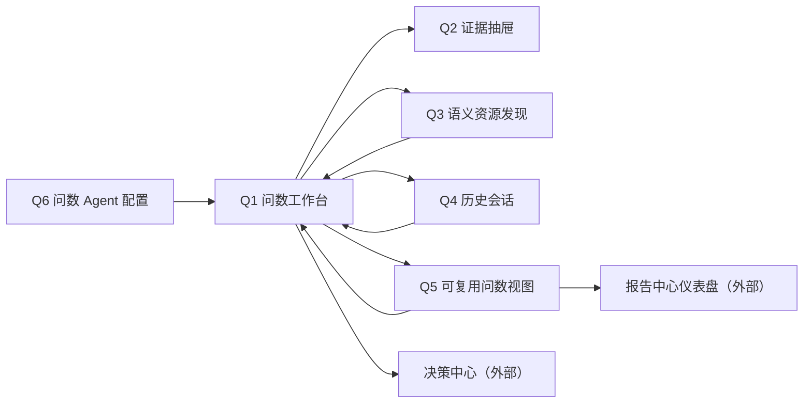

# 新项目功能设计：阶段 3 智能问数

> 版本：v0.1  
> 文档状态：智能问数模块草案已完成，待用户评审；内部自检不等于用户评审通过  
> 更新日期：2026-08-10  
> 当前设计范围：M03 智能问数；当前详细场景为 S001“集团融资成本与债务结构优化”  
> 一期最终范围：S001—S004 均须完整实现；S002—S004 在用户补充业务与数据前只定义扩展机制和诚实占位，不虚构问题集、口径或回答  
> 权威依据：平台总控台账中已生效 D001—D051；总控 Q、推荐方案、数据工程草案和本体草案均不自动构成用户裁决  
> 交付性质：中文功能设计；不包含代码、API、数据库、模型部署、技术架构、HTML 原型或其他模块内部设计  

## 0. 阅读约定与评审结论

### 0.1 标签与权威性

| 标签 | 含义 | 使用规则 |
|---|---|---|
| `[已生效裁决]` | 平台总控台账中状态为“生效”的 D 裁决 | 可作为本设计的确定前提 |
| `[当前设计]` | 本文提出的智能问数功能方案 | 待用户评审，不冒充已生效裁决 |
| `[工作簿核验事实]` | 从《融资一览表_一期演示数据.xlsx》只读核验得到的字段、公式结果或样例 | 仅作当前演示验收基线，不写入 Agent 提示词，不升级为永久业务口径 |
| `[待数据工程确认][QA-DE-nnn]` | 依赖数据版本、刷新、质量、数据截至时间、消费就绪、低延迟准备或失败回退的未对账字段、可用性或运行证据 | 编号在全文复用；第 13.1 节集中对账；已生效 D 策略不重开，运行依赖确认后逐项关闭、修订或转 CR |
| `[跨模块待定][QA-X-nnn]` | 除数据工程依赖外的跨模块所有权、资源合同或流程衔接缺口 | 第 13.2 节集中对账，并在第 13.5 节形成拟提交总控的 CR 建议 |
| `[待用户裁决]` | 总控仍为 Q 状态或本文新增、会显著改变合同的选择 | 第 13.6 节给出推荐、理由、影响和不采纳后果 |

本文引用本体草案中的四类 Object Type、七个 Metric、三条 Rule、三条 Link 和一个 Action Type，只表示当前设计基线。它们仍受本体评审和总控 Q001、Q002、Q004、Q013 约束，智能问数不得创建、修改或在提示词中复制这些资源。

平台总控已通过 D026—D034 正式登记 Q005—Q012、Q014 的裁决，包括数据跟随、失败继续上一可信、时效目标、演示历史保留和 T019 Owner。本文以这些 D 裁决为确定政策；QA-DE 继续用于对账字段可得性、运行证据、质量/截至时间、消费准备和实际验收，不重新打开已经生效的策略裁决。

为避免重复标签影响阅读，全文凡出现下列上游能力，即使表格单元格未逐词重复标签，也统一受相应 QA-DE 对账约束：可消费数据版本及切换受 `[待数据工程确认][QA-DE-001]` 约束；数据截至时间受 `[待数据工程确认][QA-DE-002]` 约束；质量与新鲜度受 `[待数据工程确认][QA-DE-003]` 约束；刷新、上一可信与失败回退受 `[待数据工程确认][QA-DE-004]` 约束；双版本一致性与兼容受 `[待数据工程确认][QA-DE-005]` 约束；低延迟准备和 D032 目标的实测证据分别受 `[待数据工程确认][QA-DE-006]`、`[待数据工程确认][QA-DE-007]` 约束；数据证据定位、空结果区分、历史证据可访问和 S002—S004 数据就绪分别受 `[待数据工程确认][QA-DE-008]`—`[待数据工程确认][QA-DE-011]` 约束。本文对这些内容规定的是智能问数应如何展示、限制和恢复；已生效 D 裁决不再待定，但上游字段和运行证据在实际对账前不视为可用。

### 0.2 一页结论

`[当前设计]` 智能问数是 Published 语义资源的受控消费与解释工作区。用户用自然语言提出业务问题，系统先明确对象范围、层级、时间和口径，再调用获准的 Object、Metric、Rule、关系与 Action Type，最后基于固定语义查询结果组织答案、证据和后续 Action 请求。LLM 只负责理解、澄清、编排和表达，不作为数据源，也不执行正式 Metric/Rule 计算。

一期 S001 必须真实完成以下闭环：

```text
输入问题
→ 识别场景、对象、范围、层级、时间、Metric/Rule/关系意图
→ 必要时澄清并让用户确认关键范围
→ 展示可理解的查询计划
→ 只读取已绑定 Published 语义资源和同一可消费数据版本
→ 返回答案、证据、版本、新鲜度/质量提示和追问
→ 在同一结构化结果上下文中切换文字解读、数据表或受控 BI 图表
→ 用户从单一主体答案发起受控 Action 请求
→ 决策中心承接运行记录、正式人工确认和负责人待办
```

一期不是“把工作簿交给 LLM 总结”，也不是“把整张明细表塞入上下文”。常用指标、Rule 命中和银行归因由 Published 本体资源提供；明细只在用户下钻时沿已发布关系按需读取。

### 0.3 一期成功判据与失败判据

| 成功结果 | 不得记为通过的情形 |
|---|---|
| 同一演示账号从智能问数入口完成 S001 所有问题，无需登录或切换角色 | 依赖另一个账号、权限审批或人工后台改结果 |
| 单家、任意两家和三家综合成本均由正式 Metric 对获准对象集合求值 | 让 LLM 自算、平均单位成本、读取工作簿公式或写死样例答案 |
| 集团、产业板块、单位三级范围可见且不混淆；金融机构归因可下钻到借据 | 只给结论，无对象集合、关系路径、机构贡献或明细证据 |
| 三家单位分别解释三条 Rule 的指标值、阈值、条件、命中分支和版本 | Agent 临时判断阈值，或把本体草案推荐阈值写进提示词 |
| 每次回答显示 Published 语义版本、可消费数据版本、数据截至时间、生成时间和证据引用 | 只显示“最新”、以工作簿生成日期代替数据截至时间、证据无法定位 |
| 数据刷新、质量、陈旧或不兼容状态被诚实呈现，并只在获准边界内回答 | 读取处理中/质量失败候选，或把上一可信结果冒充当前新数据 |
| 从答案发起 Action 请求前明确提示影响；提交后以决策中心返回结果为准 | 智能问数直接确认、创建待办、修改融资事实，或把回答文字当作 Action 成功 |
| LLM 失败后可基于同一已取得证据重新生成，不改变业务事实 | 重试时静默换版本，或在没有语义结果时补写答案 |
| 常用问题、历史会话、可复用问数视图和固定到仪表盘均保留查询定义、版本和证据 | 只保存一段不可刷新、无版本的自然语言回答 |
| 文字、表格和 BI 图表共用同一结构化语义结果、范围、双版本、时点、质量状态和证据 | 切换展示时让 LLM 重算、静默重查、换版本、改筛选或生成无证据图形 |

### 0.4 “问数结果 BI 展示切换”合理性结论

`[当前设计]` 该能力合理，应纳入智能问数一期的“回答展示与可复用问数视图”，但只作为**当前受控问数结果的呈现层**，不新增独立 BI 模块，不建设完整 ChatBI、BI 编辑器或自助分析平台。

| 验证问题 | 结论 | 边界与依据 |
|---|---|---|
| 是否属于智能问数 | 属于。文字解读、数据表和 BI 图表只是同一结构化语义查询结果的三种呈现 | 不新增数据查询、Metric/Rule 求值或业务结果；展示切换不形成新回答版本 |
| 与可复用问数视图的关系 | 视图分别保存查询定义和展示偏好；重跑先执行原查询定义，再验证偏好是否仍适用 | 展示偏好不能改变对象、筛选、分组、排序语义、时间策略或结果值 |
| 与固定到仪表盘的关系 | 智能问数交付视图引用、查询定义、展示建议、当前结果和可信度；报告中心决定卡片、布局、编排和发布 | “固定成功”仍只表示报告中心接收，不表示仪表盘已发布 |
| Owner 是否清楚 | 智能问数拥有回答内即时切换、图表适用性判断、安全回退和视图展示偏好；报告中心拥有正式仪表盘生命周期 | 不在本文设计报告中心内部 BI 编辑流程 |
| 是否与现有待定冲突 | 不产生新的边界冲突；复用并细化 `[跨模块待定][QA-X-005]`、`[跨模块待定][QA-X-009]`、CR-QA-003 和 CR-QA-006 | D035 已确认仪表盘 Owner；Q018 仅剩独立一级入口，Q019 仍待裁决，本文不把推荐升级为总控裁决 |
| 一期能否最小闭环 | 能。使用 Q1/Q5 现有页面完成“真实问数 → 三态切换 → 证据定位 → 保存偏好 → 重跑验证 → 固定交付” | 不增加新一级页面，不要求完整图表编辑能力，也不指定图表技术实现 |

## 1. 产品定位、用户与范围边界

### 1.1 要解决的用户问题

智能问数让财务管理者、融资管理者和演示操作者无需理解源表字段即可回答：

- 某一家、任意两家、三家、某产业板块或集团范围的融资成本和债务结构是什么；
- 一个结果使用了哪些对象、Metric、筛选、关系、时间和版本；
- 某条 Rule 为什么命中或没有命中，哪个条件和证据起决定作用；
- 异常贷款集中在哪些金融机构，哪些机构对问题余额或成本贡献最大；
- 当前结果是否足以发起受控 Action 请求，以及请求提交后去哪里继续处理；
- 数据正在刷新、质量有警告、结果陈旧或资源不兼容时，哪些内容仍可回答、哪些必须拒绝；
- 如何在不改变查询范围、口径、版本和证据的前提下，把同一结果切换为文字、表格或适用的 BI 图表。

### 1.2 一期用户

`[已生效裁决 D003]` 一期使用一个演示账号，不建设身份认证、角色切换或权限治理。本文仍以三类业务任务理解用户需求，但页面不要求切换角色：

| 任务视角 | 主要目标 | 一期典型动作 |
|---|---|---|
| 集团财务管理 | 了解集团、板块和单位对比，发现成本与结构问题 | 提问、调整范围、查看证据、固定视图 |
| 融资管理 | 解释 Rule、定位问题借据与金融机构、提出协商方向 | 追问、下钻、发起 Action 请求 |
| 演示与验收 | 验证真实双版本、错误状态、恢复和跨模块闭环 | 运行固定测试问题、切换场景、核对提交结果 |

后期接入真实用户时再建设权限投影、敏感范围、代表身份、共享范围和审计治理；这些不成为一期 S001 门禁。

### 1.3 本模块拥有、引用与不拥有

| 边界 | 资源或责任 | 智能问数功能责任 | 明确不承担 |
|---|---|---|---|
| 拥有 | 问数 Agent 配置 | 系统提示词、问数 Skill、本体绑定、资源白名单、固定测试问题、配置版本和启用状态；D022 | 不拥有报告/洞察 Agent 配置 |
| 拥有 | 问题、语义解析和查询计划 | 识别意图、范围、层级、时间、筛选、Metric/Rule/关系/Action，必要时澄清 | 不创建或修改本体资源，不设计数据加工 |
| 拥有 | 智能问数回答 | 组织受控语义结果、版本、证据、警告、追问和不可回答说明 | 不把回答当数据源、Metric/Rule 结果或正式决策记录 |
| 拥有 | 即时结果展示与视图展示偏好 | 对同一结构化结果切换文字/表格/受控图表，判断适用性、保持上下文并安全回退 | 不重算、重查或改变口径；不拥有完整 BI 编辑器 |
| 拥有 | 常用问题、历史会话、可复用问数视图 | 保存问题入口、会话上下文和可重跑查询定义 | 不拥有仪表盘布局、正式报告或报告定义 |
| 拥有 | Action 请求发起体验 | 展示入口、提交前提示、发送获准请求、展示接收结果 | 不拥有提醒、正式人工确认、负责人待办及其状态机 |
| 引用 | Published Object/Property/Link/Metric/Rule/Action Type | 发现、解释和只读调用当前获准资源 | 不复制公式、阈值、归因排序、负责人关系或 Action 效果 |
| 引用 | Published 语义版本 | 显示精确版本并作为 Agent 配置绑定依据 | 不发布、修改或静默升级语义版本 |
| 引用 | 可消费数据版本、截至时间、质量和刷新摘要 | 在每次回答与错误状态中展示并据此决定回答边界 | 不读取工作簿、原始快照、候选半成品或自行提交权威指针 |
| 输出 | 可固定问数视图 | 向报告中心交付可重跑定义、当前结果摘要和证据 | 不拥有仪表盘卡片布局、发布或跨卡片编排 |

`[跨模块待定][QA-X-002]` Metric、Rule、Action Type 的唯一 Owner 仍受总控 Q013 约束。本文推荐统一由本体管理拥有、智能问数只引用，但不把推荐写成已裁决事实。

### 1.4 当前设计范围、一期最终范围与后期

| 范围层次 | 本文处理方式 | 完成定义 |
|---|---|---|
| 当前详细设计 S001 | 完整设计问题、配置、页面、状态、证据、受控展示切换、Action 和验收 | 本文第 3—12 章可直接进入功能评审 |
| 一期最终 S002—S004 | 保留稳定场景入口、配置扩展位、资源就绪检查和诚实空态；等待用户资料 | 用户补充资料后必须逐场景补齐真实问题、语义资源、证据、回答与验收，不能用 S001 套壳 |
| 后期 | 多账号权限、跨会话共享、更多业务域、大规模资源治理、复杂分析和生产运营增强 | 不反向扩大当前 S001 评审门，不显示假入口 |

`[跨模块待定][QA-X-008]` S002—S004 的 Agent 配置、语义资源与数据资源引用应进入平台场景清单，但当前资料不足。本文只定义接入机制，不推测预算口径、债务风险模型或贷前调查报告问题集。

### 1.5 一期明确不做

- 不配置数据源、采集、管道、Python 处理、质量规则或数据资产发布。
- 不创建、修改或版本化 Object、Property、Link、Metric、Rule、Action Type。
- 不读取原始工作簿、原始快照或整张明细表作为 LLM 上下文。
- 不让 LLM 计算正式 Metric、判断 Rule、发明阈值或排序金融机构。
- 不设计报告/洞察 Agent、报告定义、报告模板、正式报告或 AI 洞察发布。
- 不建设完整 ChatBI、BI 编辑器、自助分析平台或 Dashboard Builder；不提供散点图、地图、自由拖拽、自由组合字段、自定义公式、图表脚本或主题编辑器。
- 当前 S001 无可靠 Published 时间序列，不提供折线图；后续只有 Metric 明确支持时间序列后才可进入适用性评审。
- 不允许绕过 Published 本体选择源表字段；不把 D3.js、ECharts 或其他图表库写成强制实现要求。
- 不设计决策中心内部提醒、正式人工确认、待办状态机或负责人工作台。
- 不做身份认证、角色权限、敏感数据授权或多租户治理。
- 不用静态答案、预置成功记录、禁用按钮或 HTML 原型冒充真实问数。

## 2. 功能能力地图与工作区

### 2.1 功能能力地图

| 能力域 | 一期最小能力 | 关键输出 |
|---|---|---|
| Agent 配置 | 系统提示词、Skill、本体绑定、白名单、Action 白名单、配置版本和固定测试 | 可启用的问数 Agent 配置版本 |
| 问题输入 | 自然语言、对象选择、时间/范围条件、常用问题和历史追问 | 原始问题与显式约束 |
| 语义理解 | 业务意图、对象、层级、Metric、Rule、关系、Action、时间和筛选识别 | 可编辑的“问题理解”摘要 |
| 歧义澄清 | 对象重名、范围不清、时间不清、口径冲突、关系归因不明 | 最少必要的澄清问题和选项 |
| 查询计划 | 展示范围、步骤、语义资源、分组、筛选、关系路径和版本 | 用户可理解的计划，不展示技术查询语言 |
| 受控查询 | 只对获准 Published 语义资源求值，固定同一回答的证据上下文 | 结构化语义查询结果 |
| 回答与追问 | 直接结论、构成/对比、Rule 解释、机构归因、警告、证据和建议追问 | 带版本和证据的智能问数回答 |
| 结果展示 | 同一结构化结果在文字解读、数据表和少量适用 BI 图表间切换 | 不改变范围、口径、版本和证据的展示状态 |
| 证据与可信度 | 版本证明、数据时点、质量/新鲜度、资源引用、对象/借据下钻 | 证据抽屉与不可回答原因 |
| 复用 | 常用问题、历史会话、查询定义与展示偏好分离的可复用问数视图、固定到仪表盘 | 可重跑而非静态文本的消费资源 |
| 受控行动 | 单主体 Action 入口、提交前提示、提交结果和决策中心跳转 | Action 请求接收结果 |
| 恢复 | 各阶段加载/失败、同证据重生成、计划重试、版本变化提示 | 不重复业务副作用的恢复路径 |

### 2.2 页面/工作区清单

| 编号 | 页面/工作区 | 用户目标 | 一期主动作 |
|---|---|---|---|
| Q1 | 问数工作台 | 输入问题、确认理解、查看计划、切换结果展示、查看答案和追问 | 提问 / 切换文字·表格·图表 / 继续追问 |
| Q2 | 证据抽屉 | 核对版本、Metric/Rule、对象范围、机构和借据证据 | 打开证据或回到回答 |
| Q3 | 语义资源发现 | 查看当前 Agent 可使用的 Object、Metric、Rule、关系和 Action Type | 引用资源发起问题 |
| Q4 | 历史会话 | 找回问题、答案、版本、错误和 Action 请求结果 | 继续会话 / 复用问题 |
| Q5 | 可复用问数视图 | 分开保存查询定义与展示偏好，参数化、重跑和固定查询视图 | 运行 / 调整展示偏好 / 固定到仪表盘 |
| Q6 | 问数 Agent 配置 | 管理系统提示词、Skill、绑定、白名单、配置版本和测试 | 验证并启用配置 |

Q1 是一期默认入口，不创建营销落地页。Q2 作为抽屉从 Q1/Q4/Q5 打开；Q3/Q4/Q5/Q6 是稳定导航入口。S002—S004 进入 Q1 时显示场景就绪检查，不另造虚假问数页面。

### 2.3 页面间上下文



从资源、历史或视图返回 Q1 时保留场景、问题、对象集合、计划、当前展示模式、图形/表格选中项、滚动位置和证据抽屉状态；进入报告中心或决策中心后再返回，也恢复原回答及其精确证据上下文。展示模式和局部选中项只是页面状态，不得改写查询定义或业务结果。

## 3. 问数 Agent 配置设计

### 3.1 配置组成与原则

`[已生效裁决 D022]` 智能问数拥有问数 Agent 配置。一个可启用配置由以下部分组成：

| 配置部分 | 功能含义 | 不得包含 |
|---|---|---|
| 配置身份与版本 | 配置名称、稳定标识、版本、状态、Owner、说明、生效时间、变更摘要 | 数据版本伪装成配置版本 |
| 系统提示词 | 任务边界、事实来源、回答规范、证据要求、失败与禁止行为 | Metric 公式、Rule 阈值、银行排序、负责人关系、样例答案 |
| 问数 Skill 集 | 发现资源、解析范围、调用 Metric/Rule、遍历关系、组织证据、请求 Action 的操作规范 | 数据清洗、脚本、报告生成、正式决策流程 |
| Published 本体绑定 | 精确语义版本、场景、允许的业务域和改绑规则 | 自动跟随未评审语义版本 |
| 资源白名单 | 获准 Object、Property、Metric、Rule、Link、Action Type 及用途 | Draft、未发布资源、原始工作簿、任意外部工具 |
| 数据跟随策略 | 对已绑定语义版本选择可消费数据版本的规则 | “最新文件”“最后上传”或消费者自建指针 |
| 固定测试问题 | S001 正向、反向、歧义、错误、版本和 Action 测试 | 写死答案替代真实运行 |

`[待数据工程确认][QA-DE-001]` 数据跟随策略当前推荐固定 Published 语义版本、跟随与其兼容的当前可消费数据版本；具体版本标识、上一可信版本、切换时间和状态字段待数据工程与权威绑定合同共同确认。

### 3.2 系统提示词功能正文

以下是一期系统提示词必须表达的完整业务约束。配置页按条目展示和版本化，而不是把规则散落在多个页面：

> 你是企业级智能问数 Agent，只回答当前场景和资源白名单内的问题。你的事实来源只能是绑定的 Published 本体资源、受控语义查询结果及其版本/质量/时点元数据。不得把工作簿、原始快照、整表、用户粘贴的数字或模型自身知识当作正式数据。  
> 先识别用户要查询的场景、对象、对象集合、层级、时间、筛选、Metric、Rule、关系或 Action Type。只有歧义会显著改变结果时才提问澄清；否则展示你的范围理解，让用户可修改。  
> 正式数值必须来自获准 Metric 或其受控查询结果；Rule 命中、阈值、条件分支和金融机构归因必须来自获准 Rule 证据。不得自行计算或改写正式口径，不得把多个单位成本做简单平均。  
> 每个回答使用一个一致的证据上下文。回答必须显示 Published 语义版本、可消费数据版本、数据截至时间、生成时间和证据引用；有陈旧、质量、刷新或兼容警告时必须先说明影响。  
> 文字解读、数据表和 BI 图表必须使用同一份已固定结构化语义结果。切换展示不得让模型重新计算、不得静默重新查询或切换版本；图表只映射已有维度、度量、标签和证据，不适用或失败时回退表格并说明原因。  
> 直接回答问题，再给构成、对比或原因；只引用支持当前结论的必要证据。数值显示单位、精度、范围和无法计算原因。未知、无匹配、无权限、资源不存在和数据缺失不得相互混淆。  
> 追问可以继承上一轮对象和筛选，但不得静默继承已经改变含义的范围或把不同数据版本拼接为一个结论。发现版本变化时应明确提示并让用户选择继续当前证据或刷新。  
> 只能请求资源白名单中的 Action Type。请求前展示目标主体、触发 Rule、指标快照、优先协商机构、候选借据、双版本、数据截至时间和警告，并说明“提交只创建 Action 请求，不等于正式人工确认或已生成待办”。  
> 不得代表用户完成决策中心的正式人工确认，不得创建负责人待办，不得修改融资事实，不得声称 Action 成功，除非已收到决策中心的明确接收结果。  
> 当证据不足、资源冲突、质量失败、本体不兼容或查询失败时，停止生成业务结论，说明缺口、影响和恢复动作。LLM 生成失败时，可以基于同一已取得证据重新组织表达，不得补造事实。

系统提示词末尾只引用配置中的 Skill、白名单和场景，不复制其明细内容；这样资源变化由绑定和白名单版本承接，而不是修改自然语言条款。

### 3.3 一期 Skill 集

| Skill | 负责什么 | 输入 | 输出 | 禁止行为 |
|---|---|---|---|---|
| 场景与资源发现 | 判断 S001—S004 场景就绪，发现白名单内资源 | 问题、当前场景、配置版本 | 场景、候选资源、不可用原因 | 搜索 Draft 或未获准业务域 |
| 对象解析与消歧 | 将名称、编码、别名解析为对象或对象集合 | 用户文本、对象目录 | 候选对象、匹配依据、需澄清项 | 猜测重名对象或静默忽略无匹配项 |
| 范围与层级 | 识别集团、板块、单位、机构、借据及关系范围 | 对象、层级词、筛选 | 明确对象集合和层级路径 | 把板块标签当融资主体合并 |
| Metric 问数 | 调用正式 Metric 并保留范围、单位、时点和分子/分母说明引用 | Metric、对象集合、时间/筛选 | Metric 结果与证据 | LLM 自算或复制公式 |
| Rule 解释 | 获取命中/未命中、指标值、阈值、分支和证据 | Rule、主体、当前证据上下文 | 可解释 Rule 结果 | 临时改变阈值或补写原因 |
| 关系导航 | 沿 Published Link 从主体到融资、机构和负责人 | 起点对象、Link、筛选 | 关系路径、端点和明细引用 | 用源表 Join 或推测关系 |
| 机构归因 | 使用 Rule 证据中的问题明细与排序结果说明优先机构 | Rule 结果、主体 | 机构排名、贡献、借据下钻 | 在 Agent 内另建排序算法 |
| 证据组装 | 把对象、Metric、Rule、关系、版本和警告组成回答证据 | 受控查询结果 | 证据清单与引用编号 | 用自然语言替代证据定位 |
| 结果展示适配 | 按结果粒度、维度、度量、类别数和证据完整性推荐允许的文字/表格/图表形态 | 固定结构化结果、语义元数据、展示偏好 | 适用图表清单、推荐类型、禁用/回退原因和证据映射 | 新算序列、改筛选/分组/排序语义、重查或静默换版本 |
| 受控 Action 请求 | 检查条件、预填参数、提示并提交获准 Action | 单一主体答案、Action Type | 请求摘要和接收结果 | 正式确认、创建待办或重复盲发 |
| 失败与重试 | 判断可重生成、可重查、需刷新或不可回答 | 失败阶段、原证据上下文 | 恢复动作和保留内容 | 失败后静默换范围、版本或产生副作用 |

### 3.4 本体绑定与资源白名单

`[跨模块待定][QA-X-001]` 下表是本体草案的当前 S001 资源基线，资源身份、名称、定义和可发现元数据待本体评审。Agent 配置必须绑定稳定资源身份，不以显示名称作为唯一引用。

| 资源类型 | S001 当前白名单基线 | 允许用途 |
|---|---|---|
| Object Type | 融资主体、融资明细、融资机构、融资负责人 | 对象发现、筛选、分组和证据下钻 |
| Property | 单位编码/名称、产业板块；借据编号、境内外、日期、币种、余额、当前利率、利率形式、融资类型、期限种类、担保方式；机构编码/名称/类别；负责人标识/名称 | 回答必要构成、筛选和证据展示 |
| Link | 主体拥有融资、融资由机构提供、主体由负责人承接优化待办 | 多层范围、机构归因、借据和 Action 参数证据 |
| Metric | 融资余额、余额加权平均融资成本、浮动利率余额占比、短期债务余额占比、外币融资余额占比、高成本融资余额占比、信用融资余额占比 | 集团/板块/单位/显式对象集合问数 |
| Rule | R01 融资成本偏高、R02 浮动利率暴露、R03 短期债务集中 | 命中解释、问题明细和机构归因 |
| Action Type | 发起融资优化建议 | 从单一主体回答发起受控请求 |
| 元数据 | Published 语义版本、可消费数据版本、数据截至时间、生成时间、质量/新鲜度/刷新摘要、证据引用 | 每次回答的可信度证明 |

白名单采用“默认拒绝”：资源未列入、未 Published、已不兼容或超出场景时，不因名称相似自动调用。资源发现页可以展示“存在但当前 Agent 未获准使用”的抽象状态，不能泄露未获准内容。

### 3.5 配置生命周期、版本和验证

| 状态 | 含义 | 允许动作 | 不允许动作 |
|---|---|---|---|
| 编辑中 | 配置存在未完成或未保存变化 | 编辑提示词、Skill 引用、绑定、白名单和测试 | 供正式问数使用 |
| 待验证 | 必填完整，尚未跑完固定测试 | 运行全部或单项测试、查看差异 | 启用为当前正式配置 |
| 验证失败 | 至少一项正向、反向、版本或 Action 测试失败 | 修正后生成新候选并重验 | 用人工勾选改为通过 |
| 可启用 | 同一候选版本的必需测试通过 | 查看差异、启用 | 修改内容后沿用旧验证 |
| 已启用 | 新问题默认使用的配置版本 | 只读查看、从此版本派生修改 | 原地改写配置 |
| 已停用 | 不再用于新问题，历史仍引用 | 查看历史、重新派生 | 删除历史证据 |

每个问题轮次记录其配置版本。系统提示词、Skill、白名单或语义绑定任一实质变化都形成新配置版本，并重跑 S001 固定测试；只更新可消费数据版本不生成 Agent 配置版本，但受 `[待数据工程确认][QA-DE-005]` 的一致性和兼容门控制。

固定测试至少包含：单家成本与构成、三种两家组合、三家组合、集团/板块对比、三条 Rule 正向样例、至少一个不命中样例、九家机构归因、对象不存在/重复/零余额、口径冲突、质量/刷新/不兼容、LLM 重生成、同结果三态展示及图表失败回退、展示切换不重查不换版本、三个单位分别提交 Action 且不合并。

## 4. 问题输入、语义解析与查询计划

### 4.1 输入方式

Q1 输入区支持：

- 中文自然语言问题；
- 从对象搜索加入单位、板块、机构或借据范围标签；
- 从常用问题、历史问题、资源详情和问数视图带入问题；
- 通过范围标签显式添加或移除对象、时间、筛选和分组；
- 提交前查看当前场景、配置版本和数据可信度摘要。

一期不提供上传工作簿、粘贴整表、连接外部数据、切换模型或选择任意工具入口。用户粘贴数字时，只能作为待核对文字，不能覆盖正式查询结果。

### 4.2 语义解析结果

每次输入先形成可见的“问题理解”摘要：

| 解析项 | 例子 | 用户可修改方式 |
|---|---|---|
| 场景 | S001 集团融资成本与债务结构优化 | 切换到已就绪场景；未就绪场景显示缺口 |
| 意图 | 查询、比较、解释 Rule、机构归因、发起 Action | 从候选意图中选择 |
| 对象类型 | 融资主体 | 打开资源详情核对定义 |
| 对象集合 | 演示单位553、演示单位465 | 搜索、删除、替换，重复对象自动提示 |
| 层级 | 集团 / 产业板块 / 单位 / 机构 / 借据 | 改为另一个有关系路径的层级 |
| Metric/Rule | 余额加权平均融资成本 / R01 | 查看定义、单位和当前 Published 版本 |
| 时间 | 当前可消费数据截至时间；或用户明确的历史范围 | 修改时间；没有可用历史时拒绝假设 |
| 筛选 | 浮动利率、短期、外币、高成本等 | 添加/删除获准 Property 条件 |
| 分组/排序 | 按产业板块；按 Rule 证据贡献排序 | 选择白名单内维度与已定义排序 |
| 输出 | 数值、构成、对比、证据、可否 Action；文字/表格/BI 图表展示偏好 | 选择回答深度或展示模式；不改变查询语义 |

解析不会直接产生业务结果。用户修改对象、Metric/Rule、关系、时间、筛选、分组或业务排序后，系统重新生成计划并废弃旧计划的执行资格；只切换文字、表格或图表属于展示状态变化，不重建计划、不重新查询，也不形成新运行结果。

### 4.3 范围确认与歧义澄清

只有以下歧义会显著改变结果时才阻断并提问：

| 歧义 | 处理规则 | 示例提示 |
|---|---|---|
| 对象无匹配 | 展示原词、相似获准对象和清除筛选入口 | “未找到‘单位55’。你是指演示单位553还是演示单位561？” |
| 对象多匹配 | 列出业务名称、稳定身份和板块，不替用户猜 | “有 2 个同名候选，请确认单位编码。” |
| 组合对象重复 | 显示重复项，默认不执行；用户确认去重 | “单位553出现两次，组合计算按主体身份去重，是否继续？” |
| “平均成本”口径冲突 | 优先展示 Published Metric 候选及定义，要求选择 | “当前有余额加权平均融资成本；是否使用该正式口径？” |
| “集团/板块”范围不清 | 展示层级树和包含对象数量 | “你要查询集团总览，还是按产业板块逐项对比？” |
| 时间不清且存在历史意图 | 当前版本与历史版本分开，不默认猜日期 | “你说的‘上期’没有明确时间，请选择可用时点。” |
| “哪些银行”缺少问题类型 | 若单一 Rule 已在上下文中则继承；否则让用户选择成本/浮动/短债或全部分别解释 | “请确认按哪类问题贡献排序。” |
| Action 面向多单位 | 不创建组合 Action；要求逐单位选择 | “Action 只能对单一融资主体发起，请选择要提交的单位。” |

以下情况不必打断：用户说“当前”时采用当前回答可使用的可消费数据版本；用户说“这三家”时可继承上一轮明确列出的三家，但问题理解摘要必须再次显示。版本或数据状态变化不属于普通歧义，按第 6.3、10 章处理。

### 4.4 查询计划可解释性

系统在执行前或执行中展示业务可读计划，不展示 SQL、API、表名、字段 Join 或内部推理过程：

1. **范围：** 将查询哪些主体、板块或集团；对象集合如何去重。
2. **指标/规则：** 将使用哪些 Published Metric 或 Rule，以及输出单位。
3. **筛选与分组：** 将应用哪些 Property 条件，按什么层级比较。
4. **关系路径：** 需要时显示“融资主体 → 融资明细 → 融资机构”。
5. **证据：** 将返回 Metric、Rule、对象、关系和借据中的哪些证据类型。
6. **版本上下文：** Published 语义版本；`[待数据工程确认][QA-DE-001]` 当前可消费数据版本；`[待数据工程确认][QA-DE-002]` 数据截至时间。
7. **Action 资格：** 问题是否可能形成单主体、证据完整的 Action 入口。

计划有“待澄清、可执行、执行中、已完成、无法执行”五种状态。执行后回答保留最终计划；用户可以对比“原问题”和“最终解释”，避免系统悄悄改题。

### 4.5 执行阶段与中途变化

| 阶段 | 页面反馈 | 可操作项 |
|---|---|---|
| 正在理解 | 保留问题文本和布局，显示正在识别场景与资源 | 取消 |
| 等待澄清 | 高亮影响结果的歧义和候选 | 选择、修改问题、取消 |
| 正在规划 | 逐步出现范围、资源和关系路径 | 展开定义、取消 |
| 正在查询 | 显示当前业务步骤和已固定版本，不展示预计答案 | 取消；可离开后返回 |
| 正在核验证据 | 核对对象范围、单位、版本和引用完整性 | 查看已完成证据类型 |
| 正在生成回答 | 语义结果已固定，LLM 只组织文字表达；数据表可先保持可用 | 取消文字生成；失败后同证据重试或查看表格/适用图表 |
| 已完成 | 显示回答、展示切换、追问、证据和可用 Action | 切换文字/表格/图表、追问、保存视图、固定、发起 Action |

若执行期间权威版本发生变化，不得把前后结果拼接。`[待数据工程确认][QA-DE-005]` 推荐以一次回答固定一个一致的双版本证据上下文；检测到切换时终止混合结果，提示用户以原上下文完成或用新上下文重跑。

### 4.6 多轮追问

- 可继承上一轮明确的对象集合、层级、时间、筛选、Metric/Rule 和排序；继承项以标签展示并可逐项清除。
- “为什么”“构成呢”“换成另外两家”“这三家分别呢”必须引用上一轮可定位范围，不能只依赖隐式对话记忆。
- 追问新增单位时重新执行对象解析和去重；从三家改两家时重新调用组合 Metric，不从上一答案做文本减法。
- 若上一轮回答失败，追问只能继承已确认的范围，不能继承不存在的结论。
- 若新一轮数据版本不同，先显示版本变化；旧答案保持原版本快照，新答案不改写历史。
- 用户可选择“沿用上一轮证据继续解释”或“刷新到当前可消费版本重算”；两者在回答头部明确区分。

## 5. S001 查询与解释合同

### 5.1 对象、层级与关系范围

S001 的范围解析遵循“集团 → 产业板块 → 融资主体 → 融资明细 → 融资机构”的业务层级，融资负责人只在 Action 证据中通过已发布关系引用。

| 用户范围 | 语义处理 | 回答必须显示 | 禁止行为 |
|---|---|---|---|
| 集团 | 选择当前 S001 获准的全部融资主体 | 主体数、融资余额、Metric 结果、数据时点 | 把“集团”当一条源表汇总行 |
| 产业板块 | 按融资主体的产业板块分组，再对各组事实集合调用 Metric | 板块名称、单位数、余额、成本和结构指标 | 合并不同融资主体或更改单位归属 |
| 单一单位 | 按稳定主体身份取得该单位及其融资并集 | 单位名称/编码、余额、成本和构成 | 仅按显示名称模糊匹配后直接回答 |
| 两家/三家 | 按稳定身份去重后取得所选主体融资明细并集 | 完整单位清单、去重说明、合计余额和组合结果 | 平均单位成本、遗漏无匹配单位 |
| 金融机构 | 沿“融资由机构提供”关系取得获准融资集合 | 机构名称/编码/类别、余额、借据数和范围 | 把同名机构文本当稳定身份 |
| 借据 | 沿主体和机构关系下钻到必要明细 | 借据编号、余额、利率、问题类别和关联对象 | 把 5,218 条明细一次性塞入回答或 LLM |

`[已生效裁决 D007]` 产业板块展示采用总控规定的标准化映射，只改变板块分类标签，不合并主体、不修改单位名称、不改变贷款归属和统计粒度。当前工作簿包含产业服务、产业金融、核技术、核能、核燃料、环保产业、集团及直管公司、境内新能源、境外新能源、数字化 10 个展示值；这是当前演示事实，不把 10 类写入 Agent 提示词。

### 5.2 Metric 发现与引用

用户可以通过 Q3 或问题中的业务词发现 Metric。每个 Metric 引用至少显示：业务名称、稳定资源身份、定义摘要、适用对象范围、单位、时间含义、零分母表现、Published 语义版本、当前问题使用范围和证据引用。

当用户问“融资成本及构成”时，系统不只返回一个百分比：

1. 主结果为“余额加权平均融资成本”；
2. 同时返回融资余额作为权重规模；
3. 默认构成包括获准的浮动利率、短期债务、外币、高成本、信用融资余额占比；
4. 每个构成项独立显示缺失/未知对解释的影响，不把缺失分类算作否；
5. 用户可以追问按机构、板块、币种、利率形式、期限种类或担保方式分解，但分组只使用白名单 Property。

`[跨模块待定][QA-X-001]` Metric 的最终名称、稳定身份、时间语义和零分母合同待本体评审。智能问数只消费已 Published 版本，不能在配置页补写缺失口径。

### 5.3 多单位组合

`[已生效裁决 D006]` 一期必须支持任意两家及三家综合平均融资成本。组合流程固定为：

1. 解析并列出用户选择的 2 或 3 家融资主体；
2. 按稳定身份去重，重复或无匹配项显式提示；
3. 把对象集合交给同一个正式“余额加权平均融资成本”Metric；
4. 返回合计融资余额、组合成本、单位级对照和与集团基准的差异；
5. 证据保留每个主体及所用 Metric，不保存 LLM 自算过程；
6. 组合余额为零时回答“无法计算”，不返回 0%。

当前工作簿验收基线：

| 当前演示组合 | 合计余额 | 余额加权成本 | 仅作验收的错误对照：单位成本简单平均 |
|---|---:|---:|---:|
| 演示单位553 + 465 + 561 | 1,183.15 亿元 | 2.425% | 2.435% |
| 演示单位553 + 465 | 1,163.134 亿元 | 2.428% | 2.539% |
| 演示单位553 + 561 | 413.15 亿元 | 2.849% | 2.555% |
| 演示单位465 + 561 | 790.016 亿元 | 2.197% | 2.212% |

这些数值来自当前固定工作簿，只用于检测“错误简单平均”和范围错误；更换可消费数据版本后必须重新由 Metric 求值。

### 5.4 时间范围

S001 当前演示数据是全量快照，工作簿没有权威业务数据截至字段。`[待数据工程确认][QA-DE-002]` 手工上传或自动同步必须提供可被智能问数引用的数据截至时间、来源说明和必要时区；工作簿生成日期 `2026-08-09` 不能静默替代。

问题中的时间按以下功能规则处理：

- “当前/现在”指当前回答获准使用的可消费数据版本及其数据截至时间，不指生成时间；
- “截至某日”只有在存在覆盖该时点的获准版本时执行，否则说明没有相应数据；
- “上期/去年/趋势”需要至少两个可比较且口径兼容的版本或时间序列 Metric；一期当前工作簿不足时拒绝编造趋势；
- 比较不同时间时，每个结果分别显示语义版本、数据版本和截至时间；不把不同口径结果直接并列为变化；
- 回答生成时间只说明答案何时生成，不代表业务事实时点。

### 5.5 集团、板块与单位对比

集团问题默认返回：融资余额、余额加权平均融资成本、浮动利率余额占比、短期债务余额占比、外币融资余额占比、高成本融资余额占比、信用融资余额占比，以及按产业板块的对比表。

对比表最少包含：板块、融资主体数、融资余额、加权成本、浮动占比、短债占比、外币占比、相对集团成本差、数据完整性提示。查询定义可以按获准 Metric 指定业务排序；结果返回后，展示层排序方向只改变完整已返回集合的阅读顺序。两者都不得改变 Rule 或 Published 机构归因排序，展示层排序也不得改变查询定义中的 Top N 范围。

单位对比使用同一列定义；不可比较项显示“无法计算/数据不完整”，不以空白或 0 替代。用户从板块展开到单位、从单位展开到机构/借据时，范围标签和版本保持可见。

### 5.6 Rule 发现、命中与未命中解释

Rule 回答必须区分“Rule 定义”和“本次评估证据”：

| 解释部分 | 必须显示 |
|---|---|
| Rule 定义 | 名称、稳定资源身份、业务目的、依赖 Metric、阈值/条件、有效版本 |
| 本次对象 | 主体名称与稳定身份、对象范围、数据截至时间 |
| 指标快照 | 实际值、单位、阈值、比较符号、是否可计算 |
| 分支判断 | 哪一个或哪些条件命中；多分支时不只显示总体“是” |
| 结论 | 命中 / 未命中 / 无法判断，并用业务语言解释 |
| 问题证据 | 对应的问题融资范围、机构归因和借据引用 |
| 版本证明 | Published 语义版本、可消费数据版本、生成时间、证据引用 |

`[待用户裁决]` R01/R02/R03 阈值受总控 Q001 约束；短期债务口径受 Q002 约束。本文使用本体草案推荐值进行当前演示验收，但系统提示词和 Skill 不保存这些值，最终回答只读取已 Published Rule。

当前工作簿的三家正向验收样例：

| 主规则 | 主体 | 当前样例证据 | 预期解释 |
|---|---|---|---|
| R01 融资成本偏高 | 演示单位553 | 75 笔、余额 393.134 亿元、加权成本 2.881%、高成本余额占比 77.337%、浮动/短债占比均 0% | 仅命中 R01；说明具体命中分支 |
| R02 浮动利率暴露 | 演示单位465 | 176 笔、余额 770 亿元、加权成本 2.197%、浮动利率余额占比 100%、短债占比约 1.145% | 仅命中 R02 |
| R03 短期债务集中 | 演示单位561 | 50 笔、余额 20.016 亿元、加权成本 2.228%、短期债务余额占比 93.545%、浮动占比 0% | 仅命中 R03 |

### 5.7 金融机构归因

`[已生效裁决 D008]` 发生融资问题后，智能问数应指出优先协商金融机构。归因只能来自 Published Rule 的问题范围与排序证据：

1. 确定单一主体和已命中 Rule；
2. 读取 Rule 给出的“问题融资”集合或可定位证据；
3. 沿“融资由机构提供”关系取得机构归集结果；
4. 展示已发布排序的前三家机构；
5. 对每家显示问题余额、贡献占比、问题融资加权成本、借据数和借据下钻；
6. 机构关系缺失、问题余额为零或 Rule 无法判断时，不给出空洞排名；
7. 回答中的“优先协商”是建议证据，不等于已作出正式决策。

`[待用户裁决]` R01 仅由单位平均成本分支命中时的排序受总控 Q004 约束；Agent 不得自行选择“高成本余额”或“正向增量利息成本”。

当前工作簿机构归因验收基线：

| 主体 / Rule | 优先级 | 机构 | 问题余额 | 贡献占比 | 问题融资加权成本 | 借据数 |
|---|---:|---|---:|---:|---:|---:|
| 单位553 / R01 | 1 | 演示欧陆银行 | 99.586 亿元 | 32.754% | 2.994% | 16 |
| 单位553 / R01 | 2 | 演示寰宇银行 | 65.494 亿元 | 21.541% | 2.900% | 11 |
| 单位553 / R01 | 3 | 演示海联银行 | 58.476 亿元 | 19.233% | 3.004% | 10 |
| 单位465 / R02 | 1 | 演示融通银行 | 249.081 亿元 | 32.348% | 2.154% | 60 |
| 单位465 / R02 | 2 | 演示启明银行 | 237.763 亿元 | 30.878% | 2.200% | 46 |
| 单位465 / R02 | 3 | 演示嘉禾银行 | 221.527 亿元 | 28.770% | 2.243% | 55 |
| 单位561 / R03 | 1 | 演示同州银行 | 5.047 亿元 | 26.955% | 2.241% | 10 |
| 单位561 / R03 | 2 | 演示星河银行 | 4.603 亿元 | 24.583% | 2.226% | 11 |
| 单位561 / R03 | 3 | 演示恒信银行 | 3.662 亿元 | 19.558% | 2.206% | 11 |

### 5.8 不可回答边界

遇到以下任一情况，系统必须停止生成业务结论并说明恢复路径：

- 当前场景没有就绪的 Published 语义资源或配置白名单；
- 问题要求创建/修改 Object、Metric、Rule 或 Action Type；
- 只有工作簿、源字段或用户粘贴数字，没有可追溯的语义结果；
- 对象无匹配、多匹配未澄清、组合范围不完整或分母为零；
- 找不到正式 Metric，或同名 Metric 口径冲突未选择；
- Rule、关系或机构归因证据缺失；
- `[待数据工程确认][QA-DE-002]` 数据截至时间缺失；
- `[待数据工程确认][QA-DE-003]` 质量状态不允许回答或新鲜度无法判断；
- `[待数据工程确认][QA-DE-005]` 语义与数据版本不兼容或一致性无法证明；
- 问题要求预测未来、给出未经定义的最优方案或把建议当正式决策；
- S002—S004 尚缺用户资料和真实语义资源。

不可回答卡必须包含：系统理解的问题、阻断原因、受影响范围、可用的最后证据（如有）、责任模块和下一步。不得只显示“系统异常”。

### 5.9 S002—S004 扩展机制

每个新增场景接入智能问数时复用同一配置框架，但必须独立提供：

1. 场景编号、业务目标、就绪状态和 Owner；
2. Published 语义版本与资源白名单；
3. 真实 Object/Metric/Rule/关系/Action Type 清单；
4. 数据版本、数据截至时间、质量/新鲜度和消费就绪合同；
5. 常用问题、歧义规则、不可回答边界和固定测试；
6. 回答证据和可复用视图合同；
7. 若允许 Action，明确单主体/对象边界与接收模块；
8. 业务可执行验收和当前资料来源。

`[待数据工程确认][QA-DE-011]` S002—S004 的数据资产、时点、质量和就绪合同尚不存在；当前只显示“等待业务与数据资料”，不展示示例数字、伪 Metric 或伪完成状态。

## 6. 回答、证据、版本与可信度

### 6.1 回答结构

每个成功回答按从结论到证据的顺序组织：

1. **直接结论：** 一至三句回答用户问题，包含范围和核心数值。
2. **展示切换：** 在“文字解读 / 数据表 / BI 图表”间切换；新回答默认文字解读，进入 BI 图表后默认“系统推荐”。
3. **关键构成/对比：** 根据问题在当前模式中展示单位、板块、结构、Rule 或机构结果。
4. **原因解释：** Rule 条件、主要贡献和不可忽略的未知项。
5. **证据引用：** 用 `证据 E1、E2…` 连接 Metric、Rule、对象、关系和借据。
6. **可信度条：** Published 语义版本、可消费数据版本、数据截至时间、生成时间、质量/新鲜度/刷新提示；位于切换区域之外，三种模式持续可见。
7. **后续动作：** 建议追问、保存视图、固定到仪表盘；满足条件时显示 Action 请求入口。

答案不使用“据我判断”“大概”等措辞掩盖正式结果来源。若只能提供部分结果，开头先说明缺失范围和影响，再展示允许部分。

### 6.2 证据类型与下钻

| 证据类型 | 内容 | 展示方式 | 下钻边界 |
|---|---|---|---|
| E-Metric | Metric 身份、值、单位、对象范围、时间、计算/取数时点、语义版本 | 数值旁引用 | 打开 Metric 定义和本次范围，不展示实现公式副本 |
| E-Rule | Rule 身份、命中状态、实际值、阈值、分支、问题范围 | Rule 解释卡 | 打开 Rule 证据和问题融资集合 |
| E-Object | 对象类型、稳定身份、标题、所选/排除原因 | 范围标签和对象清单 | 打开 Published 对象详情 |
| E-Link | 关系身份、方向、端点、匹配范围 | 关系路径 | 打开主体—融资—机构或主体—负责人关系证据 |
| E-Detail | 必要借据、余额、利率、问题类别、关联主体和机构 | 折叠明细，默认有限展示 | 分页/继续加载；不把整表交给 LLM |
| E-Version | 语义版本、数据版本、数据截至时间、生成时间、配置版本 | 回答头部与证据抽屉 | 打开相应只读版本证明 |
| E-Quality | 质量、新鲜度、刷新和覆盖摘要 | 警告条与抽屉 | 打开来源模块的只读证据，不在智能问数修复 |

`[待数据工程确认][QA-DE-008]` E-Version/E-Quality 及明细证据需要可从语义结果追到数据资产版本、质量摘要和来源证据的稳定定位；智能问数不要求暴露源表或数据工程内部实现步骤。

证据引用始终指向本次回答固定的证据上下文。历史回答打开时不重新指向新版本；选择“按当前版本重跑”会生成一条新回答并保留前后关联。

### 6.3 版本证明与一致性

`[已生效裁决]` 每次回答必须显示 Published 语义版本、可消费数据版本、数据截至时间和生成时间。功能语义如下：

| 字段 | 回答的业务含义 | 规则 |
|---|---|---|
| Published 语义版本 | Object、Metric、Rule、关系和 Action Type 的定义版本 | 精确显示；语义改绑必须形成新 Agent 配置版本并验证 |
| 可消费数据版本 | 本次答案使用的事实快照版本 | `[待数据工程确认][QA-DE-001]` 不得用“最新文件”替代 |
| 数据截至时间 | 事实反映业务情况截至何时 | `[待数据工程确认][QA-DE-002]` 与上传、发现、生成和回答时间分开 |
| 生成时间 | 此答案何时生成 | 使用用户可理解的时区；不代表事实时点 |
| 问数配置版本 | 哪个系统提示词、Skill、绑定和白名单解释了问题 | 历史回答不可被后续配置覆盖 |
| 证据上下文 | 本轮所有结果是否来自同一双版本组合 | `[待数据工程确认][QA-DE-005]` 无法证明时不得回答 |

`[已生效裁决 D034][已收敛][QA-X-003]` T019 权威消费绑定由本体管理唯一拥有并原子提交，智能问数只读、不维护“当前版本”副本；任何显示不一致时停止回答并登记跨模块异常。

`[跨模块待定][QA-X-006]` 本体草案提出智能问数参与候选双版本验证后才切换绑定，但总控 C008 尚未确认该验证交互。本文只要求配置验证和一致性证明，不把“智能问数确认即可切换”写成已生效流程。

### 6.4 数据新鲜度、质量与刷新提示

`[待数据工程确认][QA-DE-003]` 智能问数不自定义新鲜度阈值或质量等级，推荐消费数据工程提供的业务可读摘要：质量状态、警告/失败项、受影响字段/范围、数据截至时间、最近成功刷新、是否超出业务时效、上一可信版本和恢复建议。

| 上游状态 | 回答策略 | 页面提示 |
|---|---|---|
| 正常且消费就绪 | 正常回答 | 绿色/文字“当前版本可消费”，仍显示完整版本条 |
| 有质量警告但合同允许消费 | 回答允许范围，先说明影响 | 橙色警告、受影响指标/分类和证据 |
| 数据陈旧但合同允许继续 | 使用当前权威可消费版本回答，并显著标记陈旧 | 数据截至时间、超期/陈旧原因和新数据状态 |
| 新版本刷新中 | `[待数据工程确认][QA-DE-004]` 推荐继续上一可信版本，说明新版本处理中 | 当前使用版本、候选版本状态、是否可刷新重跑 |
| 候选质量失败/刷新失败 | `[待数据工程确认][QA-DE-004]` 不读取候选；若合同允许则继续上一可信版本 | 失败阶段、上一可信版本、数据陈旧警告 |
| 当前权威版本质量失败或无法证明 | 不回答业务结论 | 阻断原因、责任模块和恢复入口 |
| 数据与本体不兼容 | 不回答，不自动同名映射 | 不兼容资源、当前可用旧组合和改绑/修复责任 |

质量警告不能只显示一个颜色。用户必须知道：哪些结论仍可靠、哪些分类可能低估、哪些 Action 因证据不足不可发起。

### 6.5 当前工作簿可信度事实

`[工作簿核验事实]` 当前文件有四张工作表：5,218 条、35 字段的融资明细；574 个单位—负责人映射；说明/校验页；场景问数样例页。利率形式缺失 212 条、期限种类缺失 212 条、担保方式缺失 1,868 条。智能问数设计必须把这类缺失表现为“未知/数据不完整”，不能把它们静默解释为固定、非短期或非信用。

`[待数据工程确认][QA-DE-009]` 上游需要区分“真实无匹配/余额为零”和“数据覆盖不足/映射失败/质量检查无法判断”，否则智能问数无法诚实区分业务空结果和数据问题。

### 6.6 受控结果展示切换

#### 6.6.1 同一结果上下文

展示形态是同一问数运行结果的页面状态，不是查询定义、语义资源或新的业务结果。文字、表格和图表共同绑定：结构化语义查询结果、对象范围、筛选、分组、业务排序、Metric/Rule/关系、Published 语义版本、可消费数据版本、数据截至时间、质量/新鲜度状态和证据引用。

- 切换只重新组织已经返回的维度、度量、标签和证据，不调用 LLM 计算、不重新执行语义查询、不跟随新数据版本，也不改变回答生成时间；
- 展示模式、图例开关、展示层排序方向、局部聚焦和证据定位变化不形成新业务回答版本；
- 只有对象/查询范围、参数、语义资源、业务筛选/分组/排序、时间策略或数据版本发生变化时，才执行新查询并形成新运行结果；
- 后台权威版本发生变化时，当前结果仍保持原双版本，只提示用户“按当前版本重跑”，不得在切换中静默更新；
- Action 资格和目标沿用原回答证据，图形选中项不得静默成为 Action 目标。

#### 6.6.2 三级入口与紧凑配置菜单

回答标题与可信度条下方提供稳定的一级分段入口，每项同时使用清晰图标和简短文字：

1. **文字解读：** 显示直接结论、原因、关键构成和证据引用；
2. **数据表：** 显示当前结构化结果的精确业务标签、单位、值、状态和证据入口；
3. **BI 图表：** 打开紧凑二级菜单“系统推荐 / 指标卡 / 柱状图 / 堆叠柱状图 / 环形图”。

“系统推荐”只根据当前结果已有的粒度、维度数量、度量单位、类别数量、构成关系和证据完整性选择允许形态，不新算序列、不重新聚合、不改变排序语义。菜单显示简短推荐依据；不适用项保留位置并置灰，可通过悬停、键盘聚焦或原因图标查看解释，例如“当前结果只有一个数值”“当前类别过多，不适合环形图”“当前没有时间序列”“缺少可比较维度”或“指标单位不一致”。

| 展示形态 | 一期适用条件 | 安全限制与典型回退原因 |
|---|---|---|
| 系统推荐 | 任一可回答的结构化结果 | 从下列获准形态中选择；没有安全图形时推荐数据表，并说明原因 |
| 指标卡 | 单值 Metric，或单一集团/单位的少量总体指标 | 多对象比较、无有效数值或单位混杂时不适用 |
| 横向/纵向柱状图 | 至少一个单位、板块或金融机构等可比较维度，且度量单位一致 | 单值、缺比较维度、单位不一致时置灰；一期不使用双轴强行合并 |
| 堆叠柱状图 | 对比维度下存在同分母、互斥、可穷尽且可加总的构成项 | 构成重叠、分母不同、未知项未覆盖或不能组成整体时置灰 |
| 环形图 | 单一对象、少量非负且互斥完整的“部分—整体”类别 | 多对象、类别过多、构成重叠/不完整时置灰；未知类别必须显式保留 |
| 数据表 | 结构化结果可用时的通用精确表达 | 类别过多、证据复杂、图形不适用或渲染失败时的默认安全回退 |

浮动利率、短期债务、外币、高成本、信用融资等占比可能相互重叠，不得仅因都是百分比就放入同一堆叠柱或环形图。当前 S001 没有可靠 Published 时间序列，折线图不进入菜单；以后只有 Published Metric 明确支持兼容时间序列后才可开放，不能由用户临时选择日期字段生成。

#### 6.6.3 图表阅读、聚焦与证据

- 图表显示业务标题、正式业务名称、单位、图例和可读标签；视觉舍入不替代精确值，悬停或键盘聚焦显示精确值、单位、排名/占比、质量标记和证据入口；
- 点击图形元素只在当前已返回结果内临时聚焦、显隐或定位对应表格行与证据锚点，不改变查询定义、不触发重跑；用户若要把选择变成新筛选，必须显式发起新问题；
- 提供“一键恢复完整范围”。切换模式时保持当前对象和业务筛选、Metric、业务排序和分组、当前选中数据项、双版本、截至时间、质量/新鲜度警告、证据抽屉定位和页面滚动上下文；
- 类别较多时优先推荐数据表。若已有明确业务排序，可显示展示层 Top N，但必须写明“当前图表展示前 N 项 / 共 M 项，未完整展示”，提供完整表格入口；Top N 不改变底层结果或证据，不自行把余项合成“其他”，并明确区分“查询定义本身只返回 Top 3”和“完整结果仅在图形中展示前 N 项”；
- Rule 命中、风险、质量和新鲜度不能只靠颜色表达，必须同时提供文字状态、图标或形状；三条 Rule 一期优先使用带“命中 / 未命中 / 无法判断”标签的表格或摘要卡；
- 切换只更新结果主体，不让整条回答重新加载或闪烁。图表区域保持稳定高度，可使用不妨碍立即阅读的轻量过渡，并尊重减少动画偏好；
- 功能合同不指定 D3.js、ECharts 或其他具体图表技术。

#### 6.6.4 默认、回退与版本规则

新回答默认显示文字解读；进入 BI 图表默认选择“系统推荐”。从可复用问数视图运行时可以恢复保存的展示偏好，但必须先重新判断适用性。原偏好不适用时依次回退“系统推荐”或数据表，显示回退原因，且不静默覆盖用户保存的偏好。

图表加载和渲染是展示状态，不影响已经可用的文字或数据表。图表失败时只重试呈现或回退同一结果的数据表，不重新查询、不重新生成文字、不切换版本，也不把整个问数轮次标为查询失败。无数据、零分母、当前权威质量失败或本体不兼容时显示对应阻断/空态，不画误导性空图或 0 值图；允许消费的质量警告、数据陈旧和刷新中提示在三种模式持续可见。

## 7. 常用问题、历史会话与可复用问数视图

### 7.1 常用问题

常用问题是可运行入口，不是 Question Template 业务资源，也不保存答案。S001 一期至少提供：

- 集团融资成本和债务结构如何；
- 按产业板块比较融资成本和债务结构；
- 查询某单位平均融资成本及构成；
- 选择任意两家单位计算综合平均融资成本；
- 查询单位553、465、561三家综合平均融资成本；
- 分别解释单位553、465、561为何命中 R01/R02/R03；
- 查询某问题单位优先协商的金融机构及证据；
- 从单一主体回答发起“融资优化建议”请求。

每个常用问题显示用途、必填参数、引用资源和最近一次测试状态；打开后先让用户补齐单位等参数，再按当前配置和可消费版本运行，不能展示预生成答案。

### 7.2 历史会话

历史会话保存智能问数侧的业务证据，不保存或复制上游整表：

| 历史内容 | 必须保留 |
|---|---|
| 会话 | 标题、场景、创建/最后活动时间、当前上下文摘要 |
| 问题轮次 | 原问题、澄清、最终问题理解、查询计划、状态 |
| 回答 | 展示中立的结构化语义结果、文字解读、表格/构成、警告、证据引用和生成时间 |
| 展示状态 | 最后使用的文字/表格/图表模式、图表类型和回退原因；恢复显示但不形成新业务结果 |
| 版本 | 配置版本、Published 语义版本、可消费数据版本、数据截至时间 |
| 复用 | 继续追问、按原证据解释、按当前版本重跑、保存为视图 |
| Action | 是否展示入口、提交摘要、接收结果和外部记录链接；不复制决策中心状态机 |
| 失败 | 失败阶段、已保留证据、重试关系和最终结果 |

`[待数据工程确认][QA-DE-010]` 历史回答的证据引用和双版本证明需要在一期保留期内仍可访问；如果上游历史版本或质量证据不可读取，历史回答继续显示原文本，但必须标记“原证据当前不可重新打开”，不能改链到新版本。

### 7.3 可复用问数视图

可复用问数视图保存“如何重跑问题”和“结果优先如何呈现”，不是固化一段 LLM 文本。查询定义与展示偏好分开管理：

| 内容层 | 保存内容 | 变更影响 |
|---|---|---|
| 查询定义 | Object/Metric/Rule/Link 稳定引用、对象范围规则、参数位、筛选、分组、业务排序、时间策略、问数配置版本和 Published 语义版本策略 | 决定查什么及如何按正式语义求值；变更后必须形成新运行结果 |
| 展示偏好 | 首选文字/表格/图表、系统推荐或显式图表类型、展示层排序方向、图例状态、展示层 Top N 偏好 | 只决定同一结果如何呈现；不得改变查询口径、结果集合、双版本或证据 |
| 运行证明 | 最近成功结果、双版本、数据截至时间、生成时间、质量/新鲜度警告、证据引用、最近运行状态、失败原因和上一成功结果 | 证明某次运行实际使用的结果上下文，不被偏好修订覆盖 |

视图还保存稳定标识、名称、说明、Owner、视图版本、场景、来源问题/会话和变更说明，以及 `[待数据工程确认][QA-DE-001]` 数据版本跟随规则。保存展示偏好可形成新的视图配置修订，但不触发查询、不改变现有业务回答版本。悬停项、临时图内聚焦、证据抽屉开合和页面滚动属于运行时状态，不长期保存。

用户从回答选择“保存为视图”时，先看到将被参数化的对象和固定条件。例如可把“单位553成本及构成”保存为“单位融资成本概览”，把单位设为运行时必填参数；不默认把演示单位553永久写死。

用户换参数重新运行时，系统基于新结果重新检查保存图表是否适用；不适用时依次回退到系统推荐或数据表并说明原因，原偏好不被静默改写。Published 语义资源变化后，视图仍进入“需修订”，不得因图表配置而按同名资源自动映射。

### 7.4 固定到仪表盘的输出合同

`[已生效裁决 D035]` 仪表盘定义、版本和发布归报告中心；Q018 仅剩是否设置平台独立一级“仪表盘”入口，不影响本功能边界。`[跨模块待定][QA-X-005]` C018 的问数视图内部合同由本文细化，报告中心后续业务取数与刷新路径仍受 Q019 约束。智能问数只交付以下内容，报告中心拥有卡片、布局、编排、发布和正式展示生命周期：

| 输出项 | 智能问数提供 | 报告中心不得推导 |
|---|---|---|
| 视图身份 | 视图标识、版本、名称、说明、场景、Owner | 用卡片标题代替稳定身份 |
| 查询定义 | 语义资源引用、范围/参数、筛选、分组、排序、时间策略 | 从 LLM 文本反向猜查询 |
| 展示建议 | 查询定义之外的首选模式、推荐/显式图表类型、适用性、展示层排序/图例状态和安全回退；只作非语义建议 | 把偏好当查询条件、改写 Metric/Rule 口径或承诺像素级复刻 |
| 当前结果 | 结果摘要、单位、双版本、数据截至时间、生成时间 | 从数据工程明细重算业务指标 |
| 可信度 | 证据引用、质量/新鲜度/刷新状态、最近成功结果 | 隐藏警告或把失败显示为 0 |
| 刷新 | 手动/随数据就绪重跑的业务策略、运行状态和失败后的上一成功结果 | 自建与权威绑定冲突的刷新指针 |
| 导航 | 打开原问数视图、回答和证据的深链 | 复制一份不可追溯回答 |

固定操作成功只表示报告中心接收了视图引用，不表示仪表盘已经发布，也不要求报告中心与问数工作台像素级一致。报告中心的布局适配不得改变查询口径、结果值、双版本、数据截至时间、质量状态或证据引用。固定失败保留原视图；重复固定时显示现有目标并让用户选择打开或另建，不静默创建多个卡片。

### 7.5 视图与历史状态

| 状态 | 表现 | 可执行动作 |
|---|---|---|
| 首次为空 | 说明可从回答保存视图 | 返回问数工作台 |
| 无匹配 | 保留搜索和筛选条件 | 清除筛选 |
| 可运行 | 显示参数、当前配置和最近成功证据 | 运行、编辑名称/参数、固定 |
| 参数缺失 | 列出必填对象或范围 | 补齐后运行 |
| 展示偏好不适用 | 保留原偏好，显示本次不适用原因和当前安全回退 | 使用系统推荐/表格；确认后再更新默认偏好 |
| 图表渲染失败 | 同一结果的数据表、版本和证据保持可用 | 重试图表呈现或继续查看表格，不重跑查询 |
| 语义资源已变化 | 显示旧/新资源和影响 | 修订视图并重新验证；不自动改绑 |
| 数据刷新中 | `[待数据工程确认][QA-DE-004]` 展示上一成功结果和新版本状态 | 等待、手动检查、按原证据查看 |
| 运行失败 | 保留最近成功结果及其版本，标记不是最新运行 | 重试或打开失败详情 |
| 已固定 | 显示目标仪表盘和接收结果 | 打开报告中心；不在本模块改布局 |

## 8. Action 请求发起合同

### 8.1 入口与资格

`[已生效裁决 D010]` 融资优化提醒出现在决策中心，人工确认后形成负责人待办。智能问数只在以下条件同时满足时显示“发起融资优化建议”入口：

- 当前回答针对单一融资主体；多主体回答先让用户选择一个单位；
- Action Type 在当前 Published 语义版本和配置白名单中；
- 至少一条 Rule 有可追溯命中证据；
- 指标快照、优先协商机构和必要借据证据完整；
- 双版本、数据截至时间和生成时间完整；
- 不存在阻断性质量、不兼容或版本一致性问题；
- 当前问题不是历史文本重放；若基于历史证据发起，必须明确仍使用原双版本且合同允许。

同一回答对多个主体分别展示入口，提交时仍一次只处理一个主体。单位465和561即使负责人相同，也不得合并为一个请求。

### 8.2 提交前提示

智能问数的“确认提交”只是确认发送 Action 请求，不是决策中心的正式人工确认。确认面板必须显示：

| 信息组 | 内容 |
|---|---|
| 业务意图 | Action Type 名称和说明；明确“不直接修改融资事实” |
| 目标 | 融资主体名称、稳定身份和板块 |
| 触发原因 | Rule、实际指标、阈值、命中分支和建议方向 |
| 协商证据 | 优先机构、问题余额/贡献、借据数和候选借据引用 |
| 版本 | Published 语义版本、可消费数据版本、数据截至时间、回答生成时间 |
| 警告 | 数据陈旧、质量警告、证据缺口及其对请求的影响 |
| 后续 | “提交后由决策中心创建/接收运行记录；正式人工确认和待办由决策中心承接” |

用户可以取消、返回证据或提交；不能在此修改 Rule 阈值、机构排名或负责人。如果建议方向是允许的 Action 参数，可由用户从 Action Type 定义的选项中选择，不能输入改变 Action 业务意图的自由指令。

### 8.3 请求内容

提交内容至少包含：请求方场景和回答引用、目标主体、Action Type 稳定身份与语义版本、命中 Rule、指标快照、优先协商机构、候选借据证据、建议方向、可消费数据版本、数据截至时间、请求时间、配置版本和幂等业务键所需的可见摘要。

`[已生效裁决 D036—D038][已收敛][QA-X-004]` 决策中心拥有 Action 请求、提醒、正式人工确认和负责人待办的运行记录；智能问数只通过标准 Action Request 发起并保留提交摘要和接收结果，不设计其内部状态机。

### 8.4 提交结果与恢复

| 结果 | 智能问数显示 | 后续动作 |
|---|---|---|
| 已接收 | 请求标识、接收时间、目标主体、双版本、外部状态摘要 | 打开决策中心；回答显示“请求已接收”，不显示已确认/已创建待办 |
| 重复请求 | 现有请求标识、目标主体和可披露状态 | 打开现有记录；不再次创建 |
| 被拒绝 | 业务可读原因、失败位置和是否可修正 | 返回证据或按外部建议处理 |
| 结果未知/超时 | 明确“提交结果未知”，保留原请求摘要 | 先查询原请求结果；未确认不存在前不盲目重发 |
| Action 不再可用 | 资源版本变化或资格不满足原因 | 刷新答案或改绑配置并重验 |

`[跨模块待定][QA-X-007]` 总控 C011 规定了运行记录边界，但尚缺智能问数提交后的最小接收/重复/拒绝/未知结果合同。第 13.5 节提出 CR-QA-004，不以本文状态表替代决策中心评审。

Action 是否成功以外部返回的请求标识和结果为准；回答中出现“建议协商”不代表请求已提交，出现“请求已接收”也不代表正式人工确认或待办已形成。

## 9. 页面与工作区功能合同

### 9.1 Q1 问数工作台

| 区域 | 必须显示 | 核心交互 | 状态要求 |
|---|---|---|---|
| 顶部上下文条 | 场景、已启用配置版本、Published 语义版本、可消费数据版本、数据截至时间、质量/刷新提示 | 切换场景、打开版本证明 | 版本或时点缺失时不隐藏，显示阻断原因 |
| 会话区 | 当前会话问题与回答、原问题和最终理解差异 | 追问、回看、复制业务文本 | 历史回答不被新版本改写 |
| 输入区 | 问题文本、对象/范围/时间/筛选标签、常用问题入口 | 提交、修改标签、取消 | 未就绪场景不接受会产生伪答案的问题 |
| 问题理解 | 场景、意图、对象、层级、Metric/Rule、关系、时间和输出 | 修改、确认澄清 | 只对高影响歧义阻断 |
| 查询计划 | 业务步骤、资源、关系路径、筛选、版本和证据类型 | 展开资源定义、取消 | 不展示技术查询语言或模型思维链 |
| 回答区 | 结论、构成/对比、原因、警告、版本条、证据和追问 | 展开证据、保存视图、固定、Action | Action 与普通追问分开，避免误触 |
| 展示切换区 | “文字解读 / 数据表 / BI 图表”一级入口；图表二级紧凑菜单、推荐依据、禁用原因和回退提示 | 切换模式、聚焦数据项、定位表格/证据、恢复完整范围 | 只改变当前结果的展示状态；稳定高度，不重查、不换版本、不让整条回答闪烁 |

工作台打开时先加载配置和版本上下文，再允许执行。`[已生效裁决 D032][待数据工程确认][QA-DE-007]` 常用问数检索目标为 3 秒内、两家/三家组合检索目标为 5 秒内；页面显示实际分段耗时和是否超出目标，不显示无依据的预计完成时间。

### 9.2 Q2 证据抽屉

证据抽屉按“结论证据、对象范围、版本证明、质量/新鲜度”四组组织。打开某个数值时直接定位相应 E-Metric；打开 Rule 原因时定位 E-Rule；打开机构排名时定位 E-Link/E-Detail。

必须支持：证据编号搜索、按类型筛选、展开有限借据、打开 Published 资源详情、查看版本/截至时间、返回回答原位置。不得允许在抽屉编辑 Metric/Rule、修改关系、重算源字段或打开原始工作簿。

空证据不显示空白抽屉，而是阻断答案并说明缺失类型。部分证据加载失败时，已加载证据保持可见并标为不完整；依赖失败证据的结论不得继续显示为确定结论。

### 9.3 Q3 语义资源发现

资源发现页只显示当前场景、当前配置和绑定 Published 语义版本允许使用的资源。支持按业务名称、定义、类型和用途搜索；按 Object、Metric、Rule、关系、Action Type 筛选。

每个资源显示：业务名称、类型、定义摘要、适用对象、单位/输出、依赖、Published 语义版本、是否在白名单、可用于哪些问题。主动作是“用此资源提问”，带入 Q1 并保留资源引用；不提供创建、编辑、发布或改白名单入口。

`[跨模块待定][QA-X-001]` 若本体管理无法提供稳定身份、定义摘要、适用范围、单位/输出、依赖和有效状态，资源发现页无法只靠名称安全工作；拟由 CR-QA-001 补齐跨模块可发现元数据。

### 9.4 Q4 历史会话

历史页左侧为可搜索/筛选的会话列表，主区显示问题轮次、版本和状态。支持按场景、时间、成功/失败、是否含 Action、语义版本和数据版本筛选。

主动作随上下文变化：成功回答可“继续会话”，旧版本回答可“按当前版本重跑”，失败回答可“从失败点重试”。重跑创建新轮次并链接来源，不覆盖原答案。删除、保留期和跨用户共享后期再设计；一期不提供删除入口，是否能完整打开上游历史证据受 `[待数据工程确认][QA-DE-010]` 约束。

### 9.5 Q5 可复用问数视图

视图页提供目录、详情和运行区：

- 目录显示名称、场景、参数、语义资源、最近结果、双版本、数据截至时间、运行状态、质量/新鲜度和是否已固定；
- 详情分区显示可编辑名称/说明、查询定义、展示偏好、来源问题、视图版本和运行历史；查询定义与展示偏好差异分别标识；
- 运行区要求补齐参数，展示问题理解和计划后再执行；
- 运行完成后在同一结果内重现已保存偏好；若不适用，显示回退原因且不静默覆盖偏好；
- 固定到仪表盘前展示将交付的查询定义、展示建议、当前结果、双版本、数据截至时间、质量状态和证据；
- 语义资源变化后视图进入“需修订”，不得自动映射同名资源。

### 9.6 Q6 问数 Agent 配置

配置页按“基本信息、系统提示词、Skill、本体绑定、资源白名单、Action 白名单、固定测试、版本差异”分区。当前启用版本只读；修改从其派生新候选。

| 分区 | 主检查 | 阻断条件 |
|---|---|---|
| 基本信息 | 名称、场景、Owner、说明和变更理由 | 场景或 Owner 缺失 |
| 系统提示词 | 第 3.2 节边界条款完整且无公式/阈值/答案 | 包含业务口径副本或越权指令 |
| Skill | 必需 Skill 版本齐全、职责不重叠 | 缺对象/Metric/Rule/证据/展示适配/失败 Skill |
| 本体绑定 | 精确 Published 语义版本、兼容状态和改绑说明 | Draft、未发布、不兼容或无法证明 |
| 白名单 | 稳定资源身份、类型、用途和依赖可核对 | 名称匹配但身份不明、资源失效 |
| Action | 仅获准 Action Type，前置证据和提示完整 | 允许直接确认/创建待办/修改事实 |
| 固定测试 | S001 正反、错误、版本、重试和 Action 测试全部有结果 | 缺测试、静态答案、版本不一致 |

启用前显示与当前版本的业务差异和受影响问题；验证结果绑定候选配置版本，内容变化后相关测试失效。启用失败时当前已启用配置保持不变。

## 10. 全局状态、异常与恢复

### 10.1 状态轴

页面同时表达五条状态轴，不用一个“成功/失败”覆盖全部事实：

1. 问题轮次：理解、澄清、规划、查询、核证、生成、完成、失败、取消；
2. 语义可用性：Published 可用、资源缺失、口径冲突、不兼容；
3. 数据可信度：就绪、有警告、陈旧、刷新中、质量失败、无法判断；
4. Action 提交：未发起、待用户提交、已接收、重复、被拒绝、结果未知。
5. 结果展示：可用、渲染中、不适用、已呈现、渲染失败、已回退。

例如一个回答可以是“问数完成 + 数据陈旧警告 + 图表已回退表格 + 未发起 Action”，不能只显示绿色“完成”。

### 10.2 必备状态与恢复合同

| 状态 | 用户看到什么 | 回答/副作用规则 | 恢复动作 |
|---|---|---|---|
| 加载中 | 正在加载配置、版本、计划、证据或回答的具体对象；布局保持稳定 | 不显示旧内容为当前，不创建 Action | 等待、取消；超时转相应失败 |
| 图表渲染中 | 稳定图表区域内显示正在呈现；文字、表格、版本和证据仍可查看 | 只处理展示，不重新查询或阻断其他模式 | 切换文字/表格、取消呈现或等待 |
| 图表不适用 | 目标图表置灰并显示具体原因 | 不强画、不改选 Metric、不改变结果 | 使用系统推荐或数据表 |
| 图表渲染失败 | 失败原因和“已安全回退数据表” | 保留同一结构化结果、选中项、双版本、时点、警告和证据；不把问数标为查询失败 | 重试图表呈现或继续使用表格 |
| 首次为空 | 当前场景、可用常用问题和输入入口 | 不展示虚假示例结果 | 输入问题或运行常用问题 |
| 筛选无结果 | 当前搜索/筛选条件和清除入口 | 不暗示受限或不存在资源 | 清除筛选、改用业务名称 |
| 无匹配对象 | 原词、相似候选、范围影响 | 不静默忽略；不执行组合 Metric | 选择候选或修改对象 |
| 口径冲突 | 候选 Metric/Rule 的名称、定义、单位和版本 | 未选择前不回答 | 选择正式资源；若本体冲突则移交本体管理 |
| 数据陈旧 | `[待数据工程确认][QA-DE-003]` 当前截至时间、陈旧原因、允许用途和候选状态 | 仅在合同允许时用当前可消费版本回答；警告在三种模式持续可见，Action 可因风险被禁用 | 查看证据、等待刷新、按当前版本重跑 |
| 刷新中 | `[已生效裁决 D031][待数据工程确认][QA-DE-004]` 当前服务版本、候选版本状态和开始时间 | 不混用候选；继续上一可信版本并在三种模式警告 | 等待、离开后返回、刷新完成后重跑 |
| 质量失败 | `[待数据工程确认][QA-DE-003]` 失败项、受影响范围、上一可信证据 | 不读取失败候选；当前权威版本失败则停止回答且不绘图 | 打开只读质量证据，等待上游修复 |
| 本体不兼容 | 不兼容的资源/字段/粒度、当前配置和版本 | 不按同名自动映射，不生成答案、图表或 Action | 数据工程修正资产或本体发布兼容版本后重验配置 |
| 无数据/真实空结果 | 对象存在、查询范围和“0 条/余额为零”证据 | 与质量/覆盖不足分开；无数据不画空坐标，比率零分母显示无法计算而非 0 值图 | 修改范围；若怀疑覆盖问题打开质量证据 |
| 证据不完整 | 已取得与缺失的证据类型、受影响结论 | 删除无法支持的结论；阻断 Action | 重查缺失证据或移交资源 Owner |
| 语义查询失败 | 失败步骤、固定范围/版本、是否取得部分证据 | 不让 LLM补算；不生成业务结论 | 以同计划重试；范围/版本变化则新建轮次 |
| LLM 失败 | “数据查询已完成，文字解读生成失败”、已固定证据和版本 | 不丢失语义结果；数据表和适用图表仍可查看，不产生不完整 Action | 基于同一证据重新生成文字；也可直接查看表格、图表和证据 |
| 版本中途变化 | 原/新双版本、切换发生时点和混用风险 | 废弃混合结果，不改写历史 | 用原证据完成解释或以新版本重跑 |
| Action 结果未知 | 原请求摘要、提交时间和“不得盲目重发”提示 | 不显示已接收/已确认/已办 | 查询原请求结果；确认不存在后再按规则重试 |

`[待数据工程确认][QA-DE-009]` “真实空结果、数据覆盖不足、质量失败、映射失败”需要上游返回可区分证据。无法区分时按“无法判断”处理，而不是选择最乐观状态。

展示切换本身不增加运行结果版本。查询范围、参数、语义资源、业务筛选/分组/排序、时间策略或数据版本发生变化时才形成新运行结果；展示模式、图例、展示层排序、局部聚焦、证据抽屉和滚动位置变化只更新页面状态。

### 10.3 LLM 失败与重试恢复

回答链路把“语义结果取得”和“语言生成”分开：

- 若语义结果完整而 LLM 失败，保留问题理解、计划、结构化结果、证据和双版本；用户可查看这些内容或选择“重新生成回答”；
- 重新生成只能使用原证据上下文和原配置版本，不重新查询、不更换版本、不创建新业务结果；
- 若用户修改问题、范围或选择新版本，则创建新轮次并重新查询；
- 连续生成失败时提供结构化结果和证据，不循环自动重试，也不降级为无证据文本；
- Action 入口在完整回答与提交前提示恢复前保持不可用，避免用户基于残缺解释提交。

### 10.4 低延迟准备与时效

`[待数据工程确认][QA-DE-006]` 当前低延迟准备边界为：数据工程提供稳定、完整、可追溯的消费事实；本体侧为集团/单一主体常用 Metric、R01—R03 和机构归因提供消费就绪结果，并为任意 2—3 家组合提供可即时汇总的受控基础量。智能问数不建立自己的指标缓存或数据副本。

`[已生效裁决 D032][待数据工程确认][QA-DE-007]` 5,218 条演示规模下，常用问数检索目标为 3 秒内，任意两家或三家组合检索目标为 5 秒内。测量从用户提交一个已无歧义的问题开始，到结构化语义结果及版本上下文可用结束；另行记录解析、查询、文字生成、图表呈现和总耗时。澄清等待、用户思考和证据明细后续展开不计入检索目标；图表呈现失败不得改写检索是否达标。

## 11. 关键端到端旅程

### 11.1 旅程一：单家单位成本及构成

1. 用户输入“演示单位553平均融资成本及构成是什么”。
2. 系统解析 S001、单一融资主体、余额加权平均融资成本及六项结构 Metric，展示范围和计划。
3. 系统固定版本上下文，调用 Metric，核对对象、单位和证据。
4. 回答显示单位553、融资余额、2.881% 当前样例成本、结构构成、双版本、数据截至时间、生成时间和证据。
5. 用户在文字、数据表和指标卡间切换；选择一个互斥完整的少量构成维度时可切环形图，值、范围、版本和证据保持不变。
6. 用户追问“为什么成本偏高”，系统在同一范围读取 R01 证据，不从文本或图形答案推导。
7. 若数据截至时间缺失，按 `[待数据工程确认][QA-DE-002]` 阻断正式回答并说明缺口。

### 11.2 旅程二：对象歧义与范围修正

1. 用户输入“查单位55和单位465综合成本”。
2. 系统发现“单位55”无唯一对象，列出获准相似候选及稳定身份。
3. 用户选择演示单位553；问题理解显示两家单位并去重。
4. 计划显示将调用组合 Metric，而非平均两家已有结果。
5. 用户可以在执行前把单位553替换为561；旧计划失效并重建。
6. 回答保留原输入、澄清和最终范围，便于历史复核。

### 11.3 旅程三：任意两家与三家组合

1. 用户通过对象搜索选三家单位，询问综合成本。
2. 系统按稳定身份去重，显示 3 家清单、合计余额和 Metric。
3. 回答三家组合结果，并列出每家余额/成本作对照；强调组合结果来自正式 Metric。
4. 用户切到柱状图比较两家/三家同口径单位成本；组合综合成本仍以指标卡/表格保留，个体柱不替代组合 Metric。点击柱体只定位对应表格行和证据，不改变三家查询集合。
5. 用户追问“去掉单位561”，系统才形成两家新对象集合并重新求值，产生新的运行结果。
6. 当前工作簿四组组合均与第 5.3 节一致；任一结果若等于错误简单平均而不符合正式 Metric 证据，验收失败。

### 11.4 旅程四：集团、板块、Rule 与金融机构

1. 用户问“集团融资成本、债务结构和产业板块对比”。
2. 系统返回集团指标和 10 个当前展示板块的单位数、余额、成本、结构对比；板块只分组，不合并主体。
3. 用户用柱状图比较板块；只有某个融资结构维度满足互斥、完整、同分母条件时才可切堆叠柱，重叠占比保持置灰。
4. 用户选择单位465，追问“为什么有风险”。
5. 系统读取 R02，以带文字状态的表格/摘要卡显示实际值 100%、Published 阈值、仅命中 R02 的证据和双版本。
6. 用户追问“优先找哪些银行”，系统沿问题融资与机构关系显示前三家、贡献、成本、借据数和明细引用；排序柱状图点击机构可定位相应证据。
7. 若机构关系缺失或 Rule 无法判断，停止排序并说明无法归因，不绘制伪排名图。

### 11.5 旅程五：从回答发起 Action 请求

1. 用户从单位465的单主体 Rule 回答选择“发起融资优化建议”。
2. 系统检查 Action 白名单、Rule、指标、机构、借据、双版本和质量警告。
3. 提交前面板明确“本次只发送请求；正式人工确认和待办在决策中心”。
4. 用户提交；智能问数显示请求接收结果。未知结果先查原请求，不能盲目重发。
5. 单位561必须另行提交；即使两者负责人同为融资负责人009，也保留两份单位级请求。
6. 用户打开决策中心继续操作；本文不规定其内部确认或待办状态流转。

### 11.6 旅程六：刷新失败、上一可信与恢复

1. 用户在新数据刷新期间提出同一问题。
2. `[待数据工程确认][QA-DE-004]` 系统显示候选刷新中，继续使用上一可信可消费版本并标记数据截至时间和陈旧风险。
3. 候选质量失败或本体不兼容时，不切换、不读取候选；回答继续引用旧版本或在当前合同不允许时停止。
4. 刷新成功后，历史答案保持旧版本；用户选择“按当前版本重跑”生成新答案。
5. 前后答案分别显示版本、时点和差异，不把新结果覆盖旧证据。

### 11.7 旅程七：保存视图并固定到仪表盘

1. 用户从“按板块比较融资成本与结构”回答选择“保存为视图”。
2. 系统分开展示将保存的查询定义，以及当前“BI 图表—系统推荐/柱状图”等展示偏好、语义版本策略和数据跟随策略。
3. 用户命名并保存；系统形成视图版本，可按当前参数重跑。换参数后若原图不适用，系统回退并解释，不静默改写偏好。
4. 用户选择“固定到仪表盘”，确认查询定义、展示建议、当前结果、双版本、截至时间、质量警告和证据引用。
5. 报告中心返回接收结果；智能问数显示目标入口，不宣称仪表盘已发布，也不管理卡片或布局。

### 11.8 旅程八：受控展示切换与安全回退

1. 用户在一个已完成回答中依次选择文字解读、数据表和 BI 图表；系统保持原运行结果、对象范围、筛选、双版本、截至时间、警告和证据。
2. 进入 BI 图表时默认“系统推荐”，菜单只开放适用图表；单值、类别过多、无比较维度、构成重叠和无时间序列分别显示明确禁用原因。
3. 用户点击图形元素，系统只临时聚焦并定位表格行/证据；一键恢复后回到完整结果，期间无新查询和新回答版本。
4. 图表呈现失败，系统在原区域提示失败并安全回退数据表；文字、表格、证据和 Action 资格不因展示失败丢失。
5. 无数据、零分母、当前权威质量失败或本体不兼容时不画误导性空图/0 值图；陈旧、刷新中和质量警告跨模式持续可见。
6. 只有用户显式把当前聚焦转为新筛选并确认执行时，系统才重建计划、重新查询并形成新运行结果。

## 12. 业务可执行验收

### 12.1 验收准备

- 使用同一个演示账号，不切换角色。
- 数据必须来自数据工程真实发布并经 Published 本体消费的版本，不直接读取工作簿。
- 工作簿只作为验收对照；上传时必须另行提供权威数据截至时间。
- 问数 Agent 使用一个明确配置版本、一个精确 Published 语义版本和资源白名单。
- 准备：三家正向 Rule 主体、至少一个不命中主体、四组组合、机构归因、互斥完整构成/重叠构成/类别过多/单位不一致结果形态、无时间序列、无匹配/重复/零余额、质量警告/失败、刷新中/失败、本体不兼容、LLM 失败、图表渲染失败和 Action 结果未知情境。

### 12.2 验收场景

| 编号 | 操作 | 可直接判断的通过结果 | 必留证据 |
|---|---|---|---|
| QA01 工作台与版本上下文 | 打开 Q1 并提交一个常用问题 | 场景、配置、Published 语义版本、可消费数据版本和数据截至时间在执行前后可见；无整表上传入口 | 配置版本、双版本、时点、页面状态 |
| QA02 单家成本与构成 | 查询单位553平均成本及构成 | 当前样例成本约 2.881%，余额与结构项来自正式 Metric；未知分类诚实显示 | 问题理解、计划、E-Metric/E-Object/E-Version |
| QA03 任意两家 | 依次查询 553+465、553+561、465+561 | 三组结果与第 5.3 节一致，主体去重，不做简单平均 | 三个对象集合、合计余额、Metric 与证据 |
| QA04 三家组合 | 查询 553+465+561 | 当前样例 1,183.15 亿元、2.425%；列出三家和合计余额 | 三家清单、Metric、错误简单平均对照检查 |
| QA05 集团与板块 | 查询集团成本、结构和板块对比 | 当前样例集团余额 2,161,338,700,000 元、成本约 2.372%、浮动约 95.149%、短债约 0.912%；板块对比不合并主体 | 集团 Metric、10 个板块范围、版本证据 |
| QA06 三条 Rule | 依次询问单位553/465/561为何命中 | 分别只解释 R01/R02/R03；显示实际值、Published 阈值、分支、时点和双版本 | 三个 E-Rule、Metric 快照、对象和版本 |
| QA07 机构归因 | 分别查询三家优先协商机构 | 九个前三结果与第 5.7 节一致；显示余额、贡献、成本、借据数和下钻 | E-Rule/E-Link/E-Detail、排序证据 |
| QA08 歧义与无匹配 | 输入模糊单位、重复单位和不存在单位 | 系统分别澄清、提示去重、拒绝静默忽略；无匹配不执行组合 | 原问题、澄清、最终范围和未执行证明 |
| QA09 口径冲突与零分母 | 制造同名 Metric 候选和零余额范围 | 口径未选不回答；零分母显示无法计算而非 0% | 候选定义、选择/阻断、Metric 失败表现 |
| QA10 数据可信状态 | 分别制造陈旧、刷新中、质量警告、质量失败 | 状态与第 6.4/10.2 节一致；候选不混入，回答说明影响 | `[QA-DE-003/004]` 当前/候选/上一可信证据 |
| QA11 本体不兼容 | 让当前数据与绑定语义不兼容 | 不按同名自动映射、不回答、不显示 Action；恢复责任明确 | 不兼容资源、旧组合、配置状态 |
| QA12 LLM 失败恢复 | 在语义结果完整后制造生成失败并重试 | 原计划、证据和版本保留；重生成不重新查询、不换版本 | 原失败、同证据重生成和前后版本一致性 |
| QA13 Action 提交 | 对三家分别从回答提交请求 | 三个主体分别提交；提示不等于正式确认；接收结果可定位；同负责人不合并 | 三个请求摘要、接收标识/结果、双版本 |
| QA14 Action 结果未知 | 制造提交超时/未知 | 不显示已接收，不盲目重发；先查询原请求 | 原请求摘要、查询结果和最终处置 |
| QA15 历史与重跑 | 打开旧版本回答，再按当前版本重跑 | 旧答案不变，新答案形成关联轮次并显示新双版本 | 两条回答、来源关系、前后版本/时点 |
| QA16 可复用视图与固定 | 保存板块对比视图并固定 | 保存查询定义而非文本；报告中心接收结果与发布状态分开 | 视图版本、查询定义、当前结果、接收结果 |
| QA17 Agent 配置变更 | 修改白名单或语义绑定并尝试启用 | 形成新候选，固定测试与候选版本绑定；失败不影响当前启用版本 | 配置差异、测试结果、启用/失败记录 |
| QA18 S002—S004 诚实占位 | 依次进入三个场景 | 显示所缺业务/数据/语义资源和后续接入状态；无伪问题、指标或答案 | 场景清单引用、缺口和未就绪状态 |
| QA19 性能记录 | 运行常用问题和四组组合 | 按 D032 判断检索 3 秒/5 秒目标；分别记录解析、查询、文字生成、图表呈现和总耗时，图表失败不改写检索结论 | `[QA-DE-006/007]` 问题类型、规模、准备命中和分段耗时 |
| QA20 单位553三态展示 | 查询单位553成本及构成，在文字、表格、指标卡及适用环形图间切换 | 核心值、对象范围、筛选、生成时间、双版本、截至时间和证据不变，无新查询/回答版本；环形图只使用互斥完整构成且保留未知项 | 同一运行标识、三态截图/状态、E-Metric/E-Version/E-Quality、查询次数 |
| QA21 两家/三家柱状对比 | 运行三种两家组合和三家组合并切柱状图 | 组合综合成本继续以指标卡/表格明确展示，柱状图对比构成组合的各单位同口径成本；不得用个体柱替代组合 Metric。点击柱体只定位证据，一键恢复不改变对象集合 | 对象集合、组合 Metric、柱/表精确值、局部聚焦与恢复记录、证据锚点 |
| QA22 集团/板块图表 | 查询集团及产业板块成本和结构，尝试柱状/堆叠柱 | 成本对比可用柱状图；仅互斥、可穷尽、同分母构成开放堆叠，重叠占比置灰并解释 | 集团/板块范围、适用性判断、构成关系与禁用原因 |
| QA23 Rule 状态展示 | 查看单位553/465/561三条 Rule 的表格或摘要卡 | 分别显示命中/未命中/无法判断文字标签、实际值、阈值、分支和证据；移除颜色仍可判断 | 三个 E-Rule、状态标签、颜色外辅助表达 |
| QA24 金融机构排序图 | 查看三家优先机构，切排序柱状图并点击机构 | 使用 Published 归因顺序和同一精确值；可定位 E-Link/E-Detail；若仅展示 Top N，明确 N/M 和完整表格入口 | 九家结果、排序 Metric、Top N 提示、证据定位记录 |
| QA25 图表不适用解释 | 制造单值、类别过多、无比较维度、单位不一致、构成重叠和无时间序列结果 | 对应图表置灰且逐项解释；系统推荐安全回退表格，不临时生成折线或双轴图 | 菜单可用性、禁用原因、推荐/回退记录 |
| QA26 图表状态与安全回退 | 观察加载并注入渲染失败、无数据、零分母、质量失败和本体不兼容 | 加载不影响文字/表格；渲染失败回退同结果表格且不重查/换版；阻断状态不画空图或 0 值图；陈旧/刷新/警告跨模式可见 | 展示状态轴、原结果/版本/证据、渲染重试、无新增查询证明 |
| QA27 视图展示偏好重现 | 保存展示偏好后重开并换参数运行 | 适用时重现；不适用时回退系统推荐/表格并说明，原偏好不被静默覆盖；语义资源变化仍进入“需修订” | 视图版本、查询定义/偏好分层、前后参数和回退原因 |
| QA28 固定到仪表盘边界 | 将含展示偏好的视图固定到仪表盘 | 交付查询定义、展示建议、当前结果、双版本、截至时间、质量和证据；接收成功不显示已发布，不在智能问数管理卡片/布局 | C018/QA-X-005、视图引用、交付摘要、报告中心接收结果 |

QA01—QA28 必须由真实语义查询、展示状态验证、错误注入和跨模块接收结果完成。截图、静态页面、工作簿公式直读或写死样例不能代替。

## 13. 评审输出与对账

### 13.1 QA-DE 数据工程依赖对账表

| 编号 | 当前假设 | 推荐方案 | 对智能问数的影响 | 收敛方式 | 当前状态 |
|---|---|---|---|---|---|
| `[待数据工程确认][QA-DE-001]` | D026/D031/D034 已确认数据跟随、上一可信和只读 T019；智能问数仍需取得精确版本、状态和切换时间 | 提供精确版本标识、当前/上一可信、是否可消费、切换时间；消费者只读 | 决定每次回答、视图刷新、历史和固定结果显示哪个事实版本 | 数据工程与 T019 Owner 对齐字段和样例；用刷新前/失败后/成功后三态验收 | 策略已裁决；字段与运行证据待确认；关联 C008 |
| `[待数据工程确认][QA-DE-002]` | 每个可消费版本都有权威数据截至时间，且与生成/上传/读取时间分开 | 提供值、来源说明、必要时区；缺失不得消费 | 缺失时每次回答均无法满足用户强制版本证明 | 用当前工作簿实际上传验证：生成日不得自动成为截至时间 | 待确认；工作簿当前无权威 T008 |
| `[待数据工程确认][QA-DE-003]` | 智能问数能读取业务可懂的新鲜度与质量摘要 | 提供质量状态、警告/失败项、影响范围、时效/陈旧判断、最近成功和恢复建议；明确警告可否消费 | 决定正常回答、部分回答、陈旧警告、Action 禁用或完全阻断 | 数据工程确认最小摘要并用 212/212/1,868 缺失及质量失败样例对账 | 待确认；C017 当前未列智能问数为消费者 |
| `[待数据工程确认][QA-DE-004]` | D031 已确认候选失败继续上一可信；运行时仍需识别刷新中/失败与上一可信 | 不读取候选；继续上一可信版本并标记陈旧或失败 | 决定刷新中、失败回退、视图最近成功和历史重跑 | 用候选刷新中、质量失败、刷新失败、结果未知四态验证 | 策略已裁决；状态字段与运行证据待确认 |
| `[待数据工程确认][QA-DE-005]` | D034/C008 已确认原子绑定与消费者只读；一次回答仍需取得语义与数据一致的消费证明 | 每轮固定一个一致双版本上下文；切换中不得混用对象、Metric、Rule 或关系 | 决定结果是否可回答、是否可发起 Action、重试是否安全 | 数据工程、本体和智能问数共同执行版本中途切换及不兼容测试 | 策略已裁决；一致性证明待确认；关联 C008 |
| `[待数据工程确认][QA-DE-006]` | 5,218 条规模下需存在满足 D032 的低延迟消费准备 | 数据工程提供稳定事实；本体准备常用 Metric/Rule/机构归因和组合可汇总基础量；智能问数不另建数据副本 | 决定常用问数与组合问数能否达到目标且口径不漂移 | 三模块对齐准备边界，用单家、集团、三组两家和三家实测 | 准备能力待确认；关联 D017、D032 |
| `[待数据工程确认][QA-DE-007]` | D032 已确认常用问数 3 秒、两家/三家组合 5 秒检索目标 | 采用第 10.4 节起止与分段记录，按真实运行判定达标 | 决定性能验收结论；图表呈现耗时单列 | 数据工程提供规模/刷新条件，智能问数保留查询与展示实测 | 目标已裁决；测量证据待确认；关联 D032 |
| `[待数据工程确认][QA-DE-008]` | 语义证据可稳定追到数据资产、质量和来源证据 | 提供只读证据定位，不向智能问数暴露原始工作簿或内部实现 | 决定 E-Version/E-Quality 是否可追溯 | 从单位553一个 Metric 和一条借据逐级打开证据验收 | 待确认；关联 C003 及数据工程 CR-DE-001/002 |
| `[待数据工程确认][QA-DE-009]` | 上游能区分真实空结果和覆盖/映射/质量问题 | 返回对象存在性、查询范围、覆盖状态、质量/映射异常的可区别结论 | 决定“0、无匹配、无法判断”的诚实表现 | 用不存在对象、存在但零余额、期限缺失、关系缺失四类样例对账 | 待确认 |
| `[待数据工程确认][QA-DE-010]` | D033 已确认一期保留全部演示历史且不提供删除；历史双版本和证据仍需可重新打开 | 按 D033 保留；失联时标记原证据不可打开，不改链到新版本 | 决定历史复核、视图最近成功和旧版 Action 证据 | 以历史版本实际访问测试对账 | 保留策略已裁决；可访问性待确认；关联 D033 |
| `[待数据工程确认][QA-DE-011]` | S002—S004 后续能提供同类版本、时点、质量和就绪合同 | 沿用同一最小元数据合同，但逐场景以真实资料补齐 | 决定三个场景何时从诚实占位进入可问数 | 用户补资料后逐场景新增对账，不从 S001 推测 | 待确认；关联 D024、C021 |

### 13.2 QA-X 跨模块待定表

为保持历史引用连续，已由总控收敛的 QA-X-003、QA-X-004 保留原编号并标记关闭，不再计入待裁决项。本次展示切换不新增 QA-X 编号。

| 编号 | 待定/冲突 | 推荐方案 | 影响 | 拟提交 CR / 收敛方式 | 状态 |
|---|---|---|---|---|---|
| `[跨模块待定][QA-X-001]` | 本体草案未评审，S001 资源身份、定义、单位、时间语义和可发现元数据尚非已确认合同 | 以当前四 Object、七 Metric、三 Rule、三 Link、一个 Action 为设计基线，正式配置只绑定 Published 稳定身份 | 影响资源发现、白名单、解析、图表业务标签和证据 | CR-QA-001；本体评审后跑固定测试 | 待定 |
| `[跨模块待定][QA-X-002]` | Metric、Rule、Action Type 唯一 Owner 未裁决；Q013 | 由本体管理唯一拥有并随 Published 语义版本发布，智能问数只引用 | 防止提示词、展示层、管道和回答复制口径 | 用户裁决 Q013；同步 C005/C006 | 待定 |
| `[已收敛][QA-X-003]` | 原权威消费绑定 Owner 待定 | 按 D034/C008：本体管理唯一拥有并原子提交，数据工程与消费者只读 | 双版本 Owner 已明确 | 保留编号供历史追溯 | 已由 D034 关闭 |
| `[已收敛][QA-X-004]` | 原 Action 运行记录 Owner 待定 | 按 D036—D038/C011—C013：决策中心拥有运行记录，智能问数只通过标准 Action Request 发起 | 运行 Owner 与入口已明确 | CR-QA-004 仅继续补接收结果表现 | 已由 D036—D038 关闭 |
| `[跨模块待定][QA-X-005]` | C018 问数视图内部合同和报告中心后续业务取数/刷新路径尚未完全定版；Q019 | 智能问数拥有即时展示、查询定义和展示偏好；报告中心按 D035 拥有卡片、布局和发布；展示建议不改变语义 | 决定固定交付、刷新责任和错误展示；不阻断回答内切换 | 细化 CR-QA-006；用户裁决 Q019。Q018 剩余一级导航与本能力无关 | 待定；复用本编号 |
| `[跨模块待定][QA-X-006]` | 本体草案假设智能问数确认候选双版本后再切换，但总控未确认该验证交互 | 把智能问数验证定义为候选消费测试证据；切换权按 D034 仍归 T019 Owner | 影响刷新闭环、超时、重试和责任 | CR-QA-002；三模块联调后提交总控 | 待定 |
| `[跨模块待定][QA-X-007]` | C011 未明确发起方可见的接收、重复、拒绝、未知结果 | 增加最小提交结果合同，未知时先查原请求 | 影响 Action 成功表现和防重复 | CR-QA-004；决策中心设计对账 | 待定 |
| `[跨模块待定][QA-X-008]` | S002—S004 场景清单尚无 Agent/语义/数据资源引用 | C021 增加问数配置引用、就绪检查和未就绪原因 | 影响一期最终四场景入口和诚实状态 | CR-QA-007；用户补资料后逐场景收敛 | 待定 |
| `[跨模块待定][QA-X-009]` | C010 只规定版本时点，未覆盖展示中立结构化结果、问题理解、计划、证据、警告、展示状态和不可回答 | 扩充智能问数结果合同；三态切换共用同一结果，仍不把回答升级为正式 Metric/Rule 或决策记录 | 影响历史、展示恢复、固定视图、Action 和跨模块审计 | 细化 CR-QA-003；智能问数评审后提交总控 | 待定；复用本编号 |

### 13.3 Agent 配置资源清单及 Owner

| 资源 | Owner | 当前状态 | 智能问数权限 | 关键边界 |
|---|---|---|---|---|
| 问数 Agent 配置 | 智能问数；D022 | 已确认所有权 | 创建、版本化、验证、启停 | 只负责问数 Agent |
| 系统提示词 | 智能问数；D022 | 已确认所有权 | 维护任务边界和回答规范 | 不存公式、阈值、排序、样例答案 |
| 问数 Skill | 智能问数；D022 | 已确认所有权 | 维护发现、调用、证据和请求规范 | 不替代本体定义或数据处理 |
| 即时展示切换与视图展示偏好 | 智能问数；本文当前设计 | 模块内功能合同已设计；跨模块交付见 QA-X-005 | 判断适用性、切换、保存偏好和安全回退 | 不重查/重算，不拥有仪表盘卡片或布局 |
| Published 本体绑定配置 | 智能问数拥有配置；语义版本由本体管理提供 | 配置 Owner 已确认，资源合同待本体评审 | 选择精确 Published 版本并验证 | 不发布或静默升级语义版本 |
| Object/Property/Link | 本体管理 | 草案合同；QA-X-001 | 只读发现和查询 | 不创建、修改或复制 |
| Metric/Rule/Action Type | 推荐本体管理；QA-X-002 | 待 Q013 | 只读调用 / Action 请求 | 不把定义放入提示词或回答逻辑 |
| 资源白名单 | 智能问数 | 已确认属于问数配置 | 维护允许引用的稳定资源身份 | 不赋予上游资源所有权 |
| 固定测试问题与期望证据 | 智能问数 | 本文设计 | 维护问题、范围、断言和运行结果 | 样例数值不进入系统提示词 |
| 可消费数据版本/截至时间/质量摘要 | 数据工程提供；T019 Owner 为本体管理，D034 | Owner/策略已确认；字段与运行证据见 QA-DE-001—005 | 只读展示和决定回答边界 | 不自建当前版本指针 |
| Action 请求运行记录 | 决策中心；D036—D038 | 已确认 | 提交标准 Action Request 并读取接收结果 | 不正式确认、不创建待办 |
| 可复用问数视图 | 智能问数；C018 内部合同由本文细化 | 查询定义/展示偏好已设计；外部路径见 QA-X-005 | 创建、版本化、运行、交付展示建议 | 不拥有仪表盘布局 |
| 仪表盘卡片/布局/发布 | 报告中心；D035 | 已确认 | 只交付视图引用和展示建议 | 不在智能问数编辑布局或宣称已发布 |
| 场景清单 | 平台公共层；D023 | 已确认所有权 | 引用场景、配置和就绪状态 | 不复制模块资源定义 |

### 13.4 S001 问题—语义资源—证据—回答—展示—Action 追溯矩阵

| 问题编号与示例 | 语义资源 | 计划与范围 | 必需证据 | 当前工作簿回答验收基线 | 一期受控展示/回退 | Action |
|---|---|---|---|---|---|---|
| S001-Q01 “单位553平均融资成本及构成？” | 融资主体；融资余额、余额加权平均成本及结构 Metric；主体拥有融资 | 单一主体，返回成本与六项构成 | E-Object、E-Metric、E-Version、E-Quality | 75 笔、393.134 亿元、2.881%；高成本占比 77.337%，浮动/短债 0%；缺失分类诚实说明 | 文字/表格；成本指标卡；单一互斥完整少类别构成可用环形图，否则表格 | 若 R01 证据完整，可进入单主体请求 |
| S001-Q02 “单位553和465综合平均成本？”及任意两家 | 融资主体；余额、余额加权平均成本 Metric | 2 家去重后对象集合，按正式 Metric 求值 | 两个 E-Object、E-Metric、组合范围、E-Version | 553+465：1,163.134 亿元、2.428%；另两组见 5.3 | 组合综合成本指标卡/表格 + 两家同口径成本柱状对比；点击只定位，不以个体柱替代组合值 | 组合回答不直接提交；先选单一主体 |
| S001-Q03 “三家综合平均成本？” | 同上 | 553、465、561 三家去重集合 | 三个 E-Object、合计余额、E-Metric、E-Version | 1,183.15 亿元、2.425%，不得返回简单平均 2.435% | 三家同口径成本柱状对比 + 组合综合成本指标卡/表格；图表失败回退原表格 | 逐单位选择后分别进入请求 |
| S001-Q04 “集团成本、债务结构和产业板块对比？” | 集团对象范围；七 Metric；产业板块 Property | 集团汇总 + 按板块分组，保留主体 | 集团/板块范围、各 Metric、版本/质量 | 2.1613387 万亿元、2.372%、浮动 95.149%、短债 0.912%；10 板块运行时求值 | 集团指标卡、板块柱状图；只有互斥完整构成开放堆叠柱 | 仅从具体单主体 Rule 回答发起 |
| S001-Q05 “三条 Rule 分别为何命中三家？” | R01/R02/R03；依赖 Metric；融资主体 | 分别评估 553/465/561，不合并为一条 Rule 结论 | 三个 E-Rule、指标快照、阈值、分支、双版本 | 553 仅 R01；465 仅 R02；561 仅 R03 | 带命中/未命中/无法判断文字标签的表格或摘要卡；颜色非唯一表达 | 每家显示独立入口；资源 Owner 受 Q013，运行入口按 D038 |
| S001-Q06 “异常贷款应优先找哪些机构？” | Rule 问题范围；主体拥有融资；融资由机构提供；融资明细/机构 | 单主体、单 Rule，读取 Published 归因前三并下钻 | E-Rule、E-Link、9 个机构结果、E-Detail、版本/质量 | 553：欧陆/寰宇/海联；465：融通/启明/嘉禾；561：同州/星河/恒信；数值见 5.7 | Published 排序柱状图 + 表格；Top N 标明 N/M，可定位机构和借据证据 | 机构和借据作为请求证据，不代表已协商 |
| S001-Q07 “发起融资优化建议” | Action Type；目标主体；Rule/Metric/机构/借据证据 | 检查单主体和证据，展示提交前提示 | Action 定义、指标快照、双版本、接收结果 | 三家分别提交；465/561即使同负责人也不合并 | 展示模式不改变 Action 资格；图形选中项不得静默成为目标 | 智能问数只提交标准 Action Request，决策中心承接正式确认/待办 |
| S001-Q08 每次回答的版本证明 | Published 语义版本；可消费数据版本；截至时间；配置版本 | 固定一个一致证据上下文 | E-Version、E-Quality、生成时间 | 工作簿生成日不是截至时间；缺截至时间则不能通过 | 双版本、时点、质量/新鲜度和证据位于模式外，三态持续可见 | 请求沿用回答同一双版本 |

### 13.5 拟提交总控的合同结论与 CR 建议

#### A. 合同结论

| 合同 | 智能问数结论 |
|---|---|
| C004—C007 | 消费方向正确；需补齐面向 Agent 的稳定身份、定义、范围、单位、依赖、有效状态等可发现元数据；资源本身仍待本体评审 |
| C008 | D026/D031/D034 已确认数据跟随、失败继续上一可信及本体管理原子绑定；智能问数只读、不自建指针，候选消费验证交互仍见 QA-X-006 |
| C009 | D022 已确认由智能问数拥有；本文已补齐系统提示词、Skill、绑定、白名单、配置版本和测试合同 |
| C010 | 版本时点方向正确，但不足以支撑展示中立结构化结果、三态切换、历史、证据、固定视图和 Action；建议扩充结果合同 |
| C011—C013 | D036—D038 已确认决策中心运行 Owner 和标准 Action Request 入口；仍需补发起方可见的接收/重复/拒绝/未知结果 |
| C017 | 质量/新鲜度摘要应允许智能问数消费，但只用于可信度和回答门，不得绕过本体读取业务明细 |
| C018 | 本文细化智能问数拥有查询定义与展示偏好分离的可重跑视图；D035 已确认报告中心拥有仪表盘，报告中心业务取数/刷新路径仍待 Q019 |
| C021 | 建议加入各场景的问数配置、语义资源、数据就绪与未就绪原因引用，支撑 S002—S004 诚实入口 |

#### B. CR 建议

| 建议编号 | 目标合同 | 建议内容 | 理由与影响 | 状态 |
|---|---|---|---|---|
| CR-QA-001 | C004—C006 | 为智能问数消费补充稳定资源身份、业务名称/定义、适用对象范围、单位/时间语义、依赖、有效状态和证据定位 | 仅靠名称无法安全发现、消歧、引用和解释资源 | 建议提交总控；不修改前序文档 |
| CR-QA-002 | C008 | 在 D034/C008 已确认 Owner 和原子绑定的基础上，补充候选验证结果、一致性证明和结果未知恢复 | 防止回答混用对象、Metric、Rule 和关系，明确智能问数验证证据不等于切换权 | Owner 部分已收敛；剩余建议提交总控，依赖 QA-DE-001/005、QA-X-006 |
| CR-QA-003 | C010 | 把智能问数结果最小合同扩充为原问题、最终理解、查询计划、配置版本、双版本、截至/生成时间、展示中立结构化语义结果、文字解释、展示状态/偏好、证据、警告、不可回答原因和来源问题 | 支撑同结果三态切换、历史、重跑、可复用视图、Action 和审计；展示仍不是正式 Metric/Rule | 建议提交总控；本次复用并细化 |
| CR-QA-004 | C011 | 在 D036—D038 已确认运行 Owner 的基础上，补充请求方可见的“已接收、重复、被拒绝、结果未知”及请求标识、时间、原因和原请求查询 | 避免把超时当失败重发或把接收当正式确认 | 建议提交总控；不设计决策中心状态机 |
| CR-QA-005 | C017 | 将智能问数加入质量/新鲜度摘要消费者；允许读取版本、截至时间、质量/陈旧、刷新和上一可信元数据，禁止业务明细直连 | 每次回答和三种展示错误态必须显示可信度；当前 C017 消费者仍未包含智能问数 | 建议提交总控；依赖 QA-DE-003/004 |
| CR-QA-006 | C018 | 明确智能问数分开拥有可重跑查询定义与非语义展示偏好，并交付视图版本、展示建议、当前结果和可信度；报告中心按 D035 拥有卡片/布局/发布，适配不得改口径或重算 | 防止固化无证据 LLM 文本、把展示偏好当查询条件或让报告中心重算；固定成功仍不等于发布 | 建议提交总控；本次复用并细化，业务取数路径待 Q019 |
| CR-QA-007 | C021 | 场景清单增加问数配置版本、Published 语义资源引用、数据就绪、质量/时点、常用问题测试状态和未就绪原因 | 支撑 S001—S004 稳定入口和诚实占位 | 建议提交总控；不新增第七模块 |

### 13.6 待用户裁决事项

Q005、Q011、Q014、Q016 已分别由 D026、D032、D034、D036—D038 收敛；Q018 的仪表盘 Owner 已由 D035 收敛。以下只保留当前仍需用户裁决且与本模块有关的事项；本次受控展示切换本身不新增用户裁决项。

| 事项 | 推荐方案 | 理由 | 对一期影响 | 不采纳后果 |
|---|---|---|---|---|
| U-QA-001：Q001 三条 Rule 阈值 | 采用当前推荐：R01 高于集团基准 0.25 个百分点或高成本占比 >20%；R02 >80%；R03 >30% | 当前工作簿能让三家分别只命中一条，演示解释清晰 | 定版 Rule、样例断言和 Action 证据 | 阈值不定时只能演示机制，不能宣称业务口径通过 |
| U-QA-002：Q002 短期债务口径 | 一期用 Published Rule 中“期限种类=短期”，后期按剩余期限分桶 | 当前数据可用且不需推测日期异常；口径可清楚披露 | 定版 R03、集团/板块短债指标和回答措辞 | 改为剩余期限需补日期、截至日和异常处理，否则结果不可复核 |
| U-QA-003：Q004 R01 单一分支机构排序 | 仅单位成本分支命中时按正向增量利息成本，双分支命中时按高成本余额贡献 | 把协商优先级与实际成本超额贡献对应，且与当前双分支样例兼容 | 当前三单位不受影响；扩展主体前必须定版 | 不裁决会使新主体银行排序不稳定，Agent 可能出现两种解释 |
| U-QA-004：Q013 Metric/Rule/Action Type Owner | 统一由本体管理拥有并随 Published 版本发布 | 避免管道、提示词、问数、展示层和决策中心复制业务口径 | 定版白名单、图表业务标签、证据和变更影响 | 多处维护会产生同名不同义，回答和图表无法说明权威来源 |
| U-QA-005：Q018 是否设置平台独立一级“仪表盘”入口 | 按总控推荐设置独立一级消费入口，但创建/管理仍在报告中心且不新增第七模块 | D035 已确认仪表盘 Owner；剩余只是平台导航选择 | 不影响 Q1/Q5 展示切换或固定合同，只影响固定后入口位置 | 不设置不会破坏能力，但用户需经报告中心入口查找仪表盘 |
| U-QA-006：Q019 报告中心业务取数路径 | 业务对象/Metric/Rule 必须经 Published 本体；数据工程只提供可信度元数据 | 保持仪表盘与问数口径一致，避免报告中心重算 | 定版固定视图的后续重跑、刷新和证据链；不阻断回答内切换 | 报告中心直读明细可能与智能问数产生不同结果和版本 |

### 13.7 内部自检

| 检查项 | 结果 |
|---|---|
| 只创建并维护 `新项目功能设计-阶段3智能问数-v0.1.md` 这一份正式交付物 | 通过 |
| 总控 D001—D051 作为权威；D026—D035 等新增裁决已同步，Q/推荐/草案未冒充用户裁决 | 通过 |
| 数据版本、刷新、质量、截至时间、消费就绪、低延迟和回退均使用连续 QA-DE-001—011 | 通过 |
| QA-X-001—009 与 CR-QA-001—007 编号连续；QA-X-003/004 保留编号并标记已收敛 | 通过 |
| S001 七项核心问数/行动要求及每次回答五项证明全部覆盖 | 通过 |
| 系统提示词、Skill、本体绑定、资源白名单、配置版本和 Owner 已详细设计 | 通过 |
| Object、Metric、Rule、关系、Action Type 只发现/引用，不在本模块创建或修改 | 通过 |
| 多单位组合按正式 Metric 求值，未把工作簿或整表交给 LLM | 通过 |
| 证据、版本、新鲜度、质量、不可回答和错误恢复完整 | 通过 |
| 常用问题、历史、可复用视图和固定到仪表盘合同完整 | 通过 |
| 文字/表格/BI 图表共用同一结构化结果；适用性、菜单、证据、Top N、回退、偏好和 QA20—QA28 完整 | 通过 |
| 一期未扩大为 ChatBI、BI 编辑器或 Dashboard Builder，未指定 D3.js/ECharts 等技术实现 | 通过 |
| Action 仅发起请求，未设计决策中心内部状态机或拥有提醒/待办 | 通过 |
| S002—S004 只定义扩展机制和诚实占位，未虚构业务资源或答案 | 通过 |
| 未写代码、API、数据库、模型部署、技术架构或 HTML 原型 | 通过 |

---

本文完成仅表示智能问数 v0.1 草案具备用户评审材料，不代表用户已通过、数据工程依赖已确认、本体资源已发布或跨模块闭环已经实现。后续只在用户评审意见和总控裁决范围内修订本文件，不自动修改平台总控台账或其他模块文档。
