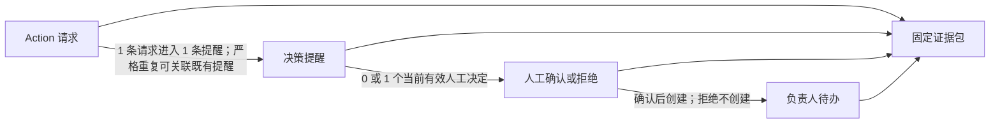

# 新项目功能设计：阶段 4 决策中心

> 版本：v0.1  
> 更新日期：2026-08-14
> 文档状态：决策中心功能设计草案已完成内部自检，待用户评审；内部自检不等于用户评审通过  
> 当前模块：仅决策中心  
> 一期账号：一个演示账号贯通，不设计登录、角色切换或审批链  
> 权威依据：平台总控台账中已生效 D001—D067，以及已生效 CR029、CR030；本次联调同步重点执行 C011、C017、C019、C033
> 依赖状态：数据工程功能设计与原型仍在评审；所有数据资产版本、指标数据快照、数据截至时间、质量、刷新、消费就绪和上一可信版本相关设计均以 `DC-DE-*` 标记为待数据工程确认  
> 所有权状态：D036—D040 已确认决策中心拥有 Action Request、决策提醒、人工确认、负责人待办和决策运行摘要；Q013 已由 D054 解决，Metric、Rule、Action Type 的定义、依赖、版本和 Published 生命周期归本体管理，运行事实仍归相应运行模块
> 联调安全门：CR029 已生效，C017 已正式允许决策中心仅在 C011 三道安全门读取最小质量安全投影；合同路径已登记，真实跨模块读取仍属联调证据，不因原型实现而视为真实运行完成
> 场景运行基线：CR030/C033 已生效，Action Request、决策事项、人工决定、负责人待办、运行活动和 C019 摘要均固定在同一 `scenarioId + scenarioVersion + scenarioRunId`；定向重置只归零新轮次当前投影，历史审计证据继续保留
> 交付性质：中文功能设计；不包含代码、API、数据库表、工作流引擎、技术架构、部署或 HTML 原型

## 0. 阅读约定与结论摘要

### 0.1 权威性与标签

本文使用以下标签：

| 标签 | 含义 | 使用规则 |
|---|---|---|
| `[已生效裁决]` | 平台总控已登记的用户 D 裁决 | 可作为一期范围和验收依据 |
| `[本模块设计]` | 本文提出的决策中心功能方案 | 待用户评审，不等于已上线或已裁决 |
| `[一期最小实现]` | S001 演示闭环必须真实可操作的能力 | 静态结果、禁用入口和写死成功不能替代 |
| `[后期建设]` | 一期稳定后再建设的生产级增强 | 不得成为一期门禁或假入口 |
| `[待数据工程确认][DC-DE-*]` | 依赖数据工程尚未最终确认的合同 | 当前假设可用于继续设计，不能据此宣告通过 |
| `[跨模块待定][DC-X-*]` | 需要总控或相邻模块统一裁决的所有权或合同问题 | 使用推荐方案展开，并在文末提出 CR 建议 |
| `[本窗口用户确认][待总控登记]` | 用户已在本决策中心窗口明确采纳，但平台总控尚未登记正式 D | 可作为本模块后续修订依据；不得伪装成总控已生效 D，不由本窗口分配编号 |
| `[本窗口用户确认][平台 CR 已登记][待总控回写]` | 用户已明确采纳，且最新版总控已登记平台 CR，但尚未登记接受结论或修改目标合同 | 本模块引用总控实际 CR 编号执行；不得提前把 CR 写成已接受或把目标合同写成已修改 |
| `[平台 CR 已登记][待最终裁决]` | 总控已登记变更建议，但尚未正式接受或修改目标合同 | 模块可保留建议及本地交互探索，不得写成平台合同已生效 |
| `[演示数据事实]` | 已从指定融资工作簿核验的演示事实 | 只用于 S001 验收基线，不成为永久业务规则 |

平台总控中已生效 D 裁决为权威；总控 Q、推荐方案、草案合同和模块内部结论均不能替代正式裁决。D026、D031、D034 已确定消费版本跟随、上一可信版本回退和权威消费绑定 Owner，但具体数据版本、Metric 快照、数据截至时间、质量、刷新、消费就绪及上一可信版本展示与交付细节仍按 `DC-DE-*` 等待数据工程确认。

标记继承规则：本文凡出现数据资产/数据版本均继承 `[待数据工程确认][DC-DE-001]`，数据截至时间继承 `[待数据工程确认][DC-DE-002]`，质量继承 `[待数据工程确认][DC-DE-003]`，消费就绪/权威绑定继承 `[待数据工程确认][DC-DE-004]`，刷新与版本变化继承 `[待数据工程确认][DC-DE-005]`，上一可信版本/陈旧继承 `[待数据工程确认][DC-DE-006]`，Metric/指标快照的数据承载与固定方式继承 `[待数据工程确认][DC-DE-010]`。正文在关键门禁和评审表中重复标注；未重复书写不表示依赖已经确认。

### 0.2 一页结论

`[已生效裁决 D010、D036—D040]` 融资优化 Action 提醒出现在决策中心；Action Request、决策提醒、人工确认、负责人待办及其运行摘要由决策中心拥有，人工确认后才形成对应负责人的待办。

`[已生效裁决 D035—D041][本模块设计]` 决策中心不是规则定义器、分析生成器、通用仪表盘或通用任务编排器。模块级顶层能力只有“决策工作台”和“决策运营概览”两类：前者承载 Action Request、提醒、人工判断、负责人待办、异常恢复和详情处理，后者汇总决策运行状态并下钻到前者；全链路追溯是两类顶层能力共用的下钻详情能力，不是并列的第三类顶层能力。

决策中心负责把来自 Rule、智能问数、Agent 应用或报告中心仪表盘受控入口的标准 Action Request 转化为可审阅的决策提醒；只有用户在决策中心完成人工确认且提交成功后，才能为对应负责人创建独立待办，并持续保存结果、异常、纠正和全链路追溯。

一期最小闭环为：

```text
Rule 命中 / 智能问数 / Agent 应用 / 报告中心仪表盘受控入口
→ 形成引用已发布 Action Type 的标准 Action Request
→ 决策中心接收并校验 Action Request
→ 形成一条带固定证据的决策提醒
→ 用户查看主体、指标、贷款、银行建议与版本时点
→ 用户确认或拒绝
→ 确认后为该主体对应负责人创建一条独立待办
→ 更新待办状态、记录结果并贯通追溯
```

五项硬边界：

1. 请求不等于提醒确认，提醒确认不等于待办创建成功，待办创建不等于业务完成；四个事实分别留痕。
2. Action Request 是进入决策中心的唯一标准运行入口；Action Type 是每个请求都必须单独引用的已发布语义定义，不是一次触发记录，也不是唯一来源。Rule、智能问数、Agent 应用和报告中心仪表盘是四类完整且互斥标识的请求来源。
3. 不同融资主体的提醒和待办永不因 Rule 相同、负责人相同或来源相同而静默合并。
4. 四类来源均不得直接确认、创建负责人待办或回写待办状态；报告中心只读消费决策运行摘要，不维护另一套提醒、确认、待办或执行状态。
5. Rule 条件引用与 Action Type 引用分开：Rule 来源必须携带完整已发布 Rule 证据；其他来源只有在证据实际来自 Rule 时才引用 Rule，否则明确显示“不适用”。

治理状态以最新版总控为准：Q013 已由 D054 解决；CR011 已由 D059 接受并同步 C019；CR029 已接受并同步 C011/C017。CR008—CR010 仍为“已登记、待最终裁决，目标合同尚未修改”，不得以本窗口此前的方案选择覆盖平台状态。Q003 的一期最小期限口径仍保留本窗口确认、待总控正式登记。

`[已生效 CR030/C033][一期最小实现]` 当前场景运行轮次初始必须真实归零：Action Request、决策事项、人工决定、负责人待办和活动均为 0，不恢复历史预置事项。只有接收当前 `scenarioId + scenarioVersion + scenarioRunId` 下真实、同标识且同精确双版本的 Action Request 后，当前数量才可增长；异常或示例记录与 S001 正式主流程隔离。

## 1. 产品定位、用户与成功结果

### 1.1 产品定位

决策中心解决五个业务问题：

- 当前有哪些需要人判断的异常或优化建议；
- 为什么出现该建议，证据来自哪个主体、Rule、Metric、贷款和金融机构；
- 证据反映哪个业务时点，使用什么语义与 `[待数据工程确认][DC-DE-001]` 数据版本，是否仍可用于确认；
- 谁做出了确认或拒绝，理由是什么，确认时改了哪些可执行参数；
- 确认后由谁承接，待办当前状态、结果、失败和纠正如何追溯。

`[已生效裁决 D036、D040、D041、D054]` 决策中心回答“需要决定什么、由谁执行、执行到哪一步”。模块级顶层能力仅为决策工作台和决策运营概览；提醒、确认、待办、异常恢复和全链路追溯分别作为两类能力下的处理页、详情页或下钻能力存在。Metric、Rule 和 Action Type 的定义、依赖、版本和 Published 生命周期由本体管理拥有，决策中心只读引用；Action Request、提醒、确认、待办等运行事实仍由决策中心拥有。本模块不替代智能问数或 Agent 的分析过程，也不拥有数据管道、通用业务分析仪表盘、管理驾驶舱、报告定义或报告产物。

`[已生效裁决 D035、D041]` 回答“发生了什么、经营情况怎样”的通用业务分析仪表盘、管理驾驶舱、指标趋势、单位对比、专题分析和报告展示归报告中心。决策运营概览只汇总决策运行状态，不得因使用数量、比例或状态分布而称为“仪表盘”，也不得扩展为通用经营分析或图表配置能力。

### 1.2 一期用户

`[已生效裁决 D003]` 一期只有一个演示账号。该账号连续完成：查看提醒、查看证据、填写确认或拒绝理由、核对/修改负责人和到期时间、确认创建待办、更新待办状态、完成或取消、处理失败及查看追溯。

一期不出现角色切换、审批人选择、代办转授权、权限申请或职责分离。页面仍记录“当前演示账号”作为操作者，不因此虚构多角色治理。

### 1.3 一期成功结果

| 成功结果 | 不得记为通过的情形 |
|---|---|
| S001 的三条不同 Rule 分别形成三家不同单位的 Action 请求、提醒和待办 | 三条 Rule 只使用一家单位，或用静态卡片冒充真实运行 |
| 每条提醒能分别看见已发布 Action Type，以及按来源适用的 Rule 条件引用或“不适用”；同时显示 `[待数据工程确认][DC-DE-010]` Metric 快照、语义版本、`[待数据工程确认][DC-DE-001]` 数据版本、`[待数据工程确认][DC-DE-002]` 数据截至时间、来源和生成时间 | 把 Action Type 与 Rule 合并为一个含糊字段，或缺少关键证据仍允许无提示确认 |
| 用户可下钻问题贷款，并看到前三家建议协商银行、问题余额、贡献、借据数量和关联借据 | 银行建议由页面或 Agent 临时生成，或不能追到贷款 |
| 用户明确确认或拒绝，结果保留操作者、时间和理由 | 点击后只改变颜色，没有确认记录或提交结果 |
| 确认后按主体—负责人关系创建一条独立待办 | 未确认直接建待办，或创建失败仍显示已创建 |
| 单位465和单位561均归负责人009，但仍形成两条独立提醒和两条独立待办 | 按负责人把跨主体记录折叠为一条业务记录 |
| 任务可开始、完成、取消、逾期、失败、重试和纠正，历史不被覆盖 | 只支持“完成”，或改负责人/到期时间后看不到原值 |
| 决策工作台承载逐条处理，决策运营概览只显示待确认、确认/拒绝、待办、逾期、失败、纠正数量及追溯入口 | 在决策中心建设经营指标趋势、单位对比、通用图表或驾驶舱配置 |
| 报告中心展示的决策摘要与决策中心同源只读 | 报告中心存在独立状态按钮或与决策中心状态不一致 |

### 1.4 一期、后期和明确不做

| 范围 | 内容 |
|---|---|
| `[一期最小实现]` | S001 两类顶层能力：决策工作台、决策运营概览；其下包含 Action Request 详情、提醒目录与详情、证据查看、确认/拒绝、待办目录与详情、状态更新、异常恢复、全链路追溯下钻和报告中心只读摘要；一个账号操作 |
| `[一期最终范围]` | S002 预算管理、S003 债务风险监测、S004 财务公司贷款贷前调查在一期最终验收前须完整实现；当前仅保留诚实场景入口与缺口状态，待用户补充业务、数据和合同后再增加真实功能，本文不虚构其规则、提醒或待办流程 |
| `[后期建设]` | 多角色权限、职责分离、审批链、服务级别、团队队列、批量处置、跨组织升级、订阅通知、生产级委派、可配置自动化和复杂纠正流程 |
| `明确不做` | Metric 公式、Rule 阈值、Action Type 业务合同定义；数据管道/质量/资产配置；智能问数理解和 Agent 分析内部设计；通用业务分析仪表盘、管理驾驶舱、通用图表配置、报表设计器、报告定义/产物；绕过人工确认直接建待办；通用项目管理或流程引擎 |

### 1.5 与报告中心的正式边界

| 能力/界面 | 决策中心边界 | 报告中心边界 | 正式依据 |
|---|---|---|---|
| 通用业务分析仪表盘、管理驾驶舱 | 不拥有定义、版本、布局、经营指标分析或配置能力 | 拥有并展示“发生了什么、经营情况怎样” | D035、D041；C016 |
| 决策工作台（顶层能力一） | 拥有 Action Request 详情、提醒目录/详情、人工判断、待办目录/详情、异常恢复和全链路追溯下钻 | 不复制工作台，不提供确认/拒绝或待办操作 | D036、D041；C011—C013 |
| 决策运营概览（顶层能力二） | 拥有待确认、已确认/已拒绝、待办状态、逾期、失败、纠正数量；下钻复用决策工作台目录、详情和追溯能力 | 可通过 C019 只读展示必要摘要，但不得形成另一套运行状态 | D036、D039、D040；C019 |
| 从仪表盘发起行动 | 接收并拥有标准 Action Request，继续形成提醒、人工确认和待办 | 仅从受控入口提交标准 Action Request，并读取返回的请求/运行状态 | D037、D038；C011、C016 |
| 运行状态变更 | 拥有 Action Request、提醒、确认、待办及纠正等状态 | 无确认、拒绝、创建/更新待办或纠正状态操作 | D036、D039；C011—C013、C019 |
| 决策运行摘要 | 提供唯一运行记录的只读投影和深链入口 | 只读消费；不可维护副本、回写状态或以报告产物替代实时运行记录 | D039；C019 |

跨模块一致性备注：最新版总控已由 D059 接受 CR011 并同步 C019。决策中心提供请求、提醒、待办和追溯稳定详情入口；报告中心只读摘要、回链后重新读取，导航上下文不携带状态写权限。本窗口不修改报告中心文档。

## 2. 运行资源及业务关系

### 2.1 四类运行资源

`[已生效裁决 D036—D040][已关闭][DC-X-001]` 下列四类运行记录及其只读摘要均由决策中心拥有。来源模块只发起标准 Action Request；报告中心只能只读消费决策运行摘要。

| 资源 | 业务含义 | 形成条件 | 不可替代的证据 |
|---|---|---|---|
| Action Request（Action 请求） | Rule、智能问数、Agent 应用或报告中心仪表盘基于一组固定证据提出“请进入人工判断”的一次标准运行请求 | 来源提交后先校验，不要求用户已同意；所有来源必须引用已发布 Action Type | Action Request ID、来源、主体、已发布 Action Type；单独记录适用的 Rule 条件引用或“不适用”；Metric 快照及其他固定证据、请求时间 |
| 决策提醒 | 决策中心对可审阅请求形成的待判断记录 | 请求通过最小完整性和兼容校验 | 提醒标识、固定证据包、当前状态、生成时间 |
| 人工确认 | 用户对提醒作出的确认或拒绝结果 | 用户查看证据并提交理由 | 操作者、决定、理由、时间、提交时证据与修改项 |
| 负责人待办 | 确认后交给对应负责人的执行记录 | 确认成功后单独创建；创建可能失败 | 待办标识、主体、负责人、到期时间、状态、结果和原确认 |

### 2.2 业务关系和基数



功能规则：

- 一条 Action Request 只属于一个业务主体和一个已发布 Action Type。Rule 来源可携带一个或多个完整 Rule 触发原因；其他来源只有在其固定证据实际来自 Rule 时才携带 Rule 条件引用，否则记录“不适用”。
- 严格重复请求可关联到一条现有开放提醒，但每个原始请求仍保留独立来源记录。
- 一条提醒只有一个当前有效人工决定；提交失败不产生决定，重试不能生成两个有效决定。
- 一条已确认提醒一期创建一条主体级待办；创建失败时状态为“已确认·待办创建失败”，不可回写为未确认。
- 同一主体后续再次发生新的有效命中，可形成新的提醒和待办，并关联上次记录；不把复发覆盖为旧记录。
- 不同主体始终分别形成提醒和待办。负责人相同只影响筛选和工作量统计，不改变业务记录基数。

### 2.3 资源身份与防误判

| 资源 | 一期身份原则 | 用户可见标题 |
|---|---|---|
| Action 请求 | 来源请求标识；重复请求保留原标识并链接聚合结果 | `主体 + Action Type + 请求时间` |
| 决策提醒 | 独立提醒标识；合并只发生于同主体、同 Action Type、同一固定证据组合的开放记录 | `主体 + 主触发原因` |
| 人工确认 | 提醒标识 + 本次有效决定序号 | `确认/拒绝 + 操作者 + 时间` |
| 负责人待办 | 独立待办标识；不使用负责人作为唯一键 | `主体 + 优化方向 + 到期时间` |

所有运行资源还必须携带同一 C033 场景运行上下文：`scenarioId`、`scenarioVersion`、`scenarioRunId`。该上下文用于运行隔离和关联，不替代 Action Request ID、提醒标识、人工决定标识、待办标识或追溯标识。

- 场景、场景版本或运行轮次缺失、未知、停用或与当前工作投影不一致时，拒绝写入，不采用名称相同、最近一次或最乐观上下文。
- 同一 Action Request ID 不得迁移到其他场景、轮次、Published 语义版本或数据版本；冲突输入拒绝且原记录不覆盖。
- 定向重置形成新的 `scenarioRunId`，新轮次请求、事项、决定、待办和活动从 0 开始；原轮次资源转为只读历史审计，不删除、不计入当前数量。
- 当前投影和历史最近一次实际证据必须分开展示，不把历史成功恢复成当前成功，也不把当前 0 写成历史失败。

## 3. Action Request 来源合同

### 3.1 统一入口原则

`[已生效裁决 D037、D038][已关闭][DC-X-004]` Action Request 是进入决策中心的唯一标准运行入口，但不是唯一请求来源。每个 Action Request 必须引用已发布 Action Type；Action Request ID 唯一标识一次运行请求，Action Type 只标识可复用的行动语义类型，不能充当本次触发标识。四类来源可以建议行动，但都不能代替人工确认。

| 来源 | 发起情境 | 决策中心显示 | 明确禁止 |
|---|---|---|---|
| Rule 命中 | 已发布 Rule 对单一主体形成可解释命中 | 来源为“Rule 自动命中”；必须显示已发布 Rule 引用、Rule 版本、评估时间、触发分支或条件及命中证据 | Rule 直接创建负责人待办，或只传 Rule 名称而不传版本和命中证据 |
| 智能问数 | 用户在问答结果中选择获准 Action | 来源问题、问答结果引用、发起者和请求时间；证据实际来自 Rule 时显示完整 Rule 条件引用，否则显示“Rule 条件引用：不适用” | 把自然语言回答当作 Metric 或 Rule 运行证据，或为补字段而虚构 Rule |
| Agent 应用 | 获准 Agent 基于固定生成证据包建议行动 | Agent/运行记录、生成时间、证据引用和“AI 建议”标识；证据实际来自 Rule 时显示完整 Rule 条件引用，否则显示“不适用” | Agent 自动确认、在其内部维护待办状态或虚构 Rule |
| 报告中心仪表盘受控入口 | 用户从报告中心拥有的指标、异常或对象组件发起 | 报告中心仪表盘版本、组件/对象上下文、发起者、请求时间和返回的 Action Request ID；证据实际来自 Rule 时显示完整 Rule 条件引用，否则显示“不适用” | 仪表盘复制或虚构 Rule、维护请求后续状态、确认提醒或直接建待办 |

四类来源提交后，决策中心统一负责请求校验、提醒形成、人工确认/拒绝、待办创建和运行追溯。报告中心仪表盘可以读取该请求的只读状态并提供进入决策中心的深链，但不得在仪表盘内继续执行确认、拒绝、待办更新、取消或纠正。

### 3.2 Action Request 最小信息

| 信息组 | 一期必需内容 | 缺失处理 |
|---|---|---|
| 请求 | Action Request ID、四类来源之一、来源记录、请求时间、发起者或系统来源 | 无唯一请求标识或来源记录则拒绝形成可确认提醒 |
| 目标 | 对象类型、主体稳定身份和可读名称 | 主体缺失或不唯一则进入阻断态 |
| Action Type | 已发布 Action Type 引用及其 Published 语义版本；四类来源全部强制必需 | Action Type 缺失、未发布、失效或版本不兼容则阻断 |
| Rule 条件引用 | Rule 来源必须带已发布 Rule 引用、Rule 版本、评估时间、触发分支或条件及命中证据；智能问数、Agent 应用、报告中心仪表盘仅在固定证据实际来自 Rule 时带同样字段，否则明确记录“不适用” | Rule 来源或实际引用 Rule 的其他来源缺任一必需字段即阻断；非 Rule 证据不得虚构 Rule，也不得把“不适用”当缺失 |
| 来源证据 | 智能问数带问题与结果引用；Agent 应用带运行和固定生成证据包引用；报告中心仪表盘带仪表盘版本、组件/对象上下文；Rule 来源带命中记录 | 不允许只传“建议行动”文字，也不得用来源文本替代 Action Type、Metric 或适用的 Rule 条件引用 |
| 指标 | 所有来源均携带 `[待数据工程确认][DC-DE-010]` Metric 引用、值、单位、对象范围、计算/评估时间、所依赖数据版本和触发解释；非 Rule 来源仍不得用自然语言建议替代 Metric 快照 | Metric 证据缺失时保留 Action Request 但阻断形成可确认提醒，不由决策中心补算 |
| 建议 | 建议方向、优先协商银行、问题贷款摘要和可下钻引用 | 缺银行关系时显示证据缺失，不生成空洞排名 |
| 数据 | `[待数据工程确认][DC-DE-001]` 数据资产版本；`[待数据工程确认][DC-DE-002]` 数据截至时间 | 缺失时保留请求但阻断确认 |
| 可信度 | `[待数据工程确认][DC-DE-003]` 质量摘要；`[待数据工程确认][DC-DE-004]` 消费就绪与权威绑定证据 | 未通过或无法确认时阻断；部分可用时逐项披露 |

`[已生效合同 C011、C017；CR029]` 每个 Action Request 还必须锁定一个精确 Published 语义版本和一个精确 T007 数据版本，不得写“当前版本”“最新版本”或仅传显示名称。决策中心在以下三个写入边界按该精确 T007 重新读取 C017 当前状态摘要：

`[已生效 C011、CR030/C033]` Action Request 接收幂等键至少为：`scenarioId + scenarioRunId + Action Request ID + Published 语义版本 + 数据版本`。请求合同同时核对同一场景版本、单一业务主体、已发布 Action Type、适用的 Rule 条件和固定证据：

- 同一幂等键和同一合同内容重复提交：返回第一次接收形成的同一 request/reminder/task/trace 稳定引用；请求、事项、决定、待办、回执和活动数量均不增加。
- 同一 Action Request ID 但场景、场景版本、运行轮次、主体、Action Type、Rule 条件或任一精确版本不同：冲突拒绝，保留冲突回执，原记录与原引用不覆盖。
- 合同字段缺失：合同拒绝，不进入 C017 接收安全门，不形成决策事项。
- 合同完整的新请求：才进入 C017 接收安全门；只有门禁明确允许时形成决策事项。

| 安全门读取时点 | 允许推进的唯一条件 | 拒绝/阻断后保留 | 恢复方式 |
|---|---|---|---|
| Action Request 接收前 | 成功定位精确 T007 的当前摘要，状态明确，且未标记版本级或范围级事后硬质量失败 | 硬质量失败保留失败回执且不形成决策事项；摘要不可定位、状态未知或权威读取失败保留请求和阻断回执 | 硬质量失败须由来源改用恢复后的可信版本重新发起；其余阻断可对同一请求重新读取，明确允许后继续形成决策事项 |
| 正向人工确认提交前 | 再次读取当前摘要且明确允许 | 不保存人工确认；保留表单内容、读取时间和阻断原因；拒绝操作不依赖本门形成正向交办 | 用户重试提交时再次读取，允许后才保存人工确认 |
| 负责人待办形成前 | 人工确认已保存，并再次读取当前摘要且明确允许 | 保留人工确认、负责人和期限，不创建或伪造待办；进入决策运营概览的交办异常恢复 | 仅重试待办形成门，不要求重复确认；读取允许后创建一条独立待办 |

三道门每次留痕：精确 T007、C017 当前状态摘要标识/版本/形成时间、读取时间、门禁结论。页面缓存、此前门禁结果、报告中心摘要或决策中心本地展示均不能授权后续阶段推进。

决策中心可读取的 C017 最小字段严格限于：精确 T007；当前状态摘要标识、版本、形成时间；当前质量状态；版本级或范围级事后硬质量失败；发现时间；影响范围；业务字段类别；原因；恢复建议；稳定证据定位。决策中心不得读取业务明细、源字段、工作簿内容、失败样例、Metric 公式或 Rule 阈值，不得维护质量副本、修改 C017/T019/数据工程状态或自行切换上一可信版本。

### 3.3 来源撤回与纠正

`[平台 CR 已登记][待最终裁决][DC-X-006]` 本模块建议 Rule、智能问数、Agent 应用和报告中心仪表盘四类来源只能对原请求追加“撤回、证据纠正、被新请求替代”的事实，不得删除、覆盖或原地修改原请求及固定证据；CR010 尚未修改平台目标合同。一期原型按下列建议行为探索：

- 人工确认前撤回：提醒进入“上游已撤回”，显示来源、原因和时间，禁止确认，可查看替代请求。
- 人工确认前纠正：原提醒进入“证据已纠正”，原证据保持只读，新证据形成新 Action Request；用户转到替代提醒处理。
- 人工确认后撤回或纠正：不自动取消待办；在待办上显示醒目“上游发生变化”，由用户选择继续、取消或发起纠正并说明理由。
- 替代请求：新旧请求双向关联，展示版本、证据和推荐决策变化，不覆盖原人工决定。
- 来源结果删除或暂时不可读：决策中心保留已固定摘要并标记“来源暂不可用”；是否允许确认按第 8 章证据门处理。
- 一期最小实现只要求“已撤回、证据已纠正、已被替代”三类上游变化状态、原因和时间、新旧请求关联，以及确认后的人工继续/取消/纠正，不建设复杂自动补偿流程。

## 4. 决策提醒与证据合同

### 4.1 每条提醒必须展示的信息

| 区域 | 必须展示 |
|---|---|
| 对象主体 | 对象类型、主体名称、稳定身份、所属场景 |
| Action Type | 已发布 Action Type 名称、引用及其 Published 语义版本；四类来源全部必显 |
| Rule 条件引用 | Rule 来源显示已发布 Rule 名称/引用、Rule 版本、评估时间、触发分支或条件及命中证据；智能问数、Agent 应用、报告中心仪表盘仅在证据实际来自 Rule 时显示同样字段，否则固定显示“不适用”；多 Rule 逐条展示 |
| `[待数据工程确认][DC-DE-010]` Metric 快照 | 指标名称、值、单位、对象范围、评估时间、所依赖数据版本、触发解释；不在决策中心重算或修改口径 |
| 版本时点 | Published 语义版本；`[待数据工程确认][DC-DE-001]` 数据资产版本；`[待数据工程确认][DC-DE-002]` 数据截至时间 |
| 来源 | Rule/智能问数/Agent 应用/报告中心仪表盘、来源记录、Action Request ID、发起者、请求时间 |
| 生成 | 提醒标识、提醒生成时间、最近状态更新时间 |
| 建议行动 | 建议方向、前三家优先协商银行及排序依据说明 |
| 贷款证据 | 问题余额、贡献占比、问题融资加权成本、涉及借据数、关联借据入口 |
| 可信提示 | `[待数据工程确认][DC-DE-003]` 质量摘要；`[待数据工程确认][DC-DE-004]` 消费就绪；`[待数据工程确认][DC-DE-006]` 是否陈旧及上一可信版本摘要 |

列表卡或表格可压缩显示，但进入确认前必须能查看全部上述内容。任何“查看更多”失败都不得被当作用户已知悉证据。

### 4.2 证据查看

提醒详情中的证据按业务阅读顺序组织：

1. **为什么提醒**：先独立展示已发布 Action Type，再展示 Rule 条件引用。Rule 来源必须完整展示 Rule 版本、评估时间、触发分支或条件及命中证据；其他来源按证据事实展示完整 Rule 引用或“不适用”，同时展示 Metric 快照、来源证据和建议方向。
2. **影响谁**：单一融资主体及对应负责人关系。
3. **先和谁协商**：前三家建议银行、问题余额、贡献、成本和借据数。
4. **涉及哪些贷款**：按银行分组的关联借据列表，支持按借据编号、机构和问题类型筛选。
5. **证据是否可信**：语义版本、`[待数据工程确认][DC-DE-001]` 数据版本、`[待数据工程确认][DC-DE-002]` 数据截至时间、`[待数据工程确认][DC-DE-003]` 质量、`[待数据工程确认][DC-DE-004]` 消费就绪、来源和生成时间。
6. **如何形成**：打开只读全链路追溯，不进入数据工程、本体、问数或 Agent 的内部编辑。

`[待数据工程确认][DC-DE-007]` 贷款与金融机构证据的可用粒度、字段完整性和追溯入口待数据工程确认。证据缺失时页面显示缺失项及责任位置，不生成占位数值。

### 4.3 S001 证据基线

`[演示数据事实]` 指定工作簿已核验：5,218 条融资明细、574 家单位、24 家机构；单位553/465/561分别只命中 R01/R02/R03。本文只引用既有 Rule 与 Metric 结果，不定义其公式或阈值。

`[已生效裁决 D049]` S001 所引 T007 数据结构统一为四成员三关系：融资主体参考、融资明细、金融机构参考、融资负责人参考；融资明细→融资主体、融资明细→金融机构、融资主体→融资负责人。决策中心只通过已发布语义关系引用这些业务证据，不维护成员、关系或数据工程状态。

| 主体 | 主 Rule | 负责人 | 提醒证据摘要 | 前三家建议协商银行 |
|---|---|---|---|---|
| 演示单位553 / `UNIT-553` | R01 融资成本偏高 | 融资负责人001 | 75 笔；余额约 393.134 亿元；仅命中 R01 | 演示欧陆银行、演示寰宇银行、演示海联银行 |
| 演示单位465 / `UNIT-465` | R02 浮动利率暴露 | 融资负责人009 | 176 笔；余额 770 亿元；仅命中 R02 | 演示融通银行、演示启明银行、演示嘉禾银行 |
| 演示单位561 / `UNIT-561` | R03 短期债务集中 | 融资负责人009 | 50 笔；余额约 20.016 亿元；仅命中 R03 | 演示同州银行、演示星河银行、演示恒信银行 |

银行排名、金额和借据数必须从所引用的已发布 Rule 证据读取，不得作为页面常量或 Agent 提示词。更换数据后以新固定证据为准。

## 5. 人工确认与拒绝

### 5.1 确认前校验

用户点击“确认”后，先展示校验清单；校验未完成前不创建人工确认记录：

| 校验 | 通过条件 | 不通过表现与恢复 |
|---|---|---|
| 主体 | 主体身份存在且唯一 | 阻断；返回来源或本体修正，保留请求 |
| Action Type | 已发布 Action Type 引用可读、版本兼容且适用于该主体；四类来源一律校验 | 缺失、未发布、失效或版本不兼容即阻断 |
| Rule 条件引用 | Rule 来源及实际引用 Rule 的其他来源，其已发布 Rule 引用、Rule 版本、评估时间、触发分支或条件及命中证据完整可读；无 Rule 证据的非 Rule 来源明确为“不适用” | 应引用却缺字段时阻断；“不适用”与缺失分开，不要求非 Rule 来源补造 Rule |
| `[待数据工程确认][DC-DE-010]` Metric 快照 | 值、单位、范围、评估时间、所依赖数据版本和触发解释完整 | 证据缺失；`[待数据工程确认][DC-DE-005]` 刷新来源证据后形成新请求 |
| 双版本 | 语义版本和 `[待数据工程确认][DC-DE-001]` 数据版本均存在且与请求一致 | 任一不一致即冻结确认 |
| 数据时点 | `[待数据工程确认][DC-DE-002]` 数据截至时间存在 | 缺失即阻断；不得用生成时间替代 |
| 质量与就绪 | `[待数据工程确认][DC-DE-003]` 质量可接受且 `[待数据工程确认][DC-DE-004]` 消费就绪可核对 | 失败/未知均阻断；只读显示原因 |
| C017 当前安全状态 | 按请求锁定的精确 T007 重新读取当前摘要；可定位、读取成功、状态明确且无版本级/范围级硬质量失败 | 硬质量失败拒绝推进；不可定位、状态未知或读取失败保守阻断，保留读取回执和表单内容 |
| 证据新鲜度 | `[待数据工程确认][DC-DE-006]` 未被撤回；存在更新版本时已明确旧证据处理选择 | 按第 7.4 节处理陈旧证据 |
| 负责人 | 主体—负责人关系恰有一个有效结果 | 缺失或多值时阻断；不得由负责人目录猜测 |
| 独立性 | 不存在同主体、同 Action Type、同固定证据组合的有效确认或开放待办 | 展示既有记录，允许查看，不重复提交 |

### 5.2 确认表单

| 字段 | 一期规则 |
|---|---|
| 决定 | 确认或拒绝；二选一 |
| 理由 | 两种决定均必填；保留用户原文和提交时间 |
| 负责人 | 默认取主体—负责人关系；可在确认前修改，但必须选择一个明确负责人并填写修改理由；修改只影响本次待办，不回写本体关系 |
| 到期时间 | `[本窗口用户确认][待总控登记][DC-X-002]` 一期最小口径：默认到期日为人工确认成功后的第 5 个工作日，确认当日不计入；周一至周五计为工作日、周末不计，暂不实现法定节假日和调休日历。界面必须展示计算口径；确认时可修改 |
| 建议方向 | 可从 Action 请求建议中选择或补充本次执行说明；不得改写 Rule、Metric 或银行排序证据 |
| 协商银行 | 默认带入证据中的建议银行；允许为本次待办调整执行顺序或排除某家，必须填写理由；原证据排名保持不变 |
| 关联贷款 | 只读引用；如需缩小本次执行范围，记录“本次选择”而不删除原证据 |

提交前显示差异摘要：原建议、用户修改、本次负责人、到期时间和理由。用户确认的是这次行动交接，不是对上游 Rule 定义作永久修改。

### 5.3 提交结果

- 确认提交成功：记录人工确认，进入“已确认·待创建待办”。
- 拒绝提交成功：记录拒绝，提醒终止，不创建待办；可从新证据再次发起新请求，不能把原拒绝改成未处理。
- 提交失败：保持表单输入，显示是否已收到明确结果；结果未知时先核对原提交，避免重复确认。
- 确认成功但待办创建失败：确认事实保持有效，提醒显示“已确认·待办创建失败”，允许修正负责人或重试创建；不得要求用户重复确认。

## 6. 负责人待办

### 6.1 待办创建合同

每条待办必须带：待办标识、主体、负责人、标题、执行说明、确认理由、到期时间、建议协商银行、本次选择贷款、原提醒与确认引用、已发布 Action Type 引用及版本、`[待数据工程确认][DC-DE-010]` Metric 快照、语义版本、`[待数据工程确认][DC-DE-001]` 数据版本、`[待数据工程确认][DC-DE-002]` 数据截至时间、创建时间和当前状态。Rule 来源或实际基于 Rule 证据的其他来源还必须固定已发布 Rule 引用、Rule 版本、评估时间、触发分支或条件及命中证据；其余来源明确保存“Rule 条件引用：不适用”。

`[待数据工程确认][DC-DE-001][DC-DE-002]` 数据版本与数据截至时间按确认时固定证据保存；后续数据变化只产生陈旧提示或新请求，不原地改写待办依据。

`[已生效合同 C011、C017；CR029]` 人工确认保存后、形成负责人待办前必须再次按该精确 T007 读取 C017。明确允许后才创建待办；硬质量失败、摘要不可定位、状态未知或权威读取失败均不得创建。失败时人工确认仍是有效历史事实，转入“交办创建异常”，恢复只重试本门，不重复确认。

### 6.2 状态与操作

| 待办状态 | 进入条件 | 用户可执行动作 | 必留结果 |
|---|---|---|---|
| 创建中 | 人工确认已成功，正在形成待办 | 离开页面后可返回查看 | 创建尝试、开始时间 |
| 待处理 | 创建成功，尚未开始 | 开始、修改执行参数、取消 | 负责人、到期时间、当前证据提示 |
| 处理中 | 已开始执行 | 记录进展、完成、取消、纠正 | 开始时间、进展说明 |
| 已完成 | 用户填写结果并确认完成 | 查看、发起纠正 | 完成时间、结果摘要、实际协商银行与贷款范围 |
| 已取消 | 用户填写取消原因 | 查看、基于新证据重新发起 | 取消者、时间、原因 |
| 已逾期 | 当前时间超过到期时间且未完成/取消 | 更新到期时间、继续、完成、取消 | 原到期时间、逾期时长、修改理由 |
| 创建失败 | 未成功形成待办 | 修正负责人/必要字段并重试 | 失败原因、尝试次数、原确认 |
| 更新失败 | 状态或内容提交没有明确成功 | 核对原操作、重试 | 原状态、目标状态、提交内容和结果 |
| 执行失败 | 负责人已开始处理，但本次协商或执行未达到预期且不能记为完成 | 填写失败原因、影响和下一步；重试、取消或发起纠正 | 失败时间、已发生结果、可重试条件和责任说明 |
| 纠正中 | 已完成/已取消记录需要纠正 | 填写纠正原因和期望结果 | 原记录只读，纠正关联原待办 |
| 已纠正 | 纠正动作完成 | 查看原记录和纠正结果 | 原值、新值、操作者、时间和原因 |

“已逾期”是时间派生状态，不覆盖“处理中”等执行事实；目录可显示“处理中·已逾期”。取消与纠正均不删除原确认、原待办或历史状态。

### 6.3 可修改项与边界

确认后、完成前可修改负责人、到期时间、执行说明、本次协商银行顺序和本次贷款范围；每次修改必须保留原值、新值、操作者、时间和理由。不得修改主体、已发布 Action Type、适用的原 Rule 条件引用或“不适用”结论、`[待数据工程确认][DC-DE-010]` Metric 快照、语义版本、`[待数据工程确认][DC-DE-001]` 数据版本、`[待数据工程确认][DC-DE-002]` 数据截至时间或原银行归因证据。

待办已完成后如发现负责人、范围或结果有误，使用“发起纠正”关联原记录；不得把已完成历史直接改回待处理而无解释。

## 7. 重复、复发、跨主体和版本变化

### 7.1 严格重复请求

先区分两类重复：C011 同一幂等键重试已经由 CR030/C033 收敛，必须无副作用返回同一资源；下列“多个不同 Action Request 是否关联同一开放事项”属于业务聚合，仍是 `[平台 CR 已登记][待最终裁决][DC-X-005]`，CR009 尚未修改平台目标合同。

本模块原型按下列严格键探索业务聚合：每个不同 Action Request 独立保留；只有“主体 + Action Type + Published 语义版本 + `[待数据工程确认][DC-DE-001]` 数据版本 + `[待数据工程确认][DC-DE-010]` Metric 固定证据标识 + 适用的 Rule 固定证据标识或明确不适用”完全一致，且关联事项仍处于人工决定前的开放状态时，才允许关联同一事项：

- 完全相同且已有开放提醒：新请求标为“重复·已关联”，不新建提醒；每条来源记录、触发原因和固定证据仍独立保留。
- 原提醒已经确认或拒绝：不再聚合；新请求形成新提醒，并与历史记录建立复发或重复关系。
- 不同主体、不同 Action Type、不同语义/数据版本或不同固定证据均不得聚合；负责人相同永远不是合并条件。
- 去重结果未知：先查询既有记录，不让用户连续点击产生多条待办。
- 提醒聚合不得导致待办聚合；每次有效人工确认仍只创建该主体对应的一条独立待办。

### 7.2 同一主体多次命中

- 同主体、同 Action Type、同一固定证据组合下多条 Rule 同时命中：推荐形成一条提醒，逐条保留触发原因和各自 `[待数据工程确认][DC-DE-010]` Metric 快照；每个 Action 请求保持可追溯。
- 同主体、不同 Action Type：分别形成提醒。
- 同主体、不同 `[待数据工程确认][DC-DE-002]` 数据截至时间或 `[待数据工程确认][DC-DE-001]` 数据版本：分别形成提醒并建立“更新/复发”关系，不跨版本合并。
- 已有开放待办时新版本再次命中：创建新提醒，但确认前提示已有待办；用户可确认新待办、拒绝新提醒或发起对原待办的纠正，系统不自动替用户决定。

### 7.3 跨主体同负责人

负责人不是聚合键。目录可以按负责人分组展示，但每一行仍有独立主体、提醒、确认、待办、到期时间和状态。批量操作属于后期；一期逐条确认、逐条完成。

S001 中单位465和单位561均由融资负责人009承接，必须产生两条独立待办；任一条完成、取消或失败不得改变另一条状态。

### 7.4 数据版本变化与证据陈旧

`[待数据工程确认][DC-DE-005][DC-DE-006]` 当前假设：Action 请求和提醒保存固定证据；当权威消费组合出现更新数据版本时，旧记录不改写，只追加“存在更新版本/当前证据可能陈旧”。

| 情形 | 一期处理 |
|---|---|
| 新版本仍支持相同命中且证据兼容 | 上游形成新请求；旧未确认提醒显示“已有更新证据”，默认阻断直接确认，用户转到新提醒 |
| 新版本不再命中 | 上游撤回或替代原请求；旧提醒进入“上游已撤回”，不得确认 |
| 新版本刷新失败 | 继续显示 `[待数据工程确认][DC-DE-006]` 上一可信版本及陈旧警告；仅基于仍为权威的固定证据处理 |
| 版本不兼容 | 提醒进入“版本不兼容”，阻断确认；等待兼容证据形成新请求 |
| 已确认或已完成后发现新版本 | 不撤销历史；待办显示新鲜度提示，用户决定继续、取消或纠正 |

为避免用户在旧提醒中误操作，一期推荐“新权威版本已经形成且旧提醒未确认时，必须转到新证据确认”。是否允许带特别理由继续旧证据属于后期例外治理，不纳入一期。

## 8. 页面与工作区功能合同

### 8.1 页面层级地图

决策中心只有 `DC1 决策工作台` 和 `DC2 决策运营概览` 两个模块级顶层能力。其余项目均为下属处理页、详情页、跨页面恢复能力或下钻能力，不形成第三个顶层入口。

| 编号 | 层级与归属 | 页面/下属能力 | 用户目标 | 一期主操作 | 不出现的能力 |
|---|---|---|---|---|---|
| DC1 | 顶层能力一 | 决策工作台 | 逐条处理需要判断或执行的事项 | 切换处理队列、筛选场景、进入下属详情和恢复操作 | 通用经营分析、图表配置、Metric/Rule 编辑、角色切换 |
| DC1-1 | DC1 下属详情页 | Action Request 详情 | 核对一次标准请求的来源、目标、证据、校验和关联结果 | 查看请求、来源、阻断、重复/聚合关系及后续提醒 | 确认请求本身、直接建待办 |
| DC1-2 | DC1 下属处理页 | 提醒目录 | 找到需处理或已处理提醒 | 搜索、筛选、排序、打开提醒 | 批量自动确认、直接建待办 |
| DC1-3 | DC1 下属详情页 | 提醒详情与证据 | 理解 Action Type、适用 Rule 条件、银行和贷款证据 | 下钻证据、打开来源/追溯、进入确认或拒绝 | 修改上游指标、Rule、Action Type 或数据 |
| DC1-4 | DC1 下属处理页 | 人工确认 | 明确作出确认或拒绝 | 填理由、核对负责人/到期时间/本次执行项、提交 | 审批链、代签、自动确认 |
| DC1-5 | DC1 下属处理页 | 待办目录 | 查找本人或指定负责人的独立待办 | 搜索、筛选状态/主体/负责人/到期时间、打开 | 按负责人静默合并跨主体任务 |
| DC1-6 | DC1 下属详情页 | 待办详情 | 执行、更新、完成、取消或纠正 | 开始、更新进展、完成、取消、纠正、重试 | 修改原证据、删除历史 |
| DC1-7 | DC1 跨页面下属能力 | 异常恢复 | 恢复证据阻断、创建/更新失败、结果未知和纠正失败 | 查看原因、核对原操作、修正允许项、重试 | 重复确认、覆盖历史、把失败写成成功 |
| DC1-8 | DC1/DC2 共用下钻详情 | 全链路追溯 | 看懂发生了什么、为什么产生、从哪来、建议怎么处理及最终如何决定 | 查看解释摘要、原请求清单、固定证据、推荐决策和时间线，打开来源或对应详情 | 作为第三个顶层能力；把建议冒充最终决定；编辑其他模块资源；绕过确认 |
| DC2 | 顶层能力二 | 决策运营概览 | 掌握决策流程当前运行状况 | 查看并下钻待确认、确认/拒绝、待办状态、逾期、失败、纠正数量 | 通用仪表盘定义、经营指标趋势、单位经营对比、报表设计器 |

### 8.2 DC1 决策工作台

决策工作台是处理类顶层能力，不是运营分析仪表盘。首屏按业务优先级提供“待判断”“执行中”“异常待恢复”“最近处理”队列，队列内逐条展示待确认、证据阻断、已确认待建任务、待办创建失败、待处理、处理中、已逾期和最近完成记录。用户从这里进入 DC1-1—DC1-8 下属页面或能力，不在工作台配置图表、经营指标或报告。

工作台固定提供场景筛选：S001 可用；S002—S004 在资料未补充前显示“待业务与数据接入”，列出缺少的业务对象、Metric、Rule、Action Type、数据和验收资料，不显示伪造数量、提醒或待办。

列表默认每行显示：主体、Action Type、适用时的主 Rule 或“不适用”、提醒状态、负责人、到期时间、来源、生成时间、语义版本、`[待数据工程确认][DC-DE-001][DC-DE-002]` 数据版本与数据截至时间、证据新鲜度。跨主体同负责人仍显示多行。

#### 8.2.1 DC1-1 Action Request 详情

显示 Action Request ID、四类来源之一、来源场景与来源记录、业务主体、已发布 Action Type、独立的 Rule 条件引用或“不适用”、Metric 快照、双版本、请求时间、校验结果、重复/聚合结果、撤回/替代关系和所形成提醒。该页是稳定详情入口，只读展示请求事实；确认或拒绝必须进入 DC1-3/DC1-4，不能确认 Action Request 本身。

#### 8.2.2 DC1-2 提醒目录

支持按场景、提醒状态、主体、Rule、Action Type、来源、负责人、生成时间、证据新鲜度和异常类型筛选；支持名称/稳定身份/提醒标识搜索。默认排序为“阻断需修复 → 待确认 → 已确认待建任务 → 最近生成”。

提醒行的主动作只随状态出现：待确认显示“查看并判断”；阻断显示“查看缺口”；已确认显示“查看待办”；已拒绝/撤回显示“查看记录”。不能在列表直接无证据确认。

#### 8.2.3 DC1-3 提醒详情与 DC1-4 人工确认

提醒详情采用“结论摘要—Action Type—Rule 条件引用或不适用—Metric—银行建议—贷款证据—版本与来源—历史”顺序。确认区与证据同页可见，用户打开确认时保留当前银行、借据筛选和滚动上下文；返回目录恢复筛选和位置。

确认提交期间按钮进入明确的“提交中”，禁止重复点击；失败后保留已填内容。结果未知时显示“正在核对原提交”，不同时提供新的提交入口。只有 DC1-4 中的人工确认提交成功后，才进入负责人待办创建；任何来源页和其他下属页均不能替代这一确认门。

#### 8.2.4 DC1-5 待办目录与 DC1-6 待办详情

待办目录支持按主体、负责人、状态、逾期、Rule、Action Type 和创建/到期时间筛选。负责人分组是视图，不是合并。每行显示独立待办标识和主体。

待办详情首屏显示主体、当前状态、负责人、到期时间、建议行动、确认理由和证据新鲜度；第二层显示银行与贷款执行范围；第三层显示状态历史、修改和纠正；全链路追溯下钻常驻。

#### 8.2.5 DC1-7 异常恢复

异常恢复不是独立顶层入口，而是嵌入 Action Request、提醒和待办处理上下文的下属能力。它覆盖证据缺失、版本不兼容、上游撤回、确认结果未知、待办创建/更新/执行失败和纠正失败；每次恢复保留原状态、失败原因、尝试、操作者和最终结果。

#### 8.2.6 DC1-8 全链路追溯

全链路追溯是决策工作台详情页和决策运营概览共用的下钻能力，不是第三类模块级顶层能力。它不是内部标识和日志的堆叠页，首屏必须用业务语言依次回答：

1. **发生了什么**：主体、提醒结论、当前运行状态和影响范围。
2. **为什么产生**：独立展示已发布 Action Type；再展示适用的 Rule 条件及命中证据或“不适用”、Metric 快照、关键贷款和银行证据。
3. **从哪里来**：四类来源之一、来源记录、发起者或系统来源、请求与生成时间，并提供获准的原始来源入口。
4. **建议怎么处理**：展示 Action Request 已携带的结构化建议，包括建议决策方向、建议行动、建议协商银行、贷款范围、建议负责人/期限及依据；醒目标记“系统建议，不是最终决定”。
5. **最终如何决定**：显示用户确认或拒绝、理由、修改项、负责人待办和执行结果；未决定时只提供进入 DC1-4 人工确认的入口，追溯页本身不绕过确认门。

系统建议只能整理和解释 Action Request 已携带的结构化建议及固定证据；决策中心不重算 Metric、不创造 Rule，也不把 Agent 自由文本直接包装成权威推荐。多个来源建议不一致时逐条展示来源、建议和分歧，不自动拼接为一个结论；证据缺失、陈旧或不兼容时推荐卡显示限制并执行既有确认阻断。

首屏下方固定提供“原始请求清单—固定证据—完整时间线”三部分。聚合提醒必须显示关联请求数量，并逐条说明哪个请求首次形成提醒、哪个请求因严格重复关联、各自来自哪里和为什么触发；不得把聚合表现为原请求被删除。完整时间线按“来源结果 → Action Request → 提醒生成/聚合 → 证据校验 → 人工决定 → 待办创建 → 状态更新 → 完成/取消/纠正”展示，每一步显示业务说明、标识、操作者或来源、时间、前后状态和固定版本。

`[待数据工程确认][DC-DE-009]` 数据证据可进一步只读定位到数据资产、质量与刷新/消费就绪摘要；决策中心不提供数据工程的配置、重跑或版本切换操作。

### 8.3 DC2 决策运营概览

`[已生效裁决 D036、D040]` 决策运营概览是汇总类顶层能力，只汇总决策中心拥有的运行记录，一期固定显示：

- 待确认提醒数量；
- 已确认数量、已拒绝数量及确认率；
- 待办按待处理、处理中、已完成、已取消等运行状态的数量；
- 已逾期、创建/更新/执行失败、纠正中和已纠正数量；
- Action Request → 提醒 → 人工决定 → 待办 → 结果的全链路追溯下钻入口。

每个数量必须显示统计范围、摘要时点和当前筛选条件，并可下钻到 DC1-2 提醒目录、DC1-5 待办目录或 DC1-8 全链路追溯的同条件记录。S001 可展示真实运行数量；S002—S004 未接入时显示未就绪原因，不显示零值伪装为已运行。

决策运营概览可按场景、来源、运行状态和时间范围筛选，但不提供自定义图表、组件编排、经营 Metric 趋势、单位经营对比、专题分析、报告发布或管理驾驶舱能力。任何回答“经营情况怎样”的分析均由报告中心仪表盘承担；本概览只回答“决策运行到哪一步”。

## 9. 页面状态、失败与恢复

### 9.1 全局状态合同

| 状态 | 用户所见 | 允许动作 | 禁止表现 |
|---|---|---|---|
| 加载中 | 当前正在加载的范围和骨架；不显示旧主体证据 | 离开、等待 | 用上一次提醒内容填充新提醒 |
| 空 | 说明是“当前无待处理”还是“场景未接入” | 清除筛选、切换场景 | 用演示样例冒充真实提醒 |
| 无筛选结果 | 显示当前筛选条件 | 清筛选 | 误报系统无数据 |
| 读取失败 | 失败范围、最近成功读取时间、重试 | 重试、返回目录 | 整页空白或把失败当空 |
| C017 摘要不可定位 | 精确 T007、读取时间、不可定位原因和稳定证据定位 | 重新读取、返回行动请求目录 | 采用最近缓存或猜测为可用 |
| C017 状态未知 | 当前摘要身份、状态未知、影响范围当前无法判定 | 保留当前业务事实并重新读取 | 选择最乐观状态继续确认或建待办 |
| C017 事后硬质量失败 | 精确 T007、失败发现时间、影响范围/业务字段类别、原因、恢复建议和失败回执 | 接收门失败时等待可信版本后重新发起；后续门按当前阶段保留已有事实 | 形成新决策事项、保存正向确认或创建待办；修改 C017/T019 |
| 部分可用 | 已加载内容、缺失内容和对确认的影响 | 查看可用证据、重试缺失部分 | 对缺失证据无提示 |
| 版本不兼容 | 冲突的语义版本、`[待数据工程确认][DC-DE-008]` 数据版本、来源和责任位置 | 打开新请求或来源详情 | 允许继续确认 |
| 证据缺失 | 缺少的字段、为何必需、恢复责任 | 重试证据、打开来源 | 自动填 0、未知银行或默认主体 |
| 提交失败 | 已保留输入、明确失败/未知结果、重试条件 | 核对原提交、重试 | 清空理由或重复创建 |
| 上游撤回 | 撤回时间、原因和替代请求 | 查看替代/历史 | 删除提醒或继续确认 |
| 只读历史 | 记录已终结或被替代 | 查看、追溯、基于新证据发起 | 原地改写历史 |

### 9.2 部分可用分级

| 缺失范围 | 目录/详情处理 | 是否允许确认 |
|---|---|---|
| 非关键扩展说明暂不可用 | 显示部分可用，不隐藏已固定核心证据 | 可以，但必须说明缺失不影响本次判断 |
| 关联借据列表暂不可用，但摘要已固定 | 显示缺失和重试 | 不允许；S001 需要贷款级证据 |
| `[待数据工程确认][DC-DE-010]` Metric、主体、负责人、已发布 Action Type、语义版本、`[待数据工程确认][DC-DE-001]` 数据版本、`[待数据工程确认][DC-DE-002]` 数据截至时间缺失；或适用的 Rule 条件引用不完整 | 进入阻断态；非 Rule 证据明确为“不适用”不算缺失 | 不允许 |
| `[待数据工程确认][DC-DE-003][DC-DE-004]` 质量或消费就绪未知 | 显示责任位置和最后状态 | 不允许 |
| 来源模块暂不可打开，但固定证据完整且未撤回 | 显示来源暂不可用 | 一期仍阻断，避免无法核验来源时确认 |

### 9.3 重试恢复原则

1. 重试默认针对原操作，不创建新的业务事实。
2. 只有输入、证据或用户决定发生实质变化时才形成新请求、确认或待办尝试。
3. 结果未知先核对原操作；明确失败后才允许重试。
4. 重试保留原失败原因、次数和父子关系。
5. 已确认但待办失败只重试待办创建，不要求用户再次确认。
6. 页面刷新、返回或会话中断后，已提交结果从运行记录恢复；未成功提交的表单内容应尽可能恢复并明确未提交。
7. C017 三道门每次重试都重新读取权威当前摘要；不得用页面缓存、上一次通过结果或本地质量字段授权。
8. 事后硬质量失败不是可重试成成功的瞬时错误：来源必须基于恢复后的可信版本重新发起 Action Request；历史请求和失败回执继续只读保留。

## 10. 生命周期与状态矩阵

### 10.1 端到端生命周期

```text
请求到达
→ C017 接收安全门读取
→ 已接受 / 重复已关联 / 硬质量失败已拒绝 / 未知或读取失败已阻断 / 已撤回
→ 提醒形成中
→ 待确认 / 证据阻断 / 上游已撤回
→ 已拒绝，结束
或
→ 人工确认提交前再次读取 C017
→ 已确认·待创建待办
→ 待办形成前再次读取 C017
→ 待办创建成功 / 质量安全门阻断 / 待办创建失败
→ 待处理 → 处理中 → 已完成 / 已取消
                    ↘ 已逾期（叠加状态）
→ 必要时纠正中 → 已纠正
```

### 10.2 状态矩阵

| 当前资源与状态 | 可进入 | 主动作 | 不可进入 |
|---|---|---|---|
| 请求·校验中 | 已接受、重复已关联、已阻断、已撤回 | 查看校验 | 直接建待办 |
| 请求·C017 接收门阻断 | 已接受、硬质量失败已拒绝、仍阻断 | 重新读取当前摘要、查看回执 | 形成决策事项或选择乐观解释 |
| 请求·硬质量失败已拒绝 | 只读失败回执 | 查看原因、等待来源以可信版本重新发起 | 对原请求重试为成功、形成决策事项 |
| 请求·已接受 | 提醒形成中 | 查看请求 | 人工确认请求本身 |
| 提醒·待确认 | 已确认、已拒绝、证据阻断、上游已撤回 | 确认/拒绝、`[待数据工程确认][DC-DE-005]` 刷新证据 | 跳过理由 |
| 提醒·确认提交前 C017 阻断 | 待确认、证据阻断 | 保留表单并重新读取 | 保存正向人工确认 |
| 提醒·证据阻断 | 待确认、上游已撤回 | 修复/`[待数据工程确认][DC-DE-005]` 刷新证据 | 确认 |
| 提醒·已确认 | 待创建待办、待办已创建、待办创建失败 | 查看确认、重试创建 | 改成未处理 |
| 提醒·待办形成前 C017 阻断 | 待办已创建、仍阻断 | 从运营异常恢复页重新读取并重试创建 | 重复人工确认、伪造待办 |
| 提醒·已拒绝 | 只读历史 | 查看、基于新证据重新发起 | 原地改成确认 |
| 待办·创建失败 | 待处理、仍失败 | 修正允许项、重试 | 重新确认 |
| 待办·待处理 | 处理中、已取消、待处理·已逾期 | 开始、修改、取消 | 直接删除 |
| 待办·处理中 | 已完成、执行失败、已取消、处理中·已逾期 | 更新、完成、记录失败、取消 | 改原证据 |
| 待办·执行失败 | 处理中、已取消、纠正中 | 补充原因、满足条件后重试、取消、纠正 | 无理由直接标完成 |
| 待办·已完成/已取消 | 纠正中、只读历史 | 查看、发起纠正 | 无痕回退 |
| 待办·纠正中 | 已纠正、纠正失败 | 完成纠正、重试 | 覆盖原记录 |

## 11. 能力地图

本能力地图只保留两个模块级顶层能力；“请求接入、证据审阅、人工判断、待办运行、异常恢复、追溯和外部摘要”均作为其下属能力列示。

| 顶层能力 | 下属能力 | 一期能力 | 后期扩展 |
|---|---|---|---|
| 决策工作台 | Action Request 接入与详情 | 四类受控来源、Action Type 全来源必填、Rule 条件按来源分支、最小合同校验、重复关联、撤回/替代提示 | 来源订阅、批量请求治理 |
| 决策工作台 | C017 三道质量安全门 | 接收、正向人工确认提交、待办形成前按精确 T007 重新读取；保留回执、失败关闭和恢复；只读最小安全字段 | 生产级告警订阅与批量诊断，不改变质量 Owner |
| 决策工作台 | 提醒与证据审阅 | 主体、Action Type、适用 Rule 条件或“不适用”、Metric、银行、贷款、版本时点和来源 | 对比多版本、协作批注 |
| 决策工作台 | 人工判断 | 确认/拒绝、理由、负责人、到期时间、执行项调整；确认成功后才创建待办 | 多人会签、审批链、委派 |
| 决策工作台 | 待办运行 | 独立创建、开始、进展、完成、取消、逾期、失败、纠正 | 复杂依赖、升级、服务级别 |
| 决策工作台 | 异常恢复 | 版本不兼容、证据陈旧、上游撤回、结果未知、创建/更新/执行失败和幂等重试 | 生产级例外授权 |
| 决策工作台 | 全链路追溯下钻 | 首屏解释发生了什么、为什么、来源、系统建议与最终决定；下钻原请求、固定证据和请求—提醒—确认—待办—结果时间线 | 跨场景影响分析；仍不成为第三类顶层能力 |
| 决策运营概览 | 决策运行汇总 | 待确认、确认/拒绝、待办状态、逾期、失败、纠正数量 | 更丰富的决策运营筛选与服务水平视图，仍不扩展为通用仪表盘 |
| 决策运营概览 | 处理与追溯下钻 | 带同一筛选条件下钻到决策工作台的提醒、待办和全链路追溯 | 跨队列运营定位，运行 Owner 不变 |
| 决策运营概览 | 外部只读摘要 | 向报告中心提供 C019 决策运行摘要、稳定详情入口和回链后重读支持 | 扩充获准只读摘要与导航字段，不赋予报告中心状态写入能力 |

## 12. 关键用户旅程

### 12.1 旅程一：Rule 命中到待办完成

1. 已发布 Rule 对一个融资主体产生命中结果并发起 Action Request，请求分别携带已发布 Action Type，以及已发布 Rule 引用、Rule 版本、评估时间、触发分支或条件和命中证据。
2. 决策中心分别校验主体、Action Type、Rule 条件引用、Metric、银行/贷款证据、双版本、时点和可信状态。
3. 请求通过后形成待确认提醒，工作台数量增加。
4. 用户打开提醒，先看原因，再核对建议银行和贷款，最后核对版本与来源。
5. 用户填写确认理由，核对负责人和到期时间，提交确认。
6. 确认记录成功后创建独立待办；待办创建失败则只重试该步骤。
7. 用户开始处理、记录结果并完成；全链路追溯显示每一步。

### 12.2 旅程二：智能问数或 Agent 发起

1. 用户从智能问数结果选择“发起融资优化建议”，或 Agent 输出受控建议。
2. 请求显示原问题/Agent 运行和“建议并非确认”，并强制引用已发布 Action Type。
3. 若固定证据实际来自 Rule，请求携带与 Rule 来源同样完整的 Rule 条件引用；若不来自 Rule，明确记录“Rule 条件引用：不适用”，不得虚构 Rule。
4. 决策中心使用固定 Metric 和来源证据，不把生成文本当正式计算结果；后续提醒、确认、待办和追溯使用同一运行合同，但 Rule 字段仍按来源适用性区分。

### 12.3 旅程三：报告中心仪表盘受控入口

1. 用户从报告中心融资仪表盘的对象或异常组件选择“发起行动”。
2. 报告中心仪表盘提交场景、仪表盘版本、组件/对象上下文、固定证据引用和已发布 Action Type，形成标准 Action Request；缺少已发布 Action Type 时不得提交。证据来自 Rule 时同时提交完整 Rule 条件引用，否则提交“Rule 条件引用：不适用”。
3. 决策中心取得 Action Request 的运行所有权，完成校验并形成提醒；报告中心接收 Action Request ID 和只读状态入口。
4. 报告中心仪表盘只读显示请求/提醒/待办摘要并深链到决策中心，不显示确认、拒绝、创建/更新待办、取消或纠正操作。
5. 用户进入决策中心查看完整证据并作出人工判断；只有确认成功后才创建负责人待办。

### 12.4 旅程四：拒绝与再次命中

1. 用户认为建议暂不执行，填写拒绝理由。
2. 提醒进入已拒绝并保持只读，不生成待办。
3. 同一主体在 `[待数据工程确认][DC-DE-001]` 新数据版本或新时点再次命中时形成新请求和新提醒，并显示上次拒绝及原因。
4. 新提醒独立判断，不覆盖旧决定。

### 12.5 旅程五：数据变化和上游撤回

1. `[待数据工程确认][DC-DE-005][DC-DE-006]` 新消费版本出现，旧未确认提醒被标记有更新证据。
2. 若仍命中，上游形成新请求；用户转到新提醒确认。
3. 若不再命中，上游撤回旧请求；旧提醒禁止确认。
4. 已确认待办不自动取消，用户查看变化后选择继续、取消或纠正。

### 12.6 旅程六：失败与恢复

1. 用户提交确认后返回结果未知。
2. 页面保持“核对中”，不允许再次确认。
3. 核对结果为确认成功、待办创建失败；页面保留确认，显示具体创建失败原因。
4. 用户修正负责人后重试创建，形成同一确认下的一条待办。
5. 旧失败尝试保留，最终待办可追溯到全部尝试。

## 13. 向报告中心提供只读决策运行摘要

`[已生效裁决 D039][已关闭][DC-X-007]` 按 C019，决策中心拥有并向报告中心提供决策运行摘要。该摘要是决策中心唯一运行记录的只读投影，不是报告中心可维护的状态副本。

### 13.1 摘要内容

| 摘要层级 | 可只读提供的内容 | 不提供或不允许的操作 |
|---|---|---|
| 总览 | 待确认、阻断、已确认、已拒绝、待处理、处理中、逾期、完成、失败和纠正数量，摘要时点 | 不提供通用决策状态配置或独立状态维护 |
| Action Request 摘要 | Action Request ID、来源类型与来源标识、来源场景、业务主体、已发布 Action Type、独立的 Rule 条件摘要或“不适用”、Metric 快照摘要、接收/校验状态、请求时间 | 不由报告中心改写请求、补证据或代替决策中心校验 |
| 提醒摘要 | 提醒标识、主体、已发布 Action Type、Rule 引用/版本/评估时间/触发分支或条件/命中证据摘要（适用时）或“不适用”、Metric 快照、状态、来源、生成时间、语义版本、`[待数据工程确认][DC-DE-001]` 数据版本和 `[待数据工程确认][DC-DE-002]` 数据截至时间 | 不在报告中心确认/拒绝，不把“不适用”补写成 Rule |
| 待办摘要 | 待办标识、主体、已发布 Action Type、Rule 条件摘要或“不适用”、负责人、状态、到期/完成时间、结果摘要 | 不在报告中心开始、完成、取消或纠正 |
| 稳定详情入口 | 打开 DC1-1 Action Request 详情、DC1-3 提醒详情、DC1-6 待办详情或 DC1-8 全链路追溯 | 不把详情入口解释为状态写入权或可执行命令，不复制完整运行历史为报告中心私有记录 |

C019 每条摘要必须返回与记录一致的完整 C033、摘要时点、业务主体、精确 Published 语义版本和数据版本，并按真实形成状态提供稳定引用：

- `requestRef`：请求接收后提供真实 Action Request 稳定标识和详情入口。
- `reminderRef`：只有请求通过接收安全门并真实形成决策事项后提供；未形成时为 `null`。
- `taskRef`：只有人工确认保存且待办形成安全门通过、真实创建负责人待办后提供；未形成时为 `null`。
- `traceRef`：请求运行记录形成后提供独立稳定追溯标识，其入口定位同一请求链；不得用 Action Request ID 冒充追溯标识。
- 报告中心获得空引用时只能显示“尚未形成”，不得本地补造提醒、待办或追溯资源。

`[待数据工程确认][DC-DE-001][DC-DE-002][DC-DE-006]` 摘要中的数据版本、数据截至时间和新鲜度直接引用决策中心固定证据，不由报告中心重新判断。

### 13.2 一致性规则

- 报告中心显示“最后读取时间”，但不把读取时间当决策状态更新时间。
- 摘要暂不可用时，报告中心显示“决策摘要暂不可用”，不得沿用旧状态而无陈旧标识。
- 任何状态更新都在决策中心发生；报告中心只读刷新。
- 报告中心仪表盘发起标准 Action Request 后，只能凭返回的 Action Request ID 读取运行摘要和跳转决策中心，不能在本地派生“已确认”或“待办已创建”状态。
- 报告产物可以固定某一时点的摘要，但必须标明产物生成时点和“历史快照”，不能冒充实时状态或成为运行状态维护入口。
- 报告中心不得通过缓存、手工标记、报告草稿或仪表盘组件维护另一套提醒、确认、待办、失败或纠正状态。

### 13.3 CR-RC-005 稳定详情入口与回链对账

`[已生效裁决 D059][已关闭][DC-X-010]` 报告中心提出的 `CR-RC-005` 已由平台 CR011 接受，C019 已补充四类稳定详情入口、目标类型/标识、来源场景、业务主体、筛选与返回位置和回链后重读；导航上下文不携带任何状态写权限。

决策中心可提供以下稳定详情入口：

| 稳定入口 | 定位对象 | 页面归属 | 边界 |
|---|---|---|---|
| Action Request 详情 | 一个 Action Request ID | DC1-1，决策工作台下属详情页 | 只定位请求、来源、证据、校验和后续关联；不确认请求本身 |
| 决策提醒详情 | 一个提醒标识 | DC1-3，决策工作台下属详情页 | 用户进入决策中心后可按 DC1-4 正常人工判断；跳转本身不携带确认或拒绝命令 |
| 负责人待办详情 | 一个待办标识 | DC1-6，决策工作台下属详情页 | 状态操作只在决策中心按待办合同执行；报告中心无更新能力 |
| 全链路追溯详情 | 一个请求、提醒或待办锚点 | DC1-8，DC1/DC2 共用下钻详情 | 只读查看完整关系；不是第三类顶层能力，也不从追溯页绕过确认 |

来源场景和业务主体属于 C019 摘要可读的业务上下文；报告中心原筛选条件、所选组件、滚动/阅读位置和返回位置标识只用于导航恢复，不属于 Action Request、提醒、人工确认、待办或执行状态，不参与去重、聚合、确认门、负责人分配或状态统计。

从决策中心回到报告中心时，决策中心只原样带回获准的来源场景、业务主体、筛选上下文和返回位置；报告中心必须重新读取 C019 当前摘要，不能用跳转前缓存覆盖新状态。稳定详情入口和导航上下文均不得赋予报告中心确认、拒绝、创建/更新待办、纠正或回写任何决策状态的能力。

## 14. 业务可执行验收

所有验收由一个演示账号真实操作。静态截图、写死数量、预置提醒、禁用按钮或后台直接插入完成记录不能代替。

| 编号 | 前置与操作 | 通过结果 | 失败与恢复 | 必留证据 |
|---|---|---|---|---|
| DC01 唯一入口与四来源 | 分别从 Rule、智能问数、Agent 应用、报告中心仪表盘受控入口发起或模拟已接入来源合同 | 均先形成带唯一 Action Request ID 且引用已发布 Action Type 的标准 Action Request；无来源可直接建待办 | 非法来源或未发布 Action Type 被拒绝并说明 | 四个来源记录、Action Request ID 和 Action Type 引用 |
| DC02 Action Type 与 Rule 分支 | 分别检查四类来源的请求和提醒；至少覆盖一条非 Rule 证据 | 四类来源的已发布 Action Type 均必填且单独显示；Rule 来源包含已发布 Rule 引用、Rule 版本、评估时间、触发分支或条件及命中证据；其他来源仅在证据实际来自 Rule 时显示同样字段，否则明确“不适用” | Action Type 缺失或适用 Rule 字段不完整进入阻断；非 Rule 来源不得虚构 Rule | 四类 Action Request、提醒详情和字段对账 |
| DC03 银行和贷款证据 | 打开三家提醒并下钻 | 各自前三家银行、问题证据和关联借据可核对 | 缺关系不返回空洞排名 | 银行/借据证据 |
| DC04 确认前校验 | 制造缺负责人、缺 Action Type、Rule 来源缺 Rule 版本/评估时间/触发条件/命中证据、非 Rule 来源为“不适用”、缺 `[待数据工程确认][DC-DE-002]` 截至时间、`[待数据工程确认][DC-DE-003]` 质量未知、`[待数据工程确认][DC-DE-008]` 版本不兼容 | 真缺失分别显示原因并阻断；非 Rule 来源的“不适用”正常通过 Rule 分支校验 | 修复后形成可确认状态或新请求 | 各类阻断前后记录和“不适用”对照 |
| DC05 确认 | 对单位553填写理由并确认 | 形成确认记录，随后创建负责人001待办 | 提交未知先核对 | 确认和待办标识 |
| DC06 拒绝 | 对一条测试提醒填写理由并拒绝 | 提醒已拒绝，无待办 | 新证据用新请求 | 拒绝记录 |
| DC07 创建失败恢复 | 让确认后的待办创建失败 | 确认不丢失；修正后只重试创建 | 不重复确认或多建待办 | 失败尝试和最终待办 |
| DC08 独立待办 | 分别确认单位465和561 | 两条提醒、两条确认、两条负责人009待办 | 任一合并即失败 | 两组独立标识 |
| DC09 严格重复 | 重复发送相同请求 | 新请求关联既有开放提醒，不新增待办 | 结果未知先查询 | 去重依据和关联 |
| DC10 同主体多 Rule | 同一主体、同一固定证据组合触发多 Rule | 一条提醒可展示多个原因，每个请求可追溯 | 不丢失任一 `[待数据工程确认][DC-DE-010]` Metric 快照 | 聚合与原请求 |
| DC11 跨版本复发 | 同一主体在新版本再次命中 | 新提醒与旧提醒关联但不合并 | 旧证据不改写 | 两个版本和两条提醒 |
| DC12 证据陈旧 | 新权威版本出现后打开旧未确认提醒 | 显示更新证据并阻断旧确认 | 转到新提醒 | 新旧证据关系 |
| DC13 上游撤回 | 人工确认前撤回请求 | 提醒不可确认，保留原因和替代请求 | 不删除原记录 | 撤回时间线 |
| DC14 待办状态 | 对待办执行开始、进展、记录一次执行失败、重试并完成 | 状态顺序、操作者、时间、失败原因、重试条件和最终结果可见 | 更新失败可核对原操作后重试 | 状态历史 |
| DC15 取消与逾期 | 取消一条测试待办；按确认日不计、周一至周五计工作日的口径生成另一条默认期限并使其逾期 | 第 5 个工作日到期、周末跳过、页面展示一期口径；取消原因和逾期派生状态正确 | 确认时或创建后修改期限均保留原值、理由和时间 | 期限计算、口径提示及两类状态记录 |
| DC16 纠正 | 对已完成测试待办发起纠正 | 原结果只读，纠正记录关联原待办 | 纠正失败可重试 | 原/新值与原因 |
| DC17 页面状态 | 逐一制造加载、空、失败、部分可用、证据缺失和提交失败 | 每种状态说明影响和恢复动作 | 不把失败当空或成功 | 页面状态记录 |
| DC18 全链路追溯 | 从含严格重复请求的已完成待办打开 DC1-8 | 首屏可看懂发生了什么、为什么、从哪来、系统建议和最终决定；原请求逐条保留，完整时间线可回到来源、Action Request、提醒、确认、待办和全部状态；DC1-8 只作为下钻详情 | 任一断链、把建议冒充最终决定、隐藏聚合前原请求或将追溯显示为第三个顶层入口即失败 | 解释摘要、推荐与决定对照、原请求清单、固定证据、时间线和页面层级 |
| DC19 报告摘要与稳定回链 | 在报告中心分别打开 Action Request、提醒、待办和全链路追溯稳定入口；在决策中心更新状态后返回 | 进入 DC1-1/DC1-3/DC1-6/DC1-8；返回恢复来源场景、主体、筛选和位置，报告中心重新读取同一 C019 当前状态，无确认、拒绝或待办操作 | 摘要失败显示陈旧/不可用；跳转前缓存不得覆盖新状态；导航上下文不写入决策状态 | 四类稳定入口、返回上下文、摘要重读和两处状态对照 |
| DC20 两类顶层能力边界 | 检查决策中心导航和能力地图，打开 DC2 并逐项下钻待确认、确认/拒绝、待办、逾期、失败、纠正数量 | 模块级顶层能力仅 DC1 决策工作台和 DC2 决策运营概览；提醒、确认、待办、异常恢复、追溯均在其下；每项概览下钻到同条件处理页或详情 | 出现第三个“全链路追溯”顶层能力，或出现经营 Metric 趋势、单位经营对比、通用图表配置、报告发布即失败 | 导航层级、能力地图、概览数与明细对账 |
| DC21 S002—S004 诚实状态 | 打开三个场景入口 | 显示待资料接入及缺口，不显示伪造提醒/待办 | 用户补充资料后另行设计真实合同 | 场景状态页 |
| DC22 推荐决策边界 | 分别打开 Rule、智能问数、Agent 和仪表盘来源的追溯；制造两个来源建议不一致及一条陈旧证据 | 推荐卡标明来源、依据和“系统建议，不是最终决定”；分歧逐条显示，陈旧证据提示限制并阻断确认；最终决定只来自 DC1-4 | 缺结构化建议时显示缺口，不由决策中心或 Agent 自由文本补造；修复后形成新请求或完整证据 | 四类推荐卡、分歧对照、陈旧阻断和人工决定记录 |
| DC23 C017 请求接收安全门 | 提交引用精确 Published 语义版本和精确 T007 的 Action Request；分别令当前摘要允许、事后硬质量失败、不可定位/状态未知和读取失败 | 允许时形成决策事项；硬质量失败拒绝并保留失败回执；不可定位/未知/读取失败保守阻断且不形成事项；重读明确允许后才能继续 | 使用页面缓存、最乐观解释或在失败时形成事项即失败 | 精确 T007、摘要身份/版本/形成时间、读取时间、结论和失败回执 |
| DC24 C017 人工确认安全门 | 打开可判断事项，填写确认表单；令确认提交前首次读取失败后重试允许 | 首次不保存确认并保留表单；重试重新读取，允许后才保存人工确认 | 使用接收门旧结果放行、清空表单或重复确认即失败 | 两次独立读取回执、表单保留和唯一确认记录 |
| DC25 C017 待办形成安全门 | 保存人工确认后令待办形成前状态未知，再令首次恢复读取失败、第二次恢复允许 | 人工确认始终保留；前两次均不创建待办；最后明确允许后创建一条独立待办 | 要求重复确认、未知时创建待办或形成两条待办即失败 | 人工确认、三次待办门读取回执、唯一待办标识 |
| DC26 C017 权限与最小字段 | 检查请求详情、确认失败、运营恢复和追溯 | 只显示精确 T007、当前摘要身份/版本/时点、质量、硬失败、发现时间、影响范围/字段类别、原因、恢复建议和证据定位 | 显示融资业务明细来自 C017、失败样例、源字段，或允许编辑 C017/T019/数据工程状态即失败 | 页面字段清单、无写入口和跨模块权限负向证据 |
| DC27 C033 初始归零与定向重置 | 进入新场景轮次；形成请求、事项、决定、待办和活动后执行定向重置 | 新轮次五类当前数量均为 0；旧轮次只读历史仍可审计且不计入当前数量 | 恢复预置事项、删除历史或轮换其他模块状态即失败 | 新旧 `scenarioRunId`、重置前后计数、历史审计引用 |
| DC28 C011 幂等与冲突 | 同一幂等键重复提交；再用同一 Action Request ID 改变场景轮次或任一精确版本提交 | 严格重复返回同一稳定引用且请求、事项、决定、待办、回执和活动均不增；错配冲突拒绝且原记录不覆盖 | 重复增加任一资源、冲突覆盖原记录或先按乐观状态接收即失败 | 幂等键、前后计数、返回引用、冲突回执和原记录对照 |
| DC29 C019 真实引用与空引用 | 分别读取未形成事项、已形成事项、已确认未建待办和已建待办四类摘要 | request/reminder/task/trace 仅在真实形成后返回稳定标识；未形成引用为 `null`；摘要时点、C033 和双版本一致 | 报告中心或决策中心本地补造引用、追溯标识与详情路由错配即失败 | 四阶段 C019 摘要、稳定详情入口和目标页面 |
| DC30 隐藏合同回归边界 | 使用受控负向输入复测错配、硬失败、未知、读取失败和恢复 | 测试工具不出现在产品导航、不预写当前业务结果；证据只标为模块内合同回归 | 把测试工具当产品入口、真实跨模块联调成功证据或 S001 正式结果即失败 | 工具隔离检查、证据级别说明和真实交换缺口 |
| DC31 S001 三请求正式交换 | M03/M02 以同一 C033、主体、Rule/Action Type 和精确双版本真实提交三条请求，M04 逐条接收与决定 | 三请求、三事项、三人工确认、三独立待办真实形成；单位465和561同负责人仍独立 | 仅以隐藏测试输入或本地预置结果替代即失败 | M03 提交、M02 C017 三道响应、M04 回执与资源、M06 C019 回读 |

## 15. 评审输出

### 15.1 DC-DE 数据工程依赖对账表

| 编号 | 待确认事项 | 当前假设 | 推荐方案 | 用户影响 | 涉及合同 | 数据工程确认后的收敛方式 |
|---|---|---|---|---|---|---|
| `[待数据工程确认][DC-DE-001]` | 数据资产版本身份与不可变性 | Action 请求可引用一个稳定、不可原地修改的数据资产版本 | 使用 T007 精确版本和成员清单；请求、提醒、确认、待办均固定引用 | 用户可证明每次判断基于哪份事实 | C003、C008、C010—C013、CR-DE-001 | 对齐数据工程最终版本字段；关闭或转 CR，不改写历史证据 |
| `[待数据工程确认][DC-DE-002]` | 数据截至时间 | 工作簿本身没有权威 T008；由数据工程在进入正式运行前补齐 | 决策中心只读引用 T008，绝不用上传、生成、请求或提醒时间替代 | 缺 T008 时确认被阻断，但避免基于错误时点决策 | C002、C003、C010—C013 | 核对格式、来源和缺失状态；把最终展示规则写回页面合同 |
| `[待数据工程确认][DC-DE-003]` | 数据质量状态与摘要 | 数据工程提供通过/警告/失败/无法判断及摘要 | 决策提醒显示质量摘要；失败/无法判断阻断，警告需能说明是否已获上游确认 | 用户能识别数据问题，不把业务 Rule 与质量检查混淆 | C003、C017、CR-DE-001 | 对齐最终状态枚举、警告含义和证据入口；更新确认门 |
| `[待数据工程确认][DC-DE-004]` | 消费就绪与权威双版本绑定的可消费字段和状态 | D034 已确认 T019 由本体管理唯一拥有并原子提交，决策中心只读；只有权威绑定接受的组合可用于提醒 | 直接执行 D034，读取精确 Published 语义版本、可消费数据版本、切换时间和消费就绪证据；不自行维护指针 | 防止对象、Metric、Rule 和贷款来自不同版本 | D034、C008、C010—C013 | Owner 不再待定；数据工程确认消费就绪状态、可见字段和失败表现后更新页面与确认门 |
| `[待数据工程确认][DC-DE-005]` | 新数据发布/刷新后的版本变化信号 | D026、D031、D034 已确定跟随最新兼容可信版本、失败不切换和唯一绑定；旧证据不原地改写 | 上游重新评估并形成新请求；旧提醒追加陈旧/替代关系 | 用户不会在不知情时确认旧异常 | D026、D031、D034、C003、C008、CR-DE-002 | 确认数据工程最终刷新结果、变化信号和通知时点；必要时转跨模块 CR |
| `[待数据工程确认][DC-DE-006]` | 上一可信版本与刷新失败的展示字段 | D026、D031 已确认候选失败时继续上一可信版本并显示警告 | 直接执行失败不切换；决策中心只读展示上一可信组合、失败/陈旧警告和摘要时点，不自行选择版本 | 平台不停服，同时用户知道证据可能陈旧 | D026、D031、D034、C008、CR-DE-002 | 裁决不再待定；数据工程确认上一可信引用、失败/未知/不兼容字段后收敛具体页面表现 |
| `[待数据工程确认][DC-DE-007]` | 贷款与机构证据粒度 | S001 数据资产按 D049 固定为融资主体参考、融资明细、金融机构参考、融资负责人参考四成员，以及明细→主体、明细→机构、主体→负责人三关系 | 决策中心通过已发布语义关系只读下钻到借据、机构与负责人证据，不维护成员或关系 | 用户能验证建议银行和负责人归属，不依赖口头解释 | C003、C004、C005、D049、CR-DE-001 | 核对四成员稳定标识、字段、粒度、行数、三关系和缺失处理；更新证据查看合同 |
| `[待数据工程确认][DC-DE-008]` | 部分可用和版本不兼容错误信息 | 刷新结果可返回失败、不兼容或未知 | 向用户传递业务可读原因、责任位置和恢复建议；决策中心不猜测 | 用户知道为何不能确认以及去哪里修复 | C008、CR-DE-002 | 对齐最终返回状态和恢复提示；形成可验收映射表 |
| `[待数据工程确认][DC-DE-009]` | 数据追溯入口与历史保留 | 数据工程保留演示快照、运行、质量、刷新和版本历史 | DC1-8 全链路追溯下钻只读引用精确数据证据，决策中心不复制或编辑 | 完整追溯不中断，失败证据不被覆盖 | C002、C003、CR-DE-001、CR-DE-002 | 确认最终入口、可见摘要和保留边界；必要时新增合同 |
| `[待数据工程确认][DC-DE-010]` | Metric/指标快照的数据承载与固定方式 | Metric 定义和 Rule 口径来自本体，但运行快照必须指向精确数据版本并包含值、单位、范围和评估时间 | 由上游固定生成并传入；决策中心只读保存，不重算、不补值、不原地更新 | 用户能证明“当时为什么命中”，并避免新数据覆盖旧判断 | C005、C008、C010—C013 | 数据工程确认数据版本可追溯字段，本体/问数确认快照合同后关闭或转跨模块 CR |
| `[待数据工程确认][DC-DE-011]` | C017 三道安全门真实读取与恢复证据 | CR029 已使决策中心成为仅用于 C011 三道门的受限消费者；当前原型可演示正负状态，但不等于真实跨模块读取完成 | 数据工程提供 C017 最小投影；接收、正向确认提交、待办形成前逐次读取并留回执 | 防止事后硬质量失败版本继续形成新决定或待办 | C011、C017、D065、CR029；IT-RUN-002 | 真实联调完成允许、硬失败、不可定位/未知、读取失败和恢复后关闭；不得由原型状态关闭 |

### 15.2 DC-X 跨模块待定表

#### 15.2.1 已由正式裁决关闭

| 编号 | 原待定事项 | 正式结论 | 依据 | 后续处理 |
|---|---|---|---|---|
| `[已关闭][DC-X-001]` | Q016 运行资源 Owner | 决策中心拥有 Action Request、提醒、人工确认、负责人待办和决策运行摘要；来源只发起，报告中心只读 | D036—D040；C011—C013、C019 | 不再作为待裁决事项；CR-DC-001 的运行 Owner 建议关闭 |
| `[已关闭][DC-X-004]` | C011 未完整覆盖 Rule 与报告中心仪表盘来源 | Rule、智能问数、Agent 应用、报告中心仪表盘均可提交标准 Action Request；每个请求必须引用已发布 Action Type | D037、D038；C006、C011 | 不再作为待裁决事项；CR-DC-002 关闭 |
| `[已关闭][DC-X-007]` | 决策运行摘要所有权和读写边界 | 决策中心提供 C019，报告中心只读消费且不得维护、回写另一套状态 | D039、D040；C019 | 不再作为待裁决事项；CR-DC-006 关闭 |
| `[已关闭][DC-X-008]` | 权威消费绑定 Owner | 本体管理唯一拥有并原子提交 T019；决策中心只读 | D034；C008 | Owner 待定关闭；具体消费就绪、版本字段和上一可信提示仍保留 DC-DE-004、DC-DE-006 待数据工程确认 |
| `[已关闭][DC-X-003]` | Q013 Metric、Rule 与 Action Type 定义 Owner | 定义、依赖、版本和 Published 生命周期由本体管理拥有；运行事实仍归相应运行模块 | D054；C005、C006 | Q013 已解决，不再标为待登记 |
| `[已关闭][DC-X-010]` | CR-RC-005 稳定详情入口与回链 | C019 已包含四类稳定详情入口、来源场景/主体、筛选/返回位置和回链重读，导航无状态写权限 | D059；CR011；C019 | 已正式接受，不再标为待总控回写 |
| `[已关闭][DC-X-011]` | 决策中心读取 C017 的合法路径 | 决策中心是 C017 仅用于 C011 三道安全门的受限只读消费者 | CR029；C011、C017 | 合同矛盾关闭；真实读取与恢复保留 DC-DE-011/IT-RUN-002 |

#### 15.2.2 仍保留的待登记或待最终裁决项

| 编号 | 待定/冲突 | 当前假设 | 推荐方案 | 用户影响 | 涉及合同 | 收敛方式与 CR 建议 |
|---|---|---|---|---|---|---|
| `[本窗口用户确认][待总控登记][DC-X-002]` | Q003 默认到期时间与工作日口径 | 一期最小实现采用确认成功后第 5 个工作日，确认日不计；周一至周五计工作日、周末不计，暂不处理法定节假日和调休 | 执行上述统一口径，页面明示；确认时可修改，创建后修改保留原值、新值、理由、操作者和时间 | 待办期限可复现且实现最小；用户知道一期日历限制 | Q003、C006、C013 | 提交总控登记用户裁决；登记后关闭 DC-X-002，后期企业工作日历另行扩展，不重复提出一期 CR |
| `[平台 CR 已登记][待最终裁决][DC-X-005]` | 重复与同主体多 Rule 的聚合键及追溯展示 | 原型按严格固定证据键演示，但总控目标合同尚未修改 | 建议在 C011/C012 增加固定证据键、重复关联结果和原请求清单，跨主体永不合并 | 防重复且不丢失触发原因 | C011、C012、C013；平台 CR009 | 以总控最终裁决收敛；裁决前原型行为不得冒充平台合同 |
| `[平台 CR 已登记][待最终裁决][DC-X-006]` | 四类来源撤回、纠正和替代合同 | 原型只追加事实、确认后不自动取消待办，但目标合同尚未修改 | 建议统一撤回、纠正、替代、新旧请求关系及确认后人工处置 | 避免旧任务无声失效 | C010—C012、C014、C016、C020；平台 CR010 | 以总控最终裁决收敛；裁决前保持建议状态 |
| `[平台 CR 已登记][待最终裁决][DC-X-009]` | C011 来源证据分支 | 原型区分全来源 Action Type 必填与按来源适用的 Rule 条件，但 C011 尚未正式细化 | 建议 Rule 来源携带完整已发布 Rule 证据；非 Rule 来源实际适用时才引用，否则“不适用” | 避免混淆 Action Type 与触发条件 | C005、C006、C010、C011、C014、C016；平台 CR008 | 以总控最终裁决收敛；目标合同未修改前不得称为已接受 |

当前治理状态：Q013/DC-X-003 已由 D054 关闭；DC-X-010 已由 D059/CR011 关闭；C017 合法读取路径由 CR029 关闭合同冲突。Q003/DC-X-002 仍待总控登记；DC-X-009、005、006 分别对应 CR008、CR009、CR010，均为已登记、待最终裁决，目标合同尚未修改。

### 15.3 Action 请求—提醒—确认—待办资源所有权矩阵

| 资源/动作 | 定义 Owner | 运行记录 Owner | 可发起/提供 | 可读取 | 禁止越界 |
|---|---|---|---|---|---|
| Metric / Rule | 本体管理（D054） | Rule 评估记录由其运行提供方按合同提供 | 本体已发布资源 | 决策中心、智能问数、Agent、报告中心 | 决策中心不重算或改阈值；定义 Owner 不等于运行触发方 |
| Action Type | 本体管理（D054） | 不产生或保存提醒/待办状态 | Rule、智能问数、Agent 应用、报告中心仪表盘只读引用已发布定义 | 决策中心及获准消费者 | 四类来源全部必填；Action Type 不是本次触发标识；来源不得改写定义或改变确认门 |
| C017 当前质量安全投影 | 数据工程 | 数据工程 | 数据工程通过 C017 提供 | 决策中心仅在 C011 三道门读取最小字段 | 不读取业务明细、不维护质量副本、不修改 C017/T019/数据工程状态；缓存不得授权推进 |
| Action Request | 决策中心（C011 标准运行记录） | 决策中心（D038 已确认） | Rule、智能问数、Agent 应用、报告中心仪表盘 | 来源可读返回状态，报告中心只读摘要 | 唯一标准入口；Action Type 全来源必填；Rule 条件按证据来源分支；发起方不得确认或建待办 |
| 决策提醒 | 决策中心（C012，分别引用 Action Type 和适用的 Rule 条件） | 决策中心（D036 已确认） | 决策中心由有效 Action Request 形成 | 用户、报告中心只读 | 不复制 Metric/Rule，不虚构 Rule，不由来源模块维护状态 |
| 人工确认 | 决策中心（C012，引用 Action Type） | 决策中心（D036 已确认） | 演示账号在决策中心人工提交 | 用户、待办创建、报告中心只读 | Rule、智能问数、Agent 应用和报告中心仪表盘均不得代替人工 |
| 负责人待办 | 决策中心（C013，任务内容引用确认和 Action Type） | 决策中心（D036 已确认） | 决策中心在确认后创建 | 对应负责人、用户、报告中心只读 | 不同主体不得因负责人相同合并；报告中心不得创建或更新 |
| 决策运行摘要 | 决策中心（C019，只读投影） | 决策中心（D039 已确认） | 决策中心 | 报告中心 | 报告中心不得回写、维护副本或把历史报告快照冒充实时状态 |

### 15.4 S001 三个单位提醒与待办追溯矩阵

下列“验收记录名”仅用于说明预期一一对应关系；实际标识必须由真实运行产生，不能预置或写死。

| 单位与 Rule | Action 请求 | 决策提醒 | 人工决定 | 独立待办 | 负责人 | 银行证据 | 强制断言 |
|---|---|---|---|---|---|---|---|
| `UNIT-553` / R01 | 请求 A：只含单位553固定证据 | 提醒 A：单位553 | 逐条确认 A | 待办 A：单位553 | 融资负责人001 | 欧陆、寰宇、海联 | A 的任何状态变化不影响 B/C |
| `UNIT-465` / R02 | 请求 B：只含单位465固定证据 | 提醒 B：单位465 | 逐条确认 B | 待办 B：单位465 | 融资负责人009 | 融通、启明、嘉禾 | 与 C 同负责人但标识、主体、期限和状态独立 |
| `UNIT-561` / R03 | 请求 C：只含单位561固定证据 | 提醒 C：单位561 | 逐条确认 C | 待办 C：单位561 | 融资负责人009 | 同州、星河、恒信 | 与 B 同负责人但不得合并或联动完成 |

三行均为 Rule 来源，必须分别携带已发布 Action Type，以及已发布 Rule 引用、Rule 版本、评估时间、触发分支或条件和命中证据；同时携带 `[待数据工程确认][DC-DE-010]` Metric 快照、语义版本、`[待数据工程确认][DC-DE-001]` 数据版本、`[待数据工程确认][DC-DE-002]` 数据截至时间、来源、生成时间、银行和贷款证据。三行的主体、请求、提醒、确认和待办标识必须分别可追溯。

### 15.5 拟提交总控的合同结论和 CR 建议

仪表盘与决策中心 Owner 边界已由 D035—D041 收敛，无需重新提出 Owner 类 CR。决策中心拟提交总控保留以下合同对账结论：

| 合同 | 本模块执行结论 | 正式依据与登记状态 |
|---|---|---|
| C006 | 每个 Action Request 必须引用已发布 Action Type；Action Type 不是唯一来源或一次运行标识；定义 Owner 归本体管理 | D037、D038、D054；Q013 已解决 |
| C011 / C017 | Action Request 锁定精确 Published 语义版本和精确 T007；接收、正向人工确认提交、待办形成前三次读取 C017，失败保守关闭 | D065；CR029 已接受并同步合同；真实联调证据保留 DC-DE-011/IT-RUN-002 |
| C011 来源证据分支 | 原型按 Action Type 全来源必填、Rule 条件按来源适用实现；平台合同仍待最终裁决 | CR008 已登记、待最终裁决，C011 尚未据此修改 |
| C012、C013 | 决策提醒、人工确认和负责人待办由决策中心拥有；未确认不得创建待办 | D010、D036—D040 |
| C016 | 通用业务分析仪表盘归报告中心；受控行动入口只能提交 C011 | D035、D037 |
| C019 | 决策运行摘要由决策中心提供，报告中心只读；稳定详情入口、导航上下文和回链重读已生效 | D036、D039、D040、D059；CR011 已接受并同步 C019 |

最新版总控中 CR008—CR010 仍为“已登记、待最终裁决，目标合同尚未修改”；CR011 已由 D059 接受并同步 C019。下表直接引用总控正式编号，不由本窗口分配。

| 平台编号（来源编号） | 当前状态 | 目标 | 建议或生效结论 | 理由/影响 |
|---|---|---|---|---|
| CR008（来源 `DC-X-009`） | 已登记；待最终裁决；目标合同未修改 | C011；关联 C005、C006、C010、C014、C016 | 建议 Action Type 对四类来源全部必填；Rule 来源携带完整命中证据，其他来源仅实际适用时引用 | 避免混淆行动类型与触发条件 |
| CR009（来源 `CR-DC-003`） | 已登记；待最终裁决；目标合同未修改 | C011、C012 | 建议增加固定证据键、重复关联结果和原请求列表；跨主体永不合并 | 支持去重且保护 S001 独立性 |
| CR010（来源 `CR-DC-004`） | 已登记；待最终裁决；目标合同未修改 | C010—C012、C014、C016、C020 | 建议统一四类来源撤回、纠正和替代请求合同 | 防止历史被覆盖或任务无声失效 |
| CR011（来源 `CR-RC-005` / `DC-X-010`） | 已由 D059 接受；C019 已同步 | C019 | 四类稳定详情入口、来源场景/主体、筛选/返回上下文，回链后重读；导航无状态写权限 | 合同已生效，不再作为待回写建议 |

整理结论：原 CR-DC-001、CR-DC-002、CR-DC-006 所涉边界已由 D036—D040 收敛，不再提交；原 CR-DC-005 对应总控既有 Q003，本窗口用户已确认一期最小口径，直接提交总控登记而不重复提出 CR；原 CR-DC-007 所涉内容继续留在 DC-DE-001—010 对账，数据工程确认前不提前提交平台 CR。

### 15.6 裁决与建议状态回顾

以下六项已经用户逐项确认。本表保留确认结论、理由、一期影响及原不采纳后果，便于总控登记时完整对账：

| 裁决项 | 用户确认结论 | 理由 | 对一期影响 | 原不采纳后果 |
|---|---|---|---|---|
| Q013 / DC-X-003 | 已由 D054 正式解决：Metric、Rule、Action Type 定义、依赖、版本和 Published 生命周期归本体管理；运行事实归相应运行模块 | 避免定义和运行混为一体 | 合同已生效，不再待登记 | 不适用 |
| C011 来源证据分支 / DC-X-009 | Action Type 全来源必填；Rule 条件按来源证据分支，非 Rule 显示“不适用”；适用证据缺失阻断确认 | 保证四类来源一致而不虚构 Rule | 可统一请求、提醒、确认门、待办、摘要和验收字段 | 非 Rule 来源可能被迫伪造 Rule，或 Rule 来源缺少可审计命中证据 |
| CR-RC-005 / DC-X-010 | 已由 D059/CR011 正式接受：四类稳定详情入口、来源场景/主体、导航上下文和回链后重新读取 C019；导航无状态写权限 | 恢复跨模块业务位置且保持决策状态唯一 | 合同已生效 | 不适用 |
| Q003 / DC-X-002 | 一期默认确认成功后第 5 个工作日到期，确认日不计；周一至周五计工作日、周末不计，暂不处理法定节假日和调休；可修改并留痕 | 在最小实现下兼顾可判断性和一致性 | 可定版到期控件、日期计算、口径提示、逾期状态和 DC15 | 无统一口径会使相同日期产生不同逾期结果 |
| 聚合策略 / DC-X-005 | 只对同主体、同 Action Type、同双版本、同固定证据且提醒仍开放的请求聚合；每个请求独立留痕，跨主体、跨版本、已决定提醒及同负责人不合并；追溯首屏友好解释 | 降低重复提醒且不损失证据或用户理解 | 可定版重复、复发、S001 独立性及 DC18 | 全不聚合造成重复提醒；放宽聚合破坏独立性并隐藏原因 |
| 撤回纠正 / DC-X-006 | 四类来源只能追加撤回/纠正/替代；确认后由人决定待办继续、取消或纠正；一期实现三类变化状态和新旧关联 | 保存事实链并避免自动撤销现实行动 | 可定版陈旧、撤回、替代和确认后处置 | 原记录可能被删除，或待办被无声取消 |

以上记录只用于追溯本窗口曾采用的方案。当前权威状态由总控覆盖：Q013/D054 和 CR011/D059 已生效；CR008—CR010 仍待最终裁决，原型探索不改变其状态；Q003 仍待总控登记。

### 15.7 待用户裁决事项

决策中心当前没有新增模块内用户选择题。保留项是：Q003 待总控登记；CR008—CR010 待总控最终裁决；DC-DE-001—011 等待数据工程或真实联调证据，不转换为本模块用户裁决。Q013 已由 D054 解决，CR011 已由 D059 接受，CR029 已接受并解决 C017 合法读取路径。

### 15.8 S001 联调问题关闭对账

本节区分三个证据级别：功能合同与静态检查、隐藏受控输入的模块内合同回归、真实跨模块交换。隐藏输入只用于可复现负向和三道门回归，不是产品入口、业务页面、S001 正式结果或联调成功证据。

| 问题 | 本模块证据 | 结论 | 关闭条件或剩余阻断 |
|---|---|---|---|
| IT-MOD-004 | 唯一入口刷新及定向重置后，当前 C033 轮次请求、事项、决定、待办、活动均为 0；旧 7 条评审数据不进入当前投影，历史审计保留 | **M04 模块内可关闭建议** | 总控复核唯一入口和重置前后计数；不代表模块评审通过 |
| IT-RUN-002 | 隐藏受控输入已复测接收门硬失败、确认门读取失败、待办门状态未知及恢复；每道门均按精确 T007 重读并保留回执 | **跨模块不可关闭** | 仍需 M02 向 M04 提供真实 C017 最小投影，完成允许、硬失败、不可定位/未知、读取失败和恢复交换证据 |
| IT-RUN-006 | M04 已验证三条同场景轮次请求形成三条独立事项；同幂等键无副作用返回，同 ID 异版本冲突拒绝且原记录不覆盖 | **跨模块不可关闭** | 仍需 M03 真实提交三条 C011，并与 M04 回执逐字段对齐；隐藏输入不能替代 Owner 交换 |
| IT-RUN-007 | M04 C019 已返回真实 request/reminder/task/trace 稳定标识、摘要时点、C033 和双版本；未形成 reminder/task 引用为 `null` | **跨模块不可关闭** | 仍需 M06 真实读取、四类深链、M04 状态更新后回链重读，以及无写权限/无状态副本证据 |

当前 S001 决策链结论：M04 唯一原型已具备可交付真实联调的接收、三道门、人工决定、待办形成和 C019 输出能力；但 M03/M02/M06 的真实交换证据尚未完整形成，不能宣告 S001 决策链联调通过。

## 16. 自检

| 检查项 | 结果 |
|---|---|
| 只创建并维护决策中心唯一中文主文档 | 通过 |
| 已同步最新版总控 D049、D054、D065、C011/C017/C019、CR029、CR030/C033；Q013 已解决 | 通过 |
| 数据版本、指标数据快照、数据截至时间、质量、刷新、消费就绪和上一可信版本均使用 DC-DE 编号 | 通过 |
| DC-X-003 已由 D054 关闭、DC-X-010 已由 D059/CR011 关闭、C017 合法读取路径已由 CR029 关闭；CR008—CR010 仍按待最终裁决保留 | 通过 |
| S001 已统一为四成员三关系，不再保留“三成员”假设 | 通过 |
| 当前 C033 场景轮次初始请求、事项、决定、待办和活动均为 0；定向重置形成新轮次且只归零当前投影，历史审计不删除 | 通过 |
| C011 同幂等键返回同一稳定引用且无资源、回执或活动副作用；同 ID 异场景/版本冲突拒绝且不覆盖 | 通过 |
| Action Request 固定精确 Published 语义版本和精确 T007；接收、正向确认提交、待办形成前三次重读 C017 | 通过 |
| C017 硬质量失败拒绝推进并保留失败回执；不可定位、未知和权威读取失败均保守阻断，未采用最乐观解释 | 通过 |
| 决策中心只读取 C017 最小质量安全字段，不读取业务明细、不维护质量副本、不修改 C017/T019/数据工程状态 | 通过 |
| 每项待总控登记或回写事项记录当前假设、用户确认方案、用户影响、合同和收敛方式 | 通过 |
| S001 三条不同 Rule 对应三家不同单位 | 通过 |
| 单位465与561同属负责人009仍形成独立提醒和待办 | 通过 |
| Action Request 是唯一标准运行入口且每个请求引用已发布 Action Type；四类来源均不能绕过人工确认直接创建待办 | 通过 |
| 模块级顶层能力只有决策工作台和决策运营概览；提醒、确认、待办、异常恢复和全链路追溯均明确为下属页面或下钻能力 | 通过 |
| 全链路追溯未作为与两类顶层能力并列的第三类能力或第三个顶层入口 | 通过 |
| 全链路追溯首屏回答发生了什么、为什么、从哪来、系统建议和最终决定；聚合请求逐条保留，建议不冒充人工决定 | 通过 |
| 通用业务分析仪表盘、管理驾驶舱、经营趋势、单位经营对比和报告展示未纳入决策中心 | 通过 |
| 四类来源完整；Action Type 对所有来源必填并与 Rule 条件引用分开 | 通过 |
| Rule 来源包含已发布 Rule 引用、Rule 版本、评估时间、触发分支或条件及命中证据；其他来源仅在实际基于 Rule 时引用，否则显示“不适用” | 通过 |
| 只有决策中心人工确认成功后才创建负责人待办，未发现来源直接建待办路径 | 通过 |
| 页面、能力、旅程、生命周期、状态矩阵和业务验收完整 | 通过 |
| 加载、空、失败、部分可用、不兼容、缺证据、提交失败和重试恢复完整 | 通过 |
| 向报告中心只读提供摘要；报告中心不维护提醒、确认、待办或状态副本 | 通过 |
| C019 贯穿 C033、摘要时点和双版本；request/reminder/task/trace 使用真实稳定标识，未形成引用保持 `null` | 通过 |
| 隐藏合同回归输入未进入产品导航，未作为真实跨模块联调成功证据；IT-RUN-002/006/007 继续等待 Owner 真实交换 | 通过 |
| 已接受 CR-RC-005 导航方向；稳定详情入口和返回上下文不携带状态回写能力，回链后重新读取 C019 | 通过 |
| CR008—CR010 为已登记、待最终裁决、目标合同未修改；CR011 已由 D059 接受；编号均非本窗口分配 | 通过 |
| S002—S004 保持一期最终完整实现要求，当前不虚构规则、提醒或待办 | 通过 |
| 未定义 Metric 公式、Rule 阈值或 Action Type 业务合同 | 通过 |
| 未设计数据工程、智能问数、Agent、报告中心内部功能 | 通过 |
| 主文档未加入代码、API、数据库表、工作流引擎、技术架构或部署设计；原型修订与功能合同分离 | 通过 |

---

本文本次更新只表示完成决策中心模块修订、模块内合同回归和内部自检，不代表用户评审通过、模块已通过或 S001 跨模块联调通过。C017 合法读取合同已由 CR029 生效，C033 已由 CR030 生效；IT-RUN-002/006/007 仍必须由 M02/M03/M06 与 M04 的真实交换证据关闭，隐藏受控输入和原型状态不能替代。本窗口未修改平台总控台账、集成目录、报告中心或其他模块文档。
