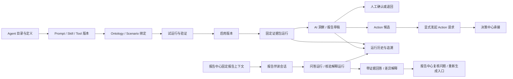
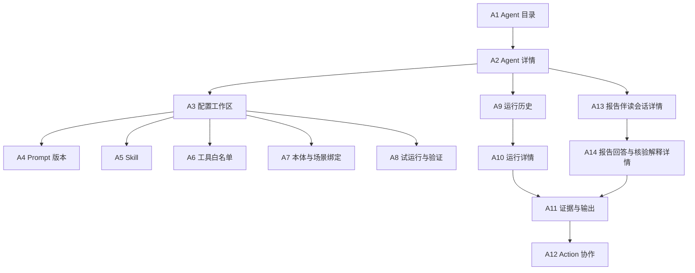

# 新项目功能设计：阶段 5 Agent 应用

> 版本：v0.1  
> 文档状态：主体设计及“报告伴读与数据核验助手”增量设计完成并通过本窗口内部自检；用户已于 2026-08-10 全部采纳 AG-Q001—AG-Q009；AG-DE、AG-X 和 CR 仍待外部收敛，内部自检与局部裁决不等于主文档整体评审通过  
> 当前模块：仅 Agent 应用  
> 当前场景顺序：S001 已完成主体设计；一期增加通用“报告伴读与数据核验助手”；S002、S003 等待用户资料；S004 仍只设计可复用报告 Agent 机制和待接入位置  
> 一期账号：单一演示账号，不建设复杂角色、审批和权限治理  
> 交付性质：功能设计；不包含 Agent 代码、系统提示词正文、API、模型部署、数据库、技术架构或 HTML 原型  
> 上游状态：数据工程仍在功能设计与原型评审中；`[待数据工程确认][AG-DE-001]`—`[待数据工程确认][AG-DE-010]` 覆盖本文所有数据资产、数据版本、质量、数据截至时间、消费就绪、刷新、失败回退、历史可访问/可复现和报告快照—当前数据比较内容

## 0. 结论摘要与阅读约定

### 0.1 一句话定位

Agent 应用是平台中“受控生成与协作”的产品模块：它把已经批准的报告/洞察/伴读 Agent 定义、系统提示词版本、Skill、工具白名单、本体绑定和场景绑定组合为可追溯的 Agent 版本，基于一次固定生成证据包形成结构化 AI 洞察、报告伴读回答、确定性核验结果解释或 Agent 报告草稿，并在用户明确操作后发起 Action 请求；它不把 LLM 作为数据源、正式计算层、规则引擎、报告自动修改者、报告发布者或行动执行者。

### 0.2 本文权威边界

1. D021：LLM 只解释固定证据，不生成正式 Metric/Rule 结果，不直接读取原始工作簿或未治理数据。
2. D022：智能问数拥有问数 Agent；Agent 应用拥有报告/洞察 Agent 的定义、系统提示词、Skill、工具白名单和运行记录；报告中心拥有报告定义、草稿复核和正式产物。
3. D023：场景清单由平台公共层维护；Agent 应用只保存场景引用和自身绑定状态。
4. D024：S002—S004 均为一期最终必做，但当前按业务场景资料只完成 S001 主体设计；本次增加的是跨报告复用的伴读/核验解释能力，不代表 S004 业务内容已就绪。未知场景不得用虚构 Agent、数据或结论占位。
5. 本文引用本体管理和数据工程草案只用于确定输入、边界和失败合同，不改写其资源、公式、Owner 或内部流程。
6. `[跨模块待定][AG-X-006][AG-X-007]` 一期“报告伴读与数据核验助手”由 Agent 应用拥有配置、Skill、工具权限、会话、运行和生成结果；报告中心拥有侧边界面、报告上下文选择、确定性核验规则与结果、复核问题和重新生成入口。报告中心只引用 Agent 会话/运行/结果标识，不维护状态副本。

### 0.3 标签

| 标签 | 含义 |
|---|---|
| `[已确认边界]` | 来自已生效 D021—D024 或平台已确认模块归属 |
| `[本模块设计]` | Agent 应用 v0.1 的待评审功能方案 |
| `[一期最小实现]` | 为一期真实演示必须可操作、可失败、可恢复、可追溯的能力 |
| `[后期建设]` | 不进入一期验收门的增强能力 |
| `[用户已裁决]` | 用户已在本窗口明确采纳；待平台总控或相关合同按需登记，不由本文修改其他模块文档 |
| `[待数据工程确认][AG-DE-nnn]` | 涉及数据工程尚未最终确认的合同；详见第 19.1 节 |
| `[跨模块待定][AG-X-nnn]` | 非数据工程的跨模块 Owner、入口或状态合同待总控裁决；详见第 19.2 节 |

### 0.4 上游材料与演示数据使用结论

- `[待数据工程确认][AG-DE-001]` 平台总控、本体草案和数据工程草案的当前方向是：Agent 应用只消费权威绑定下的 Published 本体资源和固定生成证据包，并产生 AI 洞察、报告草稿或 Action Type 引用；不得复制 Metric 公式、Rule 阈值、机构归因算法或其他模块运行状态。
- 指定融资演示工作簿包含融资明细、单位—负责人映射、三家 Rule 演示样例、组合问数样例和机构归因样例，足以证明 S001 存在“解释正式融资证据并协作发起 Action”的明确用途。
- 工作簿及其说明页不是 Agent 的运行数据源；工作簿中的公式、推荐阈值、问数样例和样例答案不进入系统提示词、Skill 或工具参数。
- `[待数据工程确认][AG-DE-002]` 工作簿未提供权威数据截至时间，Agent 应用只能显示生成证据包中由权威链路提供的时点，不能用文件生成日、上传时间或 Agent 生成时间替代。
- 报告中心最新设计中的 RC-X-009/RC-X-010 推荐按“报告页面与确定性核验归报告中心、Agent 资源与运行归 Agent 应用、稳定语义历史定位归本体管理、`[待数据工程确认][AG-DE-009][AG-DE-010]` 可信度/可复现元数据归数据工程”拆责；本体管理 CR-ON-005/006 与数据工程 CR-DE-004/005/006 均支持该方向，但在平台总控登记前继续标为跨模块待定或待数据工程确认。
- `[待数据工程确认][AG-DE-009]` “报告冻结证据可核对”“历史数据版本可定位/可访问”“具备重放条件”“已重放且一致”和“端到端同口径复现”是不同事实；Agent 只能解释已提供状态，不得把其中任一项改写成另一项。

## 1. 产品定位、范围与禁止越界

### 1.1 Agent 应用解决的用户任务

| 用户任务 | Agent 应用提供的结果 | 成功判据 |
|---|---|---|
| 定义一个受控的洞察或报告 Agent | 可版本化的 Agent 定义及其 Prompt、Skill、工具、本体和场景绑定 | 不在 Prompt/Skill 中复制口径；资源关系可追溯 |
| 在启用前证明 Agent 可用 | 使用固定测试证据包完成试运行、输出校验和业务样例验证 | 测试证据、失败原因、修正版本和结论均可查看 |
| 发起一次生产运行 | 创建独立运行记录，固定输入证据和全部配置版本 | 运行中不随配置或证据变化；取消、失败和重试可判断 |
| 理解 Agent 使用了什么 | 查看证据包目录、引用项、版本、覆盖和缺失 | 每个事实性输出能回到证据项；无证据内容被拒绝或标缺失 |
| 使用 AI 洞察辅助判断 | 获得结构化、带证据、时间、人工确认状态和 `[待数据工程确认][AG-DE-004]` 陈旧状态的洞察 | 洞察不冒充正式事实或已确认决策 |
| 获得报告草稿 | 按报告中心提供的报告定义与章节合同生成结构化草稿 | 缺失章节不编造；草稿可移交并保留来源差异 |
| 伴读一份固定报告 | 对报告全文、章节或选中文字/数值/单元格/图表提问，获得带稳定锚点和证据的回答 | 默认不越出报告固定证据包；每次回答可追到会话、运行、报告版本和证据 |
| 理解报告结论与核验差异 | 解释报告结论、Metric 口径、Rule 命中、证据来源及报告中心提供的确定性核验结果 | LLM 不重算 Metric/Rule、不改写确定性四态；证据不足或无权时明确受限 |
| 协作处理报告问题 | 形成“建议创建复核问题”或“建议请求重新生成”的结构化建议 | 实际问题记录和重新生成入口归报告中心；Agent 不修改、确认或发布报告 |
| 从洞察协作发起行动 | 发现获准 Action Type，查看拟提交证据并显式发起请求 | Agent 不确认决策、不创建待办、不绕过决策中心 |
| 追查问题或复现结果 | 从输出回到运行、证据、配置和各资源精确版本 | 历史记录不可被后续修改原地覆盖 |

### 1.2 本模块拥有、引用与不拥有

| 边界 | 资源/责任 | Agent 应用承担 | 明确不承担 |
|---|---|---|---|
| 拥有 | 报告/洞察 Agent 定义及版本 | 目的、输入/输出类型、边界、状态、版本和历史 | 不拥有问数 Agent |
| 拥有 | Agent 系统提示词及版本 | 保存正文、元数据、变更说明、版本和绑定；本文不写正文 | 不存 Metric 公式、Rule 阈值、数据清洗逻辑 |
| 拥有 | Agent Skill 及版本 | 任务步骤、证据要求、输出映射、失败规则和适用场景 | 不替代本体业务定义或报告定义 |
| 拥有 | 工具白名单及版本 | 工具用途、允许动作、资源范围、确认要求和禁止项 | 不开放任意代码、数据库、原始数据或越权工具 |
| 拥有 | Agent 本体绑定与场景绑定 | 保存获准本体资源引用、兼容约束和平台场景编号引用 | 不创建或修改 Object、Metric、Rule、Action Type；不复制场景清单 |
| 拥有 | Agent 发布版本、试运行、验证和运行记录 | 固定完整版本组合、输入、状态、错误、输出和追溯 | 不拥有报告复核流程或决策中心运行状态 |
| 拥有 | AI 洞察及 Agent 报告草稿生成记录 | 结构化内容、引用、生成时间、确认/退回和 `[待数据工程确认][AG-DE-004]` 陈旧标记 | 不把草稿变成正式报告或已确认业务事实 |
| 拥有 | 报告伴读 Agent、会话、运行和生成结果 | 维护助手配置、Skill、工具权限、会话、回答、核验差异解释、版本和历史 | `[跨模块待定][AG-X-006]` 不拥有报告中心侧边界面、报告上下文选择、复核问题或重新生成入口 |
| 引用 | Published 本体资源和权威消费绑定 | 只读发现和验证获准资源；运行固定精确引用 | `[跨模块待定][AG-X-001]` 不决定 Metric/Rule/Action Type 最终 Owner |
| 引用 | 固定生成证据包 | 校验并读取包内获准证据 | `[跨模块待定][AG-X-004]` 不替报告中心拥有报告证据包或报告定义 |
| 引用 | 报告版本、稳定锚点及确定性核验结果 | 固定输入引用并解释，不复制外部权威状态 | `[跨模块待定][AG-X-006][AG-X-007]` 不维护报告正文/锚点、四态核验结果或复核状态副本 |
| 发起 | Action 请求 | 用户显式确认后提交请求并记录回执链接 | `[跨模块待定][AG-X-002]` 不确认提醒、不创建负责人待办、不维护决策状态 |

### 1.3 一期与后期

| 阶段 | 范围 |
|---|---|
| `[一期最小实现]` | 单账号；Agent 目录；S001 融资洞察与行动协作 Agent；通用报告伴读与数据核验助手；可复用报告草稿运行机制；Prompt/Skill/工具/本体/场景绑定版本；草稿—试运行—验证—启用—停用—历史；固定证据包读取；伴读会话；运行历史；AI 洞察/伴读回答/核验解释；报告草稿合同；显式 Action 请求；失败恢复；S004 诚实待接入位置 |
| `[后期建设]` | 多账号角色与审批、Agent 市场、跨团队复用治理、批量发布、复杂多 Agent 编排、长期计划任务、自主行动、动态工具发现、个性化记忆、在线模型策略、生产级成本配额和高级评测运营 |

### 1.4 一期明确不做

- 不拥有问数 Agent、问数会话、自然语言问答页面或组合指标计算。
- `[待数据工程确认][AG-DE-001]` 不采集、清洗、发布数据资产；不直接读取原始工作簿、原始快照或数据资产业务明细。
- 不创建、修改或另存 Object、Property、Link、Metric、Rule、Action Type 的定义和口径。
- 不拥有决策提醒、人工确认、负责人待办或其状态机。
- 不拥有仪表盘布局、报告定义、报告复核状态和正式报告产物。
- `[跨模块待定][AG-X-006]` 不拥有报告助手侧边页签、报告/章节/锚点选择、确定性核验规则与四态结果、复核问题或重新生成入口；这些由报告中心维护，Agent 应用只维护自身会话、运行和生成结果。
- 不写系统提示词正文、Agent 代码、API、数据库、模型部署、技术架构或 HTML 原型。
- 不以静态成功页、写死结果、隐藏引用或未运行的配置记录冒充 Agent 可用。

## 2. 一期能力地图与模块闭环

### 2.1 能力地图



### 2.2 一期最小闭环

1. 用户创建或打开 Agent 草稿，配置用途和结构化输出类型。
2. 绑定系统提示词版本、Skill 版本、工具白名单版本、获准本体资源和 S001 场景编号。
3. 用固定测试证据包试运行，查看输入证据、工具调用摘要、输出和校验结果。
4. 完成业务样例验证后启用一个精确 Agent 发布版本；旧版本保留。
5. 发起生产运行时固定 Agent 发布版本和证据包；`[待数据工程确认][AG-DE-001]` `[待数据工程确认][AG-DE-002]` 同时固定权威语义/数据引用和数据截至时间。
6. 输出 AI 洞察或报告草稿；所有事实性陈述带证据引用，缺失内容进入缺口清单。
7. 用户可确认洞察可用、退回修订，或从获准 Action 候选显式发起请求。
8. `[跨模块待定][AG-X-002]` 决策中心承接 Action 请求；Agent 应用只记录请求回执与跳转，不在本模块完成决策确认或待办。
9. `[跨模块待定][AG-X-006][AG-X-007]` 报告中心可把固定报告/草稿版本、稳定锚点、证据包、Published 语义上下文、权限结果和 `[待数据工程确认][AG-DE-009]` 数据可信度/可复现摘要交给报告伴读助手；Agent 应用建立会话并执行问答或核验解释运行，报告中心仅引用返回标识和权威状态。
10. `[待数据工程确认][AG-DE-010]` 只有用户在报告中心显式选择“与当前数据比较”时，才形成独立的当前比较上下文和关联运行；它与报告生成快照并列，不替换原会话事实根或旧报告。

## 3. 核心资源模型与版本关系

### 3.1 资源总表

| 资源 | 稳定身份 | 版本是否不可变 | 一期必填内容 |
|---|---|---:|---|
| Agent Definition | Agent 标识 | 发布版本不可变，草稿可继续编辑 | 名称、用途、Agent 类型、输入/输出合同、禁止事项、Owner 说明、状态 |
| System Prompt Version | Prompt 标识 + 版本 | 是 | 适用 Agent 类型、语言、任务边界、输出结构、证据/禁止行为摘要、变更说明；正文只在产品中维护 |
| Skill Version | Skill 标识 + 版本 | 是 | 业务任务、适用输入、步骤说明、证据要求、输出映射、失败/停止条件、Action 边界 |
| Tool Allowlist Version | 白名单标识 + 版本 | 是 | 工具名称、用途、允许动作、资源范围、是否需用户确认、禁止行为 |
| Ontology Binding Version | 绑定标识 + 版本 | 是 | 本体标识、允许的 Published 资源标识、兼容约束、禁止资源；`[待数据工程确认][AG-DE-001]` 运行时解析并固定权威双版本 |
| Scenario Binding Version | 绑定标识 + 版本 | 是 | 平台场景编号、Agent 在场景中的用途、允许输出、入口状态；不复制场景名称之外的主清单内容 |
| Agent Release Version | Agent 标识 + 发布版本 | 是 | 以上各精确版本、输出校验规则、启用说明、验证结论 |
| Generation Evidence Package | 证据包标识 + 包版本 | 是 | 发起方、范围、证据项、Published 资源引用；`[待数据工程确认][AG-DE-001]`—`[待数据工程确认][AG-DE-004]` 的版本、时点、质量和新鲜度信息 |
| Agent Run | 运行标识 + 尝试号 | 是 | 请求来源、Agent 发布版本、证据包、状态、开始/结束/取消时间、工具摘要、错误、输出标识 |
| AI Insight | 洞察标识 + 生成版本 | 是 | 结构化洞察项、证据、生成时间、人工确认状态；`[待数据工程确认][AG-DE-004]` 的新鲜度/陈旧状态 |
| Agent Report Draft | 草稿标识 + 生成版本 | 是 | 报告定义版本、章节输出、引用、缺失内容、置信说明、移交状态 |
| Action Request Handoff | 移交标识 | 是 | Action Type 引用、目标对象、证据引用、用户确认、请求回执；不复制决策运行记录 |
| Report Reading Session | 会话标识 | 会话事件不可变；可派生新会话 | 报告/草稿身份、精确内容版本、Agent 发布版本、上下文绑定历史、会话状态和最后活动时间 |
| Report Context Binding | 会话标识 + 上下文版本 | 是 | 报告/草稿精确版本、报告定义/模板版本、证据包版本、稳定锚点范围、语义版本、权限结果；`[待数据工程确认][AG-DE-009][AG-DE-010]` 数据可信度快照/比较上下文引用 |
| Report Copilot Answer | 回答标识 + 生成版本 | 是 | 问题、范围、回答、证据、锚点、语义版本、`[待数据工程确认][AG-DE-009]` 数据版本/时点/质量/新鲜度、生成时间、确认和限制状态 |
| Verification Explanation Result | 解释结果标识 + 生成版本 | 是 | 报告中心确定性核验运行/结果引用、四态原值、LLM 差异解释、影响和建议；不得覆盖原四态 |

### 3.2 Agent 类型

| 类型 | 一期用途 | 输入 | 输出 | 一期实例 |
|---|---|---|---|---|
| 洞察 Agent | 将正式证据组织为结构化观察、解释、建议关注点和 Action 候选 | 固定洞察证据包 | AI Insight | S001“融资洞察与行动协作 Agent” |
| 报告草稿 Agent | 按报告定义提供的章节合同组织证据并生成待复核草稿 | 报告生成请求、报告定义版本、固定报告证据包 | Agent Report Draft | 只建设可复用机制；S004 暂不创建具体 Agent |
| 报告伴读/核验解释 Agent | 对固定报告上下文回答问题、解释语义与证据、汇总并解释报告中心的确定性核验结果 | 报告/草稿精确版本、稳定锚点、固定证据包、确定性核验结果引用 | Report Copilot Answer / Verification Explanation Result | 一期“报告伴读与数据核验助手”；不依赖虚构 S004 章节 |

### 3.3 版本聚合规则

一个 Agent 发布版本必须固定以下七元组：

```text
Agent Definition Version
+ System Prompt Version
+ Skill Version 集合
+ Tool Allowlist Version
+ Ontology Binding Version
+ Scenario Binding Version
+ Output Contract Version
```

- 修改任一成员均产生新的 Agent 草稿版本；当前已启用版本继续运行，不被原地改写。
- 试运行和验证必须记录所用完整七元组；“Prompt v2”或“Agent 最新版”不能单独作为可复现标识。
- 生产运行开始后固定一个 Agent 发布版本；运行中发生配置更新不影响本次运行。
- `[待数据工程确认][AG-DE-001]` 同一 Agent 发布版本可以在兼容前提下运行于不同的权威数据版本，但每次运行必须固定实际使用的精确组合，不能只写“最新数据”。
- 重新启用历史发布版本前必须重新执行本体兼容与工具可用性检查；`[待数据工程确认][AG-DE-003]` 同时检查当前质量摘要是否满足该版本的输入门。
- 报告伴读每次提问还必须固定 `Agent Release Version + Report Context Binding Version + 本轮稳定锚点快照`；同一会话不能用“当前报告”或“最新证据包”作为可复现标识。
- `[跨模块待定][AG-X-007]` 报告版本或证据包变化时形成新的上下文版本并默认派生新会话；旧会话只读保留。`[待数据工程确认][AG-DE-010]` 数据更新不改写报告快照，只使“与当前事实比较”轴进入未比较或已陈旧状态。

## 4. Agent、Prompt、Skill、Tool 与绑定功能合同

### 4.1 Agent 定义

Agent 定义页必须回答：这个 Agent 为谁完成什么业务任务、接受什么类型的固定证据、产生什么结构化结果、不得做什么、可使用哪些 Skill/工具/本体资源、在哪些平台场景可用、怎样判断输出合格。

一期字段：

- 中文名称、稳定标识、Agent 类型、业务用途、适用对象范围和明确非用途；
- 输入合同、输出合同、默认语言、允许的最大证据范围说明；
- Prompt、Skill、工具白名单、本体绑定、场景绑定的当前草稿版本；
- 试运行样例、验证清单、当前启用版本、停用原因和历史；
- 输出不合格、证据缺失、越界请求、Action 请求需人工操作等固定失败规则。

### 4.2 系统提示词版本

本文不提供提示词正文。产品功能需支持：

- 新建草稿、保存、比较版本、填写变更原因、绑定到 Agent 草稿；
- 结构化登记任务边界、证据使用要求、引用要求、禁止行为、输出格式和拒答/停止条件；
- 检查是否包含疑似 Metric 公式、Rule 阈值、银行排序、数据清洗或未授权工具指令；命中时阻断验证并引导引用本体资源；
- 已被 Agent 发布版本引用的 Prompt 版本只读；修改必须产生新版本并重验。

### 4.3 Skill 版本

Skill 是“如何使用获准证据完成一类任务”的业务能力说明，不是代码、公式、查询语句或提示词副本。一期支持：

| Skill 合同 | 必须说明 |
|---|---|
| 任务 | 例如“解释已发布 Rule 证据”“把证据映射到洞察结构”“准备 Action 请求候选” |
| 输入条件 | 所需证据类型、必要本体资源、允许对象范围 |
| 步骤 | 发现证据、核对范围、组织解释、引用、检查缺口、形成输出；不得写正式计算逻辑 |
| 输出映射 | 输出到 AI Insight 或报告草稿的哪些字段 |
| 停止条件 | 证据不足、引用失效、`[待数据工程确认][AG-DE-003]` 质量阻断、本体不兼容、工具越界、输出无法校验 |
| Action 边界 | 只形成候选；用户显式操作后才能提交请求 |

S001 一期使用两个可复用 Skill：

1. `融资证据解释`：解释证据包中已给出的融资 Metric、Rule 命中、机构归因和关联借据，不重新计算。
2. `融资行动协作`：把已给出的 Action Type、目标主体和证据组织为可供用户核对的请求候选，不执行确认或待办创建。

报告伴读与数据核验助手一期使用三个可复用 Skill：

1. `报告证据伴读`：在报告全文、当前章节或稳定锚点范围内回答问题，回指报告位置与证据包，不把正文自身当成唯一证据。
2. `语义口径与 Rule 解释`：读取固定证据包中稳定语义资源标识和报告生成时精确 Published 版本，解释 Metric 定义、单位、范围及已给出的 Rule 命中；不重算指标、不重评 Rule。
3. `确定性核验差异解释`：读取报告中心提供的核验运行和结果引用，保留“通过/警告/失败/无法核验”原值，汇总差异、影响和业务可读建议；不改写确定性判定，不创建复核问题或重新生成请求。

三个 Skill 均只规定证据使用、解释结构、限制披露和停止条件；本文不写系统提示词正文、公式、阈值、查询语句或报告章节内容。

### 4.4 工具白名单

| 工具能力 | 一期允许用途 | 需要的门 | 明确禁止 |
|---|---|---|---|
| 证据包读取器 | 读取本次固定包的目录、证据项和缺口 | 包已冻结且校验通过 | 读取包外内容、改写证据 |
| Published 本体资源阅读器 | 读取包中精确引用的对象定义、Metric/Rule/Action Type 说明和证据快照 | 资源在本体绑定白名单内 | 创建/修改资源，查询未引用原始数据 |
| 证据引用校验器 | 检查输出引用是否存在、范围是否匹配 | 输出校验阶段 | 自动补造引用 |
| 报告草稿移交器 | 将完成草稿和追溯清单交付报告中心 | `[跨模块待定][AG-X-004]` 请求和接收合同有效 | 标记报告已复核或正式发布 |
| Action Type 发现器 | 在绑定范围内列出适用 Action Type 及前置说明 | `[跨模块待定][AG-X-001]` 资源 Owner 和发布状态明确 | 建立临时 Action、改变阈值 |
| Action 请求提交器 | 用户在独立确认页显式提交已核对候选 | `[跨模块待定][AG-X-002]` 决策中心合同有效；必须有人机确认 | Agent 在生成过程中自动提交、人工确认提醒、创建待办 |
| 报告固定上下文读取器 | 读取报告中心提供的报告/草稿版本、报告定义/模板、稳定锚点和固定证据包引用 | `[跨模块待定][AG-X-007]` 上下文绑定完整且当前用户获准 | 自由搜索其他报告、静默切到新版本、读取报告包外企业数据 |
| 确定性核验结果读取器 | 读取报告中心拥有的核验运行、检查项、四态结果和证据引用 | `[跨模块待定][AG-X-006]` 返回稳定运行/结果标识和权威状态 | 创建或修改核验规则、重跑正式计算、覆盖四态结果 |
| 报告助手结果回传器 | 把会话/运行/结果标识、状态、回答/解释和限制返回报告中心引用 | 结果已通过 Agent 输出校验 | 创建复核问题、修改报告正文、确认/发布报告、直接创建重新生成请求 |

一期白名单默认拒绝：互联网搜索、任意文件读取、原始工作簿、原始快照、`[待数据工程确认][AG-DE-001]` 数据资产业务明细直读、报告固定证据包之外的企业数据、任意代码、数据库、模型训练、Prompt 自修改、本体写入、报告正文修改/确认/发布、复核问题写入、重新生成请求写入、决策确认和待办写入。

### 4.5 本体绑定

- 绑定的是获准的本体、Object/Property/Link、Metric、Rule 和 Action Type 稳定资源标识及其用途，不是源字段清单。
- 只允许 Published 资源；草稿、已弃用且禁止新消费、消费隔离或未授权资源不可进入新运行。
- `[待数据工程确认][AG-DE-001]` 运行时从权威消费绑定解析精确 Published 语义版本与可消费数据版本并固定到证据包；Agent 应用不维护冲突指针。
- 绑定校验显示：缺失资源、类型变化、已弃用、版本不兼容、超出工具白名单和未验证范围。
- `[跨模块待定][AG-X-001]` Metric、Rule、Action Type 的最终 Owner 未裁决前，本文按“本体管理发布、Agent 应用只读引用”作为临时基线。
- `[跨模块待定][AG-X-007]` 报告伴读历史上下文必须按“报告精确版本/稳定锚点/证据包 → 稳定语义资源标识 + 报告生成时精确 Published 版本”解析；本体返回历史解析和权威 Published 事实，Agent 不使用当前定义替代旧报告定义，也不让本体生成报告差异结论。

### 4.6 场景绑定

- Agent 应用只保存 `S001` 等稳定场景编号、Agent 用途、允许输入/输出和绑定状态；场景名称、导航、阶段和其他模块资源仍以平台场景清单为准。
- 同一 Agent 可在后期绑定多个有相同任务和证据合同的场景，但每个场景必须独立验证，不能因 S001 通过而自动宣告 S002—S004 可用。
- 平台场景清单标记场景未就绪、已暂停或缺资源时，Agent 应用显示原因并阻止生产运行；试运行是否允许由验证证据范围决定。
- 报告伴读与数据核验助手是跨报告复用能力，不创建新的平台场景编号；每次会话继承当前报告引用的场景编号，若报告尚未绑定场景则仅按报告合同工作并显示“场景未提供”，不得自行归类为 S004。

## 5. Agent 生命周期、启停与历史

### 5.1 状态模型

| 状态 | 进入条件 | 主动作 | 不允许 | 退出条件 |
|---|---|---|---|---|
| 草稿 | 新建或从历史版本派生 | 编辑定义与绑定、保存、删除未发布草稿 | 生产运行、正式移交、Action 请求 | 必填项齐全后进入可试运行 |
| 可试运行 | 七元组完整，基础校验通过 | 选择固定测试证据包、试运行 | 启用、将测试输出当正式结果 | 至少一次试运行后进入验证中，或修改回草稿 |
| 验证中 | 已选择验证用例和固定版本 | 执行用例、查看差异、记录结论 | 修改被冻结版本、生产运行 | 全部必需用例通过进入验证通过；失败进入验证失败 |
| 验证失败 | 任一必需用例失败 | 查看原因、从失败版本派生修订草稿 | 启用失败版本 | 修订并重新验证 |
| 验证通过 | 必需用例通过且兼容性检查有效 | 启用 | 原地修改 | 启用或因依赖变化回到需重验 |
| 已启用 | 用户明确启用一个验证通过版本 | 发起生产运行、查看历史、停用 | 修改当前发布版本 | 停用、新版本启用或依赖失效 |
| 已停用 | 用户主动停用或系统因硬性不兼容阻止新运行 | 查看历史、派生新草稿、符合条件时重新启用 | 新生产运行、隐瞒停用原因 | 重新验证并启用历史/新版本 |
| 历史版本 | 已被新版本替代或停用 | 只读比较、查看运行、派生草稿 | 原地编辑、删除追溯 | 不退出；可在重验后重新启用其精确版本 |

### 5.2 单账号启用规则

- 一期不建立提交者、审批者、发布者角色；同一演示账号可完成编辑、验证和启用。
- 这不等于无门禁：未通过固定用例、引用校验、输出结构校验、工具白名单校验和本体兼容校验的版本不可启用。
- 每个 `Agent + 场景` 同一时刻最多一个默认启用版本；启用新版本不删除旧版本或旧运行。
- 停用只阻止新运行，不取消已完成输出、不删除历史；运行中的实例由用户选择继续或取消，并记录选择。
- `[待数据工程确认][AG-DE-003]`—`[待数据工程确认][AG-DE-006]` 当质量、刷新或上一可信服务状态改变时，是否自动阻止新运行按第 11 章和依赖对账结果执行，不由 Agent 应用自行推断。

### 5.3 版本比较

版本比较按资源分栏显示：Agent 定义、Prompt、Skill、工具、本体绑定、场景绑定和输出合同；对每项显示新增、删除、替换、原因、受影响验证用例和历史运行数量。不得把 Prompt 文本差异与本体口径变化混成一个“配置已修改”。

### 5.4 报告伴读会话生命周期

Report Reading Session 由 Agent 应用拥有，报告中心只保存会话标识并在侧边界面重读权威状态。会话状态与 Agent 发布状态、单次运行状态、报告复核状态分开：

| 会话状态 | 进入条件 | 允许行为 | 禁止行为 / 恢复 |
|---|---|---|---|
| 活跃 | 固定报告/草稿版本、证据包、Agent 发布版本和初始上下文绑定均有效 | 在同一报告版本内切换章节或稳定锚点并继续提问；每轮固定锚点快照 | 不用“当前选择”覆盖历史轮次 |
| 上下文陈旧 | 报告/草稿版本已切换、同版本证据包关系冲突，或绑定资源已失效 | 查看历史；从新精确版本派生新会话 | 不在原会话继续生成看似针对新版本的回答 |
| 当前比较陈旧 | `[待数据工程确认][AG-DE-010]` 先前显式当前比较所用当前状态摘要或权威组合后来变化 | 继续解释原报告快照；需要时显式发起新的独立比较 | 不后台刷新旧比较结果，不把原快照标成已被当前数据改写 |
| 受限 | 权限不足、关键证据缺失或历史语义无法定位，但仍可显示获准部分 | 在获准范围提问、查看限制、条件满足后从原会话创建新运行 | 不泄露被拒绝值、不用当前语义或相似数据补齐 |
| 已关闭 | 用户关闭，或报告中心上下文已结束且不再接受新问题 | 只读查看、按原上下文派生新会话 | 不删除会话和运行历史 |

一期同一报告精确版本可有一个持续会话或多个独立会话；无论哪种，切换报告/草稿精确版本均默认新建会话分支。报告中心可以恢复原会话标识，但不能在自身保存消息、运行或状态副本。

## 6. 生成证据包读取边界

### 6.1 输入原则

`[已确认边界]` 运行只能使用一次固定生成证据包。Agent 应用不让 LLM 自行寻找数据、不把“最新”理解为任意最近文件、不在运行中追加新证据，也不把模型已有知识当项目事实。

### 6.2 证据包最低目录

| 信息组 | 最低内容 | Agent 应用用途 |
|---|---|---|
| 请求上下文 | 证据包标识/版本、发起方、场景编号、请求时间、目标对象范围、期望输出类型 | 判断用途和作用域 |
| 报告上下文 | 报告定义版本、章节合同、必填/可选章节；仅报告运行存在 | 按定义组织草稿，不自创章节 |
| 报告伴读身份 | `[跨模块待定][AG-X-007]` 报告编号/产物版本/内容版本或草稿标识/草稿版本、报告定义/模板版本、上下文选择来源 | 固定会话事实根，不跨报告版本拼接 |
| 稳定锚点 | `[跨模块待定][AG-X-007]` 全文、章节、段落、选中文字/数值、单元格或图表的一个或多个稳定锚点 | 确定本轮范围并回指报告位置；锚点快照随每轮保存 |
| 语义引用 | Published 本体版本、Object/Metric/Rule/Action Type 稳定标识、显示名称、证据项引用 | 解释正式语义，不复制公式 |
| 权威数据引用 | `[待数据工程确认][AG-DE-001]` 可消费数据版本与权威绑定标识 | 固定事实版本，不自行选择 |
| 数据时点与覆盖 | `[待数据工程确认][AG-DE-002]` 数据截至时间、对象/时间/字段覆盖、已知缺失 | 输出时点和缺口说明 |
| 质量摘要 | `[待数据工程确认][AG-DE-003]` 状态、适用范围、失败/警告/未知项、最近验证时间 | 决定运行、降级或阻断 |
| 新鲜度摘要 | `[待数据工程确认][AG-DE-004]` 新鲜度结论、判断依据、允许用途和复核点 | 标识新鲜/临近过期/陈旧 |
| 证据项 | 稳定证据项标识、类型、对象范围、显示值/结论、单位、时间、来源资源、允许引用方式 | 支持逐条引用 |
| 缺失清单 | 没有提供但输出合同要求的证据、缺失原因和责任模块 | 生成“缺失内容”，不编造 |
| 冻结信息 | 包冻结时间、内容版本和完整性结论 | 防止运行中输入漂移 |
| 核验结果引用 | `[跨模块待定][AG-X-006]` 报告中心确定性核验运行、检查项、四态结果、结果版本、核验时间和证据引用；仅核验解释运行存在 | 原样保留确定性结论并生成差异解释，不接管规则或四态 |
| 历史可信度 | `[待数据工程确认][AG-DE-009]` 版本绑定摘要与当前状态摘要的精确引用，以及版本定位、内容访问、证据完整、重放能力、重放核验的分维状态 | 诚实说明报告快照核对、源版本重放和端到端复现边界 |

### 6.3 可读与不可读内容

可读：包内获准的 Published 对象说明、正式 Metric 结果、Rule 命中与原因、Action Type 说明、结构化事实快照、`[待数据工程确认][AG-DE-003]` 质量摘要、`[待数据工程确认][AG-DE-004]` 新鲜度摘要、`[待数据工程确认][AG-DE-009]` 历史可信度状态、报告中心提供的稳定锚点和确定性核验结果引用。

不可读：原始工作簿、T002 原始快照、`[待数据工程确认][AG-DE-001]` 未发布数据资产或处理中的候选版本、源字段全表、Prompt 外部粘贴数据、报告固定证据包之外的企业数据、未绑定本体资源、草稿 Metric/Rule/Action、无证据来源的自然语言结论。`[待数据工程确认][AG-DE-010]` 当前数据只可通过报告中心显式比较形成的并列、固定上下文读取，不能由 Agent 静默扩大范围。

### 6.4 输入门

| 检查 | 通过 | 降级 | 阻断 |
|---|---|---|---|
| 包用途 | 场景、Agent 类型和输出匹配 | 可选证据缺失 | 用途不匹配或无发起方 |
| 版本 | `[待数据工程确认][AG-DE-001]` 精确语义/数据组合可验证 | 无 | 版本缺失、混用或不属于权威组合 |
| 时点/覆盖 | `[待数据工程确认][AG-DE-002]` 时点和范围明确 | 非关键覆盖缺失，输出必须列缺口 | 关键范围未知，无法判断陈述适用性 |
| 质量 | `[待数据工程确认][AG-DE-003]` 满足该输出用途 | 允许用途内的警告，输出持续披露 | 失败、未知或超出允许范围 |
| 新鲜度 | `[待数据工程确认][AG-DE-004]` 在用途门内 | 允许陈旧只读草稿并强制标识 | 时效关键用途陈旧且无允许合同 |
| 本体资源 | 全部 Published 且与绑定相容 | 可选资源缺失 | 必需资源不存在、不兼容或被隔离 |
| 引用 | 证据项稳定且可引用 | 个别可选证据不可引用，列入缺失 | 关键结论无法关联证据 |
| 报告身份与锚点 | `[跨模块待定][AG-X-007]` 精确版本与锚点均可定位 | 非关键选区失效时退回章节或全文范围并显式提示 | 版本冲突、锚点属于其他版本或当前范围不可证明 |
| 核验结果 | `[跨模块待定][AG-X-006]` 四态结果及版本可读取 | 个别非关键检查项为“无法核验”，按项解释 | 结果身份冲突、把 LLM 解释误当确定性结果 |
| 历史可复现 | `[待数据工程确认][AG-DE-009]` 各分维状态明确 | 报告冻结证据可核对但源版本未重放时受限解释 | 身份冲突或关键事实未知且问题要求全链路复现结论 |

### 6.5 证据查看器

证据查看器按“目录—证据项—引用位置”三层展示。用户可从输出句子打开对应证据项，再查看所属资源、范围、时点和包内位置；报告伴读结果还可回到精确报告/草稿版本和稳定锚点。不能从查看器跳到原始工作簿或绕过本体读取业务明细。权限不足时只显示被拒绝证据的身份、受限原因和获准下一步，不显示被拒绝值；一期不建设复杂角色配置，但必须消费报告中心返回的允许/拒绝结果。

## 7. Agent 运行功能合同

### 7.1 发起请求

生产运行必须选择：已启用 Agent 版本、场景、输出类型、固定证据包和必要业务参数。报告运行还必须带报告定义版本；S001 洞察运行必须带目标融资主体或集团范围，不能用自由文本扩大证据范围。

发起前摘要显示：

- Agent 发布版本及 Prompt/Skill/工具/本体/场景版本；
- 证据包、对象范围、证据项数量和缺失项；
- `[待数据工程确认][AG-DE-001]` 权威双版本、`[待数据工程确认][AG-DE-002]` 数据截至时间；
- `[待数据工程确认][AG-DE-003]` 质量摘要、`[待数据工程确认][AG-DE-004]` 新鲜度；
- 可调用工具、需人工确认的动作和本次输出不会自动发布/执行的提示。

### 7.2 运行状态

| 状态 | 用户看到 | 允许动作 | 退出条件 |
|---|---|---|---|
| 已创建 | 请求已登记，尚未校验证据 | 取消、查看请求 | 进入输入校验或取消 |
| 校验输入 | 当前检查项、已固定版本 | 取消 | 通过进入排队；失败进入输入不合格 |
| 输入不合格 | 失败项、影响和责任位置 | 更换合格证据包后新建运行 | 当前运行结束，不原地替换输入 |
| 排队 | 排队时间、版本摘要 | 取消 | 开始运行 |
| 运行中 | 当前阶段、开始时间、已用时、已完成工具调用摘要 | 取消；查看已完成只读证据 | 进入输出校验、失败或取消 |
| 输出校验 | 结构、引用、缺失和越界检查 | 取消 | 通过则完成；不通过则输出不合格 |
| 已完成 | 输出、引用、生成时间、确认状态 | 查看、确认/退回、创建重试、Action 协作、报告移交 | 终态 |
| 受限完成 | 已形成安全且有证据的部分回答，但权限、证据或版本限制使部分问题不能回答 | 查看已回答范围、限制、确认/退回、条件满足后创建关联新运行 | 终态；不得把受限部分写成已回答 |
| 失败 | 失败类别、发生阶段、是否产生可用输出、恢复建议 | 按规则重试或修订配置 | 终态 |
| 输出不合格 | 校验失败项和不合格草稿的受限预览 | 修订 Agent 后新运行；符合条件时同版本重试 | 终态，不得确认或移交 |
| 部分完成 | 多项检查或整份报告运行中，部分独立单元已形成合格结果，其他单元失败/受限 | 查看按项状态；条件满足后仅对失败单元发起关联新运行 | 终态；不得把总体状态显示为已完成或自动合并成确定性通过 |
| 取消中 | 已发送取消、可能仍有阶段收尾 | 查看 | 已取消或失败 |
| 已取消 | 取消者、时间、已完成阶段、是否有不可用临时输出 | 创建新运行 | 终态；临时输出不作为正式结果 |

### 7.3 完成条件

运行只有同时满足以下条件才显示“已完成”：输出结构有效；所有事实性陈述均有有效引用；无包外事实；必填缺失清单存在；工具调用均在白名单内；Action 只形成候选；报告草稿未被标记为正式报告；`[待数据工程确认][AG-DE-003]`—`[待数据工程确认][AG-DE-004]` 的质量和新鲜度披露已进入输出。

### 7.4 取消和重试

- 取消不删除运行，不回收已经发出的 Action 请求，不撤回已移交报告草稿；这些情况必须分别提示。
- 默认重试固定原 Agent 发布版本和原证据包，形成新的尝试号并关联原运行；适合临时工具故障。
- 配置、Prompt、Skill、工具、本体绑定或证据包任一变化时必须创建新运行，不得把它称为同一次重试。
- `[待数据工程确认][AG-DE-005]` 数据更新后重新生成使用新证据包和新运行；旧运行保持原样。
- `[待数据工程确认][AG-DE-006]` 若平台继续服务上一可信版本，用户必须在运行前看到“使用上一可信版本”的显著说明；是否允许生产洞察由依赖对账决定。

### 7.5 报告伴读、自动核验和重新生成运行关系

一期必须区分下列三类运行，不以一个“报告助手运行”覆盖：

| 运行/请求 | 权威 Owner | Agent 应用记录 | 关系与边界 |
|---|---|---|---|
| 确定性自动核验运行 | `[跨模块待定][AG-X-006]` 报告中心 | 只保存核验运行/结果标识、结果版本、读取时权威状态和用于解释的输入快照引用 | 报告中心计算并维护检查项和四态；Agent 不重算、不改写、不复制状态机 |
| 问答/核验差异解释运行 | Agent 应用 | 保存 Agent Run、会话、问题/任务范围、Report Context Binding、核验结果引用、回答/解释、限制和尝试链 | 每次固定报告版本、锚点、证据包和 Agent 发布版本；解释运行可关联一个或多个确定性结果 |
| 报告重新生成请求与生成运行 | 请求/入口归报告中心；报告生成 Agent Run 归 Agent 应用 | 保存报告中心重新生成请求标识、触发来源引用和独立报告生成运行；不保存报告中心请求状态副本 | 新请求可关联问答结果、核验结果和复核问题；生成运行使用新的或明确复用的固定证据包，不改变前三者历史 |

用户在报告中心执行“检查当前章节”或“检查整份报告”时，报告中心先形成确定性核验运行；若要求业务可读解释，再发起独立 Agent 核验解释运行。用户执行“标记复核问题”或“请求重新生成”时，报告中心以 Agent 结果标识和确定性结果标识作为来源引用，分别创建报告中心资源；Agent 应用不得代建问题、代改问题状态或代建重新生成请求。

### 7.6 报告伴读运行的完成、受限和恢复

| 情形 | Agent 运行/结果状态 | 最小披露 | 恢复 |
|---|---|---|---|
| 全部证据可用 | 已完成 | 回答/解释、证据、版本、时点、确认状态和无重大限制声明 | 无需恢复；后续问题创建新运行 |
| 权限不足 | 受限完成或输入不合格 | 被限制的证据身份/范围、不能回答的部分、权限不足原因；不显示被拒绝值 | 权限结果变化后创建关联新运行；原受限结果保留 |
| 证据缺失 | 受限完成、部分完成或输入不合格 | 缺失证据、受影响结论/检查项、已回答范围和责任位置 | 报告中心形成新证据包/新上下文后创建新运行，不原地补包 |
| 版本冲突 | 输入不合格 | 冲突的报告/锚点/证据/语义版本和停止点 | `[跨模块待定][AG-X-007]` 修正为一个精确上下文后新建会话或运行 |
| 运行失败 | 失败 | 阶段、是否已有合格独立单元、失败原因和可重试性 | 临时故障固定原输入重试；上下文/配置变化则新运行 |
| 多项任务仅部分成功 | 部分完成 | 每项成功/警告/失败/无法核验/未执行状态和未完成原因 | 只对失败/未执行项发起关联新运行；不得把部分成功写成整份报告通过 |

“受限完成”是结果可用范围标签，不等于确定性核验四态；“部分完成”是 Agent 运行终态，也不改变报告中心按检查项维护的确定性四态。

## 8. AI 洞察结构化输出合同

### 8.1 输出结构

| 字段 | 功能要求 |
|---|---|
| 洞察标识/版本 | 唯一指向本次完成运行，不被确认或退回覆盖 |
| 标题与主题 | 简短表达证据支持的观察，不使用未经正式 Rule 支持的风险等级 |
| 适用范围 | 集团、一个或明确的多个融资主体；必须与证据包一致 |
| 核心观察 | 只陈述证据包已给出的 Metric、Rule、机构归因或事实 |
| 解释 | 说明正式证据之间的业务关系；不得创建新口径或阈值 |
| 证据引用 | 每条事实性陈述至少一个证据项；支持从句子回到证据查看器 |
| 关注点/建议下一步 | 以“建议核对、建议协商、建议发起已发布 Action”等协作语言表达，不冒充已批准决策 |
| Action 候选 | 可选；仅引用绑定范围内已发布 Action Type，并标记“尚未发起” |
| 缺失与限制 | 证据缺失、覆盖限制、未知值和不允许推断的事项 |
| 置信说明 | 使用“证据充分/部分充分/不足”及原因，不输出无校准依据的百分比分数 |
| 生成信息 | Agent/Prompt/Skill/工具/本体/证据包/运行版本、生成时间 |
| 时点与新鲜度 | `[待数据工程确认][AG-DE-002]` 数据截至时间；`[待数据工程确认][AG-DE-004]` 新鲜度和陈旧原因 |
| 人工确认状态 | 未确认、已确认可用、已退回；确认只表示该洞察可供展示/继续协作，不等于业务事实获批或 Action 已确认 |

### 8.2 人工确认与退回

- “已确认可用”需记录操作者、时间和简短说明；一期为同一演示账号。
- 退回必须选择原因：证据引用问题、解释不准确、缺失未披露、建议越界、语言/结构问题或其他说明。
- 退回不修改原输出；修正 Prompt/Skill/绑定后创建新 Agent 版本或按允许规则新运行。
- `[跨模块待定][AG-X-005]` Agent 应用的“已确认可用”与报告中心/仪表盘的“已发布展示”必须分开；在总控裁决前，确认后的洞察仍不自动进入正式仪表盘或报告。

### 8.3 `[待数据工程确认][AG-DE-004]`—`[待数据工程确认][AG-DE-006]` 数据更新后的陈旧处理

- `[待数据工程确认][AG-DE-005]` 当权威消费组合发生变化或相关质量摘要发生实质变化时，系统定位受影响的历史洞察。
- `[待数据工程确认][AG-DE-004]` 旧洞察保留原文并标记“陈旧”，显示原数据截至时间、原版本、检测到变化的时间和建议重新生成；不得原地刷新数字或删除原引用。
- `[待数据工程确认][AG-DE-006]` 新候选失败、平台继续上一可信版本时，已基于该上一可信版本生成且仍在允许时效内的洞察可保留，但必须显示失败/陈旧提示；超出允许合同时阻止新确认和 Action 发起。
- 重新生成产生新洞察版本并建立“替代自”关系；人工确认不自动从旧洞察继承。

### 8.4 报告伴读回答最小输出合同

Report Copilot Answer 是 Agent 应用拥有的生成结果，不是报告正文、确定性核验结果或已确认业务事实。每次回答至少返回：

| 信息组 | 一期最小返回内容 |
|---|---|
| 回答 | 直接回答当前问题；区分确定性事实、LLM 解释和建议；说明基于全文、章节还是具体选区 |
| 报告位置与范围 | 报告/草稿标识、精确内容/草稿版本、一个或多个稳定锚点、锚点类型和本轮选择范围 |
| 证据 | 证据包标识/版本、证据项标识、Object/Property/Link/Metric/Rule 引用及获准打开入口；不能只引用报告自然语言 |
| 语义版本 | 稳定语义资源标识、报告生成时精确 Published 本体版本、单位/范围/有效期；历史资源无法定位时明确受限 |
| 数据版本、时点与质量 | `[待数据工程确认][AG-DE-002][AG-DE-003][AG-DE-004][AG-DE-009]` 精确数据版本、T008/数据截至时间、质量状态与范围、新鲜度/陈旧状态、消费就绪、版本定位/内容访问/证据完整/重放状态；未知必须写“未知”，不得省略 |
| 生成信息 | 回答标识/版本、会话标识、Agent 运行标识/尝试、Agent 发布版本和生成时间 |
| 确认状态 | 未确认、已确认可作复核参考、已退回；仅代表该回答的人工使用状态，不等于报告结论、确定性核验或正式报告已确认 |
| 限制与下一步 | 证据不足、权限不足、版本冲突、`[待数据工程确认][AG-DE-003][AG-DE-004][AG-DE-009]` 数据陈旧/质量异常/历史不可重放的受限范围、不能下结论原因和获准下一步 |

针对“解释指标口径”时，回答引用 Metric 的 Published 定义、单位、范围和有效期，不复述或复制公式；针对“解释 Rule 命中”时，引用证据包已给出的 Rule 版本、命中分支和证据，不重新评估；针对“证据来自哪里”时，只显示当前用户获准的追溯层级。

### 8.5 确定性核验解释输出合同

Verification Explanation Result 必须把报告中心原始确定性结果与 LLM 解释分栏保存：

| 信息组 | 一期要求 |
|---|---|
| 确定性结果引用 | `[跨模块待定][AG-X-006]` 核验运行/结果标识、结果版本、检查项、报告版本、稳定锚点、原始四态、核验时间和证据引用；原值不可编辑 |
| 汇总 | 按通过、警告、失败、无法核验汇总检查项数量和影响范围；Agent 不重新归类 |
| 差异解释 | 用业务语言解释已给差异、版本/单位/范围关系和可能影响；不得重算正式数值或 Rule |
| 建议 | 可输出“建议打开证据”“建议创建复核问题”“建议请求重新生成”；实际动作由报告中心入口执行 |
| 限制 | 权限、证据、版本、`[待数据工程确认][AG-DE-003][AG-DE-004][AG-DE-009]` 质量/新鲜度/可复现限制，以及哪些检查项未获得可靠解释 |
| 追溯 | 会话、Agent 运行、解释结果、报告/证据/语义版本；`[待数据工程确认][AG-DE-009]` 数据可信度摘要精确引用 |

确定性核验为“无法核验”时，Agent 只能解释无法核验的原因与恢复路径；不得根据报告文字、常识或当前数据补判通过。`[待数据工程确认][AG-DE-009]` 历史源版本不可重放但报告冻结证据完整时，应分别说明“固定快照可核对”和“源版本/端到端重放未证实”。

### 8.6 `[待数据工程确认][AG-DE-005][AG-DE-009][AG-DE-010]` 报告、证据包与数据变化后的陈旧规则

`[待数据工程确认][AG-DE-005][AG-DE-009][AG-DE-010]` 报告伴读结果采用四个独立的陈旧/兼容轴，不能用一个“陈旧”覆盖：

| 变化 | 原会话/结果状态 | 新问题如何处理 | 旧记录如何处理 |
|---|---|---|---|
| 同一报告版本内切换章节/选区 | 会话仍活跃；原轮次锚点不变 | 同会话创建新运行并固定新锚点快照 | 旧回答仍回指原锚点 |
| 切换报告/草稿精确版本 | 原会话标“上下文陈旧” | 默认派生新会话，固定新报告版本、锚点和证据包 | 原会话只读；不得把旧回答锚点迁到新版本 |
| 证据包变化 | `[跨模块待定][AG-X-007]` 原上下文绑定不再是新请求事实根 | 创建新上下文版本和新会话/运行；先核对新报告版本关系 | 原证据包、回答和限制不被覆盖 |
| Agent/Skill/工具版本变化 | 原会话历史仍可解释，但继续提问前需选择一个精确新 Agent 发布版本 | 派生新会话或明确的新配置分支；不称为原运行重试 | 旧回答保留原七元组 |
| `[待数据工程确认][AG-DE-005][AG-DE-010]` 当前数据或权威组合更新 | 报告快照会话仍可用于解释“报告当时”；先前当前比较标“当前比较陈旧” | 默认仍只读报告快照；只有用户显式发起才创建新的当前比较上下文和关联运行 | 不把当前值写回报告、证据包、旧回答或旧比较 |
| `[待数据工程确认][AG-DE-003][AG-DE-009]` 生成后发现质量异常或历史证据状态下降 | 受影响回答增加可信度限制；是否可继续作复核参考按报告合同 | 新问题按最新获准状态决定受限/阻断；必要时创建复核建议 | 不删除原回答；保留当时状态和后续发现时间 |

`[待数据工程确认][AG-DE-004][AG-DE-010]` “报告快照仍有效”不代表“对当前事实仍新鲜”；“当前比较陈旧”也不否定旧回答对报告生成时证据的可追溯解释。

## 9. Agent 报告草稿输出合同

### 9.1 生成边界

报告草稿 Agent 只按报告中心传入的报告定义版本和章节合同生成内容，不拥有章节定义、版式、复核流程和正式产物。S004 当前没有报告内容、数据和判断规则，因此不得创建“贷前调查正式 Agent”、正式章节或示例结论。

### 9.2 草稿最低结构

| 信息组 | 最低内容 |
|---|---|
| 草稿身份 | 草稿标识、生成版本、运行标识、生成时间 |
| 报告合同 | 报告定义标识/版本、章节合同版本、目标对象和报告用途 |
| 章节结果 | 按报告定义顺序输出章节标识、标题、状态、正文块和引用；不得增加正式章节 |
| 章节状态 | 已生成、部分生成、无证据、不可生成；无证据不能输出猜测性正文 |
| 证据引用 | 每个事实段落或表述块关联证据项 |
| 缺失内容 | 缺失章节/字段、所需证据、缺失原因、责任模块和对报告影响 |
| 置信说明 | 按章节说明证据充分性和限制，不提供伪精确分数 |
| 版本与时点 | Agent 全部配置版本；`[待数据工程确认][AG-DE-001]`—`[待数据工程确认][AG-DE-004]` 的权威版本、时点、质量和新鲜度 |
| 草稿声明 | 明确“Agent 生成草稿，未经报告中心人工复核，不是正式报告产物” |
| 评审副本移交 | `[跨模块待定][AG-X-004]` 接收方、移交时间、移交回执、源草稿版本；不保存报告中心复核结论副本 |

### 9.3 报告中心评审副本

- Agent 应用生成一个不可变源草稿并向报告中心发送评审副本；源草稿和评审副本使用不同标识并建立来源关系。
- 报告中心内的人工修改、复核状态和正式产物不回写覆盖 Agent 源草稿。
- 若报告中心需要重新生成，必须发起新请求和新证据包；不能把人工编辑后的段落当作 Agent 原始输出。
- `[跨模块待定][AG-X-004]` 移交失败时 Agent 应用显示“草稿已完成·移交失败”，允许对同一草稿幂等重试移交，不重新生成内容。

### 9.4 从伴读/核验到重新生成的来源链

`[跨模块待定][AG-X-006][AG-X-007]` 报告中心发起重新生成时，报告生成请求应携带触发它的报告/草稿精确版本、稳定锚点、确定性核验结果、Report Copilot Answer / Verification Explanation Result 以及复核问题引用（如存在）。Agent 应用只把这些外部标识作为来源链固定到新的报告生成运行和 Agent Report Draft：

```text
原报告/草稿版本 + 稳定锚点
→ 报告中心确定性核验运行/结果（可选）
→ Agent 问答/核验解释运行与结果（可选）
→ 报告中心复核问题（可选）
→ 报告中心重新生成请求
→ 新 Agent 报告生成运行
→ 新 Agent 源草稿
```

原报告、原证据包、原核验结果、原回答和原草稿均不被覆盖。`[待数据工程确认][AG-DE-010]` 若重新生成用于反映当前兼容数据，必须由报告中心固定新的精确证据包和当前比较证据；Agent 不自行把当前数据加入旧证据包，也不把重新生成运行与问答运行合并为同一运行。

## 10. Action Type 发现与 Action 请求边界

### 10.1 发现

Agent 只能发现本体绑定白名单中、对当前对象范围适用、当前 Published 且证据包允许引用的 Action Type。发现结果显示业务名称、目标对象、必要参数、前置说明、所需证据和决策中心承接提示；不显示或创建未发布 Action。

### 10.2 候选

AI 洞察可以输出 Action 候选，但必须包含：Action Type 稳定标识和 Published 版本、目标对象、来源洞察、证据项、建议理由、缺失参数、当前状态“尚未发起”。Agent 不替用户填写无证据参数，不根据自然语言创建新 Action。

### 10.3 显式请求

1. 用户从完成且未被 `[待数据工程确认][AG-DE-004]` 陈旧门阻断的洞察打开“发起 Action 请求”。
2. 确认页显示目标主体、Action Type、正式 Rule/Metric 证据、建议银行/借据等已给证据、版本和数据时点；`[待数据工程确认][AG-DE-001]`—`[待数据工程确认][AG-DE-004]` 相关信息必须可见。
3. 用户确认的是“提交一条 Action 请求”，不是决策中心的“同意执行”。
4. `[跨模块待定][AG-X-002]` 提交成功后，Agent 应用只保存请求标识、提交时间、关联洞察/运行和决策中心链接；后续提醒、确认、拒绝、待办由决策中心拥有。
5. 请求结果未知时禁止盲目重复提交；先按原移交标识核对，再决定重试。

### 10.4 绝对禁止

- Agent 在生成过程中自动提交 Action 请求；
- 把“已确认可用的洞察”当作决策中心人工确认；
- 直接创建、分配、合并或关闭负责人待办；
- 不同融资主体因负责人相同而合并为一条请求；
- 对 `[待数据工程确认][AG-DE-004]` 陈旧、`[待数据工程确认][AG-DE-003]` 质量阻断、本体不兼容或引用不完整的洞察发起请求；
- 在 Prompt、Skill 或工具参数中复制 Action 效果、Rule 阈值或机构排序算法。

## 11. 失败分类与恢复矩阵

| 失败情境 | 用户看到 | 当前记录如何处理 | 恢复方式 |
|---|---|---|---|
| 工具调用失败 | 工具、阶段、输入范围、是否可重试、已产生内容是否作废 | 运行失败；不把部分文本当完成输出 | 临时故障可固定原版本/证据包重试；配置问题先修订 |
| 本体不兼容 | 缺失/变更资源、目标版本和影响输出 | 输入不合格或已启用版本标记需重验 | 修订本体绑定/Agent 版本；旧运行不变 |
| 报告上下文版本冲突 | `[跨模块待定][AG-X-007]` 报告/草稿版本、锚点、证据包或语义版本不属于同一上下文 | 输入不合格；会话标上下文陈旧或受限 | 报告中心重新提供一个精确上下文；Agent 应用派生新会话/运行 |
| 报告证据缺失 | 缺失证据身份、受影响问题/检查项和已回答范围 | 可为受限完成/部分完成；不生成缺失事实 | 报告中心形成新证据包或修复引用后发起新运行 |
| 权限不足 | 被拒绝证据的类型/范围、不能回答部分和获准下一步；不显示被拒绝值 | 受限完成或输入不合格，权限结果随运行固定 | 权限结果变化后发起新运行；不在 Agent 应用配置权限角色 |
| 数据陈旧 | `[待数据工程确认][AG-DE-004]` 原时点、超期原因、允许/禁止用途 | 输出标陈旧；按用途阻止确认、移交或 Action | 等待新合格证据包后新运行 |
| 质量异常 | `[待数据工程确认][AG-DE-003]` 失败、警告、未知或部分范围及影响 | 硬门阻断运行；允许警告则强制披露 | 由数据工程/证据包 Owner 处理；本模块不修数据 |
| 刷新失败 | `[待数据工程确认][AG-DE-005]` 候选失败和当前权威服务摘要 | 不读取候选；保持已完成历史 | `[待数据工程确认][AG-DE-006]` 按上一可信合同决定是否可新运行 |
| 超出白名单 | 请求的工具、资源或动作及拒绝原因 | 立即停止相关步骤，运行失败并记录越界 | 修改任务或经评审发布新白名单版本；不临时放行 |
| 输出不合格 | 缺引用、结构错误、包外事实、越界建议、缺失未披露 | 输出不合格，不可确认/移交/发起 Action | 调整 Prompt/Skill/输出合同或同版本临时重试 |
| 人工退回 | 退回原因、原输出和版本 | 原输出保留“已退回” | 修订后新运行；不覆盖原输出 |
| 报告移交失败 | 源草稿完成、移交失败阶段和回执状态 | 草稿保留，不重新生成 | `[跨模块待定][AG-X-004]` 对同一草稿重试移交 |
| 确定性核验读取失败 | `[跨模块待定][AG-X-006]` 原核验运行/结果标识、最后权威状态和失败范围 | Agent 解释运行失败；不缓存一个自造四态 | 先由报告中心恢复或确认原结果，再固定原上下文重试 |
| 历史证据不可重放 | `[待数据工程确认][AG-DE-009]` 版本定位、内容访问、证据完整、重放能力/核验各自状态 | 报告快照可核对部分保留；源重放/端到端结论受限，不得记通过 | 恢复历史证据后新运行；不能用当前/上一可信数据替代 |
| 当前比较失败或陈旧 | `[待数据工程确认][AG-DE-010]` 报告快照与当前组合各自版本、比较门、失败原因和本次摘要时间 | 原报告/会话不变；比较运行受限/失败或先前比较陈旧 | 用户从报告中心显式发起新的比较；不后台自动刷新 |
| 部分结果 | 已完成与失败/受限检查项分栏、整体“部分完成”及未完成原因 | 合格独立结果可读；不得把整体写成完成或核验通过 | 对失败项发起关联新运行，保留原部分结果 |
| Action 请求失败/未知 | 请求是否发送、回执、未知原因 | 洞察仍完成；请求状态独立 | `[跨模块待定][AG-X-002]` 先核对原请求，避免重复 |
| 取消失败或过晚 | 当前阶段、已完成外部副作用 | 不伪装已取消 | 等待终态；已移交/已请求内容按对应模块处理 |

恢复共同规则：不修改历史证据包、不覆盖原运行、不把新配置冒充重试、不在 Agent 应用修复数据/本体/报告/决策资源。

## 12. 页面与工作区功能合同

### 12.1 页面矩阵

| 编号 | 页面/工作区 | 用户目标 | 一期主操作 | 必须显示 | 不出现 |
|---|---|---|---|---|---|
| A1 | Agent 目录 | 找到可用、草稿、需处理和历史 Agent | 新建、搜索、筛选、打开 | 类型、场景引用、当前状态、启用版本、最近验证/运行 | 问数 Agent、跨模块场景副本、虚假 S002—S004 Agent |
| A2 | Agent 详情 | 理解用途、边界、绑定和历史 | 创建新草稿、试运行、启停、查看运行 | 定义、非用途、七元组、版本、验证、场景状态 | 直接编辑 Published 本体或报告定义 |
| A3 | Agent 配置工作区 | 完成 Agent 草稿 | 编辑定义、选择各资源版本、保存 | 未保存状态、缺失项、依赖、错误定位 | Prompt 正文以外的代码/模型部署配置 |
| A4 | Prompt 版本 | 维护和比较系统提示词 | 新建草稿、保存版本、比较、绑定 | 边界元数据、疑似口径复制检查、引用 Agent | 本文式样例 Prompt、Metric/Rule 公式 |
| A5 | Skill 目录与详情 | 维护可复用任务能力 | 新建版本、查看采用者、绑定 | 输入/步骤/证据/输出/停止/Action 边界 | 代码编辑、数据清洗逻辑 |
| A6 | 工具白名单 | 限定 Agent 可调用能力 | 添加/移除草稿工具、设置确认门、发布版本 | 允许动作、资源范围、风险和采用者 | 任意工具发现、默认全开 |
| A7 | 本体与场景绑定 | 选择获准资源和场景用途 | 搜索 Published 资源、配置范围、校验兼容 | 本体资源标识、场景编号、用途、错误 | 场景清单编辑、Object/Metric/Rule/Action 编辑 |
| A8 | 试运行与验证 | 在启用前证明版本合格 | 选证据包、运行用例、比较输出、记录结论 | 冻结七元组、证据、逐项校验、失败恢复 | 用测试通过冒充生产结果 |
| A9 | 运行历史 | 找到一次运行 | 搜索、筛选、按 Agent/场景/状态查看 | 运行、尝试、版本、输出类型、状态、时间 | 删除审计、改写历史 |
| A10 | 运行详情 | 查看执行和恢复 | 取消、重试、打开证据/输出/失败项 | 状态时间线、工具摘要、版本、回执、错误 | 原始技术日志、其他模块内部状态机 |
| A11 | 证据与输出查看器 | 从结论回到证据 | 证据—句子双向定位、确认/退回 | 包目录、引用、缺失、生成信息、`[待数据工程确认][AG-DE-004]` 陈旧/确认状态 | 原始工作簿、包外查询 |
| A12 | Action 协作 | 核对并显式提交请求 | 查看候选、确认提交、打开回执 | Action Type、对象、证据、版本、提交与决策中心边界 | 决策确认、负责人待办操作 |
| A13 | 报告伴读会话详情 | 从报告中心引用进入并查看一个 Agent 权威会话 | 查看会话、上下文绑定版本、问题/运行时间线、派生会话 | 报告/草稿精确版本、证据包、稳定锚点历史、Agent 版本、会话状态、限制 | 报告正文编辑、报告上下文选择、报告中心复核问题和重新生成按钮 |
| A14 | 报告回答与核验解释详情 | 审计一次回答或差异解释 | 证据—回答—锚点双向定位、确认/退回、查看关联核验/重新生成来源链 | 第 8.4/8.5 节最小输出、确定性结果原值与解释分栏、部分/受限状态、外部引用 | 修改确定性四态、创建复核问题、修改/确认/发布报告 |

`[跨模块待定][AG-X-006]` 报告中心 RC-P9/RC-P12 的侧边助手不是 A13/A14 的副本：报告中心负责报告正文旁的交互和上下文选择，只引用会话/运行/结果标识并按需打开 A13/A14；A13/A14 是 Agent 应用的权威运行与结果审计工作区，不复制报告正文、核验规则、复核问题或报告状态。

### 12.2 页面状态

所有一期页面至少覆盖：加载中、首次为空、筛选无结果、未配置、读取失败、保存失败、草稿、可试运行、验证中/失败/通过、已启用、已停用、运行中、完成、受限完成、部分完成、失败、输出不合格、取消中/已取消、无证据、证据缺失、权限不足、报告/锚点版本冲突、会话上下文陈旧、`[待数据工程确认][AG-DE-004]` 数据陈旧、`[待数据工程确认][AG-DE-009]` 历史证据不可重放、`[待数据工程确认][AG-DE-010]` 当前比较陈旧/失败、已确认可用、已退回、移交失败和请求结果未知。

页面状态必须有文字、原因、影响和恢复动作；颜色只作辅助。未建设的权限、审批、多 Agent、模型部署、报告复核和决策待办不得以禁用入口出现。

### 12.3 导航与上下文



从失败项打开 Prompt/Skill/工具/绑定后返回，需恢复原运行和失败位置；从输出引用打开证据后返回，恢复原句子；从 Action 请求打开决策中心再返回，保持原洞察和请求回执上下文；从报告中心打开 A13/A14 后返回，报告中心恢复原报告精确版本、章节/选区和 Agent 结果引用，但重新读取 Agent 权威状态，不依赖本地状态副本。

## 13. 关键用户旅程

### 13.1 旅程一：从明确用途到可试运行 Agent

1. 用户从 A1 新建洞察或报告草稿 Agent。
2. 在 A3 写明用途、非用途、输入/输出合同和成功标准。
3. 选择 Prompt、Skill、工具白名单、本体绑定和场景绑定草稿版本。
4. 系统检查资源完整性、疑似口径复制、越权工具和场景用途冲突。
5. 保存后形成 Agent 草稿版本；满足七元组条件进入可试运行。

失败：用途像自然语言问答时，引导至智能问数边界；输入依赖原始工作簿时阻断；S002—S004 缺业务资料时只允许保存待接入说明，不允许创建可试运行的虚构 Agent。

### 13.2 旅程二：试运行、验证与启用

1. 用户选择固定测试证据包和验证用例。
2. A8 固定七元组和证据包，执行试运行。
3. 查看引用完整性、事实一致性、缺失披露、结构、越界、Action 候选和报告声明。
4. 失败时定位 Prompt/Skill/工具/绑定/证据责任；修订形成新草稿版本。
5. 全部必需用例通过后标记验证通过；同一账号明确启用。

成功证据包括：用例、输入、版本、输出、逐项结论、操作者、时间和启用记录。

### 13.3 旅程三：S001 融资洞察运行

1. 用户选择已启用的“融资洞察与行动协作 Agent”和 S001 证据包。
2. 发起页显示目标主体、正式 Metric/Rule/机构归因证据；`[待数据工程确认][AG-DE-001]`—`[待数据工程确认][AG-DE-004]` 的版本、时点、质量和新鲜度。
3. 运行只解释包内正式结论，输出核心观察、证据、限制、建议下一步和可选 Action 候选。
4. 输出校验通过后完成；用户可确认可用或退回。
5. 需要协作时进入 A12，显式提交单位级 Action 请求；`[跨模块待定][AG-X-002]` 决策中心后续承接。

### 13.4 旅程四：报告草稿生成与移交

1. `[跨模块待定][AG-X-004]` 报告中心提交报告定义版本、章节合同、Agent/Skill 绑定和固定证据包。
2. Agent 应用验证请求后运行报告草稿 Agent。
3. 逐章节形成已生成/部分生成/无证据/不可生成状态、正文、引用、缺失和置信说明。
4. 输出通过后保留不可变源草稿，并向报告中心移交评审副本。
5. 移交失败只重试移交；报告中心的复核和正式产物不回写覆盖源草稿。

S004 当前只验收该机制能诚实显示“等待报告定义、数据和判断规则”，不验收任何虚构章节或结论。

### 13.5 旅程五：`[待数据工程确认][AG-DE-004]`—`[待数据工程确认][AG-DE-006]` 数据变化后的陈旧与重新生成

1. `[待数据工程确认][AG-DE-005]` Agent 应用收到或查询到权威组合/质量摘要变化。
2. 系统定位引用旧证据的洞察和报告草稿。
3. `[待数据工程确认][AG-DE-004]` 对受影响输出标陈旧，保留原内容、原版本和人工确认记录。
4. 用户使用新固定证据包创建新运行；新输出建立替代关系，重新人工确认。
5. `[待数据工程确认][AG-DE-006]` 若新候选失败，按上一可信合同展示限制，不把候选数据混入旧输出。

### 13.6 旅程六：失败定位与恢复

1. 用户从 A9 打开失败运行，看到失败分类、阶段、影响和责任模块。
2. 临时工具故障使用原版本/原证据包新建重试尝试；配置问题从相应资源派生新草稿。
3. 本体不兼容转本体绑定；`[待数据工程确认][AG-DE-003]` 数据质量和 `[待数据工程确认][AG-DE-004]` 新鲜度问题转证据包提供方；报告移交转报告中心合同；Action 回执问题转决策中心合同。
4. 新运行与原失败建立关联，原记录不覆盖。

### 13.7 旅程七：报告全文、章节或选区伴读

1. 用户在报告中心草稿复核页或正式报告阅读页选择整份报告、当前章节或一处稳定锚点并提问。
2. `[跨模块待定][AG-X-007]` 报告中心提交精确报告/草稿版本、报告定义/模板、证据包、锚点和权限结果；Agent 应用建立或恢复 Report Reading Session，并固定本轮 Report Context Binding。
3. Agent 只读取报告固定证据包和报告生成时 Published 语义事实，回答结论含义、Metric 口径、Rule 命中或证据来源；不静默扩大到企业其他数据。
4. 输出按第 8.4 节返回答案、证据、语义版本、`[待数据工程确认][AG-DE-002][AG-DE-003][AG-DE-004][AG-DE-009]` 数据版本/时点/质量/新鲜度、生成时间、确认状态、限制和会话/运行标识。
5. 用户可在报告中心打开证据、标记复核问题或请求重新生成；Agent 应用只保留自己的回答和外部引用，不改变报告。

失败分支：权限不足只返回获准范围与限制；证据缺失可受限完成或部分完成；版本/锚点冲突阻断；运行失败按原上下文重试。切换报告精确版本时默认派生新会话，旧会话只读。

### 13.8 旅程八：自动核验解释与重新生成协作

1. 用户在报告中心选择“检查当前章节”或“检查整份报告”；`[跨模块待定][AG-X-006]` 报告中心执行确定性核验并形成逐项四态结果。
2. 报告中心把核验运行/结果标识、报告版本、锚点和固定证据上下文提交给 Agent 应用；Agent 新建核验差异解释运行，不重跑正式计算。
3. Agent 原样保留四态并汇总确定性结果，解释差异、限制、业务影响及建议；`[待数据工程确认][AG-DE-009]` 对历史可复现各维状态分开说明。
4. 用户在报告中心从结果创建复核问题，或按建议请求重新生成；报告中心分别拥有问题和请求，Agent 应用只记录外部引用。
5. 若重新生成，报告中心提交新的或明确复用的证据包；Agent 应用创建独立报告生成运行和新源草稿，保留第 9.4 节完整来源链。
6. `[待数据工程确认][AG-DE-010]` 用户显式“与当前数据比较”时形成独立比较上下文；默认问答和核验继续以报告快照为根，当前比较失败或陈旧不改写旧报告/旧回答。

## 14. 状态矩阵与追溯规则

### 14.1 多轴状态矩阵

| 状态轴 | 主要状态 | 不得混淆 |
|---|---|---|
| Agent 生命周期 | 草稿、可试运行、验证中、验证失败、验证通过、已启用、已停用、历史 | “已启用”不代表每次运行成功 |
| 运行 | 已创建、校验、排队、运行中、输出校验、完成、失败、取消 | “完成”不代表人工确认或发布 |
| AI 洞察 | 未确认、已确认可用、已退回；`[待数据工程确认][AG-DE-004]` 新鲜/陈旧并行 | 已确认可用不等于业务决策已确认 |
| 报告草稿 | 生成中、完成、输出不合格、移交中、移交成功、移交失败 | 移交成功不等于报告复核或正式发布 |
| 报告伴读会话 | 活跃、上下文陈旧、`[待数据工程确认][AG-DE-010]` 当前比较陈旧、受限、已关闭 | 会话活跃不代表每次运行成功；上下文陈旧不等于旧回答被删除 |
| 报告伴读回答 | 未确认、已确认可作复核参考、已退回；完整/受限/部分并行 | 回答确认不等于报告结论、核验四态或正式报告已确认 |
| 确定性核验 | `[跨模块待定][AG-X-006]` 报告中心拥有通过、警告、失败、无法核验 | LLM 差异解释、Agent 运行完成或部分完成不得改变四态 |
| 当前数据比较 | `[待数据工程确认][AG-DE-010]` 未发起、比较中、可以比较、带警告、仅固定结果比较、无法比较、比较陈旧 | 当前比较不替换报告快照，也不等于重新生成完成 |
| Action 协作 | 尚未发起、提交中、已提交、提交失败、结果未知 | 已提交不等于提醒已确认或待办已创建 |
| 数据可信度 | `[待数据工程确认][AG-DE-003]` 质量；`[待数据工程确认][AG-DE-004]` 新鲜度；`[待数据工程确认][AG-DE-005]` 刷新状态 | 不得用 Agent 运行成功覆盖数据风险 |

### 14.2 追溯规则

- 输出 → 运行 → Agent 发布版本 → 七元组全部资源版本；
- 输出句子/章节 → 证据项 → 生成证据包 → Published 本体资源；
- `[待数据工程确认][AG-DE-001]`—`[待数据工程确认][AG-DE-003]` 证据包 → 权威双版本、数据截至时间和质量摘要；
- Action 请求 → 来源洞察 → 运行/证据 → Action Type 版本；
- 报告中心评审副本 → Agent 源草稿 → 运行/证据/报告定义版本；
- Report Copilot Answer → Agent 问答运行 → Report Reading Session / Report Context Binding → 报告/草稿精确版本与稳定锚点 → 固定证据包 → 历史 Published 语义事实；
- Verification Explanation Result → Agent 核验解释运行 → 报告中心确定性核验运行/结果引用 → 检查项四态与证据；Agent 不保存四态状态机副本；
- 报告中心重新生成请求 → 来源问答/核验解释/复核问题引用 → 新报告生成运行 → 新 Agent 源草稿；三类运行各自保留标识和状态；
- `[待数据工程确认][AG-DE-009]` 报告上下文 → 版本绑定摘要/当前状态摘要精确引用 → 版本定位、内容访问、证据完整、重放能力、重放核验；这些状态不合并为一个“可复现”；
- `[待数据工程确认][AG-DE-010]` 当前比较运行 → 报告快照上下文 + 本次当前兼容上下文；后续数据更新只产生新比较，不覆盖旧比较；
- 重试、重新生成、替代和退回均使用关联关系，不覆盖历史。

## 15. S001 具体设计：融资洞察与行动协作

### 15.1 为什么一期需要这个 Agent

S001 已有明确、非问数型用途：在正式融资 Metric、Rule 命中和机构归因证据已经形成后，为用户生成一份结构化、带引用的“为什么需要关注、证据是什么、下一步可协作什么”的洞察，并把获准的 Action Type 整理为单位级请求候选。该用途不替代智能问数，也不重新计算融资指标，因此不是为了展示 Agent 而虚构。

### 15.2 一期资源配置建议

| 资源 | 建议标识/名称 | 一期内容边界 |
|---|---|---|
| Agent | `AGENT-S001-FIN-INSIGHT` / 融资洞察与行动协作 Agent | 解释正式证据、形成洞察和 Action 候选；不问数、不计算、不自动提交 |
| Prompt | 融资洞察系统提示词 | 只维护任务、证据、引用、禁止和结构要求；本文不写正文 |
| Skill 1 | 融资证据解释 | 解释 Metric、Rule、机构归因和关联借据证据 |
| Skill 2 | 融资行动协作 | 准备单位级 Action 请求候选和缺失参数 |
| Tool 白名单 | S001 融资洞察一期白名单 | 证据包、本体资源、引用校验、Action 发现和经用户确认的请求提交 |
| Ontology Binding | S001 融资本体绑定 | 融资主体/明细/机构/负责人及已发布 Metric/Rule/Action 引用；不复制公式 |
| Scenario Binding | S001 | 用途为“融资证据解释与 Action 协作”，不复制驾驶舱或问数页面 |
| 输出合同 | S001 AI Insight v1 | 核心观察、证据、限制、下一步、Action 候选、`[待数据工程确认][AG-DE-001]` 版本、`[待数据工程确认][AG-DE-002]` 时点、确认和 `[待数据工程确认][AG-DE-004]` 陈旧状态 |

### 15.3 支持的证据范围

一期只支持证据包已经给出的：集团或主体融资指标结果、三类正式 Rule 命中与原因、优先协商机构及贡献证据、关联融资明细引用、已发布“发起融资优化建议”Action Type、主体—负责人关系的存在性说明。Agent 不自行筛选三家演示单位、不计算两家/三家组合成本、不创建机构排名，也不把负责人关系用于直接建待办。

### 15.4 S001 输出示意结构（非结论）

```text
适用主体
核心观察
正式 Rule 证据
关键指标证据
优先协商机构证据
已知缺失与限制
建议下一步
Action 候选（尚未发起）
`[待数据工程确认][AG-DE-001]` 版本、`[待数据工程确认][AG-DE-002]` 数据截至时间、`[待数据工程确认][AG-DE-004]` 新鲜度、生成时间、人工确认状态
```

该结构不包含任何写死单位、金额、阈值、银行名称或结论；真实值全部来自本次固定证据包。

### 15.5 S001 成功判据

- 三家演示主体的三次运行各自只解释包内对应 Rule 证据，不串用其他主体证据；
- 所有数字、Rule 命中、机构和借据引用可回到证据项；
- 对同一负责人承接的不同主体仍生成独立洞察和独立 Action 候选；
- 用户未点击提交时，决策中心无 Action 请求；点击后仅出现单位级请求回执；
- `[待数据工程确认][AG-DE-001]`—`[待数据工程确认][AG-DE-006]` 版本、时点、质量、刷新和回退状态按待确认合同正确披露；
- `[待数据工程确认][AG-DE-005]` 相关数据变化后，旧洞察保持原文并按 `[待数据工程确认][AG-DE-004]` 标陈旧，不原地换数。

## 16. S002、S003、S004 接入策略

### 16.1 一期通用报告伴读与数据核验助手

一期创建一个有明确用途的通用 Agent：`AGENT-REPORT-COPILOT` / “报告伴读与数据核验助手”。它服务于报告中心已存在的草稿或正式报告，不等于 S004 贷前调查报告 Agent，也不要求在 S004 资料缺失时虚构章节；它不创建或修改 Metric、Rule、Action Type、Action Request 或待办。

| 资源 | 一期建议 | 边界 |
|---|---|---|
| Agent Definition | 报告伴读与数据核验助手 | 只回答、解释和生成复核/重新生成建议，不修改/确认/发布报告 |
| Prompt | 报告伴读系统提示词（正文待产品配置） | 本文只定义版本与边界，不写正文 |
| Skill | 报告证据伴读、语义口径与 Rule 解释、确定性核验差异解释 | 不含 Metric 公式、Rule 阈值或确定性核验计算逻辑 |
| Tool Allowlist | 报告固定上下文读取、Published 历史语义读取、证据引用校验、确定性核验结果读取、结果回传 | 不含包外数据读取、本体/报告写入、复核问题/重新生成请求写入 |
| Ontology Binding | `[跨模块待定][AG-X-007]` 按报告证据包动态限制到稳定语义资源标识及报告生成时精确 Published 版本 | 不改用当前语义版本，不创建/修改资源 |
| Report Context Binding | 精确报告/草稿版本、报告定义/模板、证据包、锚点、权限；`[待数据工程确认][AG-DE-009][AG-DE-010]` 可信度和显式当前比较引用 | 不用“当前报告”“最新数据”作模糊绑定 |
| Scenario Binding | 继承当前报告的场景引用；无场景时显示未提供 | 不新增场景编号，不自动归入 S004 |
| Output Contract | Report Copilot Answer / Verification Explanation Result v1 | 满足第 8.4/8.5 节，明确人工确认只是复核参考状态 |

成功判据是：同一助手能对任一获准固定报告完成全文/章节/选区问答和确定性核验解释；切换报告版本、证据包或 `[待数据工程确认][AG-DE-010]` 当前比较上下文时不串用；证据不足、无权、冲突、陈旧和质量异常时诚实受限；所有报告侧动作仍由报告中心承接。

### 16.2 未提供业务资料的场景接入

| 场景 | 当前 Agent 应用设计 | 当前状态 | 进入具体设计所需资料 |
|---|---|---|---|
| S002 预算管理 | 只保留场景绑定入口，不创建 Agent/Skill | 等待用户资料 | 用户任务、正式指标/规则、证据类型、是否需要洞察/报告/Action |
| S003 债务风险监测 | 只保留场景绑定入口，不把 S001 Rule 冒充风险模型 | 等待用户资料 | 风险对象、正式规则、时点、证据、行动边界 |
| S004 财务公司贷款贷前调查 | 建设可复用报告草稿 Agent 机制和诚实待接入卡；不创建具体 Agent、章节或结论 | 一期必做、当前资料未就绪 | 报告定义、正式章节、目标对象、数据证据、判断规则、必填缺失、复核和发布合同 |

场景待接入卡显示：一期承诺、当前缺口、Owner 由平台总控/相邻模块确定、下一步资料和“尚不可创建正式 Agent/运行”的原因；不显示合成数据、示例结论或成功状态。

## 17. 业务可执行验收场景

| 编号 | 操作 | 可直接判断的通过结果 | 必留证据 |
|---|---|---|---|
| AG01 Agent 目录与边界 | 打开 A1，搜索 S001、报告伴读助手，并查看 S002—S004 | 只有 S001 业务 Agent 和通用报告伴读助手；S002/S003 等待资料；S004 为机制待接入，不存在虚构贷前调查 Agent | 目录、场景引用和状态 |
| AG02 七元组配置 | 新建 S001 Agent 草稿并绑定 Prompt/Skill/工具/本体/场景/输出合同 | 每项有精确版本；缺一项不能试运行；不含公式/阈值副本 | Agent 草稿和七元组 |
| AG03 Prompt/Skill 越界检查 | 在 Prompt 或 Skill 草稿中放入 Metric 公式/Rule 阈值描述并保存 | 系统阻断验证，要求改为引用 Published 资源 | 检查项、阻断和修订版本 |
| AG04 工具白名单 | 尝试添加原始工作簿、任意代码、本体写入或待办写入能力 | 明确拒绝；只有第 4.4 节工具可进入一期白名单 | 白名单版本和拒绝原因 |
| AG05 固定证据包 | 使用一个含获准证据的 S001 包试运行，再尝试在运行中更换证据 | 首次运行固定输入；中途更换被拒绝并要求新运行 | 证据包、运行、输入冻结记录 |
| AG06 证据不足 | 移除一个必需 Rule 或引用后运行 | 输入阻断或输出不合格；不编造补齐 | 缺失清单、失败状态和恢复 |
| AG07 试运行到启用 | 完成必需用例并启用版本 | 只有验证通过版本可启用；旧版本只读保留 | 用例、结论、启用记录 |
| AG08 运行全状态 | 制造排队、运行、工具失败、输出不合格、取消和成功 | 状态、时间、影响和恢复清楚；部分文本不冒充完成 | 状态时间线和失败证据 |
| AG09 引用追溯 | 从洞察每个事实句打开证据 | 可定位证据项、包、Published 资源和运行；无法打开包外原始工作簿 | 句子—证据—包—版本链 |
| AG10 S001 三主体隔离 | 为三个演示主体分别生成洞察 | 每次只使用本主体证据；不同主体、同负责人也不合并 | 三次运行、三份洞察和对象范围 |
| AG11 Action 人工门 | 先生成 Action 候选但不提交，再由用户点击提交 | 未点击时无请求；点击后仅产生请求回执，Agent 应用无决策确认/待办操作 | 候选、用户确认、回执和决策中心链接 |
| AG12 人工确认与退回 | 确认一份洞察，退回另一份 | 状态和理由可追溯；不改变原内容；不等于正式发布或决策确认 | 操作者、时间、理由 |
| AG13 数据变化陈旧 | `[待数据工程确认][AG-DE-005]` 更换相关权威证据版本 | 旧洞察保持原文并标陈旧；新运行产生替代输出，确认不继承 | 新旧输出、版本和替代关系 |
| AG14 质量/回退 | `[待数据工程确认][AG-DE-003]`—`[待数据工程确认][AG-DE-006]` 制造质量失败、刷新失败和上一可信服务 | 不读取失败候选；运行、降级和阻断符合对账合同 | 候选、上一可信、运行门和提示 |
| AG15 报告草稿合同 | 用通用测试报告定义和固定测试证据包验证机制，不冒充 S004 正式内容 | 章节状态、引用、缺失、置信、草稿声明和移交回执完整 | 测试定义、源草稿、移交副本 |
| AG16 S004 诚实待接入 | 打开 S004 | 清楚显示缺报告定义、数据和判断规则；无正式章节、结论或可运行 Agent | 待接入状态和缺口 |
| AG17 历史与重试 | 同一输入临时失败后重试，再修改 Skill 后运行 | 临时重试关联原尝试；Skill 变化产生新运行/新 Agent 版本 | 尝试链和版本差异 |
| AG18 停用 | 停用当前 S001 Agent | 阻止新生产运行，历史仍可查看；重新启用前重验 | 停用原因、时间和历史 |
| AG19 报告伴读资源版本 | 配置并验证报告伴读助手的 Prompt、三个 Skill、工具白名单、本体/报告上下文和输出合同 | 七元组完整；不存在包外数据、报告写入、核验计算或复核问题/重新生成写入工具 | Agent 发布版本、白名单和越界检查 |
| AG20 会话与锚点绑定 | 在同一报告版本依次对全文、章节和选中文字提问 | 同一会话可继续；每轮固定报告版本、证据包和锚点快照；回答可回到原位置 | 会话、Context Binding、三轮运行和锚点 |
| AG21 回答最小合同 | 提问报告结论、Metric 口径、Rule 命中和证据来源 | 每次均返回答案、证据、语义版本、`[待数据工程确认][AG-DE-002][AG-DE-003][AG-DE-004][AG-DE-009]` 数据版本/时点/质量/新鲜度、生成时间和确认状态；不重算/重评 | 四类问题、回答结果和逐字段校验 |
| AG22 会话陈旧与分支 | 在会话中切换报告版本、更换证据包，再触发 `[待数据工程确认][AG-DE-010]` 数据更新 | 报告/证据变化默认派生新会话且旧会话只读；数据更新不改报告快照，只使当前比较轴陈旧 | 新旧会话、绑定版本、陈旧原因和旧回答不变证据 |
| AG23 确定性核验解释 | 报告中心对章节/整份报告分别产生通过、警告、失败、无法核验，再请求 Agent 解释 | 原四态和结果版本原样保留；Agent 只汇总解释，分栏显示并引用原核验运行 | 核验运行/结果、Agent 解释运行和结果 |
| AG24 三类运行关联 | 从一项失败核验提问、创建复核问题并请求重新生成 | 自动核验、问答/解释、重新生成请求和报告生成运行标识/状态分离，来源链完整且无状态副本 | 四类标识、关系、外部状态读取和新源草稿 |
| AG25 受限与部分结果 | 分别制造权限不足、证据缺失、版本冲突、工具失败和整报告部分成功 | 受限完成/输入不合格/失败/部分完成可区分；不泄露无权值、不把部分结果写成整体验证通过 | 状态、限制、逐项结果和恢复运行 |
| AG26 固定快照与显式当前比较 | 先默认问答，再 `[待数据工程确认][AG-DE-010]` 显式比较当前兼容数据并让比较上下文更新 | 默认只读报告固定包；当前上下文独立并列；旧报告、会话、回答和比较均不被覆盖 | 默认/显式上下文、双方版本、比较运行和陈旧记录 |
| AG27 RC-X-009/010 权责 | 核对报告中心侧边入口、A13/A14、核验四态、复核问题、重新生成入口及 Agent 原运行 | 报告中心不维护 Agent 会话/运行状态副本；Agent 不维护报告/核验/问题/请求状态副本；深链可追溯 | Owner 清单、状态来源、引用和副本检查 |
| AG28 历史可复现诚实披露 | `[待数据工程确认][AG-DE-009]` 分别制造“可定位未重放”“重放一致”“仅固定快照可核对”“版本身份冲突” | 各维状态分开；未重放不写已一致，源不可重放不否定完整固定快照，冲突不回退当前/上一可信 | 五维状态、回答限制、核验解释和恢复记录 |

一期 Agent 应用通过要求 AG01—AG28 全部以真实功能和真实运行证据完成；其中带 AG-DE 标签的验收在对应数据工程合同未关闭前，只能验证结构、状态和诚实阻断，`[待数据工程确认][AG-DE-009][AG-DE-010]` 不得宣称历史可复现或当前比较已正式联通。静态页面、写死输出、后台预置成功记录或禁用按钮均不算通过。

## 18. 内部自检

| 检查项 | 结果 |
|---|---|
| 只创建并维护指定 Agent 应用中文主文档 | 通过 |
| 未修改平台总控、本体管理或数据工程文档 | 通过 |
| 未设计问数 Agent、数据工程、本体、决策中心、报告中心内部流程 | 通过 |
| 未写 Agent 代码、Prompt 正文、API、数据库、部署、技术架构或 HTML 原型 | 通过 |
| D021—D024 边界已落实 | 通过 |
| `[待数据工程确认][AG-DE-001]`—`[待数据工程确认][AG-DE-010]` 已覆盖数据资产/版本/质量/时点/消费就绪/刷新/回退/历史可复现/当前比较相关设计 | 通过，待数据工程对账 |
| 其他跨模块待定均关联 AG-X 编号并提出 CR 建议 | 通过，待总控裁决 |
| S001 有明确非问数用途，S002/S003 未虚构，S004 未虚构章节和结论 | 通过 |
| Agent 生命周期、运行、输出、Action、报告移交和 `[待数据工程确认][AG-DE-004]` 陈旧状态分轴表达 | 通过 |
| RC-X-009/010 已按报告中心页面/确定性核验、Agent 会话/运行/结果、本体历史语义定位、`[待数据工程确认][AG-DE-009][AG-DE-010]` 数据可信度拆责 | 通过，待跨模块与数据工程对账 |
| 报告伴读会话绑定、最小回答、`[待数据工程确认][AG-DE-005][AG-DE-009][AG-DE-010]` 陈旧分支、三类运行关联、受限/部分恢复和报告动作边界均已覆盖 | 通过 |
| 资源关系、追溯、能力地图、旅程、状态矩阵和可执行验收已覆盖 | 通过 |

## 19. 评审输出

### 19.1 AG-DE 数据工程依赖对账表

| 编号 | 依赖事项 | 当前假设 | 推荐方案 | 影响 | 目标合同 | 数据工程确认后的收敛方式 |
|---|---|---|---|---|---|---|
| `[待数据工程确认][AG-DE-001]` | 权威消费绑定和可消费数据版本如何进入证据包 | 暂按数据工程草案：本体管理唯一提交 T019，Agent 应用只读精确 Published 语义版本与 T018/T007 引用 | 证据包必须带不可歧义的权威组合标识；缺失或混用即阻断运行 | 运行可复现、引用正确、Action 请求证据一致 | C008、C014、C020、C022、T017—T019 | 数据工程/本体确认字段与 Owner 后，固化输入门和显示字段；若 Owner 改变，只调整读取方，不让 Agent 应用持有指针 |
| `[待数据工程确认][AG-DE-002]` | 数据截至时间、覆盖和缺失摘要 | 工作簿无权威时点；暂按 T008 由权威链路提供 | 证据包显式携带数据截至时间、对象/时间/字段覆盖和已知缺失；不得用生成/上传时间替代 | 洞察适用范围、报告缺失说明和用户信任 | C003、C017、C020、C022、T008 | 确认字段、格式和缺失语义后更新证据包/输出合同；不确认则阻断生产运行 |
| `[待数据工程确认][AG-DE-003]` | 数据质量摘要及运行门 | 暂按“通过/警告/失败/无法判断”，警告可有范围，失败/未知阻断 | 质量摘要必须说明状态、范围、失败/警告项、最近验证时间和允许用途；Agent 不自行降级 | 运行是否可开始、输出是否可确认/移交/发起 Action | C003、C017、C020、C022、T005 | 与数据工程最终质量状态逐项映射；删除本文自定义歧义状态，形成单一运行门矩阵 |
| `[待数据工程确认][AG-DE-004]` | 新鲜度、陈旧阈值和允许用途 | 当前只有时点和陈旧警告方向，未有 Agent 用途阈值 | 由证据提供方给出用途化新鲜度结论；Agent 只展示和执行门，不自行设阈值 | 洞察确认、报告移交、Action 请求和历史标记 | C017、C020、C022 | 确认新鲜度字段、阈值 Owner 和状态后，收敛 AI 洞察/报告草稿的陈旧状态与按钮门 |
| `[待数据工程确认][AG-DE-005]` | 数据刷新或权威组合变化如何通知 Agent 应用 | 暂按 Agent 应用可收到或查询变化，但方式未定 | 至少提供可追溯的“相关组合已变化”事实，使系统定位受影响输出；不要求 Agent 读取候选数据 | 旧洞察陈旧标记、重新生成提示、Action 门 | C008、C017、C020 | 确认事件/查询责任与字段后，固化陈旧检测；若无主动通知，则明确可接受的查询时点和延迟 |
| `[待数据工程确认][AG-DE-006]` | 刷新失败和上一可信版本继续服务时能否新生成 | 暂按数据工程草案继续上一可信版本并警告 | 只在权威合同明确“仍允许该 Agent 用途”时新运行；否则历史可读、新运行阻断 | 连续服务与错误决策风险 | C008、C017、C020、C022 | 数据工程确认回退状态和允许用途后形成生产运行矩阵；不同状态不得由 Agent 自行解释 |
| `[待数据工程确认][AG-DE-007]` | 历史数据版本和质量证据的可访问/保留 | 暂按一期全部演示历史保留且无删除入口 | 已完成输出的引用在保留期内可复查；证据不可用时历史输出仍保留但标“证据当前不可读取” | 审计、复现、退回和报告评审 | C003、C014、C020、C022 | 确认保留期和历史访问合同后更新历史查看/重试限制；禁止因上游归档删除 Agent 历史 |
| `[待数据工程确认][AG-DE-008]` | 消费就绪等待、超时和 Agent 发起时机 | 数据工程草案有两段时效目标，但总控未正式登记 | Agent 发起页只在权威消费就绪证据存在时可运行；等待/超时显示原因，不估算虚假完成时间 | 运行可用性、S001 演示节奏和失败体验 | C008、C017、C022、Q011 | 数据工程确认状态与时效后，固化等待、超时、重试和验收时间；性能目标不改写质量状态 |
| `[待数据工程确认][AG-DE-009]` | 报告自动核验所需历史数据可信度、访问与可复现状态 | RC-DE-011、ON-DE-011 和数据工程 9.5/10.5 已提出分拆方向，但 C017 扩充、长期保留和重放合同尚未裁决 | 固定“版本绑定摘要”和核验时“当前状态摘要”精确引用；分开报告冻结证据、版本定位、内容访问、证据完整、重放能力、重放核验和端到端同口径复现；Agent 只解释，不把未执行写成一致 | 报告伴读限制、自动核验解释、旧报告审计和 AG21/AG23/AG28 | C003、C008、C014、C017、C020、C022；RC-DE-011；CR-DE-004/005、CR-ON-006 | 总控接受相关 CR 且数据工程提供稳定字段/状态后，逐项映射上下文、结果和恢复；任何关键状态不足继续受限，不关闭标签；若只承诺一期演示历史，明确适用期，不冒充长期能力 |
| `[待数据工程确认][AG-DE-010]` | 报告快照与当前权威兼容数据显式比较、陈旧和失败恢复 | RC-DE-012 与 CR-DE-006 推荐四身份拆责；当前数据工程不能单方确认 T019、语义兼容、业务阈值或重新生成门 | 默认只用报告固定快照；用户显式发起独立比较并固定本次当前状态摘要和 T019 证据，输出“可以比较/带警告/仅固定结果比较/无法比较”；后续更新只使旧比较陈旧 | 会话陈旧、当前差异解释、重新生成建议、AG22/AG24/AG26 | C008、C014、C015、C017、C020、C022、C023；RC-DE-012；CR-DE-006 | 数据工程确认 T007/T008/质量/刷新/保留/数据侧复现，本体确认 T019 与语义兼容，报告合同确认阈值/门后联合定版；不能证明同口径时只显示版本状态并标无法比较，不让 Agent 自行取数 |

### 19.2 AG-X 跨模块待定表

| 编号 | 待定事项 | 当前假设 | 推荐方案 | 影响 | 目标合同 | 裁决后的收敛方式 / CR 建议 |
|---|---|---|---|---|---|---|
| `[跨模块待定][AG-X-001]` | Metric、Rule、Action Type 最终 Owner | 暂按总控 Q013 推荐由本体管理唯一拥有并发布 | 接受该方案；Agent 应用只绑定稳定资源和 Published 版本 | 工具发现、Prompt/Skill 越界检查、S001 证据权威性 | C005、C006、Q013 | 裁决后更新绑定文案和验收；建议 `CR-AG-001` 在 C014 明确 Agent 发布版本必须固定这些只读资源引用 |
| `[跨模块待定][AG-X-002]` | Action 请求、提醒、确认、待办和回执 Owner | 暂按总控 Q016 推荐决策中心拥有全部运行记录，Agent 应用只发起 | 决策中心返回请求标识和可跳转状态摘要；Agent 应用不复制状态机 | Action 去重、结果未知恢复、模块边界 | C011—C013、C014、Q016 | 裁决后固化提交/核对/跳转；建议 `CR-AG-002` 为 C011 补充请求方关联标识、回执和结果未知核对合同 |
| `[跨模块待定][AG-X-003]` | S001 生产洞察从哪里发起、在哪里正式展示 | 暂可在 Agent 应用内完成配置、试运行和手工生产运行；仪表盘 Owner 仍受 Q018 影响 | 报告中心/仪表盘作为业务展示与场景发起方，Agent 应用作为生成执行与历史中心 | 用户入口、证据包 Owner、展示状态和一期验收路径 | C016、C020、C021、Q018 | 裁决前不承诺仪表盘入口；建议 `CR-AG-003` 在 C020 区分生成 Owner、业务发起方和展示 Owner |
| `[跨模块待定][AG-X-004]` | 报告生成请求、证据包、源草稿、评审副本的精确交接 | 总控已确认大边界，但字段、回执、重试和差异合同待报告中心设计 | 报告中心拥有请求/报告定义/报告证据包/评审副本；Agent 应用拥有运行和不可变源草稿 | S004 接入、移交失败恢复、报告追溯 | C022、C023 | 建议 `CR-AG-004` 扩充 C022 的章节/缺失/证据目录；`CR-AG-005` 扩充 C023 的源草稿—评审副本—正式产物关系和幂等移交回执 |
| `[跨模块待定][AG-X-005]` | AI 洞察人工确认与正式展示发布状态如何分界 | 本文暂设未确认/已确认可用/已退回；报告中心正式展示状态不复制 | Agent 应用拥有内容确认，报告中心拥有展示/发布；两个状态并行且可追溯 | C020 状态语义、`[待数据工程确认][AG-DE-004]` 陈旧后处置、仪表盘展示 | C020、C016、Q018 | 建议 `CR-AG-006` 在 C020 增加“内容确认状态、`[待数据工程确认][AG-DE-004]` 陈旧状态、展示引用状态”三轴，禁止一个“已发布”覆盖全部 |
| `[跨模块待定][AG-X-006]` | RC-X-009 报告伴读助手权责、状态真源和动作边界 | 报告中心最新设计把侧边界面、上下文选择、确定性核验规则/四态结果、复核问题和重新生成入口留在报告中心；Agent 应用拥有配置、Skill、工具、会话、运行和原始生成结果 | 接受该拆责；报告中心只引用 Agent 会话/运行/结果标识并重读权威状态，Agent 应用只引用报告/核验/问题/重新生成标识，不互建状态副本 | 一期 Report Copilot 可验收性、故障恢复、审计和避免双状态 | C014、C015、C020、C022、C023；RC-X-009 | 建议 `CR-AG-007` 扩充 C014、`CR-AG-008` 扩充 C020、`CR-AG-010` 扩充 C023；总控登记 Owner 和标识/状态来源后关闭，若一期会话降级则只能降为单次运行且报告中心不得补建会话 |
| `[跨模块待定][AG-X-007]` | RC-X-010 报告版本—锚点—证据包—语义—数据可信度追溯上下文 | 报告中心已定义固定证据包事实根；本体管理 CR-ON-005 修改后确认并补稳定语义标识、Link、对象实例/集合及精确历史 Published 解析；数据可信度仍见 AG-DE-009/010 | 建立只读链“报告/草稿精确版本 + 稳定锚点 → 定义/模板/证据包 → Object/Property/Link/Metric/Rule/必要 Action Type 稳定标识 + 生成时 Published 版本 → `[待数据工程确认][AG-DE-009][AG-DE-010]` 可信度/比较上下文”；缺任一映射即受限 | 回答证据性、跨版本陈旧、历史定义解释、自动核验和重新生成来源链 | C004—C008、C014、C015、C020、C022、C023；RC-X-010；ON-X-006 | 建议 `CR-AG-009` 扩充 C022 上下文合同并接受 CR-ON-005；各 Owner 确认稳定标识、权限/拒绝和版本冲突状态后关闭；不得用名称、当前版本或相似数据替代历史引用 |

### 19.3 Agent—Prompt—Skill—Ontology—Tool—Scenario 资源关系矩阵

| Agent/机制 | Prompt 版本 | Skill 版本 | Ontology 绑定 | Tool 白名单 | Scenario 绑定 | 当前状态 |
|---|---|---|---|---|---|---|
| S001 融资洞察与行动协作 Agent | 融资洞察 Prompt（正文待产品配置） | 融资证据解释；融资行动协作 | 融资主体/明细/机构/负责人及 Published Metric/Rule/Action；`[待数据工程确认][AG-DE-001]` 运行固定权威组合 | 证据包、本体阅读、引用校验、Action 发现、经人工门的请求提交 | S001：融资证据解释与 Action 协作 | 一期具体设计完成，待用户评审和依赖对账 |
| 通用报告草稿 Agent 机制 | 报告草稿 Prompt 模板机制（无 S004 正文） | 章节映射、证据引用、缺失披露、草稿移交 | 由报告请求绑定获准 Published 资源；`[待数据工程确认][AG-DE-001]`—`[待数据工程确认][AG-DE-004]` | 证据包、本体阅读、引用校验、草稿移交 | S004 待接入；S002/S003 未绑定 | 机制设计完成；无具体场景 Agent |
| 报告伴读与数据核验助手 | 报告伴读 Prompt（正文待产品配置） | 报告证据伴读；语义口径与 Rule 解释；确定性核验差异解释 | `[跨模块待定][AG-X-007]` 仅绑定当前报告证据包中的稳定 Object/Property/Link/Metric/Rule/必要 Action Type 与生成时精确 Published 版本；`[待数据工程确认][AG-DE-009][AG-DE-010]` 可信度/显式比较只读引用 | 报告固定上下文、本体历史语义、证据引用校验、确定性核验结果读取、结果回传；无报告写入 | 继承报告场景引用；无场景时不自造；不等同 S004 业务 Agent | 一期具体设计完成，待 RC-X-009/010、AG-DE-009/010 对账 |

### 19.4 生成证据包—运行记录—AI 洞察/报告草稿/伴读结果追溯矩阵

| 追溯起点 | 必须固定 | 运行记录必须保存 | 输出必须回指 | 变化后的处理 |
|---|---|---|---|---|
| 洞察证据包 | 包版本、场景、对象范围、证据项、Published 资源；`[待数据工程确认][AG-DE-001]`—`[待数据工程确认][AG-DE-004]` | Agent 七元组、包、状态、工具摘要、错误和尝试链 | AI 洞察项、事实句、引用、生成时间、确认/陈旧状态 | `[待数据工程确认][AG-DE-005]` 新包新运行；旧洞察原样保留并标陈旧 |
| 报告证据包 | 报告定义/章节、包版本、证据项、缺失；`[待数据工程确认][AG-DE-001]`—`[待数据工程确认][AG-DE-004]` | Agent 七元组、报告请求、包、状态、校验和移交回执 | 源草稿、章节、引用、缺失、置信、评审副本标识 | 新请求新草稿；人工修改只存在报告中心副本 |
| Action 候选 | 来源洞察、Action Type 版本、目标对象、证据项 | 用户确认、提交尝试和回执 | Action 请求标识和决策中心链接 | 结果未知先核对；不得重复创建或继承到新洞察 |
| 报告伴读上下文/固定证据包 | 报告/草稿精确版本、定义/模板、包版本、稳定锚点、权限结果、生成时 Published 语义；`[待数据工程确认][AG-DE-009]` 版本绑定/当前状态摘要精确引用 | Agent 七元组、会话、Context Binding、本轮锚点、问题、状态、工具摘要、限制和尝试链 | Report Copilot Answer 的答案、证据、语义/数据可信度、生成时间、确认状态和报告位置 | 报告/包变化派生新会话；旧回答只读；`[待数据工程确认][AG-DE-010]` 数据更新不改快照，只使当前比较陈旧 |
| 确定性核验结果引用 | `[跨模块待定][AG-X-006]` 报告中心核验运行/结果、检查项、四态、报告版本、锚点和证据 | Agent 核验解释运行、读取时权威状态、上下文、逐项解释状态和失败项 | Verification Explanation Result 分栏回指原四态和 Agent 解释 | 报告中心重核验形成新结果；Agent 新解释运行，不覆盖旧四态/旧解释 |
| 报告重新生成来源链 | 原报告/锚点、核验/回答/解释、复核问题、报告中心重新生成请求；`[待数据工程确认][AG-DE-010]` 当前比较证据（如使用） | 独立报告生成运行、Agent 七元组、新固定证据包、状态和新源草稿 | Agent Report Draft 回指全部来源标识；报告中心评审副本另有标识 | 新请求新运行/草稿；不把问答、核验或比较状态合并，不覆盖原报告 |

### 19.5 拟提交总控的合同结论和 CR 建议

| 项目 | 拟提交结论 |
|---|---|
| C014 报告/洞察 Agent 配置与运行记录 | Agent 应用拥有 Agent Definition、Prompt、Skill、Tool Allowlist、Ontology Binding、Scenario Binding、Output Contract 和聚合 Agent Release 的精确版本，以及试运行、验证、启停和运行历史；建议由 `CR-AG-001` 显式补充七元组和输出校验记录，并由 `CR-AG-007` 增加报告伴读助手的 Report Reading Session、Report Context Binding、问答/核验解释运行及结果标识；报告中心只能引用，不维护状态副本 |
| C020 可发布 Agent 分析结果 | AI 洞察应至少有结构化内容、逐条证据、生成时间、人工确认、`[待数据工程确认][AG-DE-004]` 陈旧/替代和完整运行版本；正式展示不由 Agent 应用单轴状态决定；建议 `CR-AG-003`、`CR-AG-006`。另建议 `CR-AG-008` 将 C020 扩展为可引用的 Agent 分析结果族，增加 Report Copilot Answer / Verification Explanation Result 的第 8.4/8.5 节字段、受限/部分状态，并明确它们不是报告正文或确定性核验结果 |
| C022 报告生成请求与生成证据包 | 报告中心提供报告定义/章节、固定证据包和请求；Agent 应用只校验读取；建议 `CR-AG-004` 增加证据目录、缺失、覆盖、`[待数据工程确认][AG-DE-001]` 版本、`[待数据工程确认][AG-DE-002]` 时点、`[待数据工程确认][AG-DE-003]` 质量、`[待数据工程确认][AG-DE-004]` 新鲜度和请求幂等信息。另建议 `CR-AG-009` 增加“报告/草稿精确版本 + 稳定锚点 → 定义/模板/证据包 → 历史 Published 语义 → `[待数据工程确认][AG-DE-009][AG-DE-010]` 可信度/显式比较”的只读上下文合同 |
| C023 Agent 报告草稿 | Agent 应用拥有不可变源草稿，报告中心拥有评审副本和正式产物；建议 `CR-AG-005` 增加章节状态、引用、缺失、置信、草稿声明、移交回执和来源差异。另建议 `CR-AG-010` 增加“原报告/锚点—确定性核验—伴读问答/解释—复核问题—重新生成请求—新生成运行—新源草稿”来源链，且各 Owner 的状态不得复制或合并 |
| C011 Action 请求 | Agent 应用是获准请求方之一，只在用户显式确认后提交；决策中心拥有请求及后续运行状态；建议 `CR-AG-002` 补充关联洞察/运行、请求回执、结果未知核对和主体级幂等边界 |
| 场景合同 | D023 保持不变：Agent 应用只引用 S001/S004 等场景编号；S001 配置具体 Agent，S002/S003 不创建，S004 只保留报告机制待接入 |

拟提交 CR 汇总：`CR-AG-001`（C014 七元组与验证记录）、`CR-AG-002`（C011 请求回执与核对）、`CR-AG-003`（C020 发起/生成/展示 Owner 分离）、`CR-AG-004`（C022 请求与证据包最低目录）、`CR-AG-005`（C023 源草稿—评审副本追溯）、`CR-AG-006`（C020 确认/`[待数据工程确认][AG-DE-004]` 陈旧/展示三轴状态）、`CR-AG-007`（C014 报告伴读 Agent/会话/运行/结果 Owner）、`CR-AG-008`（C020 伴读回答/核验解释最小合同）、`CR-AG-009`（C022 稳定锚点与报告追溯上下文）、`CR-AG-010`（C023 自动核验—问答解释—复核问题—重新生成—新草稿来源链）。这些仅是总控建议，不修改现有 C 合同或台账。

对 RC-X-009 的合同收敛建议：总控接受报告中心 CR-RC-009 并用 CR-AG-007/008 补齐 Agent 侧资源、标识、状态和结果合同；报告中心只保留 Agent 引用并重读权威状态，Agent 应用只保留报告中心核验/问题/重新生成引用，双方不得复制对方状态。对 RC-X-010 的合同收敛建议：总控合并 CR-RC-010、CR-ON-005、CR-AG-009 及 `[待数据工程确认][AG-DE-009][AG-DE-010]`，固定稳定锚点、历史 Published 解析、可信度状态和显式比较边界；缺任一映射时返回受限/无法核验，不降级为正文检索猜测。

### 19.6 用户裁决事项（AG-Q001—AG-Q009 已全部采纳）

> `[用户已裁决]` 2026-08-10，用户明确回复“全部采纳”。本表保留推荐、理由、影响和不采纳后果作为裁决依据；裁决结果不自动关闭 AG-DE、AG-X 或 CR，也不修改平台总控台账。

| 编号 | 原待裁决事项 | 采纳方案 | 理由 | 影响 | 不采纳后果 | 裁决结果 |
|---|---|---|---|---|---|---|
| AG-Q001 | S001 是否一期配置一个具体“融资洞察与行动协作 Agent” | 采纳：只解释正式 Rule/Metric/机构归因并准备 Action 候选 | 已有明确证据和业务用途，且不与智能问数重复 | 决定一期是否有真实 Agent 应用闭环 | 若不采纳，Agent 应用一期只能验证通用机制，缺少 S001 真实业务验收 | `[用户已裁决]` 已采纳 |
| AG-Q002 | Action 请求是否始终要求用户在独立确认页显式提交 | 采纳：Agent 只能生成候选，用户显式提交 | 可清楚区分生成建议、请求行动和决策确认，符合 D021/D022 | 影响白名单、人机门和 AG11 验收 | 若允许自动提交，容易产生重复请求并绕过人的业务意图确认 | `[用户已裁决]` 已采纳 |
| AG-Q003 | AI 洞察置信是否采用定性说明而非百分比分数 | 采纳：“证据充分/部分充分/不足 + 原因” | 当前没有校准数据证明数值分数含义 | 影响输出合同、验证和展示 | 若采用百分比，会制造虚假精确度并误导业务用户 | `[用户已裁决]` 已采纳 |
| AG-Q004 | 同一配置的运行重试是否必须固定原证据包；`[待数据工程确认][AG-DE-005]` 数据变化或配置变化一律新运行 | 采纳：重试固定原输入，变化后一律新运行 | 使故障重试、重新生成和版本变化可区分、可复现 | 影响运行历史、成本统计和 `[待数据工程确认][AG-DE-004]` 陈旧替代 | 若允许原地换输入重试，历史结果无法解释，引用链失真 | `[用户已裁决]` 已采纳 |
| AG-Q005 | S004 当前是否只建设报告 Agent 机制和待接入位置，不创建具体 Agent/章节/结论 | 采纳：当前仅建设通用机制和诚实待接入位置 | 用户尚未提供报告内容、数据和判断规则，提前配置必然虚构 | 决定 S004 当前页面和验收边界 | 若不采纳，将出现无权威依据的贷前调查结构与结论，污染后续正式设计 | `[用户已裁决]` 已采纳 |
| AG-Q006 | Agent 应用“已确认可用”是否与报告中心/仪表盘“正式展示”分开 | 采纳：内容确认与正式展示分轴 | 内容确认和渠道发布是两个不同责任 | 影响 C020、页面状态和 `[待数据工程确认][AG-DE-004]` 陈旧后处置 | 若合并，一个确认按钮可能越权成为正式发布并掩盖展示 Owner | `[用户已裁决]` 已采纳 |
| AG-Q007 | 报告/草稿精确版本切换后，伴读会话是否默认派生新分支 | 采纳：同版本可切换锚点，跨版本必须新会话分支 | 会话语义依赖报告版本、证据包和稳定锚点；原地切换会使历史回答指向错误内容 | 影响 Report Context Binding、会话陈旧、A13 和 AG20/AG22 | 若不采纳，旧问题/回答可能被错误解释为针对新报告版本，无法审计 | `[用户已裁决]` 已采纳 |
| AG-Q008 | 确定性自动核验规则及四态结果是否始终由报告中心拥有，Agent 只解释 | 采纳：报告中心拥有确定性核验和四态，Agent 只解释 | LLM 不是正式计算层；报告中心拥有报告定义、复核和版本绑定结果，Agent 拥有生成解释 | 影响 C014/C020、失败恢复、AG23/AG27 和 CR-AG-007/008 | 若不采纳，会出现两套四态或 LLM 覆盖确定性结果，报告发布门失真 | `[用户已裁决]` 已采纳，待总控登记 RC-X-009 |
| AG-Q009 | `[待数据工程确认][AG-DE-010]` “与当前数据比较”是否必须显式触发并作为独立上下文/运行 | 采纳：默认使用报告快照，当前比较显式且独立 | 可保持历史报告事实不变，并清楚区分报告当时与当前兼容事实 | 影响会话陈旧、比较失败、重新生成来源链和 AG22/AG26 | 若不采纳，Agent 可能静默换源、覆盖旧回答或把当前数据冒充历史报告证据 | `[用户已裁决]` 已采纳；数据合同仍待确认 |

---

本文完成的是 Agent 应用 v0.1 功能设计及报告伴读与数据核验助手增量设计与内部自检；`[用户已裁决]` AG-Q001—AG-Q009 已全部采纳。下一步只等待 AG-DE 数据工程确认、AG-X/CR 总控登记及用户对主文档整体评审；不得在本窗口修改总控台账、启动其他模块或创建 HTML 原型。
