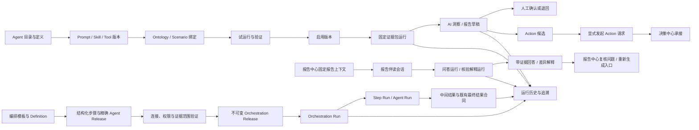
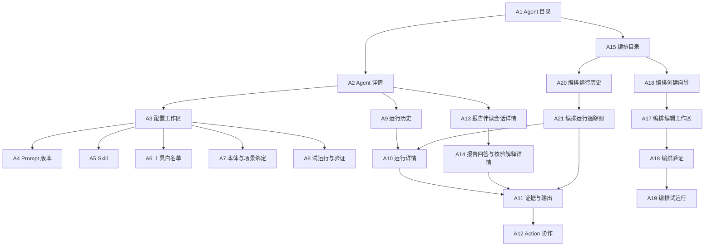

# 新项目功能设计：阶段 5 Agent 应用

> 版本：v0.1  
> 文档状态：主体设计、“报告伴读与数据核验助手”及“一期轻量多 Agent 协作编排”增量设计完成；AG-DE-001—AG-DE-010 已按 C017、D044、D056、D057、D065、CR015、CR022、CR025 完成平台合同与 Agent 字段/页面映射对账；CR030/C033 与 C024/C025 已同步为生效合同，M05 初始归零、接收校验、当前/历史投影和定向重置映射已落实；v1.0.3 设计与原型独立对账已同步，真实 M06→M05 字段交换和运行联调仍待验证；内部自检不等于用户评审通过
> 当前模块：仅 Agent 应用  
> 当前场景顺序：S001 已完成主体设计；一期增加通用“报告伴读与数据核验助手”和轻量协作编排机制；S002、S003 等待用户资料；S004 仍只设计可复用报告 Agent 机制和待接入位置；当前不虚构任何生产编排
> 一期账号：单一演示账号，不建设复杂角色、审批和权限治理  
> 交付性质：功能设计；不包含 Agent 代码、系统提示词正文、API、模型部署、数据库、技术架构或 HTML 原型  
> 上游状态：C017 平台合同已确认并包含版本绑定摘要、当前状态摘要、消费就绪证据、保留状态和历史五维状态；Agent 应用已完成 AG-DE-001—AG-DE-010 的字段、用途门与页面状态设计，但尚无真实跨模块交换和运行证据，不得标记联调完成

## 0. 结论摘要与阅读约定

### 0.1 一句话定位

Agent 应用是平台中“受控生成、协作与轻量编排”的产品模块：它把已经批准的报告/洞察/伴读 Agent 定义、系统提示词版本、Skill、工具白名单、本体绑定和场景绑定组合为可追溯的 Agent Release，也可在一期受约束模板中引用多个精确 Agent Release，形成可验证、可追踪的顺序、并行、确定性分流或人工暂停协作；所有运行都基于固定证据形成结构化 AI 洞察、报告伴读回答、确定性核验结果解释或 Agent 报告草稿，并仅在用户明确操作后发起 Action 请求。它不把 LLM 作为数据源、正式计算层、流程状态机、确定性路由规则 Owner、报告发布者或行动执行者。

### 0.2 本文权威边界

1. D021：LLM 只解释固定证据，不生成正式 Metric/Rule 结果；Agent 不直接读取工作簿、T002 或 T007 业务明细，只能通过 Published 本体、C008/T019 权威消费绑定、固定证据包及获准的 C017 可信度安全元数据取得上下文。
2. D022：智能问数拥有问数 Agent；Agent 应用拥有报告/洞察 Agent 的定义、系统提示词、Skill、工具白名单和运行记录；报告中心拥有报告定义、草稿复核和正式产物。
3. D023：场景清单由平台公共层维护；Agent 应用只保存场景引用和自身绑定状态。
4. D024：S002—S004 均为一期最终必做，但当前按业务场景资料只完成 S001 主体设计；本次增加的是跨报告复用的伴读/核验解释能力，不代表 S004 业务内容已就绪。未知场景不得用虚构 Agent、数据或结论占位。
5. 本文引用本体管理和数据工程草案只用于确定输入、边界和失败合同，不改写其资源、公式、Owner 或内部流程。
6. `[已收敛][AG-X-006][AG-X-007][D042][D043]` 一期“报告伴读与数据核验助手”由 Agent 应用拥有配置、Skill、工具权限、正式 Report Context Binding、会话、运行和生成结果；报告中心拥有侧边界面、报告上下文选择意图、确定性核验规则与结果、复核问题和重新生成入口。报告中心只引用 Agent 会话/运行/结果标识，不维护状态副本。
7. `[用户已裁决][AG-Q010]` 一期建设受约束的轻量协作编排：默认从模板和结构化步骤编辑器开始，可拖入已验证、可用的精确 Agent Release 引用，并自动生成用于查看、定位和运行追踪的流程图；不建设任意连线、循环、递归、动态选 Agent、自主规划或运行中改图的通用画布。

### 0.3 标签

| 标签 | 含义 |
|---|---|
| `[已确认边界]` | 来自已生效 D021—D024 或平台已确认模块归属 |
| `[本模块设计]` | Agent 应用 v0.1 的待评审功能方案 |
| `[一期最小实现]` | 为一期真实演示必须可操作、可失败、可恢复、可追溯的能力 |
| `[后期建设]` | 不进入一期验收门的增强能力 |
| `[用户已裁决]` | 用户已在本窗口明确采纳；待平台总控或相关合同按需登记，不由本文修改其他模块文档 |
| `[待总控登记]` | 用户已作出选择，但平台总控尚未写入正式 D/C/CR 状态；本文先记录决定，不把其冒充已生效总控合同 |
| `[合同已裁决]` | 跨模块政策或资源 Owner 已由平台总控确认；若仍带 AG-DE，则只表示数据工程字段/运行/验收证据尚待实现对账 |
| `[已收敛][AG-X-nnn]` | 对应跨模块事项已由总控合同解决，保留编号作历史追溯，不再作为待裁决项 |
| `[总控已登记][待用户裁决][不进入当前正式合同]` | 总控已记录变更建议，但目标合同尚未修改；模块不得把建议、局部选择或原型实现写成已生效平台合同 |
| `[平台合同已确认][AG-DE-nnn]` | C017 及相关 D/CR 已确认该项合同与 Owner；不再表示“合同尚未确定” |
| `[Agent 映射已落实][AG-DE-nnn]` | 本文和当前原型已落实安全字段、状态、用途门、恢复与追溯映射；不等于生产实现已联通 |
| `[真实联调待验证][AG-DE-nnn]` | 仍缺真实字段样例、跨模块交换、负向运行或端到端证据；取得证据后逐项关闭，不回改已确认合同 |
| `[跨模块待定][AG-X-nnn]` | 非数据工程的跨模块 Owner、入口或状态合同待总控裁决；详见第 19.2 节 |

### 0.4 上游材料与演示数据使用结论

- `[平台合同已确认][Agent 映射已落实][真实联调待验证][AG-DE-001]` Agent 应用只消费 Published 本体资源、C008/T019 权威消费绑定下的固定证据包及获准的 C017 安全投影，并产生 AI 洞察、报告草稿或 Action Type 引用；不得直读工作簿、T002 或 T007 业务明细，不得复制 Metric 公式、Rule 阈值、机构归因算法、数据质量真值、权威消费绑定或其他模块运行状态。仍待证据包真实字段交换和版本混用负向测试。
- `[已收敛][D056]` Q019 已解决：报告业务对象、Metric 和 Rule 结果必须经 Published 本体及 C008 权威消费绑定进入固定证据包；数据工程只向报告链路直供 `[真实联调待验证][AG-DE-009]` C017 数据可信度与可复现元数据。Agent 不得因伴读、核验或重新生成需要静默扩大到企业原始数据。
- 指定融资演示工作簿包含融资明细、单位—负责人映射、三家 Rule 演示样例、组合问数样例和机构归因样例，足以证明 S001 存在“解释正式融资证据并协作发起 Action”的明确用途。
- 工作簿及其说明页不是 Agent 的运行数据源；工作簿中的公式、推荐阈值、问数样例和样例答案不进入系统提示词、Skill 或工具参数。
- `[平台合同已确认][Agent 映射已落实][真实联调待验证][AG-DE-002]` 工作簿未提供权威数据截至时间，Agent 应用只能显示 C017/T008 及其来源，不能用文件生成日、上传时间或 Agent 生成时间替代；仍待真实 T008、覆盖和缺失样例。
- `[已收敛][AG-X-006][AG-X-007][D042][D043]` RC-X-009/RC-X-010 已按“报告页面与确定性核验归报告中心、Agent 资源与运行归 Agent 应用、稳定语义历史定位归本体管理、数据可信度元数据归数据工程”完成总控拆责；仅实际可信度、历史可访问/可复现和当前比较字段、运行与验收证据继续标 `[真实联调待验证][AG-DE-009][AG-DE-010]`。
- `[真实联调待验证][AG-DE-009]` “报告冻结证据可核对”“历史数据版本可定位/可访问”“具备重放条件”“已重放且一致”和“端到端同口径复现”是不同事实；Agent 只能解释已提供状态，不得把其中任一项改写成另一项。

## 1. 产品定位、范围与禁止越界

### 1.1 Agent 应用解决的用户任务

| 用户任务 | Agent 应用提供的结果 | 成功判据 |
|---|---|---|
| 定义一个受控的洞察或报告 Agent | 可版本化的 Agent 定义及其 Prompt、Skill、工具、本体和场景绑定 | 不在 Prompt/Skill 中复制口径；资源关系可追溯 |
| 在启用前证明 Agent 可用 | 使用固定测试证据包完成试运行、输出校验和业务样例验证 | 测试证据、失败原因、修正版本和结论均可查看 |
| 发起一次生产运行 | 创建独立运行记录，固定输入证据和全部配置版本 | 运行中不随配置或证据变化；取消、失败和重试可判断 |
| 理解 Agent 使用了什么 | 查看证据包目录、引用项、版本、覆盖和缺失 | 每个事实性输出能回到证据项；无证据内容被拒绝或标缺失 |
| 使用 AI 洞察辅助判断 | 获得结构化、带证据、时间、人工确认状态和 `[真实联调待验证][AG-DE-004]` 陈旧状态的洞察 | 洞察不冒充正式事实或已确认决策 |
| 获得报告草稿 | 按报告中心提供的报告定义与章节合同生成结构化草稿 | 缺失章节不编造；草稿可移交并保留来源差异 |
| 伴读一份固定报告 | 对报告全文、章节或选中文字/数值/单元格/图表提问，获得带稳定锚点和证据的回答 | 默认不越出报告固定证据包；每次回答可追到会话、运行、报告版本和证据 |
| 理解报告结论与核验差异 | 解释报告结论、Metric 口径、Rule 命中、证据来源及报告中心提供的确定性核验结果 | LLM 不重算 Metric/Rule、不改写确定性四态；证据不足或无权时明确受限 |
| 协作处理报告问题 | 形成“建议创建复核问题”或“建议请求重新生成”的结构化建议 | 实际问题记录和重新生成入口归报告中心；Agent 不修改、确认或发布报告 |
| 从洞察协作发起行动 | 发现获准 Action Type，查看拟提交证据并显式发起请求 | Agent 不确认决策、不创建待办、不绕过决策中心 |
| 追查问题或复现结果 | 从输出回到运行、证据、配置和各资源精确版本 | 历史记录不可被后续修改原地覆盖 |
| 组装受控 Agent 协作 | 从顺序、并行或确定性分流模板创建编排，把两个或多个兼容 Agent Release 拖入结构化步骤列表 | 每步固定精确版本、输入输出合同和证据子范围；不复制或扩大 Agent 权限 |
| 验证并运行轻量编排 | 检查连接、失败路径、版本和权限后，以固定快照试运行或正式运行 | 可逐步追踪 Step Run、Agent Run、中间结果和最终结果；配置或证据变化一律新运行 |

### 1.2 本模块拥有、引用与不拥有

| 边界 | 资源/责任 | Agent 应用承担 | 明确不承担 |
|---|---|---|---|
| 拥有 | 报告/洞察 Agent 定义及版本 | 目的、输入/输出类型、边界、状态、版本和历史 | 不拥有问数 Agent |
| 拥有 | Agent 系统提示词及版本 | 保存正文、元数据、变更说明、版本和绑定；本文不写正文 | 不存 Metric 公式、Rule 阈值、数据清洗逻辑 |
| 拥有 | Agent Skill 及版本 | 任务步骤、证据要求、输出映射、失败规则和适用场景 | 不替代本体业务定义或报告定义 |
| 拥有 | 工具白名单及版本 | 工具用途、允许动作、资源范围、确认要求和禁止项 | 不开放任意代码、数据库、原始数据或越权工具 |
| 拥有 | Agent 本体绑定与场景绑定 | 保存获准本体资源引用、兼容约束和平台场景编号引用 | 不创建或修改 Object、Metric、Rule、Action Type；不复制场景清单 |
| 拥有 | Agent 发布版本、试运行、验证和运行记录 | 固定完整版本组合、输入、状态、错误、输出和追溯 | 不拥有报告复核流程或决策中心运行状态 |
| 拥有 | AI 洞察及 Agent 报告草稿生成记录 | 结构化内容、引用、生成时间、确认/退回和 `[真实联调待验证][AG-DE-004]` 陈旧标记 | 不把草稿变成正式报告或已确认业务事实 |
| 拥有 | 报告伴读 Agent、会话、运行和生成结果 | 维护助手配置、Skill、工具权限、会话、回答、核验差异解释、版本和历史 | `[已收敛][AG-X-006][D042]` 不拥有报告中心侧边界面、报告上下文选择、复核问题或重新生成入口 |
| 拥有 | 轻量协作编排资源 | 维护 Orchestration Definition、不可变 Release、Step Binding、Orchestration Run、Step Run、中间生成结果和运行追踪 | 不把编排变成通用业务流程、报告复核流或决策审批流 |
| 引用 | Agent Release | 只将已验证、可用且获准编排的精确版本拖入步骤，并可进一步收窄输入、工具、证据和用途 | 不复制 Agent、Prompt、Skill、工具白名单或本体绑定；不把问数 Agent 自动纳入资源库 |
| 落位 | 编排最终结果 | 按既有 AI Insight、Report Copilot Answer / Verification Explanation Result、Agent Report Draft、Action Request Handoff 等合同保存或移交 | 不创建绕开 C020/C023/C025/C011 等既有 Owner 的“编排正式产物” |
| 引用 | Published 本体资源和权威消费绑定 | 只读发现和验证获准资源；运行固定精确引用 | `[已收敛][AG-X-001][D054]` Metric/Rule/Action Type 统一由本体管理拥有并发布，Agent 不参与维护 |
| 引用 | 固定生成证据包 | 校验并读取包内获准证据 | `[已收敛][AG-X-004][D043][D046]` 不替报告中心拥有报告证据包或报告定义 |
| 引用 | 报告版本、稳定锚点及确定性核验结果 | 固定输入引用并解释，不复制外部权威状态 | `[已收敛][AG-X-006][AG-X-007][D042][D043]` 不维护报告正文/锚点、四态核验结果或复核状态副本 |
| 发起 | Action 请求 | 用户显式确认后提交请求并记录回执链接 | `[已收敛][AG-X-002][D036—D040]` 不确认提醒、不创建负责人待办、不维护决策状态 |

### 1.3 一期与后期

| 阶段 | 范围 |
|---|---|
| `[一期最小实现]` | 单账号；Agent 目录；S001 融资洞察与行动协作 Agent；通用报告伴读与数据核验助手；可复用报告草稿运行机制；Prompt/Skill/工具/本体/场景绑定版本；草稿—试运行—验证—启用—停用—历史；固定证据包读取；伴读会话；运行历史；AI 洞察/伴读回答/核验解释；报告草稿合同；显式 Action 请求；失败恢复；模板化轻量协作编排、结构化步骤编辑、自动流程图、顺序/并行/确定性分流/人工暂停及逐步追踪；S004 诚实待接入位置 |
| `[后期建设]` | 多账号角色与审批、Agent 市场、跨团队复用治理、批量发布、完整拖拽连线画布、任意循环、递归、嵌套子流程、动态选 Agent、自主规划、运行中改图、长期计划任务、自主行动、动态工具发现、个性化记忆、在线模型策略、生产级成本配额和高级评测运营 |

### 1.4 一期明确不做

- 不拥有问数 Agent、问数会话、自然语言问答页面或组合指标计算。
- `[真实联调待验证][AG-DE-001]` 不采集、清洗、发布数据资产；不直接读取原始工作簿、原始快照或数据资产业务明细。
- 不创建、修改或另存 Object、Property、Link、Metric、Rule、Action Type 的定义和口径。
- 不拥有决策提醒、人工确认、负责人待办或其状态机。
- 不拥有仪表盘布局、报告定义、报告复核状态和正式报告产物。
- `[已收敛][AG-X-006][D042]` 不拥有报告助手侧边页签、报告/章节/锚点选择、确定性核验规则与四态结果、复核问题或重新生成入口；这些由报告中心维护，Agent 应用只维护自身会话、运行和生成结果。
- 不写系统提示词正文、Agent 代码、API、数据库、模型部署、技术架构或 HTML 原型。
- 不以静态成功页、写死结果、隐藏引用或未运行的配置记录冒充 Agent 可用。
- 一期不提供空白自由画布、任意连线、循环、递归、嵌套子流程、自主新增节点、运行中更换 Agent、动态扩大工具权限或证据范围。
- 不为了展示多 Agent 而拆分 S001、报告伴读或其他本可由单 Agent 完成的场景；没有两个具备真实协作价值且合同兼容的 Agent Release 时，只验收机制，不创建生产编排或宣称业务场景通过。

## 2. 一期能力地图与模块闭环

### 2.1 能力地图



### 2.2 一期最小闭环

1. 用户创建或打开 Agent 草稿，配置用途和结构化输出类型。
2. 绑定系统提示词版本、Skill 版本、工具白名单版本、获准本体资源和 S001 场景编号。
3. 用固定测试证据包试运行，查看输入证据、工具调用摘要、输出和校验结果。
4. 完成业务样例验证后启用一个精确 Agent 发布版本；旧版本保留。
5. 发起生产运行时固定 Agent 发布版本和证据包；`[真实联调待验证][AG-DE-001]` `[真实联调待验证][AG-DE-002]` 同时固定权威语义/数据引用和数据截至时间。
6. 输出 AI 洞察或报告草稿；所有事实性陈述带证据引用，缺失内容进入缺口清单。
7. 用户可确认洞察可用、退回修订，或从获准 Action 候选显式发起请求。
8. `[已收敛][AG-X-002][D036—D040]` 决策中心承接 Action 请求；Agent 应用只记录请求回执与跳转，不在本模块完成决策确认或待办。
9. `[已收敛][AG-X-006][AG-X-007][D042][D043]` 报告中心可把固定报告/草稿版本、稳定锚点、证据包、Published 语义上下文、权限结果和 `[真实联调待验证][AG-DE-009]` 数据可信度/可复现摘要交给报告伴读助手；Agent 应用建立会话并执行问答或核验解释运行，报告中心仅引用返回标识和权威状态。
10. `[真实联调待验证][AG-DE-010]` 只有用户在报告中心显式选择“与当前数据比较”时，才形成独立的当前比较上下文和关联运行；它与报告生成快照并列，不替换原会话事实根或旧报告。

### 2.3 一期轻量编排最小闭环

1. 用户从顺序、并行或确定性条件分流模板创建 Orchestration Definition，写明真实用途、场景引用、整体输入/输出合同和失败策略；没有真实用途时停止在机制验证，不创建生产编排。
2. 用户从资源库拖入已验证、可用且获准编排的精确 Agent Release；拖入动作只建立 Step Binding，不复制 Agent 七元组。
3. 用户以结构化步骤列表配置顺序、并行组、指定汇总步骤、确定性条件、人工暂停、结束及失败路径；系统同步生成只读或轻交互流程图。
4. 每条连接校验结构化类型、必填项、证据引用、Published 本体版本、`[真实联调待验证][AG-DE-001]`—`[真实联调待验证][AG-DE-004]` 数据版本/时点/质量/新鲜度、允许上下文和失败路径；任一步只能进一步收窄权限与证据范围。
5. 验证通过后启用不可变 Orchestration Release，固定全部 Step Binding、连接、失败策略及每个精确 Agent Release；单 Agent 升级不改变已启用编排。
6. 试运行或正式运行固定整个编排 Release、输入上下文、证据包、本体版本、`[真实联调待验证][AG-DE-001]` 数据版本及全部 Agent Release，逐步形成 Step Run、Agent Run 和 Intermediate Result。
7. 最终结果必须按既有输出合同落位；运行历史可从最终结果回到 Orchestration Run、Release、Step Run、Agent Run 和原证据，流程图使用当时 Release 快照。

## 3. 核心资源模型与版本关系

### 3.1 资源总表

| 资源 | 稳定身份 | 版本是否不可变 | 一期必填内容 |
|---|---|---:|---|
| Agent Definition | Agent 标识 | 发布版本不可变，草稿可继续编辑 | 名称、用途、Agent 类型、输入/输出合同、禁止事项、Owner 说明、状态 |
| System Prompt Version | Prompt 标识 + 版本 | 是 | 适用 Agent 类型、语言、任务边界、输出结构、证据/禁止行为摘要、变更说明；正文只在产品中维护 |
| Skill Version | Skill 标识 + 版本 | 是 | 业务任务、适用输入、步骤说明、证据要求、输出映射、失败/停止条件、Action 边界 |
| Tool Allowlist Version | 白名单标识 + 版本 | 是 | 工具名称、用途、允许动作、资源范围、是否需用户确认、禁止行为 |
| Ontology Binding Version | 绑定标识 + 版本 | 是 | 本体标识、允许的 Published 资源标识、兼容约束、禁止资源；`[真实联调待验证][AG-DE-001]` 运行时解析并固定权威双版本 |
| Scenario Binding Version | 绑定标识 + 版本 | 是 | 平台场景编号、Agent 在场景中的用途、允许输出、入口状态；不复制场景名称之外的主清单内容 |
| Agent Release Version | Agent 标识 + 发布版本 | 是 | 以上各精确版本、输出校验规则、启用说明、验证结论 |
| Generation Evidence Package | 证据包标识 + 包版本 | 是 | 发起方、范围、证据项、Published 资源引用；`[真实联调待验证][AG-DE-001]`—`[真实联调待验证][AG-DE-004]` 的版本、时点、质量和新鲜度信息 |
| Agent Run | 运行标识 + 尝试号 | 是 | 请求来源、Agent 发布版本、证据包、状态、开始/结束/取消时间、工具摘要、错误、输出标识 |
| AI Insight | 洞察标识 + 生成版本 | 是 | 结构化洞察项、证据、生成时间、人工确认状态；`[真实联调待验证][AG-DE-004]` 的新鲜度/陈旧状态 |
| Agent Report Draft | 草稿标识 + 生成版本 | 是 | 报告定义版本、章节输出、引用、缺失内容、置信说明、移交状态 |
| Action Request Handoff | 移交标识 | 是 | Action Type 引用、目标对象、证据引用、用户确认、请求回执；不复制决策运行记录 |
| Report Reading Session | 会话标识 | 会话事件不可变；可派生新会话 | 报告/草稿身份、精确内容版本、Agent 发布版本、上下文绑定历史、会话状态和最后活动时间 |
| Report Context Binding | 会话标识 + 上下文版本 | 是 | 报告/草稿精确版本、报告定义/模板版本、证据包版本、稳定锚点范围、语义版本、权限结果；`[真实联调待验证][AG-DE-009][AG-DE-010]` 数据可信度快照/比较上下文引用 |
| Report Copilot Answer | 回答标识 + 生成版本 | 是 | 问题、范围、回答、证据、锚点、语义版本、`[真实联调待验证][AG-DE-009]` 数据版本/时点/质量/新鲜度、生成时间、确认和限制状态 |
| Verification Explanation Result | 解释结果标识 + 生成版本 | 是 | 报告中心确定性核验运行/结果引用、四态原值、LLM 差异解释、影响和建议；不得覆盖原四态 |
| Orchestration Definition | 编排标识 | 草稿可编辑，已发布版本不可变 | 目标、适用场景引用、整体输入/输出合同、步骤及连接关系、确定性条件、人工暂停点、结束/失败/部分结果策略 |
| Orchestration Release | 编排标识 + Release 版本 | 是 | Definition 精确版本、全部 Step Binding、连接和失败策略、验证结论、启用说明及每个精确 Agent Release |
| Step Binding | 编排 Release + 步骤标识 | 是 | 步骤类型、精确 Agent Release（仅 Agent 步骤）、输入映射、输出合同、证据子范围、允许用途、权限收窄和路径配置 |
| Orchestration Run | 编排运行标识 + 尝试号 | 是 | Orchestration Release、请求来源、固定输入上下文/证据包、本体版本、`[真实联调待验证][AG-DE-001]` 数据版本、全部 Agent Release、聚合状态、时间和最终结果引用 |
| Step Run | 编排运行标识 + 步骤标识 + 尝试号 | 是 | Step Binding、等待/运行/暂停/终态、实际输入输出、Agent Run 引用、路径依据、错误和时间 |
| Intermediate Result | 中间结果标识 + 生成版本 | 是 | 来源 Step Run / Agent Run、结构化内容、原证据引用、限制和允许的下游用途；不是已确认业务事实 |
| Orchestration Final Result Reference | 编排运行标识 + 最终结果引用 | 是 | 既有输出合同类型、结果标识、来源步骤及完整追溯；不另造正式业务产物 |

### 3.2 Agent 类型

| 类型 | 一期用途 | 输入 | 输出 | 一期实例 |
|---|---|---|---|---|
| 洞察 Agent | 将正式证据组织为结构化观察、解释、建议关注点和 Action 候选 | 固定洞察证据包 | AI Insight | S001“融资洞察与行动协作 Agent” |
| 报告草稿 Agent | 按报告定义提供的章节合同组织证据并生成待复核草稿 | 报告生成请求、报告定义版本、固定报告证据包 | Agent Report Draft | 只建设可复用机制；S004 暂不创建具体 Agent |
| 报告伴读/核验解释 Agent | 对固定报告上下文回答问题、解释语义与证据、汇总并解释报告中心的确定性核验结果 | 报告/草稿精确版本、稳定锚点、固定证据包、确定性核验结果引用 | Report Copilot Answer / Verification Explanation Result | 一期“报告伴读与数据核验助手”；不依赖虚构 S004 章节 |

### 3.3 版本聚合规则

一个 Agent 发布版本必须固定以下七元组：

```text
Agent Definition Version
+ System Prompt Version
+ Skill Version 集合
+ Tool Allowlist Version
+ Ontology Binding Version
+ Scenario Binding Version
+ Output Contract Version
```

- 修改任一成员均产生新的 Agent 草稿版本；当前已启用版本继续运行，不被原地改写。
- 试运行和验证必须记录所用完整七元组；“Prompt v2”或“Agent 最新版”不能单独作为可复现标识。
- 生产运行开始后固定一个 Agent 发布版本；运行中发生配置更新不影响本次运行。
- `[真实联调待验证][AG-DE-001]` 同一 Agent 发布版本可以在兼容前提下运行于不同的权威数据版本，但每次运行必须固定实际使用的精确组合，不能只写“最新数据”。
- 重新启用历史发布版本前必须重新执行本体兼容与工具可用性检查；`[真实联调待验证][AG-DE-003]` 同时检查当前质量摘要是否满足该版本的输入门。
- 报告伴读每次提问还必须固定 `Agent Release Version + Report Context Binding Version + 本轮稳定锚点快照`；同一会话不能用“当前报告”或“最新证据包”作为可复现标识。
- `[已收敛][AG-X-007][D043]` 报告版本或证据包变化时形成新的上下文版本并默认派生新会话；旧会话只读保留。`[真实联调待验证][AG-DE-010]` 数据更新不改写报告快照，只使“与当前事实比较”轴进入未比较或已陈旧状态。

### 3.4 编排版本聚合与权限继承

一个 Orchestration Release 必须固定：`Orchestration Definition Version + Step Binding 集合 + Connection/Route 集合 + Failure Policy Version + Output Contract Version + 每个精确 Agent Release`。其中：

- 编排不是新的 Agent 类型，不拥有独立 Prompt、Skill、工具白名单或本体绑定；这些继续由各 Agent Release 自身固定。
- 权限必须满足“步骤实际权限与证据范围 ⊆ Step Binding 收窄范围 ⊆ 该 Agent Release 获准范围”；多个 Agent 的权限不得合并后反向提供给任一步骤。
- 单 Agent Release 后续升级、停用或被新版本替代，都不得静默改写已启用 Orchestration Release；采用新 Agent Release 必须派生新编排草稿、重新验证并启用新 Release。
- 控制步骤（条件、汇合、人工暂停、结束）不绑定 Agent Release，不调用 LLM；其输入、判断值、路径和时间仍形成 Step Run。
- 运行中的 Orchestration Release、步骤、连接、Agent Release、证据包和权限快照不可修改；流程图是该结构的派生视图，不是独立权威业务逻辑。
- `[真实联调待验证][AG-DE-001]`—`[真实联调待验证][AG-DE-008]` 每次 Orchestration Run 固定实际权威数据组合、时点、质量、新鲜度、消费就绪和适用回退事实；报告类步骤再按需固定 AG-DE-009/010 上下文。

## 4. Agent、Prompt、Skill、Tool 与绑定功能合同

### 4.1 Agent 定义

Agent 定义页必须回答：这个 Agent 为谁完成什么业务任务、接受什么类型的固定证据、产生什么结构化结果、不得做什么、可使用哪些 Skill/工具/本体资源、在哪些平台场景可用、怎样判断输出合格。

一期字段：

- 中文名称、稳定标识、Agent 类型、业务用途、适用对象范围和明确非用途；
- 输入合同、输出合同、默认语言、允许的最大证据范围说明；
- Prompt、Skill、工具白名单、本体绑定、场景绑定的当前草稿版本；
- 试运行样例、验证清单、当前启用版本、停用原因和历史；
- 输出不合格、证据缺失、越界请求、Action 请求需人工操作等固定失败规则。

### 4.2 系统提示词版本

本文不提供提示词正文。产品功能需支持：

- 新建草稿、保存、比较版本、填写变更原因、绑定到 Agent 草稿；
- 结构化登记任务边界、证据使用要求、引用要求、禁止行为、输出格式和拒答/停止条件；
- 检查是否包含疑似 Metric 公式、Rule 阈值、银行排序、数据清洗或未授权工具指令；命中时阻断验证并引导引用本体资源；
- 已被 Agent 发布版本引用的 Prompt 版本只读；修改必须产生新版本并重验。

### 4.3 Skill 版本

Skill 是“如何使用获准证据完成一类任务”的业务能力说明，不是代码、公式、查询语句或提示词副本。一期支持：

| Skill 合同 | 必须说明 |
|---|---|
| 任务 | 例如“解释已发布 Rule 证据”“把证据映射到洞察结构”“准备 Action 请求候选” |
| 输入条件 | 所需证据类型、必要本体资源、允许对象范围 |
| 步骤 | 发现证据、核对范围、组织解释、引用、检查缺口、形成输出；不得写正式计算逻辑 |
| 输出映射 | 输出到 AI Insight 或报告草稿的哪些字段 |
| 停止条件 | 证据不足、引用失效、`[真实联调待验证][AG-DE-003]` 质量阻断、本体不兼容、工具越界、输出无法校验 |
| Action 边界 | 只形成候选；用户显式操作后才能提交请求 |

S001 一期使用两个可复用 Skill：

1. `融资证据解释`：解释证据包中已给出的融资 Metric、Rule 命中、机构归因和关联借据，不重新计算。
2. `融资行动协作`：把已给出的 Action Type、目标主体和证据组织为可供用户核对的请求候选，不执行确认或待办创建。

报告伴读与数据核验助手一期使用三个可复用 Skill：

1. `报告证据伴读`：在报告全文、当前章节或稳定锚点范围内回答问题，回指报告位置与证据包，不把正文自身当成唯一证据。
2. `语义口径与 Rule 解释`：读取固定证据包中稳定语义资源标识和报告生成时精确 Published 版本，解释 Metric 定义、单位、范围及已给出的 Rule 命中；不重算指标、不重评 Rule。
3. `确定性核验差异解释`：读取报告中心提供的核验运行和结果引用，保留“通过/警告/失败/无法核验”原值，汇总差异、影响和业务可读建议；不改写确定性判定，不创建复核问题或重新生成请求。

三个 Skill 均只规定证据使用、解释结构、限制披露和停止条件；本文不写系统提示词正文、公式、阈值、查询语句或报告章节内容。

### 4.4 工具白名单

| 工具能力 | 一期允许用途 | 需要的门 | 明确禁止 |
|---|---|---|---|
| 证据包读取器 | 读取本次固定包的目录、证据项和缺口 | 包已冻结且校验通过 | 读取包外内容、改写证据 |
| Published 本体资源阅读器 | 读取包中精确引用的对象定义、Metric/Rule/Action Type 说明和证据快照 | 资源在本体绑定白名单内 | 创建/修改资源，查询未引用原始数据 |
| 证据引用校验器 | 检查输出引用是否存在、范围是否匹配 | 输出校验阶段 | 自动补造引用 |
| 报告草稿移交器 | 将完成草稿和追溯清单交付报告中心 | `[已收敛][AG-X-004][D043][D046]` 请求和接收合同有效 | 标记报告已复核或正式发布 |
| Action Type 发现器 | 在绑定范围内列出适用 Action Type 及前置说明 | `[已收敛][AG-X-001][D054]` 仅发现本体管理发布的获准资源 | 建立临时 Action、改变阈值 |
| Action 请求提交器 | 用户在独立确认页显式提交已核对候选 | `[已收敛][AG-X-002][D036—D040]` 决策中心合同有效；必须有人机确认 | Agent 在生成过程中自动提交、人工确认提醒、创建待办 |
| 报告固定上下文读取器 | 读取报告中心提供的报告/草稿版本、报告定义/模板、稳定锚点和固定证据包引用 | `[已收敛][AG-X-007][D043]` 上下文绑定完整且当前用户获准 | 自由搜索其他报告、静默切到新版本、读取报告包外企业数据 |
| 确定性核验结果读取器 | 读取报告中心拥有的核验运行、检查项、四态结果和证据引用 | `[已收敛][AG-X-006][D042]` 返回稳定运行/结果标识和权威状态 | 创建或修改核验规则、重跑正式计算、覆盖四态结果 |
| 报告助手结果回传器 | 把会话/运行/结果标识、状态、回答/解释和限制返回报告中心引用 | 结果已通过 Agent 输出校验 | 创建复核问题、修改报告正文、确认/发布报告、直接创建重新生成请求 |

一期白名单默认拒绝：互联网搜索、任意文件读取、原始工作簿、原始快照、`[真实联调待验证][AG-DE-001]` 数据资产业务明细直读、报告固定证据包之外的企业数据、任意代码、数据库、模型训练、Prompt 自修改、本体写入、报告正文修改/确认/发布、复核问题写入、重新生成请求写入、决策确认和待办写入。

### 4.5 本体绑定

- 绑定的是获准的本体、Object/Property/Link、Metric、Rule 和 Action Type 稳定资源标识及其用途，不是源字段清单。
- 只允许 Published 资源；草稿、已弃用且禁止新消费、消费隔离或未授权资源不可进入新运行。
- `[真实联调待验证][AG-DE-001]` 运行时从权威消费绑定解析精确 Published 语义版本与可消费数据版本并固定到证据包；Agent 应用不维护冲突指针。
- 绑定校验显示：缺失资源、类型变化、已弃用、版本不兼容、超出工具白名单和未验证范围。
- `[已收敛][AG-X-001][D054]` Metric、Rule、Action Type 统一由本体管理拥有并随 Published 语义版本发布；Agent 应用只读引用稳定标识和精确 Published 版本，不复制定义。
- `[已收敛][AG-X-007][D043]` 报告伴读历史上下文必须按“报告精确版本/稳定锚点/证据包 → 稳定语义资源标识 + 报告生成时精确 Published 版本”解析；本体返回历史解析和权威 Published 事实，Agent 不使用当前定义替代旧报告定义，也不让本体生成报告差异结论。

### 4.6 场景绑定

- Agent 应用只保存 `S001` 等稳定场景编号、Agent 用途、允许输入/输出和绑定状态；场景名称、导航、阶段和其他模块资源仍以平台场景清单为准。
- 同一 Agent 可在后期绑定多个有相同任务和证据合同的场景，但每个场景必须独立验证，不能因 S001 通过而自动宣告 S002—S004 可用。
- 平台场景清单标记场景未就绪、已暂停或缺资源时，Agent 应用显示原因并阻止生产运行；试运行是否允许由验证证据范围决定。
- 报告伴读与数据核验助手是跨报告复用能力，不创建新的平台场景编号；每次会话继承当前报告引用的场景编号，若报告尚未绑定场景则仅按报告合同工作并显示“场景未提供”，不得自行归类为 S004。

## 5. Agent 生命周期、启停与历史

### 5.1 状态模型

| 状态 | 进入条件 | 主动作 | 不允许 | 退出条件 |
|---|---|---|---|---|
| 草稿 | 新建或从历史版本派生 | 编辑定义与绑定、保存、删除未发布草稿 | 生产运行、正式移交、Action 请求 | 必填项齐全后进入可试运行 |
| 可试运行 | 七元组完整，基础校验通过 | 选择固定测试证据包、试运行 | 启用、将测试输出当正式结果 | 至少一次试运行后进入验证中，或修改回草稿 |
| 验证中 | 已选择验证用例和固定版本 | 执行用例、查看差异、记录结论 | 修改被冻结版本、生产运行 | 全部必需用例通过进入验证通过；失败进入验证失败 |
| 验证失败 | 任一必需用例失败 | 查看原因、从失败版本派生修订草稿 | 启用失败版本 | 修订并重新验证 |
| 验证通过 | 必需用例通过且兼容性检查有效 | 启用 | 原地修改 | 启用或因依赖变化回到需重验 |
| 已启用 | 用户明确启用一个验证通过版本 | 发起生产运行、查看历史、停用 | 修改当前发布版本 | 停用、新版本启用或依赖失效 |
| 已停用 | 用户主动停用或系统因硬性不兼容阻止新运行 | 查看历史、派生新草稿、符合条件时重新启用 | 新生产运行、隐瞒停用原因 | 重新验证并启用历史/新版本 |
| 历史版本 | 已被新版本替代或停用 | 只读比较、查看运行、派生草稿 | 原地编辑、删除追溯 | 不退出；可在重验后重新启用其精确版本 |

### 5.2 单账号启用规则

- 一期不建立提交者、审批者、发布者角色；同一演示账号可完成编辑、验证和启用。
- 这不等于无门禁：未通过固定用例、引用校验、输出结构校验、工具白名单校验和本体兼容校验的版本不可启用。
- 每个 `Agent + 场景` 同一时刻最多一个默认启用版本；启用新版本不删除旧版本或旧运行。
- 停用只阻止新运行，不取消已完成输出、不删除历史；运行中的实例由用户选择继续或取消，并记录选择。
- `[真实联调待验证][AG-DE-003]`—`[真实联调待验证][AG-DE-006]` 当质量、刷新或上一可信服务状态改变时，Agent 应用只读消费数据侧事实、资格和警告，不推断或修改这些上游事实；是否允许新洞察、确认洞察、报告草稿移交或 Action Request，由 Agent 应用按第 11 章的已确认用途门合同独立判定并控制对应操作。

### 5.3 版本比较

版本比较按资源分栏显示：Agent 定义、Prompt、Skill、工具、本体绑定、场景绑定和输出合同；对每项显示新增、删除、替换、原因、受影响验证用例和历史运行数量。不得把 Prompt 文本差异与本体口径变化混成一个“配置已修改”。

### 5.4 报告伴读会话生命周期

Report Reading Session 由 Agent 应用拥有，报告中心只保存会话标识并在侧边界面重读权威状态。会话状态与 Agent 发布状态、单次运行状态、报告复核状态分开：

| 会话状态 | 进入条件 | 允许行为 | 禁止行为 / 恢复 |
|---|---|---|---|
| 活跃 | 固定报告/草稿版本、证据包、Agent 发布版本和初始上下文绑定均有效 | 在同一报告版本内切换章节或稳定锚点并继续提问；每轮固定锚点快照 | 不用“当前选择”覆盖历史轮次 |
| 上下文陈旧 | 报告/草稿版本已切换、同版本证据包关系冲突，或绑定资源已失效 | 查看历史；从新精确版本派生新会话 | 不在原会话继续生成看似针对新版本的回答 |
| 当前比较陈旧 | `[真实联调待验证][AG-DE-010]` 先前显式当前比较所用当前状态摘要或权威组合后来变化 | 继续解释原报告快照；需要时显式发起新的独立比较 | 不后台刷新旧比较结果，不把原快照标成已被当前数据改写 |
| 受限 | 权限不足、关键证据缺失或历史语义无法定位，但仍可显示获准部分 | 在获准范围提问、查看限制、条件满足后从原会话创建新运行 | 不泄露被拒绝值、不用当前语义或相似数据补齐 |
| 已关闭 | 用户关闭，或报告中心上下文已结束且不再接受新问题 | 只读查看、按原上下文派生新会话 | 不删除会话和运行历史 |

一期同一报告精确版本可有一个持续会话或多个独立会话；无论哪种，切换报告/草稿精确版本均默认新建会话分支。报告中心可以恢复原会话标识，但不能在自身保存消息、运行或状态副本。

### 5.5 编排生命周期、启停与历史

编排生命周期独立于任一 Agent Release 生命周期，复用“草稿—验证—启用—停用—历史”的门禁但不混用状态：

| 编排状态 | 进入条件 | 允许行为 | 禁止行为 / 退出 |
|---|---|---|---|
| 草稿 | 从模板新建或从历史 Release 派生 | 编辑目标、结构化步骤、连接、映射、证据子范围和失败策略 | 不得正式运行；基础校验通过后可验证 |
| 验证中 | Definition、全部 Step Binding 和测试输入已冻结 | 执行连接、权限、路径及试运行用例 | 不得原地修改冻结快照；完成后进入验证通过/失败 |
| 验证失败 | 任一必需检查或用例失败 | 查看定位并派生修订草稿 | 不得启用失败版本 |
| 验证通过 | 必需检查及用例全部通过 | 明确启用为不可变 Orchestration Release | 修改任一步骤/连接/版本/策略即回到新草稿 |
| 已启用 | 用户启用验证通过版本 | 新建试运行或正式 Orchestration Run、停用、查看历史 | 不得原地修改 Release；Agent 新版本不自动替换 |
| 已停用 | 用户主动停用，或依赖失效阻止新运行 | 查看历史、派生草稿、恢复依赖后重验 | 不得新建正式运行；不删除既有运行 |
| 历史版本 | 被新 Release 替代或长期停用 | 只读比较、查看当时流程图和运行、派生草稿 | 不得用当前 Definition/Agent Release 覆盖历史 |

一期单账号可完成编辑、验证和启停，但仍必须通过固定版本、连接合同、无循环、证据不扩张、工具不扩权、完整失败路径和最终输出合同校验。停用某个 Agent Release 不改写历史 Orchestration Release；对尚未开始的新步骤或新运行按第 7.9 节阻断。

## 6. 生成证据包读取边界

### 6.1 输入原则

`[已确认边界]` 运行只能使用一次固定生成证据包。Agent 应用不让 LLM 自行寻找数据、不把“最新”理解为任意最近文件、不在运行中追加新证据，也不把模型已有知识当项目事实。

### 6.2 证据包最低目录

| 信息组 | 最低内容 | Agent 应用用途 |
|---|---|---|
| 请求上下文 | 证据包标识/版本、发起方、场景编号、请求时间、目标对象范围、期望输出类型 | 判断用途和作用域 |
| 报告上下文 | 报告定义版本、章节合同、必填/可选章节；仅报告运行存在 | 按定义组织草稿，不自创章节 |
| 报告伴读身份 | `[已收敛][AG-X-007][D043]` 报告编号/产物版本/内容版本或草稿标识/草稿版本、报告定义/模板版本、上下文选择来源 | 固定会话事实根，不跨报告版本拼接 |
| 稳定锚点 | `[已收敛][AG-X-007][D043]` 全文、章节、段落、选中文字/数值、单元格或图表的一个或多个稳定锚点 | 确定本轮范围并回指报告位置；锚点快照随每轮保存 |
| 语义引用 | Published 本体版本、Object/Metric/Rule/Action Type 稳定标识、显示名称、证据项引用 | 解释正式语义，不复制公式 |
| 权威数据引用 | `[真实联调待验证][AG-DE-001]` 可消费数据版本与权威绑定标识 | 固定事实版本，不自行选择 |
| 数据时点与覆盖 | `[真实联调待验证][AG-DE-002]` 数据截至时间、对象/时间/字段覆盖、已知缺失 | 输出时点和缺口说明 |
| 质量摘要 | `[真实联调待验证][AG-DE-003]` 状态、适用范围、失败/警告/未知项、最近验证时间 | 决定运行、降级或阻断 |
| 新鲜度摘要 | `[真实联调待验证][AG-DE-004]` T008 与事实年龄、新鲜/陈旧/未知、阈值来源/标识/版本/Owner、适用范围、数据侧资格和警告原因 | 作为 Agent 用途门输入；标识新鲜度并分别判定新洞察、确认、草稿移交和 Action 操作 |
| 证据项 | 稳定证据项标识、类型、对象范围、显示值/结论、单位、时间、来源资源、允许引用方式 | 支持逐条引用 |
| 缺失清单 | 没有提供但输出合同要求的证据、缺失原因和责任模块 | 生成“缺失内容”，不编造 |
| 冻结信息 | 包冻结时间、内容版本和完整性结论 | 防止运行中输入漂移 |
| 核验结果引用 | `[已收敛][AG-X-006][D042]` 报告中心确定性核验运行、检查项、四态结果、结果版本、核验时间和证据引用；仅核验解释运行存在 | 原样保留确定性结论并生成差异解释，不接管规则或四态 |
| 历史可信度 | `[真实联调待验证][AG-DE-009]` 版本绑定摘要与当前状态摘要的精确引用，以及版本定位、内容访问、证据完整、重放能力、重放核验的分维状态 | 诚实说明报告快照核对、源版本重放和端到端复现边界 |

### 6.3 可读与不可读内容

可读：包内获准的 Published 对象说明、正式 Metric 结果、Rule 命中与原因、Action Type 说明、结构化事实快照、`[真实联调待验证][AG-DE-003]` 质量摘要、`[真实联调待验证][AG-DE-004]` 新鲜度摘要、`[真实联调待验证][AG-DE-009]` 历史可信度状态、报告中心提供的稳定锚点和确定性核验结果引用。

不可读：原始工作簿、T002 原始快照、`[真实联调待验证][AG-DE-001]` 未发布数据资产或处理中的候选版本、源字段全表、Prompt 外部粘贴数据、报告固定证据包之外的企业数据、未绑定本体资源、草稿 Metric/Rule/Action、无证据来源的自然语言结论。`[真实联调待验证][AG-DE-010]` 当前数据只可通过报告中心显式比较形成的并列、固定上下文读取，不能由 Agent 静默扩大范围。

### 6.4 输入门

| 检查 | 通过 | 降级 | 阻断 |
|---|---|---|---|
| 包用途 | 场景、Agent 类型和输出匹配 | 可选证据缺失 | 用途不匹配或无发起方 |
| 版本 | `[真实联调待验证][AG-DE-001]` 精确语义/数据组合可验证 | 无 | 版本缺失、混用或不属于权威组合 |
| 时点/覆盖 | `[真实联调待验证][AG-DE-002]` 时点和范围明确 | 非关键覆盖缺失，输出必须列缺口 | 关键范围未知，无法判断陈述适用性 |
| 质量 | `[真实联调待验证][AG-DE-003]` 满足该输出用途 | 允许用途内的警告，输出持续披露 | 失败、未知或超出允许范围 |
| 新鲜度 | `[真实联调待验证][AG-DE-004]` 新鲜度为“新鲜”且在用途门内 | 允许陈旧或未知的受限解释/草稿并强制标识；是否允许运行须按具体用途合同判定 | 时效关键用途陈旧且无允许合同；新鲜度未知时不得默认放行确认、报告草稿移交或 Action Request |
| 本体资源 | 全部 Published 且与绑定相容 | 可选资源缺失 | 必需资源不存在、不兼容或被隔离 |
| 引用 | 证据项稳定且可引用 | 个别可选证据不可引用，列入缺失 | 关键结论无法关联证据 |
| 报告身份与锚点 | `[已收敛][AG-X-007][D043]` 精确版本与锚点均可定位 | 非关键选区失效时退回章节或全文范围并显式提示 | 版本冲突、锚点属于其他版本或当前范围不可证明 |
| 核验结果 | `[已收敛][AG-X-006][D042]` 四态结果及版本可读取 | 个别非关键检查项为“无法核验”，按项解释 | 结果身份冲突、把 LLM 解释误当确定性结果 |
| 历史可复现 | `[真实联调待验证][AG-DE-009]` 各分维状态明确 | 报告冻结证据可核对但源版本未重放时受限解释 | 身份冲突或关键事实未知且问题要求全链路复现结论 |

### 6.5 证据查看器

证据查看器按“目录—证据项—引用位置”三层展示。用户可从输出句子打开对应证据项，再查看所属资源、范围、时点和包内位置；报告伴读结果还可回到精确报告/草稿版本和稳定锚点。不能从查看器跳到原始工作簿或绕过本体读取业务明细。权限不足时只显示被拒绝证据的身份、受限原因和获准下一步，不显示被拒绝值；一期不建设复杂角色配置，但必须消费报告中心返回的允许/拒绝结果。

### 6.6 编排证据范围与步骤传递

- Orchestration Run 启动时固定根输入上下文、一个或多个明确分工的证据包、Published 本体版本及 `[真实联调待验证][AG-DE-001]`—`[真实联调待验证][AG-DE-004]` 数据版本、时点、质量和新鲜度；运行中不得补包、换包或改绑“最新”。
- 每个 Step Binding 必须声明根范围的子集或明确拆分范围。顺序下游只接收获准结构化输出、原证据引用和允许的上下文；并行分支只接收共同固定上下文或各自声明的证据子范围。
- Intermediate Result 是 Agent 应用拥有的未确认生成内容，只能作为下游生成上下文，不能替代根证据包、Published Metric/Rule 结果或外部权威状态。下游事实性陈述必须继续回指原证据项，不能把“Agent A 说过”作为正式证据。
- 步骤之间必须逐项传递或显式拒绝：证据标识、Published 语义资源及精确版本、`[真实联调待验证][AG-DE-001]` 数据版本、`[真实联调待验证][AG-DE-002]` 数据截至时间与覆盖、`[真实联调待验证][AG-DE-003]` 质量、`[真实联调待验证][AG-DE-004]` 新鲜度及 `[真实联调待验证][AG-DE-008]` 消费就绪状态。
- `[真实联调待验证][AG-DE-005]`—`[真实联调待验证][AG-DE-006]` 数据刷新、候选失败或上一可信状态变化不得触发编排内静默回退；采用不同证据或版本必须新建 Orchestration Run。
- `[真实联调待验证][AG-DE-007]` 历史 Step Run、Intermediate Result 和证据引用不可读取时，历史运行仍保留并标明不可读取范围，不使用当前证据替代。
- 报告类步骤按需继承 `[真实联调待验证][AG-DE-009][AG-DE-010]`，但编排不得隐式发起“与当前数据比较”或把当前比较替换报告快照。

### 6.7 C017 只读可信度上下文与双摘要

`[平台合同已确认][Agent 映射已落实][真实联调待验证][AG-DE-001]`—`[AG-DE-010]` 每个证据包、Agent Run、AI 洞察、报告伴读 Context Binding 和 Action 请求确认页均读取同一 C017 安全投影，不复制数据工程权威状态。最低字段为：

1. 版本绑定摘要：摘要标识、版本、形成时间、T006 数据资产、精确 T007、T008 及其来源、生成时 Published 本体版本、权威绑定和稳定证据定位。
2. 当前状态摘要：摘要标识、版本、观察时间、质量状态、影响范围、数据侧资格、新鲜度及判定依据、刷新状态和恢复建议。
3. 四类版本身份：当前、候选、数据侧上一合格、上一权威组合分别显示，不用“最新/上一版本”代替，不从身份关系推导自动回退资格。
4. 采用与消费证据：本体正式采用、消费就绪、保留状态、稳定证据位置分别显示；候选、刷新中或失败候选不得进入正式运行。
5. 历史五维：版本定位、内容访问、证据完整、重放能力、重放核验分别显示状态、原因、最近核对时间和恢复方式；必须支持“可定位但未重放”“具备重放条件但未执行”“依赖不足”“内容当前不可访问”“重放已执行且一致”“重放不一致”和“无法判断”等独立组合。“未执行”“依赖不足”“内容不可访问”“无法判断”均不得写成重放一致，重放核验状态也不得反向覆盖其他四维的真实状态。

运行创建时固定版本绑定摘要和当时当前状态摘要；确认洞察、移交报告草稿和 Action 最终提交时重新读取当前状态摘要。二者差异只新增“数据可信度已变化/受限”状态，不改写原证据、原回答或原报告。

### 6.8 事后硬质量失败联动

`[平台合同已确认][Agent 映射已落实][真实联调待验证][AG-DE-003][AG-DE-004][AG-DE-005][AG-DE-006]` 已完成的洞察、历史回答和已移交报告草稿保留当时固定摘要、原文与证据，不因新的质量发现而重写。数据工程以新的 C017 当前状态摘要提供硬失败事实、影响范围、发现时间、数据侧资格和恢复建议；Agent 应用不得修改 T019、不得自行选择上一版本，也不得把候选数据混入运行。

1. 打开历史结果、确认洞察、移交报告草稿、打开 Action 确认页、最终提交或用户显式刷新时，Agent 应用重新读取当前状态摘要，并与原运行固定摘要比较。
2. 范围级硬失败只限制能够被权威影响范围定位到的结果和用途；版本级硬失败限制该权威版本上的全部新正式输出。无法可靠确定影响范围时不得由 Agent 猜测为未受影响。
3. 受影响的既有内容追加“数据可信度已变化”或“受限”，但原运行、证据、回答、洞察和报告引用保持可读、可追溯；它们不能因此被改写成失败运行或删除。
4. Agent 应用阻断基于失败版本的新正式洞察、报告草稿生成或移交，以及 Action Request；Action 按钮灰显并同时显示失败原因、影响范围、发现时间、当前状态摘要和恢复方式。
5. 若本体管理已经受控采用兼容的上一可信组合，Agent 应用只能读取该明确采用与消费就绪事实并创建新证据包、新运行；回退不改变旧运行，也不能作为原运行重试。若无安全组合，统一显示“当前不可用于新的正式输出”。
6. 恢复后仅新运行使用恢复后的精确组合；同一已开始运行继续固定原摘要，状态变化不得在运行中换数。

## 7. Agent 运行功能合同

### 7.1 发起请求

生产运行必须选择：已启用 Agent 版本、场景、输出类型、固定证据包和必要业务参数。报告运行还必须带报告定义版本；S001 洞察运行必须带目标融资主体或集团范围，不能用自由文本扩大证据范围。

发起前摘要显示：

- Agent 发布版本及 Prompt/Skill/工具/本体/场景版本；
- 证据包、对象范围、证据项数量和缺失项；
- `[真实联调待验证][AG-DE-001]` 权威双版本、`[真实联调待验证][AG-DE-002]` 数据截至时间；
- `[真实联调待验证][AG-DE-003]` 质量摘要、`[真实联调待验证][AG-DE-004]` 新鲜度；
- 可调用工具、需人工确认的动作和本次输出不会自动发布/执行的提示。

### 7.2 运行状态

| 状态 | 用户看到 | 允许动作 | 退出条件 |
|---|---|---|---|
| 已创建 | 请求已登记，尚未校验证据 | 取消、查看请求 | 进入输入校验或取消 |
| 校验输入 | 当前检查项、已固定版本 | 取消 | 通过进入排队；失败进入输入不合格 |
| 输入不合格 | 失败项、影响和责任位置 | 更换合格证据包后新建运行 | 当前运行结束，不原地替换输入 |
| 排队 | 排队时间、版本摘要 | 取消 | 开始运行 |
| 运行中 | 当前阶段、开始时间、已用时、已完成工具调用摘要 | 取消；查看已完成只读证据 | 进入输出校验、失败或取消 |
| 输出校验 | 结构、引用、缺失和越界检查 | 取消 | 通过则完成；不通过则输出不合格 |
| 已完成 | 输出、引用、生成时间、确认状态 | 查看、确认/退回、创建重试、Action 协作、报告移交 | 终态 |
| 受限完成 | 已形成安全且有证据的部分回答，但权限、证据或版本限制使部分问题不能回答 | 查看已回答范围、限制、确认/退回、条件满足后创建关联新运行 | 终态；不得把受限部分写成已回答 |
| 失败 | 失败类别、发生阶段、是否产生可用输出、恢复建议 | 按规则重试或修订配置 | 终态 |
| 输出不合格 | 校验失败项和不合格草稿的受限预览 | 修订 Agent 后新运行；符合条件时同版本重试 | 终态，不得确认或移交 |
| 部分完成 | 多项检查或整份报告运行中，部分独立单元已形成合格结果，其他单元失败/受限 | 查看按项状态；条件满足后仅对失败单元发起关联新运行 | 终态；不得把总体状态显示为已完成或自动合并成确定性通过 |
| 取消中 | 已发送取消、可能仍有阶段收尾 | 查看 | 已取消或失败 |
| 已取消 | 取消者、时间、已完成阶段、是否有不可用临时输出 | 创建新运行 | 终态；临时输出不作为正式结果 |

### 7.3 完成条件

运行只有同时满足以下条件才显示“已完成”：输出结构有效；所有事实性陈述均有有效引用；无包外事实；必填缺失清单存在；工具调用均在白名单内；Action 只形成候选；报告草稿未被标记为正式报告；`[真实联调待验证][AG-DE-003]`—`[真实联调待验证][AG-DE-004]` 的质量和新鲜度披露已进入输出。

### 7.4 取消和重试

- 取消不删除运行，不回收已经发出的 Action 请求，不撤回已移交报告草稿；这些情况必须分别提示。
- 默认重试固定原 Agent 发布版本和原证据包，形成新的尝试号并关联原运行；适合临时工具故障。
- 配置、Prompt、Skill、工具、本体绑定或证据包任一变化时必须创建新运行，不得把它称为同一次重试。
- `[真实联调待验证][AG-DE-005]` 数据更新后重新生成使用新证据包和新运行；旧运行保持原样。
- `[真实联调待验证][AG-DE-006]` 若本体管理已明确采用并确认消费就绪的上一可信组合，用户必须在运行前看到“使用上一可信组合”的显著说明；Agent 应用依据该只读事实执行自身生产洞察用途门，不自行选择、采用或回退版本。

### 7.5 报告伴读、自动核验和重新生成运行关系

一期必须区分下列三类运行，不以一个“报告助手运行”覆盖：

| 运行/请求 | 权威 Owner | Agent 应用记录 | 关系与边界 |
|---|---|---|---|
| 确定性自动核验运行 | `[已收敛][AG-X-006][D042]` 报告中心 | 只保存核验运行/结果标识、结果版本、读取时权威状态和用于解释的输入快照引用 | 报告中心计算并维护检查项和四态；Agent 不重算、不改写、不复制状态机 |
| 问答/核验差异解释运行 | Agent 应用 | 保存 Agent Run、会话、问题/任务范围、Report Context Binding、核验结果引用、回答/解释、限制和尝试链 | 每次固定报告版本、锚点、证据包和 Agent 发布版本；解释运行可关联一个或多个确定性结果 |
| 报告重新生成请求与生成运行 | 请求/入口归报告中心；报告生成 Agent Run 归 Agent 应用 | 保存报告中心重新生成请求标识、触发来源引用和独立报告生成运行；不保存报告中心请求状态副本 | 新请求可关联问答结果、核验结果和复核问题；生成运行使用新的或明确复用的固定证据包，不改变前三者历史 |

用户在报告中心执行“检查当前章节”或“检查整份报告”时，报告中心先形成确定性核验运行；若要求业务可读解释，再发起独立 Agent 核验解释运行。用户执行“标记复核问题”或“请求重新生成”时，报告中心以 Agent 结果标识和确定性结果标识作为来源引用，分别创建报告中心资源；Agent 应用不得代建问题、代改问题状态或代建重新生成请求。

### 7.6 报告伴读运行的完成、受限和恢复

| 情形 | Agent 运行/结果状态 | 最小披露 | 恢复 |
|---|---|---|---|
| 全部证据可用 | 已完成 | 回答/解释、证据、版本、时点、确认状态和无重大限制声明 | 无需恢复；后续问题创建新运行 |
| 权限不足 | 受限完成或输入不合格 | 被限制的证据身份/范围、不能回答的部分、权限不足原因；不显示被拒绝值 | 权限结果变化后创建关联新运行；原受限结果保留 |
| 证据缺失 | 受限完成、部分完成或输入不合格 | 缺失证据、受影响结论/检查项、已回答范围和责任位置 | 报告中心形成新证据包/新上下文后创建新运行，不原地补包 |
| 版本冲突 | 输入不合格 | 冲突的报告/锚点/证据/语义版本和停止点 | `[已收敛][AG-X-007][D043]` 修正为一个精确上下文后新建会话或运行 |
| 运行失败 | 失败 | 阶段、是否已有合格独立单元、失败原因和可重试性 | 临时故障固定原输入重试；上下文/配置变化则新运行 |
| 多项任务仅部分成功 | 部分完成 | 每项成功/警告/失败/无法核验/未执行状态和未完成原因 | 只对失败/未执行项发起关联新运行；不得把部分成功写成整份报告通过 |

“受限完成”是结果可用范围标签，不等于确定性核验四态；“部分完成”是 Agent 运行终态，也不改变报告中心按检查项维护的确定性四态。

### 7.7 一期编排模式与步骤类型

| 模式/步骤 | 一期功能合同 | 明确边界 |
|---|---|---|
| 顺序协作 | 前序 Agent Step 完成并通过输出校验后，后序 Agent Step 消费获准结构化输出与继承证据引用 | 前序中间结果不成为正式证据；输出不兼容时不得靠自由文本猜测映射 |
| 并行协作 | 多个 Agent Step 基于同一固定上下文或明确拆分的证据子范围并行运行，之后进入预先指定的确定性汇合或汇总 Agent Step | 不存在无 Owner 的“智能汇总器”；汇总 Agent 必须绑定精确 Agent Release，确定性汇合只聚合状态/引用 |
| 确定性条件分流 | 条件步骤只读取结构化状态、枚举或外部权威结果，并按预先配置的值/集合选择路径 | LLM 文本、置信措辞或临时推理不得直接决定路由；未知值必须进入显式默认或失败路径 |
| 人工暂停点 | 在固定快照上展示输入、已完成输出、限制和后续路径，用户只可选择继续或取消 | 不允许改输入、换 Agent、改流程图、扩权；不是报告复核、Action 确认或待办审批 |
| 结束/失败/部分路径 | 每个可达分支必须到达明确结束、失败或允许的部分结果终点 | 不允许悬空路径、隐式成功、循环、递归或运行中新增节点 |

步骤类型限定为开始、Agent、并行拆分、确定性条件、确定性汇合、人工暂停、结束和失败。只有 Agent 步骤绑定 Agent Release；控制步骤不调用 LLM，也不拥有业务判断规则。

### 7.8 Orchestration Run 与 Step Run 状态

| 资源 | 状态 | 聚合与显示规则 |
|---|---|---|
| Orchestration Run | 已创建、校验输入、输入不合格、等待、运行中、人工暂停、输出校验、部分完成、完成、失败、取消中、已取消 | 只有全部必需路径结束、最终输出合同通过且失败均已披露时才完成；部分完成只作终态，不冒充完成 |
| Step Run | 等待、校验输入、运行中、输出校验、人工暂停、完成、部分完成、失败、取消中、已取消、已跳过 | 已跳过仅用于未选中的确定性分支或预定义路径；控制步骤无 Agent Run，仍保存输入、判断值和路径依据 |
| Agent Run | 沿用第 7.2 节 Agent 运行状态 | 一个 Agent Step 尝试关联一个 Agent Run；多次尝试形成链，不覆盖原尝试 |

运行追踪同时显示编排聚合状态、步骤数量摘要和每一步的真实状态。Orchestration Run 为“运行中”时可以显示“3/5 已完成、1 运行中、1 等待”，不能提前显示“部分完成”；暂停期间显示暂停点、固定快照形成时间、`[真实联调待验证][AG-DE-003][AG-DE-004][AG-DE-008]` 当前门状态及继续/取消后果。

### 7.9 重试、取消、并行部分失败与恢复

1. 同一输入、Orchestration Release、Step Binding、Agent Release 和证据快照的临时失败重试，固定原快照并创建新的 Step Run / Agent Run 尝试；不得更换任何版本或证据。
2. Agent Release、编排步骤/连接/失败策略或权限收窄配置变化时，必须形成新的 Orchestration Release 并新建 Orchestration Run；仅证据包或本次输入上下文变化时保留原 Orchestration Release，但必须新建 Orchestration Run。两类变化均不得称为原运行重试。
3. 若上游步骤重试后已有下游步骤消费旧输出，一期不得局部替换并继续；必须新建整个 Orchestration Run，避免同一运行混合两套中间结果和证据。
4. 并行步骤部分失败时仅允许三种预配置：整体停止并失败；保留合格部分且在最终合同明确接受缺项时进入部分完成；进入显式失败分支。运行中不得临时改策略。
5. 取消请求作用于尚在等待或运行的步骤；已完成 Step Run、Intermediate Result 和证据引用永久保留。整体进入已取消，不写成失败或完成；确定性未选分支仍为已跳过。
6. 人工暂停恢复时重新核对 `[真实联调待验证][AG-DE-003][AG-DE-004][AG-DE-008]` 固定证据的质量、新鲜度和消费就绪用途门，但不得换证据；需要新证据时取消并新建运行。
7. Agent Release 已停用、本体不兼容、权限范围变化或白名单需修改时，原运行不得切换替代 Agent 或临时放权；恢复原精确依赖后可按固定快照重试，采用新依赖则发布新 Release 并新建运行。

### 7.10 中间结果与最终结果落位

- Intermediate Result 保存结构化内容、来源 Step Run / Agent Run、原证据引用、生成时间、限制和允许的下游用途；默认未确认，不进入仪表盘、正式报告或决策运行。
- Final Result 不是新的正式业务资源类型，而是对既有输出合同的落位引用：AI Insight 按 C020，Agent Report Draft 按 C023，Report Copilot Answer / Verification Explanation Result 按 C025，Action Request Handoff 按 C011 及第 10 章；其他类型必须先有已确认合同。
- 最终结果必须回指 Orchestration Run、Orchestration Release、终点步骤、全部贡献 Step Run / Agent Run、Intermediate Result 和证据；未绑定已确认输出合同的编排不得通过生产验证。
- 编排完成不等于结果已确认、报告已复核/发布、Action 已确认或待办已创建。任何外部人工门和正式产物状态仍由原 Owner 维护。

### 7.11 C017 查询时点与运行快照

`[平台合同已确认][Agent 映射已落实][真实联调待验证][AG-DE-005]` 一期采用查询时点拉取，不要求数据工程主动推送。Agent 应用在以下时点重新读取 C017 当前状态摘要：发起正式运行前；打开历史洞察或报告伴读上下文时；确认洞察前；移交报告草稿前；打开 Action 确认页和最终提交前；用户显式刷新状态时。

已经开始的运行固定原摘要，不在运行中换数。Agent Release、证据、编排配置或当前摘要变化需要创建新运行；只有工具等瞬时失败且完整快照不变时可按原快照重试。查询失败不等于数据失败，字段缺失按“无法判断”阻断相应用途。

## 8. AI 洞察结构化输出合同

### 8.1 输出结构

| 字段 | 功能要求 |
|---|---|
| 洞察标识/版本 | 唯一指向本次完成运行，不被确认或退回覆盖 |
| 标题与主题 | 简短表达证据支持的观察，不使用未经正式 Rule 支持的风险等级 |
| 适用范围 | 集团、一个或明确的多个融资主体；必须与证据包一致 |
| 核心观察 | 只陈述证据包已给出的 Metric、Rule、机构归因或事实 |
| 解释 | 说明正式证据之间的业务关系；不得创建新口径或阈值 |
| 证据引用 | 每条事实性陈述至少一个证据项；支持从句子回到证据查看器 |
| 关注点/建议下一步 | 以“建议核对、建议协商、建议发起已发布 Action”等协作语言表达，不冒充已批准决策 |
| Action 候选 | 可选；仅引用绑定范围内已发布 Action Type，并标记“尚未发起” |
| 缺失与限制 | 证据缺失、覆盖限制、未知值和不允许推断的事项 |
| 置信说明 | 使用“证据充分/部分充分/不足”及原因，不输出无校准依据的百分比分数 |
| 生成信息 | Agent/Prompt/Skill/工具/本体/证据包/运行版本、生成时间 |
| 时点与新鲜度 | `[真实联调待验证][AG-DE-002]` 数据截至时间；`[真实联调待验证][AG-DE-004]` 新鲜度和陈旧原因 |
| 人工确认状态 | 未确认、已确认可用、已退回；确认只表示该洞察可供展示/继续协作，不等于业务事实获批或 Action 已确认 |

### 8.2 人工确认与退回

- “已确认可用”需记录操作者、时间和简短说明；一期为同一演示账号。
- 退回必须选择原因：证据引用问题、解释不准确、缺失未披露、建议越界、语言/结构问题或其他说明。
- 退回不修改原输出；修正 Prompt/Skill/绑定后创建新 Agent 版本或按允许规则新运行。
- `[已收敛][AG-X-005][D060]` Agent 内容确认、`[真实联调待验证][AG-DE-004]` 数据陈旧/替代和报告中心展示引用采用三轴状态；确认后的洞察仍不自动进入正式仪表盘或报告。

### 8.3 `[真实联调待验证][AG-DE-004]`—`[真实联调待验证][AG-DE-006]` 数据更新后的陈旧处理

- `[真实联调待验证][AG-DE-005]` 当权威消费组合发生变化或相关质量摘要发生实质变化时，系统定位受影响的历史洞察。
- `[真实联调待验证][AG-DE-004]` 旧洞察保留原文并标记“陈旧”，显示原数据截至时间、原版本、检测到变化的时间和建议重新生成；不得原地刷新数字或删除原引用。
- `[真实联调待验证][AG-DE-006]` 新候选失败、平台继续上一可信版本时，已基于该上一可信版本生成且仍在允许时效内的洞察可保留，但必须显示失败/陈旧提示；超出允许合同时阻止新确认和 Action 发起。
- 重新生成产生新洞察版本并建立“替代自”关系；人工确认不自动从旧洞察继承。

### 8.4 报告伴读回答最小输出合同

Report Copilot Answer 是 Agent 应用拥有的生成结果，不是报告正文、确定性核验结果或已确认业务事实。每次回答至少返回：

| 信息组 | 一期最小返回内容 |
|---|---|
| 回答 | 直接回答当前问题；区分确定性事实、LLM 解释和建议；说明基于全文、章节还是具体选区 |
| 报告位置与范围 | 报告/草稿标识、精确内容/草稿版本、一个或多个稳定锚点、锚点类型和本轮选择范围 |
| 证据 | 证据包标识/版本、证据项标识、Object/Property/Link/Metric/Rule 引用及获准打开入口；不能只引用报告自然语言 |
| 语义版本 | 稳定语义资源标识、报告生成时精确 Published 本体版本、单位/范围/有效期；历史资源无法定位时明确受限 |
| 数据版本、时点与质量 | `[真实联调待验证][AG-DE-001][AG-DE-002][AG-DE-003][AG-DE-004][AG-DE-008][AG-DE-009]` 精确数据版本、T008/数据截至时间、质量状态与范围、新鲜度/陈旧状态、消费就绪、版本定位/内容访问/证据完整/重放状态；未知必须写“未知”，不得省略 |
| 生成信息 | 回答标识/版本、会话标识、Agent 运行标识/尝试、Agent 发布版本和生成时间 |
| 确认状态 | 未确认、已确认可作复核参考、已退回；仅代表该回答的人工使用状态，不等于报告结论、确定性核验或正式报告已确认 |
| 限制与下一步 | 证据不足、权限不足、版本冲突、`[真实联调待验证][AG-DE-003][AG-DE-004][AG-DE-009]` 数据陈旧/质量异常/历史不可重放的受限范围、不能下结论原因和获准下一步 |

针对“解释指标口径”时，回答引用 Metric 的 Published 定义、单位、范围和有效期，不复述或复制公式；针对“解释 Rule 命中”时，引用证据包已给出的 Rule 版本、命中分支和证据，不重新评估；针对“证据来自哪里”时，只显示当前用户获准的追溯层级。

### 8.5 确定性核验解释输出合同

Verification Explanation Result 必须把报告中心原始确定性结果与 LLM 解释分栏保存：

| 信息组 | 一期要求 |
|---|---|
| 确定性结果引用 | `[已收敛][AG-X-006][D042]` 核验运行/结果标识、结果版本、检查项、报告版本、稳定锚点、原始四态、核验时间和证据引用；原值不可编辑 |
| 汇总 | 按通过、警告、失败、无法核验汇总检查项数量和影响范围；Agent 不重新归类 |
| 差异解释 | 用业务语言解释已给差异、版本/单位/范围关系和可能影响；不得重算正式数值或 Rule |
| 建议 | 可输出“建议打开证据”“建议创建复核问题”“建议请求重新生成”；实际动作由报告中心入口执行 |
| 限制 | 权限、证据、版本、`[真实联调待验证][AG-DE-003][AG-DE-004][AG-DE-009]` 质量/新鲜度/可复现限制，以及哪些检查项未获得可靠解释 |
| 追溯 | 会话、Agent 运行、解释结果、报告/证据/语义版本；`[真实联调待验证][AG-DE-009]` 数据可信度摘要精确引用 |

确定性核验为“无法核验”时，Agent 只能解释无法核验的原因与恢复路径；不得根据报告文字、常识或当前数据补判通过。`[真实联调待验证][AG-DE-009]` 历史源版本不可重放但报告冻结证据完整时，应分别说明“固定快照可核对”和“源版本/端到端重放未证实”。

### 8.6 `[真实联调待验证][AG-DE-005][AG-DE-009][AG-DE-010]` 报告、证据包与数据变化后的陈旧规则

`[真实联调待验证][AG-DE-005][AG-DE-009][AG-DE-010]` 报告伴读结果采用四个独立的陈旧/兼容轴，不能用一个“陈旧”覆盖：

| 变化 | 原会话/结果状态 | 新问题如何处理 | 旧记录如何处理 |
|---|---|---|---|
| 同一报告版本内切换章节/选区 | 会话仍活跃；原轮次锚点不变 | 同会话创建新运行并固定新锚点快照 | 旧回答仍回指原锚点 |
| 切换报告/草稿精确版本 | 原会话标“上下文陈旧” | 默认派生新会话，固定新报告版本、锚点和证据包 | 原会话只读；不得把旧回答锚点迁到新版本 |
| 证据包变化 | `[已收敛][AG-X-007][D043]` 原上下文绑定不再是新请求事实根 | 创建新上下文版本和新会话/运行；先核对新报告版本关系 | 原证据包、回答和限制不被覆盖 |
| Agent/Skill/工具版本变化 | 原会话历史仍可解释，但继续提问前需选择一个精确新 Agent 发布版本 | 派生新会话或明确的新配置分支；不称为原运行重试 | 旧回答保留原七元组 |
| `[真实联调待验证][AG-DE-005][AG-DE-010]` 当前数据或权威组合更新 | 报告快照会话仍可用于解释“报告当时”；先前当前比较标“当前比较陈旧” | 默认仍只读报告快照；只有用户显式发起才创建新的当前比较上下文和关联运行 | 不把当前值写回报告、证据包、旧回答或旧比较 |
| `[真实联调待验证][AG-DE-003][AG-DE-009]` 生成后发现质量异常或历史证据状态下降 | 受影响回答增加可信度限制；是否可继续作复核参考按报告合同 | 新问题按最新获准状态决定受限/阻断；必要时创建复核建议 | 不删除原回答；保留当时状态和后续发现时间 |

`[真实联调待验证][AG-DE-004][AG-DE-010]` “报告快照仍有效”不代表“对当前事实仍新鲜”；“当前比较陈旧”也不否定旧回答对报告生成时证据的可追溯解释。

## 9. Agent 报告草稿输出合同

### 9.1 生成边界

报告草稿 Agent 只按报告中心传入的报告定义版本和章节合同生成内容，不拥有章节定义、版式、复核流程和正式产物。S004 当前没有报告内容、数据和判断规则，因此不得创建“贷前调查正式 Agent”、正式章节或示例结论。

### 9.2 草稿最低结构

| 信息组 | 最低内容 |
|---|---|
| 草稿身份 | 草稿标识、生成版本、运行标识、生成时间 |
| 报告合同 | 报告定义标识/版本、章节合同版本、目标对象和报告用途 |
| 章节结果 | 按报告定义顺序输出章节标识、标题、状态、正文块和引用；不得增加正式章节 |
| 章节状态 | 已生成、部分生成、无证据、不可生成；无证据不能输出猜测性正文 |
| 证据引用 | 每个事实段落或表述块关联证据项 |
| 缺失内容 | 缺失章节/字段、所需证据、缺失原因、责任模块和对报告影响 |
| 置信说明 | 按章节说明证据充分性和限制，不提供伪精确分数 |
| 版本与时点 | Agent 全部配置版本；`[真实联调待验证][AG-DE-001]`—`[真实联调待验证][AG-DE-004]` 的权威版本、时点、质量和新鲜度 |
| 草稿声明 | 明确“Agent 生成草稿，未经报告中心人工复核，不是正式报告产物” |
| 评审副本移交 | `[已收敛][AG-X-004][D043][D046]` 接收方、移交时间、移交回执、源草稿版本；不保存报告中心复核结论副本 |

### 9.3 报告中心评审副本

- Agent 应用生成一个不可变源草稿并向报告中心发送评审副本；源草稿和评审副本使用不同标识并建立来源关系。
- 报告中心内的人工修改、复核状态和正式产物不回写覆盖 Agent 源草稿。
- 若报告中心需要重新生成，必须发起新请求和新证据包；不能把人工编辑后的段落当作 Agent 原始输出。
- `[已收敛][AG-X-004][D043][D046]` 移交失败时 Agent 应用显示“草稿已完成·移交失败”，允许对同一草稿幂等重试移交，不重新生成内容。

### 9.4 从伴读/核验到重新生成的来源链

`[已收敛][AG-X-006][AG-X-007][D042][D043]` 报告中心发起重新生成时，报告生成请求应携带触发它的报告/草稿精确版本、稳定锚点、确定性核验结果、Report Copilot Answer / Verification Explanation Result 以及复核问题引用（如存在）。Agent 应用只把这些外部标识作为来源链固定到新的报告生成运行和 Agent Report Draft：

```text
原报告/草稿版本 + 稳定锚点
→ 报告中心确定性核验运行/结果（可选）
→ Agent 问答/核验解释运行与结果（可选）
→ 报告中心复核问题（可选）
→ 报告中心重新生成请求
→ 新 Agent 报告生成运行
→ 新 Agent 源草稿
```

原报告、原证据包、原核验结果、原回答和原草稿均不被覆盖。`[真实联调待验证][AG-DE-010]` 若重新生成用于反映当前兼容数据，必须由报告中心固定新的精确证据包和当前比较证据；Agent 不自行把当前数据加入旧证据包，也不把重新生成运行与问答运行合并为同一运行。

## 10. Action Type 发现与 Action 请求边界

### 10.1 发现

Agent 只能发现本体绑定白名单中、对当前对象范围适用、当前 Published 且证据包允许引用的 Action Type。发现结果显示业务名称、目标对象、必要参数、前置说明、所需证据和决策中心承接提示；不显示或创建未发布 Action。

### 10.2 候选

AI 洞察可以输出 Action 候选，但必须包含：Action Type 稳定标识和 Published 版本、目标对象、来源洞察、证据项、建议理由、缺失参数、当前状态“尚未发起”。Agent 不替用户填写无证据参数，不根据自然语言创建新 Action。

### 10.3 显式请求

1. 用户从完成且未被 `[真实联调待验证][AG-DE-004]` 陈旧门阻断的洞察打开“发起 Action 请求”。
2. 确认页显示目标主体、Action Type、正式 Rule/Metric 证据、建议银行/借据等已给证据、版本和数据时点；`[真实联调待验证][AG-DE-001]`—`[真实联调待验证][AG-DE-004]` 相关信息必须可见。
3. 用户确认的是“提交一条 Action 请求”，不是决策中心的“同意执行”。
4. `[已收敛][AG-X-002][D036—D040]` 提交成功后，Agent 应用只保存请求标识、提交时间、关联洞察/运行和决策中心链接；后续提醒、确认、拒绝、待办由决策中心拥有。
5. 请求结果未知时禁止盲目重复提交；先按原移交标识核对，再决定重试。

### 10.4 绝对禁止

- Agent 在生成过程中自动提交 Action 请求；
- 把“已确认可用的洞察”当作决策中心人工确认；
- 直接创建、分配、合并或关闭负责人待办；
- 不同融资主体因负责人相同而合并为一条请求；
- 对 `[真实联调待验证][AG-DE-004]` 陈旧、`[真实联调待验证][AG-DE-003]` 质量阻断、本体不兼容或引用不完整的洞察发起请求；
- 在 Prompt、Skill 或工具参数中复制 Action 效果、Rule 阈值或机构排序算法。

## 11. 失败分类与恢复矩阵

| 失败情境 | 用户看到 | 当前记录如何处理 | 恢复方式 |
|---|---|---|---|
| 工具调用失败 | 工具、阶段、输入范围、是否可重试、已产生内容是否作废 | 运行失败；不把部分文本当完成输出 | 临时故障可固定原版本/证据包重试；配置问题先修订 |
| 本体不兼容 | 缺失/变更资源、目标版本和影响输出 | 输入不合格或已启用版本标记需重验 | 修订本体绑定/Agent 版本；旧运行不变 |
| 报告上下文版本冲突 | `[已收敛][AG-X-007][D043]` 报告/草稿版本、锚点、证据包或语义版本不属于同一上下文 | 输入不合格；会话标上下文陈旧或受限 | 报告中心重新提供一个精确上下文；Agent 应用派生新会话/运行 |
| 报告证据缺失 | 缺失证据身份、受影响问题/检查项和已回答范围 | 可为受限完成/部分完成；不生成缺失事实 | 报告中心形成新证据包或修复引用后发起新运行 |
| 权限不足 | 被拒绝证据的类型/范围、不能回答部分和获准下一步；不显示被拒绝值 | 受限完成或输入不合格，权限结果随运行固定 | 权限结果变化后发起新运行；不在 Agent 应用配置权限角色 |
| 数据陈旧 | `[真实联调待验证][AG-DE-004]` 原时点、事实年龄、新鲜度依据、数据侧资格和警告原因；另列 Agent 对新洞察、确认、草稿移交和 Action 的用途门结论 | 输出标陈旧；Agent 应用按自身用途门阻止或允许相应操作，不把用途结论归给数据工程 | 等待新合格证据包后新运行 |
| 质量异常 | `[真实联调待验证][AG-DE-003]` 失败、警告、未知或部分范围及影响 | 硬门阻断运行；允许警告则强制披露 | 由数据工程/证据包 Owner 处理；本模块不修数据 |
| 刷新失败 | `[真实联调待验证][AG-DE-005]` 候选失败和当前权威服务摘要 | 不读取候选；保持已完成历史 | `[真实联调待验证][AG-DE-006]` 本体管理明确采用并确认消费就绪后，Agent 应用按自身用途门决定是否创建新运行；不自行选择上一版本 |
| 超出白名单 | 请求的工具、资源或动作及拒绝原因 | 立即停止相关步骤，运行失败并记录越界 | 修改任务或经评审发布新白名单版本；不临时放行 |
| 输出不合格 | 缺引用、结构错误、包外事实、越界建议、缺失未披露 | 输出不合格，不可确认/移交/发起 Action | 调整 Prompt/Skill/输出合同或同版本临时重试 |
| 人工退回 | 退回原因、原输出和版本 | 原输出保留“已退回” | 修订后新运行；不覆盖原输出 |
| 报告移交失败 | 源草稿完成、移交失败阶段和回执状态 | 草稿保留，不重新生成 | `[已收敛][AG-X-004][D043][D046]` 对同一草稿重试移交 |
| 确定性核验读取失败 | `[已收敛][AG-X-006][D042]` 原核验运行/结果标识、最后权威状态和失败范围 | Agent 解释运行失败；不缓存一个自造四态 | 先由报告中心恢复或确认原结果，再固定原上下文重试 |
| 历史证据不可重放 | `[真实联调待验证][AG-DE-009]` 版本定位、内容访问、证据完整、重放能力/核验各自状态 | 报告快照可核对部分保留；源重放/端到端结论受限，不得记通过 | 恢复历史证据后新运行；不能用当前/上一可信数据替代 |
| 当前比较失败或陈旧 | `[真实联调待验证][AG-DE-010]` 报告快照与当前组合各自版本、比较门、失败原因和本次摘要时间 | 原报告/会话不变；比较运行受限/失败或先前比较陈旧 | 用户从报告中心显式发起新的比较；不后台自动刷新 |
| 部分结果 | 已完成与失败/受限检查项分栏、整体“部分完成”及未完成原因 | 合格独立结果可读；不得把整体写成完成或核验通过 | 对失败项发起关联新运行，保留原部分结果 |
| Action 请求失败/未知 | 请求是否发送、回执、未知原因 | 洞察仍完成；请求状态独立 | `[已收敛][AG-X-002][D036—D040]` 先核对原请求，避免重复 |
| 取消失败或过晚 | 当前阶段、已完成外部副作用 | 不伪装已取消 | 等待终态；已移交/已请求内容按对应模块处理 |
| 编排连接或输出合同不兼容 | 来源/目标步骤、类型、必填项、语义版本和不兼容字段 | 验证失败或 Step Run 输入不合格；不让 LLM 猜测转换 | 修正输入映射或选择兼容 Agent Release，形成新 Orchestration Release 后重验 |
| Agent Release 已停用或失效 | 精确版本、停用原因、受影响步骤及尚未开始范围 | 新运行/未开始步骤阻断；历史和已完成步骤保留 | 恢复原精确 Release 并重验，或用新 Release 派生新编排并新运行；不得运行中替换 |
| 循环、悬空或缺失败路径 | 具体步骤、连接及不可达/无终点路径 | 编排验证失败，不生成 Orchestration Release | 在结构化编辑器删除循环、补结束/失败/默认路径后重新验证 |
| 步骤越权或证据范围扩大 | 超出 Agent Release 的工具、证据或用途及权限差集 | 验证阻断；运行时发现则步骤失败并停止相关路径 | 收窄 Step Binding；若确需新权限，先发布并验证新 Agent Release，再建新编排 Release |
| 并行步骤部分失败 | 各分支状态、已完成结果、失败原因和预配置策略 | 按策略整体失败、部分完成或进入失败分支；不临时改变策略 | 临时故障固定原快照重试；证据/配置变化时新建整个 Orchestration Run |
| 人工暂停未决 | 暂停步骤、固定输入/输出、等待时长及继续/取消影响 | Orchestration Run 保持人工暂停；不释放为完成 | 用户继续或取消；固定证据用途门变化时按 `[真实联调待验证][AG-DE-003][AG-DE-004][AG-DE-008]` 处理，不换证据 |
| 编排取消 | 已完成、运行中、等待和未选分支分栏 | 已完成步骤/中间结果/证据保留；整体已取消，未选分支仍已跳过 | 需要再次执行时新建运行；不得把取消历史改写成失败或完成 |
| 最终结果合同缺失 | 终点输出类型、当前中间结果和缺少的既有合同 | 验证失败；Intermediate Result 不升级为正式产物 | 绑定 C020/C023/C025/C011 等已确认输出合同，或先完成平台合同裁决 |

恢复共同规则：不修改历史证据包、不覆盖原运行、不把新配置冒充重试、不在 Agent 应用修复数据/本体/报告/决策资源。

## 12. 页面与工作区功能合同

### 12.1 页面矩阵

| 编号 | 页面/工作区 | 用户目标 | 一期主操作 | 必须显示 | 不出现 |
|---|---|---|---|---|---|
| A1 | Agent 目录 | 找到可用、草稿、需处理和历史 Agent | 新建、搜索、筛选、打开 | 类型、场景引用、当前状态、启用版本、最近验证/运行 | 问数 Agent、跨模块场景副本、虚假 S002—S004 Agent |
| A2 | Agent 详情 | 理解用途、边界、绑定和历史 | 创建新草稿、试运行、启停、查看运行 | 定义、非用途、七元组、版本、验证、场景状态 | 直接编辑 Published 本体或报告定义 |
| A3 | Agent 配置工作区 | 完成 Agent 草稿 | 编辑定义、选择各资源版本、保存 | 未保存状态、缺失项、依赖、错误定位 | Prompt 正文以外的代码/模型部署配置 |
| A4 | Prompt 版本 | 维护和比较系统提示词 | 新建草稿、保存版本、比较、绑定 | 边界元数据、疑似口径复制检查、引用 Agent | 本文式样例 Prompt、Metric/Rule 公式 |
| A5 | Skill 目录与详情 | 维护可复用任务能力 | 新建版本、查看采用者、绑定 | 输入/步骤/证据/输出/停止/Action 边界 | 代码编辑、数据清洗逻辑 |
| A6 | 工具白名单 | 限定 Agent 可调用能力 | 添加/移除草稿工具、设置确认门、发布版本 | 允许动作、资源范围、风险和采用者 | 任意工具发现、默认全开 |
| A7 | 本体与场景绑定 | 选择获准资源和场景用途 | 搜索 Published 资源、配置范围、校验兼容 | 本体资源标识、场景编号、用途、错误 | 场景清单编辑、Object/Metric/Rule/Action 编辑 |
| A8 | 试运行与验证 | 在启用前证明版本合格 | 选证据包、运行用例、比较输出、记录结论 | 冻结七元组、证据、逐项校验、失败恢复 | 用测试通过冒充生产结果 |
| A9 | 运行历史 | 找到一次运行 | 搜索、筛选、按 Agent/场景/状态查看 | 运行、尝试、版本、输出类型、状态、时间 | 删除审计、改写历史 |
| A10 | 运行详情 | 查看执行和恢复 | 取消、重试、打开证据/输出/失败项 | 状态时间线、工具摘要、版本、回执、错误 | 原始技术日志、其他模块内部状态机 |
| A11 | 证据与输出查看器 | 从结论回到证据 | 证据—句子双向定位、确认/退回 | 包目录、引用、缺失、生成信息、`[真实联调待验证][AG-DE-004]` 陈旧/确认状态 | 原始工作簿、包外查询 |
| A12 | Action 协作 | 核对并显式提交请求 | 查看候选、确认提交、打开回执 | Action Type、对象、证据、版本、提交与决策中心边界 | 决策确认、负责人待办操作 |
| A13 | 报告伴读会话详情 | 从报告中心引用进入并查看一个 Agent 权威会话 | 查看会话、上下文绑定版本、问题/运行时间线、派生会话 | 报告/草稿精确版本、证据包、稳定锚点历史、Agent 版本、会话状态、限制 | 报告正文编辑、报告上下文选择、报告中心复核问题和重新生成按钮 |
| A14 | 报告回答与核验解释详情 | 审计一次回答或差异解释 | 证据—回答—锚点双向定位、确认/退回、查看关联核验/重新生成来源链 | 第 8.4/8.5 节最小输出、确定性结果原值与解释分栏、部分/受限状态、外部引用 | 修改确定性四态、创建复核问题、修改/确认/发布报告 |
| A15 | 编排目录 | 找到草稿、可用、停用和历史编排 | 新建、搜索、筛选、打开、查看最近运行 | 名称、用途、场景引用、当前 Release、状态、最近试运行和最近正式运行 | 虚构生产编排、跨模块流程副本、自由画布入口 |
| A16 | 编排创建向导 | 从受控模式开始定义真实用途 | 选择顺序、并行或确定性分流模板，填写目标和输入/输出 | 模板能力/限制、所需 Agent Release 条件、场景引用和“无真实用途则不创建”提示 | 默认空白画布、循环/嵌套/自主规划模板 |
| A17 | 编排编辑工作区 | 结构化组装步骤和连接 | 从左侧拖入 Release，在中间排序/分组/选分支，在右侧配置合同并查看流程图 | 左侧兼容 Agent Release 库；中间步骤列表；右侧输入/输出/证据/失败/版本；同步只读或轻交互图 | 复制 Agent 配置、任意连线、图上自由改逻辑、扩权控件 |
| A18 | 编排验证 | 在启用前证明结构、版本和边界有效 | 运行检查、定位问题、打开相关步骤/Release | 无效连接、输出不兼容、未固定版本、越权、证据扩大、循环、缺失败路径、失效 Release | 忽略硬错误后强制启用 |
| A19 | 编排试运行 | 用固定测试输入验证逐步协作 | 选择测试证据、运行、暂停/继续/取消、查看逐步差异 | 编排/Agent 全版本快照、每步实际输入输出、证据、Agent Run、错误和最终合同 | 把试运行中间结果当生产事实 |
| A20 | 编排运行历史 | 查找一次编排运行和版本 | 按 Definition/Release/场景/状态/时间筛选，打开运行 | Orchestration Run、尝试、聚合状态、步骤摘要、最终结果和时间 | 删除、改写或用当前 Definition 覆盖历史 |
| A21 | 编排运行追踪图 | 在原编排快照上定位当前或历史步骤 | 选中/定位/展开步骤，打开 Step Run、Agent Run、中间结果和证据 | 当时 Orchestration Release、等待/运行/完成/部分/失败/取消/暂停/跳过、路径依据 | 运行中改图、换 Agent、编辑历史逻辑、套用当前画布 |

`[已收敛][AG-X-006][D042]` 报告中心 RC-P9/RC-P12 的侧边助手不是 A13/A14 的副本：报告中心负责报告正文旁的交互和上下文选择，只引用会话/运行/结果标识并按需打开 A13/A14；A13/A14 是 Agent 应用的权威运行与结果审计工作区，不复制报告正文、核验规则、复核问题或报告状态。

### 12.2 页面状态

所有一期页面至少覆盖：加载中、首次为空、筛选无结果、未配置、读取失败、保存失败、草稿、可试运行、验证中/失败/通过、已启用、已停用、等待、运行中、人工暂停、完成、受限完成、部分完成、失败、输出不合格、跳过、取消中/已取消、无证据、证据缺失、权限不足、输出合同不兼容、Agent Release 失效、循环/缺失路径、报告/锚点版本冲突、会话上下文陈旧、`[真实联调待验证][AG-DE-004]` 数据陈旧、`[真实联调待验证][AG-DE-009]` 历史证据不可重放、`[真实联调待验证][AG-DE-010]` 当前比较陈旧/失败、已确认可用、已退回、移交失败和请求结果未知。

页面状态必须有文字、原因、影响和恢复动作；颜色只作辅助。未建设的复杂权限/审批、完整自由连线画布、循环/嵌套/自主规划、模型部署、报告复核和决策待办不得以禁用入口出现。

### 12.3 导航与上下文



从失败项打开 Prompt/Skill/工具/绑定后返回，需恢复原运行和失败位置；从输出引用打开证据后返回，恢复原句子；从 Action 请求打开决策中心再返回，保持原洞察和请求回执上下文；从报告中心打开 A13/A14 后返回，报告中心恢复原报告精确版本、章节/选区和 Agent 结果引用，但重新读取 Agent 权威状态，不依赖本地状态副本。从 A21 打开 A10/A11 后返回，恢复原 Orchestration Run、Step Run 和节点定位；历史追踪始终读取当时 Orchestration Release 快照，不能加载当前编辑态替代。

### 12.4 主视图、追溯层与历史压缩

1. 主视图使用业务可理解的名称，如“当前版本”“草稿”“已发布语义”“行动申请”“指标”“规则”“行动类型”；`Report Context Binding v1`、`Report Copilot Answer v1`、`Agent Release`、C024/C025 等精确合同名和版本不作为卡片标题或主要操作文案。
2. 精确合同名、资源标识、版本、Owner 和来源合同必须保留在详情、抽屉、固定快照或追溯区，不能因主视图业务化而丢失。用户从主视图进入“查看详情”后，应能定位相同资源的精确合同身份。
3. 历史 Run 和历史证据包在目录、任务工作台和列表中只显示业务对象、时间、状态、固定版本摘要和可追溯入口；不在首屏重复展开完整 Rule、语义和可信度快照。
4. 当前正式请求、当前运行和正式移交仍固定并传递完整 Rule 引用、精确语义版本及 C017 可信度快照。历史主视图压缩是呈现规则，不是删除、改写或降低运行快照完整性。
5. 节点标题、状态徽章、迷你轨迹、证据摘要和辅助文字须遵守统一字号阶梯；正文和可操作辅助文字不得低于可读下限，移动端不得依赖浏览器缩放才能辨认。
6. 平台外壳账号为同屏唯一账号呈现；Agent 应用不维护第二套账号菜单。模块定向重置由平台侧“重置状态”入口调用第 19.8 节的业务逻辑，不通过模块账号菜单承载。

## 13. 关键用户旅程

### 13.1 旅程一：从明确用途到可试运行 Agent

1. 用户从 A1 新建洞察或报告草稿 Agent。
2. 在 A3 写明用途、非用途、输入/输出合同和成功标准。
3. 选择 Prompt、Skill、工具白名单、本体绑定和场景绑定草稿版本。
4. 系统检查资源完整性、疑似口径复制、越权工具和场景用途冲突。
5. 保存后形成 Agent 草稿版本；满足七元组条件进入可试运行。

失败：用途像自然语言问答时，引导至智能问数边界；输入依赖原始工作簿时阻断；S002—S004 缺业务资料时只允许保存待接入说明，不允许创建可试运行的虚构 Agent。

### 13.2 旅程二：试运行、验证与启用

1. 用户选择固定测试证据包和验证用例。
2. A8 固定七元组和证据包，执行试运行。
3. 查看引用完整性、事实一致性、缺失披露、结构、越界、Action 候选和报告声明。
4. 失败时定位 Prompt/Skill/工具/绑定/证据责任；修订形成新草稿版本。
5. 全部必需用例通过后标记验证通过；同一账号明确启用。

成功证据包括：用例、输入、版本、输出、逐项结论、操作者、时间和启用记录。

### 13.3 旅程三：S001 融资洞察运行

1. 用户选择已启用的“融资洞察与行动协作 Agent”和 S001 证据包。
2. 发起页显示目标主体、正式 Metric/Rule/机构归因证据；`[真实联调待验证][AG-DE-001]`—`[真实联调待验证][AG-DE-004]` 的版本、时点、质量和新鲜度。
3. 运行只解释包内正式结论，输出核心观察、证据、限制、建议下一步和可选 Action 候选。
4. 输出校验通过后完成；用户可确认可用或退回。
5. 需要协作时进入 A12，显式提交单位级 Action 请求；`[已收敛][AG-X-002][D036—D040]` 决策中心后续承接。

### 13.4 旅程四：报告草稿生成与移交

1. `[已收敛][AG-X-004][D043][D046]` 报告中心提交报告定义版本、章节合同、Agent/Skill 绑定和固定证据包。
2. Agent 应用验证请求后运行报告草稿 Agent。
3. 逐章节形成已生成/部分生成/无证据/不可生成状态、正文、引用、缺失和置信说明。
4. 输出通过后保留不可变源草稿，并向报告中心移交评审副本。
5. 移交失败只重试移交；报告中心的复核和正式产物不回写覆盖源草稿。

S004 当前只验收该机制能诚实显示“等待报告定义、数据和判断规则”，不验收任何虚构章节或结论。

### 13.5 旅程五：`[真实联调待验证][AG-DE-004]`—`[真实联调待验证][AG-DE-006]` 数据变化后的陈旧与重新生成

1. `[真实联调待验证][AG-DE-005]` Agent 应用收到或查询到权威组合/质量摘要变化。
2. 系统定位引用旧证据的洞察和报告草稿。
3. `[真实联调待验证][AG-DE-004]` 对受影响输出标陈旧，保留原内容、原版本和人工确认记录。
4. 用户使用新固定证据包创建新运行；新输出建立替代关系，重新人工确认。
5. `[真实联调待验证][AG-DE-006]` 若新候选失败，按上一可信合同展示限制，不把候选数据混入旧输出。

### 13.6 旅程六：失败定位与恢复

1. 用户从 A9 打开失败运行，看到失败分类、阶段、影响和责任模块。
2. 临时工具故障使用原版本/原证据包新建重试尝试；配置问题从相应资源派生新草稿。
3. 本体不兼容转本体绑定；`[真实联调待验证][AG-DE-003]` 数据质量和 `[真实联调待验证][AG-DE-004]` 新鲜度问题转证据包提供方；报告移交转报告中心合同；Action 回执问题转决策中心合同。
4. 新运行与原失败建立关联，原记录不覆盖。

### 13.7 旅程七：报告全文、章节或选区伴读

1. 用户在报告中心草稿复核页或正式报告阅读页选择整份报告、当前章节或一处稳定锚点并提问。
2. `[已收敛][AG-X-007][D043]` 报告中心提交精确报告/草稿版本、报告定义/模板、证据包、锚点和权限结果；Agent 应用建立或恢复 Report Reading Session，并固定本轮 Report Context Binding。
3. Agent 只读取报告固定证据包和报告生成时 Published 语义事实，回答结论含义、Metric 口径、Rule 命中或证据来源；不静默扩大到企业其他数据。
4. 输出按第 8.4 节返回答案、证据、语义版本、`[真实联调待验证][AG-DE-001][AG-DE-002][AG-DE-003][AG-DE-004][AG-DE-008][AG-DE-009]` 数据版本/时点/质量/新鲜度/消费就绪、生成时间、确认状态、限制和会话/运行标识。
5. 用户可在报告中心打开证据、标记复核问题或请求重新生成；Agent 应用只保留自己的回答和外部引用，不改变报告。

失败分支：权限不足只返回获准范围与限制；证据缺失可受限完成或部分完成；版本/锚点冲突阻断；运行失败按原上下文重试。切换报告精确版本时默认派生新会话，旧会话只读。

### 13.8 旅程八：自动核验解释与重新生成协作

1. 用户在报告中心选择“检查当前章节”或“检查整份报告”；`[已收敛][AG-X-006][D042]` 报告中心执行确定性核验并形成逐项四态结果。
2. 报告中心把核验运行/结果标识、报告版本、锚点和固定证据上下文提交给 Agent 应用；Agent 新建核验差异解释运行，不重跑正式计算。
3. Agent 原样保留四态并汇总确定性结果，解释差异、限制、业务影响及建议；`[真实联调待验证][AG-DE-009]` 对历史可复现各维状态分开说明。
4. 用户在报告中心从结果创建复核问题，或按建议请求重新生成；报告中心分别拥有问题和请求，Agent 应用只记录外部引用。
5. 若重新生成，报告中心提交新的或明确复用的证据包；Agent 应用创建独立报告生成运行和新源草稿，保留第 9.4 节完整来源链。
6. `[真实联调待验证][AG-DE-010]` 用户显式“与当前数据比较”时形成独立比较上下文；默认问答和核验继续以报告快照为根，当前比较失败或陈旧不改写旧报告/旧回答。

### 13.9 旅程九：从模板到启用 Orchestration Release

1. 用户从 A15 进入 A16，选择顺序、并行或确定性分流模板并写明真实用途、场景引用和整体输入/输出合同；不从空白画布开始。
2. A17 左侧只展示已验证、可用且获准被 Agent 应用编排的 Agent Release；用户把两个兼容精确版本拖入中间步骤列表，配置顺序/分组/分支、输入映射、证据子范围和失败策略。
3. 右侧逐步显示 Agent Release 七元组、实际收窄权限、输入/输出合同和版本；同步流程图只用于选中、定位、展开和查看连接。
4. A18 阻断未固定版本、输出不兼容、循环、悬空/缺失失败路径、越权工具、证据扩大和失效 Agent Release。
5. A19 固定测试输入、编排版本、全部 Agent Release 和证据执行试运行；只有全部必需用例通过后才可启用不可变 Orchestration Release。

若当前没有两个具备真实协作价值的兼容 Agent Release，本旅程只使用明确标记的机制测试资源完成条件/失败验收，不创建生产编排、不绑定 S001/报告伴读业务入口，也不宣称业务场景通过。

### 13.10 旅程十：编排运行、暂停、部分失败与恢复

1. 用户发起 Orchestration Run，确认编排 Release、整体输入、根证据包、Published 本体版本及 `[真实联调待验证][AG-DE-001]`—`[真实联调待验证][AG-DE-004]` 数据上下文。
2. A21 在当时 Release 快照上依次/并行显示 Step Run；Agent 步骤可打开 Agent Run，控制步骤显示确定性输入、结果和路径依据。
3. 到人工暂停点时，用户查看固定输入、已完成中间结果和证据，只选择继续或取消；不能改图、换 Agent、扩权或代替外部复核/确认。
4. 并行部分失败按 Release 中预配置的整体停止、保留部分或失败分支处理；最终合同不接受缺项时不得继续到“完成”。
5. 临时工具失败按原快照创建步骤尝试；若上游输出已有下游消费者、配置/Agent Release/证据变化，创建新的完整 Orchestration Run。
6. 完成、部分完成、失败或取消后均保留全部已形成 Step Run、Agent Run、Intermediate Result 和证据；Final Result 只按既有输出合同落位并提供完整回溯。

## 14. 状态矩阵与追溯规则

### 14.1 多轴状态矩阵

| 状态轴 | 主要状态 | 不得混淆 |
|---|---|---|
| Agent 生命周期 | 草稿、可试运行、验证中、验证失败、验证通过、已启用、已停用、历史 | “已启用”不代表每次运行成功 |
| 编排生命周期 | 草稿、验证中、验证失败、验证通过、已启用、已停用、历史版本 | Orchestration Release 已启用不代表所引用 Agent 的后续版本自动生效 |
| Agent Run | 已创建、校验输入、输入不合格、排队、运行中、输出校验、完成、受限完成、部分完成、输出不合格、失败、取消中、已取消 | “完成”不代表人工确认或发布；受限/部分不等于完整完成，取消不等于失败 |
| Orchestration Run | 已创建、校验输入、输入不合格、等待、运行中、人工暂停、输出校验、部分完成、完成、失败、取消中、已取消 | 编排完成不代表 Final Result 已确认、发布或执行 |
| Step Run | 等待、校验输入、运行中、输出校验、人工暂停、完成、部分完成、失败、取消中、已取消、已跳过 | 步骤完成不代表整个编排完成；跳过不等于取消 |
| Intermediate Result | 已形成、受限、部分、作废引用、历史 | 中间生成内容不是正式证据、已确认事实或正式业务产物 |
| AI 洞察 | 未确认、已确认可用、已退回；`[真实联调待验证][AG-DE-004]` 新鲜/陈旧并行 | 已确认可用不等于业务决策已确认 |
| 报告草稿 | 生成中、完成、输出不合格、移交中、移交成功、移交失败 | 移交成功不等于报告复核或正式发布 |
| 报告伴读会话 | 活跃、上下文陈旧、`[真实联调待验证][AG-DE-010]` 当前比较陈旧、受限、已关闭 | 会话活跃不代表每次运行成功；上下文陈旧不等于旧回答被删除 |
| 报告伴读回答 | 未确认、已确认可作复核参考、已退回；完整/受限/部分并行 | 回答确认不等于报告结论、核验四态或正式报告已确认 |
| 确定性核验 | `[已收敛][AG-X-006][D042]` 报告中心拥有通过、警告、失败、无法核验 | LLM 差异解释、Agent 运行完成或部分完成不得改变四态 |
| 当前数据比较 | `[真实联调待验证][AG-DE-010]` 未发起、比较中、可以比较、带警告、仅固定结果比较、无法比较、比较陈旧 | 当前比较不替换报告快照，也不等于重新生成完成 |
| Action 协作 | 尚未发起、提交中、已提交、提交失败、结果未知 | 已提交不等于提醒已确认或待办已创建 |
| 数据可信度 | `[真实联调待验证][AG-DE-003]` 质量；`[真实联调待验证][AG-DE-004]` 新鲜度；`[真实联调待验证][AG-DE-005]` 刷新状态 | 不得用 Agent 运行成功覆盖数据风险 |

### 14.2 追溯规则

- 输出 → 运行 → Agent 发布版本 → 七元组全部资源版本；
- 输出句子/章节 → 证据项 → 生成证据包 → Published 本体资源；
- `[真实联调待验证][AG-DE-001]`—`[真实联调待验证][AG-DE-003]` 证据包 → 权威双版本、数据截至时间和质量摘要；
- Action 请求 → 来源洞察 → 运行/证据 → Action Type 版本；
- 报告中心评审副本 → Agent 源草稿 → 运行/证据/报告定义版本；
- Report Copilot Answer → Agent 问答运行 → Report Reading Session / Report Context Binding → 报告/草稿精确版本与稳定锚点 → 固定证据包 → 历史 Published 语义事实；
- Verification Explanation Result → Agent 核验解释运行 → 报告中心确定性核验运行/结果引用 → 检查项四态与证据；Agent 不保存四态状态机副本；
- 报告中心重新生成请求 → 来源问答/核验解释/复核问题引用 → 新报告生成运行 → 新 Agent 源草稿；三类运行各自保留标识和状态；
- `[真实联调待验证][AG-DE-009]` 报告上下文 → 版本绑定摘要/当前状态摘要精确引用 → 版本定位、内容访问、证据完整、重放能力、重放核验；这些状态不合并为一个“可复现”；
- `[真实联调待验证][AG-DE-010]` 当前比较运行 → 报告快照上下文 + 本次当前兼容上下文；后续数据更新只产生新比较，不覆盖旧比较；
- Final Result → Orchestration Run → Orchestration Release → Orchestration Definition；
- Orchestration Run → Step Run → Step Binding → 精确 Agent Release → Agent Run → Intermediate Result → 原证据项；控制步骤则回指确定性输入、枚举/外部权威结果和路径依据；
- 编排证据链 → 根证据包 → 每步获准子范围 → 继承证据引用 → Published 本体资源及 `[真实联调待验证][AG-DE-001]`—`[真实联调待验证][AG-DE-004]` 数据版本/时点/质量/新鲜度；不得以 Intermediate Result 替代；
- 历史运行追踪图 → 运行时 Orchestration Release 快照；当前 Definition、流程图或 Agent 新版本不得覆盖历史结构；
- 重试、重新生成、替代和退回均使用关联关系，不覆盖历史。

### 14.3 当前完整快照与历史摘要关系

| 层级 | 首屏呈现 | 必须保留 | 禁止解释 |
|---|---|---|---|
| 当前正式请求/运行 | 当前状态、对象、时间、固定版本与用途门 | 完整 Rule 引用、语义/数据版本、C017 双摘要和证据定位 | 主视图简化不等于省略正式传输字段 |
| 历史 Run/证据列表 | 压缩后的业务摘要、原状态、时间和“查看详情”入口 | 原 Run、证据包、Agent 版本和不可变快照引用 | 压缩不等于删除，不得用当前版本补齐历史 |
| 追溯详情 | 精确合同名、标识、版本、Owner、来源及完整快照 | 从结果到 Session/Run/证据/语义/数据的稳定链 | 追溯信息不反向污染主视图业务术语 |

报告伴读的历史 Answer/Explanation 继续引用原 `Report Context Binding`、Session、Run 和固定报告证据；报告版本、证据包或场景轮次变化时只产生新当前链，不能把历史压缩记录迁移为当前上下文。

## 15. S001 具体设计：融资洞察与行动协作

### 15.1 为什么一期需要这个 Agent

S001 已有明确、非问数型用途：在正式融资 Metric、Rule 命中和机构归因证据已经形成后，为用户生成一份结构化、带引用的“为什么需要关注、证据是什么、下一步可协作什么”的洞察，并把获准的 Action Type 整理为单位级请求候选。该用途不替代智能问数，也不重新计算融资指标，因此不是为了展示 Agent 而虚构。

### 15.2 一期资源配置建议

| 资源 | 建议标识/名称 | 一期内容边界 |
|---|---|---|
| Agent | `AGENT-S001-FIN-INSIGHT` / 融资洞察与行动协作 Agent | 解释正式证据、形成洞察和 Action 候选；不问数、不计算、不自动提交 |
| Prompt | 融资洞察系统提示词 | 只维护任务、证据、引用、禁止和结构要求；本文不写正文 |
| Skill 1 | 融资证据解释 | 解释 Metric、Rule、机构归因和关联借据证据 |
| Skill 2 | 融资行动协作 | 准备单位级 Action 请求候选和缺失参数 |
| Tool 白名单 | S001 融资洞察一期白名单 | 证据包、本体资源、引用校验、Action 发现和经用户确认的请求提交 |
| Ontology Binding | S001 融资本体绑定 | 融资主体/明细/机构/负责人及已发布 Metric/Rule/Action 引用；不复制公式 |
| Scenario Binding | S001 | 用途为“融资证据解释与 Action 协作”，不复制驾驶舱或问数页面 |
| 输出合同 | S001 AI Insight v1 | 核心观察、证据、限制、下一步、Action 候选、`[真实联调待验证][AG-DE-001]` 版本、`[真实联调待验证][AG-DE-002]` 时点、确认和 `[真实联调待验证][AG-DE-004]` 陈旧状态 |

### 15.3 支持的证据范围

一期只支持证据包已经给出的：集团或主体融资指标结果、三类正式 Rule 命中与原因、优先协商机构及贡献证据、关联融资明细引用、已发布“发起融资优化建议”Action Type、主体—负责人关系的存在性说明。Agent 不自行筛选三家演示单位、不计算两家/三家组合成本、不创建机构排名，也不把负责人关系用于直接建待办。

### 15.4 S001 输出示意结构（非结论）

```text
适用主体
核心观察
正式 Rule 证据
关键指标证据
优先协商机构证据
已知缺失与限制
建议下一步
Action 候选（尚未发起）
`[真实联调待验证][AG-DE-001]` 版本、`[真实联调待验证][AG-DE-002]` 数据截至时间、`[真实联调待验证][AG-DE-004]` 新鲜度、生成时间、人工确认状态
```

该结构不包含任何写死单位、金额、阈值、银行名称或结论；真实值全部来自本次固定证据包。

### 15.5 S001 成功判据

- 三家演示主体的三次运行各自只解释包内对应 Rule 证据，不串用其他主体证据；
- 所有数字、Rule 命中、机构和借据引用可回到证据项；
- 对同一负责人承接的不同主体仍生成独立洞察和独立 Action 候选；
- 用户未点击提交时，决策中心无 Action 请求；点击后仅出现单位级请求回执；
- `[真实联调待验证][AG-DE-001]`—`[真实联调待验证][AG-DE-006]` 版本、时点、质量、刷新和回退状态按已确认合同正确披露，并保留真实联调标签；
- `[真实联调待验证][AG-DE-005]` 相关数据变化后，旧洞察保持原文并按 `[真实联调待验证][AG-DE-004]` 标陈旧，不原地换数。

### 15.6 S001 与轻量编排的关系

S001 当前保持一个“融资洞察与行动协作 Agent”完成证据解释和 Action 候选准备，不为了展示多 Agent 强拆。Action Request Handoff 是外部合同移交，不是第二个 Agent；决策中心也不是编排步骤。只有后续出现第二个已验证、可用、输入输出兼容且具有独立真实业务职责的 Agent Release，并完成场景 Owner 认可和编排验证后，才可新建 S001 生产编排。在此之前，编排机制通过不等于 S001 多 Agent 业务验收通过。

## 16. S002、S003、S004 接入策略

### 16.1 一期通用报告伴读与数据核验助手

一期创建一个有明确用途的通用 Agent：`AGENT-REPORT-COPILOT` / “报告伴读与数据核验助手”。它服务于报告中心已存在的草稿或正式报告，不等于 S004 贷前调查报告 Agent，也不要求在 S004 资料缺失时虚构章节；它不创建或修改 Metric、Rule、Action Type、Action Request 或待办。

| 资源 | 一期建议 | 边界 |
|---|---|---|
| Agent Definition | 报告伴读与数据核验助手 | 只回答、解释和生成复核/重新生成建议，不修改/确认/发布报告 |
| Prompt | 报告伴读系统提示词（正文待产品配置） | 本文只定义版本与边界，不写正文 |
| Skill | 报告证据伴读、语义口径与 Rule 解释、确定性核验差异解释 | 不含 Metric 公式、Rule 阈值或确定性核验计算逻辑 |
| Tool Allowlist | 报告固定上下文读取、Published 历史语义读取、证据引用校验、确定性核验结果读取、结果回传 | 不含包外数据读取、本体/报告写入、复核问题/重新生成请求写入 |
| Ontology Binding | `[已收敛][AG-X-007][D043]` 按报告证据包动态限制到稳定语义资源标识及报告生成时精确 Published 版本 | 不改用当前语义版本，不创建/修改资源 |
| Report Context Binding | 精确报告/草稿版本、报告定义/模板、证据包、锚点、权限；`[真实联调待验证][AG-DE-009][AG-DE-010]` 可信度和显式当前比较引用 | 不用“当前报告”“最新数据”作模糊绑定 |
| Scenario Binding | 继承当前报告的场景引用；无场景时显示未提供 | 不新增场景编号，不自动归入 S004 |
| Output Contract | Report Copilot Answer / Verification Explanation Result v1 | 满足第 8.4/8.5 节，明确人工确认只是复核参考状态 |

成功判据是：同一助手能对任一获准固定报告完成全文/章节/选区问答和确定性核验解释；切换报告版本、证据包或 `[真实联调待验证][AG-DE-010]` 当前比较上下文时不串用；证据不足、无权、冲突、陈旧和质量异常时诚实受限；所有报告侧动作仍由报告中心承接。

报告中心确定性核验不是 Agent Release；问答/核验解释/重新生成三类运行的来源关系也不自动构成多 Agent 编排。一期报告伴读保持单 Agent，除非后续出现真实协作用途、第二个兼容 Agent Release 和不改变 C024—C027 Owner 的编排合同；不得以“核验 + 解释”两个环节冒充两个 Agent。

### 16.2 未提供业务资料的场景接入

| 场景 | 当前 Agent 应用设计 | 当前状态 | 进入具体设计所需资料 |
|---|---|---|---|
| S002 预算管理 | 只保留场景绑定入口，不创建 Agent/Skill | 等待用户资料 | 用户任务、正式指标/规则、证据类型、是否需要洞察/报告/Action |
| S003 债务风险监测 | 只保留场景绑定入口，不把 S001 Rule 冒充风险模型 | 等待用户资料 | 风险对象、正式规则、时点、证据、行动边界 |
| S004 财务公司贷款贷前调查 | 建设可复用报告草稿 Agent 机制和诚实待接入卡；不创建具体 Agent、章节或结论 | 一期必做、当前资料未就绪 | 报告定义、正式章节、目标对象、数据证据、判断规则、必填缺失、复核和发布合同 |

场景待接入卡显示：一期承诺、当前缺口、Owner 由平台总控/相邻模块确定、下一步资料和“尚不可创建正式 Agent/运行”的原因；不显示合成数据、示例结论或成功状态。

## 17. 一期轻量多 Agent 协作编排与业务可执行验收

### 17.1 产品形态与一期模式

`[用户已裁决][AG-Q010]` 一期产品形态是“模板化定义 + 结构化步骤编辑 + 自动流程图 + 固定版本运行追踪”，不是任意连线的通用工作流画布。编排解决的是两个或多个已有 Agent Release 确有真实协作价值时的版本固定、输入输出衔接、证据传递、逐步运行和失败恢复；它不创造新的业务 Agent、规则或正式产物。

一期支持顺序协作、并行协作、确定性条件分流、人工暂停点及明确结束/失败/部分结果路径；详细步骤类型见第 7.7 节。流程图由结构化 Definition 自动生成，是查看、定位和追踪视图；一期轻交互只允许选中、定位、展开、聚焦路径和打开详情，新增/删除/排序步骤、选择分支和改变连接必须在结构化编辑器完成。

### 17.2 编排资源与版本关系

| 资源 | Agent 应用拥有内容 | 版本与运行要求 | 明确不拥有 |
|---|---|---|---|
| Orchestration Definition | 目标、适用场景引用、整体输入/输出合同、步骤、连接、确定性条件、人工暂停、失败/部分策略 | 草稿可编辑；所有改动留版本历史 | 不复制平台场景清单、报告定义或业务 Rule |
| Orchestration Release | 启用时固定的 Definition、全部 Step Binding、连接/路由、失败策略、输出合同和验证结论 | 不可变；每个 Agent Step 固定精确 Agent Release | 不用“当前/最新 Agent”动态解析 |
| Step Binding | 步骤类型、精确 Agent Release、输入映射、输出合同、证据子范围、允许用途和权限收窄 | 随 Orchestration Release 固定；控制步骤不绑定 Agent | 不复制 Agent、Prompt、Skill、工具或本体绑定 |
| Orchestration Run | 一次编排运行的 Release、请求来源、固定输入上下文、证据包、本体版本、`[真实联调待验证][AG-DE-001]` 数据版本、全部 Agent Release、状态和最终结果引用 | 不可变快照；配置/证据变化必须新运行 | 不维护外部报告/决策/数据状态副本 |
| Step Run | 每步等待、校验、运行、暂停、完成/部分/失败/取消/跳过、实际输入输出、路径和尝试 | Agent Step 回指 Agent Run；控制步骤保存确定性依据 | 不把步骤聚合状态写回 Agent Release |
| Intermediate Result | 中间结构化生成内容、来源步骤/Agent Run、原证据引用、限制和允许下游用途 | 不可变；下游消费留引用；默认未确认 | 不冒充 Published 事实、确定性结果或正式业务产物 |
| Final Result | 对既有输出合同和结果标识的回指，以及完整贡献步骤链 | 必须落入 C020/C023/C025/C011 等已确认合同 | 不新造绕过原 Owner 的正式“编排结果” |

版本关系必须满足：

```text
Orchestration Definition Version
→ Orchestration Release
→ Step Binding 集合
→ 每个精确 Agent Release
→ Orchestration Run
→ Step Run
→ Agent Run（仅 Agent 步骤）
→ Intermediate Result
→ 既有 Final Result 合同
```

单 Agent Release 升级只在编辑器中提示“有新版本可评估”，不会改变已启用编排；替换它必须形成新 Orchestration Release、重新验证和新运行。历史运行始终使用当时快照。

### 17.3 步骤连接最低合同

每条连接是 Definition 中的独立受控合同，至少包含：

| 合同项 | 一期最低内容 | 校验与阻断 |
|---|---|---|
| 来源与目标 | 来源步骤、来源端口/结果类型、目标步骤、目标输入位置 | 步骤不存在、自连接、循环、悬空或不可达即阻断 |
| 结构化类型 | 输入/输出合同版本、字段、类型、必填/可选、枚举和单位 | 缺必填、类型/单位不兼容时阻断；不得让 LLM 临时猜测转换 |
| 证据传递 | 原证据标识、引用位置、允许下游用途、Intermediate Result 与原证据的分栏关系 | 引用丢失、把中间文本当正式证据或超用途即阻断 |
| Published 语义 | Object/Property/Link/Metric/Rule/必要 Action Type 稳定标识及精确 Published 版本 | 名称匹配、当前版本替代、跨版本混用或未发布资源即阻断 |
| 数据上下文 | `[真实联调待验证][AG-DE-001]` 数据版本；`[真实联调待验证][AG-DE-002]` 时点/覆盖；`[真实联调待验证][AG-DE-003]` 质量；`[真实联调待验证][AG-DE-004]` 新鲜度；`[真实联调待验证][AG-DE-008]` 消费就绪 | 缺少必需事实、用途门失败或不同权威组合混用即阻断/进入预定义失败路径 |
| 上下文范围 | 可传业务参数、对象范围、证据子范围、限制和明确禁止内容 | 目标范围不得大于来源获准范围；不得传原始数据、被拒绝值、隐藏 Prompt 或未授权工具结果 |
| 异常路径 | 部分结果、失败、超时、取消、人工暂停、未知枚举和未选分支的目标路径 | 缺默认/失败/结束路径、把取消当失败或把部分当完成即阻断 |
| 恢复 | 原快照重试条件、新运行条件、责任位置和历史关联 | 输出不兼容需改 Definition/Binding 并新 Release；版本或证据变化不得原地恢复 |

连接不改变数据和语义 Owner。`[真实联调待验证][AG-DE-005][AG-DE-006]` 刷新或回退变化只能影响新运行资格或陈旧提示，不能在运行中换源；`[真实联调待验证][AG-DE-007]` 历史访问失败只改变可读状态，不允许当前证据替代历史。

### 17.4 验证、运行与恢复规则

编排验证必须同时检查：模板允许的拓扑；无循环/递归；所有可达路径有结束或失败终点；精确版本完整；Agent Release 已验证、可用且允许编排；连接合同兼容；步骤权限/证据范围没有扩大；确定性条件覆盖未知值；人工暂停不越权；并行部分失败策略完整；Final Result 已绑定既有合同。

| 运行情形 | 当前运行处理 | 恢复合同 |
|---|---|---|
| 同版本临时工具失败 | Step Run / Agent Run 失败，Orchestration Run 按失败策略等待重试或终止 | 固定原编排、Agent、输入和证据快照创建新尝试 |
| 输出合同运行时不合格 | 步骤输出不合格，不向下游静默丢字段 | 同快照可有限重试；需改映射/Agent 时新 Release、新运行 |
| Agent Release 停用 | 新运行或尚未开始步骤阻断；已完成步骤保留 | 恢复原精确版本并重验，或新编排 Release；不得切换替代 Agent |
| 本体不兼容 | 相关步骤阻断并显示资源/版本差异 | 恢复原精确历史依赖可固定快照重试；采用新版本必须新 Agent/编排 Release |
| 证据不足或权限不足 | 按合同失败、受限或部分；不显示被拒绝值 | 只有原合同允许部分输入才继续；补证据/权限变化后新建运行 |
| 数据陈旧或质量异常 | 按 `[真实联调待验证][AG-DE-003][AG-DE-004]` 用途门阻断或强制限制 | 新摘要/证据或上一可信版本均按 `[真实联调待验证][AG-DE-005][AG-DE-006]` 新建运行 |
| 消费未就绪/超时 | 按 `[真实联调待验证][AG-DE-008]` 等待或超时进入失败路径 | 仅就绪状态变化且固定证据身份未变时可继续；否则新运行 |
| 并行部分失败 | 执行 Release 预配置的整体停止、保留部分或失败分支 | 临时失败可固定快照重试；若需改变策略，派生新 Orchestration Release 并新建运行 |
| 人工暂停 | 保持固定快照，只允许继续或取消 | 输入/版本/权限/证据变化需取消并新运行 |
| 取消 | 保存已完成步骤、中间结果和证据；整体已取消 | 再次执行创建新运行，不改写原取消记录 |

### 17.5 权责边界与场景使用门

- Agent 应用拥有 Definition、Release、Step Binding、Orchestration Run、Step Run、Intermediate Result 和运行追踪；`[用户已裁决][待总控登记][CR-AG-011]` 建议将这些资源登记到 C014。
- 问数 Agent 仍归智能问数。Agent Release 资源库不会自动展示 C009 问数 Agent；未来若确需直接编排，必须先对账其发布、调用和运行 Owner，再考虑新增 AG-X。
- 报告定义、固定上下文选择、确定性核验、复核问题、重新生成入口、评审副本和正式报告仍归报告中心；编排只保存引用。
- Action Request 之后的提醒、人工确认、拒绝和待办仍归决策中心；人工暂停不得代替这些状态。
- Metric、Rule、Action Type 只读引用本体管理发布的精确 Published 资源；条件分流不得让 LLM 创造 Rule。
- 场景清单仍归平台公共层；编排只保存场景编号、用途和本模块绑定状态，不复制主清单。
- LLM 只在 Agent Step 中执行受控生成或解释；状态推进、条件路由、汇合、暂停和结束由结构化编排合同决定。
- 编排不得自动修改、确认或发布正式报告，不得自动确认 Action、创建提醒/待办，也不得把步骤证据扩大到企业全部原始数据；相关外部动作继续经过报告中心或决策中心既有人工门。
- 当前 S001、报告伴读、S002—S004 均不因本机制自动产生生产编排。没有真实业务用途和兼容 Agent Release 时，A15 只能显示机制测试/空状态，不得显示虚构成功运行。

### 17.6 后期边界

完整拖拽连线画布、空白画布、任意循环/递归、嵌套子流程、动态选择或生成 Agent、自主规划、自主新增节点、运行中修改流程图/更换 Agent、动态扩大工具/数据权限、跨团队编排市场和长期自主计划均为后期能力。一期流程图不是这些能力的预留可操作入口。

### 17.7 业务可执行验收场景

| 编号 | 操作 | 可直接判断的通过结果 | 必留证据 |
|---|---|---|---|
| AG01 Agent 目录与边界 | 打开 A1，搜索 S001、报告伴读助手，并查看 S002—S004 | 只有 S001 业务 Agent 和通用报告伴读助手；S002/S003 等待资料；S004 为机制待接入，不存在虚构贷前调查 Agent | 目录、场景引用和状态 |
| AG02 七元组配置 | 新建 S001 Agent 草稿并绑定 Prompt/Skill/工具/本体/场景/输出合同 | 每项有精确版本；缺一项不能试运行；不含公式/阈值副本 | Agent 草稿和七元组 |
| AG03 Prompt/Skill 越界检查 | 在 Prompt 或 Skill 草稿中放入 Metric 公式/Rule 阈值描述并保存 | 系统阻断验证，要求改为引用 Published 资源 | 检查项、阻断和修订版本 |
| AG04 工具白名单 | 尝试添加原始工作簿、任意代码、本体写入或待办写入能力 | 明确拒绝；只有第 4.4 节工具可进入一期白名单 | 白名单版本和拒绝原因 |
| AG05 固定证据包 | 使用一个含获准证据的 S001 包试运行，再尝试在运行中更换证据 | 首次运行固定输入；中途更换被拒绝并要求新运行 | 证据包、运行、输入冻结记录 |
| AG06 证据不足 | 移除一个必需 Rule 或引用后运行 | 输入阻断或输出不合格；不编造补齐 | 缺失清单、失败状态和恢复 |
| AG07 试运行到启用 | 完成必需用例并启用版本 | 只有验证通过版本可启用；旧版本只读保留 | 用例、结论、启用记录 |
| AG08 运行全状态 | 制造排队、运行、工具失败、输出不合格、取消和成功 | 状态、时间、影响和恢复清楚；部分文本不冒充完成 | 状态时间线和失败证据 |
| AG09 引用追溯 | 从洞察每个事实句打开证据 | 可定位证据项、包、Published 资源和运行；无法打开包外原始工作簿 | 句子—证据—包—版本链 |
| AG10 S001 三主体隔离 | 为三个演示主体分别生成洞察 | 每次只使用本主体证据；不同主体、同负责人也不合并 | 三次运行、三份洞察和对象范围 |
| AG11 Action 人工门 | 先生成 Action 候选但不提交，再由用户点击提交 | 未点击时无请求；点击后仅产生请求回执，Agent 应用无决策确认/待办操作 | 候选、用户确认、回执和决策中心链接 |
| AG12 人工确认与退回 | 确认一份洞察，退回另一份 | 状态和理由可追溯；不改变原内容；不等于正式发布或决策确认 | 操作者、时间、理由 |
| AG13 数据变化陈旧 | `[真实联调待验证][AG-DE-005]` 更换相关权威证据版本 | 旧洞察保持原文并标陈旧；新运行产生替代输出，确认不继承 | 新旧输出、版本和替代关系 |
| AG14 质量/回退 | `[真实联调待验证][AG-DE-003]`—`[真实联调待验证][AG-DE-006]` 制造质量失败、刷新失败和上一可信服务 | 不读取失败候选；运行、降级和阻断符合对账合同 | 候选、上一可信、运行门和提示 |
| AG15 报告草稿合同 | 用通用测试报告定义和固定测试证据包验证机制，不冒充 S004 正式内容 | 章节状态、引用、缺失、置信、草稿声明和移交回执完整 | 测试定义、源草稿、移交副本 |
| AG16 S004 诚实待接入 | 打开 S004 | 清楚显示缺报告定义、数据和判断规则；无正式章节、结论或可运行 Agent | 待接入状态和缺口 |
| AG17 历史与重试 | 同一输入临时失败后重试，再修改 Skill 后运行 | 临时重试关联原尝试；Skill 变化产生新运行/新 Agent 版本 | 尝试链和版本差异 |
| AG18 停用 | 停用当前 S001 Agent | 阻止新生产运行，历史仍可查看；重新启用前重验 | 停用原因、时间和历史 |
| AG19 报告伴读资源版本 | 配置并验证报告伴读助手的 Prompt、三个 Skill、工具白名单、本体/报告上下文和输出合同 | 七元组完整；不存在包外数据、报告写入、核验计算或复核问题/重新生成写入工具 | Agent 发布版本、白名单和越界检查 |
| AG20 会话与锚点绑定 | 在同一报告版本依次对全文、章节和选中文字提问 | 同一会话可继续；每轮固定报告版本、证据包和锚点快照；回答可回到原位置 | 会话、Context Binding、三轮运行和锚点 |
| AG21 回答最小合同 | 提问报告结论、Metric 口径、Rule 命中和证据来源 | 每次均返回答案、证据、语义版本、`[真实联调待验证][AG-DE-001][AG-DE-002][AG-DE-003][AG-DE-004][AG-DE-008][AG-DE-009]` 数据版本/时点/质量/新鲜度/消费就绪、生成时间和确认状态；不重算/重评 | 四类问题、回答结果和逐字段校验 |
| AG22 会话陈旧与分支 | 在会话中切换报告版本、更换证据包，再触发 `[真实联调待验证][AG-DE-010]` 数据更新 | 报告/证据变化默认派生新会话且旧会话只读；数据更新不改报告快照，只使当前比较轴陈旧 | 新旧会话、绑定版本、陈旧原因和旧回答不变证据 |
| AG23 确定性核验解释 | 报告中心对章节/整份报告分别产生通过、警告、失败、无法核验，再请求 Agent 解释 | 原四态和结果版本原样保留；Agent 只汇总解释，分栏显示并引用原核验运行 | 核验运行/结果、Agent 解释运行和结果 |
| AG24 三类运行关联 | 从一项失败核验提问、创建复核问题并请求重新生成 | 自动核验、问答/解释、重新生成请求和报告生成运行标识/状态分离，来源链完整且无状态副本 | 四类标识、关系、外部状态读取和新源草稿 |
| AG25 受限与部分结果 | 分别制造权限不足、证据缺失、版本冲突、工具失败和整报告部分成功 | 受限完成/输入不合格/失败/部分完成可区分；不泄露无权值、不把部分结果写成整体验证通过 | 状态、限制、逐项结果和恢复运行 |
| AG26 固定快照与显式当前比较 | 先默认问答，再 `[真实联调待验证][AG-DE-010]` 显式比较当前兼容数据并让比较上下文更新 | 默认只读报告固定包；当前上下文独立并列；旧报告、会话、回答和比较均不被覆盖 | 默认/显式上下文、双方版本、比较运行和陈旧记录 |
| AG27 RC-X-009/010 权责 | 核对报告中心侧边入口、A13/A14、核验四态、复核问题、重新生成入口及 Agent 原运行 | 报告中心不维护 Agent 会话/运行状态副本；Agent 不维护报告/核验/问题/请求状态副本；深链可追溯 | Owner 清单、状态来源、引用和副本检查 |
| AG28 历史可复现诚实披露 | `[真实联调待验证][AG-DE-009]` 分别制造“可定位未重放”“重放一致”“仅固定快照可核对”“版本身份冲突” | 各维状态分开；未重放不写已一致，源不可重放不否定完整固定快照，冲突不回退当前/上一可信 | 五维状态、回答限制、核验解释和恢复记录 |
| AG29 模板创建与拖入 Release | 从 A16 选择顺序模板，在 A17 拖入两个输入输出兼容、已验证且可用的测试 Agent Release | 形成两个 Step Binding 精确引用；不复制 Agent、Prompt、Skill、工具或本体绑定；无真实双 Agent 用途时只标机制测试 | Definition、两个 Release 引用、Step Binding 和测试标识 |
| AG30 结构化编辑与流程图 | 在步骤列表排序、分组、选择分支并查看同步图，再尝试直接自由连线 | 结构化编辑即时生成一致流程图；图仅可选中/定位/展开，不能自由改业务逻辑 | 编辑变更、派生流程图和被拒操作 |
| AG31 编排验证阻断 | 分别制造循环、悬空/缺失败路径、未固定版本、输出不兼容、失效 Agent、越权工具和证据扩大 | A18 逐项定位并阻断启用；无“忽略并继续” | 各失败用例、定位、修复和重验记录 |
| AG32 Release 不可变与 Agent 升级 | 验证并启用编排，再发布一个 Agent 新版本 | 已启用 Orchestration Release 仍引用旧精确版本；采用新版本需新编排 Release 并重新验证 | 新旧编排 Release、Agent Release 差异和验证结论 |
| AG33 顺序协作追溯 | 运行 A→B，B 消费 A 的获准结构化中间结果 | B 输入回指 A 的 Intermediate Result 和原证据；事实不以 A 文本替代根证据 | Orchestration Run、两步 Step/Agent Run、中间结果和证据链 |
| AG34 并行协作与部分失败 | 让两个并行步骤使用同一上下文/明确子范围，并分别验证整体停止、保留部分、失败分支 | 三种策略严格按 Release 执行；只有最终合同接受缺项时可部分完成 | 并行范围、分支状态、策略快照和聚合终态 |
| AG35 确定性条件分流 | 用结构化枚举、外部权威状态及未知值分别运行分支 | 只走预定义路径；未知进入默认/失败分支；LLM 文本不能成为路由条件 | 条件输入、路径依据、已跳过步骤和终点 |
| AG36 人工暂停边界 | 在暂停点查看输入输出并尝试改证据、换 Agent、改图、模拟报告复核或 Action 确认 | 只允许继续或取消；全部越权操作拒绝，外部 Owner 状态不变 | 暂停快照、用户选择、拒绝原因和恢复时间线 |
| AG37 重试与新运行 | 临时工具失败后重试；再分别改变 Agent Release、编排配置和证据 | 临时重试固定原快照并留尝试链；三类变化均创建新 Orchestration Run，必要时新 Release | 尝试链、新旧运行/Release 和快照差异 |
| AG38 依赖失败恢复 | 制造 Agent 停用、本体不兼容、证据不足、权限不足、`[真实联调待验证][AG-DE-003][AG-DE-004]` 质量/陈旧和工具失败 | 状态、阻断/受限/部分及恢复符合第 17.4 节；不运行中换 Agent、放权或补包 | 各失败状态、责任位置、恢复运行和原历史 |
| AG39 取消保留 | 在已有完成步骤时取消编排 | 已完成 Step Run、Intermediate Result 和证据保留；整体已取消，未选分支仍已跳过 | 取消时间线、步骤终态、保留结果和证据 |
| AG40 端到端版本追溯 | 从 Final Result 逐级回溯 | 可定位 Orchestration Run/Release、Definition、全部贡献 Step Run/Binding、Agent Run/Release、Intermediate Result 和根证据 | 双向追溯链和历史流程图快照 |
| AG41 权限未扩大 | 比较每步实际工具/证据、Step Binding 收窄范围和 Agent Release 白名单，并尝试跨步骤合并权限 | 每步满足子集关系；任一步不能获得其他 Agent 的工具或证据权限 | 三层权限对照、越权失败和验证结果 |
| AG42 无虚构生产编排 | 在当前无两个真实协作价值兼容 Release 的场景检查 A15、S001、报告伴读和 S004 | 只完成机制/条件验收，无生产编排、无虚构运行、无业务场景通过标记；S001/报告伴读保持单 Agent | 目录空/测试状态、场景状态和验收范围声明 |

一期 Agent 应用通过要求 AG01—AG42 全部以真实功能和真实运行证据完成；其中 AG29—AG41 可使用明确标记的兼容测试 Agent Release 验证机制，但 AG42 同时要求没有真实业务用途时不得创建生产编排或宣称场景业务通过。带 AG-DE 标签的验收在对应真实联调项未关闭前，只能验证结构、状态和诚实阻断，`[真实联调待验证][AG-DE-009][AG-DE-010]` 不得宣称历史可复现或当前比较已正式联通。静态页面、写死输出、后台预置成功记录或禁用按钮均不算通过。

### 17.8 AG-DE 独立可执行验收场景

本表是 AG-DE-001—AG-DE-010 的独立验收入口，不新增依赖编号。每次验收均使用可核对的真实跨模块输入；页面内构造状态只能检查交互和映射，不能替代“仍缺真实联调证据”。除“同一固定快照的临时失败重试”外，权威组合、Agent Release、证据、当前状态摘要或用途发生变化都必须创建新运行。

| 场景与复用编号 | 固定输入/前置状态 | 执行动作 | 可直接验收的预期结果 | Owner | 仍缺真实联调证据 |
|---|---|---|---|---|---|
| 01 正常消费就绪；AG-DE-001/002/003/005/008 | 固定证据包绑定精确 Published 语义、T007/T008 和当前状态摘要；质量通过、数据侧资格允许、本体已采用且消费就绪 | 在发起页读取当前状态并启动一次正式 Agent Run | 输入门允许；新运行固定证据包、双版本、截至时间、质量、新鲜度、就绪证据和摘要精确引用；先经历等待/运行，只有输出合同通过后才完成，不预置成功 | 数据工程拥有 T007/T008、C017 质量与就绪事实；本体管理拥有 C008/T019 采用；Agent 应用拥有用途门和运行状态 | 一组真实完整字段交换、一次端到端运行、缺字段负向用例及运行快照核对记录 |
| 02 候选刷新中；AG-DE-005/006/008 | 当前权威组合仍消费就绪；另有身份分离的候选，刷新状态为处理中且尚未采用 | 查看固定输入并发起新运行 | 当前组合可按用途门继续服务；候选状态和恢复位置可见但不进入证据包、运行或结果；不得把“处理中”写成不可消费当前版本 | 数据工程拥有候选刷新和数据侧资格；本体管理维持当前 C008/T019；Agent 应用只按当前权威快照运行 | 当前/候选双身份真实交换、刷新中状态样例及“候选字段未混入运行”的负向证据 |
| 03 候选刷新失败但当前可信组合继续服务；AG-DE-005/006 | 当前权威组合未受损且消费就绪；候选刷新失败、未采用，并带失败阶段、原因和恢复位置 | 读取失败摘要后按当前组合发起运行 | 页面同时显示“候选失败”和“当前继续服务”；运行只固定当前组合；不得把未采用候选称为上一可信服务版，也不得自动回退或混用候选 | 数据工程拥有候选失败事实和当前数据侧资格；本体管理拥有当前权威组合；Agent 应用拥有运行门与提示 | 一次真实候选失败、当前继续服务的字段交换和端到端运行，以及禁止候选混入/自动回退的负向测试 |
| 04 当前版本质量警告且允许使用；AG-DE-003/004 | 当前状态摘要给出质量警告、影响范围、原因和“带警告允许”的数据侧资格；用途所需证据仍完整 | 发起适用用途的运行并查看结果、确认入口和证据 | Agent 用途门可允许，但输入、结果和确认页必须持续展示警告与影响范围；运行固定原摘要，LLM 不改写质量结论；不适用用途仍可独立阻断 | 数据工程拥有质量事实、范围和数据侧资格；Agent 应用拥有各用途门、限制文案和结果状态 | 真实警告允许样例、范围字段、至少一个允许与一个用途阻断用例，以及警告贯穿结果的证据 |
| 05 当前版本陈旧但允许使用；AG-DE-002/004/005 | C017 提供 T008、事实年龄、新鲜度阈值来源/标识/版本/Owner、陈旧状态和允许资格 | 发起允许陈旧输入的运行，并在完成后打开结果 | 运行允许但显著显示数据截至时间、事实年龄、阈值引用和限制；结果不冒充当前事实；确认、报告移交和 Action 各自重新执行用途门，不因运行允许而自动放行 | 数据工程拥有时点、事实年龄、新鲜度状态和资格；阈值由既有业务 Owner 提供；Agent 应用拥有用途门 | 真实阈值引用与陈旧允许摘要、阈值缺失负向样例、各用途门差异及端到端显示证据 |
| 06 当前权威版本事后发生范围级硬失败；AG-DE-003/004/005 | 已有基于原摘要完成的运行和结果；新当前状态摘要登记范围级硬失败、受影响对象/指标范围、核对时间和原因 | 打开历史结果，再尝试确认受影响结果、发起 Action 或创建同范围新运行 | 原运行、原结果和证据快照不改写；受影响范围标记陈旧/阻断并禁止新的确认、Action 和正式运行；未受影响范围只有经明确范围匹配和用途门允许才可继续，不扩大为全版本结论 | 数据工程拥有事后硬失败事实和影响范围；Agent 应用拥有范围匹配、陈旧/阻断与操作门；本体管理维持权威组合身份 | 失败前后两版真实摘要、范围匹配正负样例、历史不变证明及确认/Action/新运行阻断证据 |
| 07 当前权威版本发生版本级硬失败；AG-DE-003/004/005/006 | 已有当前权威版本及历史结果；新摘要将整个精确数据版本标为硬失败和禁止资格 | 打开历史并尝试新运行、确认结果、移交草稿和提交 Action | 所有基于该版本的新正式用途均阻断；历史内容保留原快照并显示当前限制；不得静默改用当前、候选或上一版本，也不得把失败写成取消/完成 | 数据工程拥有版本级失败和资格；Agent 应用拥有各正式用途门和历史限制；本体管理决定后续采用哪个组合 | 真实版本级失败摘要、四类用途阻断、历史可读性与“未自动换版”负向证据 |
| 08 无安全上一可信组合；AG-DE-003/006/007/008 | 当前组合不可用于新输出；上一数据版本、上一权威组合或历史内容至少一项不可用、未采用、未就绪或资格未知 | 点击“使用上一可信证据”或尝试恢复运行 | 系统阻断恢复并逐项说明缺少的采用、就绪、资格或访问证据；不自行挑选“最近”版本，不创建新运行或成功结果；保留等待上游恢复的操作 | 数据工程拥有历史版本资格、就绪和访问事实；本体管理拥有受控采用；Agent 应用拥有恢复门和说明 | “无安全组合”真实资格矩阵、不同缺口负向样例、零新运行/零替代结果证明及恢复后复验 |
| 09 本体受控回退后创建新运行；AG-DE-001/005/006/008 | 本体管理已正式采用兼容的上一可信组合，数据工程已返回该组合消费就绪和允许资格；原失败/阻断运行仍存在 | 用户显式选择受控回退后的固定证据并创建运行 | 形成新的 Agent Run 和新快照，引用回退后的 C008/T019、证据和当前摘要，并关联原运行为替代来源；原运行/结果不改写，不作为原快照重试 | 本体管理拥有回退采用；数据工程拥有资格和消费就绪；Agent 应用拥有新运行及替代关系 | 真实采用证据、就绪摘要、回退前后版本差异、成功新建运行和禁止原地重试的负向记录 |
| 10 历史版本五维状态中的未执行、依赖不足和内容不可访问；AG-DE-007/009 | 分别提供历史五维状态：版本定位、内容访问、证据完整、重放能力、重放核验；覆盖“未执行”“依赖不足”“内容不可访问”三类真实组合 | 打开历史运行/证据并请求核对或解释历史结果 | 五维逐项显示状态、原因、核对时间和恢复方式；未执行不写成一致，依赖不足不写成不一致，内容不可访问时保留标识和既有结果但不以当前内容替代；只回答仍可核对范围 | 数据工程拥有 C017/C030 历史五维和访问事实；Agent 应用拥有诚实展示、回答限制和历史追溯 | 三类真实字段样例、历史内容恢复前后样例、重放运行引用有/无的负向核对及包外替代禁止证据 |
| 11 用户显式“与当前数据比较”后，旧比较因数据变化而陈旧；AG-DE-005/009/010 | 报告固定快照不变；报告中心已形成绑定当前摘要版本的 C027 比较记录；之后数据更新形成新的当前状态摘要 | 用户重新打开旧比较或显式读取当前状态 | 旧比较记录和原报告不改写，比较轴标记陈旧并显示所基于摘要与当前摘要差异；不得自动重算或静默换源；重新比较须由报告中心入口形成新比较记录，Agent 只解释其结果 | 报告中心拥有 C027 比较记录和重新比较入口；数据工程拥有当前摘要；本体管理确认语义兼容；Agent 应用拥有解释运行和陈旧提示 | 一条真实 C027 比较、更新前后摘要、陈旧识别、报告中心新比较回执及禁止自动刷新负向证据 |
| 12 Action 提交前状态变化导致最终阻断；AG-DE-003/004/005/006 | AI Insight 已完成并经“确认可作参考”；打开提交页时用途门允许，但最终点击前当前摘要变化为硬失败、陈旧阻断或无安全组合 | 用户点击“提交 Action 请求” | 提交时重新读取当前摘要并阻断；不创建 Action Request、移交回执、提醒或待办；洞察和原运行保持可追溯并显示失败原因、责任位置和“取得合格新证据后新运行”的恢复方式 | 数据工程拥有最新状态摘要；Agent 应用拥有提交前二次门禁和未提交记录；决策中心仅在实际接收请求后成为后续状态 Owner | 打开与提交之间状态变化的竞态联调、决策中心零接收证明、无请求/待办负向核对及恢复后新运行提交证据 |

通过口径：12 项均须有真实上游字段和可复核的操作记录；其中 06、07、08、12 必须验证“未产生越权下游资源”，09、11 必须验证“创建新记录且旧记录不变”。任何页面内预置状态、手工改文案或仅通过字段映射检查，都不能关闭对应 `[真实联调待验证][AG-DE-*]`。

## 18. 内部自检

| 检查项 | 结果 |
|---|---|
| 本轮只写入指定 Agent 应用中文主文档 | 通过 |
| 本轮未写入平台总控、本体管理、数据工程、智能问数、决策中心或报告中心文档 | 通过 |
| 未设计问数 Agent、数据工程、本体、决策中心、报告中心内部流程 | 通过 |
| 未写 Agent 代码、Prompt 正文、API、数据库、部署、技术架构或 HTML 原型 | 通过 |
| D021—D024 边界已落实 | 通过 |
| AG-DE-001—AG-DE-010 的平台合同、Agent 字段映射和页面状态已分层对账 | 通过；平台合同已确认、Agent 映射已落实、真实跨模块联调待验证 |
| AG-X-001—AG-X-007 均有结论、依据和收敛方式 | 通过；AG-X-001—AG-X-007 均已按 D036—D043、D046、D054、D055、D060 收敛，仍待事项不再沿用这些编号 |
| S001 有明确非问数用途，S002/S003 未虚构，S004 未虚构章节和结论 | 通过 |
| Agent 生命周期、运行、输出、Action、报告移交和 `[真实联调待验证][AG-DE-004]` 陈旧状态分轴表达 | 通过 |
| RC-X-009/010 已按报告中心页面/确定性核验、Agent 会话/运行/结果、本体历史语义定位、`[真实联调待验证][AG-DE-009][AG-DE-010]` 数据可信度拆责 | 通过；跨模块合同已由 D042/D043 收敛，仅待真实字段交换、状态样例和运行联调 |
| 报告伴读会话绑定、最小回答、`[真实联调待验证][AG-DE-005][AG-DE-009][AG-DE-010]` 陈旧分支、三类运行关联、受限/部分恢复和报告动作边界均已覆盖 | 通过 |
| `[用户已裁决][AG-Q010]` 轻量编排只支持模板化结构编辑、顺序/并行/确定性分流/人工暂停和派生流程图；完整自由画布归后期 | 通过 |
| Orchestration Definition/Release、Step Binding、Orchestration/Step Run、中间结果、既有最终合同落位及版本冻结已覆盖 | 通过；`[用户已裁决][待总控登记][CR-AG-011]` 待总控扩展 C014 |
| 步骤权限和证据范围只收窄不扩大，中间结果不冒充正式证据；S001/报告伴读未强拆，当前无虚构生产编排 | 通过 |
| AG-DE-001—AG-DE-010 已覆盖编排数据依赖，无新增数据工程编号；现有 Owner 可承接编排边界，无新增 AG-X | 通过；只保留既有真实联调项 |
| 资源关系、追溯、能力地图、旅程、状态矩阵、A15—A21 页面和 AG01—AG42 可执行验收已覆盖 | 通过 |
| AG-DE 独立验收表覆盖正常就绪、候选刷新/失败、警告/陈旧允许、两级事后硬失败、无安全组合、受控回退、历史五维、比较陈旧和 Action 提交前阻断 | 通过；12 项均保留真实联调证据门，不新增 AG-DE 编号 |

## 19. 评审输出

### 19.1 AG-DE 数据工程依赖对账表

本表的“Agent 映射”指本文字段、用途门、页面状态和恢复设计已经落实；“真实联调”只在取得数据工程真实字段样例、跨模块交换、负向运行及端到端证据后关闭。轻量编排复用同一编号，不创造新的数据资产、质量事实或数据工程依赖。

| 编号 | 平台合同状态 | Agent 字段与页面映射 | 仍待真实联调证据 | 目标合同 | 证据取得后的收敛方式 |
|---|---|---|---|---|---|
| `[平台合同已确认][Agent 映射已落实][真实联调待验证][AG-DE-001]` | C008/C017 已固定权威组合、精确 Published 语义和数据版本关系；T019 仍由本体管理唯一提交 | 证据包、运行、洞察、伴读、Action 页显示双摘要、精确版本和混版阻断；编排根输入与步骤传递沿用同一快照 | 真实证据包字段交换；缺字段和语义/数据版本混用负向测试 | C008、C014、C017、C020、C022 | 形成成功交换及混版阻断记录后关闭联调项；Owner 与合同不重开 |
| `[平台合同已确认][Agent 映射已落实][真实联调待验证][AG-DE-002]` | C003/C008/C017 已确认 T008、来源、覆盖和缺失进入可信度/证据合同 | 页面分别显示数据截至时间、来源、适用范围、覆盖与缺失；不得以生成或上传时间替代 | 真实 T008、覆盖完整和字段缺失三类样例 | C003、C008、C017、C020、C022 | 三类样例完成字段映射和显示核对后关闭联调项 |
| `[平台合同已确认][Agent 映射已落实][真实联调待验证][AG-DE-003]` | C003/C017、D044/D065、CR015/CR025 已确认质量、影响范围、数据侧资格及事后硬失败事实 | Agent 输入门、运行门、确认门、报告移交门和 Action 门均按只读质量事实判定；Agent 不修改质量结论 | 通过、警告、失败、无法判断、范围级/版本级硬失败的真实字段和故障联调 | C003、C017、C020、C022 | 形成正负运行与恢复证据后关闭联调项；不让数据工程替 Agent 决定用途门 |
| `[平台合同已确认][Agent 映射已落实][真实联调待验证][AG-DE-004]` | C017/C020、D060/D065、CR017/CR025 已确认事实年龄、新鲜度状态、阈值引用和三轴 Owner | 数据工程只提供 T008、事实年龄、新鲜/陈旧/未知、阈值来源/标识/版本/Owner、范围、数据侧资格和警告；Agent 应用独立决定新洞察、确认、报告草稿移交、Action Request 及按钮/提示 | 陈旧允许、陈旧阻断、阈值缺失和操作前状态变化联调 | C017、C020、C022 | 四类用途门与页面状态通过真实摘要验证后关闭；不得把 Agent 用途门下推数据工程 |
| `[平台合同已确认][Agent 映射已落实][真实联调待验证][AG-DE-005]` | C017 已提供可查询的当前状态摘要；一期采用查询时点读取，不要求主动推送 | 正式运行前、打开历史/伴读、确认洞察、移交草稿、打开及提交 Action、显式刷新时重读；运行开始后固定原摘要 | 各查询时点的摘要变化识别；旧比较陈旧；运行中不换数 | C008、C017、C020、C027 | 形成查询时点、变化识别和新运行证据后关闭；推送机制不列一期前置 |
| `[平台合同已确认][Agent 映射已落实][真实联调待验证][AG-DE-006]` | C008、D031/D065、CR025 已确认候选失败继续当前可信组合与受控回退边界 | 候选失败不混入；只有本体正式采用和消费就绪的组合可建新运行；旧运行不改写，Agent 不自行选择上一版本 | 候选失败继续服务、无安全组合、受控回退后新运行资格矩阵 | C008、C017、C020、C022 | 三类资格矩阵与负向自动回退测试通过后关闭 |
| `[平台合同已确认][Agent 映射已落实][真实联调待验证][AG-DE-007]` | C030、D050/D057 已确认在线/归档/可恢复/到期保留治理和历史诚实降级 | 历史结果保留原引用；内容不可访问时标范围、原因、核对时间和恢复方式，不用当前内容替代 | 在线、归档可恢复、当前不可访问和恢复后的真实样例 | C017、C030、C014、C020、C022 | 历史访问与恢复样例完成后关闭；不删除 Agent 历史 |
| `[平台合同已确认][Agent 映射已落实][真实联调待验证][AG-DE-008]` | D032/Q011 与 C017 已确认消费就绪门和等待/超时边界 | 发起页、编排输入门显示等待、超时、阻断和恢复；无就绪证据不启动正式运行，不估算虚假完成时间 | 消费就绪、等待、超时、恢复四类真实状态交换和运行门联调 | C008、C017、C022 | 四态与恢复运行证据完成后关闭；性能时效不改写质量状态 |
| `[平台合同已确认][Agent 映射已落实][真实联调待验证][AG-DE-009]` | D044/D050/D057、CR015、C017/C030 已确认双摘要、保留状态及历史五维；Q025 已解决 | 证据、运行、洞察和伴读页分别展示版本定位、内容访问、证据完整、重放能力、重放核验及原因/时间/恢复；未执行不写一致 | 真实双摘要与五维字段；可定位未重放、依赖不足、不可访问、无法判断、已重放一致/不一致样例 | C017、C022、C024、C026、C030 | 逐维字段交换和样例核对完成后关闭；一期不强制制造真实重放一致 |
| `[平台合同已确认][Agent 映射已落实][真实联调待验证][AG-DE-010]` | C027、D045/D047/D048、CR016 已确认显式当前比较和 Owner | 默认固定报告快照；仅解释报告中心拥有的显式当前比较；比较绑定精确摘要，后续更新只使旧比较陈旧 | C027 真实比较记录、同口径/无法比较、比较后数据变化和恢复联调 | C017、C024、C025、C027 | 完成显式比较、陈旧和失败恢复证据后关闭；Agent 不自行取数或建立比较事实 |

编排复用映射：AG-DE-001 固定根证据和权威组合；AG-DE-002 传递时点/覆盖；AG-DE-003/004 作为步骤用途门输入；AG-DE-005/006 决定变化后新运行和上一可信边界；AG-DE-007 支撑历史访问；AG-DE-008 支撑消费就绪等待/超时；AG-DE-009/010 仅用于相应报告上下文。Intermediate Result 是 Agent 生成资源，不是数据资产。当前无新增 AG-DE 编号。

### 19.2 AG-X 跨模块对账表

| 编号与状态 | 对账事项 | 当前结论 | Agent 应用执行方式 | 影响 | 目标合同 | 后续收敛 |
|---|---|---|---|---|---|---|
| `[已收敛][AG-X-001][D054]` | Metric、Rule、Action Type 最终 Owner | Q013 已解决：统一由本体管理拥有并随 Published 语义版本发布，消费模块只引用 | Agent 仅绑定稳定标识和精确 Published 版本，不在 Prompt/Skill/工具中复制定义 | 工具发现、越界检查、S001 证据权威性 | C005、C006、Q013 | Owner 已关闭；本体正式评审仍独立完成 |
| `[已收敛][AG-X-002][D036—D040]` | Action 请求、提醒、确认、待办和回执 Owner | 决策中心拥有全部运行记录，四类来源只提交标准 Action Request；CR008—CR010 当前均为 `[总控已登记][待用户裁决][不进入当前正式合同]` | Agent 只按现行 C011 最小合同提交单主体、单次来源请求，保存自身提交尝试及外部请求标识并回读决策中心权威状态；不实现或宣称跨请求聚合、撤回、纠正或替代合同已生效 | 当前最小 Action 路径、结果未知恢复和模块边界；扩展状态机继续待裁决 | C011—C013、C014；D036—D040；CR008—CR010 | Owner 已关闭；CR008—CR010 仅保留总控待裁决状态，目标合同修改前不得进入正式设计或联调验收 |
| `[已收敛][AG-X-003][D055][D060]` | S001 生产洞察发起与正式展示入口 | Q018 与 CR017 已解决：平台提供独立一级仪表盘消费入口；报告中心拥有仪表盘定义/发布和展示引用轴 | Agent 应用负责生成执行、内容确认、新鲜度适用/替代及历史；不拥有仪表盘配置或展示引用 | 用户入口、证据包 Owner、展示状态和一期验收路径 | C016、C020、C021；D055、D060 | 平台合同已关闭；剩余仅真实入口与状态回读联调 |
| `[已收敛][AG-X-004][D043][D046]` | 报告请求、证据包、源草稿和评审副本交接 | C022/C023 已确认；C024/C025 补充伴读请求与 Agent 会话/结果；CR013/014 已接受 CR-AG-004/005/009 | 报告中心拥有请求、定义、证据包和评审副本；Agent 拥有运行、不可变源草稿及伴读会话/结果 | S004 接入、移交失败恢复、报告追溯 | C022—C026；D042、D043、D046；CR013、CR014 | 不再待裁决；后续只按合同联调和验收 |
| `[已收敛][AG-X-005][D060]` | AI 洞察确认、数据陈旧/替代和正式展示状态分界 | CR017 已接受且 C020 已更新：内容确认、新鲜度适用/替代、报告中心展示引用三轴分开 | Agent 拥有前两轴并只读引用 C017；报告中心拥有展示引用轴；任何单轴不得冒充“已发布”全状态 | C020 状态语义和仪表盘展示 | C016、C020；D060、CR017 | 平台合同已关闭；AG-DE-004 只保留真实阈值事实与操作门联调 |
| `[已收敛][AG-X-006][D042]` | RC-X-009 报告伴读助手权责和状态真源 | 报告中心拥有界面、选择意图、确定性核验、复核问题和重新生成请求；Agent 拥有正式绑定、会话、运行、回答/解释 | 双方只保存对方标识并回读，不互建状态副本；伴读结果归 C025，不进入 C020 | 一期 Report Copilot、故障恢复和审计 | C014、C024、C025；D042、D047、D048；CR013 | 已关闭；CR-AG-001/007/008/010 按 CR013 修改后接受 |
| `[已收敛][AG-X-007][D043]` | RC-X-010 报告版本—锚点—证据包—语义追溯 | C022/C024/C026 已建立只读历史语义链；数据可信度另见 C017/C027 和 `[真实联调待验证][AG-DE-009][AG-DE-010]` | Agent 忠实解释稳定语义标识和生成时精确 Published 版本，不改义、不重算、不用当前版本替代 | 回答证据性、跨版本陈旧、自动核验和重新生成来源链 | C022、C024、C026；D043、D047、D048；CR014 | 已关闭；数据工程实际字段继续按 AG-DE 对账 |

`[用户已裁决][AG-Q010]` 编排 Definition/Release/Run、步骤及中间结果均归 Agent 应用，Final Result 继续按既有 Owner 落位，当前没有新增跨模块 Owner 冲突，因此不新增跨模块待定编号。未来若要把智能问数拥有的问数 Agent Release 直接放入编排资源库，必须先新增跨模块对账，不能从本设计自动推导。

### 19.3 Orchestration—Agent—Prompt—Skill—Ontology—Tool—Scenario 资源关系矩阵

| Orchestration 层 | Agent/Release | Prompt 版本 | Skill 版本 | Ontology 绑定 | Tool 白名单 | Scenario 绑定 | 当前状态 |
|---|---|---|---|---|---|---|---|
| 当前不绑定生产编排；未来 Step Binding 只能精确引用且收窄 | S001 融资洞察与行动协作 Agent | 融资洞察 Prompt（正文待产品配置） | 融资证据解释；融资行动协作 | 融资主体/明细/机构/负责人及 Published Metric/Rule/Action；`[真实联调待验证][AG-DE-001]` 运行固定权威组合 | 证据包、本体阅读、引用校验、Action 发现、经人工门的请求提交 | S001：融资证据解释与 Action 协作 | 一期单 Agent 具体设计完成；不得为编排强拆 |
| 当前不绑定生产编排；未来只可作为精确报告草稿 Agent Release 步骤 | 通用报告草稿 Agent 机制 | 报告草稿 Prompt 模板机制（无 S004 正文） | 章节映射、证据引用、缺失披露、草稿移交 | 由报告请求绑定获准 Published 资源；`[真实联调待验证][AG-DE-001]`—`[真实联调待验证][AG-DE-004]` | 证据包、本体阅读、引用校验、草稿移交 | S004 待接入；S002/S003 未绑定 | 机制完成；无具体场景 Agent 或生产编排 |
| 当前不绑定生产编排；确定性核验不是第二个 Agent Step | 报告伴读与数据核验助手 | 报告伴读 Prompt（正文待产品配置） | 报告证据伴读；语义口径与 Rule 解释；确定性核验差异解释 | `[已收敛][AG-X-007][D043]` 仅绑定报告证据包中稳定语义资源及生成时精确 Published 版本；`[合同已裁决][真实联调待验证][AG-DE-009][AG-DE-010]` 只读引用 | 报告固定上下文、历史语义、引用校验、核验结果读取、结果回传；无报告写入 | 继承报告场景引用；无场景不自造；不等同 S004 | 一期单 Agent 设计完成；C024—C027 Owner 不变 |
| `[用户已裁决][AG-Q010]` Definition → Release → Step Binding；模板化顺序/并行/确定性分流/暂停 | 每个 Agent Step 引用已验证、可用、获准编排的精确 Agent Release；控制步骤无 Agent | 编排不拥有或复制 Prompt；由各 Agent Release 固定 | 编排不拥有或复制 Skill；只通过 Step Binding 收窄用途 | 编排不拥有本体绑定；每步引用 Agent Release 获准 Published 子范围和运行时精确版本 | 编排不形成权限并集；每步实际工具 ⊆ Step Binding ⊆ Agent Release 白名单 | 只引用平台场景编号和编排用途；不复制场景清单 | 机制设计完成；无真实双 Agent 用途时只做条件验收；`CR-AG-011` 待总控登记 |

### 19.4 证据包—Orchestration Run—Step Run—Agent Run—最终结果追溯矩阵

| 追溯层 | 必须固定/保存 | 上游回指 | 下游回指 | 变化与历史规则 |
|---|---|---|---|---|
| 根证据包 | 包版本、范围、证据项、Published 语义；`[真实联调待验证][AG-DE-001]`—`[真实联调待验证][AG-DE-004]` 版本/时点/质量/新鲜度及 `[真实联调待验证][AG-DE-008]` 消费就绪 | 来源请求、场景引用、外部权威资源 | Orchestration Run 和各步骤获准子范围 | 换包或版本变化必须新 Orchestration Run；历史包不覆盖 |
| Orchestration Run | 精确 Orchestration Release、固定上下文/证据、本体版本、`[真实联调待验证][AG-DE-001]` 数据版本、全部 Agent Release、聚合状态和最终结果引用 | Definition/Release、请求和根证据包 | 全部 Step Run、终点及 Final Result | 当前 Definition/流程图/Agent 新版本不改变运行快照 |
| Step Run | Step Binding、状态、实际输入输出、证据子范围、路径依据、尝试和时间 | Orchestration Run、前序 Step/Intermediate Result、根证据引用 | Agent Run（仅 Agent 步骤）、Intermediate Result、后序 Step | 同快照重试形成尝试链；上游结果已被消费后不得局部替换 |
| Agent Run | 精确 Agent Release 七元组、步骤实际输入、工具摘要、输出/错误 | Step Run、Step Binding、证据子范围 | Intermediate Result 或直接 Final Result 候选 | Agent/配置变化新 Release/新运行；不使用“最新 Agent” |
| Intermediate Result | 来源步骤/Agent Run、结构化内容、原证据引用、限制、允许下游用途 | Step Run、Agent Run、根证据项 | 获准后序 Step 和 Final Result 贡献链 | 不成为正式证据或发布产物；历史只追加不改写 |
| Final Result | 既有合同类型/标识、贡献步骤、生成时间、确认/外部状态引用 | Orchestration Run/Release、全部贡献 Step/Agent Run、中间结果和证据 | C020/C023/C025/C011 等既有消费者 | 仍按原合同确认、复核、发布或提交；编排状态不覆盖外部状态 |

既有单 Agent 和专项报告输出继续按下表追溯；进入编排时在相同链路前增加上述 Orchestration Run / Step Run 层：

| 追溯起点 | 必须固定 | 运行记录必须保存 | 输出必须回指 | 变化后的处理 |
|---|---|---|---|---|
| 洞察证据包 | 包版本、场景、对象范围、证据项、Published 资源；`[真实联调待验证][AG-DE-001]`—`[真实联调待验证][AG-DE-004]` | Agent 七元组、包、状态、工具摘要、错误和尝试链 | AI 洞察项、事实句、引用、生成时间、确认/陈旧状态 | `[真实联调待验证][AG-DE-005]` 新包新运行；旧洞察原样保留并标陈旧 |
| 报告证据包 | 报告定义/章节、包版本、证据项、缺失；`[真实联调待验证][AG-DE-001]`—`[真实联调待验证][AG-DE-004]` | Agent 七元组、报告请求、包、状态、校验和移交回执 | 源草稿、章节、引用、缺失、置信、评审副本标识 | 新请求新草稿；人工修改只存在报告中心副本 |
| Action 候选 | 来源洞察、Action Type 版本、目标对象、证据项 | 用户确认、提交尝试和回执 | Action 请求标识和决策中心链接 | 结果未知先核对；不得重复创建或继承到新洞察 |
| 报告伴读上下文/固定证据包 | 报告/草稿精确版本、定义/模板、包版本、稳定锚点、权限结果、生成时 Published 语义；`[真实联调待验证][AG-DE-009]` 版本绑定/当前状态摘要精确引用 | Agent 七元组、会话、Context Binding、本轮锚点、问题、状态、工具摘要、限制和尝试链 | Report Copilot Answer 的答案、证据、语义/数据可信度、生成时间、确认状态和报告位置 | 报告/包变化派生新会话；旧回答只读；`[真实联调待验证][AG-DE-010]` 数据更新不改快照，只使当前比较陈旧 |
| 确定性核验结果引用 | `[已收敛][AG-X-006][D042]` 报告中心核验运行/结果、检查项、四态、报告版本、锚点和证据 | Agent 核验解释运行、读取时权威状态、上下文、逐项解释状态和失败项 | Verification Explanation Result 分栏回指原四态和 Agent 解释 | 报告中心重核验形成新结果；Agent 新解释运行，不覆盖旧四态/旧解释 |
| 报告重新生成来源链 | 原报告/锚点、核验/回答/解释、复核问题、报告中心重新生成请求；`[真实联调待验证][AG-DE-010]` 当前比较证据（如使用） | 独立报告生成运行、Agent 七元组、新固定证据包、状态和新源草稿 | Agent Report Draft 回指全部来源标识；报告中心评审副本另有标识 | 新请求新运行/草稿；不把问答、核验或比较状态合并，不覆盖原报告 |

### 19.5 总控合同结论与 CR 处置

| 合同 | 当前权威结论 | Agent 应用执行 |
|---|---|---|
| C014 轻量协作编排增量 | `[用户已裁决][待总控登记][CR-AG-011]` 建议在既有 Agent 配置与运行记录上登记 Orchestration Definition/Release、Step Binding、Orchestration Run、Step Run、Intermediate Result 和运行追踪 | Agent 应用单一拥有；Release 固定精确 Agent Release，步骤只收窄权限/证据，历史运行用当时快照。Final Result 仍落既有合同，外部模块只引用标识并回读 |
| C014 / C024 / C025 报告伴读资源 | D042、D047、D048 和 CR013 已确认：报告中心拥有请求输入、界面、选择意图、核验/问题/重新生成；Agent 应用拥有正式 Context Binding、Session、Run、Answer/Explanation Result | 报告中心只保存 Agent 标识并回读；Agent 只保存报告中心资源标识。Report Copilot 结果归 C025，不进入 C020 |
| C020 可发布 Agent 分析结果 | D060/CR017 已确认三轴：Agent 运行/内容确认、AI 内容新鲜度适用/替代、报告中心场景展示引用；Report Copilot Answer/Explanation 明确排除 | Agent 拥有前两轴并只读引用 C017；报告中心拥有第三轴；当前只剩 `[真实联调待验证][AG-DE-004]` 的真实字段和操作门证据 |
| C022 / C026 报告证据与历史语义 | D043、D044、CR014/015 已确认报告/锚点—定义/模板/证据包—稳定语义标识/生成时 Published 版本—可信度摘要链 | Agent 只读、忠实解释，不改义、不重算、不用当前版本替代历史引用 |
| C023 Agent 报告草稿 | D046、CR013/014 已确认不可变源草稿、评审副本、人工差异、退回、新草稿和正式产物来源链 | 重新生成必须新请求、新运行、新草稿；Agent 不保存报告中心复核状态副本 |
| C027 报告快照—当前数据比较 | D045、D047、D048、CR016 已确认报告中心拥有最终比较记录和重新生成入口；Agent 只读解释 | 默认固定快照；显式比较；候选不参与正式数值比较；旧比较不覆盖。实际数据字段继续标 `[真实联调待验证][AG-DE-010]` |
| C011—C013 Action Request 与决策运行 | D036—D040 已确认决策中心单一 Owner；CR008—CR010 均为 `[总控已登记][待用户裁决][不进入当前正式合同]`，C011/C012 等目标合同尚未因此修改 | Agent 当前只提交单主体、单次来源的标准 C011 Action Request，保存回执引用并回读；不确认、不建待办，也不实现跨请求聚合、撤回、纠正或替代 |
| C019 决策运行摘要回链 | `[已收敛][D059]` CR011 已接受：提供稳定详情入口、原上下文恢复和只读回链，回链后重新读取权威状态 | Agent 不获得确认、拒绝、分配或待办写权限；只保存外部资源标识和只读深链 |
| C033 场景运行上下文与定向重置 | `[总控修改后接受][CR030]` 最小身份为 `scenarioId`、`scenarioVersion`、`scenarioRunId`、形成时间和状态；合同已生效，真实跨模块传播待验证 | C024 接收、C025 Request/Binding/Session/Run/Result、错误记录和历史追溯全程固定同一身份；缺失、停用或错配拒绝进入当前投影。定向重置只退出当前报告伴读投影，历史 Run/证据保留，不轮换或整体替换本地状态 |
| 场景合同 | D023/D024 保持；D051 仅调整 S003 当前阶段 | Agent 应用只引用场景编号；S001 有具体 Agent，S002/S003 待资料/阶段，S004 仍不虚构正式章节或业务结论 |

| Agent 来源项 | 总控处置或本轮决定 | 当前状态 |
|---|---|---|
| CR-AG-001、CR-AG-007、CR-AG-008、CR-AG-010 | 由 CR013 修改后合并接受；CR-AG-008 的伴读结果落入 C025，不进入 C020 | 已收敛 |
| CR-AG-004、CR-AG-009 | 由 CR014 修改后合并接受，历史语义链落入 C022/C024/C026 | 已收敛 |
| CR-AG-005 | 草稿—评审副本—差异—重新生成来源链并入 C023/CR013 | 已收敛 |
| AG-DE-009 相关 CR | CR015、D044、D050、D057 已确认摘要/五维状态、生产保留治理和一期重放门；Q025 已解决 | 平台合同与 Agent 映射已完成，真实字段交换和状态样例待联调 |
| AG-DE-010 相关 CR | CR016、D045 已确认 C027 | 合同已裁决，待 C027 真实比较记录、字段交换和跨模块联调验证 |
| CR-AG-003、CR-AG-006 | 已并入 CR017，并由 D060 接受、C020 同步 | 已收敛 |
| CR-AG-002 | 与平台 CR008—CR010 合并评估；不得用 Agent 模块内历史选择覆盖总控状态 | `[总控已登记][待用户裁决][不进入当前正式合同]`；当前仅执行 C011 最小路径 |
| `[用户已裁决][待总控登记][CR-AG-011]` | 建议扩展 C014 为“报告/洞察/伴读 Agent 与一期轻量协作编排配置及运行记录”：Agent 应用拥有 Definition、不可变 Release、Step Binding、Orchestration Run、Step Run、中间生成结果和追踪；步骤固定精确 Agent Release 且只收窄权限/证据；Final Result 按既有 C020/C023/C025/C011 等合同落位 | 待总控登记；不修改 C020/C022—C027 Owner，不新增 AG-X 或 AG-DE |

### 19.6 用户裁决事项（AG-Q001—AG-Q010 已全部采纳）

> `[用户已裁决]` AG-Q001—AG-Q009 于 2026-08-10 由用户明确回复“全部采纳”；AG-Q010 于 2026-08-11 由用户明确给出轻量编排方案并要求按已裁决登记。本表保留推荐、理由、影响和不采纳后果作为裁决依据；裁决结果不自动关闭 AG-DE、AG-X 或 CR，也不修改平台总控台账。

| 编号 | 原待裁决事项 | 采纳方案 | 理由 | 影响 | 不采纳后果 | 裁决结果 |
|---|---|---|---|---|---|---|
| AG-Q001 | S001 是否一期配置一个具体“融资洞察与行动协作 Agent” | 采纳：只解释正式 Rule/Metric/机构归因并准备 Action 候选 | 已有明确证据和业务用途，且不与智能问数重复 | 决定一期是否有真实 Agent 应用闭环 | 若不采纳，Agent 应用一期只能验证通用机制，缺少 S001 真实业务验收 | `[用户已裁决]` 已采纳 |
| AG-Q002 | Action 请求是否始终要求用户在独立确认页显式提交 | 采纳：Agent 只能生成候选，用户显式提交 | 可清楚区分生成建议、请求行动和决策确认，符合 D021/D022 | 影响白名单、人机门和 AG11 验收 | 若允许自动提交，容易产生重复请求并绕过人的业务意图确认 | `[用户已裁决]` 已采纳 |
| AG-Q003 | AI 洞察置信是否采用定性说明而非百分比分数 | 采纳：“证据充分/部分充分/不足 + 原因” | 当前没有校准数据证明数值分数含义 | 影响输出合同、验证和展示 | 若采用百分比，会制造虚假精确度并误导业务用户 | `[用户已裁决]` 已采纳 |
| AG-Q004 | 同一配置的运行重试是否必须固定原证据包；`[真实联调待验证][AG-DE-005]` 数据变化或配置变化一律新运行 | 采纳：重试固定原输入，变化后一律新运行 | 使故障重试、重新生成和版本变化可区分、可复现 | 影响运行历史、成本统计和 `[真实联调待验证][AG-DE-004]` 陈旧替代 | 若允许原地换输入重试，历史结果无法解释，引用链失真 | `[用户已裁决]` 已采纳 |
| AG-Q005 | S004 当前是否只建设报告 Agent 机制和待接入位置，不创建具体 Agent/章节/结论 | 采纳：当前仅建设通用机制和诚实待接入位置 | 用户尚未提供报告内容、数据和判断规则，提前配置必然虚构 | 决定 S004 当前页面和验收边界 | 若不采纳，将出现无权威依据的贷前调查结构与结论，污染后续正式设计 | `[用户已裁决]` 已采纳 |
| AG-Q006 | Agent 应用“已确认可用”是否与报告中心/仪表盘“正式展示”分开 | 采纳：内容确认与正式展示分轴 | 内容确认和渠道发布是两个不同责任 | 影响 C020、页面状态和 `[真实联调待验证][AG-DE-004]` 陈旧后处置 | 若合并，一个确认按钮可能越权成为正式发布并掩盖展示 Owner | `[用户已裁决]` 已采纳 |
| AG-Q007 | 报告/草稿精确版本切换后，伴读会话是否默认派生新分支 | 采纳：同版本可切换锚点，跨版本必须新会话分支 | 会话语义依赖报告版本、证据包和稳定锚点；原地切换会使历史回答指向错误内容 | 影响 Report Context Binding、会话陈旧、A13 和 AG20/AG22 | 若不采纳，旧问题/回答可能被错误解释为针对新报告版本，无法审计 | `[用户已裁决]` 已采纳 |
| AG-Q008 | 确定性自动核验规则及四态结果是否始终由报告中心拥有，Agent 只解释 | 采纳：报告中心拥有确定性核验和四态，Agent 只解释 | LLM 不是正式计算层；报告中心拥有报告定义、复核和版本绑定结果，Agent 拥有生成解释 | 影响 C014/C025、失败恢复、AG23/AG27 和 CR-AG-007/008 | 若不采纳，会出现两套四态或 LLM 覆盖确定性结果，报告发布门失真 | `[用户已裁决][已收敛][D042][CR013]` 已纳入 C014/C024/C025；不进入 C020 |
| AG-Q009 | `[真实联调待验证][AG-DE-010]` “与当前数据比较”是否必须显式触发并作为独立上下文/运行 | 采纳：默认使用报告快照，当前比较显式且独立 | 可保持历史报告事实不变，并清楚区分报告当时与当前兼容事实 | 影响会话陈旧、比较失败、重新生成来源链和 AG22/AG26 | 若不采纳，Agent 可能静默换源、覆盖旧回答或把当前数据冒充历史报告证据 | `[用户已裁决][合同已裁决][D045][CR016]` 政策已纳入 C027；实际数据字段、运行和验收证据仍待 AG-DE-010 确认 |
| AG-Q010 | 一期多 Agent 协作编排的产品形态、编辑方式、版本引用、流程图用途和后期边界 | 采纳：建设模板化、结构化、受约束轻量编排；拖入精确 Agent Release 引用；自动流程图以查看/定位/追踪为主；支持顺序、并行、确定性分流、人工暂停和明确终态；自由画布、循环、嵌套、动态选 Agent、自主规划及运行中改图列后期；无真实用途不建生产编排 | 可在不复制 Agent 配置、不扩大权限、不引入任意流程风险的前提下验证真实协作，并保持一期范围可验收 | 新增 Definition/Release/Step Binding、运行追踪、A15—A21、AG29—AG42 及 C014 增量建议 | 若一期直接建设自由画布，会扩大产品和治理范围；若为展示强拆单 Agent，会制造虚构业务闭环和错误验收 | `[用户已裁决]` 2026-08-11 已采纳；`[待总控登记][CR-AG-011]` 仅待 C014 编排增量登记，无新增用户裁决项 |

### 19.7 本轮平台待决建议处理

> 本节保留 Agent 模块历史建议与用户反馈作为追溯，不得覆盖平台总控当前状态。尤其 CR008—CR010 以总控的“已登记、待用户裁决、目标合同尚未修改”为准，不进入当前正式合同；Q001—Q004、Q026 继续按总控当前状态治理。

| 平台项 | 采纳方案 | 理由 | Agent 应用影响 | 不采纳后果 | 裁决与收敛状态 |
|---|---|---|---|---|---|
| Q001—Q004 一期演示业务口径 | 总控当前仅保留推荐基线：融资 Rule 阈值、源字段“期限种类=短期”、确认后 5 个工作日默认待办期限及 R01 银行排序；尚未形成正式业务裁决 | 这些口径影响 Published Rule、Action 与待办验收，不能由 Agent 模块局部决定 | Agent 只解释已正式 Published 的 Rule/Metric 和决策中心实际返回合同，不把推荐阈值、期限或排序写入 Prompt/Skill | 若提前写成已裁决，会使 S001 联调把推荐基线误当正式业务合同 | `[总控待用户裁决][不进入当前正式合同]`；阻断相关业务口径最终验收，不阻断模块交互壳 |
| Q013 Metric、Rule、Action Type Owner | 统一由本体管理拥有并随 Published 语义版本发布；消费模块只引用 | 保证全平台单一语义真源，避免管道、Agent、报告或决策模块复制口径 | AG-X-001 按此执行；Agent 仅绑定稳定标识和精确 Published 版本 | 多模块可能形成同名不同义资源，证据、核验和 Action 请求无法一致追溯 | `[已收敛][D054]` Q013 已解决，C005/C006 已同步 |
| Q018 独立一级仪表盘入口 | 设置独立一级“仪表盘”消费入口；定义、版本、创建和管理仍归报告中心，不新增第七模块 | 兼顾高频消费效率与清晰 Owner，不让 Agent 应用承担展示配置 | S001 可从仪表盘发起受控洞察/Action 协作；Agent 应用仍只负责生成执行和历史 | 无独立入口会增加高频消费路径成本；若把入口误作新模块会造成资源和状态重复 | `[已收敛][D055]` Q018 已解决，C016 已同步 |
| Q019 报告业务取数边界 | 报告业务对象、Metric、Rule 必须经 Published 本体和 C008 权威绑定；数据工程只直供 `[真实联调待验证][AG-DE-009]` C017 数据可信度/可复现元数据 | 业务事实需沿语义和权威消费组合追溯，可信度元数据则保持数据工程单一真源 | 报告伴读只读固定证据包及 C017 摘要，不因核验需要静默扩大到原始数据 | 报告可能绕过 Published 语义形成第二套口径，Agent 无法证明答案与正式报告同源 | `[已收敛][D056]` Q019 已解决；只剩真实字段交换与运行联调 |
| Q025 一期历史重放门 | 一期不把真实历史数据侧重放一致设为硬门；必须真实保存版本与证据、展示五维状态并诚实支持“未执行/依赖不足”；S004 若明确要求重放演示再单独纳入 | 固定证据核对与真实重放是不同能力，不能用伪造一致性换取验收通过 | `[真实联调待验证][AG-DE-009]` 保留真实摘要和状态联调；助手分开解释可定位、可访问、完整、可重放和已核验，不把未执行写成一致 | 若强制会显著扩大一期数据工程范围；若省略状态又会制造不可审计的“可复现”承诺 | `[已收敛][D057]` Q025 已解决；真实字段和样例仍待联调 |
| CR008 来源证据分支 | 历史推荐为细化 Rule/非 Rule 来源证据；当前不作为已采纳方案执行 | 该方向可避免非 Rule 来源虚构 Rule，但涉及四类来源的统一 C011 合同 | 当前只提交本次固定证据包中已存在的 Published Action Type、Rule/Metric 引用，不扩展来源分支字段 | 若提前实现，会由 Agent 模块局部定义四类来源合同 | `[总控已登记][待四类来源模块评估和用户裁决][不进入当前正式合同][AG-X-002]`；尚未修改 C011 |
| CR009 去重与聚合 | 历史推荐为同主体、同 Action Type、同固定证据组合的关联与聚合；当前不作为已采纳方案执行 | 该方向可能减少重复待办，但需要来源方与决策中心共同验证聚合语义 | 当前只走单主体、单次来源请求；仅防止同一页面提交动作重复触发，不宣称平台级跨请求去重或聚合合同 | 若提前实现，可能错误合并独立业务请求或掩盖多 Rule 原因 | `[总控已登记][待相关模块联调评估和用户裁决][不进入当前正式合同][AG-X-002]`；尚未修改 C011/C012 |
| CR010 撤回、纠正与替代 | 历史推荐为新增不可覆盖的撤回、证据纠正和替代请求链；当前不作为已采纳方案执行 | 该方向可保持历史完整，但会改变多个来源模块和决策中心状态机 | 当前不提供撤回、纠正或替代入口；旧运行、旧结果和已移交回执只读保留 | 若提前实现，会造成模块间状态不一致，甚至越权改变已确认待办 | `[总控已登记][待四类来源模块评估和用户裁决][不进入当前正式合同][AG-X-002]`；尚未修改 C010—C012、C014、C016、C020 |
| CR011 决策摘要回链 | 采用稳定详情入口、原筛选/返回位置恢复和回链后重读权威状态；导航上下文不携带写权限 | 跨模块可准确返回原业务上下文，同时维持决策中心单一状态真源 | Agent 仅保存决策资源标识和只读深链，返回后重读，不复制提醒/待办状态 | 深链易丢失业务上下文，或被误用为跨模块写入决策状态的通道 | `[已收敛][D059]` CR011 已接受，C019 已同步 |
| CR017 AI 洞察三轴状态 | 内容确认、`[真实联调待验证][AG-DE-004]` 数据陈旧/替代、报告中心展示引用三轴；生成 Owner、业务发起方、展示 Owner 分开 | 三种状态由不同 Owner 产生，单一“已发布”无法表达真实责任和风险 | AG-X-003/005 按三轴执行；伴读回答仍归 C025，不进入 C020 | 一个状态可能把内容确认误作正式展示，或掩盖陈旧数据和替代关系 | `[已收敛][D060]` CR017 已接受，C020 已同步；真实联调继续按 AG-DE-004 |
| Q026 S003 模型资源归属 | 延后至 S003 完整业务设计；当前仅固定因子系数、评分权重、风险阈值和模型不归数据工程管道或质量检查 | 缺少 S003 完整规则、生命周期和业务 Owner 资料，现阶段指定资源 Owner 会越权 | Agent 应用不创建 S003 Agent/Skill，不绑定或解释未发布模型资源 | 现在强行定版会把不完整模型假设固化；若连禁止边界也不设，数据工程可能被误作业务模型 Owner | `[用户已裁决][延期]` 待 S003 完整业务设计时重新裁决，不作为当前 Agent 模块未决项 |

### 19.8 CR030/C033 与 C024/C025 联调收口（2026-08-14）

> CR030/C033、C024、C025 均为平台已生效合同。本节只同步 M05 当前实现责任和联调证据门，不把合同写回“待定”，不修改报告中心或总控状态。

#### 19.8.1 当前投影初始归零

| M05 报告伴读资源 | 重置后当前场景/轮次 | 历史处理 |
|---|---:|---|
| Report Copilot Request | 0 | 已发生的请求保留为历史记录，不进入当前请求列表 |
| Report Context Binding | 0 | 随原 Session/Run 可追溯，不迁移到新轮次 |
| Report Reading Session | 0 | 标记历史只读，不回填当前会话目录 |
| Agent Run | 0 | 历史 Run 保留固定快照、错误、重试链和结果引用 |
| C025 Answer/Explanation Result | 0 | 历史结果保留原内容和证据，不可确认、退回或重试 |
| 当前报告固定证据投影 | 0 | 历史证据只随历史 Run 追溯，不作为当前固定输入 |

定向重置仅清理当前场景轮次的报告伴读工作投影；Agent Definition/Release、Prompt、Skill、工具白名单、非报告业务运行、编排资源和根级无关偏好不受影响。实现不得通过清空、轮换或整体替换本地状态冒充隔离，也不得恢复预置报告请求或固定报告证据。

#### 19.8.2 C024 接收与 C025 创建时点

| 时点 | Agent 应用可创建的当前资源 | 禁止事项 |
|---|---|---|
| 尚未收到 M06 真实 C024 | 无；保持明确空状态 | 不以内置请求、报告证据、默认版本或历史会话补位 |
| 收到 C024 且身份完整一致 | Report Copilot Request 和只读固定证据投影 | 尚不创建 Context Binding、Session、Run 或 Result |
| 用户开始处理请求且用途门通过 | 不可变 Context Binding、Session、等待态 Run | 不改选报告、锚点、语义/数据版本或扩大证据范围 |
| Run 完成并通过输出合同 | C025 Answer/Explanation Result，并返回 Run/Result 标识 | 不复制报告正文，不改写核验、复核或发布状态 |
| 权限、质量或消费门阻断 | 可保留阻断 Request、原因和恢复建议 | 不创建 Binding、Session、Run 或 Result |

#### 19.8.3 全链固定身份

C024 接收记录、Request、固定证据投影、Context Binding、Session、Run 快照和 C025 Result 必须逐字段保持：`scenarioId`、`scenarioVersion`、`scenarioRunId`、报告编号、内容版本、证据包标识/版本、语义版本标识/精确版本、数据资产版本标识/精确数据版本、数据截至时间、稳定锚点快照标识/版本和本轮选择锚点。运行创建后这些字段不可变；同一故障重试继续使用原 Run 快照。Agent Release、配置、证据或任何上述身份变化时必须创建新 Run，不得冒充原运行重试。

Agent 只读取 C024 固定上下文中的安全结构化事实、稳定证据引用、C008/T019 与 C017 可信度元数据，以及可选的报告中心确定性核验结果引用。不得读取工作簿、T002 或 T007 业务明细；不得保存或改写 M06 报告正文、核验四态、复核问题、重新生成状态或发布状态副本。

#### 19.8.4 拒绝、旧会话与恢复矩阵

| 条件 | 当前状态 | 是否创建 C025 资源 | 恢复方式 |
|---|---|---:|---|
| 任一 C033 身份缺失、未知、停用 | 拒绝接收，记录具体缺失项 | 否 | M06 按有效的同一场景轮次补齐并以完整 C024 重新交接 |
| 同一场景轮次、报告编号和内容版本下，证据包、语义、数据或锚点错配 | 拒绝接收，不覆盖已接收记录 | 否 | M06 使用新请求标识提交逐字段一致的 C024；原记录不改写 |
| 权限不足 | Request 为阻断并展示范围、原因与恢复 | 否 | M06 修复权限后提交新的完整 C024 |
| 固定数据版本硬质量失败或不可消费 | Request 为阻断；保留身份和限制 | 否 | 上游形成新的合格报告上下文后由 M06 重新交接；Agent 不自行选择上一版本 |
| 工具失败 | Run 为失败，保留输入快照和错误 | 已有 Binding/Session/Run；无 Result | 当前投影与可信度未变化时可按原快照重试；变化后新建 Run |
| 内容版本或 `scenarioRunId` 变化 | 原 Request/Binding/Session/Run/Result 进入历史只读；新 C024 建立新当前请求 | 原 C025 不迁移 | 用户从新请求开始，创建新的 Binding、Session、Run 和 Result |
| 定向重置 | 当前六类报告伴读资源归零 | 当前无 | 等待当前轮次新的真实 C024；历史只从运行记录追溯 |

旧会话不得跨报告内容版本、证据包版本或场景轮次静默迁移。相同 C024 重复读取必须幂等返回已有请求；同一请求标识携带不同身份时按冲突拒绝，不覆盖原记录。

#### 19.8.5 联调验收与关闭口径

| 验收 | 最小可核对证据 | M05 当前结论 |
|---|---|---|
| 初始归零 | 重置后当前 Request/Binding/Session/Run/Result/报告证据计数均为 0，历史 Run 仍可打开 | M05 原型内需回归 |
| 正向接收 | M06 真实 C024 来源记录、M05 接收时间、Request/证据投影，开始前 Binding/Session/Run/Result 仍为 0 | 需 M06 真实输出证据 |
| 全链恒等 | C024、Request、Binding、Session、Run、Result 的上述身份逐字段对照 | 需 M06→M05 真实运行证据 |
| 负向拒绝 | 缺 `scenarioRunId`、证据包版本错配、权限不足分别无越权资源增长，并显示原因/恢复 | M05 原型内可验证；真实交换仍需联调 |
| 旧会话 | 新内容版本或新轮次后旧会话只读，新请求新建资源链 | M05 原型内可验证；真实来源待联调 |
| 失败重试 | 工具失败后同一快照重试；重置或身份变化后重试被拒绝 | M05 原型内可验证 |
| 定向重置 | 仅当前报告投影归零，历史和无关配置保留且不回填 | M05 原型内可验证 |

`IT-MOD-007` 只有在 M05 初始归零、接收前不创建、正负校验、历史只读和定向重置的实际原型证据完整后，才具备提交总控关闭的条件；本文不自行修改总控状态。`IT-RUN-008` 必须取得 M06 真实 C024 与 M05 真实 C025 的逐字段交换和正负运行证据后才可关闭，不能用 M05 内部来源记录或手工测试输入代替。本轮不新增 CR：现有 CR030/C033、C024/C025 已覆盖合同，剩余是实现和真实联调证据。

### 19.9 v1.0.3 设计与原型独立对账（2026-08-15）

#### 19.9.1 入口与呈现基线

- M05 当前唯一可编辑入口为 `designs/agent-application/Agent应用.html`；目录、任务和协作工作台文件只保留为历史设计资产，不是平行联调入口。冻结目录 `designs/prototype-releases/v1.0.3/` 只作对照，不接受修改。
- 当前入口按第 12.4、14.3 节同步 v1.0.3：历史 Run/证据包主视图压缩，当前正式传输保留完整 Rule、语义和可信度快照；内部合同名降级到追溯层；节点标题、徽章、迷你轨迹和辅助文字使用统一字号阶梯。
- 平台外壳账号是同屏唯一账号。模块内不再维护第二套账号菜单、展开状态或相关样式；“重置当前报告工作”仍保留为平台侧重置入口触发的 M05 业务操作。

#### 19.9.2 冻结正式伴读记录的对账用途

| 资源 | 冻结记录 | 对账结论 |
|---|---|---|
| Report Reading Session | `RSESSION-20260814-007` | 与下列 Run/Result、报告和证据包属于同一冻结运行快照 |
| Agent Run | `RUN-20260814-020` | 只解释固定报告证据，不读取工作簿、不重算正式指标 |
| C025 Result | `RES-20260814-020` | 报告中心只读回读；M05 不修改、比较或发布报告 |
| 固定报告 | `RPT-20260814-201940-010 / 2.0` | 报告正文、核验、复核和发布状态仍归 M06 |
| 固定证据包 | `EP-20260814-201553-003 / 1.0` | M05 仅消费固定证据和安全可信度上下文，不扩大到工作簿或业务明细 |
| 联调投影 | `1/1` | 仅说明冻结运行快照中一条正式交接有代表性记录；不是当前入口的初始预置状态 |
| 验收标识 | `acceptanceReady=false` | 不表示模块设计评审、S001 正式验收或一期验收通过 |

上述标识不得硬编码为当前入口重置后的 Request、Binding、Session、Run、Result 或固定证据。当前投影仍按第 19.8 节从 0 开始，只能因 M06 真实 C024 增长；需要核对冻结记录时从历史追溯层读取版本化快照。

#### 19.9.3 重点章节复核结论

| 章节 | v1.0.3 对账结论 |
|---|---|
| 0.2、4、5.1/5.4、6、7、7.5—7.6 | C024/C025 Owner、固定上下文、Session/Run/Result、状态与恢复规则已覆盖；本轮不扩合同 |
| 8.4—8.6、9、10 | 回答/解释只基于确定性证据；不重算指标、不改报告、不执行行动或创建待办 |
| 12、14 | 主视图业务术语、追溯层精确合同、历史压缩与完整快照分层已明确 |
| 16.1 | 报告伴读保持单 Agent，不把报告中心确定性核验冒充第二个 Agent |
| 17.3、17.5 | 编排只引用精确 Agent Release，并只能收窄工具和证据；不改变 C024/C025 Owner |
| 19.4、19.5 | 报告伴读追溯链和总控合同处置不变；M06 发布/比较仍不属于 M05 |

本轮不新增 CR。C024/C025、Session/Run/Result、固定证据边界和 Owner 禁止越界已有合同覆盖；尚未关闭的是 M06→M05 真实交换与运行证据，不是合同缺口。

### 19.10 v1.1.0 实施对账（2026-08-24）

#### 19.10.1 对账基线与状态分层

本节按平台总控 D100—D102、I039—I041 和实施工作区回写要求补充。对账基线固定为：

```text
sourceTag = prototype-v1.1.0-frozen
parentVersion = v1.1.0
baselineSnapshotId = BSL-OFW-V110-94ABD0E991B7
prototypeEntry = designs/prototype-releases/v1.1.0/agent-application/Agent应用.html
acceptanceReady = false
```

“原型层已收敛”只表示 v1.1.0 冻结入口、静态构建和组合回归覆盖了对应交互；“设计文档待回写”表示本节把冻结能力、合同字段和实施缺口写回主文档；“真实实施待验证”表示仍缺真实服务、权限、运行或恢复证据。三者不得合并为“Agent 已上线”或“模块评审通过”。

#### 19.10.2 v1.1.0 能力一致性

| 能力/合同 | 冻结原型对账结论 | 实施 Owner 与协同 | 真实关闭证据 |
|---|---|---|---|
| 四场景 Agent 目录与场景绑定 | 原型提供四场景目录/绑定展示；未就绪场景保持受控占位，不产生虚构业务结论 | M05；平台场景目录、M01、M02、业务 Owner | 每个正式场景的 `scenarioId/scenarioVersion/scenarioRunId`、资源就绪门和新建 Run 记录；未就绪场景零正式 Run 证据 |
| Agent Release 七元组 | Agent、Prompt、Skill、Tool、Published 本体、场景和有效版本在详情/追溯层可定位 | M05；M01、M02、Foundation、安全 | 持久化 Release 注册、不可变版本哈希、启停/替代审计和版本错配负向测试 |
| C017 双摘要与用途门 | 设计保持版本绑定摘要、当前状态摘要、五维状态和事后硬质量失败分轴；Agent 只读，不复制数据工程真值 | M05；M02、M01 | 正常、质量警告允许、范围/版本硬失败、无安全上一可信组合；运行前/确认前/Action 移交前重新读取且无越权下游资源 |
| C020 三轴 | Agent 运行/内容确认、新鲜度/替代归 M05；报告中心展示引用轴归 M06；不与 C025 混用 | M05；M06、M02 | 三轴独立状态、Owner、更新时间、替代关系和 M06 只读回执 |
| C024/C025 报告伴读与核验解释 | 报告伴读 Agent 与报告核验 Agent 分离；固定上下文、Binding、Session、Run、Result 的字段边界已对齐 | M05；M06 | 同一报告根、内容版本、证据包、精确语义/数据版本、T008 和 C033 的真实接收/回读；错配拒绝、重试/取消、旧会话不迁移 |
| C014 轻量编排 | 结构化步骤、精确 Agent Release、顺序/并行/确定性分流/人工暂停边界已对齐；问数 Agent 不归 M05 | M05；Foundation、M03、M06、业务 Owner | Definition/Release/Step/Run 持久化、权限收窄、失败恢复和真实业务用途；没有两个真实协作 Agent 时不创建生产编排 |
| C034 场景快照 | 原型展示场景状态和定向重置语义；不把页面状态当快照真源 | 平台公共层；M05、Foundation | Agent 配置/绑定、会话、Run、Result、工具开关和证据引用导出、哈希校验、克隆恢复新轮次；恢复不自动重跑/调用工具 |

冻结回归矩阵中 M05 状态为 `passed`：静态构建 5/5，报告运行含核验抽取和合同验证通过；组合矩阵同时明确 `acceptanceReady=false`、`runtimeSnapshotIncluded=false`。这些是原型证据，不是上述真实关闭证据。

#### 19.10.3 指定章节回写与禁止越权

| 章节 | 本轮回写要点 |
|---|---|
| 6.7—6.8、7.5—7.6、8.4—8.6 | 固定 C017 版本绑定/当前状态摘要、查询时点、硬失败与恢复；区分确定性核验运行和 Agent 解释运行；C025 只回指 M06 的 T049/C027，不修改四态 |
| 12 | 目录、任务、报告伴读和协作入口统一到 v1.1.0；主视图业务化、追溯层保留精确合同名；M05 不复制 M06 报告状态或 M04 决策状态 |
| 17.7—17.8 | AG01—AG42、AG-DE-001—010 的真实运行 ID、证据包、C017 读取时间、失败/拒绝和零越权资源证据列为实施验收字段 |
| 18、19.4—19.5 | 原型 P0/P1、设计 Owner 回写、实施 P0/P1 分栏；C014/C020/C024/C025 的 Owner、状态真源、C034 回执和剩余用户裁决必须可追溯 |

Agent 只能解释固定证据和 M06 提供的确定性结果；不得读取工作簿、T002/T007 业务明细，不得计算 Metric/Rule，不得发布报告、确认 Action、创建待办、切换 T019 或维护 M06/M04/M02 的状态副本。问数 Agent 继续归 M03，不能因共享运行承载而迁移到 C014/M05。

#### 19.10.4 P0/P1 关闭口径

| 层级 | 状态 | 范围 |
|---|---|---|
| 原型页面/交互 P0/P1 | 已收敛 | Agent/核验分离、固定证据显示、入口/状态源、响应式和静态合同检查 |
| 设计文档对账 P0/P1 | 本节完成回写 | 仅代表字段、Owner、边界和缺口已列明，不代表用户评审通过 |
| 真实实施 P0 | 未关闭 | C024/C025 同轮次交换、C017 用途门、生产模型/工具网关、C034 导出/恢复 |
| 生产实施 P1 | 未关闭 | RBAC、提示注入防护、审计、成本/超时/DLQ、评测、性能、灾备和运维 |

#### 19.10.5 用户裁决与 CR

- 本模块直接执行 D021、D022、D042—D048、D060、D062、D100—D102；不重新打开已生效的 C014、C017、C020、C022—C027、C033/C034 Owner 或字段边界。
- `Q001—Q004`、`Q028/CR035`、`CR008—CR010`、`QA-X-007`、`QA-X-010` 以及 C027 与自动核验入口的唯一实现口径继续采用总控当前状态；M05 只走已确认的单主体、单次来源 C011 最小路径，不预先实现聚合、撤回、纠正或替代。
- 本轮不新增 Agent CR。`CR-AG-011/C014`、`CR015`、`CR017` 等既有登记继续沿用；如生产实现发现 C024/C025 或 C034 字段不足，先返回平台总控登记 CR，不在本主文档静默扩合同。
- `acceptanceReady=false` 保持；本节不表示 M05 用户评审通过、生产技术联调通过、场景验收通过或一期验收通过。

---

本文完成的是 Agent 应用 v0.1 主体、报告伴读与数据核验助手、一期轻量多 Agent 协作编排、AG-DE-001—AG-DE-010 实现对账，以及 CR030/C033 下 C024→C025 的 M05 联调收口设计与内部自检；十项 AG-DE 均为“平台合同已确认、Agent 映射已落实、真实联调待验证”。M05 当前报告伴读投影必须从 0 开始，只能因 M06 真实 C024 增长；Request、Binding、Session、Run、Result 与固定证据全链固定同一场景轮次、报告、证据、语义和数据身份，缺失/错配拒绝，旧会话和历史证据不迁移、不回填。`IT-MOD-007` 须以 M05 实际回归证据提交总控判定，`IT-RUN-008` 在 M06→M05 真实逐字段交换前不可关闭。D056 已解决 Q019，D057 已解决 Q025，D060 已接受 CR017；不得再把这些事项写成合同待定。CR008—CR010 当前统一为“总控已登记、待用户裁决、目标合同尚未修改”，Agent 只执行单主体、单次来源的 C011 最小路径，不提前实现聚合、撤回、纠正或替代。轻量编排仅含模板化结构编辑、精确 Agent Release 引用、顺序/并行/确定性分流/人工暂停、明确终态及逐步追踪；完整自由画布属于后期。当前没有真实双 Agent 业务组合时只验收机制，不创建虚构生产编排或标记场景通过。Agent 模块当前没有新增用户裁决项，也没有本轮新增 AG-DE、AG-X 或总控 CR；剩余事项是真实字段交换、状态样例、故障和端到端联调证据，以及用户对主文档整体评审。不得在本窗口修改总控台账或其他模块文档，也不得创建平行原型。
