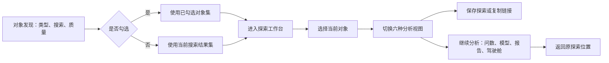
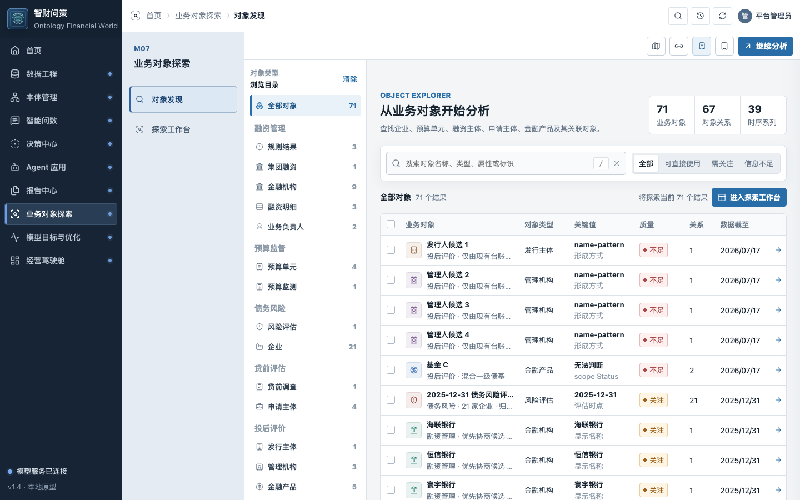
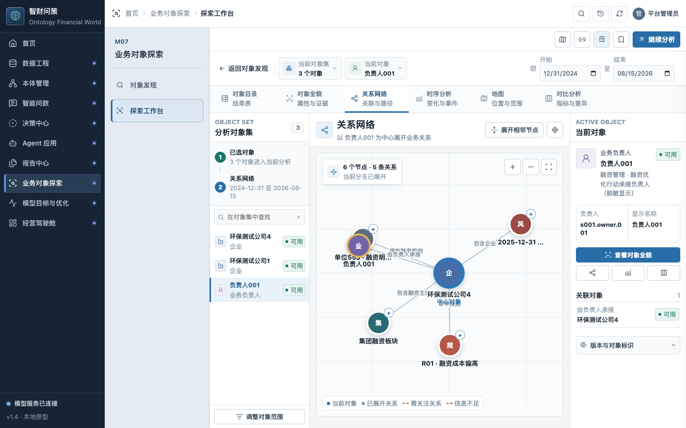

# M07 业务对象探索：使用逻辑与操作指南

M07 是一个围绕业务对象开展调查的工作台。你先确定“研究哪些对象”，再选中其中一个对象，查看它的属性、关系、时间观测、位置以及与其他对象的差异。需要问答、模型计算或交付材料时，再把当前上下文送到问数、模型、驾驶舱或报告中心。

它提供的是组织与探索已有数据的能力。对象定义和数据生产由数据工程、本体管理负责，模型运算由M08负责，审批和事项处理由决策中心负责。M07中的点击、筛选、保存不会修改源融资数据或正式风险评分。

本指南按2026-09-09实施目录的未提交v1.4快照解释。已实际操作的路径及限制见[审查报告](REVIEW-REPORT.md)和[覆盖矩阵](COVERAGE.md)。以下“建议使用”不表示所有能力已通过整体验收。

## 先分清四种状态

|状态|含义|如何改变|容易误解的地方|
|---|---|---|---|
|搜索结果|对象发现页当前列出的对象|类型、搜索词、质量筛选|没有勾选时，进入探索会使用全部搜索结果|
|对象集|此次分析携带的一组对象|勾选/取消勾选，或使用当前搜索结果|已勾选对象可以跨筛选保留；搜索结果数不一定等于对象集数|
|当前对象|目前重点查看的一个对象|进入对象、点击对象集列表、点击关系节点|切换当前对象不等于只分析这一家|
|分析视图（Lens）|同一组对象的一种查看方式|目录、全貌、关系、时序、地图、对比|切换视图通常保留对象集，但每种视图采用的数据范围有区别|

例如：勾选环保测试公司4和环保测试公司1后，对象集是2家；点环保测试公司4，它成为当前对象。对象全貌展示公司4，对比分析可以比较2家。关系图可能显示这2家以外的关联对象；点击外部关联对象时，当前实现会把它加入对象集。

## 一、从对象发现开始

从平台左侧“业务对象探索”进入。当前目录有71个对象、67条关系、39条时序系列和6个事件。39条系列不代表每个对象都有历史趋势，也不代表只有39个观测点。

|业务范围|当前目录内容|
|---|---|
|融资管理|集团融资、规则结果、金融机构、融资明细集合、业务负责人|
|预算监督|4个预算单元、预算监测上下文|
|债务风险|21家企业、评估上下文；部分企业同时具有融资业务身份|
|贷前评估|4个申请主体、贷前调查上下文|
|投后评价|金融产品、投资持仓、投资组合、发行/管理机构候选、位置对象|
|分析交付|报告对象、证据包|

推荐按这5步操作：

1. 左侧选对象类型，例如“企业”。这样先排除银行、持仓和报告等不同类型。
2. 输入对象名称、别名、城市或标识。例如搜索“环保”，或按`ENT-020`找环保测试公司4。它是文本检索，不是自然语言问数，也不会执行“余额大于某数”的条件计算。
3. 如有需要，用“可直接使用/需关注/信息不足”筛选资源质量。**资源质量不等于业务风险等级**：环保测试公司4可以同时显示“可用”和“红灯”。
4. 点击一行先预览，勾选复选框加入对象集。点击行本身不会等同于勾选；箭头“打开对象”则进入该对象的全貌。
5. 点击“进入探索工作台”。已勾选时使用已选对象；未勾选时使用当前全部搜索结果。

“清除搜索”“清除筛选”“清除选择”负责不同状态。如果你已经选了2家，后来搜索另一个名称，原先勾选仍可能保留。进入前看“已选择N个对象”和当前结果数，避免带入旧选择。

**按钮命名需要特别注意：** 发现页右上的“继续分析”是跨模块菜单；真正进入六种视图的按钮是结果区的“进入探索工作台”。初次使用时，建议先进入探索并确认当前对象，再使用“继续分析”。

## 二、理解探索工作台的布局

进入后主要有四部分：上方上下文条、六视图导航、左侧对象集、中间分析区及右侧当前对象信息。

- **上方**：核对对象集数量、当前对象、业务视角、时间范围。对于同时具备融资与债务风险来源的企业，可切换业务视角；这主要影响交接采用的业务身份和版本，不会清空另一来源的属性。
- **左侧**：在已经确定的对象集中切换对象。“在对象集中查找”只帮助定位这组对象，不会替代发现页筛选。
- **中间**：当前视图的主要数据、表格或图形。
- **右侧**：当前对象的重点属性、关联对象和版本信息。

左侧“分析路径”的两步主要表示“对象集→当前视图”，不是完整调查历史，也不是自动推理过程。

## 三、六种视图分别怎么用

|视图|适合回答的问题|主要范围|关键操作|
|---|---|---|---|
|对象目录|这一组对象有哪些，哪些值得看？|当前对象集|扫描表格，点行切换当前对象|
|对象全貌|这个对象是什么，数值和证据从哪里来？|当前对象|切属性、关系、事件、证据分区|
|关系网络|它与谁有关，沿哪条业务关系继续调查？|中心对象及展开的邻居|选节点、点加号展开、收起、缩放、复位|
|时序分析|指标何时变化，当时发生了什么？|对象集中的系列与区间事件|勾选系列、调整起止日期、时间刷选|
|地图|对象在哪里，哪些对象没有坐标？|对象集中有坐标的对象|点位置、缩放、切换关系线|
|对比分析|同类对象在哪些共同指标上不同？|自动选择的可比对象|选指标、数量、条形/点图/雷达|

### 对象目录与对象全貌

目录用于横向扫描。全貌用于单个对象调查，本轮实际查看了环保测试公司4的四个分区：

- **属性**：融资余额393.13亿元、融资成本约2.88%、风险评分23.05分、红灯、融资笔数75等。不同字段来自各自来源，并非都由M07重新计算。
- **关系**：集团融资板块、单位553融资明细集合、负责人001、R01融资成本偏高规则、2025-12-31风险评估上下文。
- **事件**：本快照中该企业有2025-12-31的规则触发事件。
- **证据**：稳定对象ID、数据/本体版本、绑定ID和来源引用。当前证据引用多为定位符及复制入口，不能把“有引用”理解为全部原始文档都可直接下钻打开。

M07显示的“单位553融资明细集合”是原融资数据的聚合对象。公司4的75笔是其来源笔数，不能把目录中的3个“融资明细”对象理解为只有3笔借款。

原目录中只有单位553/465/561对应的3家企业有这份融资来源，其余18家保留融资数据缺失。驾驶舱联合态势为21家企业构造的模拟借款是另一份资源，因此两处明细数量不同不能直接当作数据丢失，也不能混用为同一正式口径。

### 关系网络

先选一个中心对象，再沿关联对象展开。线的文字说明登记的关系类型，例如“拥有融资明细”“由负责人承接”“命中规则”。关系表示记录中的关联，不能自动推导因果或风险已经传染。

本轮以公司4为中心开始，图中有6节点、5关系；展开融资明细集合后达到9节点、8关系。缩放和复位属于图形操作，不修改来源关系。

需要区分：

- **中心对象**是当前关系分支的展开起点。
- **当前对象**是刚点击的节点，右侧信息会跟随它变化；图的中心可能仍保留原对象。
- **对象集**最初可能只有2家企业，选择集合外的负责人等关联节点时会自动扩大。再交给M08前，应检查是否仍是模型可以接收的对象类型。

当前布局存在重叠问题：公司4默认关系图中，“融资明细集合”和“负责人001”节点重叠。本轮点击明细圆心实际选中了负责人，详见R14-017。遇到这种情况，优先从对象全貌的关系列表进入目标，或核对右侧当前对象后再继续，不能只凭圆点位置判断已选中哪个节点。

### 时序分析

系列是“一个对象的一项指标随时间形成的观测”，例如持仓B的当前市值，或信息科技费用的预算执行率。

选择对象后系统默认带入该对象的部分系列，最多同时显示4条。对象集扩大后，可用系列也可能增加，但并不会把全部系列自动画在一起。调整日期或时间刷选会筛选系列观测和区间事件。

几个实际数据例子：

- 公司4的融资余额、融资成本和正式风险评分均只有2025-12-31的一次观测，所以会看到单点，不能据此判断趋势。
- 公司1还有一条短期债务占比系列；本轮选这两家时共有7条可用系列。
- 持仓B的当前市值有79个不规则快照观测，适合学习连续时序操作。
- 信息科技费用的预算执行率有4个2025年观测时点，适合做预算时序演示。

“81个观测时点”是整个资源包提供的可刷选日期集合，不是当前企业有81次观测。区间内无观测应理解为没有该期间数据，不能解释为指标为0。

**当前限制：** 时间控件会影响系列，但静态属性比较仍可能显示2025-12-31的值，即使选择的区间是2026年。详见R14-016。做历史或区间分析时，优先选时间序列指标并核对观测日期，不要把静态快照当作所选期间重新计算的结果。

### 地图

地图只绘制当前对象集中有Point坐标的对象；没有坐标的持仓、负责人等不会因此变成0或自动获得位置。企业坐标为城市级演示布点，不是实际注册地址。

M07地图使用SVG，适合查看已有对象的位置与关系。驾驶舱“融资与风险态势”是另一个MapLibre工作台，包含全球缩放、同屏问数、模拟借款、方案及事项流程，两者数据边界不同。

顶部工具栏“企业地图”是一个快捷重置动作：当前实现会清除选择和搜索，切到全部21家企业并聚焦公司4。六视图中的“地图”则沿用当前对象集。两者不要混用；已有调查范围建议先保存。

### 对比分析

推荐先显式勾选2至4个同类对象，然后再进入对比，避免默认范围过大。

- **条形图**：查看数值高低排序。
- **点图**：查看位置分布和中位数。
- **雷达图**：显示前4个对象、最多5个完全有观测的共同指标，至少需要2对象和3指标。它做的是本组对象内的相对缩放，不是统一风险评分；不同指标方向也不同，面积大不等于好。
- **前8/前16/全部**：控制纳入数量。当前代码先截取对象，再在图上排序；“前8”不是全对象集数值最高8个。想看全体排序应选择“全部对象”。

当前对象集混入负责人等异类时，比较通常优先采用与当前对象同类型的对象，因此上方集合数量与比较数量可以不同。

雷达图会自动挑选指标，单个“对比指标”下拉框不能控制雷达的全部轴。涉及不同规则类型的对象时，当前建议暂用条形图或点图，手动选明确口径。

**必须注意当前缺陷：** “规则指标值（%）”可能把不同规则的指标混在一起。本轮公司4的平均融资成本2.880984%与公司1的短期债务占比93.545164%被放进同一个比较，并计算中位数。这种比较不成立，见R14-015。现阶段请使用“平均融资成本”“融资余额”“风险评分”等明确口径，并检查来源；不要用这个通用字段得出业务结论。

## 四、保存、链接与返回

“保存探索”保存本机的工作状态，包括名称、对象集、当前对象、视图、时间范围、筛选、系列、比较样式/指标、图谱展开和相机等。本轮已实际保存并在重新加载后确认对象集和视图恢复。

它保存的是探索配置与引用，不是一份不可变源数据备份，也不是审批记录。若未来数据目录改变，恢复结果仍依赖相应对象和资源可用。

“复制当前链接”生成完整平台链接，把探索参数编码进`exploration`参数，链接还带模型API地址。适合在同一可访问服务上继续工作。`127.0.0.1`链接只指向打开链接的那台机器，不是可以直接发给其他电脑访问的公开地址。

复制与保存是两种恢复手段。报告中的“返回来源”是第三种：本轮从M07比较加入报告后，再返回能恢复对象集、当前对象、比较指标和时间范围。

## 五、“继续分析”四个去向

|去向|什么时候用|携带什么|当前应注意什么|
|---|---|---|---|
|就此提问|希望用业务语言继续分析当前对象|对象与对象集、时间、版本、证据|问数只支持已登记口径；混合对象/不匹配时间可能被拒绝|
|打开模型目标|需要预测、试算、优化、评测|当前对象、业务域、版本、Lens及返回位置|当前范围必须符合目标合同；本轮混入负责人后被债务模型明确拒绝|
|加入报告|准备交付本次调查材料|当前视图数据、来源、上下文、返回链接|导出内容随Lens变化，并不是简单粘贴一张截图|
|查看驾驶舱|回到管理视角查看对象或结果|当前对象与工作上下文|不同驾驶舱/业务域有各自数据边界，不应默认所有指标相同|

报告导出的实际内容：目录提供对象关键值；全貌提供属性；关系图提供关系明细；地图提供位置记录；比较提供可比较指标数据；时序附所选时间范围内的系列。当前比较导出还会包含其他可比较指标，并非只导出图上选中的那一项，应在报告中心再整理。

本轮M07比较→报告→HTML下载→返回来源已实际走通。M07→M08入口和返回探索入口已核对，但没有在本轮执行模型计算。含负责人等混合集合出现“范围错误”是模型保护，不应通过把它当作企业来绕开。

“就此提问”和“查看驾驶舱”入口也已实际点击：持仓B、4个持仓对象集、时间范围和版本能传递到目标模块；本轮没有继续验证每一种下游问题或评价结果。复制链接已生成，但没有在另一台机器上验证打开。报告中的测试地址会随本轮服务关闭，请在实施工作区自己的预览入口使用这些操作。

## 六、一条适合首次使用的操作路径

1. 打开业务对象探索，在对象发现选“企业”，搜索“环保”。
2. 预览公司4；勾选公司4和公司1，确认“已选2个对象”。
3. 点“进入探索工作台”，在左侧把公司4设为当前对象。
4. 看对象全貌的属性、关系、事件、证据，记住它的`ENT-020`身份和数据截至日。
5. 切关系网络，沿融资明细、规则或负责人展开；每次点完看当前对象及对象集数量，防止误选。
6. 切时序，确认是单快照还是多个观测。有趋势教学需求时，改用持仓B或预算单元。
7. 回到只含两家企业的范围，比较“平均融资成本”或“风险评分”。风险评分低表示更需要关注，不能把所有指标都按越大越好解释。
8. 保存探索，命名为具体业务问题；随后“继续分析→加入报告”。
9. 在报告中心检查对象、时间和指标口径，保留必要内容，再预览/导出；需要复核时点返回来源。

## 当前适合与不适合的用途

适合对象查找、单户资料核对、已登记关系浏览、真实有观测的时序探索、同口径少量对象比较以及形成可返回来源的材料。

目前不应把它当成自动发现任意关系的图谱引擎、自动求最短风险路径的工具、完整历史回放系统或自动决策系统。报告列出的口径、时间和重叠问题解决前，关键结论应回到明确的数据版本和原指标核对。正常驾驶舱WebGL验收状态与M07 SVG地图分开看，不能互相替代。
